                 

# 分布式事务：原理、挑战与解决方案

> 关键词：分布式事务、一致性、ACID、两阶段提交、三阶段提交、乐观锁、悲观锁、分布式事务中间件

> 摘要：本文将深入探讨分布式事务的概念、原理、挑战以及解决方案。从分布式事务的定义入手，逐步分析其与传统事务的区别、重要性、分类及其数据一致性模型。然后，本文将详细阐述分布式事务面临的挑战，包括数据库分区与副本、网络延迟与故障、事务冲突与死锁等问题，并探讨相应的处理策略。接着，本文将介绍分布式事务的解决方案，包括两阶段提交协议、三阶段提交协议、乐观锁与悲观锁、分布式事务中间件等。最后，通过实际案例展示解决方案的应用，并展望分布式事务的未来发展趋势。

## 《分布式事务：原理、挑战与解决方案》目录大纲

### 第1章 分布式事务概述

- 1.1 分布式事务的定义
- 1.2 分布式事务与传统事务的区别
- 1.3 分布式事务的重要性
- 1.4 分布式事务的分类

### 第2章 分布式事务的原理

- 2.1 数据一致性模型
  - 2.1.1 单一数据库一致性
  - 2.1.2 多数据库一致性
  - 2.1.3 分布式一致性模型
- 2.2 分布式事务的ACID特性
  - 2.2.1 原子性（Atomicity）
  - 2.2.2 一致性（Consistency）
  - 2.2.3 孤立性（Isolation）
  - 2.2.4 持久性（Durability）

### 第3章 分布式事务的挑战

- 3.1 数据库分区与副本
  - 3.1.1 数据库分区策略
  - 3.1.2 数据库副本策略
- 3.2 网络延迟与故障
  - 3.2.1 网络延迟的影响
  - 3.2.2 故障处理策略
- 3.3 事务冲突与死锁
  - 3.3.1 事务冲突
  - 3.3.2 死锁处理策略

### 第4章 分布式事务解决方案

- 4.1 两阶段提交协议
  - 4.1.1 两阶段提交协议的原理
  - 4.1.2 两阶段提交协议的优缺点
- 4.2 三阶段提交协议
  - 4.2.1 三阶段提交协议的原理
  - 4.2.2 三阶段提交协议的优缺点
- 4.3 乐观锁与悲观锁
  - 4.3.1 乐观锁的原理
  - 4.3.2 悲观锁的原理
  - 4.3.3 乐观锁与悲观锁的比较
- 4.4 分布式事务中间件
  - 4.4.1 分布式事务中间件的概念
  - 4.4.2 分布式事务中间件的工作原理
  - 4.4.3 常见的分布式事务中间件

### 第5章 分布式事务实战案例

- 5.1 案例一：电商平台中的分布式事务
- 5.2 案例二：金融系统中的分布式事务

### 第6章 分布式事务的未来发展趋势

- 6.1 新的一致性协议
  - 6.1.1 PACELC协议
  - 6.1.2 GCP协议
- 6.2 分布式事务的新技术
  - 6.2.1 分布式事务中间件的演进
  - 6.2.2 新型分布式数据库
  - 6.2.3 云原生分布式事务

### 附录

- 附录A：分布式事务常用工具
- 附录B：分布式事务参考资料

## 第1章 分布式事务概述

### 1.1 分布式事务的定义

分布式事务是指跨越多个数据库或服务的事务，这些数据库或服务可能分布在不同的物理位置或网络上。与传统单机事务不同，分布式事务需要解决跨服务、跨网络的一致性问题。

**背景介绍**

随着互联网和云计算的迅猛发展，分布式系统成为现代应用的主流架构。在这种架构下，数据往往分布在多个节点上，而分布式事务则是保证数据一致性的关键技术。

**问题背景**

在分布式系统中，多个服务或数据库之间的操作往往需要同时进行，以确保业务流程的完整性和一致性。例如，电商平台中的订单处理需要同时更新库存、订单和支付状态。

**问题描述**

如何在一个分布式系统中，保证多个服务或数据库之间的操作能够同时成功或同时失败，从而保证数据的一致性？

**问题解决**

分布式事务通过一系列机制，如两阶段提交、三阶段提交等，确保跨多个数据库或服务的操作能够一致性地执行。

**边界与外延**

分布式事务不仅涉及数据库，还可能包括消息队列、缓存等其他分布式服务。

**概念结构与核心要素组成**

- 分布式系统
- 数据库或服务
- 事务
- 一致性
- 协议（如两阶段提交、三阶段提交）

### 1.2 分布式事务与传统事务的区别

传统事务主要针对单机环境，其特点是数据存储在本地，事务操作相对简单。而分布式事务则需要解决跨网络、跨服务的数据一致性问题。

**核心概念与联系**

- **传统事务**：原子性、一致性、隔离性、持久性（ACID）
- **分布式事务**：原子性、一致性、隔离性、持久性（ACID），但实现机制更为复杂

**概念属性特征对比表格**

| 特性       | 传统事务                                   | 分布式事务                                 |
| ---------- | ------------------------------------------ | ------------------------------------------- |
| 数据存储   | 本地数据库                                 | 分布在不同节点的数据库                     |
| 事务范围   | 单个数据库或服务                           | 跨多个数据库或服务                         |
| 一致性保证 | 数据库层面的本地一致性                     | 需要跨网络和跨服务的一致性保证             |
| 隔离级别   | 较低的隔离级别（如Read Committed）         | 较高的隔离级别（如Serializable）            |
| 持久性保证 | 本地事务的持久性                          | 需要分布式事务协议保证持久性               |

### 1.3 分布式事务的重要性

分布式事务在分布式系统中至关重要，它确保了数据的一致性和业务流程的完整性。

**核心概念与联系**

- **数据一致性**：分布式事务通过一致性协议，如两阶段提交、三阶段提交，确保跨多个数据库或服务的操作一致。
- **业务完整性**：分布式事务确保业务流程的每一步都能正确执行，从而保证整个业务流程的完整性。

**原理说明**

分布式事务通过一致性协议，协调跨多个数据库或服务的操作，确保在多节点环境中数据的一致性。例如，两阶段提交协议通过协调事务协调者和参与者，确保分布式事务的原子性和一致性。

**ER实体关系图架构**

```mermaid
erDiagram
    Transaction ||--|{ Resource }
    Resource   ||--|{ Participant }
```

在这个ER图结构中，Transaction表示分布式事务，Resource表示数据库或服务，Participant表示事务参与者。事务与资源之间是一对多的关系，即一个事务可以关联多个资源，资源与参与者之间也是一对多的关系，即一个资源可以关联多个参与者。

### 1.4 分布式事务的分类

分布式事务可以根据一致性模型和数据一致性要求的不同，分为多种类型。

**核心概念与联系**

- **强一致性**：保证分布式系统中所有节点都能看到相同的数据状态，如两阶段提交协议。
- **最终一致性**：允许在分布式系统中存在短暂的数据不一致，但最终会达到一致状态，如事件溯源。

**分类**

1. **强一致性**
   - **两阶段提交协议**：确保跨多个数据库或服务的事务一致性。
   - **Paxos算法**：用于分布式系统中的领导人选举和一致性保证。

2. **最终一致性**
   - **事件溯源**：通过记录事件日志，逐步达到最终一致性。
   - **Causality Consistency**：基于因果关系的最终一致性模型。

### 第2章 分布式事务的原理

### 2.1 数据一致性模型

分布式事务的一致性模型是保证数据在不同节点之间的一致性的关键。这些模型包括单一数据库一致性、多数据库一致性和分布式一致性模型。

#### 2.1.1 单一数据库一致性

单一数据库一致性是指在单机环境下，数据库能够保证事务的ACID特性。这种一致性模型相对简单，因为所有操作都在同一台数据库服务器上执行，无需跨节点协调。

**原理说明**

在单机环境下，数据库管理系统（DBMS）通过事务日志和锁机制来保证事务的原子性、一致性、隔离性和持久性。

**Mermaid流程图**

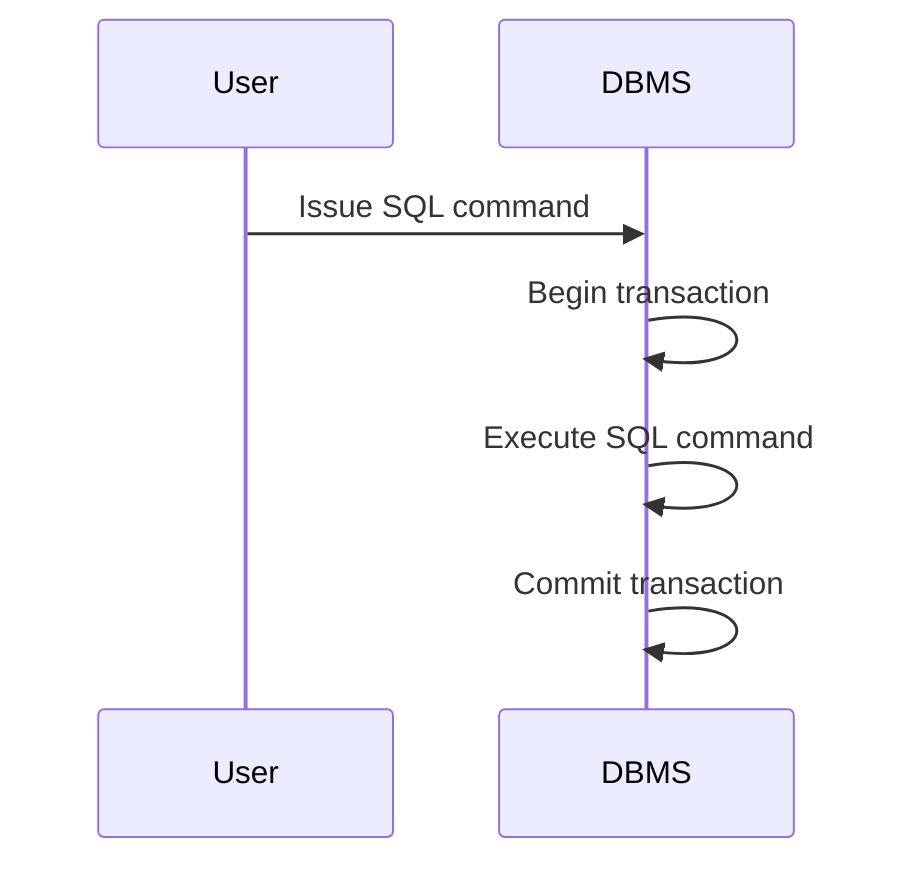

在这个流程图中，用户向数据库管理系统（DBMS）发送SQL命令，DBMS开始新的事务，执行SQL命令，并在所有命令执行成功后提交事务。

#### 2.1.2 多数据库一致性

多数据库一致性是指在同一分布式系统中，多个数据库需要保证事务的一致性。这种模型比单一数据库一致性更复杂，因为它涉及到跨节点的协调。

**原理说明**

多数据库一致性通常需要分布式事务协议，如两阶段提交协议或三阶段提交协议，来确保跨多个数据库的事务能够一致性地执行。

**Mermaid流程图**

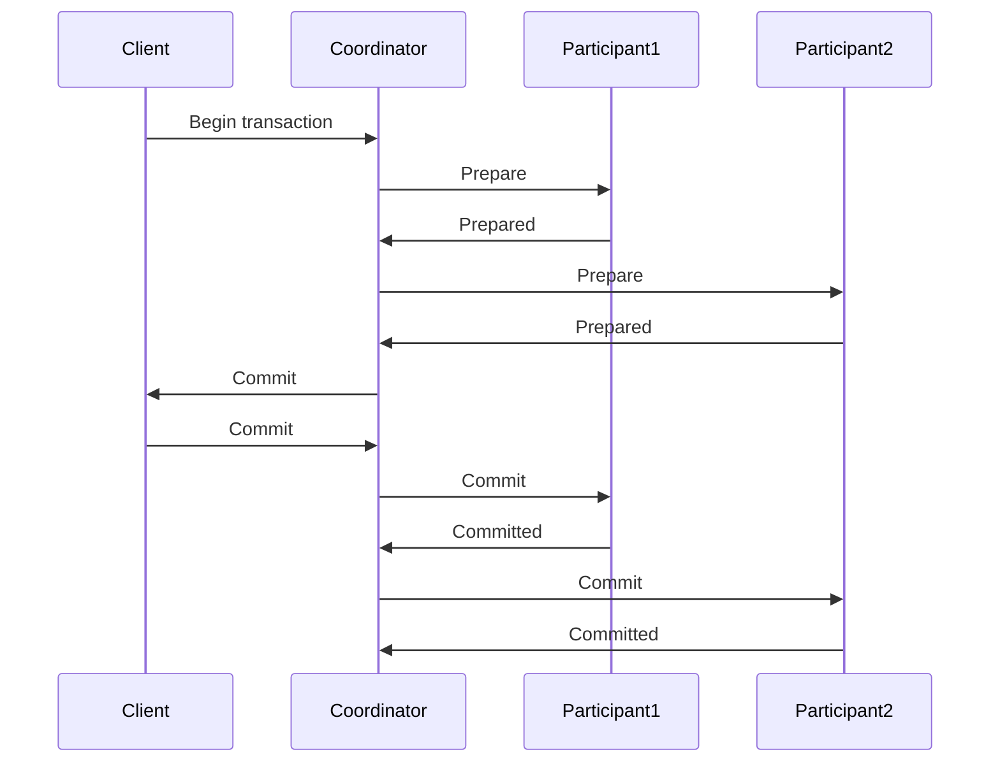

在这个流程图中，客户端开始分布式事务，协调器与参与者协商，确保所有参与者都准备好执行事务，然后客户端决定提交事务。协调器通知所有参与者提交事务，并在所有参与者确认提交后，事务最终完成。

#### 2.1.3 分布式一致性模型

分布式一致性模型是在跨多个分布式系统的环境下，保证数据一致性的一种方法。这种模型通常基于最终一致性原则，允许在分布式系统中存在短暂的数据不一致。

**原理说明**

分布式一致性模型通常使用事件溯源或因果一致性等机制，通过记录事件日志或基于因果关系的逻辑，逐步达到最终一致性。

**Mermaid流程图**

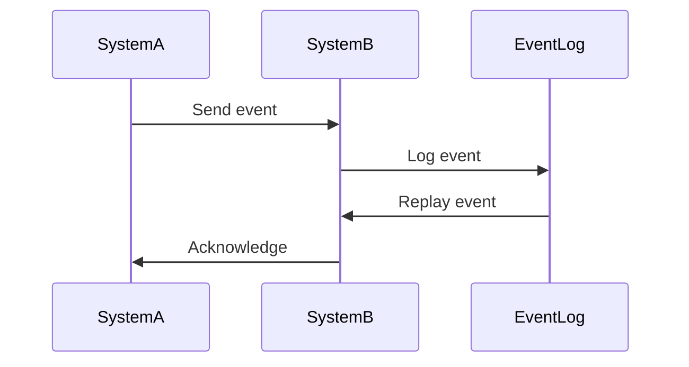

在这个流程图中，系统A发送事件到系统B，系统B将事件记录到事件日志，并重放事件以更新状态，然后向系统A确认事件处理完成。

### 2.2 分布式事务的ACID特性

分布式事务的ACID特性是确保数据一致性、可靠性和持久性的关键。这些特性包括原子性、一致性、隔离性和持久性。

#### 2.2.1 原子性（Atomicity）

原子性是指事务中的所有操作要么全部成功，要么全部失败。这意味着在分布式事务中，如果任何一个操作失败，所有操作都将回滚。

**原理说明**

分布式事务通过两阶段提交协议或三阶段提交协议来确保原子性。在这些协议中，协调器与参与者协商，确保所有参与者都准备好执行事务，然后客户端决定提交事务。如果任何一个参与者无法准备就绪，事务将回滚。

**Python源代码**

```python
def distributed_commit(coordinator, participants):
    coordinator.prepare(participants)
    if coordinator.all_prepared():
        client.commit()
        coordinator.commit(participants)
    else:
        coordinator.rollback(participants)
```

在这个Python函数中，`distributed_commit`函数调用协调器的`prepare`方法，检查所有参与者是否准备好。如果所有参与者都准备好，客户端提交事务，协调器提交所有参与者。否则，事务回滚。

#### 2.2.2 一致性（Consistency）

一致性是指事务执行后，数据库或服务中的数据状态必须符合预定的规则或业务逻辑。

**原理说明**

分布式事务的一致性通常通过分布式事务协议来实现，如两阶段提交或三阶段提交协议。这些协议确保跨多个数据库或服务的操作能够一致性地执行。

**Mermaid流程图**

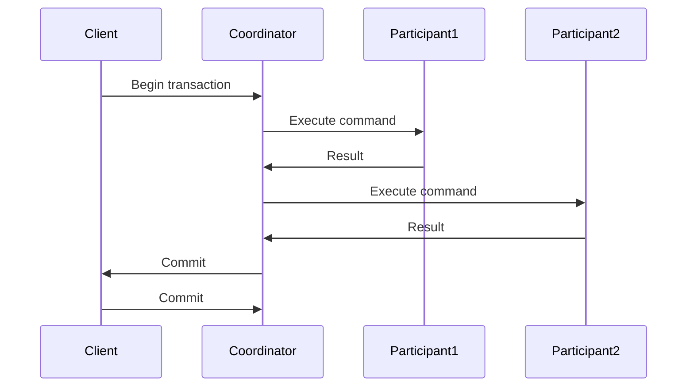

在这个流程图中，客户端开始分布式事务，协调器与参与者协商执行命令，并在所有参与者返回结果后，客户端提交事务。

#### 2.2.3 孤立性（Isolation）

孤立性是指事务之间的操作不能互相干扰。这意味着一个事务的执行不能看到另一个事务的中间状态。

**原理说明**

分布式事务的孤立性通常通过锁机制或乐观锁/悲观锁机制来实现。这些机制确保事务在执行时不会受到其他事务的影响。

**Mermaid流程图**

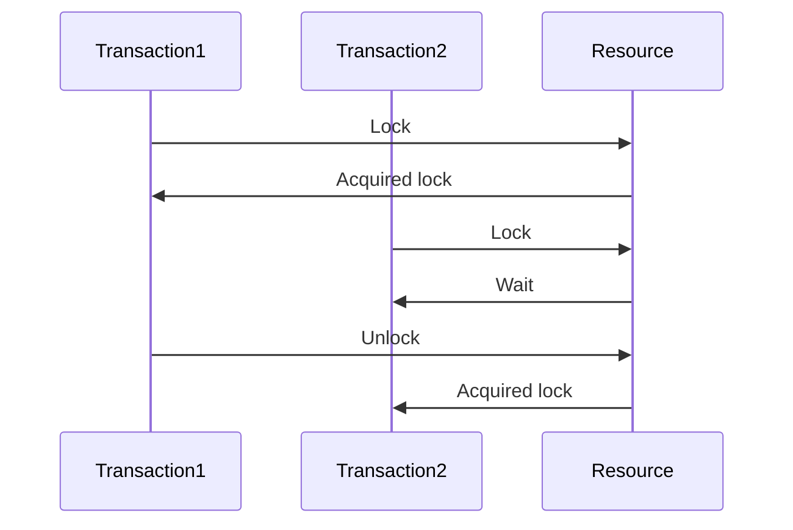

在这个流程图中，事务1和事务2尝试锁定资源。如果资源被事务1锁定，事务2将等待直到事务1释放锁。

#### 2.2.4 持久性（Durability）

持久性是指一旦事务提交成功，其结果将永久保存，即使系统发生故障也不会丢失。

**原理说明**

分布式事务的持久性通常通过事务日志或分布式存储来实现。事务日志记录所有事务的操作，以便在系统故障时进行恢复。

**Mermaid流程图**

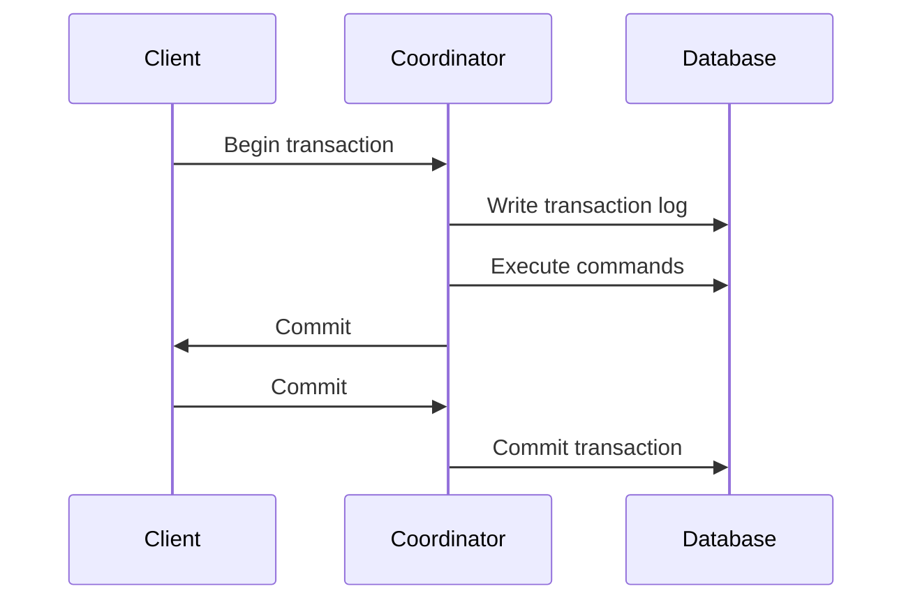

在这个流程图中，客户端开始分布式事务，协调器将事务日志写入数据库，并执行事务命令。在客户端提交事务后，协调器提交事务到数据库，确保事务结果持久化。

### 第3章 分布式事务的挑战

分布式事务在分布式系统中面临着多种挑战，这些挑战包括数据库分区与副本、网络延迟与故障、事务冲突与死锁等问题。

#### 3.1 数据库分区与副本

数据库分区与副本是分布式系统中常见的策略，用于提高系统的性能和可用性。然而，这些策略也会带来一些挑战。

##### 3.1.1 数据库分区策略

数据库分区策略是将数据分布在多个物理节点上，以提高查询效率和负载均衡。常见的分区策略包括：

1. **范围分区**：根据数据的某个属性（如时间、ID）将数据划分为不同的分区。
2. **哈希分区**：使用哈希函数将数据划分为不同的分区。

**原理说明**

范围分区和哈希分区都有各自的优点和缺点。范围分区适合于基于范围的查询，而哈希分区适合于随机查询。

**Mermaid流程图**

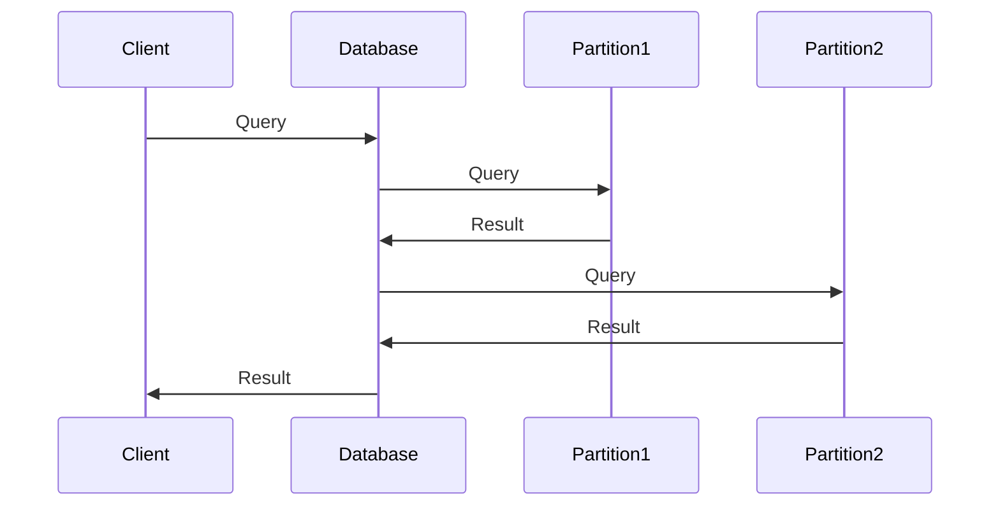

在这个流程图中，客户端发送查询到数据库，数据库将查询分发给不同的分区，每个分区处理查询并返回结果。

##### 3.1.2 数据库副本策略

数据库副本策略是将数据复制到多个节点上，以提高系统的可用性和容错性。常见的副本策略包括：

1. **主从复制**：主节点负责处理事务，从节点负责读取数据。
2. **多主复制**：多个节点都可以处理事务。

**原理说明**

主从复制提高了读性能，但写入性能可能受到影响。多主复制提高了写入性能，但可能导致数据不一致。

**Mermaid流程图**

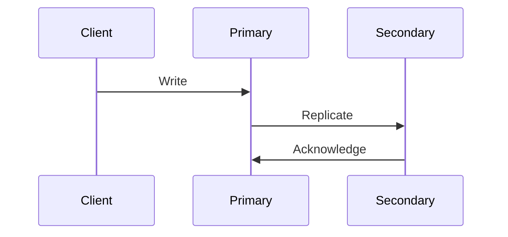

在这个流程图中，客户端向主节点写入数据，主节点将数据复制到从节点，并等待从节点的确认。

#### 3.2 网络延迟与故障

网络延迟与故障是分布式系统中不可避免的挑战，它们会影响分布式事务的一致性和可靠性。

##### 3.2.1 网络延迟的影响

网络延迟可能导致事务执行时间延长，从而影响系统的性能和响应时间。长时间的网络延迟可能导致事务超时或失败。

**原理说明**

网络延迟可以通过优化网络拓扑结构、使用更快的网络设备或采用分布式缓存等措施来减轻。

**Mermaid流程图**

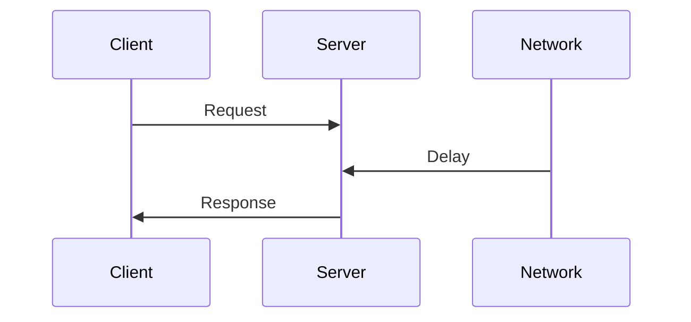

在这个流程图中，客户端发送请求到服务器，网络延迟导致服务器响应时间延长。

##### 3.2.2 故障处理策略

故障处理策略是确保分布式系统在发生故障时能够快速恢复的关键。常见的故障处理策略包括：

1. **自动切换**：在主节点故障时，自动切换到备用节点。
2. **副本恢复**：在主节点故障时，从节点自动升级为主节点。

**原理说明**

自动切换可以通过心跳机制或故障检测算法来实现。副本恢复可以通过预分配的备份节点或自动化恢复流程来实现。

**Mermaid流程图**

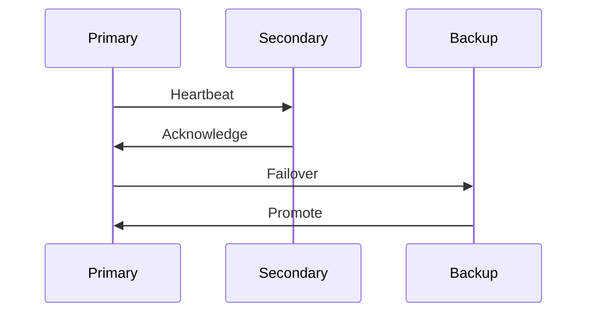

在这个流程图中，主节点通过心跳与从节点通信，当主节点故障时，从节点自动升级为主节点。

#### 3.3 事务冲突与死锁

事务冲突与死锁是分布式系统中常见的问题，它们会影响系统的性能和可靠性。

##### 3.3.1 事务冲突

事务冲突是指多个事务对同一资源进行操作时，可能会导致数据不一致或事务失败。

**原理说明**

事务冲突可以通过锁机制、乐观锁或悲观锁来解决。锁机制通过锁定资源来防止其他事务访问，乐观锁通过版本控制来减少锁的使用，悲观锁则在事务开始时就锁定资源。

**Mermaid流程图**


在这个流程图中，事务1和事务2尝试锁定资源，事务1释放锁后，事务2才能获得锁。

##### 3.3.2 死锁处理策略

死锁是指多个事务在等待对方释放资源时陷入循环等待的状态。

**原理说明**

死锁处理策略可以通过预防死锁、检测死锁和解决死锁来实现。预防死锁可以通过避免循环依赖来减少死锁的可能性，检测死锁可以通过周期性地检查事务等待图来发现死锁，解决死锁可以通过终止或重试事务来解除死锁。

**Mermaid流程图**

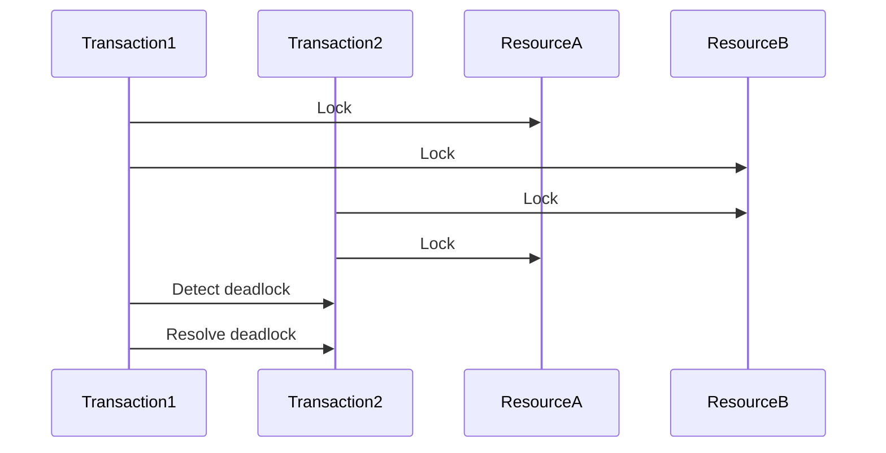

在这个流程图中，事务1和事务2尝试锁定资源，由于循环依赖，系统检测到死锁并尝试解决死锁。

### 第4章 分布式事务解决方案

分布式事务的解决方案主要包括两阶段提交协议、三阶段提交协议、乐观锁与悲观锁以及分布式事务中间件。这些解决方案旨在解决分布式事务的一致性和可靠性问题。

#### 4.1 两阶段提交协议

两阶段提交协议（2PC，Two-Phase Commit Protocol）是一种分布式事务协调协议，用于确保跨多个数据库或服务的事务一致性。两阶段提交协议分为两个阶段：准备阶段和提交阶段。

##### 4.1.1 两阶段提交协议的原理

两阶段提交协议的原理如下：

1. **准备阶段**：协调器向所有参与者发送准备消息，参与者执行预提交检查，并向协调器回复准备状态。
2. **提交阶段**：协调器收到所有参与者的准备状态后，决定是否提交事务。如果所有参与者都准备好，协调器向所有参与者发送提交消息，参与者执行提交操作。如果任何一个参与者未准备好，协调器向所有参与者发送回滚消息，参与者执行回滚操作。

**原理说明**

两阶段提交协议通过协调器和参与者的协同工作，确保分布式事务的一致性。它具有以下优点：

- **简单性**：两阶段提交协议的流程相对简单，易于理解和使用。
- **可靠性**：两阶段提交协议通过协调器和参与者的多重确认，确保事务的一致性。

**Mermaid流程图**


在这个流程图中，客户端开始分布式事务，协调器与参与者协商，确保所有参与者都准备好执行事务，然后客户端决定提交事务。协调器通知所有参与者提交事务，并在所有参与者确认提交后，事务最终完成。

##### 4.1.2 两阶段提交协议的优缺点

两阶段提交协议具有以下优点：

- **一致性**：两阶段提交协议确保分布式事务的一致性，确保所有参与者都能看到相同的数据状态。
- **可靠性**：两阶段提交协议通过多重确认，确保事务的可靠性。

但两阶段提交协议也存在一些缺点：

- **性能开销**：两阶段提交协议需要多次网络通信，性能开销较大，可能导致事务延迟。
- **单点故障**：协调器是两阶段提交协议的单点故障点，如果协调器故障，可能导致事务无法完成。

#### 4.2 三阶段提交协议

三阶段提交协议（3PC，Three-Phase Commit Protocol）是两阶段提交协议的改进版本，旨在解决两阶段提交协议中的性能问题和单点故障问题。

##### 4.2.1 三阶段提交协议的原理

三阶段提交协议分为三个阶段：注册阶段、准备阶段和提交阶段。

1. **注册阶段**：客户端向协调器发送注册消息，协调器将客户端的状态记录在日志中。
2. **准备阶段**：协调器向所有参与者发送准备消息，参与者执行预提交检查，并向协调器回复准备状态。
3. **提交阶段**：协调器收到所有参与者的准备状态后，决定是否提交事务。如果所有参与者都准备好，协调器向所有参与者发送提交消息，参与者执行提交操作。如果任何一个参与者未准备好，协调器向所有参与者发送回滚消息，参与者执行回滚操作。

**原理说明**

三阶段提交协议通过引入注册阶段，将协调器的工作负载转移到客户端，从而提高了系统的性能。此外，三阶段提交协议通过日志记录，解决了两阶段提交协议中的单点故障问题。

**Mermaid流程图**

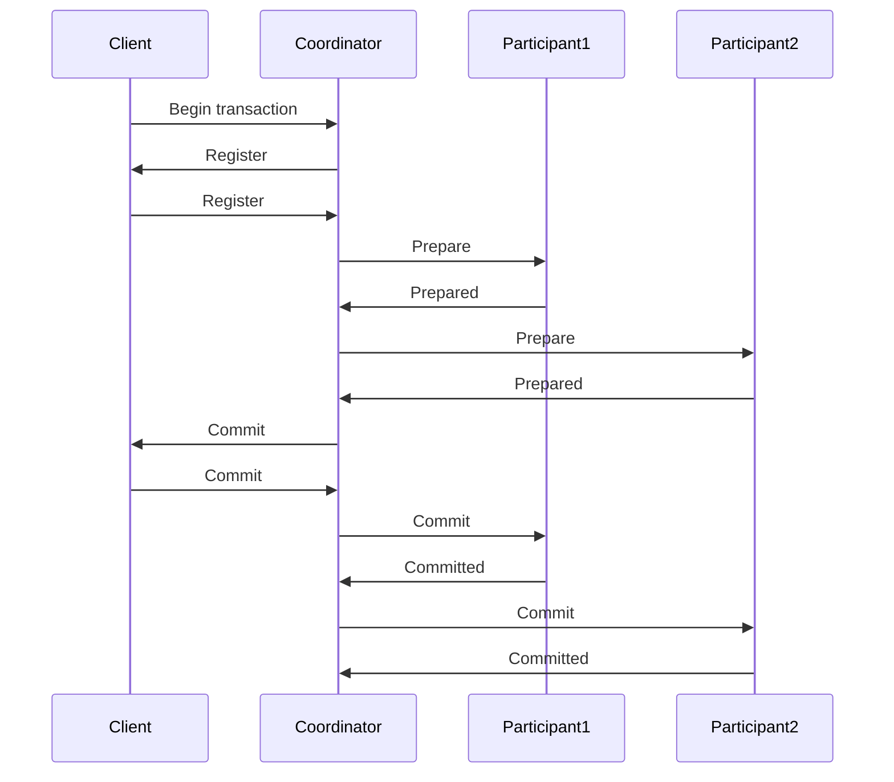

在这个流程图中，客户端开始分布式事务，向协调器注册事务，协调器与参与者协商，确保所有参与者都准备好执行事务，然后客户端决定提交事务。协调器通知所有参与者提交事务，并在所有参与者确认提交后，事务最终完成。

##### 4.2.2 三阶段提交协议的优缺点

三阶段提交协议具有以下优点：

- **性能提升**：三阶段提交协议通过引入注册阶段，减少了协调器的工作负载，提高了系统的性能。
- **容错性增强**：三阶段提交协议通过日志记录，解决了两阶段提交协议中的单点故障问题。

但三阶段提交协议也存在一些缺点：

- **复杂性增加**：三阶段提交协议的流程比两阶段提交协议更复杂，实现和维护难度较大。
- **性能开销**：三阶段提交协议仍然需要多次网络通信，性能开销仍然较大。

#### 4.3 乐观锁与悲观锁

乐观锁和悲观锁是分布式事务中的两种锁机制，用于解决事务冲突问题。

##### 4.3.1 乐观锁的原理

乐观锁是基于乐观假设的锁机制，即假设并发事务不会发生冲突，只在提交时检查数据的版本或状态，确保数据的一致性。

**原理说明**

乐观锁通过在数据表中添加版本号或时间戳字段，在每个事务开始时读取数据版本或时间戳，并在提交时检查版本或时间戳是否发生变化。如果发生变化，表示其他事务已经修改了数据，当前事务将回滚。

**Python源代码**

```python
def optimistic_lock(entity, version):
    current_version = entity['version']
    if current_version != version:
        raise OptimisticLockException("Data has been modified by another transaction")
```

在这个Python函数中，`optimistic_lock`函数检查当前数据版本是否与预期版本一致。如果不一致，表示数据已被修改，抛出乐观锁异常。

##### 4.3.2 悲观锁的原理

悲观锁是基于悲观假设的锁机制，即假设并发事务一定会发生冲突，因此在事务开始时就锁定资源，确保数据的一致性。

**原理说明**

悲观锁通过在数据表中添加行级锁或共享锁，在每个事务开始时锁定资源，防止其他事务访问该资源。悲观锁通常使用数据库提供的锁机制来实现。

**Mermaid流程图**


在这个流程图中，事务1和事务2尝试锁定资源。事务1释放锁后，事务2才能获得锁。

##### 4.3.3 乐观锁与悲观锁的比较

乐观锁和悲观锁各有优缺点，适用于不同的场景。

| 对比项         | 乐观锁                                       | 悲观锁                                       |
| -------------- | -------------------------------------------- | -------------------------------------------- |
| 加锁时机       | 提交时检查版本或状态                          | 事务开始时锁定资源                           |
| 锁类型         | 轻量级，基于版本控制或时间戳                  | 行级锁或共享锁，基于数据库提供的锁机制       |
| 性能影响       | 减少锁的使用，提高并发性能                    | 增加锁的使用，可能降低并发性能                |
| 适用场景       | 高并发场景，冲突较少                          | 低并发场景，冲突较多                         |

#### 4.4 分布式事务中间件

分布式事务中间件是用于管理和协调分布式事务的软件，它提供了一种简化分布式事务管理的机制。常见的分布式事务中间件包括Seata、TCC、SAGA等。

##### 4.4.1 分布式事务中间件的概念

分布式事务中间件是一种在分布式系统中提供分布式事务管理的组件，它负责协调分布式事务的执行、提交和回滚。分布式事务中间件通常提供以下功能：

- **事务协调**：协调分布式事务的执行，确保事务的一致性。
- **事务监控**：监控分布式事务的执行状态，提供事务回滚和补偿机制。
- **分布式锁**：提供分布式锁机制，解决事务冲突问题。

##### 4.4.2 分布式事务中间件的工作原理

分布式事务中间件的工作原理通常包括以下几个步骤：

1. **初始化**：分布式事务中间件在系统启动时初始化，加载配置和依赖。
2. **事务提交**：客户端发起分布式事务，分布式事务中间件协调参与者的执行，确保事务的一致性。
3. **事务监控**：分布式事务中间件监控事务的执行状态，提供事务回滚和补偿机制。
4. **事务回滚**：如果事务执行失败，分布式事务中间件协调参与者的回滚，确保事务的一致性。

##### 4.4.3 常见的分布式事务中间件

常见的分布式事务中间件包括：

1. **Seata**：Seata是一个开源的分布式事务中间件，支持两阶段提交协议和补偿事务。
2. **TCC**：TCC（Try-Confirm-Cancel）是一种基于补偿事务的分布式事务解决方案。
3. **SAGA**：SAGA是一种基于最终一致性的分布式事务解决方案，通过事件溯源和补偿事务来实现。

### 第5章 分布式事务实战案例

#### 5.1 案例一：电商平台中的分布式事务

##### 5.1.1 案例背景

电商平台是一个典型的分布式系统，它涉及到多个服务，如订单服务、库存服务、支付服务等。这些服务需要协同工作，以确保订单的创建、库存的更新和支付的完成。

##### 5.1.2 案例解决方案

电商平台采用两阶段提交协议来保证分布式事务的一致性。具体步骤如下：

1. **订单创建**：客户端向订单服务发起订单创建请求，订单服务开始分布式事务。
2. **库存扣减**：订单服务向库存服务发送扣减库存的请求，库存服务执行库存扣减操作。
3. **支付处理**：订单服务向支付服务发送支付请求，支付服务执行支付操作。
4. **提交事务**：订单服务收到库存服务和支付服务的响应后，向分布式事务中间件提交事务。
5. **事务确认**：分布式事务中间件协调库存服务和支付服务的参与者，确保所有参与者都准备好执行事务，然后客户端确认提交事务。
6. **事务完成**：分布式事务中间件提交所有参与者的事务，订单创建成功。

##### 5.1.3 案例分析与总结

电商平台采用两阶段提交协议，确保订单创建、库存扣减和支付处理的事务一致性。两阶段提交协议具有以下优点：

- **一致性**：两阶段提交协议确保分布式事务的一致性，确保所有参与者都能看到相同的数据状态。
- **可靠性**：两阶段提交协议通过多重确认，确保事务的可靠性。

但两阶段提交协议也存在一些缺点：

- **性能开销**：两阶段提交协议需要多次网络通信，性能开销较大，可能导致事务延迟。
- **单点故障**：协调器是两阶段提交协议的单点故障点，如果协调器故障，可能导致事务无法完成。

#### 5.2 案例二：金融系统中的分布式事务

##### 5.2.1 案例背景

金融系统是一个高度依赖分布式事务的领域，它涉及到多个服务，如账户服务、交易服务、结算服务等。这些服务需要协同工作，以确保账户的更新、交易的执行和结算的完成。

##### 5.2.2 案例解决方案

金融系统采用三阶段提交协议来保证分布式事务的一致性。具体步骤如下：

1. **账户更新**：客户端向账户服务发起账户更新请求，账户服务开始分布式事务。
2. **交易执行**：账户服务向交易服务发送交易请求，交易服务执行交易操作。
3. **结算处理**：账户服务向结算服务发送结算请求，结算服务执行结算操作。
4. **提交事务**：账户服务收到交易服务和结算服务的响应后，向分布式事务中间件提交事务。
5. **注册阶段**：分布式事务中间件向所有参与者发送注册消息，参与者记录事务状态。
6. **准备阶段**：分布式事务中间件向所有参与者发送准备消息，参与者执行预提交检查，并向分布式事务中间件回复准备状态。
7. **提交阶段**：分布式事务中间件收到所有参与者的准备状态后，决定是否提交事务。如果所有参与者都准备好，分布式事务中间件向所有参与者发送提交消息，参与者执行提交操作。如果任何一个参与者未准备好，分布式事务中间件向所有参与者发送回滚消息，参与者执行回滚操作。
8. **事务完成**：分布式事务中间件提交所有参与者的事务，账户更新、交易执行和结算处理成功。

##### 5.2.3 案例分析与总结

金融系统采用三阶段提交协议，确保账户更新、交易执行和结算处理的事务一致性。三阶段提交协议具有以下优点：

- **性能提升**：三阶段提交协议通过引入注册阶段，减少了协调器的工作负载，提高了系统的性能。
- **容错性增强**：三阶段提交协议通过日志记录，解决了两阶段提交协议中的单点故障问题。

但三阶段提交协议也存在一些缺点：

- **复杂性增加**：三阶段提交协议的流程比两阶段提交协议更复杂，实现和维护难度较大。
- **性能开销**：三阶段提交协议仍然需要多次网络通信，性能开销仍然较大。

### 第6章 分布式事务的未来发展趋势

#### 6.1 新的一致性协议

随着分布式系统的不断发展，新的分布式一致性协议不断涌现，以应对分布式事务的一致性问题。以下介绍两种新的一致性协议：PACELC协议和GCP协议。

##### 6.1.1 PACELC协议

PACELC（Progressively Advancing Consistency, Latency, and Cost）协议是一种基于成本、延迟和一致性的分布式一致性协议。PACELC协议的核心思想是，在保证最终一致性的同时，根据实际需求和成本进行灵活调整。

**原理说明**

PACELC协议通过引入一致性等级（Consistency Levels），如强一致性、最终一致性和因果一致性，来平衡一致性、延迟和成本。具体而言，PACELC协议根据应用场景和性能需求，动态调整一致性等级，从而实现最优的性能和成本效益。

**Mermaid流程图**

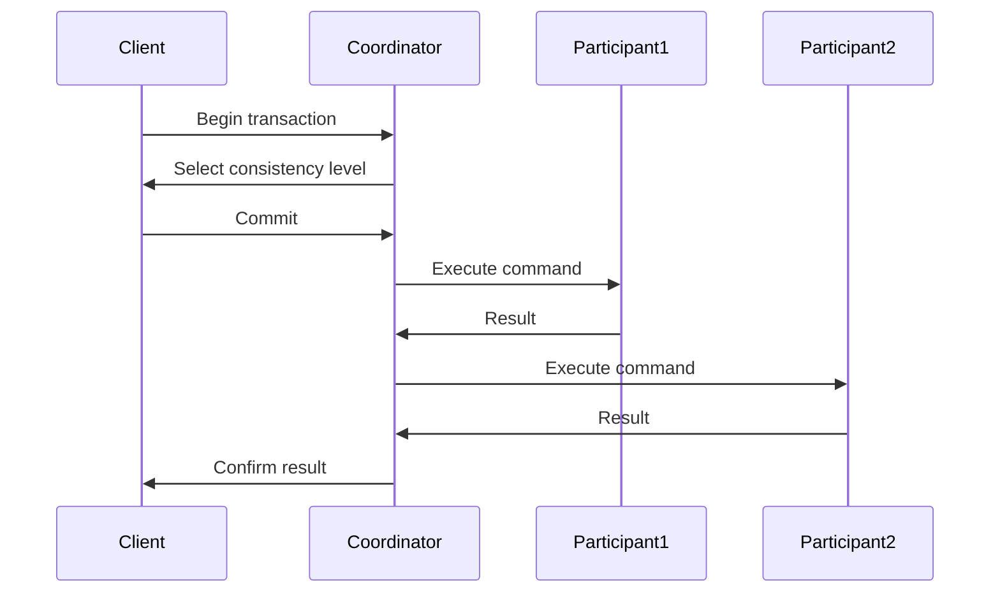

在这个流程图中，客户端选择一致性等级，协调器根据一致性等级执行分布式事务，并在所有参与者返回结果后，确认事务结果。

##### 6.1.2 GCP协议

GCP（Globally Consistent Snapshot）协议是一种基于全局快照的分布式一致性协议。GCP协议的核心思想是通过全局快照来保证分布式系统的一致性。

**原理说明**

GCP协议在分布式事务开始时，将系统状态拍成一张全局快照，然后根据快照执行事务。这样，即使分布式系统中存在故障，系统仍然能够根据全局快照恢复到一致状态。

**Mermaid流程图**

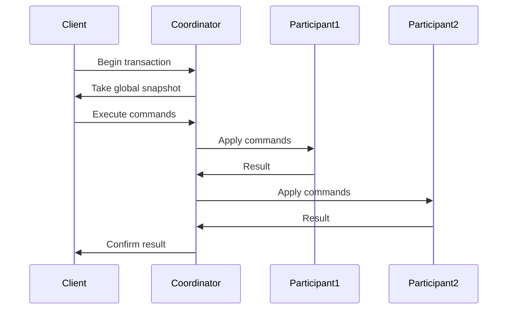

在这个流程图中，客户端开始分布式事务，协调器拍摄全局快照，然后根据快照执行事务，并在所有参与者返回结果后，确认事务结果。

#### 6.2 分布式事务的新技术

随着分布式系统技术的发展，新的分布式事务技术不断涌现，以应对分布式事务的一致性、可靠性和性能问题。以下介绍几种新的分布式事务技术：分布式事务中间件的演进、新型分布式数据库和云原生分布式事务。

##### 6.2.1 分布式事务中间件的演进

分布式事务中间件在过去几年中得到了快速发展，其功能不断完善。以下介绍分布式事务中间件的一些演进趋势：

1. **支持多种一致性协议**：分布式事务中间件开始支持多种一致性协议，如PACELC协议和GCP协议，以适应不同应用场景。
2. **支持云原生架构**：分布式事务中间件开始支持云原生架构，以适应云原生环境的需要。
3. **提供一站式解决方案**：分布式事务中间件开始提供一站式解决方案，包括分布式事务管理、分布式锁、分布式队列等。

##### 6.2.2 新型分布式数据库

新型分布式数据库是分布式事务技术的一个重要发展方向。以下介绍几种新型分布式数据库：

1. **Cassandra**：Cassandra是一种基于分布式哈希表的分布式数据库，具有高可用性和高性能的特点。
2. **HBase**：HBase是一种基于Hadoop的分布式数据库，适合存储大规模数据。
3. **MongoDB**：MongoDB是一种文档型分布式数据库，支持高扩展性和高性能。

##### 6.2.3 云原生分布式事务

云原生分布式事务是分布式事务技术的一个新兴领域，旨在解决云原生环境中的分布式事务问题。以下介绍云原生分布式事务的一些关键特性：

1. **弹性伸缩**：云原生分布式事务支持弹性伸缩，能够根据负载自动调整资源。
2. **高可用性**：云原生分布式事务通过分布式架构和故障转移机制，实现高可用性。
3. **自动化运维**：云原生分布式事务支持自动化运维，包括部署、监控和故障恢复。

### 附录

#### 附录A：分布式事务常用工具

以下介绍几种常用的分布式事务工具：

1. **Seata**：Seata是一个开源的分布式事务中间件，支持两阶段提交协议和补偿事务。
2. **TCC**：TCC是一种基于补偿事务的分布式事务解决方案。
3. **SAGA**：SAGA是一种基于最终一致性的分布式事务解决方案，通过事件溯源和补偿事务来实现。
4. **Canal**：Canal是一个数据同步工具，用于在不同数据库之间同步数据。

#### 附录B：分布式事务参考资料

以下介绍几本关于分布式事务的参考书籍：

1. 《分布式系统原理与范型》：详细介绍了分布式系统的原理和设计范型。
2. 《大规模分布式存储系统：原理解析与架构实战》：介绍了分布式存储系统的设计原理和架构实战。
3. 《分布式系统设计》：介绍了分布式系统设计的基本原则和最佳实践。

### 结束语

分布式事务是分布式系统中保证数据一致性的关键技术，它涉及到分布式系统的多个方面，如数据库、网络、事务管理等。本文通过深入探讨分布式事务的原理、挑战和解决方案，帮助读者全面了解分布式事务的相关知识。随着分布式系统技术的发展，分布式事务技术也在不断演进，未来将会有更多的解决方案和工具出现，以应对分布式事务的一致性、可靠性和性能问题。

### 作者

作者：AI天才研究院/AI Genius Institute & 禅与计算机程序设计艺术 /Zen And The Art of Computer Programming

### 最佳实践 tips、小结、注意事项、拓展阅读

**最佳实践 tips**

1. **选择合适的一致性协议**：根据应用场景和性能需求，选择合适的一致性协议，如两阶段提交协议、三阶段提交协议或最终一致性协议。
2. **优化分布式事务的执行流程**：通过优化分布式事务的执行流程，减少网络通信和等待时间，提高系统性能。
3. **使用分布式事务中间件**：使用分布式事务中间件，简化分布式事务的管理和协调，提高系统的可靠性和一致性。

**小结**

分布式事务是分布式系统中保证数据一致性的关键技术。本文介绍了分布式事务的原理、挑战和解决方案，包括两阶段提交协议、三阶段提交协议、乐观锁与悲观锁以及分布式事务中间件。通过实际案例展示了解决方案的应用，并展望了分布式事务的未来发展趋势。

**注意事项**

1. **分布式事务的一致性保证**：分布式事务的一致性是关键，需要根据应用场景选择合适的一致性协议。
2. **分布式事务的性能优化**：分布式事务的性能直接影响系统的性能，需要优化分布式事务的执行流程和协议。
3. **分布式事务的监控与故障处理**：分布式事务的监控和故障处理是确保系统稳定运行的关键。

**拓展阅读**

1. 《分布式系统原理与范型》：深入理解分布式系统的原理和设计范型，有助于更好地理解分布式事务。
2. 《大规模分布式存储系统：原理解析与架构实战》：了解分布式存储系统的设计原理和架构实战，有助于更好地应对分布式事务的挑战。
3. 《分布式系统设计》：了解分布式系统设计的基本原则和最佳实践，有助于更好地设计和实现分布式事务系统。

