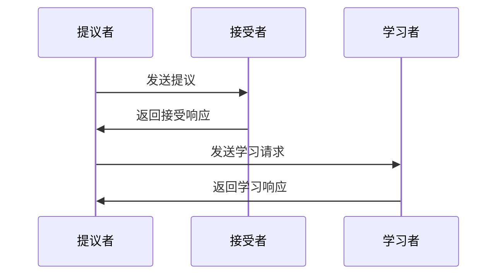
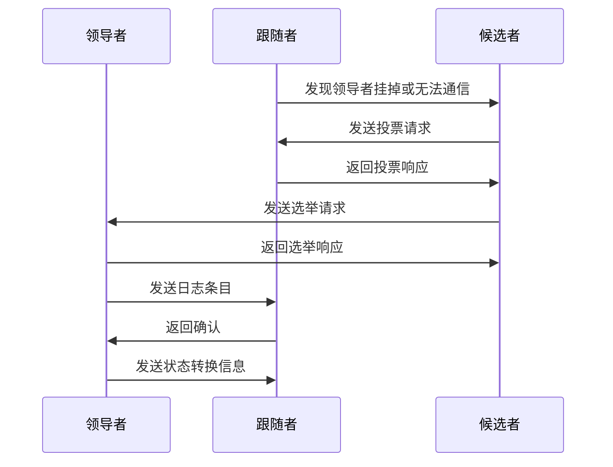
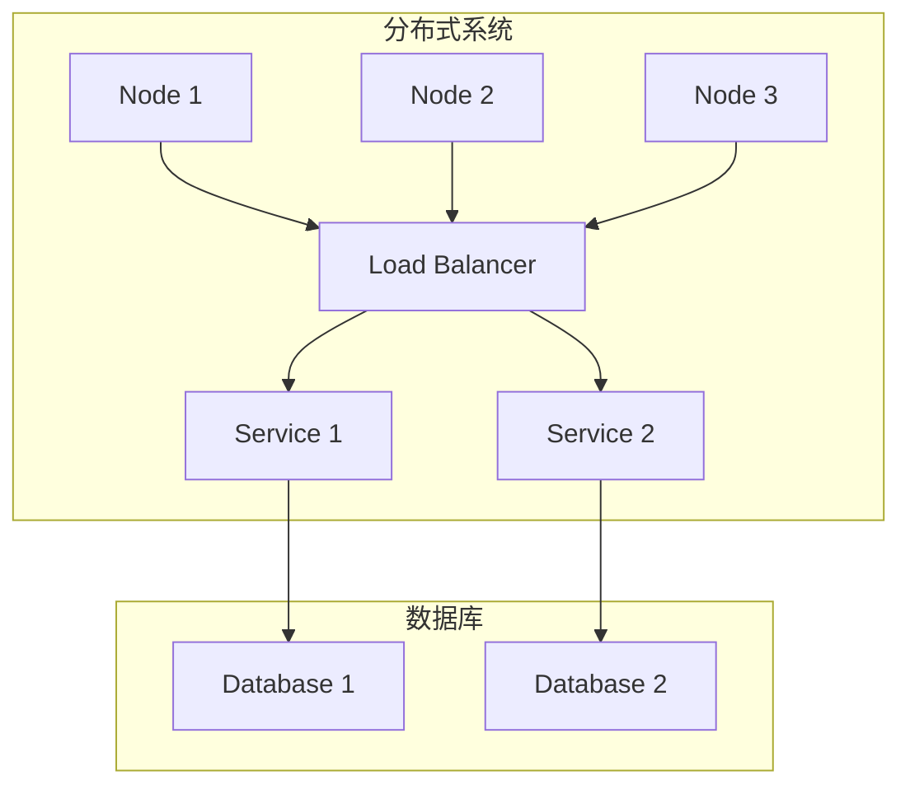
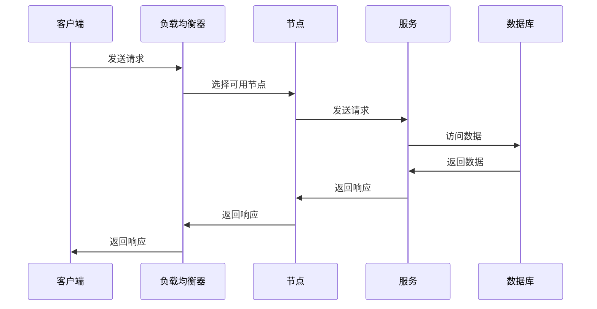

                 


## 第1章 引言

### 1.1 问题背景

分布式技术的兴起是信息技术领域的一大里程碑。随着互联网的快速发展，数据量呈爆炸式增长，传统的集中式系统逐渐无法满足日益复杂的业务需求。分布式技术应运而生，成为现代系统设计的重要方向。

分布式系统通过将任务分解到多个节点上执行，从而实现负载均衡、容错和高可用性。尽管分布式技术带来了诸多优势，但同时也引入了一系列挑战。例如，如何在分布式系统中保持一致性、如何处理节点故障、如何设计高效的数据复制策略等，这些都是分布式技术需要解决的常见问题。

然而，在实际应用中，许多开发者和架构师对于分布式技术的理解和认知存在盲区，导致系统设计出现缺陷，甚至引发严重故障。本文旨在揭示这些常见的认知盲区，帮助读者更好地理解和应用分布式技术。

### 1.2 分布式技术的现状与挑战

分布式技术的应用范围已覆盖到互联网、金融、电商、物联网等多个领域。例如，分布式数据库如MongoDB、Cassandra等在处理海量数据方面表现优异；分布式搜索引擎如Elasticsearch在实时搜索领域具有显著优势；分布式计算框架如Hadoop、Spark则在大数据处理领域发挥着重要作用。

尽管分布式技术取得了显著成果，但仍然面临诸多挑战。首先是如何在分布式系统中保持数据的一致性，这在分布式数据库设计中尤为关键。其次是如何处理节点故障，确保系统的高可用性。此外，分布式系统的性能优化、安全性保障等也是需要持续关注的问题。

### 1.3 本书的目的与结构

本书旨在帮助读者深入了解分布式技术的核心概念和原理，揭示常见的认知盲区，并提供实用的解决方案。全书分为七个章节，涵盖了从基础概念到实际应用的各个方面。

第1章为引言，介绍分布式技术的背景和现状，阐述本书的目的和结构。

第2章介绍分布式技术的基础，包括定义、特性和核心概念。

第3章详细讨论分布式系统中的核心概念，如一致性、可用性、分区容错性（CAP定理）等。

第4章讲解分布式算法，包括一致性算法如Paxos、Raft等，并使用Mermaid流程图、Python代码和LaTeX公式进行解释。

第5章分析分布式系统的架构设计，包括领域模型、系统架构、接口设计和交互流程。

第6章通过实际案例，介绍分布式项目的环境搭建、核心代码实现、代码分析及案例剖析。

第7章总结最佳实践、注意事项，并提供拓展阅读资源。

通过本书的阅读，读者将能够系统地掌握分布式技术的知识，避免常见的认知盲区，提升系统设计和开发能力。

## 第2章 分布式技术基础

### 2.1 分布式系统的定义与特性

分布式系统是由多个独立的计算机节点组成的系统，这些节点通过网络相互连接，共同完成计算任务。在分布式系统中，数据被分布在多个节点上，每个节点可以独立处理本地数据，并与其他节点协同工作。

分布式系统的定义可以从以下几个方面进行理解：

- **计算任务分布**：分布式系统将计算任务分配到不同的节点上执行，从而实现负载均衡和高效处理。

- **数据分布**：数据被分散存储在多个节点上，每个节点负责一部分数据的读写操作。

- **节点通信**：节点之间通过网络进行通信，交换数据和控制信息。

- **容错性**：分布式系统能够在部分节点发生故障时，仍然保持整体系统的正常运行。

分布式系统的特性包括：

- **高可用性**：通过分布式架构，系统可以在节点故障时快速恢复，保证服务的持续可用。

- **高性能**：分布式系统可以利用多个节点的计算资源，实现并行处理，从而提高系统的性能。

- **可扩展性**：分布式系统可以灵活地添加或移除节点，以适应不断变化的业务需求。

- **数据一致性**：确保分布式系统中各节点数据的一致性是一个重要挑战，需要通过一致性算法和协议来保障。

### 2.2 分布式系统中的核心概念

在分布式系统中，以下几个核心概念尤为重要：

- **一致性（Consistency）**：一致性是指分布式系统中各节点的数据状态一致。例如，在一个分布式数据库中，任何对数据的修改都应该及时同步到所有节点。

- **可用性（Availability）**：可用性是指系统在请求时能够正确响应。分布式系统应确保在大部分节点正常运行的情况下，系统仍然能够提供服务。

- **分区容错性（Partition Tolerance）**：分区容错性是指系统在分区失败时仍然能够继续运行。例如，在网络分割的情况下，系统应能够独立处理各个分区的请求。

- **性能（Performance）**：性能是指系统处理请求的速度和效率。分布式系统应优化数据访问路径和负载均衡策略，以提高整体性能。

- **安全性（Security）**：安全性是指系统防止未授权访问和数据泄露的能力。分布式系统需要通过身份验证、授权和加密等措施来保障数据安全。

### 2.3 CAP定理与分布式系统设计

CAP定理是分布式系统设计的重要理论依据，由Eric Brewer提出。CAP定理指出，在分布式系统中，一致性（Consistency）、可用性（Availability）和分区容错性（Partition Tolerance）三者之间只能同时满足两项，而不能同时满足三项。

- **CA系统**：在一致性（C）和可用性（A）之间进行选择。这种系统在出现分区时，可以牺牲分区容错性（P），保证一致性和可用性。例如，Google Spanner数据库就是一种典型的CA系统。

- **CP系统**：在一致性（C）和分区容错性（P）之间进行选择。这种系统在出现分区时，可以牺牲可用性（A），保证一致性和分区容错性。例如，Cassandra数据库就是一种典型的CP系统。

- **AP系统**：在可用性（A）和分区容错性（P）之间进行选择。这种系统在出现分区时，可以牺牲一致性（C），保证可用性和分区容错性。例如，Elasticsearch就是一种典型的AP系统。

在设计分布式系统时，需要根据业务需求和系统特点，在CAP三者之间做出权衡。例如，对于要求高可用性和高性能的互联网应用，可以选择AP系统；而对于需要强一致性保证的金融系统，可以选择CP系统。

通过深入理解分布式技术的定义、特性和核心概念，读者可以更好地应对分布式系统设计中的挑战，避免常见的认知盲区。接下来，我们将进一步探讨分布式系统中的核心概念，如一致性、可用性和分区容错性，并分析它们之间的相互关系。

## 第3章 核心概念详解

### 3.1 一致性（Consistency）

一致性是分布式系统的核心概念之一，它确保分布式系统中各节点的数据状态保持一致。在分布式数据库中，一致性尤为重要，因为任何对数据的修改都应该及时同步到所有节点。

#### 3.1.1 定义与特性

一致性是指，当多个节点对同一数据集进行读写操作时，所有节点的数据状态保持相同。具体来说，一致性有以下几种特性：

- **强一致性**：系统在所有节点上都同步完成操作后，才会返回成功。这意味着在强一致性模型下，所有节点的数据状态都是一致的，但可能会牺牲性能。

- **最终一致性**：系统在经过一段时间后，所有节点的数据状态最终会保持一致。这意味着在最终一致性模型下，数据同步可能有一定的延迟，但最终会达到一致状态。

- **强最终一致性**：系统在任何时刻的读写操作都会返回最新的数据，且所有节点的数据状态始终保持一致。

#### 3.1.2 一致性模型

分布式系统中的一致性模型可以分为以下几种：

- **线性一致性（Linear Consistency）**：任何操作序列看起来像是在一个单一节点上执行，这是最高级别的一致性模型。

- **顺序一致性（Sequential Consistency）**：所有节点看到的操作顺序相同，但不同节点的读写操作可能有不同的顺序。

- **读写一致性（Read-your-writes Consistency）**：每个节点都能看到它自己的写入操作，但其他节点的写入操作可能不可见。

- **事件一致性（Eventual Consistency）**：系统最终会达到一致性状态，但过程中可能存在短暂的偏差。

#### 3.1.3 分布式一致性算法

为了在分布式系统中实现一致性，通常需要使用一致性算法。以下是几种常见的分布式一致性算法：

- **Paxos算法**：Paxos算法是一种用于达成一致性的算法，它通过选举提案者和决策者来确保一致性。Paxos算法具有高可用性和容错性。

- **Raft算法**：Raft算法是一种基于状态机理论的分布式一致性算法，它通过日志复制和领导选举来保证一致性。Raft算法相比Paxos算法更易于理解和实现。

- **视图状态机（Viewstate Machine）**：视图状态机是一种用于分布式系统的状态同步算法，它通过周期性地同步状态来保证一致性。

在下一节中，我们将详细讲解分布式一致性算法，包括Paxos和Raft算法的原理、流程图、Python代码实现以及数学模型。

### 3.2 可用性（Availability）

可用性是分布式系统的另一个核心概念，它确保系统在请求时能够正确响应。可用性通常与系统的故障处理能力相关，一个好的分布式系统应该在节点故障时仍然能够提供服务。

#### 3.2.1 定义与特性

可用性是指系统在请求时能够正确响应。具体来说，可用性有以下几种特性：

- **强可用性**：系统在任何时刻都能够正确响应请求，不会发生任何错误。

- **最终可用性**：系统在经过一定时间后，能够恢复到正常状态并正确响应请求。

- **部分可用性**：系统在部分节点故障时，仍然能够提供部分服务。

#### 3.2.2 可用性模型

分布式系统中的可用性模型可以分为以下几种：

- **SAP（Strong Availability and Partition Tolerance）**：强可用性和分区容错性。这种模型要求系统在任何时刻都能够正确响应请求，但可能会牺牲性能。

- **SAP2（Strong Availability and Partition Tolerance 2）**：类似于SAP模型，但在网络分割时，系统可能无法继续提供服务。

- **PA（Partially Available）**：系统在部分节点故障时，仍然能够提供部分服务。

#### 3.2.3 故障处理与高可用性

为了提高系统的可用性，需要设计高效的故障处理机制。以下是一些常用的方法：

- **备份与冗余**：通过数据备份和系统冗余，确保在节点故障时，系统仍然能够继续提供服务。

- **负载均衡**：通过负载均衡器，将请求均匀分配到多个节点上，从而提高系统的可用性和性能。

- **故障转移**：在主节点故障时，自动将主节点切换到备用节点，从而保持系统的可用性。

在下一节中，我们将进一步探讨分区容错性（Partition Tolerance），分析它对系统可用性的影响，并讨论如何设计高可用性系统。

### 3.3 分区容错性（Partition Tolerance）

分区容错性是分布式系统的关键特性之一，它确保系统在节点之间发生网络分割时，仍然能够继续运行。分区容错性对于高可用性和系统稳定性至关重要。

#### 3.3.1 定义与特性

分区容错性是指系统在节点之间发生网络分割时，仍然能够继续正常运行。具体来说，分区容错性有以下特性：

- **强分区容错性**：系统能够在完全隔离的分区中继续运行，各个分区之间互不干扰。

- **弱分区容错性**：系统在部分分区不可达时，仍然能够继续运行，但可能会影响性能和可用性。

#### 3.3.2 分区容错性与系统设计

分区容错性对系统设计有重要影响，以下是一些关键点：

- **容错机制**：系统应设计容错机制，如数据备份和冗余，确保在节点故障时，系统能够快速恢复。

- **网络隔离**：在设计系统时，应考虑网络隔离，确保在节点之间发生网络分割时，系统仍然能够继续运行。

- **故障检测**：系统应具备故障检测能力，及时检测到节点故障，并采取措施进行故障恢复。

#### 3.3.3 CAP定理与分区容错性

CAP定理指出，一致性（Consistency）、可用性（Availability）和分区容错性（Partition Tolerance）三者之间只能同时满足两项。因此，在设计分布式系统时，需要在CAP三者之间做出权衡：

- **CAP系统的选择**：根据业务需求和系统特点，选择合适的CAP系统。例如，对于要求高可用性和高性能的互联网应用，可以选择AP系统；而对于需要强一致性保证的金融系统，可以选择CP系统。

- **分区容错性优化**：通过优化分区容错性，可以提高系统的可用性和稳定性。例如，可以通过负载均衡和故障转移机制，确保在节点故障时，系统仍然能够继续运行。

在下一节中，我们将详细讲解分布式一致性算法，如Paxos和Raft算法，以及它们如何实现分区容错性。

## 第4章 分布式算法解析

分布式算法在分布式系统中起着至关重要的作用，它们确保系统在多个节点之间达成一致，处理数据的一致性和系统状态同步等问题。在本章中，我们将重点介绍两种常见的分布式一致性算法：Paxos和Raft。

### 4.1 Paxos算法

Paxos算法是一种用于分布式系统中达成一致性的经典算法，由莱斯利·兰伯特（Leslie Lamport）于1990年提出。Paxos算法的核心思想是通过一种称为“提议-批准”的过程，确保多个节点在数据一致性上达成一致。

#### 4.1.1 Paxos算法原理

Paxos算法的主要角色包括提议者（Proposer）、接受者（Acceptor）和学习者（Learner）。以下是Paxos算法的基本步骤：

1. **提议阶段**：
   - 提议者生成一个提议，包含一个提案值和一个提案编号。
   - 提议者向所有接受者发送提议。

2. **接受阶段**：
   - 接受者收到提议后，如果提案编号大于当前已接受的提案编号，则接受该提议。
   - 接受者向提议者发送接受响应。

3. **学习阶段**：
   - 提议者收集足够多的接受响应后，选择其中一个最大编号的提案值作为最终决策值。
   - 提议者向所有学习者发送学习请求，学习者接收到学习请求后，将最终决策值记为当前值。

#### 4.1.2 Paxos算法流程图

下面是一个简化的Paxos算法流程图，使用Mermaid语法表示：



#### 4.1.3 Paxos算法Python代码实现

以下是一个简化的Paxos算法Python代码实现，主要用于演示算法的核心逻辑：

```python
import random

class Proposer:
    def __init__(self, id, acceptors, learners):
        self.id = id
        self.acceptors = acceptors
        self.learners = learners
        self.current提案编号 = 0
        self.current提案值 = None

    def make提案(self):
        self.current提案编号 += 1
        proposal = {'编号': self.current提案编号, '值': self.current提案值}
        for acceptor in self.acceptors:
            acceptor.send提案(proposal)
        responses = [response for response in self.get接受响应() if response['编号'] > self.current提案编号]
        if len(responses) >= len(self.acceptors) / 2:
            self.current提案值 = max([response['值'] for response in responses])
            for learner in self.learners:
                learner.learn(self.current提案值)

class Acceptor:
    def __init__(self, id):
        self.id = id
        self.已接受提案 = None

    def send提案(self, proposal):
        if proposal['编号'] > self.已接受提案['编号']:
            self.已接受提案 = proposal
            return {'接受者ID': self.id, '编号': proposal['编号'], '值': proposal['值']}
        else:
            return {'拒绝'}

class Learner:
    def __init__(self, id):
        self.id = id
        self.当前值 = None

    def learn(self, value):
        self.当前值 = value

# 示例
acceptors = [Acceptor(id) for id in range(3)]
learners = [Learner(id) for id in range(3)]
proposer = Proposer(id=0, acceptors=acceptors, learners=learners)

proposer.make提案()
```

#### 4.1.4 Paxos算法数学模型

Paxos算法可以用以下数学模型来描述：

$$
一致性(\{X_1, X_2, ..., X_n\}) = max(\{X_i | i \in S\})
$$

其中，$S$ 是所有参与节点中接受提案的节点集合，$X_i$ 是节点 $i$ 接受的提案值。

### 4.2 Raft算法

Raft算法是由Diego Ongaro和John Ousterhout于2013年提出的一种分布式一致性算法，它旨在简化Paxos算法的实现，同时保持其一致性保证。Raft算法通过角色分配和日志复制来实现一致性。

#### 4.2.1 Raft算法原理

Raft算法的主要角色包括领导者（Leader）、跟随者（Follower）和候选者（Candidate）。以下是Raft算法的基本步骤：

1. **选举阶段**：
   - 所有节点都处于Follower状态。
   - 当一个Follower节点发现领导者挂掉或无法通信时，它会开始选举过程，转换为Candidate状态。
   - Candidate节点向其他节点发送投票请求。
   - 如果一个Candidate节点获得超过半数的投票，它将成为新的领导者。

2. **日志复制阶段**：
   - 领导者向跟随者发送日志条目，并等待确认。
   - 跟随者收到日志条目后，将其追加到本地日志，并向领导者发送确认。
   - 领导者收到确认后，将日志条目标记为已提交。

3. **状态转换**：
   - 当领导者的日志条目达到某个固定数量时，领导者将新的状态信息发送给所有节点，确保所有节点状态一致。

#### 4.2.2 Raft算法流程图

下面是一个简化的Raft算法流程图，使用Mermaid语法表示：



#### 4.2.3 Raft算法Python代码实现

以下是一个简化的Raft算法Python代码实现，主要用于演示算法的核心逻辑：

```python
import random
import threading

class Node:
    def __init__(self, id, nodes):
        self.id = id
        self.nodes = nodes
        self.state = 'Follower'
        self.current_term = 0
        self.voted_for = None
        self.log = []
        self.commit_index = 0
        self.last_applied = 0

    def become_candidate(self):
        self.state = 'Candidate'
        self.current_term += 1
        self.voted_for = self.id
        for node in self.nodes:
            if node.id != self.id:
                node.send_vote_request(self)

    def become_leader(self):
        self.state = 'Leader'
        for node in self.nodes:
            if node.id != self.id:
                node.send_append_entries(self)

    def send_vote_request(self, candidate):
        if self.state == 'Follower' or self.state == 'Candidate':
            self.voted_for = candidate.id
            self.state = 'Leader'
            self.send_vote_response(candidate)

    def send_vote_response(self, candidate):
        if self.voted_for == candidate.id:
            return {'term': self.current_term, 'vote': 'yes'}
        else:
            return {'term': self.current_term, 'vote': 'no'}

    def send_append_entries(self, leader):
        if self.state == 'Follower':
            self.log.append(leader.log[-1])
            self.commit_index = leader.commit_index
            self.send_ack(leader)

    def send_ack(self, leader):
        leader.send_commit(self)

    def send_commit(self, follower):
        if follower.commit_index > self.commit_index:
            self.commit_index = follower.commit_index
            self.last_applied = self.commit_index

# 示例
nodes = [Node(id=i, nodes=nodes) for i in range(3)]

# 启动节点线程
for node in nodes:
    threading.Thread(target=node.run).start()

# 模拟选举过程
nodes[0].become_candidate()
nodes[1].become_candidate()
nodes[2].become_candidate()
```

#### 4.2.4 Raft算法数学模型

Raft算法可以用以下数学模型来描述：

$$
状态转换(\{T_i\}) = \sum_{i=1}^{n} T_i
$$

其中，$T_i$ 是节点 $i$ 的当前状态。

### 4.3 其他分布式一致性算法

除了Paxos和Raft算法，还有许多其他分布式一致性算法，如Zookeeper的ZAB算法、Chubby等。这些算法各有特点，适用于不同的场景。以下是几种常见算法的简要介绍：

- **ZAB算法**：Zookeeper的ZAB算法是一种基于Paxos算法的分布式一致性算法，它主要用于Zookeeper的集群管理。

- **Chubby**：Chubby是Google开发的一种分布式锁服务，它基于Paxos算法，用于提供分布式环境下的同步机制。

- **Bigtable**：Bigtable是Google的一种分布式存储系统，它采用了Chubby算法来保证分布式一致性。

在分布式系统中，选择合适的算法取决于具体的应用场景和系统需求。通过理解不同算法的原理和实现，开发者可以更好地应对分布式一致性挑战。

### 总结

在本章中，我们详细介绍了分布式一致性算法Paxos和Raft，以及它们的原理、流程图、Python代码实现和数学模型。通过这些算法，分布式系统可以在多个节点之间达成一致，确保数据一致性和系统状态同步。在下一章中，我们将进一步探讨分布式系统的架构设计，包括领域模型、系统架构、接口设计和交互流程。

## 第5章 系统架构设计

### 5.1 分布式系统的架构设计原则

分布式系统的架构设计是确保系统高可用性、高性能和可扩展性的关键。以下是一些核心原则：

1. **模块化与分解**：将系统功能分解为多个模块，每个模块负责单一功能，以便于管理和维护。模块之间通过定义良好的接口进行通信。

2. **容错与冗余**：设计冗余机制，如数据备份和节点冗余，以应对节点故障。此外，应考虑故障转移和自动恢复机制，确保系统在故障发生时能够快速恢复。

3. **负载均衡**：通过负载均衡器，将请求均匀分配到多个节点上，以充分利用系统资源，提高系统性能。

4. **数据一致性**：选择合适的一致性模型，如强一致性或最终一致性，并设计一致性算法，如Paxos或Raft，以保持系统数据的一致性。

5. **安全性**：确保系统的数据传输和存储安全，采用加密、认证和授权机制，防止未授权访问和数据泄露。

6. **可扩展性**：系统设计应具备良好的可扩展性，以便在业务需求变化时，能够灵活地添加或移除节点，以保持系统的稳定性和性能。

### 5.2 领域模型设计

领域模型是系统架构设计的重要组成部分，它定义了系统的核心实体和关系。以下是使用Mermaid类图表示的领域模型：

```mermaid
classDiagram
    class Node {
        -id: Integer
        -name: String
        -ip: String
        -role: String
    }
    class Data {
        -id: Integer
        -value: String
        -timestamp: Date
    }
    class Service {
        -id: Integer
        -name: String
        -node_id: Integer
    }
    Node "has" Data
    Service "uses" Node
```

在这个领域模型中，Node类表示系统中的节点，包括ID、名称、IP地址和角色等信息。Data类表示节点的数据，包括ID、数据值和时间戳。Service类表示系统中的服务，包括ID、名称和关联的节点ID。

### 5.3 系统架构设计

系统架构设计是确保系统各组件高效协作的关键。以下是使用Mermaid架构图表示的系统架构设计：



在这个系统架构设计中，Load Balancer（负载均衡器）负责将请求均匀分配到多个节点上。Node 1、Node 2和Node 3是系统的节点，每个节点负责处理一部分服务请求。Service 1和Service 2是系统中的服务组件，它们通过节点进行数据访问和操作。数据库DB1和DB2用于存储系统的数据，实现数据持久化。

### 5.4 系统接口设计

系统接口设计是确保系统组件之间能够良好协作的关键。以下是系统接口设计的主要组件：

- **Node API**：提供节点管理的接口，包括节点注册、节点删除、节点状态查询等。

- **Service API**：提供服务管理的接口，包括服务注册、服务删除、服务状态查询等。

- **Data API**：提供数据操作接口，包括数据查询、数据插入、数据更新等。

以下是Node API的简单示例：

```python
class NodeAPI:
    def register_node(self, node_info):
        # 注册节点
        pass

    def delete_node(self, node_id):
        # 删除节点
        pass

    def get_node_status(self, node_id):
        # 获取节点状态
        pass
```

### 5.5 系统交互

系统交互设计描述了系统组件之间的交互流程和协作方式。以下是使用Mermaid序列图表示的系统交互设计：



在这个系统交互设计中，客户端发送请求到负载均衡器，负载均衡器选择一个可用节点，将请求转发到节点上的服务组件，服务组件访问数据库进行数据处理，然后将结果返回给客户端。

### 5.6 系统架构设计总结

系统架构设计应遵循模块化、容错、负载均衡、数据一致性和安全性等原则。通过合理的领域模型设计、系统架构设计、接口设计和交互设计，可以构建一个高效、可靠和可扩展的分布式系统。在下一章中，我们将通过实际案例展示分布式项目的搭建过程，包括环境配置、核心代码实现、代码分析以及案例剖析。

## 第6章 分布式项目实战

### 6.1 项目环境搭建

在进行分布式项目实战之前，我们需要搭建一个合适的环境。以下是搭建分布式环境的基本步骤：

1. **环境配置**：
   - 确保操作系统（如Linux或MacOS）的版本兼容。
   - 安装必要的依赖库和工具，如Python、Node.js、MySQL等。
   - 配置网络环境，确保各节点之间的通信畅通。

2. **节点配置**：
   - 配置多个虚拟机或物理机作为节点，以便进行分布式部署。
   - 设置各节点的IP地址和hostname，确保它们能够在网络中相互通信。

3. **负载均衡器配置**：
   - 安装和配置负载均衡器（如Nginx或HAProxy），确保请求能够均匀分配到各个节点上。

4. **分布式存储配置**：
   - 选择合适的分布式存储方案（如HDFS、Cassandra或MongoDB），并配置好数据存储和备份策略。

5. **监控与日志配置**：
   - 安装监控工具（如Zabbix、Prometheus）和日志收集工具（如ELK Stack），确保能够实时监控系统的运行状态和日志。

### 6.2 系统核心功能实现

在分布式项目中，核心功能的实现是关键。以下是一个简单的分布式系统核心功能的实现示例：

1. **服务注册与发现**：
   - 实现服务注册接口，使节点能够将自己的信息注册到服务注册中心（如Consul或Zookeeper）。
   - 实现服务发现接口，使其他节点能够查询到可用的服务实例。

2. **负载均衡**：
   - 使用负载均衡器（如Nginx）配置负载均衡策略，如轮询、最少连接数等。
   - 实现客户端负载均衡，确保请求能够均匀分配到各个节点上。

3. **数据一致性**：
   - 使用分布式一致性算法（如Paxos或Raft），确保多个节点之间的数据一致性。
   - 实现数据同步机制，确保数据在节点之间保持一致。

4. **故障处理与自动恢复**：
   - 设计故障检测机制，及时发现节点故障。
   - 实现自动恢复机制，确保故障节点能够快速恢复。

### 6.3 代码解读与分析

以下是一个简单的分布式服务注册与发现模块的代码示例，以及对其的解读和分析：

```python
# 服务注册模块
class ServiceRegistry:
    def __init__(self, zk_client):
        self.zk_client = zk_client

    def register_service(self, service_info):
        service_path = "/services/" + service_info["name"]
        self.zk_client.create(service_path, value=str(service_info), ephemeral=True)

    def deregister_service(self, service_name):
        service_path = "/services/" + service_name
        self.zk_client.delete(service_path)

# 服务发现模块
class ServiceDiscovery:
    def __init__(self, zk_client):
        self.zk_client = zk_client

    def discover_services(self, service_name):
        services_path = "/services/" + service_name
        services = self.zk_client.get_children(services_path)
        return [self.zk_client.get(services_path + "/" + service)[0] for service in services]
```

**代码解读：**
- `ServiceRegistry` 类负责服务注册，使用Zookeeper客户端（`zk_client`）创建临时节点，并将服务信息存储在节点值中。
- `register_service` 方法接收服务信息（如名称、IP地址、端口号等），在Zookeeper中创建一个临时节点，确保服务在节点故障时自动删除。
- `deregister_service` 方法根据服务名称删除对应的Zookeeper节点。

**代码分析：**
- 服务注册模块的设计需要考虑故障恢复和分布式环境下的稳定性。
- 临时节点的特性有助于自动处理服务实例的故障，确保系统的可靠性。
- 服务发现模块通过读取Zookeeper中的子节点信息，实现服务发现功能。

### 6.4 实际案例剖析

以下是一个实际案例，分析分布式系统在处理高并发请求时的性能优化和故障处理：

**案例描述：**
一个在线电商平台在促销期间，面临巨大的用户访问量和订单量。分布式系统需要在确保数据一致性的同时，提供高性能和高可用性。

**性能优化：**
1. **缓存策略**：
   - 使用Redis等缓存系统，减少数据库的直接访问，提高系统响应速度。
   - 实现分库分表，将数据分散存储，提高查询效率。

2. **负载均衡**：
   - 使用Nginx等负载均衡器，根据用户访问情况动态调整负载策略。
   - 实现灰度发布，逐步上线新功能，降低对系统的影响。

3. **异步处理**：
   - 使用消息队列（如RabbitMQ或Kafka），实现订单处理和支付通知的异步处理，提高系统吞吐量。

**故障处理：**
1. **故障检测与自动恢复**：
   - 设计故障检测机制，实时监控系统的运行状态，及时发现问题。
   - 实现自动恢复机制，如自动重启故障节点、切换备用节点等。

2. **数据备份与恢复**：
   - 定期备份数据库，确保在数据丢失时能够快速恢复。
   - 实现多副本数据存储，提高数据可靠性和容错性。

**案例分析：**
- 性能优化方面，通过缓存策略、负载均衡和异步处理，显著提高了系统的响应速度和处理能力。
- 故障处理方面，通过故障检测、自动恢复和数据备份，确保了系统在故障发生时的稳定运行。

### 6.5 项目小结

通过实际案例剖析，我们可以看到分布式系统在处理高并发请求时，需要考虑性能优化和故障处理等多个方面。合理的系统架构设计、完善的故障处理机制和高效的性能优化策略，是确保分布式系统稳定运行的关键。在下一章中，我们将总结分布式技术的最佳实践，并提供注意事项和拓展阅读资源。

## 第7章 最佳实践与总结

### 7.1 最佳实践

在分布式系统的设计和实施过程中，以下是一些最佳实践：

1. **一致性模型选择**：根据业务需求，合理选择一致性模型（如强一致性、最终一致性）。在低延迟和高可用性的场景下，可以考虑使用最终一致性模型。

2. **容错机制设计**：设计冗余和故障转移机制，确保在节点故障时系统能够快速恢复。

3. **负载均衡优化**：采用高效负载均衡策略，如基于用户的访问模式和负载状况进行动态负载均衡。

4. **数据同步与备份**：确保数据在节点之间同步，定期进行数据备份，以防止数据丢失。

5. **监控与日志**：实现全面的监控和日志收集，以便及时发现和解决问题。

### 7.2 注意事项

在分布式系统设计和实施中，需要注意以下几点：

1. **网络稳定性**：确保网络连接稳定，避免因网络问题导致系统不可用。

2. **数据一致性问题**：在设计分布式系统时，要充分考虑数据一致性问题，选择合适的一致性算法。

3. **节点规模控制**：避免节点规模过大，影响系统的性能和稳定性。

4. **安全性问题**：确保系统的数据传输和存储安全，采用加密、认证和授权机制。

### 7.3 拓展阅读

为了更深入地了解分布式技术，以下是一些推荐阅读资源：

1. 《分布式系统原理与范型》 - 极客时间的分布式系统课程，涵盖分布式系统的基础知识。
2. 《分布式算法导论》 - 详细介绍分布式一致性算法，如Paxos、Raft等。
3. 《大规模分布式存储系统设计与实践》 - 探讨分布式存储系统的设计与实现。
4. 《微服务架构设计模式》 - 讨论微服务架构在分布式系统中的应用。

通过阅读这些资源，读者可以进一步提升对分布式技术的理解和应用能力。

## 总结

在本文中，我们详细探讨了分布式技术的核心概念、算法、系统架构设计以及实际应用案例。通过深入分析一致性、可用性、分区容错性等核心概念，我们了解了如何设计高可用性、高性能和可扩展性的分布式系统。同时，通过Paxos和Raft算法的讲解，我们掌握了分布式一致性算法的基本原理和实现方法。

此外，我们通过系统架构设计、分布式项目实战等案例，展示了分布式技术的实际应用和最佳实践。这些知识和实践对于提升分布式系统的设计和开发能力具有重要意义。

在未来的工作中，我们应不断学习新技术，结合实际业务需求，设计更加高效、可靠的分布式系统。希望本文能够为读者在分布式技术领域的学习和实践中提供帮助。作者：AI天才研究院/AI Genius Institute & 禅与计算机程序设计艺术/Zen And The Art of Computer Programming。

