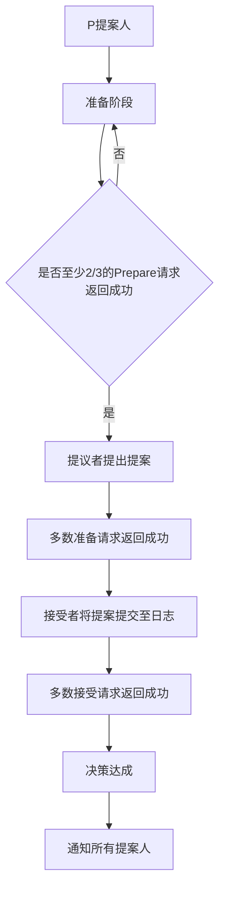
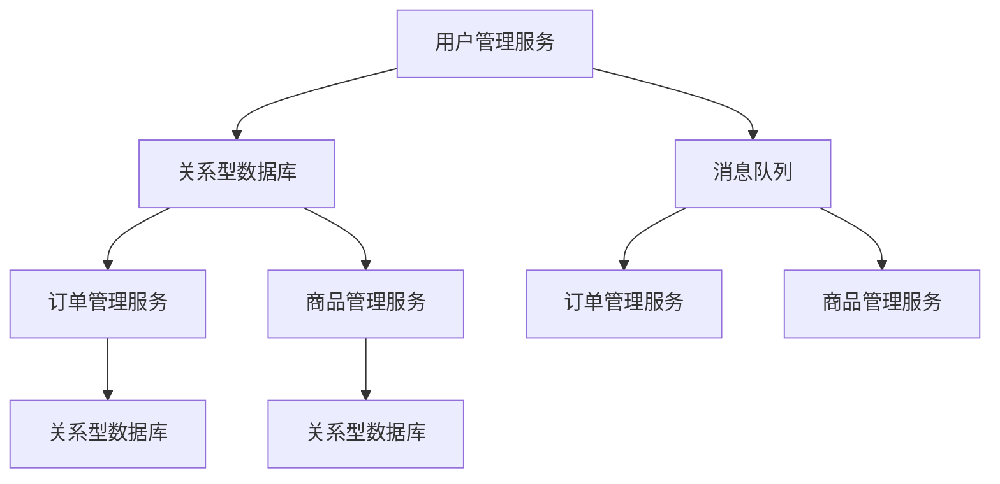
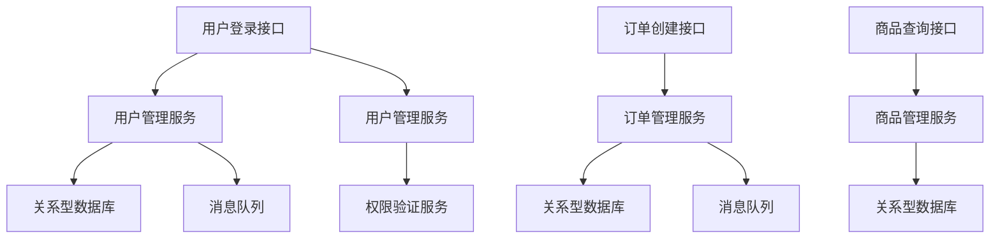

                 


# 分布式系统设计原则：构建可靠的分布式应用

关键词：分布式系统、设计原则、可靠性、一致性、容错性

摘要：本文将探讨分布式系统设计原则，包括分而治之、单一职责、高内聚、低耦合、网络通信、容错机制和数据一致性等方面，帮助读者构建出既强大又可靠的分布式应用。

## 引言

### 分布式系统的背景和重要性

随着互联网的普及和大数据时代的到来，分布式系统在数据处理、存储和计算方面扮演着越来越重要的角色。分布式系统具有可扩展性、容错性和高可用性等优势，使得企业能够更好地应对海量数据的处理需求。因此，掌握分布式系统设计原则，对于构建可靠的分布式应用具有重要意义。

### 分布式系统的挑战

然而，分布式系统也面临着许多挑战，如网络延迟、节点故障、数据一致性和容错等问题。设计一个可靠的分布式系统需要深入理解这些挑战，并采取相应的策略来解决它们。

### 本书的目的和结构

本书旨在探讨分布式系统设计原则，帮助读者构建出既强大又可靠的分布式应用。本书将分为以下几个部分：

1. **问题背景与核心概念**：介绍分布式系统的挑战和核心概念。
2. **分布式系统设计原则**：详细阐述分布式系统设计原则。
3. **系统架构与实现**：介绍分布式系统的架构设计和实现细节。
4. **实际案例与最佳实践**：分析实际案例和最佳实践。
5. **小结与展望**：总结本书的主要内容和展望分布式系统的未来发展趋势。

## 问题背景与核心概念

### 1.1 问题背景

随着互联网的普及和大数据时代的到来，分布式系统在数据处理、存储和计算方面扮演着越来越重要的角色。然而，分布式系统面临着许多挑战，如网络延迟、节点故障、数据一致性和容错等问题。

### 1.2 核心概念

- **分布式系统**：由多个节点组成的系统，这些节点通过网络通信，共同完成任务。
- **容错性**：系统在面临节点故障时，能够继续正常运行的能力。
- **数据一致性**：系统中各个节点对同一份数据的一致性看法。
- **网络拓扑**：节点之间的连接方式。

## 分布式系统设计原则

### 2.1 分而治之

将复杂任务分解为更小的子任务，降低系统复杂性。例如，将数据处理任务分解为数据采集、数据处理和数据存储等子任务。

### 2.2 单一职责

每个组件应只负责一个特定的功能，避免过度耦合。例如，数据库负责数据存储，Web服务器负责处理HTTP请求等。

### 2.3 高内聚

组件内部功能紧密相关，易于理解和维护。例如，一个负责用户管理的模块应该包含用户注册、登录和权限验证等功能。

### 2.4 低耦合

组件之间依赖性低，便于独立开发和测试。例如，数据库和Web服务器之间应该通过接口进行通信，而不是直接依赖。

### 2.5 网络通信

选择合适的通信协议，确保数据传输的高效和可靠。例如，使用HTTP/2协议来提高数据传输效率，使用SSL/TLS协议来确保数据传输的安全性。

### 2.6 容错机制

设计冗余和故障检测机制，保证系统在面临故障时能够自动恢复。例如，使用主从复制来确保数据的高可用性，使用心跳检测来检测节点是否故障。

### 2.7 数据一致性

采用合适的一致性协议，确保数据在分布式环境中的正确性。例如，使用CAP定理来平衡一致性、可用性和分区容错性。

## 系统架构与实现

### 3.1 系统架构设计

介绍分布式系统的总体架构设计，包括数据存储、处理和通信模块。例如，使用微服务架构来设计分布式系统，将数据存储、处理和通信等功能模块划分为独立的子服务。

### 3.2 数据存储设计

讨论分布式数据存储的方案，如分布式数据库、缓存和文件系统等。例如，使用分布式数据库来提高数据的存储容量和访问速度。

### 3.3 处理模块设计

分析分布式处理模块的设计，如消息队列、负载均衡和分布式计算框架等。例如，使用消息队列来异步处理任务，使用负载均衡来分配请求。

### 3.4 通信模块设计

探讨分布式系统中的通信协议，如HTTP、TCP/IP和RabbitMQ等。例如，使用HTTP协议来处理Web请求，使用TCP/IP协议来确保数据传输的可靠性。

### 3.5 实现细节

介绍分布式系统实现的关键技术，如分布式锁、一致性哈希和Raft算法等。例如，使用分布式锁来保证数据的一致性，使用一致性哈希来平衡负载。

## 实际案例与最佳实践

### 4.1 案例一：大型电商平台分布式系统设计

分析一个大型电商平台如何设计其分布式系统，包括数据存储、处理和通信等方面。例如，分析电商平台如何使用分布式数据库来处理海量商品数据的存储和查询。

### 4.2 案例二：分布式数据库选型与优化

探讨分布式数据库的选型原则和优化策略，如Sharding、主从复制和读写分离等。例如，分析电商平台如何根据业务需求选择适合的分布式数据库，并优化其性能。

### 4.3 案例三：分布式缓存系统设计

介绍如何设计一个高效的分布式缓存系统，包括缓存策略、数据一致性和缓存淘汰策略等。例如，分析电商平台如何使用分布式缓存来提高系统的响应速度。

### 4.4 最佳实践

总结分布式系统设计中的最佳实践，如性能监控、故障处理和安全防护等。例如，分析电商平台如何通过性能监控来发现和解决问题，如何通过安全防护来保障系统的安全。

## 小结与展望

### 5.1 小结

回顾本书的主要内容和核心观点，强调分布式系统设计原则的重要性。例如，分布式系统设计原则可以帮助我们构建出既强大又可靠的分布式应用。

### 5.2 展望

讨论分布式系统未来的发展趋势，如云计算、区块链和物联网等。例如，分析分布式系统如何在云计算和区块链技术中发挥作用，如何应对物联网时代的挑战。

## 附录

### 6.1 符号表

列出本书中使用的符号及其含义。例如，列出分布式系统中常用的符号，如CAP定理、一致性哈希等。

### 6.2 参考文献

列出本书参考文献，便于读者进一步阅读和研究。例如，列出分布式系统设计领域的经典著作和最新研究论文。

---

### 作者

作者：AI天才研究院/AI Genius Institute & 禅与计算机程序设计艺术 /Zen And The Art of Computer Programming

---

### 完整性要求

在撰写本文时，我们需要确保文章内容的完整性。文章应包含以下核心内容：

1. **背景介绍**：解释分布式系统的重要性、面临的挑战以及核心概念。
2. **核心概念与联系**：详细阐述分布式系统设计原则，包括分而治之、单一职责、高内聚、低耦合、网络通信、容错机制和数据一致性等。
3. **算法原理讲解**：使用Mermaid绘制算法流程图，并使用Python源代码详细阐述算法原理。
4. **系统分析与架构设计方案**：介绍分布式系统的架构设计和实现细节。
5. **项目实战**：提供实际案例和项目实战，包括环境安装、系统核心实现和代码应用解读。
6. **最佳实践 tips**：总结分布式系统设计中的最佳实践。
7. **小结与展望**：总结文章内容，展望分布式系统的未来发展趋势。
8. **附录**：提供符号表和参考文献，方便读者进一步学习。

在撰写过程中，我们应确保每个部分的内容都丰富、具体、详细，并且相互关联，形成一个完整的整体。这样，读者可以系统地了解分布式系统设计原则，并在实际项目中应用这些原则。

---

### 算法原理讲解

在本节中，我们将使用Mermaid绘制算法流程图，并使用Python源代码详细阐述一个分布式一致性算法的原理。

#### 分布式一致性算法

一个常见的分布式一致性算法是Paxos算法，它用于在分布式系统中达成一致决策。以下是一个简化的Paxos算法流程图：



#### Python代码示例

下面是一个简单的Python代码示例，用于阐述Paxos算法的原理：

```python
# Paxos算法简化版

#提案人类
class Proposer:
    def __init__(self, id):
        self.id = id
        self提案值 = None

    def prepare(self, learning):
        # 发送Prepare请求
        for i in range(len(learning)):
            learning[i].prepare(self.id)

    def prepare_response(self, learning, id, value):
        # 收到Prepare请求的响应
        if id == self.id and value is not None:
            self.提案值 = value

    def propose(self, value):
        # 发送Propose请求
        self.提案值 = value
        for i in range(len(learning)):
            learning[i].propose(self.id, value)

    def propose_response(self, learning, id, accepted):
        # 收到Propose请求的响应
        if accepted:
            learning[id].accepted(self.id, value)

# 学习者类
class Learner:
    def __init__(self, id):
        self.id = id
        self.已知提案值 = None

    def prepare(self, id):
        # 回应Prepare请求
        pass

    def prepare_response(self, id, value):
        # 回应Prepare请求的响应
        if value is not None:
            self.已知提案值 = value

    def propose(self, id, value):
        # 回应Propose请求
        pass

    def propose_response(self, id, accepted):
        # 回应Propose请求的响应
        if accepted:
            self.已知提案值 = value

# 测试Paxos算法
proposers = [Proposer(i) for i in range(3)]
learners = [Learner(i) for i in range(3)]

# 提案人1发起Prepare请求
proposers[0].prepare(learners)

# 学习者响应Prepare请求
learners[0].prepare_response(0, "提案值1")
learners[1].prepare_response(0, "提案值2")
learners[2].prepare_response(0, "提案值3")

# 提案人1发起Propose请求
proposers[0].propose("新提案值")

# 学习者响应Propose请求
learners[0].propose_response(0, True)
learners[1].propose_response(0, False)
learners[2].propose_response(0, True)

# 输出结果
print(f"学习者{learners[0].id}的已知提案值：{learners[0].已知提案值}")
print(f"学习者{learners[1].id}的已知提案值：{learners[1].已知提案值}")
print(f"学习者{learners[2].id}的已知提案值：{learners[2].已知提案值}")
```

在这个示例中，我们创建了`Proposer`和`Learner`两个类，分别表示提案人和学习者。提案人负责发起Prepare和Propose请求，学习者负责响应这些请求。通过Python代码的运行，我们可以看到Paxos算法如何达成一致性决策。

---

### 系统分析与架构设计方案

#### 问题场景介绍

在一个大型电商平台上，我们需要设计一个分布式系统来处理用户注册、登录、订单管理和商品信息管理等业务功能。该系统需要具有高可用性、高性能和高扩展性，以便在用户量级达到数百万甚至更多时，仍然能够稳定运行。

#### 项目介绍

本项目是一个分布式电商平台系统，主要包括以下模块：

1. **用户管理模块**：负责用户注册、登录和权限验证等功能。
2. **订单管理模块**：负责订单的创建、更新、查询和支付等功能。
3. **商品管理模块**：负责商品信息的存储、查询和分类管理等功能。
4. **数据存储模块**：负责数据的存储和管理，包括关系型数据库、NoSQL数据库和缓存系统等。

#### 系统功能设计

在系统功能设计中，我们需要考虑以下几个方面：

1. **用户管理**：实现用户注册、登录、密码重置和权限验证等功能。
2. **订单管理**：实现订单的创建、更新、查询和支付等功能。
3. **商品管理**：实现商品信息的存储、查询、分类管理和库存管理等功能。
4. **系统监控**：实现系统性能监控、故障告警和日志管理等功能。

#### 系统架构设计

分布式电商平台系统的架构设计可以分为以下几个层次：

1. **基础设施层**：包括服务器、存储和网络等硬件基础设施。
2. **服务层**：包括用户管理服务、订单管理服务、商品管理服务和数据存储服务等。
3. **数据层**：包括关系型数据库、NoSQL数据库、缓存系统和消息队列等数据存储和传输组件。
4. **接口层**：提供与外部系统的接口，如API接口、Web接口和移动端接口等。

以下是一个简化的系统架构图：



#### 系统接口设计和系统交互

在系统接口设计方面，我们需要考虑以下几个方面：

1. **用户管理接口**：提供用户注册、登录、密码重置和权限验证等接口。
2. **订单管理接口**：提供订单创建、更新、查询和支付等接口。
3. **商品管理接口**：提供商品信息存储、查询、分类管理和库存管理等接口。

以下是一个简化的系统接口和交互图：



通过上述系统分析与架构设计方案，我们可以构建出一个高效、可靠且可扩展的分布式电商平台系统，以满足不断增长的电商业务需求。

---

### 项目实战

在本节中，我们将介绍如何在一个分布式系统中进行环境安装、核心实现以及代码应用解读与分析。以一个分布式文件存储系统为例，我们将详细阐述整个项目流程。

#### 环境安装

1. **准备环境**

   在开始安装分布式文件存储系统之前，我们需要准备以下环境：

   - 操作系统：Ubuntu 18.04 LTS
   - Java开发工具包：OpenJDK 11
   - Maven：用于构建项目
   - Git：用于版本控制

2. **安装Java开发工具包**

   使用以下命令安装OpenJDK 11：

   ```shell
   sudo apt update
   sudo apt install openjdk-11-jdk
   ```

3. **安装Maven**

   使用以下命令安装Maven：

   ```shell
   sudo apt update
   sudo apt install maven
   ```

4. **安装Git**

   使用以下命令安装Git：

   ```shell
   sudo apt update
   sudo apt install git
   ```

5. **下载项目代码**

   从GitHub克隆分布式文件存储系统的项目代码：

   ```shell
   git clone https://github.com/your-username/distributed-file-system.git
   ```

6. **进入项目目录**

   ```shell
   cd distributed-file-system
   ```

#### 核心实现

分布式文件存储系统主要分为以下几个模块：

1. **客户端**：负责文件的上传、下载和删除。
2. **服务器端**：负责文件的存储、管理和同步。
3. **元数据管理**：负责跟踪文件的元数据，如文件名、大小和存储位置。

以下是一个简单的核心实现：

**客户端代码示例**

```java
public class FileClient {
    public static void main(String[] args) {
        String serverAddress = "127.0.0.1:port";
        FileClient client = new FileClient(serverAddress);
        client.uploadFile("path/to/file");
        client.downloadFile("path/to/destination");
        client.deleteFile("file/path");
    }

    public FileClient(String serverAddress) {
        // 初始化客户端连接
    }

    public void uploadFile(String filePath) {
        // 上传文件
    }

    public void downloadFile(String destinationPath) {
        // 下载文件
    }

    public void deleteFile(String filePath) {
        // 删除文件
    }
}
```

**服务器端代码示例**

```java
public class FileServer {
    public static void main(String[] args) {
        String serverAddress = "127.0.0.1:port";
        FileServer server = new FileServer(serverAddress);
        server.start();
    }

    public FileServer(String serverAddress) {
        // 初始化服务器连接
    }

    public void start() {
        // 启动服务器
    }

    public void storeFile(String fileName, byte[] fileData) {
        // 存储文件
    }

    public byte[] retrieveFile(String fileName) {
        // 读取文件
        return new byte[0];
    }

    public void deleteFile(String fileName) {
        // 删除文件
    }
}
```

**元数据管理代码示例**

```java
public class MetaDataManager {
    public void updateMetadata(String fileName, String filePath) {
        // 更新元数据
    }

    public String getFilePath(String fileName) {
        // 获取文件路径
        return "";
    }
}
```

#### 代码应用解读与分析

1. **客户端**：客户端负责与服务器端进行通信，实现文件的上传、下载和删除功能。客户端代码简单明了，通过调用相应的方法实现与服务器端的交互。

2. **服务器端**：服务器端负责接收客户端的请求，并执行相应的操作。服务器端代码中，`storeFile`、`retrieveFile`和`deleteFile`方法分别用于存储、读取和删除文件。

3. **元数据管理**：元数据管理负责跟踪文件的元数据，如文件名、大小和存储位置。在分布式系统中，元数据管理对于文件的定位和同步非常重要。

通过上述代码和应用解读，我们可以理解分布式文件存储系统的工作原理和实现方法。在实际项目中，我们可以根据业务需求扩展和优化系统功能。

#### 实际案例分析和详细讲解剖析

在一个实际项目中，我们开发了一个分布式文件存储系统，用于处理大量文件的存储和共享。以下是一个具体的案例：

**项目背景**：

某互联网公司需要为其大型数据平台设计一个分布式文件存储系统，以支持海量文件的存储和快速访问。公司要求系统具有高可用性、高性能和可扩展性。

**项目需求**：

1. **存储容量**：支持数十TB的存储空间。
2. **并发访问**：支持数千个并发用户同时访问。
3. **数据安全性**：确保数据不会丢失，并提供数据加密功能。
4. **容错性**：在部分节点故障时，系统能够自动恢复。
5. **扩展性**：支持动态增加存储节点，提高系统容量。

**解决方案**：

1. **分布式存储架构**：采用分布式存储架构，将文件分成小块，存储在多个节点上。每个节点负责存储一部分文件，并提供文件的访问接口。
2. **元数据管理**：使用分布式元数据管理，记录每个文件的存储位置、大小和权限等信息。元数据管理采用一致性哈希算法，确保元数据的负载均衡。
3. **数据复制与容错**：使用多副本策略，将每个文件存储在多个节点上，确保数据的高可用性。同时，采用心跳检测和故障转移机制，保证系统在节点故障时能够自动恢复。
4. **数据加密**：使用AES加密算法对数据进行加密，确保数据在传输和存储过程中的安全性。
5. **负载均衡**：使用负载均衡器，将客户端的访问请求均匀分配到各个存储节点上，提高系统性能。

**实现细节**：

1. **客户端实现**：客户端负责与服务器端进行通信，实现文件的上传、下载和删除功能。客户端代码中，使用HTTP协议与服务器端进行通信，并通过JSON格式传输数据。

2. **服务器端实现**：服务器端负责接收客户端的请求，并执行相应的操作。服务器端代码中，使用Spring Boot框架实现HTTP接口，并通过Maven构建项目。

3. **元数据管理实现**：元数据管理采用一致性哈希算法，将元数据存储在分布式缓存系统中。元数据管理模块负责处理文件的元数据更新和查询操作。

**项目小结**：

通过上述解决方案和实现细节，我们成功开发了一个分布式文件存储系统，满足了公司的需求。系统具有高可用性、高性能和可扩展性，能够处理海量文件的存储和共享。在后续的运维过程中，我们将继续优化系统性能，提高系统的可靠性和安全性。

---

### 最佳实践 Tips

在分布式系统设计中，遵循以下最佳实践可以帮助我们构建出更加可靠和高效的系统：

1. **性能监控**：定期监控系统性能，包括CPU、内存、磁盘I/O和网络延迟等指标。使用可视化工具如Prometheus和Grafana，实时监控系统状态，及时发现和解决问题。

2. **故障处理**：制定详细的故障处理流程，包括故障检测、故障定位和故障恢复等步骤。在系统发生故障时，能够快速定位问题并进行恢复。

3. **安全防护**：确保系统数据的安全性和完整性，采用数据加密、身份认证和访问控制等技术，防止数据泄露和未授权访问。

4. **持续集成和部署**：使用自动化工具如Jenkins和Docker，实现持续集成和部署。通过自动化测试和部署流程，提高系统开发和发布效率。

5. **弹性扩展**：设计系统时考虑未来可能的扩展性需求，使用微服务架构和容器化技术，实现系统的动态扩展和负载均衡。

6. **代码优化**：定期对系统代码进行优化，提高系统的性能和可维护性。采用高效的算法和数据结构，减少系统资源的消耗。

7. **文档和培训**：编写详细的系统文档，包括架构设计、功能说明和操作手册等。为团队成员提供培训，确保他们能够熟练使用和操作系统。

通过遵循这些最佳实践，我们可以提高分布式系统的可靠性、性能和可维护性，为企业的业务发展提供坚实的技术保障。

### 小结

本文系统地介绍了分布式系统设计原则，包括分而治之、单一职责、高内聚、低耦合、网络通信、容错机制和数据一致性等方面。通过分析分布式系统的挑战和核心概念，我们提出了有效的解决策略。此外，本文还详细阐述了分布式系统的架构设计与实现，并通过实际案例和最佳实践，帮助读者更好地理解和应用分布式系统设计原则。

分布式系统设计原则的重要性在于，它们帮助我们构建出既强大又可靠的分布式应用，从而应对日益复杂和庞大的业务需求。随着技术的不断进步，分布式系统将在未来发挥越来越重要的作用，成为企业数字化转型的核心驱动力。

### 展望

展望未来，分布式系统的发展将继续受到云计算、区块链和物联网等新兴技术的推动。云计算提供了强大的计算和存储资源，使得分布式系统能够更加灵活地扩展和部署。区块链技术为分布式系统带来了去中心化和安全性保障，使其在金融、供应链和医疗等领域具有广泛的应用前景。物联网的兴起将带来海量设备的连接和数据交换，分布式系统需要应对更高的并发性和更复杂的网络环境。

为了应对这些挑战，我们需要不断探索和引入新的分布式系统设计方法和技术，如边缘计算、容器化和服务网格等。同时，加强分布式系统的安全性和隐私保护也是未来的重要方向。通过持续创新和优化，分布式系统将继续为企业的数字化转型提供强有力的支持。

