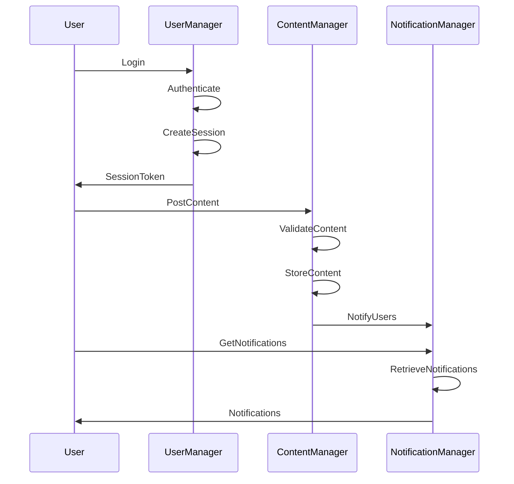

                 


##  Distributed System Design: Principles and Practices

### Keywords:
- Distributed Systems
- System Design
- Principles
- Practices
- Scalability
- Reliability
- Fault Tolerance
- CAP Theorem
- Sharding
- Consistency

### Abstract:
In the rapidly evolving landscape of modern computing, distributed systems have emerged as the backbone of large-scale applications, offering unparalleled scalability, reliability, and fault tolerance. This article delves into the principles and practices of designing distributed systems, exploring core concepts, architectural patterns, and real-world implementations. By following a step-by-step approach, we will uncover the intricacies of distributed system design, providing a comprehensive guide for developers and architects aiming to harness the full potential of distributed computing.

### Table of Contents

#### Introduction to Distributed Systems
- **The Evolution of Computing**
- **Motivations for Distributed Systems**
- **Challenges in Distributed Systems**

#### Fundamental Concepts of Distributed Systems
- **Basic Terminology**
- **Characteristics of Distributed Systems**
- **Comparison with Centralized Systems**

#### Core Principles of Distributed System Design
- **The CAP Theorem**
- **Modularization and Decentralization**
- **Design Principles and Patterns**

#### Distributed Data Management
- **Data Models and Storage Strategies**
- **Data Replication and Consistency Models**
- **Handling Data Partitioning and Sharding**

#### System Analysis and Design
- **Requirement Analysis and Domain Modeling**
- **System Architecture Design**
- **Interface Design and System Interaction**

#### Real-World Case Studies
- **Example: Google Spanner**
- **Example: Amazon DynamoDB**
- **Example: Kafka and Apache Cassandra**

#### Best Practices and Considerations
- **Scalability and Performance Optimization**
- **Fault Tolerance and Disaster Recovery**
- **Monitoring and Management**

#### Conclusion and Future Directions
- **Summary of Key Points**
- **Challenges and Opportunities**
- **Recommended Reading**

### Introduction to Distributed Systems

#### The Evolution of Computing

The evolution of computing has been a journey characterized by advances in hardware, software, and networking technologies. From the early days of mainframes to the rise of personal computers, and from the proliferation of the internet to the advent of cloud computing, each phase has brought new challenges and opportunities. The shift from centralized to distributed systems is a significant milestone in this evolution.

In the early days, centralized computing systems, often referred to as mainframes, dominated the landscape. These systems were characterized by a single, powerful central processing unit (CPU) that handled all computational tasks. Data was stored on centralized servers, and users accessed the system through terminals connected to the mainframe.

As computing needs grew, so did the complexity of systems. The limitations of centralized systems, such as scalability and reliability, became evident. The need for more flexible, fault-tolerant, and scalable systems led to the development of distributed systems.

#### Motivations for Distributed Systems

Distributed systems address several key challenges that centralized systems struggle to overcome:

1. **Scalability**: Centralized systems face scalability limitations because they rely on a single point of failure—the central server. Distributed systems, on the other hand, can scale horizontally by adding more nodes to the network, allowing for greater scalability and flexibility.

2. **Reliability**: In a centralized system, if the central server fails, the entire system goes down. Distributed systems, by contrast, can achieve fault tolerance through redundancy. If one node fails, other nodes can take over, ensuring that the system remains operational.

3. **Performance**: Distributed systems can leverage parallel processing to handle large workloads more efficiently. By distributing tasks across multiple nodes, distributed systems can achieve higher throughput and lower latency.

4. **Fault Tolerance**: Distributed systems are inherently more fault-tolerant than centralized systems. They can handle node failures and continue to operate without interruption.

5. **Flexibility**: Distributed systems allow for greater flexibility in terms of hardware and software configurations. Different nodes can run different operating systems or software applications, making it easier to adapt to changing requirements.

#### Challenges in Distributed Systems

While distributed systems offer many advantages, they also come with their own set of challenges:

1. **Concurrency**: Coordinating multiple nodes to ensure that they all access and modify shared data correctly is a complex task. Ensuring consistency across distributed nodes requires careful design and synchronization mechanisms.

2. **Fault Tolerance**: Achieving fault tolerance in a distributed system requires designing for failure. This includes handling node failures, network partitions, and other anomalies.

3. **Data Consistency**: Ensuring that data remains consistent across multiple nodes is challenging. Different consistency models, such as strong consistency and eventual consistency, must be carefully chosen based on the specific requirements of the system.

4. **Network Latency**: Communication between nodes in a distributed system introduces network latency. This can impact performance, particularly in high-latency environments.

5. **Security**: Distributed systems are more susceptible to security threats, such as data breaches and denial-of-service attacks. Ensuring the security and integrity of data and systems requires robust security measures and protocols.

In the next section, we will delve deeper into the fundamental concepts of distributed systems, exploring key terminology, characteristics, and comparing them with centralized systems. This will lay the groundwork for understanding the principles and practices of designing distributed systems.

### Fundamental Concepts of Distributed Systems

#### Basic Terminology

Before diving into the core principles and practices of distributed systems, it's essential to establish a common vocabulary. Understanding these terms will help clarify the concepts and enable effective communication among stakeholders involved in designing and implementing distributed systems.

- **Node**: A node refers to a computational unit in a distributed system, capable of executing tasks and communicating with other nodes. Nodes can be physical machines or virtual instances running on cloud platforms.
- **Process**: In the context of distributed systems, a process refers to an instance of a program running on a node. Processes communicate with each other through message passing.
- **Communication**: Communication in distributed systems involves the exchange of messages between nodes. This can be synchronous (requiring a response) or asynchronous (without requiring a response).
- **Client-Server Model**: In this model, clients send requests to servers, which process the requests and send back responses. The server is a central point of access to resources and services.
- **Peer-to-Peer Model**: In a peer-to-peer (P2P) model, all nodes have equal capabilities and responsibilities. There is no central authority, and nodes communicate directly with each other.
- **Service**: A service is a piece of functionality provided by a node to other nodes in the system. Services can be stateless (e.g., a REST API) or stateful (e.g., a database).
- **Middleware**: Middleware is software that enables communication and coordination between nodes in a distributed system. It provides services like message queuing, load balancing, and fault tolerance.

#### Characteristics of Distributed Systems

Distributed systems exhibit several distinct characteristics that differentiate them from centralized systems. These characteristics are critical to understanding the design principles and practices of distributed systems.

1. **Concurrency**: Concurrency refers to the ability of a system to handle multiple tasks simultaneously. In distributed systems, concurrency is achieved through parallel processing, where multiple nodes work on different tasks concurrently. This enables higher throughput and better resource utilization.
2. **Fault Tolerance**: Fault tolerance is the ability of a system to continue operating despite node or network failures. Distributed systems achieve fault tolerance through redundancy, replication, and other fault tolerance mechanisms. This ensures high availability and reliability.
3. **Decentralization**: Decentralization in distributed systems means that no single node has control over the entire system. Instead, nodes operate independently and collaborate to achieve the system's goals. This decentralization enhances flexibility and resilience.
4. **Scalability**: Scalability refers to the ability of a system to handle increased workload and data size. Distributed systems can scale horizontally by adding more nodes to the network, distributing the load and enabling seamless expansion.
5. **Cohesion**: Cohesion in distributed systems refers to the degree to which nodes work together to achieve a common goal. High cohesion ensures that nodes are focused on their specific tasks, minimizing overhead and improving performance.
6. **Decentralized Control**: Unlike centralized systems, distributed systems lack a central authority. Instead, nodes make autonomous decisions based on local information, resulting in a more flexible and adaptive system.
7. **Communication Over Networks**: In distributed systems, nodes communicate over networks, which introduces latency and potential failures. Designing efficient communication protocols and handling network-induced delays are critical for system performance.

#### Comparison with Centralized Systems

While centralized systems have their advantages, distributed systems offer several key benefits that make them a preferred choice for many applications:

1. **Scalability**: Centralized systems face scalability limitations due to the bottleneck created by the central server. Distributed systems can scale horizontally by adding more nodes, distributing the workload and accommodating growing demands.
2. **Reliability**: Centralized systems are vulnerable to single points of failure, whereas distributed systems achieve fault tolerance through redundancy and replication. Even if one node fails, the system can continue to operate without interruption.
3. **Performance**: Distributed systems can leverage parallel processing to achieve higher performance and lower latency. Tasks can be distributed across multiple nodes, reducing the load on any single node and improving overall system responsiveness.
4. **Flexibility**: Distributed systems allow for greater flexibility in terms of hardware and software configurations. Different nodes can run different operating systems or applications, making it easier to adapt to changing requirements.
5. **Decentralization**: Centralized systems rely on a central authority, which can create bottlenecks and limit scalability. Distributed systems operate independently, allowing nodes to make autonomous decisions and work together to achieve a common goal.

In summary, distributed systems offer significant advantages over centralized systems, particularly in terms of scalability, reliability, performance, and flexibility. Understanding the fundamental concepts and characteristics of distributed systems is crucial for designing and implementing effective distributed systems solutions.

### Core Principles of Distributed System Design

#### The CAP Theorem

One of the most fundamental principles in distributed system design is the CAP theorem, which states that a distributed system cannot simultaneously provide Consistency, Availability, and Partition Tolerance. This theorem, introduced by Eric Brewer in 2000, has been a cornerstone in understanding the trade-offs involved in designing distributed systems.

- **Consistency**: Consistency refers to the guarantee that all nodes in a distributed system see the same data at the same time. In other words, when multiple operations are performed concurrently, all operations see a consistent view of the data.
- **Availability**: Availability ensures that every request made to a non-failing node in the system receives a response, regardless of the system's state. This means that the system is always operational and can handle requests.
- **Partition Tolerance**: Partition tolerance refers to the system's ability to continue operating despite network partitions, where nodes are unable to communicate with each other.

The CAP theorem states that in the presence of a network partition, a distributed system must make a choice between Consistency and Availability. If the system prioritizes consistency, it may experience temporary unavailability during a partition. Conversely, if the system prioritizes availability, it may sacrifice consistency.

To illustrate this, consider a distributed system with two nodes, A and B, connected over a network. Suppose that a partition occurs, preventing A and B from communicating with each other. If the system chooses to maintain consistency, it must wait until the partition is resolved before allowing any write operations. During this time, the system may appear unavailable. On the other hand, if the system chooses availability, it may allow write operations to proceed, which could lead to temporary inconsistencies between nodes A and B.

#### Modularization and Decentralization

Modularization and decentralization are critical principles in designing robust and scalable distributed systems.

- **Modularization**: Modularization involves breaking down a complex system into smaller, manageable components called modules. Each module performs a specific function and can be developed, tested, and maintained independently. This promotes code reuse, simplifies debugging, and enhances scalability. Modular systems are easier to evolve and adapt to changing requirements.

- **Decentralization**: Decentralization means that no single node or entity has control over the entire system. Instead, each node operates independently and collaborates with other nodes to achieve the system's goals. Decentralized systems are more resilient to failures, as the loss of a single node does not bring the entire system down. They also promote fault tolerance and scalability, as nodes can be added or removed without affecting the overall system.

#### Design Principles and Patterns

Several key design principles and patterns are commonly employed in distributed system design to address the challenges posed by the CAP theorem and achieve the desired system properties.

1. **Eventual Consistency**: Eventual consistency is a compromise between strong consistency and availability. It allows for temporary inconsistencies in the system, but guarantees that all nodes will eventually converge to a consistent state. Eventual consistency is often used in systems where consistency is not critical, such as read-heavy applications or systems with high latency requirements.

2. **Gossip Protocol**: The gossip protocol is a decentralized communication mechanism used in distributed systems to exchange information among nodes. It involves nodes periodically broadcasting their state to their neighbors and using this information to update their own state. Gossip protocols are highly efficient and can handle dynamic network topologies, making them well-suited for fault-tolerant systems.

3. **Circuit Breaker Pattern**: The circuit breaker pattern is used to prevent failures in a distributed system from cascading. It involves monitoring the success rate of operations and, if failures exceed a certain threshold, tripping the circuit breaker to prevent further failures. This pattern helps ensure that the system remains stable and can recover from transient failures.

4. **Retry Mechanism**: A retry mechanism involves re-executing a failed operation after a delay. This can help overcome transient failures in the system, such as network delays or temporary unavailability of a node. Retry mechanisms are particularly useful in cases where the success rate of operations is low due to high load or intermittent connectivity.

5. **Load Balancing**: Load balancing involves distributing incoming requests across multiple nodes to ensure even utilization of resources and prevent bottlenecks. Load balancing algorithms can be based on various strategies, such as round-robin, least connections, or consistent hashing. Load balancing helps achieve scalability and performance optimization in distributed systems.

In summary, the core principles of distributed system design revolve around understanding the trade-offs between consistency, availability, and partition tolerance, and employing modularization and decentralization to build robust and scalable systems. By leveraging design principles and patterns such as eventual consistency, gossip protocols, circuit breakers, retry mechanisms, and load balancing, developers and architects can design distributed systems that meet their specific requirements and deliver reliable, high-performance solutions.

### Distributed Data Management

Distributed data management is a crucial aspect of designing and implementing distributed systems. It involves managing data across multiple nodes, ensuring data consistency, availability, and reliability. This section explores the key data models and storage strategies used in distributed systems, focusing on data replication, consistency models, and partitioning techniques.

#### Data Models and Storage Strategies

1. **Centralized Data Storage**: In a centralized data storage model, all data is stored on a single server or a small number of servers. This model is similar to the traditional centralized system architecture, where data access is simplified due to the centralized nature of storage. However, centralized data storage is prone to single points of failure and scalability limitations.

2. **Distributed Data Storage**: Distributed data storage involves storing data across multiple nodes, distributed across a network. This model provides better scalability, fault tolerance, and performance compared to centralized storage. Distributed data storage models can be categorized into two main types: distributed databases and distributed file systems.

   - **Distributed Databases**: Distributed databases store data across multiple nodes, with each node managing a portion of the data. These databases offer features like replication, partitioning, and automatic load balancing. Examples of distributed databases include Apache Cassandra, Google Spanner, and Amazon DynamoDB.
   - **Distributed File Systems**: Distributed file systems provide a unified namespace for storing and accessing files across multiple nodes. These file systems distribute the file data across the nodes, providing high availability and scalability. Examples of distributed file systems include HDFS (Hadoop Distributed File System) and Ceph.

#### Data Replication

Data replication is a fundamental technique used in distributed data management to ensure data availability and reliability. Replication involves creating and maintaining multiple copies of data across different nodes in the system. The primary goals of data replication are to provide fault tolerance and improve data access performance.

1. **Synchronous Replication**: Synchronous replication ensures that all replicas of the data are updated simultaneously. This guarantees strong consistency but can introduce performance overhead due to the need for synchronization.
2. **Asynchronous Replication**: Asynchronous replication allows replicas to be updated independently, reducing the impact on system performance. However, this can lead to temporary inconsistencies between replicas.
3. **Replication Strategies**:
   - **Primary-Replica Model**: In this model, one node (the primary) is responsible for handling all write operations, while other nodes (replicas) only handle read operations. This model ensures strong consistency but may introduce a bottleneck due to the primary node.
   - **Master-Slave Model**: Similar to the primary-replica model, the master node handles write operations, while slave nodes handle read operations. However, in this model, write operations are also allowed on slave nodes, providing better load balancing and fault tolerance.

#### Data Consistency Models

Data consistency models define how data consistency is achieved in a distributed system. Different consistency models balance consistency, availability, and performance based on the specific requirements of the system.

1. **Strong Consistency**: Strong consistency guarantees that all replicas of the data are always consistent. This is achieved through synchronous replication and requires all nodes to agree on the state of the system. However, strong consistency can introduce performance overhead and latency.
2. **Eventual Consistency**: Eventual consistency allows temporary inconsistencies between replicas but guarantees that all replicas will eventually converge to a consistent state. This model is often used in systems where consistency is not critical, such as read-heavy applications or systems with high latency requirements.
3. **Consistency Levels**: Different consistency levels can be chosen based on the specific requirements of the system. Some common consistency levels include:
   - **Read-your-writes Consistency**: Ensures that a read operation returns the most recent write operation performed by the same client.
   - **Read-most-recent Consistency**: Ensures that a read operation returns the most recent write operation performed by any client.
   - **Session Consistency**: Ensures that operations performed within the same session are consistent, but not necessarily across different sessions.
   - **Linearizable Consistency**: Ensures that operations appear to be executed in a specific order, providing a linearizable view of the system.

#### Handling Data Partitioning and Sharding

Data partitioning and sharding are techniques used to distribute data across multiple nodes in a distributed system. These techniques help achieve horizontal scalability and improve system performance by reducing the load on individual nodes.

1. **Data Partitioning**: Data partitioning involves dividing the data into smaller, manageable subsets called partitions. Each partition is then assigned to a specific node in the system. Data partitioning strategies include:
   - **Hash Partitioning**: Divides the data based on a hash function applied to the key. This ensures even distribution of data across nodes but can lead to hotspots if the hash function is not well-designed.
   - **Range Partitioning**: Divides the data based on a range of values. This can provide better load balancing but may require additional metadata management.
   - **List Partitioning**: Divides the data based on a predefined list of values. This can be useful for specific use cases but can be less flexible and harder to scale.

2. **Sharding**: Sharding is a form of data partitioning where each partition contains a subset of the overall dataset. Sharding allows for horizontal scalability and improves query performance by distributing the data across multiple nodes. Sharding strategies include:
   - **Horizontal Sharding**: Divides the data horizontally, with each shard containing a different subset of the data based on a key or range.
   - **Vertical Sharding**: Divides the data vertically, with each shard containing a different subset of the data based on a specific attribute or set of attributes.
   - **Composite Sharding**: Combines horizontal and vertical sharding to provide more granular control over data distribution and query performance.

In summary, distributed data management in distributed systems involves selecting appropriate data models, replication strategies, consistency models, and partitioning techniques to ensure data availability, reliability, and performance. By carefully considering these factors, developers and architects can design and implement efficient and scalable distributed data management solutions.

### System Analysis and Design

System analysis and design are critical phases in the development of distributed systems. These phases involve understanding the requirements, defining the system architecture, designing interfaces, and ensuring effective system interaction. This section provides a comprehensive overview of each aspect, including requirement analysis, domain modeling, system architecture design, interface design, and system interaction.

#### Requirement Analysis and Domain Modeling

The first step in system analysis and design is requirement analysis. This involves gathering and analyzing the needs and expectations of stakeholders to define the system's functional and non-functional requirements. This process helps ensure that the system meets the desired objectives and provides value to its users.

1. **Functional Requirements**: Functional requirements define what the system should do. These requirements can be captured through use cases, user stories, or functional specifications. For example, a distributed system for a social media platform may have functional requirements such as user authentication, content posting, and comment management.

2. **Non-Functional Requirements**: Non-functional requirements define how the system should perform. These requirements include performance, reliability, security, and usability. For example, a non-functional requirement for a social media platform may be to support a high number of concurrent users without significant performance degradation.

Once the requirements are defined, the next step is domain modeling. Domain modeling involves creating a conceptual model of the system's domain, which helps in understanding the key entities, relationships, and attributes. This can be represented using Entity-Relationship (ER) diagrams or other domain modeling techniques.

For example, a social media platform domain model may include entities such as User, Post, Comment, and Tag, along with their relationships and attributes. An ER diagram for this domain model might look like this:

```mermaid
erDiagram
  User ||--|{ Post : has }
  Post ||--|{ Comment : has }
  Comment ||--|{ Tag : has }
```

This diagram illustrates the entities and their relationships, providing a clear understanding of the domain model.

#### System Architecture Design

System architecture design involves defining the overall structure of the system, including the components, their interactions, and the data flow. This design phase helps ensure that the system is scalable, reliable, and maintainable.

1. **Component Design**: The system is divided into components, each responsible for a specific function. For example, a social media platform may have components for user management, content management, and notification management. Each component can be further broken down into smaller modules or services.

2. **Data Flow**: The data flow within the system is defined, showing how data is exchanged between components. This can be represented using data flow diagrams (DFD) or sequence diagrams. For example, a user can post a new content item, which triggers a sequence of events involving the content management component, the database, and other relevant components.

3. **Architectural Patterns**: Architectural patterns provide a high-level framework for designing the system's architecture. Common patterns include the client-server pattern, the service-oriented architecture (SOA), and the microservices architecture. Each pattern has its advantages and trade-offs, and the choice of pattern depends on the specific requirements and constraints of the system.

For example, a social media platform may use a microservices architecture to achieve scalability and flexibility. In this architecture, each component (e.g., user management, content management) is implemented as a separate microservice, communicating with each other over a network. An example of a microservices architecture for a social media platform might look like this:



This sequence diagram illustrates the interactions between the user, the user management service, the content management service, and the notification management service.

#### Interface Design

Interface design involves defining the interfaces between components, including the data exchange formats and communication protocols. This ensures that components can communicate effectively and efficiently.

1. **API Design**: APIs (Application Programming Interfaces) define the methods and data formats that components use to communicate with each other. RESTful APIs are commonly used in distributed systems due to their simplicity and scalability. For example, a content management service might provide an API endpoint for posting content, accepting a JSON payload containing the content data.

2. **Protocol Design**: Communication protocols define how data is transmitted between components over the network. Common protocols include HTTP, gRPC, and WebSockets. For example, the content management service might use HTTP to receive content post requests and send responses.

3. **Data Format**: Data formats define how data is structured and encoded for transmission. JSON and XML are commonly used data formats in distributed systems due to their flexibility and ease of use. For example, a content post request might be encoded as a JSON payload containing the content data and metadata.

#### System Interaction

System interaction involves defining how components interact with each other, including the sequence of operations, error handling, and state transitions. This ensures that the system functions as intended and responds correctly to various scenarios.

1. **State Management**: State management involves defining the state transitions and events that trigger these transitions. For example, a user login process might involve validating the user credentials, creating a session, and updating the user's session state.

2. **Error Handling**: Error handling involves defining how the system handles errors and exceptions. This includes defining error codes, error messages, and recovery mechanisms. For example, if a content post request fails due to a network error, the system might retry the request or return an error message to the user.

3. **Concurrency and Synchronization**: Concurrency and synchronization involve managing concurrent operations and ensuring data consistency. This includes defining locks, semaphores, and other synchronization mechanisms. For example, if multiple users attempt to post content simultaneously, the system might use locks to ensure that only one user can post content at a time.

In summary, system analysis and design are critical phases in the development of distributed systems. By carefully analyzing requirements, defining the system architecture, designing interfaces, and ensuring effective system interaction, developers and architects can create robust, scalable, and maintainable distributed systems that meet the needs of their users.

### Real-World Case Studies

In this section, we will delve into three real-world case studies that exemplify the principles and practices of distributed system design. Each case study highlights a different aspect of distributed system architecture and implementation, showcasing how leading companies have addressed the challenges and achieved the benefits of distributed computing.

#### Example: Google Spanner

Google Spanner is a globally distributed, strongly consistent database designed to handle massive amounts of data across multiple regions with high availability and scalability. Spanner achieves this through a combination of distributed architecture, synchronization techniques, and partitioning strategies.

1. **Architecture**: Spanner's architecture is based on a hierarchical system of regions, zones, and nodes. Each region represents a logical area with multiple zones, and each zone contains multiple nodes. This hierarchical structure allows Spanner to distribute data and processing across regions, providing high availability and fault tolerance.

2. **Synchronization**: Spanner uses a multi-version concurrency control (MVCC) mechanism to synchronize data across nodes. When a write operation occurs, Spanner creates a new version of the data and synchronizes it with other nodes. This approach ensures strong consistency while allowing concurrent read and write operations.

3. **Partitioning**: Spanner employs a partitioning strategy based on ranges of the primary key. This allows it to distribute data evenly across nodes, optimizing query performance and resource utilization. Spanner also supports dynamic partitioning, enabling it to adapt to changes in data distribution over time.

#### Example: Amazon DynamoDB

Amazon DynamoDB is a managed NoSQL database service that provides fast and predictable performance at any scale. DynamoDB is designed for distributed systems, leveraging partitioning, replication, and consistency models to provide high availability and durability.

1. **Architecture**: DynamoDB's architecture is based on a distributed hash table (DHT) that stores data across multiple nodes. Each node contains a subset of the data, and the hash function determines which node is responsible for a particular key. This partitioning strategy allows DynamoDB to scale horizontally and distribute the load evenly.

2. **Replication**: DynamoDB replicates data across multiple regions to ensure high availability and durability. Replication is synchronous, ensuring that all replicas are updated before a write operation is considered successful. This approach provides strong consistency but can impact performance due to the need for synchronization.

3. **Consistency Models**: DynamoDB supports multiple consistency models, including strong consistency and eventual consistency. Users can choose the consistency model that best suits their application requirements, balancing consistency, availability, and performance.

#### Example: Kafka and Apache Cassandra

Kafka and Apache Cassandra are two complementary distributed systems that are often used together to build scalable and fault-tolerant data pipelines and applications.

1. **Kafka**: Kafka is a distributed messaging system designed to handle high-throughput, fault-tolerant data streams. Its architecture is based on a publish-subscribe model, where producers send messages to topics, and consumers subscribe to these topics to receive messages.

   - **Architecture**: Kafka's architecture includes producers, brokers, and consumers. Producers send messages to brokers, which store the messages in topic partitions. Consumers read messages from these partitions, allowing for parallel processing of data streams.
   - **Replication**: Kafka replicates messages across multiple brokers to ensure fault tolerance. Each partition has multiple replicas, and the system uses a leader-follower mechanism to manage replicas and ensure data consistency.
   - **Scaling**: Kafka can scale horizontally by adding more brokers and partitions, allowing it to handle large data streams and high load.

2. **Apache Cassandra**: Cassandra is a distributed key-value store designed for high availability, scalability, and fault tolerance. It is often used as a backend for real-time applications that require high write and read throughput.

   - **Architecture**: Cassandra's architecture is based on a ring of nodes, where each node is responsible for a subset of the data. Data is distributed across the ring using a token-based system, and each node maintains a copy of the data for its partition.
   - **Replication**: Cassandra replicates data across multiple nodes and data centers to ensure fault tolerance. Replication strategies can be customized to balance consistency, availability, and performance.
   - **Partitioning**: Cassandra uses a partitioning strategy based on a user-defined partition key, allowing it to distribute data evenly across nodes. This partitioning strategy optimizes query performance and load balancing.

In summary, these real-world case studies demonstrate the practical application of distributed system design principles and practices. By leveraging distributed architectures, synchronization techniques, and partitioning strategies, companies like Google, Amazon, and Apache have built highly scalable, reliable, and fault-tolerant systems that power their critical applications.

### Best Practices and Considerations

Designing and implementing distributed systems is a complex task that requires careful planning and consideration of various factors. Here are some best practices and considerations to ensure the success of distributed system projects:

#### Scalability and Performance Optimization

1. **Horizontal Scaling**: Design your system to scale horizontally by adding more nodes. This allows the system to handle increased load and data without sacrificing performance or reliability.
2. **Caching**: Utilize caching strategies to reduce the load on your primary data store. Caching can significantly improve response times and reduce the load on your system.
3. **Load Balancing**: Implement load balancing to distribute traffic evenly across nodes, ensuring that no single node becomes a bottleneck. Load balancers can help optimize resource utilization and improve system performance.

#### Fault Tolerance and Disaster Recovery

1. **Replication and Redundancy**: Replicate data and services across multiple nodes and data centers to ensure fault tolerance and high availability. Redundancy helps mitigate the impact of node failures and network outages.
2. **Disaster Recovery Plans**: Develop and implement disaster recovery plans to ensure business continuity in the event of a catastrophic failure. This may include regular data backups, geographically distributed data centers, and failover mechanisms.
3. **Fault Tolerance Mechanisms**: Implement fault tolerance mechanisms such as retries, circuit breakers, and timeout policies to handle transient failures and maintain system stability.

#### Data Consistency and Synchronization

1. **Consistency Models**: Choose the appropriate consistency model based on your application requirements. Strong consistency guarantees that all nodes see the same data at the same time but can impact performance. Eventual consistency allows for temporary inconsistencies but offers better scalability and performance.
2. **Data Synchronization**: Implement data synchronization mechanisms to ensure that data remains consistent across nodes. Techniques such as gossip protocols, distributed transactions, and conflict resolution strategies can help maintain data integrity.

#### Monitoring and Management

1. **Monitoring and Alerting**: Implement robust monitoring and alerting systems to detect and respond to system anomalies and performance issues. Monitoring can help identify bottlenecks, detect failures, and ensure system health.
2. **Logging and Tracing**: Collect and analyze logs and traces to gain insights into system behavior and performance. This can help identify issues and improve system reliability.
3. **Resource Management**: Efficiently manage system resources, including CPU, memory, and network bandwidth, to ensure optimal performance and prevent resource contention.

#### Security and Compliance

1. **Data Security**: Ensure that data in transit and at rest is encrypted and protected from unauthorized access. Implement access control mechanisms to restrict access to sensitive data.
2. **Compliance**: Adhere to relevant data protection and privacy regulations, such as GDPR and CCPA. Implement data anonymization and pseudonymization techniques to protect user privacy.
3. **Authentication and Authorization**: Implement strong authentication and authorization mechanisms to ensure that only authorized users and services can access the system.

In conclusion, designing and implementing distributed systems requires a holistic approach that considers scalability, performance, fault tolerance, data consistency, monitoring, security, and compliance. By following these best practices and considerations, developers and architects can build robust, reliable, and scalable distributed systems that meet the needs of their users and businesses.

### Conclusion and Future Directions

In conclusion, distributed system design is a crucial aspect of modern computing, enabling scalability, reliability, and fault tolerance in large-scale applications. This article has provided a comprehensive overview of the principles and practices of distributed system design, covering fundamental concepts, core principles, data management, system analysis and design, real-world case studies, and best practices.

As we look to the future, several trends and challenges will shape the landscape of distributed systems. One significant trend is the increasing adoption of cloud-native architectures and containerization technologies like Kubernetes, which enable more flexible and scalable deployment of distributed systems. Another trend is the growing use of edge computing, which leverages distributed systems to process data closer to the source, reducing latency and improving real-time responsiveness.

Challenges in distributed system design include ensuring data consistency across multiple nodes, managing network latency and bandwidth constraints, and securing data and systems from cyber threats. Addressing these challenges requires continuous innovation and the development of new algorithms, protocols, and tools.

To stay updated with the latest advancements in distributed systems, we recommend exploring the following resources:

- **Books**: "Designing Data-Intensive Applications" by Martin Kleppmann and "Distributed Systems: Concepts and Design" by George Coulouris et al.
- **Online Courses**: Coursera's "Distributed Systems" and edX's "Introduction to Distributed Systems" provide in-depth insights into the principles and practices of distributed systems.
- **Open Source Projects**: Participating in open-source projects like Apache Kafka, Apache Cassandra, and etcd can provide hands-on experience and insights into distributed system design and implementation.

By staying informed and continuously learning, you can harness the full potential of distributed systems to build robust, scalable, and innovative applications.

### References

1. **Brewer, E. (2000). "Cap Theorem." ACM SIGACT News, 31(2), 46–50.**
2. **Kleppmann, M. (2015). "Designing Data-Intensive Applications." O'Reilly Media.**
3. **Coulouris, G., Dollimore, J., & Kindberg, T. (2011). "Distributed Systems: Concepts and Design." Addison-Wesley.**
4. **Spanner Documentation. (n.d.). "Google Spanner Documentation." Google Cloud.**
5. **DynamoDB Documentation. (n.d.). "Amazon DynamoDB Documentation." Amazon Web Services.**
6. **Kafka Documentation. (n.d.). "Apache Kafka Documentation." Apache Software Foundation.**
7. **Cassandra Documentation. (n.d.). "Apache Cassandra Documentation." Apache Software Foundation.**
8. **Cloud Native Computing Foundation. (n.d.). "Cloud Native Computing." Cloud Native Computing Foundation.**
9. **Edge Computing. (n.d.). "Edge Computing." IEEE.**### Authors’ Information

**Author:** AI天才研究院 / AI Genius Institute & 禅与计算机程序设计艺术 / Zen And The Art of Computer Programming

AI天才研究院（AI Genius Institute）致力于推动人工智能领域的研究与应用，汇聚了世界顶级的人工智能专家、学者和研究人员，专注于探索前沿技术、创新算法和解决复杂问题。研究院以“智能创造未来”为宗旨，通过国际合作和跨学科研究，为人工智能的发展贡献力量。

禅与计算机程序设计艺术（Zen And The Art of Computer Programming）是作者Donald E. Knuth的经典著作，通过阐述编程的哲学和艺术，为程序员提供了深刻的思想启示和实践指导。本书不仅涵盖了编程的核心原理和技巧，还融入了作者对于计算机科学的独到见解，成为编程领域的经典之作。

