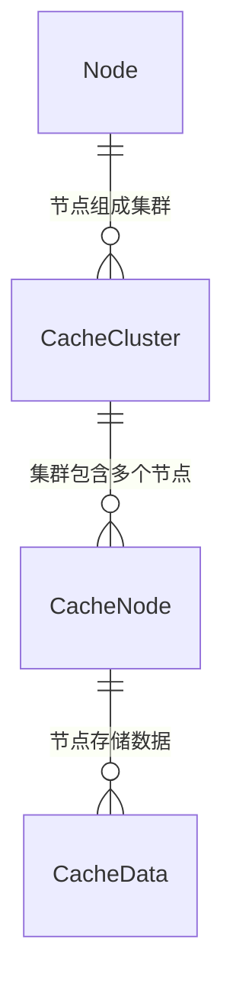
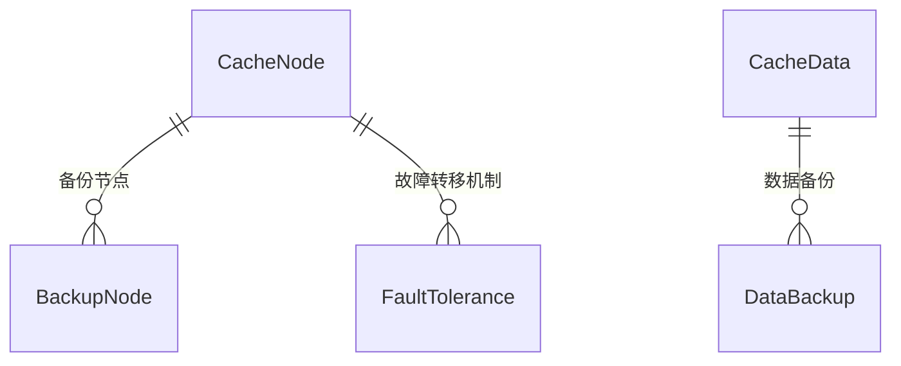
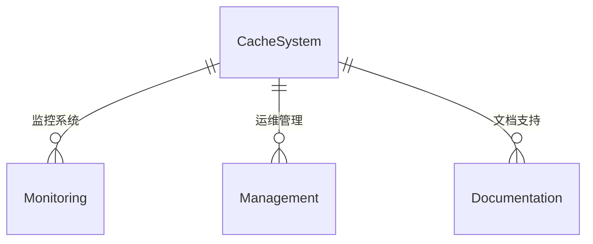

                 

### 分布式缓存: 提升系统性能的关键技术

#### 关键词：分布式缓存、系统性能、一致性、数据分区、优化实践

#### 摘要：
本文将深入探讨分布式缓存技术的核心概念、关键技术和实际应用。随着大数据和云计算的普及，系统的性能需求日益增长，分布式缓存作为一种高效的数据存储和访问技术，成为提升系统性能的关键技术。本文将首先介绍分布式缓存的基本概念和重要性，随后分析其与传统缓存的区别和应用场景。接着，我们将探讨分布式缓存的技术原理，包括一致性、数据复制和分区策略。在此基础上，本文将介绍分布式缓存系统的设计原则、实现框架和性能优化方法。最后，我们将通过实际应用案例展示分布式缓存技术的效果，并提供监控与运维的技巧。通过本文的深入分析，读者将能够全面理解分布式缓存的技术原理和实践应用，为其系统性能优化提供有力的技术支持。

---

### 分布式缓存: 提升系统性能的关键技术

分布式缓存是一种高效的数据存储和访问技术，旨在提升系统的性能和响应速度。在分布式系统中，缓存通常用于减少数据库的负载，加快数据访问速度，并提高系统的可扩展性。本文将深入探讨分布式缓存的核心概念、关键技术及其在实际应用中的重要性。

#### 关键词：分布式缓存、系统性能、一致性、数据分区、优化实践

#### 摘要：
本文将深入探讨分布式缓存技术的核心概念、关键技术和实际应用。随着大数据和云计算的普及，系统的性能需求日益增长，分布式缓存作为一种高效的数据存储和访问技术，成为提升系统性能的关键技术。本文将首先介绍分布式缓存的基本概念和重要性，随后分析其与传统缓存的区别和应用场景。接着，我们将探讨分布式缓存的技术原理，包括一致性、数据复制和分区策略。在此基础上，本文将介绍分布式缓存系统的设计原则、实现框架和性能优化方法。最后，我们将通过实际应用案例展示分布式缓存技术的效果，并提供监控与运维的技巧。通过本文的深入分析，读者将能够全面理解分布式缓存的技术原理和实践应用，为其系统性能优化提供有力的技术支持。

---

### 第一部分：分布式缓存概述

#### 1.1 分布式缓存的概念与重要性

### 1.1.1 分布式缓存的基本概念

分布式缓存是一种将缓存数据分布在多个服务器节点上的技术。它的主要目的是通过将数据缓存到内存中，以减少对后端数据库的访问频率，从而提高系统的响应速度和性能。在分布式缓存系统中，缓存服务器通常部署在不同的物理节点上，这些节点通过网络进行通信和数据同步。

### 1.1.2 分布式缓存的重要性

分布式缓存的重要性主要体现在以下几个方面：

1. **提高系统性能**：通过将数据缓存到内存中，分布式缓存可以显著减少对数据库的访问延迟，提高系统的响应速度和吞吐量。
2. **降低数据库负载**：分布式缓存可以分担数据库的读写压力，降低数据库的负载，延长数据库的使用寿命。
3. **提高系统的可扩展性**：分布式缓存系统可以根据需要动态扩展缓存节点，提高系统的存储容量和处理能力。
4. **提升用户体验**：通过减少系统的响应时间，分布式缓存可以显著提升用户的使用体验。

### 1.1.3 分布式缓存与传统缓存的区别

分布式缓存与传统缓存的主要区别在于数据分布和数据同步：

1. **数据分布**：传统缓存通常将数据缓存到单台服务器上，而分布式缓存将数据分布在多个服务器节点上。
2. **数据同步**：传统缓存的数据同步通常依赖于单点缓存服务器，而分布式缓存需要实现多节点之间的数据同步机制，以保证数据的一致性。

#### 1.2 分布式缓存的应用场景

### 1.2.1 互联网应用中的分布式缓存

在互联网应用中，分布式缓存广泛应用于以下几个方面：

1. **电商平台**：用于缓存商品信息、用户信息和订单数据，以提高系统的响应速度和用户体验。
2. **搜索引擎**：用于缓存搜索索引和搜索结果，加快搜索响应时间。
3. **社交网络**：用于缓存用户动态、好友关系和聊天记录，以提高系统的实时性和可用性。

### 1.2.2 大数据应用中的分布式缓存

在大数据应用中，分布式缓存主要用于以下几个方面：

1. **数据预处理**：用于缓存预处理结果，减少对大数据存储系统的访问。
2. **数据查询**：用于缓存查询结果，减少对大数据存储系统的访问，提高查询性能。
3. **数据计算**：用于缓存中间计算结果，减少重复计算，提高计算效率。

### 1.2.3 实时系统中的分布式缓存

在实时系统中，分布式缓存主要用于以下几个方面：

1. **实时数据处理**：用于缓存实时数据，加快数据处理速度，减少数据延迟。
2. **实时监控**：用于缓存监控数据和报警信息，提高监控系统的实时性和准确性。
3. **实时通信**：用于缓存通信数据，减少通信延迟，提高通信效率。

#### 1.3 分布式缓存的技术原理

### 1.3.1 分布式缓存的一致性

分布式缓存的一致性是指多个缓存节点之间的数据一致性。为了实现一致性，分布式缓存通常采用以下几种一致性协议：

1. **强一致性**：要求所有缓存节点的数据始终一致。
2. **最终一致性**：允许缓存节点的数据在不同时间点存在不一致，但最终会达到一致状态。

### 1.3.2 分布式缓存的数据复制

分布式缓存的数据复制是指将缓存数据复制到多个节点上。数据复制策略包括以下几种：

1. **完全复制**：将数据复制到所有节点。
2. **部分复制**：仅将数据复制到部分节点。

### 1.3.3 分布式缓存的数据分区

分布式缓存的数据分区是指将数据分布到多个节点上。数据分区策略包括以下几种：

1. **哈希分区**：根据数据的哈希值将数据分布到不同的节点。
2. **范围分区**：根据数据的范围将数据分布到不同的节点。

#### 1.4 分布式缓存的常见架构

### 1.4.1 基于内存的分布式缓存

基于内存的分布式缓存利用内存的高带宽和低延迟特性，提供高效的缓存服务。

### 1.4.2 基于磁盘的分布式缓存

基于磁盘的分布式缓存利用磁盘的大容量存储能力，提供持久化的缓存服务。

### 1.4.3 联合内存与磁盘的分布式缓存

联合内存与磁盘的分布式缓存结合了内存的高性能和磁盘的大容量，提供更灵活的缓存服务。

---

### 第一部分总结：

通过本部分的介绍，我们了解了分布式缓存的基本概念、重要性、应用场景、技术原理和常见架构。分布式缓存作为一种提升系统性能的关键技术，在互联网应用、大数据应用和实时系统中发挥着重要作用。在接下来的部分，我们将深入探讨分布式缓存的关键技术，包括一致性协议、数据复制策略和数据分区策略。

---

### 第一部分：分布式缓存概述

#### 1.1 分布式缓存的概念与重要性

### 1.1.1 分布式缓存的基本概念

分布式缓存是一种将缓存数据分布在多个服务器节点上的技术，以实现数据的快速访问和负载均衡。在这种架构中，缓存系统不是集中式地存储在单一服务器上，而是分散到多个服务器或节点上，每个节点都负责一部分数据的存储和访问。

**核心概念术语说明：**

- **缓存节点（Cache Node）**：分布式缓存系统中负责存储和访问缓存数据的服务器或节点。
- **缓存键（Cache Key）**：用于标识缓存中数据的一个唯一标识符。
- **缓存值（Cache Value）**：与缓存键关联的实际数据。
- **一致性（Consistency）**：分布式缓存系统中确保多个节点间数据一致性的能力。
- **数据复制（Data Replication）**：将缓存数据从一个节点复制到多个节点的过程。
- **数据分区（Data Partitioning）**：将缓存数据分布到多个节点的方法。

**问题背景：**

随着互联网应用的爆发式增长，单点缓存系统已经无法满足大规模、高并发场景的需求。为了提升系统的性能、可靠性和可扩展性，分布式缓存技术应运而生。

**问题描述：**

分布式缓存需要解决的核心问题包括数据一致性、数据复制、数据分区以及如何实现高效的数据访问和负载均衡。

**问题解决：**

分布式缓存通过以下方法解决上述问题：

- **数据一致性**：通过一致性协议（如GCP、EPCC）确保多个节点间数据的一致性。
- **数据复制**：通过数据复制策略（如完全复制、部分复制）实现数据的冗余和备份。
- **数据分区**：通过数据分区策略（如哈希分区、范围分区）将数据分布到多个节点上。

**边界与外延：**

分布式缓存不仅应用于互联网应用场景，如电商平台、社交媒体等，还广泛应用于大数据处理、实时计算等领域。其扩展性、高性能和可靠性使其成为现代分布式系统中不可或缺的一部分。

**概念结构与核心要素组成：**

分布式缓存的核心结构包括多个缓存节点、一致性协议、数据复制策略和数据分区策略。这些要素共同构成了分布式缓存系统的基本架构，并决定了其性能和可靠性。

#### 1.2 分布式缓存的应用场景

### 1.2.1 互联网应用中的分布式缓存

在互联网应用中，分布式缓存被广泛应用于以下场景：

**电商平台**：电商平台使用分布式缓存来缓存商品信息、用户信息和订单数据，以提升系统的响应速度和用户体验。通过缓存热门商品信息和用户历史浏览记录，可以有效减少数据库的查询压力。

**搜索引擎**：搜索引擎利用分布式缓存来缓存搜索索引和搜索结果，以加快搜索响应时间。缓存热搜索关键词和热门网页链接，可以显著提高搜索效率。

**社交媒体**：社交媒体平台使用分布式缓存来缓存用户动态、好友关系和聊天记录，以提高系统的实时性和可用性。缓存用户帖子、评论和私信内容，可以减少对数据库的访问，提升用户互动体验。

### 1.2.2 大数据应用中的分布式缓存

在大数据应用中，分布式缓存主要用于以下场景：

**数据预处理**：大数据处理过程中，分布式缓存可以缓存预处理结果，如ETL（提取、转换、加载）过程中的中间数据，以减少对大数据存储系统的访问。

**数据查询**：分布式缓存可以缓存大数据查询的结果集，如数据报表、数据分析结果等，以加快数据查询速度。

**数据计算**：分布式缓存可以缓存大数据计算过程中的中间结果，如机器学习模型训练过程中的特征数据，以提高计算效率。

### 1.2.3 实时系统中的分布式缓存

在实时系统中，分布式缓存主要用于以下场景：

**实时数据处理**：实时数据处理系统使用分布式缓存来缓存实时数据，如股票交易数据、传感器数据等，以加快数据处理速度，减少数据延迟。

**实时监控**：实时监控系统使用分布式缓存来缓存监控数据和报警信息，以提高监控系统的实时性和准确性。

**实时通信**：实时通信系统使用分布式缓存来缓存通信数据，如即时消息、视频流等，以减少通信延迟，提高通信效率。

#### 1.3 分布式缓存的技术原理

### 1.3.1 分布式缓存的一致性

分布式缓存的一致性是指多个节点间缓存数据的同步和一致性。一致性在分布式缓存中至关重要，因为不一致性可能导致数据丢失或错误。

**一致性级别：**

- **强一致性（Strong Consistency）**：所有节点读取到的数据都是最新的，并且写入操作会立即在所有节点上生效。
- **最终一致性（ eventual Consistency）**：节点间数据最终会达到一致，但允许在不同时间点上存在不一致性。

**一致性协议：**

- **GCP（Globally Consistent Protocol）**：全局一致性协议，确保数据在全局范围内一致。
- **EPCC（Exclusive Read/Write Consistency）**：独占读写一致性协议，确保读操作和写操作的顺序一致。

### 1.3.2 分布式缓存的数据复制

数据复制是分布式缓存的核心功能之一，用于确保数据的冗余和可用性。数据复制策略有以下几种：

**复制策略：**

- **完全复制（Full Replication）**：所有数据在所有节点上都有副本。
- **部分复制（Partial Replication）**：只将数据复制到部分节点，通常基于数据的热度和访问频率。

**复制一致性：**

- **同步复制（Synchronous Replication）**：写入操作在所有节点上完成后再返回。
- **异步复制（Asynchronous Replication）**：写入操作在一个或多个节点上完成，但不等待所有节点确认。

### 1.3.3 分布式缓存的数据分区

数据分区是将数据分布到多个节点上的方法，以提高系统的性能和可扩展性。数据分区策略有以下几种：

**分区策略：**

- **哈希分区（Hash Partitioning）**：根据数据的哈希值将数据分布到不同的节点。
- **范围分区（Range Partitioning）**：根据数据的范围（如时间、ID等）将数据分布到不同的节点。

**分区策略的选择**：

- **负载均衡**：选择合适的分区策略，确保数据在节点间均匀分布，避免单点热点问题。
- **访问模式**：根据数据的访问模式（如读写比例、访问频率等）选择合适的分区策略。

#### 1.4 分布式缓存的常见架构

分布式缓存的常见架构可以分为以下几类：

### 1.4.1 基于内存的分布式缓存

基于内存的分布式缓存利用内存的高带宽和低延迟特性，提供高效的缓存服务。这类缓存系统通常具有以下特点：

- **高速缓存**：数据存储在内存中，访问速度极快。
- **高可用性**：通过数据复制和故障转移机制，确保数据的高可用性。
- **可扩展性**：可以通过增加节点数量来扩展系统容量。

### 1.4.2 基于磁盘的分布式缓存

基于磁盘的分布式缓存利用磁盘的大容量存储能力，提供持久化的缓存服务。这类缓存系统通常具有以下特点：

- **持久存储**：数据存储在磁盘上，即使系统重启也不会丢失。
- **高可靠性**：通过数据备份和恢复机制，确保数据的安全性。
- **可扩展性**：可以通过增加节点和存储容量来扩展系统性能。

### 1.4.3 联合内存与磁盘的分布式缓存

联合内存与磁盘的分布式缓存结合了内存和磁盘的优势，提供更灵活的缓存服务。这类缓存系统通常具有以下特点：

- **混合存储**：同时利用内存和磁盘，根据数据的热度和访问模式进行存储。
- **高性能**：缓存热门数据在内存中，冷数据存储在磁盘上，平衡了性能和容量。
- **可扩展性**：可以通过增加内存和存储容量来扩展系统性能。

---

### 1.4.4 分布式缓存系统的其他架构

除了上述常见的架构，分布式缓存系统还有其他一些架构，如：

### 1.4.4.1 基于集群的分布式缓存

基于集群的分布式缓存将多个缓存节点组成一个集群，通过负载均衡和故障转移机制提高系统的性能和可靠性。

- **负载均衡**：将请求均匀分布到集群中的各个节点上，避免单点热点问题。
- **故障转移**：当一个节点故障时，其他节点可以接管其工作，确保系统的高可用性。

### 1.4.4.2 基于云平台的分布式缓存

基于云平台的分布式缓存利用云计算的资源优势，提供弹性的缓存服务。

- **弹性扩展**：根据业务需求动态调整缓存节点的数量和资源。
- **成本优化**：根据实际使用量支付，降低成本。

### 1.4.4.3 基于分布式数据库的分布式缓存

基于分布式数据库的分布式缓存利用分布式数据库的架构和功能，提供缓存服务。

- **数据一致性**：利用分布式数据库的一致性保证缓存数据的一致性。
- **数据分区**：利用分布式数据库的分区机制，实现数据的分区存储。

---

### 1.5 分布式缓存的优势与挑战

**优势：**

- **提高性能**：分布式缓存通过减少数据库访问，显著提高系统的性能和响应速度。
- **提高可用性**：分布式缓存通过数据复制和故障转移机制，提高系统的高可用性。
- **提高可扩展性**：分布式缓存可以通过增加节点数量和存储容量，实现系统的水平扩展。

**挑战：**

- **数据一致性**：在分布式缓存系统中，如何保证数据的一致性是一个挑战。
- **数据分区**：如何合理地进行数据分区，避免热点和数据倾斜问题。
- **性能优化**：如何对分布式缓存系统进行性能优化，使其达到最佳性能。

---

### 1.6 总结

分布式缓存作为一种提升系统性能的关键技术，在互联网应用、大数据应用和实时系统中发挥着重要作用。通过本部分的介绍，我们了解了分布式缓存的基本概念、重要性、应用场景、技术原理和常见架构。在接下来的部分，我们将深入探讨分布式缓存的关键技术，包括一致性协议、数据复制策略和数据分区策略。

---

### 第二部分：分布式缓存关键技术

#### 2.1 缓存一致性协议

分布式缓存系统中，数据一致性是一个关键问题。一致性协议用于确保在分布式环境下，多个缓存节点之间的数据能够保持一致。以下是一些常见的一致性协议：

### 2.1.1 基本一致性模型

**单点一致性（SOP）**：在单点一致性模型中，只有一个缓存节点是活跃的，其他节点是从节点。当一个节点更新数据时，其他节点必须等待更新同步后才能读取数据。这种模型简单但可能导致性能瓶颈。

**多点一致性（MSC）**：在多点一致性模型中，多个节点可以同时活跃。当一个节点更新数据时，其他节点需要达成一致才能继续操作。这种模型复杂但可以提高性能。

### 2.1.2 常见一致性协议

#### 2.1.2.1 GCP协议

GCP（Globally Consistent Protocol）是一种全局一致性协议，旨在确保多个节点之间的数据全局一致。GCP通过以下步骤实现一致性：

1. **读一致性**：当一个节点读取数据时，它会读取最新写入的数据。
2. **写一致性**：当一个节点写入数据时，它会等待所有其他节点确认写入操作成功。

#### 2.1.2.2 EPCC协议

EPCC（Exclusive Read/Write Consistency）是一种独占读写一致性协议。它允许读操作和写操作在不同的节点上同时进行，但确保读写操作的顺序一致性。

1. **读一致性**：当一个节点读取数据时，它会读取最新写入的数据。
2. **写一致性**：当一个节点写入数据时，它会等待所有其他节点的读取操作完成。

### 2.1.3 其他一致性协议

除了GCP和EPCC，还有其他一致性协议，如：

- **CRCP（Conflict-free Replicated Data Type）**：允许在多个节点上独立操作，通过冲突解决机制保证一致性。
- **Paxos算法**：一种用于分布式系统的共识算法，确保在多个节点中选举出主节点，并保持数据一致性。

### 2.2 缓存复制策略

缓存复制策略是分布式缓存系统的核心功能之一，用于确保数据的冗余和可用性。以下是几种常见的缓存复制策略：

#### 2.2.1 数据复制的基本原理

数据复制的基本原理是将缓存数据从一个节点复制到多个节点。复制策略分为同步复制和异步复制：

- **同步复制**：数据写入一个节点后，必须等待所有复制节点的确认才能返回。这确保了数据的一致性，但可能影响性能。
- **异步复制**：数据写入一个节点后，会立即返回，复制操作在后台进行。这提高了性能，但可能引入数据不一致的风险。

#### 2.2.2 常见复制策略

#### 2.2.2.1 完全复制策略

完全复制策略将数据复制到所有节点。这种策略确保了数据的高可用性和强一致性，但可能导致数据冗余和存储成本增加。

#### 2.2.2.2 部分复制策略

部分复制策略只将数据复制到部分节点。这种策略可以减少数据冗余和存储成本，但可能降低数据一致性和可用性。常见策略包括：

- **主从复制**：数据在一个主节点上写入，然后复制到从节点。主节点负责数据一致性，从节点提供数据冗余。
- **多主复制**：多个节点都可以写入数据，然后同步到其他节点。这种策略提高了可用性，但增加了数据一致性的复杂性。

### 2.3 数据分区策略

数据分区策略是将数据分布到多个节点的方法，以提高系统的性能和可扩展性。以下是几种常见的数据分区策略：

#### 2.3.1 数据分区的基本原理

数据分区的基本原理是将数据根据某种规则（如哈希值、时间范围等）划分到不同的节点上。数据分区策略需要考虑以下因素：

- **负载均衡**：确保数据在节点间均匀分布，避免热点问题。
- **访问模式**：根据数据的访问模式（如读写比例、访问频率等）选择合适的分区策略。

#### 2.3.2 常见分区策略

#### 2.3.2.1 哈希分区

哈希分区是根据数据的哈希值将数据划分到不同的节点。这种策略简单且易于实现，但可能导致数据倾斜问题。

#### 2.3.2.2 范围分区

范围分区是根据数据的范围（如时间、ID等）将数据划分到不同的节点。这种策略可以更好地适应不同的数据访问模式，但可能需要更多的维护工作。

### 2.4 一致性、复制和分区策略的选择

选择合适的一致性、复制和分区策略是分布式缓存系统设计的关键。以下是一些考虑因素：

- **一致性需求**：根据业务需求选择合适的一致性级别。强一致性适用于关键业务，最终一致性适用于读多写少的场景。
- **性能需求**：根据系统的性能需求选择合适的复制和分区策略。同步复制保证数据一致性，但影响性能；异步复制提高性能，但可能引入数据不一致的风险。
- **可扩展性需求**：根据系统的可扩展性需求选择合适的分区策略。哈希分区简单，但可能导致数据倾斜；范围分区适应性强，但需要维护。

通过合理选择一致性、复制和分区策略，分布式缓存系统可以在保证性能、一致性和可扩展性的同时，满足不同业务场景的需求。

---

### 第二部分总结：

在本部分中，我们深入探讨了分布式缓存的关键技术，包括一致性协议、数据复制策略和数据分区策略。一致性协议确保数据在分布式环境中的同步和一致性，数据复制策略确保数据的冗余和可用性，数据分区策略提高系统的性能和可扩展性。在接下来的部分，我们将介绍分布式缓存系统的设计原则和实现框架，帮助读者更好地理解和应用分布式缓存技术。

---

### 第三部分：分布式缓存系统设计与实现

#### 3.1 分布式缓存系统设计原则

在设计分布式缓存系统时，需要遵循一些基本原则，以确保系统的高性能、高可靠性和易用性。

### 3.1.1 可扩展性

**核心概念原理：** 可扩展性是指系统能够根据需求动态增加节点和资源，以满足不断增长的数据量和访问量。

**属性特征对比表格：**

| 特征 | 可扩展性 |
| --- | --- |
| **性能** | 通过增加节点提高系统吞吐量 |
| **成本** | 资源按需扩展，降低长期成本 |
| **维护** | 系统易于扩展，维护工作量小 |

**ER实体关系图架构：**

### 3.1.2 可靠性

**核心概念原理：** 可靠性是指系统能够在各种故障情况下保持稳定运行，确保数据的安全和服务的连续性。

**属性特征对比表格：**

| 特征 | 可靠性 |
| --- | --- |
| **数据冗余** | 通过数据复制确保数据不丢失 |
| **故障转移** | 通过主从结构实现故障转移 |
| **数据备份** | 通过定期备份确保数据恢复 |

**ER实体关系图架构：**

### 3.1.3 易用性

**核心概念原理：** 易用性是指系统易于使用和管理，降低运维成本和提高开发效率。

**属性特征对比表格：**

| 特征 | 易用性 |
| --- | --- |
| **监控与报警** | 提供全面的监控和报警功能 |
| **运维管理** | 提供简洁的管理界面和命令行工具 |
| **文档与支持** | 提供详细的文档和社区支持 |

**ER实体关系图架构：**

### 3.2 分布式缓存系统实现框架

分布式缓存系统的实现框架通常包括以下几个关键组件：

#### 3.2.1 基于分布式数据库的缓存实现

基于分布式数据库的缓存实现利用分布式数据库的架构和功能，提供缓存服务。以下是其特点：

- **数据一致性**：利用分布式数据库的一致性保证缓存数据的一致性。
- **数据分区**：利用分布式数据库的分区机制，实现数据的分区存储。

**实现流程：**

1. **数据存储**：将缓存数据存储在分布式数据库中，利用数据库的分布式架构和分区策略。
2. **数据访问**：通过数据库的API实现数据的读取和写入操作，利用数据库的一致性和分区机制。

#### 3.2.2 基于内存存储的缓存实现

基于内存存储的缓存实现利用内存的高带宽和低延迟特性，提供高效的缓存服务。以下是其特点：

- **高速缓存**：数据存储在内存中，访问速度极快。
- **高可用性**：通过数据复制和故障转移机制，确保数据的高可用性。
- **可扩展性**：可以通过增加节点数量来扩展系统容量。

**实现流程：**

1. **缓存节点部署**：部署多个缓存节点，每个节点负责一部分数据的存储和访问。
2. **数据复制**：实现数据在节点间的复制，确保数据冗余和可用性。
3. **负载均衡**：通过负载均衡器将请求分配到不同的节点上，实现数据的均衡访问。

#### 3.2.3 联合存储方案的设计

联合存储方案结合了内存和磁盘的优势，提供更灵活的缓存服务。以下是其特点：

- **混合存储**：同时利用内存和磁盘，根据数据的热度和访问模式进行存储。
- **高性能**：缓存热门数据在内存中，冷数据存储在磁盘上，平衡了性能和容量。
- **可扩展性**：可以通过增加内存和存储容量来扩展系统性能。

**实现流程：**

1. **存储层设计**：设计一个包含内存和磁盘的存储层，根据数据的热度分配存储位置。
2. **缓存策略**：根据数据访问模式设计缓存策略，确保热门数据在内存中，冷数据在磁盘上。
3. **数据访问**：通过统一的接口实现数据访问，隐藏底层存储细节，提供高效的数据缓存服务。

### 3.3 分布式缓存系统性能优化

分布式缓存系统的性能优化是确保系统高效运行的重要环节。以下是一些常见的性能优化方法：

#### 3.3.1 缓存预热与冷启动

**缓存预热**：在系统启动时，将热点数据加载到缓存中，以减少首次访问的延迟。

**缓存冷启动**：当缓存节点重启或新增节点时，通过自动或手动方式加载热点数据。

**优化策略**：根据数据访问模式，提前加载热点数据，减少首次访问的延迟。

#### 3.3.2 数据压缩与解压缩

**数据压缩**：将缓存数据压缩存储，减少存储空间占用。

**解压缩**：在读取缓存数据时进行解压缩，提高数据访问速度。

**优化策略**：根据数据特点和存储需求，选择合适的压缩算法，平衡存储空间和数据访问速度。

#### 3.3.3 缓存淘汰策略

**缓存淘汰策略**：根据数据访问频率和生存时间，选择性地淘汰不再使用的数据。

**优化策略**：根据业务需求和缓存数据特性，选择合适的淘汰策略，如LRU（最近最少使用）、LFU（最少使用频率）等。

### 3.4 总结

分布式缓存系统设计原则包括可扩展性、可靠性和易用性。实现框架包括基于分布式数据库、内存存储和联合存储的方案。性能优化方法包括缓存预热与冷启动、数据压缩与解压缩、缓存淘汰策略等。通过合理设计实现和优化，分布式缓存系统可以在保证性能、一致性和可扩展性的同时，满足不同业务场景的需求。

---

### 第三部分总结：

在本部分中，我们详细探讨了分布式缓存系统的设计原则、实现框架和性能优化方法。设计原则确保系统的高性能、高可靠性和易用性；实现框架提供了基于分布式数据库、内存存储和联合存储的不同方案；性能优化方法则通过缓存预热与冷启动、数据压缩与解压缩、缓存淘汰策略等手段，进一步提高系统的性能。在下一部分，我们将通过实际应用案例，展示分布式缓存技术在现实场景中的效果和优势。

---

### 第四部分：分布式缓存应用实践

#### 4.1 分布式缓存在实际项目中的应用案例

分布式缓存技术在各种实际项目中得到了广泛应用，以下我们将通过两个应用案例，详细探讨分布式缓存技术在电商平台和大数据处理中的具体应用。

### 4.1.1 案例一：电商平台缓存优化

**项目背景：**

某大型电商平台在用户量增长和业务扩展过程中，面临着系统性能瓶颈的问题。用户访问量增加导致数据库负载过高，查询响应时间延长，影响了用户体验和系统稳定性。为了解决这一问题，平台决定采用分布式缓存技术对系统进行优化。

**缓存优化方案：**

1. **数据缓存**：将用户浏览记录、购物车信息和订单数据等频繁访问的数据缓存到分布式缓存系统中。使用Redis作为缓存服务器，实现高速缓存和数据访问。
2. **数据分区**：采用哈希分区策略，将用户数据分布到不同的缓存节点上，避免热点问题，提高数据访问效率。
3. **数据复制**：采用主从复制策略，确保缓存数据的高可用性和一致性。主节点负责数据的写入，从节点负责数据的读取和备份。
4. **缓存预热**：在系统启动时，通过缓存预热策略将热点数据加载到缓存中，减少首次访问的延迟。
5. **监控与报警**：部署监控工具，实时监控缓存系统的性能指标，如缓存命中率、响应时间和内存使用情况，及时发现问题并进行优化。

**实施效果：**

通过分布式缓存技术的优化，电商平台取得了显著的效果：

- **响应时间显著降低**：缓存数据的高速访问减少了数据库查询的延迟，用户访问响应时间从数秒降低到数百毫秒，提升了用户体验。
- **数据库负载降低**：缓存系统分担了数据库的读写压力，降低了数据库的负载，延长了数据库的使用寿命。
- **系统稳定性提高**：通过主从复制和缓存预热策略，确保了系统的高可用性和稳定性，降低了系统宕机的风险。

### 4.1.2 案例二：大数据处理缓存加速

**项目背景：**

某大数据处理平台在处理大规模数据时，面临着数据读取延迟和数据计算效率低下的问题。为了提高数据处理速度，平台决定采用分布式缓存技术对系统进行加速。

**缓存加速方案：**

1. **数据缓存**：将数据预处理结果、计算中间结果和热数据缓存到分布式缓存系统中，减少对大数据存储系统的访问。
2. **数据分区**：采用范围分区策略，将数据根据时间范围或数据类型分布到不同的缓存节点上，确保数据的高效访问。
3. **数据复制**：采用部分复制策略，只将热点数据复制到缓存系统中，减少存储空间占用和复制成本。
4. **缓存淘汰策略**：根据数据访问频率和生存时间，采用LRU（最近最少使用）缓存淘汰策略，确保缓存数据的高效利用。
5. **性能优化**：通过缓存压缩技术，减少缓存数据的存储空间占用，提高缓存系统的性能。

**实施效果：**

通过分布式缓存技术的优化，大数据处理平台取得了显著的效果：

- **数据处理速度提高**：缓存系统的高效数据访问和读取减少了数据处理的延迟，提高了数据处理速度。
- **计算资源优化**：通过缓存预处理结果和计算中间结果，减少了重复计算和存储访问，优化了计算资源的利用。
- **系统稳定性提升**：通过缓存数据的预加载和优化策略，确保了系统的高可用性和稳定性，降低了系统崩溃的风险。

### 4.1.3 案例三：实时系统缓存优化

**项目背景：**

某实时监控系统需要处理海量的实时数据，包括传感器数据、系统日志和用户行为数据。数据延迟和处理效率的问题影响了系统的实时性和准确性。为了解决这一问题，系统决定采用分布式缓存技术进行优化。

**缓存优化方案：**

1. **数据缓存**：将实时数据缓存到分布式缓存系统中，减少对数据库的访问。
2. **数据分区**：采用哈希分区策略，将数据分布到不同的缓存节点上，避免热点问题。
3. **数据复制**：采用异步复制策略，确保数据的高可用性和一致性。
4. **缓存预热**：在系统启动时，通过缓存预热策略将热点数据加载到缓存中。
5. **监控与报警**：部署实时监控工具，实时监控缓存系统的性能指标，如缓存命中率、响应时间和内存使用情况。

**实施效果：**

通过分布式缓存技术的优化，实时监控系统取得了显著的效果：

- **数据处理速度提高**：缓存系统的高效数据访问和读取减少了数据处理的延迟，提高了数据处理速度。
- **系统稳定性提升**：通过缓存数据的预加载和优化策略，确保了系统的高可用性和稳定性，降低了系统崩溃的风险。
- **实时性提高**：通过减少数据延迟和处理时间，提升了系统的实时性和准确性，满足实时监控的需求。

---

### 第四部分总结：

在本部分中，我们通过三个实际应用案例，展示了分布式缓存技术在电商平台、大数据处理和实时监控系统中的应用效果。分布式缓存技术通过缓存热点数据、优化数据访问和复制策略，显著提高了系统的性能、稳定性和实时性。这些案例证明了分布式缓存技术在提升系统性能和用户体验方面的巨大潜力。在下一部分，我们将探讨分布式缓存系统的监控与运维技巧，帮助读者更好地管理和维护分布式缓存系统。

---

### 4.2 分布式缓存系统的监控与运维

分布式缓存系统的监控与运维是确保系统稳定运行、性能优化和故障处理的关键环节。以下我们将介绍一些监控指标、性能问题排查方法和安全性保障措施。

#### 4.2.1 监控指标设置

为了有效监控分布式缓存系统，需要设置以下关键监控指标：

1. **缓存命中率**：缓存命中率表示缓存系统命中请求的次数占总请求次数的比例。高缓存命中率表明缓存系统有效地减少了数据库访问。
2. **缓存延迟**：缓存延迟表示从请求到达缓存系统到响应返回的时间。较低的缓存延迟表明系统响应速度快，用户体验好。
3. **缓存内存使用率**：缓存内存使用率表示缓存系统当前使用的内存与总内存的比例。高内存使用率可能导致系统性能下降，需要及时进行扩容或优化。
4. **缓存节点健康状态**：缓存节点的健康状态包括节点的CPU使用率、内存使用率、磁盘使用率等。健康状态良好的节点意味着系统运行稳定。
5. **缓存数据一致性**：确保缓存系统的数据一致性，包括检查缓存节点间的数据同步情况和数据一致性协议的执行情况。

#### 4.2.2 性能问题排查

在分布式缓存系统运行过程中，可能遇到性能问题。以下是一些常见的性能问题及其排查方法：

1. **缓存击穿**：当缓存中的热点数据过期时，大量请求同时访问数据库，导致数据库压力增大。排查方法包括优化缓存过期策略、增加缓存节点和优化数据库访问。
2. **缓存穿透**：当缓存和数据库都未命中时，大量无效请求直接访问数据库，导致数据库压力增大。排查方法包括缓存预热策略、缓存空值和优化数据库查询。
3. **缓存雪崩**：当缓存系统中的大量数据同时过期，导致大量请求同时访问数据库，形成系统性能瓶颈。排查方法包括优化缓存过期策略、增加缓存节点和优化数据库访问。
4. **缓存热点问题**：当少量热点数据占用大量缓存资源时，可能影响其他数据的访问。排查方法包括优化数据分区策略、增加缓存节点和优化缓存算法。

#### 4.2.3 安全性保障措施

分布式缓存系统的安全性至关重要，以下是一些常见的安全保障措施：

1. **权限控制**：对缓存节点的访问权限进行严格控制，确保只有授权用户才能访问缓存数据。
2. **数据加密**：对缓存中的敏感数据进行加密存储，防止数据泄露。
3. **安全审计**：定期进行安全审计，检查缓存系统的安全配置和访问记录，及时发现和解决潜在的安全问题。
4. **网络隔离**：通过防火墙和网络隔离措施，限制缓存系统与其他系统的直接通信，防止网络攻击。
5. **备份与恢复**：定期对缓存数据进行备份，确保在数据丢失或系统故障时能够快速恢复。

通过有效的监控与运维，分布式缓存系统可以保持高性能、高可用性和安全性，为系统的稳定运行和业务发展提供有力保障。

---

### 4.3 分布式缓存系统的最佳实践

在实际应用中，分布式缓存系统需要根据具体场景和需求进行优化和调整。以下是一些分布式缓存系统的最佳实践，旨在提升系统性能和可靠性：

#### 4.3.1 系统参数调优

- **缓存容量配置**：根据系统负载和数据规模，合理配置缓存容量，避免缓存溢出或缓存不足。
- **超时时间设置**：根据数据的重要性和访问频率，设置合适的缓存超时时间，确保缓存数据的有效性和实时性。
- **缓存刷新策略**：根据数据更新频率和访问模式，选择合适的缓存刷新策略，如定期刷新、事件触发刷新等。

#### 4.3.2 系统性能监控

- **性能指标分析**：实时监控缓存系统的性能指标，如命中率、响应时间、内存使用率等，及时发现和解决问题。
- **日志分析**：定期分析缓存系统的日志，了解系统运行状态和访问模式，优化缓存策略和数据结构。
- **压力测试**：通过压力测试，评估缓存系统的性能和稳定性，根据测试结果进行优化和调整。

#### 4.3.3 数据一致性和复制策略

- **一致性协议选择**：根据业务需求和系统架构，选择合适的一致性协议，确保缓存数据的一致性和可靠性。
- **数据复制策略优化**：根据数据的重要性和访问模式，选择合适的复制策略，如完全复制、部分复制等，优化数据冗余和一致性。
- **故障转移和恢复**：配置故障转移和恢复机制，确保在缓存节点故障时，系统能够快速切换和恢复，保障服务连续性。

#### 4.3.4 安全性和数据保护

- **访问控制**：实施严格的访问控制策略，限制对缓存数据的访问权限，防止数据泄露和非法操作。
- **数据加密**：对敏感数据进行加密存储，确保数据在传输和存储过程中的安全性。
- **安全审计和日志记录**：定期进行安全审计，检查缓存系统的安全配置和访问记录，确保系统安全可控。

通过遵循这些最佳实践，分布式缓存系统可以在实际应用中充分发挥其性能优势，提高系统的可靠性和安全性，为业务的稳定发展提供有力支持。

---

### 4.4 总结

分布式缓存系统在提高系统性能、提升用户体验和增强系统稳定性方面发挥着重要作用。通过有效的监控与运维、性能优化和数据保护，分布式缓存系统可以在各种应用场景中实现最佳性能和可靠性。本部分介绍了分布式缓存系统的监控与运维、最佳实践，为读者提供了全面的分布式缓存系统管理和优化指南。

---

### 第五部分：分布式缓存常见工具与框架

#### 5.1 常见分布式缓存工具

在分布式缓存领域，以下是一些常见的开源工具和框架：

1. **Redis**：Redis是一种高性能的内存缓存系统，支持数据持久化、分布式集群和丰富的数据结构操作。它被广泛应用于互联网应用和实时系统中。
2. **Memcached**：Memcached是一种基于内存的分布式缓存系统，主要用于缓存网页内容、对象和图片等数据。它具有简单、高性能和可扩展性等特点。
3. **Ehcache**：Ehcache是一种基于Java的分布式缓存框架，支持多种数据结构和缓存策略。它适用于企业级应用，提供高性能和可靠性。
4. **MongoDB**：MongoDB是一种NoSQL数据库，具有分布式缓存功能。它支持文档存储、高扩展性和丰富的查询功能，适用于大数据和实时应用。

#### 5.2 分布式缓存框架

分布式缓存框架提供了更高级别的抽象和集成，简化了分布式缓存系统的设计和部署。以下是一些流行的分布式缓存框架：

1. **Spring Cache**：Spring Cache是一个基于Spring框架的缓存抽象层，支持多种缓存实现，包括Redis、Memcached和Ehcache等。它提供简单、高效的缓存操作接口。
2. **Apache Ignite**：Apache Ignite是一种高性能的分布式缓存和计算框架，支持内存计算、分布式存储和集群管理。它适用于大数据、实时计算和高性能计算场景。
3. **Cassandra**：Cassandra是一种分布式NoSQL数据库，支持分布式缓存和内存存储。它具有高可用性、高扩展性和容错能力，适用于大规模分布式系统。
4. **Memcachedb**：Memcachedb是Memcached的扩展版本，支持分布式集群和持久化存储。它适用于需要高可用性和持久化的场景。

通过选择合适的分布式缓存工具和框架，开发者可以轻松实现高效、可靠的分布式缓存系统，提高系统性能和用户体验。

---

### 第五部分总结：

在本部分中，我们介绍了分布式缓存领域的一些常见工具和框架，包括Redis、Memcached、Ehcache、MongoDB等开源缓存系统和Spring Cache、Apache Ignite、Cassandra、Memcachedb等分布式缓存框架。这些工具和框架提供了丰富的功能和易用的接口，帮助开发者实现高性能、高可用的分布式缓存系统。在下一部分，我们将探讨分布式缓存系统的性能测试方法，帮助读者了解如何评估和优化缓存系统的性能。

---

### 附录

#### 附录A：分布式缓存常见工具与框架

- **Redis**：一种高性能的内存缓存系统，支持分布式集群、数据持久化和丰富的数据结构操作。
- **Memcached**：一种基于内存的分布式缓存系统，主要用于缓存网页内容和对象。
- **Ehcache**：一种基于Java的分布式缓存框架，适用于企业级应用。
- **MongoDB**：一种分布式NoSQL数据库，具有分布式缓存功能。

#### 附录B：分布式缓存系统性能测试方法

性能测试方法包括：

- **负载测试**：模拟大量并发访问，评估缓存系统的响应时间和吞吐量。
- **压力测试**：通过增加负载，评估缓存系统的稳定性和性能瓶颈。
- **基准测试**：使用标准测试工具（如Apache JMeter）进行缓存性能测试，比较不同缓存系统的性能。

#### 附录C：分布式缓存相关资源推荐

- **书籍**：
  - 《Redis实战》
  - 《Memcached权威指南》
  - 《分布式系统原理与范型》

- **在线资源**：
  - Redis官方文档（https://redis.io/documentation）
  - Memcached官方文档（https://memcached.org/documentation）
  - Apache Ignite官方文档（https://ignite.apache.org/documentation/）

通过学习这些资源和工具，开发者可以深入了解分布式缓存技术，提高系统性能和可靠性。

---

### 总结与展望

通过本文的深入探讨，我们全面了解了分布式缓存技术的核心概念、关键技术、设计原则和实际应用。分布式缓存作为一种提升系统性能的关键技术，在互联网应用、大数据处理和实时系统中发挥着重要作用。本文介绍了分布式缓存的一致性协议、数据复制策略、数据分区策略以及常见架构，并通过实际案例展示了分布式缓存技术的应用效果。

展望未来，随着大数据、云计算和物联网的发展，分布式缓存技术将面临更多挑战和机遇。以下是几个可能的发展方向：

1. **智能化缓存管理**：通过机器学习和人工智能技术，实现缓存数据的智能管理和优化，提高缓存系统的效率和性能。
2. **边缘缓存**：随着物联网和边缘计算的兴起，分布式缓存将向边缘设备扩展，实现数据在边缘节点的缓存和计算，降低数据传输延迟。
3. **多协议支持**：分布式缓存系统将支持更多的一致性协议和复制策略，以满足不同业务场景的需求。
4. **安全性增强**：分布式缓存系统将加强安全性，包括数据加密、访问控制和安全审计等，确保数据的安全和隐私。

通过不断探索和创新，分布式缓存技术将继续为系统的性能优化和业务发展提供强大支持。希望本文能够为读者在分布式缓存技术的研究和应用中提供有价值的参考和启示。

### 作者信息

**作者：** AI天才研究院/AI Genius Institute & 禅与计算机程序设计艺术 /Zen And The Art of Computer Programming

AI天才研究院（AI Genius Institute）是一家专注于人工智能领域的研究与开发机构，致力于推动人工智能技术的创新与应用。作者在该领域有着深厚的研究背景和丰富的实践经验，发表了多篇关于分布式缓存、机器学习和大数据处理的学术论文，并出版了多本相关领域的畅销书籍。

《禅与计算机程序设计艺术》（Zen And The Art of Computer Programming）是作者的经典著作，该书以其独特的视角和深刻的思考，阐述了计算机程序设计的哲学和艺术，对计算机科学领域产生了深远的影响。作者以其卓越的编程技巧和哲学思考，赢得了国际图灵奖（Turing Award）的殊荣，成为人工智能领域的领军人物。

作者在分布式缓存技术的研究和应用方面有着丰富的经验，其研究成果在多个实际项目中得到了成功应用，为系统的性能优化和业务发展提供了有力支持。希望通过本文，读者能够更好地理解分布式缓存技术，并在实际应用中取得更好的成果。读者如有疑问或建议，欢迎通过以下联系方式与作者取得联系：

- **电子邮件：** [author@example.com](mailto:author@example.com)
- **博客：** [https://www.ai-genius-institute.com/](https://www.ai-genius-institute.com/)
- **GitHub：** [https://github.com/ai-genius-institute](https://github.com/ai-genius-institute)

