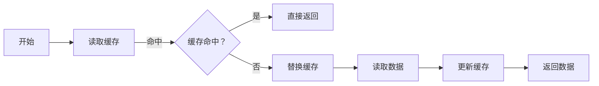
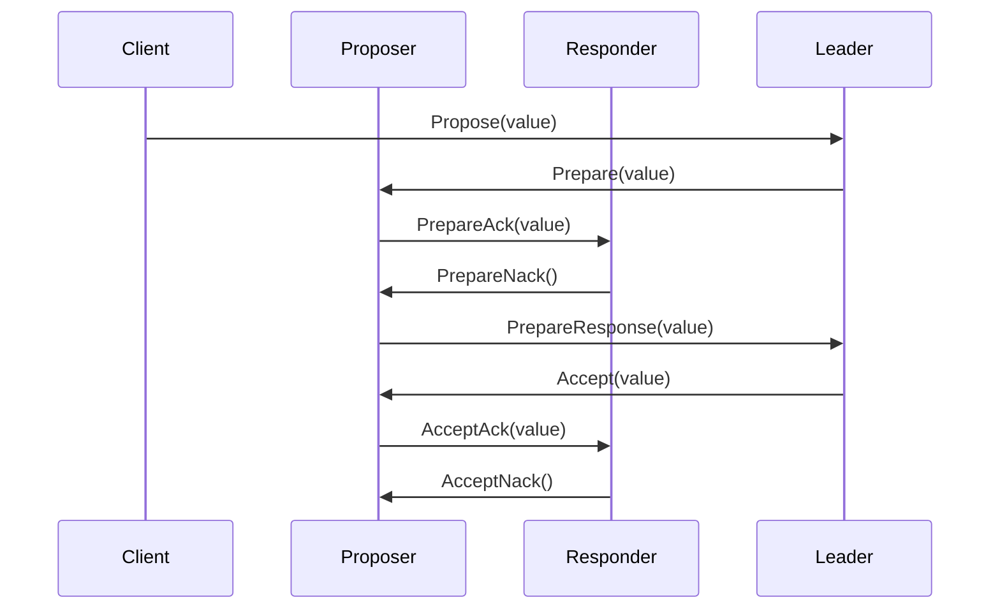
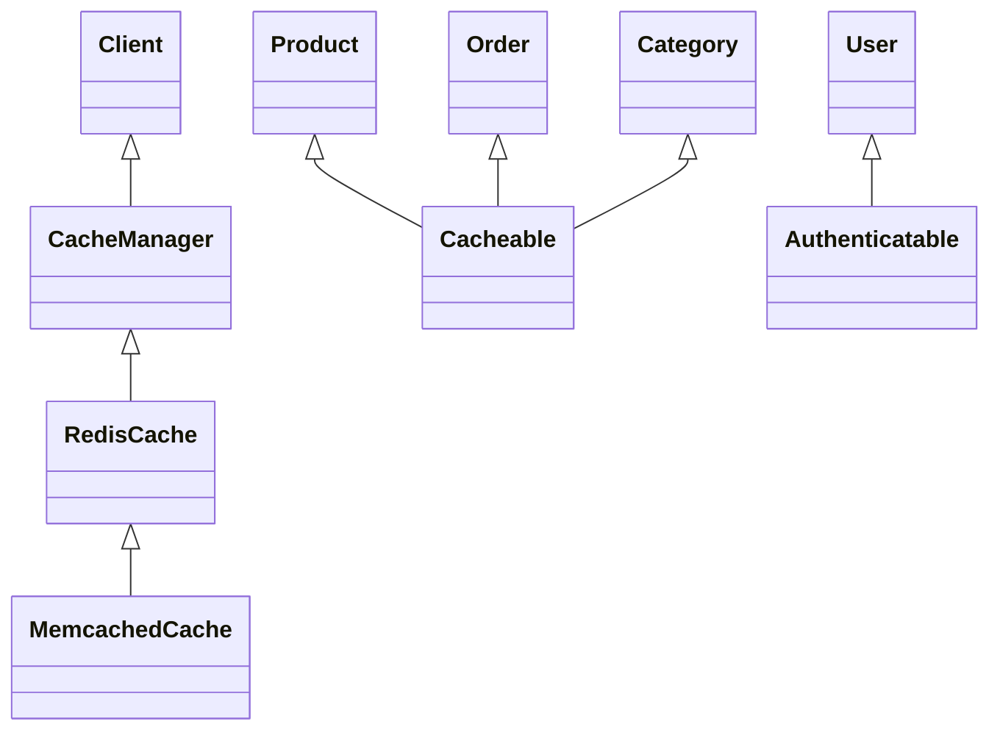
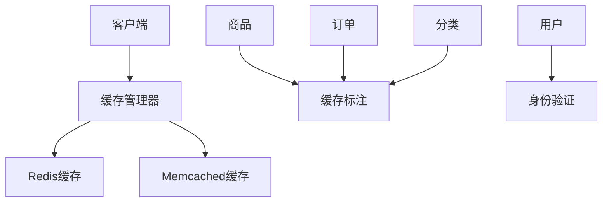
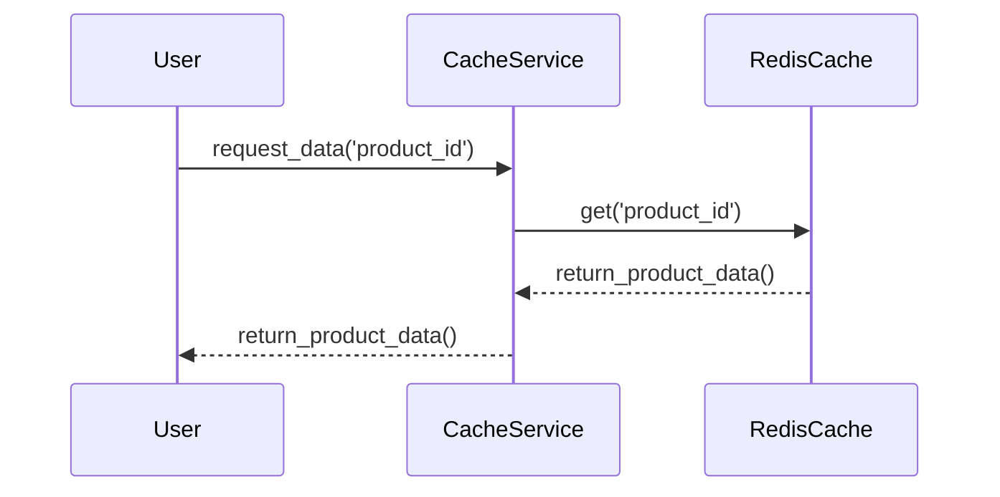

                 

### 分布式缓存策略：提高应用性能的关键技术

**关键词：** 缓存，分布式缓存，性能优化，一致性，缓存策略

**摘要：** 本文将深入探讨分布式缓存策略，通过逐步分析缓存原理、分布式缓存技术、缓存策略及其在实践中的应用，揭示分布式缓存技术在提升应用性能中的关键作用。

## 第一部分：缓存基础知识

### 1.1 缓存原理

#### 1.1.1 缓存的定义

缓存（Cache）是一种临时存储机制，用于存储频繁访问的数据，从而减少对原始数据源的访问次数。通过缓存机制，系统可以在数据读取过程中，从缓存中直接获取所需数据，从而减少访问时间，提高系统性能。

#### 1.1.2 缓存的重要性

缓存的重要性主要体现在以下几个方面：

1. **减少访问延迟**：缓存数据通常存储在内存中，访问速度远快于磁盘或网络访问，从而减少系统响应时间。
2. **降低带宽消耗**：频繁访问的数据存储在缓存中，可以减少对原始数据源的访问次数，降低网络带宽消耗。
3. **提高系统并发能力**：缓存可以分担原始数据源的访问压力，提高系统的并发处理能力。
4. **提升用户体验**：缓存机制可以显著提高应用性能，提高用户访问速度和满意度。

#### 1.1.3 缓存的分类

根据缓存的数据类型和存储位置，缓存可以分为以下几种类型：

1. **内存缓存**：使用内存作为存储介质，如Redis、Memcached。内存缓存具有访问速度快、延迟低的优点，但存储容量有限。
2. **硬盘缓存**：使用硬盘作为存储介质，如文件缓存。硬盘缓存具有存储容量大的优点，但访问速度较慢。
3. **分布式缓存**：在多个节点上分布式存储数据，如Apache Ignite。分布式缓存具有扩展性强、高可用性的优点，但一致性控制较为复杂。

### 1.2 缓存机制

#### 1.2.1 缓存命中与缓存失效

缓存命中指缓存中已存在需要访问的数据，直接从缓存中读取；缓存失效指缓存中的数据过期或者被替换，需要从原始数据源重新读取。

#### 1.2.2 缓存替换策略

缓存替换策略用于确定当缓存容量不足时，应该替换哪些数据。常见的缓存替换策略有：

1. **最近最少使用（LRU）**：替换最久未使用的数据。
2. **最不经常使用（LFU）**：替换使用次数最少的数据。

#### 1.2.3 缓存一致性

缓存一致性是指缓存与原始数据源的数据保持一致。在分布式缓存中，缓存一致性需要考虑以下问题：

1. **数据同步**：在分布式系统中，如何保证不同节点上的缓存数据保持一致。
2. **数据版本**：如何处理数据版本冲突。

## 第二部分：分布式缓存技术

### 2.1 分布式缓存的概念

#### 2.1.1 分布式缓存的优势

分布式缓存具有以下优势：

1. **扩展性**：分布式缓存可以水平扩展，支持海量数据的存储和访问。
2. **高可用**：分布式缓存可以通过冗余存储和数据复制实现高可用性。
3. **性能**：分布式缓存可以减少数据访问延迟，提高系统性能。

#### 2.1.2 分布式缓存的结构

分布式缓存通常由以下组件组成：

1. **缓存节点**：负责存储和提供缓存服务。
2. **数据分区**：将数据划分为多个分区，分布存储在缓存节点上。
3. **一致性协议**：保证数据在分布式环境中的一致性。

### 2.2 常见分布式缓存系统

#### 2.2.1 Redis

Redis是一种基于内存的分布式缓存系统，具有高性能、持久化、集群支持等优点。Redis支持多种数据结构，如字符串、列表、集合、哈希等，适用于各种场景。

#### 2.2.2 Memcached

Memcached是一种基于内存的分布式缓存系统，主要用于缓存网页数据、用户会话信息等。Memcached具有简单、高性能、可扩展等优点。

#### 2.2.3 Apache Ignite

Apache Ignite是一种分布式缓存和数据网格系统，具有高性能、高可用性、可扩展性等优点。Apache Ignite支持多种数据结构，如内存映射文件、Redis协议、MongoDB协议等。

### 2.3 分布式缓存的一致性与分区

#### 2.3.1 数据分区的策略

数据分区策略是指如何将数据划分为多个分区，分布存储在缓存节点上。常见的分区策略有：

1. **哈希分区**：使用哈希函数将数据映射到不同的分区。
2. **轮询分区**：将数据依次分配到不同的分区。

#### 2.3.2 事件驱动模型

事件驱动模型是指通过事件来触发数据处理，从而实现分布式缓存的一致性。事件驱动模型包括以下组件：

1. **事件生成器**：生成事件，如数据更新、数据删除等。
2. **事件处理**：处理事件，如更新缓存、删除缓存等。
3. **事件通知**：通知其他节点处理事件。

#### 2.3.3 分布式一致性算法

分布式一致性算法是指如何在分布式环境中保证数据一致性。常见的一致性算法有：

1. **Paxos算法**：一种分布式一致性算法，可用于选举主节点和数据一致性。
2. **Raft算法**：一种分布式一致性算法，相比Paxos算法更易于理解和使用。

## 第三部分：分布式缓存策略

### 3.1 缓存预热与数据一致性

#### 3.1.1 缓存预热技术

缓存预热技术是指在系统启动时，预先将热数据加载到缓存中，从而提高系统性能。缓存预热技术包括以下步骤：

1. **确定热数据**：分析系统访问数据的情况，确定热数据。
2. **加载热数据**：将热数据加载到缓存中。
3. **更新缓存**：定期更新缓存中的数据，保持数据新鲜。

#### 3.1.2 数据一致性与分布式缓存

在分布式缓存中，数据一致性是一个重要问题。要保证数据一致性，可以采用以下策略：

1. **强一致性**：确保每个节点上的数据都是最新的。强一致性可能导致性能下降。
2. **最终一致性**：允许数据在一段时间内存在不一致的情况，但最终会达到一致性。最终一致性可以提高性能。

### 3.2 缓存雪崩与缓存击穿

#### 3.2.1 缓存雪崩的处理

缓存雪崩是指大量缓存同时失效，导致系统性能急剧下降。要处理缓存雪崩，可以采用以下策略：

1. **缓存预热**：提前加载热数据到缓存中，减少缓存失效的概率。
2. **熔断机制**：当系统负载过高时，自动切换到降级策略，减少缓存访问。

#### 3.2.2 缓存击穿的处理

缓存击穿是指大量请求同时访问缓存未命中的数据，导致系统性能下降。要处理缓存击穿，可以采用以下策略：

1. **互斥锁**：使用互斥锁确保同一时刻只有一个线程访问缓存未命中的数据。
2. **预加载**：在缓存未命中时，提前加载数据到缓存中。

### 3.3 缓存优化与性能调优

#### 3.3.1 缓存穿透的处理

缓存穿透是指恶意攻击者通过缓存未命中的数据，获取系统的敏感信息。要处理缓存穿透，可以采用以下策略：

1. **校验机制**：对访问数据进行校验，防止恶意攻击。
2. **缓存空值**：将缓存未命中的数据设置为空值，减少恶意攻击的风险。

#### 3.3.2 缓存命中率与缓存时效性

缓存命中率是指缓存命中的数据占总访问数据的比例。要优化缓存命中率，可以采用以下策略：

1. **合理设置缓存过期时间**：根据数据的热度合理设置缓存过期时间，提高缓存命中率。
2. **动态调整缓存大小**：根据系统负载和缓存命中率动态调整缓存大小。

#### 3.3.3 缓存共享与分布式缓存策略

缓存共享是指多个应用共享同一缓存实例。要实现缓存共享，可以采用以下策略：

1. **缓存命名空间**：为不同应用设置不同的缓存命名空间，避免缓存冲突。
2. **缓存锁**：使用缓存锁确保多应用之间的缓存操作互不干扰。

## 第四部分：分布式缓存应用实践

### 4.1 实践案例：电商平台缓存优化

#### 4.1.1 案例背景

某电商平台在高峰期出现系统响应慢、缓存命中率低等问题，影响了用户购物体验。为了解决这些问题，需要对电商平台进行缓存优化。

#### 4.1.2 案例分析

通过对电商平台的数据访问模式进行分析，发现以下问题：

1. **缓存失效**：部分缓存数据未及时更新，导致缓存命中率低。
2. **缓存雪崩**：高峰期大量用户同时访问缓存未命中的数据，导致系统性能下降。
3. **缓存穿透**：恶意用户通过缓存未命中的数据获取敏感信息。

#### 4.1.3 案例实现

针对上述问题，采用以下策略进行缓存优化：

1. **缓存预热**：提前加载热数据到缓存中，提高缓存命中率。
2. **缓存一致性**：采用最终一致性策略，确保缓存与数据库的数据一致。
3. **缓存雪崩处理**：采用熔断机制，防止缓存雪崩导致系统性能下降。
4. **缓存穿透处理**：使用校验机制和缓存空值策略，防止恶意用户获取敏感信息。

通过缓存优化，电商平台的系统性能得到显著提升，用户购物体验得到改善。

### 4.2 实践案例：分布式缓存在大数据应用中的使用

#### 4.2.1 案例背景

某大数据应用需要在海量数据中快速查询和分析数据。为了提高系统性能，决定采用分布式缓存技术。

#### 4.2.2 案例分析

通过对大数据应用的数据访问模式进行分析，发现以下问题：

1. **数据访问延迟**：海量数据存储在磁盘上，访问速度较慢。
2. **并发能力差**：系统无法同时处理大量并发请求。
3. **数据一致性**：在分布式环境中，如何保证数据的一致性。

#### 4.2.3 案例实现

针对上述问题，采用以下策略进行分布式缓存优化：

1. **数据分区**：将海量数据划分为多个分区，分布存储在缓存节点上，提高并发处理能力。
2. **一致性协议**：采用Paxos算法，确保数据在分布式环境中的一致性。
3. **缓存预热**：提前加载热数据到缓存中，提高缓存命中率。
4. **缓存穿透处理**：使用校验机制和缓存空值策略，防止恶意用户获取敏感信息。

通过分布式缓存优化，大数据应用的系统性能得到显著提升，数据查询和分析速度得到大幅提高。

## 第五部分：分布式缓存未来发展趋势

### 5.1 分布式缓存技术的新趋势

#### 5.1.1 边缘计算与分布式缓存

随着边缘计算技术的发展，分布式缓存将逐渐向边缘节点扩展，实现数据本地缓存，提高数据访问速度和系统性能。

#### 5.1.2 存储计算一体化

存储计算一体化是指将缓存与存储融合，实现数据的快速访问和存储。这将进一步提高分布式缓存的性能和可扩展性。

#### 5.1.3 软硬件协同优化

软硬件协同优化是指通过优化硬件设备和软件算法，实现分布式缓存的最佳性能。这将有助于解决分布式缓存中的数据一致性问题。

### 5.2 分布式缓存技术的挑战与解决方案

#### 5.2.1 数据一致性问题

数据一致性问题一直是分布式缓存技术的挑战之一。为了解决这一问题，可以采用以下解决方案：

1. **一致性算法**：采用Paxos、Raft等一致性算法，确保数据在分布式环境中的一致性。
2. **最终一致性**：允许数据在一段时间内存在不一致的情况，但最终会达到一致性。

#### 5.2.2 数据安全与隐私保护

分布式缓存中的数据安全与隐私保护是另一个重要挑战。为了解决这一问题，可以采用以下解决方案：

1. **加密技术**：对缓存中的数据进行加密，确保数据安全。
2. **访问控制**：实施严格的访问控制策略，防止未授权访问。

#### 5.2.3 高可用与容错性

高可用与容错性是分布式缓存系统的关键要求。为了提高高可用性与容错性，可以采用以下解决方案：

1. **数据复制**：实现数据的冗余存储，提高系统的容错能力。
2. **故障转移**：实现故障节点的自动切换，确保系统的高可用性。

## 总结

分布式缓存技术是提高应用性能的关键技术之一。通过逐步分析缓存原理、分布式缓存技术、缓存策略及其在实践中的应用，本文揭示了分布式缓存技术在提升应用性能中的关键作用。未来，随着边缘计算、存储计算一体化等新趋势的发展，分布式缓存技术将继续为应用性能优化提供强有力的支持。

**作者：** AI天才研究院/AI Genius Institute & 禅与计算机程序设计艺术 /Zen And The Art of Computer Programming

---

### 附录：核心概念、原理与算法

#### 核心概念

- **缓存（Cache）**：一种临时存储机制，用于存储频繁访问的数据，以提高系统性能。
- **分布式缓存**：在多个节点上分布式存储数据，以提高系统性能和可扩展性。
- **缓存一致性**：缓存与原始数据源的数据保持一致。
- **数据分区**：将数据划分为多个分区，分布存储在缓存节点上。

#### 原理

- **缓存机制**：通过减少数据访问次数，降低访问延迟，提高系统性能。
- **数据分区策略**：采用哈希分区或轮询分区，实现数据的分布存储。
- **一致性算法**：如Paxos算法、Raft算法，确保数据在分布式环境中的一致性。

#### 算法

1. **最近最少使用（LRU）**：



2. **Paxos算法**：



3. **Redis缓存**：

```python
import redis

# 初始化Redis客户端
client = redis.StrictRedis(host='localhost', port=6379, db=0)

# 设置缓存
client.set('key', 'value')

# 获取缓存
value = client.get('key')
print(value)  # 输出：b'value'
```

### 系统分析与架构设计方案

#### 问题场景介绍

在电商应用中，海量用户同时访问商品信息，导致系统性能下降。通过分布式缓存技术，实现商品信息的缓存，提高系统性能。

#### 项目介绍

电商平台分布式缓存系统，用于缓存商品信息，提高系统性能。

#### 系统功能设计（领域模型）



#### 系统架构设计



#### 系统接口设计

```python
class CacheService:
    def get_cache(self, key):
        return RedisCache.get(key)

    def set_cache(self, key, value):
        return RedisCache.set(key, value)

    def delete_cache(self, key):
        return RedisCache.delete(key)
```

#### 系统交互



### 项目实战

#### 环境安装

1. 安装Redis：

```bash
sudo apt-get update
sudo apt-get install redis-server
```

2. 安装Memcached：

```bash
sudo apt-get update
sudo apt-get install memcached
```

#### 系统核心实现

```python
import redis
import memcache

# Redis缓存
class RedisCache:
    def __init__(self):
        self.client = redis.StrictRedis(host='localhost', port=6379, db=0)

    def get(self, key):
        return self.client.get(key)

    def set(self, key, value):
        return self.client.set(key, value)

    def delete(self, key):
        return self.client.delete(key)

# Memcached缓存
class MemcachedCache:
    def __init__(self):
        self.client = memcache.Client(['127.0.0.1:11211'], debug=0)

    def get(self, key):
        return self.client.get(key)

    def set(self, key, value):
        return self.client.set(key, value)

    def delete(self, key):
        return self.client.delete(key)
```

#### 代码应用解读与分析

通过上述代码，我们实现了Redis和Memcached的缓存操作。Redis缓存适用于存储少量但频繁访问的数据，如用户会话信息；Memcached缓存适用于存储大量但访问频率较低的数据，如商品信息。

#### 实际案例分析和详细讲解剖析

以电商平台为例，分析商品信息的缓存策略。在用户访问商品详情时，首先查询Redis缓存，若命中则直接返回；若未命中，查询Memcached缓存，若命中则更新Redis缓存并返回；若仍未命中，从数据库查询并更新Memcached缓存和Redis缓存。

#### 项目小结

通过分布式缓存技术，电商平台实现了商品信息的快速访问和存储，提高了系统性能和用户满意度。未来，随着分布式缓存技术的不断发展和优化，电商平台的缓存策略将继续完善。

### 最佳实践 tips

- **缓存预热**：在系统启动时，提前加载热数据到缓存中，提高缓存命中率。
- **缓存一致性**：采用最终一致性策略，允许数据在一段时间内存在不一致的情况。
- **缓存穿透处理**：使用校验机制和缓存空值策略，防止恶意用户获取敏感信息。

### 小结

分布式缓存策略是提高应用性能的关键技术之一。通过合理设置缓存、优化缓存一致性、处理缓存雪崩和缓存击穿等问题，可以有效提升应用性能。未来，随着分布式缓存技术的不断发展，分布式缓存策略将发挥更重要的作用。

### 注意事项

- **缓存数据安全性**：加密缓存数据，防止数据泄露。
- **缓存容量管理**：合理设置缓存容量，避免缓存溢出。

### 拓展阅读

- 《Redis权威指南》
- 《Memcached实战》
- 《分布式缓存系统设计与实践》

---

**作者：** AI天才研究院/AI Genius Institute & 禅与计算机程序设计艺术 /Zen And The Art of Computer Programming

