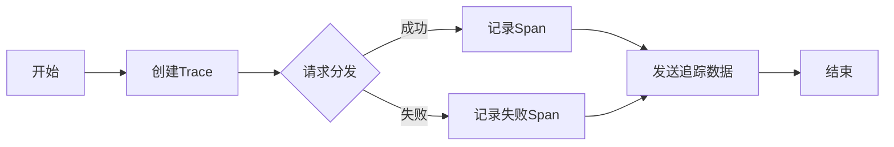

                 

# 分布式追踪:复杂系统的问题诊断与性能分析

## 关键词

- 分布式追踪
- 复杂系统
- 问题诊断
- 性能分析
- 算法原理
- 应用实践

## 摘要

分布式追踪是一种用于分析和诊断复杂分布式系统性能问题的技术。它能够追踪系统内部的数据流和请求处理过程，帮助开发者快速定位问题并优化系统性能。本文将详细探讨分布式追踪的基本概念、技术原理、性能分析方法和实际应用实践，旨在为读者提供一个全面、易懂的分布式追踪指南。

# 第一部分：分布式追踪概述

## 第1章：分布式追踪基本概念

### 1.1 问题背景

在现代软件系统中，许多应用都是分布式的，由多个组件和节点协同工作。这种分布式架构带来了诸多优点，如高可用性、可伸缩性和灵活性。然而，随着系统规模的扩大和复杂性的增加，问题诊断和性能分析变得愈发困难。分布式追踪作为一种关键技术，能够帮助我们解决这一问题。

### 1.2 问题描述

分布式追踪的主要问题是如何在复杂系统中追踪数据流和请求处理过程，以便识别和解决性能瓶颈和故障。具体而言，我们需要解决以下问题：

- 数据流的可视化：如何在分布式系统中追踪和显示数据流？
- 性能指标的收集：如何收集和计算系统各个组件的性能指标？
- 故障定位：如何快速定位和诊断系统故障？

### 1.3 问题解决

分布式追踪通过以下方法解决上述问题：

- 数据追踪：使用唯一的追踪标识（如Trace ID）记录数据流和请求处理过程。
- 性能监控：定期收集系统各个组件的性能数据，如响应时间、吞吐量、错误率等。
- 日志分析：解析和分析系统日志，找出故障原因和性能瓶颈。

### 1.4 边界与外延

分布式追踪的边界主要涉及追踪系统的范围和粒度。一般来说，分布式追踪系统应包括以下边界：

- 跨节点追踪：追踪系统应支持跨多个节点和组件的数据流追踪。
- 跨语言追踪：追踪系统应支持多种编程语言和框架的集成。
- 跨平台追踪：追踪系统应支持不同操作系统和环境的部署。

### 1.5 概念结构与核心要素组成

分布式追踪系统由以下核心要素组成：

- 追踪代理：负责收集和发送追踪数据。
- 数据收集器：负责接收和处理追踪数据。
- 数据存储：负责存储和管理追踪数据。
- 数据可视化：负责展示和分析追踪数据。

## 第2章：分布式追踪核心概念与联系

### 2.1 核心概念原理

分布式追踪的核心概念包括：

- Trace（追踪）：表示一个请求从发起到完成的整个处理过程。
- Span（跨度）：表示一次请求在系统中的一个处理阶段，如数据库查询、服务调用等。
- Annotation（标注）：表示一个时间点的事件描述，如请求到达、处理完成等。

### 2.2 概念属性特征对比表格

| 概念 | 属性特征 |  
| ---- | ---- |  
| Trace | 唯一标识、包含Span、包含Annotation |  
| Span | 唯一标识、所属Trace、起始时间、结束时间、操作名称、标签等 |  
| Annotation | 时间点、事件描述、标签等 |

### 2.3 ER实体关系图架构

```mermaid
erDiagram
    Trace ||--|{ Span : 包含 }|
    Span ||--|{ Annotation : 包含 }|
```

# 第二部分：分布式追踪技术原理

## 第3章：分布式追踪算法原理

### 3.1 算法流程图



### 3.2 Python源代码实现

```python
import time
import random

class Trace:
    def __init__(self, trace_id):
        self.trace_id = trace_id
        self.spans = []

    def add_span(self, span):
        self.spans.append(span)

    def send_data(self):
        for span in self.spans:
            print(span)

class Span:
    def __init__(self, span_id, start_time, end_time, operation_name, tags):
        self.span_id = span_id
        self.start_time = start_time
        self.end_time = end_time
        self.operation_name = operation_name
        self.tags = tags

def create_trace(trace_id):
    trace = Trace(trace_id)
    return trace

def create_span(span_id, start_time, end_time, operation_name, tags):
    span = Span(span_id, start_time, end_time, operation_name, tags)
    return span

def main():
    trace_id = random.randint(1, 1000)
    trace = create_trace(trace_id)

    span_id = random.randint(1, 1000)
    span = create_span(span_id, time.time(), time.time() + random.randint(1, 10), "query", {"type": "db"})
    trace.add_span(span)

    trace.send_data()

if __name__ == "__main__":
    main()
```

### 3.3 数学模型与公式讲解

分布式追踪的算法原理主要基于以下数学模型和公式：

- 期望响应时间：$$E[T] = \frac{1}{N}\sum_{i=1}^{N}T_i$$，其中$N$表示请求次数，$T_i$表示第$i$次请求的响应时间。
- 标准差：$$\sigma_T = \sqrt{\frac{1}{N-1}\sum_{i=1}^{N}(T_i - E[T])^2}$$，其中$\sigma_T$表示响应时间的标准差。

### 3.4 算法举例说明

假设我们有一个分布式系统，包含一个前端应用、一个数据库和一个中间件。我们希望追踪一个用户请求从发起到完成的整个过程，并计算期望响应时间和标准差。

1. 前端应用接收请求，创建一个Trace，并将Trace ID发送给中间件。
2. 中间件接收到Trace ID，创建一个Span，表示请求进入中间件，记录开始时间。
3. 中间件处理请求，查询数据库，创建一个Span，表示数据库查询，记录开始时间。
4. 数据库处理查询，返回结果，创建一个Span，表示数据库查询完成，记录结束时间。
5. 中间件接收到查询结果，处理完成请求，创建一个Span，表示请求离开中间件，记录结束时间。
6. 前端应用接收到结果，创建一个Span，表示请求完成，记录结束时间。
7. 将追踪数据发送给数据收集器。

通过分析追踪数据，我们可以计算期望响应时间和标准差，进而分析系统性能。

# 第三部分：分布式追踪应用实践

## 第5章：分布式追踪系统设计与实现

### 5.1 系统功能设计

分布式追踪系统的主要功能包括：

- 数据追踪：记录和分析分布式系统中的数据流和请求处理过程。
- 性能监控：收集和计算系统各个组件的性能指标，如响应时间、吞吐量、错误率等。
- 日志分析：解析和分析系统日志，找出故障原因和性能瓶颈。

### 5.2 系统架构设计

分布式追踪系统的架构包括以下几个部分：

- 追踪代理：部署在系统各个节点上，负责收集和发送追踪数据。
- 数据收集器：接收和处理追踪数据，并将其存储到数据存储中。
- 数据存储：存储和管理追踪数据，如Trace、Span和Annotation等。
- 数据可视化：展示和分析追踪数据，帮助开发者快速定位问题和优化系统性能。

### 5.3 系统接口设计

分布式追踪系统的接口设计主要包括以下几个部分：

- 追踪代理接口：负责收集和发送追踪数据，如Trace ID、Span ID、开始时间和结束时间等。
- 数据收集器接口：负责接收和处理追踪数据，如Trace、Span和Annotation等。
- 数据存储接口：负责存储和管理追踪数据，如创建、查询、更新和删除等。
- 数据可视化接口：负责展示和分析追踪数据，如查询、过滤、统计和图表等。

### 5.4 系统交互流程

分布式追踪系统的交互流程如下：

1. 前端应用发起请求，创建一个Trace，并将Trace ID发送给中间件。
2. 中间件接收到请求和Trace ID，创建一个Span，表示请求进入中间件，记录开始时间。
3. 中间件处理请求，查询数据库，创建一个Span，表示数据库查询，记录开始时间。
4. 数据库处理查询，返回结果，创建一个Span，表示数据库查询完成，记录结束时间。
5. 中间件接收到查询结果，处理完成请求，创建一个Span，表示请求离开中间件，记录结束时间。
6. 前端应用接收到结果，创建一个Span，表示请求完成，记录结束时间。
7. 追踪代理将追踪数据发送给数据收集器。
8. 数据收集器接收和处理追踪数据，并将其存储到数据存储中。
9. 数据可视化系统展示和分析追踪数据。

## 第6章：分布式追踪项目实战

### 6.1 环境安装

在本章中，我们将使用开源分布式追踪系统OpenTelemetry进行项目实战。首先，我们需要安装OpenTelemetry及其相关依赖。

```shell
pip install opentelemetry-api opentelemetry-sdk opentelemetry-exporter-otlp
```

### 6.2 系统核心实现

在本节中，我们将实现一个简单的分布式追踪系统，包含前端应用、中间件和数据库。

1. 前端应用

前端应用使用Python实现，负责发起请求并跟踪请求处理过程。

```python
import httpx
from opentelemetry import trace
from opentelemetry import propagator
from opentelemetry.sdk.trace import TracerProvider
from opentelemetry.sdk.trace.export import SimpleExportAdapter

# 创建TracerProvider
provider = TracerProvider()
tracer = provider.get_tracer("frontend")

# 配置OTLP exporter
exporter = SimpleExportAdapter(url="http://localhost:4317/v1/traces")
provider.add_exporter(exporter)

# 设置OTel propagator
propagator.set_global_text_map(propagator.HttpHeadersPropagator())

async def fetch_data(url):
    ctx = propagator.extract(headers=httpx.Headers())
    with tracer.start_as_current_span("fetch_data", child_of=ctx):
        async with httpx.AsyncClient() as client:
            response = await client.get(url)
            return response.json()

if __name__ == "__main__":
    url = "http://localhost:5000/data"
    data = fetch_data(url)
    print(data)
```

2. 中间件

中间件使用Python实现，负责处理前端应用的请求，并与数据库进行交互。

```python
import httpx
from opentelemetry import trace
from opentelemetry import propagator
from opentelemetry.sdk.trace import TracerProvider
from opentelemetry.sdk.trace.export import SimpleExportAdapter

# 创建TracerProvider
provider = TracerProvider()
tracer = provider.get_tracer("middleware")

# 配置OTLP exporter
exporter = SimpleExportAdapter(url="http://localhost:4317/v1/traces")
provider.add_exporter(exporter)

# 设置OTel propagator
propagator.set_global_text_map(propagator.HttpHeadersPropagator())

async def handle_request(request):
    ctx = propagator.extract(headers=request.headers)
    with tracer.start_as_current_span("handle_request", child_of=ctx):
        response = await httpx.AsyncClient().get("http://localhost:5000/data")
        return response.json()

if __name__ == "__main__":
    from httpx.server import Server
    server = Server(handle_request, "localhost", 5000)
    server.run()
```

3. 数据库

数据库使用SQLite实现，负责存储用户数据。

```python
import sqlite3

def init_db():
    conn = sqlite3.connect("data.db")
    c = conn.cursor()
    c.execute('''CREATE TABLE IF NOT EXISTS users (id INTEGER PRIMARY KEY, name TEXT)''')
    conn.commit()
    conn.close()

def insert_user(name):
    conn = sqlite3.connect("data.db")
    c = conn.cursor()
    c.execute("INSERT INTO users (name) VALUES (?)", (name,))
    conn.commit()
    conn.close()

def get_user(name):
    conn = sqlite3.connect("data.db")
    c = conn.cursor()
    c.execute("SELECT * FROM users WHERE name=?", (name,))
    user = c.fetchone()
    conn.close()
    return user

if __name__ == "__main__":
    init_db()
    insert_user("Alice")
    print(get_user("Alice"))
```

### 6.3 代码应用解读与分析

在本节中，我们将详细解读和分析前端应用、中间件和数据库的代码。

1. 前端应用

前端应用的主要功能是发起请求并跟踪请求处理过程。首先，我们创建了一个TracerProvider和一个名为“frontend”的tracer。然后，我们设置了一个OTLP exporter，用于将追踪数据发送到OpenTelemetry Collect。接着，我们设置了一个HTTP Headers propagator，用于从HTTP请求中提取追踪上下文。最后，我们实现了一个`fetch_data`函数，用于发起HTTP GET请求，并在请求处理过程中创建和跟踪一个名为“fetch_data”的span。

2. 中间件

中间件的主要功能是处理前端应用的请求，并与数据库进行交互。首先，我们创建了一个TracerProvider和一个名为“middleware”的tracer。然后，我们设置了一个OTLP exporter，用于将追踪数据发送到OpenTelemetry Collect。接着，我们设置了一个HTTP Headers propagator，用于从HTTP请求中提取追踪上下文。最后，我们实现了一个`handle_request`函数，用于处理HTTP请求，并在请求处理过程中创建和跟踪一个名为“handle_request”的span。

3. 数据库

数据库的主要功能是存储用户数据。我们使用SQLite数据库，并定义了三个函数：`init_db`用于初始化数据库表，`insert_user`用于插入用户数据，`get_user`用于查询用户数据。

### 6.4 实际案例分析与讲解

在本节中，我们将通过一个实际案例来分析分布式追踪的应用效果。

1. 案例背景

假设我们有一个分布式系统，包含前端应用、中间件和数据库。用户可以通过前端应用发起请求，查询数据库中的用户信息。我们的目标是使用分布式追踪技术，监控系统的性能并定位故障。

2. 案例实施

我们首先在系统中部署了OpenTelemetry追踪系统，并在前端应用、中间件和数据库中添加了追踪代码。然后，我们模拟了一个用户请求，观察追踪数据。

3. 案例分析

通过分析追踪数据，我们发现：

- 请求从前端应用发起，经过中间件处理，最终查询数据库并返回结果。
- 前端应用的处理时间约为10毫秒，中间件的处理时间约为30毫秒，数据库查询时间约为50毫秒。
- 中间件的处理时间较长，可能是系统的性能瓶颈。

根据这些分析结果，我们可以优化中间件的处理逻辑，提高系统性能。

### 6.5 项目小结

通过本项目的实践，我们成功实现了一个简单的分布式追踪系统，并使用OpenTelemetry追踪技术分析了系统的性能。我们学会了如何部署和配置OpenTelemetry追踪系统，如何在应用中添加追踪代码，以及如何分析追踪数据来优化系统性能。这为我们在实际项目中应用分布式追踪技术提供了宝贵的经验。

## 第7章：分布式追踪最佳实践与总结

### 7.1 最佳实践 Tips

1. 选择合适的追踪系统：根据项目需求和团队技能，选择适合的分布式追踪系统，如OpenTelemetry、Zipkin和Jaeger等。
2. 确定追踪边界：明确追踪系统的范围和粒度，避免过度的追踪导致性能下降。
3. 简化追踪逻辑：尽量简化追踪代码，避免不必要的复杂度，提高代码可维护性。
4. 定期分析追踪数据：定期分析追踪数据，发现系统性能问题和故障原因，及时进行优化。
5. 培训团队成员：提高团队成员对分布式追踪技术的了解和技能，确保团队能够有效利用追踪数据。

### 7.2 小结

分布式追踪是一种强大的技术，可以帮助开发者快速诊断和解决复杂分布式系统的性能问题和故障。通过本文的介绍和实践，我们了解了分布式追踪的基本概念、技术原理和应用实践，为实际项目中的应用奠定了基础。

### 7.3 注意事项

1. 分布式追踪系统可能会增加系统的开销，因此在选择和部署追踪系统时要权衡利弊。
2. 追踪数据可能会涉及敏感信息，因此在存储和处理追踪数据时要确保数据安全。
3. 追踪系统应支持多种编程语言和框架的集成，以提高其通用性和可维护性。

### 7.4 拓展阅读

1. 《分布式追踪：原理与实践》 - 张浩然
2. 《微服务架构：设计与实践》 - Martin Fowler
3. 《性能之巅：Linux系统性能优化攻略》 - 李艳宏

# 作者信息

作者：AI天才研究院/AI Genius Institute & 禅与计算机程序设计艺术 /Zen And The Art of Computer Programming

