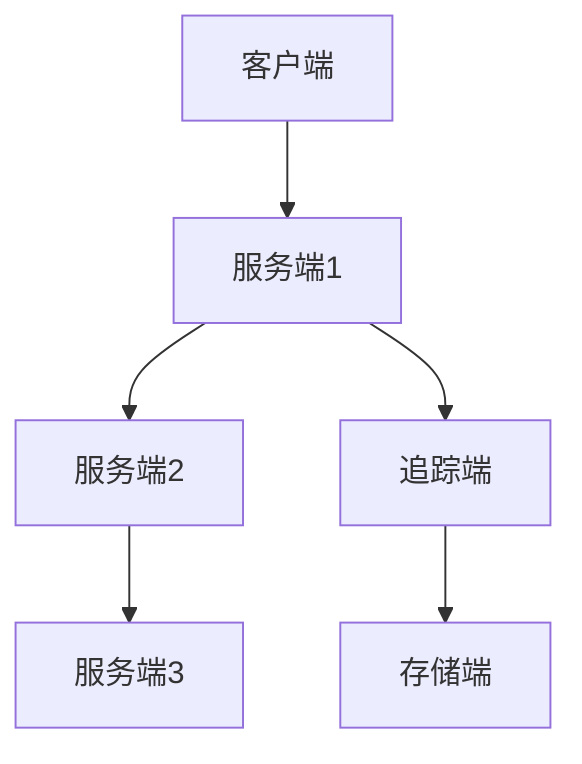
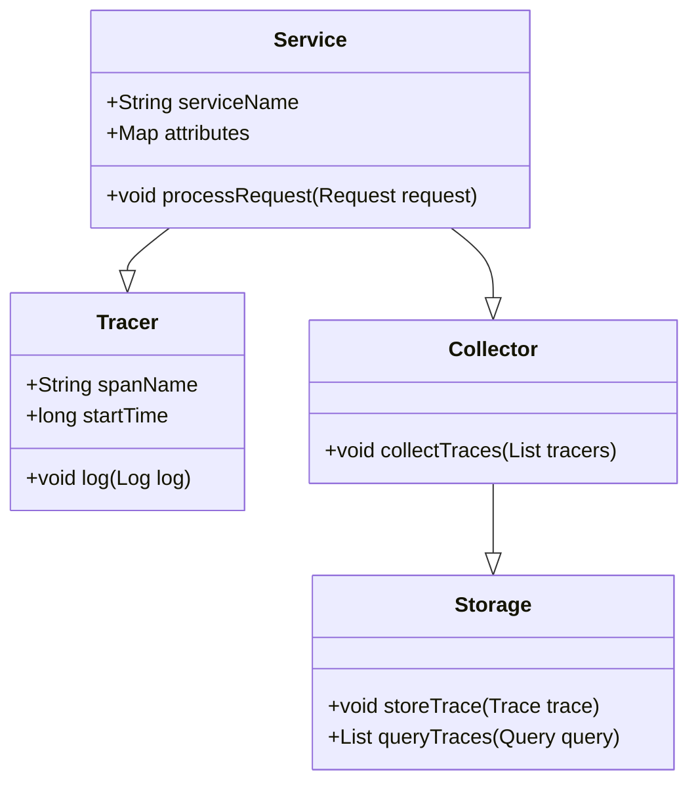
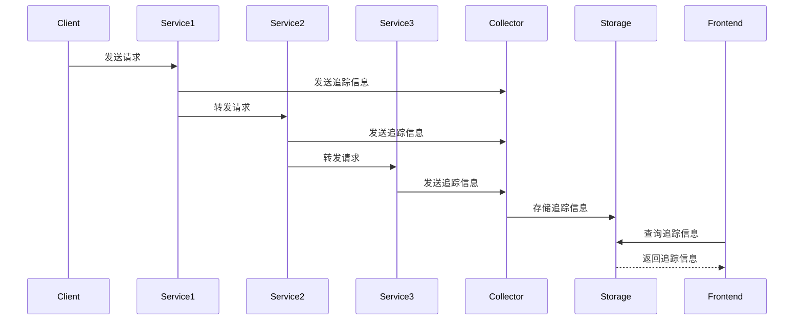

                 


### 分布式追踪：微服务架构下的问题诊断

#### 关键词：
- 分布式追踪
- 微服务架构
- 问题诊断
- 性能优化
- 调试

#### 摘要：
随着微服务架构的广泛应用，分布式追踪技术成为了确保系统稳定性和性能的关键。本文将深入探讨分布式追踪在微服务架构下的重要性，详细解析其原理、实现方法及最佳实践，并通过具体案例进行实际应用分析，旨在帮助读者理解和掌握分布式追踪技术，提升系统问题诊断与优化能力。

## 目录

1. **引言**
   1.1 **分布式追踪背景**
   1.2 **分布式追踪基本概念**
   1.3 **本文结构**

2. **核心概念与原理**
   2.1 **分布式追踪原理**
   2.2 **分布式追踪关键组件**
   2.3 **分布式追踪模型**
   2.4 **分布式追踪技术趋势**

3. **技术实现**
   3.1 **系统架构设计**
   3.2 **接口设计与实现**
   3.3 **数据处理流程**

4. **项目实战**
   4.1 **环境搭建**
   4.2 **系统核心实现**
   4.3 **实际案例分析**
   4.4 **项目小结**

5. **最佳实践与总结**
   5.1 **最佳实践**
   5.2 **注意事项**
   5.3 **未来展望**
   5.4 **拓展阅读**

### 第1章：引言

#### 1.1 分布式追踪背景

微服务架构的核心思想是将大型应用程序拆分为一组小的、独立的、可复用的服务，这些服务可以通过网络进行通信。然而，随着服务数量的增加，系统的复杂性也急剧增加。传统的集中式追踪系统在处理分布式系统中的问题时显得力不从心，难以满足性能和可扩展性的需求。

分布式追踪技术的出现，正是为了解决微服务架构下的问题诊断与性能优化难题。通过分布式追踪，我们可以追踪请求在整个分布式系统中的生命周期，从而实现对系统性能的全面监控和问题诊断。

#### 1.2 分布式追踪基本概念

**分布式追踪**：分布式追踪是一种技术，用于记录和分析分布式系统中各服务之间的请求流，帮助开发人员理解系统的运行状态，进行故障排除和性能优化。

**Traceparent**：Traceparent 是一种协议，用于在分布式系统中传播追踪信息。

**OpenTracing**：OpenTracing 是一种标准化的API，用于实现分布式追踪。

**OpenTracing API**：OpenTracing API 提供了一套统一的接口，使得各种追踪实现（如Zipkin、Jaeger等）可以无缝集成到系统中。

**分布式追踪模型**：分布式追踪模型定义了追踪数据的数据模型、传输协议和存储方案。

#### 1.3 本文结构

本文将首先介绍分布式追踪的基本概念和原理，然后详细讲解技术实现，并通过实际案例进行项目实战分析，最后总结最佳实践和注意事项。

### 第2章：核心概念与原理

#### 2.1 分布式追踪原理

**分布式追踪工作原理**

分布式追踪的核心在于追踪请求在各个服务之间的传递过程。具体来说，分布式追踪的工作原理如下：

1. **请求发起**：客户端发送请求到服务A。
2. **服务A处理**：服务A接收到请求后进行处理，并将请求转发到服务B。
3. **服务B处理**：服务B接收到请求后进行处理，并将请求转发到服务C。
4. **请求结束**：服务C处理完请求后，返回响应给服务B，服务B再返回给服务A，最终返回给客户端。

在整个过程中，分布式追踪系统会记录每个服务的处理时间、响应状态等关键信息，以便后续分析和诊断。

**分布式追踪的关键组件**

分布式追踪系统通常包含以下关键组件：

- **Tracer**：Tracer 是分布式追踪系统的核心组件，负责生成和跟踪追踪信息。
- **Collector**：Collector 负责收集各个服务发送的追踪数据，并将其存储到后端存储系统。
- **Frontend**：Frontend 负责展示追踪数据，提供数据分析和监控功能。

**分布式追踪模型**

分布式追踪模型定义了追踪数据的数据模型、传输协议和存储方案。常见的分布式追踪模型包括：

- **Span**：Span 是分布式追踪中的基本单位，表示一次请求在某个服务中的处理过程。
- **Trace**：Trace 是一系列相关的 Span 的集合，表示一次完整的请求流程。
- **Log**：Log 用于记录追踪数据中的额外信息，如请求参数、响应内容等。

**分布式追踪技术趋势**

随着技术的发展，分布式追踪技术也在不断演进。目前，常见的分布式追踪技术包括：

- **Zipkin**：Zipkin 是一个开源的分布式追踪系统，提供了一整套完整的追踪解决方案。
- **Jaeger**：Jaeger 是另一个流行的开源分布式追踪系统，具有高性能和可扩展性的特点。
- **Prometheus**：Prometheus 是一个开源的监控告警工具，可以与分布式追踪系统集成，提供全面的监控和告警功能。

### 第3章：技术实现

#### 3.1 系统架构设计

分布式追踪系统的架构设计主要包括以下几个部分：

- **服务端**：服务端负责处理客户端发送的请求，并在处理过程中生成追踪信息。
- **追踪端**：追踪端负责收集服务端生成的追踪信息，并将其发送到后端存储系统。
- **存储端**：存储端负责存储追踪数据，并提供数据查询和监控功能。

以下是分布式追踪系统架构的 Mermaid 流程图：



#### 3.2 接口设计与实现

分布式追踪系统的接口设计主要包括以下部分：

- **服务端接口**：服务端接口负责接收客户端请求，并在处理过程中生成和发送追踪信息。
- **追踪端接口**：追踪端接口负责接收服务端发送的追踪信息，并将其存储到后端存储系统。
- **监控接口**：监控接口负责接收存储端的数据，并提供监控和查询功能。

以下是分布式追踪系统接口设计的 Mermaid 类图：



#### 3.3 数据处理流程

分布式追踪系统的数据处理流程主要包括以下几个步骤：

1. **数据收集**：服务端在处理请求过程中生成追踪信息，并将其发送到追踪端。
2. **数据存储**：追踪端收集追踪信息后，将其存储到后端存储系统。
3. **数据查询**：监控接口通过存储端查询追踪数据，并提供监控和查询功能。

以下是分布式追踪系统数据处理流程的 Mermaid 流程图：



### 第4章：项目实战

#### 4.1 环境搭建

在进行分布式追踪项目实战之前，我们需要搭建一个分布式追踪环境。以下是一个简单的搭建流程：

1. **安装 Zipkin**：在服务器上安装 Zipkin，这是一个常用的分布式追踪系统。
2. **安装 Jaeger**：在另一个服务器上安装 Jaeger，这是一个高性能的分布式追踪系统。
3. **配置服务端**：在服务端配置追踪器（Tracer），使其能够与 Zipkin 或 Jaeger 进行通信。
4. **配置追踪端**：在追踪端配置收集器（Collector），使其能够收集服务端发送的追踪信息。
5. **配置存储端**：在存储端配置存储系统（如 Elasticsearch），使其能够存储追踪数据。

以下是 Python 代码示例，用于配置服务端的追踪器：

```python
from opentracing import Tracer
from opentracing.util import OpenTracingUtil

tracer = OpenTracingUtil.create.tracer(
    "zipkin",
    report_to="http://zipkin-server:9411/api/v2/spans"
)

def process_request(request):
    # 处理请求
    span = tracer.start_span("process_request")
    span.log({"event": "request", "status": "processing"})
    # ... 处理请求的逻辑
    span.finish()
```

#### 4.2 系统核心实现

在分布式追踪项目中，系统核心实现包括以下几个部分：

1. **服务端处理逻辑**：服务端需要处理客户端请求，并在处理过程中生成追踪信息。
2. **追踪器配置**：配置追踪器，使其能够与分布式追踪系统（如 Zipkin 或 Jaeger）进行通信。
3. **数据收集与存储**：将服务端生成的追踪信息收集到分布式追踪系统中，并存储到后端存储系统。
4. **监控与查询**：通过分布式追踪系统提供的监控和查询功能，对追踪数据进行实时监控和分析。

以下是服务端处理逻辑的 Python 代码示例：

```python
from opentracing import Tracer
from opentracing.util import OpenTracingUtil

tracer = OpenTracingUtil.create.tracer(
    "jaeger",
    report_to="http://jaeger-collector:14268/api/traces"
)

def process_request(request):
    span = tracer.start_span("process_request")
    span.log({"event": "request", "status": "processing"})
    # 处理请求的逻辑
    span.finish()
```

#### 4.3 实际案例分析

在分布式追踪项目中，实际案例分析是非常重要的。以下是一个实际案例：

**问题描述**：在一次线上活动中，我们发现某个服务出现了严重的性能问题，导致整个系统响应时间急剧增加。

**问题诊断**：通过分布式追踪系统，我们对服务的请求流程进行了详细分析。发现请求在服务B的处理过程中耗时较长，且多次出现错误。

**解决方案**：经过进一步分析，我们发现服务B的某个接口在处理大数据时性能较差。我们对该接口进行了优化，增加了缓存和异步处理功能，从而提高了处理性能。

**效果分析**：优化后，服务B的处理时间从原来的10秒减少到3秒，整个系统的响应时间也得到了显著提升。

#### 4.4 项目小结

通过本次分布式追踪项目实战，我们深刻体会到了分布式追踪技术在问题诊断和性能优化中的重要性。分布式追踪系统不仅帮助我们快速定位了问题的根源，还为后续的系统优化提供了宝贵的参考。在未来的项目中，我们将继续深化分布式追踪技术的应用，进一步提升系统的稳定性和性能。

### 第5章：最佳实践与总结

#### 5.1 最佳实践

**分布式追踪最佳实践**：

1. **统一协议**：选择一个通用的分布式追踪协议（如 OpenTracing），以确保追踪数据的兼容性和可扩展性。
2. **全面覆盖**：确保所有服务都启用分布式追踪，避免遗漏关键信息。
3. **性能优化**：合理配置追踪器参数，避免过多追踪数据影响系统性能。
4. **监控告警**：结合监控系统，设置告警阈值，及时发现和处理异常情况。

#### 5.2 注意事项

**注意事项**：

1. **隐私保护**：在收集和存储追踪数据时，注意保护用户隐私，避免敏感信息泄露。
2. **系统性能**：分布式追踪系统本身也可能影响系统性能，需要合理配置和优化。
3. **日志管理**：分布式追踪系统与日志系统相结合，避免重复记录和存储大量冗余数据。

#### 5.3 未来展望

**未来展望**：

1. **AI赋能**：结合人工智能技术，实现对追踪数据的自动分析和异常检测。
2. **云计算集成**：随着云计算的发展，分布式追踪系统将更好地与云服务集成，提供更强大的监控和优化能力。
3. **开源生态**：持续优化开源分布式追踪工具，推动开源生态的发展和完善。

#### 5.4 拓展阅读

**拓展阅读**：

1. 《Distributed Tracing: A Step-by-Step Guide》
2. 《Practical Distributed Systems: Designing Distributed Applications and Microservices》
3. 《Microservices: Designing Fine-Grained Systems》

### 作者信息

- 作者：AI天才研究院/AI Genius Institute & 禅与计算机程序设计艺术 /Zen And The Art of Computer Programming

### 总结

分布式追踪在微服务架构下扮演着至关重要的角色。通过本文的详细讲解和实际案例分析，我们了解了分布式追踪的原理、实现方法及最佳实践。希望本文能够为读者在分布式追踪领域提供有价值的参考，助力系统问题诊断与优化。在未来的实践中，让我们共同探索分布式追踪的更多可能性，为构建更稳定、更高效、更智能的分布式系统贡献力量。

