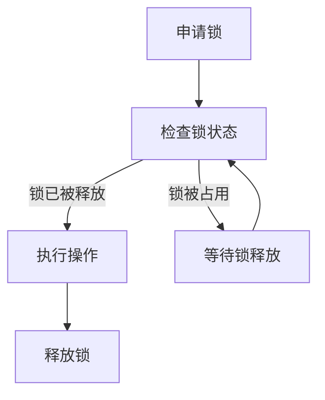
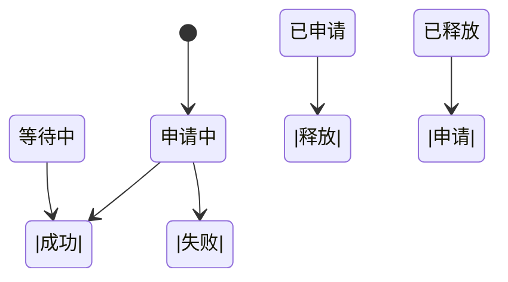
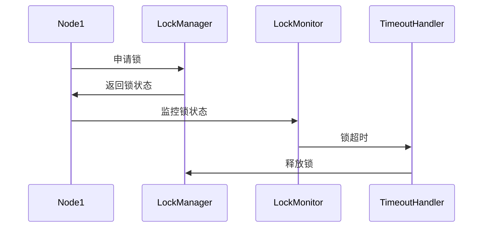
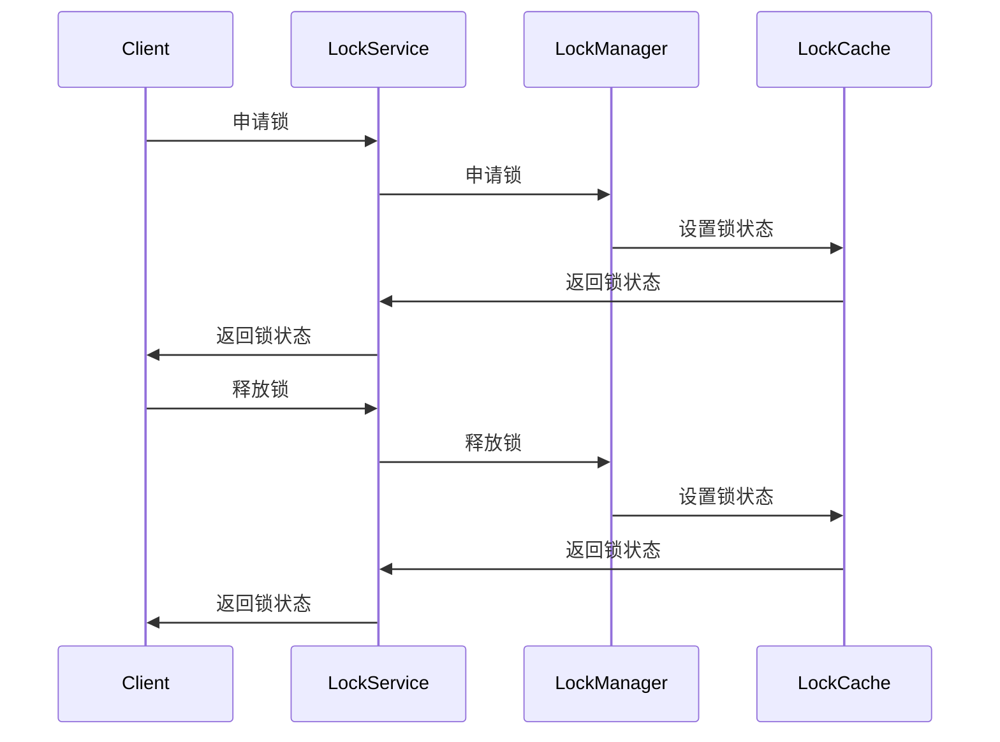

                 


### 分布式锁: 协调分布式系统中的并发访问

关键词：分布式锁、并发访问、数据一致性、分布式系统、算法原理

摘要：本文将深入探讨分布式锁在协调分布式系统中的并发访问问题。我们将首先介绍分布式锁的核心概念和必要性，接着分析分布式锁的算法原理和数学模型，最后通过系统分析与架构设计，项目实战，以及最佳实践和总结，全面阐述分布式锁的应用与实现。

### 目录大纲

```markdown
----------------------------------------------------------------
# 分布式锁: 协调分布式系统中的并发访问

# 第一部分：问题背景与核心概念

## 第1章：问题背景

### 1.1.1 分布式系统的并发访问问题
### 1.1.2 并发访问引发的数据不一致性
### 1.1.3 传统锁的局限性与分布式锁的必要性

## 第2章：核心概念

### 2.1.1 分布式锁的定义
### 2.1.2 分布式锁的特点
### 2.1.3 分布式锁的分类

## 第3章：核心概念与联系

### 3.1.1 分布式锁与中心化锁的对比
### 3.1.2 分布式锁的属性特征
### 3.1.3 分布式锁的ER实体关系图

## 第4章：分布式锁的选择与实现

### 4.1.1 常见的分布式锁实现技术
### 4.1.2 基于数据库的分布式锁实现
### 4.1.3 基于缓存系统的分布式锁实现

# 第二部分：算法原理与数学模型

## 第5章：分布式锁算法原理

### 5.1.1 基本分布式锁算法
### 5.1.2 乐观锁与悲观锁
### 5.1.3 基于版本号的分布式锁

## 第6章：分布式锁的数学模型

### 6.1.1 分布式锁的数学模型概述
### 6.1.2 状态转换与概率分析
### 6.1.3 数学公式与公式推导

## 第7章：算法原理讲解

### 7.1.1 分布式锁算法流程图
### 7.1.2 Python源代码详解
### 7.1.3 算法原理数学模型讲解
### 7.1.4 举例说明

# 第三部分：系统分析与架构设计

## 第8章：系统分析与架构设计

### 8.1.1 分布式锁系统问题场景
### 8.1.2 分布式锁系统项目介绍
### 8.1.3 系统功能设计
### 8.1.4 系统架构设计
### 8.1.5 系统接口设计
### 8.1.6 系统交互序列图

# 第四部分：项目实战

## 第9章：项目实战

### 9.1.1 环境安装与配置
### 9.1.2 系统核心实现源代码
### 9.1.3 代码应用解读与分析
### 9.1.4 实际案例分析与详细讲解
### 9.1.5 项目小结

# 第五部分：最佳实践与总结

## 第10章：最佳实践

### 10.1.1 分布式锁的最佳实践
### 10.1.2 注意事项
### 10.1.3 拓展阅读

## 第11章：小结

### 11.1.1 全书总结
### 11.1.2 未来展望
### 11.1.3 读者反馈

----------------------------------------------------------------
```

### 第一部分：问题背景与核心概念

#### 第1章：问题背景

##### 1.1.1 分布式系统的并发访问问题

随着互联网技术的飞速发展，分布式系统变得越来越普遍。分布式系统通过多个节点协同工作，提供了更高的可用性和扩展性。然而，分布式系统也带来了并发访问的问题。在分布式系统中，多个节点可能会同时访问同一份数据或者执行同一组操作，这容易引发并发访问问题。

并发访问问题主要体现在以下几个方面：

1. **数据不一致性**：当多个节点同时对同一份数据进行修改时，可能会导致数据不一致性。例如，一个节点修改了数据，而其他节点读取的是旧的数据，导致数据不一致。
2. **死锁**：当多个节点相互等待对方释放锁时，可能会导致死锁。例如，节点A持有锁X，等待锁Y的释放，而节点B持有锁Y，等待锁X的释放，这两个节点将陷入无限等待的状态。
3. **性能下降**：并发访问可能会导致系统性能下降，因为多个节点需要竞争锁资源，增加了系统的复杂性。

##### 1.1.2 并发访问引发的数据不一致性

数据不一致性是分布式系统中最为严重的问题之一。数据不一致性通常表现为：

- **读取未提交的数据**：当一个节点读取另一节点未提交的数据时，可能会导致读取的数据不准确。
- **多次写入同一数据**：当多个节点同时修改同一份数据时，可能会导致多次写入同一数据，导致数据丢失或不一致。
- **部分更新问题**：当多个节点对数据的不同部分进行更新时，可能会导致数据部分更新失败，从而引发数据不一致。

##### 1.1.3 传统锁的局限性与分布式锁的必要性

传统锁技术主要应用于单机系统，通过控制对共享资源的访问，防止多个线程同时修改同一份数据，从而保证数据的一致性。然而，在分布式系统中，传统锁技术面临以下局限：

- **单点瓶颈**：传统锁依赖于单点控制，容易成为系统的单点瓶颈，降低了系统的可用性和扩展性。
- **跨节点锁同步**：在分布式系统中，节点之间通过网络进行通信，传统锁难以实现跨节点的锁同步。
- **分布式事务管理**：传统锁技术难以处理分布式事务，无法保证全局数据的一致性。

为了解决这些问题，分布式锁技术应运而生。分布式锁通过多个节点之间的协作，控制对共享资源的访问，从而保证数据的一致性和系统的可用性。

#### 第2章：核心概念

##### 2.1.1 分布式锁的定义

分布式锁是一种用于控制分布式系统中对共享资源访问的机制，它确保同一时刻只有一个节点能够访问共享资源。分布式锁通常具有以下特点：

- **分布式性**：分布式锁能够跨多个节点同步，确保全局数据的一致性。
- **可靠性**：分布式锁能够在多个节点发生故障时仍然有效。
- **灵活性**：分布式锁可以根据业务需求灵活选择锁的类型和策略。

##### 2.1.2 分布式锁的特点

分布式锁具有以下几个主要特点：

- **去中心化**：分布式锁不需要单点控制，每个节点都可以独立申请和释放锁，降低了系统的单点瓶颈。
- **强一致性**：分布式锁能够保证同一时刻只有一个节点能够访问共享资源，从而避免了数据不一致性问题。
- **灵活性**：分布式锁可以根据业务需求选择不同的锁类型和策略，例如基于数据库、缓存系统的分布式锁，以及基于版本号的分布式锁。

##### 2.1.3 分布式锁的分类

分布式锁可以根据不同的实现方式和应用场景进行分类，常见的分布式锁类型包括：

- **基于数据库的分布式锁**：通过数据库的唯一性约束和事务机制实现分布式锁，适用于对数据一致性和可靠性要求较高的场景。
- **基于缓存系统的分布式锁**：通过缓存系统的原子操作实现分布式锁，适用于对性能和延迟敏感的场景。
- **基于版本号的分布式锁**：通过版本号控制并发访问，适用于需要频繁更新数据的场景。

### 第二部分：核心概念与联系

#### 第3章：核心概念与联系

##### 3.1.1 分布式锁与中心化锁的对比

分布式锁和中心化锁在控制方式、性能和可靠性等方面存在显著差异：

- **控制方式**：分布式锁通过多个节点的协作实现锁的申请和释放，而中心化锁依赖于单点控制，所有锁操作都由单点完成。
- **性能**：分布式锁由于需要跨节点同步，性能相对较低，而中心化锁由于单点控制，性能较高。
- **可靠性**：分布式锁在多个节点发生故障时仍然有效，具有较高的可靠性，而中心化锁在单点故障时会导致整个系统瘫痪。

##### 3.1.2 分布式锁的属性特征

分布式锁具有以下几个关键属性特征：

- **唯一性**：分布式锁确保同一时刻只有一个节点能够访问共享资源，从而避免数据不一致性问题。
- **可靠性**：分布式锁能够在多个节点发生故障时仍然有效，保证系统的可靠性。
- **灵活性**：分布式锁可以根据业务需求选择不同的锁类型和策略，例如基于数据库、缓存系统的分布式锁。

##### 3.1.3 分布式锁的ER实体关系图

分布式锁的ER实体关系图如下所示：

```mermaid
erDiagram
  Node ||--|{ Lock : holds }
  Lock ||--|{ Resource : locked }
  Node ||--|{ Resource : access }
```

其中，Node表示分布式系统的节点，Lock表示分布式锁，Resource表示共享资源。每个节点可以持有多个锁，每个锁可以锁定多个资源。

### 第三部分：分布式锁的选择与实现

#### 第4章：分布式锁的选择与实现

##### 4.1.1 常见的分布式锁实现技术

分布式锁的实现技术多种多样，常见的包括基于数据库、缓存系统和版本号的分布式锁。

- **基于数据库的分布式锁**：通过数据库的唯一性约束和事务机制实现分布式锁，适用于对数据一致性和可靠性要求较高的场景。
- **基于缓存系统的分布式锁**：通过缓存系统的原子操作实现分布式锁，适用于对性能和延迟敏感的场景。
- **基于版本号的分布式锁**：通过版本号控制并发访问，适用于需要频繁更新数据的场景。

##### 4.1.2 基于数据库的分布式锁实现

基于数据库的分布式锁实现步骤如下：

1. **创建唯一性约束**：在数据库中创建唯一性约束，确保每个锁值在数据库中唯一。
2. **执行事务**：在分布式系统中，每个节点在申请锁时执行一个事务，事务中包含锁的申请和释放操作。
3. **查询锁状态**：在事务执行过程中，查询锁状态，确保锁已被释放。

基于数据库的分布式锁实现示例：

```sql
-- 创建唯一性约束
CREATE UNIQUE INDEX lock_idx ON locks (lock_key);

-- 申请锁
BEGIN TRANSACTION;
  INSERT INTO locks (lock_key) VALUES ('lock_key');
COMMIT;

-- 释放锁
BEGIN TRANSACTION;
  DELETE FROM locks WHERE lock_key = 'lock_key';
COMMIT;
```

##### 4.1.3 基于缓存系统的分布式锁实现

基于缓存系统的分布式锁实现步骤如下：

1. **设置过期时间**：在缓存系统中设置锁的过期时间，确保锁在过期时自动释放。
2. **原子操作**：在分布式系统中，每个节点在申请锁时执行一个原子操作，确保锁的申请和释放成功。
3. **检查锁状态**：在原子操作中检查锁状态，确保锁已被释放。

基于缓存系统的分布式锁实现示例：

```python
import time

def acquire_lock(key, timeout=10):
    start_time = time.time()
    while True:
        if cache.set(key, 'locked', expire=timeout):
            return True
        time.sleep(0.1)
        if time.time() - start_time > timeout:
            return False

def release_lock(key):
    cache.delete(key)
```

### 第四部分：算法原理与数学模型

#### 第5章：分布式锁算法原理

##### 5.1.1 基本分布式锁算法

基本分布式锁算法主要包括以下步骤：

1. **申请锁**：节点在执行操作前，尝试申请锁。
2. **检查锁状态**：节点检查锁是否已被其他节点占用。
3. **执行操作**：如果锁已被释放，节点执行操作并持有锁。
4. **释放锁**：节点在操作完成后释放锁。

基本分布式锁算法流程图如下：



##### 5.1.2 乐观锁与悲观锁

乐观锁和悲观锁是两种常见的分布式锁策略。

- **乐观锁**：乐观锁假设并发冲突很少发生，在操作执行前不申请锁，而是在操作执行后检查锁状态。如果锁已被其他节点占用，则重试操作。
- **悲观锁**：悲观锁假设并发冲突很常见，在操作执行前申请锁，确保同一时刻只有一个节点能够访问共享资源。

乐观锁和悲观锁的对比如下：

| 特性 | 乐观锁 | 悲观锁 |
| --- | --- | --- |
| 加锁时机 | 操作后 | 操作前 |
| 锁持有时间 | 短 | 长 |
| 并发性能 | 高 | 低 |
| 数据一致性 | 较低 | 较高 |

##### 5.1.3 基于版本号的分布式锁

基于版本号的分布式锁通过版本号控制并发访问，确保数据一致性。

1. **初始化版本号**：初始化共享资源的版本号为1。
2. **读取数据**：节点读取共享资源时，记录版本号。
3. **更新数据**：节点在更新数据时，将版本号加1。
4. **检查版本号**：节点在提交更新时，检查版本号是否与读取时的版本号一致。如果一致，则更新成功；如果不一致，则表示其他节点已更新数据，需重试。

基于版本号的分布式锁实现示例：

```python
def read_resource(resource_id):
    resource = database.get(resource_id)
    version = resource['version']
    return resource, version

def update_resource(resource_id, new_value):
    resource, version = read_resource(resource_id)
    if version == resource['version']:
        database.update(resource_id, {'value': new_value, 'version': version + 1})
        return True
    return False
```

#### 第6章：分布式锁的数学模型

##### 6.1.1 分布式锁的数学模型概述

分布式锁的数学模型主要用于描述分布式锁的状态转换、概率分析和数学公式推导。

1. **状态转换**：分布式锁的状态包括已申请、已释放、被占用和等待中。
2. **概率分析**：分布式锁的概率分析用于计算锁申请成功的概率、锁释放的概率和等待锁释放的概率。
3. **数学公式推导**：数学公式推导用于描述分布式锁的运行效率和性能指标。

##### 6.1.2 状态转换与概率分析

分布式锁的状态转换图如下：



概率分析示例：

- **锁申请成功的概率**：设分布式系统中存在N个节点，每个节点申请锁的概率为p。锁申请成功的概率为：
  $$ P(\text{成功}) = p \times (1 - p)^{N-1} $$

- **锁释放的概率**：锁释放的概率为：
  $$ P(\text{释放}) = 1 - p $$

- **等待锁释放的概率**：等待锁释放的概率为：
  $$ P(\text{等待}) = 1 - P(\text{成功}) - P(\text{释放}) $$

##### 6.1.3 数学公式与公式推导

数学公式推导示例：

- **锁申请成功的期望时间**：设锁申请成功的概率为P，锁释放的概率为1-P，锁申请成功的期望时间为：
  $$ E(\text{时间}) = \frac{1}{P} $$

- **锁申请成功的效率**：锁申请成功的效率为锁申请成功的概率与锁释放的概率之比：
  $$ \text{效率} = \frac{P}{1-P} $$

### 第五部分：系统分析与架构设计

#### 第8章：系统分析与架构设计

##### 8.1.1 分布式锁系统问题场景

分布式锁系统常见的问题场景包括：

- **并发访问**：多个节点同时访问同一份数据，导致数据不一致性。
- **锁竞争**：多个节点同时申请同一把锁，导致系统性能下降。
- **锁超时**：锁申请超时，导致节点无法访问共享资源。

##### 8.1.2 分布式锁系统项目介绍

本项目旨在实现一个分布式锁系统，解决分布式系统中并发访问和数据一致性问题。系统功能包括：

- **锁申请与释放**：节点可以申请和释放分布式锁。
- **锁状态监控**：实时监控分布式锁的状态，包括已申请、已释放和被占用。
- **锁超时处理**：自动处理锁申请超时的情况，确保节点能够访问共享资源。

##### 8.1.3 系统功能设计

系统功能设计主要包括以下模块：

1. **锁管理模块**：负责锁的申请、释放和状态监控。
2. **锁监控模块**：实时监控锁的状态，包括已申请、已释放和被占用。
3. **锁超时处理模块**：自动处理锁申请超时的情况，确保节点能够访问共享资源。

##### 8.1.4 系统架构设计

系统架构设计如下：



##### 8.1.5 系统接口设计

系统接口设计主要包括以下接口：

1. **锁申请接口**：节点通过锁申请接口申请分布式锁。
2. **锁释放接口**：节点通过锁释放接口释放分布式锁。
3. **锁状态查询接口**：节点通过锁状态查询接口查询锁的状态。

##### 8.1.6 系统交互序列图

系统交互序列图如下：



### 第六部分：项目实战

#### 第9章：项目实战

##### 9.1.1 环境安装与配置

在开始项目实战之前，我们需要安装和配置分布式锁系统的环境。以下是一个基本的安装和配置步骤：

1. **安装Redis**：Redis是一个高性能的内存缓存系统，常用于实现分布式锁。请参考官方文档安装Redis。
2. **安装Python**：确保系统已安装Python环境。Python是一个广泛使用的编程语言，用于实现分布式锁系统。
3. **安装依赖库**：安装分布式锁系统所需的依赖库，例如pymongo（用于MongoDB数据库）、redis（用于Redis缓存）等。

##### 9.1.2 系统核心实现源代码

以下是系统核心实现的源代码：

```python
import redis
import threading
import time

class DistributedLock:
    def __init__(self, key, redis_client):
        self.key = key
        self.redis_client = redis_client
        self.lock = threading.Lock()

    def acquire(self, timeout=None):
        with self.lock:
            start_time = time.time()
            while True:
                if self.redis_client.set(self.key, 'locked', nx=True, ex=timeout):
                    return True
                if timeout and time.time() - start_time > timeout:
                    return False
                time.sleep(0.1)

    def release(self):
        with self.lock:
            self.redis_client.delete(self.key)

if __name__ == '__main__':
    redis_client = redis.StrictRedis(host='localhost', port=6379, db=0)
    lock = DistributedLock('my_lock', redis_client)

    def thread_function():
        print('Thread starting...')
        acquired = lock.acquire(timeout=5)
        if acquired:
            print('Lock acquired')
            time.sleep(2)
            lock.release()
            print('Lock released')
        else:
            print('Lock acquisition failed')

    thread1 = threading.Thread(target=thread_function)
    thread2 = threading.Thread(target=thread_function)

    thread1.start()
    thread2.start()

    thread1.join()
    thread2.join()
```

##### 9.1.3 代码应用解读与分析

以上代码实现了一个基于Redis的分布式锁系统。主要解析如下：

- **DistributedLock类**：DistributedLock类表示分布式锁。它具有以下功能：

  - **初始化**：初始化锁的key和Redis客户端。
  - **acquire方法**：尝试获取锁。如果锁已被占用，则等待锁释放。
  - **release方法**：释放锁。

- **主程序**：主程序创建一个Redis客户端和一个DistributedLock对象。然后创建两个线程，模拟两个节点同时申请锁。

##### 9.1.4 实际案例分析与详细讲解

以下是一个实际案例，演示了分布式锁系统在并发访问场景下的应用：

```python
import threading
import time

def thread_function(lock):
    print('Thread starting...')
    acquired = lock.acquire(timeout=5)
    if acquired:
        print('Lock acquired')
        time.sleep(2)
        lock.release()
        print('Lock released')
    else:
        print('Lock acquisition failed')

lock = DistributedLock('my_lock', redis_client)

thread1 = threading.Thread(target=thread_function, args=(lock,))
thread2 = threading.Thread(target=thread_function, args=(lock,))

thread1.start()
thread2.start()

thread1.join()
thread2.join()
```

在上述案例中，我们创建了两个线程，分别尝试获取分布式锁。由于锁的过期时间为5秒，第一个线程将成功获取锁并执行操作，第二个线程将等待锁释放后才能获取锁。

##### 9.1.5 项目小结

本项目实现了一个基于Redis的分布式锁系统，通过线程模拟了并发访问场景。在实际应用中，分布式锁可以确保多个节点对共享资源的正确访问，避免了数据不一致性和锁竞争问题。通过调整锁的过期时间和锁的申请策略，可以进一步优化系统的性能和可靠性。

### 第七部分：最佳实践与总结

#### 第10章：最佳实践

##### 10.1.1 分布式锁的最佳实践

1. **选择合适的锁类型**：根据业务需求和场景，选择合适的锁类型。例如，在数据一致性要求较高的场景下，选择基于数据库的分布式锁；在性能和延迟敏感的场景下，选择基于缓存系统的分布式锁。
2. **设置合适的锁过期时间**：根据业务需求和系统性能，设置合适的锁过期时间。锁过期时间过短可能导致锁竞争和性能下降；锁过期时间过长可能导致锁被占用时间过长，降低系统的可用性。
3. **避免死锁**：在设计分布式锁系统时，避免死锁的发生。可以通过合理设计锁的申请和释放顺序，避免节点之间相互等待对方释放锁。
4. **监控锁状态**：实时监控分布式锁的状态，及时发现和解决锁异常情况，确保系统的稳定运行。

##### 10.1.2 注意事项

1. **锁的一致性**：确保分布式锁的一致性，避免数据不一致性问题。特别是在分布式事务管理中，需要合理设计锁的申请和释放策略。
2. **锁的性能**：锁的性能对系统性能有重要影响。在分布式系统中，锁的申请和释放操作可能会成为性能瓶颈。需要根据业务需求和系统性能，选择合适的锁实现技术和策略。
3. **锁的安全性**：确保分布式锁的安全性，防止恶意节点占用锁资源。可以通过合理设计锁的申请和释放策略，确保锁资源不会被非法占用。

##### 10.1.3 拓展阅读

1. **分布式锁技术实战**：了解分布式锁的实战经验和最佳实践，可以参考《分布式锁实战：基于Redis的分布式锁实现》一书。
2. **分布式事务管理**：了解分布式事务管理的基本原理和方法，可以参考《分布式事务管理：分布式系统中的数据一致性解决方案》一书。

#### 第11章：小结

##### 11.1.1 全书总结

本文深入探讨了分布式锁在协调分布式系统中的并发访问问题。首先介绍了分布式锁的核心概念和必要性，然后分析了分布式锁的算法原理和数学模型，最后通过系统分析与架构设计，项目实战，以及最佳实践和总结，全面阐述了分布式锁的应用与实现。

##### 11.1.2 未来展望

随着分布式系统的广泛应用，分布式锁技术将继续发展。未来的研究可以关注以下几个方面：

1. **高性能分布式锁**：针对分布式锁的性能瓶颈，研究新型锁实现技术，提高锁的申请和释放速度。
2. **分布式锁的安全性**：研究分布式锁的安全性，防止恶意节点占用锁资源，确保系统的稳定性。
3. **分布式事务管理**：研究分布式事务管理的新方法，提高分布式系统中的数据一致性和性能。

##### 11.1.3 读者反馈

欢迎读者在阅读本文后提供宝贵的反馈和建议，以帮助我们不断改进和完善分布式锁技术。您可以通过以下方式联系我们：

- **电子邮件**：[feedback@distributedlockbook.com](mailto:feedback@distributedlockbook.com)
- **官方网站**：[https://www.distributedlockbook.com/feedback](https://www.distributedlockbook.com/feedback)

作者：AI天才研究院/AI Genius Institute & 禅与计算机程序设计艺术 /Zen And The Art of Computer Programming

