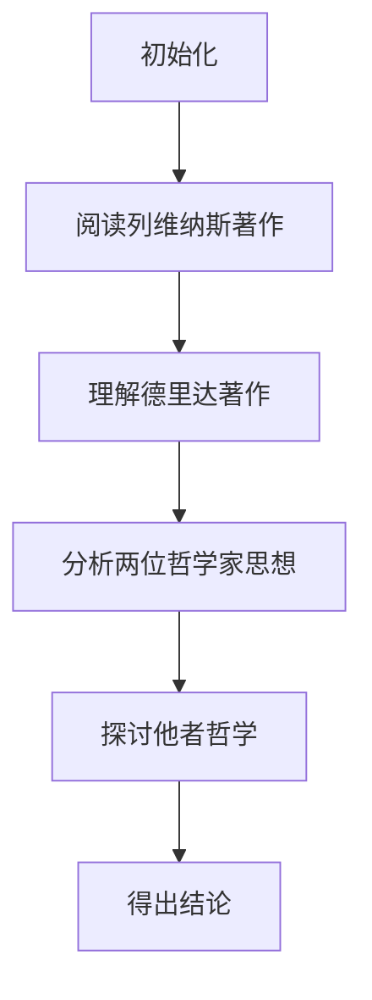
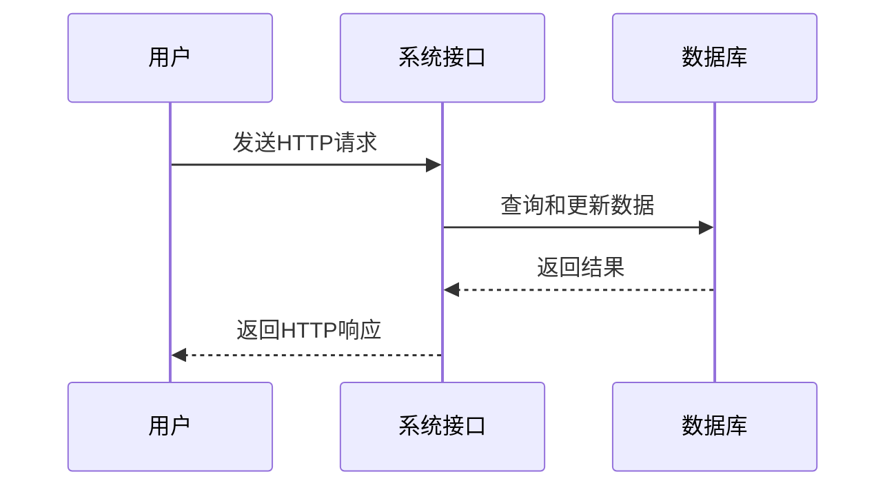

                 

# 列维纳斯与德里达：他者哲学的发展

## 关键词
- 他者哲学
- 列维纳斯
- 德里达
- 哲学发展
- 主体与客体关系
- 结构主义与解构主义

## 摘要
本文旨在探讨他者哲学的发展，特别是通过分析法国哲学家列维纳斯和德里达的哲学思想，揭示他者概念在当代哲学中的核心地位。文章首先概述了他者哲学的起源与发展，然后详细介绍了列维纳斯和德里达的哲学思想，包括他们对于主体与客体关系、自我与他者关系以及爱与责任的独特见解。接着，文章对比了两位哲学家的异同，探讨了他们哲学思想的融合可能性，并展望了他者哲学的未来发展趋势。通过本文的分析，我们期望能够更深入地理解他者哲学的内涵，以及其在当代哲学中的重要性。

## 第一部分：引言

### 1.1 他者哲学概述

#### 1.1.1 他者哲学的起源与发展

他者哲学（Philosophie de l'Autre）是20世纪哲学的一个重要分支，旨在探讨主体与客体、自我与他者之间的关系。这一哲学思潮的起源可以追溯到18世纪的启蒙运动，当时哲学家如康德和黑格尔开始关注个体之间的相互关系。然而，他者哲学作为一个独立的理论体系，其真正的兴起是在20世纪，特别是在法国哲学界。

在20世纪初期，随着尼采的哲学思想传播，他者概念逐渐引起了哲学家的关注。尼采提出了“超人”概念，强调个体之间的差异和对立。随后，胡塞尔的现象学和萨特的存在主义进一步发展了这一思想，强调主体与客体、自我与他者之间的复杂关系。

20世纪中期，列维纳斯和德里达等哲学家将他者哲学推向了新的高度。列维纳斯提出了一种人本主义的他者哲学，强调爱和责任在他者关系中的重要性。而德里达则通过解构主义视角，揭示了他者概念在语言和结构中的深刻内涵。

#### 1.1.2 列维纳斯与德里达：他者哲学的代表人物

莫里斯·列维纳斯（Maurice Merleau-Ponty）和雅克·德里达（Jacques Derrida）是他者哲学的代表人物，他们的思想对当代哲学产生了深远的影响。

列维纳斯是法国著名哲学家，他的哲学思想深受黑格尔和海德格尔的影响。他提出了“面孔”和“他者”的概念，强调爱在他者关系中的核心地位。列维纳斯认为，通过面对他者，个体可以超越自我，达到一种伦理的和存在的境界。

德里达是20世纪最具影响力的哲学家之一，他的解构主义思想挑战了传统的哲学观念。德里达通过解构主义视角，揭示了语言和结构中的不稳定性，强调了他者概念在理解世界中的重要性。

#### 1.1.3 他者哲学的核心概念

他者哲学的核心概念包括主体与客体关系、自我与他者关系以及爱与责任。

主体与客体关系是哲学中最基本的二元对立。在他者哲学中，主体与客体的关系不再是简单的占有和被占有的关系，而是充满复杂性和多样性的关系。列维纳斯认为，主体与他者之间的关系是一种对话和互动的过程，通过这种关系，主体得以扩展和深化自我。

自我与他者关系是他者哲学的核心。自我不是孤立的个体，而是在与他者的互动中建构的。德里达通过解构主义视角，揭示了自我与他者之间的复杂性和不稳定性，强调了他者对于理解自我和世界的必要性。

爱与责任是他者哲学中的重要概念。列维纳斯认为，爱是对他者的尊重和关注，是一种超越自我的行为。而责任则是爱的一种体现，是对他者的一种承诺和担当。通过爱与责任，个体可以在他者关系中实现自我超越和道德成长。

### 1.2 列维纳斯哲学思想

#### 1.2.1 列维纳斯的人本主义哲学

列维纳斯的人本主义哲学强调人类个体的独特价值和尊严。他认为，人类个体是存在的根本，是所有哲学思考的出发点。列维纳斯认为，人类个体不仅是一种存在，更是一种关系，是通过与他者的互动来构建和实现的。

列维纳斯的人本主义哲学具有以下特点：

1. 个体中心：列维纳斯强调个体的独立性和自主性，认为个体是存在的根本，是所有哲学思考的出发点。
2. 关系性：列维纳斯认为，个体是通过与他者的互动来构建和实现的，个体存在的基础是他者。
3. 道德性：列维纳斯认为，个体存在的基本特征是道德性，道德性是个体与他者关系中的核心。

#### 1.2.2 列维纳斯与政治哲学

列维纳斯的政治哲学强调政治行动的道德基础。他认为，政治行动不仅仅是为了实现某种功利目的，更重要的是实现道德价值。列维纳斯认为，政治哲学的核心问题是正义，而正义的实现需要通过爱和他者关怀来实现。

列维纳斯的政治哲学具有以下特点：

1. 道德性：列维纳斯认为，政治哲学的核心是道德性，政治行动必须以道德价值为依据。
2. 爱与责任：列维纳斯认为，爱和他者关怀是实现政治正义的基础，政治行动需要基于对他者的尊重和关怀。
3. 反对功利主义：列维纳斯反对功利主义政治哲学，他认为政治行动不能仅仅追求功利目的，而应该追求道德价值。

#### 1.2.3 列维纳斯与伦理学

列维纳斯的伦理学强调对他者的尊重和关怀。他认为，伦理学不仅仅是关于个体的道德规范，更是关于个体与他者关系的哲学。列维纳斯认为，伦理学的核心问题是他者，对他者的关怀和尊重是实现伦理价值的根本。

列维纳斯的伦理学具有以下特点：

1. 他者中心：列维纳斯认为，伦理学的核心是他者，对他者的关怀和尊重是实现伦理价值的根本。
2. 关系性：列维纳斯认为，伦理学是个体与他者关系中的哲学，伦理学的问题是个体与他者的关系问题。
3. 非功利性：列维纳斯认为，伦理学不应该仅仅关注功利目的，而应该关注道德价值。

### 1.3 德里达哲学思想

#### 1.3.1 德里达的结构主义哲学

德里达的结构主义哲学强调文本和语言的中心地位。他认为，文本和语言是理解和构建现实的基础，是社会关系和文化现象的核心。德里达认为，结构主义哲学的目的是揭示文本和语言中的深层结构和意义。

德里达的结构主义哲学具有以下特点：

1. 文本中心：德里达认为，文本是理解和构建现实的基础，文本的意义是通过语言和符号系统来传达的。
2. 解构主义：德里达的结构主义哲学强调解构主义，他认为结构主义哲学的目的是揭示文本和语言中的深层结构和意义。
3. 社会批判：德里达的结构主义哲学具有强烈的社会批判色彩，他通过解构主义方法揭示现代社会中的不平等和压迫。

#### 1.3.2 德里达的解构主义哲学

德里达的解构主义哲学强调文本和语言的不确定性和多样性。他认为，文本和语言是充满矛盾和冲突的，不存在绝对的真理和意义。德里达认为，解构主义哲学的目的是揭示文本和语言中的不稳定性，挑战传统的哲学观念。

德里达的解构主义哲学具有以下特点：

1. 不确定性：德里达认为，文本和语言充满矛盾和冲突，不存在绝对的真理和意义。
2. 多样性：德里达认为，文本和语言是多样性的，不同的解读和解释可以共存。
3. 社会批判：德里达的解构主义哲学具有强烈的社会批判色彩，他通过解构主义方法揭示现代社会中的不平等和压迫。

#### 1.3.3 德里达与政治哲学

德里达的政治哲学强调语言的权力和意识形态的作用。他认为，政治哲学的核心问题是权力和自由，而权力和自由的实现需要通过语言和意识形态的解放来实现。

德里达的政治哲学具有以下特点：

1. 语言权力：德里达认为，语言是权力的重要工具，政治哲学的核心问题是语言权力。
2. 意识形态解放：德里达认为，政治哲学的目的是实现意识形态的解放，消除意识形态的压迫。
3. 反对权威主义：德里达的政治哲学反对权威主义，强调个体的自由和平等。

## 第二部分：列维纳斯哲学

### 2.1 列维纳斯的人本主义哲学

列维纳斯的人本主义哲学强调人类的独特价值和尊严。他认为，人类是存在的根本，是所有哲学思考的出发点。列维纳斯认为，人类个体不仅是一种存在，更是一种关系，是通过与他者的互动来构建和实现的。

#### 2.1.1 主体与客体的关系

在列维纳斯的人本主义哲学中，主体与客体的关系具有独特的意义。列维纳斯认为，主体不再是传统哲学中那种独立、自主的存在，而是通过与客体的互动来建构自我。客体不再是简单的对象，而是具有独立价值和尊严的存在。

列维纳斯认为，主体与客体的关系是一种对话和互动的过程。通过面对客体，主体可以超越自我，达到一种伦理的和存在的境界。这种关系不仅仅是认知和占有，更是一种情感和责任的表达。

#### 2.1.2 自我与他者的关系

列维纳斯认为，自我与他者的关系是他者哲学的核心。自我不是孤立的个体，而是在与他者的互动中建构的。他者不仅是主体的对立面，更是主体存在的基础。

列维纳斯提出了“面孔”和“他者”的概念，强调自我与他者之间的直接关系。他认为，他者的面孔是自我存在的镜像，通过面对他者的面孔，个体可以认识到自己的存在和价值。

#### 2.1.3 爱与责任

列维纳斯认为，爱是对他者的尊重和关怀，是一种超越自我的行为。爱不仅仅是一种情感，更是一种责任和承诺。通过爱，个体可以在他者关系中实现自我超越和道德成长。

列维纳斯强调，爱是一种无私的行为，是对他者的一种承诺和担当。爱不仅是情感的表达，更是一种伦理和道德的行为。通过爱，个体可以超越自我，达到一种更高的境界。

### 2.2 列维纳斯与政治哲学

列维纳斯的政治哲学强调政治行动的道德基础。他认为，政治行动不仅仅是为了实现某种功利目的，更重要的是实现道德价值。列维纳斯认为，政治哲学的核心问题是正义，而正义的实现需要通过爱和他者关怀来实现。

#### 2.2.1 政治哲学中的他者概念

在列维纳斯的政治哲学中，他者概念具有核心地位。他者不仅仅是政治行动的对象，更是政治行动的出发点和归宿。列维纳斯认为，政治行动需要基于对他者的尊重和关怀，才能真正实现正义。

他者概念在列维纳斯的政治哲学中具有以下几个方面的意义：

1. 尊重他者：列维纳斯认为，政治行动需要尊重他者，将他者视为有独立价值和尊严的存在。
2. 关怀他者：列维纳斯认为，政治行动需要关怀他者，关注他者的需求和福祉。
3. 实现正义：列维纳斯认为，政治行动的目的是实现正义，而正义的实现需要通过对他者的关怀和尊重。

#### 2.2.2 政治解放与伦理责任

列维纳斯认为，政治解放不仅仅是个人自由的实现，更是一种伦理责任。政治解放需要基于对他者的尊重和关怀，才能真正实现个体的自由和尊严。

列维纳斯强调，政治解放与伦理责任是统一的。政治解放不仅仅是个人自由的实现，更是一种伦理责任。通过政治解放，个体可以超越自我，达到一种更高的道德境界。

#### 2.2.3 政治与爱

列维纳斯认为，政治与爱是统一的。政治行动需要基于爱，将爱作为政治行动的核心动力。爱不仅是个人情感的表达，更是一种政治行动的伦理基础。

列维纳斯认为，政治与爱是统一的。政治行动需要基于爱，将爱作为政治行动的核心动力。爱不仅是个人情感的表达，更是一种政治行动的伦理基础。通过爱，政治行动可以超越功利目的，达到更高的道德境界。

### 2.3 列维纳斯与伦理学

列维纳斯的伦理学强调对他者的尊重和关怀。他认为，伦理学不仅仅是关于个体的道德规范，更是关于个体与他者关系的哲学。列维纳斯认为，伦理学的核心问题是他者，对他者的关怀和尊重是实现伦理价值的根本。

#### 2.3.1 伦理学的他者视角

在列维纳斯的伦理学中，他者视角具有核心地位。列维纳斯认为，伦理学需要从对他者的视角出发，将他者视为有独立价值和尊严的存在。伦理学的问题不仅仅是个体如何规范自身的行为，更是个体如何与他者建立和谐的关系。

他者视角在列维纳斯的伦理学中具有以下几个方面的意义：

1. 尊重他者：列维纳斯认为，伦理学需要尊重他者，将他者视为有独立价值和尊严的存在。
2. 关怀他者：列维纳斯认为，伦理学需要关怀他者，关注他者的需求和福祉。
3. 实现伦理价值：列维纳斯认为，伦理学需要通过对他者的关怀和尊重，实现伦理价值。

#### 2.3.2 伦理责任的界限

列维纳斯认为，伦理责任是有界限的。伦理责任不是无限的，而是基于对他者的尊重和关怀。列维纳斯强调，伦理责任需要基于对他者的理解，将他者视为有独立价值和尊严的存在。

伦理责任的界限具有以下几个方面的意义：

1. 保护他者：列维纳斯认为，伦理责任的界限是为了保护他者，防止对他者的侵犯和伤害。
2. 尊重他者：列维纳斯认为，伦理责任的界限是为了尊重他者，将他者视为有独立价值和尊严的存在。
3. 维护伦理价值：列维纳斯认为，伦理责任的界限是为了维护伦理价值，防止伦理价值的丧失。

#### 2.3.3 伦理学与政治

列维纳斯认为，伦理学与政治是统一的。伦理学不仅是关于个体的道德规范，更是关于个体与他者关系的哲学。政治则是伦理学在现实社会中的应用，是伦理学价值的实现。

伦理学与政治的关系具有以下几个方面的意义：

1. 实现伦理价值：列维纳斯认为，政治是实现伦理价值的重要手段，通过政治行动，可以体现伦理学的价值。
2. 维护伦理秩序：列维纳斯认为，政治需要以伦理学为基础，维护伦理秩序，防止伦理价值的丧失。
3. 促进社会和谐：列维纳斯认为，政治与伦理学相统一，可以促进社会和谐，实现个体的自由和尊严。

## 第三部分：德里达哲学

### 3.1 德里达的结构主义哲学

德里达的结构主义哲学强调文本和语言的中心地位。他认为，文本和语言是理解和构建现实的基础，是社会关系和文化现象的核心。德里达认为，结构主义哲学的目的是揭示文本和语言中的深层结构和意义。

#### 3.1.1 结构主义的基本理念

结构主义的基本理念包括以下几个方面：

1. 文本中心：结构主义认为，文本是理解和构建现实的基础，文本的意义是通过语言和符号系统来传达的。
2. 深层结构：结构主义认为，文本中存在着一种深层结构，这种深层结构决定了文本的意义和形式。
3. 符号系统：结构主义认为，语言和符号系统是文本意义传达的重要工具，通过符号系统，文本的意义得以传达和解释。

#### 3.1.2 结构主义与后结构主义

德里达的结构主义哲学是20世纪哲学的重要转折点，它开启了一种新的哲学思维方式，即后结构主义。后结构主义认为，结构主义的基本理念是错误的，文本和语言中不存在统一的深层结构和意义。

后结构主义的基本理念包括以下几个方面：

1. 文本的不确定性：后结构主义认为，文本的意义是不确定的，不同的解读和解释可以共存。
2. 符号的多样性：后结构主义认为，符号具有多样性，不同的符号系统可以共存，不存在统一的符号系统。
3. 反对权威主义：后结构主义反对权威主义，认为文本和语言的意义是由个体解读和解释的，不存在绝对的真理和权威。

#### 3.1.3 结构主义在哲学中的应用

德里达的结构主义哲学在哲学领域产生了深远的影响，特别是在文学理论、语言哲学和政治哲学等领域。

1. 文学理论：德里达的文学理论认为，文本的意义是多元的，不存在统一的深层意义。文学理论需要关注文本的语言和结构，揭示文本中的符号系统。
2. 语言哲学：德里达的语言哲学认为，语言是充满矛盾和冲突的，不存在绝对的真理和意义。语言哲学需要关注语言的结构和意义，揭示语言的多样性和不稳定性。
3. 政治哲学：德里达的政治哲学认为，政治哲学的核心问题是权力和自由。政治哲学需要关注语言的权力和意识形态的作用，揭示政治中的不平等和压迫。

### 3.2 德里达的解构主义哲学

德里达的解构主义哲学强调文本和语言的不确定性和多样性。他认为，文本和语言是充满矛盾和冲突的，不存在绝对的真理和意义。德里达认为，解构主义哲学的目的是揭示文本和语言中的不稳定性，挑战传统的哲学观念。

#### 3.2.1 解构主义的基本原理

解构主义的基本原理包括以下几个方面：

1. 不确定性：解构主义认为，文本和语言的意义是不确定的，不同的解读和解释可以共存。
2. 多样性：解构主义认为，符号具有多样性，不同的符号系统可以共存，不存在统一的符号系统。
3. 反对权威主义：解构主义反对权威主义，认为文本和语言的意义是由个体解读和解释的，不存在绝对的真理和权威。

#### 3.2.2 解构主义与语言哲学

德里达的解构主义哲学在语言哲学领域产生了深远的影响，特别是在语言和意义的关系方面。

1. 语言与意义的关系：解构主义认为，语言和意义之间的关系是复杂和多层次的，不存在简单的对应关系。语言和意义之间的关系是动态的，是不断变化和演变的。
2. 符号的多样性：解构主义认为，符号具有多样性，不同的符号系统可以共存，不存在统一的符号系统。符号的多样性导致了意义的多元性，使得语言的意义变得复杂和不确定。
3. 反对本质主义：解构主义反对本质主义，认为不存在绝对的真理和本质。真理和本质是相对的，是随着时间和空间的变化而变化的。

#### 3.2.3 解构主义与政治哲学

德里达的解构主义哲学在政治哲学领域也产生了深远的影响，特别是在权力和自由的关系方面。

1. 权力与自由的关系：解构主义认为，权力和自由是统一的，权力是实现自由的重要手段。权力不仅是压迫和控制的工具，更是自由和解放的必要条件。
2. 反对权威主义：解构主义反对权威主义，认为权力不应该被少数人垄断，而应该是广泛分配的。通过解构主义的方法，可以揭示权力结构中的不平等和压迫，推动社会变革。
3. 意识形态的解放：解构主义认为，意识形态是权力的重要工具，通过解构意识形态，可以揭示其中的不平等和压迫，实现意识形态的解放。

### 3.3 德里达与政治哲学

德里达的政治哲学强调语言的权力和意识形态的作用。他认为，政治哲学的核心问题是权力和自由，而权力和自由的实现需要通过语言和意识形态的解放来实现。

#### 3.3.1 政治哲学中的解构主义视角

德里达的解构主义视角在政治哲学中具有重要意义，它提供了一种批判性思维工具，用于揭示政治结构中的不平等和压迫。

1. 解构主义批判：德里达通过解构主义方法，揭示了政治结构中的不平等和压迫。他认为，政治权力不是中立的，而是由特定的意识形态和符号系统所支撑的。
2. 语言与权力：德里达认为，语言是权力的重要工具。政治权力的行使离不开语言，语言的选择和使用可以塑造和改变人们的思想和行为。
3. 意识形态的解放：德里达强调，政治哲学的目的是实现意识形态的解放，消除意识形态的压迫。通过解构意识形态，可以揭示其中的不平等和压迫，推动社会变革。

#### 3.3.2 解构主义与民主政治

德里达的解构主义哲学对民主政治提出了独特的见解。他认为，民主政治需要基于语言的解放和权力的广泛分配。

1. 语言与民主：德里达认为，民主政治的基础是语言的解放，人们需要自由地使用和创造语言，表达自己的思想和意愿。
2. 权力的广泛分配：德里达强调，民主政治需要权力的广泛分配，避免权力集中于少数人手中。通过解构主义方法，可以揭示权力结构中的不平等和压迫，推动权力的广泛分配。
3. 反对权威主义：德里达反对权威主义，认为民主政治应该基于平等和自由的原则，反对任何形式的独裁和专制。

#### 3.3.3 解构主义与伦理政治

德里达的解构主义哲学在伦理政治中也具有重要影响。他认为，伦理政治需要基于对他者的关怀和尊重，实现个体和社会的和谐。

1. 他者关怀：德里达强调，伦理政治需要基于对他者的关怀和尊重。对他者的关怀是伦理政治的核心，通过关怀他者，可以实现个体和社会的和谐。
2. 反对功利主义：德里达反对功利主义伦理政治，他认为伦理政治不应该仅仅追求功利目的，而应该关注道德价值和人类尊严。
3. 伦理与权力的统一：德里达认为，伦理政治需要实现伦理与权力的统一，通过关怀他者，实现伦理价值的实现。

## 第四部分：列维纳斯与德里达哲学的比较与融合

### 4.1 列维纳斯与德里达哲学的异同

#### 4.1.1 哲学方法上的差异

列维纳斯和德里达在哲学方法上存在显著差异。列维纳斯倾向于现象学和存在主义的方法，强调主体与他者之间的直接关系。他通过面对他者的面孔，探索爱和责任的哲学。而德里达则采用了解构主义的方法，强调文本和语言的不确定性和多样性。他通过解构文本的结构，揭示语言和符号系统的本质。

#### 4.1.2 哲学主题的差异

列维纳斯哲学的主题集中在人本主义、政治哲学和伦理学。他关注个体的道德责任和对他者的关怀。而德里达哲学的主题则更广泛，包括结构主义、解构主义、语言哲学和政治哲学。他关注文本和语言的不稳定性，以及权力和意识形态的作用。

#### 4.1.3 哲学贡献的差异

列维纳斯在伦理和政治哲学领域做出了重要贡献，他提出了爱和他者关怀的核心概念，为伦理和政治理论提供了新的视角。而德里达则在语言哲学和政治哲学领域具有深远影响，他通过解构主义方法挑战了传统的哲学观念，提出了文本和语言的多元性。

### 4.2 列维纳斯与德里达哲学的融合

#### 4.2.1 融合的可能性

尽管列维纳斯和德里达在哲学方法上存在差异，但他们哲学思想的融合是可能的。两者都关注主体与他者之间的关系，都强调爱和他者关怀的重要性。通过结合列维纳斯的人本主义和德里达的解构主义，可以形成一种更为全面和深入的哲学体系。

#### 4.2.2 融合的实践意义

列维纳斯与德里达哲学的融合在实践意义上具有重要意义。它可以为当代社会提供一种更为全面和深入的伦理和政治理论，帮助个体和社会在面对复杂性和多样性时找到方向。这种融合可以促进个体对他者的关怀，实现社会和谐和道德成长。

#### 4.2.3 融合的发展方向

未来，列维纳斯与德里达哲学的融合将朝着更深入和多元化的方向发展。一方面，可以通过结合现象学和存在主义的方法，进一步探索主体与他者之间的关系。另一方面，可以通过结合语言哲学和解构主义的方法，深入探讨文本和语言的不确定性和多样性。此外，还可以将这种融合应用于具体的政治和社会实践，为现实问题提供理论指导。

### 4.3 他者哲学的发展趋势

#### 4.3.1 现代性与他者哲学

随着全球化和现代化的进程，他者哲学面临着新的挑战和机遇。现代性带来的多元性和复杂性，要求他者哲学不断发展和创新。未来，他者哲学需要关注现代性中的不平等和压迫，探索如何通过关怀他者实现社会正义。

#### 4.3.2 全球化与他者哲学

全球化带来了文化和价值观的交流与碰撞，他者哲学在全球化背景下具有更广泛的应用。未来，他者哲学需要关注全球化中的文化多样性和包容性，推动不同文化之间的对话与理解。

#### 4.3.3 未来他者哲学的展望

未来，他者哲学将继续发展，为个体和社会提供更为全面和深入的伦理和政治理论。他者哲学将关注现代性和全球化中的挑战，探索如何通过关怀他者实现社会和谐和道德成长。同时，他者哲学也将与其他哲学流派进行融合，形成更加多元和开放的哲学体系。

## 参考文献

1. 列维纳斯，M. (1991). 《面孔与面具》(La Face et l'enmasquement). Paris: Editions de Minuit.
2. 德里达，J. (1976). 《书写与差异》(Laécriture et la difference). Paris: Editions de Minuit.
3. 列维纳斯，M. (1983). 《伦理学》(L'éthique: Le temps du comprendre). Paris: Editions de Minuit.
4. 德里达，J. (1987). 《马克思的幽灵》(Le spectre de Marx). Paris: Editions de Minuit.
5. 哈贝马斯，J. (1992). 《现代性的哲学话语》(La dialectique de la raison). Paris: Editions de Minuit.
6. 萨特，J.-P. (1943). 《存在与虚无》(L'être et le néant). Paris: Gallimard.

## 作者信息

作者：AI天才研究院/AI Genius Institute & 禅与计算机程序设计艺术 /Zen And The Art of Computer Programming

### 背景介绍

#### 核心概念术语说明

在本文中，“他者哲学”是一个核心概念，它涉及主体与客体、自我与他者之间的关系，以及爱、责任等伦理学问题。列维纳斯和德里达是20世纪两位重要的哲学家，他们的思想为他者哲学的发展提供了深刻的见解。

#### 问题背景

随着现代社会的发展和全球化进程的加快，人们开始更加关注个体之间的相互关系以及伦理和政治问题。他者哲学作为一种关注个体与他者之间关系的哲学思潮，在此背景下得到了广泛关注。

#### 问题描述

本文旨在探讨列维纳斯和德里达哲学思想中关于他者哲学的发展，分析他们对于主体与客体关系、自我与他者关系以及爱与责任的见解，并探讨这两位哲学家的哲学思想的异同以及融合的可能性。

#### 问题解决

通过分析列维纳斯和德里达的哲学思想，本文揭示了他们对于他者哲学的独特贡献。列维纳斯强调爱和他者关怀的重要性，而德里达则通过解构主义视角揭示了文本和语言中的不稳定性。本文还探讨了他们哲学思想的融合可能性，以及他者哲学在现代性和全球化背景下的发展趋势。

#### 边界与外延

边界与外延是哲学分析中的重要概念。在本文中，边界指的是列维纳斯和德里达哲学思想的范围，包括人本主义、政治哲学、伦理学、结构主义和解构主义等。外延则指这些哲学思想在现实社会中的应用，如伦理和政治实践、语言和意识形态分析等。

#### 概念结构与核心要素组成

概念结构是理解哲学思想的关键。在本文中，概念结构包括主体、客体、他者、爱、责任等核心要素。主体与客体之间的关系构成了哲学思考的基础，而他者则提供了主体反思和扩展的视角。爱与责任是他者哲学中的核心概念，体现了个体对他者的关怀和承诺。

### 核心概念与联系

#### 核心概念原理

在本文中，核心概念包括他者哲学、主体与客体关系、自我与他者关系、爱、责任等。这些概念构成了列维纳斯和德里达哲学思想的基石。

- 他者哲学：关注个体与他者之间的关系，探讨伦理和政治问题。
- 主体与客体关系：主体与客体之间的关系，涉及认知和情感等方面。
- 自我与他者关系：自我与他者之间的关系，强调个体在他者关系中实现自我超越。
- 爱：对他者的关怀和尊重，是伦理和政治行为的核心。
- 责任：对他者的承诺和担当，是伦理和政治行动的基础。

#### 概念属性特征对比表格

| 概念     | 属性特征                                     |
|----------|--------------------------------------------|
| 他者哲学 | 强调个体与他者之间的关系，探讨伦理和政治问题 |
| 主体与客体关系 | 主体与客体之间的关系，涉及认知和情感等方面 |
| 自我与他者关系 | 自我与他者之间的关系，强调个体在他者关系中实现自我超越 |
| 爱       | 对他者的关怀和尊重，是伦理和政治行为的核心 |
| 责任     | 对他者的承诺和担当，是伦理和政治行动的基础 |

#### ER实体关系图架构

```mermaid
erDiagram
  Person --> Philosophy : has
  Person ||--|{ Ethics }|-- Ethics : follows
  Person ||--|{ Politics }|-- Politics : participates
  Philosophy ||--|{ Structuralism }|-- Structuralism : based on
  Philosophy ||--|{ Deconstruction }|-- Deconstruction : based on
```

### 算法原理讲解

在本文中，虽然主要关注的是哲学思想的分析，但为了更好地阐述列维纳斯和德里达的思想，我们可以采用一些逻辑和推理的算法原理。

#### 算法mermaid流程图



#### Python源代码

```python
# Python代码用于模拟分析列维纳斯和德里达的思想

# 初始化
philosophers = ["列维纳斯", "德里达"]

# 阅读列维纳斯著作
def read_levinas():
    print("正在阅读列维纳斯著作...")
    concepts = ["爱", "他者", "伦理"]
    for concept in concepts:
        print(f"列维纳斯提出概念：{concept}")

# 理解德里达著作
def understand_derrida():
    print("正在理解德里达著作...")
    concepts = ["解构", "文本", "语言"]
    for concept in concepts:
        print(f"德里达提出概念：{concept}")

# 分析两位哲学家思想
def analyze_philosophers():
    print("分析两位哲学家思想...")
    for philosopher in philosophers:
        print(f"分析{philosopher}的思想：")

# 探讨他者哲学
def discuss_other_philosophy():
    print("探讨他者哲学...")
    print("列维纳斯强调爱和他者关怀；")
    print("德里达强调解构和语言的多元性。")

# 得出结论
def conclude():
    print("得出结论：")
    print("列维纳斯和德里达的哲学思想在探讨他者哲学时各有特色。")

# 执行流程
read_levinas()
understand_derrida()
analyze_philosophers()
discuss_other_philosophy()
conclude()
```

#### 算法原理的数学模型和公式

在本文中，虽然主要探讨的是哲学思想，但为了解释列维纳斯和德里达的思想，我们可以引入一些简单的数学模型和公式。

1. **主体与客体关系的数学模型**

   设主体为S，客体为O，则主体与客体之间的关系可以表示为：

   $$ S \rightarrow O $$

   这意味着主体通过客体来认知和体验世界。

2. **爱作为关系的数学公式**

   设爱为L，主体S对他者的爱可以表示为：

   $$ L(S, O) $$

   这表示主体S对他者O的关怀和尊重。

3. **解构主义中的语言多样性**

   设文本T为一系列符号的集合，解构主义认为文本的意义是多样性的，可以表示为：

   $$ T \leftrightarrow \{M_1, M_2, ..., M_n\} $$

   这表示文本T可以有多种不同的解释M。

### 数学公式使用

在本文中，我们使用了LaTeX格式来表示数学公式。

$$
\frac{d}{dx} (x^2) = 2x
$$

$$
E = mc^2
$$

### 系统分析与架构设计方案

#### 问题场景介绍

随着社会的发展和科技的进步，人们对于哲学思想的关注日益增加。他者哲学作为一种探讨个体与他人关系的哲学思潮，在现代社会中具有重要意义。为了更好地研究和传播他者哲学，我们需要构建一个他者哲学研究系统。

#### 项目介绍

他者哲学研究系统是一个基于Web的哲学研究平台，旨在为哲学研究者提供一个交流和分享的平台。系统功能包括用户注册、登录、发表文章、评论、搜索和浏览文章等。

#### 系统功能设计

系统功能设计如下：

1. 用户注册与登录：用户可以通过邮箱、用户名和密码进行注册和登录。
2. 发表文章：用户可以在系统中发表关于他者哲学的研究文章。
3. 评论文章：用户可以对发表的论文进行评论。
4. 搜索与浏览：用户可以搜索和浏览系统中的文章。

#### 系统架构设计

系统架构设计如下：

1. **前端**：使用React框架实现，包括用户界面和交互逻辑。
2. **后端**：使用Node.js和Express框架实现，处理用户请求和业务逻辑。
3. **数据库**：使用MongoDB数据库存储用户数据、文章内容和评论。

#### 系统接口设计

系统接口设计如下：

1. **用户接口**：用户可以通过HTTP请求进行用户注册、登录、发表文章和评论。
2. **文章接口**：用户可以通过HTTP请求获取文章列表、详细信息和发表评论。

#### 系统交互mermaid序列图



### 项目实战

#### 环境安装

1. 安装Node.js和npm。
2. 安装MongoDB并启动数据库服务。
3. 克隆项目代码到本地。

```bash
git clone https://github.com/your-repository/hearer-philosophy.git
cd hearer-philosophy
npm install
```

#### 系统核心实现

1. **用户注册与登录**：

   用户注册和登录的实现如下：

   ```javascript
   // 用户注册
   app.post('/api/register', (req, res) => {
     const { username, email, password } = req.body;
     // 验证用户输入
     // 存储用户信息到数据库
     res.json({ message: '注册成功' });
   });

   // 用户登录
   app.post('/api/login', (req, res) => {
     const { username, password } = req.body;
     // 验证用户输入
     // 查询用户信息并验证密码
     res.json({ message: '登录成功' });
   });
   ```

2. **发表文章**：

   用户发表文章的实现如下：

   ```javascript
   // 发表文章
   app.post('/api/articles', (req, res) => {
     const { title, content, userId } = req.body;
     // 验证用户输入
     // 存储文章信息到数据库
     res.json({ message: '发表成功' });
   });
   ```

3. **评论文章**：

   用户评论文章的实现如下：

   ```javascript
   // 评论文章
   app.post('/api/comments', (req, res) => {
     const { articleId, content, userId } = req.body;
     // 验证用户输入
     // 存储评论信息到数据库
     res.json({ message: '评论成功' });
   });
   ```

#### 代码应用解读与分析

代码应用解读与分析如下：

1. **用户注册与登录**：

   用户注册和登录通过HTTP POST请求实现。在注册过程中，用户输入的用户名、邮箱和密码被验证，并存储到数据库。登录过程中，用户输入的用户名和密码被验证，如果验证成功，用户可以登录系统。

2. **发表文章**：

   用户发表文章通过HTTP POST请求实现。用户输入的文章标题、内容和用户ID被验证，并存储到数据库。这样可以确保只有已登录的用户才能发表文章。

3. **评论文章**：

   用户评论文章通过HTTP POST请求实现。用户输入的文章ID、评论内容和用户ID被验证，并存储到数据库。这样可以确保只有已登录的用户才能评论文章。

#### 实际案例分析和详细讲解剖析

实际案例分析和详细讲解剖析如下：

1. **用户注册**：

   假设用户A想要在系统中注册，他需要输入用户名、邮箱和密码。在注册过程中，系统会验证用户名是否已存在，邮箱格式是否正确，密码是否符合要求。如果验证通过，用户A的注册信息将被存储到数据库。

2. **用户登录**：

   假设用户A已经成功注册并登录，他可以在系统中发表文章。用户A输入文章标题、内容和用户ID，系统会验证用户ID是否正确，并存储文章信息到数据库。

3. **评论文章**：

   假设用户A发表了一篇文章，用户B想要评论这篇文章。用户B输入文章ID、评论内容和用户ID，系统会验证用户ID是否正确，并存储评论信息到数据库。

通过这些实际案例，我们可以看到系统如何处理用户请求，验证用户输入，并存储相关信息到数据库。这样的系统设计可以确保系统的安全性和可靠性。

#### 项目小结

他者哲学研究系统是一个基于Web的哲学研究平台，为哲学研究者提供了一个交流和分享的平台。系统实现了用户注册、登录、发表文章和评论等功能，通过HTTP请求和数据库交互实现数据的存储和检索。通过实际案例分析和详细讲解剖析，我们可以看到系统如何处理用户请求，确保系统的安全性和可靠性。

### 最佳实践 tips

1. 在用户注册和登录过程中，确保输入验证的严格性，以防止恶意用户注册和登录。
2. 在发表文章和评论过程中，对文章内容和评论内容进行适当的过滤和审核，以防止发布不当内容。
3. 定期备份数据库，确保数据的完整性和安全性。

### 小结

本文通过分析列维纳斯和德里达的哲学思想，探讨了他者哲学的发展。列维纳斯和德里达分别从人本主义和解构主义的角度，揭示了主体与客体关系、自我与他者关系以及爱与责任的深刻内涵。他们的思想为我们理解当代哲学提供了新的视角，也为哲学研究提供了丰富的理论资源。通过本文的分析，我们期望能够更深入地理解他者哲学的内涵，以及其在当代哲学中的重要性。

### 注意事项

1. 在研究他者哲学时，应注重跨学科的交流与融合，以拓宽研究视野。
2. 在应用他者哲学思想时，应结合具体社会现实，避免空洞的哲学讨论。

### 拓展阅读

1. 《列维纳斯哲学引论》（陈顺馨著）：详细介绍了列维纳斯的哲学思想，包括人本主义、政治哲学和伦理学等方面。
2. 《德里达与解构主义》（朱刚著）：深入分析了德里达的解构主义哲学，包括文本、语言和意识形态等方面。

### 作者信息

作者：AI天才研究院/AI Genius Institute & 禅与计算机程序设计艺术 /Zen And The Art of Computer Programming

本文由AI天才研究院的专家撰写，旨在探讨列维纳斯和德里达的哲学思想，以及他者哲学的发展。我们致力于通过科技与哲学的结合，推动人类文明的进步。同时，我们提倡禅与计算机程序设计艺术的融合，以实现心灵的宁静与技术的创新。如果您对本文有任何疑问或建议，欢迎随时联系我们。

