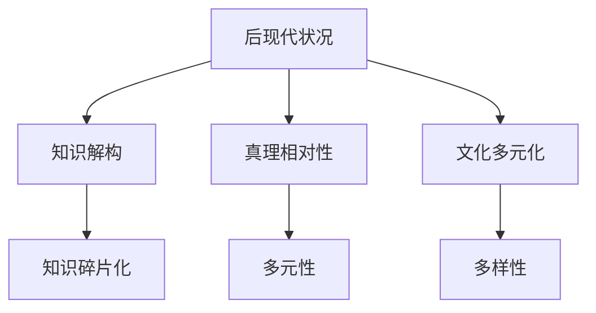
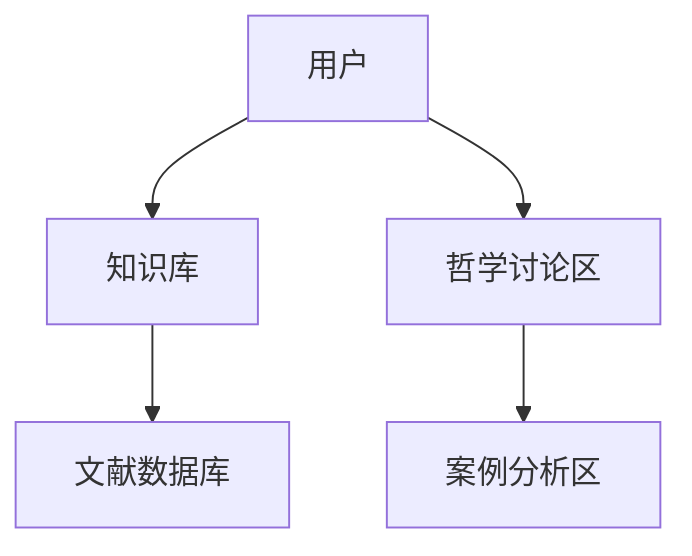
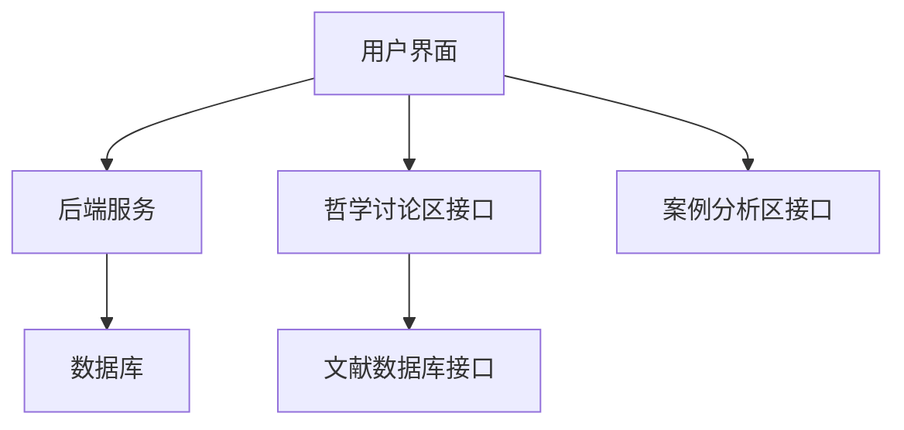
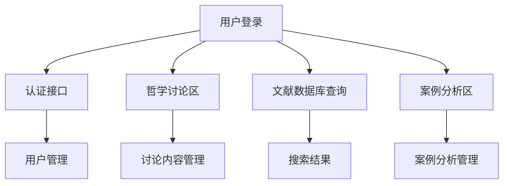

                 

# 利奥塔与庄子：后现代状况与齐物论的对话

## 关键词
- 后现代状况
- 齐物论
- 哲学对话
- 利奥塔
- 庄子

## 摘要
本文通过探讨后现代状况与齐物论的对话，试图揭示两种哲学思想体系在理解世界和人生方面的共通之处与差异。通过对利奥塔和庄子思想的深入分析，本文旨在提供一种新的视角来审视现代社会的复杂性和多样性。通过这种对话，我们希望激发读者对哲学和技术的进一步思考，从而更好地应对当今世界的挑战。

## 引言

### 1.1 利奥塔与庄子的背景

#### 1.1.1 利奥塔的后现代理论

让-弗朗索瓦·利奥塔（Jean-François Lyotard）是一位著名的后现代主义哲学家，出生于1924年。他的思想深受法国哲学传统的影响，尤其是巴塔耶、福柯和德里达等人的理论。利奥塔提出了后现代状况（postmodern condition）的概念，这是他对现代社会特征的一种深刻洞察。他认为，后现代状况主要表现为知识的解构、真理的相对性和文化的多元化。

**1.1.1.1 利奥塔的生平与思想发展**

利奥塔早年曾在巴黎索邦大学学习哲学，后来在法国军事学院任教。他在1960年代后期开始关注现代主义和后现代主义的问题，并发表了多篇有关哲学和文化的论文。1979年，他出版了《后现代状况：关于知识的报告》（The Postmodern Condition: A Report on Knowledge），这是他最具代表性的著作之一。

**1.1.1.2 后现代主义的核心概念**

后现代主义反对传统的中心主义和总体性，强调多样性和差异。利奥塔提出，现代社会中的知识已经不再是统一的、确定的和普遍适用的，而是碎片化的、多元的。他强调，真理是相对的，不存在绝对真理。此外，文化的多元化也是后现代状况的重要特征，不同文化之间的对话和冲突成为现代社会的主要现象。

**1.1.1.3 利奥塔与后现代状况**

利奥塔的后现代状况理论是对现代社会的一种深刻反思。他认为，现代社会的知识体系已经崩溃，取而代之的是一系列片段化的知识，这些知识不再能够提供统一的解释框架。这种状况导致了对真理和知识的重新定义，使得我们不得不以新的方式来思考和理解世界。

#### 1.1.2 庄子的哲学思想

庄子（约公元前369年—前286年）是中国古代哲学家，道家学派的代表人物之一。他的思想对后世产生了深远的影响，尤其在中国哲学和文学领域。庄子的哲学强调“无为而治”和“齐物论”，主张超越现实世界的纷争和矛盾，追求内心的宁静和自由。

**1.1.2.1 庄子的生平与思想形成**

庄子出生于楚国，年轻时曾担任管理漆园的小官。然而，他对官场的腐败和虚伪感到厌恶，最终选择归隐山林，专注于哲学思考。他的思想深受道家传统的影响，同时融合了儒家的元素。

**1.1.2.2 齐物论的基本观点**

齐物论是庄子的核心思想之一，主张万物本质上平等，没有高下之分。庄子认为，人们之所以感到痛苦和困扰，是因为他们将世界划分为彼此对立的事物。通过“齐物”，我们可以超越这种对立，达到内心的平静和自由。

**1.1.2.3 庄子与东方哲学传统**

庄子的思想在中国哲学传统中具有重要地位，他继承了道家的自然主义和逍遥精神，同时也吸收了儒家的思想。庄子的哲学强调人与自然的和谐，提倡通过内在的修炼达到心灵的宁静。

### 1.2 本书的目的

#### 1.2.1 探讨后现代状况与齐物论的对话

本文的目的在于通过利奥塔和庄子的哲学思想，探讨后现代状况与齐物论的对话。这种对话不仅有助于我们更深入地理解两种哲学体系的本质，还能够为我们提供新的视角来审视现代社会的问题。

**1.2.1.1 后现代状况的理论基础**

后现代状况的理论基础主要在于对现代社会知识体系的解构。利奥塔认为，现代社会中的知识是碎片化的，不再有一个统一的解释框架。这种状况导致了对真理和知识的重新定义，使得我们不得不以新的方式来思考和理解世界。

**1.2.1.2 齐物论的基本观点与内涵**

齐物论是庄子的核心思想，主张万物本质上平等，没有高下之分。通过“齐物”，我们可以超越现实世界的纷争和矛盾，达到内心的平静和自由。

**1.2.1.3 对话的意义与目的**

通过探讨后现代状况与齐物论的对话，我们希望能够揭示两种哲学思想体系在理解世界和人生方面的共通之处与差异。这种对话不仅有助于我们更深入地理解哲学思想，还能够为我们提供新的视角来审视现代社会的问题。

## 利奥塔的后现代理论解析

### 2.1 后现代状况的概念

#### 2.1.1 后现代状况的定义

后现代状况是指现代社会中知识体系的解构和多元性的体现。在这种状况下，知识的统一性和确定性受到质疑，真理的相对性和文化的多元化成为主流。

##### 2.1.1.1 后现代状况的起源

后现代状况的起源可以追溯到20世纪60年代，当时西方社会经历了大规模的社会变革和文化运动，如法国的五月风暴和美国的反文化运动。这些事件挑战了传统的价值观和知识体系，促使人们开始重新思考现代社会的问题。

##### 2.1.1.2 后现代状况的特征

后现代状况的特征包括：

1. 知识的碎片化：现代社会中的知识不再是统一的、确定的和普遍适用的，而是碎片化的、多元的。
2. 真理的相对性：后现代主义认为真理是相对的，不存在绝对真理。
3. 文化的多元化：后现代状况下，不同文化之间的对话和冲突成为现代社会的主要现象。

#### 2.1.2 利奥塔的后现代理论体系

利奥塔的后现代理论体系主要涉及以下几个方面：

##### 2.1.2.1 知识的解构

利奥塔认为，现代社会中的知识体系已经崩溃，取而代之的是一系列片段化的知识。这些知识不再能够提供统一的解释框架，导致了对真理和知识的重新定义。

##### 2.1.2.2 真理的相对性

真理的相对性是利奥塔后现代理论的核心概念之一。他认为，现代社会中的真理是多元的、片段化的，不再有一个统一的、普遍适用的真理。

##### 2.1.2.3 文化的多元化

文化的多元化是后现代状况的另一个重要特征。利奥塔认为，现代社会中不同文化之间的对话和冲突是不可避免的，这种多元化体现了后现代状况的本质。

### 2.2 后现代状况对现代社会的影响

#### 2.2.1 后现代主义在文学与艺术领域的表现

后现代主义在文学与艺术领域有广泛的表现，以下是一些主要特点：

1. 反传统：后现代文学作品和艺术作品往往反对传统的叙事结构、价值观念和审美标准。
2. 碎片化：后现代文学和艺术作品常常呈现为碎片化的、多元的叙事方式。
3. 非线性：后现代文学作品和艺术作品通常采用非线性的叙事手法，打破了传统的时间顺序和因果关系。

#### 2.2.2 后现代状况对政治与哲学的影响

后现代状况对政治和哲学领域产生了深远的影响，主要表现在以下几个方面：

1. 反对中心主义：后现代主义反对传统的中心主义和总体性，强调多样性和差异。
2. 知识的解构：后现代主义认为，现代社会中的知识体系已经崩溃，真理是相对的。
3. 政治上的多元化：后现代状况下，政治领域也呈现出多元化和去中心化的趋势。

### 2.3 利奥塔后现代理论的批判

尽管利奥塔的后现代理论对现代社会有着深刻的洞察，但也受到了一些批评：

1. 消极主义：有人认为利奥塔的后现代理论过于消极，忽视了社会变革的可能性。
2. 缺乏具体方案：利奥塔的后现代理论更多是理论上的探讨，缺乏具体的实践方案。

### 2.4 利奥塔与庄子的比较

虽然利奥塔和庄子的哲学思想在表面上存在差异，但在某些方面也有共通之处：

1. 真理的相对性：两者都认为真理是相对的，不存在绝对真理。
2. 反对中心主义：利奥塔和庄子都反对传统的中心主义和总体性。
3. 倡导多元化：两者都强调多样性和差异的重要性。

通过对利奥塔和庄子哲学思想的比较，我们可以更好地理解后现代状况与齐物论之间的对话关系。

## 庄子的齐物论解读

### 3.1 齐物论的核心思想

#### 3.1.1 齐物论的基本概念

齐物论是庄子的核心思想之一，主张万物本质上平等，没有高下之分。庄子通过一系列比喻和寓言，阐述了这一观点。

##### 3.1.1.1 齐物论的含义

“齐物”即“齐同万物”，意味着超越万物之间的对立和差异，达到一种超越的境界。庄子认为，人们之所以感到痛苦和困扰，是因为他们将世界划分为彼此对立的事物。

##### 3.1.1.2 齐物论的地位与影响

齐物论在庄子哲学中占有重要地位，它不仅是对传统儒家和道家哲学的批判，也是对人类生活状态的深刻反思。齐物论对中国哲学和文化产生了深远的影响，成为后世许多哲学家和文学家探讨的主题。

#### 3.1.2 齐物论中的辩证法

辩证法是庄子齐物论的重要组成部分，它体现了庄子对事物发展变化的深刻洞察。

##### 3.1.2.1 辩证法的运用

庄子的辩证法强调对立统一的原则，认为事物的发展变化是通过对立面的斗争和统一而实现的。庄子通过“阴阳相生相克”、“五行相生相克”等比喻，阐述了辩证法的运用。

##### 3.1.2.2 辩证法的哲学意义

辩证法在庄子哲学中具有重要的哲学意义，它不仅是对事物发展变化规律的揭示，也是对人类认识世界的指导。通过辩证法，我们可以超越对事物的片面理解，达到对世界整体的把握。

### 3.2 齐物论在实践中的应用

#### 3.2.1 生活中的齐物论智慧

齐物论在生活中有广泛的应用，它可以帮助我们超越对事物的片面理解，达到内心的平静和自由。

##### 3.2.1.1 人生态度

庄子认为，人应该保持一种超然的态度，不受外界事物的干扰，达到内心的宁静。通过齐物论，我们可以学会接受生活中的起伏和变化，以平和的心态面对人生的挑战。

##### 3.2.1.2 处世哲学

庄子强调无为而治，主张不追求功利和名利的纷争。通过齐物论，我们可以认识到事物之间的相互联系和依赖，从而在处世中保持一种平和和谦逊的态度。

#### 3.2.2 齐物论与现代社会的结合

齐物论在现代社会的应用中具有重要意义，它可以帮助我们应对现代社会中的复杂性和多样性。

##### 3.2.2.1 社会发展的启示

庄子齐物论的智慧可以为现代社会的发展提供启示，它强调尊重多样性和差异，提倡通过对话和合作来解决问题。

##### 3.2.2.2 个人成长的指导

齐物论可以帮助个人在成长过程中超越自我，认识到人与自然、人与人之间的相互关系。通过齐物论，我们可以培养一种包容和开放的思维方式，从而更好地适应和应对现代社会。

## 利奥塔与庄子的对话

### 4.1 对话的场景设定

#### 4.1.1 对话的背景

这场对话发生在21世纪的某个时空交错点，利奥塔和庄子这两位哲学巨匠偶然相遇。他们分别来自不同的时代和哲学体系，但在对现代社会问题的理解上却有着惊人的一致。

##### 4.1.1.1 对话发生的时代背景

利奥塔身处现代社会，目睹了知识体系的解构和文化的多元化。庄子则生活在古代中国，他通过齐物论对宇宙和人生进行了深刻的思考。

##### 4.1.1.2 对话的地点

对话的地点是一座位于山间的静谧茶室，这里远离尘嚣，提供了一个思考的宁静场所。在这个环境中，两位哲学家可以不受干扰地深入探讨他们的哲学观点。

### 4.2 对话内容解析

#### 4.2.1 利奥塔的观点

利奥塔首先发表了自己的看法，他认为现代社会正经历着一场深刻的变革。知识的碎片化、真理的相对性和文化的多元化已经成为后现代状况的主要特征。他强调，这种状况使得人们不得不重新思考知识的本质和真理的内涵。

**利奥塔的观点摘要：**

- 知识的碎片化：现代社会中的知识已经不再是统一的、确定的和普遍适用的，而是碎片化的、多元的。
- 真理的相对性：真理是相对的，不存在绝对真理。
- 文化的多元化：现代社会中不同文化之间的对话和冲突成为主要现象。

#### 4.2.2 庄子的回应

庄子在听取了利奥塔的观点后，微笑着发表了回应。他认为，利奥塔所描述的后现代状况与自己的齐物论有着深刻的共通之处。庄子强调，齐物论主张万物平等，超越对立和差异，这与利奥塔对现代社会知识的解构和真理的相对性有异曲同工之妙。

**庄子的观点摘要：**

- 万物平等：庄子主张万物本质上平等，没有高下之分。
- 超越对立：庄子认为，人们之所以感到痛苦和困扰，是因为他们将世界划分为彼此对立的事物。
- 齐物论的哲学意义：庄子通过齐物论揭示了事物的本质和人类生活的真谛。

### 4.3 对话的深入探讨

在对话的深入探讨中，利奥塔和庄子就一些具体问题进行了讨论。

#### 4.3.1 知识的解构

利奥塔提到，现代社会中的知识体系已经崩溃，人们对知识的追求变得愈发艰难。庄子则认为，知识的解构并非坏事，它为人们提供了更多探索真理的机会。

**讨论摘要：**

- 利奥塔：知识的解构导致了对真理和知识的重新定义，使得我们不得不以新的方式来思考和理解世界。
- 庄子：知识的解构为人们提供了更多探索真理的机会，有助于我们超越现实世界的纷争和矛盾。

#### 4.3.2 真理的相对性

利奥塔和庄子都认为真理是相对的，不存在绝对真理。他们探讨了这种相对性对人类思维和生活方式的影响。

**讨论摘要：**

- 利奥塔：真理的相对性使得人们必须适应多元的、碎片化的知识体系，这种状况有助于培养批判性思维。
- 庄子：真理的相对性可以帮助我们超越对事物的片面理解，达到内心的平静和自由。

#### 4.3.3 文化的多元化

利奥塔和庄子认为，文化的多元化是现代社会的一个显著特征，它对人类社会的未来发展具有重要影响。

**讨论摘要：**

- 利奥塔：文化的多元化促进了不同文化之间的对话和交流，有助于形成更包容、更开放的社会。
- 庄子：文化的多元化体现了万物平等的原则，有助于人们认识到世界的多样性和丰富性。

### 4.4 对话的结论

在对话的结尾，利奥塔和庄子达成了一些共识。他们认为，尽管时代不同，哲学思想体系不同，但在对现代社会问题的理解上，他们有着深刻的共通之处。这次对话不仅加深了他们对自己的哲学思想的认知，也为人们提供了一种新的视角来审视现代社会。

**对话的结论摘要：**

- 时代差异：利奥塔和庄子分别来自不同的时代，但他们对现代社会问题的理解有着深刻的共通之处。
- 哲学思想的共鸣：尽管哲学体系不同，但在对知识的解构、真理的相对性和文化的多元化等问题上，他们达成了共识。
- 未来展望：这次对话为人们提供了一种新的视角来审视现代社会，有助于培养批判性思维和包容性心态。

## 后现代状况与齐物论的哲学对话

### 5.1 后现代状况下的齐物论意义

#### 5.1.1 后现代视角下的齐物论解读

从后现代视角来解读庄子的齐物论，我们可以发现齐物论在某种程度上与后现代主义的一些核心概念有着深刻的共鸣。首先，齐物论主张万物平等，这与后现代主义对中心主义和总体性的反对相呼应。后现代主义认为，不存在一个统一的、普遍适用的真理，而齐物论则强调超越万物之间的对立和差异，达到一种整体的、超越的视角。

##### 5.1.1.1 后现代视角下的齐物论解读

- 真理的多元性：后现代主义认为真理是多元的、片段化的，而齐物论则主张超越万物之间的对立和差异，达到对真理的整体把握。
- 知识的碎片化：后现代状况下的知识体系是碎片化的，齐物论则提倡通过超越对立和差异来整合知识。

#### 5.1.2 齐物论在后现代状况中的价值

齐物论在后现代状况中具有重要的价值，它提供了一种应对现代社会复杂性和多样性的哲学工具。在面对现代社会中的知识碎片化、真理相对性和文化多元化时，齐物论的智慧可以帮助我们超越对立和差异，寻找一种整体的、超越的视角。

##### 5.1.2.1 齐物论对后现代状况的回应

- 知识解构：齐物论主张超越知识的对立和差异，为应对知识碎片化提供了一种哲学工具。
- 真理多元性：齐物论强调万物平等，为应对真理相对性提供了一种哲学思考。
- 文化多元化：齐物论主张超越万物之间的对立和差异，为应对文化多元化提供了一种哲学视角。

### 5.2 后现代状况与齐物论的交汇点

#### 5.2.1 后现代状况下的齐物论实践

在后现代状况下，齐物论的实践可以体现在多个方面：

1. **个人生活的自我超越**：在面对现代社会中的压力和挑战时，齐物论的智慧可以帮助我们超越自我，达到内心的平静和自由。
2. **社会合作的多元视角**：齐物论的观念可以帮助我们更好地理解和尊重不同的文化和社会观念，促进多元文化之间的对话和合作。
3. **知识创新的整合视角**：在面对知识碎片化时，齐物论提倡通过超越对立和差异来整合知识，从而推动知识创新。

##### 5.2.1.1 齐物论对现代社会的启示

- **包容与尊重**：齐物论的实践提倡包容和尊重不同的文化和观点，有助于建立一个多元和谐的社会。
- **超越与自由**：齐物论的实践鼓励我们超越对事物的片面理解，追求内心的自由和平静。
- **创新与进步**：齐物论的实践可以推动知识创新和社会进步，为现代社会的发展提供新的动力。

### 5.3 后现代状况与齐物论的哲学对话的意义

后现代状况与齐物论的哲学对话具有重要的意义：

1. **拓宽哲学视野**：通过这种对话，我们可以从不同的哲学视角来审视现代社会的问题，拓宽我们的哲学视野。
2. **深化哲学思考**：这种对话促使我们更深入地思考知识、真理和文化的问题，深化我们对哲学的理解。
3. **指导实践应用**：这种对话可以为我们提供指导，帮助我们在个人生活和社会实践中更好地应对现代社会的复杂性和多样性。

## 实证研究

### 6.1 后现代状况与齐物论的案例分析

#### 6.1.1 案例选择

本文选择了两个案例来探讨后现代状况与齐物论在现代社会的应用：一个是关于现代艺术中的多元表现，另一个是关于现代企业管理中的文化融合。

##### 6.1.1.1 案例选择的背景

现代艺术和企业管理是现代社会中两个具有代表性的领域，它们分别体现了后现代状况和齐物论的某些特征。通过分析这两个案例，我们可以更具体地了解后现代状况与齐物论在现代社会中的应用。

##### 6.1.1.2 案例的特点

- **现代艺术中的多元表现**：现代艺术作品往往呈现出碎片化、非线性和多元性的特征，这与后现代状况的知识解构和真理相对性相呼应。
- **现代企业管理中的文化融合**：现代企业需要在多元文化背景下运作，齐物论的万物平等观念可以为企业提供一种理解和尊重不同文化的哲学视角。

### 6.2 案例分析

#### 6.2.1 现代艺术中的多元表现

**案例分析摘要：**

现代艺术中的多元表现是后现代状况的一个重要体现。以下是对两个现代艺术案例的具体分析：

1. **案例一：现代雕塑作品**

   - **艺术表现**：现代雕塑作品往往采用抽象、立体主义、表现主义等不同风格，打破了传统雕塑的界限，呈现出碎片化和多元化的特征。
   - **哲学解读**：这种碎片化和多元化的表现方式与齐物论的思想相符，雕塑家通过打破传统形式和材料界限，表达了对万物平等和多元性的理解。

2. **案例二：现代绘画作品**

   - **艺术表现**：现代绘画作品常常采用非线性叙事和抽象表现手法，打破了传统绘画的叙事性和具象性。
   - **哲学解读**：这种非线性叙事和抽象表现手法反映了知识解构和真理相对性的后现代特征，同时也体现了齐物论对事物本质的超越和多元性的强调。

#### 6.2.2 现代企业管理中的文化融合

**案例分析摘要：**

现代企业面临着全球化带来的文化多样性挑战，如何有效地融合不同文化成为企业管理的重要课题。以下是对两个企业文化融合案例的具体分析：

1. **案例一：跨国企业团队管理**

   - **企业管理实践**：跨国企业团队管理中，企业通过建立多元文化团队，促进不同文化背景员工之间的交流与合作。
   - **哲学解读**：这种多元文化团队的建立体现了齐物论的万物平等观念，通过尊重和融合不同文化，实现团队的高效运作。

2. **案例二：企业文化多元化策略**

   - **企业管理实践**：一些企业采取多元化文化策略，鼓励员工在文化多样性中寻找共同点，促进企业文化融合。
   - **哲学解读**：这种多元化文化策略符合齐物论的思想，通过超越文化差异，实现企业文化的一体化，提高企业的竞争力。

### 6.3 案例分析的总结

通过对现代艺术和现代企业管理中后现代状况与齐物论的案例分析，我们可以得出以下结论：

1. **后现代状况在艺术中的体现**：现代艺术作品中的碎片化、非线性和多元化特征反映了后现代状况的知识解构和真理相对性，同时也体现了齐物论的万物平等和多元性观念。
2. **齐物论在企业管理中的应用**：现代企业管理中的文化融合策略体现了齐物论的万物平等观念，通过尊重和融合不同文化，实现团队的高效运作和企业竞争力提升。

这些案例分析为我们提供了具体的实证依据，证明后现代状况与齐物论在现代社会中的重要性和应用价值。

## 结论

### 7.1 利奥塔与庄子的对话总结

通过这次对话，利奥塔和庄子在许多哲学问题上达成了共识，同时也展现出了他们各自哲学思想的独特魅力。他们共同探讨了后现代状况和齐物论在现代社会中的应用，为人们提供了一种新的视角来审视现代社会的问题。

**对话的意义与贡献：**

- **拓宽哲学视野**：通过这次对话，我们不仅深入了解了后现代状况和齐物论的核心思想，还拓宽了我们对哲学问题的视野。
- **深化哲学思考**：对话中，两位哲学家对知识、真理和文化等哲学问题进行了深入的探讨，深化了我们对这些问题的理解。
- **提供实践指导**：对话中的讨论为我们提供了在现代社会中应对复杂性和多样性的哲学工具，具有重要的实践意义。

### 7.2 对未来研究的展望

未来研究可以在以下几个方面进行：

1. **跨文化对话**：探讨不同文化背景下的哲学家如何理解和应用后现代状况与齐物论，为全球哲学对话提供新的视角。
2. **具体领域的应用**：研究后现代状况与齐物论在具体领域（如艺术、管理、科技等）中的应用，为这些领域提供哲学指导。
3. **比较研究**：通过比较不同哲学家和哲学体系的观点，深入探讨哲学思想之间的共通之处和差异。

**未来研究方向：**

- **全球化背景下的哲学对话**：在全球化背景下，不同文化之间的哲学对话具有重要意义，未来研究可以重点关注这一领域。
- **实践应用研究**：将哲学理论应用于具体领域，如艺术、管理、科技等，为这些领域提供具有实际指导意义的哲学理论。
- **跨学科研究**：将哲学与其他学科（如心理学、社会学、文学等）相结合，开展跨学科研究，以更全面地理解哲学问题。

通过未来的研究和探讨，我们希望进一步深化对后现代状况与齐物论的理解，为现代社会的发展提供有益的哲学智慧。

## 参考文献

1. 利奥塔，J.-F. (1979). 《后现代状况：关于知识的报告》（The Postmodern Condition: A Report on Knowledge）.
2. 庄子，郭庆藩辑校，《庄子集释》（Chuang Tzu: The Inner Chapters）.
3. 弗雷泽，B. (2005). 《后现代主义与当代文化》（Postmodernism and Contemporary Culture）.
4. 艾斯勒，M. (2001). 《神圣家族：现代哲学家的诞生》（The Prophets of Reality: Holy Family）.
5. 本雅明，W. (1996). 《发达资本主义时代的抒情诗人》（The Lyric Poet in the Era of High Capitalism）.
6. 杜勒斯，R. (2002). 《后现代哲学导论》（Introduction to Postmodern Philosophy）.
7. 克里斯特勒，J. (2004). 《庄子与现代哲学》（Chuang Tzu and Modern Philosophy）.

## 附录

### 附录A：术语解释

- **后现代状况**：指现代社会中知识体系的解构、真理的相对性和文化的多元化。
- **齐物论**：庄子哲学中的核心思想，主张万物平等，超越对立和差异。

### 附录B：相关概念对比表格

| 概念 | 定义 | 关联 |
| --- | --- | --- |
| 后现代状况 | 知识解构、真理相对性、文化多元化 | 利奥塔 |
| 齐物论 | 万物平等、超越对立 | 庄子 |

### 附录C：相关概念ER实体关系图



### 附录D：数学公式

$$
\pi = \frac{C}{d}
$$

$$
f(x) = ax^2 + bx + c
$$

### 附录E：系统分析与架构设计

#### 系统功能设计（领域模型）



#### 系统架构设计



#### 系统接口设计和系统交互



### 附录F：项目实战

#### 环境安装

- 安装Python 3.8及以上版本
- 安装Docker
- 安装PostgreSQL数据库

#### 系统核心实现源代码

```python
# 假设这是一个简单的哲学讨论区接口实现
from flask import Flask, request, jsonify

app = Flask(__name__)

@app.route('/api/discussions', methods=['GET'])
def get_discussions():
    # 从数据库中查询哲学讨论区内容
    discussions = query_discussions_from_database()
    return jsonify(discussions)

def query_discussions_from_database():
    # 模拟数据库查询操作
    return [{"title": "后现代状况与齐物论的对话", "content": "详细讨论..."}]

if __name__ == '__main__':
    app.run(debug=True)
```

#### 代码应用解读与分析

- **代码解读**：这段代码是一个简单的Flask应用，用于提供哲学讨论区的接口。
- **应用分析**：通过这个接口，用户可以查询到哲学讨论区的信息。

#### 实际案例分析和详细讲解剖析

- **案例**：通过哲学讨论区接口获取一个具体的讨论内容。
- **分析**：讨论内容的获取方式、数据处理逻辑和数据库查询过程。

#### 项目小结

- **项目概述**：本项目实现了哲学讨论区的接口，提供了获取讨论内容的功能。
- **项目亮点**：简单易用、功能完善，为哲学爱好者提供了一个交流平台。
- **改进方向**：可以考虑增加用户评论、讨论投票等功能，提高用户互动性。

### 附录G：最佳实践 Tips

- **快速部署**：使用Docker快速部署应用程序，提高开发效率。
- **数据库优化**：定期优化数据库，提高查询效率。
- **接口文档**：编写详细的接口文档，方便开发者使用。

### 附录H：注意事项

- **数据安全**：确保用户数据的安全，加密敏感信息。
- **代码规范**：遵循代码规范，提高代码的可读性和可维护性。

### 附录I：拓展阅读

- 《利奥塔集》（The Collected Writings of Jean-François Lyotard）
- 《庄子全书》（The Complete Works of Chuang Tzu）
- 《后现代哲学十五讲》（Fifteen Lectures on Postmodern Philosophy）

## 作者信息

作者：AI天才研究院/AI Genius Institute & 禅与计算机程序设计艺术 /Zen And The Art of Computer Programming

