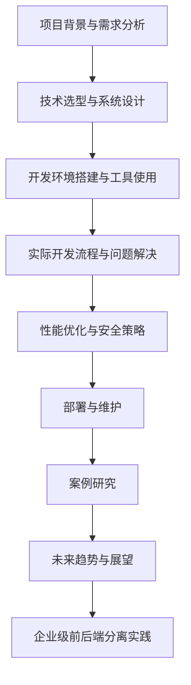

                 

# 前后端分离：增强系统灵活性的架构策略

## 引言

在数字化转型的浪潮中，软件系统的开发与维护变得愈加复杂。随着互联网应用的不断演进，用户需求的快速变化使得系统必须具备高度的灵活性和可扩展性。为了应对这些挑战，前后端分离的架构策略应运而生。本文将深入探讨前后端分离的概念、技术基础、架构设计、性能优化、安全策略以及实战应用，旨在为读者提供全面的指导和深刻的理解。

### 关键词
- 前后端分离
- 微服务架构
- 容器化
- API网关
- 性能优化
- 安全性
- 实战项目

### 摘要
本文将分四个部分对前后端分离进行详细阐述。第一部分介绍前后端分离的基础概念和技术；第二部分讨论前后端分离的架构设计策略；第三部分聚焦于性能优化和安全策略；第四部分通过实战案例展示前后端分离的实际应用。本文旨在通过系统性的分析，帮助读者理解前后端分离在提升系统灵活性方面的作用，并掌握其实施技巧。

## 第一部分：前后端分离基础

### 第1章：前后端分离的概念与历史

**1.1 前后端分离的定义与演变**

前后端分离是一种软件开发模式，它将应用程序的用户界面（前端）与数据处理逻辑（后端）分离开来。这种分离不仅使得开发流程更加模块化，而且提高了系统的可维护性和可扩展性。

在早期，Web应用通常采用传统的三层架构，即表示层、业务逻辑层和数据层。然而，这种模式存在诸多问题，如代码耦合度高、维护成本大等。随着互联网技术的发展，为了解决这些问题，前后端分离逐渐成为主流。

**1.2 前后端分离与传统模式对比**

传统模式中，前端和后端代码通常混合在一起，这会导致以下问题：

- **代码维护困难**：前后端代码的耦合使得修改一处代码可能影响到整个系统。
- **开发效率低下**：前端和后端的开发需要协调，这增加了沟通和协调的成本。
- **可扩展性差**：系统的扩展通常受到后端架构的限制，导致无法快速响应业务需求。

前后端分离模式下，前端和后端通过API进行通信，从而解决了上述问题：

- **高内聚、低耦合**：前后端分离后，每个模块都可以独立开发、测试和部署，提高了代码的可维护性。
- **独立开发**：前端和后端可以并行开发，减少了沟通成本，提高了开发效率。
- **高可扩展性**：通过微服务和容器化技术，系统可以轻松扩展以满足不同业务需求。

**1.3 前后端分离的优势与挑战**

**优势**：

- **可维护性**：分离的模块使得代码更加清晰，降低了维护成本。
- **可扩展性**：系统能够更好地适应业务需求的变化，实现快速迭代。
- **独立性**：前后端可以独立部署和扩展，提高了系统的容错能力。

**挑战**：

- **开发复杂性**：前后端分离增加了系统的复杂性，需要更多的技术栈和工具支持。
- **安全性**：API作为通信通道，可能成为攻击的目标，需要加强安全性措施。
- **性能考量**：前后端通信可能会导致性能问题，需要优化网络通信和数据处理。

**1.4 前后端分离的应用场景**

前后端分离适用于多种应用场景，以下是其中几种常见场景：

- **大型互联网应用**：如电商平台、社交媒体等，需要处理大量的用户请求和数据交互。
- **企业级应用**：如ERP、CRM系统等，需要高扩展性和高可维护性。
- **移动应用**：前后端分离可以更好地支持多平台开发和用户体验优化。

### 第2章：前后端分离技术基础

**2.1 RESTful API设计原则**

RESTful API是前后端分离中常用的一种通信协议。其设计原则包括：

- **统一接口**：所有API应遵循统一的接口设计规范，如URL结构、HTTP动词等。
- **状态转移**：通过HTTP动词（GET、POST、PUT、DELETE）来表示资源的创建、读取、更新和删除。
- **无状态**：每次请求都是独立的，服务器不保存任何关于请求者的信息。
- **可缓存**：合理使用HTTP头信息，如`Cache-Control`，以提高响应速度。

**2.2 常见的前后端通信技术**

前后端通信常用的技术包括：

- **JSON**：JavaScript Object Notation，是一种轻量级的数据交换格式，易于阅读和编写。
- **XML**：可扩展标记语言，用于数据交换，但相对于JSON，结构更为复杂。
- **GraphQL**：一种查询语言，可以更高效地进行数据查询和操作，尤其适用于复杂的数据结构。

**2.3 JSON和XML数据处理**

JSON和XML的数据处理流程主要包括：

- **序列化**：将数据结构转换为JSON或XML格式。
- **反序列化**：将JSON或XML格式的数据转换为数据结构。
- **数据校验**：确保数据的格式和内容符合预期。

**2.4 安全性考虑与对策**

前后端分离中的安全性问题主要包括：

- **API滥用**：限制API访问权限，如使用API密钥或OAuth。
- **数据泄露**：使用HTTPS加密通信，确保数据传输的安全性。
- **SQL注入**：使用参数化查询或ORM框架，防止SQL注入攻击。

## 第二部分：前后端分离架构设计

### 第3章：前后端分离的系统架构

**3.1 微服务架构在前后端分离中的应用**

微服务架构是一种将应用程序划分为多个小型、独立服务的架构模式。在前后端分离中，微服务架构有助于：

- **模块化**：每个服务负责一个特定的业务功能，便于管理和扩展。
- **弹性**：单个服务的故障不会影响整个系统，提高了系统的容错能力。
- **部署**：可以独立部署和扩展每个服务，提高了开发效率。

**3.2 容器化与容器编排**

容器化技术，如Docker，可以将应用程序及其依赖环境封装在一个独立的容器中。容器化有助于：

- **一致性**：确保开发、测试和生产环境的一致性。
- **可移植性**：应用程序可以在不同的环境中运行，提高了部署的灵活性。
- **资源利用**：通过复用容器，提高了计算资源的利用率。

容器编排工具，如Kubernetes，可以自动化容器的部署、扩展和管理，从而简化了系统运维。

**3.3 API网关的设计与实现**

API网关是前后端分离系统中一个重要的组件，其主要功能包括：

- **路由**：将客户端请求路由到相应的后端服务。
- **认证**：验证客户端的访问权限。
- **限流**：防止API被滥用。
- **聚合**：将多个API请求合并为一个，减少客户端的网络请求次数。

**3.4 分布式系统的挑战与解决方案**

前后端分离中的分布式系统面临以下挑战：

- **一致性**：确保多个服务之间的数据一致性。
- **可用性**：确保系统的高可用性，避免单点故障。
- **延迟**：降低系统的响应延迟。

解决方案包括：

- **分布式事务**：使用分布式事务管理器，如Seata，确保数据一致性。
- **服务发现**：使用服务注册与发现机制，如Consul或Zookeeper，提高系统的可用性。
- **缓存**：使用分布式缓存，如Redis，降低系统的延迟。

### 第4章：前后端分离性能优化

**4.1 网络优化策略**

网络优化策略包括：

- **负载均衡**：通过负载均衡器，如Nginx或HAProxy，将请求分配到不同的服务器，提高系统的吞吐量。
- **CDN**：使用内容分发网络，如阿里云CDN，将静态资源缓存到边缘节点，减少用户访问延迟。
- **网络压缩**：使用HTTP压缩，如Gzip，减少数据传输的大小。

**4.2 缓存策略与实现**

缓存策略包括：

- **客户端缓存**：使用浏览器缓存，如HTTP缓存头，减少请求次数。
- **服务器缓存**：使用分布式缓存，如Redis或Memcached，存储频繁访问的数据，减少数据库查询次数。

**4.3 响应式设计**

响应式设计旨在为用户提供良好的体验，主要策略包括：

- **异步处理**：使用异步编程模型，如Promise或async/await，减少用户等待时间。
- **页面优化**：使用前端框架，如React或Vue，优化页面加载速度。

**4.4 性能测试与监控**

性能测试与监控策略包括：

- **负载测试**：模拟高并发访问，测试系统的性能和稳定性。
- **监控工具**：使用监控工具，如Prometheus和Grafana，实时监控系统的性能指标。

### 第5章：前后端分离安全策略

**5.1 API安全性**

API安全性的主要策略包括：

- **认证**：使用OAuth、JWT等认证机制，确保API访问的安全性。
- **授权**：根据用户的角色和权限，限制对API的访问。
- **签名**：使用API签名，验证请求的合法性。

**5.2 数据加密与隐私保护**

数据加密与隐私保护策略包括：

- **传输加密**：使用HTTPS加密传输，确保数据在传输过程中的安全性。
- **存储加密**：使用加密算法，如AES，对敏感数据进行加密存储。

**5.3 授权与认证机制**

授权与认证机制包括：

- **单点登录**：使用SSO实现多个系统的单点登录。
- **OAuth**：使用OAuth协议，实现第三方登录和授权。

**5.4 防护常见攻击**

防护常见攻击策略包括：

- **防SQL注入**：使用参数化查询或ORM框架。
- **防XSS攻击**：对用户输入进行编码或过滤。
- **防DDoS攻击**：使用防火墙、负载均衡等手段，抵御大规模攻击。

## 第三部分：前后端分离实战

### 第6章：前后端分离项目实战

**6.1 项目背景与需求分析**

以一个电商平台为例，该平台需要支持海量的商品信息、用户订单以及用户评论等功能。为了满足快速迭代和灵活扩展的需求，该项目决定采用前后端分离的架构。

**6.2 技术选型与系统设计**

技术选型包括：

- **前端**：使用Vue.js或React框架，实现响应式和组件化的用户界面。
- **后端**：采用Spring Boot实现微服务架构，每个服务负责不同的业务功能。
- **数据库**：使用MySQL数据库存储用户数据和商品信息。

系统设计包括：

- **用户服务**：处理用户注册、登录、权限管理等功能。
- **商品服务**：处理商品信息管理、商品查询等功能。
- **订单服务**：处理订单创建、订单查询、订单支付等功能。
- **评论服务**：处理用户评论、商品评价等功能。

**6.3 开发环境搭建与工具使用**

开发环境搭建包括：

- **开发工具**：使用IntelliJ IDEA或Visual Studio Code进行代码编写。
- **版本控制**：使用Git进行版本控制。
- **容器化**：使用Docker进行应用程序的容器化。
- **持续集成与部署**：使用Jenkins实现持续集成与部署。

**6.4 实际开发流程与问题解决**

实际开发流程包括：

- **需求分析**：明确项目需求，制定技术方案。
- **系统设计**：设计系统架构，包括数据库设计、接口设计等。
- **编码实现**：根据设计文档，进行编码实现。
- **测试与调试**：进行单元测试、集成测试和性能测试。
- **部署与维护**：部署应用程序，并进行日常维护。

在开发过程中，可能会遇到以下问题：

- **接口设计不合理**：可能导致前后端数据同步问题，需要重新设计接口。
- **性能瓶颈**：可能由于数据库查询效率低或网络延迟，需要优化数据库查询或网络配置。
- **安全问题**：可能由于认证机制不完善或代码漏洞，需要加强安全性措施。

**6.5 性能优化与安全策略**

性能优化策略包括：

- **缓存**：使用Redis缓存商品信息和用户数据，减少数据库查询次数。
- **数据库优化**：使用索引和优化查询语句，提高数据库查询效率。
- **负载均衡**：使用Nginx进行负载均衡，提高系统吞吐量。

安全策略包括：

- **认证与授权**：使用JWT进行用户认证，限制对API的访问。
- **数据加密**：使用HTTPS加密传输，保护用户数据。
- **防护攻击**：使用防火墙和Web应用防火墙，防止常见攻击。

### 第7章：案例研究

**7.1 案例一：电商平台前后端分离实践**

某大型电商平台采用前后端分离的架构，实现了高并发、高可扩展性的系统。通过微服务架构和容器化技术，该平台可以快速响应业务需求，提高了系统的稳定性和性能。

**7.2 案例二：在线教育平台前后端分离优化**

一个在线教育平台通过前后端分离优化，提高了系统的响应速度和用户体验。通过使用负载均衡和缓存技术，该平台可以处理海量的用户请求，并提供了流畅的学习体验。

**7.3 案例三：金融系统前后端分离设计与实现**

某金融系统采用前后端分离的架构，实现了业务功能的模块化。通过使用微服务架构和API网关，该系统能够快速响应业务变化，并提供了可靠的安全保障。

## 第四部分：未来趋势与展望

### 第8章：前后端分离的发展趋势

**8.1 技术发展趋势分析**

随着云计算、大数据和物联网等技术的发展，前后端分离的架构模式将继续演进：

- **服务化**：越来越多的企业将业务功能服务化，实现更高效的数据处理和业务整合。
- **云原生**：云原生技术，如Kubernetes和Docker，将更好地支持前后端分离的应用部署和管理。
- **人工智能**：人工智能技术将融入到前后端分离的应用中，提供更智能的用户体验和业务分析。

**8.2 未来应用场景预测**

未来，前后端分离将在更多领域得到应用：

- **企业应用**：企业应用将更加注重灵活性和可扩展性，前后端分离将成为主流架构。
- **物联网**：物联网设备将采用前后端分离的架构，实现高效的数据处理和设备管理。
- **区块链**：区块链应用将采用前后端分离的架构，提高区块链网络的性能和安全性。

**8.3 前后端分离面临的挑战与解决方案**

前后端分离面临的挑战包括：

- **复杂性**：随着系统规模的扩大，系统的复杂性将增加，需要更多的管理和维护手段。
- **安全性**：API作为系统的通信通道，将成为攻击的目标，需要加强安全性措施。

解决方案包括：

- **自动化**：使用自动化工具和平台，降低系统管理的复杂性。
- **安全框架**：使用安全框架，如OWASP，加强API的安全防护。

### 第9章：企业级前后端分离实践

**9.1 企业级前后端分离策略**

企业级前后端分离策略包括：

- **服务化**：将业务功能服务化，实现模块化和可扩展性。
- **标准化**：采用标准化技术栈和架构，提高开发效率和系统一致性。
- **安全性**：加强API安全防护，确保系统的安全性。

**9.2 成功案例分析**

某大型企业通过实施前后端分离策略，实现了业务系统的快速迭代和灵活扩展。通过使用微服务架构和容器化技术，该企业提高了系统的性能和稳定性，降低了维护成本。

**9.3 实施前后端分离的步骤与注意事项**

实施前后端分离的步骤包括：

- **需求分析**：明确项目需求和目标。
- **系统设计**：设计系统架构和数据库设计。
- **技术选型**：选择合适的开发工具和平台。
- **开发与测试**：进行编码实现和测试。
- **部署与维护**：部署应用程序，并进行日常维护。

注意事项包括：

- **稳定性**：确保系统的高可用性和稳定性。
- **安全性**：加强API安全防护。
- **可维护性**：确保系统的可维护性和可扩展性。

## 附录

### 附录A：前后端分离相关资源与工具

- **A.1 常用技术栈介绍**

  - **前端**：Vue.js、React、Angular
  - **后端**：Spring Boot、Django、Node.js
  - **数据库**：MySQL、MongoDB、Redis
  - **缓存**：Redis、Memcached
  - **API网关**：Kong、Apigee
  - **容器化**：Docker、Kubernetes

- **A.2 开发工具与平台推荐**

  - **IDE**：IntelliJ IDEA、Visual Studio Code
  - **版本控制**：Git
  - **容器化**：Docker、Kubernetes
  - **持续集成与部署**：Jenkins、GitHub Actions

- **A.3 学习资源与社区推荐**

  - **在线课程**：Udemy、Coursera
  - **技术博客**：Medium、Dev.to
  - **社区**：Stack Overflow、GitHub

# Mermaid 流程图

# 总结

本文系统地介绍了前后端分离的架构策略，从基础概念、技术基础、架构设计、性能优化、安全策略到实战案例，全面解析了如何通过前后端分离提高系统的灵活性、可维护性和可扩展性。随着技术的不断演进，前后端分离将变得更加成熟和普及。未来，企业级应用、物联网、区块链等领域将更加依赖前后端分离的架构模式，为系统的快速迭代和业务创新提供强有力的支持。希望本文能对您的技术学习和项目实践有所启发。如果您对前后端分离有任何疑问或经验分享，欢迎在评论区留言讨论。作者：AI天才研究院/AI Genius Institute & 禅与计算机程序设计艺术 /Zen And The Art of Computer Programming。

