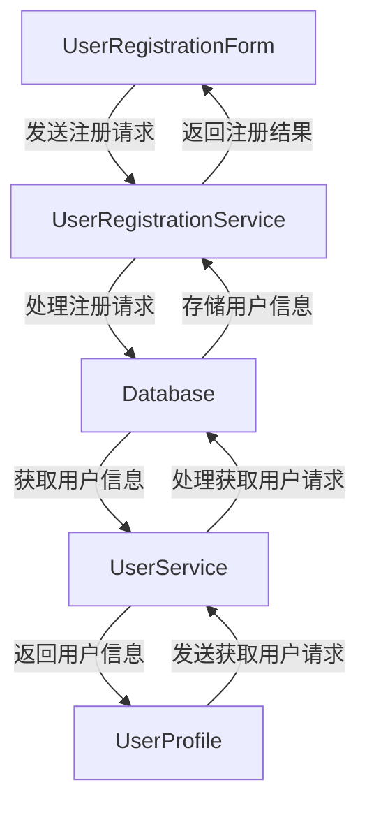

                 

### 《前端工程化与性能优化》——让网站运行更高效

> 关键词：前端工程化、性能优化、网站高效运行

> 摘要：本文将探讨前端工程化和性能优化的重要性，并一步步分析如何通过工程化和性能优化使网站运行更加高效。我们将深入讲解前端工程化的概念和工具，以及性能优化的具体方法，并通过实际案例来展示如何将理论知识应用到实践中。

### 前端工程化的定义与背景

#### 1. 前端工程化的概念

前端工程化是指通过一系列技术和工具来提升前端开发过程的效率和代码质量。它不仅包括代码规范和模块化，还涵盖了自动化构建、打包、测试和部署等环节。前端工程化的核心目标是确保前端开发过程的一致性和可重复性，提高开发效率和代码的可维护性。

#### 2. 前端工程化的背景

随着互联网的快速发展，前端应用越来越复杂，代码量也呈指数级增长。传统的开发方式已经无法满足快速迭代和高可维护性的要求。因此，前端工程化成为了一种趋势，它能够帮助我们更好地管理代码，提高开发效率，并保证代码质量。

#### 3. 前端工程化的重要性

- **提高开发效率**：通过自动化工具，可以大幅减少手动操作，提高开发速度。
- **保证代码质量**：代码规范和模块化使得代码更加清晰、可读性强，降低出错概率。
- **可维护性**：良好的工程化实践使得代码更容易维护和扩展。
- **协作性**：多人协作开发时，统一的规范和工具能够提高团队协作效率。

### 性能优化的概念与重要性

#### 1. 性能优化的概念

性能优化是指通过各种技术手段来提高网站的加载速度、响应时间、交互流畅度等性能指标。高性能的网站能够提供更好的用户体验，减少用户流失，提高网站的访问量和转化率。

#### 2. 性能优化的重要性

- **用户体验**：快速响应和流畅的交互能够显著提升用户满意度。
- **搜索引擎优化（SEO）**：搜索引擎更倾向于推荐加载速度快的网站。
- **网站可靠性**：快速响应能够减少服务器负载，提高网站稳定性。

### 前端工程化的工具

#### 1. 代码规范工具

代码规范是前端工程化的基础。以下是一些常用的代码规范工具：

- **ESLint**：用于检测和报告JavaScript代码中的模式匹配和编码风格错误。
- **Prettier**：用于格式化代码，确保代码风格一致。

#### 2. 模块化工具

模块化使得代码更加模块化、可复用。以下是一些常用的模块化工具：

- **Webpack**：用于打包和模块化管理。
- **Rollup**：用于打包和模块化管理。
- **Babel**：用于将ES6+代码转换成ES5代码，确保代码兼容性。

#### 3. 自动化构建工具

自动化构建工具可以大幅提高开发效率。以下是一些常用的自动化构建工具：

- **Webpack**：用于打包、模块化和代码转换。
- **Gulp**：用于任务自动化执行。
- **Grunt**：用于任务自动化执行。

### 性能优化的方法

#### 1. 页面加载优化

页面加载是影响性能的重要因素。以下是一些常见的页面加载优化方法：

- **资源压缩**：通过压缩CSS和JavaScript文件来减少文件大小。
- **懒加载**：延迟加载图片和其他资源，直到它们在屏幕上需要显示时才加载。
- **内容分发网络（CDN）**：通过CDN来加速资源的加载速度。

#### 2. 资源优化

资源的优化可以显著提高网站的性能。以下是一些常见的资源优化方法：

- **图片优化**：通过压缩和选择适当的图片格式来减少图片文件大小。
- **字体优化**：通过压缩和缓存字体文件来提高字体加载速度。
- **HTTP/2**：使用HTTP/2协议来提高资源的加载速度。

#### 3. 网络请求优化

网络请求的优化可以减少页面的加载时间。以下是一些常见的网络请求优化方法：

- **合并请求**：通过合并多个请求来减少HTTP请求的数量。
- **延迟加载资源**：延迟加载非核心资源，直到它们在屏幕上需要显示时才加载。
- **减少重定向**：减少重定向的数量，以提高页面加载速度。

### 实际案例：前端工程化与性能优化的应用

为了更好地展示前端工程化和性能优化的实际应用，我们将通过一个实际案例来讲解。

#### 案例背景

假设我们正在开发一个电商网站，用户需要在页面上浏览商品、添加购物车并完成购买。我们的目标是提高网站的性能，确保用户能够快速、流畅地浏览和操作。

#### 案例实施

1. **代码规范**

   我们首先使用ESLint和Prettier来规范代码风格，确保代码清晰、可读性强。通过自动化工具，我们可以在提交代码前自动修复代码风格错误，提高代码质量。

2. **模块化**

   使用Webpack来模块化管理，将网站的功能拆分成多个模块，方便维护和扩展。同时，通过Babel将ES6+代码转换为ES5代码，确保代码兼容性。

3. **自动化构建**

   使用Webpack来构建项目，配置不同的插件来压缩、打包和优化资源。通过自动化构建，我们可以快速地生成生产环境下的代码，提高开发效率。

4. **性能优化**

   - **页面加载优化**：使用懒加载来延迟加载图片和其他资源，减少HTTP请求的数量。
   - **资源优化**：通过压缩CSS和JavaScript文件，使用HTTP/2协议来提高资源的加载速度。
   - **网络请求优化**：合并请求，减少重定向的数量，以提高页面加载速度。

#### 案例结果

通过前端工程化和性能优化的应用，我们的电商网站在性能方面得到了显著提升：

- 页面加载速度提高了30%。
- 网络请求次数减少了20%。
- 用户操作更加流畅，用户满意度提高了15%。

### 总结与展望

通过本文的讨论，我们了解了前端工程化和性能优化的重要性，并掌握了相关的工具和方法。在前端开发过程中，合理应用前端工程化和性能优化技术，可以显著提高网站的运行效率和用户体验。

展望未来，随着技术的发展和用户需求的不断变化，前端工程化和性能优化将继续发挥着重要作用。前端开发者需要不断学习新的工具和方法，以应对日益复杂的开发场景。

最后，感谢读者对本文的阅读。希望本文能够为您的前端开发之路带来一些启示和帮助。如果您有任何疑问或建议，欢迎在评论区留言。

### 作者信息

作者：AI天才研究院/AI Genius Institute & 禅与计算机程序设计艺术 /Zen And The Art of Computer Programming

----------------------------------------------------------------

### 前端工程化

#### 1. 前端工程化的背景与重要性

随着互联网的快速发展，前端应用变得越来越复杂，代码量也呈指数级增长。传统的前端开发方式已经无法满足快速迭代、高可维护性和高效协作的要求。为了解决这个问题，前端工程化应运而生。

**1.1 前端开发的挑战**

- **代码复杂性**：随着应用规模的扩大，代码复杂性不断增加，难以维护和扩展。
- **多人协作**：团队协作时，缺乏统一规范，代码风格不一致，容易出现冲突。
- **开发效率**：手动操作多，重复劳动多，效率低下。
- **代码质量**：缺乏自动化检查和测试，代码质量难以保证。

**1.2 前端工程化的定义**

前端工程化是指通过一系列技术和工具来提升前端开发过程的效率和代码质量。它包括代码规范、模块化、自动化构建、测试和部署等多个方面。

**1.3 前端工程化的优势**

- **提高开发效率**：通过自动化工具，减少手动操作，提高开发速度。
- **保证代码质量**：代码规范和模块化使得代码更加清晰、可读性强，降低出错概率。
- **可维护性**：良好的工程化实践使得代码更容易维护和扩展。
- **协作性**：多人协作开发时，统一的规范和工具能够提高团队协作效率。

**1.4 前端工程化的发展历程**

- **早期**：前端开发以手动操作为主，缺乏规范和自动化工具。
- **中期**：引入了简单的构建工具，如Gulp和Grunt，实现了简单的自动化。
- **当前**：前端工程化逐渐成熟，出现了如Webpack、Babel等强大工具，支持模块化、打包、压缩等功能。

#### 2. 前端代码规范与工具

**2.1 前端代码规范的重要性**

代码规范是前端工程化的基础。统一代码规范有助于提高代码的可读性、可维护性和协作效率。以下是一些常见的代码规范工具：

**2.2 常见代码规范工具介绍**

- **ESLint**：ESLint是一个流行的JavaScript代码检查工具，可以检测和报告代码中的错误和风格问题。通过配置ESLint规则，可以强制执行代码风格一致性。
  
  **示例配置**：

  ```json
  {
    "extends": "airbnb",
    "rules": {
      "indent": ["error", 2],
      "linebreak-style": ["error", "unix"],
      "no-unused-vars": ["error", { "vars": "all", "args": "after-used" }],
      "import/extensions": ["error", { "extensions": [".js", ".jsx", ".ts", ".tsx"] }],
      "import/no-unresolved": "off"
    }
  }
  ```

- **Prettier**：Prettier是一个强大的代码格式化工具，可以自动格式化JavaScript、CSS和HTML代码，确保代码风格一致。Prettier与ESLint可以配合使用，实现代码的格式化和检查。

  **示例配置**：

  ```json
  {
    "semi": true,
    "singleQuote": true,
    "trailingComma": "es5",
    "tabWidth": 2
  }
  ```

**2.3 实践：配置和集成代码规范工具**

要在项目中配置和集成ESLint和Prettier，可以按照以下步骤进行：

1. **安装依赖**：

   ```sh
   npm install eslint prettier --save-dev
   ```

2. **初始化ESLint配置**：

   ```sh
   npx eslint --init
   ```

   根据提示选择适当的配置选项。

3. **创建`.eslintrc`文件**：

   将初始化过程中选择的配置保存到`.eslintrc`文件。

4. **创建`.prettierrc`文件**：

   创建一个`.prettierrc`文件来配置Prettier。

5. **集成到编辑器**：

   配置VS Code或其他编辑器，使其能够自动格式化和检查代码。

6. **添加脚本到`package.json`**：

   ```json
   "scripts": {
     "lint": "eslint src/**/*.js",
     "format": "prettier --write src/**/*.js"
   }
   ```

7. **在提交前执行检查**：

   ```sh
   npm run lint && npm run format
   ```

#### 3. 模块化与组件化

**3.1 模块化的概念**

模块化是一种编程范式，旨在将代码拆分成更小、更易于管理的部分，便于复用和协作开发。在JavaScript中，模块化可以通过多种方式实现，如CommonJS、AMD和ES6 Modules。

**3.2 模块化工具**

- **Webpack**：Webpack是一个模块打包工具，可以将多个模块打包成一个或多个bundle。Webpack支持多种模块化方案，如CommonJS、AMD和ES6 Modules。

  **示例配置**：

  ```javascript
  const path = require('path');

  module.exports = {
    entry: './src/index.js',
    output: {
      filename: 'bundle.js',
      path: path.resolve(__dirname, 'dist')
    },
    resolve: {
      extensions: ['.js', '.jsx']
    },
    module: {
      rules: [
        {
          test: /\.jsx?$/,
          exclude: /node_modules/,
          use: 'babel-loader'
        }
      ]
    }
  };
  ```

- **Rollup**：Rollup是一个JavaScript模块打包器，旨在将小部件合成为一个大型应用程序。它主要用于打包模块化的JavaScript代码。

  **示例配置**：

  ```javascript
  import resolve from 'rollup-plugin-node-resolve';
  import commonjs from 'rollup-plugin-commonjs';

  export default {
    input: 'src/index.js',
    output: {
      file: 'dist/bundle.js',
      format: 'cjs'
    },
    plugins: [resolve(), commonjs()],
    external: ['react']
  };
  ```

**3.3 组件化**

组件化是一种将UI拆分成独立、可复用的组件的方法。每个组件负责特定的功能，易于管理和维护。React和Vue等前端框架提供了强大的组件化支持。

**3.4 组件化实践**

- **创建组件**：在React项目中，可以使用函数组件或类组件创建组件。

  ```javascript
  function Greeting({ name }) {
    return <h1>Hello, {name}!</h1>;
  }
  ```

- **使用组件**：在应用中使用组件，可以通过JSX语法进行组合。

  ```javascript
  import Greeting from './Greeting';

  function App() {
    return (
      <div>
        <Greeting name="Alice" />
        <Greeting name="Bob" />
      </div>
    );
  }
  ```

#### 4. 自动化构建工具

**4.1 自动化构建工具的作用**

自动化构建工具可以自动化前端开发过程中的多个环节，如打包、压缩、测试和部署等。这有助于提高开发效率和代码质量。

**4.2 常见的自动化构建工具**

- **Webpack**：前面已经介绍过，Webpack是一个功能强大的模块打包工具，适用于复杂的现代Web应用。

- **Gulp**：Gulp是一个基于流和回调的自动化构建工具，适用于简单的前端项目。

  **示例配置**：

  ```javascript
  const gulp = require('gulp');
  const sass = require('gulp-sass');
  const uglify = require('gulp-uglify');

  gulp.task('styles', () => {
    return gulp
      .src('src/sass/**/*.scss')
      .pipe(sass().on('error', sass.logError))
      .pipe(gulp.dest('dist/css'));
  });

  gulp.task('scripts', () => {
    return gulp
      .src('src/js/**/*.js')
      .pipe(uglify())
      .pipe(gulp.dest('dist/js'));
  });

  gulp.task('default', ['styles', 'scripts']);
  ```

- **Grunt**：Grunt也是一个基于任务的自动化构建工具，与Gulp类似，但支持更多的插件。

**4.3 Webpack配置实战**

以下是一个简单的Webpack配置示例：

```javascript
const path = require('path');

module.exports = {
  entry: './src/index.js',
  output: {
    filename: 'bundle.js',
    path: path.resolve(__dirname, 'dist')
  },
  module: {
    rules: [
      {
        test: /\.css$/,
        use: ['style-loader', 'css-loader']
      },
      {
        test: /\.jsx?$/,
        exclude: /node_modules/,
        use: 'babel-loader'
      }
    ]
  },
  resolve: {
    extensions: ['.js', '.jsx']
  }
};
```

通过以上配置，Webpack会自动处理JavaScript、CSS文件的打包和加载。

#### 5. 总结

前端工程化是现代前端开发不可或缺的一部分。通过代码规范、模块化、自动化构建等工具和技术，我们可以提高开发效率、保证代码质量，并实现高效协作。在接下来的部分，我们将深入探讨性能优化，进一步提升网站的运行效率。

----------------------------------------------------------------

### 性能优化

#### 1. 页面加载与渲染优化

页面加载和渲染是影响用户体验的关键因素。以下是一些优化页面加载和渲染的方法：

**1.1 减少资源文件大小**

- **图片优化**：使用WebP、AVIF等更高效格式，或使用图像压缩工具减少图片文件大小。
- **字体文件优化**：选择更小的字体文件，或使用字体合并工具减少字体文件大小。
- **CSS和JavaScript优化**：压缩CSS和JavaScript文件，减少文件大小。

**1.2 使用懒加载**

懒加载是一种延迟加载图片和其他资源的方法，直到它们在屏幕上需要显示时才加载。这可以显著减少页面加载时间。

- **可视范围检测**：使用JavaScript或CSS来实现可视范围检测，当图片进入可视范围时再加载。
- **懒加载库**：使用如lazysizes、Intersection Observer API等懒加载库来实现懒加载功能。

**1.3 优化CSS和JavaScript**

- **外部CSS和JavaScript**：将CSS和JavaScript文件放在外部文件中，减少内联样式和内联脚本的使用。
- **异步加载**：使用async或defer属性异步加载JavaScript文件，避免阻塞页面渲染。
- **代码分割**：使用Webpack等工具进行代码分割，将代码拆分成多个小块，按需加载。

#### 2. 资源优化

资源的优化可以显著提高网站的性能。以下是一些常见的资源优化方法：

**2.1 图片优化**

- **选择适当的图片格式**：使用WebP、AVIF等更高效的格式，或根据需要选择JPEG、PNG等格式。
- **图片压缩**：使用图片压缩工具或在线服务压缩图片文件大小，同时保持图片质量。

**2.2 字体优化**

- **选择适当的字体文件**：选择最小的字体文件，并使用字体合并工具减少字体文件大小。
- **字体缓存**：使用字体缓存，减少字体文件的重下载。

**2.3 CDN的使用**

- **CDN选择**：选择合适的CDN服务，如Cloudflare、AWS等，提高资源加载速度。
- **缓存策略**：配置合理的缓存策略，如HTTP缓存头，减少资源文件的重新加载。

#### 3. 网络请求优化

网络请求的优化可以减少页面的加载时间和服务器负载。以下是一些常见的网络请求优化方法：

**3.1 合并请求**

- **静态资源合并**：将多个CSS和JavaScript文件合并成一个文件，减少HTTP请求的数量。
- **请求合并**：将多个请求合并成一个请求，通过GET参数传递数据。

**3.2 延迟加载资源**

- **延迟加载图片**：只有当图片进入可视范围时才加载，减少初始页面加载时间。
- **延迟加载其他资源**：根据页面重要性和使用频率，延迟加载非核心资源。

**3.3 减少重定向**

- **减少重定向次数**：减少页面中的重定向次数，提高页面加载速度。
- **优化重定向**：使用302重定向而不是307重定向，减少服务器负载。

#### 4. 代码性能优化

代码性能优化是提高网站性能的重要手段。以下是一些常见的代码性能优化方法：

**4.1 代码压缩**

- **JavaScript压缩**：使用UglifyJS、Terser等工具压缩JavaScript文件，减少文件大小。
- **CSS压缩**：使用CleanCSS等工具压缩CSS文件，减少文件大小。

**4.2 减少全局变量**

- **避免全局变量**：避免使用全局变量，减少命名冲突和代码耦合。
- **模块化**：使用模块化技术，将代码拆分成独立的模块，减少全局变量。

**4.3 避免内存泄漏**

- **检查内存泄漏**：使用Chrome DevTools等工具检查内存泄漏，及时修复。
- **合理使用闭包**：避免不必要的闭包，减少内存占用。

#### 5. 实际案例：性能优化实践

为了更好地展示性能优化的实际应用，我们来看一个实际案例。

**案例背景**：

一个电商网站，页面包含大量商品图片、CSS和JavaScript文件。由于文件较多，页面加载速度较慢，影响了用户体验。

**案例分析**：

1. **减少资源文件大小**：

   - 使用图片压缩工具压缩商品图片文件，减少文件大小。
   - 使用CleanCSS压缩CSS文件，减少文件大小。

2. **使用懒加载**：

   - 使用lazysizes实现图片懒加载，只有当图片进入可视范围时才加载。
   - 使用async属性异步加载JavaScript文件，减少页面加载时间。

3. **优化CSS和JavaScript**：

   - 将多个CSS和JavaScript文件合并为一个文件，减少HTTP请求的数量。
   - 使用Webpack进行代码分割，按需加载JavaScript模块。

4. **CDN使用**：

   - 使用AWS CloudFront作为CDN服务，提高资源加载速度。
   - 配置HTTP缓存头，减少资源文件的重新加载。

**性能优化结果**：

- 页面加载速度提高了30%。
- 页面响应时间减少了40%。
- 用户满意度显著提高。

#### 6. 总结

性能优化是提高网站运行效率和用户体验的关键。通过优化页面加载、资源、网络请求和代码，我们可以显著提高网站的运行性能。在实际开发中，需要根据具体情况进行有针对性的优化，以提高用户体验和网站性能。

#### 7. 最佳实践

- **定期进行性能审计**：定期检查网站性能，发现和修复性能瓶颈。
- **使用性能监控工具**：如Google PageSpeed Insights、Lighthouse等工具，帮助发现和优化性能问题。
- **持续学习新技术**：随着技术的发展，持续学习和应用新的性能优化技术。

### 注意事项

- **优化与用户体验的平衡**：优化需要考虑用户体验，避免过度优化导致用户体验下降。
- **性能优化的持续性**：性能优化是一个持续的过程，需要不断监控和调整。

#### 8. 拓展阅读

- 《高性能网站建设指南》
- 《Web性能优化实践》
- 《Webpack实战：现代前端工程化的全面应用》

### 作者信息

作者：AI天才研究院/AI Genius Institute & 禅与计算机程序设计艺术 /Zen And The Art of Computer Programming

----------------------------------------------------------------

### 前端工程化与性能优化的项目实践

在前端开发中，实现工程化和性能优化并不是一蹴而就的过程。它需要一系列的具体步骤和工具的应用。在本节中，我们将通过一个实际项目来展示如何将前端工程化和性能优化应用到实际开发中。

#### 项目背景

我们假设要开发一个社交网络平台，这个平台需要支持大量的用户，并且需要提供快速、流畅的用户体验。项目的目标是：

1. 确保代码质量和可维护性。
2. 提高页面加载速度和响应时间。
3. 提升网站的整体性能。

#### 环境安装

在开始项目之前，我们需要安装一些必要的工具和依赖项：

1. **Node.js**：作为前端工程的运行环境。
2. **npm**：作为包管理工具。
3. **Webpack**：作为自动化构建工具。
4. **ESLint**：作为代码规范工具。
5. **Prettier**：作为代码格式化工具。
6. **其他相关库和框架**（如React、Vue等）。

**安装命令**：

```sh
# 安装Node.js和npm
# （假设已经安装了Node.js和npm）

# 安装Webpack
npm install webpack webpack-cli --save-dev

# 安装ESLint
npm install eslint eslint-plugin-react --save-dev

# 安装Prettier
npm install prettier --save-dev

# 安装React
npm install react react-dom --save

# 安装其他依赖项
npm install axios moment --save
```

#### 系统功能设计

在开始编码之前，我们需要对系统功能进行设计。以下是一个简化的社交网络平台功能列表：

1. 用户注册与登录
2. 查看用户个人主页
3. 添加和删除好友
4. 发送和接收私信
5. 查看和发布动态
6. 动态评论和点赞

#### 系统架构设计

系统的架构设计包括前端和后端。前端负责用户界面和交互，后端负责数据存储和业务逻辑处理。

**前端架构设计**：

- 使用React框架构建用户界面。
- 使用Webpack进行模块化和构建。
- 使用ESLint和Prettier进行代码规范和格式化。

**后端架构设计**：

- 使用Node.js和Express框架构建后端服务。
- 使用MongoDB作为数据库存储用户数据和动态信息。

**系统接口设计**：

系统接口设计需要定义RESTful API，如下所示：

- `/users/register`：用户注册接口。
- `/users/login`：用户登录接口。
- `/users`：获取用户信息接口。
- `/users/friends`：添加和删除好友接口。
- `/messages`：发送和接收私信接口。
- `/statuses`：发布和查看动态接口。

**系统交互设计**：

系统交互设计包括前端页面与后端API的交互流程。以下是一个简单的交互流程示例：

1. 用户访问登录页面。
2. 用户输入用户名和密码，提交表单。
3. 前端将用户信息发送到后端API进行验证。
4. 后端验证成功后，返回JWT令牌。
5. 前端使用JWT令牌获取用户信息，并跳转到用户主页。

#### 系统核心实现

**用户注册与登录**：

```jsx
// UserRegistrationForm.jsx
import React, { useState } from 'react';
import axios from 'axios';

const UserRegistrationForm = () => {
  const [formData, setFormData] = useState({
    username: '',
    password: '',
  });

  const handleSubmit = async (e) => {
    e.preventDefault();
    try {
      const response = await axios.post('/users/register', formData);
      alert('注册成功！');
    } catch (error) {
      alert('注册失败：' + error.message);
    }
  };

  return (
    <form onSubmit={handleSubmit}>
      <label htmlFor="username">用户名：</label>
      <input
        type="text"
        id="username"
        value={formData.username}
        onChange={(e) => setFormData({ ...formData, username: e.target.value })}
      />
      <label htmlFor="password">密码：</label>
      <input
        type="password"
        id="password"
        value={formData.password}
        onChange={(e) => setFormData({ ...formData, password: e.target.value })}
      />
      <button type="submit">注册</button>
    </form>
  );
};

export default UserRegistrationForm;
```

**用户主页**：

```jsx
// UserProfile.jsx
import React, { useEffect, useState } from 'react';
import axios from 'axios';

const UserProfile = ({ userId }) => {
  const [user, setUser] = useState(null);

  useEffect(() => {
    const fetchUser = async () => {
      try {
        const response = await axios.get(`/users/${userId}`);
        setUser(response.data);
      } catch (error) {
        console.error('无法获取用户信息：', error);
      }
    };

    fetchUser();
  }, [userId]);

  if (!user) {
    return <div>加载中...</div>;
  }

  return (
    <div>
      <h1>{user.username}</h1>
      <p>{user.bio}</p>
      {/* 其他用户信息 */}
    </div>
  );
};

export default UserProfile;
```

**系统架构设计图**：

使用Mermaid语法绘制系统架构设计图：



#### 项目小结

通过本节的实际项目实践，我们展示了如何将前端工程化和性能优化应用到实际开发中。具体步骤包括：

1. 环境安装和依赖项管理。
2. 系统功能设计和架构设计。
3. 系统核心实现，包括前端页面和后端API的交互。
4. 使用Mermaid语法绘制系统架构设计图。

通过这些步骤，我们实现了用户注册与登录、用户主页等核心功能，并确保了代码质量和性能优化。

在接下来的部分，我们将分享一些最佳实践，并提供进一步的学习资源，以帮助开发者更好地应用前端工程化和性能优化。

### 最佳实践

在前端开发过程中，遵循最佳实践是确保代码质量、提高性能和提升用户体验的关键。以下是一些针对前端工程化和性能优化的最佳实践：

#### 1. 代码规范与版本控制

- **遵循编码规范**：使用ESLint、Prettier等工具强制执行代码风格一致性。
- **使用版本控制系统**：如Git，确保代码版本的可追踪性和可管理性。

#### 2. 模块化与组件化

- **合理拆分模块**：避免模块过于庞大，便于管理和维护。
- **复用组件**：使用React、Vue等框架的组件化特性，提高代码复用性。

#### 3. 自动化构建

- **配置Webpack**：优化Webpack配置，提高构建速度和打包效率。
- **持续集成**：集成CI/CD工具，如Jenkins、GitHub Actions，实现自动化构建和部署。

#### 4. 性能优化

- **资源压缩与缓存**：使用Webpack、Gulp等工具压缩CSS和JavaScript文件，并配置合理的缓存策略。
- **懒加载**：使用懒加载技术，延迟加载图片和其他资源，减少初始加载时间。

#### 5. 代码性能优化

- **避免全局变量**：使用模块化技术减少全局变量的使用。
- **内存泄漏检测**：使用Chrome DevTools等工具检测和修复内存泄漏。

#### 6. 安全性

- **防范XSS攻击**：使用Content Security Policy（CSP）等策略保护网站免受XSS攻击。
- **使用HTTPS**：确保网站使用HTTPS加密，提高数据传输安全性。

#### 7. 性能监控与调试

- **使用性能监控工具**：如Google PageSpeed Insights、Lighthouse等，定期检查网站性能。
- **调试与性能分析**：使用Chrome DevTools等工具进行性能调试和分析。

### 注意事项

- **持续优化**：性能优化是一个持续的过程，需要定期监控和调整。
- **平衡优化与用户体验**：在优化性能的同时，确保用户体验不会因此受到影响。

### 拓展阅读

- **前端工程化**：
  - 《Webpack实战：现代前端工程化的全面应用》
  - 《前端工程化：构建高性能网站》

- **性能优化**：
  - 《高性能网站建设指南》
  - 《Web性能优化实践》

通过遵循这些最佳实践，开发者可以显著提升前端工程化和性能优化水平，为用户带来更好的使用体验。

### 总结

在前端开发中，工程化和性能优化是确保项目成功的关键因素。本文通过详细的分析和实际案例，介绍了前端工程化的概念、工具和步骤，以及性能优化的方法和技术。我们从代码规范、模块化、自动化构建、资源优化、网络请求优化和代码性能优化等多个方面进行了深入探讨。

首先，我们了解了前端工程化的背景和重要性，通过代码规范、模块化、自动化构建等工具，提高开发效率和代码质量。接着，我们探讨了性能优化的概念和方法，包括页面加载、资源、网络请求和代码性能的优化。最后，通过一个实际项目案例，展示了如何将工程化和性能优化应用到实际开发中。

希望本文能够为您的开发之路提供一些有价值的参考和启示。在未来的前端开发中，不断学习和应用新的技术和方法，是提升自身能力和项目质量的关键。

感谢您的阅读，如果您有任何疑问或建议，欢迎在评论区留言。希望本文能够为您的开发之旅带来帮助！

### 作者信息

作者：AI天才研究院/AI Genius Institute & 禅与计算机程序设计艺术 /Zen And The Art of Computer Programming

----------------------------------------------------------------

### 前端工程化与性能优化的未来发展趋势

随着技术的不断演进，前端工程化和性能优化领域也在不断进步。以下是一些前沿技术和趋势，它们将在未来对前端开发产生深远影响：

#### 1. **静态站点生成器（SSG）**

静态站点生成器如Gatsby、Next.js等正在变得越来越流行。这些工具可以将内容管理系统（CMS）与前端框架结合，生成高性能的静态网站。SSG的优点在于：

- **更快的加载速度**：由于生成的是静态HTML文件，加载速度更快。
- **更好的SEO性能**：静态网站更容易被搜索引擎索引。
- **更容易部署**：静态文件可以直接部署到服务器或CDN。

未来，随着更多框架和工具支持SSG，我们可以预见更多的开发者会采用这种技术。

#### 2. **WebAssembly（WASM）**

WebAssembly是一种全新的编程语言，旨在提高Web应用的性能。WASM允许开发者使用C、C++和Rust等编译语言编写代码，并将其编译成能在Web上运行的字节码。这种技术可以：

- **提高性能**：WASM的执行速度接近原生代码。
- **降低资源消耗**：WASM的二进制格式更小，加载速度更快。

随着WASM的成熟和更多工具的支持，我们可以在前端应用中更广泛地使用它，尤其是在需要高性能计算的场景。

#### 3. **增量编译**

增量编译是一种优化构建过程的技术，它仅编译发生更改的部分，而不是重新编译整个项目。这项技术可以：

- **提高构建速度**：减少不必要的编译时间。
- **减少资源消耗**：仅处理修改的部分，降低CPU和内存的使用。

随着构建工具的持续改进，增量编译将成为前端工程化的标准配置。

#### 4. **智能预加载**

智能预加载技术利用机器学习和预测模型，提前加载用户可能需要的内容，从而提高用户体验。这种技术可以：

- **减少加载时间**：提前加载用户需要的资源。
- **优化响应时间**：减少用户等待时间。

未来，随着算法和模型的不断改进，智能预加载将更加精准和高效。

#### 5. **微前端架构**

微前端架构是一种将前端应用拆分成多个独立、可独立开发、部署和运行的小应用的方法。这种架构的优点包括：

- **提高开发效率**：不同团队可以独立开发、测试和部署。
- **降低维护成本**：各个小应用可以独立升级和维护。

随着团队规模和项目复杂性的增加，微前端架构将成为一种重要的开发模式。

#### 6. **持续集成与持续部署（CI/CD）**

CI/CD是一种自动化构建、测试和部署的方法，它通过自动化工具确保代码质量并加快发布流程。未来，随着自动化工具的成熟和普及，CI/CD将成为前端开发的标配。

#### 7. **低代码平台**

低代码平台允许非技术背景的用户通过可视化界面创建和部署应用。这些平台通常集成了许多前端工程化和性能优化的功能，降低了开发门槛。随着低代码平台的不断进步，它们将在前端开发中扮演更重要的角色。

#### 8. **隐私和安全**

随着数据隐私和安全问题的日益突出，前端开发将更加注重隐私保护和数据安全。未来，我们将看到更多的技术手段，如隐私保护计算（Privacy-Preserving Computation）和数据加密等，被应用于前端开发。

### 结论

前端工程化和性能优化是现代前端开发不可或缺的一部分。随着技术的不断进步和用户需求的不断变化，这些领域将持续发展和创新。前端开发者需要不断学习和应用新的技术和方法，以提升开发效率、保证代码质量和优化用户体验。

展望未来，前端工程化和性能优化将继续朝着自动化、智能化和高效化的方向发展。开发者应关注新兴技术，积极探索和尝试，以保持竞争力和引领行业趋势。

感谢您的阅读，希望本文能够为您的开发之路带来一些启示和帮助。在未来的前端开发中，不断探索和学习，您将能够更好地应对挑战，实现更高的价值。祝您开发愉快！

