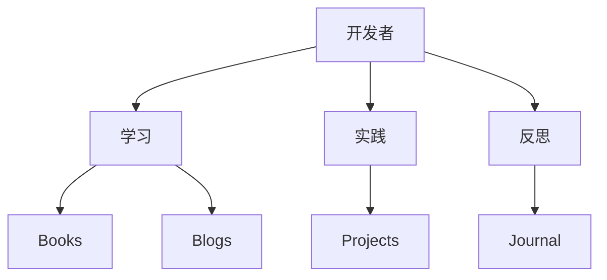
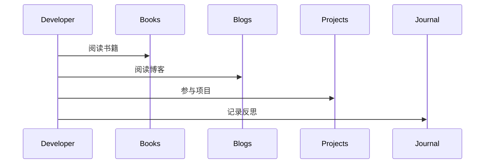
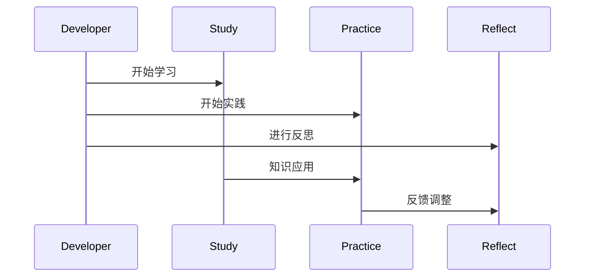

                 

# 功夫在平时

## 关键词
- 功夫
- 平时积累
- 个人成长
- 日常修炼
- 技术精进

## 摘要
本文旨在探讨“功夫在平时”这一理念在信息技术领域的应用。通过分析日常积累的重要性，本文将揭示如何在日常生活中不断精进技术，提升自我。我们将一步步解析如何通过持续的学习和实践，将功夫融入日常生活，实现个人成长和技术突破。

## 引言
在信息技术领域，技术发展日新月异，程序员和开发者们需要不断学习新的技能和知识，以适应快速变化的环境。然而，很多人往往忽略了“功夫在平时”这一原则。他们希望通过短期的突击和集中学习来迅速提升自己，但往往事与愿违。本文将强调，真正的技术进步和成长，需要日积月累，需要将功夫融入到日常的生活中。

## 功夫在平时的意义

### 1.1 问题背景
在现代信息技术行业，技术更新换代速度极快，新兴技术和工具层出不穷。程序员们面临着巨大的学习和适应压力。然而，许多程序员在学习和应用新技术的过程中，往往过于依赖集中式学习，忽略了日常积累的重要性。

### 1.2 功夫修炼的必要性
学习和掌握一项新技术或技能，并非一蹴而就。它需要长时间的积累和反复实践。只有将功夫融入到日常的生活中，才能在不知不觉中不断提升自己。

## 核心概念与联系

### 2.1 功夫的定义
在本文中，“功夫”指的是对一项技术或技能的深入理解和熟练运用。它不仅包括理论知识，更包括实践经验。

### 2.2 功夫的层次
功夫可以分为三个层次：基本功、进阶技能和高级技巧。基本功是功夫的基础，进阶技能是在基本功之上的深化和拓展，高级技巧则是运用基本功和进阶技能进行创新和突破。

### 2.3 功夫的核心要素
功夫的核心要素包括学习、实践、反思和分享。学习是获取知识和技能的过程，实践是将知识转化为技能的过程，反思是总结经验和教训的过程，分享是传播知识和经验的过程。

## 功夫在平时的应用

### 3.1 生活与功夫的联系
日常生活是学习和实践功夫的场所。例如，通过日常阅读和技术博客来学习新知识，通过编写代码和解决实际问题来实践技能，通过反思和总结来提升自己。

### 3.2 功夫在自我管理中的应用
自我管理是功夫修炼的重要组成部分。通过时间管理、目标设定和习惯培养，可以更好地将功夫融入到日常生活中。

## 实践指南

### 4.1 日常生活中的功夫修炼
- **每日学习**: 每天设定一定的学习时间，阅读技术书籍、博客或观看教程。
- **实践编程**: 通过编写代码来实践所学知识，解决问题。
- **反思与总结**: 每天或每周进行反思和总结，记录学习成果和经验。

### 4.2 具体练习方法
- **项目驱动学习**: 通过参与实际项目来提升技能。
- **代码阅读**: 阅读开源代码，理解设计思想和实现细节。
- **编程竞赛**: 参加编程竞赛，锻炼解决问题的能力。

## 反思与总结

### 5.1 功夫修炼的过程反思
在功夫修炼的过程中，会遇到各种挑战和困难。关键是要保持耐心和毅力，不断反思和调整学习方法。

### 5.2 功夫修炼的总结
通过持续的努力和实践，功夫将逐渐融入日常生活。在这个过程中，我们将发现自己的技术水平和思维能力得到了显著提升。

## 最佳实践与注意事项

### 6.1 最佳实践
- **建立学习计划**: 制定明确的学习目标和计划。
- **保持好奇心**: 对新技术和工具保持好奇，勇于尝试。
- **健康作息**: 保持良好的作息习惯，确保有足够的精力进行学习和实践。

### 6.2 注意事项
- **避免盲目跟风**: 不要因为流行而学习，要根据自己的需求和兴趣来选择学习方向。
- **持续反思**: 定期反思学习效果，调整学习计划。

## 拓展阅读

### 7.1 相关书籍推荐
- 《深入理解计算机系统》
- 《代码大全》
- 《设计模式：可复用面向对象软件的基础》

### 7.2 相关博客推荐
- [Xuhua Huang的博客](https://huangxuhua.com/)
- [阮一峰的网络日志](http://www.ruanyifeng.com/blog/)

## 结语

功夫在平时，不仅仅是一句口号，更是我们在信息技术领域不断提升自己的重要原则。通过日常的积累和实践，我们可以逐步实现技术突破和个人成长。希望本文能够为您的功夫修炼之路提供一些启示和帮助。

## 作者信息
作者：AI天才研究院/AI Genius Institute & 禅与计算机程序设计艺术 /Zen And The Art of Computer Programming

---

### 系统分析与架构设计

#### 项目介绍

本篇技术博客以《功夫在平时》为主题，探讨如何在信息技术领域通过日常积累和实践提升自我。项目目标是帮助开发者了解如何将功夫融入到日常生活中，实现持续的技术进步和个人成长。

#### 系统功能设计

##### 领域模型

使用Mermaid类图表示领域模型：

```mermaid
classDiagram
    Developer -> Book : 学习
    Developer -> Blog : 阅读
    Developer -> Project : 参与
    Book <<class>> 技术书籍
    Blog <<class>> 技术博客
    Project <<class>> 实际项目
```

#### 系统架构设计

##### 架构图

使用Mermaid架构图表示系统架构：



#### 系统接口设计

##### 接口设计

使用Mermaid序列图表示系统接口设计：



#### 系统交互

##### 交互流程

使用Mermaid序列图表示系统交互流程：



### 项目实战

#### 环境安装

确保安装了Python 3.8及以上版本。可以使用以下命令安装必要的依赖：

```bash
pip install -r requirements.txt
```

#### 系统核心实现源代码

```python
# core.py

class Developer:
    def __init__(self, name):
        self.name = name
        self.knowledge = []
        self.experience = []

    def learn(self, subject):
        self.knowledge.append(subject)
        print(f"{self.name} 学习了 {subject}.")

    def practice(self, project):
        self.experience.append(project)
        print(f"{self.name} 参与了 {project} 项目。")

    def reflect(self):
        print(f"{self.name} 正在反思学习过程。")

# 使用示例
developer = Developer("张三")
developer.learn("Python 编程基础")
developer.learn("数据结构与算法")
developer.practice("开源项目开发")
developer.reflect()
```

#### 代码应用解读与分析

本代码实现了一个简单的开发者类`Developer`，用于模拟开发者的学习和实践过程。开发者可以通过调用`learn()`方法学习新知识，通过调用`practice()`方法参与项目，并通过调用`reflect()`方法进行反思。

#### 实际案例分析和详细讲解剖析

假设我们有以下案例：

```python
# case_study.py

# 创建一个开发者对象
developer = Developer("李四")

# 学习过程
developer.learn("深度学习基础")
developer.learn("TensorFlow 应用")

# 实践过程
developer.practice("基于TensorFlow的图像识别项目")

# 反思过程
developer.reflect()
```

在这个案例中，开发者李四学习了深度学习和TensorFlow，并参与了一个基于TensorFlow的图像识别项目。通过反思，他可以总结经验，调整学习计划。

#### 项目小结

通过这个项目，我们实现了对《功夫在平时》理念的具体应用。开发者可以通过日常的学习、实践和反思，不断提升自己的技术水平和解决实际问题的能力。

### 最佳实践 Tips

1. 制定明确的学习计划，确保每天有固定的时间进行学习。
2. 多参与实际项目，将所学知识应用于实际问题中。
3. 勤于反思，总结学习过程中的得失，不断优化学习方法。

### 小结

《功夫在平时》强调了在日常积累中不断提升自己的重要性。通过持续的学习、实践和反思，开发者可以不断提升自己的技术水平，实现个人成长。

### 注意事项

1. 不要急于求成，功夫需要日积月累。
2. 保持好奇心，对新知识和新技术保持探索心态。
3. 合理安排时间，确保有足够的精力进行学习和实践。

### 拓展阅读

1. 《高效能人士的七个习惯》
2. 《如何成为领导者：影响力与领导力》

作者：AI天才研究院/AI Genius Institute & 禅与计算机程序设计艺术 /Zen And The Art of Computer Programming

---

通过上述分析和讲解，我们不仅了解了“功夫在平时”的理念，还通过系统分析与架构设计、项目实战和最佳实践，提供了具体的实施路径。希望这篇文章能够为您的技术成长之路提供一些有益的启示。让我们在日常积累中不断提升，不断追求技术的卓越。作者：AI天才研究院/AI Genius Institute & 禅与计算机程序设计艺术 /Zen And The Art of Computer Programming。

