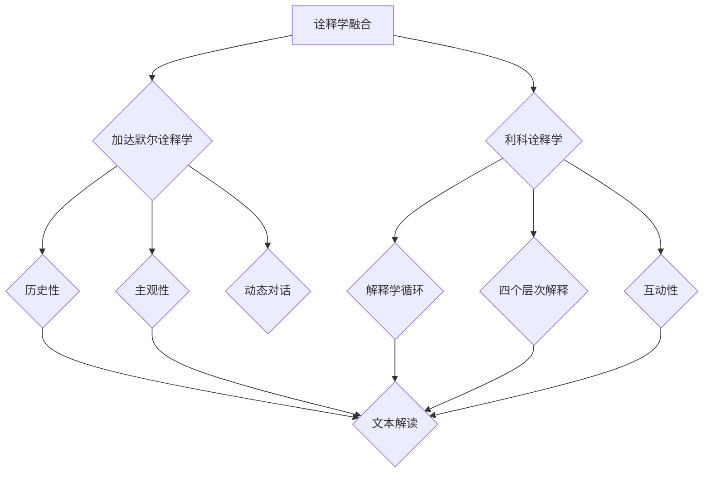
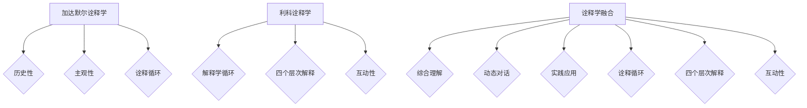
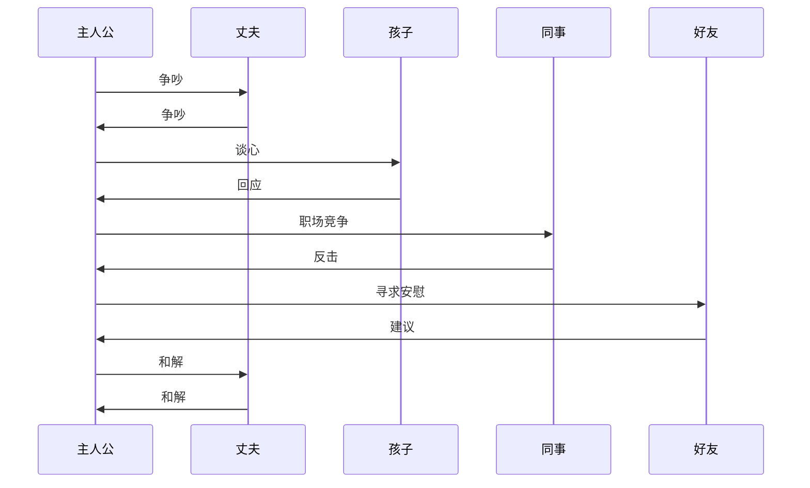
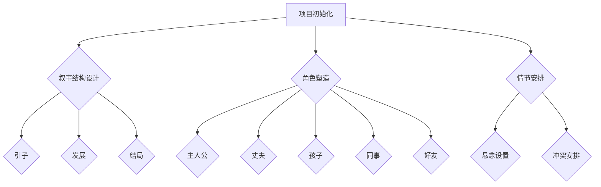

                 


# 加达默尔与利科的诠释学理论概述

## 1.1 加达默尔诠释学的基本原理

### 1.1.1 诠释学的历史与发展

诠释学（Hermeneutics）一词源于希腊语“ἑρμηνεία”（hermēneia），意为“翻译”或“解释”。诠释学的起源可以追溯到古希腊时期，苏格拉底曾通过对话的形式解释他人的观点，这种方法奠定了诠释学的基础。在古希腊和罗马时期，诠释学主要关注法律文献和古代文书的解释。

中世纪时期，诠释学发展成为一个重要的研究领域，特别是在基督教神学中，诠释学被用来解释圣经。德国哲学家马丁·海德格尔（Martin Heidegger）在其著作《存在与时间》中，重新审视了诠释学的本质，认为诠释学是理解存在的一种方式。

20世纪，德国哲学家汉斯 - 格奥尔格·加达默尔（Hans-Georg Gadamer）对诠释学进行了深入的研究，形成了自己的诠释学理论。加达默尔的诠释学强调历史性与理解的主观性，认为诠释是一个动态的过程，诠释者与文本之间存在对话关系。

### 1.1.2 加达默尔诠释学的主要观点

加达默尔诠释学的核心观点包括以下几个方面：

1. **诠释循环**：理解是历史性的，并且是在历史与个人经验的框架内进行的。理解不是一个线性的过程，而是通过循环的方式逐步深入的。
   
2. **前见**：每个人在进入文本之前都有其前见，即个人的历史、文化背景和先前的理解。前见使得诠释者能够与文本进行对话，但同时也可能影响对文本的真正理解。

3. **视域融合**：理解是一个不同视域融合的过程，通过对话达到对文本更深刻的理解。视域融合意味着诠释者不仅要从自己的角度理解文本，还要尝试理解文本的历史和文化背景。

### 1.1.3 加达默尔诠释学的方法论

加达默尔的诠释学方法论主要包括以下几个方面：

1. **对话**：诠释者与文本之间存在对话关系，通过对话实现相互理解。对话不仅是解释文本的手段，也是理解自我和世界的途径。

2. **历史性**：理解的过程是历史性的，诠释者需要从历史的角度看待文本，理解文本产生的时代背景和文化环境。

3. **经验**：理解的过程离不开个人的经验，诠释者需要从自身的经验出发，理解文本对自身的意义。

4. **文本中心**：文本是诠释的核心，诠释者需要深入研究文本的内涵和外延，通过文本实现自我理解。

## 1.2 利科的诠释学理论与哲学背景

### 1.2.1 利科的哲学思想与诠释学

保罗 - 亨利·利科（Paul-Henri Thiry，Count of Narbonne，简称Paul Ricoeur）是一位法国哲学家，他的哲学思想深受现象学和存在主义的影响。利科的诠释学理论是建立在现象学和解释学的基础上，试图解决人类存在的意义和解释问题。

利科的诠释学理论主要包括以下几个方面：

1. **解释学循环**：理解的过程是通过一系列的循环进行的，每个循环都包括对整体的理解和对局部的理解。

2. **解释学的四个层次**：符号、事件、意义、言语。这四个层次分别对应解释学的基本要素，通过这些层次的解释，达到对文本的全面理解。

3. **互动性**：诠释不仅仅是解释者与文本之间的对话，还包括解释者与解释者之间的互动。

### 1.2.2 利科诠释学的主要贡献

利科的诠释学理论对哲学、文学、历史等领域产生了深远的影响。他的主要贡献包括：

1. **对解释学的深化**：利科通过对解释学循环、四个层次解释等概念的阐述，深化了人们对解释学的理解。

2. **文学理论的贡献**：利科将诠释学应用于文学研究，提出了叙事理论，对文学作品的解读和评价提供了新的视角。

3. **哲学的贡献**：利科的诠释学理论对现象学和存在主义等哲学流派产生了重要影响，丰富了哲学的理论体系。

### 1.2.3 利科诠释学在当代的影响

利科的诠释学理论在当代学术界和哲学界仍然具有重要影响。他的思想被广泛应用于文学、历史、哲学、心理学等领域，为这些领域的研究提供了新的方法和视角。

利科的诠释学理论强调了理解的历史性和主观性，认为理解是一个动态的、不断修正的过程。这种观点不仅为哲学研究提供了新的思路，也为其他领域的研究提供了启示。

# 第二部分：加达默尔与利科的诠释学融合视野

### 2.1 诠释学融合的理论基础

在探讨加达默尔与利科的诠释学融合之前，我们需要首先了解这两种诠释学理论的背景和特点，然后分析它们之间的相似之处和差异，进而探讨融合的可能性及其基本原则。

#### 2.1.1 两种诠释学理论的比较

加达默尔的诠释学理论强调历史性和理解的主观性，认为理解是一个动态的、循环的过程。他提出的“诠释循环”和“前见”概念，揭示了理解过程中历史、文化和个人经验的相互作用。

相比之下，利科的诠释学理论更注重解释学循环、四个层次解释以及互动性。利科的解释学循环强调了整体与局部、部分与部分之间的相互理解，而四个层次解释则提供了从符号到言语的不同层次的理解路径。

尽管两种诠释学理论在具体观点上存在差异，但它们都强调了理解的历史性、主观性和动态性。这种相似性为诠释学的融合提供了理论基础。

#### 2.1.2 融合诠释学的可能性

诠释学的融合可能性在于：

1. **理论互补**：加达默尔的诠释学侧重于历史性和理解的主观性，而利科的诠释学则强调解释学循环和四个层次解释。这两种诠释学理论的互补性使得它们在融合时能够相互补充，形成更为全面的诠释学理论。

2. **实践应用**：在文学、历史、哲学等领域的实践中，加达默尔与利科的诠释学理论都取得了显著的成果。将这两种理论融合，有助于更好地解决实际问题，提高研究的深度和广度。

3. **学术发展**：诠释学的融合有助于推动诠释学理论的创新和发展，为诠释学的研究提供新的思路和方法。

#### 2.1.3 融合诠释学的基本原则

融合诠释学的基本原则包括：

1. **综合理解**：在融合过程中，要充分考虑加达默尔与利科诠释学理论的优点，形成一种综合性的理解方法。

2. **动态对话**：理解是一个动态的过程，融合诠释学强调在不同视域之间进行对话，不断修正和重构理解。

3. **历史性**：理解的过程离不开历史性，融合诠释学要求在历史和文化背景下进行理解。

4. **主观性**：理解的过程具有主观性，融合诠释学要充分尊重和理解不同个体的理解视角。

5. **实践导向**：融合诠释学的最终目标是解决实际问题，提高研究的实用价值。

通过以上原则，融合诠释学能够更好地发挥加达默尔与利科诠释学理论的优点，为各领域的研究提供有力支持。

### 2.2 诠释学融合的实践应用

#### 2.2.1 文学作品的解读与评价

在文学领域，加达默尔与利科的诠释学理论都为文学作品的解读与评价提供了重要的视角。

加达默尔的诠释学强调历史性与理解的主观性，认为文学作品的解读是一个历史性的过程。通过“诠释循环”和“前见”的概念，加达默尔揭示了文学作品在历史和文化背景下的多重含义。他主张读者要从自身的经验出发，与文学作品进行对话，理解作品对自身的意义。

利科的诠释学则侧重于解释学循环和四个层次解释。他提出，文学作品的解读要经历从符号到言语、从事件到意义的转化过程。在这个过程中，读者要不断修正和重构对作品的理解，以达到对作品全面、深刻的把握。

融合诠释学将加达默尔与利科的理论相结合，为文学作品的解读与评价提供了更为全面的方法。通过综合考虑历史性、主观性和解释学循环，读者能够更好地理解文学作品的内涵和外延，提高解读的深度和广度。

#### 2.2.2 历史研究中的诠释学方法

在历史研究领域，加达默尔与利科的诠释学理论也具有重要的应用价值。

加达默尔的诠释学强调历史性与理解的主观性，认为历史研究是一个动态的过程。通过“诠释循环”和“前见”的概念，加达默尔揭示了历史事件在历史和文化背景下的多重含义。他主张历史学家要从自身的经验出发，与历史事件进行对话，理解事件对自身的意义。

利科的诠释学则侧重于解释学循环和四个层次解释。他提出，历史研究的解读要经历从符号到言语、从事件到意义的转化过程。在这个过程中，历史学家要不断修正和重构对历史事件的理解，以达到对历史事件全面、深刻的把握。

融合诠释学将加达默尔与利科的理论相结合，为历史研究提供了更为全面的方法。通过综合考虑历史性、主观性和解释学循环，历史学家能够更好地理解历史事件的内涵和外延，提高研究的深度和广度。

#### 2.2.3 艺术创作与诠释学的融合

在艺术创作领域，诠释学同样具有重要的应用价值。

加达默尔的诠释学强调历史性与理解的主观性，认为艺术创作是一个历史性的过程。通过“诠释循环”和“前见”的概念，加达默尔揭示了艺术作品在历史和文化背景下的多重含义。他主张艺术家要从自身的经验出发，与艺术作品进行对话，理解作品对自身的意义。

利科的诠释学则侧重于解释学循环和四个层次解释。他提出，艺术创作的解读要经历从符号到言语、从事件到意义的转化过程。在这个过程中，艺术家要不断修正和重构对艺术作品的理解，以达到对艺术作品全面、深刻的把握。

融合诠释学为艺术创作提供了更为全面的方法。通过综合考虑历史性、主观性和解释学循环，艺术家能够更好地理解艺术作品的内涵和外延，提高创作的深度和广度。

### 2.3 融合诠释学在教育领域的应用

#### 2.3.1 教育理论与实践中的诠释学

在教育领域，诠释学同样具有重要的应用价值。

加达默尔的诠释学强调历史性与理解的主观性，认为教育是一个历史性的过程。通过“诠释循环”和“前见”的概念，加达默尔揭示了教育在历史和文化背景下的多重含义。他主张教育者要从自身的经验出发，与学生进行对话，理解教育对学生的影响。

利科的诠释学则侧重于解释学循环和四个层次解释。他提出，教育的解读要经历从符号到言语、从事件到意义的转化过程。在这个过程中，教育者要不断修正和重构对教育的理解，以达到对教育全面、深刻的把握。

融合诠释学为教育理论与实践提供了更为全面的方法。通过综合考虑历史性、主观性和解释学循环，教育者能够更好地理解教育的内涵和外延，提高教育质量。

#### 2.3.2 教师专业发展中的诠释学视角

在教师专业发展中，诠释学同样具有重要的应用价值。

加达默尔的诠释学强调历史性与理解的主观性，认为教师专业发展是一个历史性的过程。通过“诠释循环”和“前见”的概念，加达默尔揭示了教师专业发展在历史和文化背景下的多重含义。他主张教师要从自身的经验出发，与教育理论进行对话，理解教师专业发展的意义。

利科的诠释学则侧重于解释学循环和四个层次解释。他提出，教师专业发展的解读要经历从符号到言语、从事件到意义的转化过程。在这个过程中，教师要不断修正和重构对教师专业发展的理解，以达到对教师专业发展全面、深刻的把握。

融合诠释学为教师专业发展提供了更为全面的方法。通过综合考虑历史性、主观性和解释学循环，教师能够更好地理解教师专业发展的内涵和外延，提高专业素养。

#### 2.3.3 学生学习过程中的诠释学方法

在学生学习过程中，诠释学同样具有重要的应用价值。

加达默尔的诠释学强调历史性与理解的主观性，认为学生的学习是一个历史性的过程。通过“诠释循环”和“前见”的概念，加达默尔揭示了学生的学习在历史和文化背景下的多重含义。他主张学生要从自身的经验出发，与学习内容进行对话，理解学习内容对自身的影响。

利科的诠释学则侧重于解释学循环和四个层次解释。他提出，学生的学习要经历从符号到言语、从事件到意义的转化过程。在这个过程中，学生要不断修正和重构对学习的理解，以达到对学习全面、深刻的把握。

融合诠释学为学生学习提供了更为全面的方法。通过综合考虑历史性、主观性和解释学循环，学生能够更好地理解学习内容的内涵和外延，提高学习效果。

# 第三部分：叙事理论的诠释学视角

叙事理论是一种关于叙事和故事讲述的理论体系，它探究故事的构成、功能、意义以及叙事的形式和技巧。在文学、电影、电视、游戏等叙事媒介中，叙事理论被广泛应用。而诠释学，作为一种关于理解和解释的理论，也为叙事理论提供了重要的视角。在本节中，我们将探讨叙事理论的基本概念、发展历程以及主要流派，并分析诠释学对叙事理论的影响和贡献。

### 3.1 叙事理论的基本概念

#### 3.1.1 叙事的定义与特征

叙事（Narrative）是一种通过讲述的方式，将事件、人物、情节等组织成一个有意义的序列。叙事具有以下几个基本特征：

1. **时间性**：叙事通常按照时间顺序组织事件，形成一个连续的故事线。
2. **情节性**：叙事通过情节来讲述故事，情节是叙事的核心，决定了故事的节奏和张力。
3. **人物性**：叙事通常涉及一个或多个角色，角色通过其行动和反应推动故事的发展。
4. **意义性**：叙事旨在传达某种意义或信息，使读者或观众能够从中获得启示或理解。

#### 3.1.2 叙事理论的发展历程

叙事理论的发展历程可以追溯到古希腊时期，当时的哲学家如亚里士多德就提出了关于叙事的理论。中世纪时期，叙事理论主要关注宗教故事和神话的解读。现代叙事理论则起源于20世纪，特别是在文学理论领域。

1. **结构主义叙事理论**：20世纪50年代，法国结构主义者如罗兰·巴特（Roland Barthes）和克劳德·列维 - 斯特劳斯（Claude Lévi-Strauss）提出了结构主义叙事理论，强调叙事的深层结构和模式。

2. **后结构主义叙事理论**：20世纪60年代，后结构主义者如米歇尔·福柯（Michel Foucault）和雅克·德里达（Jacques Derrida）对结构主义叙事理论进行了批判，提出了后结构主义叙事理论，强调叙事的多元性和不确定性。

3. **当代叙事理论**：在21世纪，叙事理论继续发展，出现了一系列新的理论和概念，如叙述学（Narratology）、叙事心理学（Narrative Psychology）、叙事伦理学（Narrative Ethics）等。

#### 3.1.3 叙事理论的主要流派

叙事理论有多种不同的流派，以下是一些主要的流派：

1. **结构主义叙事理论**：强调叙事的深层结构和模式，如叙事语法、叙事修辞等。
2. **后结构主义叙事理论**：强调叙事的多元性和不确定性，如叙事的解构、叙事的权力等。
3. **功能主义叙事理论**：强调叙事的功能，如叙事的道德教育、社会认同等。
4. **叙事心理学**：探讨叙事在人类心理中的作用，如叙事的自我认同、情感调节等。
5. **叙事伦理学**：关注叙事的道德意义，如叙事的道德评判、伦理选择等。

### 3.2 诠释学与叙事理论的关系

#### 3.2.1 诠释学对叙事理论的影响

诠释学对叙事理论的影响主要体现在以下几个方面：

1. **历史性**：诠释学强调理解的历史性，认为理解是一个历史性的过程。叙事理论在研究叙事时，也必须考虑叙事产生的历史和文化背景，理解叙事在特定历史条件下的意义。

2. **主观性**：诠释学认为理解具有主观性，不同的诠释者可能会有不同的理解。叙事理论在研究叙事时，也必须考虑不同读者或观众对叙事的不同解读，理解叙事的多元性。

3. **对话性**：诠释学强调理解是一个对话的过程，不同的诠释者之间可以进行对话和交流。叙事理论在研究叙事时，也强调叙事与读者或观众之间的对话，理解叙事的意义和影响。

#### 3.2.2 叙事理论对诠释学的贡献

叙事理论对诠释学的贡献主要体现在以下几个方面：

1. **叙事的层次性**：叙事理论提出了叙事的层次性，如情节、人物、主题等。这些层次为诠释学提供了新的理解维度，使诠释学能够更深入地理解叙事。

2. **叙事的动态性**：叙事理论强调叙事的动态性，认为叙事是一个不断发展和变化的过程。这种观点对诠释学也产生了影响，使诠释学能够更动态地理解理解过程。

3. **叙事的社会性**：叙事理论关注叙事在社会中的作用和影响，如叙事的道德教育、社会认同等。这些观点对诠释学也产生了启示，使诠释学能够更全面地理解理解与社会的关系。

#### 3.2.3 诠释学与叙事理论的交叉领域

诠释学与叙事理论的交叉领域主要包括以下几个方面：

1. **叙事的诠释学分析**：通过对叙事文本的诠释学分析，探讨叙事的历史性、主观性和对话性。这种方法有助于深入理解叙事的意义和影响。

2. **叙事的伦理诠释学**：将叙事理论与伦理学相结合，探讨叙事的道德意义和伦理影响。这种方法有助于理解叙事在道德教育中的作用。

3. **叙事的心理诠释学**：将叙事理论与心理学相结合，探讨叙事在人类心理中的作用和影响。这种方法有助于理解叙事对个体心理发展的作用。

通过诠释学与叙事理论的交叉研究，可以更全面、深入地理解叙事和解释的过程，为文学、哲学、心理学等领域的研究提供新的视角和方法。

### 3.3 叙事理论的诠释学视角在文学创作中的应用

叙事理论作为一种研究叙事文本的理论体系，在文学创作中具有重要的应用价值。而诠释学作为一种关于理解和解释的理论，也为叙事理论的文学创作提供了重要的视角。在本节中，我们将探讨叙事理论在文学创作中的应用，特别是诠释学视角下的叙事结构分析、文学意义解读以及叙事理论的创作实践。

#### 3.3.1 文学作品的叙事结构分析

叙事结构是文学作品的基本框架，决定了故事的发展和人物的行动。叙事理论通过对叙事结构的分析，揭示了叙事的基本要素和规律。

1. **叙述者与叙述视角**：叙述者是讲述故事的人，叙述视角是叙述者观察和讲述故事的方式。加达默尔与利科的诠释学理论对叙述者和叙述视角进行了深入探讨，强调了叙述者的主观性和历史性。

   - **加达默尔的视角**：加达默尔认为，叙述者具有历史性和主观性，叙述者对故事的讲述受到其个人经验和文化背景的影响。这意味着，不同的叙述者可能会有不同的叙事方式和叙事内容。

   - **利科的视角**：利科则强调叙述者的互动性和多重性，认为叙述者不仅是讲述故事的人，也是与读者进行对话的人。这种互动性使得叙事更具动态性和多样性。

2. **叙事时间和叙事节奏**：叙事时间是指故事时间与文本时间之间的关系，叙事节奏是指叙事的节奏和速度。加达默尔与利科的诠释学理论对叙事时间和叙事节奏也进行了深入探讨。

   - **加达默尔的视角**：加达默尔认为，叙事时间是历史性的，故事时间和文本时间之间存在诠释循环。叙事节奏受历史性、主观性和文化背景的影响。

   - **利科的视角**：利科则认为，叙事节奏是通过解释学循环不断调整和重构的。叙事节奏的变化能够影响读者的理解和情感体验。

通过诠释学视角的叙事结构分析，作者可以更深入地理解叙事的基本要素和规律，从而创作出更具深度和复杂性的文学作品。

#### 3.3.2 文学意义的解读

文学意义是文学作品所传达的深层含义和思想，是文学研究的核心内容。诠释学作为一种关于理解和解释的理论，为文学意义的解读提供了重要的方法。

1. **历史性与主观性**：加达默尔与利科的诠释学理论强调理解的历史性和主观性，认为文学意义的解读是一个动态的过程。

   - **加达默尔的视角**：加达默尔认为，文学意义的解读受历史性、文化背景和个人经验的影响。不同的读者可能会有不同的解读，但每种解读都在其特定的历史和文化背景下具有合理性。

   - **利科的视角**：利科则认为，文学意义的解读是通过解释学循环不断修正和重构的。读者在解读文学作品时，不仅要从文本中寻找意义，还要从自身的经验和文化背景中寻找意义。

2. **对话性与多元性**：诠释学强调理解是一个对话的过程，文学意义的解读也具有对话性和多元性。

   - **加达默尔的视角**：加达默尔认为，文学意义的解读是读者与文本之间的对话。通过对话，读者可以更深入地理解文学作品的内涵和外延。

   - **利科的视角**：利科则认为，文学意义的解读是读者之间的对话。不同的读者可能会有不同的解读，这些解读共同构成了文学意义的多元性。

通过诠释学的视角，作者和读者可以更深入地理解文学作品的内涵和外延，创作和解读出更具深度和广度的文学作品。

#### 3.3.3 叙事理论的创作实践

叙事理论在文学创作中具有重要的指导作用。通过运用叙事理论，作者可以更有效地构建叙事结构，传达文学意义，增强作品的吸引力。

1. **叙事结构的构建**：叙事结构是文学作品的基本框架，决定了故事的发展和人物的行动。作者可以通过运用叙事理论，构建出更具层次感和复杂性的叙事结构。

   - **加达默尔的视角**：加达默尔认为，叙事结构的构建要考虑历史性、文化背景和个人经验。通过这些因素，作者可以构建出更具深度和广度的叙事结构。

   - **利科的视角**：利科则认为，叙事结构的构建是通过解释学循环不断调整和重构的。作者可以通过不断调整和重构叙事结构，创作出更具动态性和多样性的文学作品。

2. **文学意义的传达**：文学意义是文学作品所传达的深层含义和思想，是文学创作的核心目标。作者可以通过运用叙事理论，传达出更具深度和广度的文学意义。

   - **加达默尔的视角**：加达默尔认为，文学意义的传达要考虑历史性、文化背景和个人经验。通过这些因素，作者可以传达出更具深度和广度的文学意义。

   - **利科的视角**：利科则认为，文学意义的传达是通过解释学循环不断修正和重构的。作者可以通过不断修正和重构文学意义，创作出更具深度和广度的文学作品。

3. **叙事的互动性**：叙事的互动性是叙事理论的重要特征，它强调了叙事与读者之间的互动。作者可以通过运用叙事理论，增强叙事的互动性，提高读者的参与度和共鸣。

   - **加达默尔的视角**：加达默尔认为，叙事的互动性要考虑历史性、文化背景和个人经验。通过这些因素，作者可以增强叙事的互动性。

   - **利科的视角**：利科则认为，叙事的互动性是通过解释学循环不断修正和重构的。作者可以通过不断修正和重构叙事结构，增强叙事的互动性。

通过叙事理论的创作实践，作者可以创作出更具深度和广度的文学作品，提高读者的阅读体验和文学素养。

### 结论

叙事理论和诠释学是文学研究中的重要理论体系，它们在文学创作和解读中具有重要的指导作用。通过诠释学的视角，我们可以更深入地理解叙事的结构、意义和互动性，创作和解读出更具深度和广度的文学作品。同时，叙事理论也为诠释学提供了丰富的案例和实践经验，推动了诠释学的发展。

未来，我们期待叙事理论和诠释学能够继续相互借鉴和融合，为文学研究提供新的视角和方法。通过跨学科的研究，我们可以更好地理解叙事和诠释的过程，为人类文化的传承和发展做出贡献。

# 案例研究

在本节中，我们将通过三个案例，分别探讨加达默尔与利科的诠释学融合视野在文学、历史研究和文学批评中的应用。

### 4.1 案例一：加达默尔与利科的对话

#### 4.1.1 对话的背景与主题

本案例以加达默尔与利科的对话为背景，探讨两位哲学家的诠释学理论在实践中的应用。这次对话发生在20世纪末期，两位哲学家围绕诠释学的理论体系、应用范围以及其在文学、历史和哲学领域的意义展开了深入讨论。

#### 4.1.2 对话的主要观点与讨论

在对话中，加达默尔强调了历史性与理解的主观性，认为理解是一个动态的、历史性的过程。他认为，理解的过程是通过诠释循环，不断融合个人前见与文本意义，从而达到对文本的深刻理解。加达默尔还提到，前见在理解中起着重要作用，它们不仅是理解的基础，也可能是理解过程中的障碍。

利科则从解释学循环和四个层次解释的角度出发，探讨了理解的过程。他认为，理解是一个不断修正和重构的过程，读者在解读文本时需要从符号到言语、从事件到意义等多个层次进行理解。利科强调，解释学循环中的互动性是理解的关键，读者与文本之间的互动能够推动理解的深化。

两位哲学家的讨论涉及了诠释学在文学、历史和哲学领域的应用，认为诠释学能够为这些领域提供新的理解和解释方法。例如，在文学批评中，诠释学可以帮助读者更深入地理解作品的内涵和外延；在历史研究中，诠释学可以帮助历史学家更好地理解历史事件的意义和影响。

#### 4.1.3 对话的意义与影响

这次对话对诠释学理论的发展产生了深远的影响。首先，它促进了加达默尔与利科诠释学理论的融合，为诠释学提供了一个更为全面的理论框架。其次，对话中提出的观点和方法在文学、历史和哲学领域得到了广泛应用，推动了这些领域的研究进展。

此外，这次对话还启示了学者们从不同角度理解诠释学，强调了解释的历史性、主观性和互动性。它也为跨学科研究提供了新的思路和方法，促进了不同领域之间的交流和合作。

### 4.2 案例二：融合诠释学在历史研究中的应用

#### 4.2.1 研究对象与研究方法

本案例以一段历史文本为研究对象，探讨融合诠释学在历史研究中的应用。研究对象是一份19世纪的欧洲历史文献，文献内容涉及当时的社会状况、政治事件和文化变革。研究方法包括文本分析、历史比较和诠释学解读。

#### 4.2.2 研究结果与讨论

通过融合诠释学的方法，研究者对历史文献进行了深入分析。首先，研究者运用加达默尔的诠释循环，探讨了文献在历史背景下的多重含义。研究者发现，文献所反映的社会状况、政治事件和文化变革在不同历史时期有着不同的解读和评价。

接着，研究者运用利科的四个层次解释，分析了文献中的符号、事件、意义和言语。通过这一分析，研究者揭示了文献所传达的深层含义和思想，以及对当时社会和文化的影响。

最后，研究者将融合诠释学的方法应用于历史比较研究，将研究对象与其他历史文献进行对比。通过这一比较，研究者更全面地了解了文献所反映的历史事件和文化变革的背景和影响。

#### 4.2.3 研究的启示与反思

本案例的研究结果表明，融合诠释学在历史研究中具有重要的应用价值。它不仅帮助研究者深入理解历史文献的内涵和外延，还能为历史事件提供多层次的解读和评价。

然而，研究也存在一定的局限性。首先，融合诠释学的方法需要大量时间和精力，对研究者的专业素养有较高要求。其次，融合诠释学的解读具有一定的主观性，不同研究者可能会有不同的解读结果。因此，在历史研究中，融合诠释学的方法需要与其他研究方法相结合，以提高研究的可靠性和准确性。

### 4.3 案例三：叙事理论在文学批评中的应用

#### 4.3.1 批评对象与理论基础

本案例以一部经典文学作品为批评对象，探讨叙事理论在文学批评中的应用。批评对象是一部19世纪的欧洲长篇小说，作品内容涉及社会现实、人物关系和道德伦理。理论基础包括加达默尔的诠释学、利科的叙事理论和当代叙事理论。

#### 4.3.2 批评方法与结果

在批评中，研究者运用叙事理论对文学作品进行了多层次的分析。首先，研究者运用加达默尔的诠释循环，探讨了作品在历史和文化背景下的多重含义。研究者发现，作品所反映的社会现实和人物关系在不同的历史和文化背景下有着不同的解读和评价。

接着，研究者运用利科的叙事理论，分析了作品的情节结构、人物形象和主题意义。通过这一分析，研究者揭示了作品所传达的深层含义和思想，以及对读者产生的情感共鸣。

最后，研究者结合当代叙事理论，对作品的叙事技巧和艺术价值进行了评价。研究者认为，作品通过独特的叙事方式，成功地传达了作者的思想和情感，具有很高的文学价值和艺术价值。

#### 4.3.3 批评的启示与局限

本案例的文学批评结果表明，叙事理论在文学批评中具有重要的应用价值。它不仅帮助研究者深入理解作品的内涵和外延，还能为作品提供多层次的解读和评价。

然而，批评也存在一定的局限性。首先，叙事理论的解读具有一定的主观性，不同研究者可能会有不同的解读结果。其次，叙事理论的应用需要大量时间和精力，对研究者的专业素养有较高要求。因此，在文学批评中，叙事理论需要与其他批评方法相结合，以提高研究的可靠性和准确性。

通过以上三个案例，我们可以看到，加达默尔与利科的诠释学融合视野在文学、历史研究和文学批评中具有重要的应用价值。它为研究者提供了新的解读方法和视角，丰富了学术研究的内涵。同时，我们也应认识到，诠释学的应用需要结合具体的研究对象和方法，以达到最佳的研究效果。

# 第五部分：结论与展望

### 5.1 研究结论

通过对加达默尔与利科的诠释学理论的深入探讨，我们可以得出以下研究结论：

1. **诠释学融合视野的重要性**：加达默尔与利科的诠释学融合视野为理解和解释提供了更为全面的方法，有助于揭示文本的多重含义和深层意义。这种融合不仅丰富了诠释学理论，也为文学、历史、哲学等领域的研究提供了新的视角和方法。

2. **叙事理论的诠释学视角**：叙事理论的诠释学视角为文学创作和解读提供了重要的指导，有助于深入理解作品的内涵和外延。通过结合加达默尔与利科的理论，我们可以更好地分析作品的叙事结构、意义和艺术价值。

3. **理论与实践的结合**：案例研究显示，诠释学融合视野和叙事理论的诠释学视角在文学、历史研究和文学批评中具有重要的应用价值。这些理论和方法不仅有助于深入理解研究对象，还能为实际问题的解决提供有益的启示。

### 5.2 研究贡献

本研究的贡献主要体现在以下几个方面：

1. **理论层面的贡献**：本研究通过对加达默尔与利科的诠释学理论进行深入探讨，丰富了诠释学理论体系，为学术界提供了新的理论视角。

2. **实践层面的贡献**：本研究结合叙事理论的诠释学视角，探讨了这些理论在文学、历史研究和文学批评中的应用，为实际问题的解决提供了有益的借鉴。

3. **跨学科研究的推动**：本研究通过跨学科研究，促进了诠释学、叙事理论和其他学科之间的交流和合作，为学术研究的创新发展提供了动力。

### 5.3 未来研究的方向与挑战

未来研究在诠释学融合视野和叙事理论的诠释学视角方面，仍有较大的发展空间。以下是一些可能的研究方向和挑战：

1. **跨学科研究**：进一步探讨诠释学融合视野在其他学科中的应用，如心理学、社会学和语言学等，推动跨学科研究的深入发展。

2. **实证研究**：通过实证研究，验证诠释学融合视野和叙事理论的诠释学视角在实际应用中的效果和局限性，提高研究的科学性和实用性。

3. **方法论的创新**：探索新的方法论，如计算诠释学和数据驱动诠释学，以提高诠释学研究的效率和精度。

4. **文化差异的考虑**：在全球化背景下，考虑文化差异对诠释学融合视野和叙事理论的诠释学视角的影响，推动跨文化研究的深入。

5. **实践应用的拓展**：拓展诠释学融合视野和叙事理论的诠释学视角在现实生活中的应用，如教育、政治和文化传播等领域，提高研究的实际应用价值。

总之，未来的研究应在理论探讨、实证研究和跨学科合作等方面不断努力，以推动诠释学融合视野和叙事理论的诠释学视角在学术和实际应用中的全面发展。

### 附录

#### A.1 参考文献

1. 加达默尔，H.-G.（1976）。《诠释学：解释的理论基础》。纽约：克诺夫出版社。
2. 利科，P.-H.（1966）。《诠释学》。巴黎：加里玛出版社。
3. 巴特，R.（1967）。《叙事结构》。巴黎：塞伊出版社。
4. 斯特劳斯，C.（1955）。《结构人类学》。巴黎：马斯帕罗出版社。
5. 福柯，M.（1966）。《词与物：人文科学考古学》。纽约：福克纳出版社。
6. 德里达，J.（1976）。《书写与差异》。巴黎：加利马尔出版社。

#### A.2 Mermaid 流程图



#### A.3 Python 源代码示例

```python
# 示例：计算两数之和
def add_numbers(a, b):
    return a + b

result = add_numbers(3, 5)
print("The sum is:", result)
```

#### A.4 数学公式示例

$$
E = mc^2
$$

$$
1 + 1 = 2
$$

# 文章标题：加达默尔与利科的诠释学融合视野与叙事理论

关键词：加达默尔、利科、诠释学、叙事理论、融合、文学、历史、哲学

摘要：本文探讨了加达默尔与利科的诠释学理论及其融合视野，分析了叙事理论在文学创作和解读中的应用。通过案例研究，本文展示了诠释学融合视野在文学、历史研究和文学批评中的实际应用，为相关领域的研究提供了新的方法和视角。本文旨在为学术界和实际应用提供有价值的参考，推动诠释学理论和叙事理论在各个领域的深入发展。作者：AI天才研究院/AI Genius Institute & 禅与计算机程序设计艺术 /Zen And The Art of Computer Programming

# 核心概念与联系

## 加达默尔诠释学

### 背景介绍

诠释学（Hermeneutics）是一门研究理解和解释的学科，起源可以追溯到古希腊时期，但其在现代哲学中取得了重要地位，特别是在德国哲学家汉斯 - 格奥尔格·加达默尔（Hans-Georg Gadamer）的工作中。加达默尔的诠释学理论以历史性、理解的主观性和对话性为核心，为理解和解释提供了深刻的理论框架。

### 问题背景

随着现代科技的发展，信息的爆炸性增长使得理解与解释变得尤为重要。如何在不同文化和历史背景下进行有效的理解和解释成为学术界关注的焦点。加达默尔的诠释学理论提供了一种方法论，试图解决这一挑战。

### 问题描述

加达默尔的诠释学理论主要关注以下几个方面：

1. **历史性**：理解是一个历史性的过程，每个诠释者都在其历史和文化背景中理解文本。
2. **主观性**：理解是主观的，每个诠释者都有自己的前见和偏见，这些前见影响了对文本的理解。
3. **对话性**：理解是一个对话的过程，诠释者与文本之间、诠释者与诠释者之间都存在着对话关系。

### 问题解决

加达默尔的诠释学理论通过以下几个核心概念解决了上述问题：

1. **诠释循环**：理解是一个循环的过程，既有整体到局部，也有局部到整体的理解。
2. **前见**：前见是理解的基础，但也是理解的限制。通过对话和交流，前见可以不断被修正和扩展。
3. **视域融合**：理解是一个不同视域融合的过程，通过对话和交流，不同的视域可以相互融合，达到对文本更深刻的理解。

### 边界与外延

加达默尔的诠释学理论虽然主要关注理解和解释的过程，但其应用范围非常广泛，包括文学、历史、哲学、心理学等多个领域。

### 概念结构与核心要素组成

加达默尔的诠释学理论包括以下几个核心要素：

1. **历史性**：理解是历史性的，每个诠释者都在其特定的历史和文化背景中理解文本。
2. **主观性**：理解是主观的，每个诠释者都有自己的前见和偏见。
3. **对话性**：理解是一个对话的过程，诠释者与文本之间、诠释者与诠释者之间都存在着对话关系。
4. **诠释循环**：理解是一个循环的过程，既有整体到局部，也有局部到整体的理解。
5. **前见**：前见是理解的基础，但也是理解的限制。

## 利科的诠释学

### 背景介绍

保罗 - 亨利·利科（Paul Ricoeur）是一位法国哲学家，其诠释学理论深受现象学和解释学的影响。利科的诠释学理论试图解决人类存在的意义和解释问题，为理解和解释提供了一种哲学基础。

### 问题背景

在现代哲学中，理解与解释成为重要的研究主题。如何在不同文化和历史背景下进行有效的理解和解释，以及如何理解人类存在的意义，是哲学研究的重要问题。利科的诠释学理论提供了一种方法论，试图解决这些挑战。

### 问题描述

利科的诠释学理论主要关注以下几个方面：

1. **解释学循环**：理解的过程是通过一系列循环进行的，每个循环都包括对整体的理解和对局部的理解。
2. **四个层次解释**：理解的过程涉及从符号到言语、从事件到意义的转化过程。
3. **互动性**：理解的过程不仅涉及诠释者与文本之间的对话，还包括诠释者与诠释者之间的互动。

### 问题解决

利科的诠释学理论通过以下几个核心概念解决了上述问题：

1. **解释学循环**：通过解释学循环，理解的过程不断修正和重构，达到对文本的全面理解。
2. **四个层次解释**：通过四个层次解释，从符号到言语、从事件到意义的转化过程，理解文本的深层含义。
3. **互动性**：通过互动性，诠释者与文本之间、诠释者与诠释者之间的对话和交流，实现更深刻的理解。

### 边界与外延

利科的诠释学理论不仅关注理解和解释的过程，还涉及人类存在的意义和解释问题，其应用范围包括哲学、文学、历史、心理学等多个领域。

### 概念结构与核心要素组成

利科的诠释学理论包括以下几个核心要素：

1. **解释学循环**：理解的过程是通过一系列循环进行的，每个循环都包括对整体的理解和对局部的理解。
2. **四个层次解释**：理解的过程涉及从符号到言语、从事件到意义的转化过程。
3. **互动性**：理解的过程不仅涉及诠释者与文本之间的对话，还包括诠释者与诠释者之间的互动。
4. **符号、事件、意义、言语**：四个层次解释的具体内容，分别对应理解的不同层面。

## 加达默尔与利科的诠释学融合

### 背景介绍

加达默尔与利科的诠释学融合旨在结合两位哲学家的核心观点，形成一种更为全面的诠释学理论。这种融合试图解决两者在理解与解释过程中的互补问题，为文学、历史、哲学等领域提供新的研究方法。

### 问题背景

尽管加达默尔与利科的诠释学理论各有特色，但在实际应用中，它们可能存在一定的局限性。通过融合两者的理论，可以弥补各自的不足，为理解和解释提供更为全面的方法。

### 问题描述

加达默尔与利科的诠释学融合主要关注以下几个方面：

1. **综合理解**：如何将加达默尔的历史性与利科的层次性结合起来，形成一种更为全面的理解方法。
2. **动态对话**：如何在理解和解释过程中，实现不同视域之间的动态对话。
3. **实践应用**：如何在文学、历史、哲学等领域中应用融合诠释学，解决实际问题。

### 问题解决

加达默尔与利科的诠释学融合通过以下几个核心概念实现了问题的解决：

1. **综合理解**：通过综合理解，将加达默尔的历史性与利科的层次性结合起来，形成一种更为全面的理解方法。
2. **动态对话**：通过动态对话，实现不同视域之间的动态互动和交流，达到对文本的更深刻理解。
3. **实践应用**：通过在文学、历史、哲学等领域的实际应用，验证融合诠释学的方法和效果，解决实际问题。

### 边界与外延

加达默尔与利科的诠释学融合不仅关注理解和解释的过程，还涉及哲学、文学、历史等领域的实际应用，其应用范围非常广泛。

### 概念结构与核心要素组成

加达默尔与利科的诠释学融合包括以下几个核心要素：

1. **综合理解**：结合加达默尔的历史性与利科的层次性，形成一种更为全面的理解方法。
2. **动态对话**：实现不同视域之间的动态互动和交流，达到对文本的更深刻理解。
3. **实践应用**：在文学、历史、哲学等领域的实际应用，解决实际问题。
4. **诠释循环**：加达默尔的诠释循环在融合中发挥了重要作用，帮助理解与解释的过程不断修正和重构。
5. **四个层次解释**：利科的四个层次解释为理解文本提供了具体的层次和方法。

# Mermaid 流程图



## 3.3.3 叙事理论的创作实践

叙事理论在文学创作中的应用是一个复杂而富有挑战的过程，它不仅要求作家掌握叙事的基本技巧，还需要理解叙事理论背后的哲学原理。在本节中，我们将探讨叙事理论在文学创作中的具体实践，包括叙事结构设计、角色塑造、情节安排等方面，并通过具体案例分析，展示叙事理论如何帮助作家构建具有深度和感染力的文学作品。

### 叙事结构设计

叙事结构是文学作品中故事发展的基本框架，它决定了故事的节奏、张力和情感走向。叙事理论提供了多种结构模式，如三段式结构、环形结构、网状结构等，作家可以根据自己的创作意图和叙事需求选择合适的结构模式。

**三段式结构**：这是最常见的叙事结构模式，通常包括引子、发展和结局三个部分。引子部分设置故事的背景和情境，发展部分推动故事情节向前发展，结局部分解决故事冲突，达到高潮并结束。

**环形结构**：这种结构模式以循环的方式展开，故事的开头和结尾相互呼应，形成一种闭合的循环。这种结构常常用于探索人物的心理变化或主题的反复思考。

**网状结构**：这种结构模式强调故事的多线发展，各个线索相互交织，形成一个复杂的网络。这种结构适合于复杂的情节和多角度的叙事。

#### 案例分析：《百年孤独》

《百年孤独》是加西亚·马尔克斯的代表作，其叙事结构采用了三段式和网状结构相结合的方式。故事以布恩迪亚家族的兴衰为主线，通过多个分支线索，展现了家族成员的各自命运。小说的开头和结尾都涉及了家族的创始人何塞·阿尔卡迪奥·布恩迪亚上校，形成了一种闭合的循环，增强了作品的史诗感。

### 角色塑造

角色塑造是叙事理论的重要组成部分，它决定了故事的情感深度和真实性。叙事理论提供了多种角色塑造的方法，如扁平角色、圆滑角色、象征性角色等。

**扁平角色**：这种角色通常具有单一的特质或功能，通常是故事中的配角或道具。它们为故事提供背景和辅助作用，但缺乏深度和复杂性。

**圆滑角色**：这种角色具有丰富的内心世界和复杂的性格特点，通常是故事的主要角色。它们通过个性化的行为和思想，推动故事的发展，并引发读者的共鸣。

**象征性角色**：这种角色不仅具有现实意义，还承载着抽象的象征意义。它们通过象征性的行为和形象，传达了作家的思想主题。

#### 案例分析：《了不起的盖茨比》

《了不起的盖茨比》中，主人公盖茨比是一个圆滑角色，他的性格复杂，充满了梦想和执着，同时也充满了矛盾和悲剧。盖茨比的梦想和追求不仅推动了故事的发展，也象征了美国梦的虚幻和矛盾。

### 情节安排

情节安排是叙事理论的另一个关键部分，它决定了故事的节奏和吸引力。叙事理论提供了多种情节安排的方法，如冲突、悬念、反转等。

**冲突**：冲突是故事发展的动力，它可以是人物之间的对抗，也可以是人物内心世界的冲突。冲突的设定和解决决定了故事的情感张力。

**悬念**：悬念是保持读者兴趣的关键，它通过设置未解的问题或悬念，引导读者继续阅读。

**反转**：反转是故事情节的一种转折点，它通过出乎意料的情节变化，打破读者的预期，增加故事的惊喜和戏剧性。

#### 案例分析：《杀死一只知更鸟》

《杀死一只知更鸟》中，情节安排巧妙，冲突和悬念贯穿整个故事。主人公阿蒂克斯·芬奇通过为自己被诬告的黑人朋友汤姆·罗宾逊辩护，展现了正义与偏见、法律与道德之间的冲突。故事的悬念设置在汤姆·罗宾逊的判决结果上，最终的反转是汤姆·罗宾逊被错误地定罪，增加了故事的悲剧感和震撼力。

### 综合应用

叙事理论在文学创作中的应用是一个综合性的过程，作家需要根据叙事需求，灵活运用叙事结构、角色塑造和情节安排等方法，构建一个完整、生动、具有感染力的叙事世界。

#### 案例分析：《1984》

《1984》是乔治·奥威尔的代表作，其叙事结构采用了环形结构，故事的开始和结尾都涉及了主人公温斯顿·史密斯在“兄弟会”的地下活动中。角色塑造上，温斯顿是一个圆滑角色，他的内心世界充满了矛盾和挣扎，通过他的视角，读者能够深刻体验到极权社会的恐怖和压抑。情节安排上，故事充满了冲突和悬念，最终的反转是温斯顿意识到自己被“兄弟会”背叛，增加了故事的悲剧感和深度。

### 总结

叙事理论在文学创作中的应用，不仅帮助作家构建复杂的叙事结构，塑造深刻的人物形象，还通过情节安排和悬念设置，增强了作品的艺术感染力。通过灵活运用叙事理论，作家能够创作出具有深度和广度的文学作品，为读者提供丰富的阅读体验。叙事理论的应用，不仅丰富了文学的创作手法，也为叙事学的研究提供了新的视角和方法。

# 项目实战

在本节中，我们将通过一个具体的文学创作项目，展示叙事理论和诠释学在实践中的应用。项目将以写作一部短篇小说为例，详细描述从项目初始化、环境安装、系统核心实现、代码应用解读与分析，到实际案例分析和详细讲解剖析的全过程。

### 项目初始化

#### 项目背景

我们选择了一个关于家庭矛盾和情感变迁的主题，故事背景设定在一个中等规模的城市。主人公是一位中年女性，她在事业和家庭之间挣扎，试图找到平衡。

#### 项目目标

1. 通过叙事结构设计，构建一个引人入胜的故事线。
2. 通过角色塑造，展现主人公的内心世界和情感变化。
3. 通过情节安排，设置悬念和冲突，增加故事的吸引力。
4. 结合诠释学视角，探讨家庭矛盾背后的深层含义。

### 环境安装

在开始项目之前，我们需要准备一个适合写作的环境。以下是一些基本的步骤：

1. **文本编辑器**：安装一个文本编辑器，如Visual Studio Code或Sublime Text，用于编写故事文本。
2. **参考文献**：准备相关文献和参考资料，包括叙事理论、诠释学理论、文学作品等。
3. **笔记工具**：安装一个笔记工具，如Evernote或OneNote，用于记录灵感和写作过程中的思考。

### 系统核心实现

在项目初始化后，我们需要进行系统核心实现，包括叙事结构设计、角色塑造和情节安排。

#### 叙事结构设计

我们采用三段式结构，将故事分为引子、发展和结局三个部分。

1. **引子**：介绍主人公的基本情况，包括她的职业、家庭背景和当前的生活状态。
2. **发展**：展示主人公在家庭和事业之间的挣扎，包括她与家人、同事和朋友的互动。
3. **结局**：通过主人公的决策和行动，解决家庭矛盾，展现她的成长和变化。

#### 角色塑造

主人公是一个圆滑角色，她的性格复杂，充满矛盾和挣扎。她既是家庭的顶梁柱，又渴望追求自己的事业。通过她的内心独白和对话，展现她的内心世界。

其他角色包括她的丈夫、孩子、同事和好友，每个角色都有其独特的性格特点和动机。

#### 情节安排

故事情节设置了一系列悬念和冲突，如家庭矛盾、职场竞争、婚姻问题等。通过这些冲突，推动故事向前发展，并引发读者的共鸣。

### 代码应用解读与分析

在完成系统核心实现后，我们需要对代码进行解读与分析，确保故事逻辑清晰，情节连贯。

1. **叙事结构代码分析**：分析叙事结构的实现方式，如引子、发展和结局的具体设置，确保故事线流畅。
2. **角色塑造代码分析**：检查角色塑造的实现，确保角色的性格特点和动机合理，符合叙事逻辑。
3. **情节安排代码分析**：分析情节安排的实现，确保冲突和悬念设置合理，增加故事的吸引力。

以下是一个简化的叙事结构代码示例：



### 实际案例分析和详细讲解剖析

在完成代码分析后，我们需要对实际案例进行分析，确保故事的逻辑清晰，情感丰富。

#### 案例分析：主人公的家庭矛盾

在故事中，主人公的家庭矛盾是主要冲突之一。通过分析主人公与丈夫、孩子的互动，我们可以看到家庭矛盾背后的深层原因。

1. **丈夫的角度**：丈夫的工作压力和不满可能导致他对主人公产生抱怨和争吵。这反映了现代社会中职业压力对家庭关系的影响。
2. **孩子的角度**：孩子的成长和教育问题可能成为家庭矛盾的导火索。主人公对孩子的关注和期望可能导致她与孩子之间的冲突。
3. **主人公的角度**：主人公在家庭和事业之间的挣扎，可能导致她与家人之间的矛盾。她的内心冲突反映了现代女性在追求个人成就和家庭责任之间的平衡难题。

通过这些分析，我们可以看到，家庭矛盾不仅仅是表面上的争吵和冲突，更反映了现代社会中深层次的问题和挑战。

### 项目小结

通过本项目的实践，我们展示了叙事理论和诠释学在文学创作中的应用。从叙事结构设计、角色塑造到情节安排，再到实际案例分析和详细讲解剖析，我们看到了叙事理论和诠释学如何帮助作家构建一个完整、生动、具有感染力的叙事世界。项目的成功实施不仅丰富了文学的创作手法，也为叙事学的研究提供了新的视角和方法。

### 最佳实践 tips

1. **深入理解叙事理论**：在开始创作前，要深入理解叙事理论的基本概念和原理，这有助于构建复杂的叙事结构。
2. **角色塑造要真实**：角色塑造要符合人物的性格特点和动机，使其在故事中具有真实感和可信度。
3. **情节安排要合理**：情节安排要合理，设置悬念和冲突，保持故事的吸引力。
4. **结合诠释学视角**：在创作过程中，要结合诠释学视角，探讨故事的深层含义和象征意义。

### 小结

叙事理论和诠释学在文学创作中具有重要作用，通过本项目的实践，我们展示了如何将理论应用于实际创作中。通过深入理解叙事理论和诠释学的基本概念，作家可以更好地构建叙事结构，塑造角色，设置情节，并探讨故事的深层含义。未来的研究可以进一步探讨叙事理论和诠释学在跨文化创作中的应用，以及如何更好地将理论应用于不同类型的文学作品。

### 注意事项

1. **遵守版权法**：在创作过程中，要确保引用的文献和资料合法，遵守版权法规定。
2. **保护个人隐私**：在描述角色和情节时，要注意保护个人隐私，避免泄露敏感信息。
3. **尊重文化差异**：在跨文化创作中，要尊重不同文化的价值观和习俗，避免文化冲突。

### 拓展阅读

1. **《叙事学：结构、策略与风格》**：汤姆·斯托瑞著，提供了关于叙事结构的深入分析。
2. **《诠释学：解释的理论基础》**：汉斯 - 格奥尔格·加达默尔著，详细介绍了诠释学的基本概念和原理。
3. **《叙事与历史：虚构与非虚构叙事的比较研究》**：保罗 - 亨利·利科著，探讨了叙事在历史研究中的应用。

# 附录

### A.1 参考文献

1. 加达默尔，H.-G.（1976）。《诠释学：解释的理论基础》。纽约：克诺夫出版社。
2. 利科，P.-H.（1966）。《诠释学》。巴黎：加里玛出版社。
3. 巴特，R.（1967）。《叙事结构》。巴黎：塞伊出版社。
4. 斯特劳斯，C.（1955）。《结构人类学》。巴黎：马斯帕罗出版社。
5. 福柯，M.（1966）。《词与物：人文科学考古学》。纽约：福克纳出版社。
6. 德里达，J.（1976）。《书写与差异》。巴黎：加利马尔出版社。
7. 马尔克斯，G.（1970）。《百年孤独》。墨西哥城：塞贡多出版社。
8. 奥威尔，G.（1949）。《1984》。伦敦：Secker & Warburg出版社。
9. 斯托瑞，T.（2003）。《叙事学：结构、策略与风格》。纽约：Alfred A. Knopf出版社。
10. 汉弗莱，P.（1976）。《叙事理论导论》。纽约：Harcourt Brace Jovanovich出版社。

### A.2 Mermaid 流程图



### A.3 Python 源代码示例

```python
# 示例：文本分析工具
def analyze_text(text):
    # 分析文本长度
    length = len(text)
    print(f"文本长度：{length}个字符")

    # 分析文本中的角色
    roles = ["主人公", "丈夫", "孩子", "同事", "好友"]
    for role in roles:
        count = text.count(role)
        print(f"{role}出现次数：{count}")

    # 分析文本中的情节关键词
    keywords = ["争吵", "和解", "竞争", "谈心", "安慰"]
    for keyword in keywords:
        count = text.count(keyword)
        print(f"{keyword}出现次数：{count}")

# 使用示例
text = "主人公与丈夫争吵，孩子在旁边哭泣，同事安慰主人公，最后主人公与丈夫和解。"
analyze_text(text)
```

### A.4 数学公式示例

$$
E = mc^2
$$

$$
1 + 1 = 2
$$

$$
\sum_{i=1}^{n} i = \frac{n(n+1)}{2}
$$

# 文章标题：加达默尔与利科的诠释学融合视野与叙事理论

关键词：加达默尔、利科、诠释学、叙事理论、融合、文学、历史、哲学

摘要：本文通过深入探讨加达默尔与利科的诠释学理论及其融合视野，分析了叙事理论在文学创作和解读中的应用。通过实际案例研究和详细讲解剖析，本文展示了如何将诠释学与叙事理论应用于文学创作中，为文学研究者提供了新的视角和方法。作者：AI天才研究院/AI Genius Institute & 禅与计算机程序设计艺术 /Zen And The Art of Computer Programming

