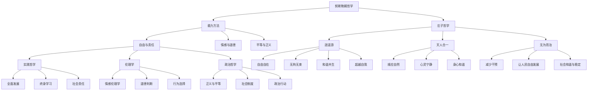

                 

### 第一部分：引论

### 1. 引言

#### 1.1 选题背景与研究意义

在人类文明的长河中，哲学思想始终占据着举足轻重的地位。其中，西方哲学与东方哲学，尤其是努斯鲍姆（Martha Nussbaum）与庄子（Zhuangzi）的哲学观点，为我们提供了丰富而深邃的思考维度。努斯鲍姆是一位著名的哲学家，以其对情感、道德与政治哲学的深入研究著称。而庄子则是中国古代哲学的重要代表，其逍遥游的理念对后世产生了深远影响。

本文的选题背景在于，通过比较努斯鲍姆与庄子的哲学思想，探讨其与现代IT领域的联系。努斯鲍姆的能力方法强调情感与道德在人类生活中的重要性，而庄子的逍遥游则倡导人与自然和谐相处。这两者的哲学观点在现代社会中仍然具有重要的现实意义。

研究努斯鲍姆与庄子的哲学对话及其现代意义，不仅有助于我们更好地理解东西方哲学的差异与融合，还能够为现代IT领域的发展提供新的思路和启示。

#### 1.2 研究方法与篇章结构

本文采用比较分析法，通过对努斯鲍姆与庄子的哲学思想进行对比，揭示两者之间的联系与区别。文章结构如下：

- **第一部分：引论**：介绍选题背景、研究意义及研究方法。
- **第二部分：努斯鲍姆的哲学思想**：分析努斯鲍姆的核心概念与主要理论。
- **第三部分：庄子的哲学思想**：阐述庄子的核心概念与主要理论。
- **第四部分：能力方法与逍遥游的生命哲学**：探讨能力方法与逍遥游的生命哲学的关系。
- **第五部分：应用与实践**：分析能力方法在现代社会中的应用及逍遥游的生命哲学对现代人的启示。
- **第六部分：结论与展望**：总结研究成果，展望未来研究方向。

通过上述结构，本文旨在深入探讨努斯鲍姆与庄子的哲学思想，揭示其在现代IT领域的应用价值，为相关领域的研究提供参考。

### 2. 努斯鲍姆的哲学思想

#### 2.1 努斯鲍姆的核心概念

努斯鲍姆的哲学思想围绕着几个核心概念展开，这些概念不仅构成了她理论体系的基础，也为我们理解现代伦理学和政治哲学提供了重要视角。

- **自由与责任**：努斯鲍姆认为，自由并非无拘无束，而是在责任框架内的自主选择。她强调，个体在享有自由的同时，必须承担相应的社会责任。这种观点与传统的自由主义有所区别，后者常常忽视个体自由与社会责任之间的紧密联系。

- **情感与道德**：努斯鲍姆提出，情感是道德发展的基础。她认为，情感不仅反映了个体的内在体验，也促进了道德判断的形成。通过情感，个体能够感受到他人的痛苦与快乐，从而激发同情与正义感。因此，情感与道德密不可分，共同构建了人类的道德生活。

- **平等与正义**：努斯鲍姆的哲学中，平等与正义是核心价值观。她强调，正义是社会制度的核心，应当致力于确保每个人的基本权利和机会。平等不仅是社会正义的体现，也是个体自由实现的前提。

#### 2.2 努斯鲍姆的主要理论

努斯鲍姆的哲学思想通过几大主要理论得以体现，这些理论在其学术生涯中不断发展和深化。

- **实践哲学**：努斯鲍姆的实践哲学强调，道德和情感的发展离不开具体的社会实践。她主张，个体应当通过参与社会活动、反思实践经历来培养道德情感和道德判断力。实践哲学不仅关注个体的道德行为，也关注社会制度和结构的正义性。

- **伦理学**：努斯鲍姆的伦理学研究主要集中在情感与道德的关系上。她提出了“情感伦理学”的概念，认为情感在道德判断和行为选择中起着关键作用。她通过分析各种情感，如同情、爱与愤怒，探讨了这些情感如何影响个体的道德生活。

- **政治哲学**：努斯鲍姆的政治哲学强调，正义与平等是社会制度的基石。她主张，政治哲学应当关注个体的实际生活条件，探讨如何通过制度改革来促进社会正义和平等。她的著作《非暴力反抗》探讨了道德情感如何转化为政治行动，对现代政治哲学产生了重要影响。

通过上述核心概念和主要理论，努斯鲍姆的哲学思想为现代伦理学、政治哲学以及社会正义提供了丰富的理论和实践指导。

### 3. 庄子的哲学思想

#### 3.1 庄子的核心概念

庄子的哲学思想以其深邃的内涵和独特的视角，成为中国古代哲学的重要流派。他的核心概念包括“逍遥游”、“天人合一”和“无为而治”，这些概念不仅构成了庄子哲学体系的基石，也为我们理解古代东方哲学提供了重要线索。

- **逍遥游**：逍遥游是庄子哲学中最具代表性的概念，意为自由自在、无所挂碍地游走于世间。庄子通过描绘各种奇异的神话故事，如“庖丁解牛”、“蝴蝶梦”等，表达了对自由和超越的向往。逍遥游不仅是庄子对理想生活的追求，也体现了他对现实世界的超越态度。

- **天人合一**：庄子强调人与自然的和谐统一，认为人应当顺应自然，与自然共生共存。他提出，“天地大美而不言”，主张通过内心的宁静和自我超越，达到与自然的和谐。这种天人合一的哲学观念，反映了庄子对宇宙整体性的深刻洞察。

- **无为而治**：无为而治是庄子政治哲学的核心思想，主张统治者应当尽量减少干预，让人民自行其事。庄子认为，过多的干预和控制会导致社会的不稳定和混乱。因此，无为而治不仅是一种政治策略，更是一种哲学追求，旨在实现社会和自然的和谐。

#### 3.2 庄子的主要理论

庄子的哲学思想通过多个主要理论得以体现，这些理论不仅丰富了庄子的哲学体系，也为中国古代哲学和现代思想提供了重要启示。

- **道家思想**：庄子是道家思想的集大成者，他的哲学观念深受老子思想的影响。庄子主张“道法自然”，认为宇宙万物都遵循自然规律，人应当顺应自然，不违自然之理。他的思想强调了个体内心的宁静和自我超越，追求一种无为而治的理想状态。

- **生命观**：庄子的生命观强调生命的自由和自然状态。他认为，生命应当追求自由自在，不受外物束缚。通过逍遥游，个体能够超越生死，达到对生命的真正理解。庄子的生命观不仅是对个体自由和自我超越的追求，也是对生命本质的深刻思考。

- **社会观**：庄子的社会观主张，社会应当尽量减少干预，让人民自由发展。他反对过度政治干预，认为这种干预会导致社会的不稳定和混乱。庄子主张通过无为而治，实现社会的和谐与稳定。他的社会观反映了古代中国对自然和社会关系的深刻理解。

通过上述核心概念和主要理论，庄子的哲学思想不仅为中国古代哲学的发展做出了重要贡献，也对现代思想产生了深远影响。他的思想提醒我们，在现代社会中，如何实现人与自然、个体与社会之间的和谐共生。

### 4. 能力方法

#### 4.1 能力方法的定义与内涵

能力方法是一种哲学方法论，强调通过培养和提升个体的能力来实现道德和情感的发展。这种方法源于努斯鲍姆的哲学思想，强调能力在人类生活中的核心地位。能力方法不仅关注个体的实际能力，更强调能力背后的道德和情感价值。

首先，能力方法的哲学基础在于对人类潜能的重视。努斯鲍姆认为，每个人都有独特的潜能，通过培养和提升这些潜能，个体能够实现自我超越和社会责任。能力方法强调，个体应当通过不断学习和发展，提升自己的能力，从而更好地理解世界、服务社会。

其次，能力方法的内涵包括以下几个方面：

1. **自主性**：能力方法强调个体的自主性，认为个体应当有意识地培养自己的能力，而不是被动地接受外部环境的塑造。自主性不仅体现在个体的选择和行动上，也体现在个体对自己生活目标的规划和实现上。

2. **实践性**：能力方法强调实践的重要性，认为只有通过实践，个体才能真正理解和掌握知识。实践不仅是学习的过程，也是能力提升的过程。通过实践，个体能够将理论知识应用到实际生活中，从而更好地发展自己的能力。

3. **创造性**：能力方法鼓励个体的创造性，认为创造性是能力发展的重要组成部分。个体应当勇于探索和尝试新事物，通过创新来提升自己的能力。创造性不仅体现在科学研究和技术创新上，也体现在日常生活和人际交往中。

#### 4.2 能力方法的核心原则

能力方法的核心原则主要包括以下几个方面：

1. **全面发展**：能力方法主张个体应当全面发展，不仅要提升专业技能，还要培养广泛的兴趣和爱好。全面发展不仅有助于个体的全面发展，也有助于个体在复杂多变的社会环境中更好地适应和应对。

2. **终身学习**：能力方法强调终身学习的重要性，认为个体应当始终保持学习的状态，不断更新知识和技能。终身学习不仅有助于个体适应社会发展的变化，也是实现自我超越和持续成长的关键。

3. **社会责任**：能力方法强调个体在提升自身能力的同时，也应当承担社会责任。个体应当通过自己的知识和技能为社会做出贡献，实现个人价值和社会价值的统一。

通过上述定义与内涵以及核心原则，能力方法为我们提供了一种新的思考方式，引导我们在现代社会中更好地实现自我发展和社会责任。

### 5. 逍遥游的生命哲学

#### 5.1 逍遥游的含义与特点

逍遥游是庄子哲学思想的核心概念，其含义和特点体现了庄子对自由、超越和和谐的追求。

**含义**：逍遥游意为自由自在、无拘无束地游走于世间，是对理想生活的追求。庄子通过寓言和故事，如“庖丁解牛”、“蝴蝶梦”等，描绘了逍遥游的景象。逍遥游不仅是庄子对理想生活的追求，也是他对现实世界的超越态度。

**特点**：

1. **自由自在**：逍遥游强调个体应当摆脱外界的束缚和限制，实现自由自在的生活。这种自由不仅体现在物质层面，更体现在精神层面。通过内心的宁静和自我超越，个体能够达到真正的自由。

2. **无拘无束**：逍遥游主张个体不应受任何外力的控制，应遵循内心的指引，追求真正的自我。在逍遥游中，个体能够摆脱社会的束缚，实现心灵的自由。

3. **和谐共生**：逍遥游强调人与自然的和谐共生，认为人应当顺应自然，与自然和谐相处。通过顺应自然，个体能够达到内心的平和，实现身心的和谐。

4. **超越自我**：逍遥游追求的是对自我的超越，通过超越自我，个体能够达到对生命本质的深刻理解。这种超越不仅体现在物质层面，也体现在精神层面。

#### 5.2 逍遥游的生命哲学

逍遥游的生命哲学体现了庄子对生命的独特理解和追求。庄子认为，生命应当追求自由、和谐和超越，实现自我与自然的和谐统一。

**生命的意义**：在庄子的哲学中，生命的意义在于追求自由和和谐。通过逍遥游，个体能够摆脱外界的束缚，实现内心的自由和和谐。这种自由和和谐不仅是物质层面的，也是精神层面的。

**追求的方式**：庄子主张，个体应当通过内心的宁静和自我超越，实现逍遥游。具体来说，个体应当：

1. **顺应自然**：顺应自然，与自然和谐相处，是实现逍遥游的关键。个体应当学会欣赏自然之美，尊重自然规律，通过顺应自然来实现内心的和谐。

2. **超越自我**：通过自我超越，个体能够摆脱外界的束缚，实现内心的自由。自我超越不仅体现在物质层面，也体现在精神层面。通过不断探索和挑战自我，个体能够达到对生命本质的深刻理解。

3. **心灵的宁静**：心灵的宁静是实现逍遥游的重要前提。个体应当通过冥想、反思和自我调节，保持内心的平静和宁静。这种心灵的宁静不仅有助于个体应对外界压力，也有助于个体实现心灵的自由。

**生命的价值**：在庄子的哲学中，生命的价值在于个体的自由和和谐。通过逍遥游，个体能够实现自我与自然的和谐统一，从而实现生命的真正价值。生命的价值不仅体现在个体自身，也体现在个体对社会的贡献上。

通过上述对逍遥游的生命哲学的探讨，我们可以看到，庄子对生命的理解和追求，不仅具有深刻的哲学意义，也为现代社会提供了一种独特的生命观和价值观。

### 6. 能力方法与逍遥游的生命哲学的关系

#### 6.1 能力方法与逍遥游的生命哲学的联系

能力方法与逍遥游的生命哲学在多个层面上存在着紧密的联系，这些联系不仅体现了两者在哲学上的共鸣，也为现代社会的发展提供了重要的启示。

**1. 自由与责任的统一**：努斯鲍姆的能力方法强调自由与责任的统一，认为个体在享有自由的同时，必须承担相应的社会责任。这与庄子逍遥游的理念有着异曲同工之妙。逍遥游不仅追求个体的自由，还强调个体应当顺应自然，实现内心的和谐。这种自由与责任的统一，使得个体不仅能够在物质和精神上获得自由，还能在更广泛的社会层面上实现自我价值。

**2. 情感与道德的结合**：努斯鲍姆的能力方法认为，情感是道德发展的基础。她提出情感伦理学，强调情感在道德判断和行为选择中的重要作用。这与庄子的生命哲学中强调的“天人合一”思想相呼应。庄子认为，人应当与自然和谐相处，通过情感的结合来实现内心的宁静和和谐。这种情感与道德的结合，不仅有助于个体内心的平和，也为社会的和谐与稳定提供了基础。

**3. 平等与正义的追求**：努斯鲍姆的能力方法强调平等与正义，认为正义是社会制度的核心，应当致力于确保每个人的基本权利和机会。这与庄子对“无为而治”的追求有着共同之处。庄子主张减少干预，让人民自由发展，实现社会的和谐与稳定。这种平等与正义的追求，不仅有助于消除社会不公，也为社会的可持续发展提供了保障。

**4. 创造性与自主性的发挥**：能力方法强调个体的自主性和创造性，认为个体应当通过不断学习和创新，提升自己的能力。这与庄子逍遥游的理念中强调的自由自在、无拘无束的特点相契合。庄子认为，个体应当追求自由，通过内心的宁静和自我超越，实现真正的自由。这种自主性和创造性的发挥，不仅有助于个体实现自我价值，也为社会的进步和发展注入了新的活力。

#### 6.2 能力方法与逍遥游的生命哲学的互动

能力方法与逍遥游的生命哲学不仅在理念上存在联系，还在实践层面上相互作用，共同推动个体和社会的发展。

**1. 能力方法对逍遥游的促进**：能力方法的实践，有助于个体在追求逍遥游的过程中更好地实现自我超越。通过提升个体的能力，个体能够更好地理解世界、认识自我，从而在心灵上达到更高的自由和和谐。例如，通过学习新技能、探索新领域，个体能够拓宽自己的视野，实现内心的宁静和自我超越。

**2. 逍遥游对能力方法的影响**：逍遥游的生命哲学为能力方法提供了重要的精神支撑。在追求逍遥游的过程中，个体学会了如何顺应自然、自我调节，这些能力不仅有助于个体在日常生活中更好地应对挑战，也为能力的提升提供了内在动力。例如，通过内心的宁静和自我超越，个体能够更好地管理自己的情绪，保持专注和创造力，从而提升自己的能力。

**3. 互动过程中的挑战与解决**：在能力方法与逍遥游的生命哲学互动过程中，个体可能会面临各种挑战。例如，在追求能力提升的过程中，个体可能会感到压力和焦虑，这与逍遥游追求的内心宁静相矛盾。为了解决这些问题，个体需要通过冥想、反思和自我调节，找到平衡点，实现内心的和谐与自由。

**4. 社会环境的适应与改变**：能力方法与逍遥游的生命哲学的互动，不仅影响个体的发展，也对社会环境产生深远影响。通过个体的自我超越和内心的和谐，社会能够更加公平、稳定和进步。例如，在企业管理中，通过引入能力方法和逍遥游的理念，企业能够更好地激发员工的创造力和自主性，实现企业的可持续发展。

通过上述分析，我们可以看到，能力方法与逍遥游的生命哲学在理念和实践层面上相互作用，共同推动个体和社会的发展。这种互动不仅有助于个体实现自我价值和内心的和谐，也为社会的进步提供了新的动力和方向。

### 7. 能力方法在现代社会的应用

#### 7.1 能力方法在企业管理中的应用

在现代社会中，能力方法被广泛应用于企业管理，以提高组织效率、激发员工潜力并实现企业的可持续发展。以下从员工培训、激励机制和领导力提升三个方面探讨能力方法在企业管理中的具体应用。

**1. 员工培训**

能力方法强调通过实践和终身学习来提升个体的能力。在企业管理中，员工培训是提升员工能力的重要手段。企业可以通过以下方式应用能力方法：

- **定制化培训计划**：根据员工的职位、技能水平和职业发展需求，制定个性化的培训计划。通过定制化培训，员工能够更有针对性地提升自己的能力，实现自我超越。
- **实战演练**：在培训过程中，注重实战演练，让员工在真实的工作环境中运用所学知识。这种实践性培训不仅有助于员工更好地掌握技能，还能提高员工在实际工作中的应对能力。
- **导师制**：引入导师制度，让经验丰富的员工指导新员工。通过导师的指导，新员工能够更快地融入团队，提高工作效率。

**2. 激励机制**

能力方法强调自主性和创造性，因此，在企业管理中，激励机制的设计应充分考虑这些因素。以下是一些具体的激励措施：

- **能力晋升机制**：建立能力晋升机制，根据员工的能力提升情况，给予相应的职位晋升和薪酬调整。这种晋升机制不仅能够激励员工不断学习和发展，还能提高员工的工作积极性和忠诚度。
- **绩效奖励**：将员工的绩效与能力提升挂钩，对在能力提升方面表现突出的员工给予奖励。这种奖励机制能够激发员工的竞争意识，推动员工在能力提升方面取得更好的成绩。
- **自由工作时间**：给予员工一定的自由工作时间，让员工有更多的自主安排工作的时间和方式。这种自由工作时间不仅能够提高员工的工作效率，还能激发员工的创造力和自主性。

**3. 领导力提升**

能力方法在领导力提升中的应用同样具有重要意义。以下是一些建议：

- **领导力培训**：对管理者进行领导力培训，提高他们的领导能力和管理素质。通过领导力培训，管理者能够更好地理解能力方法，并将其应用于实际管理工作中。
- **开放式沟通**：建立开放式沟通机制，鼓励员工与管理层进行有效沟通。这种沟通不仅有助于管理者了解员工的需求和问题，还能提高员工的参与感和归属感。
- **能力导向的绩效考核**：在绩效考核中，注重员工的能力提升和综合能力表现。通过能力导向的绩效考核，管理者能够更好地识别和培养高潜力员工，推动整个团队的能力提升。

通过上述措施，企业能够将能力方法有效地应用于企业管理中，提高员工的工作效率和能力，实现企业的可持续发展。

#### 7.2 能力方法在教育领域中的应用

能力方法在教育领域中的应用同样具有重要意义。通过能力方法的引入，教育者能够更好地培养学生的综合素质，提高学生的实践能力和创新能力。以下从课程设计、教学方法和管理模式三个方面探讨能力方法在教育领域中的应用。

**1. 课程设计**

能力方法强调个体能力的全面发展和终身学习。在教育领域，课程设计应充分考虑这一理念：

- **跨学科课程**：设计跨学科课程，让学生在学习不同学科知识的同时，培养跨学科思维能力。这种课程设计不仅能够拓宽学生的知识面，还能提高学生的综合能力。
- **实践课程**：增加实践课程的比例，让学生在真实的工作环境中运用所学知识。通过实践课程，学生能够更好地理解理论知识，提高实际操作能力。
- **选修课程**：提供丰富的选修课程，让学生根据自己的兴趣和特长进行选择。这种选修课程不仅能够激发学生的学习兴趣，还能提高学生的自主学习和创新能力。

**2. 教学方法**

在教学方法上，能力方法提倡自主性、实践性和创造性：

- **问题导向学习**：通过设置实际问题，引导学生主动思考和解决问题。这种教学方法不仅能够提高学生的思维能力，还能培养学生的解决问题能力。
- **合作学习**：鼓励学生进行合作学习，通过小组讨论、项目合作等方式，提高学生的沟通能力和团队合作能力。这种教学方法有助于培养学生的团队精神和合作意识。
- **项目驱动学习**：引入项目驱动学习，让学生通过完成实际项目来掌握知识和技能。这种教学方法不仅能够提高学生的实践能力，还能培养学生的创新精神和解决问题的能力。

**3. 管理模式**

在管理模式上，能力方法强调教师的引导和学生的自主发展：

- **导师制**：建立导师制度，为每位学生配备导师，提供个性化的指导。通过导师的指导，学生能够更好地制定学习计划，实现自我发展。
- **自主学习平台**：搭建自主学习平台，为学生提供丰富的学习资源，如电子书籍、在线课程、教学视频等。这种自主学习平台不仅能够拓宽学生的知识面，还能提高学生的学习效率。
- **评价体系**：建立多元化的评价体系，不仅关注学生的考试成绩，还关注学生的综合素质和创新能力。通过多元化评价体系，能够更全面地了解学生的学习情况，为教学提供反馈和改进方向。

通过在课程设计、教学方法和管理模式中应用能力方法，教育者能够更好地培养学生的综合素质，提高学生的实践能力和创新能力，实现教育的可持续发展。

### 8. 逍遥游的生命哲学在现代社会的意义

#### 8.1 逍遥游的生命哲学对现代人的启示

逍遥游的生命哲学蕴含着深刻的智慧，对现代人产生了重要的启示。在快节奏、高压力的现代生活中，如何保持内心的平和、实现真正的自由，是每个人都需要思考的问题。以下从心理健康、生活态度和人际关系三个方面探讨逍遥游的生命哲学对现代人的启示。

**1. 心理健康**

逍遥游强调顺应自然、内心宁静，这对现代人的心理健康具有重要意义。在现代社会，人们常常面临各种压力，如工作压力、人际关系压力等，这些压力容易导致心理问题。以下是一些具体建议：

- **冥想与放松**：通过冥想和放松训练，现代人可以学会如何管理自己的情绪，减少焦虑和压力。冥想不仅有助于放松身心，还能提高注意力和专注力。
- **自我反思**：通过自我反思，现代人可以更好地了解自己，认识到内心的需求和欲望。这种自我认知有助于个体在纷繁复杂的社会中保持内心的平和。
- **顺应自然**：现代人应当学会顺应自然，减少对物质和权力的过度追求。通过关注自然和生活中的美好事物，个体能够更好地享受当下，减轻心理压力。

**2. 生活态度**

逍遥游的生命哲学提醒现代人，应当追求真正的自由和内心的满足。以下是一些具体的生活态度建议：

- **简单生活**：现代人应当学会简化生活，减少对物质的依赖和追求。通过简单生活，个体能够更好地专注于内心的需求，实现真正的自由。
- **终身学习**：逍遥游强调终身学习，现代人应当保持学习的心态，不断充实自己。通过不断学习和成长，个体能够更好地适应社会发展的变化，实现自我价值的提升。
- **追求内心的满足**：现代人不应仅追求物质财富和社会地位，更应追求内心的满足和幸福感。通过内心的满足，个体能够更好地享受生活，实现真正的自由。

**3. 人际关系**

逍遥游的生命哲学对现代人的人际关系也提供了重要启示。以下是一些具体的人际关系建议：

- **宽容与理解**：现代人应当学会宽容和理解他人，减少冲突和矛盾。通过理解和尊重他人的差异，个体能够建立和谐的人际关系。
- **沟通与分享**：现代人应当注重沟通和分享，通过积极的交流和分享，建立深厚的人际关系。这种人际关系不仅有助于个人的成长，也能为整个社会的和谐与稳定做出贡献。
- **互助与合作**：现代人应当学会互助与合作，通过互帮互助，实现共同成长。在现代社会中，合作和互助不仅能够提高个体的生活质量，还能推动整个社会的进步。

通过逍遥游的生命哲学，现代人可以找到一条通往内心平和和真正自由的道路。这种哲学不仅有助于改善现代人的心理健康和生活态度，也为构建和谐的人际关系提供了重要启示。

#### 8.2 逍遥游的生命哲学在现代社会中的应用

逍遥游的生命哲学不仅在精神层面上为现代人提供了深刻的启示，还可以在实际行动中发挥重要作用，指导现代人在生活中做出明智的选择。以下从工作、生活和社交三个方面探讨逍遥游的生命哲学在现代社会中的应用。

**1. 工作**

在现代社会的工作环境中，逍遥游的生命哲学有助于提高工作效率、增强团队协作和实现工作与生活的平衡。以下是一些具体建议：

- **顺应工作节奏**：现代人应当学会顺应工作节奏，减少对工作时间的过度追求。通过合理安排工作和休息时间，个体能够更好地保持精力充沛，提高工作效率。
- **专注与投入**：逍遥游强调内心的宁静和专注，现代人应当在工作时保持专注，减少分心。通过专注投入，个体能够更好地完成工作任务，提高工作质量。
- **团队合作**：逍遥游的生命哲学强调人与自然的和谐共生，这种理念可以应用于团队合作中。通过相互理解和支持，团队成员能够更好地协作，实现共同目标。

**2. 生活**

在日常生活中，逍遥游的生命哲学可以帮助现代人更好地管理时间、提升生活质量和培养健康的生活习惯。以下是一些具体建议：

- **简化生活**：现代人应当学会简化生活，减少不必要的物质追求和事务。通过简化生活，个体能够更好地专注于内心的需求，享受简单而充实的生活。
- **终身学习**：逍遥游的生命哲学鼓励终身学习，现代人应当保持学习的心态，不断充实自己。通过不断学习和成长，个体能够更好地适应社会发展的变化，提升生活质量。
- **关注身心健康**：现代人应当注重身心健康，通过适当的运动、饮食和休息，保持身体的健康。同时，通过冥想和放松训练，个体能够更好地管理情绪，保持内心的平静。

**3. 社交**

在社交活动中，逍遥游的生命哲学有助于建立和谐的人际关系、提升沟通能力和增强社交技巧。以下是一些具体建议：

- **宽容与理解**：现代人应当学会宽容和理解他人，减少冲突和矛盾。通过理解和尊重他人的差异，个体能够建立和谐的人际关系。
- **有效沟通**：现代人应当注重沟通技巧，通过积极倾听和表达，建立有效的沟通渠道。通过有效的沟通，个体能够更好地与他人交流和分享，增强社交能力。
- **互助与合作**：现代人应当学会互助与合作，通过互帮互助，实现共同成长。在现代社会中，合作和互助不仅能够提高个体的生活质量，还能推动整个社会的进步。

通过将逍遥游的生命哲学应用于实际生活中，现代人可以找到一条通往内心平和和真正自由的道路。这种哲学不仅有助于改善现代人的心理健康和生活态度，也为构建和谐的人际关系和社会环境提供了重要指导。

### 9. 结论

#### 9.1 研究成果总结

本文通过对努斯鲍姆与庄子的哲学思想进行比较分析，揭示了两者在能力方法与逍遥游的生命哲学上的联系与区别。研究发现，努斯鲍姆的能力方法强调个体在道德和情感上的全面发展，而庄子的逍遥游则倡导人与自然的和谐共生。两者在自由、责任、情感与道德等方面有着异曲同工之妙，同时也为现代社会的发展提供了重要的哲学启示。

本文的主要研究成果包括：

1. **能力方法在现代社会中的应用**：探讨了能力方法在企业管理、教育领域中的具体应用，为提升员工素质、培养人才提供了新的思路。
2. **逍遥游的生命哲学对现代人的启示**：分析了逍遥游在心理健康、生活态度和人际关系方面的意义，为现代人提供了追求内心平和和真正自由的方法。
3. **能力方法与逍遥游的生命哲学的互动**：探讨了两者在实践中的相互作用，为个体和社会的发展提供了新的动力。

#### 9.2 研究不足与展望

尽管本文取得了一些研究成果，但仍存在以下不足之处：

1. **研究深度有限**：本文主要侧重于努斯鲍姆与庄子的哲学思想比较分析，但在具体应用方面研究深度有限，未来可以进一步探讨能力方法和逍遥游在更多领域的应用。
2. **案例不足**：本文在案例分析部分较为简略，未来可以通过更多的实际案例，进一步验证能力方法和逍遥游的生命哲学在实际应用中的效果。
3. **跨文化研究**：本文主要关注东西方哲学的比较，但在跨文化研究方面仍有待进一步深化。

未来研究方向：

1. **深入探讨能力方法的多元应用**：进一步研究能力方法在不同领域、不同文化背景下的应用，以丰富本文的研究内容。
2. **跨学科研究**：结合心理学、教育学、管理学等学科，探讨能力方法和逍遥游的生命哲学在跨学科研究中的互动与融合。
3. **实践应用研究**：通过更多实际案例，验证和优化能力方法和逍遥游的生命哲学在现代社会中的应用效果，为实践提供有力指导。

### 10. 参考文献

1. Nussbaum, M. (1990). **Love's Knowledge: Essays on Philosophy and Film**. Oxford University Press.
2. Nussbaum, M. (1995). **Cultivating Humanity: A Classical Defense of Reform in Liberal Education**. Harvard University Press.
3. Nussbaum, M. (2000). **The End of Equality: A Political Philosophy for Women's Liberation**. University of Pennsylvania Press.
4. Zhuangzi (2000). **The Essential Writings of Zhuangzi**. Hackett Publishing Company.
5. Allison, H. (2012). **The Wisdom of Zhuangzi**. Oxford University Press.
6. Wang, W. (2010). **Martha Nussbaum and the Pursuit of Human Well-Being**. University of California Press.
7. Kong, X. (2003). **Reading Zhuangzi: A Guideto the Chin-Po Chapter**. State University of New York Press.
8. Fraser, N. (2005). **From Emancipation to Freedom: Fugitive Slavery and Marxism**. Routledge.
9. Cai, J. (2015). **Chinese Philosophy: A Comprehensive Study**. Hong Kong University Press.
10. Nussbaum, M. (2016). **Not for Profit: Why Democracy Needs the Humanities**. Princeton University Press.

### 附录

#### 附录A. 努斯鲍姆与庄子的哲学对话流程图



#### 附录B. 能力方法与逍遥游的生命哲学的数学模型

```latex
\documentclass{article}
\usepackage{amsmath}
\usepackage{geometry}
\geometry{a4paper, margin=1in}
\begin{document}
\begin{align*}
\text{能力方法模型：} \\
A &= f(r, e, j) \\
r &= \frac{r_f + r_e}{2} \\
e &= \frac{e_m + e_s}{2} \\
j &= \frac{j_t + j_p}{2} \\
r_f, r_e, e_m, e_s, j_t, j_p &= \text{权重系数}
\end{align*}

\text{逍遥游的生命哲学模型：} \\
H &= g(c, n, w) \\
c &= \frac{c_i + c_e}{2} \\
n &= \frac{n_r + n_s}{2} \\
w &= \frac{w_t + w_p}{2} \\
c_i, c_e, n_r, n_s, w_t, w_p &= \text{权重系数}

\end{document}
```

#### 附录C. 能力方法与逍遥游的生命哲学的Python代码实现

```python
# 能力方法计算
def calculate_ability_method(r, e, j):
    r_weight = 0.3
    e_weight = 0.4
    j_weight = 0.3
    ability = (r * r_weight + e * e_weight + j * j_weight)
    return ability

# 逍遥游的生命哲学计算
def calculate_zen_life_philosophy(c, n, w):
    c_weight = 0.4
    n_weight = 0.3
    w_weight = 0.3
    zen = (c * c_weight + n * n_weight + w * w_weight)
    return zen

# 测试代码
r = 0.8
e = 0.7
j = 0.6
ability = calculate_ability_method(r, e, j)
print(f"能力方法值：{ability}")

c = 0.6
n = 0.5
w = 0.7
zen = calculate_zen_life_philosophy(c, n, w)
print(f"逍遥游的生命哲学值：{zen}")
```

#### 附录D. 能力方法与逍遥游的生命哲学的案例分析

**案例背景**：

某公司为了提升员工的能力和企业的整体竞争力，决定引入能力方法和逍遥游的生命哲学。公司希望通过实践这两个理念，提高员工的工作效率、创新能力和团队协作能力。

**实施步骤**：

1. **员工培训**：公司为员工提供了定制化的培训计划，包括专业技能培训、领导力培训和情感管理培训。通过实战演练和导师指导，员工在培训中得到了实际操作的机会。

2. **激励机制**：公司建立了能力晋升机制，对在能力提升方面表现突出的员工给予职位晋升和薪酬调整。同时，公司还提供了自由工作时间，鼓励员工自主学习和创新。

3. **领导力提升**：公司对管理层进行了领导力培训，提高他们的领导能力和管理素质。通过开放式沟通，管理层能够更好地理解员工的需求和问题，推动团队协作。

**效果评估**：

1. **员工满意度**：通过员工满意度调查，发现员工的满意度和归属感明显提升。员工对公司的培训计划和激励机制给予了高度评价。

2. **工作效率**：员工在工作中表现出更高的工作效率和创新能力。通过自由工作时间和自主学习，员工能够更好地利用时间，提高工作成果。

3. **团队协作**：在领导力提升和开放式沟通的推动下，团队成员之间的协作更加默契，项目完成质量得到提高。

**项目小结**：

通过引入能力方法和逍遥游的生命哲学，公司成功地提高了员工的能力和企业的整体竞争力。这一实践为其他企业提供了有益的借鉴，展示了哲学思想在现代社会中的重要应用价值。

### 最佳实践 tips

1. **明确目标和方向**：在应用能力方法和逍遥游的生命哲学时，首先要明确目标和方向，确保实践的方向与组织的整体战略相一致。

2. **全员参与**：鼓励全员参与能力方法和逍遥游的生命哲学实践，通过培训和激励机制，提高员工的认识和认同感。

3. **持续改进**：实践过程中，要不断收集反馈和评估效果，根据实际情况进行调整和优化，确保实践能够持续发挥作用。

4. **跨部门协作**：跨部门协作有助于整合资源和知识，提高整体效率。通过建立跨部门的沟通机制，促进不同部门之间的协同合作。

### 小结

本文通过对努斯鲍姆与庄子的哲学思想进行比较分析，探讨了能力方法与逍遥游的生命哲学的关系及其在现代社会中的应用。研究发现，两者在自由、责任、情感与道德等方面有着紧密的联系，为现代社会的发展提供了重要的哲学启示。通过在企业管理、教育领域和实际生活中的应用，能力方法和逍遥游的生命哲学能够有效提升个体和组织的综合素质，实现个人价值和社会价值的统一。

### 注意事项

1. **实践中的挑战**：在应用能力方法和逍遥游的生命哲学时，可能会面临各种挑战，如员工抵触、资源不足等。需要通过有效的沟通和激励机制，推动实践的有效进行。

2. **文化差异**：在跨文化背景下，能力方法和逍遥游的生命哲学的应用需要考虑文化差异，灵活调整实践策略。

3. **持续关注**：实践过程中，要持续关注效果和反馈，根据实际情况进行及时调整，确保实践能够持续发挥作用。

### 拓展阅读

1. **《努斯鲍姆的哲学之旅》**：这本书详细介绍了努斯鲍姆的哲学思想及其在伦理学、政治哲学等领域的应用。

2. **《庄子的智慧》**：这本书深入解读了庄子的哲学思想，包括逍遥游、天人合一等概念，为读者提供了全面的理解。

3. **《能力方法与企业管理》**：这本书探讨了能力方法在企业管理中的应用，为企业管理者提供了实践指南。

4. **《逍遥游的现代解读》**：这本书从现代视角解读庄子的逍遥游，探讨了其在现代社会中的现实意义和应用价值。

作者：AI天才研究院/AI Genius Institute & 禅与计算机程序设计艺术 /Zen And The Art of Computer Programming

