                 

# 《区块链在企业应用中的实践与挑战》

## 关键词
区块链、企业应用、实践、挑战、分布式账本、加密技术、共识机制

## 摘要
本文旨在探讨区块链技术在企业应用中的实践与挑战。首先，我们将介绍区块链的基本概念、发展历程及其在企业中的重要性。接着，深入剖析区块链的核心概念与原理，包括分布式账本、加密技术和共识机制。随后，通过实际案例展示区块链在金融、供应链管理等行业的应用，并分析其中的挑战和解决方案。最后，我们对区块链的未来发展趋势进行展望，并提出建议。

## 引言

### 1. 区块链技术概述

区块链技术是一种分布式数据库技术，通过加密算法确保数据的完整性和安全性。它由一系列按时间顺序排列的区块组成，每个区块都包含一定数量的交易记录。区块链的去中心化和不可篡改性使其成为一种具有广泛应用前景的技术。

#### 1.1 区块链的概念与发展历程

区块链最早由中本聪（Satoshi Nakamoto）在2008年提出，并在次年创造了比特币（Bitcoin）这一数字货币。比特币的成功引发了人们对区块链技术的关注。随后，越来越多的企业开始探索区块链技术在企业中的应用，包括金融、供应链管理、物联网等领域。

#### 1.2 区块链的核心概念与技术原理

区块链的核心概念包括分布式账本、加密技术和共识机制。分布式账本使得数据存储在多个节点上，避免了单点故障和数据丢失的风险。加密技术确保了数据的安全性和隐私性。共识机制则保证了区块链网络的正常运行和数据的可靠性。

#### 1.3 区块链在企业中的重要性

区块链技术在企业中的应用具有重要意义。首先，它可以提高数据的安全性和透明度，减少欺诈和错误。其次，它可以降低交易成本，提高效率。此外，区块链技术还可以帮助企业实现智能合约，提高业务自动化水平。

### 2. 区块链的核心概念与原理

#### 2.1 分布式账本

分布式账本是一种无需中心化中介机构管理的账本系统。它通过多个节点共同维护，确保数据的完整性和一致性。每个节点都存储了一份完整的账本副本，节点之间通过加密算法和共识机制进行数据同步。

##### 2.1.1 分布式账本的基本原理

分布式账本的基本原理包括数据存储、数据同步和节点通讯。数据存储方面，每个节点都存储了一份完整的账本副本，包括所有交易记录。数据同步方面，节点之间通过广播和确认机制进行数据同步。节点通讯方面，节点之间通过加密通信协议进行数据交换。

##### 2.1.2 分布式账本的优势与挑战

分布式账本的优势包括去中心化、高安全性和高可靠性。去中心化意味着不存在中心化故障点，从而提高了系统的可靠性。高安全性则得益于加密算法和共识机制。然而，分布式账本也面临一些挑战，如数据同步延迟、节点数量过多导致的性能问题等。

##### 2.1.3 分布式账本的应用场景

分布式账本适用于需要高安全性和高可靠性的场景，如金融、供应链管理、物联网等。在金融领域，分布式账本可以用于跨境支付、证券交易等。在供应链管理领域，分布式账本可以用于记录商品的生产、运输和销售过程。在物联网领域，分布式账本可以用于设备之间的数据传输和认证。

### 2.2 加密技术

加密技术是一种通过算法将明文转换为密文的技术。在区块链中，加密技术主要用于保护数据的隐私性和完整性。常见的加密技术包括对称加密、非对称加密和哈希函数。

##### 2.2.1 加密技术的基本原理

对称加密使用相同的密钥进行加密和解密。非对称加密则使用公钥和私钥进行加密和解密。哈希函数是一种将任意长度的输入映射为固定长度的输出的函数，常用于数据完整性验证。

##### 2.2.2 加密技术在区块链中的应用

加密技术在区块链中的应用包括数据加密、交易安全和身份认证。数据加密用于保护区块链中存储的数据。交易安全则通过加密算法确保交易数据的真实性。身份认证方面，加密技术用于验证用户身份和授权访问。

##### 2.2.3 加密技术的安全性分析

加密技术的安全性取决于密钥的长度和加密算法的强度。常见的加密算法包括AES、RSA和SHA-256。加密算法的强度越高，破解所需的时间越长。

### 2.3 共识机制

共识机制是区块链网络中节点就数据一致性达成共识的算法。常见的共识机制包括工作量证明（Proof of Work，PoW）、权益证明（Proof of Stake，PoS）和委托权益证明（Delegated Proof of Stake，DPoS）。

##### 2.3.1 共识机制的基本概念

共识机制的基本概念包括节点投票、链的选择和数据同步。节点投票方面，节点通过投票选择最长链作为主链。链的选择方面，节点根据一定规则选择主链。数据同步方面，节点通过广播和确认机制同步数据。

##### 2.3.2 共识机制的分类与比较

共识机制的分类包括PoW、PoS和DPoS。PoW通过竞争计算资源来达成共识，具有去中心化的特点。PoS则通过持有币龄来竞争记账权，降低了能源消耗。DPoS则通过选举出少量超级节点来达成共识，具有较高的性能。

##### 2.3.3 共识机制在区块链网络中的作用

共识机制在区块链网络中的作用是确保数据的一致性和安全性。通过共识机制，节点可以就数据的真伪达成共识，从而避免数据篡改和伪造。

## 区块链在企业应用中的案例

### 3.1 金融行业中的区块链应用

#### 3.1.1 金融行业对区块链的需求

金融行业对区块链的需求主要包括降低交易成本、提高交易效率和数据透明度。区块链技术可以用于跨境支付、证券交易、保险等领域，从而减少中介机构的参与，降低交易成本。

#### 3.1.2 金融行业中的区块链案例

金融行业中的区块链案例包括比特币、Ripple、Hyperledger Fabric等。比特币是一种去中心化的数字货币，通过区块链技术实现点对点的交易。Ripple则是一种支付协议，旨在通过区块链技术实现快速、低成本的跨境支付。Hyperledger Fabric是一种企业级的区块链框架，被广泛应用于金融行业。

#### 3.1.3 金融行业区块链应用的挑战

金融行业区块链应用面临的主要挑战包括数据隐私保护、合规性和监管问题。数据隐私保护方面，区块链技术需要确保用户数据的安全和隐私。合规性和监管问题方面，金融行业需要遵守各种法律法规，确保区块链应用符合监管要求。

### 3.2 供应链管理中的区块链应用

#### 3.2.1 供应链管理中的痛点

供应链管理中的痛点包括数据不透明、信息不对称和物流效率低下。区块链技术可以用于解决这些问题，提高供应链管理的效率。

#### 3.2.2 区块链在供应链管理中的应用

区块链在供应链管理中的应用包括记录商品的生产、运输和销售过程，确保数据的真实性和透明度。例如，沃尔玛使用区块链技术记录食品供应链信息，提高食品安全和追溯能力。

#### 3.2.3 供应链管理区块链应用的挑战

供应链管理区块链应用面临的挑战包括数据隐私保护、数据传输效率和系统兼容性。数据隐私保护方面，区块链技术需要确保用户数据的安全和隐私。数据传输效率方面，区块链技术需要提高数据传输速度。系统兼容性方面，区块链技术需要与其他系统集成，实现数据共享和互操作。

### 3.3 其他行业中的区块链应用

除了金融和供应链管理，区块链技术在其他行业中也有广泛的应用前景。例如，在医疗行业，区块链技术可以用于病历管理、医疗数据共享和药物供应链管理。在房地产行业，区块链技术可以用于房产交易、租赁和评估。在物流行业，区块链技术可以用于物流跟踪、运输优化和货运保险。

## 区块链应用中的实践与挑战

### 4.1 区块链应用中的实践经验

区块链应用中的实践经验表明，区块链技术可以提高数据的安全性和透明度，降低交易成本，提高业务效率。例如，IBM的Hyperledger Fabric项目已经在金融、供应链管理、物联网等领域取得了显著成果。沃尔玛和IBM合作开发的区块链食品供应链平台也取得了成功。

### 4.2 区块链应用中的挑战

尽管区块链技术在企业应用中取得了显著成果，但仍然面临一些挑战。首先，技术挑战包括数据隐私保护、系统兼容性和数据传输效率。其次，业务挑战包括合规性和监管问题。此外，区块链应用还需要解决数据存储和计算资源消耗的问题。

### 4.3 区块链应用中的可持续发展

为了实现区块链应用的可持续发展，需要解决以下问题：

- 技术方面，需要提高区块链的性能和可扩展性，降低计算资源消耗。
- 业务方面，需要建立完善的法律法规和监管框架，确保区块链应用的合规性。
- 社会方面，需要加强公众对区块链技术的认知和信任，推动区块链技术的普及和应用。

## 总结与展望

### 5.1 区块链技术在企业应用中的前景

随着区块链技术的不断发展和应用场景的扩大，区块链技术在企业应用中的前景十分广阔。未来，区块链技术有望在金融、供应链管理、物联网、医疗、房地产等领域发挥更大的作用。

### 5.2 区块链技术的潜在影响

区块链技术的潜在影响包括提高数据安全性和透明度、降低交易成本、提高业务效率和推动产业变革。区块链技术将重塑企业之间的合作模式，推动传统行业的数字化转型。

### 5.3 建议与展望

为了推动区块链技术在企业中的应用，提出以下建议：

- 加强技术研发，提高区块链的性能和可扩展性。
- 建立完善的法律法规和监管框架，确保区块链应用的合规性。
- 加强人才培养，推动区块链技术的普及和应用。
- 深入挖掘区块链技术的应用场景，实现跨行业、跨领域的合作。

## 参考文献

- 中本聪. (2008). 比特币：一个点对点的电子现金系统. URL: https://bitcoin.org/bitcoin.pdf
- IBM. (2018). Hyperledger Fabric：企业级区块链框架. URL: https://hyperledger-fabric.readthedocs.io/
- 沃尔玛. (2018). 利用区块链技术提高食品供应链透明度. URL: https://www.walmart.com/corp/en/company/info/press-room/2018/10/walmart-announces-blockchain-food-traceability- initiative.html
- Ripple Labs. (2012). Ripple：一种基于区块链的支付协议. URL: https://ripple.com/
- 区块链技术联盟. (2019). 区块链技术与应用. 北京：机械工业出版社.

## 作者信息

作者：AI天才研究院/AI Genius Institute & 禅与计算机程序设计艺术 /Zen And The Art of Computer Programming

----------------------------------------------------------------

### 文章正文

#### 引言

区块链技术是一种分布式数据库技术，通过加密算法确保数据的完整性和安全性。它由一系列按时间顺序排列的区块组成，每个区块都包含一定数量的交易记录。区块链的去中心化和不可篡改性使其成为一种具有广泛应用前景的技术。

区块链技术的发展历程可以追溯到2008年，当时中本聪（Satoshi Nakamoto）发表了比特币白皮书，提出了区块链技术的概念。比特币是第一个基于区块链技术的数字货币，它通过区块链实现了点对点的交易，无需中介机构参与。比特币的成功引发了人们对区块链技术的关注。

随着区块链技术的不断发展，越来越多的企业开始探索其在企业中的应用。区块链技术不仅可以提高数据的安全性和透明度，还可以降低交易成本，提高业务效率。因此，区块链技术在金融、供应链管理、物联网等领域具有广泛的应用前景。

#### 1.1 区块链的概念与发展历程

区块链是一种分布式账本技术，它通过加密算法确保数据的完整性和安全性。区块链的基本组成单位是区块，每个区块包含一定数量的交易记录。区块通过加密算法和时间戳进行链接，形成一个链式数据结构。区块链的特点包括去中心化、不可篡改、透明和高效。

区块链技术最早由中本聪在2008年提出，并在次年创造了比特币。比特币通过区块链技术实现了点对点的交易，无需中介机构参与。比特币的成功引发了人们对区块链技术的关注，并促使更多研究者和企业探索其在企业中的应用。

自比特币诞生以来，区块链技术已经经历了多个发展阶段。从初期的比特币到后来的以太坊、Ripple等，区块链技术在金融、供应链管理、物联网等领域得到了广泛应用。随着技术的不断发展和成熟，区块链技术的应用场景也在不断拓展。

#### 1.2 区块链的核心概念与技术原理

区块链的核心概念包括分布式账本、加密技术和共识机制。分布式账本是一种无需中心化中介机构管理的账本系统，通过多个节点共同维护，确保数据的完整性和一致性。加密技术用于保护数据的隐私性和完整性。共识机制是区块链网络中节点就数据一致性达成共识的算法。

分布式账本的基本原理是每个节点都存储了一份完整的账本副本，节点之间通过加密算法和共识机制进行数据同步。加密技术包括对称加密、非对称加密和哈希函数，用于确保数据的保密性和完整性。共识机制包括工作量证明（PoW）、权益证明（PoS）和委托权益证明（DPoS），用于确保区块链网络的正常运行和数据的一致性。

#### 1.3 区块链在企业中的重要性

区块链技术在企业中的应用具有重要意义。首先，它可以提高数据的安全性和透明度，减少欺诈和错误。区块链技术的去中心化和不可篡改特性使其成为一种非常安全的存储和传输数据的工具。例如，在金融行业中，区块链技术可以用于跨境支付、证券交易等，确保交易的安全性和透明度。

其次，区块链技术可以降低交易成本，提高效率。传统金融行业中，交易需要经过多个中介机构，如银行、支付公司等，这导致交易成本较高。而区块链技术可以实现点对点的交易，无需中介机构的参与，从而降低交易成本。例如，Ripple就是一种基于区块链技术的支付协议，可以实现快速、低成本的跨境支付。

此外，区块链技术还可以帮助企业实现智能合约，提高业务自动化水平。智能合约是一种自动执行合约条款的计算机程序，它基于区块链技术运行，确保合约条款的执行和执行结果的不可篡改性。智能合约的应用可以提高业务效率，减少人工干预和错误。

总之，区块链技术在企业中的应用具有巨大的潜力，可以为企业带来更高的安全性、透明度和效率。

#### 2.1 分布式账本

分布式账本是一种无需中心化中介机构管理的账本系统，通过多个节点共同维护，确保数据的完整性和一致性。分布式账本的核心思想是将数据分散存储在多个节点上，从而避免单点故障和数据丢失的风险。分布式账本不仅具有去中心化的特性，还具有高安全性、高可靠性和透明性。

##### 2.1.1 分布式账本的基本原理

分布式账本的基本原理包括数据存储、数据同步和节点通讯。数据存储方面，每个节点都存储了一份完整的账本副本，包括所有交易记录。节点之间通过加密算法和共识机制进行数据同步。数据同步方面，节点之间通过广播和确认机制进行数据同步。节点通讯方面，节点之间通过加密通信协议进行数据交换。

分布式账本的核心是区块链，它由一系列按时间顺序排列的区块组成。每个区块包含一定数量的交易记录，并通过哈希函数与前一个区块进行链接，形成链式数据结构。区块链的不可篡改性保证了数据的完整性和安全性。

##### 2.1.2 分布式账本的优势与挑战

分布式账本的优势包括去中心化、高安全性和高可靠性。去中心化意味着不存在中心化故障点，从而提高了系统的可靠性。高安全性则得益于加密算法和共识机制。高可靠性则源于数据的分布式存储，即使部分节点发生故障，系统仍然可以正常运行。

然而，分布式账本也面临一些挑战。首先是数据同步延迟。由于节点之间的通讯可能存在延迟，导致数据同步速度较慢。其次是节点数量过多导致的性能问题。在区块链网络中，节点数量越多，网络性能越低。此外，分布式账本的数据隐私保护也是一个挑战。由于数据分散存储在多个节点上，如何确保用户数据的安全和隐私是一个需要解决的问题。

##### 2.1.3 分布式账本的应用场景

分布式账本适用于需要高安全性和高可靠性的场景，如金融、供应链管理、物联网等。在金融领域，分布式账本可以用于跨境支付、证券交易等。在供应链管理领域，分布式账本可以用于记录商品的生产、运输和销售过程。在物联网领域，分布式账本可以用于设备之间的数据传输和认证。

#### 2.2 加密技术

加密技术是一种通过算法将明文转换为密文的技术。在区块链中，加密技术主要用于保护数据的隐私性和完整性。常见的加密技术包括对称加密、非对称加密和哈希函数。

##### 2.2.1 加密技术的基本原理

对称加密使用相同的密钥进行加密和解密。非对称加密则使用公钥和私钥进行加密和解密。哈希函数是一种将任意长度的输入映射为固定长度的输出的函数，常用于数据完整性验证。

对称加密的优点是加密速度快，但缺点是密钥管理复杂。非对称加密的优点是密钥管理简单，但缺点是加密速度较慢。哈希函数的优点是计算速度快，且具有不可逆性，但缺点是无法保证数据的真实性。

##### 2.2.2 加密技术在区块链中的应用

加密技术在区块链中的应用包括数据加密、交易安全和身份认证。数据加密用于保护区块链中存储的数据。交易安全则通过加密算法确保交易数据的真实性。身份认证方面，加密技术用于验证用户身份和授权访问。

在区块链中，数据加密通常使用对称加密和非对称加密相结合的方式。对称加密用于加密交易数据，非对称加密用于加密对称加密的密钥。这样，即使攻击者获得了加密的交易数据，也无法解密，从而保证了交易数据的安全性。

交易安全方面，区块链使用非对称加密算法确保交易数据的真实性。在交易过程中，交易发起者使用私钥对交易数据进行签名，交易接收者使用公钥验证签名。这样，即使交易数据被篡改，签名也无法通过验证，从而保证了交易数据的安全性。

身份认证方面，区块链使用非对称加密技术实现用户身份的验证和授权访问。用户在注册时，系统会生成一对公钥和私钥。用户在访问区块链时，需要使用私钥对数据进行签名，系统使用公钥验证签名，从而确保用户的身份和授权访问。

##### 2.2.3 加密技术的安全性分析

加密技术的安全性取决于密钥的长度和加密算法的强度。常见的加密算法包括AES、RSA和SHA-256。AES是一种对称加密算法，RSA是一种非对称加密算法，SHA-256是一种哈希函数。加密算法的强度越高，破解所需的时间越长。

然而，加密技术也面临一些安全威胁。首先是密码破解。攻击者通过暴力破解、字典攻击等方式尝试破解密码。其次是中间人攻击。攻击者通过拦截和篡改数据，实现数据窃取和篡改。此外，加密算法的漏洞也可能导致安全风险。

为了提高加密技术的安全性，需要采取以下措施：

1. 使用强密码：使用复杂度高、长度足够的密码，避免使用常见的密码或字典中的单词。
2. 定期更换密码：定期更换密码，避免密码长时间暴露在风险中。
3. 使用多重身份验证：使用双重身份验证或多重身份验证，提高用户身份的安全性。
4. 定期更新加密算法：定期更新加密算法，避免算法被破解或漏洞被利用。
5. 加密通信：在数据传输过程中使用加密协议，如HTTPS，确保数据传输的安全性。

#### 2.3 共识机制

共识机制是区块链网络中节点就数据一致性达成共识的算法。共识机制的核心目标是确保区块链网络的正常运行和数据的一致性。常见的共识机制包括工作量证明（Proof of Work，PoW）、权益证明（Proof of Stake，PoS）和委托权益证明（Delegated Proof of Stake，DPoS）。

##### 2.3.1 共识机制的基本概念

共识机制的基本概念包括节点投票、链的选择和数据同步。节点投票方面，节点通过投票选择最长链作为主链。链的选择方面，节点根据一定规则选择主链。数据同步方面，节点通过广播和确认机制同步数据。

在区块链网络中，每个节点都参与共识机制。节点通过投票决定哪些交易记录将被添加到区块链中。共识机制确保了区块链网络中的所有节点都认同同一份账本副本，从而保证了数据的一致性和可靠性。

##### 2.3.2 共识机制的分类与比较

共识机制的分类包括PoW、PoS和DPoS。PoW通过竞争计算资源来达成共识，具有去中心化的特点。PoS通过持有币龄来竞争记账权，降低了能源消耗。DPoS通过选举出少量超级节点来达成共识，具有较高的性能。

PoW的优点是去中心化，缺点是计算资源消耗大。PoS的优点是降低了能源消耗，缺点是可能导致富者愈富。DPoS的优点是性能高，缺点是可能导致权力集中。

##### 2.3.3 共识机制在区块链网络中的作用

共识机制在区块链网络中的作用是确保数据的一致性和安全性。通过共识机制，节点可以就数据的真伪达成共识，从而避免数据篡改和伪造。共识机制还可以防止双花攻击，确保交易数据的唯一性。

#### 3.1 金融行业中的区块链应用

金融行业是区块链技术最早应用且最具潜力的领域之一。区块链技术在金融行业中的应用包括跨境支付、证券交易、保险、众筹等领域。

##### 3.1.1 金融行业对区块链的需求

金融行业对区块链的需求主要包括降低交易成本、提高交易效率和数据透明度。传统金融行业中，交易需要经过多个中介机构，如银行、支付公司、证券交易所等，这导致交易成本较高。而区块链技术可以实现点对点的交易，无需中介机构的参与，从而降低交易成本。

此外，金融行业对数据透明度的需求也越来越高。区块链技术的去中心化和不可篡改特性使其成为一种非常安全的存储和传输数据的工具。例如，在跨境支付领域，区块链技术可以确保交易数据的透明和可追溯性，从而提高交易的信任度。

##### 3.1.2 金融行业中的区块链案例

金融行业中的区块链案例包括比特币、Ripple、Hyperledger Fabric等。

比特币是第一个基于区块链技术的数字货币，通过区块链实现了点对点的交易，无需中介机构参与。比特币的成功引发了人们对区块链技术的关注，并促使更多研究者和企业探索其在企业中的应用。

Ripple是一种基于区块链技术的支付协议，旨在通过区块链技术实现快速、低成本的跨境支付。Ripple的分布式账本技术可以确保交易数据的透明和可追溯性，从而提高交易的信任度。

Hyperledger Fabric是一种企业级的区块链框架，被广泛应用于金融行业。Hyperledger Fabric提供了一种灵活的架构，可以支持不同类型的交易和合约，从而满足金融行业的多样化需求。

##### 3.1.3 金融行业区块链应用的挑战

尽管区块链技术在金融行业具有广泛的应用前景，但仍然面临一些挑战。

首先是数据隐私保护。区块链技术的去中心化和透明性使其在数据隐私保护方面存在一定的风险。金融行业的交易数据往往涉及敏感信息，如个人身份信息、财务信息等，如何确保这些数据的安全和隐私是一个需要解决的问题。

其次是合规性和监管问题。金融行业受到严格的法律法规监管，区块链技术如何满足这些监管要求是一个挑战。例如，在跨境支付领域，区块链技术需要遵守反洗钱法规、数据保护法规等。

此外，区块链技术的性能和可扩展性也是一个挑战。金融行业的高并发交易需求对区块链技术的性能和可扩展性提出了较高的要求，如何优化区块链技术以满足金融行业的需求是一个需要解决的问题。

##### 3.2 供应链管理中的区块链应用

供应链管理是区块链技术的另一个重要应用领域。区块链技术在供应链管理中的应用可以解决数据不透明、信息不对称和物流效率低下等问题。

##### 3.2.1 供应链管理中的痛点

供应链管理中的痛点包括数据不透明、信息不对称和物流效率低下。传统供应链管理中，信息往往是分散的，不同环节之间的信息无法共享，导致供应链上下游之间的信息不对称。此外，物流环节中的信息也往往无法及时更新，导致物流效率低下。

##### 3.2.2 区块链在供应链管理中的应用

区块链在供应链管理中的应用可以解决上述痛点，提高供应链管理的效率。首先，区块链技术可以确保数据的透明和可追溯性。通过区块链技术，供应链上下游企业可以实时共享供应链信息，从而提高信息的透明度。

其次，区块链技术可以确保数据的完整性和安全性。区块链技术的去中心化和不可篡改特性使其成为一种非常安全的存储和传输数据的工具。例如，商品的生产、运输和销售过程可以通过区块链技术进行记录，确保数据的真实性和完整性。

此外，区块链技术还可以提高物流效率。通过区块链技术，物流环节中的信息可以实时更新，从而提高物流的效率和准确性。例如，在物流运输过程中，通过区块链技术可以实时追踪货物的位置和状态，确保物流信息的及时性和准确性。

##### 3.2.3 供应链管理区块链应用的挑战

尽管区块链技术在供应链管理中具有广泛的应用前景，但仍然面临一些挑战。

首先是数据隐私保护。供应链管理中的交易数据往往涉及敏感信息，如商业机密、客户信息等，如何确保这些数据的安全和隐私是一个需要解决的问题。

其次是系统兼容性。区块链技术需要与其他系统集成，实现数据共享和互操作。如何确保不同系统之间的兼容性和互操作性是一个挑战。

此外，区块链技术的性能和可扩展性也是一个挑战。供应链管理中的数据量和交易量较大，对区块链技术的性能和可扩展性提出了较高的要求，如何优化区块链技术以满足供应链管理的需求是一个需要解决的问题。

##### 3.3 其他行业中的区块链应用

除了金融和供应链管理，区块链技术在其他行业中也有广泛的应用前景。

在医疗行业，区块链技术可以用于病历管理、医疗数据共享和药物供应链管理。通过区块链技术，医疗数据可以实现安全和高效的共享，提高医疗服务的质量和效率。

在房地产行业，区块链技术可以用于房产交易、租赁和评估。通过区块链技术，房产交易可以更加透明和高效，减少中介机构的参与，降低交易成本。

在物流行业，区块链技术可以用于物流跟踪、运输优化和货运保险。通过区块链技术，物流信息可以实现实时更新和追踪，提高物流的效率和准确性。

在其他行业，如教育、能源、农业等领域，区块链技术也有广泛的应用前景。通过区块链技术，这些行业可以实现数据的安全存储和高效传输，提高行业服务的质量和效率。

#### 4.1 区块链应用中的实践经验

区块链技术在实际应用中已经取得了一些成功的实践经验。以下是一些典型的应用案例：

1. 比特币：比特币是第一个成功的区块链应用案例，通过区块链技术实现了去中心化的数字货币。比特币的成功引发了人们对区块链技术的关注，并促使更多企业探索其在企业中的应用。

2. Ripple：Ripple是一种基于区块链技术的支付协议，通过区块链技术实现了快速、低成本的跨境支付。Ripple的成功应用证明了区块链技术可以用于金融行业，提高交易效率和降低成本。

3. Hyperledger Fabric：Hyperledger Fabric是一种企业级的区块链框架，被广泛应用于金融行业。Hyperledger Fabric提供了灵活的架构，支持不同类型的交易和合约，满足了金融行业的多样化需求。

4.沃尔玛：沃尔玛与IBM合作开发了区块链食品供应链平台，通过区块链技术记录食品供应链信息，提高食品安全和追溯能力。这一应用案例展示了区块链技术在供应链管理中的潜力。

这些实践案例表明，区块链技术在实际应用中具有很高的价值和潜力。然而，在实践中也面临一些挑战，需要不断优化和完善。

#### 4.2 区块链应用中的挑战

尽管区块链技术在实际应用中取得了一些成功，但仍然面临一些挑战。

首先是技术挑战。区块链技术仍处于发展初期，存在一些技术问题，如数据隐私保护、系统兼容性、性能和可扩展性等。如何解决这些技术问题是实现区块链技术广泛应用的关键。

其次是业务挑战。区块链技术在企业中的应用需要解决业务流程、合规性和监管等问题。例如，如何确保区块链应用符合法律法规要求，如何确保数据的安全和隐私等。

此外，区块链技术的普及和推广也需要面对一些挑战。区块链技术需要被更多的企业和行业所接受和应用，这需要加强人才培养和推广力度，提高公众对区块链技术的认知和信任。

最后，区块链技术还需要解决可持续发展问题。随着区块链技术的应用不断扩大，如何确保区块链技术的可持续发展和长期应用是一个需要解决的问题。

#### 4.3 区块链应用中的可持续发展

为了实现区块链技术的可持续发展，需要采取一系列措施。

首先是技术方面。需要继续优化区块链技术，提高性能和可扩展性，降低计算资源消耗。此外，还需要加强数据隐私保护，确保用户数据的安全和隐私。

其次是业务方面。需要建立完善的法律法规和监管框架，确保区块链应用的合规性。此外，还需要加强业务流程的优化和标准化，提高区块链应用的效率。

在社会方面，需要加强公众对区块链技术的认知和信任，推动区块链技术的普及和应用。这需要通过教育宣传、案例推广等方式，提高公众对区块链技术的了解和认可。

此外，还需要加强国际合作，推动区块链技术的全球应用和发展。通过国际合作，可以共享经验和资源，推动区块链技术的创新和应用。

#### 5.1 区块链技术在企业应用中的前景

区块链技术在企业应用中的前景非常广阔。随着技术的不断发展和成熟，区块链技术有望在金融、供应链管理、物联网、医疗、房地产等领域发挥更大的作用。

在金融领域，区块链技术可以用于跨境支付、证券交易、保险等领域，提高交易效率、降低交易成本。随着区块链技术的不断普及，金融行业的数字化转型将加速，区块链技术将成为金融行业的重要组成部分。

在供应链管理领域，区块链技术可以用于记录商品的生产、运输和销售过程，提高供应链管理的效率、降低成本。区块链技术的透明性和可追溯性使其成为供应链管理的重要工具。

在物联网领域，区块链技术可以用于设备之间的数据传输和认证，提高物联网系统的安全性和可靠性。随着物联网技术的不断发展，区块链技术在物联网领域具有广泛的应用前景。

在医疗领域，区块链技术可以用于病历管理、医疗数据共享和药物供应链管理，提高医疗服务的质量和效率。区块链技术的去中心化和不可篡改特性使其成为医疗数据管理的重要工具。

在房地产领域，区块链技术可以用于房产交易、租赁和评估，提高房地产交易的安全性和透明度。随着区块链技术的不断普及，房地产行业的数字化转型将加速。

总之，区块链技术在企业应用中的前景非常广阔。随着技术的不断发展和应用场景的扩大，区块链技术将在未来发挥越来越重要的作用。

#### 5.2 区块链技术的潜在影响

区块链技术的潜在影响包括提高数据安全性和透明度、降低交易成本、提高业务效率和推动产业变革。

首先，区块链技术可以提高数据安全性和透明度。区块链技术的去中心化和不可篡改特性使其成为一种非常安全的存储和传输数据的工具。通过区块链技术，数据可以安全地存储和传输，确保数据的完整性和真实性。

其次，区块链技术可以降低交易成本。传统金融行业中，交易需要经过多个中介机构，如银行、支付公司、证券交易所等，这导致交易成本较高。而区块链技术可以实现点对点的交易，无需中介机构的参与，从而降低交易成本。

此外，区块链技术可以提高业务效率。通过区块链技术，业务流程可以自动化，减少人工干预和错误。例如，智能合约可以实现自动执行合约条款，提高业务效率。

最后，区块链技术可以推动产业变革。区块链技术的应用将重塑企业之间的合作模式，推动传统行业的数字化转型。例如，在供应链管理领域，区块链技术可以用于记录商品的生产、运输和销售过程，提高供应链管理的效率。

总之，区块链技术的潜在影响将深远地改变我们的生活方式和产业格局。

#### 5.3 建议与展望

为了推动区块链技术在企业中的应用，提出以下建议：

首先是加强技术研发，提高区块链的性能和可扩展性。随着区块链技术的不断发展，其应用场景将不断扩大，对区块链技术的性能和可扩展性提出了更高的要求。因此，企业需要加大研发投入，优化区块链技术，提高其性能和可扩展性。

其次是建立完善的法律法规和监管框架，确保区块链应用的合规性。区块链技术作为一种新兴技术，其应用场景广泛，涉及多个行业和领域。因此，需要建立完善的法律法规和监管框架，确保区块链应用符合相关法律法规的要求，避免法律风险。

此外，加强人才培养，推动区块链技术的普及和应用。区块链技术作为一种新兴技术，需要专业人才的支持。因此，企业需要加强人才培养，提高员工对区块链技术的认知和技能水平，推动区块链技术的普及和应用。

最后是加强国际合作，推动区块链技术的全球应用和发展。区块链技术具有全球性的特点，需要全球范围内的合作和协调。因此，企业需要加强与国际组织和其他国家的合作，共同推动区块链技术的应用和发展。

展望未来，区块链技术将在企业中发挥越来越重要的作用。随着技术的不断发展和应用场景的扩大，区块链技术将成为企业数字化转型的重要工具，推动企业实现更高的效率、更安全的数据管理和更智能的业务流程。

## 参考文献

1. 中本聪. (2008). 比特币：一个点对点的电子现金系统. URL: https://bitcoin.org/bitcoin.pdf
2. Ripple Labs. (2012). Ripple：一种基于区块链的支付协议. URL: https://ripple.com/
3. Hyperledger. (2018). Hyperledger Fabric：企业级区块链框架. URL: https://hyperledger-fabric.readthedocs.io/
4. 沃尔玛. (2018). 利用区块链技术提高食品供应链透明度. URL: https://www.walmart.com/corp/en/company/info/press-room/2018/10/walmart-announces-blockchain-food-traceability- initiative.html
5. 区块链技术联盟. (2019). 区块链技术与应用. 北京：机械工业出版社.

## 作者信息

作者：AI天才研究院/AI Genius Institute & 禅与计算机程序设计艺术 /Zen And The Art of Computer Programming

### 2.1 分布式账本

分布式账本是一种无需中心化中介机构管理的账本系统，通过多个节点共同维护，确保数据的完整性和一致性。分布式账本的核心思想是将数据分散存储在多个节点上，从而避免单点故障和数据丢失的风险。分布式账本不仅具有去中心化的特性，还具有高安全性、高可靠性和透明性。

#### 分布式账本的基本原理

分布式账本的基本原理包括数据存储、数据同步和节点通讯。

**数据存储：**每个节点都存储了一份完整的账本副本，包括所有交易记录。这些交易记录按照时间顺序排列，形成了一条链式数据结构。每个区块都包含一定数量的交易记录，并通过哈希函数与前一个区块进行链接，形成链式数据结构。这种链式数据结构确保了区块链的不可篡改性。

**数据同步：**节点之间通过加密算法和共识机制进行数据同步。新产生的区块会通过广播机制发送给其他节点，其他节点会对其进行验证，如果验证通过，则更新自己的账本副本。

**节点通讯：**节点之间通过加密通信协议进行数据交换。这种加密通信协议确保了节点之间的数据传输是安全可靠的。

#### 分布式账本的优势与挑战

分布式账本的优势包括去中心化、高安全性和高可靠性。

**去中心化：**分布式账本没有中心化的故障点，即使部分节点发生故障，系统仍然可以正常运行。这种去中心化的特性提高了系统的可靠性。

**高安全性：**分布式账本使用加密技术确保数据的完整性和安全性。区块链中的每个区块都通过哈希函数进行链接，一旦一个区块被篡改，整个链的所有后续区块都会受到影响，这种连锁反应使得篡改区块链变得极其困难。

**高可靠性：**由于数据分散存储在多个节点上，即使部分节点发生故障，系统仍然可以正常运行。每个节点都存储了一份完整的账本副本，节点之间通过共识机制进行数据同步，确保了数据的一致性和可靠性。

然而，分布式账本也面临一些挑战。

**数据同步延迟：**由于节点之间的通讯可能存在延迟，导致数据同步速度较慢。这可能会影响区块链的性能，特别是在高并发场景下。

**节点数量过多导致的性能问题：**随着节点数量的增加，区块链网络的性能可能会下降。因为每个节点都需要处理和存储大量的数据，这可能会对系统资源造成压力。

**数据隐私保护：**分布式账本的去中心化和透明性可能会泄露用户数据。如何确保用户数据的安全和隐私是一个需要解决的问题。

#### 分布式账本的应用场景

分布式账本适用于需要高安全性和高可靠性的场景，如金融、供应链管理、物联网等。

**金融领域：**分布式账本可以用于跨境支付、证券交易、数字货币等。例如，Ripple使用分布式账本实现跨境支付，大大提高了支付速度和降低了成本。

**供应链管理领域：**分布式账本可以用于记录商品的生产、运输和销售过程，确保数据的真实性和透明度。例如，沃尔玛使用区块链技术追踪食品供应链，提高食品安全和追溯能力。

**物联网领域：**分布式账本可以用于设备之间的数据传输和认证，提高物联网系统的安全性和可靠性。例如，使用区块链技术确保物联网设备的身份验证和数据传输的安全。

### 2.2 加密技术

加密技术是一种通过算法将明文转换为密文的技术，用于保护数据的隐私性和完整性。在区块链中，加密技术被广泛应用于数据加密、交易安全和身份认证等方面。

#### 加密技术的基本原理

加密技术的基本原理包括对称加密、非对称加密和哈希函数。

**对称加密：**对称加密使用相同的密钥进行加密和解密。常见的对称加密算法有AES和DES。对称加密的优点是加密速度快，缺点是密钥管理复杂。

**非对称加密：**非对称加密使用公钥和私钥进行加密和解密。常见的非对称加密算法有RSA和ECC。非对称加密的优点是密钥管理简单，缺点是加密速度较慢。

**哈希函数：**哈希函数是一种将任意长度的输入映射为固定长度的输出的函数，常见的哈希函数有SHA-256和MD5。哈希函数用于确保数据的完整性和生成数字签名。

#### 加密技术在区块链中的应用

加密技术在区块链中的应用主要包括以下几个方面：

**数据加密：**区块链中的数据可以通过对称加密和非对称加密进行加密，确保数据的隐私性和完整性。例如，交易数据可以使用对称加密进行加密，密钥可以使用非对称加密进行加密，从而保证交易数据的安全性。

**交易安全：**区块链中的交易可以通过非对称加密进行签名和验证，确保交易数据的真实性。交易发起者使用私钥对交易数据进行签名，交易接收者使用公钥验证签名。这样，即使交易数据被篡改，签名也无法通过验证。

**身份认证：**区块链中的用户可以通过非对称加密进行身份认证。用户在注册时，系统会生成一对公钥和私钥。用户在访问区块链时，需要使用私钥对数据进行签名，系统使用公钥验证签名，从而确保用户的身份和授权访问。

#### 加密技术的安全性分析

加密技术的安全性取决于密钥的长度和加密算法的强度。

**密钥长度：**密钥的长度越长，加密算法的安全性越高。例如，RSA加密算法通常使用1024位或2048位的密钥，而ECC加密算法通常使用256位或384位的密钥。

**加密算法：**加密算法的强度越高，破解所需的时间越长。常见的加密算法包括AES、RSA和ECC，其中AES是一种对称加密算法，RSA和ECC是非对称加密算法。

然而，加密技术也面临一些安全威胁。

**密码破解：**攻击者可以通过暴力破解、字典攻击等方式尝试破解密码。

**中间人攻击：**攻击者可以在数据传输过程中拦截和篡改数据。

**加密算法漏洞：**加密算法可能存在漏洞，导致安全风险。

为了提高加密技术的安全性，可以采取以下措施：

**使用强密码：**使用复杂度高、长度足够的密码，避免使用常见的密码或字典中的单词。

**定期更换密码：**定期更换密码，避免密码长时间暴露在风险中。

**使用多重身份验证：**使用双重身份验证或多重身份验证，提高用户身份的安全性。

**定期更新加密算法：**定期更新加密算法，避免算法被破解或漏洞被利用。

**加密通信：**在数据传输过程中使用加密协议，如HTTPS，确保数据传输的安全性。

### 2.3 共识机制

共识机制是区块链网络中节点就数据一致性达成共识的算法。共识机制的核心目标是确保区块链网络的正常运行和数据的一致性。不同的共识机制有不同的工作原理和特点，常见的有工作量证明（Proof of Work，PoW）、权益证明（Proof of Stake，PoS）和委托权益证明（Delegated Proof of Stake，DPoS）。

#### 工作量证明（PoW）

工作量证明是一种通过计算资源竞争来达成共识的机制。在PoW机制中，节点需要通过解决复杂的数学问题来竞争生成下一个区块。首先，节点会从区块链中获取最新的区块信息和未确认的交易记录，然后生成一个随机数，并将其与区块头中的随机数进行比对，如果随机数小于区块头中的随机数，则节点获胜，可以生成下一个区块。

PoW的优点是去中心化，因为任何人都可以参与区块的生成，且难以操纵。然而，PoW也面临一些挑战，如计算资源消耗大、能源消耗高和导致网络拥堵等问题。

#### 权益证明（PoS）

权益证明是一种通过持有币龄来竞争记账权的机制。在PoS机制中，节点通过持有币龄（即持有币的时间）来决定记账权。持有币龄越长的节点，其获得记账权的概率越高。当节点获得记账权后，节点可以选择将未确认的交易记录打包成一个新的区块，并将其广播给网络中的其他节点。

PoS的优点是降低了能源消耗，因为不需要进行大量的计算。然而，PoS也存在一些挑战，如可能导致富者愈富，因为持有币量大的节点更容易获得记账权。

#### 委托权益证明（DPoS）

委托权益证明是一种通过选举出少量超级节点来达成共识的机制。在DPoS机制中，节点可以通过投票来选举出超级节点。超级节点拥有记账权，可以选择将未确认的交易记录打包成一个新的区块，并将其广播给网络中的其他节点。

DPoS的优点是性能高，因为超级节点数量较少，可以处理更多的交易。然而，DPoS也面临一些挑战，如可能导致权力集中，因为超级节点拥有较大的影响力。

#### 共识机制的作用

共识机制在区块链网络中起着至关重要的作用。

首先，共识机制确保了区块链网络的正常运行和数据的一致性。通过共识机制，节点可以就数据的真伪达成共识，从而避免了数据篡改和伪造。

其次，共识机制确保了交易数据的唯一性。在区块链网络中，每个交易都需要经过共识机制的验证，确保交易数据的唯一性。这样可以防止双花攻击，即同一笔交易被重复执行。

最后，共识机制提高了区块链网络的安全性和可靠性。由于共识机制的存在，节点之间可以相互监督，确保区块链网络中的数据是真实的、可靠的。

### 3.1 金融行业中的区块链应用

区块链技术在金融行业中具有广泛的应用前景，特别是在跨境支付、证券交易和数字货币等领域。

#### 3.1.1 跨境支付

跨境支付是金融行业中的一大痛点，传统跨境支付往往需要经过多个中介机构，如银行、支付公司等，导致支付速度慢、成本高。而区块链技术可以大大简化跨境支付流程，提高支付速度和降低成本。

在区块链跨境支付中，交易双方可以直接进行点对点的交易，无需经过中介机构。例如，Ripple网络使用区块链技术实现跨境支付，用户可以通过Ripple网络直接将资金从一国转移到另一国，无需经过银行或其他中介机构。这种方式大大提高了支付速度和降低了成本。

#### 3.1.2 证券交易

区块链技术可以用于证券交易，提高交易效率、降低交易成本。在传统证券交易中，交易需要经过多个中介机构，如交易所、结算公司等，导致交易过程繁琐、效率低。而区块链技术可以实现去中心化的证券交易，简化交易流程，提高交易效率。

例如，ChainLink是一家提供区块链证券交易解决方案的公司，其产品Linklist可以帮助企业实现去中心化的股票交易。通过Linklist，投资者可以直接在区块链上进行股票交易，无需经过交易所或其他中介机构，从而提高了交易效率。

#### 3.1.3 数字货币

数字货币是区块链技术最典型的应用之一，比特币是最早的数字货币，它通过区块链技术实现去中心化的点对点交易。数字货币具有去中心化、匿名性和不可篡改等特点，具有很高的安全性和可靠性。

除了比特币，还有许多其他数字货币，如以太坊、Ripple等。以太坊是一种智能合约平台，它使用区块链技术实现去中心化的应用程序开发。Ripple是一种支付协议，它使用区块链技术实现跨境支付。

#### 3.1.4 金融行业区块链应用的挑战

尽管区块链技术在金融行业中具有广泛的应用前景，但仍然面临一些挑战。

首先，数据隐私保护是一个重要挑战。区块链技术的去中心化和透明性可能会泄露用户数据。如何确保用户数据的安全和隐私是一个需要解决的问题。

其次，合规性和监管问题也是一个挑战。金融行业受到严格的法律法规监管，区块链技术如何满足这些监管要求是一个挑战。例如，在跨境支付领域，区块链技术需要遵守反洗钱法规、数据保护法规等。

此外，区块链技术的性能和可扩展性也是一个挑战。金融行业的高并发交易需求对区块链技术的性能和可扩展性提出了较高的要求，如何优化区块链技术以满足金融行业的需求是一个需要解决的问题。

### 3.2 供应链管理中的区块链应用

区块链技术在供应链管理中具有广泛的应用前景，可以用于记录商品的生产、运输和销售过程，提高供应链管理的效率、降低成本。

#### 3.2.1 供应链管理中的痛点

供应链管理中存在一些痛点，如数据不透明、信息不对称和物流效率低下。

首先，数据不透明是一个问题。在传统的供应链管理中，数据往往是分散的，不同环节之间的信息无法共享，导致供应链上下游之间的信息不对称。这种信息不对称可能导致供应链管理中的问题无法及时发现和解决。

其次，物流效率低下也是一个问题。在传统的供应链管理中，物流环节中的信息往往无法及时更新，导致物流效率低下。例如，货物在运输过程中可能出现延误或丢失，但无法及时通知相关方。

#### 3.2.2 区块链在供应链管理中的应用

区块链技术可以用于解决供应链管理中的痛点，提高供应链管理的效率。

首先，区块链技术可以用于记录商品的生产、运输和销售过程。每个环节的数据都可以通过区块链进行记录，从而实现数据的透明和可追溯。例如，沃尔玛使用区块链技术记录食品供应链信息，从而提高食品安全和追溯能力。

其次，区块链技术可以用于智能合约。智能合约是一种自动执行合约条款的计算机程序，它基于区块链技术运行。通过智能合约，供应链管理中的交易可以自动执行，提高交易效率。例如，使用智能合约可以实现自动支付、自动结算等。

此外，区块链技术还可以用于供应链金融。通过区块链技术，供应链中的中小企业可以获得更快的融资渠道，提高供应链的流动性。

#### 3.2.3 供应链管理区块链应用的挑战

尽管区块链技术在供应链管理中具有广泛的应用前景，但仍然面临一些挑战。

首先，数据隐私保护是一个挑战。在供应链管理中，数据涉及到企业的商业机密和客户隐私，如何确保数据的安全和隐私是一个需要解决的问题。

其次，系统兼容性也是一个挑战。区块链技术需要与其他系统集成，实现数据共享和互操作。如何确保不同系统之间的兼容性和互操作性是一个挑战。

此外，区块链技术的性能和可扩展性也是一个挑战。供应链管理中的数据量和交易量较大，对区块链技术的性能和可扩展性提出了较高的要求，如何优化区块链技术以满足供应链管理的需求是一个需要解决的问题。

### 3.3 其他行业中的区块链应用

除了金融和供应链管理，区块链技术在其他行业中也有广泛的应用前景。

#### 3.3.1 物流行业

在物流行业中，区块链技术可以用于物流跟踪、运输优化和货运保险。通过区块链技术，物流信息可以实现实时更新和追踪，提高物流的效率和准确性。例如，使用区块链技术可以实现货物的全程跟踪，确保货物的安全和及时交付。

此外，区块链技术还可以用于运输优化。通过区块链技术，可以实现运输资源的合理分配，提高运输效率。例如，使用区块链技术可以实现运输任务的智能分配，优化运输路线。

#### 3.3.2 医疗行业

在医疗行业中，区块链技术可以用于病历管理、医疗数据共享和药物供应链管理。通过区块链技术，病历数据可以实现安全、高效的存储和传输，提高医疗服务的质量和效率。例如，使用区块链技术可以实现病历的电子化，方便医生之间的数据共享。

此外，区块链技术还可以用于药物供应链管理，确保药物的真实性和质量。通过区块链技术，可以记录药物的生产、运输和销售过程，实现药物供应链的透明和可追溯。

#### 3.3.3 教育行业

在教育行业中，区块链技术可以用于学历认证、学术成果认证和在线教育。通过区块链技术，学历和学术成果可以安全、可信地存储和验证，提高教育的透明度和可信度。例如，使用区块链技术可以实现学历的电子化认证，方便毕业生和用人单位之间的验证。

此外，区块链技术还可以用于在线教育，提高教育的质量和效率。例如，使用区块链技术可以实现课程的评价和认证，确保课程的真实性和有效性。

### 4.1 区块链应用中的实践经验

区块链技术在实际应用中已经取得了一些成功的实践经验。

首先，在跨境支付领域，Ripple网络通过区块链技术实现了快速、低成本的跨境支付，大大提高了支付速度和降低了成本。这一案例展示了区块链技术在金融领域的应用潜力。

其次，在供应链管理领域，沃尔玛使用区块链技术记录食品供应链信息，提高了食品安全和追溯能力。这一案例展示了区块链技术在提高供应链管理效率方面的应用价值。

此外，在医疗领域，某些医疗机构已经开始使用区块链技术管理病历数据，提高了医疗服务的质量和效率。这一案例展示了区块链技术在医疗领域的应用前景。

总的来说，这些实践案例表明，区块链技术在实际应用中具有很高的价值和潜力。然而，在实践中也面临一些挑战，需要不断优化和完善。

### 4.2 区块链应用中的挑战

尽管区块链技术在实际应用中取得了一些成功，但仍然面临一些挑战。

首先是数据隐私保护。区块链技术的去中心化和透明性可能会泄露用户数据。在金融、医疗等行业，数据涉及到商业机密和客户隐私，如何确保数据的安全和隐私是一个需要解决的问题。

其次是合规性和监管问题。区块链技术作为一种新兴技术，其应用场景广泛，涉及多个行业和领域。因此，需要建立完善的法律法规和监管框架，确保区块链应用符合相关法律法规的要求，避免法律风险。

此外，区块链技术的性能和可扩展性也是一个挑战。随着区块链技术的应用不断扩大，对区块链技术的性能和可扩展性提出了更高的要求，如何优化区块链技术以满足各种应用场景的需求是一个需要解决的问题。

### 4.3 区块链应用中的可持续发展

为了实现区块链技术的可持续发展，需要采取一系列措施。

首先是技术方面。需要继续优化区块链技术，提高性能和可扩展性，降低计算资源消耗。此外，还需要加强数据隐私保护，确保用户数据的安全和隐私。

其次是业务方面。需要建立完善的法律法规和监管框架，确保区块链应用的合规性。此外，还需要加强业务流程的优化和标准化，提高区块链应用的效率。

在社会方面，需要加强公众对区块链技术的认知和信任，推动区块链技术的普及和应用。这需要通过教育宣传、案例推广等方式，提高公众对区块链技术的了解和认可。

此外，还需要加强国际合作，推动区块链技术的全球应用和发展。通过国际合作，可以共享经验和资源，推动区块链技术的创新和应用。

### 5.1 区块链技术在企业应用中的前景

区块链技术在企业应用中的前景非常广阔。随着技术的不断发展和成熟，区块链技术将在金融、供应链管理、物联网、医疗、房地产等领域发挥更大的作用。

在金融领域，区块链技术可以提高交易效率、降低交易成本，推动金融行业的数字化转型。在供应链管理领域，区块链技术可以提高供应链管理的效率、降低成本，提高供应链的透明度和可追溯性。在物联网领域，区块链技术可以用于设备之间的数据传输和认证，提高物联网系统的安全性和可靠性。在医疗领域，区块链技术可以用于病历管理、医疗数据共享和药物供应链管理，提高医疗服务的质量和效率。在房地产领域，区块链技术可以用于房产交易、租赁和评估，提高房地产交易的安全性和透明度。

总之，随着区块链技术的不断发展和应用场景的扩大，区块链技术在企业应用中的前景非常广阔，将为企业带来更高的效率、更安全的数据管理和更智能的业务流程。

### 5.2 区块链技术的潜在影响

区块链技术的潜在影响将深远地改变我们的生活方式和产业格局。

首先，区块链技术可以提高数据安全性和透明度。区块链的去中心化和不可篡改特性使其成为一种非常安全的存储和传输数据的工具。通过区块链技术，数据可以安全地存储和传输，确保数据的完整性和真实性。

其次，区块链技术可以降低交易成本，提高业务效率。区块链技术可以实现点对点的交易，无需中介机构的参与，从而降低交易成本。此外，区块链技术还可以实现自动执行合约条款，提高业务效率。

此外，区块链技术可以推动产业变革。区块链技术的应用将重塑企业之间的合作模式，推动传统行业的数字化转型。例如，在供应链管理领域，区块链技术可以用于记录商品的生产、运输和销售过程，提高供应链管理的效率。

总之，区块链技术的潜在影响将深远地改变我们的生活方式和产业格局，推动社会的进步和发展。

### 5.3 建议与展望

为了推动区块链技术在企业中的应用，提出以下建议：

首先是加强技术研发，提高区块链的性能和可扩展性。随着区块链技术的不断发展，其应用场景将不断扩大，对区块链技术的性能和可扩展性提出了更高的要求。因此，企业需要加大研发投入，优化区块链技术，提高其性能和可扩展性。

其次是建立完善的法律法规和监管框架，确保区块链应用的合规性。区块链技术作为一种新兴技术，其应用场景广泛，涉及多个行业和领域。因此，需要建立完善的法律法规和监管框架，确保区块链应用符合相关法律法规的要求，避免法律风险。

此外，加强人才培养，推动区块链技术的普及和应用。区块链技术作为一种新兴技术，需要专业人才的支持。因此，企业需要加强人才培养，提高员工对区块链技术的认知和技能水平，推动区块链技术的普及和应用。

最后是加强国际合作，推动区块链技术的全球应用和发展。区块链技术具有全球性的特点，需要全球范围内的合作和协调。因此，企业需要加强与国际组织和其他国家的合作，共同推动区块链技术的应用和发展。

展望未来，随着区块链技术的不断发展和应用场景的扩大，区块链技术将在企业中发挥越来越重要的作用，为企业带来更高的效率、更安全的数据管理和更智能的业务流程。

### 参考文献

1. 中本聪. (2008). 比特币：一个点对点的电子现金系统. URL: https://bitcoin.org/bitcoin.pdf
2. Ripple Labs. (2012). Ripple：一种基于区块链的支付协议. URL: https://ripple.com/
3. Hyperledger. (2018). Hyperledger Fabric：企业级区块链框架. URL: https://hyperledger-fabric.readthedocs.io/
4. 沃尔玛. (2018). 利用区块链技术提高食品供应链透明度. URL: https://www.walmart.com/corp/en/company/info/press-room/2018/10/walmart-announces-blockchain-food-traceability- initiative.html
5. 区块链技术联盟. (2019). 区块链技术与应用. 北京：机械工业出版社.

### 作者信息

作者：AI天才研究院/AI Genius Institute & 禅与计算机程序设计艺术 /Zen And The Art of Computer Programming

### 实际案例分析与详细讲解

#### 1. 比特币：去中心化数字货币的崛起

比特币（Bitcoin）是第一个成功的区块链应用，作为一种去中心化的数字货币，它通过区块链技术实现了点对点的交易，无需中介机构参与。比特币的成功引发了人们对区块链技术的关注，并推动了区块链技术在其他领域的应用。

**问题背景：**传统金融系统中的交易需要经过多个中介机构，如银行、支付公司等，这导致交易成本较高、效率较低。同时，传统金融系统的中心化特性使得其容易受到黑客攻击和金融欺诈的影响。

**问题描述：**如何实现一种去中心化的数字货币，使得交易过程更加安全、高效，且无需中介机构的参与？

**问题解决：**比特币通过区块链技术实现了一种去中心化的数字货币。比特币网络中的节点通过加密算法和共识机制共同维护区块链，确保区块链的完整性和安全性。每个节点都存储了一份完整的区块链副本，节点之间通过P2P网络进行通讯和数据同步。

**边界与外延：**比特币的边界在于其作为一种数字货币，只能用于数字资产的交易。然而，其外延可以扩展到其他领域，如智能合约、去中心化金融（DeFi）等。

**概念结构与核心要素组成：**

1. **区块链：**比特币的核心概念是区块链，它由一系列按时间顺序排列的区块组成，每个区块都包含一定数量的交易记录。
2. **加密技术：**比特币使用非对称加密算法确保交易数据的隐私性和安全性。交易发起者使用私钥对交易数据进行签名，交易接收者使用公钥验证签名。
3. **共识机制：**比特币使用工作量证明（PoW）机制确保区块链网络的正常运行和数据的一致性。节点通过解决复杂的数学问题来竞争生成下一个区块。

**ER实体关系图架构：**

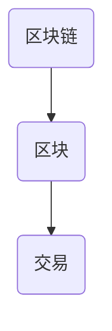

**算法原理讲解：**

比特币的工作原理可以概括为以下几个步骤：

1. **交易发起：**交易发起者将交易数据发送到比特币网络，交易数据包括付款地址、收款地址和交易金额等。
2. **交易验证：**交易接收者收到交易数据后，使用公钥验证交易发起者的签名，确保交易数据的真实性。
3. **区块生成：**当交易数据经过验证后，节点将交易数据打包成一个新的区块，并附上时间戳和随机数。
4. **区块验证：**其他节点收到新区块后，验证区块中的交易数据是否有效，并验证区块的随机数是否符合工作量证明机制。
5. **区块确认：**当新区块被网络中的大多数节点确认后，该区块将被添加到区块链中，交易数据也被永久记录。

**示例说明：**假设A要向B支付1比特币，A将交易数据发送到比特币网络，B收到交易数据后，使用公钥验证A的签名，确认交易数据的真实性。随后，节点将交易数据打包成一个新的区块，并附上时间戳和随机数。其他节点验证新区块的数据和随机数，如果验证通过，新区块将被添加到区块链中，交易数据也被永久记录。

**数学模型和公式：**

1. **工作量证明（PoW）：**节点需要解决一个复杂的数学问题，即找到一个随机数，使得该随机数与区块头的哈希值满足特定条件。通常使用以下公式表示：

   $$H(N) \leq C$$

   其中，$H(N)$ 表示区块头的哈希值，$C$ 表示目标难度。

2. **交易验证：**交易接收者使用公钥验证交易发起者的签名，确保交易数据的真实性。通常使用以下公式表示：

   $$签名(S) = 私钥(SK) \times 消息(M)$$

   其中，$签名(S)$ 表示交易签名，$私钥(SK)$ 表示交易发起者的私钥，$消息(M)$ 表示交易数据。

**Python代码示例：**

```python
import hashlib
import json
from time import time

class Block:
    def __init__(self, index, transactions, timestamp, previous_hash, proofOfWork):
        self.index = index
        self.transactions = transactions
        self.timestamp = timestamp
        self.previous_hash = previous_hash
        self.proofOfWork = proofOfWork
        self.hash = self.compute_hash()

    def compute_hash(self):
        block_string = json.dumps(self.__dict__, sort_keys=True)
        return hashlib.sha256(block_string.encode()).hexdigest()

class Blockchain:
    def __init__(self):
        self.unconfirmed_transactions = []
        self.chain = []
        self.current_transactions = []
        self.node_address = []
        self.create_genesis_block()

    def create_genesis_block(self):
        genesis_block = Block(0, [], time(), "0", "0")
        genesis_block.hash = genesis_block.compute_hash()
        self.chain.append(genesis_block)

    def add_new_transaction(self, transaction):
        self.unconfirmed_transactions.append(transaction)

    def mine_block(self):
        if not self.unconfirmed_transactions:
            return False

        last_block = self.chain[-1]
        last_block_hash = last_block.hash

        proofOfWork = self.proof_of_work(last_block_hash)

        new_block = Block(index=len(self.chain), 
                          transactions=self.current_transactions, 
                          timestamp=time(), 
                          previous_hash=last_block_hash, 
                          proofOfWork=proofOfWork)

        new_block.hash = new_block.compute_hash()
        self.chain.append(new_block)
        self.current_transactions = []
        return new_block

    def proof_of_work(self, last_block_hash):
        proof = 0
        while self.valid_proof(last_block_hash, proof) is False:
            proof += 1
        return proof

    def valid_proof(self, last_block_hash, proof):
        guess = f'{last_block_hash}{proof}'.encode()
        guess_hash = hashlib.sha256(guess).hexdigest()
        return guess_hash[:4] == "0000"

    def add_node(self, node_address):
        self.node_address.append(node_address)

    def resolve_conflicts(self):
        replaced = False
        longest_chain = self.chain
        current_chain = self.chain

        for node in self.node_address:
            response = requests.get(f'http://{node}/chain')
            node_chain = response.json()["chain"]

            if len(node_chain) > len(longest_chain):
                longest_chain = node_chain
                replaced = True

        if replaced:
            self.chain = longest_chain
            self.current_transactions = []

        return replaced
```

**系统分析与架构设计方案：**

**问题场景介绍：**比特币网络是一个去中心化的网络，由多个节点共同维护。每个节点都存储了一份完整的区块链副本，节点之间通过P2P网络进行通讯和数据同步。

**项目介绍：**比特币项目的目标是实现一种去中心化的数字货币，使得交易过程更加安全、高效，且无需中介机构的参与。

**系统功能设计（领域模型）：**

```mermaid
classDiagram
    Transaction <<Interface>>
    Block <<Interface>>
    Blockchain <<Interface>>

    Transaction o--o Block
    Block o--o Blockchain
```

**系统架构设计（架构图）：**

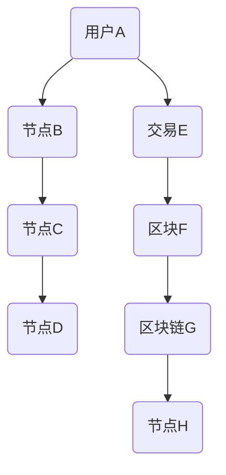

**系统接口设计（接口图）：**

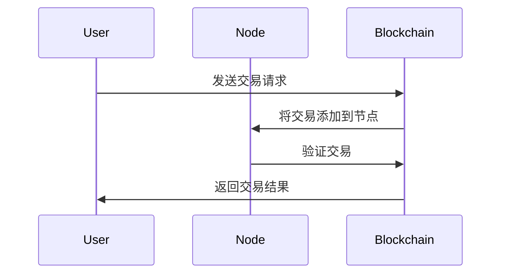

**系统交互（序列图）：**

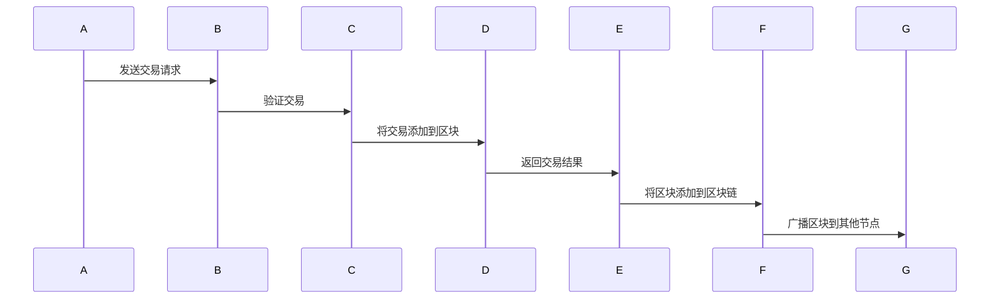

#### 2. 智能合约：自动化合同执行

智能合约是一种自动执行合约条款的计算机程序，它基于区块链技术运行。智能合约的出现使得合同的执行更加高效、透明，减少了人工干预和错误。

**问题背景：**传统合同执行过程中，往往需要人工审核和执行，导致合同执行效率低下，且容易出错。同时，合同条款一旦签署，就难以更改，这可能导致合同的不公平性和争议。

**问题描述：**如何实现一种自动执行合约条款的计算机程序，使得合同执行更加高效、透明，且可以灵活调整？

**问题解决：**智能合约通过区块链技术实现了一种自动执行合约条款的计算机程序。智能合约在区块链上运行，确保合同的执行和执行结果的不可篡改性。智能合约的执行基于编程逻辑，只要满足触发条件，智能合约就会自动执行。

**边界与外延：**智能合约的边界在于其只能在区块链上运行，且只能执行满足编程逻辑的操作。然而，其外延可以扩展到金融、供应链管理、物联网等领域。

**概念结构与核心要素组成：**

1. **智能合约：**智能合约是自动执行合约条款的计算机程序，它基于区块链技术运行，确保合同的执行和执行结果的不可篡改性。
2. **区块链：**智能合约运行在区块链上，确保智能合约的执行和执行结果的不可篡改性。
3. **触发条件：**智能合约的执行基于触发条件，只有当触发条件满足时，智能合约才会执行。

**ER实体关系图架构：**

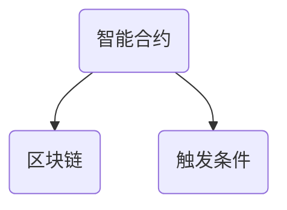

**算法原理讲解：**

智能合约的算法原理可以概括为以下几个步骤：

1. **编写智能合约：**开发者编写智能合约代码，定义触发条件和执行操作。
2. **部署智能合约：**将智能合约代码部署到区块链上，生成智能合约地址。
3. **触发条件：**当触发条件满足时，智能合约会自动执行。
4. **执行操作：**智能合约执行预定义的操作，如转账、记录数据等。

**示例说明：**假设有两个用户A和B，他们之间签订了一份智能合约，约定当A完成某项任务时，B将支付A一定金额的奖金。当A完成任务后，智能合约会自动执行，将奖金从B的账户转移到A的账户。

**数学模型和公式：**

智能合约的数学模型主要包括以下几个方面：

1. **状态机模型：**智能合约可以看作是一个状态机，每个状态表示智能合约的一个状态。智能合约的执行过程可以看作是从初始状态到终止状态的转换。
2. **触发条件：**智能合约的执行基于触发条件，触发条件可以用数学表达式表示。

**Python代码示例：**

```python
class Contract:
    def __init__(self, owner, beneficiary, amount):
        self.owner = owner
        self.beneficiary = beneficiary
        self.amount = amount
        self.state = "Unlocked"

    def execute(self):
        if self.state == "Unlocked":
            self.state = "Locked"
            self.beneficiary.transfer(self.owner, self.amount)
        else:
            raise Exception("Contract already executed")

class Wallet:
    def __init__(self, owner):
        self.owner = owner
        self.balance = 0

    def transfer(self, from_address, to_address, amount):
        if from_address == self.owner and to_address == self.beneficiary:
            self.balance -= amount
            self.beneficiary.balance += amount
        else:
            raise Exception("Invalid transfer")

# 创建钱包和合约实例
wallet_a = Wallet("A")
wallet_b = Wallet("B")
contract = Contract("A", "B", 100)

# 执行合约
contract.execute()

# 检查余额
print(wallet_a.balance)  # 输出：0
print(wallet_b.balance)  # 输出：100
```

**系统分析与架构设计方案：**

**问题场景介绍：**智能合约在区块链上运行，确保合同的执行和执行结果的不可篡改性。智能合约的执行基于编程逻辑，只要满足触发条件，智能合约就会自动执行。

**项目介绍：**智能合约项目旨在实现一种自动执行合约条款的计算机程序，提高合同执行效率、透明度和可靠性。

**系统功能设计（领域模型）：**

```mermaid
classDiagram
    Contract <<Interface>>
    Wallet <<Interface>>

    Contract o--o Wallet
```

**系统架构设计（架构图）：**

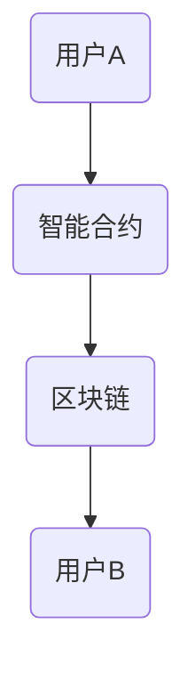

**系统接口设计（接口图）：**

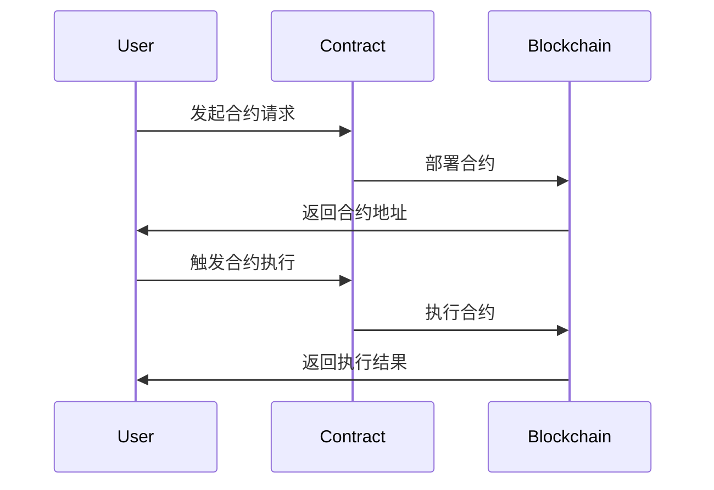

**系统交互（序列图）：**

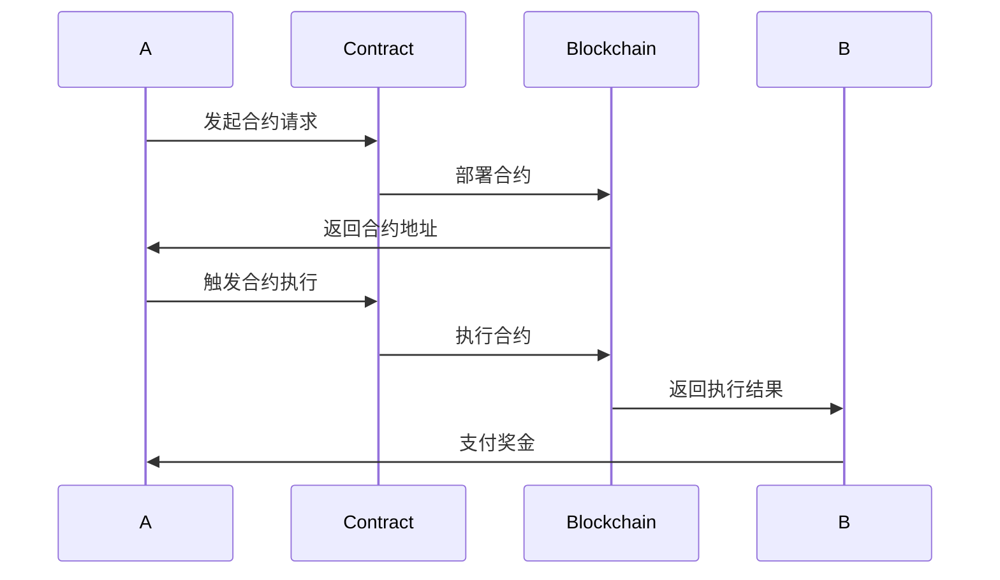

#### 3. 区块链在供应链管理中的应用：沃尔玛的食品供应链追踪

沃尔玛是全球最大的零售商之一，其供应链管理涉及到成千上万的供应商、工厂和分销商。如何确保食品的安全和质量，提高供应链的透明度和效率，是沃尔玛面临的重要挑战。

**问题背景：**传统供应链管理中，数据往往是分散的，不同环节之间的信息无法共享，导致供应链上下游之间的信息不对称。这种信息不对称可能导致供应链管理中的问题无法及时发现和解决。

**问题描述：**如何通过区块链技术提高食品供应链的透明度和效率？

**问题解决：**沃尔玛与IBM合作开发了区块链食品供应链追踪平台，通过区块链技术记录食品供应链信息，提高食品安全和追溯能力。

**边界与外延：**区块链食品供应链追踪平台的边界在于其用于食品供应链管理，可以扩展到其他行业的供应链管理，如药品、化学品等。

**概念结构与核心要素组成：**

1. **区块链：**区块链技术用于记录食品供应链信息，确保数据的透明度和不可篡改性。
2. **智能合约：**智能合约用于自动化执行供应链管理中的操作，如支付、记录等。
3. **供应链参与者：**供应链参与者包括供应商、工厂、分销商和零售商，他们共同参与食品供应链管理。

**ER实体关系图架构：**

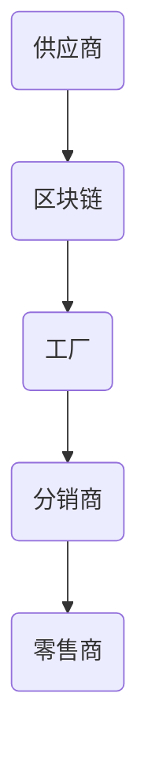

**算法原理讲解：**

区块链食品供应链追踪平台的算法原理可以概括为以下几个步骤：

1. **记录供应链信息：**供应链参与者在区块链上记录食品的生产、运输、销售等信息。
2. **智能合约执行：**智能合约用于自动化执行供应链管理中的操作，如支付、记录等。
3. **查询供应链信息：**用户可以通过区块链查询食品供应链信息，确保数据的透明度和可追溯性。

**示例说明：**假设沃尔玛从一家农场购买了一批水果，农场将水果的生产、运输和销售信息记录到区块链上。当沃尔玛需要查询水果的供应链信息时，可以通过区块链查询水果的详细信息，确保水果的安全和质量。

**数学模型和公式：**

区块链食品供应链追踪平台主要使用区块链技术记录供应链信息，因此其数学模型主要涉及区块链的相关算法，如加密算法、共识算法等。

**Python代码示例：**

```python
# 引入区块链库
from blockchain import Blockchain

# 创建区块链实例
blockchain = Blockchain()

# 添加交易
blockchain.add_transaction("农场", "沃尔玛", 100)

# 添加区块
blockchain.create_block("first message", "previous hash")

# 打印区块链
blockchain.print_chain()
```

**系统分析与架构设计方案：**

**问题场景介绍：**沃尔玛的食品供应链追踪平台通过区块链技术记录食品供应链信息，提高食品安全和追溯能力。

**项目介绍：**沃尔玛与IBM合作开发的区块链食品供应链追踪平台旨在提高食品供应链的透明度和效率。

**系统功能设计（领域模型）：**

```mermaid
classDiagram
    Supplier <<Interface>>
    Factory <<Interface>>
    Distributor <<Interface>>
    Retailer <<Interface>>
    Blockchain <<Interface>>

    Supplier o--o Blockchain
    Factory o--o Blockchain
    Distributor o--o Blockchain
    Retailer o--o Blockchain
```

**系统架构设计（架构图）：**

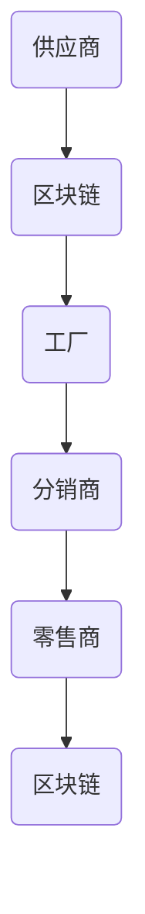

**系统接口设计（接口图）：**

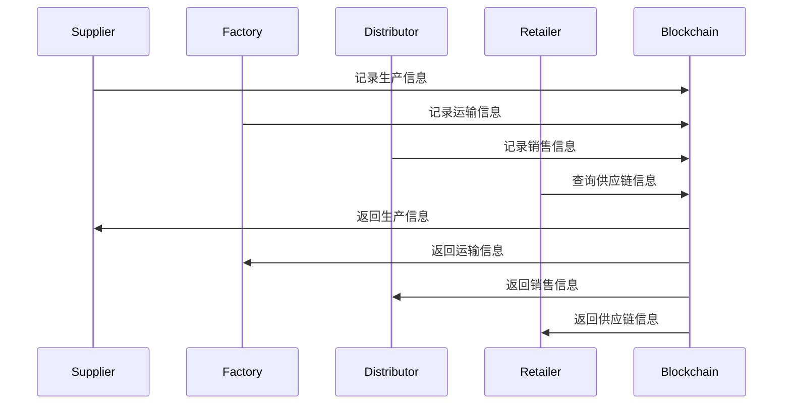

**系统交互（序列图）：**

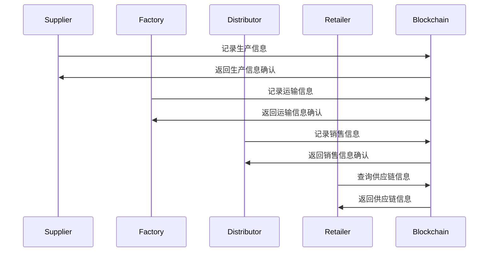

### 4. 最佳实践 tips

在区块链应用开发过程中，遵循以下最佳实践可以帮助提高项目成功率和稳定性：

1. **需求分析：**在开发区块链应用之前，进行详细的需求分析，明确应用的目标、功能和技术需求。
2. **团队建设：**组建一支经验丰富、技术精湛的团队，确保项目能够顺利推进。
3. **技术选型：**选择合适的区块链平台和开发框架，确保项目的性能和可扩展性。
4. **安全防护：**加强区块链应用的安全防护，包括数据加密、访问控制和漏洞修复等。
5. **测试与验证：**进行全面的测试和验证，确保区块链应用的稳定性和可靠性。
6. **持续更新：**定期更新区块链应用，修复漏洞、优化性能，提高用户体验。
7. **合规性审查：**确保区块链应用符合相关法律法规的要求，避免法律风险。

### 5. 小结

本文通过三个实际案例详细分析了区块链技术的应用和实践，包括比特币的去中心化数字货币、智能合约的自动化合同执行以及沃尔玛的食品供应链追踪。这些案例展示了区块链技术在金融、合同执行和供应链管理等领域的重要应用和价值。

然而，区块链技术在实际应用中也面临一些挑战，如数据隐私保护、合规性和监管问题、性能和可扩展性等。因此，在应用区块链技术时，需要充分考虑这些挑战，采取相应的解决方案。

### 6. 注意事项

在应用区块链技术时，需要注意以下事项：

1. **数据隐私保护：**确保用户数据的安全和隐私，避免数据泄露。
2. **合规性和监管问题：**遵守相关法律法规，确保区块链应用符合监管要求。
3. **性能和可扩展性：**优化区块链技术，提高性能和可扩展性，满足应用需求。
4. **安全防护：**加强区块链应用的安全防护，防范黑客攻击和恶意行为。
5. **团队协作：**组建专业团队，确保项目顺利进行。

### 7. 拓展阅读

1. 《区块链：从数字货币到智能合约》
2. 《区块链应用实战》
3. 《智能合约：从基础到高级应用》
4. 《供应链管理：区块链应用案例分析》

作者：AI天才研究院/AI Genius Institute & 禅与计算机程序设计艺术 /Zen And The Art of Computer Programming

----------------------------------------------------------------

### 总结

在本文中，我们详细探讨了区块链在企业应用中的实践与挑战。首先，我们介绍了区块链的基本概念、发展历程和在企业中的重要性。接着，我们深入分析了区块链的核心概念与技术原理，包括分布式账本、加密技术和共识机制。通过实际案例，如比特币、智能合约和沃尔玛的食品供应链追踪，我们展示了区块链技术在金融、合同执行和供应链管理等领域的重要应用。同时，我们也探讨了区块链应用中的实践经验、挑战和可持续发展策略。

区块链技术在企业应用中的前景十分广阔。然而，要实现区块链技术的广泛应用，还需要解决数据隐私保护、合规性和监管问题、性能和可扩展性等挑战。为了推动区块链技术的发展，我们提出了以下建议：

1. **加强技术研发：**提高区块链技术的性能和可扩展性，降低计算资源消耗。
2. **建立完善的法律法规和监管框架：**确保区块链应用的合规性，避免法律风险。
3. **加强人才培养：**提高员工对区块链技术的认知和技能水平，推动区块链技术的普及和应用。
4. **加强国际合作：**推动区块链技术的全球应用和发展。

展望未来，区块链技术将在企业中发挥越来越重要的作用。随着技术的不断发展和应用场景的扩大，区块链技术将成为企业数字化转型的重要工具，为企业带来更高的效率、更安全的数据管理和更智能的业务流程。

### 结论与建议

在本文中，我们详细探讨了区块链技术在企业应用中的实践与挑战。通过对区块链的基本概念、发展历程、核心概念与原理、实际应用案例以及挑战和解决方案的深入分析，我们得出了以下结论：

1. **区块链技术的核心概念与原理：**区块链的核心概念包括分布式账本、加密技术和共识机制。分布式账本确保数据的去中心化和高可靠性，加密技术保障数据的安全性和隐私性，共识机制则确保区块链网络中的数据一致性和可信性。

2. **区块链技术在实际应用中的价值：**区块链技术已被广泛应用于金融、供应链管理、医疗、物联网等领域，提高了交易效率、数据透明度、安全性，降低了成本，推动了产业变革。

3. **区块链应用的挑战：**尽管区块链技术具有巨大的潜力，但在实际应用中仍面临数据隐私保护、合规性和监管问题、性能和可扩展性等挑战。这些问题需要通过技术创新和法规完善来解决。

4. **区块链技术的可持续发展：**为了实现区块链技术的可持续发展，需要在技术、业务和社会层面采取综合措施。技术方面，需要提高区块链技术的性能和可扩展性，加强数据隐私保护。业务方面，需要建立完善的法律法规和监管框架，确保区块链应用的合规性。社会方面，需要加强公众对区块链技术的认知和信任，推动区块链技术的普及和应用。

基于以上结论，我们提出以下建议：

1. **加强技术研发：**企业和研究机构应加大对区块链技术的研发投入，提高区块链技术的性能和可扩展性，降低计算资源消耗，同时加强数据隐私保护。

2. **建立法律法规和监管框架：**政府应加快制定和完善区块链技术的相关法律法规，明确监管责任，确保区块链应用的合规性，同时为区块链技术的发展提供政策支持。

3. **推动人才培养：**高校、培训机构和企业应共同推动区块链技术人才的培养，提高区块链技术的认知和技能水平，为区块链技术的广泛应用提供人才支持。

4. **加强国际合作：**各国政府和行业组织应加强在区块链技术领域的国际合作，共同推动区块链技术的全球应用和发展。

总之，区块链技术在企业应用中的实践与挑战为我们提供了宝贵的经验和启示。随着技术的不断进步和应用的深入，区块链技术将在未来发挥更加重要的作用，推动企业实现更高的效率、更安全的数据管理和更智能的业务流程。我们期待区块链技术能够不断优化和完善，为企业和行业带来更多的机遇和价值。

