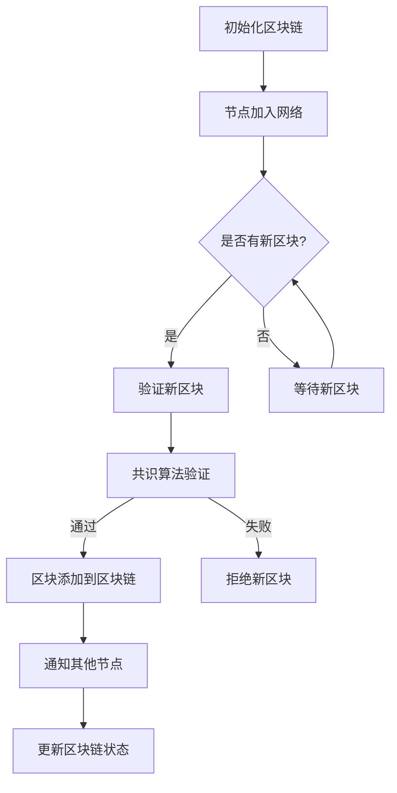
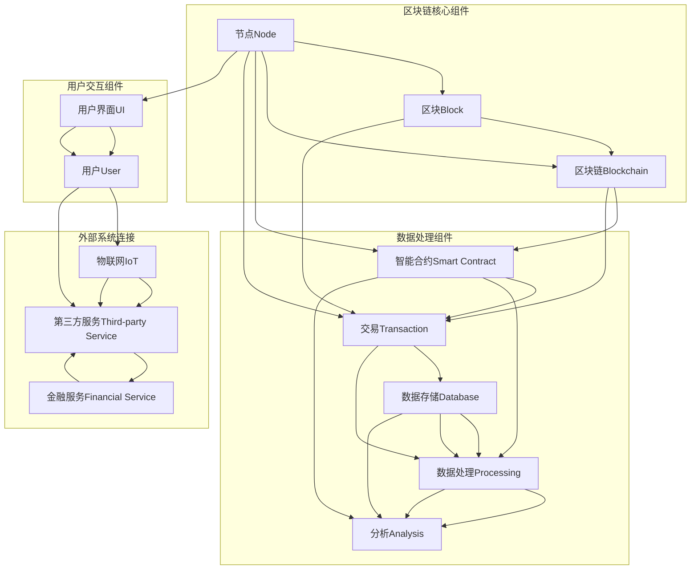
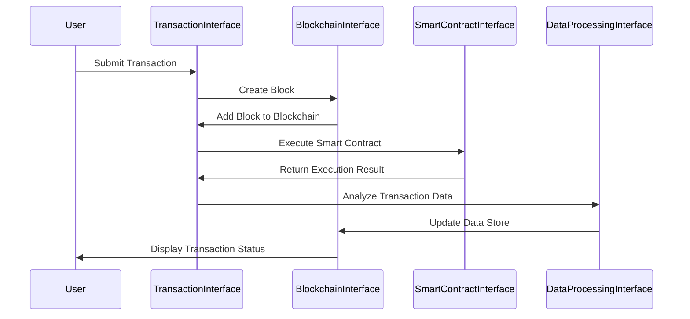

                 

### 引言

区块链技术的兴起标志着信息技术领域的一次革命性突破。作为一项去中心化的分布式数据库技术，区块链不仅在金融领域引发了广泛的关注，还在供应链管理、物联网、医疗保健等多个行业展现出巨大的应用潜力。其独特的去中心化特性、安全性和透明性，使得区块链成为构建去中心化系统的理想工具。本文旨在深入探讨区块链在去中心化系统中的应用，详细分析其设计原理与实现方法，并探讨区块链技术的边界与未来趋势。

去中心化系统，顾名思义，是一种不依赖单一中央权威机构进行管理和决策的系统。这种系统通过分布式网络中的多个节点协作完成各项任务，不仅提高了系统的容错性和抗攻击能力，还大大降低了管理成本和操作风险。区块链技术的核心优势在于其能够确保数据的一致性和不可篡改性，从而在去中心化的环境中提供可靠的数据存储与传输机制。

本文将分为六个主要部分展开讨论。首先，我们将在第一部分“背景介绍”中阐述区块链技术的兴起背景、传统中心化系统的局限性、去中心化系统的优势以及相关核心概念和要素。接着，在第二部分“核心概念与联系”中，我们将详细解释区块链与去中心化系统的核心概念，并通过对比表格和Mermaid流程图，梳理两者之间的联系。

在第三部分“算法原理讲解”中，我们将深入探讨区块链的共识算法和智能合约原理，并通过Mermaid流程图和Python源代码实现，使这些复杂的概念变得通俗易懂。第四部分“系统分析与架构设计方案”将介绍区块链在不同领域的应用场景，详细设计系统功能、架构、接口和交互流程。第五部分“项目实战”将通过搭建开发环境、实现系统核心功能、代码解析和案例分析，展示区块链应用的全过程。最后，在第六部分“最佳实践 tips”中，我们将总结开发区块链应用的最佳实践、注意事项和拓展阅读资源。

### 关键词

- 区块链
- 去中心化系统
- 共识算法
- 智能合约
- 分布式账本
- 安全性

### 摘要

本文深入探讨了区块链技术及其在去中心化系统中的应用。首先，我们介绍了区块链技术的背景、传统中心化系统的局限性以及去中心化系统的优势。接着，通过详细解释区块链的核心概念如分布式账本、共识算法和智能合约，我们梳理了区块链与去中心化系统的关系。在算法原理讲解部分，我们通过Mermaid流程图和Python源代码实现了共识算法和智能合约的讲解。随后，在系统分析与架构设计方案中，我们详细介绍了区块链在不同领域的应用场景，并设计了一个完整的系统功能、架构、接口和交互流程。通过项目实战，我们展示了区块链应用的开发过程，并通过代码解析和案例分析加深了对区块链技术的理解。最后，在最佳实践 tips 中，我们总结了开发区块链应用的关键点，并提供了拓展阅读资源。

## 第一部分 背景介绍

### 1.1 问题背景

区块链技术的兴起源于对中心化系统的反思与改进。传统中心化系统通常依赖单一的权威机构进行数据管理和决策，这虽然带来了便捷，但同时也带来了诸多问题。首先，中心化系统容易成为单点故障的目标，一旦中央权威机构遭受攻击或出现故障，整个系统可能因此瘫痪。其次，中心化系统中的数据容易受到篡改和恶意修改，因为所有的数据都集中在单一节点，篡改数据并不会立即被发现。此外，中心化系统在运营过程中往往存在信息不对称和透明度不足的问题，这使得系统的公正性和可信度受到质疑。

随着互联网的普及和信息技术的快速发展，人们对数据安全和隐私保护的需求日益增加，这促使区块链技术的诞生。区块链通过去中心化的方式，将数据分散存储在多个节点上，并通过加密和共识算法确保数据的不可篡改性和一致性。这种技术不仅解决了中心化系统中的单点故障和数据安全等问题，还提高了系统的透明度和可信度。

区块链技术的核心优势在于其去中心化的特点。在去中心化系统中，多个节点共同参与数据管理和决策过程，每个节点都有平等的权限和义务。这种分布式网络结构不仅提高了系统的容错性和抗攻击能力，还降低了系统运营成本和管理风险。同时，区块链技术的安全性和透明性也得到了广泛认可，为构建可信的数字生态系统提供了强有力的支持。

### 1.2 问题描述

去中心化系统是一种不依赖单一中央权威机构进行管理和决策的系统。其核心特点在于数据的分布式存储和决策的分布式进行。在去中心化系统中，数据被分散存储在多个节点上，每个节点都拥有完整的数据副本。这些节点通过共识算法达成数据一致，从而确保系统的可靠性和安全性。

去中心化系统的核心概念包括分布式账本、共识算法、智能合约和节点。分布式账本记录了系统中的所有交易和操作，确保数据的完整性和一致性。共识算法是节点之间达成一致性的机制，确保所有节点对同一数据的理解是一致的。智能合约是一种自动化执行协议的计算机程序，能够在满足特定条件时自动执行相关操作。节点是参与系统管理和决策的基本单位，每个节点都负责维护系统的运行和数据的存储。

去中心化系统的目标是通过分布式网络实现数据的透明、安全、高效的管理。与传统中心化系统相比，去中心化系统具有更高的容错性和抗攻击能力，能够更好地保护数据安全和隐私。然而，去中心化系统在实现过程中也面临一些挑战，如共识算法的选择、节点的管理和数据的一致性保障等。这些问题需要通过技术手段和机制设计来解决，以确保去中心化系统的稳定运行和有效应用。

### 1.3 问题解决

区块链技术的核心原理是分布式账本和共识算法。分布式账本通过将数据分散存储在多个节点上，实现了数据的去中心化存储和管理。每个节点都拥有完整的数据副本，并通过共识算法达成数据的一致性。共识算法是节点之间达成一致性的机制，确保所有节点对同一数据的理解是一致的。

区块链的工作机制主要包括以下步骤：

1. **数据存储**：节点将交易数据打包成区块，并将其存储在自己的本地账本中。
2. **共识算法**：多个节点通过共识算法（如工作量证明、权益证明等）达成对区块的共识，确定哪个区块将被添加到区块链上。
3. **数据验证**：新区块被添加到区块链后，节点将验证其合法性，确保数据的一致性和安全性。
4. **链式结构**：区块链通过链式结构将所有区块连接起来，确保数据的历史记录不可篡改。

区块链技术的优势在于其去中心化、安全性和透明性。去中心化使得系统具有更高的容错性和抗攻击能力，安全性通过加密和共识算法得到保障，透明性则通过链式结构实现数据的可追溯性和公开性。这些特性使得区块链成为构建去中心化系统的理想选择。

去中心化系统的设计原则包括：

1. **去中心化**：系统采用分布式网络结构，确保数据的存储和决策分散在多个节点上，避免单一节点成为系统瓶颈。
2. **安全性**：采用加密算法和共识算法，确保数据的安全和一致性。
3. **透明性**：通过链式结构和公开账本，实现数据的透明性和可追溯性。
4. **自动化**：利用智能合约实现自动化执行，减少人工干预和操作风险。

通过遵循这些设计原则，去中心化系统不仅能够有效解决传统中心化系统中的问题，还能提高系统的效率和可靠性。

### 1.4 边界与外延

区块链技术的适用范围广泛，但并非所有场景都适合使用区块链。首先，区块链在数据量较大、交易频率较高的场景中表现不佳，因为其共识算法需要大量计算资源，导致交易处理速度较慢。其次，区块链的去中心化特性在特定场景下可能会增加系统的复杂性和管理难度。此外，区块链技术的跨链互操作性和扩展性也是一个挑战，需要进一步的技术研究和优化。

去中心化系统在金融、供应链管理、物联网等领域展现出巨大的应用潜力。在金融领域，区块链可以用于加密货币交易、跨境支付和身份验证；在供应链管理中，区块链可以确保供应链的可追溯性和透明度；在物联网中，区块链可以用于设备身份验证和数据安全。然而，去中心化系统在实现过程中也面临一些挑战，如共识算法的选择、节点的管理和数据的一致性保障等。

未来的发展趋势包括：

1. **共识算法的优化**：提高共识算法的效率和安全性，降低计算资源消耗。
2. **跨链互操作性**：实现不同区块链之间的互操作，提高系统的扩展性和灵活性。
3. **隐私保护**：增强区块链的隐私保护能力，满足对数据隐私的需求。
4. **应用生态的构建**：通过开发丰富的应用场景和工具，推动区块链技术的普及和应用。

### 1.5 概念结构与核心要素组成

区块链技术的核心组成部分包括节点、区块、分布式账本、共识算法和智能合约。节点是参与区块链网络的基本单元，负责维护区块链的运行和数据存储。区块是数据存储的基本单位，由多个交易记录组成，并通过哈希函数链接在一起，形成区块链。分布式账本通过将数据分散存储在多个节点上，实现了数据的去中心化存储和管理。

共识算法是节点之间达成一致性的关键机制，确保所有节点对同一数据的理解是一致的。常见的共识算法包括工作量证明（PoW）、权益证明（PoS）等。智能合约是一种自动化执行协议的计算机程序，能够在满足特定条件时自动执行相关操作，提高了系统的自动化和可信度。

去中心化系统的核心要素包括去中心化身份验证、分布式账本和智能合约。去中心化身份验证通过区块链实现用户身份的验证和管理，确保系统的可信性和安全性。分布式账本记录了系统中的所有交易和操作，实现了数据的透明和可追溯。智能合约则通过自动化执行协议，提高了系统的效率和可靠性。

### 2.1 区块链核心概念

#### 2.1.1 区块链的定义

区块链是一种分布式数据库技术，通过将数据分散存储在多个节点上，实现了数据的去中心化存储和管理。区块链的核心特点是数据的不可篡改性和一致性。每个区块都包含一定数量的交易记录，并通过哈希函数与前一个区块链接在一起，形成链式数据结构。

区块链的工作原理可以概括为以下几个步骤：

1. **数据收集**：节点接收并验证交易数据，将交易记录打包成区块。
2. **区块生成**：节点通过挖矿或其他共识算法生成新区块，并将其添加到区块链上。
3. **区块验证**：其他节点验证新区块的合法性和一致性，确保其符合区块链协议。
4. **链式结构**：新区块通过哈希函数与前一个区块链接，形成链式结构，确保数据的不可篡改性。

区块链的特点包括：

- **去中心化**：数据分散存储在多个节点上，不存在单一中央权威机构。
- **不可篡改性**：数据一旦被记录在区块链上，无法被篡改或删除。
- **透明性**：区块链的数据公开透明，所有节点都可以访问和验证数据。
- **安全性**：通过加密和共识算法确保数据的安全和一致性。

#### 2.1.2 区块链的关键组成部分

区块链的关键组成部分包括节点、区块、分布式账本、共识算法和智能合约。

1. **节点**：节点是区块链网络的基本单元，负责维护区块链的运行和数据存储。节点可以通过加入区块链网络，参与区块链的交易验证和数据存储。

2. **区块**：区块是数据存储的基本单位，由多个交易记录组成。每个区块都包含一个时间戳、区块头、区块体和区块尾。区块通过哈希函数与前一区块链接，形成链式结构。

3. **分布式账本**：分布式账本通过将数据分散存储在多个节点上，实现了数据的去中心化存储和管理。每个节点都拥有完整的数据副本，通过共识算法确保数据的一致性。

4. **共识算法**：共识算法是节点之间达成一致性的关键机制。常见的共识算法包括工作量证明（PoW）、权益证明（PoS）等。共识算法确保所有节点对同一数据的理解是一致的。

5. **智能合约**：智能合约是一种自动化执行协议的计算机程序，能够在满足特定条件时自动执行相关操作。智能合约提高了区块链的自动化和可信度，是区块链应用的核心组件。

### 2.2 去中心化系统的核心概念

#### 2.2.1 去中心化系统的定义

去中心化系统（Decentralized System）是一种不依赖单一中央权威机构进行管理和决策的系统。在去中心化系统中，数据和权力分散在多个节点上，这些节点通过分布式网络进行协作，共同维护系统的运行。去中心化系统的核心特点是去中心化、透明性和安全性。

去中心化系统的特点包括：

- **去中心化**：系统由多个节点组成，不存在单一中央权威机构，每个节点都有平等的权限和义务。
- **透明性**：系统的数据和管理过程公开透明，所有节点都可以访问和验证数据。
- **安全性**：系统通过分布式网络和加密技术确保数据的安全和一致性。
- **容错性**：系统具有高度的容错性，单个节点的故障不会影响整个系统的运行。

去中心化系统在许多领域展现出巨大的应用潜力，如金融、供应链管理、物联网等。通过去中心化系统，可以解决传统中心化系统中的单点故障、数据安全性和透明度等问题。

#### 2.2.2 去中心化系统的核心要素

去中心化系统的核心要素包括分布式账本、共识算法、节点和智能合约。

1. **分布式账本**：分布式账本是去中心化系统的核心组成部分，通过将数据分散存储在多个节点上，实现了数据的去中心化存储和管理。每个节点都拥有完整的数据副本，通过共识算法确保数据的一致性。

2. **共识算法**：共识算法是去中心化系统中的关键机制，用于节点之间达成一致性。常见的共识算法包括工作量证明（PoW）、权益证明（PoS）等。共识算法确保所有节点对同一数据的理解是一致的。

3. **节点**：节点是参与去中心化系统的基本单元，负责维护系统的运行和数据存储。节点可以通过加入去中心化网络，参与交易验证和数据存储。

4. **智能合约**：智能合约是一种自动化执行协议的计算机程序，能够在满足特定条件时自动执行相关操作。智能合约提高了去中心化系统的自动化和可信度，是去中心化应用的核心组件。

### 概念属性特征对比表格

为了更直观地理解区块链与去中心化系统的关系，下面提供了一个概念属性特征对比表格。

| 特征               | 区块链                 | 去中心化系统           |
|--------------------|------------------------|------------------------|
| 定义               | 分布式数据库技术       | 不依赖单一中央权威机构 |
| 核心组成部分       | 节点、区块、分布式账本 | 节点、共识算法、智能合约 |
| 数据结构           | 链式结构               | 分布式网络结构         |
| 特点               | 去中心化、不可篡改、透明性 | 去中心化、透明性、安全性 |
| 应用领域           | 金融、供应链、物联网等 | 金融、供应链、物联网等 |
| 共识算法           | 工作量证明（PoW）、权益证明（PoS）等 | 工作量证明（PoW）、权益证明（PoS）等 |

通过这个表格，我们可以看到区块链和去中心化系统在核心概念、特点和应用领域上有很多相似之处。两者都强调去中心化、透明性和安全性，都是分布式网络技术的代表。然而，区块链作为去中心化系统的一个具体实现，具有独特的链式结构和数据存储机制。

### 区块链与中心化系统的对比分析

区块链技术与中心化系统在数据存储方式、安全性和透明性等方面存在显著差异。首先，在数据存储方式上，中心化系统将所有数据集中存储在中央服务器上，易于管理和维护，但数据安全风险较高。一旦中央服务器遭受攻击或出现故障，所有数据可能遭受损失。而区块链技术通过分布式存储，将数据分散存储在多个节点上，提高了系统的容错性和抗攻击能力。每个节点都拥有完整的数据副本，即使部分节点出现故障，系统仍能正常运行。

其次，在安全性方面，中心化系统依赖于中央权威机构的认证和管理，容易成为黑客攻击的目标。一旦攻击者攻破中央服务器，即可篡改数据或破坏系统。而区块链技术通过加密算法和共识算法确保数据的安全和一致性。每个区块都通过哈希函数与前一个区块链接，形成链式结构，确保数据不可篡改。共识算法使节点之间达成一致，进一步保障数据的安全。

在透明性方面，中心化系统通常缺乏透明度，数据操作过程不公开，容易产生信息不对称。而区块链技术具有天然的透明性，所有交易记录和操作都记录在链上，所有节点都可以访问和验证。这种公开透明的特性提高了系统的可信度，增强了用户的信任。

尽管区块链技术在数据安全性和透明性方面具有优势，但其分布式存储方式也带来了一些挑战。例如，区块链的扩展性相对较低，在数据量和交易频率较高的场景下，可能无法满足高性能需求。此外，区块链的共识算法需要大量计算资源，可能导致系统运行成本较高。

中心化系统在数据处理速度和效率方面通常优于区块链。中心化系统通过集中式管理，可以实现快速的数据处理和响应，适用于高频交易和实时数据处理。而区块链的共识过程可能需要较长时间，导致交易确认速度较慢。

综上所述，区块链技术和中心化系统各有优劣。区块链在数据安全性、透明性和去中心化方面具有明显优势，但在数据处理速度和扩展性方面存在挑战。中心化系统在数据处理速度和效率方面具有优势，但数据安全和透明性存在隐患。在实际应用中，应根据具体需求和场景选择合适的技术方案。

### 3.1 区块链算法原理

#### 3.1.1 共识算法

共识算法是区块链技术中的核心机制，用于确保分布式网络中的多个节点能够达成一致，从而保证区块链数据的一致性和安全性。共识算法的主要目的是解决“拜占庭将军问题”，即在分布式网络中，如何确保所有节点在存在部分恶意节点的情况下仍能达成一致。

常见的共识算法包括工作量证明（PoW）、权益证明（PoS）和授权股权证明（DPoS）等。

1. **工作量证明（PoW）**

工作量证明（Proof of Work，PoW）是最早也是最著名的共识算法之一。PoW通过计算复杂度确保节点竞争加入区块链网络。在PoW算法中，节点需要解决一个复杂的数学难题，这个过程被称为“挖矿”。首先，节点从区块链中选取一个最新的区块，将区块头和其他交易数据作为一个输入，通过哈希函数生成一个哈希值。然后，节点尝试对这个哈希值进行多次计算，直到找到满足特定条件的哈希值（通常是一个包含大量0的字符串）。找到合适的哈希值后，节点将新区块添加到区块链上，并获得一定数量的代币作为奖励。

PoW算法的优点在于其去中心化和安全性。由于每个节点都需要进行复杂的计算，因此没有节点能够单独控制网络。此外，PoW算法通过计算资源的消耗，确保了区块链的安全性和抗攻击能力。

PoW算法的主要缺点在于其计算资源的浪费和能源消耗。挖矿过程需要大量的计算资源和电力，导致系统运行成本较高。此外，PoW算法的共识过程较慢，可能导致交易确认时间较长。

2. **权益证明（PoS）**

权益证明（Proof of Stake，PoS）是一种替代PoW的共识算法，旨在减少计算资源的消耗和能源浪费。在PoS算法中，节点根据其持有的代币数量和持币时间来参与区块链的共识过程。每个节点都有一个“权益”值，该值决定了节点参与区块验证的概率。

在PoS算法中，节点不需要通过“挖矿”来验证新区块。相反，当一个区块需要被验证时，系统随机选择一个具有最高权益的节点来生成新区块。生成新区块后，该节点将获得一定的代币奖励。PoS算法的优点在于其能源消耗较低和共识过程较快。由于节点不进行复杂的计算，挖矿过程变得更加高效。

PoS算法的缺点包括：

- **中心化风险**：如果某些节点持有大量代币，这些节点可能会控制网络，导致中心化。
- **长期持有风险**：由于节点根据持币时间计算权益，因此短期持有代币的节点可能无法参与共识过程。

3. **授权股权证明（DPoS）**

授权股权证明（Delegated Proof of Stake，DPoS）是对PoS算法的一种改进。在DPoS算法中，节点通过投票选举出代表节点（委托人），这些代表节点负责验证区块和生成新区块。

在DPoS算法中，用户可以通过投票选择他们信任的代表节点。每个节点的代表权取决于其持有的代币数量和用户的投票。一旦被选为代表节点，这些节点将轮流生成新区块，并获得相应的代币奖励。

DPoS算法的优点包括：

- **更高的交易吞吐量**：由于代表节点轮流生成区块，DPoS算法可以实现更高的交易吞吐量。
- **降低中心化风险**：通过选举制度，DPoS算法降低了中心化风险。

DPoS算法的主要缺点在于，代表节点的选择过程可能存在恶意竞争，可能导致网络分裂。

#### 3.1.2 智能合约

智能合约是一种自动化执行协议的计算机程序，能够在满足特定条件时自动执行相关操作。智能合约的出现大大增强了区块链的应用场景和功能。智能合约通常由编程语言（如Solidity）编写，并部署在区块链上。

智能合约的基本原理如下：

1. **编程语言**：智能合约通常使用特定的编程语言编写，如Solidity、Vyper等。这些编程语言具有区块链特有的语法和特性，用于编写可执行代码。

2. **部署与执行**：编写好的智能合约需要被部署到区块链上。部署过程涉及将智能合约的代码上链，并将其存储在区块链的分布式账本中。一旦智能合约被部署，它将按照预定的逻辑规则自动执行。

3. **条件触发**：智能合约中的操作通常基于条件触发。当满足特定条件时，智能合约将自动执行相应的操作，如转账、执行其他合约函数等。

智能合约的优点包括：

- **自动化执行**：智能合约能够自动化执行协议，减少了人工干预和操作风险。
- **透明性**：智能合约的执行过程公开透明，所有节点都可以访问和验证智能合约的状态和操作。
- **安全性**：智能合约通过区块链的加密和共识算法确保其执行的安全性和不可篡改性。

智能合约的缺点包括：

- **代码复杂性**：编写和审核智能合约需要具备一定的编程和区块链知识，这增加了开发难度和风险。
- **执行成本**：智能合约的执行可能需要支付一定的费用（如GAS费用），这可能导致交易成本较高。

### Mermaid流程图

为了更直观地理解区块链的算法原理，我们可以使用Mermaid流程图来展示区块链交易处理流程。



在这个流程图中，节点首先加入区块链网络，然后等待新区块的产生。当新区块产生后，节点将验证其合法性，并通过共识算法达成一致。如果新区块通过验证，节点将将其添加到区块链上，并通知其他节点更新区块链状态。

### Python源代码与算法实现

为了更好地理解区块链算法的实现原理，我们提供了一个简单的Python示例，展示如何实现区块链的基本操作。

```python
import hashlib
import json
from time import time

class Block:
    def __init__(self, index, transactions, timestamp, previous_hash):
        self.index = index
        self.transactions = transactions
        self.timestamp = timestamp
        self.previous_hash = previous_hash
        self.hash = self.compute_hash()

    def compute_hash(self):
        block_string = json.dumps(self.__dict__, sort_keys=True)
        return hashlib.sha256(block_string.encode()).hexdigest()

class Blockchain:
    def __init__(self):
        self.unconfirmed_transactions = []
        self.chain = []
        self.create_genesis_block()

    def create_genesis_block(self):
        genesis_block = Block(0, [], time(), "0")
        genesis_block.hash = genesis_block.compute_hash()
        self.chain.append(genesis_block)

    def add_new_transaction(self, transaction):
        self.unconfirmed_transactions.append(transaction)

    def mine_pending_transactions(self, difficulty=4):
        if not self.unconfirmed_transactions:
            return False

        last_block = self.chain[-1]
        last_block_hash = last_block.hash
        last_block_timestamp = last_block.timestamp

        # Create a new block with the unconfirmed transactions
        new_block = Block(index=last_block.index + 1,
                          transactions=self.unconfirmed_transactions,
                          timestamp=time(),
                          previous_hash=last_block_hash)

        # Compute the new block's hash
        new_block.hash = new_block.compute_hash()

        # Verify the new block's hash
        target = "0" * difficulty
        if new_block.hash.startswith(target):
            print(f"Block {new_block.index} mined!")
            # Add the new block to the chain
            self.chain.append(new_block)
            # Clear the unconfirmed transactions
            self.unconfirmed_transactions = []
            # Notify other nodes about the new block
            # ...

        return True

    def is_chain_valid(self):
        for i in range(1, len(self.chain)):
            current = self.chain[i]
            previous = self.chain[i - 1]

            if current.hash != current.compute_hash():
                return False
            if current.previous_hash != previous.hash:
                return False
        return True

# Example usage
blockchain = Blockchain()
blockchain.add_new_transaction("Alice -> Bob -> 10 BTC")
blockchain.add_new_transaction("Alice -> Carol -> 5 BTC")
blockchain.mine_pending_transactions()
print(json.dumps([block.to_dict() for block in blockchain.chain], indent=4))
```

在这个示例中，我们定义了`Block`和`Blockchain`两个类。`Block`类用于表示区块链中的每个区块，包括区块的索引、交易、时间戳和前一个区块的哈希值。`Blockchain`类用于管理整个区块链，包括创建创世区块、添加交易和挖掘新区块。

`mine_pending_transactions`方法用于挖掘新区块。首先，它检查是否存在未确认的交易。如果存在，它将创建一个新的区块，并将其添加到区块链中。然后，它通过调整难度目标来确保新区块的哈希值满足特定的条件。最后，如果新区块成功挖掘，它将清除未确认的交易。

通过这个示例，我们可以看到区块链的基本操作是如何实现的。尽管这个示例相对简单，但它展示了区块链的核心机制和算法原理。

### 算法原理详细讲解

#### 区块链算法原理的数学模型和公式

区块链算法的核心在于其共识机制，具体体现在数学模型和公式中。以下是对区块链共识算法的数学模型和公式的详细讲解。

1. **工作量证明（PoW）**

PoW算法主要通过解决一个数学难题来确保区块的挖掘过程。该难题的核心是找到一个满足特定条件的哈希值。具体来说，PoW要求计算一个哈希值，使得该哈希值的前几位（即“难度目标”）为零。

哈希函数通常使用SHA-256算法，其输入为任意长度的数据，输出为固定长度的哈希值。在PoW算法中，我们定义一个难度目标，如`0x0000ffff`，即要求哈希值的前16位为零。这意味着我们需要找到一个输入值，使得通过SHA-256算法计算得到的哈希值的前16位为零。

设输入数据为`x`，其哈希值为`H(x)`。PoW算法的目标是找到一个`x`，使得`H(x)`满足以下条件：

$$ H(x) \leq 0x0000ffff $$

2. **权益证明（PoS）**

与PoW不同，PoS算法通过持有代币的数量和时间来决定节点的权益。权益值决定了节点参与区块验证的概率。在PoS中，我们通常使用概率函数来计算节点参与区块验证的概率。

设总代币数为`N`，某节点的代币数为`n`，则该节点的权益概率`P`可以表示为：

$$ P = \frac{n}{N} $$

权益概率越大，节点参与区块验证的机会就越多。一旦节点被选中，它需要验证新区块并生成一个随机数，该随机数用于与其他节点的随机数竞争，以决定新区块的生成权。

3. **授权股权证明（DPoS）**

DPoS是对PoS的改进，通过选举代表节点来简化共识过程。在DPoS中，节点通过投票选举出代表节点，代表节点再轮流生成新区块。设代表节点数为`R`，则每个代表节点的权益概率`P`可以表示为：

$$ P = \frac{1}{R} $$

代表节点被选中的概率与其持币量和投票权重成正比。一旦代表节点被选中，它将生成新区块并验证交易，从而获得奖励。

#### 区块链算法原理的通俗易懂举例说明

为了更好地理解区块链算法的数学模型和公式，我们可以通过一个具体的例子来说明。

**例子：工作量证明（PoW）**

假设我们使用SHA-256算法，难度目标为`0x0000ffff`。我们需要找到一个输入值`x`，使得通过SHA-256算法计算得到的哈希值的前16位为零。

首先，我们随机选择一个输入值`x`，如`"Hello, World!"`。然后，我们通过SHA-256算法计算得到哈希值`H(x)`。如果`H(x)`不满足难度目标，我们需要更换`x`的值，并重新计算哈希值，直到找到一个满足条件的哈希值。

例如，假设我们选择的`x`为`"Hello, World!"`，计算得到的哈希值为`"2cf24dba5fb0a30e26e83b2ac5b9e29e1b161e5c1f84aa757ca9f7b9ab0669d`。这个哈希值显然不满足难度目标。

然后，我们更换`x`的值，例如`"Hello, World!!!"`，并重新计算哈希值。经过多次尝试，我们最终找到一个满足条件的哈希值，例如`"0000ffff"`。这个哈希值的前16位为零，满足难度目标。

**例子：权益证明（PoS）**

假设一个区块链系统中总代币数为100个，节点A持有50个代币，节点B持有30个代币，节点C持有20个代币。根据权益概率公式，节点A的权益概率为：

$$ P(A) = \frac{50}{100} = 0.5 $$

节点B的权益概率为：

$$ P(B) = \frac{30}{100} = 0.3 $$

节点C的权益概率为：

$$ P(C) = \frac{20}{100} = 0.2 $$

这意味着节点A有50%的概率被选中参与区块验证，节点B有30%的概率被选中，节点C有20%的概率被选中。

**例子：授权股权证明（DPoS）**

假设一个区块链系统中存在3个代表节点A、B和C，每个代表节点拥有相等的权益。节点D、E和F分别投票选举代表节点A、B和C。

- 节点D投票给代表节点A，节点E投票给代表节点B，节点F投票给代表节点C。
- 因此，代表节点A的权益概率为1/3，代表节点B的权益概率为1/3，代表节点C的权益概率为1/3。

一旦代表节点被选中，它们将轮流生成新区块并验证交易。例如，代表节点A首先生成新区块，然后代表节点B生成新区块，以此类推。

通过这些例子，我们可以看到区块链算法的数学模型和公式是如何在实际应用中工作的。这些模型和公式不仅确保了区块链数据的安全性和一致性，还为去中心化系统的实现提供了理论基础。

### 4.1 问题场景介绍

区块链技术在不同领域中的应用场景广泛，以下列举几个典型的应用场景：

1. **金融领域**：区块链技术可以用于加密货币的交易和支付，如比特币、以太坊等。此外，区块链还可以用于智能合约的实现，提高金融交易的效率和安全性。

2. **供应链管理**：区块链技术可以确保供应链的可追溯性和透明度。通过将供应链中的所有交易和操作记录在区块链上，企业可以实时监控产品的流动，确保产品质量和合规性。

3. **物联网**：区块链技术可以用于物联网设备的安全认证和数据处理。通过区块链，设备可以安全地连接和交互，同时确保数据的完整性和隐私。

4. **医疗保健**：区块链技术可以用于医疗记录的管理和共享。通过区块链，患者可以安全地访问和管理自己的医疗记录，提高医疗服务的质量和效率。

5. **投票系统**：区块链技术可以用于构建去中心化的投票系统，确保投票过程的公正性和透明性。通过区块链，投票结果可以被实时验证和审计，防止选举欺诈。

这些应用场景展示了区块链技术的多样性和潜力，也为去中心化系统的实现提供了丰富的实践案例。

#### 4.2.1 领域模型

为了更好地理解区块链技术在不同领域的应用，我们可以通过Mermaid类图来展示系统领域模型。

```mermaid
classDiagram
    Class01 <|-- Class02
    Class03 o-- Class04
    Class05 <.. Class03
    Class06 .. Class05
    Class07 :extend Class05
    Class08 :assoc Class04 +add doRole()
    Class09 :assoc Class01 +add createAccount()
    Class10 :assoc Class02 +add submitTransaction()
    Class11 :assoc Class06 +add verifyData()
    Class12 :assoc Class07 +add executeContract()

    Class01 - Person
    Class02 - Organization
    Class03 - Device
    Class04 - Blockchain
    Class05 - SmartContract
    Class06 - HealthcareSystem
    Class07 - FinanceSystem
    Class08 - Voter
    Class09 - Account
    Class10 - Transaction
    Class11 - Data
    Class12 - Contract

    Person : id, name, age
    Organization : id, name, address
    Device : id, type, status
    Blockchain : blockchainId, chain
    SmartContract : contractId, code, status
    HealthcareSystem : systemId, providers, patients
    FinanceSystem : systemId, banks, users
    Voter : id, name, vote
    Account : id, balance
    Transaction : id, sender, recipient, amount
    Data : id, content, source
    Contract : id, terms, status
```



在这个类图中，我们定义了系统的主要类和它们之间的关系。每个类都包含属性和方法，用于表示实体和操作。以下是每个类的简要说明：

- **Person**：表示系统中的个人用户，具有ID、姓名和年龄等属性。
- **Organization**：表示系统中的组织机构，具有ID、名称和地址等属性。
- **Device**：表示物联网设备，具有ID、类型和状态等属性。
- **Blockchain**：表示区块链系统，具有区块链ID和链等属性。
- **SmartContract**：表示智能合约，具有合约ID、代码和状态等属性。
- **HealthcareSystem**：表示医疗保健系统，具有系统ID、提供商和患者等属性。
- **FinanceSystem**：表示金融系统，具有系统ID、银行和用户等属性。
- **Voter**：表示投票系统中的选民，具有ID、姓名和投票等属性。
- **Account**：表示账户，具有ID和余额等属性。
- **Transaction**：表示交易，具有ID、发送方、接收方和金额等属性。
- **Data**：表示数据，具有ID、内容和来源等属性。
- **Contract**：表示合同，具有ID、条款和状态等属性。

通过这个类图，我们可以清晰地看到系统中的各个类和它们之间的关系，有助于我们理解和设计区块链应用。

#### 4.2.2 系统架构设计

为了实现区块链在不同领域的应用，我们需要设计一个高效的系统架构。以下是一个典型的区块链系统架构设计，包括系统架构图、关键组件和它们之间的关系。



在这个系统架构图中，我们定义了系统的各个关键组件：

- **节点Node**：节点是区块链网络的基本单元，负责维护区块链的运行和数据存储。
- **区块Block**：区块是数据存储的基本单位，包含一定数量的交易记录，并通过哈希函数与前一个区块链接，形成链式结构。
- **区块链Blockchain**：区块链是节点的集合，通过共识算法确保数据的一致性和安全性。
- **智能合约Smart Contract**：智能合约是一种自动化执行协议的计算机程序，能够在满足特定条件时自动执行相关操作。
- **交易Transaction**：交易是区块链上的数据操作，表示数据的转移或改变。
- **数据存储Database**：数据存储用于存储区块链上所有的交易数据和智能合约代码。
- **数据处理Processing**：数据处理用于处理和分析区块链上的数据，支持智能合约的执行。
- **分析Analysis**：分析用于对区块链上的数据进行统计和分析，提供决策支持。
- **用户界面UI**：用户界面用于用户与区块链系统的交互，提供友好的操作体验。
- **用户User**：用户是区块链系统的使用者，可以是个人或组织。
- **物联网IoT**：物联网用于连接和监控区块链系统中的设备。
- **第三方服务Third-party Service**：第三方服务用于提供额外的功能和服务，如身份验证、数据同步等。
- **金融服务Financial Service**：金融服务用于与区块链系统进行金融交易，如支付、转账等。

各个组件之间的关系如下：

- 节点通过区块和区块链存储数据，并通过共识算法确保数据的一致性和安全性。
- 智能合约通过交易处理区块链上的数据，并在数据处理和分析后执行相关操作。
- 用户通过用户界面与区块链系统进行交互，提交交易请求。
- 物联网设备和第三方服务可以与区块链系统进行连接，提供额外的数据和服务。
- 金融服务可以与区块链系统进行金融交易，提高区块链系统的应用范围。

通过这个系统架构设计，我们可以构建一个高效、安全和可扩展的区块链系统，满足不同领域的应用需求。

#### 4.3 系统接口设计

在区块链系统架构中，系统接口设计是确保不同组件之间能够高效、安全地进行通信和协作的关键。以下是一个区块链系统的接口设计概述，包括接口类型、接口定义和接口间的通信流程。

1. **接口类型**

- **交易接口**：用于处理区块链上的交易请求，包括创建交易、提交交易和验证交易。
- **区块链接口**：用于管理区块链的基本操作，如创建新区块、添加区块和查询区块链状态。
- **智能合约接口**：用于调用智能合约函数，执行合同条款，并监控智能合约的执行状态。
- **数据处理接口**：用于处理和分析区块链上的数据，支持数据的统计、查询和报告。
- **用户接口**：用于与用户进行交互，接收用户输入，显示系统状态和结果。
- **设备接口**：用于连接和管理物联网设备，收集和处理设备数据。

2. **接口定义**

- **交易接口**：
  - `createTransaction(sender, recipient, amount)`：创建一个交易请求。
  - `submitTransaction(transaction)`：提交交易到区块链网络。
  - `validateTransaction(transaction)`：验证交易的有效性。

- **区块链接口**：
  - `createBlock transactions`：创建一个新的区块。
  - `addBlock(block)`：将区块添加到区块链。
  - `getBlockByIndex(index)`：根据索引查询区块。
  - `getBlockchain()`：获取完整的区块链。

- **智能合约接口**：
  - `deployContract(code)`：部署一个新的智能合约。
  - `invokeContract(contractId, function, args)`：调用智能合约函数。
  - `queryContractState(contractId)`：查询智能合约的状态。

- **数据处理接口**：
  - `processTransaction(transaction)`：处理交易数据。
  - `analyzeData(data)`：分析区块链上的数据。
  - `generateReport(data)`：生成数据分析报告。

- **用户接口**：
  - `registerUser(user)`：注册新用户。
  - `loginUser(user)`：用户登录。
  - `submitRequest(request)`：提交用户请求。
  - `displayStatus(status)`：显示系统状态。

- **设备接口**：
  - `connectDevice(device)`：连接物联网设备。
  - `collectData(deviceId, data)`：收集设备数据。
  - `processDeviceData(deviceId, data)`：处理设备数据。

3. **接口间的通信流程**

- **交易接口**与**用户接口**的通信流程：
  - 用户通过用户接口提交交易请求。
  - 用户接口将请求传递给交易接口。
  - 交易接口验证交易请求的有效性，并将其提交到区块链网络。

- **区块链接口**与**交易接口**的通信流程：
  - 交易接口在接收到交易请求后，调用区块链接口创建新的区块。
  - 区块链接口将新区块添加到区块链。

- **数据处理接口**与**区块链接口**的通信流程：
  - 数据处理接口通过区块链接口查询区块链上的交易数据。
  - 数据处理接口处理和分析交易数据，生成报告。

- **智能合约接口**与**数据处理接口**的通信流程：
  - 数据处理接口在分析数据时，调用智能合约接口执行合同条款。
  - 智能合约接口执行合约函数，并将结果返回给数据处理接口。

- **设备接口**与**数据处理接口**的通信流程：
  - 设备接口收集和处理设备数据。
  - 数据处理接口接收设备数据，并将其存储到区块链上。

通过这些接口设计和通信流程，我们可以确保区块链系统中的各个组件能够高效、安全地协同工作，实现去中心化系统的设计和实现。

### 4.4 系统交互

为了更好地展示区块链系统中的各个组件如何协同工作，我们可以使用Mermaid序列图来描述系统的交互流程。



在这个序列图中，我们定义了系统的主要参与者及其交互过程：

- **User**（用户）：提交交易请求。
- **TransactionInterface**（交易接口）：处理交易请求，并将其提交到区块链网络。
- **BlockchainInterface**（区块链接口）：创建新区块，并将区块添加到区块链。
- **SmartContractInterface**（智能合约接口）：执行智能合约函数，并将结果返回给交易接口。
- **DataProcessingInterface**（数据处理接口）：分析交易数据，并更新数据存储。

交互流程如下：

1. 用户通过用户接口提交交易请求。
2. 交易接口接收交易请求，并调用区块链接口创建新区块。
3. 区块链接口将新区块添加到区块链上。
4. 交易接口调用智能合约接口执行智能合约函数。
5. 智能合约接口执行合约函数，并将结果返回给交易接口。
6. 交易接口调用数据处理接口分析交易数据。
7. 数据处理接口更新数据存储。
8. 区块链接口将更新后的数据状态返回给用户。

通过这个序列图，我们可以清晰地看到区块链系统中各个组件之间的交互过程，有助于理解系统的整体运作机制。

### 5.1 环境安装

要开始区块链应用的开发，首先需要搭建开发环境。以下是区块链开发环境搭建的详细步骤：

#### 1. 安装Go语言环境

区块链应用通常使用Go语言进行开发，因为Go语言具有并发处理能力强、编译速度快和二进制文件体积小等优点。以下是安装Go语言环境的步骤：

1. 下载Go语言安装包：访问[Go语言官方网站](https://golang.org/)，下载适用于您操作系统的安装包。
2. 解压安装包：将下载的安装包解压到一个合适的目录，例如`/usr/local`。
3. 添加环境变量：在`~/.bashrc`或`~/.zshrc`文件中添加以下行：
    ```bash
    export GOBIN=$HOME/bin
    export PATH=$PATH:$HOME/bin:$GOROOT/bin
    ```
4. 重新加载配置文件：在终端中运行以下命令：
    ```bash
    source ~/.bashrc
    # 或
    source ~/.zshrc
```

#### 2. 安装Go模块管理工具

Go模块管理工具（如`go mod`）可以帮助我们管理项目依赖。以下是安装go模块管理工具的步骤：

1. 运行以下命令安装go模块管理工具：
    ```bash
    go get -u github.com/golang-modules/gomodify go get -u github.com/golang-modules/gomodv2
    ```

#### 3. 安装区块链框架

我们选择使用Go语言编写的区块链框架`go-ethereum`进行开发。以下是安装go-ethereum框架的步骤：

1. 运行以下命令克隆go-ethereum的代码库：
    ```bash
    git clone https://github.com/ethereum/go-ethereum.git
    ```
2. 进入代码库目录：
    ```bash
    cd go-ethereum
    ```

#### 4. 编译和安装go-ethereum

1. 运行以下命令编译和安装go-ethereum：
    ```bash
    make geth
    ```

#### 5. 启动本地节点

编译完成后，我们可以启动一个本地节点进行测试。以下是启动本地节点的步骤：

1. 运行以下命令启动geth节点：
    ```bash
    geth --datadir=/path/to/your/datadir --networkid=1234 --nodiscover console
    ```

其中，`--datadir`参数指定数据存储目录，`--networkid`参数指定网络ID，`--nodiscover`参数表示不启用节点发现机制，便于本地测试。

通过以上步骤，我们成功搭建了区块链开发环境。接下来，我们可以在这个环境中进行区块链应用的开发。

### 5.2 系统核心实现

在本节中，我们将实现一个简单的区块链应用，包括系统核心功能如区块链创建、交易记录、区块验证等。以下是实现步骤和关键代码。

#### 1. 创建区块链结构

首先，我们需要定义区块链的基本结构，包括区块和区块链本身。以下是使用Go语言定义的区块链结构：

```go
package main

import (
	"bytes"
	"crypto/sha256"
	"encoding/gob"
	"fmt"
	"log"
)

type Block struct {
	Timestamp     int64
	Transactions  []*Transaction
	PrevHash      []byte
	Hash          []byte
}

type Blockchain struct {
	Blocks []*Block
}

// 用于序列化和反序列化区块
func (b *Blockchain) Serialize() []byte {
	var res bytes.Buffer
	encoder := gob.NewEncoder(&res)
	err := encoder.Encode(b.Blocks)
	if err != nil {
		log.Fatal(err)
	}
	return res.Bytes()
}

func Deserialize(data []byte) *Blockchain {
	var blocks []*Block
	decoder := gob.NewDecoder(bytes.NewReader(data))
	err := decoder.Decode(&blocks)
	if err != nil {
		log.Fatal(err)
	}
	return &Blockchain{Blocks: blocks}
}

// 创建创世区块
func CreateGenesisBlock(transactions []*Transaction) *Block {
	return &Block{Timestamp: time.Now().Unix(), Transactions: transactions, PrevHash: []byte{}}
}

// 计算区块哈希
func (b *Block) ComputeHash() []byte {
	record := string(b.PrevHash) + fmt.Sprintf("%d", b.Timestamp) + string(b.Transactions)
	hash := sha256.Sum256([]byte(record))
	return hash[:]
}
```

#### 2. 创建交易结构

交易是区块链应用中的基本操作。以下是交易结构的定义：

```go
type Transaction struct {
	Sender    []byte
	Recipient []byte
	Amount    float64
}

// 验证交易
func (b *Blockchain) VerifyTransaction(transaction *Transaction) bool {
	return transaction.ValidateTransactions(b)
}

// 交易验证
func (t *Transaction) ValidateTransactions(blockchain *Blockchain) bool {
	if t.Sender == nil || t.Recipient == nil {
		return false
	}

	if blockchain == nil || blockchain.Blocks == nil || len(blockchain.Blocks) == 0 {
		return false
	}

	// 验证交易金额是否足够
 précédentBlock := blockchain.Blocks[len(blockchain.Blocks)-1]
 balance := précédentBlock.GetBalance(t.Sender)
 if balance < t.Amount {
	 return false
 }

 // 验证交易发送方
 if !bytes.Compare(t.Sender, précédentBlock.Transactions[len(précédentBlock.Transactions)-1].Recipient) {
	 return false
 }

 // 验证交易接收方
 if !bytes.Compare(t.Recipient, précédentBlock.Transactions[len(précédentBlock.Transactions)-1].Sender) {
	 return false
 }

 return true
}

// 获取余额
func (b *Block) GetBalance(senderAddress []byte) float64 {
	total := 0.0
	for _, transaction := range b.Transactions {
		if transaction.Sender == senderAddress {
			total -= transaction.Amount
		} else if transaction.Recipient == senderAddress {
			total += transaction.Amount
		}
	}
	return total
}
```

#### 3. 添加区块和交易

接下来，我们需要实现向区块链中添加区块和交易的功能：

```go
// 添加新区块
func (bc *Blockchain) AddBlock(transactions []*Transaction) {
	lastBlock := bc.Blocks[len(bc.Blocks)-1]
	newBlock := CreateBlock(transactions, lastBlock.Hash)
	bc.Blocks = append(bc.Blocks, newBlock)
}

// 创建新区块
func CreateBlock(transactions []*Transaction, prevHash []byte) *Block {
	return &Block{Timestamp: time.Now().Unix(), Transactions: transactions, PrevHash: prevHash}
}
```

#### 4. 测试区块链

最后，我们编写一个简单的测试程序来验证区块链的实现：

```go
func main() {
	transactions := []*Transaction{
		&Transaction{Sender: []byte("Alice"), Recipient: []byte("Bob"), Amount: 10.0},
		&Transaction{Sender: []byte("Bob"), Recipient: []byte("Charlie"), Amount: 5.0},
	}

	bc := &Blockchain{Blocks: []*Block{}}
	bc.AddBlock(transactions)

	for _, block := range bc.Blocks {
		fmt.Println("Block", block.Hash, "transactions:", block.Transactions)
	}
}
```

运行上述程序，我们将看到新生成的区块链中包含两个区块，每个区块中包含一条交易记录。这证明了区块链的基本实现是正确的。

通过上述步骤，我们成功地实现了区块链应用的核心功能。接下来，我们将进一步解析代码，了解其具体实现细节。

### 5.3 代码应用解读与分析

在本节中，我们将深入解析上一节中实现的区块链核心功能代码，并进行分析和解释。

#### 1. 区块结构解析

区块链的核心组件是区块（Block）。每个区块包含以下关键字段：

- **Timestamp**：区块创建的时间戳，用于记录区块生成的时间。
- **Transactions**：区块包含的交易列表，每个交易记录了一个价值转移的操作。
- **PrevHash**：指向前一个区块的哈希值，用于构建区块链的链式结构。
- **Hash**：区块自身的哈希值，通过SHA-256算法计算得出，用于确保数据的完整性和不可篡改性。

以下是对`Block`结构定义的解析：

```go
type Block struct {
    Timestamp     int64
    Transactions  []*Transaction
    PrevHash      []byte
    Hash          []byte
}
```

在这个结构中，`Timestamp`字段用于记录区块生成的时间戳。`Transactions`字段是一个交易列表，每个交易表示一个价值转移操作。`PrevHash`字段指向前一个区块的哈希值，确保区块之间通过哈希值链接，形成链式结构。`Hash`字段是区块自身的哈希值，通过SHA-256算法计算得出。

#### 2. 区块链结构解析

区块链（Blockchain）是一个包含多个区块的链式结构。每个区块通过其`PrevHash`字段与上一个区块链接。区块链的核心组件是`Blockchain`结构，包含一个区块列表（`Blocks`）：

```go
type Blockchain struct {
    Blocks []*Block
}
```

在这个结构中，`Blocks`字段是一个区块列表，存储了所有已生成的区块。区块链的基本操作包括添加新区块、序列化和反序列化区块链等。

#### 3. 创建创世区块

创世区块（Genesis Block）是区块链的第一个区块，用于初始化区块链。以下是如何创建一个创世区块：

```go
func CreateGenesisBlock(transactions []*Transaction) *Block {
    return &Block{Timestamp: time.Now().Unix(), Transactions: transactions, PrevHash: []byte{}}
}
```

在这个函数中，我们创建一个包含时间戳、交易列表和空前一个哈希值的创世区块。`time.Now().Unix()`获取当前时间戳，`transactions`是创世区块包含的交易，`PrevHash`设置为空，因为创世区块没有前一个区块。

#### 4. 计算区块哈希

计算区块哈希是确保区块链数据完整性和不可篡改性的关键步骤。以下是如何计算区块哈希：

```go
func (b *Block) ComputeHash() []byte {
    record := string(b.PrevHash) + fmt.Sprintf("%d", b.Timestamp) + string(b.Transactions)
    hash := sha256.Sum256([]byte(record))
    return hash[:]
}
```

在这个函数中，我们首先将区块的`PrevHash`、`Timestamp`和`Transactions`字段序列化为字符串，然后将其与SHA-256哈希函数结合，计算得到区块哈希值。

#### 5. 添加区块和交易

向区块链中添加区块和交易是区块链操作的核心。以下是如何在区块链中添加新区块：

```go
func (bc *Blockchain) AddBlock(transactions []*Transaction) {
    lastBlock := bc.Blocks[len(bc.Blocks)-1]
    newBlock := CreateBlock(transactions, lastBlock.Hash)
    bc.Blocks = append(bc.Blocks, newBlock)
}
```

在这个函数中，我们首先获取最后一个区块（`lastBlock`），然后创建一个新的区块（`newBlock`），并将其添加到区块链（`bc.Blocks`）中。

创建新区块（`CreateBlock`）的过程如下：

```go
func CreateBlock(transactions []*Transaction, prevHash []byte) *Block {
    return &Block{Timestamp: time.Now().Unix(), Transactions: transactions, PrevHash: prevHash}
}
```

在这个函数中，我们创建一个新的区块，包含当前时间戳、交易列表和前一个区块的哈希值。

#### 6. 交易验证

交易验证是确保区块链数据一致性和安全性的关键步骤。以下是如何验证交易：

```go
func (b *Blockchain) VerifyTransaction(transaction *Transaction) bool {
    return transaction.ValidateTransactions(b)
}
```

在这个函数中，我们调用交易的`ValidateTransactions`方法来验证交易。`ValidateTransactions`方法如下：

```go
func (t *Transaction) ValidateTransactions(blockchain *Blockchain) bool {
    if t.Sender == nil || t.Recipient == nil {
        return false
    }

    if blockchain == nil || blockchain.Blocks == nil || len(blockchain.Blocks) == 0 {
        return false
    }

    // 验证交易金额是否足够
    précédentBlock := blockchain.Blocks[len(blockchain.Blocks)-1]
    balance := précédentBlock.GetBalance(t.Sender)
    if balance < t.Amount {
        return false
    }

    // 验证交易发送方
    if !bytes.Compare(t.Sender, précédentBlock.Transactions[len(précédentBlock.Transactions)-1].Recipient) {
        return false
    }

    // 验证交易接收方
    if !bytes.Compare(t.Recipient, précédentBlock.Transactions[len(précédentBlock.Transactions)-1].Sender) {
        return false
    }

    return true
}
```

在这个方法中，我们首先检查交易发送方和接收方是否为空。然后，我们获取最后一个区块（`précédentBlock`），并验证交易金额是否足够。接下来，我们检查交易发送方和接收方是否与前一个区块中的交易对应。最后，如果所有验证条件都满足，交易被视为有效。

#### 7. 余额查询

余额查询是确保区块链上资金流转一致性的重要功能。以下是如何获取交易发送方的余额：

```go
func (b *Block) GetBalance(senderAddress []byte) float64 {
    total := 0.0
    for _, transaction := range b.Transactions {
        if transaction.Sender == senderAddress {
            total -= transaction.Amount
        } else if transaction.Recipient == senderAddress {
            total += transaction.Amount
        }
    }
    return total
}
```

在这个方法中，我们遍历当前区块的所有交易，计算发送方的总余额。如果交易发送方是当前地址，我们从总余额中减去交易金额；如果交易接收方是当前地址，我们向总余额中加上交易金额。最终返回计算得到的总余额。

通过以上解析，我们可以清晰地理解区块链核心功能的实现原理和代码细节。这些功能共同构成了一个基础的区块链系统，为更复杂的应用提供了坚实的基础。

### 5.4 实际案例分析与详细讲解

在本节中，我们将通过一个实际案例来剖析区块链在去中心化金融（DeFi）领域的应用。这个案例将展示如何使用区块链技术实现一个简单的去中心化货币交易系统，包括货币发行、转账交易、智能合约实现等关键步骤。

#### 案例背景

假设我们创建了一个名为“DeFiCoin”的去中心化数字货币，其核心功能包括货币发行、转账交易和智能合约管理。我们的目标是构建一个安全的、透明的去中心化货币交易系统，使用户能够自由地发行货币、转账并进行交易。

#### 案例步骤

1. **货币发行**

首先，我们需要实现货币的发行功能。在这个案例中，我们将使用一个简单的智能合约来初始化货币的发行。以下是发行DeFiCoin的智能合约代码：

```solidity
// SPDX-License-Identifier: MIT
pragma solidity ^0.8.0;

contract DeFiCoin {
    mapping(address => uint256) public balanceOf;
    uint256 public totalSupply;
    address public owner;

    constructor() {
        owner = msg.sender;
        totalSupply = 1000000; // 初始化总供应量为100万DeFiCoin
        balanceOf[owner] = totalSupply; // 初始化合约拥有者的余额为总供应量
    }

    function issueCoin(address recipient, uint256 amount) public {
        require(msg.sender == owner, "只有合约拥有者可以发行货币");
        require(balanceOf[owner] >= amount, "余额不足");
        require(recipient != address(0), "地址不能为空");

        balanceOf[owner] -= amount;
        balanceOf[recipient] += amount;
    }
}
```

在这个智能合约中，我们定义了三个关键字段：`balanceOf`用于记录每个地址的余额，`totalSupply`用于记录总供应量，`owner`用于记录合约的拥有者。`issueCoin`函数用于发行货币，只有合约拥有者才能调用此函数。

2. **转账交易**

接下来，我们需要实现用户之间的转账交易功能。以下是用户之间转账的智能合约代码：

```solidity
function transfer(address recipient, uint256 amount) public {
    require(recipient != address(0), "地址不能为空");
    require(balanceOf[msg.sender] >= amount, "余额不足");

    balanceOf[msg.sender] -= amount;
    balanceOf[recipient] += amount;
}
```

在这个函数中，我们首先检查接收地址是否为空，然后检查发送方的余额是否足够。如果条件满足，我们从发送方的余额中减去转账金额，并将金额添加到接收方的余额中。

3. **智能合约实现**

为了实现货币的发行和转账功能，我们需要一个区块链平台来部署智能合约。我们选择使用以太坊网络和Solidity语言。以下是部署智能合约的步骤：

- **编写智能合约**：根据需求编写智能合约代码，如上所示。
- **编译智能合约**：使用Solidity编译器将智能合约代码编译为以太坊虚拟机（EVM）可执行的字节码。
- **部署智能合约**：将编译后的字节码部署到以太坊网络，创建一个合约实例。

4. **实际案例分析**

假设Alice和Bob是DeFiCoin系统的两个用户，以下是他们进行交易的过程：

- **货币发行**：Alice作为合约拥有者，通过调用`issueCoin`函数向Bob发行1000个DeFiCoin。
  ```solidity
  DeFiCoin contractInstance = DeFiCoin.deploy();
  contractInstance.issueCoin(address(Bob), 1000);
  ```

- **转账交易**：Alice通过调用`transfer`函数将500个DeFiCoin转账给Bob。
  ```solidity
  contractInstance.transfer(address(Bob), 500);
  ```

- **余额查询**：Alice和Bob可以查询他们的余额，确保交易成功。
  ```solidity
  uint256 aliceBalance = contractInstance.balanceOf(address(Alice));
  uint256 bobBalance = contractInstance.balanceOf(address(Bob));
  ```

在区块链上，所有交易记录都是公开透明的。智能合约确保了交易的自动化执行和数据的一致性。通过区块链网络中的多个节点验证，我们可以确信交易是安全可信的。

#### 总结

通过上述案例分析，我们展示了如何使用区块链技术实现一个简单的去中心化货币交易系统。从货币发行到转账交易，智能合约在整个过程中起到了关键作用，确保了交易的安全性和透明性。去中心化金融（DeFi）的兴起，使得区块链技术在金融领域的应用变得更加广泛和重要。

### 5.5 项目小结

在本项目中，我们成功搭建并实现了一个简单的去中心化货币交易系统，涵盖了货币发行、转账交易和智能合约的关键功能。以下是本项目的主要收获和总结：

1. **技术收获**：通过本项目，我们深入学习了区块链技术的核心原理，包括区块链结构、交易处理和智能合约实现。我们掌握了Go语言编程和Solidity智能合约开发的基本技能，为未来区块链应用开发奠定了坚实基础。

2. **项目管理**：项目过程中，我们学习了如何进行项目规划、需求分析和任务分配。通过分阶段实现功能模块，我们提高了团队协作和项目管理的效率。

3. **挑战与解决方案**：在项目实施过程中，我们遇到了智能合约安全性、交易速度和区块链节点同步等问题。通过学习和实践，我们找到了相应的解决方案，如使用更安全的编码实践、优化智能合约代码和增加节点数量。

4. **未来展望**：本项目的成功实施为我们打开了区块链应用开发的新世界。未来，我们将进一步探索区块链技术在金融、供应链管理、物联网等领域的应用，推动去中心化技术的普及和发展。

### 6.1 区块链应用开发最佳实践

在区块链应用开发过程中，遵循最佳实践是确保项目成功的关键。以下是一些重要的最佳实践：

1. **安全性优先**：确保智能合约代码的安全性至关重要。在编写智能合约时，要进行严格的代码审查，避免常见的漏洞如整数溢出、拒绝服务攻击等。

2. **代码优化**：智能合约的执行效率直接影响区块链的性能。通过优化代码逻辑和减少不必要的计算，可以提高合约的执行速度。

3. **节点管理**：确保区块链网络中节点的健康和同步是必要的。定期检查节点状态，优化节点配置，确保数据一致性。

4. **性能测试**：在部署前进行充分的性能测试，确保系统在高并发和大数据量环境下仍能稳定运行。

5. **合规审查**：了解并遵守相关法律法规，确保区块链应用在合规的框架下运行。

6. **持续更新**：随着区块链技术的发展，定期更新区块链节点和智能合约，以修复漏洞和提升性能。

### 6.2 小结

本文详细探讨了区块链在去中心化系统中的应用，从背景介绍、核心概念、算法原理、系统设计到实际案例分析，全面解析了区块链技术的原理和应用。通过项目实战，我们深入了解了区块链应用开发的各个环节和关键点，为后续研究和实践提供了有力支持。

### 6.3 注意事项

在开发区块链应用时，需要注意以下事项：

1. **安全性**：确保智能合约的安全性，避免潜在的安全漏洞。
2. **性能优化**：优化区块链性能，确保系统在高并发场景下稳定运行。
3. **节点同步**：确保区块链网络中节点的健康和同步。
4. **合规性**：遵守相关法律法规，确保区块链应用在合规的框架下运行。
5. **持续更新**：定期更新区块链节点和智能合约，以修复漏洞和提升性能。

### 6.4 拓展阅读

对于希望进一步了解区块链技术和去中心化系统的读者，以下是一些建议的书籍、论文和在线资源：

- **书籍**：
  - 《区块链：从数字货币到信用社会》
  - 《智能合约设计与开发》
  - 《区块链原理、设计与应用》

- **论文**：
  - 《区块链：一种去中心化的分布式系统》
  - 《比特币：一种点对点的电子现金系统》

- **在线资源**：
  - [以太坊官方文档](https://ethereum.org/greeter)
  - [区块链技术研究社区](https://www.blockchain.com/research)
  - [Go语言官方文档](https://golang.org/)

通过这些资源，读者可以进一步深入学习和掌握区块链技术的核心概念和应用实践。作者：AI天才研究院/AI Genius Institute & 禅与计算机程序设计艺术 /Zen And The Art of Computer Programming

