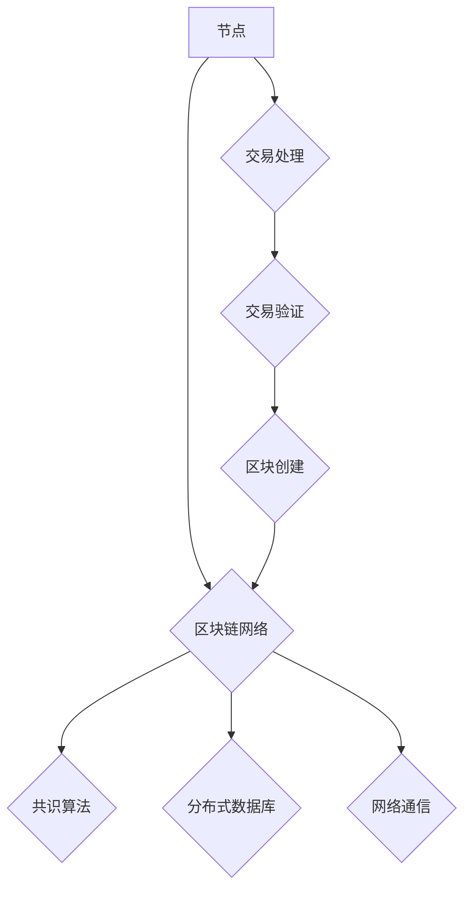
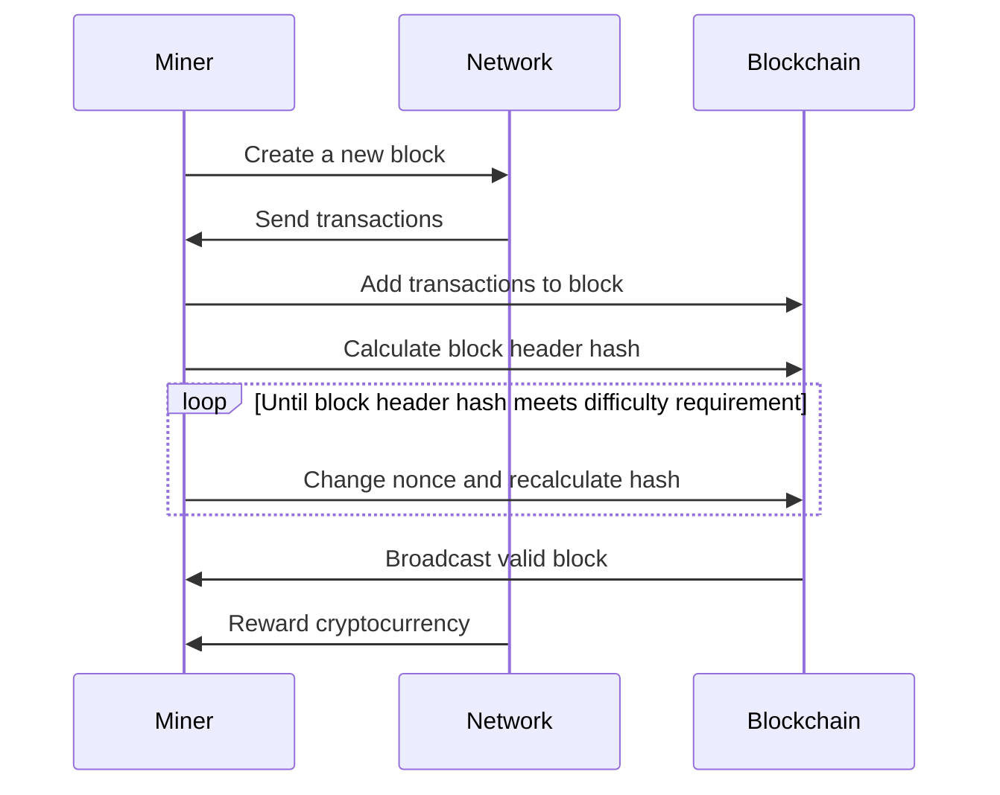
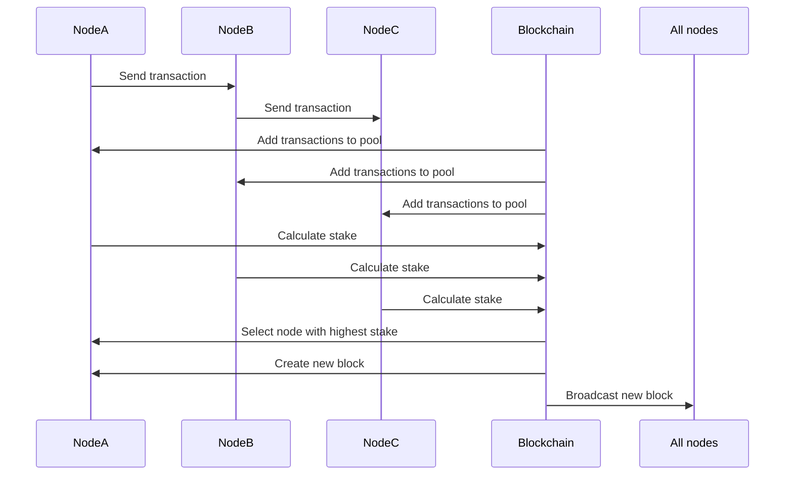
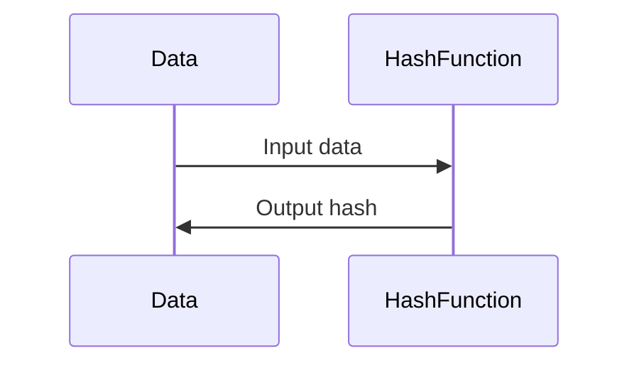
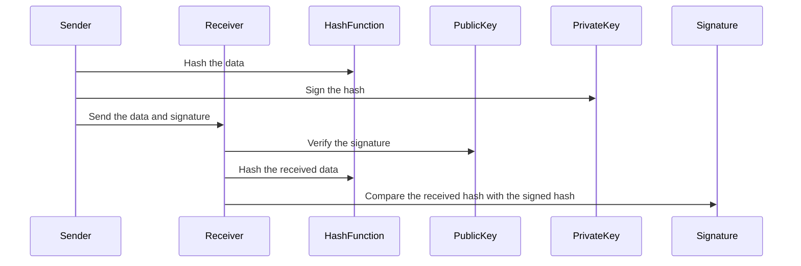

                 

### 摘要

本文将深入探讨区块链技术的核心概念、算法原理、系统设计与应用开发，旨在为读者提供一份全面且实用的去中心化应用开发指南。区块链技术作为一种革命性的分布式数据库技术，自2008年比特币诞生以来，已迅速成为金融科技、供应链管理、物联网等多个领域的热点。本文首先回顾了区块链的起源与发展，接着详细介绍了其基本概念与核心组成部分。随后，文章重点讲解了区块链的共识算法，如工作量证明（PoW）和权益证明（PoS），并使用Python代码和LaTeX数学公式深入剖析了算法原理。接着，文章从系统分析与架构设计角度出发，展示了区块链系统的设计与实现过程，并通过实际项目实战，提供了从环境搭建到核心代码实现的详细步骤。最后，文章总结了区块链技术的应用与挑战，并提供了一系列最佳实践和拓展阅读资源。通过本文的阅读，读者将能够系统地了解区块链技术，掌握其开发与应用的关键技能。

### 第一部分：区块链技术概述

#### 第1章：区块链技术背景与基础

#### 1.1 区块链的起源与发展

区块链技术的起源可以追溯到2008年，当时一位名为中本聪（Satoshi Nakamoto）的匿名人物发布了一篇题为《比特币：一种点对点的电子现金系统》（Bitcoin: A Peer-to-Peer Electronic Cash System）的论文。这篇论文首次提出了区块链技术的概念，并在此基础上开发了比特币——一种去中心化的数字货币。这一创新性技术迅速引起了全球关注，并逐渐从金融领域扩展到其他行业。

区块链技术的基础发展历程可以分为几个关键阶段：

1. **2008-2011年**：比特币诞生与早期社区发展
   - 2008年，中本聪发布了比特币白皮书，并在次年创建了第一个比特币节点。
   - 2010年，比特币价格首次突破1美元，引发市场关注。
   - 早期社区开始探索区块链技术的其他潜在应用。

2. **2011-2014年**：区块链技术的发展与应用探索
   - 2011年，比特币交易所Mt. Gox成立，标志着比特币进入商业化阶段。
   - 2013年，以太坊（Ethereum）的提出，扩展了区块链的应用范围，使其不仅仅局限于数字货币。

3. **2014-2017年**：区块链技术的爆发式发展
   - 2014年，首次区块链峰会（Blockchain Conference）召开，标志着区块链技术的正式登场。
   - 2015年，区块链技术开始应用于供应链管理、金融服务等多个领域。
   - 2016年，全球多个国家开始制定区块链相关法规和政策。
   - 2017年，数字货币市场经历了一次剧烈的波动，但区块链技术的潜力依然被广泛认可。

4. **2018年至今**：区块链技术的深化应用与行业整合
   - 2018年，区块链技术在全球范围内的应用进一步深化，包括政府、银行、医疗等多个行业。
   - 2019年，各国政府和企业开始加大对区块链技术的投资和研发。
   - 2020年，区块链技术继续在金融、物联网、供应链等领域的广泛应用。

区块链技术的起源与发展，不仅推动了数字货币的发展，也推动了分布式存储、智能合约等技术的进步。随着技术的不断成熟，区块链技术将在未来继续发挥重要作用，成为构建去中心化应用的核心基础。

#### 1.2 区块链的基本概念

区块链是一种分布式数据库技术，其核心在于数据的不可篡改性和去中心化的特性。要理解区块链技术，我们需要从以下几个基本概念入手：

1. **区块链（Blockchain）**：
   - 区块链是一个由多个区块（Block）按时间顺序链接而成的数据结构。
   - 每个区块包含一组交易记录，以及一个时间戳和前一个区块的哈希值，确保区块之间的链接性。

2. **区块（Block）**：
   - 区块是区块链的基本单位，包含交易数据和其他一些元数据。
   - 每个区块有一个固定的最大大小，当区块填满后，一个新的区块将被创建。

3. **链（Chain）**：
   - 区块链得名于这些区块按照特定顺序链接形成的链式结构。
   - 链上的每个区块都包含了前一个区块的哈希值，确保了区块链的不可篡改性。

4. **节点（Node）**：
   - 区块链网络中的每个计算机或服务器都可以被称为一个节点。
   - 节点负责验证和存储区块链数据，并在网络中传播新的区块。

5. **交易（Transaction）**：
   - 交易是指区块链中的数据传输过程，通常涉及货币或其他价值的转移。
   - 交易被编码成交易数据，存储在区块中。

6. **哈希（Hash）**：
   - 哈希函数是一种将任意长度数据映射为固定长度字符串的算法。
   - 区块链中的每个区块都包含一个哈希值，用于验证区块的有效性。

7. **共识算法（Consensus Algorithm）**：
   - 共识算法是区块链网络中节点达成一致的方式。
   - 如工作量证明（PoW）和权益证明（PoS）等算法确保区块链的可靠性和安全性。

通过理解这些基本概念，我们可以更好地把握区块链技术的工作原理和应用场景。在接下来的章节中，我们将深入探讨区块链的核心组成部分，如共识算法和数学模型，为全面理解区块链技术奠定基础。

#### 1.3 区块链与传统中心化系统的对比

区块链技术与传统中心化系统在架构和运作机制上有显著差异，这些差异不仅影响了系统的性能和安全性，还决定了其适用场景。以下是区块链与传统中心化系统的主要对比：

1. **架构对比**：

   - **区块链**：分布式系统，由多个节点组成，每个节点都保存一份完整的数据副本，无需依赖中心化权威机构。
   - **传统中心化系统**：集中式系统，数据存储在中心服务器上，由单一机构控制和管理，易成为单点故障的目标。

2. **数据存储对比**：

   - **区块链**：采用分布式存储，每个节点都存储完整的数据副本，实现数据冗余和去中心化。
   - **传统中心化系统**：数据集中存储，存在数据丢失或被篡改的风险。

3. **交易确认对比**：

   - **区块链**：交易确认依赖于共识算法，通常需要多个节点验证和同意，确认时间较长。
   - **传统中心化系统**：交易确认由中心服务器处理，确认速度快。

4. **安全性对比**：

   - **区块链**：基于密码学和共识算法，具有较高的安全性，但能源消耗较大。
   - **传统中心化系统**：安全性依赖于中心化机构的措施，可能存在信任风险。

5. **透明度和可追溯性对比**：

   - **区块链**：所有交易记录都是公开透明的，每个参与者都可以查询和验证。
   - **传统中心化系统**：交易记录通常不公开，信息透明度较低。

6. **去中心化程度对比**：

   - **区块链**：去中心化，网络中的每个节点都有平等的权利和义务。
   - **传统中心化系统**：中心化，权力和责任集中在少数机构手中。

通过对比，我们可以看到区块链技术在去中心化、透明度和安全性方面具有显著优势，但在交易速度和效率上可能存在劣势。理解这些差异有助于我们根据具体需求选择合适的技术方案。

#### 1.4 区块链的架构图与实体关系图

为了更直观地理解区块链的架构和工作原理，我们可以通过绘制架构图和实体关系图来展示其核心组成部分和相互关系。以下使用Mermaid语法描述这些图形。

##### 1.4.1 区块链的基本架构图



在这个基本架构图中，节点（A）是区块链网络的核心组成部分，它们通过共识算法（C）和网络通信（E）协同工作。每个节点都参与交易处理（F）、交易验证（G）和区块创建（H），最终将数据存储在分布式数据库（D）中。

##### 1.4.2 区块链的实体关系图

```mermaid
erDiagram
    Node ||--|{ BlockchainNetwork }
    BlockchainNetwork ||--|{ ConsensusAlgorithm }
    BlockchainNetwork ||--|{ DistributedDatabase }
    BlockchainNetwork ||--|{ NetworkCommunication }
    Node ||--|{ TransactionProcessing }
    TransactionProcessing ||--|{ TransactionVerification }
    TransactionVerification ||--|{ BlockCreation }
```

在这个实体关系图中，节点（Node）与区块链网络（BlockchainNetwork）中的其他实体（共识算法、分布式数据库、网络通信）之间存在明确的关联。交易处理（TransactionProcessing）、交易验证（TransactionVerification）和区块创建（BlockCreation）是节点在区块链网络中执行的主要功能。

通过这些Mermaid图形，我们可以更清晰地了解区块链的架构和实体关系，从而更好地理解和应用区块链技术。

### 第二部分：区块链技术核心原理

#### 第2章：区块链的核心算法

区块链技术的核心算法是实现其去中心化、安全性和不可篡改性的关键。本章将详细介绍两种主要的共识算法：工作量证明（Proof of Work，PoW）和权益证明（Proof of Stake，PoS），以及区块链中常用的哈希函数和数字签名。

#### 2.1 工作量证明（PoW）算法

工作量证明（PoW）是最早用于实现区块链共识的算法，由中本聪在比特币白皮书中提出。PoW算法的核心思想是：网络中的节点通过解决一个计算难题来证明其工作，从而获得记账权。以下是PoW算法的基本原理和流程：

##### 2.1.1 PoW算法原理

1. **计算难题**：
   PoW算法的核心是解决一个计算难题，通常是一个哈希函数。节点需要找到一个随机数（nonce），使得区块头（包含交易数据和随机数）的哈希值满足特定的难度要求。

2. **难度调整**：
   网络会根据一段时间内产生的区块数量自动调整计算难度，以保持区块生成速度恒定。如果生成的区块速度过快，难度会增加；反之，难度会降低。

3. **奖励机制**：
   成功解决计算难题的节点将获得一定数量的加密货币作为奖励，这激励节点积极参与网络。

##### 2.1.2 PoW算法流程图



在这个流程图中，矿工（Miner）创建一个新的区块，并从网络（Network）获取交易。矿工将这些交易添加到区块中，并计算区块头的哈希值。如果哈希值不满足难度要求，矿工会不断改变随机数（nonce），直到找到满足条件的哈希值。一旦找到，矿工将广播有效的区块，并获得网络的奖励。

##### 2.1.3 Python代码示例

```python
import hashlib
import json
from time import time

difficulty = 4  # 设置计算难度
block_header = {
    'transactions': [],
    'timestamp': time(),
    'nonce': 0
}

def calculate_hash(block):
    block_string = json.dumps(block, sort_keys=True)
    return hashlib.sha256(block_string.encode()).hexdigest()

def mine_block():
    while True:
        block_header['nonce'] += 1
        hash = calculate_hash(block_header)
        if hash.startswith('0' * difficulty):
            return hash
        print(f"Hash: {hash}, Difficulty: {'0' * difficulty}")

hash = mine_block()
print(f"Mine block with hash: {hash}")
```

在这个Python代码示例中，我们定义了一个`calculate_hash`函数用于计算区块头的哈希值，并设置了一个`difficulty`参数用于控制计算难度。`mine_block`函数不断尝试改变随机数（nonce），直到找到满足条件的哈希值。一旦找到，函数将返回有效的哈希值。

#### 2.2 权益证明（PoS）算法

权益证明（PoS）算法是PoW算法的一种替代方案，其核心思想是节点的记账权与其持有的代币数量和持有时间成正比。PoS算法的目标是减少能源消耗，并提高网络的公平性。以下是PoS算法的基本原理和流程：

##### 2.2.1 PoS算法原理

1. **权益计算**：
   节点的权益（Stake）由其持有的代币数量（Coin）和持有时间（Time）决定。权益越大，节点成为记账者的概率越高。

2. **选举机制**：
   网络通过随机或轮换机制选择具有最高权益的节点作为记账者，这些节点将被选举为区块产生者。

3. **奖励机制**：
   被选为记账者的节点将获得区块奖励，这激励节点保持网络的稳定和安全。

##### 2.2.2 PoS算法流程图



在这个流程图中，节点A、节点B和节点C向区块链网络发送交易。区块链网络将这些交易添加到交易池中。然后，网络计算每个节点的权益，并选择权益最高的节点（如节点A）作为记账者。节点A创建一个新的区块，并将交易记录包含在内，最后广播给所有节点。

##### 2.2.3 Python代码示例

```python
import random
from datetime import datetime

class Node:
    def __init__(self, coin, timestamp):
        self.coin = coin
        self.timestamp = timestamp
        self.stake = self.coin * (datetime.now() - self.timestamp).total_seconds()

def calculate_stake(nodes):
    sorted_nodes = sorted(nodes, key=lambda x: x.stake, reverse=True)
    return sorted_nodes[0]

def create_block(transaction_pool, last_block):
    node = calculate_stake(nodes)
    block = {
        'transactions': transaction_pool,
        'timestamp': datetime.now(),
        'last_hash': last_block['hash']
    }
    block['hash'] = calculate_hash(block)
    return block

def calculate_hash(block):
    block_string = json.dumps(block, sort_keys=True)
    return hashlib.sha256(block_string.encode()).hexdigest()

nodes = [
    Node(1000, datetime.now() - random.randint(0, 3600)),
    Node(2000, datetime.now() - random.randint(0, 3600)),
    Node(3000, datetime.now() - random.randint(0, 3600))
]

transaction_pool = [
    {'from': 'A', 'to': 'B', 'amount': 10},
    {'from': 'B', 'to': 'C', 'amount': 20},
    {'from': 'C', 'to': 'A', 'amount': 30}
]

last_block = create_block(transaction_pool, None)
print(f"Block created: {last_block}")
```

在这个Python代码示例中，我们定义了一个`Node`类，用于计算节点的权益。`calculate_stake`函数根据节点的权益选择记账者。`create_block`函数用于创建新的区块，并将其添加到区块链中。

#### 2.3 哈希函数与数字签名

区块链技术中的哈希函数和数字签名是实现其安全性和不可篡改性的关键工具。

##### 2.3.1 哈希函数

哈希函数是一种将任意长度的数据映射为固定长度的字符串的算法。在区块链中，常用的哈希函数包括SHA-256和RIPEMD-160。

1. **SHA-256**：
   SHA-256是一种标准的加密哈希函数，能够处理任意长度的输入数据，生成256位的哈希值。其特点是输出长度固定、抗碰撞能力强。

2. **RIPEMD-160**：
   RIPEMD-160是一种128位的加密哈希函数，主要用于将较长数据压缩为160位的哈希值。其在比特币中的主要用途是生成地址。



在这个流程图中，数据（Data）通过哈希函数（HashFunction）生成哈希值（hash），哈希值具有固定长度和抗篡改的特性。

##### 2.3.2 数字签名

数字签名是一种用于验证数据和确保数据完整性的技术，通过公钥和私钥对数据进行加密和解密。

1. **公钥和私钥**：
   - **公钥**：公开的密钥，用于加密数据。
   - **私钥**：私有的密钥，用于解密数据。

2. **签名过程**：
   - 数据发送者使用私钥对数据进行加密，生成数字签名。
   - 接收者使用公钥验证数字签名，确保数据的完整性和真实性。

3. **验证过程**：
   - 接收者使用发送者的公钥解密数字签名，得到原始数据。
   - 接收者使用原始数据通过相同的哈希函数生成哈希值，并与数字签名中的哈希值进行比对。



在这个流程图中，发送者（Sender）首先使用哈希函数对数据进行加密，然后使用私钥生成数字签名，并将数据和签名发送给接收者（Receiver）。接收者使用公钥验证签名，确保数据的完整性和真实性。

通过哈希函数和数字签名，区块链技术实现了数据的可靠存储和传输，确保了整个系统的安全性和可信度。

### 第三部分：区块链系统设计与实现

#### 第3章：区块链系统设计基础

区块链系统的设计是实现其去中心化、安全性和高效性的关键。本章将详细介绍区块链系统的工作原理、系统功能设计、系统架构设计、系统接口设计和系统交互。

#### 3.1 区块链系统的工作原理

区块链系统的工作原理可以概括为以下步骤：

1. **交易生成**：用户在区块链网络中发起交易，交易可以是货币转账、信息记录等。

2. **交易验证**：网络中的节点对交易进行验证，确保交易的有效性和安全性。

3. **区块创建**：验证后的交易被收集到一个区块中，并添加一个时间戳和随机数（nonce），形成一个新的区块。

4. **区块传播**：新创建的区块在网络中的所有节点之间进行广播。

5. **共识达成**：通过共识算法（如PoW或PoS），网络节点达成对新区块的共识。

6. **链更新**：一旦共识达成，新区块将被添加到区块链中，链更新完成。

#### 3.2 系统功能设计

区块链系统的功能设计主要包括以下方面：

1. **交易管理**：处理交易生成、验证和记录。

2. **区块管理**：创建、存储和传播区块。

3. **节点管理**：启动、同步和管理网络中的节点。

4. **共识管理**：实现共识算法，确保网络一致性和安全性。

5. **账户管理**：管理用户账户和权限。

6. **数据加密**：使用哈希函数和数字签名对数据进行加密。

#### 3.3 系统架构设计

区块链系统的架构设计可以分为以下几个层次：

1. **数据层**：存储区块链数据，包括区块、交易和用户信息。

2. **网络层**：实现节点间的通信，包括交易广播、区块传播和共识协议。

3. **共识层**：实现共识算法，确保数据一致性和安全性。

4. **合约层**：实现智能合约，允许用户在区块链上执行自定义逻辑。

5. **应用层**：提供区块链应用的接口，包括交易接口、区块接口和账户接口。

#### 3.4 系统接口设计

区块链系统的接口设计主要包括以下方面：

1. **交易接口**：用于发起、验证和记录交易。

2. **区块接口**：用于创建、获取和更新区块。

3. **节点接口**：用于启动、同步和管理节点。

4. **共识接口**：用于启动、配置和监控共识算法。

5. **账户接口**：用于管理用户账户和权限。

#### 3.5 系统交互

区块链系统的交互设计主要包括以下方面：

1. **交易交互**：用户发起交易，交易被网络中的节点验证和记录。

2. **区块交互**：节点创建新区块，并将区块广播给其他节点。

3. **节点交互**：节点启动、同步和管理其他节点。

4. **共识交互**：节点通过共识算法达成对新区块的共识。

5. **数据交互**：节点和区块之间的数据传输和存储。

通过系统功能设计、系统架构设计、系统接口设计和系统交互设计，我们可以构建一个完整的区块链系统，实现去中心化、安全性和高效性的目标。

### 第四部分：区块链应用开发实战

#### 第4章：搭建简单的区块链应用

#### 4.1 环境安装

要在本地环境搭建一个简单的区块链应用，我们需要安装以下工具和软件：

1. **Python环境**：Python是区块链应用开发的主要编程语言，建议安装Python 3.7或更高版本。

2. **虚拟环境**：使用虚拟环境可以隔离项目依赖，建议使用`venv`或`conda`创建虚拟环境。

3. **Node.js环境**：Node.js用于运行JavaScript代码，区块链应用中可能需要使用到。

4. **区块链框架**：常用的区块链框架包括Ethereum和Hyperledger Fabric。这里我们以Ethereum为例，安装Ethereum的Geth客户端。

以下是具体的安装步骤：

1. **安装Python环境**：
   - 从[Python官网](https://www.python.org/downloads/)下载并安装Python。
   - 打开命令行，输入`python --version`验证安装。

2. **安装虚拟环境**：
   - 安装虚拟环境工具`virtualenv`：`pip install virtualenv`。
   - 创建虚拟环境：`virtualenv myblockchainenv`。
   - 激活虚拟环境：`source myblockchainenv/bin/activate`（Linux/Mac）或`myblockchainenv\Scripts\activate`（Windows）。

3. **安装Node.js环境**：
   - 安装Node.js：`npm install -g node`。
   - 验证安装：`node -v`。

4. **安装Ethereum的Geth客户端**：
   - 安装Geth：`npm install -g geth`。
   - 验证安装：`geth --version`。

安装完成后，我们就可以开始搭建区块链应用了。

#### 4.2 系统核心实现

以下是搭建一个简单区块链应用的步骤和源代码：

1. **创建区块链节点**：

```python
import json
from hashlib import sha256
from time import time

class Block:
    def __init__(self, index, transactions, timestamp, previous_hash):
        self.index = index
        self.transactions = transactions
        self.timestamp = timestamp
        self.previous_hash = previous_hash
        self.hash = self.compute_hash()

    def compute_hash(self):
        block_string = json.dumps(self.__dict__, sort_keys=True)
        return sha256(block_string.encode()).hexdigest()

def create_genesis_block():
    return Block(0, [], time(), "0")

def create_new_block(previous_block, transactions):
    index = previous_block.index + 1
    timestamp = time()
    previous_hash = previous_block.hash
    block = Block(index, transactions, timestamp, previous_hash)
    return block
```

2. **实现区块链**：

```python
class Blockchain:
    def __init__(self):
        self.unconfirmed_transactions = []
        self.chain = [create_genesis_block()]
        self.current_transactions = []

    def add_new_transaction(self, transaction):
        self.unconfirmed_transactions.append(transaction)

    def mine(self):
        if not self.unconfirmed_transactions:
            return False

        last_block = self.chain[-1]
        new_block = create_new_block(last_block, self.unconfirmed_transactions)
        self.chain.append(new_block)
        self.current_transactions = []
        self.unconfirmed_transactions = []
        return new_block

    def is_chain_valid(self):
        for i in range(1, len(self.chain)):
            current = self.chain[i]
            previous = self.chain[i - 1]
            if current.hash != self.compute_hash(current):
                return False
            if current.previous_hash != previous.hash:
                return False
        return True

    @staticmethod
    def compute_hash(block):
        block_string = json.dumps(block.__dict__, sort_keys=True)
        return sha256(block_string.encode()).hexdigest()
```

3. **实现区块链节点**：

```python
import requests
from uuid import uuid4

class BlockchainNode:
    def __init__(self, chain=None):
        self.id = uuid4()
        self.chain = chain if chain is not None else Blockchain()
        self.mining_address = self.id

    def broadcast_transaction(self, transaction):
        for node in self.network:
            node.add_new_transaction(transaction)

    def add_new_transaction(self, transaction):
        self.chain.add_new_transaction(transaction)

    def mine(self):
        self.chain.mine()

    def validate_chain(self):
        return self.chain.is_chain_valid()

    @property
    def network(self):
        return [node for node in self._nodes.values()]

    def add_node(self, node_url):
        requests.post(f"{node_url}/connect", json={"address": self.id})
```

4. **启动区块链节点**：

```python
if __name__ == "__main__":
    node = BlockchainNode()
    node.mine()
    print("Blockchain:", node.chain)
```

在这个简单区块链应用中，我们首先定义了`Block`类和`Blockchain`类，用于创建区块和区块链。接着，我们实现了`BlockchainNode`类，用于处理节点间的通信和区块链操作。最后，我们通过启动区块链节点，演示了区块链的基本功能。

通过这个简单示例，读者可以了解区块链应用的基本实现过程。在接下来的章节中，我们将继续深入探讨区块链技术的核心原理和高级应用。

#### 4.3 代码应用解读与分析

在上述代码示例中，我们实现了一个简单的区块链应用，包括区块、区块链、区块链节点以及基本的交易处理功能。下面将详细解读和剖析这些代码，以便读者更好地理解区块链的核心概念和实现细节。

**1. 区块（Block）**

`Block`类是区块链的基本构建块，用于封装区块的数据和元数据。每个区块包含以下属性：

- `index`：区块在区块链中的索引。
- `transactions`：区块包含的一组交易。
- `timestamp`：区块创建的时间戳。
- `previous_hash`：前一区块的哈希值。
- `hash`：当前区块的哈希值。

`compute_hash`方法是`Block`类的一个关键方法，它使用区块的属性计算哈希值。在区块链中，哈希值用于确保区块的完整性和链接性。每次修改区块的任何属性，都会导致哈希值的变化，从而破坏链的结构。

```python
def compute_hash(self):
    block_string = json.dumps(self.__dict__, sort_keys=True)
    return sha256(block_string.encode()).hexdigest()
```

**2. 区块链（Blockchain）**

`Blockchain`类用于表示整个区块链，包括未确认的交易、链本身和当前事务。主要方法包括：

- `add_new_transaction`：将新交易添加到未确认交易列表中。
- `mine`：挖掘新的区块，将未确认交易打包进区块并添加到链中。
- `is_chain_valid`：验证区块链是否有效，即每个区块的哈希值和链接是否正确。

```python
class Blockchain:
    def __init__(self):
        self.unconfirmed_transactions = []
        self.chain = [create_genesis_block()]
        self.current_transactions = []

    def add_new_transaction(self, transaction):
        self.unconfirmed_transactions.append(transaction)

    def mine(self):
        if not self.unconfirmed_transactions:
            return False

        last_block = self.chain[-1]
        new_block = create_new_block(last_block, self.unconfirmed_transactions)
        self.chain.append(new_block)
        self.current_transactions = []
        self.unconfirmed_transactions = []
        return new_block

    def is_chain_valid(self):
        for i in range(1, len(self.chain)):
            current = self.chain[i]
            previous = self.chain[i - 1]
            if current.hash != self.compute_hash(current):
                return False
            if current.previous_hash != previous.hash:
                return False
        return True

    @staticmethod
    def compute_hash(block):
        block_string = json.dumps(block.__dict__, sort_keys=True)
        return sha256(block_string.encode()).hexdigest()
```

**3. 区块链节点（BlockchainNode）**

`BlockchainNode`类表示区块链网络中的一个节点，负责维护区块链状态和节点间的通信。主要方法包括：

- `broadcast_transaction`：向网络中的其他节点广播新交易。
- `add_new_transaction`：将新交易添加到本地区块链中。
- `mine`：挖掘新的区块。
- `validate_chain`：验证接收到的区块链是否有效。

此外，`BlockchainNode`类还实现了节点间的连接和更新功能，确保网络的一致性和同步。

```python
class BlockchainNode:
    def __init__(self, chain=None):
        self.id = uuid4()
        self.chain = chain if chain is not None else Blockchain()
        self.mining_address = self.id

    def broadcast_transaction(self, transaction):
        for node in self.network:
            node.add_new_transaction(transaction)

    def add_new_transaction(self, transaction):
        self.chain.add_new_transaction(transaction)

    def mine(self):
        self.chain.mine()

    def validate_chain(self):
        return self.chain.is_chain_valid()

    @property
    def network(self):
        return [node for node in self._nodes.values()]

    def add_node(self, node_url):
        requests.post(f"{node_url}/connect", json={"address": self.id})
```

**4. 代码应用解读与分析**

以上代码通过几个关键步骤实现了区块链的基本功能：

- **区块创建**：`create_genesis_block`和`create_new_block`函数用于创建创世块和新区块。
- **交易处理**：`Blockchain`类负责交易的管理，包括添加和挖掘。
- **节点通信**：`BlockchainNode`类实现了节点间的交易广播和链同步。
- **链验证**：`Blockchain`和`BlockchainNode`类都提供了链验证的方法，确保数据的完整性和一致性。

通过这个简单的区块链实现，我们可以看到区块链的核心机制，包括去中心化、数据一致性、安全性和交易验证。虽然这个实现较为简陋，但它提供了一个基本的框架，可以在此基础上扩展和优化，实现更复杂的功能和更高的性能。

**5. 实际案例分析和详细讲解剖析**

为了更好地理解这个区块链应用，我们可以分析一个实际案例：

假设有两个节点A和B，它们组成一个简单的区块链网络。节点A创建了一个交易，并将其广播给节点B。节点B接收到交易后，将其添加到本地区块链的未确认交易列表中。

```python
node_a = BlockchainNode()
node_b = BlockchainNode()

# 节点A创建交易
transaction_a = {'from': 'Alice', 'to': 'Bob', 'amount': 10}
node_a.broadcast_transaction(transaction_a)

# 节点B接收交易
node_b.add_new_transaction(transaction_a)

# 节点B挖掘新区块
node_b.mine()

# 打印节点B的区块链
print("Blockchain of Node B:", node_b.chain)
```

在这个案例中，节点B接收了节点A的交易，并将其包含在新区块中。一旦节点B挖掘出新区块，区块链将更新，包含新的交易记录。

通过这个简单的示例，我们可以看到区块链是如何运作的，以及节点间的交易是如何传播和验证的。

**6. 项目小结**

通过实现和解读上述代码，我们了解了区块链应用的基本构建块和实现机制。这个简单的区块链应用展示了交易处理、区块创建、节点通信和链验证的基本过程。虽然这个实现相对简单，但它为理解更复杂和功能更全面的区块链系统提供了坚实的基础。

在实际应用中，区块链系统可能会涉及到更复杂的交易类型、共识算法和网络安全机制。然而，通过这个基础框架，我们可以逐步扩展和优化，构建一个功能强大且安全的区块链应用。

### 第五部分：最佳实践、小结、注意事项和拓展阅读

#### 5.1 最佳实践

在区块链应用开发中，遵循以下最佳实践可以提高项目的成功率和稳定性：

1. **代码审查与测试**：在部署区块链应用之前，进行全面的代码审查和测试，确保代码的质量和安全性。
2. **数据备份与恢复**：定期备份区块链数据，并设计有效的数据恢复方案，以防止数据丢失或损坏。
3. **权限与安全**：合理设计账户权限和安全机制，防止未经授权的访问和操作。
4. **共识算法选择**：根据应用场景选择合适的共识算法，如PoW或PoS，确保网络的效率和安全性。
5. **性能优化**：针对区块链应用进行性能测试和优化，提高交易处理速度和网络扩展能力。

#### 5.2 小结

通过本文的阅读，读者可以系统地了解区块链技术的核心概念、算法原理、系统设计与实现过程。从区块链的起源、基本概念、共识算法，到系统架构和实际应用开发，本文为读者提供了一个全面的学习框架。理解这些基础知识和实践技巧，将为读者在区块链领域的发展奠定坚实的基础。

#### 5.3 注意事项

在开发区块链应用时，需要注意以下事项：

1. **网络通信**：确保节点之间的通信稳定和安全，避免数据丢失或被篡改。
2. **代码优化**：针对区块链应用的性能进行优化，如减少交易确认时间和提高交易处理能力。
3. **安全审计**：定期进行安全审计，及时发现和修复潜在的安全漏洞。
4. **监管合规**：遵循相关法律法规，确保区块链应用符合行业标准和监管要求。

#### 5.4 拓展阅读

为了更深入地学习区块链技术，以下是几本推荐的书籍和资源：

1. **《精通比特币》**： Andreas M. Antonopoulos 著，深入讲解比特币和区块链的技术细节。
2. **《区块链技术指南》**： 陈磊 著，涵盖区块链的原理、技术和应用。
3. **《区块链革命》**：唐崖岭 著，探讨区块链如何改变商业和社会。
4. **Ethereum 官方文档**：[Ethereum Documentation](https://ethereum.org/en/developers/docs/)，提供详细的智能合约和DApp开发指南。
5. **Hyperledger Fabric 官方文档**：[Hyperledger Fabric Documentation](https://hyperledger-fabric.readthedocs.io/en/release-2.2/)，介绍企业级区块链框架Hyperledger Fabric。

通过这些拓展阅读资源，读者可以进一步深入区块链技术的理论和实践，为未来的项目开发提供更丰富的知识和经验。

