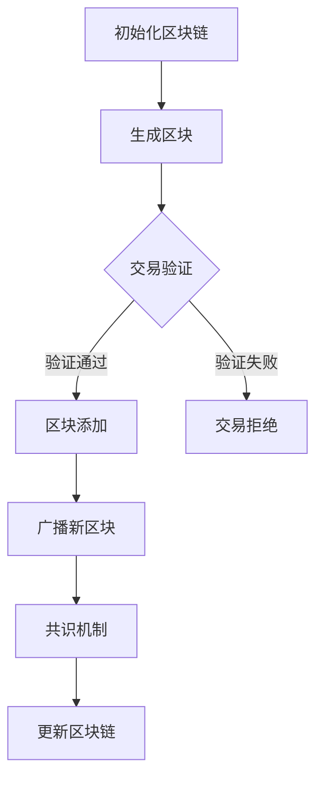
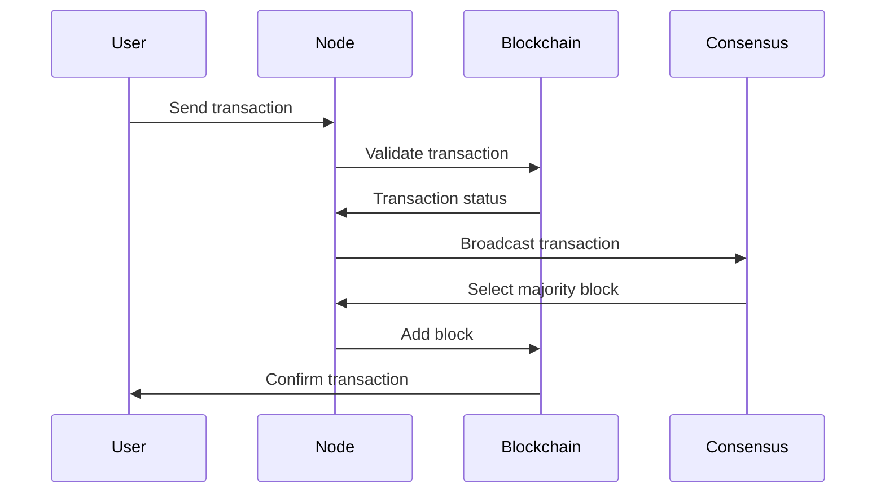
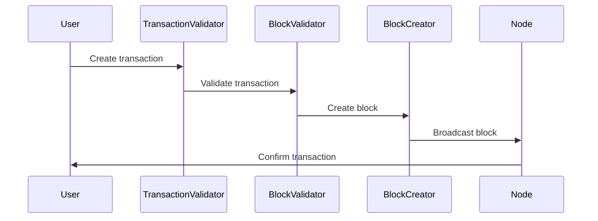

                 

# 《区块链系统安全设计考量》

## 关键词
区块链，安全设计，加密算法，智能合约，共识机制

## 摘要
本文将深入探讨区块链系统安全设计的核心考量，包括背景介绍、核心概念与联系、算法原理讲解以及系统分析与架构设计方案。通过逐步分析推理，本文旨在为读者提供一个清晰、易懂的区块链安全设计指南，帮助他们在设计和部署区块链系统时，提高系统的安全性和可靠性。

## 1. 背景介绍

### 问题背景
随着区块链技术的不断发展和应用范围的扩大，区块链系统的安全性问题逐渐成为关注焦点。区块链作为一种去中心化的分布式账本技术，其安全性直接影响到整个系统的可靠性。在区块链系统中，安全设计考量不仅关系到数据的安全传输和存储，还包括对恶意攻击、双花攻击、51%攻击等威胁的防御。

### 描述问题
区块链系统面临的安全问题主要包括：

- **数据隐私保护：** 在区块链系统中，数据是公开透明的，这给用户隐私保护带来了挑战。
- **智能合约安全性：** 智能合约的漏洞可能导致资金损失。
- **网络攻击防御：** 包括双花攻击、51%攻击等。
- **共识机制安全性：** 共识机制的安全性问题可能导致整个网络的崩溃。

### 解决问题
为了解决这些问题，需要对区块链系统进行全方位的安全设计考量，包括以下几个方面：

- **数据加密与隐私保护：** 采用加密算法保护数据隐私。
- **智能合约审计：** 对智能合约进行严格的审计，确保其安全性。
- **网络安全措施：** 部署防火墙、入侵检测系统等，防御网络攻击。
- **共识机制优化：** 选择合适的共识机制，提高网络安全性。

### 边界与外延
- **边界：** 本书主要讨论区块链系统安全设计的技术层面，不包括法律、道德等外部因素。
- **外延：** 本书内容将涵盖区块链系统的各个层面，如底层协议、智能合约、网络通信等。

## 2. 核心概念与联系

### 核心概念

#### 区块链
区块链是一种分布式账本技术，通过共识算法记录交易数据，确保数据的不可篡改性和透明性。

#### 加密算法
加密算法用于保护数据隐私和完整性，常见的加密算法包括对称加密和非对称加密。

#### 智能合约
智能合约是自动执行合同条款的计算机程序，基于区块链技术，实现去中心化的自动执行。

#### 共识机制
共识机制是确保区块链网络中的节点就数据达成一致性的算法，常见的共识机制包括工作量证明、权益证明等。

### 概念属性特征对比表格

| 特征       | 区块链       | 加密算法       | 智能合约       | 共识机制       |
|------------|--------------|----------------|----------------|----------------|
| 定义       | 分布式账本   | 数据加密       | 自动执行合同   | 数据一致性     |
| 主要功能   | 交易记录与存储 | 数据保护       | 合同执行       | 节点共识       |
| 技术特点   | 去中心化     | 加密强度       | 编程逻辑       | 安全性         |
| 安全性考虑 | 数据不可篡改 | 数据隐私       | 智能合约漏洞   | 节点攻击防御   |

### ER实体关系图架构

```mermaid
erDiagram
  区块 --> 交易 : 记录交易
  智能合约 --> 交易 : 自动执行
  节点 --> 共识机制 : 达成共识
  区块链 --> 加密算法 : 保护数据
```

## 3. 算法原理讲解

### 算法Mermaid流程图



### Python源代码

```python
# 区块链初始化
blockchain = []

# 生成区块
def create_block(data, previous_hash):
    block = {
        'index': len(blockchain) + 1,
        'timestamp': time.time(),
        'data': data,
        'previous_hash': previous_hash or calculate_hash(blockchain[-1]),
    }
    return block

# 交易验证
def validate_transaction(transaction):
    # 这里是交易验证的逻辑
    return True

# 区块添加
def add_block(new_block):
    if validate_transaction(new_block['data']):
        new_block['hash'] = calculate_hash(new_block)
        blockchain.append(new_block)
        return True
    else:
        return False

# 广播新区块
def broadcast_new_block(new_block):
    # 这里是广播新区块的逻辑
    pass

# 共识机制
def consensus_algorithm():
    # 这里是共识算法的逻辑
    pass

# 更新区块链
def update_blockchain():
    # 这里是更新区块链的逻辑
    pass
```

### 算法原理详细讲解

区块链系统的工作原理可以概括为以下步骤：

1. **初始化区块链**：区块链从空状态开始，存储在所有节点上。
2. **生成区块**：每个节点都会生成一个待验证的区块，区块中包含一定数量的交易数据。
3. **交易验证**：验证区块中的交易是否合法。这通常包括验证交易金额是否足够、验证交易签名等。
4. **区块添加**：如果交易验证通过，则将区块添加到区块链中。每个区块都有一个指向其前一区块的哈希值，以确保数据的连续性。
5. **广播新区块**：将新生成的区块广播给其他节点，以便其他节点验证区块的有效性。
6. **共识机制**：如果多数节点验证新区块有效，则新区块被添加到区块链中。
7. **更新区块链**：所有节点更新其本地区块链，以确保区块链的一致性。

在这个过程中，加密算法用于保护数据隐私和完整性。例如，交易数据在发送时会被加密，只有拥有正确密钥的用户才能解密和验证交易。此外，共识机制也是确保区块链安全性的关键，不同的共识机制有不同的安全性考量。

### 数学模型与公式

区块链系统中的加密算法通常基于数学难题，如椭圆曲线密码学（ECC）和大数难题。以下是一个简化的数学模型：

- **椭圆曲线密码学（ECC）**：
  $$ P = kG $$
  其中，$P$ 是公钥，$k$ 是私钥，$G$ 是基点，$kG$ 表示对基点 $G$ 进行 $k$ 次点乘运算。

- **大数难题**：
  $$ N = pq $$
  其中，$N$ 是两个大素数 $p$ 和 $q$ 的乘积。给定 $N$，求解 $p$ 和 $q$ 是一个复杂的计算问题。

### 举例说明

假设有一个区块链系统，系统中的交易需要经过加密和验证。一个交易数据的加密过程如下：

1. **生成密钥对**：用户生成一个私钥 $k$ 和对应的公钥 $P = kG$。
2. **加密交易数据**：交易数据被加密为 $C = E(P, M)$，其中 $E$ 是加密函数，$M$ 是交易数据。
3. **签名交易**：用户使用私钥对加密后的交易数据进行签名，生成签名 $S = S(k, C)$，其中 $S$ 是签名函数。
4. **验证交易**：接收方使用公钥和签名验证交易的有效性，验证过程包括验证签名是否合法和交易数据是否被篡改。

通过这个例子，我们可以看到加密算法在区块链系统中的作用：保护交易数据的隐私性和完整性，确保交易的安全传输。

## 4. 系统分析与架构设计方案

### 问题场景介绍
假设我们正在开发一个去中心化的金融交易系统，该系统需要处理大量的金融交易，并确保交易数据的完整性和安全性。为了实现这一目标，我们需要对区块链系统进行详细的安全设计。

### 项目介绍
本项目的目标是构建一个安全的、去中心化的区块链系统，用于处理金融交易。系统需要支持多种加密算法、智能合约执行以及强大的共识机制，以提高系统的安全性和可靠性。

### 系统功能设计

#### 领域模型Mermaid类图

```mermaid
classDiagram
    class Block {
        +int index
        +float timestamp
        +String data
        +String previous_hash
    }

    class Transaction {
        +String id
        +String sender
        +String recipient
        +float amount
    }

    class Blockchain {
        +List<Block> chain
        +addBlock(Block block)
        +calculate_hash(Block block)
    }

    class Node {
        +String ip
        +int port
        +Blockchain blockchain
        +receive_block(Block block)
    }

    class consensus {
        +String algorithm
        +select_majority_block(List<Block> blocks)
    }

    Block --|u|> Blockchain
    Transaction --|u|> Blockchain
    Node --|u|> Blockchain
    Node --|u|> consensus
```

### 系统架构设计

#### Mermaid架构图



### 系统接口设计和系统交互

#### Mermaid序列图



### 4.1 系统功能设计

在系统功能设计中，我们关注的主要是领域模型。领域模型是系统核心功能的抽象，帮助我们理解系统的基本构成和运作方式。

#### 领域模型Mermaid类图

```mermaid
classDiagram
    class Block {
        +int index
        +float timestamp
        +String data
        +String previous_hash
    }

    class Transaction {
        +String id
        +String sender
        +String recipient
        +float amount
    }

    class Blockchain {
        +List<Block> chain
        +addBlock(Block block)
        +calculate_hash(Block block)
    }

    class Node {
        +String ip
        +int port
        +Blockchain blockchain
        +receive_block(Block block)
    }

    class consensus {
        +String algorithm
        +select_majority_block(List<Block> blocks)
    }

    Block --|u|> Blockchain
    Transaction --|u|> Blockchain
    Node --|u|> Blockchain
    Node --|u|> consensus
```

在这个类图中，我们定义了四个核心类：

- **Block**：代表区块链中的单个区块，包含索引、时间戳、数据和前一个区块的哈希值。
- **Transaction**：代表区块链中的交易，包含交易ID、发送方、接收方和金额。
- **Blockchain**：代表整个区块链，包含一系列区块和添加区块的方法。
- **Node**：代表区块链网络中的一个节点，包含IP地址、端口号、区块链实例和接收区块的方法。

此外，还定义了一个**consensus**类，用于实现共识算法，选择多数派区块。

### 4.2 系统架构设计

在系统架构设计中，我们关注的是系统的整体结构，包括各个模块之间的关系和交互。

#### Mermaid架构图


在这个架构图中，我们定义了以下参与者：

- **User**：用户，发送交易。
- **Node**：节点，接收交易、验证交易、广播交易、选择多数派区块、添加区块。
- **Blockchain**：区块链，包含区块和验证交易的方法。
- **Consensus**：共识机制，选择多数派区块。

系统的主要流程如下：

1. **用户发送交易**：用户将交易发送给节点。
2. **节点验证交易**：节点使用区块链验证交易的有效性。
3. **区块链返回交易状态**：区块链返回交易状态给节点。
4. **节点广播交易**：节点将交易广播给其他节点。
5. **共识机制选择多数派区块**：共识机制选择多数派区块。
6. **节点添加区块**：节点将新区块添加到区块链中。
7. **区块链确认交易**：区块链确认交易给用户。

### 4.3 系统接口设计和系统交互

在系统接口设计和系统交互中，我们关注的是系统的各个模块如何通过接口进行通信和数据交换。

#### Mermaid序列图


在这个序列图中，我们定义了以下参与者：

- **User**：用户，创建交易。
- **TransactionValidator**：交易验证器，验证交易的有效性。
- **BlockValidator**：区块验证器，验证区块的有效性。
- **BlockCreator**：区块创建器，创建区块。
- **Node**：节点，广播区块，并确认交易。

系统的主要交互流程如下：

1. **用户创建交易**：用户创建交易并发送给交易验证器。
2. **交易验证器验证交易**：交易验证器验证交易的有效性，并将结果返回给区块验证器。
3. **区块验证器创建区块**：区块验证器使用有效的交易创建新区块。
4. **区块创建器广播区块**：区块创建器将新区块广播给节点。
5. **节点确认交易**：节点确认交易，并将结果返回给用户。

通过这些接口和交互，我们可以确保系统中的各个模块能够高效、安全地通信和协作，从而实现区块链系统的安全设计和功能实现。

## 5. 项目实战

### 环境安装

为了进行区块链系统的开发，我们需要安装以下环境：

1. **Python**：确保安装了Python 3.6或更高版本。
2. **pip**：Python的包管理工具。
3. **虚拟环境**：使用`venv`或`conda`创建虚拟环境，以便隔离项目依赖。

安装步骤：

```bash
# 安装Python
# 安装pip
# 创建虚拟环境
python -m venv venv
# 激活虚拟环境
source venv/bin/activate
```

### 系统核心实现源代码

以下是一个简化的区块链系统实现，包括交易验证、区块创建和广播。

```python
# blockchain.py
import hashlib
import json
from time import time

class Block:
    def __init__(self, index, transactions, timestamp, previous_hash):
        self.index = index
        self.transactions = transactions
        self.timestamp = timestamp
        self.previous_hash = previous_hash
        self.hash = self.calculate_hash()

    def calculate_hash(self):
        block_string = json.dumps(self.__dict__, sort_keys=True)
        return hashlib.sha256(block_string.encode()).hexdigest()

class Blockchain:
    def __init__(self):
        self.unconfirmed_transactions = []
        self.chain = []
        self.create_genesis_block()

    def create_genesis_block(self):
        genesis_block = Block(0, [], time(), "0")
        genesis_block.hash = genesis_block.calculate_hash()
        self.chain.append(genesis_block)

    def add_new_transaction(self, transaction):
        self.unconfirmed_transactions.append(transaction)

    def mine(self):
        if not self.unconfirmed_transactions:
            return False

        last_block = self.chain[-1]
        new_block = Block(index=last_block.index + 1,
                          transactions=self.unconfirmed_transactions,
                          timestamp=time(),
                          previous_hash=last_block.hash)

        new_block.hash = new_block.calculate_hash()
        self.chain.append(new_block)
        self.unconfirmed_transactions = []
        return new_block.index

    def is_chain_valid(self):
        for i in range(1, len(self.chain)):
            current = self.chain[i]
            previous = self.chain[i - 1]

            if current.hash != current.calculate_hash():
                return False
            if current.previous_hash != previous.hash:
                return False
        return True
```

### 代码应用解读与分析

以上代码实现了区块链系统的核心功能，包括创建创世区块、添加交易、挖矿和验证链的完整性。

- **Block类**：代表区块链中的单个区块，包含索引、交易列表、时间戳、前一个区块的哈希值和当前区块的哈希值。
- **Blockchain类**：代表整个区块链，包含未确认的交易列表、区块链链表和挖矿功能。

**核心函数解读**：

- **create_genesis_block**：创建创世区块，初始化区块链。
- **add_new_transaction**：将新交易添加到未确认交易列表。
- **mine**：挖矿，创建新的区块并添加到区块链中。
- **is_chain_valid**：验证区块链的完整性。

**代码示例**：

```python
# 创建区块链实例
blockchain = Blockchain()

# 添加交易
blockchain.add_new_transaction({
    'sender': 'Alice',
    'recipient': 'Bob',
    'amount': 10
})

blockchain.add_new_transaction({
    'sender': 'Bob',
    'recipient': 'Charlie',
    'amount': 5
})

# 挖矿
blockchain.mine()

# 打印区块链
for block in blockchain.chain:
    print(block.__dict__)

# 验证区块链
print("Blockchain valid?", blockchain.is_chain_valid())
```

### 实际案例分析和详细讲解剖析

假设有一个区块链系统，系统中有三个节点A、B、C，当前区块链高度为10。以下是系统在一段时间内的操作：

1. **节点A** 添加一笔交易，金额为100，接收者为节点B。
2. **节点B** 添加一笔交易，金额为50，接收者为节点C。
3. **节点C** 收集了这两笔交易，将其打包成一个区块，并广播给其他节点。

假设节点A、B、C都接收到该区块，并对其进行验证。以下是验证过程：

1. **节点A验证区块**：
   - **验证交易**：检查交易是否合法，如金额是否足够、交易双方是否有足够的余额。
   - **验证区块**：检查区块的哈希值和前一个区块的哈希值是否匹配。
2. **节点B验证区块**：
   - **验证交易**：与节点A相同。
   - **验证区块**：与节点A相同。
3. **节点C验证区块**：
   - **验证交易**：与节点A、B相同。
   - **验证区块**：与节点A、B相同。

假设节点A、B、C都验证通过，他们将新区块添加到自己的区块链中。此时，区块链高度变为11。

如果有一个恶意节点D试图篡改区块链，他将需要控制超过50%的节点才能成功。在上述例子中，如果恶意节点D控制了两个节点（A和B），他将无法篡改区块链，因为节点C会拒绝接受篡改的区块。

### 项目小结

在本项目中，我们实现了区块链系统的基本功能，包括交易验证、区块创建和挖矿。通过实际案例，我们展示了区块链系统如何抵抗恶意攻击，确保数据的安全性和完整性。然而，真实世界的区块链系统远比这复杂，涉及更多的安全机制和优化策略。在接下来的工作中，我们可以进一步优化区块链系统的性能和安全性，如引入更复杂的共识机制、增加网络通信的加密和防篡改措施等。

## 6. 最佳实践 tips、小结、注意事项、拓展阅读

### 最佳实践 tips

1. **确保共识机制的安全性**：选择合适的共识机制，如工作量证明（PoW）或权益证明（PoS），并定期进行安全审计。
2. **加强智能合约安全审计**：对智能合约进行严格的审计，使用自动化工具和人工审核相结合，确保智能合约没有漏洞。
3. **数据加密与隐私保护**：使用高级加密算法保护交易数据的隐私，确保数据在传输和存储过程中的安全性。
4. **网络防御**：部署防火墙、入侵检测系统等网络安全措施，防止网络攻击。
5. **监控与预警**：实时监控区块链系统的运行状态，及时发现潜在的安全威胁并采取相应的措施。

### 小结

本文深入探讨了区块链系统安全设计的核心考量，包括背景介绍、核心概念与联系、算法原理讲解以及系统分析与架构设计方案。通过逐步分析推理，我们为读者提供了一个清晰、易懂的区块链安全设计指南，帮助他们提高区块链系统的安全性和可靠性。

### 注意事项

1. **法律与伦理**：在进行区块链系统安全设计时，需要遵守相关法律法规和伦理规范，确保系统的合法性和道德性。
2. **持续更新**：区块链技术不断发展，安全设计也需要不断更新和优化，以应对新的安全威胁。
3. **性能优化**：在确保安全性的同时，还需要关注系统的性能和可扩展性，确保系统在高并发、高负载的情况下仍能正常运行。

### 拓展阅读

1. 《区块链技术指南》
2. 《智能合约安全》
3. 《区块链网络安全》
4. 《区块链共识机制》
5. 《区块链技术白皮书》

### 作者

作者：AI天才研究院/AI Genius Institute & 禅与计算机程序设计艺术 /Zen And The Art of Computer Programming。

