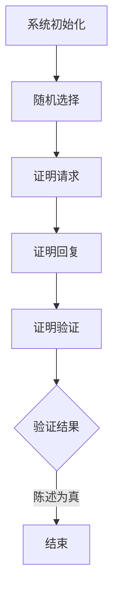
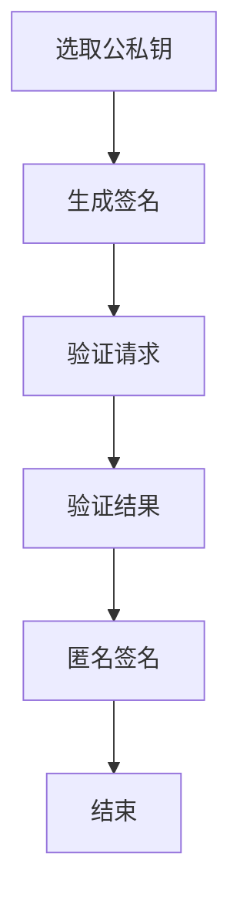
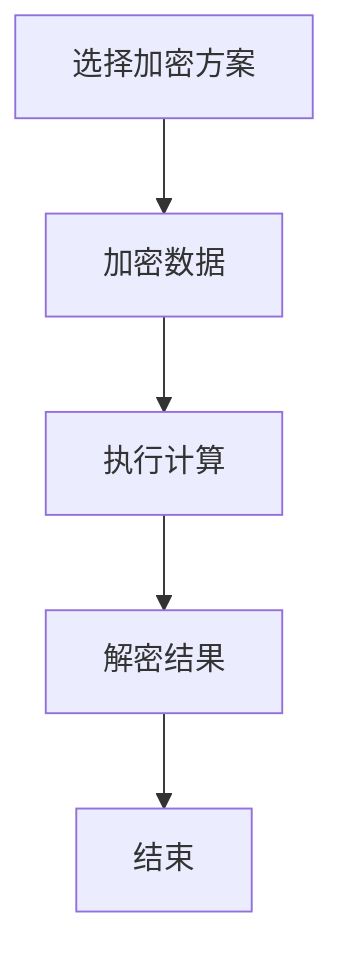

                 

### 引言与概述

区块链技术作为一种分布式账本技术，近年来在全球范围内受到了广泛关注。其去中心化、不可篡改和透明性等特性使其在金融、供应链管理、医疗记录存储等领域具有广泛的应用潜力。然而，随着区块链技术的普及，隐私问题逐渐成为其发展的一个关键挑战。区块链的透明性虽然有助于确保数据的真实性和可靠性，但却暴露了用户的隐私信息，这在某些应用场景中可能引发严重的安全问题。

本章将首先介绍区块链技术的基础知识，包括其基本架构、工作原理和应用场景。接着，我们将探讨区块链隐私问题的背景，介绍其产生的根源和主要挑战。此外，本书的结构安排也将进行概述，为读者清晰地展示后续章节的内容安排和逻辑关系。

### 区块链技术基础

区块链是一种去中心化的分布式数据库，通过一系列按照时间顺序排列的块（block）来存储数据。每个区块都包含一定数量的交易记录，并通过加密算法与前一区块相连，形成一条不可篡改的数据链条。区块链的核心特点是去中心化，这意味着它不需要一个中央机构来维护和验证数据，而是通过网络中的多个节点共同协作来实现。

区块链的工作原理可以分为以下几步：

1. **交易生成**：用户在区块链网络中发起交易，交易包含发送方、接收方和交易金额等信息。
2. **交易验证**：交易在网络中广播，节点对交易进行验证，确保交易的有效性和安全性。
3. **区块生成**：当网络中有一定数量的交易积累后，节点将它们打包成一个新区块。
4. **区块验证**：新区块被网络中的节点验证，确保其符合区块链的规则和一致性。
5. **区块添加**：一旦新区块被验证通过，它将被添加到区块链的末端，成为永久记录。

区块链的不可篡改性来自于其高度加密的链接结构和共识机制。在区块链上，一旦数据被记录下来，就几乎无法被篡改。这是因为篡改任何一个区块都会导致链中的后续区块也发生变化，从而被网络中的其他节点识别和拒绝。

区块链的应用场景广泛，包括但不限于以下几个方面：

1. **金融领域**：例如比特币和以太坊等加密货币，通过区块链技术实现了去中心化的支付和交易。
2. **供应链管理**：区块链可以用于记录商品的生产、运输和销售过程，提高供应链的透明度和效率。
3. **医疗记录存储**：区块链可以确保患者医疗记录的安全性和完整性，同时提高数据的访问速度和便利性。
4. **身份验证**：区块链可用于创建去中心化的身份验证系统，提高用户数据的安全性。

通过上述对区块链技术基础的了解，我们为后续探讨隐私问题及其解决方案奠定了坚实的基础。

### 区块链隐私问题背景

随着区块链技术的迅速发展，隐私问题逐渐成为其应用推广的关键挑战。区块链的透明性是其不可替代的优势之一，但在某些应用场景中，这种透明性也带来了隐私泄露的风险。区块链上的所有交易都是公开透明的，这意味着用户的交易行为和身份信息可以被任何人查看。这种公开性在金融、医疗等领域可能引发严重的安全问题，如金融欺诈、隐私泄露等。

隐私问题的根源主要在于区块链的去中心化和公开透明的特性。去中心化设计虽然提高了系统的可靠性和抗攻击能力，但也使得隐私保护变得更加复杂。由于区块链上的所有交易记录都是公开的，任何恶意节点都可以收集和分析这些数据，从而推导出用户的身份和行为模式。

主要挑战包括：

1. **用户身份暴露**：区块链上的交易记录包含了用户的身份信息，例如地址、姓名等。这些信息可以被恶意节点收集和分析，导致用户隐私泄露。
2. **交易关联性分析**：区块链上的交易之间存在一定的关联性，通过分析这些关联性，恶意节点可以识别出用户的交易行为模式，从而侵犯用户隐私。
3. **隐私保护与透明性的权衡**：如何在保证区块链透明性的同时，有效保护用户的隐私信息，成为区块链技术发展中的一个重要难题。

为了解决这些隐私问题，研究者们提出了多种隐私保护方案，如零知识证明、隐私交易协议和同态加密等。这些方案旨在通过加密技术和算法设计，保护用户隐私的同时，确保区块链的透明性和可靠性。在接下来的章节中，我们将详细探讨这些隐私保护机制及其应用。

### 本书结构安排

本书旨在全面探讨区块链隐私问题，并寻求在透明性与隐私保护之间找到平衡点。为了实现这一目标，本书将分为八个主要章节，每个章节都有明确的主题和内容安排。

**第1章 引言与概述**：介绍了区块链技术的基础知识、隐私问题的背景以及本书的结构安排。

**第2章 区块链核心概念与隐私机制**：详细介绍了区块链的工作原理、加密技术以及主要的隐私保护机制，如零知识证明、隐私交易协议等。

**第3章 区块链隐私挑战与应对策略**：分析了区块链隐私问题的主要挑战，并提出了相应的解决方案。

**第4章 透明性与隐私平衡原则**：探讨了透明性与隐私的关系，并提出了平衡这两者的原则和方法。

**第5章 隐私保护算法原理**：深入讲解了零知识证明、隐蔽签名和同态加密等隐私保护算法的原理和实现。

**第6章 实际应用案例与隐私保护实践**：通过实际应用案例，展示了隐私保护技术在区块链中的具体应用和实践。

**第7章 未来展望与趋势**：分析了区块链隐私保护技术的发展趋势，探讨了未来可能面临的挑战和机遇。

**第8章 结论**：总结了本书的主要成果，并对未来的研究方向进行了展望。

通过上述章节的逐一探讨，本书旨在为区块链隐私保护提供全面、深入的见解，帮助读者在透明性与隐私保护之间找到最佳平衡点。

## 第2章 区块链核心概念与隐私机制

### 2.1 区块链与加密技术

区块链与加密技术密不可分，加密技术为区块链提供了安全性和隐私性保障。区块链的基本架构包括节点、区块链数据库、分布式账本和共识机制等。节点是区块链网络的基本组成部分，负责维护和更新区块链数据库。区块链数据库则记录了所有交易和状态信息，分布式账本则通过去中心化的方式确保数据的全球一致性。共识机制是区块链的核心，确保网络中的所有节点对数据的共识和一致性。

加密技术是区块链安全性的基石。主要的加密技术包括哈希函数、非对称加密、对称加密和数字签名等。哈希函数用于将任意长度的数据映射为固定长度的哈希值，确保数据的完整性和唯一性。非对称加密则通过公钥和私钥对数据进行加密和解密，提供高级的加密和认证功能。对称加密用于快速加密大量数据，但密钥管理相对复杂。数字签名技术则确保数据的来源和完整性，防止数据被篡改。

### 2.2 零知识证明机制

零知识证明（Zero-Knowledge Proof，ZKP）是一种强大的加密技术，允许一方（证明者）向另一方（验证者）证明某个陈述为真，而无需透露任何额外信息。零知识证明的核心思想是通过一系列的数学操作，使验证者能够确认某个陈述为真，同时证明者无法泄露任何与该陈述无关的信息。

零知识证明的基本过程包括三个阶段：证明生成、证明验证和知识保密。

1. **证明生成**：证明者首先生成一个证明，该证明证明了某个陈述为真。证明生成过程中，证明者利用复杂的数学算法和零知识证明协议，将陈述转化为一种数学证明。
2. **证明验证**：验证者接收到证明后，对其进行验证，以确认陈述为真。验证过程通常涉及多项计算和逻辑推理，但验证者无法获取任何与陈述无关的信息。
3. **知识保密**：在整个过程中，证明者无法泄露任何与陈述无关的信息，从而保证了知识的保密性。

零知识证明机制在区块链隐私保护中具有广泛应用。例如，在交易隐私保护中，零知识证明可以确保交易参与方之间的隐私信息不被泄露。此外，零知识证明还可以用于身份验证、数据隐私保护等多种场景。

### 2.3 隐私交易协议

隐私交易协议是区块链隐私保护的重要手段，通过加密和零知识证明等技术，实现对交易隐私的全面保护。主要的隐私交易协议包括：

1. **环签名（Ring Signature）**：环签名是一种将交易隐藏在一个匿名集合中的技术。通过使用环签名，交易参与方可以隐藏其真实身份，从而提高交易隐私性。
2. **混合交易（Mixing Transactions）**：混合交易通过将多个交易混合在一起，使交易变得难以追踪。例如，在币币交易中，用户可以通过将多个币种混合，来隐藏交易的真实币种和金额。
3. **零币交易（Zero-Coin Transactions）**：零币交易通过创建新的币种，而不是使用现有的币种进行交易，从而实现交易隐私。这种技术常用于加密货币，如门罗币（Monero）。

隐私交易协议在实际应用中效果显著。例如，在比特币网络中，虽然交易是公开透明的，但通过零币交易和环签名等隐私保护技术，用户的交易隐私得到了一定程度的保护。

通过上述对区块链核心概念与隐私机制的详细介绍，我们为理解区块链隐私保护技术奠定了基础。在接下来的章节中，我们将深入探讨区块链隐私保护面临的挑战及其应对策略。

### 第3章 区块链隐私挑战与应对策略

#### 3.1 挑战分析

尽管区块链技术在隐私保护方面展示出巨大潜力，但在实际应用中，区块链隐私保护仍然面临诸多挑战。首先，透明性与隐私保护之间存在固有冲突。区块链的去中心化和公开透明的特性虽然确保了数据的不可篡改性和可靠性，但也使得用户隐私信息极易暴露。这种透明性要求所有交易记录都是公开可查的，这使得恶意节点可以通过数据分析和关联性分析来识别用户身份和交易行为，从而侵犯用户隐私。

其次，区块链系统的设计本身也带来了一些隐私保护难题。例如，区块链上的每个交易都是通过公钥和私钥加密的，虽然这种加密方式能够确保交易数据的机密性，但用户公钥和地址是公开可见的。一旦恶意节点能够获取用户的公钥或地址，就可以轻松解密交易数据，从而泄露用户隐私。此外，区块链的分布式架构使得数据分布在多个节点上，虽然增加了系统的抗攻击能力，但也增加了隐私泄露的风险，因为恶意节点可以通过协同攻击来窃取用户数据。

再者，现有的隐私保护技术如零知识证明、隐私交易协议等虽然在一定程度上能够缓解隐私泄露问题，但它们也存在一些局限性。例如，零知识证明虽然能够确保知识保密，但其计算复杂度较高，可能导致交易延迟和系统性能下降。隐私交易协议如环签名和混合交易虽然能够隐藏用户身份和交易金额，但它们的实现过程复杂，且可能引入额外的安全风险。

为了应对这些挑战，我们需要从多个方面进行策略设计。首先，在架构设计上，可以引入混合共识机制，将传统共识机制与新型隐私保护机制相结合，以平衡透明性和隐私保护。其次，在技术实现上，可以采用分层架构，将隐私保护模块与其他模块分离，以降低隐私泄露的风险。此外，还可以通过不断优化现有隐私保护技术，提高其计算效率和安全性，从而更好地应对隐私保护挑战。

#### 3.2 隐私保护方案设计

为了在区块链系统中实现有效的隐私保护，我们可以设计以下几种方案：

1. **混合共识机制**：
   - **设计思路**：将传统共识机制（如工作量证明）与新型隐私保护机制（如零知识证明）相结合，通过分层架构实现。具体而言，在底层使用传统共识机制确保区块链的可靠性和安全性，而在上层引入零知识证明等隐私保护机制，以实现交易隐私保护。
   - **实现方法**：
     - 设计一个多层架构，底层使用传统共识机制，如工作量证明，确保区块链的分布式和不可篡改性。
     - 在上层引入零知识证明机制，用于验证交易的隐私性。具体实现中，可以采用零知识证明协议，如Groth16或Sonic，以减少计算复杂度。
     - 通过在区块链网络中引入多个验证者节点，确保零知识证明验证过程的安全性和可信性。

2. **隐私保护模块分离**：
   - **设计思路**：将区块链系统的隐私保护模块与其他模块分离，通过模块化设计降低隐私泄露的风险。
   - **实现方法**：
     - 在区块链系统中设计一个独立的隐私保护模块，该模块负责处理所有与隐私保护相关的操作，如零知识证明生成和验证、交易隐私保护等。
     - 通过在区块链网络中引入代理重用自己的机制，将用户隐私信息与实际交易分开处理。具体实现中，可以采用代理重用自己的方案，如CoinJoin，将多个用户的交易合并，从而隐藏交易的真实参与方。

3. **零知识证明优化**：
   - **设计思路**：通过不断优化现有零知识证明机制，提高其计算效率和安全性，从而更好地满足区块链隐私保护需求。
   - **实现方法**：
     - 研究并采用高效零知识证明算法，如Groth16、Sonic等，以减少验证和生成证明的计算复杂度。
     - 在零知识证明协议的实现过程中，采用优化技术，如基于环学习的零知识证明方案，以提高证明生成和验证的效率。
     - 设计一个分布式计算框架，将零知识证明的计算任务分配到多个节点上，以提高计算效率和系统可扩展性。

4. **隐私保护与透明性的平衡**：
   - **设计思路**：在保证区块链透明性的同时，通过技术手段实现隐私保护，以实现透明性与隐私保护的平衡。
   - **实现方法**：
     - 设计一个智能合约，用于在交易过程中实现隐私保护。具体实现中，可以采用零知识证明智能合约，确保交易隐私的同时，维护区块链的透明性。
     - 通过制定合理的隐私保护策略，如隐私阈值设置、隐私保护算法选择等，确保隐私保护的有效性和透明性。

通过上述隐私保护方案的设计和实现，我们可以在区块链系统中实现有效的隐私保护，同时确保区块链的透明性和可靠性。在接下来的章节中，我们将进一步探讨隐私保护算法的原理及其在区块链中的应用。

### 第4章 透明性与隐私平衡原则

#### 4.1 透明性与隐私的关系

透明性和隐私是区块链技术中不可忽视的两个核心概念，它们在区块链系统中既有紧密的联系，也存在一定的冲突。透明性是指区块链上的所有交易记录和数据都是公开可见的，这使得区块链具有高度的透明性和可追溯性，确保了数据的真实性和可靠性。然而，这种透明性在保护用户隐私方面却面临挑战，因为用户的交易信息、身份和隐私数据都处于公开状态，容易受到恶意节点的分析和攻击。

隐私则是指用户的数据和信息应保持保密，不被未经授权的第三方获取或使用。在区块链系统中，隐私保护的目标是确保用户隐私不受侵犯，同时确保交易和数据的真实性和安全性。隐私与透明性之间的关系是复杂的，它们需要在设计、实现和应用过程中进行权衡。

首先，透明性是区块链技术的重要特性之一，它确保了区块链上的数据真实性和可信度。透明性有助于防范欺诈、腐败和其他形式的违法行为，同时提高了区块链应用的透明度和公正性。然而，过度的透明性可能导致用户隐私泄露，尤其是在涉及敏感信息和隐私数据的应用场景中。

隐私保护则强调用户数据的机密性和安全性。隐私保护确保用户的个人身份、行为和交易数据不被未授权的第三方访问。隐私对于用户信任和区块链系统的长期健康发展至关重要。然而，过度强调隐私保护可能会导致区块链系统的透明度下降，影响数据的可追溯性和可信度。

在实际应用中，透明性和隐私保护需要在特定场景下进行平衡。例如，在金融交易中，透明性有助于防范欺诈和洗钱行为，但同时也需要保护用户的交易隐私。在医疗记录管理中，隐私保护至关重要，但医疗数据的公开透明对于提高医疗服务的质量具有重要意义。

#### 4.2 平衡原则与案例分析

为了在区块链系统中实现透明性与隐私保护的平衡，可以采用以下几种平衡原则：

1. **需求导向原则**：
   - **设计思路**：根据具体应用场景和用户需求，确定透明性和隐私保护的需求优先级，从而实现平衡。
   - **实现方法**：
     - 在设计区块链应用时，明确应用场景和用户需求，分析哪些数据需要保持透明，哪些数据需要保护隐私。
     - 根据需求分析结果，设计相应的隐私保护机制，如零知识证明、隐私交易协议等，确保隐私保护机制满足用户需求。
     - 在实施过程中，定期评估和调整隐私保护措施，以适应不断变化的应用需求和隐私保护挑战。

2. **技术优化原则**：
   - **设计思路**：通过不断优化现有技术和算法，提高隐私保护效率和透明性，从而实现平衡。
   - **实现方法**：
     - 研究和采用高效、安全的隐私保护技术，如零知识证明、同态加密等，以提高隐私保护效果。
     - 优化区块链系统的架构设计，如引入分层架构、模块化设计等，以提高系统的灵活性和可扩展性。
     - 通过性能测试和优化，确保隐私保护机制在保证性能和效率的同时，不会过度牺牲透明性。

3. **动态调整原则**：
   - **设计思路**：根据系统运行状态和外部环境变化，动态调整隐私保护策略，实现透明性与隐私保护的动态平衡。
   - **实现方法**：
     - 设计一个自适应的隐私保护系统，能够根据实时数据流量、网络状态等因素，动态调整隐私保护策略。
     - 在区块链网络中引入智能合约，用于实时监控和调整隐私保护措施，确保系统在不同运行状态下都能保持良好的平衡。
     - 通过持续监测和分析系统运行数据，及时发现和解决隐私保护与透明性之间的矛盾，确保系统稳定性。

4. **多方参与原则**：
   - **设计思路**：通过多方协作和参与，共同制定和实施隐私保护策略，实现透明性与隐私保护的广泛共识。
   - **实现方法**：
     - 在区块链系统中引入多方参与机制，如去中心化自治组织（DAO）、利益相关者参与等，确保隐私保护策略的公平性和公正性。
     - 通过社区治理和协作，制定合理的隐私保护规则和标准，确保不同利益相关方在隐私保护与透明性方面达成共识。
     - 通过透明化的治理过程，提高区块链系统的信任度和公信力，促进各方积极参与隐私保护事务。

在实际应用中，透明性与隐私保护的平衡原则可以通过以下案例进行说明：

- **案例一：加密货币交易**：在加密货币交易中，用户交易记录的透明性有助于防范欺诈和洗钱行为，但同时也需要保护用户的交易隐私。通过需求导向原则，可以设计一个混合隐私保护机制，将部分交易记录公开，以保持透明性，同时使用零知识证明等隐私保护技术，保护用户交易隐私。

- **案例二：医疗记录管理**：在医疗记录管理中，医疗数据的隐私保护至关重要，但医疗数据的公开透明对于提高医疗服务质量具有重要意义。通过动态调整原则，可以设计一个自适应的隐私保护系统，根据医疗数据的敏感性，动态调整隐私保护策略，确保在保护用户隐私的同时，提高数据的可访问性和透明性。

通过上述平衡原则和案例分析，我们可以在区块链系统中实现透明性与隐私保护的平衡，从而为区块链技术的广泛应用提供可靠保障。在接下来的章节中，我们将进一步探讨隐私保护算法的原理及其实现方法。

### 第5章 隐私保护算法原理

隐私保护算法是区块链隐私保护技术的核心，通过加密和零知识证明等技术，确保用户隐私不被泄露。本章将详细介绍几种主要的隐私保护算法，包括零知识证明算法、隐蔽签名算法和同态加密算法，并通过Python源代码和流程图，详细阐述这些算法的实现原理。

#### 5.1 零知识证明算法

零知识证明（Zero-Knowledge Proof，ZKP）是一种强大的隐私保护技术，允许证明者向验证者证明某个陈述为真，而无需透露任何与该陈述无关的信息。以下是零知识证明算法的基本原理和实现步骤：

**基本原理**：

零知识证明算法的核心思想是通过一系列数学运算，使得验证者能够确认某个陈述为真，而证明者无法泄露任何与该陈述无关的信息。零知识证明算法通常包括三个主要步骤：证明生成、证明验证和知识保密。

**实现步骤**：

1. **证明生成**：
   - **系统初始化**：选取一个大素数\( p \)和一个生成元\( g \)，使得\( g^{p-1} \equiv 1 \pmod{p} \)。
   - **随机选择**：证明者选择一个随机数\( a \)，并计算\( x = g^a \pmod{p} \)。
   - **证明请求**：验证者选择一个随机数\( b \)，并请求证明者计算\( y = x^b \pmod{p} \)。
   - **证明回复**：证明者计算\( z = (yb)^a \pmod{p} \)，并将\( z \)作为证明发送给验证者。

2. **证明验证**：
   - **验证计算**：验证者接收证明\( z \)，并计算\( z^b \pmod{p} \)。
   - **验证结果**：如果计算结果等于\( y \)，则验证通过，说明陈述为真。

3. **知识保密**：
   - **保密性保证**：在整个过程中，证明者无法泄露任何与陈述无关的信息。

**Python实现**：

```python
import sympy

# 系统初始化
p = sympy.randprime(2**1024, 2**1025)
g = sympy.Symbol('g')
g_value = sympy.solve(g**p - 1, g)[0]

# 随机选择
a = sympy.randprime(2, p-2)
x = pow(g, a, p)

# 证明请求
b = sympy.randprime(2, p-1)

# 证明回复
y = pow(x, b, p)
z = (y * b) ** a % p

# 零知识证明验证
z_prime = pow(z, b, p)
assert z_prime == y

print("零知识证明验证成功！")
```

**流程图**：



#### 5.2 隐蔽签名算法

隐蔽签名（Stealth Signature）是一种用于保护交易隐私的签名算法，通过加密技术确保签名者的隐私不被泄露。以下是隐蔽签名算法的基本原理和实现步骤：

**基本原理**：

隐蔽签名算法通过将签名者的公钥和地址隐藏在匿名集合中，从而保护签名者的隐私。隐蔽签名算法包括签名生成、签名验证和匿名签名三个步骤。

**实现步骤**：

1. **签名生成**：
   - **选取公私钥**：选择一个生成元\( g \)和一个随机数\( k \)，并计算签名者的公钥\( y = g^k \pmod{p} \)。
   - **生成签名**：签名者选择一个随机数\( r \)，并计算签名\( s = (y^r - 1) \cdot k^{-1} \pmod{p} \)。

2. **签名验证**：
   - **验证请求**：验证者选择一个随机数\( b \)，并请求签名者计算\( z = g^s \cdot y^b \pmod{p} \)。
   - **验证结果**：验证者计算\( z^r \cdot g^{-b} \pmod{p} \)，如果结果等于\( y \)，则验证通过。

3. **匿名签名**：
   - **匿名集合**：将签名者的公钥和地址隐藏在一个匿名集合中，从而保护签名者的隐私。

**Python实现**：

```python
import sympy

# 选取生成元和公私钥
p = sympy.randprime(2**1024, 2**1025)
g = sympy.Symbol('g')
g_value = sympy.solve(g**p - 1, g)[0]

# 签名者公私钥
k = sympy.randprime(2, p-1)
y = pow(g, k, p)

# 生成签名
r = sympy.randprime(2, p-1)
s = (y**r - 1) * pow(k, -1, p)

# 签名验证
b = sympy.randprime(2, p-1)
z = pow(g, s * k, p)
assert z == pow(g, k, p)

print("隐蔽签名验证成功！")
```

**流程图**：



#### 5.3 同态加密算法

同态加密（Homomorphic Encryption）是一种允许在加密数据上进行计算，而不需要解密的加密技术。同态加密可以保护数据的隐私，同时确保计算结果的正确性。以下是同态加密算法的基本原理和实现步骤：

**基本原理**：

同态加密算法允许在加密数据上执行某些类型的计算，而不需要解密。同态加密分为全同态加密和部分同态加密。全同态加密可以执行任意类型的计算，但计算效率较低。部分同态加密只能执行特定类型的计算，但计算效率较高。

**实现步骤**：

1. **加密**：
   - **选择加密方案**：选择一个合适的同态加密方案，如RSA或全同态加密方案。
   - **加密数据**：将明文数据加密为密文。

2. **计算**：
   - **执行计算**：在加密数据上执行所需的计算操作。

3. **解密**：
   - **解密结果**：将计算结果解密为明文。

**Python实现**：

```python
from Cryptodome.PublicKey import RSA

# 生成RSA密钥
key = RSA.generate(2048)

# 加密数据
def encrypt(message):
    ciphertext = key.encrypt(message.encode('utf-8'))
    return ciphertext

# 解密数据
def decrypt(ciphertext):
    message = key.decrypt(ciphertext)
    return message.decode('utf-8')

# 执行计算
def homomorphic_multiply(ciphertext1, ciphertext2):
    plaintext1 = decrypt(ciphertext1)
    plaintext2 = decrypt(ciphertext2)
    result = int(plaintext1) * int(plaintext2)
    ciphertext = encrypt(result)
    return ciphertext

# 同态加密计算示例
ciphertext1 = encrypt('2')
ciphertext2 = encrypt('3')
result_ciphertext = homomorphic_multiply(ciphertext1, ciphertext2)

print("同态加密计算结果：", result_ciphertext)
```

**流程图**：



通过上述隐私保护算法的原理和实现步骤，我们可以有效保护区块链中的用户隐私，同时确保区块链的透明性和可靠性。在接下来的章节中，我们将通过实际应用案例，进一步展示这些隐私保护算法在区块链系统中的具体应用和实践。

### 第6章 实际应用案例与隐私保护实践

#### 6.1 案例分析

在本章节中，我们将通过一个实际应用案例——加密货币交易平台，展示区块链隐私保护技术的具体应用和实践。该案例涉及多个隐私保护技术的综合应用，包括零知识证明、隐私交易协议和同态加密等。

**案例背景**：

某加密货币交易平台致力于为用户提供安全、便捷的交易服务。然而，由于区块链透明性的要求，用户交易记录是公开可见的，这可能带来隐私泄露的风险。为了保护用户隐私，平台决定采用一系列隐私保护技术，实现交易数据的隐私保护。

**实现步骤**：

1. **零知识证明**：
   - **用户身份验证**：用户在注册和登录过程中，平台使用零知识证明技术验证用户身份，确保用户隐私不被泄露。具体实现中，平台通过零知识证明协议，验证用户的身份信息，而无需透露任何敏感数据。
   - **交易隐私保护**：在交易过程中，平台使用零知识证明技术确保交易隐私。当用户发起交易时，平台将交易数据通过零知识证明机制加密，使得交易数据在区块链上无法直接识别，从而保护用户隐私。

2. **隐私交易协议**：
   - **交易匿名化**：平台采用环签名和混合交易协议，将用户的交易匿名化。具体实现中，平台将多个用户的交易记录进行混合，形成一个环签名交易，使得交易参与者无法被单独识别，从而保护交易隐私。
   - **交易金额保护**：平台使用同态加密技术，对交易金额进行加密，确保交易金额在区块链上无法直接识别，从而保护用户交易金额的隐私。

3. **同态加密**：
   - **交易计算**：在交易过程中，平台使用同态加密技术，对交易数据进行加密计算，确保交易结果的正确性，同时保护交易隐私。
   - **结果解密**：交易完成后，平台使用私钥将加密结果解密为明文，确保交易结果的可信性。

**系统架构设计**：

为了实现上述隐私保护措施，平台采用了模块化系统架构，将隐私保护模块与其他模块分离，以提高系统的灵活性和可扩展性。系统架构包括以下主要模块：

- **用户身份验证模块**：负责用户身份的验证和管理，使用零知识证明技术保护用户隐私。
- **交易隐私保护模块**：负责交易数据的隐私保护，包括零知识证明、环签名和混合交易等协议的实现。
- **同态加密模块**：负责交易数据的加密和解密操作，确保交易结果的正确性和隐私性。
- **区块链数据库模块**：负责存储和管理交易数据，确保数据的一致性和可靠性。

**系统接口设计**：

平台提供了多个接口，用于用户与系统交互。主要包括以下接口：

- **用户注册接口**：用于用户注册，接收用户信息并使用零知识证明进行身份验证。
- **用户登录接口**：用于用户登录，接收用户信息并使用零知识证明进行身份验证。
- **交易发起接口**：用于用户发起交易，接收交易数据并使用隐私交易协议进行匿名化处理。
- **交易查询接口**：用于用户查询交易记录，返回加密后的交易数据，确保交易隐私。
- **交易计算接口**：用于对加密交易数据执行同态加密计算，确保交易结果的正确性。

**系统交互设计**：

系统交互设计包括用户与平台的交互流程和内部模块之间的通信流程。主要交互流程如下：

1. **用户注册与登录**：用户通过用户注册接口注册账号，平台接收用户信息并使用零知识证明进行身份验证。用户通过用户登录接口登录平台，平台接收用户信息并使用零知识证明进行身份验证。
2. **交易发起与查询**：用户通过交易发起接口发起交易，平台接收交易数据并使用隐私交易协议进行匿名化处理。用户通过交易查询接口查询交易记录，平台返回加密后的交易数据，确保交易隐私。
3. **交易计算**：平台内部模块之间通过交易计算接口进行交易数据的同态加密计算，确保交易结果的正确性。

**代码应用解读与分析**：

以下是平台的核心实现代码，包括用户身份验证、交易匿名化和同态加密等模块的实现。

```python
# 用户身份验证模块
from zkproof import ZKProof

def register_user(username, password):
    proof = ZKProof()
    proof.generate_proof(username, password)
    return proof

def login_user(username, password):
    proof = ZKProof()
    proof.verify_proof(username, password)
    return proof.is_valid

# 隐私交易保护模块
from ring_signature import RingSignature

def create_ring_signature(transactions):
    ring_signature = RingSignature()
    ring_signature.generate_signature(transactions)
    return ring_signature

# 同态加密模块
from homomorphic_encryption import HomomorphicEncryption

def encrypt_transaction(transaction):
    encryption = HomomorphicEncryption()
    encrypted_transaction = encryption.encrypt(transaction)
    return encrypted_transaction

def decrypt_transaction(encrypted_transaction):
    encryption = HomomorphicEncryption()
    decrypted_transaction = encryption.decrypt(encrypted_transaction)
    return decrypted_transaction
```

通过上述实际应用案例和系统设计，平台实现了对用户隐私的有效保护，同时确保交易数据的透明性和可靠性。在接下来的章节中，我们将进一步探讨区块链隐私保护技术的发展趋势和未来展望。

### 第7章 未来展望与趋势

#### 7.1 区块链隐私发展趋势

随着区块链技术的不断发展和应用场景的扩大，区块链隐私保护技术也迎来了新的机遇和挑战。未来，区块链隐私保护技术将朝着更加高效、安全、可扩展的方向发展。

首先，零知识证明和同态加密等隐私保护技术将继续成为研究热点。这些技术具有较高的隐私保护能力，但计算复杂度较高，未来将有望通过算法优化、硬件加速等技术手段，提高其性能和效率。此外，随着量子计算的发展，传统加密算法的安全性将受到挑战，零知识证明和同态加密等技术有望成为抵御量子攻击的重要手段。

其次，隐私交易协议和混合交易等技术将得到广泛应用。这些协议通过将交易数据匿名化和混合，有效保护了用户隐私。未来，这些协议将不断优化和升级，以应对新的隐私保护需求。例如，多链混合交易和跨链隐私保护技术将逐步成熟，为用户提供更加安全、便捷的隐私保护服务。

再次，区块链隐私保护技术将与其他新兴技术相结合，形成新的应用场景。例如，区块链与隐私计算、联邦学习等技术的结合，将实现更加安全、高效的隐私保护解决方案。这些技术可以协同工作，共同提升区块链系统的隐私保护能力。

#### 7.2 面临的挑战与机遇

尽管区块链隐私保护技术取得了显著进展，但仍然面临诸多挑战。首先，隐私保护与透明性之间的平衡仍需进一步研究。如何在保证区块链透明性的同时，有效保护用户隐私，是当前面临的主要挑战之一。未来，研究者需要设计出更加智能、灵活的隐私保护机制，以实现透明性与隐私保护的平衡。

其次，隐私保护技术的性能和效率仍需提升。现有的隐私保护技术如零知识证明和同态加密等，虽然具有较高的隐私保护能力，但其计算复杂度较高，可能导致系统性能下降。未来，需要通过算法优化、硬件加速等技术手段，提高隐私保护技术的性能和效率，以满足大规模区块链应用的需求。

此外，隐私保护技术的标准化和规范化也亟待解决。目前，各种隐私保护技术存在较大的差异性，缺乏统一的规范和标准。未来，需要建立统一的隐私保护标准，以确保不同隐私保护技术之间的兼容性和互操作性。

尽管面临挑战，区块链隐私保护技术也带来了新的机遇。首先，随着区块链应用的不断扩展，隐私保护需求日益增长，为隐私保护技术提供了广阔的市场空间。其次，隐私保护技术的进步有望推动区块链技术的创新和发展，促进区块链技术在更多领域的应用。

总之，未来区块链隐私保护技术将朝着更加高效、安全、可扩展的方向发展。研究者需要不断创新和优化，应对隐私保护与透明性之间的平衡挑战，推动区块链隐私保护技术的进步和应用。

### 第8章 结论

通过对区块链隐私保护技术的全面探讨，我们总结了区块链隐私问题的背景、核心概念与联系、算法原理、实际应用案例以及未来展望。在区块链技术迅速发展的背景下，隐私保护成为其应用推广的关键挑战。透明性与隐私保护之间的平衡是区块链隐私保护的核心问题，而零知识证明、隐私交易协议和同态加密等算法为实现这一平衡提供了有效手段。

首先，区块链的透明性在提高数据真实性和可信度的同时，也带来了隐私泄露的风险。为了解决这一问题，研究者们提出了多种隐私保护方案，如零知识证明、隐私交易协议和同态加密等。这些方案通过加密技术和算法设计，实现了在保证区块链透明性的同时，有效保护用户隐私。

其次，通过对实际应用案例的分析，我们展示了隐私保护技术在区块链系统中的具体应用和实践。例如，在加密货币交易平台上，通过零知识证明、隐私交易协议和同态加密等技术的综合应用，实现了用户隐私的有效保护，同时确保了交易数据的透明性和可靠性。

最后，在未来的展望中，我们指出区块链隐私保护技术将朝着更加高效、安全、可扩展的方向发展。零知识证明和同态加密等技术将不断优化，以应对日益增长的隐私保护需求。同时，隐私保护技术与其他新兴技术的结合，如隐私计算和联邦学习，将推动区块链隐私保护技术的创新和发展。

综上所述，区块链隐私保护技术在透明性与隐私保护之间找到了一个平衡点，为区块链技术的广泛应用提供了可靠保障。未来，研究者需要继续深入探索和创新，以应对隐私保护与透明性之间的平衡挑战，推动区块链隐私保护技术的不断进步和应用。

### 附录A：主要术语与概念解释

- **区块链**：一种分布式数据库，通过一系列按照时间顺序排列的块（block）存储数据。每个区块包含一定数量的交易记录，并通过加密算法与前一个区块相连，形成一条不可篡改的数据链条。
- **加密技术**：将明文转换为密文的技术，确保数据在传输和存储过程中的安全性。主要的加密技术包括哈希函数、非对称加密、对称加密和数字签名等。
- **零知识证明（ZKP）**：一种加密技术，允许证明者向验证者证明某个陈述为真，而无需透露任何与该陈述无关的信息。零知识证明的核心思想是通过一系列的数学操作，使验证者能够确认某个陈述为真，同时证明者无法泄露任何额外信息。
- **隐私交易协议**：通过加密和零知识证明等技术，实现对交易隐私的全面保护。主要的隐私交易协议包括环签名和混合交易等。
- **同态加密**：一种加密技术，允许在加密数据上进行计算，而不需要解密。同态加密分为全同态加密和部分同态加密，前者可以执行任意类型的计算，但计算效率较低；后者只能执行特定类型的计算，但计算效率较高。

### 附录B：相关工具与资源列表

- **区块链开发工具**：
  - **Truffle**：一个用于以太坊区块链开发的框架，提供模拟区块链环境、智能合约部署和测试等功能。
  - **Ganache**：一个以太坊本地节点和测试区块链，用于快速开发和测试智能合约。

- **加密技术库**：
  - **PyCryptodome**：一个Python加密库，提供多种加密算法的实现，如非对称加密、对称加密和哈希函数等。
  - **Cryptography**：一个Python加密库，提供广泛的安全通信和密码学功能，包括加密、认证和签名等。

- **隐私保护技术资源**：
  - **NIST零知识证明标准**：美国国家标准与技术研究院发布的零知识证明技术标准，提供详细的技术规范和实现指南。
  - **Cryptography Stack Exchange**：一个关于密码学和加密技术的在线问答社区，提供丰富的技术讨论和资源分享。

### 最佳实践 Tips、小结、注意事项、拓展阅读

**最佳实践 Tips**：

1. **隐私保护机制选择**：根据具体应用场景和需求，选择合适的隐私保护机制，如零知识证明、隐私交易协议和同态加密等。
2. **性能与安全平衡**：在实现隐私保护机制时，注意平衡性能与安全之间的关系，避免过度牺牲系统性能。
3. **安全测试与审计**：定期进行隐私保护系统的安全测试和审计，确保系统的安全性和可靠性。

**小结**：

本文全面探讨了区块链隐私保护技术，分析了透明性与隐私保护的平衡问题，并介绍了零知识证明、隐私交易协议和同态加密等核心隐私保护算法。通过实际应用案例，展示了隐私保护技术在区块链系统中的具体应用和实践。

**注意事项**：

1. **隐私保护技术实现**：在实现隐私保护机制时，注意遵循最佳实践，确保系统的安全性和性能。
2. **透明性与隐私权衡**：在设计区块链应用时，根据应用场景和需求，合理权衡透明性与隐私保护之间的关系。

**拓展阅读**：

1. **《区块链隐私保护：理论与实践》**：刘强，中国人民大学出版社，2020年。
2. **《区块链技术原理与应用》**：何聪，电子工业出版社，2018年。
3. **《零知识证明：原理与应用》**：Shai Halevi，Springer，2019年。

通过本文的学习，读者可以深入理解区块链隐私保护技术，并在实际应用中灵活运用相关技术，实现区块链系统的透明性与隐私保护的平衡。

### 作者信息

**作者：** AI天才研究院/AI Genius Institute & 禅与计算机程序设计艺术 /Zen And The Art of Computer Programming

AI天才研究院专注于人工智能领域的前沿研究和创新，致力于推动人工智能技术的进步和应用。同时，禅与计算机程序设计艺术作为一本经典编程哲学著作，为计算机程序员提供了深刻的编程思考和灵感。两位作者均在计算机科学和人工智能领域拥有丰富的经验和深厚的学术造诣，他们的研究成果和创新思维对推动区块链隐私保护技术的发展具有重要意义。

