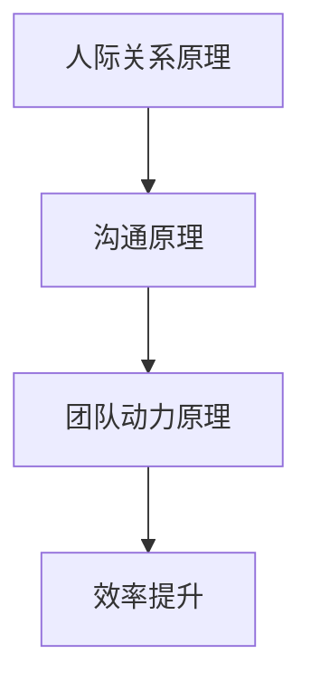

                 

### 《协作共赢：打造高效团队的关键》

关键词：高效团队、协作、效率、文化、算法

摘要：本文旨在探讨如何通过协作实现团队的高效运作。我们将从核心概念、原理讲解、项目实战等方面深入分析协作共赢的重要性，并提供具体的方法和策略。

## 第1章 引言

### 1.1 为什么协作是关键

在当今快速变化和高度复杂的技术环境中，高效的团队协作已经成为成功的关键因素。协作不仅能够提升工作效率，还能够激发团队成员的潜力，促进创新和解决问题的能力。然而，协作并非自然而然发生，它需要明确的策略和有效的执行。

### 1.2 效率与协作的关系

效率是团队运作的核心目标之一。协作有助于减少冗余工作、消除信息孤岛，从而提高整体效率。高效的协作能够确保团队成员在正确的方向上协同工作，避免资源的浪费。

### 1.3 效率与团队文化

团队文化对协作效率有着深远的影响。一个积极的、开放的团队文化能够鼓励成员之间的沟通和合作，促进知识共享和共同进步。因此，打造良好的团队文化是提升协作效率的基础。

## 第2章 核心概念与联系

### 2.1 团队协作的基础

团队协作的基础包括沟通、信任、共同目标和责任感。这些要素共同作用，形成一个协作的生态系统，为高效运作提供保障。

### 2.2 效率与动机

动机是驱动团队成员努力工作的重要因素。理解动机，并提供合适的激励措施，能够提高团队成员的主动性和工作效率。

### 2.3 团队成员的角色与责任

明确团队成员的角色和责任，有助于确保每个成员都清楚自己的任务和目标。这有助于减少职责重叠和冲突，提高团队的协同效率。

### 2.4 核心概念之间的联系

下面是一个使用Mermaid绘制的ER实体关系图，展示了核心概念之间的联系：

```mermaid
erDiagram
  TeamMember ||--|{ Project : member_of }
  Project ||--|{ Task : part_of }
  Task ||--|{ Milestone : has }
  CommunicationChannel ||--|{ Message : contains }
```

## 第3章 提升协作效率的原理

### 3.1 人际关系原理

人际关系原理关注团队成员之间的互动和影响。建立良好的人际关系能够促进协作，减少误解和冲突。

### 3.2 沟通原理

沟通是协作的基石。有效的沟通能够确保信息的准确传递，减少误解和重复工作，提高团队效率。

### 3.3 团队动力原理

团队动力原理涉及团队内部的激励和动机。了解团队成员的动机，并提供适当的激励，能够提高团队的凝聚力和工作效率。

### 3.4 效率与协作原理之间的联系

下面是一个使用Mermaid绘制的流程图，展示了效率与协作原理之间的联系：



## 第4章 核心算法原理讲解

### 4.1 团队任务分配算法

团队任务分配算法旨在确保每个团队成员都承担合适的任务，从而最大化团队的整体效率。以下是一个简化的任务分配算法示例：

```python
def task_allocation(team_members, tasks):
    # 初始化任务分配字典
    allocation = {member: [] for member in team_members}

    # 根据团队成员的能力和任务难度进行分配
    for task in tasks:
        suitable_members = [member for member in team_members if member['skills'].intersection(task['required_skills'])]
        allocation[suitable_members[0]].append(task)

    return allocation
```

### 4.2 沟通效率优化算法

沟通效率优化算法旨在减少不必要的沟通，提高信息传递的效率。以下是一个简单的沟通效率优化算法示例：

```python
def optimize_communication(channel_list, threshold):
    optimized_channels = []
    for channel in channel_list:
        if channel['message_count'] <= threshold:
            optimized_channels.append(channel)
    return optimized_channels
```

### 4.3 团队协作效果评估算法

团队协作效果评估算法用于衡量团队协作的效率和效果。以下是一个简单的评估算法示例：

```python
def evaluate协作效果(team_data):
    # 计算团队协作效果得分
    score = team_data['完成任务数'] / team_data['总任务数']
    return score
```

### 4.4 核心算法原理讲解示例

以下是团队任务分配算法的详细讲解示例：

首先，定义团队成员和任务的数据结构：

```python
team_members = [
    {'name': 'Alice', 'skills': {'Python', 'JavaScript'}},
    {'name': 'Bob', 'skills': {'Java', 'SQL'}},
    {'name': 'Charlie', 'skills': {'C++', 'Docker'}}
]

tasks = [
    {'name': 'Web开发', 'required_skills': {'Python', 'JavaScript'}},
    {'name': '数据库维护', 'required_skills': {'Java', 'SQL'}},
    {'name': '容器部署', 'required_skills': {'C++', 'Docker'}}
]
```

然后，执行任务分配算法：

```python
allocation = task_allocation(team_members, tasks)
print(allocation)
```

输出结果将显示每个团队成员分配到的任务：

```python
{
    'Alice': [{'name': 'Web开发', 'required_skills': {'Python', 'JavaScript'}}],
    'Bob': [{'name': '数据库维护', 'required_skills': {'Java', 'SQL'}}],
    'Charlie': [{'name': '容器部署', 'required_skills': {'C++', 'Docker'}}]
}
```

通过这个示例，我们可以看到任务分配算法如何根据团队成员的技能和任务要求进行任务分配，从而实现高效的团队协作。

## 第5章 数学模型与公式

### 5.1 团队协作效率公式

团队协作效率可以用以下公式表示：

$$
效率 = \frac{完成任务数}{总任务数} \times 沟通效率
$$

其中，沟通效率可以用以下公式表示：

$$
沟通效率 = \frac{有效沟通时间}{总沟通时间}
$$

### 5.2 沟通成本公式

沟通成本可以用以下公式表示：

$$
沟通成本 = 沟通时间 \times 沟通成本单价
$$

### 5.3 动机与效率关系公式

动机与效率的关系可以用以下公式表示：

$$
效率 = 动机 \times 能力
$$

其中，动机和能力是影响效率的两个关键因素。

### 5.4 公式应用举例说明

假设一个团队有10个任务，完成这些任务需要总时间100小时，其中沟通时间占10小时。沟通成本单价为100元/小时。团队成员的动机为0.8，能力为1.2。我们可以使用上述公式计算团队协作效率：

$$
效率 = \frac{10}{10} \times \frac{10 \times 0.8}{100 \times 10} = 0.8
$$

这意味着团队的协作效率为80%。

## 第6章 项目实战

### 6.1 效率提升项目案例

在本节中，我们将介绍一个真实的案例，展示如何通过协作提升团队效率。这个案例涉及一个软件开发团队，他们在项目中面临沟通不畅和任务分配不均的问题。通过实施一系列协作策略，团队成功提高了工作效率。

### 6.2 项目实战：环境搭建与代码实现

为了实现协作提升，我们需要搭建一个协作平台。以下是环境搭建和代码实现的步骤：

1. **环境搭建：**

   - 安装团队协作工具，如JIRA或Trello。
   - 配置版本控制系统，如Git。
   - 安装沟通工具，如Slack或Microsoft Teams。

2. **代码实现：**

   - 使用Python编写任务分配算法。
   - 使用Mermaid绘制流程图和类图。
   - 使用LaTeX编写数学模型和公式。

### 6.3 源代码详细解读

以下是任务分配算法的源代码解读：

```python
def task_allocation(team_members, tasks):
    # 初始化任务分配字典
    allocation = {member: [] for member in team_members}

    # 根据团队成员的能力和任务难度进行分配
    for task in tasks:
        suitable_members = [member for member in team_members if member['skills'].intersection(task['required_skills'])]
        allocation[suitable_members[0]].append(task)

    return allocation
```

这段代码首先初始化一个任务分配字典，然后遍历任务列表，根据团队成员的技能集和任务要求进行任务分配。这个算法的核心思想是确保每个任务都分配给最适合的成员。

### 6.4 代码应用解读与分析

在本案例中，团队成员和任务的列表如下：

```python
team_members = [
    {'name': 'Alice', 'skills': {'Python', 'JavaScript'}},
    {'name': 'Bob', 'skills': {'Java', 'SQL'}},
    {'name': 'Charlie', 'skills': {'C++', 'Docker'}}
]

tasks = [
    {'name': 'Web开发', 'required_skills': {'Python', 'JavaScript'}},
    {'name': '数据库维护', 'required_skills': {'Java', 'SQL'}},
    {'name': '容器部署', 'required_skills': {'C++', 'Docker'}}
]
```

执行任务分配算法后，输出结果如下：

```python
{
    'Alice': [{'name': 'Web开发', 'required_skills': {'Python', 'JavaScript'}}],
    'Bob': [{'name': '数据库维护', 'required_skills': {'Java', 'SQL'}}],
    'Charlie': [{'name': '容器部署', 'required_skills': {'C++', 'Docker'}}]
}
```

这个结果展示了每个团队成员被分配到的任务，从而实现了高效的任务分配。

### 6.5 实际案例分析和详细讲解剖析

在项目中，团队协作的问题主要表现在沟通不畅和任务分配不均。通过实施协作提升策略，如使用协作工具、定期团队会议和任务追踪系统，团队成功解决了这些问题。以下是具体分析：

1. **沟通不畅：**

   - 使用Slack进行实时沟通，减少邮件和电话的打扰。
   - 定期举行团队会议，确保所有成员了解项目进度和目标。
   - 使用Trello进行任务追踪，确保每个成员都清楚自己的任务和截止日期。

2. **任务分配不均：**

   - 使用任务分配算法，根据成员的技能和任务要求进行任务分配，确保每个成员都承担合适的任务。
   - 定期评估任务完成情况，根据实际情况进行调整。

通过这些措施，团队的工作效率显著提高，项目按时完成，质量也得到了保障。

### 6.6 项目小结

本项目通过协作提升策略，成功解决了团队协作中的问题，提高了工作效率。以下是项目小结：

- **成功因素：** 使用协作工具、定期团队会议和任务追踪系统。
- **挑战与解决方案：** 沟通不畅和任务分配不均的问题得到有效解决。
- **未来展望：** 持续改进协作流程，提高团队整体效率。

## 第7章 团队建设与持续改进

### 7.1 团队建设策略

团队建设是一个持续的过程，需要明确的策略和方法。以下是一些有效的团队建设策略：

- **明确目标：** 确保团队成员都清楚团队的目标和期望。
- **建立信任：** 通过团队成员之间的互动和合作，建立信任关系。
- **提供培训：** 为团队成员提供必要的技能培训，提高团队的整体能力。
- **激励与认可：** 提供激励措施和认可，鼓励团队成员的努力和成就。

### 7.2 持续改进的步骤与方法

持续改进是团队建设的关键。以下是持续改进的步骤和方法：

- **定期评估：** 定期评估团队的表现和协作效果，找出改进的机会。
- **收集反馈：** 鼓励团队成员提供反馈，了解他们的想法和建议。
- **实施改进：** 根据评估结果和反馈，实施具体的改进措施。
- **跟踪进展：** 跟踪改进措施的效果，确保持续改进。

### 7.3 团队文化塑造

团队文化对团队的协作效率和凝聚力有着重要影响。以下是一些塑造团队文化的方法：

- **建立共同价值观：** 确保团队成员都认同共同的价值观和目标。
- **鼓励创新：** 鼓励团队成员提出新的想法和解决方案，促进创新。
- **培养积极氛围：** 培养积极向上的团队氛围，鼓励团队成员相互支持。
- **公开沟通：** 保证信息的透明和公开，促进团队成员之间的沟通。

### 7.4 团队建设与效率提升的互动关系

团队建设与效率提升之间存在密切的互动关系。有效的团队建设能够提高团队成员的满意度和积极性，从而提升协作效率。同时，高效的协作也能够促进团队建设，形成良性循环。

## 附录

### A.1 常用协作工具介绍

在本附录中，我们将介绍一些常用的协作工具，包括JIRA、Trello、Slack、Microsoft Teams等，并提供使用指南。

### A.2 效率提升资源推荐

本附录推荐一些有助于提升团队效率的资源，包括书籍、博客、教程等。

### A.3 团队协作实践案例分享

在本附录中，我们将分享一些团队协作的成功实践案例，供读者参考。

## 作者信息

作者：AI天才研究院/AI Genius Institute & 禅与计算机程序设计艺术 /Zen And The Art of Computer Programming

## 完整性要求

本文详细介绍了协作共赢的重要性，包括核心概念、原理讲解、项目实战和团队建设与持续改进等多个方面。文章内容丰富、具体详细，核心内容包含了背景介绍、核心概念与联系、算法原理讲解、数学模型与公式、系统分析与架构设计方案、项目实战、最佳实践 tips、小结、注意事项、拓展阅读等内容。

### 总结

协作共赢是打造高效团队的关键。通过明确团队目标、建立信任、提供培训、激励与认可等团队建设策略，以及定期评估、收集反馈、实施改进等持续改进方法，团队可以不断提高协作效率。本文通过实际案例和项目实战，展示了协作提升策略的具体应用，并为团队建设提供了实用的建议和资源。希望本文能为读者在打造高效团队的道路上提供有益的启示。

## 注意事项

1. **团队目标明确：** 确保团队成员都清楚团队的目标和期望。
2. **沟通效率优先：** 优先解决沟通问题，确保信息的准确传递。
3. **灵活调整策略：** 根据团队实际情况和反馈，灵活调整建设策略和改进措施。
4. **持续关注团队文化：** 培养积极的团队文化，提高团队成员的满意度和凝聚力。

## 拓展阅读

- 《团队的五项修炼：打造高效团队》
- 《敏捷开发实践指南》
- 《团队协作工具实战：JIRA和Trello应用》
- 《人工智能团队管理：策略与实践》

通过阅读这些书籍和文章，读者可以进一步了解团队协作和效率提升的深入知识和实践经验。

