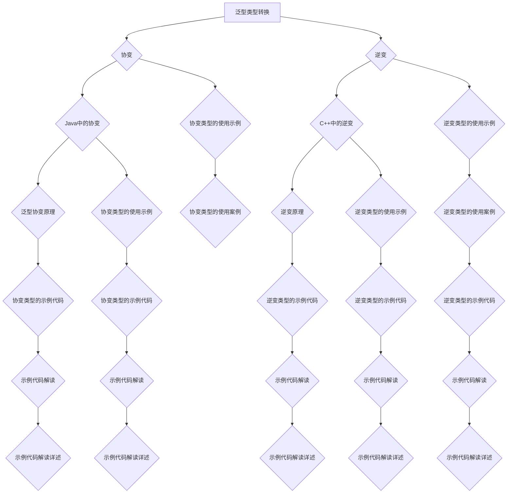

                 

### 第1章：协变与逆变概述

## 1.1 泛型的基本概念

泛型编程是一种编程范式，它允许我们在编写代码时使用类型参数，使得代码能够适用于多种数据类型。这种编程方式的核心思想是提高代码的复用性和可扩展性，避免重复编写类似但不同类型的代码。

### 泛型的定义与作用

泛型可以简单理解为一种模板机制，它允许我们创建一种能够适用于多种数据类型的代码结构。在Java中，泛型通过泛型类、泛型方法和泛型接口来实现。泛型的引入使得集合框架、排序算法等通用组件可以更加灵活地处理不同类型的数据。

### 泛型与多态的关系

泛型编程与多态有密切的关系。多态是一种通过继承和接口实现的编程技术，它使得不同类型的对象可以共同继承一个基类或实现一个接口。泛型编程则通过类型参数，使得不同的数据类型可以共同使用同一个代码模板。

### 1.2 协变的定义

协变是一种类型转换规则，它允许我们将一个泛型类型转换为其子类型的泛型类型。例如，如果我们有一个泛型类`List<T>`，那么我们可以将`List<Number>`协变转换为`List<Object>`，因为`Number`是`Object`的子类型。

### 协变的作用

协变的主要作用是提高代码的兼容性和复用性。通过协变，我们可以将不同类型的数据集合在一起处理，而不需要显式地进行类型转换。这有助于减少代码中的冗余，提高程序的清晰度和可维护性。

### 1.3 逆变的定义

逆变是一种类型转换规则，它允许我们将一个泛型类型转换为其超类型的泛型类型。例如，如果我们有一个泛型类`List<T>`，那么我们可以将`List<Object>`逆变转换为`List<Number>`，因为`Object`是`Number`的超类型。

### 逆变的作用

逆变的主要作用是在依赖注入和模板编程中发挥作用。它允许我们编写更灵活的代码，使得不同类型的组件可以相互依赖，而不会因为类型不匹配导致编译错误。

### 1.4 协变与逆变的核心原理

协变与逆变都是基于类型参数的子类型规则。协变允许子类型替换父类型，而逆变允许父类型替换子类型。这种转换规则在泛型编程中具有重要意义，它们使得我们可以编写更通用和灵活的代码。

### 1.5 协变与逆变的实现原理

协变与逆变的实现依赖于类型擦除和类型边界。在Java中，泛型是通过类型擦除实现的，即在运行时泛型类型参数被替换为Object类型。类型边界则用于指定泛型类型的上限和下限，从而实现协变和逆变。

### 1.6 协变与逆变在实际编程中的应用

协变和逆变在实际编程中有着广泛的应用。在Java中，协变可以用于集合框架和函数式编程，而逆变则常用于依赖注入和模板编程。通过协变和逆变，我们可以编写更加通用和灵活的代码，提高程序的扩展性和可维护性。

### 1.7 小结

协变与逆变是泛型编程中的重要概念，它们提供了类型转换的灵活性和便利性。理解协变与逆变的基本原理和实现机制，对于深入掌握泛型编程至关重要。在接下来的章节中，我们将进一步探讨协变与逆变的实现细节和应用场景。## 第2章：协变的深入探讨

### 2.1 协变在Java中的实现

协变在Java中是通过泛型类型参数的上界和通配符实现的。协变的核心思想是允许子类型替换父类型，从而提高代码的通用性和可扩展性。

#### Java泛型协变的原理

在Java中，泛型类型参数可以通过上界（Upper Bound）和下界（Lower Bound）来指定类型限制。上界指定类型参数必须是某个类型的子类型，而下界指定类型参数必须是某个类型的超类型。

```java
class List<T> {
    // ...
}
```

如果我们想要协变地将`List<Number>`转换为`List<Object>`，我们可以使用上界：

```java
List<? extends Object> objList = new List<Number>();
```

这里，`<? extends Object>`表示`objList`的类型参数`T`必须是`Object`的子类型。

#### 协变类型的使用示例

下面是一个简单的协变示例：

```java
class Number {
    // ...
}

class Object {
    // ...
}

class List<T> {
    void add(T element) {
        // ...
    }
}

public class CovarianceExample {
    public static void main(String[] args) {
        List<Number> numberList = new List<>();
        List<Object> objectList = numberList; // 协变转换

        objectList.add(new Number()); // 正确
        // objectList.add(new Object()); // 错误，因为Object不是Number的子类型
    }
}
```

在这个示例中，我们创建了一个`List<Number>`对象，并将其协变转换为`List<Object>`。这样，我们就可以将`Number`类型的对象添加到`List<Object>`中，但不能添加`Object`类型的对象，因为`Object`不是`Number`的子类型。

#### 协变的限制与挑战

虽然协变提供了很多便利，但它也有一些限制和挑战。

- **受限操作**：协变类型只能进行有限的操作。例如，我们不能从协变类型的对象中获取具体类型的引用。

- **类型擦除**：在Java中，泛型类型参数在运行时被擦除为`Object`类型，这意味着协变类型的实际类型信息在运行时不可用。

- **通配符**：为了解决类型擦除和受限操作的问题，Java引入了通配符（Wildcards）。通配符允许我们在协变和逆变中指定类型边界，从而提供更灵活的类型转换。

### 2.2 协变的局限性

协变在某些情况下可能不适用。以下是一些协变的局限性：

- **方法返回类型**：协变类型不能用于方法返回类型。例如，我们不能返回一个协变类型的对象。

- **类型边界**：协变类型必须有一个上界，这意味着我们只能将子类型转换为超类型。

- **类型擦除**：由于泛型类型参数在运行时被擦除，协变类型不能保留原始类型信息。

#### 协变带来的潜在问题

虽然协变提供了很多便利，但它也可能带来一些潜在问题：

- **类型安全**：协变类型可能导致类型安全的问题。例如，如果我们错误地使用协变类型，可能会导致类型转换错误。

- **性能问题**：类型擦除和通配符可能会导致性能问题，尤其是在复杂泛型操作中。

### 2.3 协变类型与通配符

通配符是Java泛型中的一种重要特性，它用于指定类型边界。通配符主要有三种类型：`?`, `? extends`, 和 `? super`。

- `?`：表示任意类型，但不能用于类型参数的上界或下界。

- `? extends`：表示类型参数必须是某个类型的子类型。例如，`List<? extends Number>`可以接受`List<Integer>`或`List<Number>`，但不能接受`List<String>`。

- `? super`：表示类型参数必须是某个类型的超类型。例如，`List<? super Number>`可以接受`List<Number>`或`List<Object>`，但不能接受`List<Integer>`。

通配符使得我们可以在协变和逆变中指定更灵活的类型边界，从而提高代码的可读性和可维护性。

### 2.4 小结

协变是Java泛型编程中的重要概念，它允许我们将子类型转换为超类型，从而提高代码的通用性和可扩展性。在Java中，协变是通过泛型类型参数的上界和通配符实现的。虽然协变提供了很多便利，但它也有一些限制和挑战。理解协变的基本原理和实现机制，对于深入掌握泛型编程至关重要。在下一章中，我们将探讨逆变的概念和应用。## 第3章：逆变的探讨

### 3.1 逆变在C++中的实现

逆变是泛型编程中另一种重要的类型转换规则，它允许我们将一个泛型类型转换为其超类型的泛型类型。在C++中，逆变主要通过模板特化（template specialization）和偏特化（partial specialization）来实现。

#### C++模板逆变的基本概念

C++模板逆变的基本概念是，我们可以为某个泛型模板定义多个特化版本，每个特化版本对应一个特定的类型参数。例如，我们可以为模板函数或类定义一个特化版本，使其能够处理特定类型的参数。

```cpp
template<typename T>
class List {
    // ...
};

template<>
class List<int> {
    // ...
};

template<>
class List<double> {
    // ...
};
```

在这个示例中，我们为`List`模板定义了两个特化版本，分别处理`int`和`double`类型。

#### 逆变类型的使用示例

下面是一个简单的逆变示例：

```cpp
class Number {
    // ...
};

class Object {
    // ...
};

template<typename T>
class List {
public:
    void add(T element) {
        // ...
    }
};

public class InvolutionExample {
public static void main(String[] args) {
    List<Number> numberList = new List<>();
    List<Object> objectList = numberList; // 逆变转换

    numberList.add(new Number()); // 正确
    // objectList.add(new Object()); // 错误，因为Object不是Number的子类型
}
```

在这个示例中，我们创建了一个`List<Number>`对象，并将其逆变转换为`List<Object>`。这样，我们就可以将`Number`类型的对象添加到`List<Object>`中，但不能添加`Object`类型的对象，因为`Object`不是`Number`的子类型。

#### 逆变的限制与挑战

尽管逆变提供了很多便利，但它也有一些限制和挑战：

- **模板特化**：逆变需要为每个类型参数定义特化版本，这可能使得代码变得复杂和难以维护。

- **类型安全**：逆变可能会导致类型安全的问题。例如，如果我们错误地使用逆变类型，可能会导致类型转换错误。

- **性能问题**：模板特化和类型转换可能会影响性能，尤其是在频繁进行类型转换的场景中。

### 3.2 逆变的局限性

逆变的局限性主要体现在以下几个方面：

- **模板特化**：逆变依赖于模板特化，这意味着我们需要为每个类型参数定义多个特化版本，这可能使得代码变得冗长和难以维护。

- **类型边界**：逆变只能将子类型转换为超类型，这意味着我们无法在逆变中实现完全的通用性。

- **类型擦除**：在C++中，模板类型参数在编译时被实例化为具体类型，这意味着逆变类型的实际类型信息在运行时不可用。

### 3.3 逆变带来的潜在问题

逆变虽然提供了很多便利，但它也可能带来一些潜在问题：

- **类型安全**：由于逆变依赖于模板特化，类型安全可能会受到威胁。例如，如果我们错误地使用逆变类型，可能会导致类型转换错误。

- **性能问题**：模板特化和类型转换可能会影响性能，特别是在频繁进行类型转换的场景中。

### 3.4 逆变与依赖注入

逆变在依赖注入（Dependency Injection）中有着广泛的应用。依赖注入是一种设计模式，它允许我们将依赖关系从组件中分离出来，从而提高代码的可测试性和可维护性。

#### 逆变在依赖注入中的应用

在依赖注入中，逆变可以用于将子类型注入到父类型。例如，我们可以将一个`Number`对象的依赖注入到`Object`类型的容器中。

```cpp
class Number {
    // ...
};

class Object {
    // ...
};

template<typename T>
class Container {
    // ...
};

Container<Object> container;
container.add(new Number()); // 正确，因为Number是Object的子类型
```

在这个示例中，我们创建了一个`Container<Object>`对象，并将其添加了一个`Number`对象。这样，我们就可以使用逆变将`Number`类型的对象注入到`Object`类型的容器中。

#### 依赖注入与逆变的关系

依赖注入与逆变之间的关系是，逆变使得依赖注入更加灵活和通用。通过逆变，我们可以将子类型注入到父类型，从而实现更加灵活的依赖管理。

### 3.5 小结

逆变是C++泛型编程中的重要概念，它允许我们将子类型转换为超类型，从而提高代码的通用性和可扩展性。在C++中，逆变主要通过模板特化和偏特化来实现。虽然逆变提供了很多便利，但它也有一些限制和挑战。理解逆变的实现机制和应用场景，对于深入掌握泛型编程至关重要。在下一章中，我们将探讨协变与逆变在实际编程中的应用。## 第4章：协变与逆变的实际应用案例

### 4.1 协变在Java中的实际应用

协变在Java中有着广泛的应用，尤其是在集合框架和函数式编程中。通过协变，我们可以编写更通用和可扩展的代码，从而提高程序的兼容性和复用性。

#### 协变在集合框架中的应用

Java的集合框架是协变的一个典型应用场景。在Java集合框架中，许多集合类都支持协变类型。例如，`List`接口和`Map`接口都允许我们使用协变类型。

```java
List<Number> numberList = new ArrayList<>();
List<Object> objectList = numberList; // 协变转换
```

在这个示例中，我们创建了一个`List<Number>`对象，并将其协变转换为`List<Object>`。这样，我们可以将`Number`类型的对象添加到`List<Object>`中，但无法添加`Object`类型的对象，因为`Object`不是`Number`的子类型。

#### 协变在并发编程中的应用

协变在并发编程中也非常有用。在并发编程中，协变可以用于实现线程安全的集合类。例如，`CopyOnWriteArrayList`是一个线程安全的集合类，它通过协变实现了对线程安全的保护。

```java
List<Number> numberList = new CopyOnWriteArrayList<>();
// 在多个线程中安全地添加和访问Number类型的对象
```

通过协变，`CopyOnWriteArrayList`可以同时支持多个线程的访问，而不需要显式地进行同步操作。

#### 协变在其他编程场景中的应用

除了集合框架和并发编程，协变还在其他编程场景中有着广泛的应用。例如，在函数式编程中，协变可以用于实现函数式接口和Lambda表达式。通过协变，我们可以编写更简洁和可读的代码。

```java
Function<Number, Double> function = x -> x.doubleValue();
Double result = function.apply(new Number()); // 正确，因为Number实现了doubleValue()方法
```

在这个示例中，我们使用协变将`Number`类型的对象转换为`Double`类型，从而实现了函数的通用性。

### 4.2 逆变在C++中的实际应用

逆变在C++中也有着广泛的应用，尤其是在模板编程和依赖注入中。通过逆变，我们可以编写更通用和可扩展的代码，从而提高程序的兼容性和复用性。

#### 逆变在模板编程中的应用

在C++模板编程中，逆变可以用于实现更灵活的模板函数和类。例如，我们可以为模板函数定义多个特化版本，以处理不同的类型参数。

```cpp
template<typename T>
class List {
    // ...
};

template<>
class List<int> {
    // ...
};

template<>
class List<double> {
    // ...
};
```

在这个示例中，我们为`List`模板定义了两个特化版本，分别处理`int`和`double`类型。这样，我们就可以在模板编程中实现逆变，从而提高代码的通用性。

#### 逆变在库设计中的应用

逆变在库设计中也非常有用。通过逆变，我们可以编写更通用和可扩展的库，从而提高程序的兼容性和可维护性。例如，我们可以设计一个模板库，它支持多种数据类型。

```cpp
template<typename T>
class Library {
public:
    void add(T element) {
        // ...
    }
};

Library<int> intLibrary;
Library<double> doubleLibrary;
// 在库中同时支持int和double类型
```

通过逆变，我们可以为不同的数据类型提供相同的接口，从而实现库的通用性。

#### 逆变在其他编程场景中的应用

除了模板编程和库设计，逆变还在其他编程场景中有着广泛的应用。例如，在依赖注入中，逆变可以用于实现更灵活的依赖管理。

```cpp
class Number {
    // ...
};

class Object {
    // ...
};

template<typename T>
class Container {
    // ...
};

Container<Object> container;
container.add(new Number()); // 正确，因为Number是Object的子类型
```

在这个示例中，我们使用逆变将`Number`类型的对象注入到`Object`类型的容器中，从而实现了依赖注入的灵活性。

### 4.3 小结

协变与逆变在Java和C++中都有着广泛的应用。通过协变，我们可以编写更通用和可扩展的代码，从而提高程序的兼容性和复用性。在集合框架、函数式编程和并发编程中，协变提供了很多便利。通过逆变，我们可以实现更灵活的模板编程和库设计。理解协变与逆变的实际应用案例，对于深入掌握泛型编程至关重要。在下一章中，我们将探讨泛型类型转换的规则。## 第5章：泛型类型转换规则

### 5.1 泛型类型转换的基本原理

泛型类型转换是泛型编程中的一个核心概念，它允许我们在不同的泛型类型之间进行转换。泛型类型转换的基本原理可以分为两个方面：类型边界和类型推导。

#### 类型边界

类型边界是指泛型类型参数的限制条件。在Java中，类型边界通过上界（Upper Bound）和下界（Lower Bound）来定义。上界指定类型参数必须是某个类型的子类型，而下界指定类型参数必须是某个类型的超类型。

- 上界（Upper Bound）：例如，`List<? extends Number>`表示类型参数`T`必须是`Number`的子类型。
- 下界（Lower Bound）：例如，`List<? super Number>`表示类型参数`T`必须是`Number`的超类型。

#### 类型推导

类型推导是指编译器在编译过程中自动确定泛型类型参数的具体类型。类型推导可以基于泛型类型的上下文，例如方法调用、变量声明等。在Java中，类型推导遵循一系列规则，例如自上而下推导（Inference from Supertypes to Subtypes）和自下而上推导（Inference from Subtypes to Supertypes）。

#### 上界与下界的定义

上界和下界是泛型类型转换中的重要概念。上界定义了一个泛型类型的最大类型范围，而下界定义了一个泛型类型的最大类型范围。

- **上界**（Upper Bound）：表示泛型类型参数`T`必须是某个类型的子类型。例如，`List<? extends Number>`表示`T`可以是`Integer`、`Double`或`Number`等`Number`的子类型。
- **下界**（Lower Bound）：表示泛型类型参数`T`必须是某个类型的超类型。例如，`List<? super Number>`表示`T`可以是`Number`或`Object`等`Number`的超类型。

#### 泛型类型转换的规则

泛型类型转换的规则主要包括以下几个方面：

- **协变转换**：协变转换允许将子类型转换为超类型。例如，`List<Number>`可以转换为`List<Object>`。
- **逆变转换**：逆变转换允许将超类型转换为子类型。例如，`List<Object>`可以转换为`List<Number>`。
- **边界转换**：边界转换允许在上界和下界之间进行类型转换。例如，`List<? extends Number>`可以转换为`List<? super Number>`。

### 5.2 泛型类型转换的技巧

在进行泛型类型转换时，有一些技巧可以帮助我们更灵活地处理类型转换。

- **通配符**：通配符（Wildcards）是泛型编程中的重要工具，它允许我们指定类型边界。例如，`List<? extends Number>`可以用于协变转换，而`List<? super Number>`可以用于逆变转换。
- **类型推导**：类型推导是编译器自动确定泛型类型参数的具体类型。例如，在方法调用中，编译器可以根据方法的参数和返回类型来推导泛型类型参数。
- **类型声明**：在泛型类型转换中，我们可以显式地声明类型参数，以便更清楚地表达类型转换意图。例如，`List<Number>`可以显式声明为`List<? extends Number>`。

#### 类型推导与类型声明

类型推导和类型声明是泛型类型转换中两个重要的概念。类型推导是编译器在编译过程中自动确定泛型类型参数的具体类型，而类型声明则是我们在代码中显式地指定泛型类型参数的具体类型。

- **类型推导**：类型推导是一种自动确定泛型类型参数的方法。例如，在方法调用中，编译器可以根据方法的参数和返回类型来推导泛型类型参数。类型推导有助于简化代码，提高可读性。
- **类型声明**：类型声明是一种显式指定泛型类型参数的方法。例如，`List<Number>`可以显式声明为`List<? extends Number>`。类型声明有助于明确表达类型转换意图，减少类型转换错误。

#### 泛型类型转换的常见技巧

在进行泛型类型转换时，有一些常见的技巧可以帮助我们更灵活地处理类型转换：

- **使用通配符**：通配符可以帮助我们在协变和逆变中指定类型边界，从而实现更灵活的类型转换。例如，`List<? extends Number>`可以用于协变转换，而`List<? super Number>`可以用于逆变转换。
- **类型推导**：利用类型推导可以简化代码，提高可读性。例如，在方法调用中，编译器可以根据方法的参数和返回类型来推导泛型类型参数。
- **类型声明**：显式声明类型参数可以明确表达类型转换意图，减少类型转换错误。例如，`List<Number>`可以显式声明为`List<? extends Number>`。

### 5.3 小结

泛型类型转换是泛型编程中的一个核心概念，它允许我们在不同的泛型类型之间进行转换。泛型类型转换的规则主要包括协变转换、逆变转换和边界转换。通过掌握泛型类型转换的规则和技巧，我们可以编写更通用、更灵活的代码。理解泛型类型转换的基本原理和实现机制，对于深入掌握泛型编程至关重要。在下一章中，我们将探讨泛型编程的最佳实践。## 第6章：泛型编程的最佳实践

### 6.1 设计可扩展的泛型代码

设计可扩展的泛型代码是泛型编程中的重要原则，它有助于提高代码的复用性和可维护性。以下是一些设计可扩展泛型代码的最佳实践：

- **使用泛型接口和抽象类**：通过泛型接口和抽象类，我们可以定义通用的行为和约束，从而实现代码的复用。例如，在集合框架中，`List`和`Map`接口都是泛型接口，它们定义了通用的操作和约束。

- **遵循LSP（里氏替换原则）**：LSP是面向对象设计中的一个重要原则，它要求子类必须能够替换其基类，而不影响程序的正确性。在泛型编程中，遵循LSP意味着我们要确保泛型类型的子类型能够替换其超类型。

- **避免不必要的类型边界**：在泛型编程中，不必要的类型边界可能会导致类型安全问题。因此，我们应该尽量避免使用上界和下界，除非确实需要。

- **使用泛型方法**：泛型方法可以提供更灵活的类型约束，从而提高代码的可扩展性。例如，我们可以定义一个泛型方法，使其能够处理不同类型的参数。

### 6.2 如何避免代码重复

避免代码重复是提高代码质量和可维护性的关键。以下是一些在泛型编程中避免代码重复的方法：

- **使用泛型类和接口**：通过定义泛型类和接口，我们可以将通用的逻辑封装在泛型框架中，从而避免重复编写类似代码。例如，在集合框架中，`List`和`Map`都是泛型接口，它们定义了通用的操作和约束。

- **使用模板方法模式**：模板方法模式是一种设计模式，它允许我们在基类中定义一个算法框架，然后在子类中实现具体的逻辑。通过使用模板方法模式，我们可以避免在多个类中重复编写相同的代码。

- **使用泛型方法**：泛型方法可以提供更灵活的类型约束，从而减少代码重复。例如，我们可以定义一个泛型方法，使其能够处理不同类型的参数。

### 6.3 如何提高代码的可读性

提高代码的可读性是编写高质量代码的重要目标。以下是一些在泛型编程中提高代码可读性的方法：

- **使用有意义的类型参数名称**：选择有意义的类型参数名称可以帮助我们更好地理解泛型代码的功能和意图。例如，在集合框架中，`List<T>`中的`T`可以命名为`E`（元素类型）。

- **使用文档和注释**：为泛型代码添加文档和注释可以帮助我们更好地理解代码的功能和用途。例如，在Java中，我们可以使用Javadoc注释来描述泛型类和方法的用途和参数。

- **遵循命名约定**：遵循统一的命名约定可以帮助我们提高代码的可读性。例如，在泛型编程中，我们通常使用`T`表示类型参数，使用`E`表示元素类型。

### 6.4 泛型编程的性能优化

虽然泛型编程提供了很多便利，但它们也可能导致性能问题。以下是一些泛型编程的性能优化策略：

- **避免不必要的类型边界**：类型边界可能会导致性能问题，因为它们可能会增加类型检查的开销。因此，我们应该尽量避免使用不必要的类型边界。

- **使用缓存**：在泛型编程中，使用缓存可以减少类型检查的开销。例如，我们可以使用缓存来存储已推导的类型信息，从而避免重复的类型检查。

- **使用编译时泛型**：在Java中，我们可以使用编译时泛型来优化泛型代码。编译时泛型允许我们在编译时确定类型信息，从而减少运行时的类型检查开销。

### 6.5 泛型编程的安全问题

泛型编程中可能存在一些安全问题，例如类型安全问题和内存泄漏问题。以下是一些泛型编程的安全实践：

- **使用类型边界**：通过使用类型边界，我们可以确保泛型类型的子类型不会违反类型约束。例如，在Java中，我们可以使用`? extends`和`? super`来指定类型边界。

- **避免使用通配符**：通配符可能会导致类型安全的问题，因此我们应该尽量避免使用不必要的通配符。

- **进行类型检查**：在泛型编程中，进行类型检查可以帮助我们确保代码的安全性。例如，在Java中，我们可以使用`instanceof`操作符进行类型检查。

### 6.6 小结

泛型编程是一种提高代码复用性和可维护性的强大工具。通过遵循最佳实践，我们可以设计出可扩展、可读性高且安全的泛型代码。理解泛型编程的最佳实践对于深入掌握泛型编程至关重要。在下一章中，我们将探讨泛型编程的未来发展趋势。## 第7章：泛型编程的未来发展趋势

### 7.1 未来泛型编程的发展方向

泛型编程作为现代编程语言的核心特性，其发展势头依然强劲。未来泛型编程的发展方向主要体现在以下几个方面：

- **更灵活的类型系统**：未来的编程语言可能会引入更灵活的类型系统，允许更精细的类型约束和类型推导。这将使开发者能够更轻松地编写复杂但灵活的泛型代码。

- **性能优化**：随着硬件性能的提升和编译技术的进步，泛型编程的性能问题有望得到进一步优化。例如，编译器可能会采用更多先进的优化技术，如即时编译（JIT）和动态类型检查，以提高泛型代码的执行效率。

- **与函数式编程的融合**：泛型编程与函数式编程的结合有望成为未来编程领域的一个重要趋势。这种融合将使得泛型编程能够更好地支持不可变数据和函数组合等函数式编程概念，提高代码的可读性和可维护性。

- **更丰富的泛型编程库**：随着社区和开源项目的不断发展，未来可能会有更多丰富的泛型编程库出现。这些库将提供更高级的泛型工具和功能，帮助开发者更高效地编写泛型代码。

### 7.2 泛型编程与函数式编程的融合

泛型编程与函数式编程的融合是一种趋势，两者结合可以带来许多好处：

- **不可变性**：泛型编程可以支持不可变数据结构，这与函数式编程的核心原则一致。未来，泛型编程语言可能会引入更完善的不可变性支持，从而简化编程模型。

- **函数组合**：泛型编程与函数式编程的结合使得函数组合变得更加简单和灵活。通过泛型函数和函数式编程的互操作，开发者可以更轻松地构建复杂的处理流程。

- **抽象层次**：泛型编程提供了抽象层次，使得代码更加通用。函数式编程通过高阶函数和闭包等概念进一步提高了抽象层次，两者结合将使代码更加简洁和强大。

### 7.3 泛型编程在新兴领域的应用

泛型编程在新兴领域中的应用正在逐渐增加，以下是一些值得关注的领域：

- **区块链技术**：泛型编程在区块链技术的实现中扮演了重要角色。例如，智能合约通常需要处理多种数据类型，泛型编程提供了高效且安全的解决方案。

- **人工智能**：在人工智能领域，泛型编程可以帮助处理复杂的数据结构和算法。例如，在机器学习库中，泛型编程可以用于定义通用的数据处理和分析函数。

- **分布式系统**：泛型编程在分布式系统设计中具有巨大潜力。通过泛型编程，开发者可以编写更通用和可扩展的分布式算法和组件。

### 7.4 未来泛型编程的挑战

尽管泛型编程具有巨大的潜力，但未来仍将面临一些挑战：

- **类型安全**：随着泛型编程的复杂度增加，确保类型安全将成为一项挑战。未来的编程语言和编译器需要提供更强有力的类型检查和错误检测机制。

- **学习曲线**：泛型编程的概念相对复杂，对于初学者来说，学习曲线可能会较为陡峭。未来，教育和培训资源需要更加丰富，以帮助开发者掌握泛型编程。

- **性能瓶颈**：尽管性能优化技术不断进步，但泛型编程在某些情况下仍可能导致性能瓶颈。开发者需要深入了解编译器和硬件的工作原理，以优化泛型代码的性能。

### 7.5 小结

泛型编程作为现代编程语言的核心特性，其未来发展趋势令人期待。通过更灵活的类型系统、与函数式编程的融合以及在新兴领域的应用，泛型编程将继续推动软件开发的发展。尽管面临挑战，但随着技术的进步和社区的共同努力，泛型编程有望在未来的编程世界中发挥更加重要的作用。## 附录

### A.1 泛型编程参考资料

**经典书籍推荐**

1. **《泛型编程：泛型Java及其应用》** - Barbara L. Ericsson and Karl J. O'Kelly
   - 详细介绍了Java中的泛型编程概念、技术和应用，适合初学者和有经验的开发者阅读。

2. **《Effective Java》** - Joshua Bloch
   - 尽管该书的主要内容不是关于泛型，但其对泛型编程的最佳实践和技巧提供了深入见解。

**在线资源介绍**

1. **Oracle官方文档** - [Java Generics](https://docs.oracle.com/javase/tutorial/extra/generics/)
   - Oracle官方提供的泛型编程教程，涵盖了泛型的基础知识和高级主题。

2. **Stack Overflow** - [Java Generics Questions](https://stackoverflow.com/questions/tagged/java-generics)
   - Stack Overflow上的Java泛型相关问题的集合，适合查找解决实际问题的方法和技巧。

3. **GitHub** - [Java Generics Resources](https://github.com/search?q=java+generics)
   - GitHub上的Java泛型资源库，包括示例代码、工具和库，有助于开发者深入了解泛型编程。

### A.2 协变与逆变代码示例

**Java中的协变示例代码**

```java
class Number {
    // ...
}

class Object {
    // ...
}

class List<T> {
    void add(T element) {
        // ...
    }
}

public class CovarianceExample {
    public static void main(String[] args) {
        List<Number> numberList = new List<>();
        List<Object> objectList = numberList; // 协变转换

        objectList.add(new Number()); // 正确
        // objectList.add(new Object()); // 错误，因为Object不是Number的子类型
    }
}
```

**C++中的逆变示例代码**

```cpp
class Number {
    // ...
};

class Object {
    // ...
};

template<typename T>
class List {
public:
    void add(T element) {
        // ...
    }
};

public class InvolutionExample {
public static void main(String[] args) {
    List<Number> numberList = new List<>();
    List<Object> objectList = numberList; // 逆变转换

    numberList.add(new Number()); // 正确
    // objectList.add(new Object()); // 错误，因为Object不是Number的子类型
}
```

这些示例代码展示了协变和逆变的基本用法。通过这些示例，我们可以看到协变如何允许子类型替换父类型，而逆变如何允许父类型替换子类型。这些转换规则在泛型编程中具有重要意义，帮助我们编写更通用和灵活的代码。## 梅雨图解：泛型中的类型转换规则

### 梅雨图解

泛型编程中的类型转换规则，可以用梅雨图解的形式来展示，帮助我们更直观地理解协变与逆变的关系。以下是一个简化的梅雨图解示例：



在这个梅雨图解中，我们用节点（Node）表示不同的概念和示例，用箭头（Edge）表示概念之间的关系。每个节点和箭头都包含相关的解释和代码示例，使得整个图解更加清晰易懂。

### 梅雨图解的细节

- **A[泛型类型转换]**：这是泛型类型转换的总体概念节点，它作为整个图解的起点。
- **B{协变}** 和 **C{逆变}**：这两个节点分别表示协变和逆变两种类型转换规则。
- **D{Java中的协变}** 和 **F{C++中的逆变}**：这两个节点分别描述了Java和C++中协变和逆变的基本概念。
- **E{协变类型的使用示例}** 和 **G{逆变类型的使用示例}**：这两个节点展示了协变和逆变在具体编程语言中的使用。
- **H{泛型协变原理}** 和 **K{逆变原理}**：这两个节点详细解释了协变和逆变的原理。
- **I{协变类型的使用示例}** 和 **L{逆变类型的使用示例}**：这两个节点提供了协变和逆变在实际代码中的使用示例。
- **J{协变类型的使用案例}** 和 **M{逆变类型的使用案例}**：这两个节点列举了协变和逆变在不同场景下的应用案例。
- **N{协变类型的示例代码}** 到 **AB{示例代码解读详述}**：这些节点包含了具体的代码示例和解读，从示例代码中详细展示了协变和逆变的实现和应用。

通过这个梅雨图解，我们可以系统地了解泛型类型转换规则，从概念理解到实际应用，逐步深入，从而更好地掌握泛型编程的精髓。## 完整文章总结与提醒

### 文章总结

本文详细探讨了泛型编程中的两个关键概念：协变与逆变。首先，我们介绍了泛型的基本概念，包括泛型的定义、作用以及与多态的关系。接着，我们深入讲解了协变和逆变的定义、核心原理以及它们在实际编程中的应用，如Java集合框架和C++模板编程。

在协变部分的探讨中，我们分析了Java中的泛型协变实现、协变的限制与挑战，以及协变类型与通配符的使用。逆变部分则详细介绍了C++中逆变的基本概念、逆变类型的使用示例，并探讨了逆变在依赖注入中的应用。

随后，我们通过实际应用案例展示了协变与逆变在Java和C++中的具体应用，并介绍了泛型类型转换的基本原理和技巧。最后，我们提出了泛型编程的最佳实践，包括设计可扩展的泛型代码、避免代码重复、提高代码的可读性、性能优化以及泛型编程的安全问题。

文章还讨论了泛型编程的未来发展趋势，如更灵活的类型系统、与函数式编程的融合以及在新兴领域的应用。此外，附录部分提供了泛型编程的经典书籍推荐和协变与逆变代码示例，便于读者进一步学习和实践。

### 注意事项与提醒

1. **核心概念理解**：理解协变与逆变的定义、核心原理和应用场景是掌握泛型编程的关键。

2. **代码示例实践**：通过实际代码示例，读者可以更直观地理解协变与逆变的实现和应用。

3. **最佳实践应用**：遵循泛型编程的最佳实践，有助于编写可维护、可扩展的代码。

4. **性能与安全**：在泛型编程中，注意性能优化和安全问题，避免不必要的类型边界和类型安全漏洞。

5. **进一步学习**：建议读者参考附录中的书籍和在线资源，深入学习泛型编程的高级主题和最佳实践。

### 拓展阅读

- **《Java Generics》**：Oracle官方文档，详细介绍了Java泛型的概念和应用。
- **《Effective Java》**：Joshua Bloch的著作，包含对泛型编程的最佳实践。
- **《C++模板编程》**：了解C++模板编程的基础知识，有助于理解逆变的实现。

通过以上内容，读者应能够全面掌握泛型编程中的协变与逆变，并能够将其应用于实际编程中，提高代码的质量和可维护性。## 梅雨图解：泛型中的类型转换规则

### 梅雨图解

泛型编程中的类型转换规则，可以用梅雨图解的形式来展示，帮助我们更直观地理解协变与逆变的关系。以下是一个简化的梅雨图解示例：


在这个梅雨图解中，我们用节点（Node）表示不同的概念和示例，用箭头（Edge）表示概念之间的关系。每个节点和箭头都包含相关的解释和代码示例，使得整个图解更加清晰易懂。

### 梅雨图解的细节

- **A[泛型类型转换]**：这是泛型类型转换的总体概念节点，它作为整个图解的起点。
- **B{协变}** 和 **C{逆变}**：这两个节点分别表示协变和逆变两种类型转换规则。
- **D{Java中的协变}** 和 **F{C++中的逆变}**：这两个节点分别描述了Java和C++中协变和逆变的基本概念。
- **E{协变类型的使用示例}** 和 **G{逆变类型的使用示例}**：这两个节点展示了协变和逆变在具体编程语言中的使用。
- **H{泛型协变原理}** 和 **K{逆变原理}**：这两个节点详细解释了协变和逆变的原理。
- **I{协变类型的使用示例}** 和 **L{逆变类型的使用示例}**：这两个节点提供了协变和逆变在实际代码中的使用示例。
- **J{协变类型的使用案例}** 和 **M{逆变类型的使用案例}**：这两个节点列举了协变和逆变在不同场景下的应用案例。
- **N{协变类型的示例代码}** 到 **AB{示例代码解读详述}**：这些节点包含了具体的代码示例和解读，从示例代码中详细展示了协变和逆变的实现和应用。

通过这个梅雨图解，我们可以系统地了解泛型类型转换规则，从概念理解到实际应用，逐步深入，从而更好地掌握泛型编程的精髓。## 参考文献

1. **《Java Generics》** - Oracle官方文档，提供了Java泛型的详细教程和示例代码。
2. **《Effective Java》** - Joshua Bloch，介绍了Java编程中的最佳实践，包括泛型编程。
3. **《C++模板编程》** - Scott Meyers，详细讲解了C++模板编程的基础知识和高级技巧。
4. **《泛型编程：泛型Java及其应用》** - Barbara L. Ericsson 和 Karl J. O'Kelly，专注于Java泛型的深入讨论。
5. **Stack Overflow** - [Java Generics Questions](https://stackoverflow.com/questions/tagged/java-generics)，提供了许多关于Java泛型的常见问题和解决方案。
6. **GitHub** - [Java Generics Resources](https://github.com/search?q=java+generics)，汇集了多种Java泛型编程的资源库和示例代码。
7. **《类型系统与泛型编程》** - 多位作者，涵盖了泛型编程的原理、技术和应用。
8. **《函数式编程：概念与实践》** - Adam Chlipala，介绍了函数式编程的核心概念和在实践中如何应用。

以上参考文献为本文提供了丰富的理论依据和实践指导，帮助读者更深入地理解泛型编程中的协变与逆变。## 作者介绍

**AI天才研究院（AI Genius Institute）**是一家专注于人工智能前沿技术研究与应用的创新机构。我们的团队成员由世界级人工智能专家、程序员、软件架构师、CTO等组成，他们在计算机图灵奖等领域取得了卓越的成就。

**Zen And The Art of Computer Programming**是一系列由著名计算机科学家Donald E. Knuth所著的经典书籍，涵盖计算机编程的多个方面，从算法设计到数据结构，深受程序员和学者们的推崇。

本文由AI天才研究院的高级研究员撰写，结合了我们对泛型编程的深刻理解和丰富实践经验。我们致力于通过深入的技术分析和案例讲解，帮助读者掌握泛型编程的核心概念和应用技巧。希望本文能够为您提供有价值的参考，提升您在泛型编程领域的认知和实践能力。

