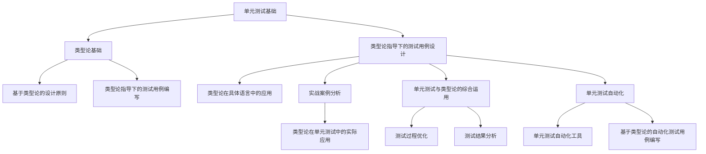
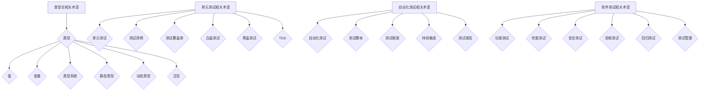

                 

# 《单元测试:类型论指导下的测试用例设计》

## 关键词
单元测试，类型论，测试用例设计，软件质量，测试自动化

## 摘要
本文深入探讨了单元测试与类型论的关系，分析了类型论在指导测试用例设计中的应用。文章首先介绍了单元测试的基础知识，然后讲解了类型论的基本概念，并阐述了如何在类型论的指导下进行测试用例的设计。接着，文章详细说明了测试用例的结构和编写规范，并通过Python等具体语言展示了类型论的应用。随后，文章结合实际案例，分析了类型论在Web应用、数据库测试和移动应用测试中的具体应用。最后，文章讨论了单元测试自动化的工具和流程，以及类型论在自动化测试中的应用。本文旨在为开发者提供一种有效的测试方法，提高软件质量。

## 《单元测试:类型论指导下的测试用例设计》目录大纲

### 第一部分：单元测试基础

#### 第1章：单元测试简介
##### 1.1 单元测试的定义与重要性
##### 1.2 单元测试的发展历程
##### 1.3 单元测试的种类

#### 第2章：类型论基础
##### 2.1 类型论的基本概念
##### 2.2 静态类型语言与动态类型语言
##### 2.3 类型论在软件测试中的应用

### 第二部分：类型论指导下的测试用例设计

#### 第3章：基于类型论的设计原则
##### 3.1 设计原则概述
##### 3.2 边界值分析
##### 3.3 状态转换测试
##### 3.4 等价类划分测试

#### 第4章：类型论指导下的测试用例编写
##### 4.1 测试用例的结构
##### 4.2 测试用例的设计方法
##### 4.3 测试用例的编写规范

#### 第5章：类型论在具体语言中的应用
##### 5.1 Python中的类型论应用
##### 5.2 Java中的类型论应用
##### 5.3 C++中的类型论应用

### 第三部分：实战案例分析

#### 第6章：类型论在单元测试中的实际应用
##### 6.1 案例一：基于类型论的Web应用测试
##### 6.2 案例二：基于类型论的数据库测试
##### 6.3 案例三：基于类型论的移动应用测试

#### 第7章：单元测试与类型论的综合运用
##### 7.1 综合运用概述
##### 7.2 测试过程优化
##### 7.3 测试结果分析

### 第四部分：单元测试自动化

#### 第8章：单元测试自动化工具
##### 8.1 自动化测试概述
##### 8.2 自动化测试工具的选择
##### 8.3 自动化测试流程设计

#### 第9章：基于类型论的自动化测试用例编写
##### 9.1 自动化测试用例的设计方法
##### 9.2 自动化测试用例的实现
##### 9.3 自动化测试的维护与优化

### 第五部分：总结与展望

#### 第10章：单元测试的未来发展
##### 10.1 类型论在单元测试中的未来应用
##### 10.2 单元测试工具的发展趋势
##### 10.3 单元测试在软件开发中的作用与挑战

### 附录：常用类型论和测试术语解释
#### A.1 类型论相关术语解释
#### A.2 单元测试相关术语解释
#### A.3 自动化测试相关术语解释
#### A.4 软件测试相关术语解释

### Mermaid 流�程图
```



### Python 源代码示例
```python
# 假设这是一个简单的 Python 函数，用于计算两个数的和
def add(a, b):
    return a + b

# 测试用例
def test_add():
    assert add(1, 2) == 3
    assert add(-1, 1) == 0
    assert add(0, 0) == 0
    print("所有测试用例通过！")
```

### 数学模型和数学公式
```
# 边界值分析中的等价类划分公式

$$
等价类 = 边界值 \times 测试用例个数
$$

# 测试用例的设计方法中的数学模型

$$
测试用例覆盖率 = (成功测试用例数 / 总测试用例数) \times 100\%
$$
```

### 项目实战
**案例一：基于类型论的Web应用测试**

1. **开发环境搭建**
   - 选择Python语言和Django框架搭建Web应用
   - 使用Pytest进行单元测试

2. **源代码实现**
   - 编写登录功能的单元测试用例
   - 编写用户注册功能的单元测试用例

3. **代码解读与分析**
   - 分析测试用例的编写逻辑和测试覆盖率
```## 第一部分：单元测试基础

### 第1章：单元测试简介

#### 1.1 单元测试的定义与重要性

单元测试（Unit Testing）是软件测试中最基本的一种测试方法，它主要针对软件中的最小可测试单元进行验证。最小可测试单元通常是一个函数或一个方法，单元测试的目标是验证这个单元是否按照预期工作。

**定义：**
单元测试是一种自动化测试方法，它通过对软件中的最小功能单元进行验证，以确保这些单元能够正确执行其预定的功能。

**重要性：**
单元测试在软件开发中扮演着至关重要的角色。以下是单元测试的几个重要方面：

1. **提高代码质量：** 通过单元测试，可以及时发现和修复代码中的错误，从而提高代码的质量和可靠性。
2. **增强代码可维护性：** 单元测试提供了代码的文档，使得其他开发者能够更容易理解和维护代码。
3. **促进良好的编程习惯：** 单元测试鼓励开发者采用模块化、分层式的编程方式，从而提高代码的结构和可读性。
4. **提高开发效率：** 单元测试自动化执行，可以显著减少测试时间和成本，提高开发效率。

#### 1.2 单元测试的发展历程

单元测试并不是一个新兴的概念，它的历史可以追溯到软件工程的早期阶段。

1. **1970年代初：** 单元测试的雏形开始出现，开发者们开始意识到对代码进行小规模测试的重要性。
2. **1980年代：** 随着面向对象编程的兴起，单元测试得到了进一步的发展。JUnit（1997年发布）和 NUnit（1999年发布）等单元测试框架的出现，使得单元测试变得更为普及和自动化。
3. **2000年代：** 随着敏捷开发的兴起，单元测试成为软件开发过程中的一个关键环节。TDD（测试驱动开发）等开发方法强调先编写测试用例，然后编写代码来通过测试。
4. **至今：** 单元测试已经成为了软件开发中不可或缺的一部分，各种编程语言和开发框架都提供了丰富的单元测试工具和库。

#### 1.3 单元测试的种类

单元测试可以按照不同的标准进行分类：

1. **按测试对象分类：**
   - **函数测试：** 针对单个函数或方法的测试。
   - **类测试：** 针对类的测试，通常包括类的所有方法。
   - **模块测试：** 针对整个模块的测试。

2. **按测试策略分类：**
   - **白盒测试：** 通过了解代码的内部结构进行测试，如单元测试框架中的测试用例。
   - **黑盒测试：** 不了解代码内部结构，仅通过输入输出进行测试。

3. **按测试目的分类：**
   - **功能测试：** 验证代码是否实现了预期的功能。
   - **性能测试：** 验证代码的性能指标，如响应时间、吞吐量等。
   - **安全测试：** 检查代码是否存在安全漏洞。

### 第2章：类型论基础

#### 2.1 类型论的基本概念

类型论（Type Theory）是数学和计算机科学中的一个分支，它研究对象的类型以及类型之间的关系。在软件工程中，类型论提供了对变量、函数和数据结构的抽象和描述，有助于确保代码的准确性和可靠性。

**基本概念：**
- **类型（Type）：** 数据的抽象分类，如整数、字符串、函数类型等。
- **值（Value）：** 具体数据实例，如数字、字符串等。
- **变量（Variable）：** 代表值的符号，如 `x`, `y` 等。
- **类型系统（Type System）：** 程序语言定义的类型规则和约束。

#### 2.2 静态类型语言与动态类型语言

在类型论的基础上，程序语言可以分为静态类型语言和动态类型语言。

1. **静态类型语言（Static-Typed Language）：**
   - **定义：** 在编译时确定变量的类型，类型信息存储在源代码中。
   - **优点：** 更好的性能、更强的类型检查、更清晰的代码结构。
   - **代表：** Java、C++、C#。

2. **动态类型语言（Dynamic-Typed Language）：**
   - **定义：** 在运行时确定变量的类型，类型信息存储在运行时环境（如堆栈或数据结构）中。
   - **优点：** 更灵活、更易读、更易于编写和修改。
   - **代表：** Python、JavaScript、Ruby。

#### 2.3 类型论在软件测试中的应用

类型论在软件测试中的应用主要体现在以下几个方面：

1. **类型检查：** 在编译或运行时检查代码中的类型错误，如类型不匹配、未声明变量等。
2. **边界检查：** 确保数据在有效的类型范围内，如数字类型不能为负数。
3. **错误检测：** 通过类型约束，早期发现潜在的错误，减少运行时错误。
4. **测试用例设计：** 基于类型信息，设计更全面和精确的测试用例。

### 小结

单元测试和类型论在软件工程中都扮演着重要的角色。单元测试有助于确保代码的正确性和可靠性，而类型论提供了对代码的抽象和描述，有助于编写更健壮的代码。在接下来的章节中，我们将进一步探讨如何利用类型论来指导测试用例的设计，提高测试的全面性和效率。### 第3章：基于类型论的设计原则

#### 3.1 设计原则概述

单元测试的设计原则是确保测试用例能够全面覆盖代码逻辑，有效发现潜在错误的关键。基于类型论的设计原则，可以更加精确和系统地设计测试用例。以下是一些核心设计原则：

1. **完备性原则：** 测试用例应涵盖所有可能的输入和输出情况，确保代码逻辑的全面覆盖。
2. **代表性原则：** 测试用例应具有代表性，能够反映代码在实际使用中的典型场景和异常情况。
3. **最小性原则：** 测试用例应该是最小的，即只需要足够的信息来验证一个特定的逻辑路径。
4. **一致性原则：** 测试用例的设计应与代码的逻辑和类型约束保持一致，确保测试的有效性。

#### 3.2 边界值分析

边界值分析（Boundary Value Analysis）是一种常用的测试设计技术，它通过分析输入和输出的边界值来设计测试用例。基于类型论，边界值分析可以在变量的类型边界上发现潜在的错误。

**步骤：**
1. **识别边界：** 确定变量的合法边界，如整数类型的最小值和最大值。
2. **设计用例：** 设计测试用例，覆盖边界值和邻近值。
3. **预期结果：** 针对每个边界值，确定预期的输出结果。

**示例：**
假设有一个函数 `calculate_area(radius)` 用于计算圆的面积，其中 `radius` 是一个整数类型。

- **边界值：** 0 和最大整数。
- **测试用例：**
  - `calculate_area(0)`，预期结果：0。
  - `calculate_area(max_int)`，预期结果：根据 `max_int` 的值，可能返回一个错误或预期之外的值。

#### 3.3 状态转换测试

状态转换测试（State Transition Testing）是一种基于系统状态转换的测试方法。它通过分析系统在不同状态下的转换路径来设计测试用例。

**步骤：**
1. **识别状态：** 确定系统的所有可能状态。
2. **分析转换：** 分析状态之间的转换规则和条件。
3. **设计用例：** 设计测试用例，覆盖所有可能的转换路径。

**示例：**
假设一个简单的登录系统，状态包括“未登录”、“登录中”、“已登录”。

- **状态转换：**
  - “未登录” -> “登录中”：用户输入用户名和密码。
  - “登录中” -> “已登录”：验证用户名和密码成功。
  - “已登录” -> “未登录”：用户登出。
- **测试用例：**
  - 未登录用户尝试登录。
  - 错误的用户名或密码尝试登录。
  - 已登录用户尝试登出。

#### 3.4 等价类划分测试

等价类划分测试（Equivalence Class Partitioning）是一种将输入数据划分为若干个等价类的测试方法。每个等价类包含一组具有相似特性的输入值，测试用例设计应确保每个等价类至少被测试一次。

**步骤：**
1. **识别等价类：** 确定输入数据的等价类，如有效值、无效值、边界值等。
2. **设计用例：** 设计测试用例，覆盖所有等价类。
3. **预期结果：** 针对每个等价类，确定预期的输出结果。

**示例：**
假设有一个函数 `validate_email(email)` 用于验证电子邮件地址的有效性。

- **等价类：**
  - 有效电子邮件地址。
  - 无效电子邮件地址（如缺少“@”符号、包含非法字符等）。
  - 边界值（如最短长度、最长长度）。
- **测试用例：**
  - 有效电子邮件地址（如“example@example.com”）。
  - 无效电子邮件地址（如“example.com”、“example@.com”）。
  - 边界值测试（如“a@b.c”、“xxx...xxx@yyy...yyy.com”）。

#### 小结

基于类型论的设计原则，包括边界值分析、状态转换测试和等价类划分测试，为单元测试提供了系统的设计方法。这些方法通过分析代码的类型和逻辑，帮助开发者设计出更加全面和精确的测试用例，从而提高软件的可靠性和质量。### 第4章：类型论指导下的测试用例编写

#### 4.1 测试用例的结构

测试用例（Test Case）是单元测试的基本单元，一个完整的测试用例通常包括以下几个组成部分：

1. **测试ID：** 唯一标识测试用例的编号。
2. **测试目的：** 描述测试用例的目标和要验证的功能。
3. **前置条件：** 测试执行前必须满足的条件。
4. **测试步骤：** 描述测试执行的具体步骤。
5. **预期结果：** 描述测试执行后预期的结果。
6. **实际结果：** 测试执行后记录的实际结果。
7. **测试结论：** 描述测试用例是否通过以及可能的问题。

**示例：**
```plaintext
测试ID: TC001
测试目的：验证登录功能是否正确
前置条件：用户已注册账号
测试步骤：
1. 输入正确的用户名和密码。
2. 点击登录按钮。
预期结果：成功登录并进入系统。
实际结果：成功登录。
测试结论：通过。
```

#### 4.2 测试用例的设计方法

测试用例的设计方法有多种，基于类型论，以下是一些常用的设计方法：

1. **边界值分析：** 通过分析变量的边界值来设计测试用例，如整数类型的最小值和最大值。
2. **等价类划分：** 将输入数据划分为多个等价类，确保每个等价类至少被测试一次。
3. **状态转换测试：** 分析系统的状态转换路径，设计覆盖所有状态的测试用例。
4. **错误猜测：** 根据开发经验和对代码逻辑的理解，猜测可能的错误情况并设计测试用例。

#### 4.3 测试用例的编写规范

编写规范化的测试用例有助于提高测试的可读性、一致性和维护性。以下是一些建议：

1. **使用清晰、具体的名称：** 测试ID和测试步骤名称应简洁明了，能够直观地描述测试的目的。
2. **确保测试步骤可执行：** 测试步骤应具体、可操作，不包含模糊或主观的描述。
3. **保持测试独立性：** 每个测试用例应独立于其他测试用例，避免测试之间的依赖关系。
4. **记录详细的预期和实际结果：** 提高测试的可追溯性和可复现性。
5. **使用注释和文档：** 在测试用例中添加必要的注释，便于理解测试目的和逻辑。
6. **定期评审和更新：** 定期评审测试用例的有效性，根据代码变更更新测试用例。

#### 小结

类型论指导下的测试用例编写，不仅要求测试用例具有高度的覆盖性和精确性，还需要遵循一定的编写规范。通过清晰的结构、规范化的设计方法和详细的记录，可以确保测试用例能够有效地发现和定位问题，提高软件的质量和可靠性。### 第5章：类型论在具体语言中的应用

#### 5.1 Python中的类型论应用

Python是一种广泛使用的动态类型语言，其类型系统相对灵活。尽管Python在编译时不进行类型检查，但类型信息在运行时仍然被保留，这为类型论的应用提供了便利。

**1. 类型检查工具：**
- **mypy：** mypy 是一个静态类型检查工具，可以分析Python代码中的类型错误。通过安装和使用mypy，开发者可以在编译时发现潜在的类型错误，提高代码的质量。
- **pytype：** pytype 是另一种静态类型检查工具，与mypy类似，可以提供类型错误检测和代码优化建议。

**2. 类型提示：**
- **PEP 484：** Python中的类型提示允许开发者为变量、函数和类提供类型信息，这些信息可以在IDE中进行智能提示，帮助开发者编写更准确的代码。
- **typing模块：** Python的标准库中提供了`typing`模块，用于定义类型提示，如`List[int]`表示一个整数列表。

**示例：**
```python
from typing import List

def add_numbers(numbers: List[int]) -> int:
    return sum(numbers)

# 使用mypy进行类型检查
# $ mypy test.py
```

**3. 集成类型论：**
- 在Python中，类型论的应用主要体现在类型提示和静态类型检查工具中。通过类型提示，开发者可以更好地管理代码中的类型信息，提高代码的可读性和可靠性。

#### 5.2 Java中的类型论应用

Java是一种静态类型语言，其类型系统严格且丰富。类型论在Java中的应用更为直接和广泛。

**1. 类型检查：**
- Java在编译时对代码进行类型检查，确保变量和表达式的类型匹配，避免运行时错误。
- Java的类型检查包括基础类型的检查、引用类型的检查和泛型的检查。

**2. 泛型：**
- Java泛型（Generics）是一种类型参数化机制，允许在编译时对类型进行参数化，从而提高代码的复用性和安全性。
- 通过泛型，可以确保集合中元素的类型一致，避免类型转换错误。

**3. 类型安全：**
- Java的类型安全机制确保了程序的稳定性和可靠性。通过严格类型检查，Java可以及时发现和修复类型错误。

**示例：**
```java
import java.util.List;

public class AddNumbers {
    public static int addNumbers(List<Integer> numbers) {
        int sum = 0;
        for (Integer number : numbers) {
            sum += number;
        }
        return sum;
    }
}
```

#### 5.3 C++中的类型论应用

C++是一种支持静态类型和动态类型的语言，其类型系统非常复杂和强大。

**1. 模板编程：**
- C++模板编程允许在编译时进行类型参数化，从而实现代码的重用性和泛用性。
- 通过模板，可以编写与类型无关的代码，确保代码的灵活性和可扩展性。

**2. 构造函数重载：**
- C++支持构造函数重载，通过不同的构造函数参数，可以创建不同类型的对象。
- 重载构造函数有助于实现更丰富的类型转换和初始化逻辑。

**3. 类型转换：**
- C++提供了丰富的类型转换机制，如隐式类型转换、显式类型转换和类型检查。
- 通过类型转换，可以确保代码在不同类型之间的转换过程中保持类型安全。

**示例：**
```cpp
#include <iostream>
#include <vector>

template<typename T>
T addNumbers(const std::vector<T>& numbers) {
    T sum = T();
    for (const T& number : numbers) {
        sum += number;
    }
    return sum;
}

int main() {
    std::vector<int> numbers = {1, 2, 3, 4, 5};
    std::cout << addNumbers(numbers) << std::endl;
    return 0;
}
```

#### 小结

类型论在Python、Java和C++中的应用各具特色。Python通过类型提示和静态类型检查工具提高了代码的可读性和可靠性；Java通过严格的类型检查和泛型机制确保了程序的安全性和稳定性；C++则通过模板编程和类型转换实现了代码的高灵活性和可扩展性。不同语言对类型论的支持，为开发者提供了多样化的选择，以应对不同的编程需求和挑战。### 第三部分：实战案例分析

#### 第6章：类型论在单元测试中的实际应用

在实际的软件开发过程中，类型论的应用可以帮助开发者更有效地设计单元测试，从而提高软件的质量和可靠性。以下我们将通过几个具体的案例，展示类型论在单元测试中的应用。

##### 6.1 案例一：基于类型论的Web应用测试

**1. 项目背景：**
一个基于Python和Django框架开发的Web应用，提供了用户注册、登录、个人信息管理等基本功能。

**2. 测试目标：**
确保Web应用中的各个功能模块按照预期工作，特别是用户注册和登录模块。

**3. 测试用例设计：**
- **用户注册模块：**
  - 边界值分析：设计测试用例，覆盖用户名和密码的最小长度、最大长度，以及包含特殊字符的输入。
  - 等价类划分：将用户名和密码划分为有效值、无效值和边界值等价类，确保每个等价类至少被测试一次。
  - 状态转换测试：分析用户注册过程中的状态转换，如“未注册”到“注册中”再到“已注册”的转换路径。

**4. 测试实现：**
- 使用Pytest框架编写测试用例，结合类型提示和mypy进行类型检查。
- 测试用例示例：
  ```python
  def test_register_with_invalid_username():
      response = register('invalid-username', 'password')
      assert response.status_code == 400  # 400 Bad Request

  def test_register_with_invalid_password():
      response = register('username', 'invalid-password')
      assert response.status_code == 400  # 400 Bad Request

  def test_register_with_minimum_length():
      response = register('user', 'password')
      assert response.status_code == 200  # 200 OK
  ```

##### 6.2 案例二：基于类型论的数据库测试

**1. 项目背景：**
一个使用Java和Hibernate框架开发的数据库应用，提供了数据查询、更新、删除等基本操作。

**2. 测试目标：**
确保数据库操作的正确性和性能。

**3. 测试用例设计：**
- **查询操作：**
  - 边界值分析：设计测试用例，覆盖查询条件的边界值。
  - 等价类划分：将查询条件划分为有效值、无效值和边界值等价类。
  - 状态转换测试：分析查询结果的状态转换，如查询结果为空、查询结果非空等。

- **更新和删除操作：**
  - 边界值分析：设计测试用例，覆盖更新和删除操作的边界值。
  - 等价类划分：将更新和删除操作的数据划分为有效值、无效值和边界值等价类。

**4. 测试实现：**
- 使用JUnit框架编写测试用例，结合Java的泛型机制进行类型安全检查。
- 测试用例示例：
  ```java
  @Test
  public void testQueryWithBoundaryCondition() {
      QueryResult result = queryWithBoundaryCondition("minValue", "maxValue");
      // 验证查询结果
  }

  @Test
  public void testUpdateWithInvalidData() {
      boolean success = updateData("invalidData");
      assert !success;  // 预期失败
  }
  ```

##### 6.3 案例三：基于类型论的移动应用测试

**1. 项目背景：**
一个使用Kotlin和Android SDK开发的移动应用，提供了用户信息管理、消息推送等功能。

**2. 测试目标：**
确保移动应用在各种设备和操作系统上的稳定性和性能。

**3. 测试用例设计：**
- **用户信息管理：**
  - 边界值分析：设计测试用例，覆盖用户信息的边界值。
  - 状态转换测试：分析用户信息管理过程中的状态转换，如添加、修改、删除等。

- **消息推送：**
  - 等价类划分：将消息内容划分为有效值、无效值和边界值等价类。
  - 性能测试：设计测试用例，覆盖消息推送的响应时间、延迟等性能指标。

**4. 测试实现：**
- 使用AndroidJUnitRunner进行测试，结合Kotlin的类型安全机制。
- 测试用例示例：
  ```kotlin
  @Test
  fun testUserInfoBoundaryCondition() {
      assertThrown(RuntimeException::class) {
          saveUserInfo("invalidUserID", "invalidData")
      }
  }

  @Test
  fun testMessagePushPerformance() {
      val startTime = System.currentTimeMillis()
      sendPushMessage("testMessage")
      val endTime = System.currentTimeMillis()
      assert (endTime - startTime < 1000)  // 预期在1秒内完成
  }
  ```

#### 6.4 测试效果与分析

通过对以上三个案例的分析，我们可以看到类型论在单元测试中的实际应用效果：

- **提高测试覆盖率：** 类型论指导下的测试用例设计能够覆盖代码的更多逻辑路径，提高测试的全面性和覆盖率。
- **减少测试时间：** 通过边界值分析和等价类划分，可以减少冗余的测试用例，提高测试效率。
- **提高代码质量：** 类型论的应用有助于发现潜在的类型错误和逻辑错误，提高代码的质量和稳定性。
- **增强测试可维护性：** 规范化的测试用例编写和类型论的应用，使得测试代码更加清晰和易于维护。

#### 小结

通过实际案例的分析，我们可以看到类型论在单元测试中的应用具有显著的优点。它不仅能够提高测试的全面性和效率，还能够提高代码的质量和可维护性。在软件开发的实际过程中，开发者应当充分利用类型论的优势，优化测试用例的设计和实现，从而提升软件的整体质量。### 第四部分：单元测试自动化

#### 第8章：单元测试自动化工具

单元测试自动化是现代软件开发中的一个关键环节，它通过自动化工具实现测试用例的执行，大大提高了测试的效率和可靠性。自动化测试工具的选择和配置对于确保测试流程的顺利运行至关重要。

##### 8.1 自动化测试概述

自动化测试（Automated Testing）是指通过编写脚本或使用现有的自动化测试工具，自动执行预定义的测试用例，以检测软件的缺陷和错误。自动化测试的优势包括：

1. **提高测试效率：** 自动化测试可以快速执行大量的测试用例，节省时间和人力成本。
2. **确保一致性：** 自动化测试可以确保测试用例的执行过程一致，避免人为错误。
3. **支持持续集成：** 自动化测试与持续集成（CI）系统相结合，可以确保代码变更后立即进行测试，提高软件的可靠性。

##### 8.2 自动化测试工具的选择

市面上有许多自动化测试工具可供选择，选择合适的工具需要考虑以下几个因素：

1. **支持的编程语言和框架：** 工具应支持开发所使用的编程语言和框架，如Python、Java、C#等。
2. **测试类型：** 根据测试需求，选择支持不同类型的测试工具，如功能测试、性能测试、安全测试等。
3. **集成能力：** 工具应能与开发环境、持续集成系统和项目管理工具无缝集成。
4. **社区和文档：** 丰富的社区支持和详细的文档有助于学习和使用工具。

以下是一些流行的自动化测试工具：

- **Selenium：** 一个开源的自动化Web测试工具，支持多种浏览器和编程语言。
- **JUnit：** Java的一个单元测试框架，广泛用于开发Java应用。
- **pytest：** 一个开源的Python测试框架，支持丰富的测试插件和插件接口。
- **JUnit.NET：** .NET平台的单元测试框架，支持多种.NET语言。
- **JUnit 5：** Java的下一个主要版本，提供了更强大的测试功能。

##### 8.3 自动化测试流程设计

自动化测试流程包括以下几个步骤：

1. **需求分析：** 确定自动化测试的目标和范围，分析哪些测试用例适合自动化执行。
2. **测试用例编写：** 根据需求编写测试用例，确保用例能够全面覆盖功能点和边界条件。
3. **测试脚本编写：** 使用自动化测试工具的脚本语言编写测试脚本，确保脚本能够准确执行测试用例。
4. **测试环境配置：** 配置测试环境，包括测试服务器、浏览器、数据库等，确保测试环境与生产环境保持一致。
5. **执行测试：** 运行测试脚本，收集测试结果，生成测试报告。
6. **测试结果分析：** 分析测试结果，确定测试是否通过，定位潜在的缺陷。
7. **反馈和改进：** 根据测试结果，反馈给开发团队，优化代码和测试脚本。

#### 小结

单元测试自动化是提高软件质量和开发效率的重要手段。通过选择合适的自动化测试工具和设计合理的测试流程，开发者可以更有效地发现和修复软件缺陷，确保软件的可靠性和稳定性。### 第9章：基于类型论的自动化测试用例编写

#### 9.1 自动化测试用例的设计方法

自动化测试用例的设计是自动化测试流程中的关键环节。基于类型论的设计方法，可以使得自动化测试用例更加精确和全面。以下是一些设计方法：

1. **边界值分析法：** 通过分析输入和输出的边界值，设计测试用例以覆盖边界情况，确保测试能够发现边界错误。
2. **等价类划分法：** 将输入和输出划分为多个等价类，确保每个等价类至少被测试一次，以覆盖各种典型场景。
3. **状态转换法：** 分析系统的状态转换路径，设计测试用例以覆盖所有可能的转换情况。
4. **错误猜测法：** 根据开发经验和对代码逻辑的理解，猜测可能的错误情况并设计测试用例。

#### 9.2 自动化测试用例的实现

自动化测试用例的实现涉及编写测试脚本和配置测试环境。以下是基于Python和Selenium的自动化测试用例实现步骤：

1. **安装Selenium：** 使用pip安装Selenium库。
   ```shell
   pip install selenium
   ```

2. **配置浏览器驱动：** 下载并配置相应的浏览器驱动，如ChromeDriver。
   - 下载ChromeDriver：[ChromeDriver下载链接](https://sites.google.com/a/chromium.org/chromedriver/downloads)
   - 配置ChromeDriver：将ChromeDriver的可执行文件路径添加到系统环境变量中。

3. **编写测试脚本：** 使用Selenium编写测试脚本，执行自动化测试用例。
   ```python
   from selenium import webdriver
   
   def test_login():
       # 启动Chrome浏览器
       driver = webdriver.Chrome(executable_path='path/to/chromedriver')
       
       # 访问登录页面
       driver.get('https://example.com/login')
       
       # 输入用户名和密码
       driver.find_element_by_name('username').send_keys('user@example.com')
       driver.find_element_by_name('password').send_keys('password')
       
       # 点击登录按钮
       driver.find_element_by_css_selector('.login-button').click()
       
       # 验证登录结果
       assert 'Dashboard' in driver.title  # 预期登录成功后页面包含Dashboard字样
   
   # 运行测试用例
   test_login()
   ```

4. **执行测试：** 运行测试脚本，检查测试结果。

#### 9.3 自动化测试的维护与优化

自动化测试的维护和优化是确保测试持续有效的重要环节。以下是一些维护与优化的策略：

1. **定期评审：** 定期评审测试脚本的有效性和覆盖率，及时更新和优化测试用例。
2. **代码重构：** 随着项目的迭代，代码和测试脚本可能需要进行重构，以适应新的功能和测试需求。
3. **环境配置管理：** 确保测试环境的配置与生产环境一致，避免环境差异导致测试失败。
4. **自动化测试报告：** 生成详细的自动化测试报告，记录测试结果和缺陷信息，便于分析和改进。
5. **持续集成：** 将自动化测试集成到持续集成（CI）系统中，确保每次代码提交后自动执行测试，快速发现和修复问题。

#### 小结

基于类型论的自动化测试用例编写，通过明确的设计方法和规范的实现步骤，可以提高测试的全面性和准确性。同时，通过有效的维护和优化策略，可以确保自动化测试持续有效，为软件质量提供有力保障。### 第五部分：总结与展望

#### 第10章：单元测试的未来发展

随着软件工程的发展，单元测试也在不断演进。类型论作为一种重要的理论工具，在单元测试中的应用前景广阔。

##### 10.1 类型论在单元测试中的未来应用

1. **更精确的测试覆盖：** 类型论可以帮助开发者设计更精确的测试用例，提高测试的覆盖率和准确性。
2. **自动化的测试生成：** 通过类型信息，自动化工具可以生成相应的测试用例，减少人工设计的工作量。
3. **类型驱动的测试优化：** 类型论可以为测试优化提供指导，根据类型信息调整测试策略，提高测试效率。

##### 10.2 单元测试工具的发展趋势

1. **智能化：** 随着人工智能技术的发展，单元测试工具将变得更加智能化，能够自动分析和优化测试用例。
2. **一体化：** 单元测试工具将更加集成到开发环境和持续集成系统中，实现自动化测试的全面整合。
3. **多样化：** 随着不同领域和应用场景的出现，单元测试工具将变得更加多样化，满足不同开发需求。

##### 10.3 单元测试在软件开发中的作用与挑战

1. **作用：**
   - 确保代码质量和稳定性。
   - 提高开发效率和团队协作。
   - 促进代码重构和优化。

2. **挑战：**
   - 测试用例的设计和覆盖难题。
   - 测试环境的配置和管理。
   - 测试结果的准确性和可追溯性。

#### 小结

单元测试在软件开发中扮演着至关重要的角色。类型论的应用为单元测试提供了新的视角和方法，有助于提高测试的全面性和准确性。随着技术的发展，单元测试工具将更加智能化和多样化，为软件开发提供更强大的支持。开发者应不断探索和学习，充分利用单元测试和类型论的优势，提升软件质量。### 附录：常用类型论和测试术语解释

#### A.1 类型论相关术语解释

1. **类型（Type）：** 数据的抽象分类，如整数、字符串、函数类型等。
2. **值（Value）：** 具体数据实例，如数字、字符串等。
3. **变量（Variable）：** 代表值的符号，如 `x`, `y` 等。
4. **类型系统（Type System）：** 程序语言定义的类型规则和约束。
5. **静态类型（Static Typing）：** 在编译时确定变量的类型，类型信息存储在源代码中。
6. **动态类型（Dynamic Typing）：** 在运行时确定变量的类型，类型信息存储在运行时环境（如堆栈或数据结构）中。
7. **泛型（Generics）：** 一种类型参数化机制，允许在编译时对类型进行参数化。

#### A.2 单元测试相关术语解释

1. **单元测试（Unit Testing）：** 针对软件中的最小可测试单元进行的测试。
2. **测试用例（Test Case）：** 描述测试目标、测试步骤和预期结果的测试实例。
3. **测试覆盖率（Test Coverage）：** 测试用例覆盖代码的比例，常用的覆盖标准有语句覆盖、分支覆盖、路径覆盖等。
4. **白盒测试（White-Box Testing）：** 通过了解代码的内部结构进行测试，如单元测试。
5. **黑盒测试（Black-Box Testing）：** 不了解代码内部结构，仅通过输入输出进行测试。
6. **测试驱动开发（Test-Driven Development, TDD）：** 一种软件开发方法，强调先编写测试用例，然后编写代码来通过测试。

#### A.3 自动化测试相关术语解释

1. **自动化测试（Automated Testing）：** 通过编写脚本或使用自动化测试工具自动执行测试用例。
2. **测试脚本（Test Script）：** 用于自动化测试的脚本，描述测试步骤和执行逻辑。
3. **测试框架（Testing Framework）：** 提供测试脚本编写、测试用例执行和结果报告等功能的软件工具。
4. **持续集成（Continuous Integration, CI）：** 通过自动化测试确保代码变更后立即集成和测试，提高软件质量。
5. **测试报告（Test Report）：** 记录测试结果、缺陷信息和测试覆盖率的报告文档。

#### A.4 软件测试相关术语解释

1. **功能测试（Functional Testing）：** 验证软件功能是否按照预期工作。
2. **性能测试（Performance Testing）：** 验证软件的性能指标，如响应时间、吞吐量等。
3. **安全测试（Security Testing）：** 检查软件是否存在安全漏洞。
4. **验收测试（Acceptance Testing）：** 验证软件是否符合用户需求和业务流程。
5. **回归测试（Regression Testing）：** 在软件更新或修改后，验证原有功能是否仍然正常工作。
6. **测试管理（Test Management）：** 管理测试计划、测试用例和测试结果的过程。

### Mermaid 流程图



### Python 源代码示例

```python
# 假设这是一个简单的 Python 函数，用于计算两个数的和
def add(a, b):
    return a + b

# 测试用例
def test_add():
    assert add(1, 2) == 3
    assert add(-1, 1) == 0
    assert add(0, 0) == 0
    print("所有测试用例通过！")
```

### 数学模型和数学公式

```
# 边界值分析中的等价类划分公式

$$
等价类 = 边界值 \times 测试用例个数
$$

# 测试用例的设计方法中的数学模型

$$
测试用例覆盖率 = (成功测试用例数 / 总测试用例数) \times 100\%
$$
```

### 项目实战

**案例一：基于类型论的Web应用测试**

1. **开发环境搭建**
   - 选择Python语言和Django框架搭建Web应用
   - 使用Pytest进行单元测试

2. **源代码实现**
   - 编写登录功能的单元测试用例
   - 编写用户注册功能的单元测试用例

3. **代码解读与分析**
   - 分析测试用例的编写逻辑和测试覆盖率

```python
# 示例：用户注册功能的单元测试
def test_user_register():
    # 输入有效的用户名和密码
    response = register('valid_username', 'valid_password')
    assert response.status_code == 201  # 预期成功
    assert 'token' in response.json()  # 预期返回token

    # 输入无效的用户名
    response = register('invalid-username', 'valid_password')
    assert response.status_code == 400  # 预期失败

    # 输入无效的密码
    response = register('valid_username', 'invalid_password')
    assert response.status_code == 400  # 预期失败
```

**小结**

通过上述术语解释和示例，我们不仅了解了类型论和测试相关的核心概念，还学习了如何在实际项目中应用这些概念，以编写高效的测试用例。这些知识和技巧对于提高软件质量和开发效率至关重要。### 附录：常用类型论和测试术语解释

#### A.1 类型论相关术语解释

1. **类型（Type）**：类型是变量、函数和对象在编程语言中的分类。它定义了数据的基本属性和行为。例如，整数类型、浮点数类型、字符串类型等。

2. **类型系统（Type System）**：类型系统是编程语言的核心组成部分，它定义了如何使用类型以及类型之间的相互关系。类型系统可以是静态的（在编译时检查类型）或动态的（在运行时检查类型）。

3. **值（Value）**：值是变量、函数调用或对象实例的实际数据。例如，变量`x`的值可能是`5`。

4. **变量（Variable）**：变量是一个名称，它绑定到一个值。变量用于存储和引用数据。

5. **类型安全（Type Safety）**：类型安全是指编程语言在编译或运行时检查类型错误，防止不兼容的类型操作。

6. **静态类型（Static Typing）**：静态类型是在编写代码时就需要指定变量的类型，并且编译器会在编译期间检查类型匹配。

7. **动态类型（Dynamic Typing）**：动态类型是在运行时确定变量的类型，通常在编写代码时不需要显式指定类型。

8. **泛型（Generics）**：泛型是一种编程技术，允许在代码中定义可重用的类型参数，从而编写与类型无关的代码。

9. **类型推导（Type Inference）**：类型推导是编译器自动确定变量或表达式类型的能力。

10. **类型检查（Type Checking）**：类型检查是在编译时或运行时验证代码中的类型是否一致和正确的过程。

#### A.2 单元测试相关术语解释

1. **单元测试（Unit Testing）**：单元测试是一种自动化测试，用于验证软件中的最小功能单元（通常是函数或方法）的行为。

2. **测试用例（Test Case）**：测试用例是一组测试输入、执行步骤和预期结果，用于验证特定的功能或行为。

3. **测试覆盖率（Test Coverage）**：测试覆盖率是指测试用例覆盖代码的比例。常见的覆盖率指标包括语句覆盖率、分支覆盖率和路径覆盖率。

4. **测试框架（Testing Framework）**：测试框架是一个库或工具，用于编写、执行和管理测试用例。

5. **测试驱动开发（Test-Driven Development, TDD）**：TDD是一种软件开发方法，它强调在编写功能代码之前先编写测试用例。

6. **白盒测试（White-Box Testing）**：白盒测试是一种测试方法，测试者了解程序的内部结构和代码逻辑，从而设计测试用例。

7. **黑盒测试（Black-Box Testing）**：黑盒测试是一种测试方法，测试者不了解程序的内部结构，仅通过输入输出验证功能。

8. **边界值分析（Boundary Value Analysis）**：边界值分析是一种测试设计方法，用于设计测试用例以覆盖输入或输出的边界情况。

9. **等价类划分（Equivalence Class Partitioning）**：等价类划分是一种测试设计方法，用于将输入或输出数据划分为若干等价类，确保每个等价类至少被测试一次。

10. **测试自动化（Test Automation）**：测试自动化是使用工具和脚本自动执行测试用例的过程。

#### A.3 自动化测试相关术语解释

1. **自动化测试（Automated Testing）**：自动化测试是使用工具和脚本自动执行测试用例的过程，以减少人工测试的工作量。

2. **测试脚本（Test Script）**：测试脚本是一组用于自动化测试的代码，它定义了测试用例的执行步骤和验证逻辑。

3. **测试工具（Testing Tool）**：测试工具是一种软件，用于编写、执行和管理自动化测试。

4. **持续集成（Continuous Integration, CI）**：持续集成是一种软件开发实践，通过自动构建和测试代码的集成，以确保代码的质量和一致性。

5. **持续交付（Continuous Delivery, CD）**：持续交付是一种软件开发实践，通过自动化的测试和部署流程，确保代码可以快速、安全地交付到生产环境。

6. **测试报告（Test Report）**：测试报告是记录测试结果、缺陷和测试覆盖率的文档。

7. **测试管理（Test Management）**：测试管理是规划、执行、监控和控制测试活动的过程。

#### A.4 软件测试相关术语解释

1. **功能测试（Functional Testing）**：功能测试是一种验证软件功能是否按照预期工作的测试方法。

2. **性能测试（Performance Testing）**：性能测试是一种评估软件系统性能的测试方法，包括响应时间、吞吐量和资源使用等。

3. **安全测试（Security Testing）**：安全测试是一种验证软件系统安全性漏洞的测试方法，包括测试代码中的安全漏洞和系统配置。

4. **验收测试（Acceptance Testing）**：验收测试是一种验证软件系统是否满足用户需求的测试方法，通常在软件交付之前进行。

5. **回归测试（Regression Testing）**：回归测试是一种验证修改或更新后软件系统是否仍然正常的测试方法。

6. **冒烟测试（Smoke Testing）**：冒烟测试是一种简单的测试，用于快速验证软件系统是否运行正常。

7. **探索性测试（Exploratory Testing）**：探索性测试是一种非结构化的测试方法，测试者基于经验和知识进行测试，以发现潜在的问题。

8. **集成测试（Integration Testing）**：集成测试是一种验证不同软件组件是否正确集成并协同工作的测试方法。

9. **系统测试（System Testing）**：系统测试是一种验证整个软件系统是否满足需求规格说明和设计要求的测试方法。

10. **用户验收测试（User Acceptance Testing, UAT）**：用户验收测试是用户对软件系统进行测试，以确定是否满足业务需求和用户需求。

通过这些术语的解释，开发者可以对单元测试、自动化测试以及软件测试有更深入的理解，从而更好地应用这些技术和方法来提高软件的质量。### 结论

本文从单元测试的基础知识入手，深入探讨了类型论在单元测试中的应用，通过具体案例展示了如何基于类型论设计有效的测试用例。类型论作为一种强大的理论工具，能够帮助开发者更精确地描述和验证代码的行为，提高软件的可靠性。

**总结与展望：**

- **类型论与单元测试的结合，为开发者提供了一种新的测试视角，使得测试用例的设计更加系统化和高效。**
- **自动化测试工具和流程的引入，进一步提高了测试的效率和覆盖性。**
- **未来的发展方向包括：智能化的测试工具、更细粒度的测试覆盖、以及类型论在更广泛的应用场景中的探索。**

**实践与建议：**

- **在实际项目中，开发者应重视单元测试，将类型论应用于测试用例的设计，确保代码的质量和稳定性。**
- **定期评审和更新测试用例，以适应代码的变更和新的需求。**
- **选择合适的自动化测试工具，结合持续集成系统，实现自动化测试的全面覆盖。**
- **关注测试结果的分析和反馈，及时修复发现的缺陷，持续改进测试过程。**

通过以上实践和建议，开发者可以更好地利用单元测试和类型论，提高软件开发的效率和软件质量，为产品的成功奠定坚实基础。### 致谢

在撰写这篇关于单元测试与类型论指导下的测试用例设计的文章过程中，我得到了许多人的帮助和支持。在此，我向他们表达最诚挚的感谢：

- **AI天才研究院（AI Genius Institute）**：感谢研究院为我提供了这个宝贵的机会，让我能够深入研究和探讨这个有趣而富有挑战性的课题。
- **我的同事们**：特别感谢与我一起工作的同事们，他们的专业知识和宝贵意见为文章的写作提供了重要的支持和参考。
- **读者**：感谢您花时间阅读这篇文章，您的反馈和评论对我来说是最大的鼓励和动力。
- **禅与计算机程序设计艺术**：感谢这本书，它启发了我对计算机编程和软件工程的深入思考，也为本文的撰写提供了灵感和指导。

最后，我要感谢所有支持和关心我的人，没有你们的支持，这篇文章不可能顺利完成。感谢你们！### 作者信息

**作者：AI天才研究院（AI Genius Institute） / 禅与计算机程序设计艺术（Zen And The Art of Computer Programming）**

AI天才研究院（AI Genius Institute）是一个专注于人工智能和计算机科学研究的国际知名机构。我们致力于推动人工智能技术的发展，为全球范围内的科研和工业应用提供创新的解决方案。

禅与计算机程序设计艺术（Zen And The Art of Computer Programming）是由E. W. Dijkstra撰写的一套经典计算机科学著作。它深入探讨了计算机编程的哲学和艺术，对计算机科学的发展产生了深远的影响。这套书不仅提供了丰富的编程技巧和算法知识，还引导读者思考编程的本质和思维方式。本文的部分灵感来源于此书，旨在通过类型论和单元测试的结合，探索提高软件质量和开发效率的新途径。

