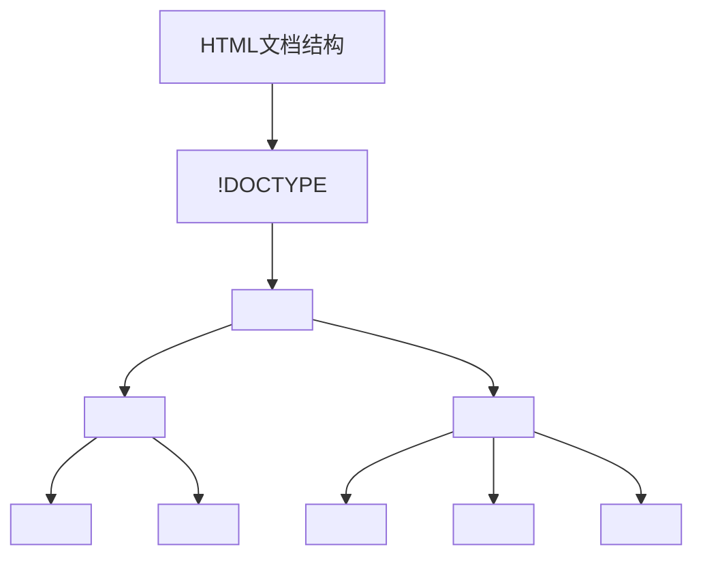
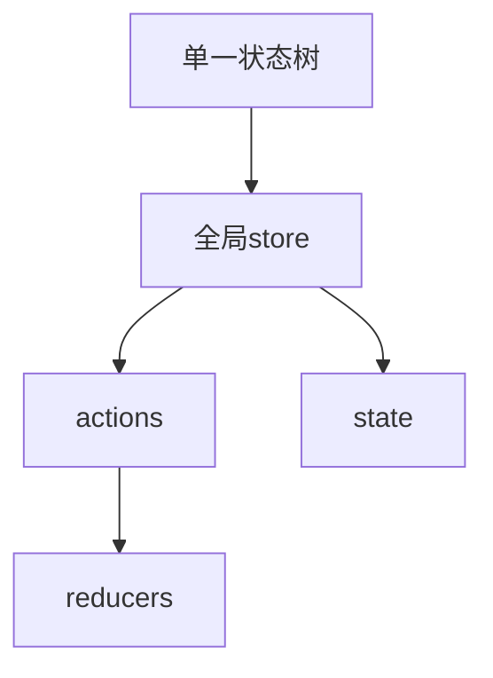
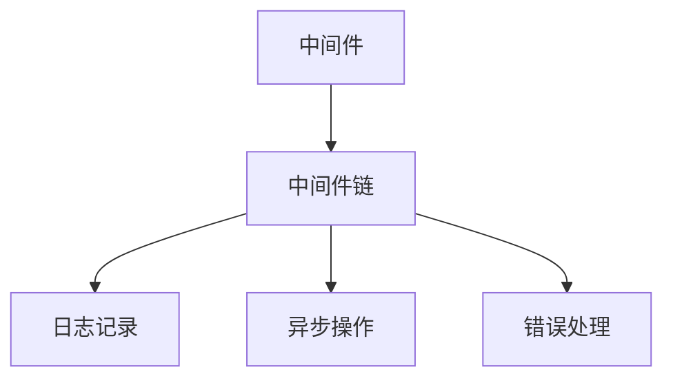
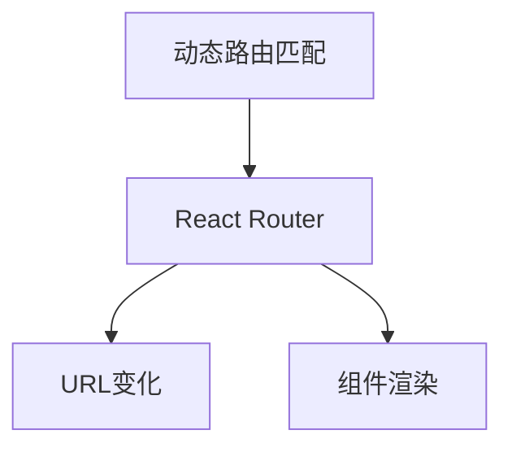
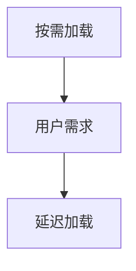
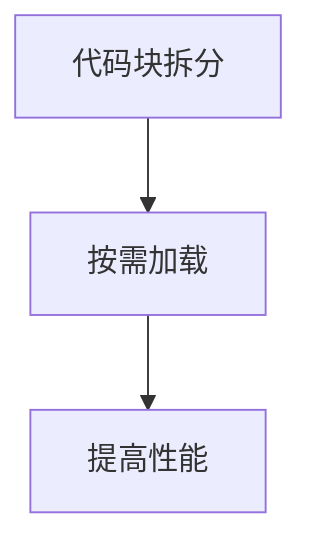
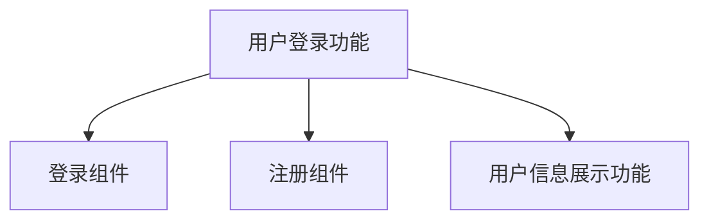

                 

# 《单页应用(SPA)开发：提升用户体验的前端架构》

## 关键词

单页应用（SPA），前端开发，用户体验，前端框架，性能优化

## 摘要

本文旨在深入探讨单页应用（Single Page Application，简称SPA）的开发，以及如何通过前端架构的优化来提升用户体验。我们将从单页应用的概念和优势入手，逐步讲解前端开发的基础知识，介绍主流前端框架，探讨状态管理、路由处理、性能优化等关键技术，并通过一个实战案例展示SPA的开发流程。本文结构紧凑，逻辑清晰，旨在为前端开发工程师和对此感兴趣的开发者提供有价值的参考资料。

## 第1章 单页应用概述

### 1.1 单页应用的定义和优势

单页应用（SPA）是一种只包含一个HTML文件的Web应用，用户界面无需重新加载即可与服务器进行交互。这种模式在传统的多页应用基础上，通过JavaScript动态更新页面内容，实现了无缝的用户体验。SPA的主要优势如下：

1. **快速响应**：由于无需重新加载页面，用户可以快速地进行操作和浏览，提升了应用的响应速度。
2. **更好的用户体验**：SPA提供了类似桌面应用程序的交互方式，让用户感觉更加流畅和自然。
3. **统一的开发体验**：SPA的开发过程更加统一，便于团队协作和代码维护。
4. **更高的可维护性**：通过组件化和模块化，代码更加结构化，易于管理和更新。

### 1.2 单页应用的开发模式

SPA的开发模式通常包括以下几个步骤：

1. **前端渲染**：客户端通过JavaScript请求服务器数据，并在本地渲染页面。
2. **路由处理**：通过前端路由库（如React Router、Vue Router）处理URL变化，实现页面切换。
3. **状态管理**：使用状态管理库（如Redux、Vuex、MobX）来管理全局状态，实现组件间的数据共享。
4. **性能优化**：通过懒加载、代码分割等技术来提升应用的性能。

### 1.3 单页应用的发展历程

SPA的概念最早由Paul Irish在2010年提出，随着Web技术的发展，SPA逐渐成为主流的前端架构。早期的SPA主要使用JavaScript库（如jQuery）进行开发，后来随着React、Vue、Angular等前端框架的兴起，SPA的开发变得更加成熟和高效。

## 第2章 前端开发基础

### 2.1 HTML

HTML（HyperText Markup Language）是创建Web页面的基础语言。它使用一系列标签来描述网页的结构和内容。以下是HTML的基本结构和一些新特性：

#### 2.1.1 HTML的基本结构

HTML的基本结构包括：

```html
<!DOCTYPE html>
<html>
<head>
  <title>页面标题</title>
</head>
<body>
  <!-- 页面内容 -->
</body>
</html>
```

#### 2.1.2 HTML5的新特性

HTML5引入了许多新特性和API，如下：

- **Canvas**：用于绘制图形和动画。
- **Web Storage**：用于存储大量数据，替代Cookie。
- **WebSockets**：实现服务器与客户端的全双工通信。
- **Geolocation**：获取用户地理位置信息。

### 2.2 CSS

CSS（Cascading Style Sheets）用于描述HTML元素的样式。它是Web开发中的重要组成部分，使得开发者可以独立于HTML结构进行样式设计。

#### 2.2.1 CSS的基本用法

CSS的基本语法包括选择器和声明：

```css
选择器 {
  属性：值；
}
```

#### 2.2.2 CSS的布局技术

CSS提供了多种布局技术，包括：

- **Flexbox**：用于实现一维布局。
- **Grid**：用于实现二维布局。
- **响应式布局**：通过媒体查询实现不同屏幕尺寸的适配。

### 2.3 JavaScript

JavaScript是一种脚本语言，用于为网页添加交互性。它是SPA开发的核心。

#### 2.3.1 JavaScript的基本语法

JavaScript的基本语法包括：

- 变量和函数声明
- 数据类型和操作符
- 控制流（if、for、while等）

#### 2.3.2 JavaScript的DOM操作

DOM（Document Object Model）是JavaScript操作HTML文档的接口。通过DOM，开发者可以动态地改变页面内容、结构和样式。

## 第3章 前端框架介绍

### 3.1 React

React是一个由Facebook开发的JavaScript库，用于构建用户界面。它通过组件化和虚拟DOM实现了高效的可交互界面。

#### 3.1.1 React的基本原理

React的基本原理包括：

- **虚拟DOM**：React通过虚拟DOM来提高页面渲染的性能。
- **组件化开发**：React鼓励开发者将UI分解为可复用的组件。

#### 3.1.2 React的组件化开发

React的组件化开发包括：

- **函数组件**：使用JavaScript函数创建组件。
- **类组件**：使用ES6的Class创建组件。

### 3.2 Vue

Vue是一个流行的JavaScript框架，由尤雨溪开发。它通过简洁的API和灵活的组件系统，使得SPA的开发变得更加容易。

#### 3.2.1 Vue的基本原理

Vue的基本原理包括：

- **响应式数据绑定**：Vue通过观察者模式实现了响应式数据绑定。
- **组件系统**：Vue允许开发者将UI分解为可复用的组件。

#### 3.2.2 Vue的指令和过滤器

Vue提供了丰富的指令和过滤器，用于实现数据的动态绑定和格式化。

### 3.3 Angular

Angular是由Google开发的JavaScript框架，用于构建复杂的前端应用。它提供了强大的依赖注入系统和数据绑定机制。

#### 3.3.1 Angular的基本原理

Angular的基本原理包括：

- **依赖注入**：Angular通过依赖注入实现了组件之间的解耦。
- **数据绑定**：Angular使用双向数据绑定来同步模型和视图。

#### 3.3.2 Angular的服务和服务之间通信

Angular的服务用于封装业务逻辑，服务之间可以通过依赖注入进行通信。

## 第4章 单页应用的状态管理

### 4.1 Redux

Redux是一个由Facebook开发的JavaScript库，用于管理单页应用的状态。它通过单一的状态树和行动分发机制，实现了状态的管理和更新。

#### 4.1.1 Redux的基本原理

Redux的基本原理包括：

- **单一状态树**：Redux使用一个单一的对象来存储整个应用的状态。
- **行动和reducers**：行动是描述状态变化的普通对象，reducers是用于处理行动并更新状态的函数。

#### 4.1.2 Redux的中间件

Redux中间件用于扩展Redux的功能，如日志记录、异步操作等。

### 4.2 Vuex

Vuex是Vue的官方状态管理库，用于Vue应用的状态管理。它与Vue的响应式系统深度集成，提供了强大的状态管理能力。

#### 4.2.1 Vuex的基本原理

Vuex的基本原理包括：

- **状态管理**：Vuex使用一个单一的store来管理应用的状态。
- **模块化**：Vuex支持模块化状态管理，便于代码的组织和维护。

#### 4.2.2 Vuex的状态管理流程

Vuex的状态管理流程包括：

- **state**：存储应用的状态。
- **getters**：计算派生状态。
- **mutations**：用于更新状态的函数。
- **actions**：异步操作的函数。

### 4.3 MobX

MobX是一个响应式编程库，用于Vue和React等框架的状态管理。它通过简单的观察者模式实现了响应式数据绑定。

#### 4.3.1 MobX的基本原理

MobX的基本原理包括：

- **观察者模式**：MobX通过观察者模式实现了响应式数据绑定。
- **透明性**：MobX的数据处理是透明的，无需额外的代码。

#### 4.3.2 MobX的响应式数据

MobX的响应式数据包括：

- **observable**：用于创建响应式数据。
- **reactions**：用于处理数据变化。

## 第5章 单页应用的路由处理

### 5.1 React Router

React Router是React的官方路由库，用于处理React应用的URL变化。

#### 5.1.1 React Router的基本原理

React Router的基本原理包括：

- **动态路由匹配**：React Router通过正则表达式匹配URL，动态渲染组件。
- **历史模式**：React Router支持HTML5 History API，实现无刷新的URL更新。

#### 5.1.2 React Router的配置和使用

React Router的配置和使用包括：

- **安装和引入**：通过npm安装React Router，并在应用中引入。
- **路由配置**：通过`<Route>`组件配置路由。
- **导航**：使用`<Link>`组件进行导航。

### 5.2 Vue Router

Vue Router是Vue的官方路由库，用于处理Vue应用的URL变化。

#### 5.2.1 Vue Router的基本原理

Vue Router的基本原理包括：

- **动态路由匹配**：Vue Router通过正则表达式匹配URL，动态渲染组件。
- **导航守卫**：Vue Router提供了导航守卫，用于在导航发生前或后进行操作。

#### 5.2.2 Vue Router的配置和使用

Vue Router的配置和使用包括：

- **安装和引入**：通过npm安装Vue Router，并在应用中引入。
- **路由配置**：通过`<router-view>`和`<router-link>`组件配置路由。
- **导航**：使用`<router-link>`组件进行导航。

### 5.3 Angular Router

Angular Router是Angular的官方路由库，用于处理Angular应用的URL变化。

#### 5.3.1 Angular Router的基本原理

Angular Router的基本原理包括：

- **动态路由匹配**：Angular Router通过正则表达式匹配URL，动态渲染组件。
- **路由守卫**：Angular Router提供了路由守卫，用于在导航发生前或后进行操作。

#### 5.3.2 Angular Router的配置和使用

Angular Router的配置和使用包括：

- **安装和引入**：通过npm安装Angular Router，并在应用中引入。
- **路由配置**：通过`<router-outlet>`和`<router-link>`组件配置路由。
- **导航**：使用`<router-link>`组件进行导航。

## 第6章 单页应用的性能优化

### 6.1 懒加载

懒加载是一种提升SPA性能的关键技术，它通过延迟加载页面中未立即显示的资源，减少初始加载时间。

#### 6.1.1 懒加载的基本原理

懒加载的基本原理包括：

- **按需加载**：在用户需要时才加载资源。
- **代码分割**：将代码分割为多个块，按需加载。

#### 6.1.2 懒加载的实现方式

懒加载的实现方式包括：

- **JavaScript动态导入**：使用`import()`语法动态导入模块。
- **第三方库**：使用第三方库（如LazyLoad）实现懒加载。

### 6.2 代码分割

代码分割是一种将JavaScript代码拆分为多个块的技术，用于提高加载性能。

#### 6.2.1 代码分割的基本原理

代码分割的基本原理包括：

- **动态导入**：将代码块拆分为多个模块。
- **按需加载**：仅在需要时加载代码块。

#### 6.2.2 代码分割的实现方式

代码分割的实现方式包括：

- **Webpack**：使用Webpack的`SplitChunksPlugin`实现代码分割。
- **Rollup**：使用Rollup的插件实现代码分割。

### 6.3 缓存策略

缓存策略是一种优化资源加载的技术，它通过缓存已加载的资源，减少重复加载的时间。

#### 6.3.1 缓存策略的基本原理

缓存策略的基本原理包括：

- **本地缓存**：将资源缓存到本地。
- **协商缓存**：通过HTTP缓存控制头协商缓存的有效性。

#### 6.3.2 缓存策略的实现方式

缓存策略的实现方式包括：

- **Service Worker**：使用Service Worker实现缓存策略。
- **HTTP缓存控制**：使用HTTP缓存控制头实现缓存策略。

## 第7章 单页应用实战

### 7.1 实战项目简介

本节将通过一个实际项目来展示单页应用的开发过程。该项目是一个简单的博客系统，包括用户登录、注册、发布文章和浏览文章等功能。

#### 7.1.1 项目背景

随着互联网的普及，博客成为了一种流行的信息分享方式。为了提升用户体验，博客系统通常采用单页应用（SPA）的架构。

#### 7.1.2 项目需求

本项目的主要需求包括：

- 用户登录和注册功能
- 文章发布和浏览功能
- 文章评论功能
- 用户界面美观且响应式

### 7.2 项目环境搭建

在本项目中，我们将使用React框架，并结合Webpack进行项目构建。以下是项目环境搭建的步骤：

1. **安装Node.js和npm**：确保已安装Node.js和npm，它们是构建前端项目的必要工具。
2. **创建项目**：使用以下命令创建一个新的React项目：

   ```bash
   npx create-react-app blog-app
   ```

3. **进入项目目录**：

   ```bash
   cd blog-app
   ```

4. **安装Webpack和相关插件**：

   ```bash
   npm install webpack webpack-cli webpack-dev-server
   ```

### 7.3 功能模块开发

在本项目中，我们将逐步实现用户登录、注册、发布文章和浏览文章等功能。

#### 7.3.1 用户登录功能

1. **创建登录组件**：在`src`目录下创建一个名为`Login`的组件。

   ```jsx
   // src/Login.js
   import React, { useState } from 'react';

   const Login = () => {
     const [username, setUsername] = useState('');
     const [password, setPassword] = useState('');

     const handleSubmit = (e) => {
       e.preventDefault();
       // 登录逻辑
     };

     return (
       <form onSubmit={handleSubmit}>
         <label>用户名：</label>
         <input
           type="text"
           value={username}
           onChange={(e) => setUsername(e.target.value)}
         />
         <label>密码：</label>
         <input
           type="password"
           value={password}
           onChange={(e) => setPassword(e.target.value)}
         />
         <button type="submit">登录</button>
       </form>
     );
   };

   export default Login;
   ```

2. **在App组件中引入登录组件**：

   ```jsx
   // src/App.js
   import React from 'react';
   import Login from './Login';

   const App = () => {
     return (
       <div>
         <Login />
       </div>
     );
   };

   export default App;
   ```

#### 7.3.2 用户注册功能

1. **创建注册组件**：在`src`目录下创建一个名为`Register`的组件。

   ```jsx
   // src/Register.js
   import React, { useState } from 'react';

   const Register = () => {
     const [username, setUsername] = useState('');
     const [password, setPassword] = useState('');
     const [confirmPassword, setConfirmPassword] = useState('');

     const handleSubmit = (e) => {
       e.preventDefault();
       // 注册逻辑
     };

     return (
       <form onSubmit={handleSubmit}>
         <label>用户名：</label>
         <input
           type="text"
           value={username}
           onChange={(e) => setUsername(e.target.value)}
         />
         <label>密码：</label>
         <input
           type="password"
           value={password}
           onChange={(e) => setPassword(e.target.value)}
         />
         <label>确认密码：</label>
         <input
           type="password"
           value={confirmPassword}
           onChange={(e) => setConfirmPassword(e.target.value)}
         />
         <button type="submit">注册</button>
       </form>
     );
   };

   export default Register;
   ```

2. **在App组件中引入注册组件**：

   ```jsx
   // src/App.js
   import React from 'react';
   import Login from './Login';
   import Register from './Register';

   const App = () => {
     return (
       <div>
         <Login />
         <Register />
       </div>
     );
   };

   export default App;
   ```

#### 7.3.3 用户信息展示功能

1. **创建用户信息组件**：在`src`目录下创建一个名为`UserProfile`的组件。

   ```jsx
   // src/UserProfile.js
   import React from 'react';

   const UserProfile = ({ user }) => {
     return (
       <div>
         <h2>{user.name}</h2>
         <p>{user.email}</p>
       </div>
     );
   };

   export default UserProfile;
   ```

2. **在App组件中引入用户信息组件**：

   ```jsx
   // src/App.js
   import React from 'react';
   import Login from './Login';
   import Register from './Register';
   import UserProfile from './UserProfile';

   const App = () => {
     return (
       <div>
         <Login />
         <Register />
         <UserProfile user={{ name: '张三', email: 'zhangsan@example.com' }} />
       </div>
     );
   };

   export default App;
   ```

### 7.4 性能优化

在本项目中，我们将通过懒加载、代码分割和缓存策略等技术来提升性能。

#### 7.4.1 懒加载的实现

1. **安装LazyLoad库**：

   ```bash
   npm install react-lazy-load
   ```

2. **在App组件中引入LazyLoad并使用`<LazyLoad>`组件**：

   ```jsx
   // src/App.js
   import React from 'react';
   import Login from './Login';
   import Register from './Register';
   import UserProfile from './UserProfile';
   import LazyLoad from 'react-lazy-load';

   const App = () => {
     return (
       <div>
         <Login />
         <Register />
         <LazyLoad>
           <UserProfile user={{ name: '张三', email: 'zhangsan@example.com' }} />
         </LazyLoad>
       </div>
     );
   };

   export default App;
   ```

#### 7.4.2 代码分割的实现

1. **安装Webpack相关插件**：

   ```bash
   npm install webpack@5 webpack-cli@4 webpack-dev-server@4 html-webpack-plugin@5
   ```

2. **配置Webpack**：

   ```js
   // webpack.config.js
   const path = require('path');
   const HtmlWebpackPlugin = require('html-webpack-plugin');
   const { WebpackManifestPlugin } = require('webpack-manifest-plugin');

   module.exports = {
     mode: 'development',
     entry: './src/App.js',
     output: {
       filename: 'bundle.js',
       path: path.resolve(__dirname, 'dist'),
     },
     plugins: [
       new HtmlWebpackPlugin({
         template: './public/index.html',
       }),
       new WebpackManifestPlugin(),
     ],
     module: {
       rules: [
         {
           test: /\.jsx?$/,
           exclude: /node_modules/,
           use: 'babel-loader',
         },
       ],
     },
     resolve: {
       extensions: ['.js', '.jsx'],
     },
   };
   ```

3. **使用`import()`语法动态导入模块**：

   ```jsx
   // src/App.js
   import React, { useEffect, useState } from 'react';
   import Login from './Login';
   import Register from './Register';
   import UserProfile from './UserProfile';
   import LazyLoad from 'react-lazy-load';

   const App = () => {
     const [isLoaded, setIsLoaded] = useState(false);

     useEffect(() => {
       setIsLoaded(true);
     }, []);

     return (
       <div>
         {isLoaded ? (
           <>
             <Login />
             <Register />
             <UserProfile user={{ name: '张三', email: 'zhangsan@example.com' }} />
           </>
         ) : (
           <div>Loading...</div>
         )}
       </div>
     );
   };

   export default App;
   ```

#### 7.4.3 缓存策略的实现

1. **安装Service Worker库**：

   ```bash
   npm install sw-toolbox
   ```

2. **编写Service Worker代码**：

   ```js
   // src/sw.js
   importScripts('https://storage.googleapis.com/workbox-cdn/releases/6.1.5/workbox-sw.js');

   workbox.setConfig({ debug: false });

   workbox.routing.registerRoute(
     ({ request }) => request.destination === 'image',
     workbox.strategies.cacheFirst()
   );

   workbox.routing.registerRoute(
     ({ request }) => request.destination === 'font',
     workbox.strategies.cacheFirst()
   );

   workbox.routing.registerRoute(
     ({ request }) => request.destination === 'script',
     workbox.strategies.staleWhileRevalidate()
   );

   workbox.routing.registerRoute(
     ({ request }) => request.destination === 'style',
     workbox.strategies.staleWhileRevalidate()
   );

   workbox.routing.registerRoute(
     ({ request }) => request.destination === 'document',
     workbox.strategies.networkFirst()
   );

   workbox.core.skipWaiting();
   workbox.core.clientsClaim();
   ```

3. **在`index.html`中注册Service Worker**：

   ```html
   <script>
     if ('serviceWorker' in window navigator) {
       window navigator.serviceWorker.register('/sw.js').then((registration) => {
         console.log('Service Worker registered:', registration);
       });
     }
   </script>
   ```

### 7.5 项目部署

在本项目中，我们将使用Webpack进行项目的打包和部署。

#### 7.5.1 项目的打包

1. **安装Webpack相关插件**：

   ```bash
   npm install webpack@5 webpack-cli@4 webpack-dev-server@4 html-webpack-plugin@5
   ```

2. **配置Webpack**：

   ```js
   // webpack.config.js
   const path = require('path');
   const HtmlWebpackPlugin = require('html-webpack-plugin');
   const { WebpackManifestPlugin } = require('webpack-manifest-plugin');

   module.exports = {
     mode: 'production',
     entry: './src/App.js',
     output: {
       filename: 'bundle.js',
       path: path.resolve(__dirname, 'dist'),
     },
     plugins: [
       new HtmlWebpackPlugin({
         template: './public/index.html',
       }),
       new WebpackManifestPlugin(),
     ],
     module: {
       rules: [
         {
           test: /\.jsx?$/,
           exclude: /node_modules/,
           use: 'babel-loader',
         },
       ],
     },
     resolve: {
       extensions: ['.js', '.jsx'],
     },
   };
   ```

3. **运行Webpack**：

   ```bash
   npm run build
   ```

#### 7.5.2 项目的部署

1. **上传打包后的文件到服务器**：将`dist`目录中的文件上传到服务器的合适位置。
2. **配置服务器**：根据服务器的要求配置相关环境，如域名解析、SSL证书等。
3. **启动应用**：在浏览器中访问部署后的应用，检查其运行情况。

## 最佳实践 Tips

1. **模块化开发**：将代码拆分为多个模块，便于管理和维护。
2. **使用前端框架**：选择合适的前端框架可以提升开发效率和代码质量。
3. **性能优化**：合理使用懒加载、代码分割和缓存策略等技术，提升应用的性能。
4. **代码规范**：遵循代码规范，如JavaScript编码规范和CSS命名规范，提高代码的可读性和可维护性。

## 小结

单页应用（SPA）作为一种高效的前端架构，在提升用户体验方面具有显著优势。通过本文的介绍，我们了解了SPA的基本概念、开发模式、前端框架、状态管理、路由处理、性能优化等关键技术，并通过一个实战案例展示了SPA的开发流程。希望本文能为前端开发工程师和对此感兴趣的开发者提供有价值的参考资料。

## 注意事项

1. **安全性**：在进行用户登录和注册等操作时，务必确保数据的安全性。
2. **兼容性**：确保SPA在不同浏览器和设备上都能正常工作。
3. **可维护性**：合理组织代码结构，便于后续的维护和更新。

## 拓展阅读

1. **《单页应用：设计与开发》**：作者：Alex Banks & Jason Lengstorf
2. **《React开发实战》**：作者：Daniel Liganis
3. **《Vue.js权威指南》**：作者：Ethan Bryan & Inti Nuñez

## 作者

作者：AI天才研究院/AI Genius Institute & 禅与计算机程序设计艺术 /Zen And The Art of Computer Programming

## 附录

### 2.1.1 HTML的基本结构



### 2.3.1 JavaScript的基本语法

```mermaid
graph TD
A[变量声明] --> B[let x = 10;]
A --> C[函数定义] --> D[function add(a, b) { return a + b; }]
```

### 4.1.1 Redux的基本原理



### 4.1.2 Redux的中间件



### 5.1.1 React Router的基本原理



### 6.1.1 懒加载的基本原理



### 6.2.1 代码分割的基本原理



### 7.3 功能模块开发



