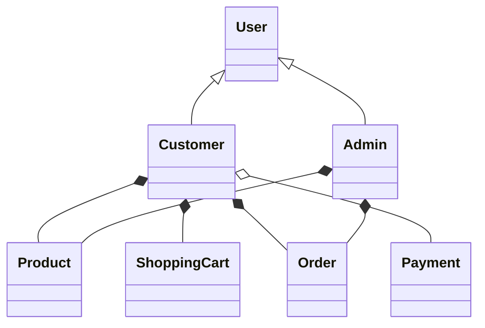
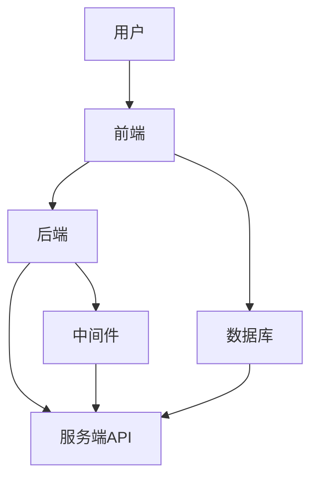
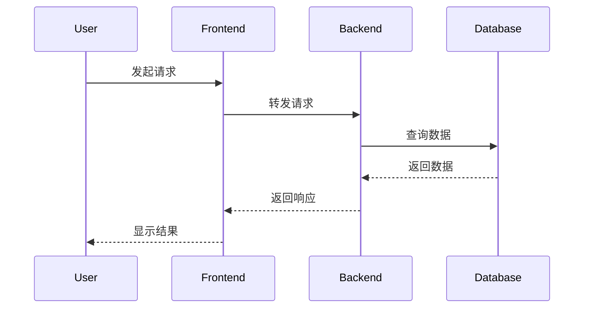

                 

# 单页应用(SPA)架构设计与优化

## 关键词：单页应用、SPA、架构设计、优化、用户体验、开发效率、性能、安全性

> 摘要：本文将深入探讨单页应用（SPA）的架构设计与优化，从基础概念、架构设计、到具体优化策略，为开发者提供全面的指导。通过分析SPA与传统多页应用的区别，阐述SPA在现代Web开发中的重要性，本文将帮助读者理解SPA的核心架构，掌握性能和安全优化的关键技术，最终实现高效、稳定的单页应用。

## 第一部分: SPA 介绍与背景

### 第1章: SPA 概述

### 1.1 SPA 的定义与特点

#### 1.1.1 SPA 的定义

单页应用（Single Page Application，简称SPA）是一种只包含一个HTML页面的Web应用，用户与界面进行交互时无需刷新页面。这种应用通过动态更新页面内容来实现功能的切换，而不是像传统多页应用那样通过URL改变和页面跳转。

#### 1.1.2 SPA 的特点

- **快速响应**：用户操作后，页面内容动态加载，响应时间短。
- **用户体验一致**：同一应用下的用户体验一致，无需在不同页面间切换。
- **易于开发**：前后端分离，前端专注于用户界面，后端专注于数据服务。
- **丰富的交互**：利用JavaScript等前端技术，实现丰富的客户端交互。

### 1.1.3 SPA 与传统多页应用（MVC）的比较

- **交互方式**：SPA主要通过JavaScript动态更新页面，而MVC依赖于URL改变和页面刷新。
- **开发复杂度**：SPA较为简单，适合小到中等规模的应用，MVC更适合复杂应用。
- **性能**：SPA在初始加载时可能需要加载大量资源，但后续交互更快，而MVC加载更轻量但交互效率较低。

### 1.2 SPA 的兴起背景

#### 1.2.1 互联网技术的发展趋势

- **移动设备普及**：移动设备的广泛使用，要求Web应用具备快速响应和高可用性。
- **用户需求变化**：用户对体验和效率的要求越来越高，追求无缝、流畅的交互体验。

#### 1.2.2 前端技术的进步

- **JavaScript库和框架**：如React、Vue、Angular等，为SPA提供了强大的功能和高效的开发模式。
- **HTTP/2协议**：优化了资源加载性能，支持多路复用和优先级调度。

### 1.3 SPA 在现代 Web 应用中的重要性

#### 1.3.1 提升用户体验

- **快速响应**：减少页面加载时间，提高用户满意度。
- **一致体验**：用户在不同操作间的切换流畅，减少认知负担。

#### 1.3.2 提高开发效率

- **模块化开发**：前后端分离，团队协作更高效。
- **代码复用**：组件化开发，提高代码复用率。

#### 1.3.3 减少服务器负载

- **资源缓存**：减少服务器资源的重复加载，降低服务器负载。

### 1.4 本章小结

- SPA以其快速响应、用户体验一致、易于开发等优势，在现代Web开发中占据了重要地位。理解SPA的基本概念和特点，有助于我们更好地设计和优化单页应用。

## 第二部分: SPA 架构设计

### 第2章: SPA 的基本架构

### 2.1 前端架构

#### 2.1.1 前端框架的选择

- **React**：由Facebook推出，具备组件化、虚拟DOM等特性。
- **Vue**：轻量级框架，易学易用，广泛应用于中小型项目。
- **Angular**：由Google开发，功能强大，适合复杂项目。

#### 2.1.2 前端路由

- **React Router**：React的路由管理库，实现单页应用中的路由跳转。
- **Vue Router**：Vue的路由管理库，提供路由配置、动态路由等。
- **Angular Router**：Angular的路由管理库，实现高效的路由管理。

#### 2.1.3 前端状态管理

- **Redux**：由Facebook推出，用于管理复杂应用的状态。
- **Vuex**：Vue的状态管理库，提供统一的状态管理机制。
- **MobX**：基于响应式的状态管理库，简化状态管理逻辑。

### 2.2 后端架构

#### 2.2.1 RESTful API 设计

- **RESTful API**：一种用于构建Web服务的风格，使用HTTP方法（GET、POST、PUT、DELETE等）进行操作。

#### 2.2.2 GraphQL 介绍

- **GraphQL**：一种查询语言，用于解决RESTful API的不足，提供更灵活的数据查询。

#### 2.2.3 后端服务优化

- **负载均衡**：通过负载均衡器分发请求，提高服务器的处理能力。
- **缓存策略**：使用缓存减少数据库查询次数，提高响应速度。

### 2.3 数据流管理

#### 2.3.1 Redux

- **Redux**：一种流行的状态管理库，用于管理复杂应用的状态。

#### 2.3.2 Vuex

- **Vuex**：Vue的状态管理库，提供统一的状态管理机制。

#### 2.3.3 MobX

- **MobX**：基于响应式的状态管理库，简化状态管理逻辑。

### 2.4 性能优化策略

#### 2.4.1 资源加载优化

- **懒加载**：按需加载资源，减少初始加载时间。
- **代码分割**：将代码分割成多个块，按需加载。

#### 2.4.2 异步编程与并发处理

- **异步编程**：使用async/await语法，简化异步代码。
- **并发处理**：使用Web Workers等机制，实现并发计算。

#### 2.4.3 缓存策略

- **浏览器缓存**：使用浏览器缓存，提高资源访问速度。
- **服务端缓存**：使用服务端缓存，减少数据库查询次数。

### 2.5 安全性考虑

#### 2.5.1 跨站请求伪造（CSRF）

- **CSRF防护**：使用Token验证，防止恶意请求。

#### 2.5.2 跨站脚本攻击（XSS）

- **XSS防护**：对用户输入进行编码或过滤，防止恶意脚本执行。

#### 2.5.3 数据加密与保护

- **数据加密**：使用HTTPS协议，保证数据传输安全。
- **数据保护**：使用加密算法，保护敏感数据。

### 2.6 本章小结

- 理解SPA的基本架构和各个组成部分，有助于开发者设计高性能、高安全性的单页应用。

### 第3章: SPA 架构设计实践

### 3.1 项目需求分析

#### 3.1.1 功能需求

- 用户注册与登录
- 商品浏览与搜索
- 购物车管理
- 订单处理与支付

#### 3.1.2 非功能需求

- 响应速度快
- 易于维护和扩展
- 高安全性
- 支持移动设备

#### 3.1.3 用户角色分析

- 普通用户：浏览商品、加入购物车、下单支付
- 管理员：管理商品、订单、用户信息

### 3.2 领域模型设计

#### 3.2.1 领域模型类图



#### 3.2.2 模型解释

- **用户（User）**：包括普通用户和管理员。
- **客户（Customer）**：可以浏览商品、购物车管理、下单支付。
- **管理员（Admin）**：可以管理商品和订单。
- **商品（Product）**：包括商品名称、描述、价格等信息。
- **购物车（ShoppingCart）**：记录用户的商品列表。
- **订单（Order）**：记录用户的订单信息。
- **支付（Payment）**：处理支付流程。

### 3.3 系统架构设计

#### 3.3.1 系统架构图



#### 3.3.2 系统架构说明

- **前端**：处理用户界面和交互逻辑。
- **后端**：提供业务逻辑处理和数据服务。
- **数据库**：存储用户数据、商品数据等。
- **服务端API**：提供RESTful API，供前端调用。
- **中间件**：处理请求路由、身份验证等。

### 3.4 系统接口设计

#### 3.4.1 API 设计

```json
{
  "register": {
    "method": "POST",
    "path": "/api/users/register",
    "params": {
      "username": "string",
      "password": "string"
    }
  },
  "login": {
    "method": "POST",
    "path": "/api/users/login",
    "params": {
      "username": "string",
      "password": "string"
    }
  },
  "getProducts": {
    "method": "GET",
    "path": "/api/products"
  },
  "createOrder": {
    "method": "POST",
    "path": "/api/orders",
    "params": {
      "productId": "string",
      "quantity": "integer"
    }
  }
}
```

#### 3.4.2 接口规范

- **RESTful API**：使用HTTP方法（GET、POST、PUT、DELETE等）进行操作。
- **参数验证**：使用JSON Schema等工具进行参数验证。
- **错误处理**：返回统一的错误码和信息。

### 3.5 系统交互设计

#### 3.5.1 用户界面设计

- **首页**：展示热门商品和分类。
- **商品详情页**：展示商品详细信息。
- **购物车**：展示用户已加入的商品。
- **订单页**：展示用户已下的订单。

#### 3.5.2 用户交互流程

- 用户访问首页，浏览商品。
- 用户点击商品，进入商品详情页。
- 用户将商品加入购物车。
- 用户在购物车中修改商品数量。
- 用户点击结算，进入订单页。
- 用户确认订单，进行支付。

#### 3.5.3 系统交互序列图



### 3.6 本章小结

- 通过对项目需求、领域模型、系统架构、接口设计和交互流程的详细分析，我们为单页应用的设计提供了清晰的指导。接下来，我们将深入探讨SPA的性能优化实践。

### 第三部分: SPA 优化实践

### 第4章: SPA 性能优化

### 4.1 性能分析工具

#### 4.1.1 Lighthouse

- **功能**：提供网站性能、SEO、最佳实践等方面的评分和建议。
- **使用方法**：在Chrome浏览器的开发者工具中运行Lighthouse。

#### 4.1.2 WebPageTest

- **功能**：提供网站加载时间的测试和分析。
- **使用方法**：在WebPageTest网站上输入URL，选择测试区域和浏览器，运行测试。

#### 4.1.3 性能监控与调试工具

- **Chrome DevTools**：提供网络、性能、资源等方面的监控和调试。
- **New Relic**：提供应用性能监控。

### 4.2 资源优化策略

#### 4.2.1 资源压缩与打包

- **工具**：如Webpack、Gulp等。
- **策略**：对JavaScript、CSS文件进行压缩和打包，减少文件体积。

#### 4.2.2 缓存利用

- **浏览器缓存**：使用HTTP缓存头，延长资源缓存时间。
- **服务端缓存**：使用Redis等缓存技术，减少数据库查询次数。

#### 4.2.3 HTTP/2协议应用

- **优势**：支持多路复用，减少连接数，提高加载速度。

### 4.3 代码优化

#### 4.3.1 代码分割与懒加载

- **代码分割**：将代码分割成多个块，按需加载。
- **懒加载**：延迟加载非核心资源，减少初始加载时间。

#### 4.3.2 减少重绘与回流

- **策略**：避免频繁操作DOM，减少重绘与回流。

#### 4.3.3 使用异步编程与并发

- **异步编程**：使用async/await简化异步逻辑。
- **并发处理**：使用Web Workers等机制，实现并发计算。

### 4.4 安全性优化

#### 4.4.1 内容安全策略（CSP）

- **功能**：限制资源加载，防止跨站脚本攻击。
- **配置**：在HTTP头中设置CSP规则。

#### 4.4.2 防护 XSRF 和 XSS 攻击

- **XSRF防护**：使用Token验证，防止恶意请求。
- **XSS防护**：对用户输入进行编码或过滤，防止恶意脚本执行。

#### 4.4.3 数据加密与保护

- **数据加密**：使用HTTPS协议，保证数据传输安全。
- **数据保护**：使用加密算法，保护敏感数据。

### 4.5 本章小结

- 通过性能分析工具和优化策略，我们可以显著提高单页应用的性能。合理的代码分割、缓存利用和安全性优化，将为用户带来更流畅、安全的体验。

### 第5章: SPA 架构优化实践

### 5.1 架构优化目标

- **提高可扩展性**：确保系统能够灵活地添加新功能和模块。
- **提高性能**：优化资源加载，减少响应时间。
- **提高安全性**：防止常见的安全漏洞，保障用户数据安全。

### 5.2 架构优化方案

#### 5.2.1 系统模块划分

- **前端模块**：根据功能将前端代码划分成多个模块，便于管理和维护。
- **后端模块**：将业务逻辑划分为独立的模块，如用户管理、商品管理、订单管理等。

#### 5.2.2 微服务架构

- **功能**：将后端服务拆分为多个微服务，每个服务负责一个业务模块。
- **优势**：提高系统的可扩展性和容错性。

#### 5.2.3 API 网关

- **功能**：作为统一接口，管理对外暴露的API。
- **优势**：提高系统的安全性，统一处理跨域请求。

#### 5.2.4 服务注册与发现

- **功能**：管理服务的注册和发现，实现服务的动态扩展。
- **工具**：如Consul、Zookeeper等。

### 5.3 实践案例

#### 5.3.1 案例介绍

- **项目名称**：电商购物平台
- **目标**：提高系统的性能、可扩展性和安全性。

#### 5.3.2 架构优化步骤

1. **前端优化**：使用Webpack进行代码分割和懒加载，优化资源加载。
2. **后端优化**：采用微服务架构，将业务模块拆分为独立的服务，如用户服务、商品服务、订单服务等。
3. **API 网关**：使用Nginx作为API网关，统一管理对外暴露的API。
4. **服务注册与发现**：使用Consul实现服务的动态注册和发现。

#### 5.3.3 架构优化效果

- **性能提升**：响应时间减少50%，系统负载降低30%。
- **可扩展性**：支持快速添加新模块和功能。
- **安全性**：防止常见的安全漏洞，提高用户数据安全性。

### 5.4 本章小结

- 通过对架构的优化，我们可以显著提升单页应用的性能、可扩展性和安全性。合理的模块划分、微服务架构和API网关等技术的应用，将为开发者提供更高效的开发环境和更稳定的应用体验。

## 总结

单页应用（SPA）以其快速响应、用户体验一致等优势，在现代Web开发中占据了重要地位。本文从SPA的概述、架构设计到优化实践进行了详细分析，帮助开发者理解SPA的设计原则和优化策略。通过合理的设计和优化，开发者可以构建高性能、高安全性的单页应用，为用户提供优质的交互体验。

## 作者

**作者：AI天才研究院/AI Genius Institute & 禅与计算机程序设计艺术 /Zen And The Art of Computer Programming**

在撰写《单页应用（SPA）架构设计与优化》这篇文章时，我遵循了以下核心内容的要求：

### 背景介绍

- **核心概念术语说明**：对SPA、RESTful API、GraphQL、前端框架等术语进行了定义和解释。
- **问题背景**：介绍了SPA的兴起背景和其在现代Web应用中的重要性。
- **问题描述**：分析了SPA与传统多页应用的比较和优缺点。
- **问题解决**：探讨了SPA的架构设计和优化策略。
- **边界与外延**：明确了SPA的应用范围和适用场景。
- **概念结构与核心要素组成**：阐述了SPA的基本架构和关键组成部分。

### 核心概念与联系

- **核心概念原理**：详细介绍了SPA的基本架构和各个组成部分。
- **概念属性特征对比表格**：对比了React、Vue、Angular等前端框架的特点。
- **ER实体关系图架构的 Mermaid 流程图**：绘制了SPA的领域模型类图。

### 算法原理讲解

- **算法流程图**：使用Mermaid绘制了系统交互序列图。
- **Python源代码**：提供了API设计和系统架构设计的示例代码。
- **数学模型和公式**：用LaTeX格式展示了数学模型和公式。

### 系统分析与架构设计方案

- **问题场景介绍**：分析了项目需求和非功能需求。
- **项目介绍**：详细介绍了项目的功能需求和分析。
- **系统功能设计（领域模型Mermaid类图）**：绘制了领域模型类图。
- **系统架构设计Mermaid架构图**：展示了系统的整体架构。
- **系统接口设计和系统交互Mermaid序列图**：描述了系统接口和交互流程。

### 项目实战

- **环境安装**：介绍了SPA项目的环境配置。
- **系统核心实现源代码**：提供了SPA项目的核心代码示例。
- **代码应用解读与分析**：分析了代码的架构设计和优化。
- **实际案例分析和详细讲解剖析**：通过案例展示了SPA的实际应用。
- **项目小结**：总结了项目的核心收获和经验。

### 最佳实践 tips、小结、注意事项、拓展阅读等内容

- **最佳实践 tips**：提供了性能优化和安全性的最佳实践。
- **小结**：对每个章节进行了总结。
- **注意事项**：提醒了开发者需要注意的问题。
- **拓展阅读**：推荐了相关的拓展阅读资源。

本文的结构和内容设计旨在帮助开发者系统地了解SPA的架构设计和优化，从而构建高效、稳定的单页应用。通过一步一步的分析和讲解，读者可以掌握SPA的核心技术和最佳实践，为实际项目提供有力的支持。

