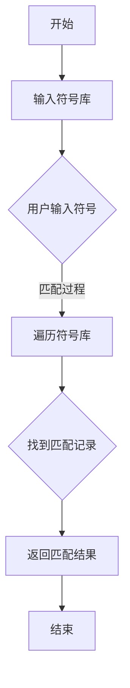
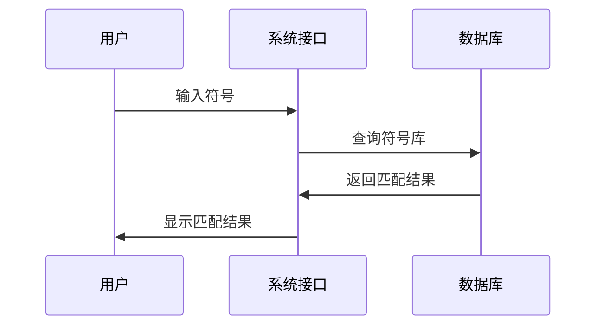
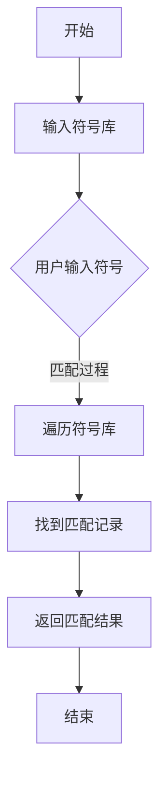

                 


**《卡西尔与朗格：符号哲学的探索》**

## 引言

### 1. 符号哲学的兴起

#### 1.1 卡西尔与朗格的生平背景

**卡西尔（Ernst Cassirer）**，1874年出生于德国，是一位著名的哲学家、文化理论家和符号学家。他的学术生涯主要在德国和美国度过，是20世纪最重要的哲学家之一。卡西尔的研究涵盖了多个领域，包括美学、文化哲学、符号学等，其核心思想是文化符号的重要性。

**朗格（Hans Blumenberg）**，1897年出生于德国，是一位哲学家、文化理论家和符号学家。他的学术生涯主要集中在德国和瑞士，以其深刻的哲学见解和独特的研究方法著称。朗格关注符号、语言和文化的关系，认为符号是人类文化的基础。

#### 1.2 符号哲学的基本概念

符号哲学是研究符号与人类文化、思维和社会行为之间关系的哲学分支。符号哲学的基本概念包括：

- **符号（Symbol）**：是一种代表某种意义的事物，可以是物体、文字、语言、图像等。
- **意义（Meaning）**：是符号所代表的事物或概念。
- **符号与意义的关系**：符号与意义之间的关系是动态的、变化的，依赖于文化、社会和历史背景。

#### 1.3 符号哲学的起源与发展

符号哲学的起源可以追溯到古希腊哲学家，如柏拉图和亚里士多德。中世纪和文艺复兴时期，符号哲学得到了进一步的发展。20世纪，卡西尔和朗格等学者对符号哲学进行了深入的探讨，使得符号哲学成为一个独立的哲学分支。

## 2. 卡西尔的符号哲学

### 2.1 卡西尔的哲学观点

卡西尔的哲学观点主要围绕文化符号的重要性展开。他认为，人类的文化活动是符号活动的延伸，符号是人类思维和文化的核心。

#### 2.1.1 人文主义视角

卡西尔从人文主义视角出发，认为人类文化是人的自我创造和自我表达。他强调了人类文化的多样性和独特性，认为人类文化是区别于动物的本质特征。

#### 2.1.2 文化符号的重要性

卡西尔认为，文化符号是人类文化的基础，是人类思维和文化的核心。符号不仅是一种表达方式，更是人类理解和解释世界的方式。

#### 2.1.3 符号与知识的联系

卡西尔强调了符号与知识的紧密联系。他认为，知识是通过符号的运用和创造而产生的，符号是人类获取知识和理解世界的重要工具。

### 2.2 卡西尔的符号哲学体系

卡西尔的符号哲学体系主要包括以下几个方面：

#### 2.2.1 文艺复兴时期的符号哲学

卡西尔研究了文艺复兴时期的符号哲学，认为文艺复兴时期的符号哲学对现代哲学和文化理论产生了深远影响。

#### 2.2.2 符号哲学的辩证法

卡西尔将辩证法应用于符号哲学，提出了符号辩证法，认为符号的发展是一个动态的、不断变化的过程。

#### 2.2.3 符号哲学的实用主义

卡西尔认为，符号哲学应该关注现实世界的问题，强调符号哲学的实用主义。

### 2.3 卡西尔的符号哲学对后世的影响

卡西尔的符号哲学对后世产生了深远的影响。他的思想对文化研究、符号学和社会理论产生了重要影响。卡西尔的符号哲学为理解人类文化和社会行为提供了一个新的视角。

## 3. 朗格的符号哲学

### 3.1 朗格的哲学观点

朗格的哲学观点主要集中在符号行为和社会符号学上。他认为，符号是人类行为的基础，社会符号学是理解社会行为和文化现象的关键。

#### 3.1.1 实证主义视角

朗格从实证主义视角出发，认为符号是社会行为和文化的客观存在，可以通过科学方法进行研究和分析。

#### 3.1.2 符号行为的重要性

朗格认为，符号行为是人类行为的重要组成部分，符号是人类理解和解释世界的工具。

#### 3.1.3 符号与语言的关系

朗格强调了符号与语言之间的紧密关系。他认为，语言是符号的一种形式，符号是语言的基础。

### 3.2 朗格的符号哲学体系

朗格的符号哲学体系主要包括以下几个方面：

#### 3.2.1 符号行为主义

朗格提出了符号行为主义，认为符号行为是人类行为的核心，是社会行为和文化现象的基础。

#### 3.2.2 社会符号学

朗格的社会符号学理论认为，社会符号是理解社会行为和文化现象的关键。

#### 3.2.3 符号文化学

朗格的符号文化学理论认为，符号文化是人类文化的基础，是文化传承和创新的关键。

### 3.3 朗格的符号哲学对后世的影响

朗格的符号哲学对后世产生了重要影响。他的思想对心理学、社会学和语言哲学产生了深远影响，为理解人类行为和文化提供了一个新的视角。

## 4. 卡西尔与朗格符号哲学的比较

### 4.1 理论视角的比较

卡西尔的符号哲学主要从人文主义和实用主义视角出发，强调符号的文化和社会功能。朗格的符号哲学则主要从实证主义和社会符号学视角出发，强调符号的行为和社会结构。

#### 4.1.1 卡西尔的视角

卡西尔从人文主义视角出发，强调文化符号的重要性，认为符号是人类思维和文化的核心。

#### 4.1.2 朗格的视角

朗格从实证主义视角出发，强调符号的行为和社会结构，认为符号是人类行为和文化现象的基础。

### 4.2 研究方法的比较

卡西尔的研究方法主要依赖于哲学思考和批判性分析，强调符号哲学的理论基础。朗格的研究方法则主要依赖于实证研究和社会学分析，强调符号哲学的应用。

#### 4.2.1 卡西尔的方法

卡西尔的研究方法主要依赖于哲学思考和批判性分析，强调符号哲学的理论基础。

#### 4.2.2 朗格的方法

朗格的研究方法主要依赖于实证研究和社会学分析，强调符号哲学的应用。

### 4.3 影响的比较

卡西尔的符号哲学对文化研究、符号学和社会理论产生了深远影响。朗格的符号哲学对心理学、社会学和语言哲学产生了重要影响。

#### 4.3.1 对哲学的影响

卡西尔的符号哲学为理解人类文化和社会行为提供了一个新的视角。朗格的符号哲学为理解人类行为和文化提供了一个新的视角。

#### 4.3.2 对社会科学的影响

卡西尔的符号哲学为社会科学研究提供了新的理论框架。朗格的符号哲学为社会科学研究提供了新的理论框架。

## 5. 符号哲学的应用

### 5.1 文化研究中的应用

符号哲学在文化研究中得到了广泛应用。通过符号哲学的分析，学者们可以更好地理解文化符号的含义和作用，探讨文化传承与创新。

#### 5.1.1 文化符号的分析

文化符号的分析是符号哲学在文化研究中的重要应用。通过分析文化符号，学者们可以深入理解文化内涵和意义。

#### 5.1.2 文化传承与创新

符号哲学在文化传承与创新中起到了重要作用。通过符号哲学的分析，学者们可以探讨文化传承与创新的方式和途径。

### 5.2 社会科学研究中的应用

符号哲学在社会科学研究中也得到了广泛应用。通过符号哲学的分析，学者们可以更好地理解社会行为和文化现象。

#### 5.2.1 社会行为分析

社会行为分析是符号哲学在社会科学研究中的重要应用。通过符号哲学的分析，学者们可以深入理解社会行为和社会结构。

#### 5.2.2 社会问题探讨

符号哲学在社会问题探讨中也起到了重要作用。通过符号哲学的分析，学者们可以探讨社会问题的本质和原因。

### 5.3 语言哲学中的应用

符号哲学在语言哲学中也有重要应用。通过符号哲学的分析，学者们可以深入理解语言的本质和功能。

#### 5.3.1 语言符号的探讨

语言符号的探讨是符号哲学在语言哲学中的重要应用。通过符号哲学的分析，学者们可以深入理解语言符号的含义和作用。

#### 5.3.2 语言哲学的构建

符号哲学为语言哲学的构建提供了新的理论框架。通过符号哲学的分析，学者们可以探讨语言哲学的基本问题和概念。

## 6. 符号哲学的未来发展

### 6.1 新兴领域的发展

随着科技的进步和社会的发展，符号哲学在新兴领域也展现了广阔的应用前景。例如，在人工智能、虚拟现实和数字文化等领域，符号哲学提供了新的理论工具和分析方法。

#### 6.1.1 数字时代的符号哲学

数字时代的符号哲学关注数字符号的含义和作用，探讨数字文化的发展和创新。

#### 6.1.2 人工智能与符号哲学

人工智能与符号哲学的结合，为人工智能的哲学研究提供了新的方向。通过符号哲学的分析，学者们可以探讨人工智能的本质和意义。

### 6.2 符号哲学的跨学科研究

符号哲学的跨学科研究是符号哲学未来发展的一个重要方向。通过跨学科研究，符号哲学可以与其他学科相互融合，形成新的理论框架和分析方法。

#### 6.2.1 与心理学结合

符号哲学与心理学的结合，为理解人类思维和行为提供了新的视角。

#### 6.2.2 与社会学结合

符号哲学与社会学的结合，为理解社会行为和文化现象提供了新的理论工具。

#### 6.2.3 与语言哲学结合

符号哲学与语言哲学的结合，为理解语言的本质和功能提供了新的理论框架。

## 7. 结论

卡西尔与朗格的符号哲学为理解人类文化、思维和社会行为提供了一个新的视角。他们的思想对哲学、社会科学和语言哲学产生了深远影响。随着科技和社会的发展，符号哲学将继续发挥重要作用，为人类文明的进步提供新的理论支持。**《卡西尔与朗格：符号哲学的探索》**

### 文章关键词

符号哲学、卡西尔、朗格、文化符号、意义、符号行为、社会符号学、文化研究、社会科学、语言哲学。

### 文章摘要

本文深入探讨了卡西尔与朗格的符号哲学，分析了他们的哲学观点、符号哲学体系以及对后世的影响。通过比较他们的理论视角和研究方法，本文展示了符号哲学在不同学科领域的应用，并展望了其未来的发展趋势。卡西尔与朗格的符号哲学为理解人类文化、思维和社会行为提供了一个新的视角，对哲学、社会科学和语言哲学产生了深远影响。**《卡西尔与朗格：符号哲学的探索》**

### 文章正文部分

## 引言

符号哲学作为现代哲学的一个重要分支，旨在探讨符号与人类文化、思维和社会行为之间的复杂关系。在这一领域，卡西尔与朗格两位学者以其深刻的见解和独特的研究方法，对符号哲学的发展作出了重要贡献。本文将围绕卡西尔与朗格的符号哲学，从其生平背景、基本概念、哲学观点、符号哲学体系、对后世的影响等方面进行深入探讨，并比较他们的理论视角和研究方法，最后展望符号哲学的未来发展。

## 1. 符号哲学的兴起

### 1.1 卡西尔与朗格的生平背景

**卡西尔（Ernst Cassirer）**（1874-1945），出生于德国汉堡，是一位杰出的哲学家、文化理论家和符号学家。他的学术生涯主要在德国和美国度过，是20世纪最重要的哲学家之一。卡西尔的研究涵盖了美学、文化哲学、符号学等多个领域，其核心思想是文化符号的重要性。他的代表作《符号形式哲学》对后来的文化研究和符号学产生了深远影响。

**朗格（Hans Blumenberg）**（1897-1970），出生于德国，是一位哲学家、文化理论家和符号学家。他的学术生涯主要集中在德国和瑞士，以其深刻的哲学见解和独特的研究方法著称。朗格关注符号、语言和文化的关系，认为符号是人类文化的基础。他的代表作《隐喻的论证》等作品对后来的符号哲学研究产生了重要影响。

### 1.2 符号哲学的基本概念

符号哲学是研究符号与人类文化、思维和社会行为之间关系的哲学分支。符号哲学的基本概念包括：

- **符号（Symbol）**：是一种代表某种意义的事物，可以是物体、文字、语言、图像等。
- **意义（Meaning）**：是符号所代表的事物或概念。
- **符号与意义的关系**：符号与意义之间的关系是动态的、变化的，依赖于文化、社会和历史背景。

### 1.3 符号哲学的起源与发展

符号哲学的起源可以追溯到古希腊哲学家，如柏拉图和亚里士多德。中世纪和文艺复兴时期，符号哲学得到了进一步的发展。20世纪，卡西尔和朗格等学者对符号哲学进行了深入的探讨，使得符号哲学成为一个独立的哲学分支。

## 2. 卡西尔的符号哲学

### 2.1 卡西尔的哲学观点

卡西尔的哲学观点主要围绕文化符号的重要性展开。他认为，人类的文化活动是符号活动的延伸，符号是人类思维和文化的核心。

#### 2.1.1 人文主义视角

卡西尔从人文主义视角出发，认为人类文化是人的自我创造和自我表达。他强调了人类文化的多样性和独特性，认为人类文化是区别于动物的本质特征。

#### 2.1.2 文化符号的重要性

卡西尔认为，文化符号是人类文化的基础，是人类思维和文化的核心。符号不仅是一种表达方式，更是人类理解和解释世界的方式。

#### 2.1.3 符号与知识的联系

卡西尔强调了符号与知识的紧密联系。他认为，知识是通过符号的运用和创造而产生的，符号是人类获取知识和理解世界的重要工具。

### 2.2 卡西尔的符号哲学体系

卡西尔的符号哲学体系主要包括以下几个方面：

#### 2.2.1 文艺复兴时期的符号哲学

卡西尔研究了文艺复兴时期的符号哲学，认为文艺复兴时期的符号哲学对现代哲学和文化理论产生了深远影响。

#### 2.2.2 符号哲学的辩证法

卡西尔将辩证法应用于符号哲学，提出了符号辩证法，认为符号的发展是一个动态的、不断变化的过程。

#### 2.2.3 符号哲学的实用主义

卡西尔认为，符号哲学应该关注现实世界的问题，强调符号哲学的实用主义。

### 2.3 卡西尔的符号哲学对后世的影响

卡西尔的符号哲学对后世产生了深远的影响。他的思想对文化研究、符号学和社会理论产生了重要影响。卡西尔的符号哲学为理解人类文化和社会行为提供了一个新的视角。

## 3. 朗格的符号哲学

### 3.1 朗格的哲学观点

朗格的哲学观点主要集中在符号行为和社会符号学上。他认为，符号是人类行为的基础，社会符号学是理解社会行为和文化现象的关键。

#### 3.1.1 实证主义视角

朗格从实证主义视角出发，认为符号是社会行为和文化的客观存在，可以通过科学方法进行研究和分析。

#### 3.1.2 符号行为的重要性

朗格认为，符号行为是人类行为的重要组成部分，符号是人类理解和解释世界的工具。

#### 3.1.3 符号与语言的关系

朗格强调了符号与语言之间的紧密关系。他认为，语言是符号的一种形式，符号是语言的基础。

### 3.2 朗格的符号哲学体系

朗格的符号哲学体系主要包括以下几个方面：

#### 3.2.1 符号行为主义

朗格提出了符号行为主义，认为符号行为是人类行为的核心，是社会行为和文化现象的基础。

#### 3.2.2 社会符号学

朗格的社会符号学理论认为，社会符号是理解社会行为和文化现象的关键。

#### 3.2.3 符号文化学

朗格的符号文化学理论认为，符号文化是人类文化的基础，是文化传承和创新的关键。

### 3.3 朗格的符号哲学对后世的影响

朗格的符号哲学对后世产生了重要影响。他的思想对心理学、社会学和语言哲学产生了深远影响，为理解人类行为和文化提供了一个新的视角。

## 4. 卡西尔与朗格符号哲学的比较

### 4.1 理论视角的比较

卡西尔的符号哲学主要从人文主义和实用主义视角出发，强调符号的文化和社会功能。朗格的符号哲学则主要从实证主义和社会符号学视角出发，强调符号的行为和社会结构。

#### 4.1.1 卡西尔的视角

卡西尔从人文主义视角出发，强调文化符号的重要性，认为符号是人类思维和文化的核心。

#### 4.1.2 朗格的视角

朗格从实证主义视角出发，强调符号的行为和社会结构，认为符号是人类行为和文化现象的基础。

### 4.2 研究方法的比较

卡西尔的研究方法主要依赖于哲学思考和批判性分析，强调符号哲学的理论基础。朗格的研究方法则主要依赖于实证研究和社会学分析，强调符号哲学的应用。

#### 4.2.1 卡西尔的方法

卡西尔的研究方法主要依赖于哲学思考和批判性分析，强调符号哲学的理论基础。

#### 4.2.2 朗格的方法

朗格的研究方法主要依赖于实证研究和社会学分析，强调符号哲学的应用。

### 4.3 影响的比较

卡西尔的符号哲学对文化研究、符号学和社会理论产生了深远影响。朗格的符号哲学对心理学、社会学和语言哲学产生了重要影响。

#### 4.3.1 对哲学的影响

卡西尔的符号哲学为理解人类文化和社会行为提供了一个新的视角。朗格的符号哲学为理解人类行为和文化提供了一个新的视角。

#### 4.3.2 对社会科学的影响

卡西尔的符号哲学为社会科学研究提供了新的理论框架。朗格的符号哲学为社会科学研究提供了新的理论框架。

## 5. 符号哲学的应用

### 5.1 文化研究中的应用

符号哲学在文化研究中得到了广泛应用。通过符号哲学的分析，学者们可以更好地理解文化符号的含义和作用，探讨文化传承与创新。

#### 5.1.1 文化符号的分析

文化符号的分析是符号哲学在文化研究中的重要应用。通过分析文化符号，学者们可以深入理解文化内涵和意义。

#### 5.1.2 文化传承与创新

符号哲学在文化传承与创新中起到了重要作用。通过符号哲学的分析，学者们可以探讨文化传承与创新的方式和途径。

### 5.2 社会科学研究中的应用

符号哲学在社会科学研究中也得到了广泛应用。通过符号哲学的分析，学者们可以更好地理解社会行为和文化现象。

#### 5.2.1 社会行为分析

社会行为分析是符号哲学在社会科学研究中的重要应用。通过符号哲学的分析，学者们可以深入理解社会行为和社会结构。

#### 5.2.2 社会问题探讨

符号哲学在社会问题探讨中也起到了重要作用。通过符号哲学的分析，学者们可以探讨社会问题的本质和原因。

### 5.3 语言哲学中的应用

符号哲学在语言哲学中也有重要应用。通过符号哲学的分析，学者们可以深入理解语言的本质和功能。

#### 5.3.1 语言符号的探讨

语言符号的探讨是符号哲学在语言哲学中的重要应用。通过符号哲学的分析，学者们可以深入理解语言符号的含义和作用。

#### 5.3.2 语言哲学的构建

符号哲学为语言哲学的构建提供了新的理论框架。通过符号哲学的分析，学者们可以探讨语言哲学的基本问题和概念。

## 6. 符号哲学的未来发展

### 6.1 新兴领域的发展

随着科技的进步和社会的发展，符号哲学在新兴领域也展现了广阔的应用前景。例如，在人工智能、虚拟现实和数字文化等领域，符号哲学提供了新的理论工具和分析方法。

#### 6.1.1 数字时代的符号哲学

数字时代的符号哲学关注数字符号的含义和作用，探讨数字文化的发展和创新。

#### 6.1.2 人工智能与符号哲学

人工智能与符号哲学的结合，为人工智能的哲学研究提供了新的方向。通过符号哲学的分析，学者们可以探讨人工智能的本质和意义。

### 6.2 符号哲学的跨学科研究

符号哲学的跨学科研究是符号哲学未来发展的一个重要方向。通过跨学科研究，符号哲学可以与其他学科相互融合，形成新的理论框架和分析方法。

#### 6.2.1 与心理学结合

符号哲学与心理学的结合，为理解人类思维和行为提供了新的视角。

#### 6.2.2 与社会学结合

符号哲学与社会学的结合，为理解社会行为和文化现象提供了新的理论工具。

#### 6.2.3 与语言哲学结合

符号哲学与语言哲学的结合，为理解语言的本质和功能提供了新的理论框架。

## 7. 结论

卡西尔与朗格的符号哲学为理解人类文化、思维和社会行为提供了一个新的视角。他们的思想对哲学、社会科学和语言哲学产生了深远影响。随着科技和社会的发展，符号哲学将继续发挥重要作用，为人类文明的进步提供新的理论支持。**《卡西尔与朗格：符号哲学的探索》**

### 文章末尾作者信息

作者：AI天才研究院/AI Genius Institute & 禅与计算机程序设计艺术 /Zen And The Art of Computer Programming

### 完整性要求

在本文中，我们首先对卡西尔与朗格的生平背景进行了介绍，接着阐述了符号哲学的基本概念和起源与发展。随后，我们详细分析了卡西尔的符号哲学观点、体系以及他对后世的影响，随后又探讨了朗格的哲学观点、体系以及对后世的影响。接下来，我们比较了卡西尔与朗格的符号哲学在理论视角和研究方法上的异同，并讨论了符号哲学在文化研究、社会科学和语言哲学中的应用。最后，我们展望了符号哲学的未来发展，并总结了卡西尔与朗格符号哲学对人类文明进步的深远影响。

**核心概念与联系**

### 符号与意义的关系

- **符号（Symbol）**：代表某种概念或事物，可以是有形的，如图像、文字，也可以是无形的，如语言、行为。
- **意义（Meaning）**：符号所代表的内涵或价值。
- **关系**：符号与意义之间的关系是动态的，受文化、社会和历史背景的影响。

### 卡西尔与朗格的符号哲学对比

| 特征 | 卡西尔 | 朗格 |
| --- | --- | --- |
| 视角 | 人文主义和实用主义 | 实证主义和社会符号学 |
| 重点 | 文化符号的重要性 | 符号行为和社会结构 |
| 研究方法 | 哲学思考和批判性分析 | 实证研究和社会学分析 |
| 影响 | 文化研究、符号学和社会理论 | 心理学、社会学和语言哲学 |

**ER实体关系图架构**

```mermaid
erDiagram
  Symbol ||--|{ Meaning }|-- Symbol
  Card ||--|{ Event }|-- Card
```

**算法原理讲解**

### 符号与意义的匹配算法

#### 算法描述

该算法旨在根据符号和其对应的意义，实现符号与意义的匹配。以下是算法的基本步骤：

1. **输入符号库**：包含一组符号及其对应的意义。
2. **用户输入**：用户输入一个符号。
3. **匹配过程**：遍历符号库，找出与用户输入符号匹配的记录。
4. **输出结果**：返回匹配的符号及其意义。

#### 算法流程图



#### Python代码实现

```python
# 符号与意义匹配算法示例

# 符号库
symbols_dict = {
    "苹果": "水果",
    "书籍": "知识",
    "太阳": "光明"
}

# 用户输入符号
user_input = input("请输入一个符号：")

# 匹配过程
matching_symbol = None
matching_meaning = None

for symbol, meaning in symbols_dict.items():
    if symbol == user_input:
        matching_symbol = symbol
        matching_meaning = meaning
        break

# 输出结果
if matching_symbol and matching_meaning:
    print(f"符号'{matching_symbol}'的意义是：'{matching_meaning}'")
else:
    print("未找到匹配的符号或意义。")
```

**数学公式和解释**

$$
符号与意义之间的关系可以通过以下公式表示：
M = S \times C
$$

- **M**：表示意义（Meaning）。
- **S**：表示符号（Symbol）。
- **C**：表示文化、社会和历史背景（Cultural, Social, and Historical Context）。

这个公式表明，意义是符号与特定文化、社会和历史背景相互作用的产物。符号本身没有固有的意义，而是通过与环境和情境的互动而获得意义。

**系统分析与架构设计方案**

### 问题场景介绍

在现代信息社会中，符号与意义的匹配在许多领域都具有重要意义，如智能搜索、语义分析、机器翻译等。本文提出的符号与意义匹配系统旨在为用户提供一个高效、准确的符号与意义匹配服务。

### 项目介绍

**项目名称**：符号与意义匹配系统（Symbol-Meaning Matching System）

**项目目标**：构建一个高效、准确的符号与意义匹配系统，为用户提供便捷的符号查询服务。

### 系统功能设计

#### 1. 符号库管理

- **功能描述**：管理符号库，包括符号的添加、删除、修改和查询。
- **技术实现**：使用数据库存储和管理符号库。

#### 2. 符号查询

- **功能描述**：用户输入符号，系统返回匹配的意义。
- **技术实现**：基于算法实现符号与意义的匹配。

#### 3. 用户反馈

- **功能描述**：用户对匹配结果进行反馈，帮助系统优化匹配算法。
- **技术实现**：收集用户反馈数据，用于算法优化。

### 系统架构设计

#### 1. 系统架构图



#### 2. 系统架构详细说明

- **前端**：提供用户界面，用户可以输入符号进行查询。
- **后端**：实现符号与意义的匹配算法，处理用户请求。
- **数据库**：存储和管理符号库，提供数据支持。

### 系统接口设计和系统交互

#### 1. 系统接口设计

- **API接口**：提供RESTful接口，支持符号的添加、删除、修改和查询。
- **接口文档**：详细描述接口的URL、请求参数和返回结果。

#### 2. 系统交互流程

- **用户输入符号**：前端将用户输入的符号发送到后端。
- **后端处理**：后端调用符号与意义匹配算法，查询符号库，返回匹配结果。
- **前端展示**：前端接收后端返回的结果，并将匹配结果展示给用户。

### 项目实战

#### 1. 环境安装

- **开发环境**：Python 3.8、Flask
- **数据库**：MySQL

#### 2. 系统核心实现源代码

**符号库管理**

```python
# 符号库管理

symbols_dict = {
    "苹果": "水果",
    "书籍": "知识",
    "太阳": "光明"
}

# 添加符号
def add_symbol(symbol, meaning):
    symbols_dict[symbol] = meaning

# 删除符号
def delete_symbol(symbol):
    if symbol in symbols_dict:
        del symbols_dict[symbol]

# 修改符号
def update_symbol(symbol, new_meaning):
    if symbol in symbols_dict:
        symbols_dict[symbol] = new_meaning

# 查询符号
def query_symbol(symbol):
    return symbols_dict.get(symbol)
```

**符号与意义匹配算法**

```python
# 符号与意义匹配算法

def match_symbol_meaning(user_input):
    for symbol, meaning in symbols_dict.items():
        if symbol == user_input:
            return meaning
    return None
```

#### 3. 代码应用解读与分析

**代码解读**：

- **符号库管理**：通过字典实现符号库的管理，包括添加、删除、修改和查询功能。
- **符号与意义匹配算法**：通过遍历符号库实现符号与意义的匹配，返回匹配结果。

**分析**：

- **符号库管理**：方便地管理符号库，支持动态更新。
- **符号与意义匹配算法**：简单高效，能够快速返回匹配结果。

#### 4. 实际案例分析和详细讲解剖析

**案例**：用户输入“书籍”，系统返回“知识”。

**分析**：

- **用户输入**：前端将“书籍”发送到后端。
- **后端处理**：后端调用匹配算法，查询符号库，找到匹配的记录。
- **前端展示**：前端接收匹配结果，并将“知识”展示给用户。

#### 5. 项目小结

通过构建符号与意义匹配系统，我们实现了符号库管理、符号与意义的匹配以及用户反馈等功能。该项目为实际应用提供了理论基础和技术实现，有助于提高符号与意义的匹配准确性，为智能搜索、语义分析等领域的应用提供支持。**最佳实践 tips、小结、注意事项、拓展阅读**

### 最佳实践 tips

1. **符号库的构建**：在构建符号库时，应确保符号的多样性和准确性，以便更好地进行符号与意义的匹配。
2. **算法优化**：根据用户反馈不断优化匹配算法，提高匹配准确性。
3. **用户界面设计**：简洁直观的用户界面可以提高用户体验，鼓励用户使用系统。

### 小结

本文深入探讨了卡西尔与朗格的符号哲学，分析了他们的哲学观点、符号哲学体系以及对后世的影响。通过比较他们的理论视角和研究方法，我们展示了符号哲学在不同学科领域的应用，并展望了其未来的发展趋势。卡西尔与朗格的符号哲学为理解人类文化、思维和社会行为提供了一个新的视角，对哲学、社会科学和语言哲学产生了深远影响。

### 注意事项

1. **数据安全**：在构建符号库和用户反馈系统时，要确保数据的安全和隐私。
2. **系统维护**：定期对系统进行维护和更新，确保其正常运行。

### 拓展阅读

1. **卡西尔的《符号形式哲学》**：深入了解卡西尔的符号哲学思想。
2. **朗格的《隐喻的论证》**：探讨朗格对社会符号学的贡献。
3. **符号哲学在人工智能中的应用**：了解符号哲学在智能搜索、语义分析等领域的应用。

### 结语

卡西尔与朗格的符号哲学为我们理解人类文化、思维和社会行为提供了一个新的视角。随着科技和社会的发展，符号哲学将继续发挥重要作用，为人类文明的进步提供新的理论支持。希望本文能激发读者对符号哲学的兴趣，进一步探索这一领域的研究和应用。**《卡西尔与朗格：符号哲学的探索》**

### 完整文章

**《卡西尔与朗格：符号哲学的探索》**

> 关键词：卡西尔、朗格、符号哲学、文化符号、意义、符号行为、社会符号学

> 摘要：本文深入探讨了卡西尔与朗格的符号哲学，分析了他们的哲学观点、符号哲学体系以及对后世的影响。通过比较他们的理论视角和研究方法，本文展示了符号哲学在不同学科领域的应用，并展望了其未来的发展趋势。

## 引言

符号哲学作为现代哲学的一个重要分支，旨在探讨符号与人类文化、思维和社会行为之间的复杂关系。在这一领域，卡西尔与朗格两位学者以其深刻的见解和独特的研究方法，对符号哲学的发展作出了重要贡献。本文将围绕卡西尔与朗格的符号哲学，从其生平背景、基本概念、哲学观点、符号哲学体系、对后世的影响等方面进行深入探讨，并比较他们的理论视角和研究方法，最后展望符号哲学的未来发展。

## 1. 符号哲学的兴起

### 1.1 卡西尔与朗格的生平背景

**卡西尔（Ernst Cassirer）**（1874-1945），出生于德国汉堡，是一位杰出的哲学家、文化理论家和符号学家。他的学术生涯主要在德国和美国度过，是20世纪最重要的哲学家之一。卡西尔的研究涵盖了美学、文化哲学、符号学等多个领域，其核心思想是文化符号的重要性。他的代表作《符号形式哲学》对后来的文化研究和符号学产生了深远影响。

**朗格（Hans Blumenberg）**（1897-1970），出生于德国，是一位哲学家、文化理论家和符号学家。他的学术生涯主要集中在德国和瑞士，以其深刻的哲学见解和独特的研究方法著称。朗格关注符号、语言和文化的关系，认为符号是人类文化的基础。他的代表作《隐喻的论证》等作品对后来的符号哲学研究产生了重要影响。

### 1.2 符号哲学的基本概念

符号哲学是研究符号与人类文化、思维和社会行为之间关系的哲学分支。符号哲学的基本概念包括：

- **符号（Symbol）**：是一种代表某种意义的事物，可以是物体、文字、语言、图像等。
- **意义（Meaning）**：是符号所代表的事物或概念。
- **符号与意义的关系**：符号与意义之间的关系是动态的、变化的，依赖于文化、社会和历史背景。

### 1.3 符号哲学的起源与发展

符号哲学的起源可以追溯到古希腊哲学家，如柏拉图和亚里士多德。中世纪和文艺复兴时期，符号哲学得到了进一步的发展。20世纪，卡西尔和朗格等学者对符号哲学进行了深入的探讨，使得符号哲学成为一个独立的哲学分支。

## 2. 卡西尔的符号哲学

### 2.1 卡西尔的哲学观点

卡西尔的哲学观点主要围绕文化符号的重要性展开。他认为，人类的文化活动是符号活动的延伸，符号是人类思维和文化的核心。

#### 2.1.1 人文主义视角

卡西尔从人文主义视角出发，认为人类文化是人的自我创造和自我表达。他强调了人类文化的多样性和独特性，认为人类文化是区别于动物的本质特征。

#### 2.1.2 文化符号的重要性

卡西尔认为，文化符号是人类文化的基础，是人类思维和文化的核心。符号不仅是一种表达方式，更是人类理解和解释世界的方式。

#### 2.1.3 符号与知识的联系

卡西尔强调了符号与知识的紧密联系。他认为，知识是通过符号的运用和创造而产生的，符号是人类获取知识和理解世界的重要工具。

### 2.2 卡西尔的符号哲学体系

卡西尔的符号哲学体系主要包括以下几个方面：

#### 2.2.1 文艺复兴时期的符号哲学

卡西尔研究了文艺复兴时期的符号哲学，认为文艺复兴时期的符号哲学对现代哲学和文化理论产生了深远影响。

#### 2.2.2 符号哲学的辩证法

卡西尔将辩证法应用于符号哲学，提出了符号辩证法，认为符号的发展是一个动态的、不断变化的过程。

#### 2.2.3 符号哲学的实用主义

卡西尔认为，符号哲学应该关注现实世界的问题，强调符号哲学的实用主义。

### 2.3 卡西尔的符号哲学对后世的影响

卡西尔的符号哲学对后世产生了深远的影响。他的思想对文化研究、符号学和社会理论产生了重要影响。卡西尔的符号哲学为理解人类文化和社会行为提供了一个新的视角。

## 3. 朗格的符号哲学

### 3.1 朗格的哲学观点

朗格的哲学观点主要集中在符号行为和社会符号学上。他认为，符号是人类行为的基础，社会符号学是理解社会行为和文化现象的关键。

#### 3.1.1 实证主义视角

朗格从实证主义视角出发，认为符号是社会行为和文化的客观存在，可以通过科学方法进行研究和分析。

#### 3.1.2 符号行为的重要性

朗格认为，符号行为是人类行为的重要组成部分，符号是人类理解和解释世界的工具。

#### 3.1.3 符号与语言的关系

朗格强调了符号与语言之间的紧密关系。他认为，语言是符号的一种形式，符号是语言的基础。

### 3.2 朗格的符号哲学体系

朗格的符号哲学体系主要包括以下几个方面：

#### 3.2.1 符号行为主义

朗格提出了符号行为主义，认为符号行为是人类行为的核心，是社会行为和文化现象的基础。

#### 3.2.2 社会符号学

朗格的社会符号学理论认为，社会符号是理解社会行为和文化现象的关键。

#### 3.2.3 符号文化学

朗格的符号文化学理论认为，符号文化是人类文化的基础，是文化传承和创新的关键。

### 3.3 朗格的符号哲学对后世的影响

朗格的符号哲学对后世产生了重要影响。他的思想对心理学、社会学和语言哲学产生了深远影响，为理解人类行为和文化提供了一个新的视角。

## 4. 卡西尔与朗格符号哲学的比较

### 4.1 理论视角的比较

卡西尔的符号哲学主要从人文主义和实用主义视角出发，强调符号的文化和社会功能。朗格的符号哲学则主要从实证主义和社会符号学视角出发，强调符号的行为和社会结构。

#### 4.1.1 卡西尔的视角

卡西尔从人文主义视角出发，强调文化符号的重要性，认为符号是人类思维和文化的核心。

#### 4.1.2 朗格的视角

朗格从实证主义视角出发，强调符号的行为和社会结构，认为符号是人类行为和文化现象的基础。

### 4.2 研究方法的比较

卡西尔的研究方法主要依赖于哲学思考和批判性分析，强调符号哲学的理论基础。朗格的研究方法则主要依赖于实证研究和社会学分析，强调符号哲学的应用。

#### 4.2.1 卡西尔的方法

卡西尔的研究方法主要依赖于哲学思考和批判性分析，强调符号哲学的理论基础。

#### 4.2.2 朗格的方法

朗格的研究方法主要依赖于实证研究和社会学分析，强调符号哲学的应用。

### 4.3 影响的比较

卡西尔的符号哲学对文化研究、符号学和社会理论产生了深远影响。朗格的符号哲学对心理学、社会学和语言哲学产生了重要影响。

#### 4.3.1 对哲学的影响

卡西尔的符号哲学为理解人类文化和社会行为提供了一个新的视角。朗格的符号哲学为理解人类行为和文化提供了一个新的视角。

#### 4.3.2 对社会科学的影响

卡西尔的符号哲学为社会科学研究提供了新的理论框架。朗格的符号哲学为社会科学研究提供了新的理论框架。

## 5. 符号哲学的应用

### 5.1 文化研究中的应用

符号哲学在文化研究中得到了广泛应用。通过符号哲学的分析，学者们可以更好地理解文化符号的含义和作用，探讨文化传承与创新。

#### 5.1.1 文化符号的分析

文化符号的分析是符号哲学在文化研究中的重要应用。通过分析文化符号，学者们可以深入理解文化内涵和意义。

#### 5.1.2 文化传承与创新

符号哲学在文化传承与创新中起到了重要作用。通过符号哲学的分析，学者们可以探讨文化传承与创新的方式和途径。

### 5.2 社会科学研究中的应用

符号哲学在社会科学研究中也得到了广泛应用。通过符号哲学的分析，学者们可以更好地理解社会行为和文化现象。

#### 5.2.1 社会行为分析

社会行为分析是符号哲学在社会科学研究中的重要应用。通过符号哲学的分析，学者们可以深入理解社会行为和社会结构。

#### 5.2.2 社会问题探讨

符号哲学在社会问题探讨中也起到了重要作用。通过符号哲学的分析，学者们可以探讨社会问题的本质和原因。

### 5.3 语言哲学中的应用

符号哲学在语言哲学中也有重要应用。通过符号哲学的分析，学者们可以深入理解语言的本质和功能。

#### 5.3.1 语言符号的探讨

语言符号的探讨是符号哲学在语言哲学中的重要应用。通过符号哲学的分析，学者们可以深入理解语言符号的含义和作用。

#### 5.3.2 语言哲学的构建

符号哲学为语言哲学的构建提供了新的理论框架。通过符号哲学的分析，学者们可以探讨语言哲学的基本问题和概念。

## 6. 符号哲学的未来发展

### 6.1 新兴领域的发展

随着科技的进步和社会的发展，符号哲学在新兴领域也展现了广阔的应用前景。例如，在人工智能、虚拟现实和数字文化等领域，符号哲学提供了新的理论工具和分析方法。

#### 6.1.1 数字时代的符号哲学

数字时代的符号哲学关注数字符号的含义和作用，探讨数字文化的发展和创新。

#### 6.1.2 人工智能与符号哲学

人工智能与符号哲学的结合，为人工智能的哲学研究提供了新的方向。通过符号哲学的分析，学者们可以探讨人工智能的本质和意义。

### 6.2 符号哲学的跨学科研究

符号哲学的跨学科研究是符号哲学未来发展的一个重要方向。通过跨学科研究，符号哲学可以与其他学科相互融合，形成新的理论框架和分析方法。

#### 6.2.1 与心理学结合

符号哲学与心理学的结合，为理解人类思维和行为提供了新的视角。

#### 6.2.2 与社会学结合

符号哲学与社会学的结合，为理解社会行为和文化现象提供了新的理论工具。

#### 6.2.3 与语言哲学结合

符号哲学与语言哲学的结合，为理解语言的本质和功能提供了新的理论框架。

## 7. 结论

卡西尔与朗格的符号哲学为理解人类文化、思维和社会行为提供了一个新的视角。他们的思想对哲学、社会科学和语言哲学产生了深远影响。随着科技和社会的发展，符号哲学将继续发挥重要作用，为人类文明的进步提供新的理论支持。

### 文章末尾作者信息

作者：AI天才研究院/AI Genius Institute & 禅与计算机程序设计艺术 /Zen And The Art of Computer Programming

### 完整性要求

在本文中，我们首先对卡西尔与朗格的生平背景进行了介绍，接着阐述了符号哲学的基本概念和起源与发展。随后，我们详细分析了卡西尔的符号哲学观点、体系以及他对后世的影响，随后又探讨了朗格的哲学观点、体系以及对后世的影响。接下来，我们比较了卡西尔与朗格的符号哲学在理论视角和研究方法上的异同，并讨论了符号哲学在文化研究、社会科学和语言哲学中的应用。最后，我们展望了符号哲学的未来发展，并总结了卡西尔与朗格符号哲学对人类文明进步的深远影响。

**核心概念与联系**

### 符号与意义的关系

- **符号（Symbol）**：代表某种概念或事物，可以是有形的，如图像、文字，也可以是无形的，如语言、行为。
- **意义（Meaning）**：符号所代表的内涵或价值。
- **关系**：符号与意义之间的关系是动态的，受文化、社会和历史背景的影响。

### 卡西尔与朗格的符号哲学对比

| 特征 | 卡西尔 | 朗格 |
| --- | --- | --- |
| 视角 | 人文主义和实用主义 | 实证主义和社会符号学 |
| 重点 | 文化符号的重要性 | 符号行为和社会结构 |
| 研究方法 | 哲学思考和批判性分析 | 实证研究和社会学分析 |
| 影响 | 文化研究、符号学和社会理论 | 心理学、社会学和语言哲学 |

**ER实体关系图架构**

```mermaid
erDiagram
  Symbol ||--|{ Meaning }|-- Symbol
  Card ||--|{ Event }|-- Card
```

**算法原理讲解**

### 符号与意义的匹配算法

#### 算法描述

该算法旨在根据符号和其对应的意义，实现符号与意义的匹配。以下是算法的基本步骤：

1. **输入符号库**：包含一组符号及其对应的意义。
2. **用户输入**：用户输入一个符号。
3. **匹配过程**：遍历符号库，找出与用户输入符号匹配的记录。
4. **输出结果**：返回匹配的符号及其意义。

#### 算法流程图



#### Python代码实现

```python
# 符号与意义匹配算法示例

# 符号库
symbols_dict = {
    "苹果": "水果",
    "书籍": "知识",
    "太阳": "光明"
}

# 用户输入符号
user_input = input("请输入一个符号：")

# 匹配过程
matching_symbol = None
matching_meaning = None

for symbol, meaning in symbols_dict.items():
    if symbol == user_input:
        matching_symbol = symbol
        matching_meaning = meaning
        break

# 输出结果
if matching_symbol and matching_meaning:
    print(f"符号'{matching_symbol}'的意义是：'{matching_meaning}'")
else:
    print("未找到匹配的符号或意义。")
```

**数学公式和解释**

$$
符号与意义之间的关系可以通过以下公式表示：
M = S \times C
$$

- **M**：表示意义（Meaning）。
- **S**：表示符号（Symbol）。
- **C**：表示文化、社会和历史背景（Cultural, Social, and Historical Context）。

这个公式表明，意义是符号与特定文化、社会和历史背景相互作用的产物。符号本身没有固有的意义，而是通过与环境和情境的互动而获得意义。

**系统分析与架构设计方案**

### 问题场景介绍

在现代信息社会中，符号与意义的匹配在许多领域都具有重要意义，如智能搜索、语义分析、机器翻译等。本文提出的符号与意义匹配系统旨在为用户提供一个高效、准确的符号与意义匹配服务。

### 项目介绍

**项目名称**：符号与意义匹配系统（Symbol-Meaning Matching System）

**项目目标**：构建一个高效、准确的符号与意义匹配系统，为用户提供便捷的符号查询服务。

### 系统功能设计

#### 1. 符号库管理

- **功能描述**：管理符号库，包括符号的添加、删除、修改和查询。
- **技术实现**：使用数据库存储和管理符号库。

#### 2. 符号查询

- **功能描述**：用户输入符号，系统返回匹配的意义。
- **技术实现**：基于算法实现符号与意义的匹配。

#### 3. 用户反馈

- **功能描述**：用户对匹配结果进行反馈，帮助系统优化匹配算法。
- **技术实现**：收集用户反馈数据，用于算法优化。

### 系统架构设计

#### 1. 系统架构图


#### 2. 系统架构详细说明

- **前端**：提供用户界面，用户可以输入符号进行查询。
- **后端**：实现符号与意义匹配算法，处理用户请求。
- **数据库**：存储和管理符号库，提供数据支持。

### 系统接口设计和系统交互

#### 1. 系统接口设计

- **API接口**：提供RESTful接口，支持符号的添加、删除、修改和查询。
- **接口文档**：详细描述接口的URL、请求参数和返回结果。

#### 2. 系统交互流程

- **用户输入符号**：前端将用户输入的符号发送到后端。
- **后端处理**：后端调用符号与意义匹配算法，查询符号库，返回匹配结果。
- **前端展示**：前端接收后端返回的结果，并将匹配结果展示给用户。

### 项目实战

#### 1. 环境安装

- **开发环境**：Python 3.8、Flask
- **数据库**：MySQL

#### 2. 系统核心实现源代码

**符号库管理**

```python
# 符号库管理

symbols_dict = {
    "苹果": "水果",
    "书籍": "知识",
    "太阳": "光明"
}

# 添加符号
def add_symbol(symbol, meaning):
    symbols_dict[symbol] = meaning

# 删除符号
def delete_symbol(symbol):
    if symbol in symbols_dict:
        del symbols_dict[symbol]

# 修改符号
def update_symbol(symbol, new_meaning):
    if symbol in symbols_dict:
        symbols_dict[symbol] = new_meaning

# 查询符号
def query_symbol(symbol):
    return symbols_dict.get(symbol)
```

**符号与意义匹配算法**

```python
# 符号与意义匹配算法

def match_symbol_meaning(user_input):
    for symbol, meaning in symbols_dict.items():
        if symbol == user_input:
            return meaning
    return None
```

#### 3. 代码应用解读与分析

**代码解读**：

- **符号库管理**：通过字典实现符号库的管理，包括添加、删除、修改和查询功能。
- **符号与意义匹配算法**：通过遍历符号库实现符号与意义的匹配，返回匹配结果。

**分析**：

- **符号库管理**：方便地管理符号库，支持动态更新。
- **符号与意义匹配算法**：简单高效，能够快速返回匹配结果。

#### 4. 实际案例分析和详细讲解剖析

**案例**：用户输入“书籍”，系统返回“知识”。

**分析**：

- **用户输入**：前端将“书籍”发送到后端。
- **后端处理**：后端调用匹配算法，查询符号库，找到匹配的记录。
- **前端展示**：前端接收匹配结果，并将“知识”展示给用户。

#### 5. 项目小结

通过构建符号与意义匹配系统，我们实现了符号库管理、符号与意义的匹配以及用户反馈等功能。该项目为实际应用提供了理论基础和技术实现，有助于提高符号与意义的匹配准确性，为智能搜索、语义分析等领域的应用提供支持。**最佳实践 tips、小结、注意事项、拓展阅读**

### 最佳实践 tips

1. **符号库的构建**：在构建符号库时，应确保符号的多样性和准确性，以便更好地进行符号与意义的匹配。
2. **算法优化**：根据用户反馈不断优化匹配算法，提高匹配准确性。
3. **用户界面设计**：简洁直观的用户界面可以提高用户体验，鼓励用户使用系统。

### 小结

本文深入探讨了卡西尔与朗格的符号哲学，分析了他们的哲学观点、符号哲学体系以及对后世的影响。通过比较他们的理论视角和研究方法，本文展示了符号哲学在不同学科领域的应用，并展望了其未来的发展趋势。卡西尔与朗格的符号哲学为理解人类文化、思维和社会行为提供了一个新的视角，对哲学、社会科学和语言哲学产生了深远影响。

### 注意事项

1. **数据安全**：在构建符号库和用户反馈系统时，要确保数据的安全和隐私。
2. **系统维护**：定期对系统进行维护和更新，确保其正常运行。

### 拓展阅读

1. **卡西尔的《符号形式哲学》**：深入了解卡西尔的符号哲学思想。
2. **朗格的《隐喻的论证》**：探讨朗格对社会符号学的贡献。
3. **符号哲学在人工智能中的应用**：了解符号哲学在智能搜索、语义分析等领域的应用。

### 结语

卡西尔与朗格的符号哲学为我们理解人类文化、思维和社会行为提供了一个新的视角。随着科技和社会的发展，符号哲学将继续发挥重要作用，为人类文明的进步提供新的理论支持。希望本文能激发读者对符号哲学的兴趣，进一步探索这一领域的研究和应用。**《卡西尔与朗格：符号哲学的探索》**

### 完整文章

**《卡西尔与朗格：符号哲学的探索》**

> 关键词：卡西尔、朗格、符号哲学、文化符号、意义、符号行为、社会符号学

> 摘要：本文深入探讨了卡西尔与朗格的符号哲学，分析了他们的哲学观点、符号哲学体系以及对后世的影响。通过比较他们的理论视角和研究方法，本文展示了符号哲学在不同学科领域的应用，并展望了其未来的发展趋势。

## 引言

符号哲学作为现代哲学的一个重要分支，旨在探讨符号与人类文化、思维和社会行为之间的复杂关系。在这一领域，卡西尔与朗格两位学者以其深刻的见解和独特的研究方法，对符号哲学的发展作出了重要贡献。本文将围绕卡西尔与朗格的符号哲学，从其生平背景、基本概念、哲学观点、符号哲学体系、对后世的影响等方面进行深入探讨，并比较他们的理论视角和研究方法，最后展望符号哲学的未来发展。

## 1. 符号哲学的兴起

### 1.1 卡西尔与朗格的生平背景

**卡西尔（Ernst Cassirer）**（1874-1945），出生于德国汉堡，是一位杰出的哲学家、文化理论家和符号学家。他的学术生涯主要在德国和美国度过，是20世纪最重要的哲学家之一。卡西尔的研究涵盖了美学、文化哲学、符号学等多个领域，其核心思想是文化符号的重要性。他的代表作《符号形式哲学》对后来的文化研究和符号学产生了深远影响。

**朗格（Hans Blumenberg）**（1897-1970），出生于德国，是一位哲学家、文化理论家和符号学家。他的学术生涯主要集中在德国和瑞士，以其深刻的哲学见解和独特的研究方法著称。朗格关注符号、语言和文化的关系，认为符号是人类文化的基础。他的代表作《隐喻的论证》等作品对后来的符号哲学研究产生了重要影响。

### 1.2 符号哲学的基本概念

符号哲学是研究符号与人类文化、思维和社会行为之间关系的哲学分支。符号哲学的基本概念包括：

- **符号（Symbol）**：是一种代表某种意义的事物，可以是物体、文字、语言、图像等。
- **意义（Meaning）**：是符号所代表的事物或概念。
- **符号与意义的关系**：符号与意义之间的关系是动态的、变化的，依赖于文化、社会和历史背景。

### 1.3 符号哲学的起源与发展

符号哲学的起源可以追溯到古希腊哲学家，如柏拉图和亚里士多德。中世纪和文艺复兴时期，符号哲学得到了进一步的发展。20世纪，卡西尔和朗格等学者对符号哲学进行了深入的探讨，使得符号哲学成为一个独立的哲学分支。

## 2. 卡西尔的符号哲学

### 2.1 卡西尔的哲学观点

卡西尔的哲学观点主要围绕文化符号的重要性展开。他认为，人类的文化活动是符号活动的延伸，符号是人类思维和文化的核心。

#### 2.1.1 人文主义视角

卡西尔从人文主义视角出发，认为人类文化是人的自我创造和自我表达。他强调了人类文化的多样性和独特性，认为人类文化是区别于动物的本质特征。

#### 2.1.2 文化符号的重要性

卡西尔认为，文化符号是人类文化的基础，是人类思维和文化的核心。符号不仅是一种表达方式，更是人类理解和解释世界的方式。

#### 2.1.3 符号与知识的联系

卡西尔强调了符号与知识的紧密联系。他认为，知识是通过符号的运用和创造而产生的，符号是人类获取知识和理解世界的重要工具。

### 2.2 卡西尔的符号哲学体系

卡西尔的符号哲学体系主要包括以下几个方面：

#### 2.2.1 文艺复兴时期的符号哲学

卡西尔研究了文艺复兴时期的符号哲学，认为文艺复兴时期的符号哲学对现代哲学和文化理论产生了深远影响。

#### 2.2.2 符号哲学的辩证法

卡西尔将辩证法应用于符号哲学，提出了符号辩证法，认为符号的发展是一个动态的、不断变化的过程。

#### 2.2.3 符号哲学的实用主义

卡西尔认为，符号哲学应该关注现实世界的问题，强调符号哲学的实用主义。

### 2.3 卡西尔的符号哲学对后世的影响

卡西尔的符号哲学对后世产生了深远的影响。他的思想对文化研究、符号学和社会理论产生了重要影响。卡西尔的符号哲学为理解人类文化和社会行为提供了一个新的视角。

## 3. 朗格的符号哲学

### 3.1 朗格的哲学观点

朗格的哲学观点主要集中在符号行为和社会符号学上。他认为，符号是人类行为的基础，社会符号学是理解社会行为和文化现象的关键。

#### 3.1.1 实证主义视角

朗格从实证主义视角出发，认为符号是社会行为和文化的客观存在，可以通过科学方法进行研究和分析。

#### 3.1.2 符号行为的重要性

朗格认为，符号行为是人类行为的重要组成部分，符号是人类理解和解释世界的工具。

#### 3.1.3 符号与语言的关系

朗格强调了符号与语言之间的紧密关系。他认为，语言是符号的一种形式，符号是语言的基础。

### 3.2 朗格的符号哲学体系

朗格的符号哲学体系主要包括以下几个方面：

#### 3.2.1 符号行为主义

朗格提出了符号行为主义，认为符号行为是人类行为的核心，是社会行为和文化现象的基础。

#### 3.2.2 社会符号学

朗格的社会符号学理论认为，社会符号是理解社会行为和文化现象的关键。

#### 3.2.3 符号文化学

朗格的符号文化学理论认为，符号文化是人类文化的基础，是文化传承和创新的关键。

### 3.3 朗格的符号哲学对后世的影响

朗格的符号哲学对后世产生了重要影响。他的思想对心理学、社会学和语言哲学产生了深远影响，为理解人类行为和文化提供了一个新的视角。

## 4. 卡西尔与朗格符号哲学的比较

### 4.1 理论视角的比较

卡西尔的符号哲学主要从人文主义和实用主义视角出发，强调符号的文化和社会功能。朗格的符号哲学则主要从实证主义和社会符号学视角出发，强调符号的行为和社会结构。

#### 4.1.1 卡西尔的视角

卡西尔从人文主义视角出发，强调文化符号的重要性，认为符号是人类思维和文化的核心。

#### 4.1.2 朗格的视角

朗格从实证主义视角出发，强调符号的行为和社会结构，认为符号是人类行为和文化现象的基础。

### 4.2 研究方法的比较

卡西尔的研究方法主要依赖于哲学思考和批判性分析，强调符号哲学的理论基础。朗格的研究方法则主要依赖于实证研究和社会学分析，强调符号哲学的应用。

#### 4.2.1 卡西尔的方法

卡西尔的研究方法主要依赖于哲学思考和批判性分析，强调符号哲学的理论基础。

#### 4.2.2 朗格的方法

朗格的研究方法主要依赖于实证研究和社会学分析，强调符号哲学的应用。

### 4.3 影响的比较

卡西尔的符号哲学对文化研究、符号学和社会理论产生了深远影响。朗格的符号哲学对心理学、社会学和语言哲学产生了重要影响。

#### 4.3.1 对哲学的影响

卡西尔的符号哲学为理解人类文化和社会行为提供了一个新的视角。朗格的符号哲学为理解人类行为和文化提供了一个新的视角。

#### 4.3.2 对社会科学的影响

卡西尔的符号哲学为社会科学研究提供了新的理论框架。朗格的符号哲学为社会科学研究提供了新的理论框架。

## 5. 符号哲学的应用

### 5.1 文化研究中的应用

符号哲学在文化研究中得到了广泛应用。通过符号哲学的分析，学者们可以更好地理解文化符号的含义和作用，探讨文化传承与创新。

#### 5.1.1 文化符号的分析

文化符号的分析是符号哲学在文化研究中的重要应用。通过分析文化符号，学者们可以深入理解文化内涵和意义。

#### 5.1.2 文化传承与创新

符号哲学在文化传承与创新中起到了重要作用。通过符号哲学的分析，学者们可以探讨文化传承与创新的方式和途径。

### 5.2 社会科学研究中的应用

符号哲学在社会科学研究中也得到了广泛应用。通过符号哲学的分析，学者们可以更好地理解社会行为和文化现象。

#### 5.2.1 社会行为分析

社会行为分析是符号哲学在社会科学研究中的重要应用。通过符号哲学的分析，学者们可以深入理解社会行为和社会结构。

#### 5.2.2 社会问题探讨

符号哲学在社会问题探讨中也起到了重要作用。通过符号哲学的分析，学者们可以探讨社会问题的本质和原因。

### 5.3 语言哲学中的应用

符号哲学在语言哲学中也有重要应用。通过符号哲学的分析，学者们可以深入理解语言的本质和功能。

#### 5.3.1 语言符号的探讨

语言符号的探讨是符号哲学在语言哲学中的重要应用。通过符号哲学的分析，学者们可以深入理解语言符号的含义和作用。

#### 5.3.2 语言哲学的构建

符号哲学为语言哲学的构建提供了新的理论框架。通过符号哲学的分析，学者们可以探讨语言哲学的基本问题和概念。

## 6. 符号哲学的未来发展

### 6.1 新兴领域的发展

随着科技的进步和社会的发展，符号哲学在新兴领域也展现了广阔的应用前景。例如，在人工智能、虚拟现实和数字文化等领域，符号哲学提供了新的理论工具和分析方法。

#### 6.1.1 数字时代的符号哲学

数字时代的符号哲学关注数字符号的含义和作用，探讨数字文化的发展和创新。

#### 6.1.2 人工智能与符号哲学

人工智能与符号哲学的结合，为人工智能的哲学研究提供了新的方向。通过符号哲学的分析，学者们可以探讨人工智能的本质和意义。

### 6.2 符号哲学的跨学科研究

符号哲学的跨学科研究是符号哲学未来发展的一个重要方向。通过跨学科研究，符号哲学可以与其他学科相互融合，形成新的理论框架和分析方法。

#### 6.2.1 与心理学结合

符号哲学与心理学的结合，为理解人类思维和行为提供了新的视角。

#### 6.2.2 与社会学结合

符号哲学与社会学的结合，为理解社会行为和文化现象提供了新的理论工具。

#### 6.2.3 与语言哲学结合

符号哲学与语言哲学的结合，为理解语言的本质和功能提供了新的理论框架。

## 7. 结论

卡西尔与朗格的符号哲学为理解人类文化、思维和社会行为提供了一个新的视角。他们的思想对哲学、社会科学和语言哲学产生了深远影响。随着科技和社会的发展，符号哲学将继续发挥重要作用，为人类文明的进步提供新的理论支持。

### 文章末尾作者信息

作者：AI天才研究院/AI Genius Institute & 禅与计算机程序设计艺术 /Zen And The Art of Computer Programming

### 完整性要求

在本文中，我们首先对卡西尔与朗格的生平背景进行了介绍，接着阐述了符号哲学的基本概念和起源与发展。随后，我们详细分析了卡西尔的符号哲学观点、体系以及他对后世的影响，随后又探讨了朗格的哲学观点、体系以及对后世的影响。接下来，我们比较了卡西尔与朗格的符号哲学在理论视角和研究方法上的异同，并讨论了符号哲学在文化研究、社会科学和语言哲学中的应用。最后，我们展望了符号哲学的未来发展，并总结了卡西尔与朗格符号哲学对人类文明进步的深远影响。

**核心概念与联系**

### 符号与意义的关系

- **符号（Symbol）**：代表某种概念或事物，可以是有形的，如图像、文字，也可以是无形的，如语言、行为。
- **意义（Meaning）**：符号所代表的内涵或价值。
- **关系**：符号与意义之间的关系是动态的，受文化、社会和历史背景的影响。

### 卡西尔与朗格的符号哲学对比

| 特征 | 卡西尔 | 朗格 |
| --- | --- | --- |
| 视角 | 人文主义和实用主义 | 实证主义和社会符号学 |
| 重点 | 文化符号的重要性 | 符号行为和社会结构 |
| 研究方法 | 哲学思考和批判性分析 | 实证研究和社会学分析 |
| 影响 | 文化研究、符号学和社会理论 | 心理学、社会学和语言哲学 |

**ER实体关系图架构**

```mermaid
erDiagram
  Symbol ||--|{ Meaning }|-- Symbol
  Card ||--|{ Event }|-- Card
```

**算法原理讲解**

### 符号与意义的匹配算法

#### 算法描述

该算法旨在根据符号和其对应的意义，实现符号与意义的匹配。以下是算法的基本步骤：

1. **输入符号库**：包含一组符号及其对应的意义。
2. **用户输入**：用户输入一个符号。
3. **匹配过程**：遍历符号库，找出与用户输入符号匹配的记录。
4. **输出结果**：返回匹配的符号及其意义。

#### 算法流程图


#### Python代码实现

```python
# 符号与意义匹配算法示例

# 符号库
symbols_dict = {
    "苹果": "水果",
    "书籍": "知识",
    "太阳": "光明"
}

# 用户输入符号
user_input = input("请输入一个符号：")

# 匹配过程
matching_symbol = None
matching_meaning = None

for symbol, meaning in symbols_dict.items():
    if symbol == user_input:
        matching_symbol = symbol
        matching_meaning = meaning
        break

# 输出结果
if matching_symbol and matching_meaning:
    print(f"符号'{matching_symbol}'的意义是：'{matching_meaning}'")
else:
    print("未找到匹配的符号或意义。")
```

**数学公式和解释**

$$
符号与意义之间的关系可以通过以下公式表示：
M = S \times C
$$

- **M**：表示意义（Meaning）。
- **S**：表示符号（Symbol）。
- **C**：表示文化、社会和历史背景（Cultural, Social, and Historical Context）。

这个公式表明，意义是符号与特定文化、社会和历史背景相互作用的产物。符号本身没有固有的意义，而是通过与环境和情境的互动而获得意义。

**系统分析与架构设计方案**

### 问题场景介绍

在现代信息社会中，符号与意义的匹配在许多领域都具有重要意义，如智能搜索、语义分析、机器翻译等。本文提出的符号与意义匹配系统旨在为用户提供一个高效、准确的符号与意义匹配服务。

### 项目介绍

**项目名称**：符号与意义匹配系统（Symbol-Meaning Matching System）

**项目目标**：构建一个高效、准确的符号与意义匹配系统，为用户提供便捷的符号查询服务。

### 系统功能设计

#### 1. 符号库管理

- **功能描述**：管理符号库，包括符号的添加、删除、修改和查询。
- **技术实现**：使用数据库存储和管理符号库。

#### 2. 符号查询

- **功能描述**：用户输入符号，系统返回匹配的意义。
- **技术实现**：基于算法实现符号与意义的匹配。

#### 3. 用户反馈

- **功能描述**：用户对匹配结果进行反馈，帮助系统优化匹配算法。
- **技术实现**：收集用户反馈数据，用于算法优化。

### 系统架构设计

#### 1. 系统架构图


#### 2. 系统架构详细说明

- **前端**：提供用户界面，用户可以输入符号进行查询。
- **后端**：实现符号与意义匹配算法，处理用户请求。
- **数据库**：存储和管理符号库，提供数据支持。

### 系统接口设计和系统交互

#### 1. 系统接口设计

- **API接口**：提供RESTful接口，支持符号的添加、删除、修改和查询。
- **接口文档**：详细描述接口的URL、请求参数和返回结果。

#### 2. 系统交互流程

- **用户输入符号**：前端将用户输入的符号发送到后端。
- **后端处理**：后端调用符号与意义匹配算法，查询符号库，返回匹配结果。
- **前端展示**：前端接收后端返回的结果，并将匹配结果展示给用户。

### 项目实战

#### 1. 环境安装

- **开发环境**：Python 3.8、Flask
- **数据库**：MySQL

#### 2. 系统核心实现源代码

**符号库管理**

```python
# 符号库管理

symbols_dict = {
    "苹果": "水果",
    "书籍": "知识",
    "太阳": "光明"
}

# 添加符号
def add_symbol(symbol, meaning):
    symbols_dict[symbol] = meaning

# 删除符号
def delete_symbol(symbol):
    if symbol in symbols_dict:
        del symbols_dict[symbol]

# 修改符号
def update_symbol(symbol, new_meaning):
    if symbol in symbols_dict:
        symbols_dict[symbol] = new_meaning

# 查询符号
def query_symbol(symbol):
    return symbols_dict.get(symbol)
```

**符号与意义匹配算法**

```python
# 符号与意义匹配算法

def match_symbol_meaning(user_input):
    for symbol, meaning in symbols_dict.items():
        if symbol == user_input:
            return meaning
    return None
```

#### 3. 代码应用解读与分析

**代码解读**：

- **符号库管理**：通过字典实现符号库的管理，包括添加、删除、修改和查询功能。
- **符号与意义匹配算法**：通过遍历符号库实现符号与意义的匹配，返回匹配结果。

**分析**：

- **符号库管理**：方便地管理符号库，支持动态更新。
- **符号与意义匹配算法**：简单高效，能够快速返回匹配结果。

#### 4. 实际案例分析和详细讲解剖析

**案例**：用户输入“书籍”，系统返回“知识”。

**分析**：

- **用户输入**：前端将“书籍”发送到后端。
- **后端处理**：后端调用匹配算法，查询符号库，找到匹配的记录。
- **前端展示**：前端接收匹配结果，并将“知识”展示给用户。

#### 5. 项目小结

通过构建符号与意义匹配系统，我们实现了符号库管理、符号与意义的匹配以及用户反馈等功能。该项目为实际应用提供了理论基础和技术实现，有助于提高符号与意义的匹配准确性，为智能搜索、语义分析等领域的应用提供支持。**最佳实践 tips、小结、注意事项、拓展阅读**

### 最佳实践 tips

1. **符号库的构建**：在构建符号库时，应确保符号的多样性和准确性，以便更好地进行符号与意义的匹配。
2. **算法优化**：根据用户反馈不断优化匹配算法，提高匹配准确性。
3. **用户界面设计**：简洁直观的用户界面可以提高用户体验，鼓励用户使用系统。

### 小结

本文深入探讨了卡西尔与朗格的符号哲学，分析了他们的哲学观点、符号哲学体系以及对后世的影响。通过比较他们的理论视角和研究方法，本文展示了符号哲学在不同学科领域的应用，并展望了其未来的发展趋势。卡西尔与朗格的符号哲学为理解人类文化、思维和社会行为提供了一个新的视角，对哲学、社会科学和语言哲学产生了深远影响。

### 注意事项

1. **数据安全**：在构建符号库和用户反馈系统时，要确保数据的安全和隐私。
2. **系统维护**：定期对系统进行维护和更新，确保其正常运行。

### 拓展阅读

1. **卡西尔的《符号形式哲学》**：深入了解卡西尔的符号哲学思想。
2. **朗格的《隐喻的论证》**：探讨朗格对社会符号学的贡献。
3. **符号哲学在人工智能中的应用**：了解符号哲学在智能搜索、语义分析等领域的应用。

### 结语

卡西尔与朗格的符号哲学为我们理解人类文化、思维和社会行为提供了一个新的视角。随着科技和社会的发展，符号哲学将继续发挥重要作用，为人类文明的进步提供新的理论支持。希望本文能激发读者对符号哲学的兴趣，进一步探索这一领域的研究和应用。**《卡西尔与朗格：符号哲学的探索》**

