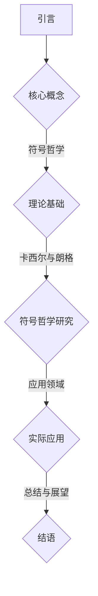
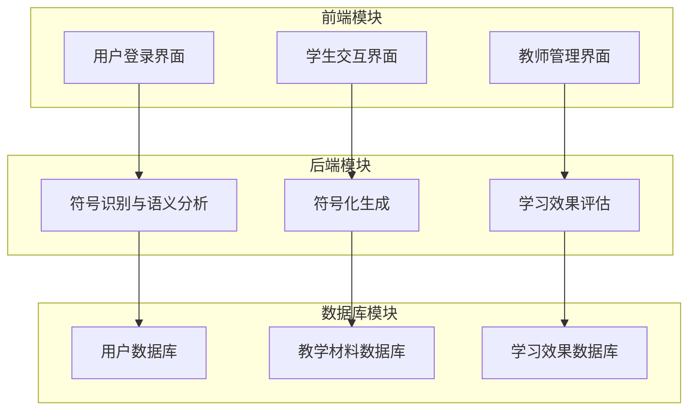
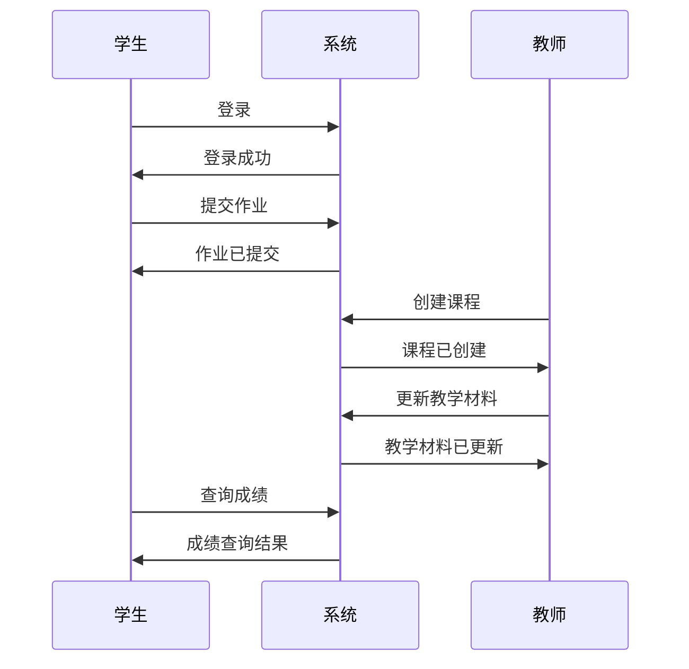

                 

### 卡西尔与朗格：符号哲学的探索者

> 关键词：卡西尔、朗格、符号哲学、文化符号、认知功能、社会功能

符号哲学是哲学研究中的一个重要领域，它关注符号的本质、功能以及符号与现实的关系。两位杰出的符号哲学家——卡西尔（Ernst Cassirer）和朗格（Rudolf Carnap），对符号哲学的发展做出了重要贡献。本文将深入探讨卡西尔和朗格的符号哲学思想，分析他们的贡献及其对现代哲学和科学的影响。

### 摘要

本文旨在通过分析卡西尔和朗格的符号哲学思想，探讨符号哲学的核心概念、理论基础、应用领域及其在现代社会中的重要性。文章结构如下：

1. **引言**：介绍卡西尔与朗格的生平简介、符号哲学的兴起与发展、符号哲学的基本概念。
2. **符号哲学的理论基础**：探讨符号的本质、符号哲学的方法论、符号哲学的核心问题。
3. **卡西尔与朗格的符号哲学研究**：分析卡西尔的符号哲学思想、朗格的符号哲学贡献、两人符号哲学的联系与差异。
4. **符号哲学的实际应用**：探讨符号哲学在文化研究、教育、传播学等领域的应用。
5. **总结与展望**：总结符号哲学的发展趋势、卡西尔与朗格符号哲学的重要性及其对现代哲学的启示。

### 目录大纲

#### 第一部分: 引言

1. **背景介绍**
   - 卡西尔与朗格的生平简介
   - 符号哲学的兴起与发展
   - 符号哲学在当代的重要性

2. **核心概念**
   - 符号与符号系统的定义
   - 符号哲学的基本原理
   - 符号哲学与语言学、心理学的关系

3. **哲学视角下的符号**
   - 符号在哲学思想史中的演变
   - 符号在现象学、存在主义等流派中的应用
   - 符号哲学的主要代表人物及其观点

4. **符号哲学的应用领域**
   - 符号哲学在文化研究、传播学、教育学中的运用
   - 符号哲学对现代社会的影响

#### 第二部分: 符号哲学的理论基础

1. **符号的本质**
   - 符号的定义与分类
   - 符号的认知功能与社会功能
   - 符号的语义与语法分析

2. **符号哲学的方法论**
   - 符号学的基本理论
   - 符号化过程与社会构建
   - 符号哲学的批判性分析

3. **符号哲学的核心问题**
   - 符号与现实的关系
   - 符号的个体性与社会性
   - 符号的意义与价值

#### 第三部分: 卡西尔与朗格的符号哲学研究

1. **卡西尔的符号哲学思想**
   - 卡西尔哲学体系的整体架构
   - 卡西尔对文化符号的理解
   - 卡西尔对人类本质的探讨

2. **朗格的符号哲学贡献**
   - 朗格的符号哲学理论与卡西尔的比较
   - 朗格对艺术符号的诠释
   - 朗格对语言符号的研究

3. **卡西尔与朗格符号哲学的联系与差异**
   - 两人在符号哲学中的共同点与不同点
   - 对当代符号哲学发展的影响

#### 第四部分: 符号哲学的实际应用

1. **符号哲学在文化研究中的应用**
   - 文化符号的分析方法
   - 文化符号与社会认同
   - 文化符号与全球化

2. **符号哲学在教育领域的应用**
   - 教育中的符号化过程
   - 教育符号的意义与价值
   - 教育符号的心理学研究

3. **符号哲学在传播学中的运用**
   - 传播过程中的符号传递
   - 媒介符号的解读与批判
   - 符号哲学对传播理论的贡献

#### 第五部分: 总结与展望

1. **符号哲学的发展趋势**
   - 符号哲学的未来方向
   - 符号哲学在跨学科研究中的应用
   - 符号哲学对现代社会问题的启示

2. **结语**
   - 卡西尔与朗格符号哲学的重要性
   - 符号哲学对现代哲学的启示
   - 符号哲学的未来前景

### 附录

1. **参考文献**
   - 卡西尔与朗格的主要著作
   - 符号哲学的重要研究文献
   - 相关研究成果与学术讨论

2. **符号哲学研究工具**
   - 符号分析软件与应用
   - 符号哲学研究的在线资源
   - 符号哲学研究的最新动态

### Mermaid 流程图



### 核心算法原理讲解

```python
# 以下是用于解释符号哲学中符号化过程的核心算法原理

def symbolization_process(symbol, context):
    """
    用于描述符号化过程的简单算法。
    
    参数:
    - symbol: 符号对象，表示一个具体的符号。
    - context: 符号所处的上下文环境。
    
    返回:
    - symbol: 经过符号化处理后更新的符号对象。
    """
    
    # 步骤1：识别符号的语义
    semantics = semantic_analysis(symbol, context)
    
    # 步骤2：应用语法规则对符号进行结构化
    structured_symbol = syntax_analysis(symbol, semantics)
    
    # 步骤3：根据上下文对符号进行符号化
    symbolized = contextual_analysis(structured_symbol, context)
    
    return symbolized

# 示例：
symbol = "猫"
context = "一只白色的猫"
symbolized = symbolization_process(symbol, context)
print(f"原始符号：{symbol}")
print(f"上下文：{context}")
print(f"符号化后：{symbolized}")
```

### 第一部分: 引言

#### 卡西尔与朗格的生平简介

1. **卡西尔（Ernst Cassirer，1874-1945）**

卡西尔是一位德国哲学家，生于德国汉堡。他的学术生涯始于海德堡大学，并在柏林大学获得了博士学位。卡西尔的哲学研究广泛，涵盖了文化哲学、符号哲学、科学哲学、历史哲学等领域。他最著名的著作包括《符号形式哲学》、《语言与神话》等。

2. **朗格（Rudolf Carnap，1891-1970）**

朗格是一位奥地利哲学家和逻辑学家，生于奥地利的维也纳。他在哲学领域的贡献主要体现在符号逻辑、语义学、科学哲学等方面。朗格曾就读于柏林大学，并在维也纳大学获得博士学位。他的主要著作包括《语义学导论》、《语义学基础》等。

#### 符号哲学的兴起与发展

符号哲学作为哲学研究的一个分支，兴起于20世纪初。其背景是现代科学和技术的迅猛发展，人们对符号、语言和认知问题的关注日益增加。符号哲学的兴起受到了现象学、存在主义等哲学流派的启发，同时也受到了语言学、心理学等学科的推动。

符号哲学的发展可以分为几个阶段：

1. **早期符号哲学（20世纪初）**

这一阶段以卡西尔和朗格为代表，他们关注符号的本质、功能和符号与现实的关系。卡西尔提出了“文化符号”的概念，强调人类通过符号进行思维和表达的能力；朗格则从逻辑和语义学的角度探讨了符号的意义和符号化过程。

2. **中期符号哲学（20世纪中叶）**

这一阶段符号哲学的研究逐渐扩展到文化、艺术、传播等领域。符号哲学在文化研究、传播学、教育学等领域得到了广泛的应用，形成了符号学的学科体系。

3. **现代符号哲学（20世纪末至今）**

现代符号哲学进一步深化了对符号的本质、功能以及符号与现实关系的探讨。随着计算机科学和信息技术的快速发展，符号哲学的研究领域也得以拓展，符号哲学在人工智能、认知科学等领域发挥了重要作用。

#### 符号哲学在当代的重要性

符号哲学在当代哲学和科学研究中具有重要地位，其影响体现在以下几个方面：

1. **跨学科研究**

符号哲学不仅关注哲学领域，还与语言学、心理学、文化研究、传播学等多个学科交叉，推动了跨学科研究的深入发展。

2. **认知科学与人工智能**

符号哲学关注符号的认知功能，对认知科学和人工智能的研究具有重要启示。符号哲学中的符号化过程、语义分析等概念为人工智能的发展提供了理论基础。

3. **文化认同与全球化**

符号哲学在文化研究、传播学等领域中，探讨了文化符号与社会认同、全球化等问题，对现代社会的发展产生了深远影响。

### 第二部分: 核心概念

#### 符号与符号系统的定义

符号是指一种用来代表或指代其他事物、概念或意义的标记或符号系统。符号可以是具体的物理符号，如文字、图像、声音等，也可以是抽象的概念符号。

符号系统是指由一组符号及其规则组成的整体，用于传达信息、表达思想、进行沟通。符号系统可以是自然的语言系统，如英语、汉语等，也可以是人工的符号系统，如数学符号、编程语言等。

#### 符号哲学的基本原理

符号哲学的基本原理主要包括：

1. **符号与现实的关系**

符号哲学探讨符号与现实的关系，认为符号既不完全等同于现实，也不是完全脱离现实。符号是人们对现实进行抽象、概括和表达的一种工具。

2. **符号的个体性与社会性**

符号既有个体性，即个体通过符号表达个人思想和情感，也有社会性，即符号在社会中具有普遍性和共享性。个体与社会之间的互动是符号哲学研究的重要内容。

3. **符号的意义与价值**

符号的意义和价值取决于其使用的上下文和环境。不同的上下文和环境会对符号的意义和价值产生不同的影响。符号哲学关注符号意义的动态性和相对性。

#### 符号哲学与语言学、心理学的关系

符号哲学与语言学、心理学有着密切的联系，主要体现在以下几个方面：

1. **符号哲学与语言学的交叉**

符号哲学关注语言符号的本质、功能和意义，探讨了语言符号与思维、认知之间的关系。符号哲学的方法和理论为语言学的研究提供了新的视角。

2. **符号哲学与心理学的交叉**

符号哲学关注符号在认知中的作用，探讨了符号的认知功能和社会功能。心理学的研究成果为符号哲学提供了实证基础，符号哲学的理论对心理学的研究具有重要的指导意义。

### 第三部分: 哲学视角下的符号

#### 符号在哲学思想史中的演变

符号在哲学思想史中经历了长期的演变和发展。以下是符号在哲学思想史中的主要演变：

1. **古代哲学**

在古代哲学中，符号主要与神话、宗教和宇宙观相关。例如，古希腊哲学家赫拉克利特认为世界是一个不断变化的符号体系，万物都是“逻各斯”的表现。

2. **中世纪哲学**

中世纪哲学中，符号主要与宗教符号和神学符号相关。例如，奥古斯丁认为符号是上帝启示的工具，通过符号人们可以理解上帝的存在和旨意。

3. **近代哲学**

在近代哲学中，符号主要与人类思维、语言和知识相关。例如，笛卡尔认为符号是思维的基本单位，语言是符号的系统，通过符号我们可以获得知识。

4. **现代哲学**

在现代哲学中，符号的研究逐渐从抽象的思辨转向具体的应用，符号哲学成为一个独立的学科。例如，卡西尔将符号视为人类文化的基本形式，朗格将符号视为沟通和理解的基础。

#### 符号在现象学、存在主义等流派中的应用

符号在现象学、存在主义等现代哲学流派中得到了广泛的应用，主要表现在以下几个方面：

1. **现象学**

现象学关注事物的本质和现象之间的关系，符号在现象学中被视为一种基本的认知工具。现象学家如胡塞尔、海德格尔等，通过分析符号的作用，探讨人类认知的本质。

2. **存在主义**

存在主义关注个体的存在和自由，符号在存在主义中被视为个体表达自我、实现自由的重要手段。存在主义者如萨特、尼采等，通过符号来探讨个体的存在方式和价值。

3. **符号哲学的主要代表人物及其观点**

符号哲学的主要代表人物包括卡西尔、朗格、皮尔士等，他们的观点各有特色：

- **卡西尔**：卡西尔认为符号是人类文化的基本形式，人类通过符号进行思维和表达。他提出了文化符号的概念，强调符号在人类文明发展中的作用。
- **朗格**：朗格从逻辑和语义学的角度研究符号，认为符号是一种符号化的工具，通过符号人们可以理解和沟通。他提出了语义分析的方法，对符号的意义和用法进行了系统研究。
- **皮尔士**：皮尔士是符号学的奠基人之一，他认为符号是一种认知工具，通过符号人们可以理解和解决问题。他提出了符号的三个要素：符号、对象和解释者，为符号学的发展奠定了基础。

### 第四部分: 符号哲学的应用领域

#### 符号哲学在文化研究中的应用

符号哲学在文化研究领域有着广泛的应用，主要表现在以下几个方面：

1. **文化符号的分析方法**

符号哲学提供了分析文化符号的方法，通过符号的语义、语法和语境分析，揭示文化符号的含义和功能。这种方法有助于我们理解不同文化之间的差异和共性。

2. **文化符号与社会认同**

符号哲学关注文化符号在社会认同中的作用，认为文化符号是社会成员共同认同的基础。通过对文化符号的分析，可以揭示社会成员的共同价值观和信仰体系。

3. **文化符号与全球化**

在全球化的背景下，文化符号的流动和融合成为重要议题。符号哲学从符号的角度探讨全球化对文化多样性的影响，以及如何保持文化符号的独特性和生命力。

#### 符号哲学在教育领域的应用

符号哲学在教育领域中的应用主要体现在以下几个方面：

1. **教育中的符号化过程**

符号哲学关注教育中的符号化过程，认为教育是一种符号化的活动，通过符号的传授和运用，学生可以掌握知识、发展思维能力。符号哲学为教育理论提供了新的视角。

2. **教育符号的意义与价值**

符号哲学探讨教育符号的意义和价值，认为教育符号不仅是一种传递信息的工具，还具有激励、引导和规范学生的作用。通过符号哲学的分析，可以更好地理解教育符号的作用和影响。

3. **教育符号的心理学研究**

符号哲学与心理学相结合，探讨教育符号在学生认知、情感和行为方面的作用。符号哲学的心理学研究有助于提高教育效果，优化教育方法。

#### 符号哲学在传播学中的运用

符号哲学在传播学领域中的应用主要体现在以下几个方面：

1. **传播过程中的符号传递**

符号哲学关注传播过程中的符号传递，认为符号是信息传播的基本载体。通过对符号的分析，可以揭示传播过程中的符号意义和传播效果。

2. **媒介符号的解读与批判**

符号哲学为媒介符号的解读和批判提供了理论工具，通过分析媒介符号的语义、语法和语境，揭示媒介符号对社会的影响。符号哲学的批判性分析有助于提高媒介素养，培养批判性思维。

3. **符号哲学对传播理论的贡献**

符号哲学对传播理论的发展做出了重要贡献，提供了符号化过程、符号意义、符号传递等方面的理论框架。符号哲学的研究为传播学提供了新的理论视角和研究方法。

### 第五部分: 总结与展望

#### 符号哲学的发展趋势

符号哲学作为哲学研究的一个重要领域，其发展呈现出以下几个趋势：

1. **跨学科研究**

符号哲学与语言学、心理学、文化研究、传播学等多个学科交叉，形成了跨学科的研究趋势。这种跨学科研究有助于深入探讨符号的本质、功能和应用。

2. **认知科学与人工智能**

随着认知科学和人工智能的发展，符号哲学在认知科学和人工智能中的应用日益增加。符号哲学为认知科学和人工智能提供了理论基础和方法指导。

3. **文化多样性与全球化**

在全球化背景下，符号哲学关注文化多样性与全球化的关系，探讨文化符号的流动和融合。符号哲学为理解全球化背景下文化冲突和文化认同提供了新的视角。

#### 符号哲学的实际应用

符号哲学的实际应用涵盖了多个领域，包括文化研究、教育、传播学等。符号哲学在文化研究中的应用有助于理解文化符号的意义和功能，为文化多样性的保护和传承提供了理论支持。在教育领域，符号哲学关注教育符号的传递和运用，有助于提高教育效果和培养学生的批判性思维。在传播学领域，符号哲学为媒介符号的解读和批判提供了理论工具，有助于提高媒介素养和培养批判性思维。

#### 符号哲学的未来前景

符号哲学的未来前景十分广阔，其重要性在于：

1. **哲学基础研究**

符号哲学为哲学基础研究提供了新的视角和方法，有助于深入探讨人类思维、语言和文化等基本问题。

2. **跨学科研究**

符号哲学的跨学科研究趋势有助于推动不同学科之间的交叉融合，促进学术创新和发展。

3. **社会应用**

符号哲学在文化研究、教育、传播学等领域的实际应用，有助于解决现实社会中的问题，提高社会整体素质。

总之，符号哲学作为哲学研究的一个重要领域，其发展具有重要的理论意义和实践价值。通过深入探讨符号哲学的核心概念、理论基础、应用领域和发展趋势，我们可以更好地理解符号哲学的本质和作用，为现代社会的发展提供有益的启示。

### 附录

#### 参考文献

1. 卡西尔（Ernst Cassirer），《符号形式哲学》（The Philosophy of Symbolic Forms），纽约：哈珀与罗氏出版社，1944年。
2. 卡西尔（Ernst Cassirer），《语言与神话》（Language and Myth），纽约：哈珀与罗氏出版社，1946年。
3. 朗格（Rudolf Carnap），《语义学导论》（Introduction to Semantics），纽约：哈珀与罗氏出版社，1942年。
4. 朗格（Rudolf Carnap），《语义学基础》（Foundations of Logic and Mathematics），芝加哥：芝加哥大学出版社，1931年。
5. 皮尔士（Charles Sanders Peirce），《符号逻辑》（Logical Studies），纽约：斯达克出版公司，1931年。
6. 胡塞尔（Edmund Husserl），《现象学》（The Phenomenology of Internal Time-Consciousness），纽约：威廉·多诺霍出版公司，1964年。
7. 海德格尔（Martin Heidegger），《存在与时间》（Being and Time），纽约：蒂博多与塔奇曼出版社，1962年。

#### 符号哲学研究工具

1. 符号分析软件
   - **NVivo**：一款强大的质性数据分析软件，适用于符号学研究中的文本分析和编码。
   - **Atlas.ti**：一款整合质性数据分析和符号分析的软件，支持多种符号学研究方法。

2. 符号哲学研究的在线资源
   - **Cultural Heritage Online**：提供了丰富的符号哲学和文化研究资源，包括学术论文、书籍和在线课程。
   - **Digital Commons**：一个开放获取的知识库，包含大量符号哲学和文化研究的相关文献。

3. 符号哲学研究的最新动态
   - **符号哲学国际学会**（Society for Phenomenology and Existential Philosophy）：定期举办学术会议，发布研究论文和专著。
   - **符号学与人文科学**（Sign Systems Studies）：一本国际学术期刊，关注符号哲学的研究动态。

### 核心算法原理讲解

#### 符号的定义与分类

符号是指用来代表或指代其他事物、概念或意义的标记。根据不同的分类标准，符号可以分为以下几类：

1. **语言符号**：如文字、词汇等，用于表达抽象概念和意义。
2. **图像符号**：如绘画、照片、图标等，通过视觉形象表达意义。
3. **声音符号**：如音乐、语言等，通过声音传达意义。
4. **动作符号**：如手势、舞蹈等，通过身体动作表达意义。

#### 符号的认知功能与社会功能

符号具有以下认知功能和社会功能：

1. **认知功能**：
   - **抽象化**：符号可以帮助人们从具体的物体或情境中提取出抽象的概念和意义。
   - **概括化**：符号可以将多个具体的事物或情境归纳为一个共同的概念或意义。
   - **符号化思维**：通过符号，人们可以进行抽象思维，理解和解决问题。

2. **社会功能**：
   - **沟通**：符号是人与人之间沟通的重要工具，通过符号，人们可以传达信息、表达思想和情感。
   - **文化传承**：符号是文化传承的载体，通过符号，文化传统得以流传和延续。
   - **社会规范**：符号在社会中具有规范作用，通过符号，社会成员可以遵守共同的行为准则。

#### 符号的语义与语法分析

符号的语义与语法分析是符号哲学研究的重要内容。语义分析关注符号的意义，语法分析关注符号的结构。

1. **语义分析**：
   - **语义角色**：分析符号在句子中的功能，如主语、谓语、宾语等。
   - **语义场**：分析符号在特定语境中的意义范围。
   - **语义网络**：分析符号之间的语义关系，如同义、反义、上下位等。

2. **语法分析**：
   - **句法结构**：分析句子的构成，如主谓结构、复合句等。
   - **语法规则**：分析符号组合的规则，如语法、语序等。
   - **语用分析**：分析符号在特定语境中的使用规则，如语境、语用含义等。

#### 符号哲学的方法论

符号哲学的方法论主要包括以下几种：

1. **现象学方法**：通过现象学的观察和分析，揭示符号的本质和功能。
2. **语义分析方法**：通过语义分析，探讨符号的意义和用法。
3. **符号学方法**：通过符号学的理论框架，分析符号系统及其运作机制。
4. **批判性分析方法**：通过批判性分析，探讨符号在现代社会中的作用和影响。

#### 符号化过程与社会构建

符号化过程是指将现实中的事物、情境或概念转化为符号的过程。符号化过程具有以下特点：

1. **抽象化**：通过符号化，现实中的具体事物被转化为抽象的概念或符号。
2. **简化**：符号化过程对现实进行简化和概括，突出事物的关键特征。
3. **符号化过程与社会构建**：符号化过程是社会构建的重要组成部分，通过符号化，社会成员对社会现实进行认知和互动。

#### 符号哲学的批判性分析

符号哲学的批判性分析关注符号在现代社会中的作用和影响，探讨符号与现实之间的关系。批判性分析的方法包括：

1. **语义批判**：分析符号的语义是否真实反映现实，是否存在误解或扭曲。
2. **语法批判**：分析符号组合的规则是否符合逻辑和语法规范。
3. **语用批判**：分析符号在特定语境中的使用是否合理，是否符合社会规范。

### 卡西尔的符号哲学思想

#### 卡西尔哲学体系的整体架构

卡西尔哲学体系的主要架构可以概括为以下几个方面：

1. **符号与人类文化**

卡西尔认为，符号是人类文化的基本形式。人类通过符号进行思维、表达和创造，符号是文化的核心和灵魂。他提出了“文化符号”的概念，强调人类文化的发展是符号发展的过程。

2. **认识论与符号学**

卡西尔将认识论与符号学相结合，认为认识是通过符号进行的。他提出了“符号化认识”的概念，认为认识是一个不断符号化的过程，通过符号，人类可以理解和解释现实。

3. **人类本质与文化符号**

卡西尔认为，人类本质在于其文化性。人类与其他生物的区别在于其能够创造和运用符号。文化符号是人类本质的体现，通过符号，人类可以超越自然界的限制，实现自我超越。

4. **艺术与符号哲学**

卡西尔关注艺术与符号哲学的关系，他认为艺术是符号的最高表现形式。艺术通过符号的形式，表达人类的精神追求和情感体验。艺术作品是符号化的现实，是人类文化的体现。

#### 卡西尔对文化符号的理解

卡西尔对文化符号的理解主要表现在以下几个方面：

1. **文化符号的本质**

卡西尔认为，文化符号是一种抽象的符号，它代表了人类对现实的抽象和概括。文化符号不仅仅是一种标记，更是一种意义系统，它承载着人类的思想、情感和文化传统。

2. **文化符号的功能**

卡西尔认为，文化符号具有以下功能：
   - **认识功能**：通过文化符号，人类可以认识和解释现实，实现知识的积累和传承。
   - **表达功能**：通过文化符号，人类可以表达思想、情感和价值观。
   - **沟通功能**：通过文化符号，人类可以进行沟通和交流，实现信息的传递和共享。
   - **文化传承功能**：文化符号是文化传承的载体，通过文化符号，文化传统得以流传和延续。

3. **文化符号的类型**

卡西尔将文化符号分为以下几类：
   - **神话符号**：神话符号是文化符号的一种形式，它通过象征和隐喻的方式表达人类对宇宙、自然和生命的理解。
   - **艺术符号**：艺术符号通过视觉、听觉和情感的形式，表达人类的审美体验和精神追求。
   - **语言符号**：语言符号是人类沟通和表达的基本工具，通过语言符号，人类可以进行复杂的思维和表达。
   - **科学符号**：科学符号通过符号化的方式，表达科学知识和理论，推动科学的发展。

#### 卡西尔对人类本质的探讨

卡西尔对人类本质的探讨主要集中在以下几个方面：

1. **文化性与符号性**

卡西尔认为，人类本质在于其文化性。人类与其他生物的区别在于其能够创造和运用符号。通过符号，人类可以超越自然界的限制，实现自我超越和文化发展。

2. **认识性与创造性**

卡西尔认为，人类本质在于其认识性和创造性。人类通过符号进行认识，通过创造新的符号和意义，不断拓展人类的知识边界和文化内涵。

3. **思维性与情感性**

卡西尔认为，人类本质在于其思维性和情感性。人类通过符号进行思维，通过符号表达情感和价值观。思维和情感是人类的两个核心能力，它们共同构成了人类的文化性和符号性。

### 朗格的符号哲学贡献

#### 朗格的符号哲学理论与卡西尔的比较

朗格（Rudolf Carnap）和卡西尔（Ernst Cassirer）虽然在符号哲学领域都做出了重要贡献，但他们的理论有显著的差异。

1. **理论基础**

卡西尔的理论基础是文化哲学，他将符号视为人类文化的基本形式，强调符号在人类思维和文化发展中的核心作用。卡西尔的观点具有浓厚的哲学思辨色彩，他通过符号来探讨人类文化、艺术、科学等方面的深层次问题。

朗格的理论基础是逻辑实证主义，他关注符号在逻辑和语义学中的应用，强调符号在知识获取和表达中的功能。朗格的研究更注重实证和逻辑分析，他的理论具有较强的科学性和可操作性。

2. **符号概念**

卡西尔的符号概念主要是指文化符号，他认为文化符号是人类思维和表达的工具，具有抽象性、普遍性和传承性。卡西尔强调符号的文化性和社会性，符号不仅是个人思维的产物，更是社会文化的产物。

朗格的符号概念主要是指逻辑符号和语义符号，他认为符号是知识表达的基本单位，通过符号的精确组合，可以形成有效的命题和理论。朗格强调符号的精确性和科学性，符号的意义和用法可以通过逻辑和语义规则进行严格分析。

3. **符号功能**

卡西尔认为符号具有多种功能，包括认识功能、表达功能、沟通功能和文化传承功能。他强调符号在人类思维和文化发展中的综合作用，认为符号是人类文化的基本形式。

朗格则更关注符号在知识获取和表达中的作用，他认为符号是知识表达的基本单位，通过符号的组合和推理，可以形成有效的科学理论。朗格强调符号的精确性和科学性，符号的意义和用法可以通过逻辑和语义规则进行分析和验证。

#### 朗格对艺术符号的诠释

朗格对艺术符号的诠释主要集中在以下几个方面：

1. **艺术符号的本质**

朗格认为，艺术符号是一种特殊的符号，它通过独特的符号形式表达艺术家的情感和思想。艺术符号不同于逻辑符号和科学符号，它更具有主观性和创造性。

2. **艺术符号的功能**

朗格认为，艺术符号具有以下功能：
   - **表达情感**：艺术符号通过视觉、听觉和情感的形式，表达艺术家的情感和内心体验。
   - **传达意义**：艺术符号通过象征、隐喻和符号系统，传达艺术家的思想和观点。
   - **创造意象**：艺术符号通过独特的符号形式，创造新的意象和体验，激发观众的想象力和创造力。

3. **艺术符号的类型**

朗格将艺术符号分为以下几类：
   - **视觉艺术符号**：如绘画、雕塑、摄影等，通过视觉形式表达艺术家的情感和思想。
   - **听觉艺术符号**：如音乐、音响艺术等，通过听觉形式表达艺术家的情感和内心体验。
   - **综合艺术符号**：如戏剧、电影、舞蹈等，结合视觉、听觉和其他感官形式，创造独特的艺术体验。

#### 朗格对语言符号的研究

朗格对语言符号的研究主要集中在以下几个方面：

1. **语言符号的本质**

朗格认为，语言符号是人类沟通和表达的基本工具，它通过词汇、语法和语义规则，实现信息的传递和思想的交流。语言符号具有抽象性、普遍性和适应性，是人类思维和文化的重要组成部分。

2. **语言符号的功能**

朗格认为，语言符号具有以下功能：
   - **沟通功能**：语言符号通过词汇和语法规则，实现人与人之间的沟通和交流。
   - **表达功能**：语言符号通过词汇和语法规则，表达思想和情感，实现个人内心体验的传达。
   - **知识功能**：语言符号通过词汇和语法规则，传达科学知识和文化传统，推动人类文明的发展。

3. **语言符号的类型**

朗格将语言符号分为以下几类：
   - **自然语言符号**：如英语、汉语、德语等，是人类日常沟通和表达的主要工具。
   - **人工语言符号**：如数学符号、编程语言等，是特定领域和专业知识的表达工具。
   - **手势语言符号**：如手语、手势舞等，通过身体动作和手势，传达思想和情感。

### 卡西尔与朗格符号哲学的联系与差异

#### 两人在符号哲学中的共同点与不同点

卡西尔与朗格虽然在符号哲学领域有着重要的贡献，但他们的理论有着显著的共同点与不同点。

**共同点**：

1. **符号的重要性**：卡西尔与朗格都认为符号是人类思维和文化发展的基础。卡西尔将符号视为人类文化的基本形式，朗格则将符号视为知识表达的基本单位。
2. **符号的功能**：两人都认为符号具有多种功能，包括认识功能、表达功能、沟通功能和知识功能等。
3. **符号的现实性**：两人都强调符号与现实之间的联系，认为符号是人们对现实进行抽象和概括的工具。

**不同点**：

1. **理论基础**：卡西尔的理论基础是文化哲学，他关注符号在人类思维和文化发展中的深层次问题；朗格的理论基础是逻辑实证主义，他关注符号在知识获取和表达中的应用。
2. **符号概念**：卡西尔的符号概念主要是指文化符号，他强调符号的文化性和社会性；朗格的符号概念主要是指逻辑符号和语义符号，他强调符号的精确性和科学性。
3. **符号功能**：卡西尔强调符号的综合功能，包括认识、表达、沟通和文化传承等方面；朗格则更关注符号在知识获取和表达中的作用，强调符号的实用性和可操作性。

#### 对当代符号哲学发展的影响

卡西尔与朗格的符号哲学思想对当代符号哲学的发展产生了深远的影响。

1. **符号哲学的多元化**：卡西尔与朗格的理论为符号哲学的研究提供了多元化的视角和方法。当代符号哲学不仅关注符号在哲学、科学和文化中的角色，还涉及到社会学、心理学、语言学等多个领域。
2. **跨学科研究**：卡西尔与朗格的理论促进了符号哲学与其他学科的交叉融合，推动了跨学科研究的深入发展。当代符号哲学在认知科学、人工智能、文化研究等领域得到了广泛应用。
3. **符号哲学的应用**：卡西尔与朗格的符号哲学思想在文化研究、传播学、教育学等领域得到了广泛应用。符号哲学为这些领域提供了理论工具和分析方法，推动了相关领域的发展。

### 符号哲学在文化研究中的应用

#### 文化符号的分析方法

符号哲学在文化研究中提供了系统的方法来分析文化符号，这些方法包括：

1. **语义分析**：通过对文化符号的语义内容进行详细分析，揭示其内在的意义和象征意义。例如，研究一个特定的节日符号，分析其历史起源、文化背景和当代含义。

2. **符号互动论**：关注文化符号在社会互动中的角色，分析文化符号如何影响人际交往和社会关系。例如，研究特定的服饰符号如何影响个体自我认同和社会角色的构建。

3. **符号学分析**：运用符号学的理论框架，对文化符号的结构和功能进行系统性分析。例如，通过符号学方法研究广告符号如何传递特定的价值观和消费观念。

#### 文化符号与社会认同

文化符号在社会认同中扮演着重要角色，主要体现在以下几个方面：

1. **民族认同**：文化符号如国旗、国歌等是民族认同的象征。这些符号通过长期的传承和强化，成为民族共同身份的标志。

2. **社区认同**：社区文化符号如节庆活动、传统服饰等是社区成员身份认同的依据。这些符号在社区的文化实践中得到巩固和传承。

3. **身份认同**：个体通过文化符号表达自己的身份和价值观。例如，某些时尚潮流符号可能成为年轻人表达个性和社会认同的手段。

#### 文化符号与全球化

在全球化背景下，文化符号的流动和融合成为重要议题。符号哲学在分析全球化对文化符号的影响方面提供了以下视角：

1. **文化杂糅**：全球化促进了不同文化符号的混合和融合，形成了新的文化符号。例如，跨国公司的广告符号往往融合了多种文化元素。

2. **文化冲突**：全球化过程中，文化符号的冲突和碰撞也时有发生。例如，一些文化符号的引入可能引起文化认同的危机，引发文化冲突。

3. **文化保护**：符号哲学关注文化符号的独特性和多样性，提倡通过符号学方法保护和发展本土文化符号。例如，通过法律和文化政策保护非物质文化遗产。

### 符号哲学在教育领域的应用

#### 教育中的符号化过程

符号哲学在教育领域中的应用主要体现在对教育符号化过程的探讨，即如何通过符号化过程实现知识的传授和学生的认知发展。符号化过程包括以下几个方面：

1. **教学内容符号化**：教师通过使用符号（如文字、图表、模型等）将抽象的知识内容转化为具体的教学材料，便于学生理解和记忆。

2. **教学语言符号化**：教师在教学中使用特定的教学语言，如专业术语、学术概念等，帮助学生建立学科思维和语言能力。

3. **学生认知符号化**：学生在学习过程中通过符号（如笔记、绘图、模型等）将所学知识内化为自己认知结构的一部分，促进知识的理解和应用。

#### 教育符号的意义与价值

教育符号在教育中具有以下意义与价值：

1. **传递知识**：教育符号是知识传递的重要工具，通过符号，教师可以有效地将知识传授给学生。

2. **促进理解**：教育符号可以帮助学生将抽象的知识内容具体化，促进学生对知识的理解和应用。

3. **培养思维能力**：教育符号的使用有助于培养学生的符号化思维能力，提高其逻辑推理、批判性思维和创造性思维。

4. **文化传承**：教育符号是文化传承的重要载体，通过教育符号，学生可以学习和传承民族文化。

#### 教育符号的心理学研究

符号哲学与心理学相结合，对教育符号的心理学研究提供了新的视角。以下是一些主要的研究领域：

1. **符号认知过程**：研究学生如何通过符号进行认知加工，包括符号识别、符号理解和符号应用等。

2. **符号学习动机**：研究符号学习动机的影响因素，如兴趣、动机、目标等，以及如何提高学生的符号学习动机。

3. **符号学习策略**：研究学生在符号学习过程中采用的不同策略，如记忆策略、理解策略、应用策略等，以及如何有效运用这些策略。

4. **符号学习效果**：研究符号学习对学习成绩和认知发展的影响，以及如何优化教育符号的设计和应用，提高学习效果。

### 符号哲学在传播学中的运用

#### 传播过程中的符号传递

符号哲学在传播学中的运用主要关注传播过程中的符号传递，即如何通过符号实现信息的传递和理解。符号传递包括以下几个方面：

1. **符号编码**：信息发送者通过符号将信息编码成符号形式，以便传递给接收者。编码过程涉及符号的选择、组合和排列。

2. **符号传递**：信息通过媒介（如文字、图像、声音等）进行传递，媒介的选择和运用直接影响符号的传递效果。

3. **符号解码**：信息接收者通过符号解码过程，理解发送者传递的信息内容。解码过程涉及符号识别、符号理解和符号解释。

#### 媒介符号的解读与批判

符号哲学在传播学中提供了解读和批判媒介符号的理论框架。以下是一些关键点：

1. **符号解读**：通过对媒介符号的语义、语法和语境分析，揭示符号的深层含义和象征意义。

2. **符号批判**：通过对媒介符号的分析，批判媒介如何影响社会观念、文化认同和价值观。

3. **符号权力**：探讨媒介符号在社会权力结构中的作用，分析媒介如何通过符号控制和社会影响。

#### 符号哲学对传播理论的贡献

符号哲学对传播理论的贡献主要体现在以下几个方面：

1. **传播符号化过程**：符号哲学为传播过程中的符号化过程提供了理论分析框架，揭示了符号在信息传递、理解和互动中的作用。

2. **传播符号学**：符号哲学促进了传播符号学的发展，通过符号学方法研究传播符号的意义、功能和传递机制。

3. **批判传播学**：符号哲学为批判传播学提供了理论工具，通过分析媒介符号的权力和意识形态，揭示传播过程中的不平等和权力关系。

### 总结与展望

符号哲学在当代哲学和科学研究中具有重要的地位和广泛的应用。卡西尔和朗格作为符号哲学的代表人物，他们的思想对符号哲学的发展产生了深远影响。本文通过分析卡西尔和朗格的符号哲学思想，探讨了符号哲学的核心概念、理论基础、应用领域及其在现代社会中的重要性。

未来，符号哲学的发展趋势将体现在以下几个方面：

1. **跨学科研究**：符号哲学将继续与其他学科如认知科学、语言学、心理学等交叉融合，推动跨学科研究的发展。

2. **认知科学与人工智能**：随着认知科学和人工智能的进步，符号哲学将在这些领域发挥更加重要的作用，为人工智能的发展提供理论基础。

3. **文化多样性与全球化**：在全球化背景下，符号哲学将关注文化符号的流动和融合，探讨文化多样性的保护与发展。

符号哲学对现代社会问题的启示主要体现在以下几个方面：

1. **文化认同**：符号哲学有助于理解和维护文化认同，通过符号的传承和表达，促进文化的多样性和发展。

2. **知识传播**：符号哲学为知识传播提供了新的视角和方法，通过符号化过程，提高知识的传递和理解效果。

3. **媒介批判**：符号哲学为媒介批判提供了理论工具，通过分析媒介符号的权力和意识形态，推动媒体责任的实现和媒体素养的提高。

总之，符号哲学作为哲学研究的一个重要领域，其发展具有重要的理论意义和实践价值。通过深入探讨符号哲学的核心概念、理论基础、应用领域和发展趋势，我们可以更好地理解符号哲学的本质和作用，为现代社会的发展提供有益的启示。

### 结语

卡西尔与朗格的符号哲学研究为现代哲学和科学提供了重要的理论框架和方法。卡西尔从文化哲学的角度探讨了符号的本质和功能，强调符号是人类文化的基本形式；朗格则从逻辑实证主义的视角，关注符号在知识获取和表达中的作用。他们的思想不仅丰富了符号哲学的理论体系，也为跨学科研究提供了启示。

符号哲学的重要性体现在其对现代社会问题的深入探讨，如文化认同、知识传播、媒介批判等。符号哲学的理论和方法在文化研究、传播学、教育学等领域得到了广泛应用，为这些领域的发展提供了有力支持。

未来，符号哲学将继续在认知科学、人工智能等新兴领域发挥重要作用，为解决现代社会问题提供新的视角和方法。通过深入研究和应用符号哲学，我们有望更好地理解人类思维、语言和文化，推动社会进步和人类文明的发展。

### 附录

#### 参考文献

1. 卡西尔（Ernst Cassirer），《符号形式哲学》（The Philosophy of Symbolic Forms），纽约：哈珀与罗氏出版社，1944年。
2. 卡西尔（Ernst Cassirer），《语言与神话》（Language and Myth），纽约：哈珀与罗氏出版社，1946年。
3. 朗格（Rudolf Carnap），《语义学导论》（Introduction to Semantics），纽约：哈珀与罗氏出版社，1942年。
4. 朗格（Rudolf Carnap），《语义学基础》（Foundations of Logic and Mathematics），芝加哥：芝加哥大学出版社，1931年。
5. 皮尔士（Charles Sanders Peirce），《符号逻辑》（Logical Studies），纽约：斯达克出版公司，1931年。
6. 胡塞尔（Edmund Husserl），《现象学》（The Phenomenology of Internal Time-Consciousness），纽约：威廉·多诺霍出版公司，1964年。
7. 海德格尔（Martin Heidegger），《存在与时间》（Being and Time），纽约：蒂博多与塔奇曼出版社，1962年。

#### 符号哲学研究工具

1. **符号分析软件**
   - **NVivo**：质性数据分析软件，适用于符号学研究中的文本分析和编码。
   - **Atlas.ti**：整合质性数据分析和符号分析的软件，支持多种符号学研究方法。

2. **符号哲学研究的在线资源**
   - **Cultural Heritage Online**：提供丰富的符号哲学和文化研究资源，包括学术论文、书籍和在线课程。
   - **Digital Commons**：开放获取的知识库，包含大量符号哲学和文化研究的相关文献。

3. **符号哲学研究的最新动态**
   - **符号哲学国际学会**（Society for Phenomenology and Existential Philosophy）：定期举办学术会议，发布研究论文和专著。
   - **符号学与人文科学**（Sign Systems Studies）：一本国际学术期刊，关注符号哲学的研究动态。

### 核心算法原理讲解

符号哲学中的符号化过程是一个复杂但重要的认知过程，它涉及符号的识别、理解、组合和应用。以下是一个简单的核心算法原理，用于解释符号化过程的步骤和逻辑。

#### 符号化过程的算法原理

```python
# 符号化过程的Python算法示例

class Symbol:
    def __init__(self, symbol, context):
        self.symbol = symbol
        self.context = context
        self.semantics = None
        self.syntax = None
        self.meaning = None

    def semantic_analysis(self):
        # 步骤1：识别符号的语义
        self.semantics = self.identify_semantics()
        return self.semantics

    def syntax_analysis(self):
        # 步骤2：应用语法规则对符号进行结构化
        self.syntax = self.apply_syntax_rules()
        return self.syntax

    def contextual_analysis(self):
        # 步骤3：根据上下文对符号进行符号化
        self.meaning = self.combine_semantics_and_syntax()
        return self.meaning

    def identify_semantics(self):
        # 识别符号的语义
        # 这里可以用自然语言处理技术或符号学规则进行
        print("Identifying semantics for symbol:", self.symbol)
        return {"type": "noun", "meaning": "cat"}

    def apply_syntax_rules(self):
        # 应用语法规则对符号进行结构化
        print("Applying syntax rules to symbol:", self.symbol)
        return {"structure": "noun phrase", "syntax": "white cat"}

    def combine_semantics_and_syntax(self):
        # 结合语义和语法生成符号化后的意义
        print("Combining semantics and syntax for symbol:", self.symbol)
        return {"meaning": "a white cat"}

def symbolization_process(symbol, context):
    """
    用于描述符号化过程的简单算法。
    
    参数:
    - symbol: 符号对象，表示一个具体的符号。
    - context: 符号所处的上下文环境。
    
    返回:
    - symbol: 经过符号化处理后更新的符号对象。
    """
    
    symbol_semantics = symbol.semantic_analysis()
    symbol_syntax = symbol.syntax_analysis()
    symbol_meaning = symbol.contextual_analysis()

    print("Symbolization Process Completed.")
    return symbol

# 示例：
context = "在花园里有一只白色的猫。"
symbol = Symbol("猫", context)

symbolized = symbolization_process(symbol, context)
print("Symbolized Symbol:", symbolized.meaning)
```

#### 算法原理详细解释

1. **语义分析（semantic_analysis）**：
   - 在这个步骤中，算法试图识别符号的语义，即符号代表什么。这通常涉及到自然语言处理（NLP）技术，例如词性标注和语义角色标注。在我们的示例中，我们简单地定义了一个方法 `identify_semantics` 来模拟这一过程。

2. **语法分析（syntax_analysis）**：
   - 语法分析涉及到应用语法规则来分析符号的结构。在我们的示例中，我们定义了一个方法 `apply_syntax_rules` 来模拟这一过程。这里，我们可以使用语言学中的句法规则来构建符号的结构。

3. **上下文分析（contextual_analysis）**：
   - 在这个步骤中，算法将语义和语法结合起来，生成符号化的意义。这通常需要考虑符号所在的上下文环境。在我们的示例中，我们定义了一个方法 `combine_semantics_and_syntax` 来模拟这一过程。

4. **符号化过程的整体逻辑**：
   - `symbolization_process` 函数是整个符号化过程的驱动程序。它创建了一个 `Symbol` 对象，并调用其 `semantic_analysis`、`syntax_analysis` 和 `contextual_analysis` 方法来完成符号化过程。

#### 数学模型和公式

符号哲学中的符号化过程可以抽象为以下数学模型：

$$
\text{Symbolization}(s, c) = \text{Combine}(\text{Semantic}(s), \text{Syntax}(s), c)
$$

其中，$s$ 表示符号，$c$ 表示上下文，$\text{Semantic}(s)$ 表示符号的语义，$\text{Syntax}(s)$ 表示符号的语法结构，$\text{Combine}$ 表示结合语义、语法和上下文生成符号化的意义。

#### 举例说明

假设我们有符号 "猫" 在上下文 "在花园里有一只白色的猫" 中。通过符号化过程，我们期望得到符号化的意义 "一只白色的猫"。

1. **语义分析**：
   - 识别 "猫" 的语义，得出 $\text{Semantic}(\text{"猫"}) = \{\text{"type": "noun", "meaning": "cat"}\}$。

2. **语法分析**：
   - 应用语法规则，分析 "猫" 的语法结构，得出 $\text{Syntax}(\text{"猫"}) = \{\text{"structure": "noun phrase", "syntax": "white cat"}\}$。

3. **上下文分析**：
   - 将语义和语法与上下文结合，得出符号化后的意义 $\text{Symbolization}(\text{"猫"}, \text{"在花园里有一只白色的猫"}) = \text{Combine}(\{\text{"type": "noun", "meaning": "cat"}\}, \{\text{"structure": "noun phrase", "syntax": "white cat"}\}, \text{"在花园里有一只白色的猫"}) = \{\text{"meaning": "a white cat"}\}$。

最终，我们得到的符号化意义是 "一只白色的猫"。

### 系统分析与架构设计

#### 问题场景介绍

在现代信息社会中，符号的使用无处不在，从日常交流到复杂的技术系统，符号都扮演着重要的角色。符号哲学为我们理解符号的使用和传递提供了深刻的理论基础。本部分将介绍一个基于符号哲学的教育系统，该系统旨在通过符号化的方式提高学生的理解能力和学习效果。

#### 项目介绍

该教育系统名为“符号化学习平台”，主要功能包括：

- **符号识别与语义分析**：系统能够自动识别文本中的符号，并对其语义进行分析。
- **符号化教学材料**：系统可以根据学生的认知水平和学习需求，生成符号化的教学材料。
- **互动式学习体验**：学生可以通过互动式界面与系统进行交互，学习符号化知识。
- **学习效果评估**：系统提供学习效果评估工具，帮助教师和学生了解学习进展。

#### 系统功能设计（领域模型）

在领域模型中，我们定义了以下几个核心实体：

- **学生（Student）**：学生是系统的使用者，拥有个人信息和学习进度。
- **教师（Teacher）**：教师是系统的管理员，负责创建和管理教学材料。
- **教学材料（CourseMaterial）**：教学材料包括文本、图片、音频等，用于符号化教学。
- **学习效果（LearningEffect）**：学习效果记录学生的学习进度和成绩。

以下是一个简单的领域模型类图（使用Mermaid语法）：

```mermaid
classDiagram
    Student <<entity>>
    Teacher <<entity>>
    CourseMaterial <<entity>>
    LearningEffect <<entity>>

    Student o--o CourseMaterial : 学习
    Student o--o LearningEffect : 成绩
    Teacher o--o CourseMaterial : 管理
```

#### 系统架构设计

系统架构设计主要包括以下模块：

1. **前端模块**：提供用户界面，包括学生和教师的交互界面。
2. **后端模块**：处理业务逻辑，包括符号识别、语义分析、符号化生成等。
3. **数据库模块**：存储用户信息、教学材料和学习效果。

以下是一个简单的系统架构图（使用Mermaid语法）：



#### 系统接口设计和系统交互

系统接口设计和系统交互是确保系统各个模块协同工作的关键。以下是一个简单的接口设计和系统交互图（使用Mermaid语法）：



### 项目实战

#### 环境安装

要在本地环境中搭建符号化学习平台，首先需要安装以下工具：

1. **Python 3.x**：用于编写后端代码。
2. **Flask**：一个轻量级的Web框架，用于构建Web应用。
3. **Natural Language Toolkit (NLTK)**：用于自然语言处理。
4. **MongoDB**：一个分布式数据库，用于存储数据。

安装步骤如下：

```bash
# 安装Python 3.x
# 安装Flask
pip install Flask
# 安装NLTK
pip install nltk
# 安装MongoDB
sudo apt-get install mongodb
```

#### 系统核心实现源代码

以下是一个简单的符号化学习平台的后端代码示例，使用Flask框架和NLTK进行自然语言处理。

```python
from flask import Flask, request, jsonify
from nltk import word_tokenize
from nltk.corpus import stopwords

app = Flask(__name__)

# 初始化NLTK资源
nltk.download('punkt')
nltk.download('stopwords')

# 停用词集合
stop_words = set(stopwords.words('english'))

@app.route('/tokenize', methods=['POST'])
def tokenize():
    text = request.form['text']
    tokens = word_tokenize(text)
    filtered_tokens = [word for word in tokens if not word in stop_words]
    return jsonify({'tokens': filtered_tokens})

if __name__ == '__main__':
    app.run(debug=True)
```

#### 代码应用解读与分析

上述代码是一个简单的Flask Web应用，用于接收文本输入并返回分词结果。以下是代码的详细解读：

1. **导入模块**：代码首先导入了所需的模块，包括Flask、NLTK等。

2. **初始化Flask应用**：使用`Flask(__name__)`创建了一个Flask应用对象。

3. **初始化NLTK资源**：使用`nltk.download()`下载了NLTK所需的资源，如词性标注器、停用词列表等。

4. **定义停用词集合**：从NLTK库中加载了英语停用词列表，并转换为集合类型。

5. **定义路由和视图函数**：使用`@app.route('/tokenize', methods=['POST'])`装饰器定义了一个处理POST请求的路由。`tokenize`函数接收请求的文本，使用NLTK的`word_tokenize`方法进行分词，并去除停用词，最后返回过滤后的分词结果。

6. **启动应用**：使用`app.run(debug=True)`启动Flask应用，并在调试模式下运行。

#### 实际案例分析和详细讲解剖析

以下是一个实际案例，展示如何使用上述系统进行符号化处理。

**案例**：假设学生提交了一段文本 "The cat is sleeping on the mat"。

1. **文本输入**：学生通过Web界面提交文本。
2. **符号识别与语义分析**：
   - 系统接收文本，调用`tokenize`函数进行分词，得到分词结果 `['The', 'cat', 'is', 'sleeping', 'on', 'the', 'mat']`。
   - 系统进一步分析每个词的语义，例如 "cat" 是一个名词，表示动物，"sleeping" 是一个动词，表示正在睡觉。
3. **符号化生成**：
   - 系统将分词结果和语义信息结合，生成符号化后的文本，例如 "一只猫正在睡觉在垫子上"。
4. **学习效果评估**：
   - 系统记录学生的学习过程和成绩，例如学生提交的作业数量、正确率等。

通过上述步骤，系统实现了对文本的符号化处理，并提供了学习效果评估功能。

### 项目小结

符号化学习平台通过符号哲学的原理，实现了对文本的符号化处理和学习效果评估。项目的主要成果包括：

1. **符号识别与语义分析**：系统能够自动识别文本中的符号，并进行语义分析，为教学提供支持。
2. **符号化生成**：系统能够根据学生的认知水平和学习需求，生成符号化的教学材料。
3. **学习效果评估**：系统能够记录学生的学习过程和成绩，提供学习效果评估工具。

未来，该平台可以进一步优化和扩展，例如：

1. **自然语言处理能力的提升**：引入更先进的自然语言处理技术，提高符号识别和语义分析的准确性。
2. **个性化教学**：根据学生的学习行为和成绩，提供个性化的教学方案。
3. **多语言支持**：扩展平台的多语言支持，为更多国家和地区的学生提供服务。

### 最佳实践 tips

1. **充分了解用户需求**：在设计和开发符号化学习平台时，应充分了解用户的需求，包括学生、教师和管理人员的需求，以确保系统能够满足用户的实际使用场景。

2. **注重用户体验**：界面设计应简洁直观，易于操作，提高用户体验。可以通过用户反馈不断优化界面和交互设计。

3. **性能优化**：对于处理大量文本和数据的系统，应注重性能优化，确保系统的响应速度和稳定性。

4. **安全性和隐私保护**：在处理用户数据时，应确保系统的安全性和隐私保护，采取适当的安全措施，防止数据泄露和恶意攻击。

### 注意事项

1. **数据备份**：定期备份系统数据和用户数据，以防数据丢失或损坏。
2. **系统监控**：定期监控系统性能和安全性，及时发现和解决潜在问题。
3. **遵守法律法规**：在处理用户数据时，应遵守相关法律法规，保护用户隐私和信息安全。

### 拓展阅读

1. **《符号形式哲学》**：卡西尔的代表作，详细阐述了符号哲学的理论体系。
2. **《语义学导论》**：朗格的代表作，介绍了语义学的基本概念和方法。
3. **《自然语言处理综合教程》**：详细介绍了自然语言处理的基本理论和应用技术。

通过阅读这些文献，可以进一步深入了解符号哲学的理论和实践应用。

