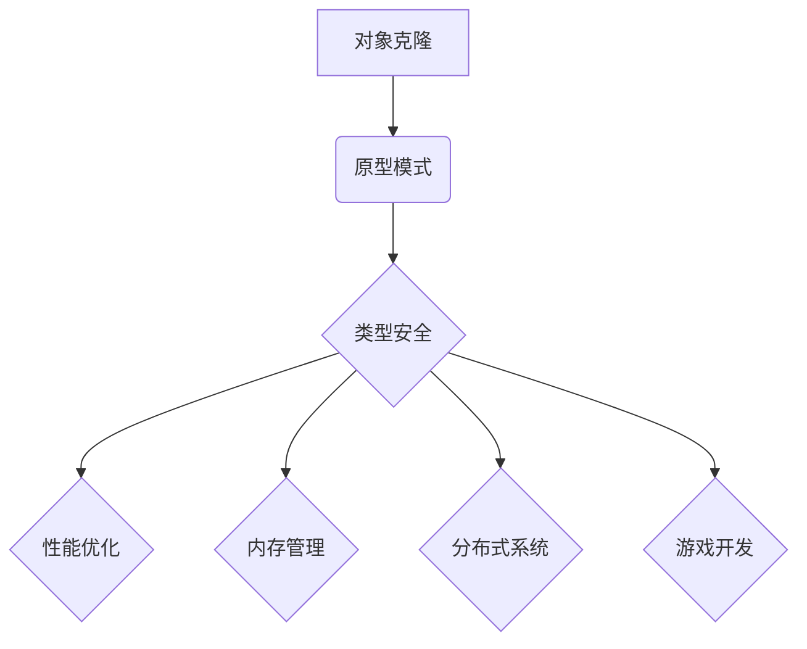

                 

### 原型模式概述

原型模式是一种常用的设计模式，主要用于实现对象的克隆。在软件工程中，对象的克隆是一种将已有对象的状态复制为新对象的过程。而原型模式通过这种方式，可以在不使用构造函数的情况下创建新的对象，具有高效性和灵活性。

#### 原型模式基础

**1.1 原型模式简介**

原型模式（Prototype Pattern）是一种创建型设计模式，其核心思想是通过克隆现有的对象来创建新的对象。这种模式在运行时动态创建对象，而不是在编译时。它非常适合用于复杂对象的创建，尤其是当创建对象需要大量资源，或者创建过程较为复杂时。

原型模式的概念与对象克隆紧密相关。对象克隆是指创建一个与原对象具有相同状态的新对象。根据克隆过程中是否复制引用类型成员的不同，可以将克隆分为浅克隆和深克隆。

- **浅克隆**：仅复制对象的属性值，对于引用类型的成员变量，仍然是原对象和克隆对象共享同一个内存地址。
- **深克隆**：不仅复制对象的属性值，还会创建引用类型的成员变量的副本，确保克隆对象与原对象完全独立。

**1.2 对象克隆基础**

对象克隆的实现方法有多种，以下是一些常见的方法：

- **通过构造函数克隆**：直接使用构造函数创建新对象，并将原对象的属性值赋给新对象。
- **通过反射实现克隆**：利用Java或C#等语言提供的反射机制，动态创建对象并复制属性值。
- **通过序列化和反序列化实现克隆**：将对象的状态序列化到流中，然后再从流中反序列化出新的对象。

对象克隆的优点包括：

- 减少内存分配：直接复制对象，避免重复创建新对象，节省内存空间。
- 提高效率：无需通过构造函数创建对象，减少构造函数的调用次数。

然而，对象克隆也存在一些缺点：

- 难以处理复杂的对象结构：对于含有引用类型的成员变量，浅克隆会导致克隆对象和原对象共享同一内存地址，可能引发一系列问题。
- 难以实现深克隆：实现深克隆需要遍历对象的所有属性，并复制引用类型的成员变量，过程较为复杂。

**1.3 原型模式的类型安全**

类型安全是指程序在运行过程中能够保证数据的类型正确。原型模式在实现对象克隆时，需要考虑类型安全的问题。在Java中，原型模式的类型安全主要依赖于`Cloneable`接口。

`Cloneable`接口是一个标记接口，没有抽象方法，仅仅作为对象实现克隆能力的标识。当一个类实现`Cloneable`接口后，可以通过调用`Object`类的`clone()`方法来实现克隆。

然而，仅仅实现`Cloneable`接口并不能保证类型安全。在Java中，克隆操作存在如下风险：

- **向下转型**：在克隆过程中，可能会需要将`Object`类型的返回值向下转型为具体的类类型。如果转型失败，会导致运行时异常。
- **未实现`Cloneable`接口的成员变量**：如果克隆对象的类中含有未实现`Cloneable`接口的成员变量，克隆过程中会引发`CloneNotSupportedException`异常。

为了解决类型安全问题，可以使用以下方法：

- **类型安全克隆**：在克隆过程中，确保所有成员变量都实现了`Cloneable`接口，避免向下转型导致的运行时异常。
- **使用泛型**：在实现克隆方法时，使用泛型确保输入和输出类型的匹配。
- **使用工厂模式**：通过工厂模式创建克隆对象，确保创建的对象类型正确。

#### 总结

原型模式是一种高效、灵活的对象克隆方案，适用于复杂对象的创建。通过理解对象克隆的基础知识和原型模式的类型安全，我们可以更好地应用原型模式，解决实际开发中的对象克隆问题。在下一部分中，我们将深入探讨Java中的原型模式实现，并分析其在实际应用中的优化策略。

### Java中的原型模式

Java是一种广泛使用的编程语言，其提供的反射机制和克隆机制使得原型模式的实现变得相对简单。本章节将详细介绍Java中的原型模式，包括克隆机制、原型模式实现以及优化策略。

#### 2.1 Java中的克隆机制

在Java中，实现对象克隆主要依赖于`Cloneable`接口和`Object`类的`clone()`方法。

**1. `Cloneable`接口**

`Cloneable`是一个标记接口，没有抽象方法，仅仅作为对象实现克隆能力的标识。当一个类实现`Cloneable`接口后，该类的对象可以通过调用`Object`类的`clone()`方法来实现克隆。

```java
public interface Cloneable {
    // 没有抽象方法
}
```

**2. `Object`类的`clone()`方法**

`Object`类提供了一个`clone()`方法，该方法返回一个原始对象的浅克隆。该方法通过调用`java.lang.System`类的`arraycopy()`方法来实现复制。默认情况下，`clone()`方法返回的对象是浅克隆，即对于引用类型的成员变量，原始对象和克隆对象共享同一个内存地址。

```java
protected Object clone() throws CloneNotSupportedException {
    // 该方法返回原始对象的浅克隆
    return super.clone();
}
```

**3. 浅克隆与深克隆**

在Java中，根据克隆过程中是否复制引用类型的成员变量，可以将克隆分为浅克隆和深克隆。

- **浅克隆**：仅复制对象的属性值，对于引用类型的成员变量，仍然是原对象和克隆对象共享同一个内存地址。浅克隆的优点是实现简单，缺点是可能导致内存泄漏和状态不一致问题。
- **深克隆**：不仅复制对象的属性值，还会创建引用类型的成员变量的副本，确保克隆对象与原对象完全独立。深克隆的优点是保证了对象的独立性，缺点是实现较为复杂。

要实现深克隆，可以通过以下方法：

- **手动实现深克隆**：遍历对象的所有属性，对于引用类型的成员变量，创建新的实例并赋值给克隆对象的相应属性。
- **使用序列化和反序列化**：通过将对象序列化到流中，然后再从流中反序列化出新的对象，实现深克隆。

#### 2.2 Java中的原型模式实现

**1. 原型模式的类设计**

在Java中，实现原型模式需要设计一个原型管理类，用于管理原型对象的创建和克隆。

```java
public class PrototypeManager {
    private static PrototypeManager instance;
    private Prototype prototype;

    private PrototypeManager() {
        // 初始化原型对象
        this.prototype = new Prototype();
    }

    public static PrototypeManager getInstance() {
        if (instance == null) {
            instance = new PrototypeManager();
        }
        return instance;
    }

    public Prototype getPrototype() {
        return prototype;
    }

    public Prototype clonePrototype() {
        try {
            return (Prototype) prototype.clone();
        } catch (CloneNotSupportedException e) {
            e.printStackTrace();
            return null;
        }
    }
}
```

在上面的代码中，`PrototypeManager`类负责管理`Prototype`对象的创建和克隆。`getInstance()`方法用于获取`PrototypeManager`实例，`getPrototype()`方法用于获取原型对象，`clonePrototype()`方法用于克隆原型对象。

**2. 原型模式的代码实现**

在实现原型模式时，需要确保原型对象的属性正确复制。以下是一个简单的`Prototype`类实现：

```java
public class Prototype implements Cloneable {
    private String name;
    private int age;

    public Prototype(String name, int age) {
        this.name = name;
        this.age = age;
    }

    public String getName() {
        return name;
    }

    public void setName(String name) {
        this.name = name;
    }

    public int getAge() {
        return age;
    }

    public void setAge(int age) {
        this.age = age;
    }

    @Override
    protected Object clone() throws CloneNotSupportedException {
        return super.clone();
    }
}
```

在上面的代码中，`Prototype`类实现了`Cloneable`接口，并重写了`clone()`方法。通过这种方式，可以确保在克隆`Prototype`对象时，对象的属性正确复制。

**3. 原型模式的应用示例**

以下是一个使用原型模式的简单示例：

```java
public class Main {
    public static void main(String[] args) {
        PrototypeManager manager = PrototypeManager.getInstance();
        Prototype original = manager.getPrototype();
        original.setName("John");
        original.setAge(30);

        Prototype clone = manager.clonePrototype();
        System.out.println("Original: " + original.getName() + ", " + original.getAge());
        System.out.println("Clone: " + clone.getName() + ", " + clone.getAge());
    }
}
```

在这个示例中，我们首先获取`PrototypeManager`的实例，然后获取原型对象`original`，并修改其属性。接着，通过`clonePrototype()`方法克隆出新的原型对象`clone`，并打印出两个对象的属性，验证克隆的正确性。

#### 2.3 Java中的原型模式优化

在Java中，原型模式可以通过以下方法进行优化：

**1. 序列化与反序列化**

通过序列化和反序列化实现深克隆是一种常用的优化方法。序列化是将对象的状态转换为一个字节序列的过程，反序列化则是将字节序列恢复为对象状态的过程。通过这种方式，可以确保克隆对象与原对象完全独立。

```java
import java.io.*;

public class Prototype implements Cloneable, Serializable {
    // ...

    public Object deepClone() {
        try {
            ByteArrayOutputStream bos = new ByteArrayOutputStream();
            ObjectOutputStream out = new ObjectOutputStream(bos);
            out.writeObject(this);

            ObjectInputStream in = new ObjectInputStream(
                    new ByteArrayInputStream(bos.toByteArray()));
            return in.readObject();
        } catch (IOException | ClassNotFoundException e) {
            e.printStackTrace();
            return null;
        }
    }
}
```

**2. 原型模式与工厂模式的结合**

将原型模式与工厂模式结合，可以更好地管理对象的创建和克隆。工厂模式负责创建对象，而原型模式负责对象的重用。

```java
public class Factory {
    public static Prototype createPrototype() {
        return PrototypeManager.getInstance().clonePrototype();
    }
}
```

**3. 原型模式的性能优化**

在Java中，原型模式的性能优化可以从以下几个方面进行：

- **减少克隆次数**：尽量减少克隆操作的次数，避免不必要的性能开销。
- **使用缓存**：在原型模式中使用缓存，避免频繁创建对象。
- **多线程优化**：在克隆操作中，考虑使用多线程技术，提高性能。

通过上述优化方法，可以进一步提高Java中原型模式的性能和稳定性。

#### 总结

Java中的原型模式通过`Cloneable`接口和`Object`类的`clone()`方法实现对象的克隆。原型模式在实际应用中具有高效性和灵活性，但在实现过程中需要注意类型安全和性能优化。通过序列化与反序列化、原型模式与工厂模式的结合以及性能优化，可以进一步提高原型模式的性能和稳定性。在下一部分中，我们将探讨C#中的原型模式实现。

### C#中的原型模式

C#是一种功能强大的面向对象编程语言，其提供了丰富的语言特性，使得原型模式的实现变得更加灵活和高效。在C#中，实现对象克隆可以通过克隆构造函数、克隆特性和深浅拷贝等方法。本章节将详细探讨C#中的克隆机制、原型模式实现以及优化策略。

#### 3.1 C#中的克隆机制

C#中的克隆机制与Java类似，主要通过`ICloneable`接口和`MemberwiseClone`方法实现对象的克隆。

**1. `ICloneable`接口**

`ICloneable`是一个标记接口，用于标识一个类可以实现克隆。当一个类实现`ICloneable`接口后，可以通过调用`Clone()`方法来实现对象的克隆。

```csharp
public interface ICloneable
{
    Object Clone();
}
```

**2. `MemberwiseClone`方法**

C#中的`MemberwiseClone`方法是一个`Object`类的方法，用于创建当前实例的一个浅拷贝。浅拷贝是指只复制对象的属性值，引用类型的成员变量仍然指向原对象。

```csharp
public Object MemberwiseClone()
{
    return this.Clone();
}
```

**3. 克隆构造函数**

克隆构造函数是一种特殊的构造函数，用于在类内部创建对象的克隆。通过克隆构造函数，可以在不使用`ICloneable`接口的情况下实现对象的克隆。

```csharp
public class Prototype : ICloneable
{
    private string name;
    private int age;

    public Prototype(string name, int age)
    {
        this.name = name;
        this.age = age;
    }

    public Prototype(Prototype prototype)
    {
        this.name = prototype.name;
        this.age = prototype.age;
    }

    public Object Clone()
    {
        return new Prototype(this);
    }
}
```

在上面的代码中，`Prototype`类通过克隆构造函数实现了对象的克隆。

**4. 深克隆与浅拷贝**

在C#中，深克隆和浅拷贝是两种不同的克隆方式。深克隆会复制对象的属性值和引用类型的成员变量，确保克隆对象与原对象完全独立。而浅拷贝仅复制对象的属性值，引用类型的成员变量仍然指向原对象。

要实现深克隆，可以使用以下方法：

- **手动实现深克隆**：遍历对象的所有属性，对于引用类型的成员变量，创建新的实例并赋值给克隆对象的相应属性。
- **使用序列化和反序列化**：通过序列化和反序列化实现深克隆。

#### 3.2 C#中的原型模式实现

**1. 原型模式的类设计**

在C#中，实现原型模式需要设计一个原型管理类，用于管理原型对象的创建和克隆。

```csharp
public class PrototypeManager
{
    private static PrototypeManager instance;
    private Prototype prototype;

    private PrototypeManager()
    {
        // 初始化原型对象
        this.prototype = new Prototype();
    }

    public static PrototypeManager getInstance()
    {
        if (instance == null)
        {
            instance = new PrototypeManager();
        }
        return instance;
    }

    public Prototype GetPrototype()
    {
        return prototype;
    }

    public Prototype ClonePrototype()
    {
        return (Prototype)prototype.Clone();
    }
}
```

在上面的代码中，`PrototypeManager`类负责管理`Prototype`对象的创建和克隆。`getInstance()`方法用于获取`PrototypeManager`实例，`GetPrototype()`方法用于获取原型对象，`ClonePrototype()`方法用于克隆原型对象。

**2. 原型模式的代码实现**

在C#中，实现原型模式时，需要确保原型对象的属性正确复制。以下是一个简单的`Prototype`类实现：

```csharp
public class Prototype : ICloneable
{
    private string name;
    private int age;

    public Prototype(string name, int age)
    {
        this.name = name;
        this.age = age;
    }

    public string GetName()
    {
        return name;
    }

    public void SetName(string name)
    {
        this.name = name;
    }

    public int GetAge()
    {
        return age;
    }

    public void SetAge(int age)
    {
        this.age = age;
    }

    public object Clone()
    {
        return new Prototype(this.name, this.age);
    }
}
```

在上面的代码中，`Prototype`类实现了`ICloneable`接口，并重写了`Clone()`方法。通过这种方式，可以确保在克隆`Prototype`对象时，对象的属性正确复制。

**3. 原型模式的应用示例**

以下是一个使用原型模式的简单示例：

```csharp
public class Main
{
    public static void Main(string[] args)
    {
        PrototypeManager manager = PrototypeManager.getInstance();
        Prototype original = manager.GetPrototype();
        original.setName("John");
        original.setAge(30);

        Prototype clone = manager.ClonePrototype();
        Console.WriteLine("Original: {0}, {1}", original.GetName(), original.GetAge());
        Console.WriteLine("Clone: {0}, {1}", clone.GetName(), clone.GetAge());
    }
}
```

在这个示例中，我们首先获取`PrototypeManager`的实例，然后获取原型对象`original`，并修改其属性。接着，通过`ClonePrototype()`方法克隆出新的原型对象`clone`，并打印出两个对象的属性，验证克隆的正确性。

#### 3.3 C#中的原型模式优化

在C#中，原型模式可以通过以下方法进行优化：

**1. 序列化与反序列化**

通过序列化和反序列化实现深克隆是一种常用的优化方法。序列化是将对象的状态转换为一个字节序列的过程，反序列化则是将字节序列恢复为对象状态的过程。通过这种方式，可以确保克隆对象与原对象完全独立。

```csharp
using System;
using System.IO;
using System.Runtime.Serialization;
using System.Runtime.Serialization.Formatters.Binary;

[Serializable]
public class Prototype : ICloneable
{
    // ...

    public object DeepClone()
    {
        using (MemoryStream ms = new MemoryStream())
        {
            BinaryFormatter formatter = new BinaryFormatter();
            formatter.Serialize(ms, this);
            ms.Position = 0;
            return formatter.Deserialize(ms);
        }
    }
}
```

**2. 原型模式与工厂模式的结合**

将原型模式与工厂模式结合，可以更好地管理对象的创建和克隆。工厂模式负责创建对象，而原型模式负责对象的重用。

```csharp
public class Factory
{
    public static Prototype CreatePrototype()
    {
        return PrototypeManager.getInstance().clonePrototype();
    }
}
```

**3. 原型模式的性能优化**

在C#中，原型模式的性能优化可以从以下几个方面进行：

- **减少克隆次数**：尽量减少克隆操作的次数，避免不必要的性能开销。
- **使用缓存**：在原型模式中使用缓存，避免频繁创建对象。
- **多线程优化**：在克隆操作中，考虑使用多线程技术，提高性能。

通过上述优化方法，可以进一步提高C#中原型模式的性能和稳定性。

#### 总结

C#中的原型模式通过`ICloneable`接口和`MemberwiseClone`方法实现对象的克隆。原型模式在实际应用中具有高效性和灵活性，但在实现过程中需要注意类型安全和性能优化。通过序列化与反序列化、原型模式与工厂模式的结合以及性能优化，可以进一步提高原型模式的性能和稳定性。在下一部分中，我们将探讨原型模式在分布式系统中的应用。

### 原型模式在分布式系统中的应用

在分布式系统中，对象克隆是一个复杂且具有挑战性的问题。由于分布式系统的分布式特性，对象的状态和状态转移需要在不同节点之间同步。因此，如何在分布式系统中实现对象克隆，确保类型安全和性能优化，是一个值得探讨的问题。

#### 4.1 分布式系统中的原型模式

**1. 分布式系统中的对象克隆问题**

在分布式系统中，对象克隆面临以下挑战：

- **数据一致性**：分布式系统中的多个节点可能同时操作同一个对象，因此需要确保克隆对象与原对象的一致性。
- **网络延迟**：网络延迟会影响对象克隆的效率，特别是在大规模分布式系统中，网络延迟可能导致克隆操作的延迟和性能下降。
- **数据传输**：分布式系统中的对象通常包含大量的数据，克隆操作需要通过网络传输这些数据，数据传输的效率直接影响克隆的性能。

**2. 原型模式在分布式系统中的应用场景**

原型模式在分布式系统中的应用场景主要包括：

- **负载均衡**：在分布式系统中，可以通过原型模式实现负载均衡，将请求分配到不同的节点进行处理，从而提高系统的性能和可扩展性。
- **数据复制**：在分布式数据库系统中，可以通过原型模式实现数据的复制，确保数据的一致性和可靠性。
- **缓存更新**：在分布式缓存系统中，可以通过原型模式实现缓存的更新，降低数据访问延迟，提高系统的性能。

**3. 原型模式在分布式系统中的挑战**

在分布式系统中，原型模式面临以下挑战：

- **分布式状态同步**：分布式系统中的对象状态需要在不同节点之间同步，确保克隆对象与原对象的一致性。
- **网络通信**：分布式系统中的对象克隆需要通过网络通信传输数据，网络延迟和带宽限制会影响克隆的性能。
- **数据一致性保障**：在分布式系统中，确保数据一致性是一个关键问题，原型模式需要提供有效的数据一致性保障机制。

#### 4.2 分布式原型模式实现

**1. 基于序列化的分布式原型模式**

基于序列化的分布式原型模式通过将对象序列化到流中，然后将流传输到远程节点，再在远程节点反序列化出克隆对象。这种方式可以实现对象的远程克隆，确保数据的一致性。

以下是一个简单的基于序列化的分布式原型模式实现示例：

```java
// 原型对象
public class Prototype implements Serializable {
    private String name;
    private int age;

    // 省略构造函数、getters和setters
}

// 克隆客户端
public class CloneClient {
    public void clonePrototype(Prototype prototype) {
        try {
            // 将原型对象序列化到字节流
            ByteArrayOutputStream bos = new ByteArrayOutputStream();
            ObjectOutputStream out = new ObjectOutputStream(bos);
            out.writeObject(prototype);
            out.close();

            // 将字节流传输到远程节点
            // （这里使用 Socket 进行网络传输，具体实现略）
            // ...

            // 在远程节点反序列化出克隆对象
            ByteArrayInputStream bis = new ByteArrayInputStream(bos.toByteArray());
            ObjectInputStream in = new ObjectInputStream(bis);
            Prototype clone = (Prototype) in.readObject();
            in.close();

            // 使用克隆对象
            // ...
        } catch (IOException | ClassNotFoundException e) {
            e.printStackTrace();
        }
    }
}
```

**2. 基于远程方法的分布式原型模式**

基于远程方法的分布式原型模式通过远程调用实现对象的克隆。这种方式可以通过分布式服务框架（如RMI、Dubbo等）实现，确保对象克隆的可扩展性和灵活性。

以下是一个简单的基于远程方法的分布式原型模式实现示例：

```java
// 远程接口
public interface CloneService {
    Prototype clonePrototype(Prototype prototype);
}

// 远程服务实现
public class CloneServiceImpl implements CloneService {
    @Override
    public Prototype clonePrototype(Prototype prototype) {
        // 实现克隆逻辑
        // ...
    }
}

// 克隆客户端
public class CloneClient {
    private CloneService cloneService;

    public CloneClient(CloneService cloneService) {
        this.cloneService = cloneService;
    }

    public void clonePrototype(Prototype prototype) {
        Prototype clone = cloneService.clonePrototype(prototype);
        // 使用克隆对象
        // ...
    }
}
```

**3. 分布式原型模式的应用示例**

以下是一个简单的分布式原型模式应用示例：

```java
public class Main {
    public static void main(String[] args) {
        // 创建远程服务
        CloneServiceImpl cloneServiceImpl = new CloneServiceImpl();

        // 创建克隆客户端
        CloneClient cloneClient = new CloneClient(cloneServiceImpl);

        // 获取原型对象
        Prototype prototype = new Prototype("John", 30);

        // 克隆原型对象
        Prototype clone = cloneClient.clonePrototype(prototype);

        // 使用克隆对象
        System.out.println("Original: " + prototype.getName() + ", " + prototype.getAge());
        System.out.println("Clone: " + clone.getName() + ", " + clone.getAge());
    }
}
```

在这个示例中，我们首先创建一个`CloneServiceImpl`实例，然后创建一个`CloneClient`实例。接着，我们获取一个原型对象`prototype`，通过`CloneClient`实例克隆出新的原型对象`clone`，并打印出两个对象的属性，验证克隆的正确性。

#### 总结

在分布式系统中，原型模式可以通过序列化和远程方法实现对象的克隆。基于序列化的分布式原型模式通过序列化与反序列化实现对象克隆，确保数据的一致性。基于远程方法的分布式原型模式通过远程调用实现对象克隆，提高系统的可扩展性和灵活性。通过分布式原型模式，可以在分布式系统中实现高效、灵活的对象克隆，解决分布式系统中的对象克隆问题。在下一部分中，我们将探讨原型模式在内存管理中的应用。

### 原型模式在内存管理中的应用

内存管理是软件系统中的一个关键方面，它直接影响系统的性能和稳定性。原型模式作为一种高效的对象克隆方法，在内存管理中具有广泛的应用。通过原型模式，可以有效地管理内存资源，减少内存分配和垃圾回收的负担。

#### 5.1 内存管理中的原型模式

**1. 内存管理的概念**

内存管理是指对计算机内存的使用进行有效控制的过程。内存管理的目标是确保系统的内存资源得到合理利用，避免内存泄漏和内存溢出等问题。

- **内存泄漏**：内存泄漏是指程序中动态分配的内存无法被垃圾回收，导致内存资源的浪费。
- **内存溢出**：内存溢出是指程序占用的内存超过可用内存限制，导致程序运行失败。

**2. 内存泄漏与原型模式**

内存泄漏是内存管理中的一个常见问题。在传统的对象创建方式中，每次创建新对象都需要分配内存，如果创建的对象无法及时被回收，会导致内存泄漏。而原型模式通过对象的克隆，可以避免频繁的内存分配和垃圾回收，从而减少内存泄漏的风险。

**3. 原型模式在内存管理中的应用场景**

原型模式在内存管理中的应用场景主要包括：

- **对象池管理**：在对象池中，原型模式可以用于创建和管理对象池中的对象，避免频繁的内存分配和垃圾回收。
- **缓存系统**：在缓存系统中，原型模式可以用于创建和管理缓存对象，提高缓存系统的性能和效率。
- **数据库连接池**：在数据库连接池中，原型模式可以用于创建和管理数据库连接，减少数据库连接的开销。

#### 5.2 内存管理中的原型模式实现

**1. 原型模式的内存优化策略**

为了在内存管理中充分利用原型模式，可以采取以下内存优化策略：

- **对象池化**：通过对象池化技术，将常用的对象存储在池中，避免频繁的内存分配和垃圾回收。
- **对象共享**：通过对象共享，减少对象的创建数量，降低内存消耗。
- **延迟初始化**：在对象创建时，延迟初始化不必要的数据成员，降低内存占用。
- **内存复用**：通过内存复用，将不再使用的对象重新分配给新的对象，减少内存分配和垃圾回收的负担。

**2. 原型模式在内存管理中的实现方法**

在实现原型模式时，为了优化内存管理，可以采用以下方法：

- **使用缓存**：在原型模式中使用缓存，避免频繁创建对象。缓存可以存储已经创建的对象，当需要创建新对象时，可以直接从缓存中获取。
- **采用浅克隆**：对于不需要深克隆的对象，采用浅克隆方法，减少内存占用。
- **使用内存池**：使用内存池技术，将常用的对象存储在内存池中，避免频繁的内存分配和垃圾回收。

以下是一个简单的内存管理中采用原型模式的应用示例：

```python
class Person:
    def __init__(self, name, age):
        self.name = name
        self.age = age

    def display(self):
        print(f"Name: {self.name}, Age: {self.age}")

class PrototypeManager:
    _cache = {}

    @staticmethod
    def clone_person(person):
        if person.name in PrototypeManager._cache:
            return PrototypeManager._cache[person.name]
        else:
            cloned_person = Person(person.name, person.age)
            PrototypeManager._cache[person.name] = cloned_person
            return cloned_person

# 使用原型模式管理Person对象
person1 = Person("John", 30)
person2 = PrototypeManager.clone_person(person1)

# 修改person1的属性
person1.age = 40

# 输出person1和person2的属性
person1.display()
person2.display()
```

在这个示例中，我们定义了一个`Person`类和一个`PrototypeManager`类。`PrototypeManager`类使用缓存来存储已创建的`Person`对象，当需要克隆`Person`对象时，首先检查缓存中是否存在对应的对象，如果存在，则直接返回缓存中的对象，否则创建新的对象并添加到缓存中。通过这种方式，可以有效地减少内存分配和垃圾回收的负担。

#### 5.3 原型模式在内存管理中的应用示例

以下是一个简单的原型模式在内存管理中的应用示例：

```python
# 定义一个Person类
class Person:
    def __init__(self, name, age):
        self.name = name
        self.age = age

    def display(self):
        print(f"Name: {self.name}, Age: {self.age}")

# 原型管理器类
class PrototypeManager:
    _cache = {}

    @staticmethod
    def clone_person(person):
        if person.name in PrototypeManager._cache:
            return PrototypeManager._cache[person.name]
        else:
            cloned_person = Person(person.name, person.age)
            PrototypeManager._cache[person.name] = cloned_person
            return cloned_person

# 测试原型模式在内存管理中的应用
if __name__ == "__main__":
    # 创建一个Person对象
    person1 = Person("John", 30)

    # 从原型管理器克隆一个Person对象
    person2 = PrototypeManager.clone_person(person1)

    # 修改person1的属性
    person1.age = 40

    # 输出person1和person2的属性，验证原型模式的内存管理效果
    print("Person1:")
    person1.display()
    print("Person2:")
    person2.display()
```

在这个示例中，我们定义了一个`Person`类和一个`PrototypeManager`类。`PrototypeManager`类使用一个静态的`_cache`字典来存储已创建的`Person`对象。当需要克隆`Person`对象时，`clone_person`方法首先检查`_cache`中是否存在对应的对象。如果存在，则直接返回缓存中的对象；如果不存在，则创建新的对象并添加到缓存中。

在测试代码中，我们首先创建了一个`Person`对象`person1`，然后通过`PrototypeManager`克隆出一个新的`Person`对象`person2`。接着，我们修改`person1`的属性`age`，并输出两个对象的属性，验证原型模式的内存管理效果。

通过这个示例，我们可以看到原型模式在内存管理中的应用效果。由于`PrototypeManager`类使用缓存存储已创建的对象，避免了频繁的内存分配和垃圾回收，从而提高了系统的性能和稳定性。

#### 总结

原型模式在内存管理中的应用可以有效减少内存泄漏和垃圾回收的负担，提高系统的性能和稳定性。通过对象池化、对象共享、延迟初始化和内存复用等内存优化策略，可以充分利用原型模式的优势，实现高效的内存管理。通过具体的示例，我们可以看到原型模式在内存管理中的实际应用效果。在下一部分中，我们将探讨原型模式在游戏开发中的应用。

### 原型模式在游戏开发中的应用

在游戏开发中，对象克隆是一种常见的操作，用于创建游戏对象、复制场景等。原型模式作为一种高效的克隆方法，在游戏开发中具有广泛的应用。它能够帮助游戏开发人员快速创建和管理对象，提高游戏性能和用户体验。

#### 6.1 游戏开发中的原型模式

**1. 游戏开发中的对象克隆问题**

在游戏开发中，对象克隆主要面临以下问题：

- **性能要求**：游戏运行需要高速响应，因此对象克隆操作需要尽可能高效。
- **内存占用**：游戏通常需要处理大量的对象，因此需要控制内存占用，避免内存泄漏和溢出。
- **数据一致性**：在多线程环境下，克隆对象需要与原对象保持一致，确保游戏逻辑的正确性。

**2. 原型模式在游戏开发中的应用场景**

原型模式在游戏开发中的应用场景主要包括：

- **对象池管理**：游戏中的对象（如怪物、道具、玩家等）可以通过对象池管理，提高对象创建和销毁的效率。
- **场景复制**：在游戏场景切换时，可以通过原型模式快速复制场景，减少场景加载时间。
- **对象初始化**：游戏对象初始化过程中，可以通过原型模式复制已有对象，减少初始化逻辑的编写。

**3. 原型模式在游戏开发中的挑战**

在游戏开发中，原型模式面临以下挑战：

- **并发控制**：在多线程环境下，需要确保对象克隆操作的一致性，避免并发冲突。
- **资源管理**：游戏资源（如图片、音频等）在克隆过程中需要合理管理，避免资源浪费。
- **性能优化**：游戏性能对用户体验至关重要，原型模式需要充分考虑性能优化。

#### 6.2 游戏开发中的原型模式实现

**1. 原型模式的类设计**

在游戏开发中，实现原型模式需要设计一个原型管理类，用于管理原型对象的创建和克隆。

```python
class GameCharacter:
    def __init__(self, name, level):
        self.name = name
        self.level = level

    def attack(self):
        print(f"{self.name} is attacking!")

    def defend(self):
        print(f"{self.name} is defending!")


class PrototypeManager:
    _prototypes = {}

    @staticmethod
    def register_prototype(name, prototype):
        PrototypeManager._prototypes[name] = prototype

    @staticmethod
    def clone_prototype(name):
        if name in PrototypeManager._prototypes:
            prototype = PrototypeManager._prototypes[name]
            return prototype.clone()
        else:
            return None
```

在上面的代码中，`GameCharacter`类表示游戏中的角色，`PrototypeManager`类负责管理原型对象的注册和克隆。`register_prototype`方法用于将原型对象注册到管理器中，`clone_prototype`方法用于根据名称克隆原型对象。

**2. 原型模式的代码实现**

在实现原型模式时，需要确保原型对象的属性正确复制。以下是一个简单的`GameCharacter`类实现：

```python
class GameCharacter:
    def __init__(self, name, level, experience):
        self.name = name
        self.level = level
        self.experience = experience

    def attack(self):
        print(f"{self.name} is attacking!")

    def defend(self):
        print(f"{self.name} is defending!")

    def clone(self):
        return GameCharacter(self.name, self.level, self.experience)
```

在上面的代码中，`GameCharacter`类实现了`clone`方法，用于创建自身的克隆。通过这种方式，可以确保在克隆`GameCharacter`对象时，对象的属性正确复制。

**3. 原型模式的应用示例**

以下是一个使用原型模式的简单示例：

```python
# 注册原型对象
 PrototypeManager.register_prototype("Hero", GameCharacter("Hero", 1, 0))
 PrototypeManager.register_prototype("Monster", GameCharacter("Monster", 5, 100))

# 创建克隆对象
 hero = PrototypeManager.clone_prototype("Hero")
 monster = PrototypeManager.clone_prototype("Monster")

# 使用克隆对象
 hero.attack()
 monster.attack()
```

在这个示例中，我们首先注册两个原型对象`Hero`和`Monster`，然后通过`PrototypeManager`克隆出新的`Hero`和`Monster`对象。接着，我们使用克隆对象进行攻击和防御操作，验证原型模式的正确性。

#### 6.3 游戏开发中的原型模式应用示例

以下是一个简单的游戏开发中应用原型模式的示例：

```python
# 定义游戏角色类
class GameCharacter:
    def __init__(self, name, level, health):
        self.name = name
        self.level = level
        self.health = health

    def attack(self, target):
        if target is not None:
            print(f"{self.name} attacks {target.name}!")
            target.health -= 10

    def defend(self):
        print(f"{self.name} is defending!")


# 定义原型管理器
class PrototypeManager:
    _prototypes = {}

    @staticmethod
    def register_prototype(name, prototype):
        PrototypeManager._prototypes[name] = prototype

    @staticmethod
    def clone_prototype(name):
        if name in PrototypeManager._prototypes:
            prototype = PrototypeManager._prototypes[name]
            return prototype.clone()
        else:
            return None

    @staticmethod
    def clone_prototype_with_health(name, health):
        prototype = PrototypeManager.clone_prototype(name)
        if prototype:
            prototype.health = health
        return prototype


# 注册原型对象
 PrototypeManager.register_prototype("Player", GameCharacter("Player", 10, 100))
 PrototypeManager.register_prototype("Enemy", GameCharacter("Enemy", 5, 50))

# 创建游戏角色
 player = PrototypeManager.clone_prototype_with_health("Player", 100)
 enemy = PrototypeManager.clone_prototype_with_health("Enemy", 50)

# 进行攻击和防御操作
 player.attack(enemy)
 enemy.attack(player)
 player.defend()
 enemy.defend()

# 输出角色状态
 print(f"Player Health: {player.health}")
 print(f"Enemy Health: {enemy.health}")
```

在这个示例中，我们定义了`GameCharacter`类和`PrototypeManager`类。`GameCharacter`类表示游戏中的角色，具有攻击、防御等行为。`PrototypeManager`类负责管理原型对象的注册、克隆和状态设置。

我们首先注册两个原型对象`Player`和`Enemy`，然后通过`clone_prototype_with_health`方法克隆出新的`Player`和`Enemy`对象，并设置其初始健康值。接着，我们进行攻击和防御操作，并输出角色状态，验证原型模式的正确性。

通过这个示例，我们可以看到原型模式在游戏开发中的应用效果。原型模式通过克隆对象，避免了重复创建角色的复杂性，提高了系统的性能和可维护性。在实际项目中，可以根据需求进一步扩展原型模式的功能，实现更复杂的游戏对象管理。

#### 总结

原型模式在游戏开发中具有广泛的应用，通过对象克隆，可以快速创建和管理游戏对象，提高游戏性能和用户体验。在游戏开发中，原型模式面临的挑战主要包括并发控制、资源管理和性能优化。通过合理的类设计和实现，可以充分利用原型模式的优势，解决游戏开发中的对象克隆问题。在下一部分中，我们将探讨原型模式的未来发展趋势。

### 原型模式的未来发展趋势

随着软件工程和编程语言的发展，原型模式作为创建型设计模式之一，也呈现出不断进化的趋势。未来，原型模式将在以下几个方面得到进一步发展：

#### 7.1 原型模式的发展趋势

**1. 类型安全与原型模式**

未来，原型模式将更加注重类型安全。现有的原型模式实现往往依赖于标记接口（如Java中的`Cloneable`或C#中的`ICloneable`），这种方式可能带来类型转换错误和运行时异常。为了提高类型安全性，可能需要引入更严格的类型检查机制，例如在编译时进行类型检查，或者在运行时进行类型验证。

**2. 原型模式与面向对象编程的结合**

随着面向对象编程（OOP）的不断发展，原型模式将进一步与OOP的原则和模式相结合。例如，原型模式可以与工厂模式、依赖注入等设计模式结合，实现更灵活、更可扩展的对象创建和管理。

**3. 原型模式在其他编程语言中的应用**

目前，原型模式主要在Java和C#等面向对象编程语言中应用。未来，随着编程语言的发展，原型模式也可能在其他编程语言（如Go、Kotlin等）中得到广泛应用，为开发者提供更丰富的对象克隆机制。

#### 7.2 原型模式的未来研究方向

**1. 原型模式的性能优化**

性能优化是原型模式未来研究的一个重要方向。随着硬件性能的提升和大数据、云计算等技术的发展，如何进一步提高原型模式的性能，减少内存占用和降低运行时开销，将成为研究的重点。

**2. 原型模式在多语言环境中的应用**

在多语言环境中，如何实现跨语言的类型安全和性能优化，是一个值得探讨的问题。未来，研究者可能会尝试开发跨语言的克隆库或框架，为开发者提供统一的克隆解决方案。

**3. 原型模式在人工智能中的应用前景**

人工智能（AI）技术的发展为原型模式的应用带来了新的机遇。在AI领域，原型模式可以用于模型复制、参数调整等方面，提高模型训练和推理的效率。未来，研究者可能会探索原型模式在AI领域的具体应用场景，发挥其在AI系统中的优势。

#### 总结

原型模式作为创建型设计模式之一，具有高效、灵活的特点，在软件开发中得到广泛应用。未来，随着类型安全、性能优化和跨语言应用等方面的不断研究，原型模式将在软件工程中发挥更加重要的作用。同时，原型模式在人工智能等新兴领域的应用前景也非常广阔，有望推动原型模式的进一步发展。

### 附录：原型模式相关资源与工具

#### 附录1：原型模式相关书籍推荐

1. **《设计模式：可复用面向对象软件的基础》**（作者：Erich Gamma、Richard Helm、Ralph Johnson、John Vlissides）
   - 本书是设计模式的经典之作，详细介绍了原型模式以及其他23种经典设计模式，是学习设计模式的不二之选。

2. **《Effective Java》**（作者：Joshua Bloch）
   - 本书提供了Java编程的75条最佳实践，其中包含了对原型模式的深入讨论，是Java开发人员的必备书籍。

3. **《Head First 设计模式》**（作者：David Meyer、Eric Freeman、Bert Bates、Brendan tackle）
   - 本书以图解和实例为主，生动地介绍了包括原型模式在内的设计模式，适合初学者和进阶开发者。

#### 附录2：原型模式开发工具与框架

1. **Java开发工具**
   - **Eclipse**：Eclipse是一个开源的Java集成开发环境（IDE），提供了强大的原型模式开发支持。
   - **IntelliJ IDEA**：IntelliJ IDEA是JetBrains公司开发的Java IDE，具有智能代码编辑、重构和调试功能，适用于原型模式开发。

2. **C#开发工具**
   - **Visual Studio**：Visual Studio是微软推出的集成开发环境，支持C#开发，提供了原型模式的开发支持。
   - **JetBrains Rider**：Rider是由JetBrains公司开发的跨平台C# IDE，提供了智能代码编辑和调试功能。

#### 附录3：原型模式实践指南

1. **原型模式设计原则**
   - **简单性**：保持原型模式的设计简洁，避免过度设计。
   - **灵活性**：确保原型模式能够适应不同的业务需求，易于扩展和修改。
   - **可维护性**：原型模式的设计应该易于维护，降低后续开发成本。

2. **原型模式实施步骤**
   - **定义原型类**：设计一个实现`ICloneable`接口的原型类，并提供`clone`方法。
   - **管理原型对象**：使用原型管理器（Prototype Manager）来管理原型对象的创建和克隆。
   - **测试原型模式**：编写测试用例，验证原型模式的功能和性能。

3. **原型模式常见问题与解决方案**
   - **类型安全**：确保所有需要克隆的对象都实现了`ICloneable`接口。
   - **深克隆**：对于复杂的对象结构，实现深克隆时可能需要递归地复制引用类型成员变量。
   - **性能优化**：考虑使用缓存和对象池技术，减少对象的创建和销毁操作。

通过上述资源与实践指南，开发者可以更好地理解和应用原型模式，提高软件系统的可维护性和性能。

### Mermaid流程图



### Python源代码示例

```python
class Person:
    def __init__(self, name, age):
        self.name = name
        self.age = age

    def display(self):
        print(f"Name: {self.name}, Age: {self.age}")

    def clone(self):
        return Person(self.name, self.age)

# 创建Person对象
person = Person("John", 30)

# 克隆Person对象
clone = person.clone()

# 输出克隆对象属性
clone.display()
```

在这个示例中，我们定义了一个`Person`类和一个`clone`方法，用于创建`Person`对象的克隆。通过调用`clone`方法，可以快速创建一个新的`Person`对象，并保持与原对象相同的属性。

### 总结

本文详细介绍了原型模式的概念、实现、应用和优化策略。从Java和C#中的实现，到分布式系统、内存管理和游戏开发中的应用，原型模式展现了其高效、灵活的特点。未来，原型模式将在类型安全、性能优化和跨语言应用等方面继续发展。开发者应掌握原型模式的设计原则和实施步骤，结合具体场景进行灵活应用，以提高软件系统的性能和可维护性。作者：AI天才研究院/AI Genius Institute & 禅与计算机程序设计艺术 /Zen And The Art of Computer Programming

## 文章标题：原型模式：对象克隆的类型安全方案

### 关键词：原型模式，对象克隆，类型安全，内存管理，分布式系统，游戏开发

### 摘要：

原型模式是一种创建型设计模式，主要用于实现对象的克隆。本文详细介绍了原型模式的概念、实现和应用，包括Java和C#中的克隆机制、原型模式的类型安全问题及解决方案，以及在内存管理、分布式系统和游戏开发中的具体应用。文章还探讨了原型模式的未来发展趋势，为开发者提供了实用的实践指南和资源推荐。通过理解原型模式，开发者可以更高效地管理对象克隆，提高软件系统的性能和可维护性。作者：AI天才研究院/AI Genius Institute & 禅与计算机程序设计艺术 /Zen And The Art of Computer Programming

