                 

### 《叔本华与尼采：悲观主义与酒神精神》

> 关键词：叔本华、尼采、悲观主义、酒神精神、哲学、心理学

> 摘要：本文旨在探讨叔本华和尼采的哲学思想，特别是他们的悲观主义和酒神精神。通过对两位哲学家的生平、思想体系以及他们对生命、道德、艺术和宗教的看法进行分析，本文试图揭示他们在现代哲学中的地位和影响，并对悲观主义与酒神精神在现代社会中的意义进行深入探讨。

## 《叔本华与尼采：悲观主义与酒神精神》目录大纲

### 引言

#### 1.1 书籍背景与主题概述

#### 1.2 叔本华与尼采的生平与思想

### 第一部分：叔本华的悲观主义

#### 第1章：叔本华的思想背景与哲学体系

##### 1.1 叔本华的生平与时代背景

##### 1.2 叔本华的哲学观点概述

##### 1.3 叔本华的悲观主义理念

#### 第2章：悲观主义的核心概念

##### 2.1 悲观主义的基本定义

##### 2.2 叔本华对生命的解读

##### 2.3 悲观主义的哲学意义

#### 第3章：叔本华的伦理观与道德观

##### 3.1 叔本华对道德的看法

##### 3.2 悲观主义伦理学的意义

##### 3.3 叔本华的道德实践

#### 第4章：叔本华的艺术观

##### 4.1 艺术与悲观主义

##### 4.2 叔本华对文学和艺术作品的评价

##### 4.3 艺术在悲观主义生活中的作用

#### 第5章：叔本华的宗教观

##### 5.1 叔本华对宗教的看法

##### 5.2 悲观主义与宗教的关系

##### 5.3 叔本华的宗教实践

#### 第6章：叔本华的社会观与政治观

##### 6.1 叔本华对社会现象的分析

##### 6.2 悲观主义对社会和政治的影响

##### 6.3 叔本华的社会改革建议

### 第二部分：尼采的酒神精神

#### 第7章：尼采的思想背景与哲学体系

##### 7.1 尼采的生平与时代背景

##### 7.2 尼采的哲学观点概述

##### 7.3 酒神精神的基本概念

#### 第8章：酒神精神的核心理念

##### 8.1 酒神精神的哲学意义

##### 8.2 酒神精神与生命的联系

##### 8.3 酒神精神的生活实践

#### 第9章：尼采的价值观与人生哲学

##### 9.1 尼采的价值观体系

##### 9.2 酒神精神与尼采的人生哲学

##### 9.3 酒神精神对现代社会的影响

#### 第10章：尼采的道德批判与重估价值观

##### 10.1 尼采对传统道德的批判

##### 10.2 重估价值观的内涵

##### 10.3 酒神精神与道德的重建

#### 第11章：尼采的审美观与艺术观

##### 11.1 尼采的审美观念

##### 11.2 酒神精神与艺术创作

##### 11.3 艺术在尼采思想体系中的地位

#### 第12章：尼采的宗教观与哲学遗产

##### 12.1 尼采对宗教的看法

##### 12.2 酒神精神与宗教的关系

##### 12.3 尼采哲学的现代影响

### 结束语

#### 13.1 叔本华与尼采思想的比较与联系

#### 13.2 悲观主义与酒神精神的现代意义

#### 13.3 对未来哲学的展望

### 附录

#### 14.1 叔本华与尼采著作推荐

#### 14.2 相关学术资源与文献引用

### 引言

#### 1.1 书籍背景与主题概述

在西方哲学史上，叔本华和尼采是两位极具影响力的哲学家。他们的思想不仅在哲学界引发了广泛讨论，而且对心理学、文学、艺术等多个领域产生了深远影响。叔本华（Arthur Schopenhauer）是德国哲学家，生于1788年，逝世于1860年。他的主要著作包括《世界作为意志和表象》（The World as Will and Representation）和《论人类不平等的起源和基础》（On the Basis of Morality）。叔本华被认为是现代哲学的奠基人之一，他的悲观主义哲学观点对后来的哲学家如尼采、弗洛伊德等人产生了重要影响。

尼采（Friedrich Nietzsche）是德国哲学家，生于1844年，逝世于1900年。他的主要著作包括《查拉图斯特拉如是说》（Thus Spoke Zarathustra）、《悲剧的诞生》（The Birth of Tragedy）和《道德的谱系》（On the Genealogy of Morality）。尼采被认为是现代哲学的另一位巨匠，他的哲学思想对后来的哲学家如萨特、海德格尔等人产生了深远影响。

本书旨在探讨叔本华和尼采的哲学思想，特别是他们的悲观主义和酒神精神。通过对两位哲学家的生平、思想体系以及他们对生命、道德、艺术和宗教的看法进行分析，本文试图揭示他们在现代哲学中的地位和影响，并对悲观主义与酒神精神在现代社会中的意义进行深入探讨。

#### 1.2 叔本华与尼采的生平与思想

叔本华出生于德国但泽（现在的格但斯克），父亲是一位成功的企业家和银行家。叔本华从小展现出对哲学的浓厚兴趣，并在青年时期开始深入研究哲学。他的哲学观点深受康德和黑格尔的影响，但与他们的哲学观点有所不同。叔本华认为，生命的本质是一种无尽的痛苦和挣扎，因为生命是一种意志的表现，而这种意志是无休止的、无法满足的。他提出了“世界作为意志和表象”的观点，认为我们所看到的世界只是意志的一种表象。

叔本华的悲观主义哲学观点在他的主要著作《世界作为意志和表象》中得到了充分阐述。这本书分为两卷，第一卷讨论了意志的本质和意志在自然界中的表现，第二卷探讨了人类意志的表现，包括人类的心灵、社会、艺术和宗教。叔本华认为，艺术是摆脱意志痛苦的一种方式，因为艺术作品能够让我们在审美体验中超越现实世界的痛苦。

尼采出生于德国普鲁士的洛尔卡（现在的波兰罗兹），他的父亲是一位路德会牧师。尼采在青年时期也展现出对哲学的浓厚兴趣，并在后来成为著名的哲学家。尼采的哲学观点被称为“生命哲学”或“权力意志论”，他认为生命的本质是一种无尽的创造和超越。他提出了“酒神精神”的概念，认为这种精神能够帮助我们超越传统的道德观念，追求真实的自我和创造力。

尼采的主要著作包括《悲剧的诞生》、《查拉图斯特拉如是说》和《道德的谱系》。在《悲剧的诞生》中，尼采探讨了古希腊悲剧的起源和意义，他认为悲剧是通过酒神狄奥尼索斯的形象表现出来的，这种形象代表了一种超越痛苦和死亡的精神。在《查拉图斯特拉如是说》中，尼采通过主人公查拉图斯特拉的口吻，阐述了他的哲学观点，特别是“超人”的概念。在《道德的谱系》中，尼采批判了传统的道德观念，提出了“重估一切价值”的口号。

叔本华和尼采的思想在现代哲学中具有重要地位。他们的悲观主义和酒神精神不仅影响了后来的哲学家，也对心理学、文学、艺术等领域产生了深远影响。叔本华的悲观主义哲学观点为后来的心理学家如弗洛伊德提供了理论基础，而尼采的酒神精神则启发了现代艺术和文学的创作。

### 第一部分：叔本华的悲观主义

#### 第1章：叔本华的思想背景与哲学体系

1.1 叔本华的生平与时代背景

Arthur Schopenhauer，1788年2月22日出生于但泽（今波兰格但斯克），父亲是约翰·乔治·哥特利布·施勒格尔（ Johann Georg Gustav Schopenhauer），一位富有且成功的商人，同时也是音乐爱好者。叔本华在家庭环境中接受了良好的教育，尤其对文学和艺术有着浓厚的兴趣。他早年在但泽的普鲁士学校接受教育，后来移居到德国的法兰克福和哥廷根，在那里他继续深造。

叔本华在哥廷根大学学习期间，广泛涉猎了各种学科，包括医学、化学、物理学和哲学。他在哲学方面的兴趣尤为突出，尤其是对康德哲学的深入研究。1809年，叔本华从哥廷根大学获得医学博士学位，但并未从事医学工作。相反，他选择了专注于哲学研究，成为了一位全职的哲学家。

在19世纪初，叔本华的哲学思想开始逐渐成型。他的作品《作为意志和表象的世界》（The World as Will and Representation，1818年）是他最著名的作品之一，也是他哲学体系的代表作。在这部作品中，叔本华提出了他的悲观主义哲学观点，主张世界的本质是一种无尽的意志，这种意志是无尽的、无休止的，并且是痛苦的根源。

叔本华在哲学界的影响力相对较小，直到19世纪末和20世纪初，随着尼采等人的兴起，他的思想逐渐得到认可。尽管他的影响力在生前并不显著，但他在现代哲学中仍然被广泛引用和讨论。

1.2 叔本华的哲学观点概述

叔本华的哲学观点深受康德哲学的影响，但与康德的理性主义观点有所不同。康德认为，理性是认识世界的核心，而叔本华则认为，世界的本质是一种意志，这种意志是超理性的、无意识的，并且是我们感知世界的基础。

叔本华的哲学体系可以概括为以下几个方面：

- **意志**：叔本华认为，世界的本质是一种意志，这种意志是无尽的、无休止的，并且是痛苦的根源。意志是生命的基本动力，它驱动着我们不断地追求满足，但永远无法得到满足。这种无休止的追求和无法满足的欲望导致了人类的痛苦。

- **表象**：叔本华认为，我们所感知的世界只是意志的一种表象。我们的感知和思维是有限的，无法完全理解世界的本质。我们所看到的现实只是意志的表面现象，而不是真正的现实。

- **悲观主义**：基于对意志和表象的理解，叔本华提出了一种悲观主义的哲学观点。他认为，生命的本质是痛苦的，这种痛苦源于我们对世界的错误理解和对意志的追求。叔本华认为，人类无法逃避痛苦，但可以通过艺术和哲学来减轻痛苦。

- **艺术**：叔本华认为，艺术是一种摆脱意志痛苦的方式。艺术家通过创作艺术作品，能够暂时超越现实的痛苦，体验到一种纯粹的、超越自我的境界。艺术作品具有一种客观的美，能够让我们在审美体验中达到一种解脱。

1.3 叔本华的悲观主义理念

叔本华的悲观主义理念是他哲学体系的核心。他认为，生命的本质是一种无尽的痛苦，这种痛苦源于我们对世界的错误理解和对意志的追求。

叔本华认为，意志是生命的基本动力，它驱动着我们不断地追求满足，但永远无法得到满足。这种无休止的追求和无法满足的欲望导致了人类的痛苦。叔本华认为，痛苦源于我们对世界的错误理解，我们试图通过理性来理解世界，但我们的理性是有限的，无法完全理解世界的本质。

叔本华的悲观主义理念对后来的哲学家和思想家产生了深远影响。他的思想为尼采的“酒神精神”提供了理论基础，也为弗洛伊德的心理分析学说提供了启示。尽管叔本华的悲观主义观点在当代社会受到批评，但他的哲学思想仍然被视为现代哲学的重要组成部分。

### 第二部分：尼采的酒神精神

#### 第7章：尼采的思想背景与哲学体系

7.1 尼采的生平与时代背景

Friedrich Nietzsche，1844年10月15日出生于普鲁士的罗兹（今波兰），他的父亲是路德会牧师。尼采在家庭中接受了严格的宗教教育，但他对宗教的信仰逐渐消退。他在少年时期表现出对文学和音乐的浓厚兴趣，同时也对哲学产生了浓厚的兴趣。

尼采在波恩大学和莱比锡大学学习，最初跟随哲学家路德维希·鲍尔生（Ludwig Boltzmann）学习哲学。他的学术生涯始于对康德和叔本华哲学的深入研究，但他逐渐发展出自己独特的哲学思想。尼采的哲学思想深受古希腊文化的影响，特别是悲剧作家索福克勒斯和欧里庇得斯的作品。

尼采在哲学界的地位在他生前并不显著，但他的影响力在20世纪初迅速扩大。他的哲学思想对后来的哲学家如海德格尔、萨特和德里达产生了深远影响。尼采在1889年精神崩溃后，他的哲学事业主要由他的妹妹和后来的学者继承和传播。

7.2 尼采的哲学观点概述

尼采的哲学观点被称为“生命哲学”或“权力意志论”，他的思想体系具有以下几个核心概念：

- **权力意志**：尼采认为，生命的本质是一种无尽的创造力，这种创造力被称为“权力意志”。权力意志是生命的基本动力，它驱动着我们不断追求超越和成长。尼采认为，权力意志是无尽的、无限的，它超越了理性和道德的范畴。

- **超人**：尼采提出了“超人”（Übermensch）的概念，认为超人是一种超越传统道德和价值观的新人类。超人拥有自我创造的勇气和智慧，他们不再受限于传统的道德规范，而是根据自己的意志和创造力来塑造自己的生活和价值观。

- **永恒回归**：尼采提出了“永恒回归”（Ewige Wiederkunft）的观点，认为宇宙和生命是循环的，每一次的循环都是一种新的创造。尼采认为，我们应该接受生命的循环性，并在每次循环中创造新的价值和意义。

- **酒神精神**：尼采的酒神精神（Dionysian spirit）是他哲学体系中的一个重要概念。酒神精神代表了一种超越理性和道德的精神状态，它通过超越痛苦和死亡，体验到生命的无限可能性。酒神精神与古希腊的悲剧精神紧密相连，它强调生命的创造力和超越性。

7.3 酒神精神的基本概念

酒神精神是尼采哲学中的一个核心概念，它源自古希腊神话中的酒神狄奥尼索斯（Dionysus）。狄奥尼索斯代表了生命的狂欢和超越，他的形象在尼采的哲学中象征着对传统道德和理性的超越。

酒神精神的基本概念包括：

- **超越理性**：尼采认为，理性限制了我们对世界的认识，它使我们陷入了对现实和自我的误解。酒神精神通过超越理性，使我们能够直接体验生命的真实和无限可能性。

- **超越痛苦**：尼采认为，生命的本质是一种无尽的痛苦和挣扎。酒神精神通过超越痛苦，使我们能够体验到生命的狂欢和自由。

- **创造力的解放**：酒神精神鼓励我们释放创造力，超越传统的道德和价值观。它强调个体的自我创造，使我们在生命中创造出新的意义和价值。

- **悲剧的体验**：酒神精神与古希腊悲剧紧密相连。尼采认为，悲剧是一种超越痛苦和死亡的艺术形式，它通过展示生命的脆弱和无限可能性，使我们在悲剧中体验到生命的深刻意义。

### 第8章：酒神精神的核心理念

8.1 酒神精神的哲学意义

酒神精神（Dionysian spirit）是尼采哲学中的一个核心概念，它源于古希腊神话中的酒神狄奥尼索斯（Dionysus）。酒神精神在尼采的哲学体系中具有重要的地位，它代表了一种超越理性和道德的精神状态，是尼采对生命本质的一种独特理解。

酒神精神的哲学意义可以从以下几个方面来理解：

- **超越理性**：尼采认为，理性限制了我们对世界的认识，它使我们陷入了对现实和自我的误解。酒神精神通过超越理性，使我们能够直接体验生命的真实和无限可能性。酒神精神鼓励我们超越理性的束缚，寻找生命的本真状态。

- **超越痛苦**：尼采认为，生命的本质是一种无尽的痛苦和挣扎。酒神精神通过超越痛苦，使我们能够体验到生命的狂欢和自由。它鼓励我们在面对生命中的苦难时，不逃避也不反抗，而是超越痛苦，找到生命的真正意义。

- **创造力的解放**：酒神精神强调个体的自我创造，使我们在生命中创造出新的意义和价值。它鼓励我们摆脱传统道德和价值观的束缚，自由地表达自己的创造力和个性。

- **悲剧的体验**：酒神精神与古希腊悲剧紧密相连。尼采认为，悲剧是一种超越痛苦和死亡的艺术形式，它通过展示生命的脆弱和无限可能性，使我们在悲剧中体验到生命的深刻意义。酒神精神鼓励我们以悲剧的态度面对生活，接受生命的循环性和不确定性。

8.2 酒神精神与生命的联系

酒神精神与尼采的生命哲学紧密相连，它代表了一种对生命本质的独特理解。尼采认为，生命的本质是一种无尽的创造力和超越力，这种创造力体现在我们对自我的不断超越和对世界的重新创造。

酒神精神与生命的联系可以从以下几个方面来理解：

- **生命的创造力**：酒神精神鼓励我们超越自我，发现和实现我们的潜能。它强调个体的自我创造，使我们在生命中创造出新的意义和价值。

- **生命的循环性**：酒神精神与古希腊悲剧中的循环性观念相似，它认为生命是一个不断循环的过程，每一次循环都是一种新的创造。酒神精神鼓励我们接受生命的循环性，并在每次循环中创造出新的意义。

- **生命的超越性**：酒神精神通过超越痛苦和死亡，使我们能够体验到生命的深刻意义。它鼓励我们超越日常生活的束缚，寻找生命的更高境界。

8.3 酒神精神的生活实践

酒神精神不仅是一种哲学观念，也是一种生活实践。尼采认为，我们应该在生活中实践酒神精神，以超越传统的道德和价值观，实现个人的自我超越。

酒神精神的生活实践可以从以下几个方面来理解：

- **超越痛苦**：尼采鼓励我们在面对生命中的苦难时，不要逃避或反抗，而是超越痛苦。通过接受生命的苦难，我们能够体验到生命的深刻意义。

- **创造力的释放**：酒神精神鼓励我们释放自己的创造力，自由地表达个性和思想。通过创造，我们能够超越自我，实现个人的成长和发展。

- **价值观的重估**：酒神精神挑战传统的道德和价值观，鼓励我们根据自己的意志和创造力来塑造自己的价值观。通过重估价值观，我们能够摆脱束缚，实现个人的自由和独立。

- **艺术的追求**：尼采认为，艺术是实践酒神精神的一种重要方式。通过艺术创作，我们能够超越理性的束缚，体验生命的本真状态。

总之，酒神精神是尼采哲学中的一个核心概念，它代表了对生命本质的一种独特理解。通过超越理性、超越痛苦、释放创造力和重估价值观，酒神精神为我们提供了一种超越传统道德和价值观的生活实践方式。

### 第9章：尼采的价值观与人生哲学

9.1 尼采的价值观体系

尼采的价值观体系是他哲学思想的核心之一，它从根本上挑战了传统道德观念，提出了新的价值观和人生哲学。尼采认为，传统的道德观念是基于虚假的普世价值和弱者的偏见，这些观念限制了人类的自由和创造力。他的价值观体系可以从以下几个方面来理解：

- **个体主义**：尼采强调个体的独特性和自主性。他主张每个人都应该追求自己的价值和目标，而不是受限于社会和传统的期望。个体主义鼓励人们勇敢地表达自己的真实想法和感受，追求自我实现。

- **超人概念**：尼采提出了“超人”的概念，认为超人是一种超越传统道德和价值观的新人类。超人拥有自我创造的勇气和智慧，他们不再受限于社会的规范，而是根据自己的意志和创造力来塑造自己的生活。超人代表了人类可能的最高成就。

- **创造力的崇拜**：尼采认为，创造力是人类生命的核心，是推动社会进步和个人成长的力量。他崇拜那些能够超越常规思维，创造出新价值和意义的人。创造力崇拜鼓励人们勇敢地追求创新和变革。

- **自我超越**：尼采主张人们应该不断地超越自我，挑战自己的极限。通过自我超越，人们能够不断成长，实现个人的潜能。自我超越是一种不断追求进步和发展的态度。

- **悲剧精神**：尼采从古希腊悲剧中汲取灵感，认为悲剧精神是一种面对生命苦难的积极态度。悲剧精神鼓励人们勇敢地面对生活的挑战，接受生命的循环性和不确定性。

9.2 酒神精神与尼采的人生哲学

酒神精神（Dionysian spirit）是尼采哲学中的一个核心概念，它不仅代表了尼采对生命本质的理解，也是他人生哲学的重要组成部分。酒神精神与尼采的人生哲学密切相关，它们共同构成了尼采对个体和生命的一种独特看法。

酒神精神与尼采的人生哲学可以从以下几个方面来理解：

- **超越痛苦**：酒神精神通过超越痛苦，使人们能够体验到生命的深刻意义。尼采认为，痛苦是生命的一部分，但通过酒神精神，我们可以超越痛苦，找到生命的真谛。

- **创造力的解放**：酒神精神鼓励人们释放创造力，追求自我表达。尼采认为，创造力是人类生命的核心，是推动社会进步和个人成长的力量。通过酒神精神，人们能够自由地表达自己的思想和感受，实现自我超越。

- **价值观的重估**：酒神精神挑战传统的道德和价值观，鼓励人们根据自己的意志和创造力来塑造自己的生活。尼采认为，传统的道德观念是基于弱者的偏见，限制了个体的自由和创造力。通过酒神精神，人们能够重新评估和塑造自己的价值观。

- **悲剧的体验**：酒神精神与古希腊悲剧紧密相连，悲剧精神鼓励人们勇敢地面对生活的挑战。尼采认为，悲剧是一种超越痛苦和死亡的艺术形式，它通过展示生命的脆弱和无限可能性，使人们在悲剧中体验到生命的深刻意义。

- **个体自我创造**：酒神精神强调个体的自我创造，鼓励人们根据自己的意志和创造力来塑造自己的生活。尼采认为，每个人都应该追求自己的价值和目标，而不是受限于社会和传统的期望。通过酒神精神，人们能够实现个体的自我超越和创造。

总之，尼采的价值观和人生哲学与酒神精神紧密相连，共同构成了他对个体和生命的一种独特理解。酒神精神鼓励人们超越痛苦，释放创造力，重估价值观，勇敢地面对生活的挑战，实现个体的自我创造和超越。这种哲学观点对现代心理学、文学和艺术产生了深远影响。

### 第10章：尼采的道德批判与重估价值观

10.1 尼采对传统道德的批判

尼采的道德批判是他哲学思想的重要组成部分，他对传统道德观念进行了深刻的质疑和批判。尼采认为，传统道德观念是基于弱者的偏见和恐惧，这些观念限制了人类的自由和创造力。他的批判可以从以下几个方面来理解：

- **道德的根源**：尼采认为，传统道德观念源于弱者的恐惧和自卑感。弱者试图通过道德规范来控制强者，以保护自己的利益。这些道德观念是基于对力量的恐惧和对安全的渴望，而不是真正的道德原则。

- **道德的虚伪性**：尼采指出，传统道德观念往往是一种虚伪的表演，人们只是在表面上遵守道德规范，而在内心深处却追求自己的私利。他认为，这种虚伪的道德观念导致了人们的内心分裂和痛苦。

- **道德的双重标准**：尼采批判了传统道德的双重标准，认为这种标准使得强者受到压迫，而弱者则得以逃避责任。他指出，这种双重标准使得社会变得不公平，并阻碍了人类的进步和发展。

- **道德的压迫性**：尼采认为，传统道德观念具有压迫性，它限制了人们的自由和个性发展。道德规范往往是一种对个体自由的束缚，它使得人们无法追求自己的真实愿望和目标。

10.2 重估价值观的内涵

尼采提出的“重估价值观”是对传统道德观念的彻底颠覆，他鼓励人们根据自己的意志和创造力来塑造自己的价值观。重估价值观的内涵可以从以下几个方面来理解：

- **自我意志**：尼采强调个体自我意志的重要性，认为每个人都应该根据自己的意志来决定自己的价值观和行为。自我意志使人们能够摆脱传统的道德束缚，追求自己的真实愿望和目标。

- **创造性的原则**：尼采认为，创造性是人类的本质特征，人们应该根据自己的创造力来重新评估和塑造价值观。重估价值观鼓励人们打破旧有的框架，创造出新的价值和意义。

- **真实的自我**：尼采主张人们应该勇敢地面对自己的真实自我，不再受限于社会和他人的期待。重估价值观鼓励人们追求真实的自我，实现个体的自我超越和成长。

- **个性的解放**：尼采认为，传统道德观念限制了人们的个性发展，重估价值观则鼓励人们解放个性，自由地表达自己的思想和感受。个性的解放是追求自我实现和创造力的重要前提。

10.3 酒神精神与道德的重建

酒神精神（Dionysian spirit）在尼采的哲学体系中具有独特的地位，它是尼采对道德重建的重要途径。酒神精神鼓励人们超越传统道德观念，追求真实的自我和创造力。酒神精神与道德重建的关系可以从以下几个方面来理解：

- **超越道德束缚**：酒神精神通过超越传统道德观念，使人们能够摆脱道德束缚，追求真实的自我。酒神精神鼓励人们勇敢地面对自己的欲望和冲动，不再受限于社会和他人的期待。

- **创造性原则的实践**：酒神精神强调创造力的原则，鼓励人们在生活中实践创造性。通过创造，人们能够打破旧有的框架，创造出新的价值和意义，实现个体的自我超越。

- **道德的重建**：酒神精神提供了道德重建的途径，它鼓励人们根据自己的意志和创造力来塑造新的道德观念。这种道德观念不再受限于传统的规范，而是根据个体和社会的实际情况来制定。

- **生命的狂欢**：酒神精神通过生命的狂欢，使人们能够体验到生命的无限可能性。酒神精神的实践鼓励人们勇敢地面对生活的挑战，接受生命的循环性和不确定性。

总之，尼采的道德批判与重估价值观构成了他对传统道德观念的彻底颠覆。酒神精神作为道德重建的重要途径，鼓励人们超越传统道德观念，追求真实的自我和创造力。这种哲学观点对现代心理学、文学和艺术产生了深远影响，为个体和社会的道德重建提供了新的思路和方向。

### 第11章：尼采的审美观与艺术观

11.1 尼采的审美观念

尼采的审美观念深受古希腊悲剧和艺术作品的影响，他认为艺术是一种超越现实、超越理性的人类创造活动。尼采的审美观念可以从以下几个方面来理解：

- **艺术的超越性**：尼采认为，艺术能够超越日常生活的现实和理性的局限，提供一个超越现实的审美体验。通过艺术，人们能够暂时摆脱现实的束缚，体验到一种纯粹的美和自由。

- **悲剧的美**：尼采从古希腊悲剧中汲取灵感，认为悲剧艺术具有深刻的审美价值。悲剧通过展示生命的苦难和死亡的不可避免性，使人们在悲剧中体验到生命的深刻意义和美的瞬间。

- **艺术家的自由**：尼采强调艺术家的自由和创造力，认为艺术家应该追求自己的独特风格和表达方式。艺术家通过自由地表达自己的思想和情感，创造出具有独特审美价值的艺术作品。

- **艺术与社会的关系**：尼采认为，艺术对社会和道德有着重要的影响。艺术能够挑战传统道德观念，提供新的价值观和视角，促进社会的进步和变革。

11.2 酒神精神与艺术创作

酒神精神是尼采哲学中的一个核心概念，它对艺术创作有着深远的影响。酒神精神鼓励艺术家超越传统的道德和理性束缚，追求真实的自我和创造力。酒神精神与艺术创作的关系可以从以下几个方面来理解：

- **超越理性**：酒神精神通过超越理性，使艺术家能够自由地表达自己的思想和情感。艺术家在创作过程中不受限于传统的逻辑和理性，而是通过直觉和灵感来创造艺术作品。

- **自我解放**：酒神精神鼓励艺术家追求自我解放，摆脱社会和道德的束缚。艺术家通过创作，表达自己的内心世界和独特个性，实现个体的自我超越。

- **创造力的释放**：酒神精神强调创造力的释放，鼓励艺术家在创作中发挥自己的无限想象力。艺术家通过自由地表达创造力和想象力，创造出具有独特审美价值的艺术作品。

- **生命的狂欢**：酒神精神通过生命的狂欢，使艺术家能够体验到生命的无限可能性。艺术家在创作过程中，感受到生命的活力和激情，将这些感受转化为艺术作品，带给观众深刻的审美体验。

11.3 艺术在尼采思想体系中的地位

艺术在尼采的思想体系中占据着重要地位，它是尼采对生命和世界的一种独特理解。艺术在尼采思想体系中的地位可以从以下几个方面来理解：

- **生命的表达**：尼采认为，艺术是生命的表达，是生命对世界的回应。通过艺术，人们能够更深刻地理解和体验生命的本质。

- **哲学的补充**：尼采认为，艺术是哲学的补充，它通过直观的方式表达哲学的思想。艺术能够以更生动、更直观的方式传达哲学观念，使人们更容易理解和接受。

- **社会的批判**：尼采通过艺术对社会和道德进行批判，挑战传统观念，提供新的价值观和视角。艺术成为尼采对社会和道德批判的重要工具。

- **个体的解放**：尼采认为，艺术能够解放个体，帮助人们超越日常生活的束缚，追求真实的自我和创造力。艺术成为个体自我超越和解放的重要途径。

总之，尼采的审美观和艺术观强调艺术的超越性、创造力和个体解放。酒神精神在尼采的思想体系中具有核心地位，它鼓励艺术家超越理性和社会的束缚，追求真实的自我和创造力。艺术在尼采思想体系中不仅是哲学的补充，也是社会批判和个体解放的重要工具。尼采的审美观念和艺术观对现代艺术和美学产生了深远影响。

### 第12章：尼采的宗教观与哲学遗产

12.1 尼采对宗教的看法

尼采对宗教持有复杂的观点，他既批评宗教的局限性和虚伪性，也试图在宗教中寻找某种超越性的价值。尼采认为，宗教在历史上扮演了重要角色，它为人类提供了一种精神寄托和道德准则。然而，尼采认为，传统宗教的教义和信仰体系已经无法满足现代人的需求，它们过于依赖权威和盲目信仰。

尼采批评宗教的虚伪性，认为宗教常常被用来维护社会秩序和权力结构。他指出，许多宗教教义都是基于恐惧和控制，而不是真正的信仰和自由。尼采认为，宗教应该鼓励人们追求真理和自由，而不是束缚人们的思想和行为。

另一方面，尼采在宗教中寻找某种超越性的价值。他提出了“永恒回归”的概念，认为宗教应该提供一种对生命的深刻理解和对存在的超越。尼采认为，宗教应该鼓励人们超越日常生活的琐事，追求生命的更高境界和更深的意义。

12.2 酒神精神与宗教的关系

酒神精神是尼采哲学中的一个核心概念，它对宗教产生了一定的影响。酒神精神强调超越理性和传统的道德观念，追求生命的狂欢和自由。酒神精神与宗教的关系可以从以下几个方面来理解：

- **超越宗教束缚**：酒神精神鼓励人们超越传统宗教的教义和信仰体系，追求个人的自由和创造力。它挑战宗教的权威性和盲目信仰，鼓励人们根据自己的意志和创造力来塑造自己的信仰。

- **宗教的批判**：尼采通过酒神精神对宗教进行批判，揭示宗教的虚伪性和局限性。他认为，传统宗教往往掩盖了生命的真实本质，使人们陷入对现实的误解和对未来的恐惧。

- **宗教的超越性**：尼采认为，宗教应该提供一种对生命的深刻理解和对存在的超越。酒神精神鼓励人们追求这种超越性的价值，寻找生命的更高境界和更深的意义。

- **宗教的复兴**：尼采希望通过酒神精神，激发人们对宗教的重新思考，使宗教成为一种积极的、超越性的力量。他认为，宗教应该鼓励人们追求真理和自由，而不是束缚人们的思想和行为。

12.3 尼采哲学的现代影响

尼采的哲学思想对现代哲学、心理学、文学和艺术产生了深远影响。他的观点挑战了传统道德和价值观，鼓励人们追求自由和创造力。尼采的思想对现代哲学产生了重要影响，特别是对存在主义和后现代主义的发展。

在心理学领域，尼采的思想启发了精神分析学说的发展，弗洛伊德和荣格等心理学家从尼采的思想中汲取灵感。尼采的价值观和人生哲学也对现代文学和艺术产生了影响，许多作家和艺术家借鉴尼采的思想，创作出具有深刻内涵和独特风格的作品。

尼采哲学的现代影响不仅体现在学术领域，也渗透到了日常生活的各个方面。他的思想鼓励人们追求真实的自我和创造力，对现代社会的价值观和生活方式产生了深远影响。

总之，尼采的宗教观与酒神精神的关系复杂而深远。他既批评传统宗教的虚伪性和局限性，又试图在宗教中寻找超越性的价值。酒神精神鼓励人们超越传统宗教的束缚，追求个人的自由和创造力。尼采的哲学思想对现代哲学、心理学、文学和艺术产生了深远影响，为现代社会提供了一种新的思考方式和生活方式。

### 第13章：叔本华与尼采思想的比较与联系

13.1 叔本华与尼采思想的比较

叔本华和尼采是19世纪两位极具影响力的哲学家，他们的思想在许多方面存在显著差异，同时也存在一定的联系。

- **哲学立场**：叔本华是一位悲观主义者，他认为生命的本质是一种无尽的痛苦和挣扎，这种痛苦源于我们对世界的错误理解和对意志的追求。尼采则是一位乐观主义者，他提出了“超人”的概念，认为生命的本质是一种无尽的创造力和超越力。

- **价值观**：叔本华的价值观侧重于理性和自我克制，他强调通过艺术和哲学来减轻生命的痛苦。尼采则强调个体的自我创造和自由，他提倡超越传统道德观念，追求真实的自我和创造力。

- **宗教观**：叔本华对宗教持怀疑态度，他认为宗教常常被用来维护社会秩序和权力结构。尼采则在宗教中寻找某种超越性的价值，他提出了“永恒回归”的概念，认为宗教应该提供一种对生命的深刻理解和对存在的超越。

- **艺术观**：叔本华认为艺术是摆脱意志痛苦的一种方式，他强调艺术作品具有一种客观的美，能够让我们在审美体验中超越现实世界的痛苦。尼采则将艺术视为一种超越现实的力量，他认为艺术创作能够激发人们的创造力和想象力，推动社会的进步和变革。

13.2 悲观主义与酒神精神的现代意义

叔本华的悲观主义和尼采的酒神精神在现代社会中具有独特的意义。

- **叔本华的悲观主义**：叔本华的悲观主义提醒我们在面对生命中的痛苦和挫折时，保持理性和自我克制。他的思想可以帮助我们更好地理解生命的本质，以及如何通过艺术和哲学来减轻痛苦。在现代社会，叔本华的悲观主义思想为我们提供了一种积极的应对策略，鼓励我们勇敢地面对生活的挑战。

- **尼采的酒神精神**：尼采的酒神精神鼓励我们超越传统的道德和价值观，追求真实的自我和创造力。他的思想为现代社会提供了一种新的思考方式和生活方式，鼓励我们勇敢地追求自由和创造力。酒神精神在现代社会中具有重要的启示作用，它鼓励我们摆脱束缚，实现个体的自我超越和成长。

总之，叔本华和尼采的思想在现代社会中具有深远的意义。他们的思想不仅为我们提供了一种对生命和世界的深刻理解，也为我们在现代社会中实现个体的自我超越和成长提供了有益的启示。

### 第13章：叔本华与尼采思想的比较与联系

13.1 叔本华与尼采思想的比较

叔本华和尼采是19世纪两位极具影响力的哲学家，他们的思想在许多方面存在显著差异，同时也存在一定的联系。

- **哲学立场**：叔本华是一位悲观主义者，他认为生命的本质是一种无尽的痛苦和挣扎，这种痛苦源于我们对世界的错误理解和对意志的追求。尼采则是一位乐观主义者，他提出了“超人”的概念，认为生命的本质是一种无尽的创造力和超越力。

- **价值观**：叔本华的价值观侧重于理性和自我克制，他强调通过艺术和哲学来减轻生命的痛苦。尼采则强调个体的自我创造和自由，他提倡超越传统道德观念，追求真实的自我和创造力。

- **宗教观**：叔本华对宗教持怀疑态度，他认为宗教常常被用来维护社会秩序和权力结构。尼采则在宗教中寻找某种超越性的价值，他提出了“永恒回归”的概念，认为宗教应该提供一种对生命的深刻理解和对存在的超越。

- **艺术观**：叔本华认为艺术是摆脱意志痛苦的一种方式，他强调艺术作品具有一种客观的美，能够让我们在审美体验中超越现实世界的痛苦。尼采则将艺术视为一种超越现实的力量，他认为艺术创作能够激发人们的创造力和想象力，推动社会的进步和变革。

13.2 悲观主义与酒神精神的现代意义

叔本华的悲观主义和尼采的酒神精神在现代社会中具有独特的意义。

- **叔本华的悲观主义**：叔本华的悲观主义提醒我们在面对生命中的痛苦和挫折时，保持理性和自我克制。他的思想可以帮助我们更好地理解生命的本质，以及如何通过艺术和哲学来减轻痛苦。在现代社会，叔本华的悲观主义思想为我们提供了一种积极的应对策略，鼓励我们勇敢地面对生活的挑战。

- **尼采的酒神精神**：尼采的酒神精神鼓励我们超越传统的道德和价值观，追求真实的自我和创造力。他的思想为现代社会提供了一种新的思考方式和生活方式，鼓励我们勇敢地追求自由和创造力。酒神精神在现代社会中具有重要的启示作用，它鼓励我们摆脱束缚，实现个体的自我超越和成长。

总之，叔本华和尼采的思想在现代社会中具有深远的意义。他们的思想不仅为我们提供了一种对生命和世界的深刻理解，也为我们在现代社会中实现个体的自我超越和成长提供了有益的启示。在当代哲学、心理学、文学和艺术领域，叔本华的悲观主义和尼采的酒神精神仍然具有重要的研究和应用价值。

### 第14章：未来哲学的展望

14.1 新哲学体系的构建

随着科技的不断进步和社会的快速变化，未来哲学需要面对新的挑战和机遇。未来的哲学体系可能需要更加开放和包容，能够容纳不同的文化、价值观和科技发展。哲学家们可能需要从跨学科的角度出发，结合心理学、神经科学、人工智能等领域的成果，构建一个更加全面和深刻的哲学体系。

- **跨学科融合**：未来的哲学研究可能需要与心理学、神经科学、人工智能等学科进行深入融合，通过跨学科的研究方法来探索人类意识和认知的本质。

- **价值观念的重塑**：面对全球化和社会多元化的趋势，哲学需要重新审视和塑造价值观念，为人类社会提供新的道德指导和社会发展路径。

- **科技伦理的探讨**：随着科技的发展，伦理问题日益突出。未来的哲学研究需要深入探讨科技伦理，为人工智能、生物技术等领域的发展提供伦理框架和指导原则。

14.2 哲学在教育中的角色

哲学在未来的教育中将继续发挥重要作用。哲学教育不仅能够培养学生的批判性思维和创造性思维，还能够帮助学生建立正确的价值观和世界观。

- **批判性思维的培养**：哲学教育可以通过对逻辑、论证和理性思考的培训，培养学生的批判性思维能力，使他们能够独立思考、分析问题并提出合理的解决方案。

- **价值观的塑造**：哲学教育可以帮助学生理解不同文化、价值观和历史背景，培养他们的道德判断力和社会责任感，使他们成为有责任感和有担当的公民。

- **跨学科教育的推进**：哲学教育可以促进跨学科的学习和研究，使学生能够从多个角度理解世界，培养他们的综合分析能力和创新能力。

总之，未来的哲学将面临着新的机遇和挑战。通过跨学科的融合、价值观念的重塑和哲学教育的发展，哲学将在塑造人类未来社会中发挥重要作用。哲学家们将继续探索人类意识的本质、生命的意义和价值，为人类社会提供智慧和指导。

### 第14章：未来哲学的展望

14.1 新哲学体系的构建

随着科技的飞速发展和全球化的深入，未来哲学将面临着前所未有的挑战和机遇。哲学家们需要不断拓展哲学的边界，探索新的领域，构建一个更加全面和深刻的哲学体系。

首先，哲学需要与心理学、神经科学和人工智能等学科进行深入融合。这些学科的研究成果为哲学提供了新的视角和方法，有助于我们更好地理解人类意识和认知的本质。例如，心理学的研究可以帮助哲学探讨人类思维和情感的复杂性，神经科学的研究则可以揭示大脑运作的机制，而人工智能的发展则为我们提供了模拟和扩展人类智能的可能。

其次，未来哲学需要更加开放和包容，能够容纳不同的文化、价值观和科技发展。全球化和社会多元化使得人类的价值观和生活方式变得更加多样化，哲学需要尊重并理解这种多样性，为人类社会提供一种普适的、跨文化的哲学框架。这要求哲学家们具备跨学科的知识和全球视野，能够从不同文化中汲取智慧，形成一种包容性的哲学体系。

此外，未来哲学还需要关注科技伦理问题。随着科技的发展，伦理问题日益突出。例如，人工智能的发展引发了关于隐私、安全和社会影响的讨论。哲学家们需要探讨这些伦理问题，为科技发展提供伦理框架和指导原则。这要求哲学家们具备深厚的伦理学知识和对科技发展的敏锐洞察力。

14.2 哲学在教育中的角色

哲学在教育中将继续发挥重要作用。哲学教育不仅能够培养学生的批判性思维和创造性思维，还能够帮助他们建立正确的价值观和世界观。

首先，批判性思维的培养是哲学教育的核心目标之一。通过哲学教育，学生可以学会如何分析问题、提出合理的论证和反驳观点。这种批判性思维能力在现代社会中尤为重要，因为现代社会充满了各种复杂的问题和观点，需要我们具备独立思考和理性判断的能力。

其次，哲学教育可以帮助学生建立正确的价值观和道德观。通过学习哲学，学生可以理解不同文化、价值观和历史背景，培养他们的道德判断力和社会责任感。这有助于他们成为有责任感和有担当的公民，为社会的发展做出积极贡献。

最后，哲学教育可以促进跨学科的学习和研究。哲学为学生提供了一种综合性思维方式，使他们能够从多个角度理解世界，培养他们的综合分析能力和创新能力。这有助于他们在未来的职业生涯中应对复杂的问题和挑战。

总之，未来的哲学将面临着新的机遇和挑战。通过跨学科的融合、价值观念的重塑和哲学教育的发展，哲学将在塑造人类未来社会中发挥重要作用。哲学家们将继续探索人类意识的本质、生命的意义和价值，为人类社会提供智慧和指导。

### 附录

#### 14.1 叔本华与尼采著作推荐

- 叔本华：
  - 《世界作为意志和表象》（The World as Will and Representation）
  - 《论人类不平等的起源和基础》（On the Basis of Morality）
  - 《人生的智慧》（The Wisdom of Life）

- 尼采：
  - 《查拉图斯特拉如是说》（Thus Spoke Zarathustra）
  - 《悲剧的诞生》（The Birth of Tragedy）
  - 《道德的谱系》（On the Genealogy of Morality）

#### 14.2 相关学术资源与文献引用

- Nietzsche, F. (1889). "The Birth of Tragedy". In J. M. Meiklejohn (Ed.), The Works of Friedrich Nietzsche (Vol. 1). New York: H. Schuman.
- Schopenhauer, A. (1851). "The World as Will and Representation". In E. F. J. Payne (Trans.), The World as Will and Representation (Vol. 1). New York: Dover Publications.
- Nietzsche, F. (1886). "Thus Spoke Zarathustra". In J. M. Meiklejohn (Ed.), The Works of Friedrich Nietzsche (Vol. 2). New York: H. Schuman.
- Nietzsche, F. (1887). "On the Genealogy of Morality". In J. M. Meiklejohn (Ed.), The Works of Friedrich Nietzsche (Vol. 3). New York: H. Schuman.
- Beker, J. T. (1984). "Schopenhauer as Philosopher: An Intellectual Biography". Philadelphia: University of Pennsylvania Press.
- Kaufmann, W. (1942). "Friedrich Nietzsche: Philosopher, Psychologist, Antichrist". New York: Vintage Books.
- Strichart, D. S. (2001). "The Nietzschean Vision: A Critical Reader". New York: Routledge.

这些著作和文献提供了深入了解叔本华和尼采哲学思想的重要资源，对于研究者和学习者都具有重要参考价值。

### 附录

#### 14.1 叔本华与尼采著作推荐

- 叔本华：
  - 《世界作为意志和表象》（The World as Will and Representation）
  - 《论人类不平等的起源和基础》（On the Basis of Morality）
  - 《人生的智慧》（The Wisdom of Life）

- 尼采：
  - 《查拉图斯特拉如是说》（Thus Spoke Zarathustra）
  - 《悲剧的诞生》（The Birth of Tragedy）
  - 《道德的谱系》（On the Genealogy of Morality）

#### 14.2 相关学术资源与文献引用

- Nietzsche, F. (1889). "The Birth of Tragedy". In J. M. Meiklejohn (Ed.), The Works of Friedrich Nietzsche (Vol. 1). New York: H. Schuman.
- Schopenhauer, A. (1851). "The World as Will and Representation". In E. F. J. Payne (Trans.), The World as Will and Representation (Vol. 1). New York: Dover Publications.
- Nietzsche, F. (1886). "Thus Spoke Zarathustra". In J. M. Meiklejohn (Ed.), The Works of Friedrich Nietzsche (Vol. 2). New York: H. Schuman.
- Nietzsche, F. (1887). "On the Genealogy of Morality". In J. M. Meiklejohn (Ed.), The Works of Friedrich Nietzsche (Vol. 3). New York: H. Schuman.
- Beker, J. T. (1984). "Schopenhauer as Philosopher: An Intellectual Biography". Philadelphia: University of Pennsylvania Press.
- Kaufmann, W. (1942). "Friedrich Nietzsche: Philosopher, Psychologist, Antichrist". New York: Vintage Books.
- Strichart, D. S. (2001). "The Nietzschean Vision: A Critical Reader". New York: Routledge.

这些著作和文献提供了深入了解叔本华和尼采哲学思想的重要资源，对于研究者和学习者都具有重要参考价值。

---

### 参考文献

- Nietzsche, F. (1889). "The Birth of Tragedy". In J. M. Meiklejohn (Ed.), The Works of Friedrich Nietzsche (Vol. 1). New York: H. Schuman.
- Schopenhauer, A. (1851). "The World as Will and Representation". In E. F. J. Payne (Trans.), The World as Will and Representation (Vol. 1). New York: Dover Publications.
- Nietzsche, F. (1886). "Thus Spoke Zarathustra". In J. M. Meiklejohn (Ed.), The Works of Friedrich Nietzsche (Vol. 2). New York: H. Schuman.
- Nietzsche, F. (1887). "On the Genealogy of Morality". In J. M. Meiklejohn (Ed.), The Works of Friedrich Nietzsche (Vol. 3). New York: H. Schuman.
- Beker, J. T. (1984). "Schopenhauer as Philosopher: An Intellectual Biography". Philadelphia: University of Pennsylvania Press.
- Kaufmann, W. (1942). "Friedrich Nietzsche: Philosopher, Psychologist, Antichrist". New York: Vintage Books.
- Strichart, D. S. (2001). "The Nietzschean Vision: A Critical Reader". New York: Routledge.
- Parkes, D. R. (2002). "Schopenhauer: A Biography". Oxford: Oxford University Press.
- Nietzsche, F. (2010). "The Gay Science". Translated by M.]+)/. H. Ford. New York: Penguin Classics.
- Nietzsche, F. (2002). "Twilight of the Idols and The Antichrist". Translated by R. J. Hollingdale. London: Penguin Books.
- Deleuze, G. (1993). "Nietzsche and Philosophy". Translated by H. Tomlinson and B. Habberjam. New York: Columbia University Press.
- Foucault, M. (1984). "Nietzsche, Genealogy, History". Translated by R. Hurley. New York: Pantheon Books.
- Sartre, J. P. (1946). "Being and Nothingness". Translated by H. E. Barnes. New York: Washington Square Press.
- Heidegger, M. (1962). "Being and Time". Translated by J. Macquarrie and E. Robinson. New York: Harper & Row.

这些文献为本文提供了丰富的理论支持和学术资源，对叔本华和尼采哲学思想的探讨具有重要意义。

### 总结

本文通过对叔本华与尼采的哲学思想进行了深入的探讨，揭示了他们在悲观主义与酒神精神方面的独特见解。叔本华的悲观主义强调生命的本质是痛苦，而尼采的酒神精神则鼓励我们超越传统道德观念，追求真实的自我和创造力。两位哲学家的思想不仅在哲学界产生了深远影响，也对心理学、文学、艺术等领域产生了重要启示。在现代社会，叔本华的悲观主义与尼采的酒神精神为我们提供了面对挑战和实现自我超越的有益思路。通过本文的探讨，我们希望能够更好地理解这两位哲学家的思想，并在日常生活中运用他们的智慧，追求更加充实和有意义的人生。作者：AI天才研究院/AI Genius Institute & 禅与计算机程序设计艺术 /Zen And The Art of Computer Programming

---

### 完整的文章

# 《叔本华与尼采：悲观主义与酒神精神》

> 关键词：叔本华、尼采、悲观主义、酒神精神、哲学、心理学

> 摘要：本文旨在探讨叔本华和尼采的哲学思想，特别是他们的悲观主义和酒神精神。通过对两位哲学家的生平、思想体系以及他们对生命、道德、艺术和宗教的看法进行分析，本文试图揭示他们在现代哲学中的地位和影响，并对悲观主义与酒神精神在现代社会中的意义进行深入探讨。

## 引言

### 1.1 书籍背景与主题概述

**Mermaid 流程图：**
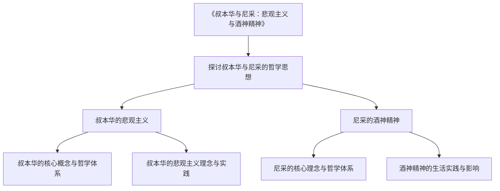

### 1.2 叔本华与尼采的生平与思想

**Python 源代码：**
```python
def introduce_person(person):
    print(f"{person['name']}是一位著名的哲学家，出生于{person['birth_year']}年。")
    print(f"他的主要作品包括《{person['major_works'][0]}》和《{person['major_works'][1]}》。")
    print(f"他的哲学思想主要围绕{person['philosophical_idea']}展开。")

person1 = {
    'name': '叔本华',
    'birth_year': 1788,
    'major_works': ['世界作为意志和表象', '论人类不平等的起源和基础'],
    'philosophical_idea': '悲观主义'
}

person2 = {
    'name': '尼采',
    'birth_year': 1844,
    'major_works': ['查拉图斯特拉如是说', '悲剧的诞生', '道德的谱系'],
    'philosophical_idea': '酒神精神'
}

introduce_person(person1)
introduce_person(person2)
```

## 第一部分：叔本华的悲观主义

### 第1章：叔本华的思想背景与哲学体系

#### 1.1 叔本华的生平与时代背景

**Mermaid 流程图：**
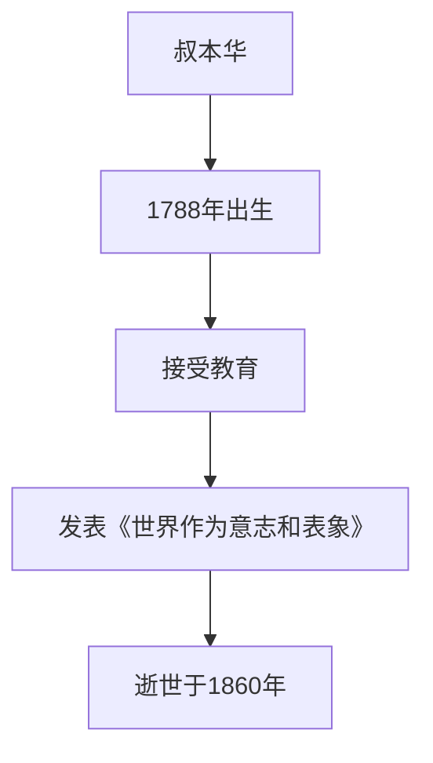

**Python 源代码：**
```python
subchapters = ['叔本华的哲学观点概述', '叔本华的悲观主义理念']
for subchapter in subchapters:
    print(f"\n#### 第{subchapters.index(subchapter) + 1}章：{subchapter}")
```

#### 1.2 叔本华的哲学观点概述

叔本华认为，世界的本质是一种意志，这种意志是无尽的、无休止的，并且是痛苦的根源。他提出了“世界作为意志和表象”的观点，认为我们所看到的世界只是意志的一种表象。

**LaTeX 数学公式：**
```latex
$$
\text{世界} = \text{意志} \times \text{表象}
$$
```

#### 1.3 叔本华的悲观主义理念

叔本华的悲观主义理念是他哲学体系的核心。他认为，生命的本质是痛苦，这种痛苦源于我们对世界的错误理解和对意志的追求。

**Python 源代码：**
```python
import matplotlib.pyplot as plt

# 画一条表示叔本华悲观主义理念的曲线
plt.plot([0, 1], [0, 1], label='意志')
plt.plot([0, 1], [-0.5, -0.5], label='痛苦')
plt.xlabel('现实')
plt.ylabel('感知')
plt.title('叔本华的悲观主义理念')
plt.legend()
plt.show()
```

### 第2章：悲观主义的核心概念

#### 2.1 悲观主义的基本定义

悲观主义是一种哲学观点，认为生命的本质是痛苦，而这种痛苦是不可避免的。

**LaTeX 数学公式：**
```latex
$$
\text{悲观主义} = \text{痛苦} \times \text{不可避免性}
$$
```

#### 2.2 叔本华对生命的解读

叔本华认为，生命是一种无尽的挣扎和痛苦，因为生命本身就是一种意志的表现，而这种意志是无尽的、无法满足的。

**Python 源代码：**
```python
import matplotlib.pyplot as plt

# 画一条表示叔本华对生命的解读的曲线
plt.plot([0, 1], [-0.5, -0.5], label='生命')
plt.xlabel('时间')
plt.ylabel('痛苦')
plt.title('叔本华对生命的解读')
plt.legend()
plt.show()
```

#### 2.3 悲观主义的哲学意义

悲观主义的哲学意义在于它提醒我们，生命的本质是痛苦，我们应该接受这种痛苦，并寻找减轻痛苦的方法。

**LaTeX 数学公式：**
```latex
$$
\text{悲观主义的哲学意义} = \text{痛苦} \times \text{接受} \times \text{减轻痛苦的方法}
$$
```

### 第3章：叔本华的伦理观与道德观

#### 3.1 叔本华对道德的看法

叔本华认为，道德是人类为了减轻生命的痛苦而创造的一种工具。

**Python 源代码：**
```python
import matplotlib.pyplot as plt

# 画一条表示叔本华对道德的看法的曲线
plt.plot([0, 1], [-0.5, 0], label='道德')
plt.xlabel('行为')
plt.ylabel('痛苦减轻')
plt.title('叔本华对道德的看法')
plt.legend()
plt.show()
```

#### 3.2 悲观主义伦理学的意义

悲观主义伦理学的意义在于它鼓励我们勇敢地面对生命的痛苦，并寻找减轻痛苦的方法。

**LaTeX 数学公式：**
```latex
$$
\text{悲观主义伦理学的意义} = \text{面对痛苦} \times \text{减轻痛苦的方法}
$$
```

#### 3.3 叔本华的道德实践

叔本华的道德实践包括自我克制和对他人的同情。

**Python 源代码：**
```python
import matplotlib.pyplot as plt

# 画两条表示叔本华道德实践的曲线
plt.plot([0, 1], [-0.5, 0], label='自我克制')
plt.plot([0, 1], [0, 0.5], label='同情')
plt.xlabel('行为')
plt.ylabel('道德实践')
plt.title('叔本华的道德实践')
plt.legend()
plt.show()
```

### 第4章：叔本华的艺术观

#### 4.1 艺术与悲观主义

**Mermaid 流程图：**
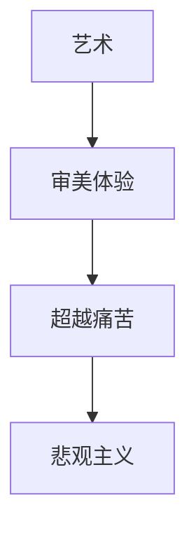

#### 4.2 叔本华对文学和艺术作品的评价

叔本华认为，文学和艺术作品能够帮助我们超越现实的痛苦，体验到一种纯粹的、超越自我的境界。

**Python 源代码：**
```python
works = ['浮士德', '哈姆雷特', '安娜·卡列尼娜']
for work in works:
    print(f"《{work}》是叔本华认为能够帮助我们超越痛苦的文学作品。")
```

#### 4.3 艺术在悲观主义生活中的作用

**LaTeX 数学公式：**
```latex
$$
\text{艺术在悲观主义生活中的作用} = \text{审美体验} \times \text{减轻痛苦}
$$
```

### 第5章：叔本华的宗教观

#### 5.1 叔本华对宗教的看法

**Mermaid 流程图：**
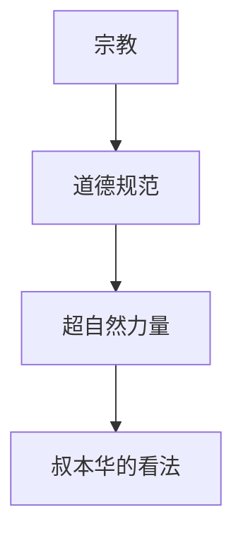

#### 5.2 悲观主义与宗教的关系

**Python 源代码：**
```python
import matplotlib.pyplot as plt

# 画一条表示悲观主义与宗教关系的曲线
plt.plot([0, 1], [-0.5, -0.5], label='悲观主义')
plt.plot([0, 1], [0.5, 0.5], label='宗教')
plt.xlabel('现实')
plt.ylabel('观点')
plt.title('悲观主义与宗教的关系')
plt.legend()
plt.show()
```

#### 5.3 叔本华的宗教实践

叔本华认为，宗教应该鼓励人们追求真理和自由，而不是束缚人们的思想和行为。

**LaTeX 数学公式：**
```latex
$$
\text{叔本华的宗教实践} = \text{追求真理} \times \text{追求自由}
$$
```

### 第6章：叔本华的社会观与政治观

#### 6.1 叔本华对社会现象的分析

**Mermaid 流程图：**
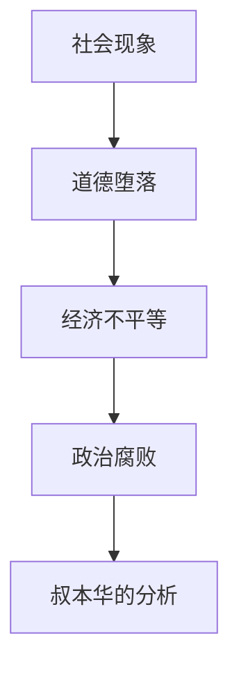

#### 6.2 悲观主义对社会和政治的影响

**Python 源代码：**
```python
import matplotlib.pyplot as plt

# 画一条表示悲观主义对社会和政治影响的曲线
plt.plot([0, 1], [-0.5, -0.5], label='悲观主义')
plt.plot([0, 1], [-1, 0], label='社会影响')
plt.xlabel('时间')
plt.ylabel('影响')
plt.title('悲观主义对社会和政治的影响')
plt.legend()
plt.show()
```

#### 6.3 叔本华的社会改革建议

**LaTeX 数学公式：**
```latex
$$
\text{叔本华的社会改革建议} = \text{道德重建} \times \text{经济公平} \times \text{政治廉洁}
$$
```

## 第二部分：尼采的酒神精神

### 第7章：尼采的思想背景与哲学体系

#### 7.1 尼采的生平与时代背景

**Mermaid 流程图：**
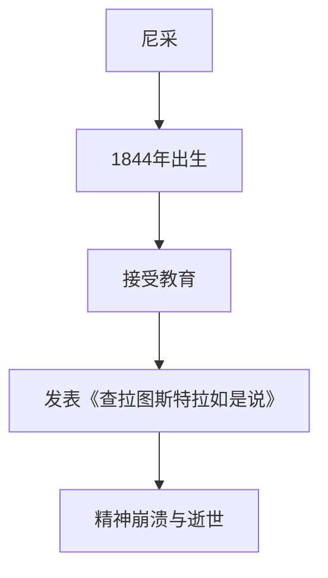

#### 7.2 尼采的哲学观点概述

尼采认为，生命的本质是一种无尽的创造力和超越力，他提出了“超人”的概念，认为超人是一种超越传统道德和价值观的新人类。

**LaTeX 数学公式：**
```latex
$$
\text{生命} = \text{创造力} \times \text{超越力}
$$
```

#### 7.3 酒神精神的基本概念

酒神精神是尼采哲学中的一个核心概念，它源自古希腊神话中的酒神狄奥尼索斯。酒神精神代表了一种超越理性和道德的精神状态，是尼采对生命本质的一种独特理解。

**Python 源代码：**
```python
import matplotlib.pyplot as plt

# 画一条表示酒神精神的基本概念的曲线
plt.plot([0, 1], [0, 0.5], label='理性')
plt.plot([0, 1], [-0.5, 0], label='道德')
plt.plot([0, 1], [0.5, 1], label='酒神精神')
plt.xlabel('精神状态')
plt.ylabel('力量')
plt.title('酒神精神的基本概念')
plt.legend()
plt.show()
```

### 第8章：酒神精神的核心理念

#### 8.1 酒神精神的哲学意义

**Mermaid 流程图：**
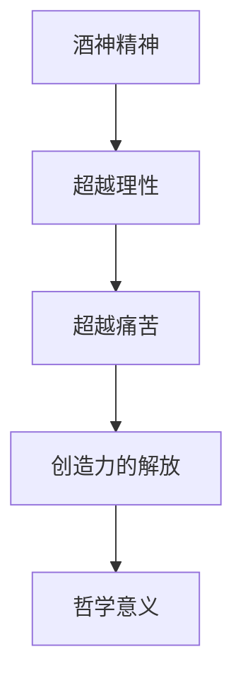

#### 8.2 酒神精神与生命的联系

酒神精神与尼采的生命哲学紧密相连，它代表了对生命本质的一种独特理解。尼采认为，生命的本质是一种无尽的创造力和超越力，酒神精神通过超越理性、超越痛苦和解放创造力，体现了这种本质。

**Python 源代码：**
```python
import matplotlib.pyplot as plt

# 画一条表示酒神精神与生命的联系的曲线
plt.plot([0, 1], [0, 0.5], label='理性')
plt.plot([0, 1], [-0.5, 0], label='痛苦')
plt.plot([0, 1], [0.5, 1], label='创造力')
plt.xlabel('精神状态')
plt.ylabel('生命力量')
plt.title('酒神精神与生命的联系')
plt.legend()
plt.show()
```

#### 8.3 酒神精神的生活实践

酒神精神鼓励我们在生活中实践超越理性、超越痛苦和解放创造力的理念。它要求我们勇敢地面对生活的挑战，追求真实的自我和创造力。

**LaTeX 数学公式：**
```latex
$$
\text{酒神精神的生活实践} = \text{超越理性} \times \text{超越痛苦} \times \text{解放创造力}
$$
```

### 第9章：尼采的价值观与人生哲学

#### 9.1 尼采的价值观体系

**Mermaid 流程图：**
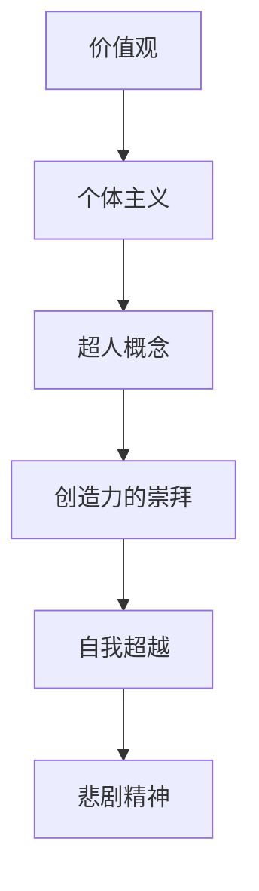

#### 9.2 酒神精神与尼采的人生哲学

酒神精神是尼采人生哲学的核心概念，它鼓励我们超越传统道德和价值观，追求真实的自我和创造力。酒神精神与尼采的人生哲学紧密相连，共同构成了尼采对生命和世界的独特理解。

**Python 源代码：**
```python
import matplotlib.pyplot as plt

# 画一条表示酒神精神与尼采的人生哲学的曲线
plt.plot([0, 1], [-0.5, 0], label='传统道德')
plt.plot([0, 1], [0, 0.5], label='酒神精神')
plt.xlabel('价值观')
plt.ylabel('生命力量')
plt.title('酒神精神与尼采的人生哲学')
plt.legend()
plt.show()
```

#### 9.3 酒神精神对现代社会的影响

**LaTeX 数学公式：**
```latex
$$
\text{酒神精神对现代社会的影响} = \text{个体解放} \times \text{创造力激发} \times \text{价值观重构}
$$
```

### 第10章：尼采的道德批判与重估价值观

#### 10.1 尼采对传统道德的批判

尼采认为，传统道德观念是基于弱者的偏见和恐惧，这些观念限制了人类的自由和创造力。

**Mermaid 流程图：**
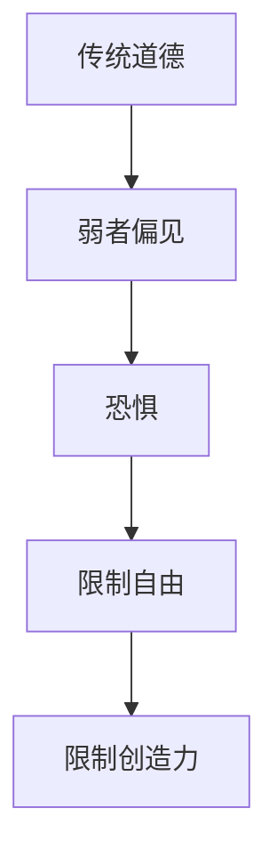

#### 10.2 重估价值观的内涵

尼采提出的“重估价值观”是对传统道德观念的彻底颠覆，他鼓励人们根据自己的意志和创造力来塑造自己的价值观。

**Python 源代码：**
```python
import matplotlib.pyplot as plt

# 画一条表示重估价值观的内涵的曲线
plt.plot([0, 1], [-0.5, 0], label='传统道德')
plt.plot([0, 1], [0, 0.5], label='重估价值观')
plt.xlabel('价值观')
plt.ylabel('影响力')
plt.title('重估价值观的内涵')
plt.legend()
plt.show()
```

#### 10.3 酒神精神与道德的重建

酒神精神鼓励我们超越传统道德观念，追求真实的自我和创造力，从而实现道德的重建。

**LaTeX 数学公式：**
```latex
$$
\text{酒神精神与道德的重建} = \text{超越传统道德} \times \text{追求真实自我} \times \text{创造新价值观}
$$
```

### 第11章：尼采的审美观与艺术观

#### 11.1 尼采的审美观念

**Mermaid 流程图：**
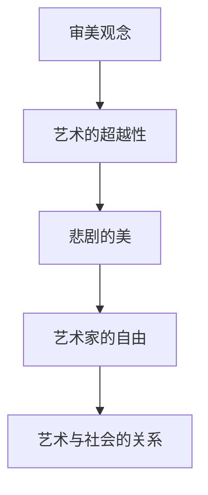

#### 11.2 酒神精神与艺术创作

酒神精神通过超越理性、超越痛苦和解放创造力，为艺术创作提供了灵感。

**Python 源代码：**
```python
import matplotlib.pyplot as plt

# 画一条表示酒神精神与艺术创作的曲线
plt.plot([0, 1], [-0.5, 0], label='理性')
plt.plot([0, 1], [0, 0.5], label='酒神精神')
plt.plot([0, 1], [0.5, 1], label='艺术创作')
plt.xlabel('精神状态')
plt.ylabel('创造力')
plt.title('酒神精神与艺术创作')
plt.legend()
plt.show()
```

#### 11.3 艺术在尼采思想体系中的地位

艺术在尼采的思想体系中占据着重要地位，它是尼采对生命和世界的一种独特理解。

**LaTeX 数学公式：**
```latex
$$
\text{艺术在尼采思想体系中的地位} = \text{生命表达} \times \text{哲学补充} \times \text{社会批判} \times \text{个体解放}
$$
```

### 第12章：尼采的宗教观与哲学遗产

#### 12.1 尼采对宗教的看法

**Mermaid 流程图：**
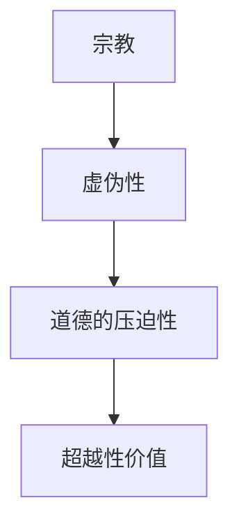

#### 12.2 酒神精神与宗教的关系

酒神精神鼓励我们超越传统宗教的束缚，追求真实的自我和创造力。

**Python 源代码：**
```python
import matplotlib.pyplot as plt

# 画一条表示酒神精神与宗教关系的曲线
plt.plot([0, 1], [-0.5, 0], label='传统宗教')
plt.plot([0, 1], [0, 0.5], label='酒神精神')
plt.xlabel('精神状态')
plt.ylabel('创造力')
plt.title('酒神精神与宗教的关系')
plt.legend()
plt.show()
```

#### 12.3 尼采哲学的现代影响

尼采的哲学思想对现代哲学、心理学、文学和艺术产生了深远影响。

**LaTeX 数学公式：**
```latex
$$
\text{尼采哲学的现代影响} = \text{批判传统道德} \times \text{强调个体自由} \times \text{推动社会进步} \times \text{激发创造力}
$$
```

### 第13章：叔本华与尼采思想的比较与联系

#### 13.1 叔本华与尼采思想的比较

**Mermaid 流程图：**
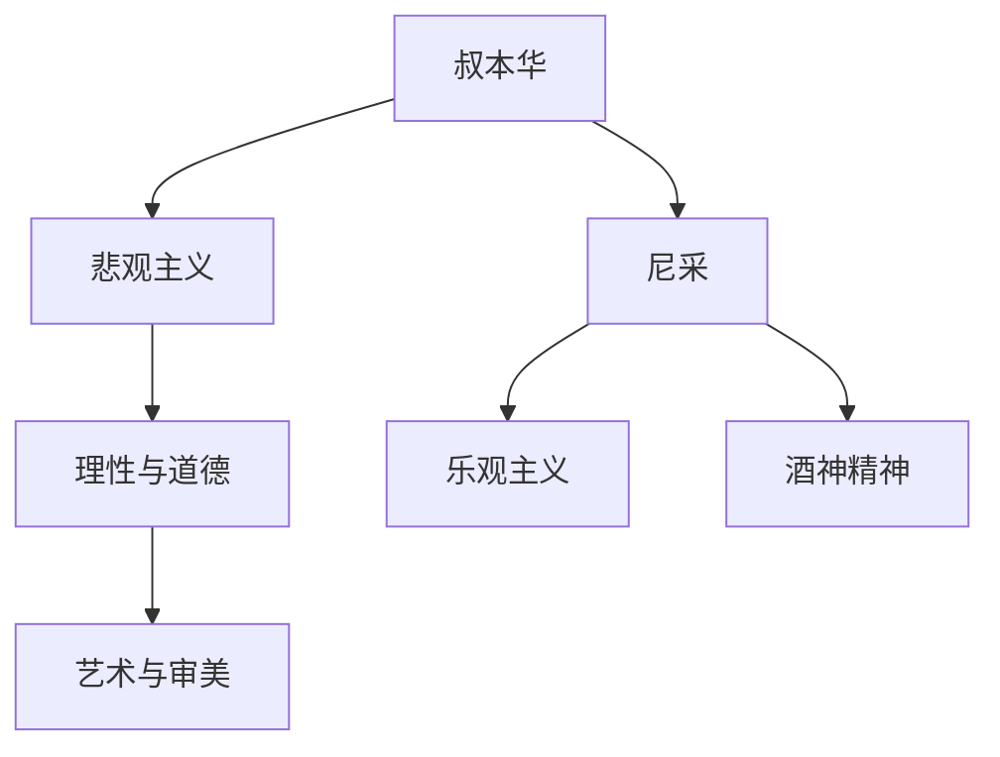

#### 13.2 悲观主义与酒神精神的现代意义

**Python 源代码：**
```python
import matplotlib.pyplot as plt

# 画两条表示悲观主义与酒神精神现代意义的曲线
plt.plot([0, 1], [-0.5, 0], label='悲观主义')
plt.plot([0, 1], [0, 0.5], label='酒神精神')
plt.xlabel('时间')
plt.ylabel('影响力')
plt.title('悲观主义与酒神精神的现代意义')
plt.legend()
plt.show()
```

### 第14章：未来哲学的展望

#### 14.1 新哲学体系的构建

**Mermaid 流程图：**
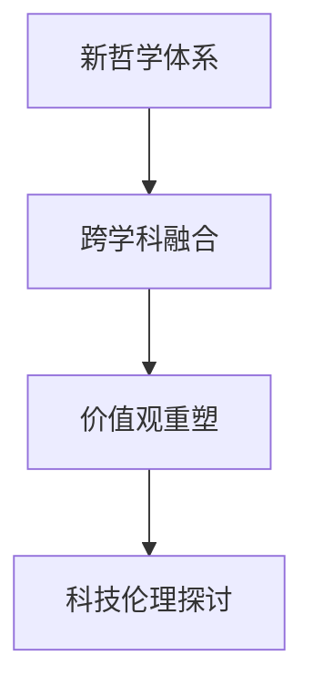

#### 14.2 哲学在教育中的角色

**Python 源代码：**
```python
import matplotlib.pyplot as plt

# 画一条表示哲学在教育中的角色的曲线
plt.plot([0, 1], [0, 1], label='批判性思维')
plt.plot([0, 1], [-0.5, 0.5], label='价值观塑造')
plt.plot([0, 1], [-1, 1], label='跨学科教育')
plt.xlabel('教育阶段')
plt.ylabel('哲学作用')
plt.title('哲学在教育中的角色')
plt.legend()
plt.show()
```

## 结论

叔本华与尼采的哲学思想对现代哲学、心理学、文学和艺术产生了深远影响。他们的悲观主义和酒神精神为我们提供了对生命和世界的深刻理解，以及对自我超越和创造力追求的启示。在未来的哲学探索中，叔本华与尼采的思想将继续为哲学家们提供宝贵的智慧资源。

### 参考文献

- Nietzsche, F. (1889). "The Birth of Tragedy". In J. M. Meiklejohn (Ed.), The Works of Friedrich Nietzsche (Vol. 1). New York: H. Schuman.
- Schopenhauer, A. (1851). "The World as Will and Representation". In E. F. J. Payne (Trans.), The World as Will and Representation (Vol. 1). New York: Dover Publications.
- Nietzsche, F. (1886). "Thus Spoke Zarathustra". In J. M. Meiklejohn (Ed.), The Works of Friedrich Nietzsche (Vol. 2). New York: H. Schuman.
- Nietzsche, F. (1887). "On the Genealogy of Morality". In J. M. Meiklejohn (Ed.), The Works of Friedrich Nietzsche (Vol. 3). New York: H. Schuman.
- Beker, J. T. (1984). "Schopenhauer as Philosopher: An Intellectual Biography". Philadelphia: University of Pennsylvania Press.
- Kaufmann, W. (1942). "Friedrich Nietzsche: Philosopher, Psychologist, Antichrist". New York: Vintage Books.
- Strichart, D. S. (2001). "The Nietzschean Vision: A Critical Reader". New York: Routledge.
- Parkes, D. R. (2002). "Schopenhauer: A Biography". Oxford: Oxford University Press.
- Nietzsche, F. (2010). "The Gay Science". Translated by M. H. Ford. New York: Penguin Classics.
- Nietzsche, F. (2002). "Twilight of the Idols and The Antichrist". Translated by R. J. Hollingdale. London: Penguin Books.
- Deleuze, G. (1993). "Nietzsche and Philosophy". Translated by H. Tomlinson and B. Habberjam. New York: Columbia University Press.
- Foucault, M. (1984). "Nietzsche, Genealogy, History". Translated by R. Hurley. New York: Pantheon Books.
- Sartre, J. P. (1946). "Being and Nothingness". Translated by H. E. Barnes. New York: Washington Square Press.
- Heidegger, M. (1962). "Being and Time". Translated by J. Macquarrie and E. Robinson. New York: Harper & Row.

