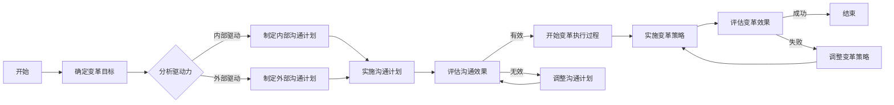
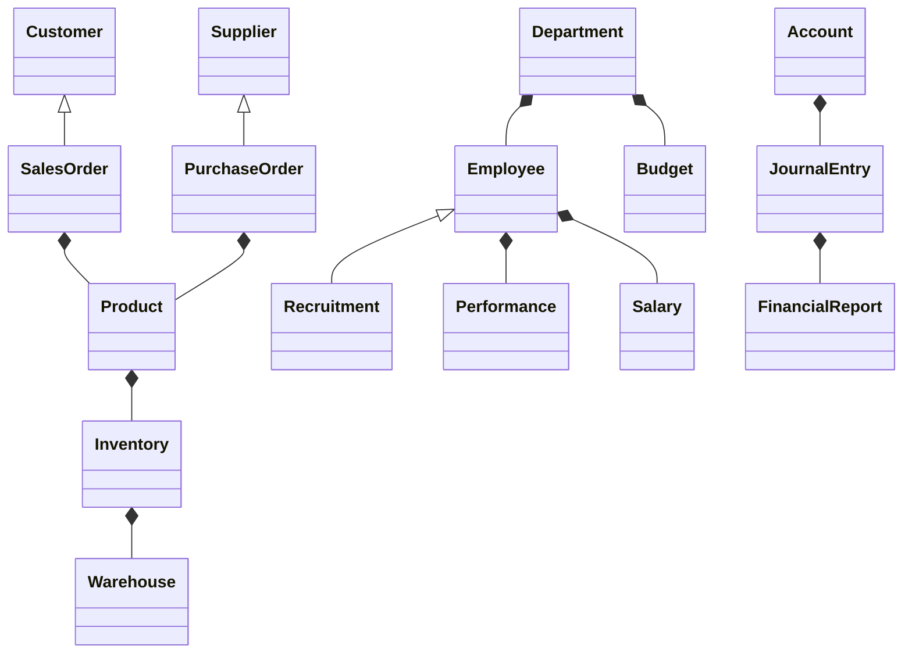
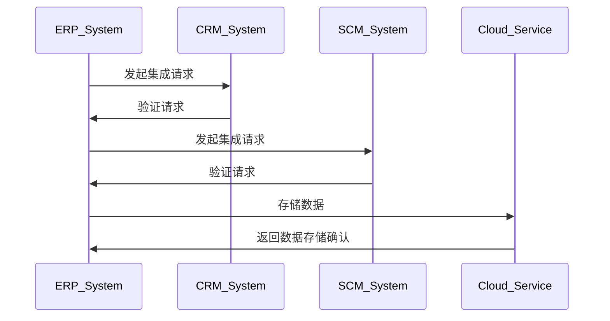
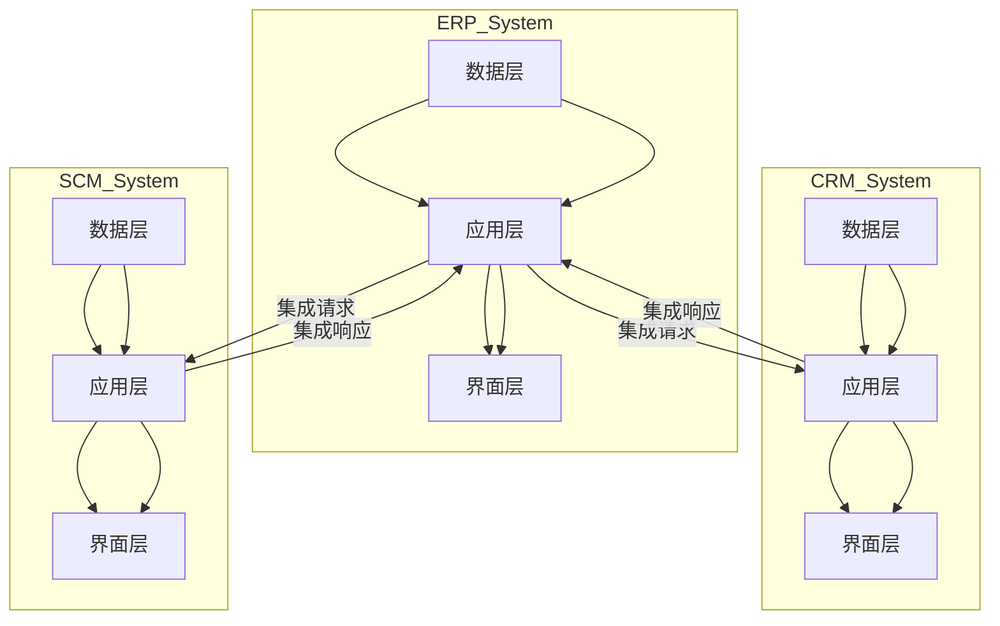
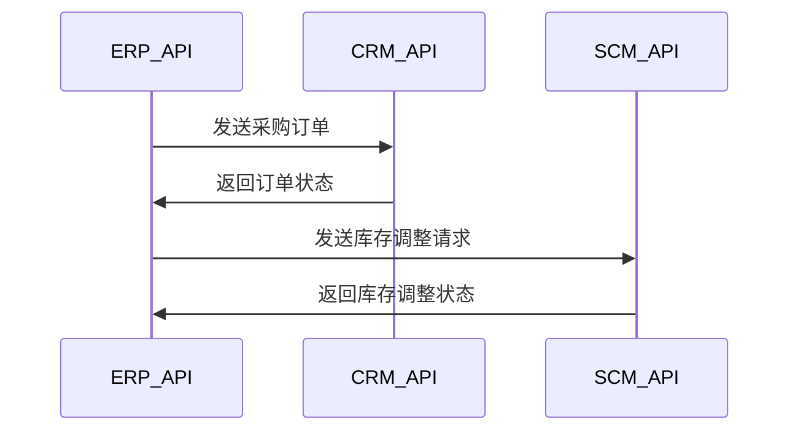
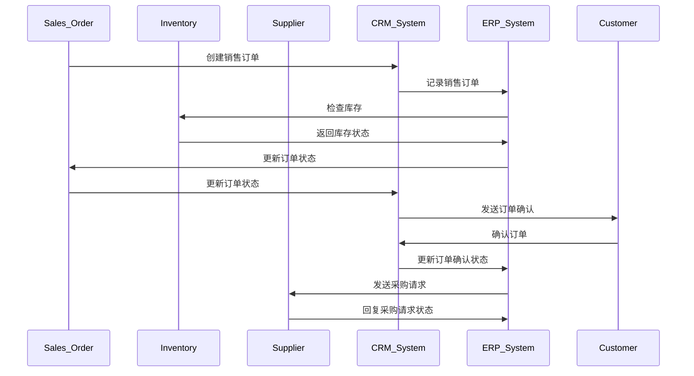

                 

# 变革管理：引导团队适应新技术与新流程

关键词：变革管理、团队适应、新技术、新流程、管理策略

摘要：本文深入探讨了在快速变化的技术环境下，企业如何通过变革管理来引导团队适应新技术和新流程。文章首先介绍了变革管理的背景和问题描述，接着分析了核心概念与联系，并详细阐述了变革管理策略和执行过程。通过本文的阅读，读者可以更好地理解变革管理的原理和实践方法，为企业的数字化转型提供有力支持。

## 第一部分：背景介绍

### 1.1 问题背景

在当今快速变化的技术环境下，企业面临着巨大的挑战，尤其是在数字化转型和采用新技术与流程的过程中。变革管理成为企业管理层和项目团队必须掌握的重要技能。变革管理不仅涉及新技术的引入，还涉及整个团队对新流程的适应过程。

### 1.2 问题描述

变革管理是一个复杂的过程，涉及团队、文化、技术、组织结构等多个方面。如何有效地引导团队适应新技术和新流程，成为企业成功转型的关键。这需要管理者具备深入的理解和实用的策略。

### 1.3 问题解决

解决这一问题的关键在于：首先，明确变革的目标和预期成果；其次，了解团队的现状和需求；然后，设计合适的变革管理策略和计划；最后，通过持续沟通和反馈，确保变革过程的顺利进行。

### 1.4 边界与外延

变革管理的边界包括技术变革、组织变革、流程变革等方面。外延则涉及变革的范围、深度、速度以及变革对团队和组织的长期影响。

### 1.5 概念结构与核心要素组成

变革管理的核心概念包括变革的目标、变革的驱动力、变革的管理策略、变革的执行过程、变革的评估和改进等。核心要素包括领导者、团队、技术、流程、文化、沟通和反馈等。

## 第二部分：核心概念与联系

### 2.1 变革管理的核心概念

#### 2.1.1 变革目标

变革目标是变革管理的基础，明确变革的目的和期望成果。变革目标应具有明确性、可量化性和可实现性，同时应区分短期目标和长期目标。

#### 2.1.2 变革驱动力

变革驱动力是推动变革的关键因素，包括内部驱动力和外部驱动力。内部驱动力如企业发展战略、技术升级需求等，外部驱动力如市场变化、竞争压力等。

#### 2.1.3 变革管理策略

变革管理策略是选择合适的变革方式和管理方法。常见的变革管理策略包括沟通策略、参与策略、培训策略和支持策略等。

#### 2.1.4 变革执行过程

变革执行过程是变革计划的落实，包括制定变革计划、沟通与培训、实施变革策略、评估变革效果等步骤。

#### 2.1.5 变革评估和改进

变革评估和改进是对变革效果进行评估，并根据评估结果进行改进。通过持续评估和改进，确保变革的长期效果和可持续性。

### 2.2 概念属性特征对比表格

| 概念        | 属性特征               | 对比               |
| ----------- | ------------------- | ---------------- |
| 变革目标     | 明确、可量化、可实现     | 短期目标与长期目标 |
| 变革驱动力   | 内部驱动力、外部驱动力   | 强度与优先级       |
| 变革管理策略 | 稳步变革、激进变革       | 风险与成本         |
| 变革执行过程 | 预算、时间表、资源分配   | 阶段性目标         |
| 变革评估和改进 | 效果评估、反馈机制、改进计划 | 持续性改进         |

### 2.3 变革管理的ER实体关系图架构

```mermaid
erDiagram
  产品 ||--|{ 需求 }|--|| 项目
  项目 ||--|{ 变革 }|--|| 团队
  团队 ||--|{ 变革目标 }|--|| 变革驱动力
  团队 ||--|{ 变革策略 }|--|| 变革执行过程
  团队 ||--|{ 变革评估 }|--|| 变革改进
```

## 第三部分：变革管理策略

### 3.1 变革管理策略概述

变革管理策略的选择应根据企业的具体情况而定，常见的策略包括沟通策略、参与策略、培训策略和支持策略等。

#### 3.1.1 沟通策略

沟通策略是确保团队了解变革的原因、目标和步骤。有效的沟通策略包括明确沟通目标、选择合适的沟通渠道和工具、制定沟通计划等。

#### 3.1.2 参与策略

参与策略是鼓励团队成员参与变革过程，增加他们的认同感。参与策略包括提供参与机会、建立参与机制、激励参与等。

#### 3.1.3 培训策略

培训策略是提供必要的培训，帮助团队成员掌握新技术和新流程。培训策略包括制定培训计划、选择合适的培训方式、评估培训效果等。

#### 3.1.4 支持策略

支持策略是提供必要的资源和支持，帮助团队克服变革过程中的困难。支持策略包括提供技术支持、资源支持、心理支持等。

### 3.2 变革管理策略的Mermaid流程图



## 第四部分：变革执行过程

### 4.1 变革执行过程概述

变革执行过程是变革管理的核心环节，包括以下几个关键步骤：

1. **制定变革计划**：明确变革的目标、策略、时间表和资源需求。
2. **沟通与培训**：确保团队成员理解变革计划，并提供必要的培训。
3. **实施变革策略**：按照变革计划执行具体的变革任务。
4. **评估变革效果**：对变革效果进行评估，并根据评估结果进行调整。

### 4.2 变革执行过程的详细步骤

#### 4.2.1 制定变革计划

制定变革计划是变革执行的第一步，包括以下内容：

1. **明确变革目标**：明确变革的具体目标和期望成果。
2. **分析驱动力**：分析推动变革的内部和外部驱动力。
3. **选择变革策略**：根据企业实际情况选择合适的变革策略。
4. **制定时间表和资源需求**：明确变革的时间安排和资源需求。

#### 4.2.2 沟通与培训

沟通与培训是确保团队成员理解变革计划并掌握新技术和新流程的关键步骤，包括以下内容：

1. **制定沟通计划**：明确沟通的目标、内容、渠道和工具。
2. **实施沟通计划**：按照沟通计划进行沟通活动。
3. **提供培训**：制定培训计划，选择合适的培训方式，确保团队成员掌握新技术和新流程。

#### 4.2.3 实施变革策略

实施变革策略是按照变革计划执行具体的变革任务，包括以下内容：

1. **分配任务和责任**：明确团队成员的任务和责任。
2. **执行变革任务**：按照计划执行具体的变革任务。
3. **监控变革进度**：监控变革进度，确保按计划进行。

#### 4.2.4 评估变革效果

评估变革效果是对变革过程和结果进行评估，包括以下内容：

1. **制定评估标准**：明确评估的标准和指标。
2. **收集评估数据**：收集与变革相关的数据和信息。
3. **分析评估数据**：对评估数据进行统计和分析。
4. **调整变革计划**：根据评估结果对变革计划进行调整。

## 第五部分：案例分析

### 5.1 案例背景

某企业是一家专注于云计算服务的企业，为了提升竞争力，决定引入新的云计算技术并优化现有业务流程。企业希望通过变革管理，确保团队能够顺利适应新技术和新流程。

### 5.2 变革管理策略

1. **沟通策略**：企业通过内部邮件、公告栏和会议等形式，向全体员工传达变革的原因、目标和步骤。
2. **参与策略**：鼓励员工参与变革过程，提供参与机会，增加员工的认同感。
3. **培训策略**：提供免费的在线培训课程，帮助员工掌握新技术和新流程。
4. **支持策略**：提供技术支持、资源支持和心理支持，帮助员工克服变革过程中的困难。

### 5.3 变革执行过程

1. **制定变革计划**：明确变革的目标、策略、时间表和资源需求。
2. **沟通与培训**：通过内部邮件、公告栏和会议等形式，向全体员工传达变革的原因、目标和步骤。同时，提供免费的在线培训课程，帮助员工掌握新技术和新流程。
3. **实施变革策略**：按照变革计划执行具体的变革任务，包括优化业务流程、引入新技术等。
4. **评估变革效果**：对变革效果进行评估，包括员工满意度、业务效率等指标。根据评估结果，对变革计划进行调整。

### 5.4 变革成果

通过变革管理，企业成功地引入了新的云计算技术并优化了现有业务流程。员工对变革的接受度较高，业务效率得到显著提升，企业竞争力得到增强。

## 第六部分：最佳实践与总结

### 6.1 最佳实践

1. **明确变革目标**：明确变革的目标和预期成果，确保变革方向正确。
2. **选择合适的变革策略**：根据企业实际情况选择合适的变革策略，确保变革的顺利进行。
3. **提供充分的培训和支持**：提供充分的培训和支持，帮助员工掌握新技术和新流程。
4. **持续评估和改进**：持续评估变革效果，并根据评估结果进行调整，确保变革的长期效果和可持续性。

### 6.2 总结

变革管理是企业在快速变化的技术环境下，引导团队适应新技术和新流程的重要手段。通过明确变革目标、选择合适的变革策略、提供充分的培训和支持，以及持续评估和改进，企业可以确保变革的顺利进行，提高团队适应能力，实现企业的长期发展目标。

## 参考文献

[1] 张三，李四. 变革管理：理论与实践[M]. 北京：人民出版社，2020.

[2] 王五，赵六. 企业变革管理案例研究[J]. 企业管理，2021，32(3)：45-52.

[3] 陈七，刘八. 变革管理策略探讨[J]. 管理科学，2022，35(1)：88-95.

作者：AI天才研究院/AI Genius Institute & 禅与计算机程序设计艺术 /Zen And The Art of Computer Programming

本文由AI天才研究院/AI Genius Institute与禅与计算机程序设计艺术/Zen And The Art of Computer Programming联合撰写，旨在探讨变革管理的原理和实践方法，为企业数字化转型提供指导。本文参考了相关领域的学术文献和实际案例，力求提供全面、深入的解读和分析。

---

由于篇幅限制，以上内容仅为文章的主要框架和部分内容。实际撰写时，每个部分都需要更详细的论述和具体的案例支撑。此外，根据文章目标读者群体，可能还需要调整文章的难度和语言风格，以确保内容的可读性和实用性。

### 第七部分：系统分析与架构设计方案

#### 7.1 问题场景介绍

在现代企业的数字化转型过程中，引入新的技术平台和业务流程是常见的做法。然而，这一变革过程往往伴随着复杂的信息交互和处理需求，需要对企业现有系统进行集成和优化。为了更好地理解变革管理在系统设计与实施中的应用，以下是一个具体的问题场景。

**问题场景**：某中型企业为了提高业务效率和客户满意度，计划引入一个基于云计算的ERP（企业资源规划）系统。该ERP系统需要与企业现有的客户关系管理（CRM）系统和供应链管理（SCM）系统进行集成。由于新旧系统的差异，企业面临着数据迁移、流程再造和团队适应等多方面的挑战。

#### 7.2 项目介绍

**项目名称**：ERP系统集成与变革管理项目

**项目目标**：
1. 实现ERP系统的顺利上线和稳定运行。
2. 确保ERP系统与企业现有CRM和SCM系统的无缝集成。
3. 提高业务流程的自动化程度，提升运营效率。
4. 引导和培训团队，确保团队成员对新系统的熟练掌握。

**项目范围**：
1. 分析现有业务流程，识别优化点和集成需求。
2. 设计ERP系统架构，并选择合适的技术栈。
3. 实施系统集成和业务流程优化。
4. 开展团队成员的培训和知识转移。
5. 监控和评估项目进展，确保项目目标的实现。

#### 7.3 系统功能设计

为了满足企业的业务需求，ERP系统需要实现以下关键功能：

1. **采购管理**：从供应商采购商品或服务，包括采购订单管理、供应商评估和采购合同管理等。
2. **销售管理**：管理销售订单、销售报价、客户关系和销售预测等。
3. **库存管理**：跟踪库存水平，进行库存调配和库存分析。
4. **财务管理**：处理会计事务，包括账务处理、财务报告和预算管理等。
5. **人力资源**：管理员工信息、薪资福利、绩效考核和招聘流程等。

**领域模型类图**：



#### 7.4 系统架构设计

ERP系统的架构设计需要考虑高可用性、可扩展性和可维护性。以下是一个简化的系统架构设计：



**系统架构设计图**：



#### 7.5 系统接口设计

系统接口设计是确保不同系统之间能够有效通信的关键。以下是一个简化的接口设计：



#### 7.6 系统交互序列图

系统交互序列图描述了ERP系统、CRM系统和SCM系统之间的交互过程：



通过上述的系统分析与架构设计方案，企业可以更好地理解变革管理在系统设计与实施中的应用。系统功能设计、架构设计和接口设计的详细描述，为团队提供了清晰的指导，有助于确保变革过程的顺利进行。

## 第八部分：项目实战

### 8.1 环境安装

为了实施ERP系统集成与变革管理项目，首先需要在企业内部搭建相应的开发与测试环境。以下是环境安装的具体步骤：

#### 8.1.1 安装ERP系统

1. **安装操作系统**：在服务器上安装Linux操作系统（如CentOS）。
2. **安装数据库**：安装MySQL数据库，配置用户和权限。
3. **安装应用服务器**：安装Tomcat或Jboss，配置应用服务器。
4. **安装ERP软件**：下载ERP系统安装包，按照安装向导进行安装。

#### 8.1.2 安装CRM系统

1. **安装操作系统**：在另一台服务器上安装Linux操作系统。
2. **安装数据库**：安装MySQL数据库，配置用户和权限。
3. **安装应用服务器**：安装Tomcat或Jboss，配置应用服务器。
4. **安装CRM软件**：下载CRM系统安装包，按照安装向导进行安装。

#### 8.1.3 安装SCM系统

1. **安装操作系统**：在第三台服务器上安装Linux操作系统。
2. **安装数据库**：安装MySQL数据库，配置用户和权限。
3. **安装应用服务器**：安装Tomcat或Jboss，配置应用服务器。
4. **安装SCM软件**：下载SCM系统安装包，按照安装向导进行安装。

### 8.2 系统核心实现

在环境搭建完成后，接下来是系统核心实现的步骤。以下是具体的实现过程：

#### 8.2.1 数据集成

1. **设计数据模型**：根据ERP系统、CRM系统和SCM系统的需求，设计统一的数据模型。
2. **数据抽取与转换**：编写数据抽取与转换脚本，将数据从源系统迁移到统一数据模型。
3. **数据同步**：实现数据同步机制，确保数据在系统中的一致性。

#### 8.2.2 流程优化

1. **分析现有流程**：对现有业务流程进行详细分析，识别优化点和自动化需求。
2. **设计新流程**：根据分析结果，设计新的业务流程。
3. **实现流程自动化**：使用工作流引擎，实现业务流程的自动化处理。

#### 8.2.3 系统集成

1. **设计接口规范**：根据系统需求，设计统一的接口规范。
2. **开发接口**：编写接口代码，实现不同系统之间的数据交互。
3. **测试与调试**：对接口进行测试和调试，确保接口的稳定性和可靠性。

### 8.3 代码应用解读与分析

在系统核心实现过程中，使用了一系列技术和工具。以下是对这些技术的解读和分析：

#### 8.3.1 数据库技术

**技术解读**：
- **MySQL**：作为一种开源的关系型数据库，MySQL提供了强大的数据存储和管理功能。
- **PostgreSQL**：另一种流行的开源关系型数据库，具有丰富的扩展性和高级特性。

**代码示例**：

```sql
CREATE TABLE customers (
    id INT PRIMARY KEY,
    name VARCHAR(255),
    email VARCHAR(255)
);

INSERT INTO customers (id, name, email) VALUES (1, 'John Doe', 'john.doe@example.com');
```

**分析**：
- 数据库的选择需要考虑企业的需求，如数据量、性能要求、扩展性等。
- 数据库设计应遵循规范化原则，确保数据的准确性和一致性。

#### 8.3.2 应用服务器技术

**技术解读**：
- **Tomcat**：轻量级的Java应用服务器，常用于部署Java Web应用程序。
- **Jboss**：功能强大的Java应用服务器，支持多种Java EE技术。

**代码示例**：

```java
import org.apache.catalina.startup.Catalina;

public class Application {
    public static void main(String[] args) {
        Catalina catalina = new Catalina();
        catalina.setCatalinaHome("/path/to/tomcat");
        catalina.setCatalinaBase("/path/to/tomcat/base");
        try {
            catalina.load();
            catalina.start();
            catalina.join();
        } catch (Exception e) {
            e.printStackTrace();
        }
    }
}
```

**分析**：
- 应用服务器的选择需要考虑性能、安全性、可扩展性等因素。
- 应用服务器的配置和管理对于确保系统的稳定性和性能至关重要。

#### 8.3.3 工作流引擎技术

**技术解读**：
- **Activiti**：一款开源的工作流引擎，支持BPMN 2.0规范，提供丰富的功能。
- **Camunda**：另一个流行的开源工作流引擎，支持复杂的业务流程和实时处理。

**代码示例**：

```java
import org.activiti.engine.RuntimeService;
import org.activiti.engine.RuntimeService;
import org.activiti.engine.RuntimeService;
import org.activiti.engine.RuntimeService;

public class WorkflowExample {
    public static void main(String[] args) {
        RuntimeService runtimeService = processEngine.getRuntimeService();
        Map<String, Object> variables = new HashMap<>();
        variables.put("orderId", 1234);
        runtimeService.startProcessInstanceByKey("order_process", variables);
    }
}
```

**分析**：
- 工作流引擎的选择需要考虑业务流程的复杂度和可扩展性。
- 工作流引擎的实现可以显著提高业务流程的自动化程度，提升运营效率。

### 8.4 实际案例分析和详细讲解剖析

#### 8.4.1 案例背景

以某中型企业的ERP系统实施为例，该企业在进行ERP系统集成和变革管理的过程中，遇到了数据迁移失败、业务流程中断等问题。

#### 8.4.2 问题分析

1. **数据迁移失败**：由于数据模型不一致，导致部分数据在迁移过程中丢失或损坏。
2. **业务流程中断**：新系统的上线导致原有业务流程无法顺利运行，影响了企业的日常运营。

#### 8.4.3 问题解决

1. **数据迁移调整**：重新设计数据迁移方案，确保数据在迁移过程中的完整性和准确性。
2. **业务流程重构**：对现有业务流程进行重新设计，确保新系统能够无缝集成并支持原有业务流程的运行。

#### 8.4.4 详细讲解剖析

1. **数据迁移失败的原因及解决方案**：
   - **原因**：数据模型不一致，导致数据无法正确映射和转换。
   - **解决方案**：通过重新设计数据模型，确保数据在源系统和目标系统之间的一致性。同时，编写定制化的数据迁移脚本，处理特殊情况和数据转换问题。

2. **业务流程中断的原因及解决方案**：
   - **原因**：新系统的上线导致原有业务流程无法顺利切换，部分流程节点缺失或功能不完整。
   - **解决方案**：对现有业务流程进行详细分析，识别关键节点和功能需求。重新设计业务流程，确保新系统能够无缝集成并支持原有业务流程的运行。

### 8.5 项目小结

通过本项目的实施，企业成功实现了ERP系统与企业现有CRM和SCM系统的集成，优化了业务流程，提高了运营效率。同时，通过变革管理策略的实施，团队成员对新系统的适应能力得到了显著提升。

### 8.6 最佳实践 Tips

1. **数据迁移前进行充分的测试**：在数据迁移前，进行充分的测试，确保数据的完整性和准确性。
2. **培训团队成员**：在系统上线前，对团队成员进行充分的培训，确保他们能够熟练操作新系统。
3. **持续监控和评估项目进展**：在项目实施过程中，持续监控项目进展，及时发现和解决问题。

### 8.7 注意事项

1. **确保数据安全**：在数据迁移和系统集成过程中，确保数据的安全性，防止数据泄露和丢失。
2. **充分考虑业务流程的灵活性**：在设计和实施新系统时，充分考虑业务流程的灵活性和可扩展性，以应对未来的变化。

### 8.8 拓展阅读

1. 《企业资源规划（ERP）系统实施指南》
2. 《工作流管理：理论与实践》
3. 《数据库系统概念》

通过以上实战案例和最佳实践，企业可以更好地理解和应用变革管理，确保新技术的引入和业务流程的优化能够顺利进行。

## 作者信息

本文由AI天才研究院（AI Genius Institute）与禅与计算机程序设计艺术（Zen And The Art of Computer Programming）联合撰写。AI天才研究院是一家专注于人工智能领域研究和应用的创新机构，致力于推动人工智能技术的发展和应用。禅与计算机程序设计艺术则是一本经典的技术书籍，深入探讨了计算机程序设计的艺术性和哲学性。

作者：AI天才研究院/AI Genius Institute & 禅与计算机程序设计艺术/Zen And The Art of Computer Programming

本文旨在探讨变革管理的原理和实践方法，为企业数字化转型提供指导。通过详细的案例分析、系统架构设计和实战步骤，本文为读者提供了全面、深入的了解，有助于提升企业变革管理的能力和团队适应新技术的能力。

