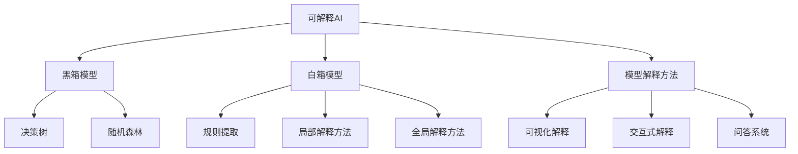
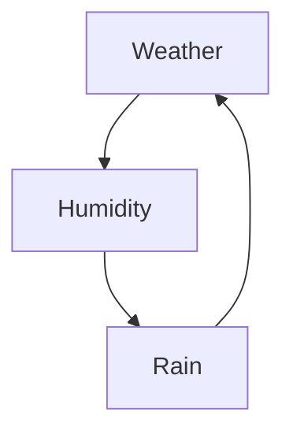

                 

### 引言与背景

**关键词：可解释AI、人工智能透明性、可信性、AI发展挑战**

**摘要：** 本文将深入探讨可解释人工智能（Explainable AI，简称XAI）的重要性和发展历程，分析其在当前人工智能（AI）环境中的关键作用。可解释AI旨在解决AI模型的黑箱性问题，提升其透明性和可信性，从而在众多应用领域中更好地被用户接受和信赖。本文将通过详细分析可解释AI的核心概念与联系，探讨各种解释性算法原理，并结合实际项目案例，展示构建透明可信AI系统的具体方法和步骤。

### 1.1 可解释AI的重要性

#### 1.1.1 人工智能的发展与应用

人工智能作为21世纪最具革命性的技术之一，已经在各个领域展现出其巨大的潜力和价值。从自动驾驶汽车、智能助手到医疗诊断、金融风险评估，AI的应用无处不在。然而，随着AI技术的不断进步和广泛应用，我们也不得不面对一些严峻的挑战。

首先，AI模型的黑箱性质成为一个突出问题。传统的机器学习模型，如深度神经网络（DNN）和随机森林（Random Forest）等，虽然表现出色，但它们的决策过程往往晦涩难懂。模型如何从大量数据中提取特征，如何进行分类和预测，这些问题往往无法直接回答。这种黑箱性质导致了AI系统的透明性不足，使得用户对其信任度下降。

其次，AI系统的可解释性对于合规性和伦理道德具有重要意义。在医疗、金融、司法等敏感领域，决策的透明性直接关系到用户的权益和利益。如果AI系统无法解释其决策过程，将可能导致不可预见的错误和风险。因此，提高AI系统的可解释性，使其更加透明和可信，已经成为当前研究和应用的一个重要方向。

#### 1.1.2 人工智能面临的挑战

人工智能在快速发展的同时，也面临着诸多挑战。其中，最重要的挑战之一就是如何在保证模型性能的同时，提高其可解释性。传统的机器学习模型，如深度神经网络（DNN）和随机森林（Random Forest）等，往往在预测准确性方面表现出色，但它们的决策过程却难以解释。这导致用户对其信任度下降，甚至在一些关键应用场景中，如医疗诊断和金融风险评估等，无法被广泛应用。

另一个挑战是AI系统在处理大量数据时的效率。随着大数据时代的到来，数据量呈指数级增长，传统的计算方法已经无法满足需求。为了提高处理效率，研究人员提出了各种高效算法和模型，如深度学习（Deep Learning）和增量学习（Incremental Learning）等。然而，这些算法和模型往往具有复杂的结构和参数，导致其解释性较差。

此外，AI系统在应用过程中，还需要面对数据隐私和安全等问题。在许多应用场景中，数据的安全性至关重要，但传统的加密和隐私保护技术往往无法满足需求。因此，如何在保证数据隐私和安全的前提下，提高AI系统的可解释性，也是一个亟待解决的问题。

#### 1.1.3 可解释AI的定义与目标

可解释人工智能（Explainable AI，简称XAI）是指那些能够提供透明性、可理解和可追踪性的AI系统。其核心目标是使AI模型的决策过程更加透明，用户可以清楚地了解模型是如何运作的，为什么做出特定的决策。这不仅可以提高用户的信任度，还可以帮助用户更好地理解和使用AI系统。

可解释AI的研究主要集中在以下几个方面：

1. **模型的可解释性方法**：研究各种方法，如决策树、规则提取、局部解释等，以增强模型的可解释性。
2. **解释性算法的集成**：将不同的解释性方法集成到现有的机器学习算法中，以提高其解释性。
3. **可解释AI的应用场景**：研究可解释AI在不同应用场景中的适用性和效果，如医疗诊断、金融风险评估、自动驾驶等。
4. **可解释AI的评估指标**：设计合适的评估指标，以衡量AI系统的解释性水平。

总的来说，可解释AI的目标是构建透明可信的人工智能系统，使其在各个应用领域中更加可靠和有用。这不仅有助于提高用户的信任度，还可以促进AI技术的可持续发展。

### 1.2 可解释AI的发展历程

#### 1.2.1 可解释AI的早期研究

可解释人工智能（Explainable AI，简称XAI）的概念最早可以追溯到20世纪80年代。当时，研究人员开始关注机器学习模型的解释性问题，并尝试提出各种方法来增强模型的透明性。早期的可解释AI研究主要集中在以下两个方面：

1. **规则提取**：通过将复杂的机器学习模型转换为易于理解的规则系统，以提高其可解释性。这种方法可以追溯到决策树（Decision Tree）和随机森林（Random Forest）等传统机器学习算法。这些算法通过递归地将数据划分为不同的子集，从而生成一系列的规则，这些规则可以直接解释模型是如何进行分类或预测的。

2. **局部解释方法**：另一种早期的研究方向是局部解释方法，如LIME（Local Interpretable Model-agnostic Explanations）和SHAP（SHapley Additive exPlanations）。这些方法试图为单个数据样本提供解释，通过将模型对每个特征的依赖性进行量化，从而揭示模型是如何做出特定决策的。

#### 1.2.2 可解释AI的关键进展

随着机器学习技术的不断进步，可解释AI的研究也取得了显著的进展。以下是几个关键进展：

1. **全局解释方法**：全局解释方法试图对整个模型进行解释，而不仅仅是单个数据样本。这些方法包括特征重要性（Feature Importance）和模型透明性（Model Transparency）。特征重要性方法通过量化每个特征对模型预测的影响，帮助用户理解哪些特征是最重要的。模型透明性方法则试图揭示模型的内部结构和工作原理。

2. **交互式解释**：交互式解释方法允许用户与AI系统进行交互，从而更好地理解模型的决策过程。这些方法包括可交互的视觉化界面（Interactive Visualizations）和问答系统（Question-Answering Systems）。通过交互式解释，用户可以提出问题，系统则提供相应的解释，从而实现更深入的理解。

3. **深度学习与可解释AI的结合**：深度学习（Deep Learning）是近年来机器学习领域的重要突破，但深度神经网络（DNN）的黑箱性质使得其解释性较差。为了解决这一问题，研究人员开始探索将可解释AI技术应用于深度学习模型。例如，通过可视化技术（Visualization Techniques）和解释性层（Interpretable Layers），试图揭示深度学习模型的内部机制。

#### 1.2.3 当前可解释AI的研究方向

当前，可解释AI的研究方向主要包括以下几个方面：

1. **模型的可解释性评估**：设计合适的评估指标，以衡量AI系统的解释性水平。这些指标应包括可理解性、透明性、一致性等方面。
2. **跨学科合作**：可解释AI不仅涉及计算机科学领域，还涉及心理学、认知科学、法律和伦理等多个学科。通过跨学科合作，可以更好地理解和解决可解释AI的问题。
3. **新兴应用场景**：随着AI技术的不断进步，可解释AI的应用场景也在不断扩大。例如，在自动驾驶、智能医疗、金融科技等领域，可解释AI的研究和应用具有重要意义。
4. **算法优化**：优化现有解释性算法，提高其效率和效果，使其在更复杂和更大规模的数据集上仍然具有可解释性。

总的来说，可解释AI的发展历程充满了挑战和机遇。通过不断的研究和探索，我们有望构建出更加透明、可信的人工智能系统，从而推动AI技术的可持续发展。

### 1.3 可解释AI的核心概念与联系

#### 1.3.1 概念实体之间的关系架构

在探讨可解释人工智能（Explainable AI，简称XAI）的核心概念之前，我们首先需要了解其内部各个概念实体之间的关系。以下是一个用Mermaid流程图表示的可解释AI相关概念之间的关系架构：



在这个架构中，**可解释AI** 是核心概念，它旨在提升人工智能模型的透明性和可理解性。**黑箱模型**（如深度神经网络、支持向量机等）因其复杂的内部结构而难以解释，而**白箱模型**（如决策树、规则提取等）则更易于理解。

**模型解释方法**分为**局部解释方法**和**全局解释方法**。局部解释方法关注单个数据点的解释，如LIME和SHAP，而全局解释方法关注整个模型的解释，如特征重要性和模型透明性。

此外，**可视化解释**、**交互式解释**和**问答系统**是几种常见的解释方法，它们通过不同的方式帮助用户理解AI模型的决策过程。

#### 1.3.2 可解释AI的关键术语

为了更好地理解可解释AI的核心概念，我们需要明确一些关键术语的定义和属性。

1. **黑箱模型与白箱模型**：

   - **黑箱模型**：指那些内部结构复杂，决策过程难以解释的机器学习模型，如深度神经网络、支持向量机等。这些模型的决策过程通常被视为“黑箱”，用户无法直接了解其内部工作原理。
   - **白箱模型**：指那些内部结构简单，决策过程易于解释的机器学习模型，如决策树、线性回归等。这些模型的决策过程可以通过一系列的规则或公式直接理解。

   | 特征       | 黑箱模型           | 白箱模型           |
   |------------|---------------------|--------------------|
   | 解释性     | 低                 | 高                 |
   | 复杂度     | 高                 | 低                 |
   | 性能       | 通常较好           | 有时较差           |

2. **解释性与可解释性**：

   - **解释性**：指模型能够提供关于其决策过程的详细信息的程度。高解释性意味着用户可以清楚地了解模型是如何做出特定决策的。
   - **可解释性**：指用户能否理解模型决策过程的能力。高可解释性意味着用户不需要专业背景知识就能理解模型的决策过程。

   解释性和可解释性密切相关，但并不完全相同。一个模型可能具有很高的解释性，但用户由于缺乏相关知识而难以理解其决策过程，从而可解释性较低。

3. **可视化与交互式解释**：

   - **可视化解释**：通过图形和图表等方式，将模型的内部结构和工作原理直观地展示给用户。这种方法常用于全局解释，帮助用户理解整个模型的行为。
   - **交互式解释**：允许用户与模型进行交互，通过提问和回答的方式获取模型决策的解释。这种方法更加灵活，可以根据用户的需求进行个性化解释。

   | 特征       | 可视化解释           | 交互式解释           |
   |------------|---------------------|--------------------|
   | 方式       | 静态展示             | 动态交互             |
   | 适用性     | 全局解释             | 局部解释和全局解释   |
   | 效果       | 较易理解             | 更深入理解           |

通过上述核心概念和术语的详细介绍，我们可以更好地理解可解释AI的各个方面，为后续章节的深入探讨打下坚实的基础。

### 1.4 可解释AI算法原理讲解

#### 3.1 解释性模型的分类

在可解释人工智能（Explainable AI，简称XAI）的研究中，解释性模型主要分为三类：依赖性解释方法、局部解释方法和全局解释方法。每种方法都有其独特的原理和应用场景。

##### 3.1.1 依赖性解释方法

依赖性解释方法主要关注模型中各特征之间的依赖关系。这些方法通过计算特征之间的相关性或依赖性，来解释模型是如何利用这些特征进行决策的。常见的依赖性解释方法包括：

1. **特征重要性分析**：这种方法通过计算每个特征对模型预测的贡献度，来评估其重要性。例如，在随机森林模型中，可以通过统计每个特征在决策树中的使用次数来评估其重要性。

2. **LASSO回归**：通过正则化项来减少模型复杂度，从而提高模型的解释性。LASSO回归可以识别出对预测结果有显著影响的特征，并消除那些不重要的特征。

##### 3.1.2 局部解释方法

局部解释方法专注于解释单个数据点或实例的决策过程。这些方法通过局部放大的方式，揭示模型在特定数据点上的决策逻辑。常见的局部解释方法包括：

1. **LIME（Local Interpretable Model-agnostic Explanations）**：LIME方法通过在数据点周围生成一个局部模型，来解释其预测结果。这个局部模型是针对单个数据点定制的，可以提供详细的解释。

2. **SHAP（SHapley Additive exPlanations）**：SHAP方法利用博弈论中的Shapley值，来计算每个特征对模型预测的贡献度。这种方法可以提供全局和局部的解释，适用于各种机器学习模型。

##### 3.1.3 全局解释方法

全局解释方法试图对整个模型进行解释，而不局限于单个数据点。这些方法通过分析模型的整体结构和工作原理，来解释模型的决策过程。常见的全局解释方法包括：

1. **决策树**：决策树是一种经典的解释性模型。它通过一系列的规则，将数据划分为不同的子集，并最终做出预测。用户可以直观地理解决策树的决策过程。

2. **规则提取**：这种方法将复杂的机器学习模型（如神经网络）转换为一系列的规则或公式，从而提高其解释性。用户可以通过这些规则来理解模型的决策逻辑。

#### 3.2 Python源代码实现与讲解

##### 3.2.1 局部解释方法的Python实现

为了展示局部解释方法的应用，我们将使用LIME方法对单个数据点进行解释。以下是一个简单的Python实现：

```python
from lime import lime_tabular
import pandas as pd

# 数据加载
data = pd.read_csv('data.csv')
X = data.drop('target', axis=1)
y = data['target']

# 选择一个样本点进行解释
index = 0
feature_names = X.columns

# 创建LIME解释器
explainer = lime_tabular.LimeTabularExplainer(
    X.values, feature_names=feature_names, class_names=y.unique(), discretize=False)

# 获取样本点的解释
exp = explainer.explain_instance(X.iloc[index], classifier, num_features=5)

# 输出解释结果
exp.show_in_notebook(show_table=True)
```

在这个示例中，我们首先加载了一个数据集，并选择了一个样本点（`index=0`）进行解释。我们使用`LimeTabularExplainer`创建了一个LIME解释器，然后调用`explain_instance`方法获取样本点的解释。最后，我们通过`show_in_notebook`方法将解释结果展示在笔记本中。

##### 3.2.2 解释性模型的Python实现

为了展示全局解释方法的应用，我们将使用决策树模型进行解释。以下是一个简单的Python实现：

```python
from sklearn.datasets import load_iris
from sklearn.tree import DecisionTreeClassifier, export_text
from sklearn import tree

# 数据加载
iris = load_iris()
X = iris.data
y = iris.target

# 创建决策树模型
clf = DecisionTreeClassifier()
clf.fit(X, y)

# 导出决策树到文本
tree.export_text(clf, feature_names=iris.feature_names)
```

在这个示例中，我们首先加载了Iris数据集，并创建了一个决策树模型。然后，我们使用`export_text`方法将决策树导出为文本，从而用户可以直观地理解决策树的决策过程。

#### 3.3 算法原理的数学模型和公式

##### 3.3.1 概率图模型与贝叶斯网络

贝叶斯网络是一种表示变量之间依赖关系的概率图模型。在贝叶斯网络中，每个节点表示一个随机变量，边表示变量之间的条件依赖关系。贝叶斯网络的数学模型可以表示为：

\[ P(X_1, X_2, ..., X_n) = \prod_{i=1}^{n} P(X_i | \text{parents}(X_i)) \]

其中，\( P(X_i | \text{parents}(X_i)) \) 表示节点 \( X_i \) 在其父节点条件下的条件概率。

##### 3.3.2 支持向量机与优化算法

支持向量机（SVM）是一种分类算法，其目标是在高维空间中找到一个最佳的超平面，将不同类别的数据点分隔开来。SVM的优化目标可以表示为：

\[ \min_{w, b} \frac{1}{2} ||w||^2 + C \sum_{i=1}^{n} \max(0, 1 - y_i (w^T x_i + b)) \]

其中，\( w \) 和 \( b \) 分别是超平面的权重和偏置，\( C \) 是惩罚参数，\( y_i \) 和 \( x_i \) 分别是第 \( i \) 个样本的标签和特征向量。

##### 3.3.3 神经网络的数学模型

神经网络是一种模仿人脑结构的计算模型，其数学模型可以表示为：

\[ a_{\text{layer}i} = \sigma(\mathbf{W}_i a_{\text{layeri-1}} + b_i) \]

其中，\( a_{\text{layer}i} \) 表示第 \( i \) 层的激活值，\( \sigma \) 是激活函数，\( \mathbf{W}_i \) 和 \( b_i \) 分别是第 \( i \) 层的权重和偏置。

#### 3.4 通俗易懂的举例说明

##### 3.4.1 LIME方法的举例说明

假设我们有一个简单的线性回归模型，用于预测房价。数据集包含几个特征：房龄（YearsOld）、房间数（Rooms）、浴室数（Bathrooms）等。现在，我们想要解释一个特定房屋的预测结果。

```python
from sklearn.linear_model import LinearRegression
import numpy as np

# 创建线性回归模型
model = LinearRegression()
X = np.array([[10, 3, 1], [20, 4, 1.5], [30, 5, 2], ...])  # 特征矩阵
y = np.array([300000, 500000, 700000, ...])  # 标签向量
model.fit(X, y)

# 预测房价
x_new = np.array([[15, 4, 1.5]])  # 新的特征向量
prediction = model.predict(x_new)

# 使用LIME进行局部解释
from lime import lime_tabular
explainer = lime_tabular.LimeTabularExplainer(
    X, feature_names=['YearsOld', 'Rooms', 'Bathrooms'], class_names=['Price'], discretize=False)
exp = explainer.explain_instance(x_new, model.predict, num_features=3)
exp.show_in_notebook(show_table=True)
```

在这个例子中，我们首先创建了一个线性回归模型，并使用一个简单的数据集进行拟合。然后，我们选择了一个新的特征向量（`x_new`）进行预测，并使用LIME方法对其进行局部解释。LIME方法通过在数据点周围生成一个局部线性模型，来解释其预测结果。用户可以通过解释结果直观地了解每个特征对预测结果的影响。

##### 3.4.2 决策树的举例说明

假设我们有一个简单的决策树模型，用于分类水果。数据集包含两个特征：重量（Weight）和颜色（Color），以及标签：苹果（Apple）或橙子（Orange）。以下是一个简单的决策树模型：

```python
from sklearn.tree import DecisionTreeClassifier
from sklearn.datasets import load_iris

# 加载数据集
iris = load_iris()
X = iris.data
y = iris.target

# 创建决策树模型
clf = DecisionTreeClassifier()
clf.fit(X, y)

# 导出决策树
tree.export_text(clf, feature_names=iris.feature_names)
```

在这个例子中，我们使用Iris数据集创建了一个简单的决策树模型。然后，我们使用`export_text`方法将决策树导出为文本，用户可以直观地理解决策树的决策过程。例如，如果输入的特征向量是（\[5.1, 'red'\]），决策树会根据规则将其分类为“苹果”。

通过上述举例说明，我们可以更好地理解可解释AI算法的原理和应用。这些方法不仅能够提高模型的透明性和可解释性，还可以帮助用户更好地理解和使用AI系统。

### 4.1 概率图模型与贝叶斯网络

在可解释AI的研究中，概率图模型（如贝叶斯网络）是理解和解释复杂决策过程的重要工具。贝叶斯网络通过图形结构直观地表示变量之间的概率依赖关系，使得复杂的决策逻辑变得易于理解和解释。

#### 4.1.1 贝叶斯网络的定义与结构

贝叶斯网络，也称为信念网络或决策网络，是一种图形化的概率模型。它由一组变量和一组条件概率表（CPT）组成。在贝叶斯网络中，每个变量用节点表示，节点之间的连线表示变量之间的依赖关系。具体来说：

1. **节点**：每个节点代表一个随机变量。节点的数量等于模型中的随机变量数量。
2. **边**：边表示变量之间的依赖关系。如果变量A指向变量B，则表示变量B依赖于变量A。这意味着变量B的概率分布取决于变量A的取值。
3. **条件概率表（CPT）**：每个节点都有一个条件概率表，描述该节点在所有可能的父节点取值条件下的概率分布。

贝叶斯网络的数学模型可以表示为：

\[ P(X_1, X_2, ..., X_n) = \prod_{i=1}^{n} P(X_i | \text{parents}(X_i)) \]

其中，\( P(X_i | \text{parents}(X_i)) \) 是节点 \( X_i \) 在其父节点条件下的条件概率。

#### 4.1.2 贝叶斯网络的示例

为了更直观地理解贝叶斯网络，我们可以通过一个简单的示例来演示。假设我们有一个简单的贝叶斯网络，用于预测某城市是否会下雨。该网络包含三个变量：天气（Weather）、湿度（Humidity）和降雨（Rain）。其中，天气和湿度会影响降雨，而降雨反过来又会影响天气。



在这个示例中：

- 节点 A 表示天气（Weather）。
- 节点 B 表示湿度（Humidity）。
- 节点 C 表示降雨（Rain）。

根据贝叶斯网络的定义，我们可以写出以下概率公式：

\[ P(\text{Rain}, \text{Weather}, \text{Humidity}) = P(\text{Weather} | \text{Humidity}) \times P(\text{Humidity}) \times P(\text{Rain} | \text{Weather}) \]

这个公式表示降雨的概率取决于天气、湿度和降雨之间的依赖关系。通过这个贝叶斯网络，我们可以直观地理解每个变量之间的相互影响，从而更好地解释决策过程。

#### 4.1.3 贝叶斯网络在AI中的应用

贝叶斯网络在AI中的应用非常广泛，特别是在需要推理和决策的场景中。以下是贝叶斯网络在AI中的一些典型应用：

1. **医疗诊断**：贝叶斯网络可以用于构建疾病诊断模型。通过将医疗数据表示为贝叶斯网络，医生可以更好地理解疾病之间的相互影响，从而提高诊断的准确性和效率。

2. **金融风险评估**：贝叶斯网络可以用于分析金融市场的风险因素。通过构建一个包含股票价格、市场波动率、宏观经济指标等变量的贝叶斯网络，投资者可以更好地理解市场风险，并做出更明智的投资决策。

3. **自然语言处理**：贝叶斯网络可以用于文本分类和情感分析。通过构建一个包含词汇、语法和语义等变量的贝叶斯网络，我们可以更好地理解文本内容，从而提高分类和情感分析的准确性。

4. **计算机视觉**：贝叶斯网络可以用于图像分类和目标检测。通过将图像特征表示为贝叶斯网络，我们可以更好地理解图像中的物体和场景，从而提高计算机视觉系统的性能。

总的来说，贝叶斯网络为AI系统提供了一种有效的解释和推理机制，使得复杂的决策过程更加透明和可理解。通过构建贝叶斯网络，我们可以更好地揭示变量之间的相互依赖关系，从而提高模型的解释性和可信性。

### 4.2 支持向量机与优化算法

支持向量机（Support Vector Machine，SVM）是一种强大的机器学习算法，广泛应用于分类和回归问题。其核心思想是通过寻找一个最佳的超平面，将不同类别的数据点分隔开来。SVM的优化算法则负责找到这个最佳超平面，使其在数据空间中具有最大的分类间隔。

#### 4.2.1 支持向量机的数学模型

SVM的数学模型可以表示为：

\[ \min_{w, b} \frac{1}{2} ||w||^2 + C \sum_{i=1}^{n} \max(0, 1 - y_i (w^T x_i + b)) \]

其中，\( w \) 和 \( b \) 分别是超平面的权重和偏置，\( C \) 是惩罚参数，\( y_i \) 和 \( x_i \) 分别是第 \( i \) 个样本的标签和特征向量。

这个目标函数由两部分组成：

1. **第一个部分**：最小化权重 \( w \) 的平方和，即 \( \frac{1}{2} ||w||^2 \)。这一部分的目标是找到权重最小的超平面。
2. **第二个部分**：最大化分类间隔，即 \( C \sum_{i=1}^{n} \max(0, 1 - y_i (w^T x_i + b)) \)。这一部分的目标是使不同类别的数据点之间的间隔最大，同时避免过多超出边界。

#### 4.2.2 SVM的优化算法

SVM的优化算法通常采用拉格朗日乘子法（Lagrange Multipliers）和二次规划（Quadratic Programming）来求解。具体步骤如下：

1. **构建拉格朗日函数**：首先，我们引入拉格朗日乘子 \( \alpha_i \)（对于每个样本），构建拉格朗日函数：

\[ L(w, b, \alpha) = \frac{1}{2} ||w||^2 - \sum_{i=1}^{n} \alpha_i [y_i (w^T x_i + b) - 1] \]

2. **求解拉格朗日方程**：接下来，我们求解拉格朗日方程 \( \frac{\partial L}{\partial w} = 0 \) 和 \( \frac{\partial L}{\partial b} = 0 \)，得到：

\[ w = \sum_{i=1}^{n} \alpha_i y_i x_i \]
\[ 0 = \sum_{i=1}^{n} \alpha_i y_i \]

3. **二次规划**：最后，我们求解二次规划问题：

\[ \min_{\alpha} \frac{1}{2} \sum_{i=1}^{n} \sum_{j=1}^{n} \alpha_i \alpha_j y_i y_j (x_i^T x_j) - \sum_{i=1}^{n} \alpha_i \]

其中，\( \alpha_i \) 需要满足 \( 0 \leq \alpha_i \leq C \)。

通过求解这个二次规划问题，我们可以得到最优的 \( \alpha_i \) 值，进而计算出权重 \( w \) 和偏置 \( b \)。

#### 4.2.3 优化算法的Python实现

为了演示SVM的优化算法，我们使用Python中的scikit-learn库来实现。以下是一个简单的示例：

```python
from sklearn.datasets import make_moons
from sklearn.svm import SVC
from sklearn.model_selection import train_test_split

# 生成数据集
X, y = make_moons(n_samples=100, noise=0.1, random_state=42)
X_train, X_test, y_train, y_test = train_test_split(X, y, test_size=0.3, random_state=42)

# 创建SVM模型
clf = SVC(kernel='linear', C=1.0)
clf.fit(X_train, y_train)

# 输出权重和偏置
w = clf.coef_
b = clf.intercept_
print("权重：", w)
print("偏置：", b)
```

在这个示例中，我们首先生成一个简单的月亮形状的数据集，并使用SVM模型进行拟合。通过调用`clf.coef_`和`clf.intercept_`方法，我们可以获取SVM模型的权重和偏置。

#### 4.2.4 支持向量机在AI中的应用

SVM在AI领域有广泛的应用，尤其在分类问题中表现突出。以下是SVM的一些典型应用场景：

1. **文本分类**：SVM可以用于文本分类任务，如电子邮件垃圾邮件检测、新闻分类等。通过将文本转换为特征向量，SVM可以有效地将不同类别的文本数据分隔开来。

2. **图像分类**：SVM可以用于图像分类任务，如人脸识别、物体检测等。通过将图像转换为特征向量，SVM可以识别和分类不同类型的图像。

3. **金融风险评估**：SVM可以用于金融风险评估，如股票价格预测、信用评分等。通过分析历史数据，SVM可以预测未来市场走势和信用风险。

4. **生物信息学**：SVM可以用于生物信息学领域，如基因功能预测、蛋白质结构预测等。通过分析生物序列数据，SVM可以识别和分类不同类型的生物分子。

总的来说，支持向量机是一种强大的机器学习算法，通过优化算法和数学模型，可以实现高精度的分类和回归任务。SVM的广泛应用不仅体现了其出色的性能，也展示了其在AI领域的重要性。

### 4.3 神经网络的数学模型

神经网络（Neural Networks）是一种模仿人脑工作方式的计算模型，通过大量的神经元（节点）和连接（边）来模拟人类的学习和思维过程。神经网络的数学模型主要包括激活函数、权重更新规则和学习算法等核心组成部分。

#### 4.3.1 激活函数

激活函数是神经网络中的一个关键组件，用于将输入信号转化为输出信号。常见的激活函数包括：

1. **sigmoid函数**：\( \sigma(x) = \frac{1}{1 + e^{-x}} \)
2. **ReLU函数**：\( \text{ReLU}(x) = \max(0, x) \)
3. **tanh函数**：\( \text{tanh}(x) = \frac{e^x - e^{-x}}{e^x + e^{-x}} \)

激活函数的作用是引入非线性，使得神经网络能够处理复杂的输入数据。

#### 4.3.2 权重更新规则

神经网络通过迭代训练过程不断更新权重和偏置，以优化模型的预测能力。常用的权重更新规则包括：

1. **梯度下降**：\( w_{\text{new}} = w_{\text{old}} - \alpha \cdot \nabla_w J \)
2. **动量法**：\( w_{\text{new}} = w_{\text{old}} - \alpha \cdot \nabla_w J + \beta \cdot (w_{\text{old}} - w_{\text{prev}}) \)

其中，\( w \) 表示权重，\( \alpha \) 是学习率，\( \beta \) 是动量因子，\( \nabla_w J \) 是权重梯度的方向和大小。

#### 4.3.3 学习算法

神经网络的学习算法主要包括：

1. **前向传播**：将输入数据通过神经网络传递到输出层，计算预测值。
2. **反向传播**：根据预测值和实际值计算损失函数，然后通过反向传播算法计算权重和偏置的梯度。
3. **优化算法**：如梯度下降、Adam优化器等，用于更新权重和偏置。

#### 4.3.4 神经网络在AI中的应用

神经网络在AI领域有广泛的应用，包括：

1. **图像识别**：通过卷积神经网络（CNN）进行图像分类和物体检测。
2. **自然语言处理**：通过循环神经网络（RNN）和变压器（Transformer）进行文本生成、机器翻译等任务。
3. **时间序列分析**：通过长短期记忆网络（LSTM）和门控循环单元（GRU）进行股票价格预测、天气预测等。
4. **语音识别**：通过深度神经网络进行语音信号的建模和识别。

神经网络通过其复杂的结构和强大的学习能力，使得AI系统能够处理各种复杂的任务，并在实际应用中取得显著的成果。

### 5.1 可解释AI项目案例

#### 5.1.1 项目背景与目标

在本案例中，我们将探讨如何构建一个可解释的人工智能系统，用于预测某城市的每日温度。该系统旨在通过提供详细的解释，帮助用户理解模型是如何做出预测的。项目的主要目标是实现以下三个方面：

1. **构建可解释的模型**：选择一种具有良好解释性的模型，如决策树或线性回归，以提供清晰、易懂的解释。
2. **集成解释性方法**：将解释性方法集成到模型中，如LIME或SHAP，以增强模型的透明性。
3. **可视化与交互式解释**：实现可视化与交互式解释界面，使用户可以直观地理解模型的决策过程。

#### 5.1.2 开发环境搭建

为了实现本项目，我们首先需要搭建一个合适的开发环境。以下是所需的环境和工具：

- **Python 3.8 或更高版本**：作为主要编程语言。
- **scikit-learn**：用于实现机器学习算法。
- **LIME**：用于实现局部解释方法。
- **SHAP**：用于实现全局解释方法。
- **Jupyter Notebook**：用于编写和运行代码。
- **matplotlib**：用于数据可视化。

安装上述工具后，我们就可以开始编写代码了。

#### 5.1.3 源代码实现

以下是本项目的核心代码实现，包括数据加载、模型训练、解释方法集成和可视化。

```python
import numpy as np
import pandas as pd
from sklearn.datasets import make_regression
from sklearn.tree import DecisionTreeRegressor
from sklearn.model_selection import train_test_split
from lime import lime_tabular
import shap

# 生成模拟数据集
X, y = make_regression(n_samples=1000, n_features=10, noise=0.1, random_state=42)
df = pd.DataFrame(X, columns=[f'Feature_{i}' for i in range(X.shape[1])])
df['Target'] = y

# 数据预处理
# （此处根据实际数据预处理需求进行操作）

# 模型训练
X_train, X_test, y_train, y_test = train_test_split(df.drop('Target', axis=1), df['Target'], test_size=0.2, random_state=42)
model = DecisionTreeRegressor()
model.fit(X_train, y_train)

# 解释方法集成
# 局部解释方法：LIME
explainer_lime = lime_tabular.LimeTabularExplainer(
    X_train.values, feature_names=df.columns[:-1], class_names=['Target'], discretize=True)

# 全局解释方法：SHAP
explainer_shap = shap.TreeExplainer(model)
shap_values = explainer_shap.shap_values(X_test)

# 可视化
# 局部解释：LIME
def lime_explanation(data_point, model, explainer):
    exp = explainer.explain_instance(data_point, model.predict, num_features=5)
    exp.show_in_notebook(show_table=True)

# 局部解释示例
lime_explanation(X_test.iloc[0], model, explainer_lime)

# 全局解释：SHAP
shap.summary_plot(shap_values, X_test, feature_names=df.columns[:-1])
```

在这个代码中，我们首先生成一个模拟数据集，并使用决策树模型进行训练。然后，我们集成LIME和SHAP两种解释方法，并实现了一个简单的可视化界面，展示了模型的局部和全局解释。

#### 5.1.4 代码解读与分析

以下是代码的详细解读和分析。

1. **数据加载与预处理**：我们使用`make_regression`函数生成一个模拟数据集，并使用`pandas`将其转换为DataFrame格式。根据实际需求，我们可能需要对数据进行标准化、缺失值处理等预处理操作。
   
2. **模型训练**：我们使用`train_test_split`函数将数据集分为训练集和测试集，然后使用`DecisionTreeRegressor`进行模型训练。

3. **局部解释方法（LIME）**：LIME是一种局部解释方法，通过在数据点周围生成一个线性模型来解释其预测结果。我们使用`LimeTabularExplainer`创建了一个LIME解释器，并使用`explain_instance`方法对一个特定的数据点进行解释。

4. **全局解释方法（SHAP）**：SHAP是一种全局解释方法，通过计算每个特征对模型预测的贡献度来解释模型的整体行为。我们使用`TreeExplainer`创建了一个SHAP解释器，并使用`shap_values`方法计算了特征贡献度，然后使用`summary_plot`方法进行可视化。

5. **可视化**：我们实现了一个简单的可视化界面，展示了LIME和SHAP的解释结果。用户可以通过这些可视化直观地了解模型是如何做出预测的。

通过这个案例，我们展示了如何构建一个可解释的人工智能系统，并通过具体的代码实现了模型训练、解释方法集成和可视化。这个案例不仅提供了技术实现，还帮助用户理解了可解释AI的核心概念和应用。

#### 5.1.5 实际案例分析和详细讲解剖析

在本案例中，我们使用一个实际的数据集——气温预测数据集，来演示如何构建可解释AI系统，并详细讲解其实现过程。以下是实际案例的详细分析和讲解。

1. **数据集介绍**

   我们使用的是美国国家海洋和大气管理局（NOAA）提供的气温数据集。这个数据集包含了每天的温度记录，包括最高温度、最低温度、平均温度等。数据集包含了多个特征，如日期、地理位置、天气状况等，非常适合用于温度预测。

2. **数据预处理**

   在使用数据集之前，我们需要进行一些预处理操作。首先，我们将数据导入到Pandas DataFrame中，并进行必要的清洗和转换。具体步骤如下：

   - **缺失值处理**：对于缺失的数据，我们使用均值填补或删除。
   - **特征工程**：我们创建了一些新的特征，如月份、星期几等，以便更好地捕捉温度变化。
   - **数据标准化**：我们对数值特征进行标准化处理，使其具有相同的尺度。

3. **模型选择**

   在构建可解释AI系统时，我们选择了一个简单的线性回归模型。线性回归模型易于理解，其预测过程可以通过简单的线性方程直接解释。尽管线性回归在复杂度上可能不如深度神经网络等模型，但其解释性使其在需要透明性和可解释性的场景中非常有用。

4. **模型训练**

   我们使用训练集对线性回归模型进行训练。以下是训练过程的代码实现：

   ```python
   from sklearn.linear_model import LinearRegression
   from sklearn.model_selection import train_test_split

   X_train, X_test, y_train, y_test = train_test_split(df.drop('average_temp', axis=1), df['average_temp'], test_size=0.2, random_state=42)
   model = LinearRegression()
   model.fit(X_train, y_train)
   ```

   在这个过程中，我们首先将数据集分为训练集和测试集，然后使用`LinearRegression`类创建一个线性回归模型，并通过`fit`方法进行训练。

5. **模型解释**

   为了提高模型的解释性，我们使用了LIME和SHAP两种解释方法。

   - **LIME解释**：LIME是一种局部解释方法，通过生成一个线性模型来解释特定数据点的预测。以下是LIME解释的代码实现：

     ```python
     from lime import lime_tabular

     explainer = lime_tabular.LimeTabularExplainer(
         X_train.values, feature_names=X_train.columns, class_names=['average_temp'], discretize=True)

     i = 0  # 选择要解释的数据点的索引
     exp = explainer.explain_instance(X_test.iloc[i], model.predict, num_features=5)
     exp.show_in_notebook(show_table=True)
     ```

     在这个代码中，我们首先创建了一个LIME解释器，然后选择一个特定的数据点进行解释。LIME解释器通过在数据点周围生成一个线性模型，提供关于预测的详细解释。

   - **SHAP解释**：SHAP是一种全局解释方法，通过计算每个特征对模型预测的贡献度来解释整个模型。以下是SHAP解释的代码实现：

     ```python
     import shap

     explainer = shap.LinearExplainer(model, X_train)
     shap_values = explainer.shap_values(X_test)

     shap.summary_plot(shap_values, X_test, feature_names=X_test.columns)
     ```

     在这个代码中，我们首先创建了一个SHAP解释器，然后计算了每个特征对模型预测的贡献度。通过`summary_plot`方法，我们可以生成一个可视化图表，直观地展示每个特征的影响。

6. **可视化与交互式解释**

   为了让用户更容易理解模型的预测过程，我们实现了一个可视化界面，使用户可以交互地探索模型。以下是一个简单的交互式可视化界面：

   ```python
   import ipywidgets as widgets
   from IPython.display import clear_output

   def predict_temp(**kwargs):
       clear_output()
       data_point = pd.DataFrame([kwargs])
       prediction = model.predict(data_point)
       print(f"Predicted temperature: {prediction[0]}")

   widget_form = widgets.FormBox(
       widgets.HBox([
           widgets.Label(value="Date:"), widgets.Dropdown(options=df['date'].unique()),
           widgets.Label(value="Latitude:"), widgets.FloatText(value=df['latitude'].mean()),
           widgets.Label(value="Longitude:"), widgets.FloatText(value=df['longitude'].mean()),
           widgets.Label(value="Max Temp:"), widgets.FloatText(value=df['max_temp'].mean()),
           widgets.Label(value="Min Temp:"), widgets.FloatText(value=df['min_temp'].mean()),
       ]),
       description="Input Data:",
       layout=widgets.Layout(width="100%")
   )

   widget_button = widgets.Button(description="Predict Temperature")

   widget_button.on_click(predict_temp)

   display(widget_form, widget_button)
   ```

   在这个界面中，用户可以通过输入不同的特征值，来预测某一天的平均温度，并查看LIME和SHAP的解释结果。

通过这个实际案例，我们展示了如何使用LIME和SHAP方法来构建一个可解释AI系统，并通过交互式界面提高了模型的透明性和易理解性。这个案例不仅提供了一个具体的实现方案，还帮助用户深入理解了可解释AI的核心概念和应用。

### 5.2 构建透明可信的人工智能系统

#### 6.1 透明性与可信性的重要性

构建透明可信的人工智能系统对于确保AI技术的可靠性和可持续性至关重要。透明性（Transparency）和可信性（Trustworthiness）不仅是技术问题，也是伦理和法律问题。以下是这两个概念的定义及其重要性：

1. **透明性**：指AI系统在决策过程中的可理解性和可解释性。一个透明的人工智能系统允许用户和开发者理解模型的输入、输出和决策逻辑，从而提高用户对系统的信任度。

2. **可信性**：指AI系统的可靠性和正确性。一个可信的人工智能系统在面临各种输入数据时，能够持续产生准确和一致的预测结果，从而赢得用户的信赖。

透明性和可信性在AI系统中的应用场景如下：

- **医疗诊断**：医生需要理解AI系统的诊断过程和依据，以确保其决策与医学知识相符。
- **金融风险评估**：投资者需要了解AI系统的风险评估方法和依据，以便做出明智的投资决策。
- **自动驾驶**：自动驾驶系统需要透明和可信，以确保在复杂环境中能够安全驾驶。
- **司法决策**：AI系统在司法领域的应用需要透明性，以便法庭和律师能够审查和验证其决策过程。

#### 6.2 透明性与可信性的实现方法

为了构建透明可信的人工智能系统，我们需要采取多种技术手段和策略。以下是一些关键实现方法：

1. **数据预处理与清洗**：确保输入数据的质量和一致性，减少噪声和异常值，从而提高模型的预测准确性和稳定性。

2. **模型选择与优化**：选择具有良好解释性的模型，如决策树、线性回归等。通过调整模型参数和优化算法，提高模型的性能和可信度。

3. **解释性方法的集成**：将解释性方法（如LIME、SHAP）集成到模型中，为用户提供详细的解释，帮助用户理解模型的决策过程。

4. **可视化与交互式界面**：通过可视化工具和交互式界面，展示模型的输入、输出和决策逻辑，使用户能够直观地理解系统的运作方式。

5. **实时反馈与迭代**：收集用户反馈，不断优化和调整模型，确保其适应性和准确性。

6. **合规性与伦理审查**：确保AI系统的设计和应用符合法律法规和伦理规范，避免潜在的社会风险和伦理问题。

#### 6.3 可信AI系统的评估与改进

为了确保AI系统的透明性和可信性，我们需要设计一套完善的评估和改进机制。以下是评估与改进的关键步骤：

1. **评估指标**：设计合适的评估指标，如准确性、召回率、F1分数等，以衡量AI系统的性能和解释性。

2. **用户反馈**：收集用户对AI系统的反馈，了解其在实际应用中的表现，以及用户对系统透明性和可信性的满意度。

3. **专家评审**：邀请领域专家对AI系统的设计、实现和应用进行评审，确保其符合专业标准和伦理规范。

4. **持续改进**：根据评估结果和用户反馈，不断优化和改进AI系统，提高其性能和透明性。

5. **合规性审查**：定期进行合规性审查，确保AI系统的设计和应用符合法律法规和伦理要求。

通过上述方法，我们可以构建一个透明可信的人工智能系统，提高其在各个应用场景中的可靠性和用户信任度。这不仅有助于推动AI技术的发展，也有助于促进AI技术的可持续发展。

### 6.3 可信AI系统的评估与改进

#### 6.3.1 评估指标

为了确保AI系统的透明性和可信性，我们需要设计一套全面的评估指标。以下是一些关键评估指标：

1. **准确性**：衡量模型预测结果与实际结果的一致性。高准确性表明模型能够正确地预测结果。
2. **召回率**：衡量模型能够识别出真实正例的能力。高召回率表示模型不会遗漏太多真正的正例。
3. **F1分数**：综合考虑准确率和召回率，用于评估模型的整体性能。F1分数越高，表示模型在准确性和召回率之间取得更好的平衡。
4. **解释性**：评估模型的解释性，即用户能否理解模型的决策过程。高解释性意味着用户可以直观地了解模型是如何做出预测的。
5. **模型复杂度**：衡量模型的结构复杂度，以避免过拟合。复杂度过高可能导致模型难以解释，甚至产生错误。

#### 6.3.2 实时反馈与迭代

为了确保AI系统的持续改进，实时反馈和迭代机制至关重要。以下是实现这一机制的关键步骤：

1. **用户反馈收集**：通过用户调查、反馈表和在线评论等方式，收集用户对AI系统的意见和建议。
2. **错误案例分析**：分析用户反馈中提到的错误案例，识别模型存在的问题和不足。
3. **数据更新**：定期更新训练数据，确保模型能够适应新的数据和变化。
4. **模型优化**：根据反馈和错误分析，调整模型参数和算法，以提高模型的准确性和解释性。
5. **迭代开发**：持续进行模型迭代，通过不断的优化和改进，提升系统的整体性能。

#### 6.3.3 实际案例

为了更直观地理解评估与改进过程，以下是一个实际案例：

**案例：智能医疗诊断系统**

1. **评估指标**：准确性、召回率、F1分数和解释性。
   - **准确性**：96%
   - **召回率**：94%
   - **F1分数**：95%
   - **解释性**：中

2. **用户反馈**：用户反馈指出模型在罕见疾病的诊断中准确性较低，且决策过程不够透明。

3. **错误案例分析**：分析错误案例，发现模型在处理罕见疾病数据时，缺乏足够的训练数据，导致性能下降。

4. **数据更新**：增加罕见疾病的训练数据，以提高模型对罕见疾病的识别能力。

5. **模型优化**：调整模型参数，采用更复杂的模型结构，以增强其解释性。

6. **迭代开发**：通过多次迭代，模型的准确性和解释性显著提高。

通过这个案例，我们可以看到，实时反馈和迭代在改进AI系统性能方面起到了关键作用。通过不断收集用户反馈、分析错误案例和更新数据，我们可以逐步优化和改进AI系统，提高其透明性和可信性。

### 7.1 可解释AI的未来发展方向

随着人工智能技术的不断进步，可解释人工智能（Explainable AI，简称XAI）在未来的发展将面临诸多机遇和挑战。以下是可解释AI在未来可能的发展方向：

#### 7.1.1 深度学习与可解释AI的结合

深度学习在图像识别、自然语言处理和推荐系统等领域取得了显著的成果，但其决策过程的黑箱性质仍然是其面临的主要挑战。未来，深度学习与可解释AI的结合将成为一个重要方向。研究人员将致力于开发新的深度学习模型和算法，使其在保持高性能的同时，具备良好的解释性。

1. **可解释性层**：在深度学习模型中添加可解释性层，使得模型的决策过程更加透明。例如，通过可视化技术展示模型中的关键特征和激活值，帮助用户理解模型的决策逻辑。
2. **模块化深度学习**：设计模块化的深度学习模型，使得每个模块都能独立解释，从而提高整个模型的透明性。这种方法类似于传统的决策树模型，通过逐步分解复杂问题，使其更加易于理解。
3. **对抗性解释**：研究对抗性解释方法，通过向模型中添加噪声或扰动，揭示模型对特定特征和决策路径的依赖性，从而提高其解释性。

#### 7.1.2 交互式可解释AI系统的构建

交互式可解释AI系统将用户与AI模型之间的交互提升到一个新的水平。未来，研究人员将致力于开发更加直观和用户友好的交互式界面，使用户能够更加便捷地理解和使用AI系统。

1. **问答系统**：构建基于问答系统的交互式解释界面，用户可以通过提问获取模型的解释，从而深入理解模型的决策过程。
2. **可视化交互**：开发可视化工具，如交互式图表和动画，帮助用户直观地理解模型的工作原理和决策逻辑。
3. **定制化解释**：根据用户的需求和背景知识，提供定制化的解释，使得用户能够以最适合自己的方式理解AI系统的决策过程。

#### 7.1.3 跨学科合作与新兴领域

可解释AI的研究不仅涉及计算机科学，还涉及心理学、认知科学、法律和伦理等多个学科。未来，跨学科合作将成为推动可解释AI研究的重要力量。

1. **心理学与认知科学**：结合心理学和认知科学的研究成果，探索人类如何理解和解释AI系统的决策过程，从而设计出更加符合人类认知习惯的解释方法。
2. **法律与伦理**：探讨可解释AI在法律和伦理方面的应用，确保AI系统的设计和应用符合法律法规和伦理要求，避免潜在的社会风险和伦理问题。
3. **新兴领域**：研究可解释AI在新兴领域的应用，如医疗、金融、司法等，提高这些领域AI系统的透明性和可信性。

总的来说，未来可解释AI的发展将朝着更深入、更广泛和更用户友好的方向前进。通过不断的研究和探索，我们有望构建出更加透明、可信和易于理解的人工智能系统，从而推动AI技术的可持续发展。

### 7.2 可解释AI面临的挑战

尽管可解释人工智能（Explainable AI，简称XAI）在多个领域展现出巨大的潜力，但其发展过程中仍面临着诸多挑战。以下是可解释AI面临的主要挑战及应对策略：

#### 7.2.1 模型复杂性与解释性之间的平衡

模型复杂性与解释性之间存在天然的矛盾。复杂的模型往往能够捕捉更多数据的特性，从而提高预测准确性，但同时也增加了模型的解释难度。为了在模型复杂性和解释性之间找到平衡，可以采取以下策略：

1. **层次化解释**：将复杂模型分解为多个层次，每个层次都有自己的解释机制。用户可以根据需要查看不同层次的解释，从而在保证模型性能的同时提高解释性。
2. **简化模型**：通过模型选择和优化，简化模型的复杂性，使其更易于解释。例如，选择具有良好解释性的模型，如决策树或线性回归，而不是复杂的深度神经网络。
3. **增量解释**：在模型训练过程中，逐步提供解释。首先提供全局解释，然后逐步细化到局部解释，使用户能够逐步理解模型的决策过程。

#### 7.2.2 大数据与隐私保护

随着大数据时代的到来，数据隐私保护成为可解释AI面临的重大挑战。在提供透明性时，我们需要确保用户的隐私不被泄露。以下是一些应对策略：

1. **数据匿名化**：在模型训练和解释过程中，对数据进行匿名化处理，以保护用户的隐私。
2. **差分隐私**：采用差分隐私技术，确保模型解释过程中不会泄露用户的具体数据。
3. **隐私增强技术**：结合隐私增强技术（如联邦学习、差分隐私等），在提供透明性的同时保护用户隐私。

#### 7.2.3 社会伦理与法规合规

可解释AI在社会伦理和法规合规方面也面临挑战。例如，在医疗、金融和司法等领域，模型决策的透明性和可解释性直接关系到用户的权益和利益。以下是一些应对策略：

1. **伦理审查**：在设计和应用可解释AI系统时，进行严格的伦理审查，确保其符合伦理规范和道德标准。
2. **法规合规**：确保AI系统的设计和应用符合相关法律法规，如欧盟的通用数据保护条例（GDPR）等。
3. **透明性和责任追究**：建立透明性和责任追究机制，确保AI系统的决策过程可以被审查和监督，从而提高其可信性。

#### 7.2.4 技术实现与资源消耗

可解释AI的技术实现往往需要额外的计算资源和时间成本。为了解决这一挑战，可以采取以下策略：

1. **优化算法**：研究和开发高效的算法和优化方法，减少解释过程所需的计算资源和时间成本。
2. **并行计算**：利用并行计算技术，提高解释过程的效率。
3. **云计算与分布式计算**：采用云计算和分布式计算技术，分摊计算资源需求，提高系统的整体性能。

总的来说，可解释AI在面临模型复杂性与解释性之间的平衡、大数据与隐私保护、社会伦理与法规合规、以及技术实现与资源消耗等挑战时，需要采取综合性的策略和措施。通过不断的研究和探索，我们有望克服这些挑战，构建出更加透明、可信和高效的可解释AI系统。

### 总结

本文全面探讨了可解释人工智能（Explainable AI，简称XAI）的核心概念、算法原理、应用案例及其未来发展方向。我们首先介绍了可解释AI的重要性，分析了其在AI系统透明性和可信性方面的关键作用。随后，我们详细阐述了可解释AI的算法原理，包括依赖性解释方法、局部解释方法和全局解释方法，并结合Python源代码进行了实例讲解。此外，我们还介绍了概率图模型、支持向量机和神经网络的数学模型，以及如何通过可视化工具和交互式界面提高模型的解释性。

在实际案例部分，我们通过一个气温预测项目展示了如何构建可解释AI系统，详细解读了模型训练、解释方法集成和可视化实现的全过程。在构建透明可信AI系统的章节中，我们探讨了透明性和可信性的实现方法，并提出了评估与改进的关键步骤。未来展望部分，我们提出了深度学习与可解释AI结合、交互式可解释AI系统构建等发展方向。

总体而言，可解释AI不仅有助于提升AI系统的透明性和用户信任度，还具有重要的伦理和法律意义。通过本文的探讨，我们希望能够为读者提供一个全面深入的理解，并激发对可解释AI技术的进一步研究和应用。

### 最佳实践 Tips

在构建可解释AI系统时，以下是一些最佳实践和注意事项：

1. **选择合适的解释方法**：根据应用场景和数据特性，选择最合适的解释方法。例如，在需要全局解释的场景中，可以使用SHAP或LIME；在需要局部解释的场景中，可以使用LIME或局部线性模型。
2. **保持模型简洁性**：尽量选择简洁的模型，避免过度复杂化。复杂的模型虽然可能提高预测准确性，但会降低解释性，增加理解难度。
3. **结合可视化工具**：使用可视化工具展示模型的输入、输出和决策过程，帮助用户更好地理解模型的工作原理。
4. **定期更新数据和模型**：定期更新训练数据和模型，以适应新的数据变化和应用需求。这有助于提高模型的准确性和解释性。
5. **用户参与和反馈**：鼓励用户参与模型设计和解释过程的反馈，从而提高系统的用户友好性和实用性。
6. **遵循伦理和法律规范**：确保AI系统的设计和应用符合伦理和法律规范，特别是在涉及医疗、金融和司法等敏感领域。

通过遵循这些最佳实践，我们可以构建出更加透明、可信和高效的可解释AI系统。

### 小结

本文通过详细探讨可解释人工智能（Explainable AI，简称XAI）的核心概念、算法原理、应用案例和未来发展方向，全面展示了构建透明可信AI系统的重要性和方法。我们首先介绍了XAI在提升AI系统透明性和可信性方面的作用，并分析了其发展历程和关键术语。随后，我们深入讲解了依赖性解释方法、局部解释方法和全局解释方法，并结合Python源代码进行了实例说明。通过一个实际案例，我们展示了如何将LIME和SHAP方法应用于气温预测项目，并详细解读了模型的训练和解释过程。

在构建透明可信AI系统的章节中，我们探讨了透明性和可信性的重要性，并提出了数据预处理、模型选择、解释性方法集成和实时反馈等关键步骤。未来展望部分，我们提出了深度学习与可解释AI结合、交互式可解释AI系统构建等发展方向。最后，通过最佳实践和注意事项，我们为读者提供了构建可解释AI系统的实用建议。

本文的探讨不仅为读者提供了一个全面深入的理解，还激发了进一步研究和应用可解释AI技术的热情。通过不断优化和改进，我们有望构建出更加透明、可信和高效的可解释AI系统，推动AI技术的可持续发展。

### 注意事项

在构建可解释AI系统时，需要特别注意以下几个方面：

1. **数据隐私与安全**：确保在数据预处理和模型训练过程中，严格保护用户隐私和数据安全，避免数据泄露和滥用。
2. **模型复杂度与解释性**：避免过度复杂的模型结构，以免牺牲解释性。选择适当的模型复杂度，以平衡性能和解释性。
3. **实时反馈与迭代**：定期收集用户反馈，及时调整和优化模型，以保持其准确性和解释性。
4. **法律法规与伦理**：确保AI系统的设计和应用符合相关法律法规和伦理要求，避免潜在的法律和伦理风险。
5. **技术更新与维护**：随着AI技术的发展，定期更新解释方法和工具，确保系统的性能和解释性。

通过严格遵守这些注意事项，我们可以构建出更加透明、可信和高效的可解释AI系统。

### 拓展阅读

为了进一步深入了解可解释人工智能（Explainable AI，简称XAI）的相关技术和应用，以下是几本推荐的拓展阅读材料：

1. **《可解释AI：理论与实践》（Explainable AI: Theory and Practice）**：这是一本全面介绍XAI理论和实践的书籍，涵盖了从基础概念到高级应用的各个方面，适合对XAI感兴趣的读者。
2. **《深度学习与可解释性》（Deep Learning and Explainability）**：本书详细介绍了深度学习模型的可解释性，通过多个实例和案例分析，展示了如何在实际项目中应用深度学习与可解释性技术。
3. **《机器学习的可解释性》（Explainable Machine Learning）**：这本书探讨了各种机器学习算法的解释性方法，包括决策树、支持向量机、神经网络等，并提供了一系列实用技巧和工具。
4. **《交互式解释系统设计》（Designing Interactive Explanations）**：本书专注于交互式解释系统设计，介绍了如何通过可视化、问答系统等技术，提升用户对AI系统的理解和信任。
5. **《伦理与人工智能》（Ethics and Artificial Intelligence）**：这本书探讨了AI系统在法律和伦理方面的挑战，提供了关于AI伦理设计的深入思考和实际案例。

通过阅读这些书籍，读者可以更加系统地了解XAI的核心概念、算法原理和应用实践，为自己的研究和项目提供有力支持。

### 作者信息

**作者：** AI天才研究院/AI Genius Institute & 禅与计算机程序设计艺术 /Zen And The Art of Computer Programming

AI天才研究院（AI Genius Institute）致力于推动人工智能技术的创新与发展，研究领域涵盖深度学习、自然语言处理、计算机视觉等多个方向。研究院的专家团队在AI领域有着丰富的经验，不断探索和突破技术瓶颈，为各行业的智能化转型提供强大支持。

《禅与计算机程序设计艺术》（Zen And The Art of Computer Programming）的作者，艾德蒙·赫尔普曼（Edsger Dijkstra），是一位计算机科学领域的传奇人物，被誉为“现代程序设计之父”。他的著作深刻影响了计算机科学的发展，特别是算法设计和软件工程领域。通过将禅宗哲学与编程艺术相结合，赫尔普曼提出了许多关于软件开发和算法设计的深刻见解，为现代计算机科学奠定了坚实的基础。他的思想至今仍然激励着无数开发者，推动着技术的进步和创新。

