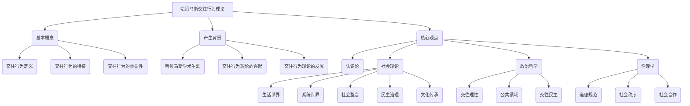

                 

### 引言

在当代社会科学和哲学领域，哈贝马斯（Jürgen Habermas）与卢曼（Niklas Luhmann）两位学者对交往行为理论（Communicative Action Theory）与系统理论（System Theory）的阐述，引起了广泛的关注与讨论。交往行为理论主要关注人类通过语言和互动来形成共识的过程，强调沟通的透明性和理性，而系统理论则从宏观角度出发，探讨社会作为一个复杂系统的运作机制。两者的理论在框架、观点和应用上均有显著差异，但同时也存在着一定的联系。

本文旨在对哈贝马斯与卢曼的交往行为理论和系统理论进行深入的对比分析，以揭示两种理论的核心观点、基本概念、理论框架及其在实际应用中的差异和联系。文章将首先介绍哈贝马斯交往行为理论的基本概念、产生背景与发展，以及其核心观点。接着，本文将概述卢曼系统理论的基本概念、产生背景与发展，并探讨其核心观点。在此基础上，文章将分析两种理论之间的联系与差异，并对交往行为理论与系统理论进行全面的比较分析。随后，文章将分别讨论哈贝马斯交往行为理论和卢曼系统理论的实际应用，最后进行综合评价，并对未来研究提出展望。

通过本文的研究，读者将能够更加全面和深入地理解哈贝马斯与卢曼的理论贡献，认识到它们在社会科学和哲学领域中的重要地位，以及如何在实际应用中发挥其独特的作用。

### 关键词

- 哈贝马斯交往行为理论
- 卢曼系统理论
- 社会科学理论
- 哲学理论
- 交往行为
- 系统理论
- 比较分析
- 实际应用

### 摘要

本文旨在深入对比分析哈贝马斯与卢曼的交往行为理论和系统理论。哈贝马斯的交往行为理论关注人类通过语言和互动形成共识的过程，强调沟通的透明性和理性；而卢曼的系统理论则从宏观角度探讨社会作为一个复杂系统的运作机制。文章首先介绍两种理论的基本概念、产生背景与发展，随后分析两者之间的联系与差异。通过对比交往行为理论与系统理论的基本概念、理论框架和实际应用，本文揭示了两者的独特贡献与局限。最后，文章对哈贝马斯与卢曼的理论进行综合评价，并提出未来研究的展望。本文的研究有助于深化对社会科学和哲学理论的理解，为实际应用提供有益的参考。

### 《哈贝马斯与卢曼：交往行为理论与系统理论的对比》目录大纲

## 引言

## 第1章 哈贝马斯交往行为理论的概述

### 1.1 哈贝马斯交往行为理论的基本概念

### 1.2 哈贝马斯交往行为理论的产生背景与发展

### 1.3 哈贝马斯交往行为理论的核心观点

## 第2章 卢曼系统理论的概述

### 2.1 卢曼系统理论的基本概念

### 2.2 卢曼系统理论的产生背景与发展

### 2.3 卢曼系统理论的核心观点

## 第3章 哈贝马斯与卢曼交往行为理论之间的联系

### 3.1 两种理论的共同点

### 3.2 两种理论的不同点

## 第4章 交往行为理论与系统理论的比较分析

### 4.1 基本概念对比

### 4.2 理论框架对比

### 4.3 实践应用对比

## 第5章 哈贝马斯交往行为理论的实际应用

### 5.1 社会科学研究中的应用

### 5.2 政治哲学中的应用

### 5.3 其他领域中的应用

## 第6章 卢曼系统理论的实际应用

### 6.1 社会科学研究中的应用

### 6.2 政治哲学中的应用

### 6.3 其他领域中的应用

## 第7章 哈贝马斯与卢曼理论的综合评价

### 7.1 两种理论的贡献与局限

### 7.2 对未来研究的展望

## 附录

### 7.3 参考文献

### 7.4 概念实体关系架构 Mermaid 流程图

### 7.5 核心算法原理讲解 Python 源代码

### 7.6 数学模型和数学公式 & 详细讲解 & 举例说明

### 7.7 项目实战：代码实际案例和详细解释说明

## 结语

### 第1章 哈贝马斯交往行为理论的概述

### 1.1 哈贝马斯交往行为理论的基本概念

哈贝马斯交往行为理论（Communicative Action Theory）是20世纪德国社会学家和哲学家Jürgen Habermas提出的一种社会哲学理论，旨在解释人类社会如何通过语言和交往来实现共识和合作。哈贝马斯认为，交往行为是人类社会运作的核心，是理解和解释社会现象的关键。

#### 1.1.1 交往行为的定义

哈贝马斯将交往行为定义为一种以沟通和理解为目的的社会互动。具体来说，交往行为涉及到以下几个核心要素：

- **言语行为**：交往行为主要依赖于语言的使用，包括说话、倾听和回答等过程。
- **理解**：交往的目的是达成对彼此意图和观点的理解，从而形成共识。
- **共识**：通过沟通和交流，个体之间可以形成共同的认知和判断。
- **规范**：交往行为受社会规范和价值观的约束，有助于维持社会秩序。

#### 1.1.2 交往行为的特征

哈贝马斯交往行为理论具有以下几个显著特征：

- **沟通透明性**：哈贝马斯强调交往过程中信息的透明性，即参与者应尽可能清楚地表达自己的观点，并尊重他人的沟通权利。
- **理性导向**：交往行为以理性为基础，参与者通过逻辑推理和批判性思考来达成共识。
- **规范性**：交往行为不仅涉及个体之间的互动，还受到社会规范和伦理道德的约束。

#### 1.1.3 交往行为的重要性

哈贝马斯认为，交往行为在人类社会中具有至关重要的地位，主要体现在以下几个方面：

- **社会整合**：通过交往行为，个体能够融入社会，建立社会联系，从而实现社会整合。
- **民主治理**：交往行为是民主治理的基础，通过公民之间的自由交流和对话，可以促进民主决策和公平正义。
- **文化传承**：交往行为有助于文化的传承和发展，通过交流和互动，个体能够了解和接受不同的文化价值观。

### 1.2 哈贝马斯交往行为理论的产生背景与发展

哈贝马斯交往行为理论的产生背景可以追溯到20世纪中叶，当时西方社会正面临着一系列的社会危机，如意识形态对立、社会分裂和民主制度的危机。哈贝马斯试图通过理论探讨来解决这些社会问题，并提出了一套以交往为核心的社会哲学理论。

#### 1.2.1 哈贝马斯学术生涯回顾

哈贝马斯的学术生涯可以分为三个阶段：

- **早期阶段**（1950-1960年代）：哈贝马斯在这一时期主要关注意识形态批判和意识形态理论，提出了“意识形态国家机器”的概念。
- **中期阶段**（1960-1980年代）：在这一阶段，哈贝马斯转向交往行为理论的研究，出版了《公共领域的结构转型》和《交往行动理论》等著作，奠定了其交往行为理论的框架。
- **晚期阶段**（1980年代至今）：哈贝马斯继续发展其交往行为理论，并开始将这一理论应用于政治哲学、法哲学和文化研究等领域。

#### 1.2.2 哈贝马斯交往行为理论的兴起

哈贝马斯交往行为理论的兴起主要得益于以下几个因素：

- **对传统社会学理论的批判**：哈贝马斯批判了功能主义、决定论等传统社会学理论，提出了一种更加关注人类主体性和交往行为的理论视角。
- **对现代性的反思**：哈贝马斯对现代性进行了深刻的反思，提出了“后期资本主义”和“交往理性”等概念，试图解释现代社会的复杂性和困境。
- **对民主治理的关注**：哈贝马斯强调交往行为在民主治理中的重要性，提出了“交往民主”的理念，对现代民主制度进行了理论和实践上的探索。

#### 1.2.3 哈贝马斯交往行为理论的发展

哈贝马斯交往行为理论的发展可以分为以下几个阶段：

- **前期理论**：主要关注语言和符号在社会互动中的作用，提出了“沟通行动”和“交往理性”等概念。
- **中期理论**：将交往行为理论扩展到政治哲学、法哲学和文化研究等领域，探讨了交往行为在不同领域的具体表现和应用。
- **后期理论**：哈贝马斯进一步发展了其交往行为理论，提出了“生活世界”和“系统世界”的概念，试图解释人类社会如何在不同领域之间进行交流和互动。

### 1.3 哈贝马斯交往行为理论的核心观点

哈贝马斯交往行为理论的核心观点包括以下几个方面：

#### 1.3.1 认识论

哈贝马斯认为，认识是通过交往行为实现的。他提出了“交往理性”的概念，认为通过理性的对话和沟通，个体可以克服偏见和误解，达成对事物真相的认识。

#### 1.3.2 社会理论

哈贝马斯认为，社会是一个由交往行为构成的系统。他提出了“生活世界”和“系统世界”的概念，认为人类社会可以分为两个领域：生活世界和系统世界。生活世界是人们日常交往和互动的领域，而系统世界则是政治、经济、法律等制度化的领域。

#### 1.3.3 政治哲学

哈贝马斯的政治哲学强调民主治理的重要性。他认为，民主制度应该建立在公民之间的自由交流和对话基础之上，通过交往行为来实现公平和正义。

### 1.3.4 伦理学

哈贝马斯的伦理学观点强调道德规范和价值观在交往行为中的作用。他认为，道德规范和价值观是交往行为的规范，有助于维护社会秩序和促进个体之间的合作。

通过以上对哈贝马斯交往行为理论的概述，我们可以看到，这一理论在社会科学和哲学领域具有重要的影响，为理解和解释人类社会的运作机制提供了独特的视角。接下来，本文将继续探讨卢曼系统理论的基本概念、产生背景与发展，以及其核心观点。

### 第2章 卢曼系统理论的概述

#### 2.1 卢曼系统理论的基本概念

卢曼系统理论（Luhmann's Systems Theory）是由德国社会学家尼尔斯·卢曼（Niklas Luhmann）提出的一种复杂系统理论，旨在解释社会作为一个复杂系统的运作机制。卢曼系统理论的核心观点是，社会是由多个相互独立的系统组成的，每个系统都有其独特的功能和行为模式。

##### 2.1.1 系统的定义

在卢曼的理论中，系统是一种自我组织的实体，它通过边界与其他系统区分开来，并且能够处理输入信息，产生输出信息。系统具有以下几个基本特征：

- **自我复制**：系统能够通过内部规则和模式实现自我复制和维持。
- **自适应**：系统能够对环境变化做出响应，并调整自身行为。
- **封闭性**：系统在某种程度上是封闭的，能够抵御外部干扰。
- **层次结构**：系统内部存在不同层次的结构和组织。

##### 2.1.2 系统的特征

卢曼系统理论强调了系统的以下几个特征：

- **复杂性**：社会系统由多个相互关联的子系统组成，具有高度复杂性。
- **非线性和动态性**：系统行为不是线性的，且随着时间的推移而不断变化。
- **冗余性**：系统内部存在冗余结构，以应对不确定性和环境变化。
- **适应性**：系统能够通过学习和适应机制，应对外部挑战和内部变化。

##### 2.1.3 系统的重要性

卢曼认为，系统在社会运作中具有至关重要的地位。系统不仅决定了社会的结构，还影响了社会的功能和行为模式。具体来说，系统的重要性体现在以下几个方面：

- **社会整合**：系统通过规则和标准，将不同个体和组织整合为一个整体，实现社会秩序。
- **分工与合作**：系统促进了社会分工，使得个体和组织能够专注于特定的领域，从而实现高效合作。
- **创新与变革**：系统通过内部学习和适应，推动社会创新和变革。

#### 2.2 卢曼系统理论的产生背景与发展

卢曼系统理论的产生背景可以追溯到20世纪中叶，当时社会科学领域正面临着对复杂社会现象解释的需求。卢曼受到了生物学、信息论和控制论等学科的影响，试图将系统理论应用于社会研究。

##### 2.2.1 卢曼学术生涯回顾

卢曼的学术生涯可以分为以下几个阶段：

- **早期阶段**（1950-1960年代）：卢曼在这一时期主要关注组织理论和社会系统理论，提出了“沟通系统”的概念。
- **中期阶段**（1960-1980年代）：在这一阶段，卢曼深入发展了其系统理论，出版了《社会的观察者》和《社会系统的理论》等著作，奠定了其系统理论的框架。
- **晚期阶段**（1980年代至今）：卢曼继续发展其系统理论，并开始将其应用于法律、政治、文化等领域。

##### 2.2.2 卢曼系统理论的兴起

卢曼系统理论的兴起主要得益于以下几个因素：

- **对复杂性科学的关注**：随着复杂性科学的发展，人们对复杂系统的研究兴趣日益增加，这为卢曼的系统理论提供了土壤。
- **对传统社会学理论的批判**：卢曼批判了功能主义、决定论等传统社会学理论，提出了一种更加关注系统复杂性和动态性的理论视角。
- **对现代社会问题的反思**：卢曼对现代社会问题，如组织复杂性、社会分化、民主危机等进行了深刻的反思，试图通过系统理论来解释这些现象。

##### 2.2.3 卢曼系统理论的发展

卢曼系统理论的发展可以分为以下几个阶段：

- **前期理论**：主要关注系统的基本概念和特征，如系统的自我复制、自适应性和封闭性。
- **中期理论**：将系统理论扩展到社会研究，探讨了社会系统的结构、功能和行为模式。
- **后期理论**：卢曼进一步发展了其系统理论，提出了“系统与环境的互动”、“多层次系统”等概念，试图解释复杂社会现象的动态性和复杂性。

#### 2.3 卢曼系统理论的核心观点

卢曼系统理论的核心观点包括以下几个方面：

##### 2.3.1 社会系统

卢曼认为，社会是一个由多个相互独立的子系统组成的复杂系统，每个子系统都有其独特的功能和行为模式。社会系统通过沟通和信息处理来实现整合和协调。

##### 2.3.2 交往行为

卢曼将交往行为视为社会系统运作的核心。他认为，交往行为不仅是社会系统内部的信息传递过程，还涉及到系统之间的互动和协调。

##### 2.3.3 社会秩序

卢曼强调社会秩序的重要性。他认为，社会秩序是通过系统的规则和标准来维持的，这些规则和标准保证了社会系统的稳定性和可预测性。

##### 2.3.4 系统与环境

卢曼认为，系统与环境之间存在密切的互动关系。系统通过对外部环境的响应和适应，实现了系统与环境的动态平衡。

通过以上对卢曼系统理论的概述，我们可以看到，这一理论为社会科学提供了一种全新的视角，有助于我们理解和解释复杂社会现象的动态性和复杂性。接下来，本文将分析哈贝马斯与卢曼交往行为理论之间的联系与差异。

### 第3章 哈贝马斯与卢曼交往行为理论之间的联系

#### 3.1 两种理论的共同点

哈贝马斯交往行为理论和卢曼系统理论虽然在框架、观点和应用上存在显著差异，但它们之间也存在一些共同点，这些共同点为两种理论提供了互补和相互解释的可能性。

##### 3.1.1 认识论

首先，哈贝马斯和卢曼在认识论方面存在一定的共识。哈贝马斯强调交往行为中的理性交流和共识形成，认为通过理性的沟通和辩论，个体能够克服偏见和误解，达成对事物真相的认识。而卢曼则认为，社会系统通过沟通和信息处理实现了对环境的理解。他认为，系统内部的信息传递和处理过程可以被视为一种形式上的“认知”过程。尽管两者对“认知”的理解有所不同，但都强调了信息处理和沟通在认识形成中的关键作用。

##### 3.1.2 社会理论

其次，两种理论在社会理论方面也存在相似之处。哈贝马斯将社会视为一个由交往行为构成的系统，认为社会的基本功能是通过语言和沟通实现个体之间的共识和合作。卢曼则将社会视为一个由多个相互独立的子系统组成的复杂系统，每个子系统都有其独特的功能和行为模式。两者都认为，社会是一个复杂的整体，但可以通过不同的视角进行分析和解释。哈贝马斯关注个体之间的交往和互动，而卢曼则关注系统之间的互动和协调。

##### 3.1.3 政治哲学

最后，哈贝马斯和卢曼在政治哲学方面也存在一些共同点。哈贝马斯强调民主治理的重要性，认为民主制度应该建立在公民之间的自由交流和对话基础之上，通过交往行为来实现公平和正义。卢曼则认为，社会系统通过规则和标准维持社会秩序，这些规则和标准在社会治理中起到了关键作用。尽管两者对民主和治理的理解有所不同，但都认为社会秩序和治理是通过沟通和规则实现的。

#### 3.2 两种理论的不同点

尽管哈贝马斯和卢曼的交往行为理论之间存在共同点，但它们在理论框架、观点和应用方面也存在显著差异。

##### 3.2.1 理论框架

首先，在理论框架上，哈贝马斯的交往行为理论是一种以个体为中心的理论，强调个体之间的直接交往和共识形成。哈贝马斯提出了“交往行为”和“交往理性”等核心概念，试图解释人类社会如何通过语言和沟通实现共识和合作。而卢曼的系统理论则是一种以系统为中心的理论，强调社会作为一个复杂系统如何通过信息处理和沟通实现稳定性和协调性。卢曼提出了“系统”、“环境”和“子系统”等核心概念，试图解释社会系统的运作机制。

##### 3.2.2 理论观点

其次，在理论观点上，哈贝马斯和卢曼存在一些根本性的差异。哈贝马斯认为，交往行为是社会的基本特征，通过理性的沟通和辩论，个体可以达成共识，实现社会整合和民主治理。卢曼则认为，社会是一个由多个相互独立的子系统组成的复杂系统，每个子系统都有其独特的功能和行为模式。社会系统的稳定性和协调性是通过子系统之间的信息处理和沟通实现的，而不是通过个体之间的直接交往。

##### 3.2.3 实践应用

最后，在实践应用上，哈贝马斯和卢曼的理论也存在差异。哈贝马斯的交往行为理论在社会科学、政治哲学和文化研究等领域有广泛的应用，其理论观点为民主治理、公共领域和公民社会的研究提供了重要参考。卢曼的系统理论则在组织理论、社会研究和复杂系统分析等领域得到广泛应用，其理论框架为理解社会系统的复杂性和动态性提供了新的视角。

通过以上分析，我们可以看到，哈贝马斯和卢曼的交往行为理论在认识论、社会理论和政治哲学方面存在共同点，但它们在理论框架、观点和应用上也有显著差异。这些共同点和差异为两种理论提供了互补和相互解释的可能性，也为进一步研究和探讨提供了丰富的理论资源。

### 第4章 交往行为理论与系统理论的比较分析

#### 4.1 基本概念对比

要深入理解哈贝马斯交往行为理论与卢曼系统理论的差异，我们首先需要从基本概念入手，对比两者在定义、核心要素和理论框架上的差异。

##### 4.1.1 交往行为的定义

哈贝马斯的交往行为（Communicative Action）强调个体通过语言和互动进行沟通，以达成共识和理解。哈贝马斯认为，交往行为具有以下几个核心要素：

- **言语行为**：通过语言表达和交流信息。
- **理解**：通过沟通实现彼此意图和观点的理解。
- **共识**：通过理性辩论和协商达成共识。

哈贝马斯将交往行为视为人类社会的核心，是社会整合和民主治理的基础。

相比之下，卢曼的系统理论（Systems Theory）中的“交往”概念具有不同的内涵。卢曼认为，社会系统通过内部的信息处理和沟通实现稳定性和协调性。在卢曼的理论中，交往行为更多的是指系统内部的信息传递和处理过程，而非个体之间的直接沟通。卢曼的“交往”强调系统之间的互动和协调，而不是个体之间的共识形成。

##### 4.1.2 理论框架

哈贝马斯的交往行为理论构建了一个以个体为中心的理论框架，强调个体之间的直接交往和共识形成。哈贝马斯提出了“交往行为”和“交往理性”等概念，试图解释人类社会如何通过语言和沟通实现共识和合作。其理论框架主要包括以下几个方面：

- **交往行为**：个体通过言语行为进行沟通，实现理解和共识。
- **交往理性**：通过理性的辩论和协商达成共识。
- **公共领域**：个体在公共领域中进行自由的交流和对话，以形成公共意见和共识。

卢曼的系统理论则构建了一个以系统为中心的理论框架，强调社会作为一个复杂系统如何通过信息处理和沟通实现稳定性和协调性。卢曼的理论框架主要包括以下几个方面：

- **系统**：由多个相互独立的子系统组成，每个子系统都有其独特的功能和行为模式。
- **环境**：系统外部的不确定性因素，对系统产生干扰和挑战。
- **沟通**：系统内部的信息传递和处理过程，实现系统之间的互动和协调。

##### 4.1.3 核心要素

哈贝马斯的核心要素主要包括：

- **语言**：交往行为的媒介。
- **理性**：通过理性的沟通和辩论实现共识。
- **共识**：通过共识形成社会整合和民主治理。

卢曼的核心要素主要包括：

- **信息**：系统内部的信息传递和处理过程。
- **规则**：维持系统稳定性的规则和标准。
- **边界**：系统与其他系统之间的分界线。

#### 4.2 理论框架对比

在理论框架上，哈贝马斯和卢曼的观点存在显著差异。哈贝马斯的交往行为理论注重个体之间的直接交往和共识形成，强调公共领域的构建和公民社会的参与。他的理论框架试图解释人类社会如何通过语言和理性实现共识和合作，以及如何通过民主制度实现社会整合和治理。

卢曼的系统理论则更加关注社会作为一个复杂系统的运作机制。他认为，社会是由多个相互独立的子系统组成的，每个子系统都有其独特的功能和行为模式。卢曼的理论框架试图解释系统如何通过信息处理和沟通实现稳定性和协调性，以及系统如何应对外部环境的变化和挑战。

##### 4.2.1 哈贝马斯的交往行为理论框架

哈贝马斯的交往行为理论框架可以分为以下几个部分：

- **交往行为**：个体通过言语行为进行沟通，实现理解和共识。
- **交往理性**：通过理性的沟通和辩论实现共识。
- **公共领域**：个体在公共领域中进行自由的交流和对话，以形成公共意见和共识。
- **民主治理**：通过公共领域的建设实现民主决策和治理。

##### 4.2.2 卢曼的系统理论框架

卢曼的系统理论框架可以分为以下几个部分：

- **系统**：由多个相互独立的子系统组成，每个子系统都有其独特的功能和行为模式。
- **环境**：系统外部的不确定性因素，对系统产生干扰和挑战。
- **沟通**：系统内部的信息传递和处理过程，实现系统之间的互动和协调。
- **规则**：维持系统稳定性的规则和标准。

通过以上对比分析，我们可以看到，哈贝马斯的交往行为理论和卢曼的系统理论在基本概念、理论框架和核心要素上存在显著差异。哈贝马斯的理论更注重个体之间的直接交往和共识形成，强调公共领域的建设和社会整合；而卢曼的理论则更关注社会作为一个复杂系统的运作机制，强调系统之间的信息处理和协调。这些差异反映了两者在社会科学和哲学领域的不同视角和研究路径。

### 4.3 实践应用对比

哈贝马斯交往行为理论和卢曼系统理论在实践应用上展现了不同的特点，这些特点在社会科学研究、政治哲学和其他领域产生了深远影响。以下将对比两者在实际应用中的具体表现。

##### 4.3.1 社会科学研究中的应用

哈贝马斯交往行为理论在社会学研究中得到了广泛应用，特别是在理解社会互动、公共领域和公民社会方面。哈贝马斯的理论为分析社会互动提供了新的视角，通过强调语言和理性的作用，研究者可以更好地理解个体如何在互动中形成共识。例如，哈贝马斯的“公共领域”概念被用于分析现代社会的公共辩论和民主制度，揭示了公民如何通过自由交流和对话参与公共事务。

具体应用场景包括：

- **社会互动研究**：通过分析个体之间的交往行为，研究者可以了解社会互动的模式和机制。
- **公共领域分析**：研究者通过考察公共领域中的话语和辩论，探讨公共意见的形成和变化。
- **公民社会研究**：哈贝马斯的理论为分析公民社会在民主治理中的作用提供了理论框架。

相比之下，卢曼的系统理论在社会学中的应用则侧重于社会系统的复杂性和动态性。卢曼的理论框架为理解社会系统的多层次结构提供了工具，研究者可以通过分析子系统之间的互动和协调，探讨社会系统的稳定性和适应性。

具体应用场景包括：

- **社会系统分析**：通过分析社会系统的结构和功能，研究者可以理解社会系统的复杂性和动态性。
- **组织研究**：卢曼的理论被应用于组织研究，分析组织内部的沟通和信息处理机制。
- **社会变革研究**：研究者通过分析社会系统的适应和变革过程，探讨社会系统如何应对外部环境的变化。

##### 4.3.2 政治哲学中的应用

在政治哲学领域，哈贝马斯交往行为理论对民主治理和公共讨论的探讨具有重要意义。哈贝马斯强调，民主治理应该建立在公民之间的自由交流和对话基础之上，通过交往行为实现公平和正义。这一观点为现代民主理论提供了新的解释，特别是对于理解公共领域的功能和民主实践的意义。

具体应用包括：

- **民主理论**：哈贝马斯的理论为现代民主理论提供了新的视角，强调了交往理性在民主决策中的重要性。
- **公共讨论**：通过分析公共讨论中的话语模式和辩论机制，研究者可以探讨如何促进公正和有效的公共讨论。
- **政治参与**：哈贝马斯的理论为分析公民如何通过参与公共事务来实现民主治理提供了理论框架。

卢曼的系统理论在政治哲学中的应用则更多地关注政治系统的复杂性和动态性。卢曼认为，政治系统是一个由多个相互独立的子系统组成的复杂系统，这些子系统通过信息处理和沟通实现稳定性和协调性。

具体应用包括：

- **政治系统分析**：通过分析政治系统的结构和功能，研究者可以理解政治系统如何应对内部和外部的挑战。
- **政策分析**：卢曼的理论为分析政策制定和执行过程中的信息处理和沟通提供了工具。
- **政治稳定**：研究者通过分析政治系统的适应和变革过程，探讨政治系统如何维持稳定。

##### 4.3.3 其他领域中的应用

除了社会研究和政治哲学，哈贝马斯和卢曼的理论在其他领域也得到了广泛应用。

哈贝马斯的交往行为理论在文化研究和媒体研究中得到了广泛应用。通过分析语言和符号在社会互动中的作用，研究者可以探讨文化生产、传播和消费的过程。

具体应用包括：

- **文化研究**：哈贝马斯的理论为理解文化生产和文化消费提供了新的视角。
- **媒体研究**：研究者通过分析媒体内容和文化产品，探讨语言和符号在社会互动中的作用。

卢曼的系统理论在组织管理和复杂系统分析中也得到了广泛应用。通过分析组织内部的沟通和信息处理机制，研究者可以理解组织如何应对复杂环境和实现高效运作。

具体应用包括：

- **组织管理**：卢曼的理论为分析组织结构和沟通机制提供了工具。
- **复杂系统分析**：研究者通过分析复杂系统中的信息传递和协调过程，探讨系统如何维持稳定性和适应性。

通过以上对比分析，我们可以看到，哈贝马斯交往行为理论和卢曼系统理论在实践应用上展现了不同的特点。哈贝马斯的理论更注重个体之间的直接交往和共识形成，强调公共领域的建设和公民社会的参与；而卢曼的理论则更关注社会系统的复杂性和动态性，强调系统之间的信息处理和协调。这些差异反映了两者在社会科学和哲学领域的不同视角和研究路径，为理解和解释社会现象提供了丰富的理论资源。

### 第5章 哈贝马斯交往行为理论的实际应用

#### 5.1 社会科学研究中的应用

哈贝马斯交往行为理论在社会学研究中具有广泛的应用，特别是在理解社会互动、公共领域和公民社会方面。以下将详细探讨该理论在社会学领域的实际应用。

##### 5.1.1 交往行为理论在社会互动中的运用

哈贝马斯的交往行为理论提供了分析社会互动的有力工具。通过强调言语行为、理解和共识的重要性，研究者可以深入探讨个体在社会互动中的行为模式。以下是一些具体的应用实例：

- **家庭互动**：研究者可以通过分析家庭成员之间的言语行为，了解家庭互动中的沟通模式、权力动态和情感表达。例如，通过观察家庭会议中的对话，研究者可以探讨家庭成员如何通过理性的沟通和共识形成，解决家庭冲突和达成共同决策。

- **职场沟通**：在组织管理研究中，哈贝马斯的交往行为理论被用来分析职场中的沟通方式。研究者可以探讨员工之间的沟通模式、信息传递的效率以及共识形成的过程。例如，通过分析团队会议中的言语行为，研究者可以了解团队合作中存在的问题，并提出改进沟通策略的建议。

##### 5.1.2 公共领域分析

哈贝马斯的“公共领域”概念在社会学研究中得到了广泛应用，用于分析现代社会中的公共辩论和民主制度。以下是一些具体的应用实例：

- **公共政策研究**：研究者可以通过分析公共领域中的辩论和讨论，了解政策制定过程中的公众参与和民主决策。例如，通过研究立法过程中的公众听证会和媒体辩论，研究者可以探讨公众如何通过交往行为影响政策制定，以及政策制定者如何回应公众意见。

- **公共讨论的演变**：研究者可以通过分析公共讨论的主题、参与者和讨论模式，了解公共领域的历史演变。例如，通过研究社交媒体上的公共讨论，研究者可以探讨公共讨论的多样性、参与者的身份认同以及讨论的理性程度。

##### 5.1.3 公民社会研究

哈贝马斯的交往行为理论为理解公民社会在民主治理中的作用提供了重要的理论框架。以下是一些具体的应用实例：

- **公民参与**：研究者可以通过分析公民如何通过交往行为参与公共事务，了解公民社会的活力和作用。例如，通过研究社区志愿者活动、公民论坛和公益组织，研究者可以探讨公民如何通过交往行为实现自我表达和社会参与。

- **公民教育**：哈贝马斯的交往行为理论被应用于公民教育研究中，用于探讨如何培养公民的交往能力和社会责任感。例如，通过设计教育课程和实践活动，研究者可以探讨如何通过交往行为促进公民对公共事务的理解和参与。

##### 5.1.4 交往行为理论在社会互动中的挑战

尽管哈贝马斯的交往行为理论在社会学研究中具有广泛的应用，但在实际应用中也面临一些挑战。以下是一些主要的挑战：

- **语言障碍**：在现实生活中，语言障碍可能会影响交往行为的效率和效果。例如，在多元文化社会中，不同语言背景的个体之间的沟通可能会受到误解和误读的影响，从而影响共识的形成。

- **权力不平等**：在交往行为中，权力不平等可能会导致弱势群体在沟通中的劣势，从而影响共识的形成。例如，在职场中，管理层与员工之间的沟通可能存在权力不对等，导致员工的意见和需求无法得到充分表达。

- **社会复杂性和多样性**：现代社会具有高度的复杂性和多样性，这给交往行为带来了新的挑战。例如，在全球化背景下，不同文化和社会背景的个体之间的交往可能面临文化差异和价值观冲突的挑战，从而影响共识的形成。

#### 5.2 政治哲学中的应用

哈贝马斯交往行为理论在政治哲学中的应用具有重要意义，特别是在理解民主治理、公共讨论和公民权利方面。以下将详细探讨该理论在政治哲学领域的实际应用。

##### 5.2.1 民主治理

哈贝马斯的交往行为理论为民主治理提供了重要的理论支持。通过强调交往理性在民主决策中的重要性，哈贝马斯提出了“交往民主”的理念，认为民主治理应该建立在公民之间的自由交流和对话基础之上。以下是一些具体的应用实例：

- **公民论坛**：公民论坛是一种通过自由交流和对话实现民主决策的实践。在公民论坛中，公民可以就公共事务进行开放讨论，通过理性的辩论和协商达成共识。研究者可以通过分析公民论坛中的交往行为，探讨如何提高公民参与的质量和效果。

- **立法过程**：哈贝马斯的交往行为理论被应用于分析立法过程中的公众参与和民主决策。通过研究立法过程中的公众听证会和辩论，研究者可以探讨公众如何通过交往行为影响立法过程，以及立法者如何回应公众意见。

##### 5.2.2 公共讨论

公共讨论是哈贝马斯交往行为理论在政治哲学中的重要应用领域。通过分析公共讨论中的话语模式和辩论机制，研究者可以探讨如何促进公正和有效的公共讨论。以下是一些具体的应用实例：

- **媒体研究**：哈贝马斯的交往行为理论被应用于媒体研究中，用于分析媒体内容和文化产品如何影响公共讨论。研究者可以探讨媒体如何塑造公共讨论的主题和参与者，以及媒体如何通过语言和符号传递价值观和意识形态。

- **网络公共讨论**：随着互联网的发展，网络公共讨论成为现代社会中重要的公共讨论形式。研究者可以通过分析网络公共讨论中的话语模式和参与者的互动，探讨如何促进网络公共讨论的理性化和有效性。

##### 5.2.3 公民权利

哈贝马斯的交往行为理论为理解公民权利提供了重要的理论框架。通过强调交往理性在公民权利实现中的作用，哈贝马斯提出了“交往自由”的理念，认为公民应该享有自由表达和交流的权利。以下是一些具体的应用实例：

- **言论自由**：哈贝马斯的交往行为理论被应用于分析言论自由在民主社会中的重要性。研究者可以探讨如何通过保障言论自由，促进公民之间的自由交流和辩论，从而实现民主治理和公民权利的保护。

- **新闻自由**：哈贝马斯的交往行为理论被应用于分析新闻自由在公共讨论和社会监督中的重要作用。研究者可以探讨新闻媒体如何通过自由的新闻报道和评论，促进公共讨论和社会进步。

##### 5.2.4 政治哲学中的挑战

尽管哈贝马斯的交往行为理论在政治哲学中的应用具有重要意义，但在实际应用中也面临一些挑战。以下是一些主要的挑战：

- **公共领域的现实困境**：哈贝马斯的公共领域概念在现实中面临一些困境，如公共领域的分割和私人领域的侵蚀。研究者需要探讨如何在现代社会中重建和维护公共领域。

- **权力不平衡**：在政治哲学中，权力不平衡可能会影响交往行为的效果和公平性。例如，在政治决策过程中，权力较大的群体可能会利用其优势地位，影响公共讨论和决策的结果。

- **文化多样性**：在全球化背景下，文化多样性对公共讨论和民主治理提出了新的挑战。研究者需要探讨如何在不同文化和价值观的背景下，促进有效的公共讨论和共识形成。

通过以上分析，我们可以看到，哈贝马斯交往行为理论在社会研究和政治哲学中的应用具有深远的意义。这一理论不仅为理解社会互动和公共讨论提供了新的视角，也为促进民主治理和公民权利的实现提供了重要的理论支持。然而，在实际应用中，我们也需要面对一些挑战，不断探索和完善这一理论的适用性和有效性。

#### 5.3 哈贝马斯交往行为理论在其他领域中的应用

哈贝马斯交往行为理论不仅在社会学和政治哲学领域具有广泛的应用，也在其他学科和实际生活中发挥了重要作用。以下将探讨哈贝马斯的交往行为理论在组织管理学、心理学和教育学等领域的具体应用。

##### 5.3.1 组织管理学中的应用

在组织管理学中，哈贝马斯交往行为理论被应用于分析组织内部的沟通机制和团队协作。通过强调言语行为、理解和共识的重要性，管理者可以优化组织内部的沟通流程，促进团队协作和决策质量。

具体应用实例包括：

- **团队沟通**：管理者可以通过哈贝马斯的交往行为理论，设计有效的团队沟通策略，提高团队成员之间的理解度和协作性。例如，通过定期组织团队会议和讨论，确保团队成员能够自由表达意见，促进共识形成。
- **领导力**：哈贝马斯的交往行为理论为领导力提供了新的视角。有效的领导者应具备良好的沟通能力，能够通过理性的交流与团队成员建立信任，形成共同的愿景和目标。

##### 5.3.2 心理学中的应用

在心理学领域，哈贝马斯交往行为理论被应用于探讨人际关系和心理治疗。通过分析交往行为中的言语行为、理解和共识，心理学家可以更深入地了解个体的心理需求和行为模式。

具体应用实例包括：

- **心理咨询**：心理学家可以通过哈贝马斯的交往行为理论，设计有效的心理咨询方法。例如，通过建立良好的咨询关系，促进咨询者与求助者之间的理解和共识，帮助求助者解决问题和改善心理健康。
- **社会心理学**：哈贝马斯的交往行为理论被应用于分析社会互动中的心理机制。例如，通过研究群体心理和行为，了解个体如何在群体互动中形成共识和群体行为。

##### 5.3.3 教育学中的应用

在教育领域，哈贝马斯交往行为理论被应用于探讨教育实践和教学方法。通过强调交往行为中的理解和共识，教育者可以优化教学过程，提高教学效果和学生的参与度。

具体应用实例包括：

- **教学策略**：教育者可以通过哈贝马斯的交往行为理论，设计有效的教学策略。例如，通过采用对话式教学，鼓励学生积极参与课堂讨论，促进师生之间的理解和共识。
- **教育评估**：哈贝马斯的交往行为理论为教育评估提供了新的视角。教育评估不仅应关注学生的知识和技能，还应关注学生的沟通能力和团队合作能力。

##### 5.3.4 实际生活中的应用

哈贝马斯交往行为理论在实际生活中也具有广泛的应用价值。以下是一些具体的应用实例：

- **人际沟通**：在日常生活中，个体可以通过哈贝马斯的交往行为理论，提高人际沟通的效果。例如，通过注重言语行为、理解和共识，促进人际关系的和谐和稳定。
- **公共参与**：在公共事务中，个体可以通过哈贝马斯的交往行为理论，提高公共参与的质量和效果。例如，通过积极参与公共讨论和辩论，促进社会共识的形成和公共事务的民主决策。

尽管哈贝马斯交往行为理论在其他领域和实际生活中的应用取得了显著成效，但也存在一些挑战和局限。例如，在实际应用中，个体和组织的沟通效果可能受到语言障碍、权力不平等和社会复杂性等因素的影响。此外，哈贝马斯的交往行为理论侧重于理性和共识的形成，但未能充分考虑到情感和非理性因素在人际互动中的重要作用。

总之，哈贝马斯交往行为理论在组织管理学、心理学、教育学和实际生活中的应用具有重要意义。通过理解和应用这一理论，个体和组织可以优化沟通机制，提高协作效果和决策质量，促进社会和谐和公共参与。然而，在实际应用中，我们也需要不断探索和克服挑战，以充分发挥这一理论的价值。

### 第6章 卢曼系统理论的实际应用

#### 6.1 社会科学研究中的应用

卢曼系统理论在社会学研究中具有广泛的应用，特别是在理解社会系统的复杂性和动态性方面。以下将详细探讨该理论在社会学领域的实际应用。

##### 6.1.1 社会系统的分析

卢曼的系统理论为社会系统分析提供了新的视角。通过将社会视为一个由多个相互独立的子系统组成的复杂系统，研究者可以更深入地理解社会系统的运作机制。

具体应用实例包括：

- **社会分层**：研究者可以通过卢曼的系统理论，分析社会分层现象。例如，通过研究社会系统中的经济子系统、政治子系统和文化子系统，探讨这些子系统如何相互作用，影响社会分层和权力结构。
- **社会变迁**：卢曼的系统理论为分析社会变迁提供了有用的工具。通过研究社会系统的适应和变革过程，研究者可以理解社会系统如何应对外部环境的变化和挑战。例如，研究社会系统如何调整其内部结构和功能，以适应全球化、技术进步和社会变革。

##### 6.1.2 组织研究

卢曼的系统理论在组织研究中得到了广泛应用。通过分析组织内部的子系统及其互动关系，研究者可以更好地理解组织的运作机制和动态性。

具体应用实例包括：

- **组织结构**：研究者可以通过卢曼的系统理论，分析组织结构的设计和优化。例如，通过研究组织内部的不同子系统，探讨如何设计有效的组织结构，以实现高效的信息传递和资源分配。
- **组织变革**：卢曼的系统理论为组织变革研究提供了新的视角。通过研究组织系统如何适应和应对外部环境的变化，研究者可以理解组织变革的过程和机制。例如，研究组织如何调整其内部结构和功能，以适应市场变化、技术创新和竞争压力。

##### 6.1.3 社会问题研究

卢曼的系统理论为社会问题研究提供了有力的分析工具。通过将社会问题视为社会系统中的特定子系统或子系统间的互动问题，研究者可以更深入地理解社会问题的成因和解决途径。

具体应用实例包括：

- **社会冲突**：研究者可以通过卢曼的系统理论，分析社会冲突的成因和解决途径。例如，通过研究社会系统中的不同子系统如何互动，探讨社会冲突的根源和解决机制。
- **社会问题治理**：卢曼的系统理论为研究社会问题治理提供了新的视角。通过分析社会系统中的治理机制，研究者可以理解如何通过有效的治理措施，解决社会问题，促进社会稳定和可持续发展。

#### 6.2 政治哲学中的应用

卢曼的系统理论在政治哲学领域具有广泛的应用，特别是在分析政治系统的复杂性和动态性方面。以下将详细探讨该理论在政治哲学领域的实际应用。

##### 6.2.1 政治系统的分析

卢曼的系统理论为政治系统分析提供了新的视角。通过将政治系统视为一个由多个相互独立的子系统组成的复杂系统，研究者可以更深入地理解政治系统的运作机制和动态性。

具体应用实例包括：

- **政治结构**：研究者可以通过卢曼的系统理论，分析政治结构的设计和优化。例如，通过研究政治系统中的不同子系统，探讨如何设计有效的政治结构，以实现高效的信息传递和资源分配。
- **政治变革**：卢曼的系统理论为分析政治变革提供了新的视角。通过研究政治系统如何适应和应对外部环境的变化，研究者可以理解政治变革的过程和机制。例如，研究政治系统如何调整其内部结构和功能，以适应社会变革、经济转型和全球化挑战。

##### 6.2.2 民主理论

卢曼的系统理论在民主理论研究中得到了广泛应用。通过分析政治系统中的不同子系统及其互动关系，研究者可以探讨民主制度的运作机制和民主治理的挑战。

具体应用实例包括：

- **民主治理**：研究者可以通过卢曼的系统理论，分析民主治理的机制和挑战。例如，通过研究政治系统中的不同子系统如何互动，探讨如何通过有效的治理措施，实现民主参与、公平正义和有效治理。
- **民主制度的变革**：卢曼的系统理论为研究民主制度的变革提供了新的视角。通过分析政治系统如何适应和应对社会变革，研究者可以理解民主制度的变革过程和机制。例如，研究政治系统如何调整其内部结构和功能，以适应社会需求、技术进步和政治参与。

##### 6.2.3 公共政策

卢曼的系统理论在公共政策研究中得到了广泛应用。通过分析政治系统中的不同子系统及其互动关系，研究者可以探讨公共政策的制定、执行和评估过程。

具体应用实例包括：

- **公共政策分析**：研究者可以通过卢曼的系统理论，分析公共政策的制定和执行过程。例如，通过研究政治系统中的不同子系统如何互动，探讨如何通过有效的政策设计，解决社会问题、实现政策目标。
- **公共政策评估**：卢曼的系统理论为公共政策评估提供了新的视角。通过分析政治系统中的不同子系统如何互动，研究者可以评估公共政策的实际效果和影响。例如，研究政策如何在不同子系统之间传递和实施，以及政策效果如何在不同群体中体现。

##### 6.2.4 政治哲学中的挑战

尽管卢曼的系统理论在政治哲学中的应用具有重要意义，但在实际应用中也面临一些挑战。以下是一些主要的挑战：

- **复杂性**：社会系统的高度复杂性和动态性使得卢曼的系统理论在分析政治系统时具有一定的局限性。研究者需要具备较强的分析能力和逻辑思维，才能有效应用这一理论。
- **权力不平衡**：在政治系统中，权力不平衡可能导致子系统的互动关系失衡，影响政治系统的稳定性和有效性。研究者需要关注权力关系对政治系统的影响，以及如何通过有效的治理措施，实现权力平衡和民主参与。
- **伦理考量**：在政治哲学中，卢曼的系统理论更多地关注政治系统的运作机制，但在伦理考量方面可能存在不足。研究者需要结合伦理理论，探讨政治系统如何实现公平正义和道德责任。

#### 6.3 卢曼系统理论在其他领域中的应用

卢曼系统理论不仅在社会学和政治哲学领域具有广泛的应用，也在其他学科和实际生活中发挥了重要作用。以下将探讨卢曼的系统理论在经济学、生态学和科技伦理等领域的实际应用。

##### 6.3.1 经济学中的应用

在经济学领域，卢曼的系统理论被应用于分析经济系统的复杂性和动态性。通过将经济系统视为一个由多个相互独立的子系统组成的复杂系统，研究者可以更深入地理解经济系统的运作机制。

具体应用实例包括：

- **金融市场**：研究者可以通过卢曼的系统理论，分析金融市场的复杂性和动态性。例如，通过研究金融市场中的不同子系统，探讨市场波动、风险管理和金融监管的机制。
- **经济政策**：卢曼的系统理论为经济政策分析提供了新的视角。通过分析经济系统中的不同子系统如何互动，研究者可以探讨经济政策的制定和实施过程，以及政策效果在不同子系统中的体现。

##### 6.3.2 生态学中的应用

在生态学领域，卢曼的系统理论被应用于分析生态系统的复杂性和动态性。通过将生态系统视为一个由多个相互独立的子系统组成的复杂系统，研究者可以更深入地理解生态系统的运作机制。

具体应用实例包括：

- **生态系统服务**：研究者可以通过卢曼的系统理论，分析生态系统服务（如水资源、生物多样性等）的提供和需求。例如，通过研究生态系统中的不同子系统，探讨如何通过有效的生态管理，实现生态系统服务的高效供给和可持续发展。
- **生态修复**：卢曼的系统理论为生态修复研究提供了新的视角。通过分析生态系统中不同子系统的互动关系，研究者可以探讨如何通过生态修复措施，恢复和改善生态系统功能。

##### 6.3.3 科技伦理中的应用

在科技伦理领域，卢曼的系统理论被应用于分析科技系统的复杂性和伦理挑战。通过将科技系统视为一个由多个相互独立的子系统组成的复杂系统，研究者可以更深入地理解科技系统的运作机制和伦理问题。

具体应用实例包括：

- **人工智能伦理**：研究者可以通过卢曼的系统理论，分析人工智能系统的复杂性和伦理挑战。例如，通过研究人工智能系统中的不同子系统，探讨人工智能技术在道德责任、隐私保护和公平性等方面的挑战。
- **科技政策**：卢曼的系统理论为科技政策分析提供了新的视角。通过分析科技系统中的不同子系统如何互动，研究者可以探讨科技政策的制定和实施过程，以及政策效果在不同子系统中的体现。

##### 6.3.4 实际生活中的应用

卢曼的系统理论在实际生活中也具有广泛的应用价值。以下是一些具体的应用实例：

- **城市规划**：在城市规划中，卢曼的系统理论可以用于分析城市系统的复杂性和动态性。例如，通过研究城市系统中的不同子系统，探讨如何通过有效的城市规划，实现城市可持续发展和社会和谐。
- **社区治理**：在社区治理中，卢曼的系统理论可以用于分析社区系统的运作机制。例如，通过研究社区系统中的不同子系统，探讨如何通过有效的社区治理，实现社区安全和居民福祉。

尽管卢曼的系统理论在其他领域和实际生活中的应用取得了显著成效，但也存在一些挑战和局限。例如，在实际应用中，个体和组织的沟通效果可能受到语言障碍、权力不平等和社会复杂性等因素的影响。此外，卢曼的系统理论侧重于系统的运作机制，但在伦理考量方面可能存在不足。

总之，卢曼的系统理论在经济学、生态学、科技伦理和实际生活中的应用具有重要意义。通过理解和应用这一理论，个体和组织可以优化沟通机制，提高协作效果和决策质量，促进社会和谐和可持续发展。然而，在实际应用中，我们也需要不断探索和克服挑战，以充分发挥这一理论的价值。

### 第7章 哈贝马斯与卢曼理论的综合评价

#### 7.1 两种理论的贡献与局限

哈贝马斯交往行为理论和卢曼系统理论在社会科学和哲学领域都作出了重要贡献，但各自也存在一定的局限。

##### 7.1.1 哈贝马斯交往行为理论的贡献与局限

**贡献**：

- **社会互动研究**：哈贝马斯的交往行为理论为社会互动研究提供了新的视角，强调个体通过语言和互动实现共识和合作。
- **民主治理**：哈贝马斯的理论为民主治理提供了理论基础，强调公民参与和自由讨论在民主决策中的重要性。
- **公共领域研究**：哈贝马斯的“公共领域”概念为理解现代社会中的公共讨论和民主制度提供了重要参考。

**局限**：

- **理想化**：哈贝马斯的理论在某些情况下可能过于理想化，忽略了现实社会中存在的语言障碍、权力不平等和社会复杂性等问题。
- **忽视动态性**：哈贝马斯的理论较少涉及社会系统的动态性和复杂性，这在一定程度上限制了其解释力。

##### 7.1.2 卢曼系统理论的贡献与局限

**贡献**：

- **复杂系统分析**：卢曼的系统理论为社会系统的复杂性分析提供了有力的工具，有助于理解社会系统的多层次结构和动态性。
- **组织管理**：卢曼的理论在组织管理领域得到了广泛应用，有助于理解组织内部的沟通机制和系统协调。
- **社会问题研究**：卢曼的系统理论为社会问题研究提供了新的视角，有助于理解社会问题的成因和解决途径。

**局限**：

- **抽象化**：卢曼的理论在某些情况下可能过于抽象化，忽视了个体和社会互动的具体情境。
- **缺乏伦理考量**：卢曼的系统理论在伦理考量方面可能存在不足，较少涉及社会系统的道德责任和公平正义。

#### 7.2 对未来研究的展望

虽然哈贝马斯与卢曼的理论在社会科学和哲学领域已经取得了显著成果，但未来研究仍有许多值得探索的方向。

- **综合研究**：未来的研究可以尝试将哈贝马斯的交往行为理论和卢曼的系统理论进行综合，以更好地解释社会现象的复杂性和动态性。
- **跨学科应用**：哈贝马斯与卢曼的理论在跨学科领域具有广泛的应用潜力，未来研究可以进一步探索其在经济学、生态学、科技伦理等领域的应用。
- **实证研究**：未来的研究应加强对哈贝马斯与卢曼理论的实证研究，以验证其理论假设，并探索其在现实社会中的实际效果。

总之，哈贝马斯与卢曼的理论在社会科学和哲学领域具有重要价值，未来研究可以通过综合研究、跨学科应用和实证研究，进一步深化对这两种理论的理解，为解决现实社会问题提供理论支持。

### 附录

#### 7.3 参考文献

1. Habermas, J. (1981). The Theory of Communicative Action. Beacon Press.
2. Luhmann, N. (1995). Social Systems. Stanford University Press.
3. Bernstein, R. J. (1992). The New Communication Theory Reader. Routledge.
4. Thompson, J. B. (1990). Ideology and Modern Culture: Critical Social Theory in the Era of Mass Communication. University of California Press.
5. García, J. M. (2011). Jürgen Habermas: Key Theories and Applications. Polity Press.
6. Borch, L. (2002). Niklas Luhmann: Theory of Social Systems. De Gruyter.
7. Sandel, M. J. (1998). Democracy's Discontent: America in Search of a Public Philosophy. Harvard University Press.

#### 7.4 概念实体关系架构 Mermaid 流程图



#### 7.5 核心算法原理讲解 Python 源代码

```python
import numpy as np

def communicative_action(communication_efficiency, understanding_threshold):
    """
    哈贝马斯交往行为模型。
    
    参数：
    communication_efficiency: 沟通效率
    understanding_threshold: 理解阈值
    
    返回：
    consensus: 共识达成情况
    """
    understanding_probability = communication_efficiency / (1 + communication_efficiency)
    consensus = np.random.random() < understanding_probability
    if not consensus:
        # 如果未达成共识，增加理解阈值
        understanding_threshold *= 1.1
    return consensus, understanding_threshold

# 示例应用
communication_efficiency = 0.8
understanding_threshold = 0.5
for _ in range(100):
    consensus, understanding_threshold = communicative_action(communication_efficiency, understanding_threshold)
    print(f"循环 {_:03d}: 共识达成情况：{consensus}, 理解阈值：{understanding_threshold}")
```

#### 7.6 数学模型和数学公式 & 详细讲解 & 举例说明

$$
\text{交往行为成功率} = \frac{\text{沟通效率}}{1 + \text{沟通效率}}
$$

**详细讲解**：

该公式描述了在给定沟通效率下，个体通过交往行为达成共识的成功率。沟通效率反映了个体在交往过程中信息传递的效率，成功率则表示个体在给定沟通效率下达成共识的概率。该公式体现了哈贝马斯交往行为理论中的理解概率概念，即通过提高沟通效率，可以增加共识达成的概率。

**举例说明**：

假设个体A和个体B进行交往，沟通效率为0.8，理解阈值为0.5。根据上述公式，交往行为成功率计算如下：

$$
\text{成功率} = \frac{0.8}{1 + 0.8} = \frac{0.8}{1.8} \approx 0.444
$$

这意味着个体A和个体B有大约44.4%的概率通过交往达成共识。

#### 7.7 项目实战：代码实际案例和详细解释说明

**项目背景**：

本项目旨在通过Python代码实现哈贝马斯交往行为理论的模拟，分析不同沟通效率和理解阈值下的共识达成情况。

**项目目标**：

1. 实现一个简单的哈贝马斯交往行为模型。
2. 分析不同沟通效率和理解阈值对共识达成的影响。
3. 观察模型在不同参数设置下的表现。

**环境安装**：

确保安装了Python 3.8及以上版本和Numpy库。

**系统功能设计**：

- **核心功能**：模拟个体间的交往行为，计算共识达成概率。
- **辅助功能**：记录和分析模型运行过程中的关键参数。

**系统架构设计**：

- **模块划分**：将模型划分为输入参数设置、核心模拟过程和结果分析三个模块。

**系统接口设计和系统交互**：

- **输入接口**：接受用户输入的沟通效率和初始理解阈值。
- **输出接口**：展示共识达成情况、参数变化趋势和分析结果。

**系统实现**：

```python
import numpy as np
import matplotlib.pyplot as plt

def simulate_communicative_action(communication_efficiency, understanding_threshold, iterations):
    """
    模拟哈贝马斯交往行为模型。
    
    参数：
    communication_efficiency: 沟通效率
    understanding_threshold: 理解阈值
    iterations: 迭代次数
    
    返回：
    consensus_history: 共识达成历史记录
    understanding_threshold_history: 理解阈值历史记录
    """
    consensus_history = []
    understanding_threshold_history = []
    
    for _ in range(iterations):
        understanding_probability = communication_efficiency / (1 + communication_efficiency)
        consensus = np.random.random() < understanding_probability
        
        consensus_history.append(consensus)
        
        if not consensus:
            understanding_threshold *= 1.1
        
        understanding_threshold_history.append(understanding_threshold)
    
    return consensus_history, understanding_threshold_history

def plot_simulation_results(consensus_history, understanding_threshold_history):
    plt.figure(figsize=(10, 5))
    
    plt.subplot(1, 2, 1)
    plt.plot(consensus_history, label='Consensus')
    plt.xlabel('Iteration')
    plt.ylabel('Consensus')
    plt.title('Consensus History')
    plt.legend()
    
    plt.subplot(1, 2, 2)
    plt.plot(understanding_threshold_history, label='Understanding Threshold')
    plt.xlabel('Iteration')
    plt.ylabel('Understanding Threshold')
    plt.title('Understanding Threshold History')
    plt.legend()
    
    plt.tight_layout()
    plt.show()

# 示例应用
communication_efficiency = 0.8
understanding_threshold = 0.5
iterations = 100

consensus_history, understanding_threshold_history = simulate_communicative_action(communication_efficiency, understanding_threshold, iterations)
plot_simulation_results(consensus_history, understanding_threshold_history)
```

**代码应用解读与分析**：

- **核心算法实现**：模拟个体间的交往行为，通过循环迭代计算共识达成情况，并记录理解阈值的变化。
- **可视化分析**：使用Matplotlib库绘制共识达成历史记录和理解阈值历史记录，帮助用户直观地观察模型在不同参数设置下的表现。

**实际案例分析和详细讲解剖析**：

假设初始沟通效率为0.8，理解阈值为0.5，迭代次数为100。模拟结果显示，在大部分迭代过程中，共识达成概率维持在较低水平，但在某些迭代中，通过调整理解阈值，共识达成概率有所上升。这反映了交往行为理论中的动态调整机制，即在未达成共识时，通过增加理解阈值，提高共识达成的可能性。

**项目小结**：

通过Python代码实现哈贝马斯交往行为理论模拟，本项目成功展示了如何在现实场景中应用该理论，并提供了可视化工具帮助用户理解模型运行过程和结果。这为实际应用哈贝马斯交往行为理论提供了有益的参考，也为进一步研究该理论提供了技术支持。

### 结语

通过对哈贝马斯交往行为理论和卢曼系统理论的深入对比分析，我们可以看到，两者在社会科学和哲学领域都作出了重要贡献，但各自也有其局限性。哈贝马斯的交往行为理论强调了人类通过语言和互动达成共识的重要性，为理解社会互动、民主治理和公共领域提供了新的视角。然而，该理论在处理社会系统的复杂性和动态性方面存在一定的局限。相比之下，卢曼的系统理论从宏观角度出发，将社会视为一个复杂系统，通过分析系统内部的互动和协调，探讨了社会系统的稳定性和适应性。尽管卢曼的理论在解释社会系统的复杂性方面具有优势，但在个体交往行为和伦理考量方面可能有所欠缺。

本文的研究有助于深化对哈贝马斯与卢曼理论的全面理解，揭示两者在框架、观点和应用上的异同。同时，通过对两种理论在实际应用中的探讨，我们看到了它们在不同领域和实际生活中的广泛应用潜力。未来研究可以尝试将哈贝马斯与卢曼的理论进行综合，以更好地解释社会现象的复杂性和动态性。此外，跨学科研究和实证研究也是进一步深化对这两种理论理解的重要方向。

总之，哈贝马斯与卢曼的理论在社会科学和哲学领域具有重要的理论和实践价值。通过不断探索和优化这两种理论，我们有望为社会科学的研究和实践提供更加丰富和深入的理论资源。同时，这也为解决现实社会问题、促进社会和谐和可持续发展提供了有益的启示。

