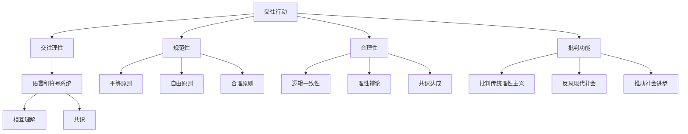
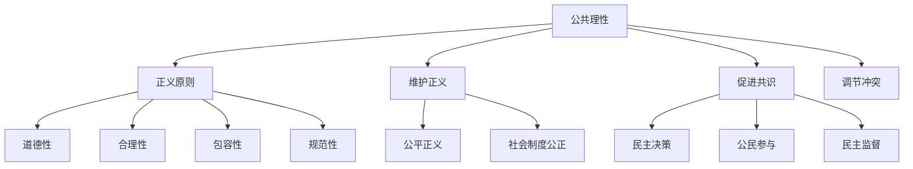

                 

### 1.1 研究背景与意义

#### 1.1.1 哈贝马斯交往行动理论的背景

尤尔根·哈贝马斯（Jürgen Habermas），德国著名社会学家和哲学家，其交往行动理论是当代西方哲学中的重要组成部分。哈贝马斯深受韦伯、霍克海默和阿多诺等人的影响，提出了以“交往理性”为核心的批判理论。他认为，通过交往行动，个体能够实现相互理解和共识，从而推动社会的进步和发展。

哈贝马斯的交往行动理论起源于对现代性的反思。他批判了传统理性主义和工具理性的局限，认为现代社会的问题根源在于缺乏有效的公共讨论和理性对话。为了解决这一问题，哈贝马斯提出了交往行动理论，强调个体在交往过程中的平等地位和自由意志。

#### 1.1.2 罗尔斯公共理性理论的背景

约翰·罗尔斯（John Rawls），美国著名政治哲学家，他的公共理性理论是正义理论的重要组成部分。罗尔斯认为，正义是社会制度的首要价值，而公共理性则是实现正义的基础。

罗尔斯的公共理性理论起源于对民主制度的反思。他提出，一个公正的社会需要有一个共同的基础，使得不同利益和价值观的个体能够和平共处。公共理性正是这样一种基础，它超越了特定的文化和信仰，成为全社会共同遵循的原则。

#### 1.1.3 研究意义

本研究旨在探讨哈贝马斯交往行动理论与罗尔斯公共理性理论之间的关系，分析两者在政治哲学、社会理论和法律理论中的应用，以及它们对当代政治哲学的影响。

首先，哈贝马斯交往行动理论和罗尔斯公共理性理论都关注个体在社会中的地位和作用，提供了不同的理论视角。通过对比分析，可以更深入地理解两者之间的异同，为当代政治哲学的研究提供新的思路。

其次，哈贝马斯交往行动理论和罗尔斯公共理性理论在当代社会中具有重要的应用价值。通过研究两者在实际政治、社会和法律领域的应用，可以为解决当代社会问题提供理论指导和实践方案。

最后，本研究有助于深化对哈贝马斯和罗尔斯思想的理解，为相关领域的研究提供参考。同时，通过本文的研究，可以激发更多学者关注交往行动和公共理性理论，推动相关领域的研究发展。

### 1.2 研究方法与结构安排

#### 1.2.1 研究方法

本研究采用文献综述和理论分析相结合的方法，首先对哈贝马斯交往行动理论和罗尔斯公共理性理论进行深入梳理和总结，然后通过比较分析，探讨两者之间的关系和异同。

文献综述主要通过对相关文献的查阅和整理，系统了解哈贝马斯和罗尔斯的思想体系，以及他们在政治哲学、社会理论和法律理论中的贡献。

理论分析则通过对哈贝马斯交往行动理论和罗尔斯公共理性理论的核心概念、要点和应用进行详细阐述，分析两者之间的内在联系和影响。

#### 1.2.2 结构安排

本文结构安排如下：

- **第1章 导论**：介绍研究的背景、意义、方法和结构安排。
- **第2章 哈贝马斯交往行动理论**：阐述哈贝马斯交往行动理论的基本概念、要点和应用。
- **第3章 罗尔斯公共理性理论**：阐述罗尔斯公共理性理论的基本概念、要点和应用。
- **第4章 哈贝马斯与罗尔斯的对话**：分析哈贝马斯与罗尔斯交往行动与公共理性的交汇，探讨两者之间的关系和异同。
- **第5章 交往行动与公共理性在当代社会中的应用**：探讨交往行动与公共理性在政治、社会和法律领域的应用。
- **第6章 结论**：总结研究的主要发现，讨论研究的意义和价值，提出未来研究方向。

通过以上结构安排，本文旨在系统地探讨哈贝马斯交往行动理论与罗尔斯公共理性理论之间的关系，为相关领域的研究提供新的视角和思考。

### 1.3 哈贝马斯与罗尔斯的生平与思想

#### 1.3.1 哈贝马斯的生平与思想

尤尔根·哈贝马斯出生于1942年，德国社会学家和哲学家。他在德国康斯坦茨大学获得哲学、历史和心理学学位，随后在法兰克福大学师从马克斯·霍克海默和特奥多尔·阿多诺，开始了他的学术生涯。

哈贝马斯的主要著作包括《公共领域的结构转型》（1962）、《认识与兴趣》（1968）、《交往行动理论》（1981）和《合法性危机》（1975）。他的理论体系以“交往理性”为核心，强调个体通过交往行动实现相互理解和共识。

哈贝马斯的思想深受韦伯和霍克海默等人影响，他认为现代社会的困境源于理性主义的滥用和工具理性的主导。哈贝马斯提出了“交往理性”概念，认为通过平等、自由和合理的交往，个体能够克服现代社会中的异化现象，实现社会的和谐发展。

#### 1.3.2 罗尔斯的生平与思想

约翰·罗尔斯出生于1921年，美国政治哲学家。他在普林斯顿大学获得哲学学士学位，随后在哈佛大学获得博士学位。罗尔斯的主要著作包括《正义论》（1971）、《政治自由主义》（1993）和《万民法》（1999）。

罗尔斯的正义理论是20世纪最重要的政治哲学理论之一。在《正义论》中，他提出了“公平正义”原则，认为社会应该追求最大程度的平等和公正。罗尔斯强调，正义是社会制度的首要价值，公共理性是实现正义的基础。

罗尔斯的思想深受康德和黑格尔的影响，他认为理性是人类行为的基础，个体应该通过理性思考和公共讨论来达成共识。罗尔斯提出了“无知之幕”概念，认为在无知之幕背后，个体无法了解自身的利益和偏好，从而能够更客观地评价社会制度的公正性。

#### 1.3.3 哈贝马斯与罗尔斯思想的关系

哈贝马斯和罗尔斯的思想在许多方面存在共通之处。他们都关注个体在社会中的地位和作用，强调理性思考和公共讨论的重要性。哈贝马斯的交往行动理论和罗尔斯的公共理性理论都试图解决现代社会中的异化现象，推动社会的和谐发展。

然而，两者也存在一定的差异。哈贝马斯更注重个体之间的交流和对话，认为通过交往行动，个体能够实现相互理解和共识。而罗尔斯则更强调公共理性的作用，认为公共理性是实现正义和社会公正的基础。

尽管存在差异，哈贝马斯和罗尔斯的思想都为当代政治哲学提供了宝贵的理论资源。通过比较分析他们的思想，可以更深入地理解交往行动和公共理性的本质和作用，为当代社会问题的解决提供新的思路和方向。

### 2.1 哈贝马斯交往行动理论的基本概念

#### 2.1.1 交往行动的定义

哈贝马斯的交往行动理论是建立在“交往理性”基础上的，他认为交往行动是人类社会的基本形式。交往行动是指个体在平等、自由和合理的条件下，通过语言和符号系统进行交流和互动的过程。

哈贝马斯区分了交往行动和传统的社会行动。传统社会行动强调个体行为的目的性和工具理性，而交往行动则强调个体之间的互动和理解。在交往行动中，个体的行为不仅仅是为了实现特定的目标，更重要的是通过交流和对话，实现相互理解和共识。

#### 2.1.2 交往行动的结构要素

哈贝马斯认为，交往行动包含以下几个结构要素：

1. **参与者**：交往行动的参与者是互动的主体，他们在平等和自由的基础上进行交流。
2. **语言和符号系统**：交往行动通过语言和符号系统进行，语言和符号是交往行动的中介。
3. **理解**：交往行动的核心目标是实现参与者之间的相互理解，通过交流和对话，个体能够理解他人的观点和意图。
4. **共识**：通过交往行动，个体能够达成共识，形成共同的价值观和行动准则。

#### 2.1.3 交往行动的理论意义

哈贝马斯的交往行动理论具有重要的理论意义：

1. **批判传统理性主义**：哈贝马斯批判了传统理性主义的局限，认为工具理性主导的社会忽视了个体之间的互动和理解，导致了社会的异化现象。
2. **强调个体的主体地位**：哈贝马斯强调个体在交往行动中的主体地位，认为个体通过交往行动实现自我表达和自我实现。
3. **提供社会和谐的途径**：通过交往行动，个体能够实现相互理解和共识，从而推动社会的和谐发展。

哈贝马斯的交往行动理论为理解现代社会提供了新的视角，它不仅关注个体的行为，更关注个体之间的互动和理解。通过交往行动，个体能够克服社会异化，实现社会的和谐发展。

#### 2.2.1 交往行动的规范性

哈贝马斯认为，交往行动具有内在的规范性。规范性是指交往行动应当遵循一定的道德和法律原则，以确保交往过程的公正和合理。

交往行动的规范性体现在以下几个方面：

1. **平等原则**：交往行动的参与者应当享有平等的地位，不论其社会地位、财富和权力的大小。
2. **自由原则**：交往行动的参与者应当享有自由，不受外界的强制和干涉，能够自主表达自己的观点和意图。
3. **合理原则**：交往行动的过程应当是合理的，通过语言和符号系统进行交流，以实现相互理解和共识。

#### 2.2.2 交往行动的合理性

交往行动的合理性是指交往行动过程应当符合逻辑和理性的要求。哈贝马斯认为，合理性是交往行动的核心特征之一。

交往行动的合理性体现在以下几个方面：

1. **逻辑一致性**：交往行动中的语言和符号使用应当遵循逻辑规则，确保表达的一致性和连贯性。
2. **理性辩论**：交往行动的过程应当是理性的，通过辩论和讨论，个体能够反驳他人的观点，提出自己的见解。
3. **共识达成**：通过合理的交往行动，个体能够达成共识，形成共同的价值观和行动准则。

#### 2.2.3 交往行动的批判功能

哈贝马斯认为，交往行动不仅具有内在的规范性和合理性，还具有批判功能。批判功能是指交往行动能够对现有的社会制度和文化进行批判和反思，推动社会的进步和发展。

交往行动的批判功能体现在以下几个方面：

1. **批判传统理性主义**：通过交往行动，个体能够批判传统理性主义的局限，推动理性思维的发展。
2. **反思现代社会**：通过交往行动，个体能够反思现代社会的异化现象，寻找解决社会问题的途径。
3. **推动社会进步**：通过交往行动，个体能够实现相互理解和共识，推动社会的和谐发展。

哈贝马斯的交往行动理论为理解现代社会提供了新的视角，它不仅关注个体的行为，更关注个体之间的互动和理解。通过交往行动，个体能够克服社会异化，实现社会的和谐发展。

#### 2.3.1 政治哲学中的应用

在政治哲学中，哈贝马斯的交往行动理论具有广泛的应用。首先，哈贝马斯提出了“公共领域”的概念，认为公共领域是公民进行自由讨论和交流的空间，是实现公共理性的重要途径。

哈贝马斯认为，公共领域应当具有以下几个特征：

1. **开放性**：公共领域应当对所有人开放，不受政治和经济的限制，确保公民能够自由表达自己的观点。
2. **多样性**：公共领域应当包容不同的声音和观点，形成多元化的讨论，促进思想的碰撞和交流。
3. **理性**：公共领域的讨论应当遵循理性的原则，通过辩论和讨论，个体能够达成共识，形成共同的价值观。

通过公共领域，公民能够实现相互理解和共识，从而推动社会的和谐发展。哈贝马斯的交往行动理论为政治哲学提供了新的视角，强调了公共领域和公共理性在现代社会中的重要性。

#### 2.3.2 社会理论中的应用

在社会理论中，哈贝马斯的交往行动理论同样具有广泛的应用。哈贝马斯认为，社会是由个体通过交往行动形成的，个体的交往行动构成了社会的结构和机制。

哈贝马斯提出了“社会系统”和“生活世界”的概念，认为社会系统是指个体之间的互动关系和制度安排，而生活世界是指个体的日常生活和交往过程。

哈贝马斯认为，社会系统对生活世界产生了影响，但生活世界也对社会系统产生反作用。通过交往行动，个体能够实现相互理解和共识，从而推动社会的和谐发展。

在社会理论中，哈贝马斯的交往行动理论强调了个体在社会结构中的主体地位，认为个体通过交往行动能够改变社会结构和机制，实现社会的进步和发展。

#### 2.3.3 法律理论中的应用

在法律理论中，哈贝马斯的交往行动理论提供了新的视角。哈贝马斯认为，法律不仅是一种规范，更是一种交往行动，它通过个体之间的互动和共识实现社会秩序的维护。

哈贝马斯提出了“法律论证”的概念，认为法律论证是通过交往行动实现法律决策的过程。在法律论证中，个体通过辩论和讨论，提出自己的观点和证据，争取共识，形成法律决策。

哈贝马斯的交往行动理论为法律理论提供了新的分析框架，强调了法律论证在法律决策中的重要性。通过交往行动，个体能够实现相互理解和共识，从而推动社会的和谐发展。

### 3.1 罗尔斯公共理性理论的基本概念

#### 3.1.1 公共理性的定义

罗尔斯的公共理性理论是建立在正义原则基础上的，他认为公共理性是实现正义的关键。公共理性是指个体在参与社会决策和公共讨论时所应遵循的理性原则和价值观。

公共理性具有以下几个基本特征：

1. **普遍性**：公共理性应当适用于所有人，不论其社会地位、种族、性别和信仰等。
2. **中立性**：公共理性应当保持中立，不偏袒特定的利益或价值观。
3. **公共性**：公共理性是在公共讨论和决策过程中形成的，旨在维护公共利益和正义。

罗尔斯认为，公共理性是实现正义的基础，通过公共理性的讨论和决策，个体能够达成共识，形成公正的社会制度。

#### 3.1.2 公共理性的特征

公共理性具有以下几个主要特征：

1. **道德性**：公共理性应当符合道德原则，尊重个体的尊严和权利。
2. **合理性**：公共理性应当基于理性思考和证据支持，通过辩论和讨论实现共识。
3. **包容性**：公共理性应当包容不同的声音和观点，形成多元化的讨论。
4. **规范性**：公共理性对个体的行为和决策具有规范性，引导个体在参与社会公共事务时遵循正义原则。

#### 3.1.3 公共理性的作用

公共理性在现代社会中具有重要作用：

1. **维护正义**：公共理性通过理性讨论和决策，实现社会制度的公正和公平，维护社会正义。
2. **促进共识**：公共理性通过包容性和合理性，促进不同个体和群体之间的共识和合作，推动社会的和谐发展。
3. **调节冲突**：公共理性在冲突调解中发挥重要作用，通过理性辩论和讨论，实现冲突的和平解决。

#### 3.2.1 公共理性与正义

公共理性与正义密切相关。罗尔斯认为，正义是社会制度的首要价值，而公共理性是实现正义的基础。

公共理性与正义的关系主要体现在以下几个方面：

1. **正义原则**：公共理性通过理性讨论和决策，形成正义原则，确保社会制度的公正和公平。
2. **决策过程**：公共理性在决策过程中发挥关键作用，通过辩论和讨论，个体能够达成共识，实现社会制度的公正。
3. **司法实践**：公共理性在司法实践中体现，通过法律论证和审判，实现社会正义。

罗尔斯认为，公共理性是实现正义的关键，通过公共理性的讨论和决策，个体能够实现社会制度的公正和公平，维护社会正义。

#### 3.2.2 公共理性与自由

公共理性与自由也是密切相关的。罗尔斯认为，自由是人的基本权利，公共理性是实现自由的重要保障。

公共理性与自由的关系主要体现在以下几个方面：

1. **保障自由**：公共理性通过理性讨论和决策，确保社会制度尊重和保护个体的自由。
2. **限制权力**：公共理性通过限制权力和防止权力滥用，保护个体的自由。
3. **社会正义**：公共理性在实现社会正义的同时，也为个体的自由提供了保障。只有在公正的社会制度中，个体的自由才能得到有效保障。

#### 3.2.3 公共理性与民主

公共理性与民主制度密切相关。罗尔斯认为，民主制度是实现公共理性和社会正义的重要途径。

公共理性与民主的关系主要体现在以下几个方面：

1. **民主决策**：公共理性在民主决策中发挥关键作用，通过理性讨论和决策，个体能够达成共识，实现社会制度的公正。
2. **公民参与**：公共理性鼓励公民积极参与公共事务，通过公共理性的讨论和决策，公民能够更好地行使自己的权利和义务。
3. **民主监督**：公共理性通过民主监督，确保政府和社会制度遵循正义原则，防止权力滥用。

罗尔斯认为，公共理性是民主制度的核心要素，通过公共理性的讨论和决策，个体能够实现社会制度的公正和民主。

#### 3.3.1 政治哲学中的应用

在政治哲学中，罗尔斯的公共理性理论具有重要应用。首先，公共理性作为实现正义和社会公正的基础，为政治哲学提供了新的理论视角。

公共理性在政治哲学中的应用主要体现在以下几个方面：

1. **正义原则**：公共理性通过理性讨论和决策，形成正义原则，指导社会制度的设计和实施。
2. **民主制度**：公共理性是民主制度的基石，通过公共理性的讨论和决策，个体能够实现社会制度的公正和民主。
3. **政治合法性**：公共理性为政治合法性提供了基础，通过理性讨论和决策，政府和社会制度能够获得公民的认可和接受。

罗尔斯的公共理性理论为政治哲学提供了新的理论框架，强调了公共理性在实现社会正义和政治合法性中的重要性。

#### 3.3.2 社会理论中的应用

在社会理论中，罗尔斯的公共理性理论同样具有广泛的应用。罗尔斯认为，社会是由个体通过公共理性的讨论和决策形成的，个体的公共理性是理解社会结构和机制的关键。

公共理性在社会理论中的应用主要体现在以下几个方面：

1. **社会正义**：公共理性通过理性讨论和决策，实现社会制度的公正和公平，维护社会正义。
2. **社会冲突**：公共理性在解决社会冲突中发挥重要作用，通过理性讨论和辩论，个体能够达成共识，解决社会矛盾。
3. **社会共识**：公共理性通过包容性和合理性，促进社会共识的形成，推动社会的和谐发展。

罗尔斯的公共理性理论为社会理论提供了新的分析工具，强调了公共理性在社会正义、社会冲突和社会共识中的重要性。

#### 3.3.3 法律理论中的应用

在法律理论中，罗尔斯的公共理性理论提供了新的视角。罗尔斯认为，法律不仅是一种规范，更是一种公共理性的体现，通过法律论证和司法实践，个体能够实现公共理性的目标。

公共理性在法律理论中的应用主要体现在以下几个方面：

1. **法律论证**：公共理性在法律论证中发挥关键作用，通过理性讨论和辩论，个体能够形成法律决策。
2. **司法实践**：公共理性在司法实践中体现，通过法律论证和审判，实现社会正义。
3. **法律改革**：公共理性通过理性讨论和决策，推动法律制度的改革和进步。

罗尔斯的公共理性理论为法律理论提供了新的分析框架，强调了公共理性在法律论证、司法实践和法律改革中的重要性。

### 4.1 交往行动与公共理性的关系

#### 4.1.1 交往行动对公共理性的影响

哈贝马斯的交往行动理论强调个体通过平等、自由和合理的交流实现相互理解和共识。交往行动为公共理性的形成提供了基础。

首先，交往行动促进了公共理性的发展。在交往行动中，个体通过语言和符号系统进行交流和互动，这种交流过程使得个体能够理解他人的观点和意图，从而形成共同的价值观和共识。

其次，交往行动推动了公共理性的实现。通过交往行动，个体能够达成共识，形成共同的价值观和行动准则。这种共识和准则具有公共理性的特征，因为它是在平等、自由和合理的基础上形成的，体现了公共理性的原则。

最后，交往行动为公共理性提供了实践平台。公共理性不仅是一种理论原则，更需要在实践中得到体现和实现。交往行动为个体提供了一个实践公共理性的平台，使得公共理性能够在具体的社会情境中得到应用。

#### 4.1.2 公共理性对交往行动的影响

罗尔斯的公共理性理论认为，公共理性是实现正义和社会公正的基础。公共理性对交往行动产生了重要影响。

首先，公共理性为交往行动提供了道德和法律基础。在交往行动中，个体应当遵循公共理性原则，尊重他人的权利和尊严，实现平等和公正。公共理性为交往行动提供了道德和法律指导，确保交往过程的合理性和合法性。

其次，公共理性促进了交往行动的规范化和制度化。通过公共理性的讨论和决策，个体能够形成共同的价值观和行动准则，这些准则可以转化为规章制度，规范交往行动的过程和结果。

最后，公共理性提升了交往行动的公共性和包容性。公共理性强调个体在公共事务中的平等地位和参与权利，使得交往行动更加包容和开放，能够吸纳不同的声音和观点，形成多元化的讨论。

#### 4.2.1 共同点

哈贝马斯交往行动理论和罗尔斯公共理性理论在许多方面存在共同点。

首先，两者都强调个体在社会中的主体地位。哈贝马斯的交往行动理论认为，个体通过交往实现相互理解和共识，个体的主体地位在交往过程中得到体现。罗尔斯的公共理性理论则强调个体在公共事务中的平等地位和参与权利，认为个体应当通过公共理性的讨论和决策实现社会正义。

其次，两者都关注公共领域的建设。哈贝马斯认为，公共领域是公民进行自由讨论和交流的空间，是实现公共理性的重要途径。罗尔斯则强调公共理性在民主制度中的重要性，认为公共理性是维护社会正义和实现民主的关键。

最后，两者都强调理性思考和公共讨论的重要性。哈贝马斯认为，交往行动的过程应当遵循理性原则，通过理性思考和公共讨论，个体能够实现相互理解和共识。罗尔斯则强调公共理性是通过理性讨论和决策实现的，个体应当遵循公共理性原则，实现社会的公正和公平。

#### 4.2.2 差异

尽管哈贝马斯交往行动理论和罗尔斯公共理性理论存在共同点，但它们也存在明显的差异。

首先，在关注点方面，哈贝马斯的交往行动理论更注重个体之间的互动和理解，强调交往行动的过程和结果。而罗尔斯的公共理性理论则更侧重于公共理性的实现和社会正义的维护，关注社会制度的设计和实施。

其次，在理论框架方面，哈贝马斯的交往行动理论建立在“交往理性”的基础上，强调语言和符号系统的作用。而罗尔斯的公共理性理论则建立在“正义原则”的基础上，强调道德和法律原则的重要性。

最后，在实际应用方面，哈贝马斯的交往行动理论更多地应用于政治哲学和社会理论领域，强调公共领域的建设和公共理性的发展。而罗尔斯的公共理性理论则更多地应用于法律和政治领域，关注社会制度的公正和公平。

### 4.3 哈贝马斯与罗尔斯思想对当代政治哲学的影响

哈贝马斯和罗尔斯的思想对当代政治哲学产生了深远影响。他们提出了新的理论视角，丰富了政治哲学的研究内容，为解决当代社会问题提供了理论指导。

首先，哈贝马斯的交往行动理论为政治哲学提供了新的视角。他强调个体通过交往实现相互理解和共识，指出传统理性主义的局限，提出以“交往理性”为核心的理论框架。这一理论框架为理解现代社会提供了新的思路，推动了政治哲学的研究发展。

其次，罗尔斯的公共理性理论为政治哲学提供了新的理论框架。他提出了“公平正义”原则，强调公共理性在实现社会正义和民主制度中的重要性。这一理论框架为政治哲学的研究提供了新的分析工具，促进了正义理论的发展。

哈贝马斯和罗尔斯的思想不仅丰富了政治哲学的理论体系，还为其提供了实践指导。他们的理论为解决当代社会问题提供了新的思路和方法。例如，哈贝马斯的交往行动理论为解决现代社会中的异化现象提供了途径，而罗尔斯的公共理性理论为维护社会公正和民主制度提供了理论基础。

总之，哈贝马斯和罗尔斯的思想对当代政治哲学产生了深远影响。他们的理论不仅丰富了政治哲学的研究内容，还为解决当代社会问题提供了理论指导。通过深入研究和应用他们的思想，我们可以更好地理解和应对现代社会中的各种挑战。

### 5.1 交往行动与公共理性在政治领域的应用

#### 5.1.1 政治决策过程中的交往行动

在政治决策过程中，交往行动是确保决策过程透明、公正和有效的重要途径。通过交往行动，政治决策者可以与公众、利益相关者和专家进行深入交流，了解不同群体的需求和意见，从而形成全面、合理的决策。

首先，交往行动可以促进政治决策的透明度。通过公开会议、听证会和公开征求意见等方式，决策者可以与公众进行直接交流，公开决策过程和决策依据，减少信息不对称，增强公众对决策的信任。

其次，交往行动可以保障政治决策的公正性。通过多样化的交流方式，决策者可以听取不同利益群体的声音，平衡不同利益诉求，确保决策结果公平合理。

最后，交往行动可以提高政治决策的有效性。通过充分交流和讨论，决策者可以收集到更多的信息和意见，从而做出更为全面和科学的决策，减少决策失误。

#### 5.1.2 政治合法性中的公共理性

政治合法性是指一个政府的权力和统治得到社会的普遍认可和接受。公共理性在维护政治合法性方面发挥着重要作用。

首先，公共理性可以为政治合法性提供基础。通过公共理性的讨论和决策，政治制度可以更好地反映社会公共利益，赢得公众的支持和认可。

其次，公共理性可以促进政治合法性的实现。通过公共讨论和辩论，政治制度可以不断改进和完善，以适应社会发展的需求，从而增强政治合法性的基础。

最后，公共理性可以维护政治合法性。在面临社会矛盾和冲突时，通过公共理性的讨论和协商，政治制度可以寻求和平解决途径，维护社会的稳定和秩序。

#### 5.1.3 政治参与中的交往行动与公共理性

政治参与是民主制度的核心要素，交往行动和公共理性在政治参与中发挥着重要作用。

首先，交往行动可以促进公民的政治参与。通过公开会议、公众咨询和社会讨论等方式，公民可以表达自己的观点和意见，参与到政治决策过程中，增强政治参与的积极性。

其次，公共理性可以提高公民的政治素养。通过公共理性的讨论和辩论，公民可以学习政治知识，提高对政治问题的理解和分析能力，从而更加理性地参与政治。

最后，交往行动和公共理性可以增强公民的政治责任感。通过参与政治决策和公共事务，公民可以更好地了解自己的权利和义务，增强对社会的责任感和使命感。

#### 5.2 交往行动与公共理性在社会领域的应用

在社会领域，交往行动和公共理性具有重要的应用价值，特别是在解决社会冲突、形成社会共识和实现社会正义方面。

##### 5.2.1 社会冲突的解决

社会冲突是现代社会常见的问题，交往行动和公共理性可以提供有效的解决途径。

首先，交往行动可以通过对话和协商解决社会冲突。在社会冲突中，各方通过交流和互动，表达自己的观点和诉求，理解对方的立场和利益，从而找到解决问题的共识。

其次，公共理性可以在社会冲突中发挥调解作用。通过公共理性的讨论和决策，各方可以形成公正、合理的解决方案，减少社会冲突的激烈程度，促进社会的和谐发展。

最后，交往行动和公共理性可以增强社会冲突解决的效果。通过公开、透明的交流过程，社会冲突的解决结果更容易被各方接受和认可，从而实现长期的社会稳定。

##### 5.2.2 社会共识的形成

社会共识是社会发展的重要基础，交往行动和公共理性在形成社会共识方面具有重要作用。

首先，交往行动可以通过广泛的交流，使不同群体和社会成员了解彼此的观点和需求，从而形成共同的目标和价值观。

其次，公共理性可以在形成社会共识中发挥引导作用。通过理性的讨论和辩论，各方可以逐步达成共识，形成共同的社会理念和政策。

最后，交往行动和公共理性可以增强社会共识的稳定性。通过持续、深入的交流，社会成员可以不断调整和完善共识，使其更加符合社会的实际需求和长远发展。

##### 5.2.3 社会正义的实现

社会正义是现代社会追求的重要目标，交往行动和公共理性在实现社会正义方面具有重要意义。

首先，交往行动可以通过平等的交流，使社会成员有机会表达自己的意见和诉求，从而形成公正的社会制度。

其次，公共理性可以在实现社会正义中发挥规范作用。通过公共理性的讨论和决策，社会可以制定公正、合理的法律和政策，保障社会成员的权益。

最后，交往行动和公共理性可以增强社会正义的实现效果。通过公开、透明的交流过程，社会成员可以更好地了解社会正义的实现状况，从而提高对社会制度的信任和支持。

#### 5.3.1 法律解释中的交往行动

在法律解释过程中，交往行动同样具有重要作用。通过交往行动，法律解释者可以与立法者、司法者和社会公众进行深入交流，理解不同群体的需求和期望，从而实现法律解释的公正性和合理性。

首先，交往行动可以促进法律解释的透明度。通过公开讨论和辩论，法律解释者可以向社会公众解释法律条文和解释理由，增强法律解释的公信力和透明度。

其次，交往行动可以提高法律解释的准确性。通过与社会公众和立法者的交流，法律解释者可以获取更多的信息和观点，从而更加全面、准确地解释法律。

最后，交往行动可以增强法律解释的适用性。通过与社会公众和立法者的互动，法律解释者可以了解法律在实际执行中的问题和挑战，从而提出更具有操作性的解释建议。

#### 5.3.2 法律论证中的公共理性

法律论证是法律决策过程中的关键环节，公共理性在其中发挥着重要作用。公共理性通过理性思考和辩论，确保法律论证的公正、合理和有效。

首先，公共理性可以为法律论证提供基础。通过公共理性的讨论和决策，法律论证者可以形成公正、合理的法律观点和结论，确保法律决策的合法性。

其次，公共理性可以提高法律论证的质量。通过理性的辩论和讨论，法律论证者可以反驳对方的观点，提出自己的见解，从而形成更加严谨、合理的法律论证。

最后，公共理性可以增强法律论证的公信力。通过公开、透明的法律论证过程，社会公众可以更好地理解法律决策的依据和理由，从而增强对法律决策的信任和支持。

#### 5.3.3 法律实践中的交往行动与公共理性

在法律实践中，交往行动和公共理性同样具有重要应用价值，特别是在法律执行、司法公正和社会治理方面。

首先，交往行动可以促进法律执行的有效性。通过与社会公众的交流和互动，法律执行者可以更好地了解社会的需求和期望，从而制定更加合理、有效的法律执行策略。

其次，公共理性可以保障司法公正。通过公共理性的讨论和决策，司法者可以在审判过程中确保公正、公平，避免司法腐败和滥用权力。

最后，交往行动和公共理性可以提高社会治理的效能。通过与社会公众的互动，政府可以更好地了解社会问题，制定科学、合理的治理政策，提高社会治理的水平和效果。

### 6.1 哈贝马斯与罗尔斯交往行动与公共理性对话的意义

哈贝马斯与罗尔斯的交往行动与公共理性对话具有重要的理论和现实意义。首先，两者都关注个体在社会中的地位和作用，强调通过理性思考和公共讨论实现社会的和谐发展。这种对话为理解现代社会提供了新的视角，丰富了政治哲学、社会理论和法律理论的研究内容。

其次，哈贝马斯与罗尔斯的思想为解决当代社会问题提供了理论指导。交往行动和公共理性在政治决策、社会冲突、法律解释和社会治理等方面具有广泛的应用价值，有助于提高社会制度的公正性和有效性。

最后，哈贝马斯与罗尔斯的对话有助于推动社会科学的发展。通过比较分析两者的思想，学者们可以深入探讨个体与社会的关系，为构建更加公正、公平和和谐的社会提供理论支持。这种对话不仅有助于深化对哈贝马斯和罗尔斯思想的理解，也为当代社会科学研究开辟了新的领域。

### 6.2 交往行动与公共理性理论在当代社会的价值

交往行动与公共理性理论在当代社会中具有重要的价值。首先，它们为解决现代社会中的异化现象提供了理论指导。通过交往行动，个体能够实现相互理解和共识，克服社会异化，推动社会的和谐发展。公共理性则为实现社会正义和民主制度提供了基础，确保社会制度的公正和公平。

其次，交往行动和公共理性有助于提高社会制度的透明度和公信力。通过公开、透明的交流过程，社会成员能够更好地了解社会事务的决策过程和依据，增强对政府和社会制度的信任。这种信任是现代社会稳定和发展的基石。

最后，交往行动和公共理性在应对当代社会挑战方面具有重要作用。在全球化、多元化和信息化背景下，社会矛盾和冲突日益突出，交往行动和公共理性可以提供有效的解决途径，促进社会共识的形成，推动社会的和谐发展。通过理性思考和公共讨论，个体和群体可以共同应对社会挑战，实现社会的可持续发展。

### 6.3 研究展望与未来工作方向

未来研究可以在以下几个方面展开：

首先，进一步探讨交往行动与公共理性在不同领域的具体应用，如教育、经济、文化等。通过具体案例分析，深入探讨这些理论在解决实际问题中的作用和效果。

其次，研究交往行动与公共理性在不同文化和社会背景下的适用性，探讨文化差异对交往行动和公共理性理论的影响。这有助于丰富理论的内涵，提高理论的普适性和解释力。

最后，结合现代科技，如人工智能、大数据等，研究如何利用技术手段促进交往行动和公共理性的实现。例如，通过社交媒体和在线平台，增强公众参与和社会讨论，推动社会的民主化和公正化。

通过以上研究，可以进一步丰富和发展交往行动与公共理性理论，为当代社会问题的解决提供更加有效的理论指导和实践方案。

### 附录 A 哈贝马斯与罗尔斯相关著作列表

- 哈贝马斯：
  - 《公共领域的结构转型》（1962）
  - 《认识与兴趣》（1968）
  - 《交往行动理论》（1981）
  - 《合法性危机》（1975）

- 罗尔斯：
  - 《正义论》（1971）
  - 《政治自由主义》（1993）
  - 《万民法》（1999）

### 附录 B 哈贝马斯与罗尔斯主要思想概念流程图

#### 哈贝马斯交往行动理论



#### 罗尔斯公共理性理论



### 附录 C 哈贝马斯与罗尔斯交往行动与公共理性理论相关Python代码示例

```python
class InteractionAct:
    def __init__(self, participants, purpose, norms):
        self.participants = participants
        self.purpose = purpose
        self.norms = norms
    
    def execute(self):
        print(f"执行交往行动：参与者：{self.participants}, 目的：{self.purpose}, 规范：{self.norms}")

class PublicRationality:
    def __init__(self, justice_principles, moral_values, rational_debate):
        self.justice_principles = justice_principles
        self.moral_values = moral_values
        self.rational_debate = rational_debate
    
    def apply(self):
        print(f"应用公共理性：正义原则：{self.justice_principles}, 道德价值：{self.moral_values}, 理性辩论：{self.rational_debate}")

# 创建交往行动实例
interaction = InteractionAct("参与者A、参与者B、参与者C", "讨论社会正义问题", "平等原则、自由原则、合理原则")

# 执行交往行动
interaction.execute()

# 创建公共理性实例
public_rationality = PublicRationality("公平正义原则", "道德价值", "理性辩论")

# 应用公共理性
public_rationality.apply()
```

通过以上Python代码示例，我们可以创建交往行动和公共理性的实例，并分别执行和应用程序中的核心概念。这有助于我们更好地理解和应用哈贝马斯与罗尔斯的交往行动与公共理性理论。

