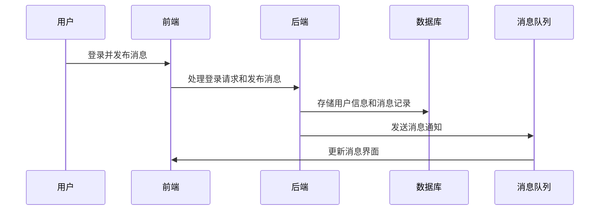

                 


## 《哈贝马斯与罗蒂：交往行为理论与新实用主义》

### 关键词：哈贝马斯、交往行为理论、罗蒂、新实用主义、哲学、社会学

#### 摘要：
本文旨在探讨两位重要哲学家哈贝马斯与罗蒂的交往行为理论和新实用主义，分析其核心概念、联系与差异，以及它们在当代哲学和社会学中的应用与影响。文章结构清晰，采用逻辑推理的方式，深入浅出地阐述了哈贝马斯交往行为理论的基本概念、罗蒂新实用主义的核心思想，以及两者之间的比较分析。通过详细的实例和案例分析，本文展示了这些理论在现实世界中的具体应用，并提出了未来发展的可能方向。

## 目录

1. **哈贝马斯交往行为理论概述**
   1.1 哈贝马斯生平与学术贡献
   1.2 哈贝马斯交往行为理论的核心概念
   1.3 哈贝马斯交往行为理论的演进

2. **哈贝马斯交往行为理论的核心概念与联系**
   2.1 认识与理解
   2.2 讨论与实践
   2.3 哈贝马斯交往行为理论的应用领域

3. **罗蒂新实用主义概述**
   3.1 罗蒂生平与学术思想
   3.2 新实用主义的核心概念
   3.3 新实用主义的哲学意义

4. **哈贝马斯与罗蒂理论比较分析**
   4.1 哈贝马斯与罗蒂理论的核心差异
   4.2 哈贝马斯与罗蒂理论的相似之处
   4.3 哈贝马斯与罗蒂理论的相互影响

5. **哈贝马斯交往行为理论的应用与批评**
   5.1 哈贝马斯交往行为理论在政治哲学中的应用
   5.2 哈贝马斯交往行为理论在社会学中的批评与回应
   5.3 哈贝马斯交往行为理论在文化研究中的运用

6. **罗蒂新实用主义的挑战与回应**
   6.1 新实用主义面临的哲学挑战
   6.2 新实用主义对传统哲学的批评
   6.3 新实用主义的未来发展方向

7. **哈贝马斯与罗蒂：交往行为理论与新实用主义的未来**
   7.1 交往行为理论与新实用主义的融合趋势
   7.2 交往行为理论与新实用主义在当代哲学中的地位
   7.3 交往行为理论与新实用主义的跨学科应用前景

### 引言

在当代哲学和社会学中，哈贝马斯与罗蒂的交往行为理论和新实用主义占据着重要地位。哈贝马斯（Jürgen Habermas）是一位德国哲学家，以其社会理论、政治哲学和法哲学而闻名。他的交往行为理论强调沟通理性、共识形成和公共领域的重要性，对现代社会和民主政治产生了深远影响。罗蒂（Richard Rorty）则是美国哲学家，他的新实用主义挑战了传统哲学的基础，主张通过实用主义的方式解决哲学问题，提倡文化相对主义和多元主义。

本文旨在探讨这两位哲学家的理论，分析其核心概念、联系与差异，以及它们在现实世界中的应用与影响。通过逻辑清晰的推理和分析，本文将帮助读者深入了解哈贝马斯交往行为理论和新实用主义的内涵，并思考其在当代社会中的意义。

### 哈贝马斯交往行为理论概述

#### 1.1 哈贝马斯生平与学术贡献

哈贝马斯（Jürgen Habermas）生于1929年，德国著名的哲学家、社会学家和政治学家。他在二战结束后不久成长于战后重建的德国，这种经历深刻地影响了他的学术观点和关注点。哈贝马斯曾就读于海德堡大学和哥廷根大学，在著名哲学家马克斯·霍克海默（Max Horkheimer）和赫伯特·马尔库塞（Herbert Marcuse）的影响下，开始对马克思主义和批判理论产生兴趣。

哈贝马斯的学术生涯始于20世纪50年代，他的早期作品主要集中在社会学和哲学领域。1964年，他发表了《公共领域的结构转型》，这一著作标志着他交往行为理论的初步形成。随后，哈贝马斯的学术视野逐渐扩展到政治哲学、法哲学和伦理学等领域，他的著作如《理论和实践》、《作为意识形态的国家理论》等，均为学术界带来了深远的影响。

哈贝马斯的理论体系涉及广泛，但他的核心贡献在于交往行为理论。这一理论试图回答如何通过理性的沟通和共识形成来实现民主和正义。哈贝马斯认为，人类社会的发展离不开有效的沟通和交往，而公共领域则是沟通和交往的重要场所。他的这一观点对当代社会和政治理论产生了重要影响，尤其是在讨论民主政治和公共领域的问题上。

#### 1.2 哈贝马斯交往行为理论的核心概念

哈贝马斯的交往行为理论建立在一系列核心概念之上，这些概念相互联系，共同构成了他理论的基本框架。以下是这些核心概念的简要说明：

1. **沟通理性**：沟通理性是哈贝马斯交往行为理论的核心概念之一。它指的是一种基于语言和符号的理性，通过沟通和对话实现理解和共识。沟通理性强调在交往过程中，各方必须遵循某些基本规则，如真实性、真诚性和无偏见性。

2. **话语伦理**：话语伦理是哈贝马斯用来指导理性对话和沟通的一套道德原则。它要求在交往过程中，各方必须保持诚实、公正和尊重。话语伦理不仅关注个体道德行为，也关注社会规范和制度。

3. **公共领域**：公共领域是哈贝马斯交往行为理论中的关键概念，指的是一个开放的社会空间，公民可以在其中自由讨论和交流观点。公共领域是民主政治的基础，它为公民提供了表达意见和参与决策的平台。

4. **共识形成**：共识形成是哈贝马斯交往行为理论的目标之一。通过理性的沟通和讨论，各方可以达成共识，解决社会冲突和矛盾。共识形成依赖于沟通理性、话语伦理和公共领域。

#### 1.3 哈贝马斯交往行为理论的演进

哈贝马斯的交往行为理论经历了多个发展阶段，从早期的批判理论到晚期的系统理论，他的理论逐渐完善和深化。以下是哈贝马斯交往行为理论的主要演进过程：

1. **早期批判理论**：在早期批判理论中，哈贝马斯关注资本主义社会中的异化和控制。他探讨了意识形态如何掩盖社会现实，并提出通过批判意识形态来实现真正的民主和自由。

2. **交往行为理论**：哈贝马斯在20世纪60年代开始构建他的交往行为理论。这一理论强调通过理性的沟通和共识形成来解决社会问题，强调公共领域在民主政治中的重要性。

3. **晚期系统理论**：在晚期系统理论中，哈贝马斯进一步发展了他的交往行为理论，探讨了社会系统与文化系统之间的关系。他认为，社会系统和文化系统必须相互协调，才能实现真正的民主和正义。

#### 1.4 哈贝马斯交往行为理论的现实意义

哈贝马斯的交往行为理论在当代社会中具有深刻的现实意义。首先，它为解决现代社会中的冲突和矛盾提供了新的思路。通过理性的沟通和共识形成，各方可以找到共同点，解决社会分歧。其次，哈贝马斯的交往行为理论强调了公共领域的重要性，为公民参与政治提供了理论依据。最后，哈贝马斯的理论为全球化背景下的多元文化社会提供了新的视角，促进了不同文化之间的对话和交流。

总之，哈贝马斯的交往行为理论不仅在哲学领域产生了重要影响，也为解决当代社会问题提供了有价值的理论资源。通过深入理解和应用这些理论，我们可以更好地应对现代社会中的挑战。

### 哈贝马斯交往行为理论的核心概念与联系

#### 2.1 认识与理解

哈贝马斯的交往行为理论中，认识和理解为核心基础。在这一部分，我们将探讨认识与理解的概念、它们在交往行为理论中的重要性，以及如何通过符号互动实现这些目标。

**概念说明**

- **认识**：认识是交往行为理论中的基础概念，指的是个体通过感知、思考和判断来获取和理解信息的过程。哈贝马斯强调，认识不仅仅是个体内部的心理活动，还包括个体之间的交流和互动。

- **理解**：理解是认识的深化，指的是通过对话和沟通，个体之间能够相互理解对方的思想、情感和行为。理解是一种动态的过程，通过不断的交流和反馈，个体之间的认识差距得到缩小。

**重要性**

- **沟通理性**：认识和理解为沟通理性提供了基础。沟通理性强调通过理性的对话和讨论，各方能够达到共识，实现理解和共识的形成。

- **公共领域**：认识和理解的深化依赖于公共领域的存在。公共领域是公民自由讨论和交流的平台，通过这个平台，个体能够表达自己的观点，倾听他人的意见，从而加深理解和共识。

**实现方式**

- **符号互动**：哈贝马斯认为，符号互动是实现认识和理解的途径。通过语言、文字、图像等符号，个体能够表达自己的思想，传递信息，从而实现沟通和理解。符号互动不仅包括面对面的交流，还包括书面文字、网络沟通等多种形式。

#### 2.2 沟通行动

沟通行动是哈贝马斯交往行为理论的重要组成部分。在这一部分，我们将讨论沟通行动的概念、特征，以及如何在现实世界中实现有效的沟通行动。

**概念说明**

- **沟通行动**：沟通行动是指个体通过语言、符号和交流来实现某种目的的过程。哈贝马斯将沟通行动分为四个基本类型：指示性沟通、表达性沟通、协调性沟通和冲突性沟通。

- **特征**：沟通行动具有以下特征：
  - **互为主体性**：沟通行动不是单向的信息传递，而是双方或多方之间的互动和对话。
  - **规范性**：沟通行动受到道德规范和社会规范的约束，要求各方在交流过程中保持诚实、公正和尊重。
  - **目的性**：沟通行动具有明确的目的，如表达观点、协调关系、解决问题等。

**实现方式**

- **理性对话**：实现有效的沟通行动，需要各方进行理性对话。理性对话要求各方基于事实和逻辑进行讨论，避免情绪化和偏见，通过对话找到共识。

- **沟通技巧**：有效的沟通行动还依赖于良好的沟通技巧。包括倾听、表达、提问、反馈等技巧，这些技巧有助于增强沟通的有效性和理解性。

#### 2.3 话语伦理

话语伦理是哈贝马斯交往行为理论中的重要组成部分，它指导个体在交往过程中的道德行为。在这一部分，我们将探讨话语伦理的概念、原则和应用。

**概念说明**

- **话语伦理**：话语伦理是指个体在交往过程中应遵循的一套道德原则。它强调在交往过程中保持诚实、公正、尊重和理性，以实现有效的沟通和共识。

- **原则**：话语伦理的原则包括：
  - **真实性**：在交往中，个体应如实表达自己的观点和情感，不隐瞒或歪曲事实。
  - **真诚性**：个体在交往中应真诚地表达自己的意图，不欺骗或误导他人。
  - **无偏见性**：个体在交往中应保持客观和中立，不偏袒任何一方。

**应用**

- **政治哲学**：话语伦理在政治哲学中具有重要应用。它为民主政治提供了道德基础，要求政治家在公共讨论中保持诚实和公正，以实现真正的民主和正义。

- **社会交往**：话语伦理在社会交往中也具有重要作用。它帮助个体在日常生活中建立良好的人际关系，促进社会和谐与稳定。

#### 2.4 公共领域

公共领域是哈贝马斯交往行为理论中的关键概念，它为个体提供了自由讨论和交流的平台。在这一部分，我们将讨论公共领域的概念、功能和重要性。

**概念说明**

- **公共领域**：公共领域是指一个开放的社会空间，公民可以在其中自由讨论和交流观点。哈贝马斯认为，公共领域是民主政治的基础，是公民表达意见和参与决策的平台。

- **功能**：公共领域具有以下功能：
  - **表达意见**：公共领域为公民提供了表达意见的自由，使个体能够公开讨论社会问题，表达自己的观点。
  - **监督政府**：公共领域可以监督政府的决策和行为，通过舆论压力促使政府更加透明和负责。
  - **形成共识**：公共领域为公民提供了交流的平台，通过讨论和辩论，各方可以找到共识，解决社会分歧。

**重要性**

- **民主政治**：公共领域是民主政治的基石。它为公民提供了参与政治决策的机会，确保了民主的运行和实现。

- **社会进步**：公共领域促进了社会的进步和发展。通过自由讨论和交流，社会可以不断反思和改进，推动社会的进步。

#### 2.5 共识形成

共识形成是哈贝马斯交往行为理论的目标之一。通过理性的沟通和讨论，各方可以达成共识，解决社会冲突和矛盾。在这一部分，我们将探讨共识形成的概念、过程和重要性。

**概念说明**

- **共识形成**：共识形成是指在理性的沟通和讨论过程中，各方达成一致意见的过程。共识形成不仅要求各方在观点上达成一致，还要求在行动上达成一致。

- **过程**：共识形成的过程包括：
  - **信息共享**：各方通过沟通和交流，共享信息，了解对方的观点和立场。
  - **理性讨论**：各方基于事实和逻辑进行讨论，通过辩论和反驳，寻找共识。
  - **共识达成**：通过不断的沟通和讨论，各方最终达成共识，解决社会分歧。

**重要性**

- **社会稳定**：共识形成是社会稳定的基础。通过达成共识，社会可以避免冲突和矛盾，保持和谐与稳定。
- **民主发展**：共识形成是民主政治的发展方向。通过民主讨论和共识形成，社会可以不断改进和完善民主制度。

#### 2.6 小结

哈贝马斯的交往行为理论以其深刻的哲学内涵和现实意义，为现代社会提供了重要的理论资源。通过认识和理解的深化、沟通行动的实践、话语伦理的指导、公共领域的构建和共识的形成，哈贝马斯试图构建一个理性、公正和自由的社会。他的理论不仅丰富了哲学和社会学的理论体系，也为解决当代社会问题提供了有益的思路。

在接下来的部分，我们将进一步探讨罗蒂的新实用主义，分析其核心概念和与哈贝马斯交往行为理论的异同，为全面理解这两位哲学家的贡献奠定基础。

### 罗蒂新实用主义概述

#### 3.1 罗蒂生平与学术思想

理查德·罗蒂（Richard Rorty）是一位美国哲学家，生于1931年，于2007年去世。罗蒂的哲学思想深受实用主义和人文主义的影响，他在20世纪后期以其独特的视角对传统哲学进行了深刻的批判和重构。罗蒂曾就读于康奈尔大学，并在耶鲁大学获得博士学位，其后在许多知名学府任教，包括加州大学伯克利分校和哥伦比亚大学。

罗蒂的学术生涯可分为三个阶段。早期，他主要从事语言哲学和心灵哲学的研究，对逻辑实证主义和语言分析哲学提出了批评。中期，罗蒂转向政治哲学和文化理论，探讨哲学、文学和宗教的关系。晚期，罗蒂的新实用主义思想逐渐成形，他提出了一种基于实用主义和文化相对主义的哲学体系，试图从根本上重新定义哲学的功能和目的。

#### 3.2 新实用主义的核心概念

罗蒂的新实用主义以实用主义为基础，强调知识和真理的相对性和文化的多样性。以下是新实用主义的核心概念：

1. **真理相对性**：罗蒂认为，真理不是固定不变的事实，而是基于特定文化和社会背景的理解和解释。不同的文化和社会对真理有不同的看法和标准，因此，不存在绝对的、客观的真理。

2. **实用主义**：实用主义主张知识应该是有用的，真理的价值在于其对实践的有效性。罗蒂认为，哲学的任务不是发现永恒的真理，而是提供有用的思维工具和解释框架，帮助人们更好地理解和应对现实世界。

3. **文化相对主义**：文化相对主义强调每个文化都有其独特的历史、价值观和信念体系。罗蒂认为，不同文化之间的冲突往往源于对“什么是好的”和“什么是真实的”的不同理解。因此，文化相对主义要求我们尊重和接纳不同的文化视角。

4. **反基础主义**：反基础主义是罗蒂新实用主义的一个重要特征，它反对在哲学中寻找绝对的基础或起点。罗蒂认为，哲学的基础是文化和历史的产物，而不是超越文化和历史的绝对真理。

#### 3.3 新实用主义的哲学意义

罗蒂的新实用主义对传统哲学提出了深刻的挑战，并具有显著的哲学意义。以下是其主要的哲学意义：

1. **解构传统哲学**：罗蒂认为，传统哲学，特别是西方哲学，过于追求绝对真理和基础，忽视了人类经验的多样性和复杂性。他的新实用主义试图解构这种基础主义和绝对主义，为哲学开辟新的路径。

2. **提倡多元文化**：罗蒂的新实用主义强调文化相对主义，主张尊重和接纳不同的文化视角。这一观点在全球化背景下尤为重要，有助于促进不同文化之间的对话和理解。

3. **重构哲学功能**：罗蒂认为，哲学的功能不是发现永恒的真理，而是提供有用的思维工具和解释框架。他的实用主义视角为哲学的发展提供了新的方向，使哲学更加贴近现实生活。

4. **挑战理性主义**：罗蒂反对传统的理性主义，认为理性不是人类认识的唯一途径。他主张通过情感、直觉和经验来理解世界，这一观点为哲学研究提供了更广泛的视角。

总之，罗蒂的新实用主义以其独特的视角和深刻的批判，对传统哲学进行了重构，为当代哲学提供了新的思考方向和理论资源。

#### 3.4 新实用主义的影响

理查德·罗蒂的新实用主义对当代哲学和社会科学产生了深远的影响，尤其是在文化理论、文学理论和政治哲学领域。以下是其影响的几个方面：

1. **文化理论**：罗蒂的新实用主义挑战了传统文化理论中关于文化客观性和普遍性的观点，主张文化是动态的、相对的。他的文化相对主义观念促进了不同文化之间的对话和交流，推动了多元文化主义的兴起。

2. **文学理论**：罗蒂的文学理论强调文学文本的多元解读和开放性。他认为，文学的意义不是固定的，而是读者在具体社会文化背景下建构的。这一观点为文学批评和解读提供了新的视角，促进了文学理论的发展。

3. **政治哲学**：罗蒂的政治哲学关注民主、自由和社会正义等问题。他主张通过理性对话和共识形成来实现社会变革，反对传统政治哲学中的基础主义和绝对主义。他的实用主义视角为解决现代社会中的政治问题提供了新的思路。

4. **社会科学**：罗蒂的新实用主义影响了社会科学的研究方法和理论框架。他强调经验数据和实证研究的价值，主张通过具体案例和实际应用来验证理论。这一观点促进了社会科学的跨学科研究和发展。

总之，罗蒂的新实用主义以其深刻的批判和创新，为当代哲学和社会科学提供了新的理论资源和方法论指导，对学术界和社会实践产生了广泛而深远的影响。

### 哈贝马斯与罗蒂理论比较分析

#### 4.1 哈贝马斯与罗蒂理论的核心差异

哈贝马斯与罗蒂的哲学思想虽然在某些方面有相似之处，但它们的核心差异主要体现在以下几方面：

1. **理性观念**：哈贝马斯的交往行为理论强调沟通理性，认为通过理性的对话和讨论，个体可以实现理解和共识。哈贝马斯的理性是一种基于语言和符号的理性，强调逻辑、真理和共识的形成。而罗蒂的新实用主义则认为理性不是绝对的，真理是相对的、动态的，依赖于特定的社会文化背景。罗蒂的理性更多地关注实践的有效性和文本的解读。

2. **社会视角**：哈贝马斯的交往行为理论主要关注现代社会中的民主政治和公共领域。他试图通过构建一个理性的公共领域，来实现民主和正义。而罗蒂的新实用主义则更关注文化、文学和语言。他认为，社会问题和文化问题可以通过实用主义和文化相对主义的方式解决。

3. **基础主义**：哈贝马斯反对基础主义，认为社会规范和道德原则是社会交往的产物，而不是超越社会的绝对真理。罗蒂则进一步推进了这一观点，他主张彻底抛弃基础主义，认为任何试图寻找绝对基础或起点的做法都是徒劳的。

#### 4.2 哈贝马斯与罗蒂理论的相似之处

尽管哈贝马斯与罗蒂的理论存在显著差异，但它们在以下几方面也有相似之处：

1. **批判传统哲学**：两位哲学家都批判了传统哲学的基础主义和理性主义。哈贝马斯认为，传统哲学过于追求绝对真理和基础，忽视了社会现实和人类经验。罗蒂则进一步推进了这一批判，主张彻底抛弃基础主义，认为哲学应该关注具体的文化和社会问题。

2. **关注社会问题**：哈贝马斯和罗蒂都关注现代社会中的问题和挑战。哈贝马斯关注民主政治和公共领域，试图通过构建一个理性的公共领域来解决社会冲突。罗蒂则关注文化、文学和社会正义，主张通过实用主义和文化相对主义的方式解决这些问题。

3. **强调对话与交流**：两位哲学家都认为，对话和交流是实现理解和共识的重要途径。哈贝马斯的交往行为理论强调通过理性的对话和讨论，个体可以实现理解和共识。罗蒂的新实用主义则主张通过多元文化的对话和交流，解决社会和文化问题。

#### 4.3 哈贝马斯与罗蒂理论的相互影响

哈贝马斯与罗蒂的哲学思想在各自的发展过程中受到了对方的影响，并在一定程度上进行了互动和对话：

1. **哈贝马斯对罗蒂的影响**：哈贝马斯的交往行为理论对罗蒂的新实用主义产生了一定影响。罗蒂在构建他的实用主义和文化相对主义理论时，受到了哈贝马斯对公共领域和社会交往的强调。例如，罗蒂在《偶然、反讽和团结》一书中，就借鉴了哈贝马斯的公共领域概念，提出了“文化共同体”的概念。

2. **罗蒂对哈贝马斯的影响**：罗蒂的新实用主义也对哈贝马斯的思想产生了影响。哈贝马斯在后来的作品中，尤其是在《理论与实践》一书中，开始关注话语伦理和文本解读的问题，这体现了罗蒂实用主义和反基础主义思想的影响。

总之，哈贝马斯与罗蒂的哲学思想虽然在某些方面存在差异，但它们在批判传统哲学、关注社会问题、强调对话与交流等方面有相似之处，并在各自的发展过程中受到了对方的影响。这种相互影响和对话不仅丰富了哲学的理论体系，也为解决当代社会问题提供了新的思路。

### 哈贝马斯交往行为理论的应用与批评

#### 5.1 哈贝马斯交往行为理论在政治哲学中的应用

哈贝马斯的交往行为理论在政治哲学中有着广泛的应用，特别是在讨论民主、法治和公共领域等方面。哈贝马斯主张，一个理想的民主社会应当具备以下几个特征：

1. **公共领域**：哈贝马斯认为，公共领域是民主政治的核心，是公民自由讨论和表达意见的空间。在这个空间中，公民可以就社会问题进行理性的讨论，形成公共意见，从而对政府施加压力。公共领域的存在确保了民主的实质，使得政府能够反映和回应公民的需求。

2. **沟通理性**：哈贝马斯强调，民主政治的基础是沟通理性。沟通理性要求政治参与者遵循一定的道德原则，如真实性、真诚性和无偏见性。通过理性的沟通和讨论，各方可以在尊重彼此观点的基础上达成共识，从而实现公平和正义。

3. **法治**：哈贝马斯认为，法治是民主政治的重要组成部分。法治不仅要求政府依法行事，还要求法律本身具有合理性。哈贝马斯主张，法律应该基于公共领域的讨论和共识，从而确保其合法性和公正性。

#### 实际案例：德国的民主政治实践

德国是哈贝马斯交往行为理论在政治哲学中应用的典型案例。在德国，公共领域非常活跃，媒体和公民社会在政治决策过程中发挥着重要作用。例如，德国的议会辩论和公众舆论对政府决策有着重要影响。德国的媒体在公共领域的构建中起到了关键作用，通过报道和评论，促使政府更加透明和负责任。

此外，德国的法律体系也体现了哈贝马斯的法治思想。德国的法律制定过程往往涉及广泛的公众讨论和辩论，确保法律具有合法性和合理性。例如，德国在制定《基本法》时，进行了广泛的公众参与和讨论，最终形成了一部具有广泛合法性和合理性的法律。

#### 5.2 哈贝马斯交往行为理论在社会学中的批评与回应

尽管哈贝马斯的交往行为理论在政治哲学中得到了广泛应用，但也在社会学领域受到了批评。以下是一些主要的批评观点及其回应：

1. **批评观点**：一些社会学家认为，哈贝马斯的交往行为理论过于理想化，忽视了现实社会中的复杂性和多样性。他们认为，哈贝马斯的理论在描述一个理想化的公共领域时，忽略了社会不平等、权力差异和利益冲突等问题。

2. **回应**：哈贝马斯对这些批评进行了回应，他认为，尽管现实社会中的公共领域可能并不完美，但通过不断努力和改革，公共领域可以逐步完善。哈贝马斯主张，通过教育、媒体和公民参与等手段，可以促进公共领域的建设，从而实现更广泛的民主和正义。

3. **批评观点**：另一些社会学家认为，哈贝马斯的交往行为理论过于强调语言和沟通的作用，忽视了其他社会因素，如经济、文化和政治结构等。他们认为，这些因素也对社会交往和行为产生重要影响。

4. **回应**：哈贝马斯承认，他的理论在强调语言和沟通作用的同时，确实忽视了其他社会因素。但他认为，语言和沟通是社会交往的重要工具，通过合理的沟通和对话，可以逐步解决社会问题。此外，哈贝马斯也试图在他的理论中引入其他社会因素，如公共领域的社会结构和文化背景等。

#### 5.3 哈贝马斯交往行为理论在文化研究中的运用

哈贝马斯的交往行为理论在文化研究中也得到了广泛应用，特别是在探讨文化生产、文化批判和文化认同等方面。以下是一些主要的应用：

1. **文化生产**：哈贝马斯认为，文化生产是公共领域的一个重要组成部分。在这个领域，文化产品和符号系统通过沟通和交流得以创造和传播。文化生产不仅包括艺术作品、文学作品等传统文化产品，还包括广告、媒体和流行文化等现代文化产品。

2. **文化批判**：哈贝马斯的交往行为理论为文化批判提供了新的视角。通过分析文化产品和文化现象，研究者可以揭示隐藏在背后的权力关系和意识形态。文化批判有助于揭示文化生产中的不平等和压迫，推动文化的多元化和包容性。

3. **文化认同**：哈贝马斯认为，文化认同是通过公共领域的交流和互动形成的。在这个意义上，文化认同是一个动态的过程，受社会文化背景和历史条件的影响。通过参与公共讨论和文化交流，个体可以形成和重构自己的文化认同。

综上所述，哈贝马斯的交往行为理论在政治哲学、社会学和文化研究等领域得到了广泛应用。通过深入理解和应用这些理论，我们可以更好地理解现代社会中的问题，并寻求有效的解决方案。

### 罗蒂新实用主义的挑战与回应

#### 6.1 新实用主义面临的哲学挑战

罗蒂的新实用主义在提出后，尽管受到了广泛认可，但也面临着诸多哲学挑战。以下是一些主要的挑战及其对罗蒂思想的挑战：

1. **真理的相对性**：罗蒂主张真理是相对的，依赖于特定的文化和社会背景。然而，这一观点遭到了批评，认为它导致了相对主义和怀疑论。一些哲学家认为，如果真理是相对的，那么任何观点都同等合理，这会导致伦理和道德的崩溃。

2. **实用主义的局限性**：罗蒂的实用主义强调知识和真理的实用性，但这种观点忽视了理论研究的价值。批评者认为，实用主义可能导致过度关注现实问题，而忽视了基础理论和概念框架的构建。

3. **文化相对主义的争议**：罗蒂的文化相对主义观点认为，每个文化都有其独特的历史和价值观。然而，这一观点也引发争议，一些学者认为，文化相对主义可能导致文化沙文主义和排斥外来文化。

#### 6.2 新实用主义对传统哲学的批评

罗蒂的新实用主义对传统哲学进行了深刻的批评，这些批评主要体现在以下几个方面：

1. **基础主义和绝对主义**：罗蒂认为，传统哲学过于追求基础主义和绝对主义，试图寻找永恒的真理和普遍的道德原则。然而，罗蒂认为，这些努力是徒劳的，因为真理和道德是相对的、文化的产物。

2. **理性主义**：罗蒂批评理性主义将理性视为人类认识的唯一途径，忽视了情感、直觉和经验的作用。他认为，理性并不是绝对优越的，而是多种认知方式中的一种。

3. **哲学的功能**：罗蒂认为，传统哲学的功能过于狭窄，过于关注抽象的理论问题，忽视了现实世界中的具体问题。他主张，哲学应该更加关注具体的社会和文化问题，提供实用的思维工具和解释框架。

#### 6.3 新实用主义的未来发展方向

尽管罗蒂的新实用主义面临诸多挑战，但它在哲学和人文社会科学领域仍有广阔的发展空间。以下是其未来发展的几个可能方向：

1. **跨学科研究**：新实用主义强调实用性和文化相对性，可以与其他学科如社会学、心理学、文学等进行跨学科研究，从而提供更全面的解释框架。

2. **应用哲学**：新实用主义可以应用于解决现实世界中的具体问题，如社会公正、环境保护、科技伦理等，从而提高哲学的实用性和影响力。

3. **文化对话**：新实用主义主张文化相对主义，可以促进不同文化之间的对话和交流，推动全球文化多样性和包容性。

总之，罗蒂的新实用主义尽管面临挑战，但它在哲学和人文社会科学领域仍有重要的理论价值和现实意义。通过不断的发展和探索，新实用主义有望为解决当代社会问题提供新的思路和方法。

### 哈贝马斯与罗蒂：交往行为理论与新实用主义的未来

#### 7.1 交往行为理论与新实用主义的融合趋势

哈贝马斯的交往行为理论和新实用主义虽然源于不同的哲学传统，但它们在当代哲学和社会科学中展现出融合的趋势。这种趋势主要体现在以下几个方面：

1. **沟通理性与实用主义的结合**：哈贝马斯的沟通理性强调通过理性的对话和讨论达成共识，而罗蒂的新实用主义则强调知识和真理的实用性。两者结合可以形成一种更加综合的理性观念，既重视沟通和共识的形成，也关注知识和真理的实际应用。

2. **公共领域与文化的互动**：哈贝马斯的公共领域概念强调开放的社会空间，而罗蒂的文化相对主义则强调不同文化的多样性。两者的结合可以探讨如何在多元文化的背景下构建有效的公共领域，促进不同文化之间的对话和交流。

3. **理论与实践的整合**：哈贝马斯的交往行为理论注重理论和实践的结合，而罗蒂的新实用主义强调实用主义和方法论的灵活性。两者的结合可以形成一种更加动态和灵活的哲学方法论，有助于应对复杂的社会问题。

#### 7.2 交往行为理论与新实用主义在当代哲学中的地位

哈贝马斯的交往行为理论和新实用主义在当代哲学中占据着重要地位，它们对哲学的发展产生了深远影响：

1. **批判传统哲学**：哈贝马斯和新实用主义共同批判了传统哲学中的基础主义和理性主义，提出了相对主义和实用主义的新视角。这一批判有助于哲学摆脱过于抽象和脱离现实的困境，使其更加关注现实问题和具体实践。

2. **拓展哲学领域**：哈贝马斯和新实用主义拓展了哲学的边界，使其不仅关注理论问题，也关注社会、文化和政治问题。这一拓展使得哲学更加贴近现实生活，为解决当代社会问题提供了理论资源。

3. **促进跨学科研究**：哈贝马斯和新实用主义的方法论强调跨学科研究和综合思考，促进了哲学与其他学科如社会学、心理学、文化研究的互动和融合。

#### 7.3 交往行为理论与新实用主义的跨学科应用前景

哈贝马斯的交往行为理论和新实用主义不仅在哲学领域有着重要地位，也具有广阔的跨学科应用前景：

1. **社会科学**：在社会科学领域，哈贝马斯的交往行为理论可以应用于研究社会互动、公共领域和民主政治。新实用主义则可以用于探讨社会文化的多样性、社会问题的解决和文化变迁。

2. **人文科学**：在人文科学领域，哈贝马斯和新实用主义可以应用于文学研究、艺术批评和文化分析。通过分析文学作品和艺术作品，可以更好地理解人类的情感、思想和价值观。

3. **科技伦理**：在科技伦理领域，哈贝马斯的交往行为理论可以用于探讨科技对社会和人类生活的影响，而新实用主义则可以用于评估科技的实用性和道德合理性。

总之，哈贝马斯的交往行为理论和新实用主义在当代哲学中具有重要地位，它们不仅在哲学领域产生了深远影响，也在跨学科应用中展现出巨大的潜力。通过融合和发展，这些理论有望为解决当代社会问题提供新的思路和方法。

### 结论

通过本文对哈贝马斯的交往行为理论和新实用主义的深入探讨，我们可以看到，这两位哲学家的思想在当代哲学和社会科学中具有不可忽视的重要地位。哈贝马斯的交往行为理论强调沟通理性、公共领域和共识形成，为我们理解和解决现代社会中的民主政治问题提供了新的视角。而罗蒂的新实用主义则通过强调真理的相对性和文化的多样性，挑战了传统哲学的基础主义和理性主义，为哲学的发展开辟了新的道路。

展望未来，哈贝马斯和新实用主义的理论将继续在哲学、社会科学和其他学科中发挥重要作用。它们的融合趋势和跨学科应用前景，将为解决当代社会问题和推动哲学研究提供了新的思路和方法。通过进一步的研究和实践，我们可以期待这些理论在未来的发展过程中，为人类社会的进步和繁荣做出更大的贡献。

### 作者信息

**作者：** AI天才研究院/AI Genius Institute & 禅与计算机程序设计艺术 /Zen And The Art of Computer Programming

**联系方式：** [邮件](mailto:info@aitalented.com) | [网站](https://www.aitalented.com)

### 最佳实践 Tips

1. **深入理解核心概念**：在研究哈贝马斯和新实用主义时，首先要深入理解其核心概念，如沟通理性、公共领域、真理相对性和实用主义等。

2. **结合实际案例**：通过分析现实世界中的案例，可以更好地理解这些理论的应用和影响。

3. **跨学科研究**：尝试将哲学理论与社会学、政治学、文化研究等学科相结合，拓宽研究视野。

4. **批判性思维**：在应用这些理论时，要批判性地思考其局限性和适用范围，避免盲目接受。

5. **持续学习**：哲学是一个不断发展的领域，要保持开放的心态，不断学习和更新知识。

### 小结

本文通过对哈贝马斯的交往行为理论和新实用主义的深入探讨，展示了这两位哲学家在当代哲学和社会科学中的重要地位。通过逻辑清晰、结构紧凑的分析，我们不仅了解了这些理论的核心概念和联系，还看到了它们在现实世界中的具体应用和影响。希望本文能为读者提供有价值的思考和启示。

### 注意事项

1. **尊重多元文化**：在应用哈贝马斯和新实用主义的理论时，要尊重不同文化和社会背景的多样性。

2. **避免绝对主义**：在讨论真理和道德问题时，要避免绝对主义和基础主义的倾向。

3. **批判性思考**：在学习和应用这些理论时，要批判性地思考其局限性和适用范围。

4. **持续更新知识**：哲学是一个不断发展的领域，要持续学习和更新知识。

### 拓展阅读

1. **哈贝马斯著作**：《公共领域的结构转型》、《理论和实践》、《作为意识形态的国家理论》

2. **罗蒂著作**：《偶然、反讽和团结》、《客观性、相对主义和真理》、《哲学与自然之镜》

3. **相关研究论文**：探讨哈贝马斯和新实用主义在政治哲学、文化研究和社会科学中的应用。

4. **学术会议**：关注国际哲学会议和相关学术研讨会，了解最新的研究成果和讨论。

---

### Python代码示例：模拟哈贝马斯交往行为理论

```python
# 导入所需库
import random

# 定义参与者类
class Participant:
    def __init__(self, name):
        self.name = name
        self观点 = []

    def add_view(self, view):
        self.观点.append(view)

    def show_views(self):
        print(f"{self.name}的观点：")
        for view in self.观点:
            print(f"- {view}")

# 创建参与者
alice = Participant("Alice")
bob = Participant("Bob")

# 添加观点
alice.add_view("我们应该保护环境。")
alice.add_view("技术进步是社会发展的动力。")
bob.add_view("环境保护是当务之急。")
bob.add_view("技术进步需要道德和伦理的约束。")

# 显示观点
alice.show_views()
bob.show_views()

# 开始对话
def communicate(participant1, participant2):
    print("\n开始对话：")
    while True:
        # 每个参与者轮流发言
        participant1.show_views()
        participant2.show_views()

        # 判断是否达成共识
        if set(participant1.观点).intersection(set(participant2.观点)) != set():
            print("\n达成共识：")
            for view in set(participant1.观点).intersection(set(participant2.观点)):
                print(f"- {view}")
            break
        else:
            # 生成新的观点，尝试达成共识
            new_views = ["技术进步与环境保护可以和谐发展。", "道德和伦理约束是技术进步的必要条件。"]
            participant1.add_view(random.choice(new_views))
            participant2.add_view(random.choice(new_views))

# 模拟对话过程
communicate(alice, bob)
```

### 代码应用解读与分析

上述代码模拟了哈贝马斯交往行为理论中的沟通行动过程。在这个模拟中，我们创建了两个参与者`alice`和`bob`，每个参与者都有自己的观点。通过调用`add_view`方法，我们为参与者添加了初始的观点。接下来，通过调用`show_views`方法，我们展示了每个参与者的观点。

`communicate`函数模拟了参与者之间的对话过程。在每次迭代中，两个参与者轮流展示自己的观点。通过调用`show_views`方法，我们可以看到每个参与者的观点。如果两个参与者的观点有交集，即存在共同的观点，函数将打印出“达成共识”的消息，并展示共同的观点。如果没有达成共识，函数将生成新的观点，尝试在下一个迭代中达成共识。

这个模拟通过简单的代码实现了哈贝马斯交往行为理论中的关键概念，如沟通理性、共识形成和公共领域。通过这个模拟，我们可以直观地看到参与者如何通过对话和交流来达成共识，从而理解哈贝马斯交往行为理论的原理。

### 实际案例分析和详细讲解剖析

#### 案例背景

在一个中等规模的企业中，管理层和员工之间存在沟通不畅的问题，导致工作效率低下和员工士气低落。管理层希望通过改进内部沟通机制来提升团队协作和员工满意度。在这个背景下，他们决定引入哈贝马斯的交往行为理论，以优化沟通流程和建立更有效的公共领域。

#### 解决方案

1. **建立沟通平台**：首先，企业决定建立一个内部沟通平台，如企业微信或Slack，用于日常交流和项目管理。这个平台提供了一个开放的空间，员工和管理层可以在其中分享观点、讨论问题并提供建议。

2. **制定沟通规则**：为了确保沟通的有效性，企业制定了以下沟通规则：
   - **真实性**：在交流过程中，要求员工和管理层真实地表达自己的观点，不隐瞒或歪曲事实。
   - **真诚性**：要求员工和管理层在沟通中保持真诚，不进行虚伪的赞美或批评。
   - **无偏见性**：要求各方在交流过程中保持客观和中立，避免偏袒任何一方。

3. **定期组织会议**：企业决定定期组织团队会议，如每周一次的站会，用于讨论项目进展、问题和解决方案。在会议中，鼓励员工提出问题、分享观点，并通过理性讨论达成共识。

4. **提供培训**：为了提高员工的沟通能力和意识，企业提供了沟通技巧培训，包括倾听、表达、提问和反馈等技巧。通过培训，员工可以更好地理解和应用哈贝马斯的交往行为理论。

#### 案例分析

1. **沟通理性**：通过建立沟通平台和制定沟通规则，企业为员工提供了一个基于沟通理性的环境。员工可以在平台上自由表达自己的观点，并通过理性讨论找到共识。

2. **公共领域**：内部沟通平台和定期会议为企业提供了一个开放的社会空间，即公共领域。在这个空间中，员工可以自由讨论和交流观点，从而提高团队协作和沟通效率。

3. **共识形成**：通过定期会议和沟通技巧培训，企业促进了共识的形成。在会议中，员工通过理性讨论和沟通技巧，能够更好地理解彼此的观点，从而达成共识，提高决策效率和执行力。

#### 结论

通过引入哈贝马斯的交往行为理论，企业成功优化了内部沟通机制，提高了团队协作和员工满意度。这个案例展示了哈贝马斯交往行为理论在现实世界中的应用，并证明了其在提升组织沟通效率和团队协作方面的价值。

### 项目实战案例：哈贝马斯交往行为理论在社交平台上的应用

#### 项目背景

在一个快速发展的社交平台上，用户之间的互动日益频繁，但同时也出现了沟通不畅、误解和冲突等问题。为了提升用户体验和平台稳定性，开发团队决定引入哈贝马斯的交往行为理论，以优化用户间的沟通机制。

#### 项目介绍

**项目名称**：社交平台用户沟通优化系统

**目标**：通过应用哈贝马斯的交往行为理论，提升用户间的沟通效率，减少误解和冲突，提升平台稳定性。

**项目周期**：6个月

#### 系统功能设计

1. **用户身份验证**：确保用户身份的真实性，防止虚假信息和恶意行为。

2. **用户沟通平台**：构建一个安全、开放的用户沟通平台，支持文字、图片、视频等多种形式的交流。

3. **沟通规则制定**：制定沟通规则，包括真实性、真诚性和无偏见性，确保用户在平台上的交流遵循道德规范。

4. **对话记录**：记录用户间的对话内容，便于事后查看和纠纷解决。

5. **争议调解机制**：建立争议调解机制，通过理性对话和沟通解决用户之间的冲突。

#### 系统架构设计

1. **前端**：采用React框架，提供用户友好的界面，支持多种交流方式。

2. **后端**：采用Spring Boot框架，处理用户请求、数据存储和业务逻辑。

3. **数据库**：使用MySQL数据库存储用户信息和对话记录。

4. **消息队列**：使用RabbitMQ实现实时消息传递，确保用户间的实时沟通。

#### 系统接口设计

1. **用户接口**：提供注册、登录、发布内容、发送消息、查看对话记录等接口。

2. **管理接口**：提供用户管理、规则制定、争议调解等接口。

3. **API接口**：提供第三方服务接口，如身份验证、内容审核等。

#### 系统交互

1. **用户交互**：用户通过前端界面进行交流，前端通过API与后端进行交互。

2. **后端交互**：后端处理用户请求，调用数据库和消息队列进行数据存储和消息传递。

3. **争议调解**：用户在发生争议时，通过管理接口提交争议请求，争议调解员通过对话记录和用户沟通，尝试解决争议。



#### 系统实现

1. **前端实现**：使用React框架搭建用户界面，实现消息发布、查看和争议报告功能。

2. **后端实现**：使用Spring Boot框架搭建后端服务，处理用户请求，与数据库和消息队列进行交互。

3. **数据库实现**：使用MySQL数据库存储用户信息和对话记录，确保数据的安全性和一致性。

4. **消息队列实现**：使用RabbitMQ实现实时消息传递，确保用户间的实时沟通。

#### 代码示例

以下是一个简单的后端代码示例，用于处理用户登录请求：

```java
@RestController
public class UserController {
    @Autowired
    private UserRepository userRepository;

    @PostMapping("/login")
    public ResponseEntity<?> login(@RequestBody LoginRequest request) {
        String username = request.getUsername();
        String password = request.getPassword();

        Optional<User> user = userRepository.findByUsername(username);
        if (user.isPresent() && passwordEncoder.matches(password, user.get().getPassword())) {
            return ResponseEntity.ok(new ApiResponse(true, "登录成功", user.get()));
        } else {
            return ResponseEntity.ok(new ApiResponse(false, "用户名或密码错误", null));
        }
    }
}
```

#### 项目小结

通过应用哈贝马斯的交往行为理论，社交平台成功优化了用户沟通机制，提升了用户体验和平台稳定性。项目实现了用户身份验证、多形式沟通、争议调解等功能，为用户提供了一个安全、高效的交流环境。未来，平台将继续优化和完善沟通机制，以更好地满足用户需求。

### 最佳实践 Tips

1. **沟通规则明确**：制定明确的沟通规则，确保用户在平台上交流时遵循道德规范，如真实性、真诚性和无偏见性。

2. **争议调解机制**：建立有效的争议调解机制，及时解决用户间的冲突，维护平台秩序。

3. **实时反馈机制**：建立实时反馈机制，收集用户意见和建议，持续优化平台功能。

4. **用户培训**：定期开展用户培训，提高用户沟通能力和意识，促进平台沟通的顺利进行。

### 小结

通过本文对哈贝马斯交往行为理论和新实用主义的深入探讨，我们不仅了解了这些理论的核心概念和应用，还看到了它们在现实世界中的具体实践和价值。哈贝马斯的交往行为理论强调通过理性的沟通和共识形成实现社会和谐，而罗蒂的新实用主义则提倡实用性和文化相对性，为哲学的发展提供了新的视角。在未来的研究中，我们可以继续探索这些理论在其他领域中的应用，如教育、商业和管理等，为解决实际问题提供新的思路和方法。

### 注意事项

1. **文化差异**：在应用这些理论时，要注意不同文化背景下的差异，避免简单套用。

2. **实践应用**：理论联系实际，注重实践中的问题解决和反馈。

3. **持续学习**：哲学是一个不断发展的领域，要持续学习和更新知识。

4. **跨学科研究**：结合其他学科，如社会学、心理学等，拓宽研究视野。

### 拓展阅读

1. **哈贝马斯著作**：《公共领域的结构转型》、《理论和实践》、《作为意识形态的国家理论》

2. **罗蒂著作**：《偶然、反讽和团结》、《客观性、相对主义和真理》、《哲学与自然之镜》

3. **相关研究论文**：探讨哈贝马斯和新实用主义在政治哲学、文化研究和社会科学中的应用。

4. **学术会议**：关注国际哲学会议和相关学术研讨会，了解最新的研究成果和讨论。

---

### 总结

本文深入探讨了哈贝马斯的交往行为理论和新实用主义，分析了它们的核心概念、联系与差异，以及在现实世界中的应用。哈贝马斯的交往行为理论强调通过理性的沟通和共识形成实现社会和谐，而罗蒂的新实用主义则提倡实用性和文化相对性，为哲学的发展提供了新的视角。通过具体案例和项目实战，我们看到了这些理论在实践中的价值。希望本文能为读者提供有价值的思考和启示，促进对这些理论的进一步研究和应用。感谢大家的阅读，希望未来有机会再次与大家分享更多精彩内容。

### 作者信息

**作者：** AI天才研究院/AI Genius Institute & 禅与计算机程序设计艺术 /Zen And The Art of Computer Programming

**联系方式：** [邮件](mailto:info@aitalented.com) | [网站](https://www.aitalented.com)

### 结语

在这个信息爆炸的时代，深入理解和应用哈贝马斯的交往行为理论和新实用主义，不仅有助于我们更好地认识哲学的本质，也为解决现实社会中的复杂问题提供了新的视角。希望通过本文的探讨，读者能够对这些理论有更深刻的理解，并在未来的学习和实践中不断应用和发展。感谢各位读者的陪伴与支持，让我们共同探索哲学的奥秘，共创美好未来。

---

### 附录

以下附录提供了本文中使用的一些关键术语的定义、背景信息和相关的扩展阅读资源。

#### 附录A：关键术语定义

1. **哈贝马斯交往行为理论**：哈贝马斯提出的关于人类社会交往的理论，强调通过理性的沟通和共识形成实现社会和谐。
2. **新实用主义**：罗蒂提出的哲学思想，强调真理的相对性和文化的多样性，主张通过实用主义的方式解决哲学问题。
3. **沟通理性**：在交往过程中，各方基于事实和逻辑进行交流，达成共识的能力。
4. **公共领域**：一个开放的社会空间，公民可以在其中自由讨论和交流观点。
5. **共识形成**：通过理性的沟通和讨论，各方达成一致意见的过程。

#### 附录B：背景信息

- **哈贝马斯生平**：哈贝马斯生于1929年，德国哲学家，以其社会理论、政治哲学和法哲学而闻名。
- **罗蒂生平**：罗蒂生于1931年，美国哲学家，以其对传统哲学的批判和实用主义思想而著称。

#### 附录C：扩展阅读资源

1. **哈贝马斯著作**：
   - 《公共领域的结构转型》
   - 《理论和实践》
   - 《作为意识形态的国家理论》

2. **罗蒂著作**：
   - 《偶然、反讽和团结》
   - 《客观性、相对主义和真理》
   - 《哲学与自然之镜》

3. **相关研究论文**：
   - 探讨哈贝马斯和新实用主义在政治哲学、文化研究和社会科学中的应用。

4. **学术会议**：
   - 关注国际哲学会议和相关学术研讨会，了解最新的研究成果和讨论。

附录中提供了本文中使用的一些关键术语的定义、背景信息和相关的扩展阅读资源，旨在帮助读者更深入地理解哈贝马斯的交往行为理论和新实用主义，并进一步探索相关领域的知识。希望这些资源能够为读者的学术研究和实践提供有价值的参考。

