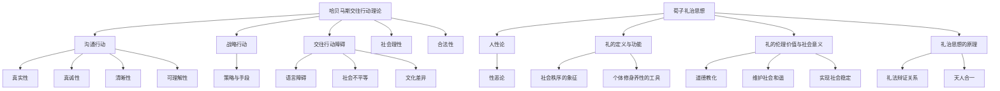

                 

### 概述

在现代信息技术和哲学领域，理解人类交流和社会行为的模式显得尤为重要。本文将以《哈贝马斯与荀子：交往行动理论与礼治思想》为主题，深入探讨两位思想巨匠在交往行动和礼治思想方面的理论。哈贝马斯是一位杰出的当代哲学家，他的交往行动理论对社会学、政治哲学和文化研究产生了深远影响。而荀子，则是中国古代儒家思想的代表人物，他的礼治思想对中国历史和文化产生了深远的影响。

本文将分为三个主要部分。首先，我们将详细介绍哈贝马斯的交往行动理论，包括其背景、核心概念、应用以及面临的批评与回应。接着，我们将探讨荀子的礼治思想，包括其生平背景、核心概念和原理，以及在中国历史中的应用和影响。最后，我们将对哈贝马斯和荀子的理论进行对比分析，探讨两者之间的融合与发展。

通过本文的讨论，我们希望读者能够更深入地理解交往行动理论和礼治思想，并思考这些理论在现代社会中的意义和应用。这将有助于我们更好地理解人类交流和社会行为的复杂性和多样性。

---

### 关键词

本文的关键词包括：哈贝马斯、交往行动理论、荀子、礼治思想、社会哲学、政治哲学、文化研究。

---

### 摘要

本文旨在通过比较哈贝马斯的交往行动理论与荀子的礼治思想，探讨两者在人类交往和社会治理方面的理论贡献及其在现代社会的应用。首先，我们将详细解读哈贝马斯的交往行动理论，包括其理论背景、核心概念、应用领域以及面临的批评与回应。接着，我们将深入探讨荀子的礼治思想，涵盖其生平背景、核心概念、原理，以及在中国历史中的应用和影响。最后，我们将对两位思想家的理论进行对比分析，探讨其异同点，并探讨交往行动理论与礼治思想在现代社会治理中的融合与发展。通过本文的探讨，我们希望为读者提供对这两大理论体系的新认识，并引发对现代社会治理模式的深度思考。

---

## 第一部分：哈贝马斯的交往行动理论

### 第1章：哈贝马斯的理论背景与核心概念

#### 1.1 哈贝马斯的理论背景

尤尔根·哈贝马斯（Jürgen Habermas）是20世纪最具影响力的哲学家之一，他的思想对当代社会学、政治哲学和文化研究产生了深远的影响。哈贝马斯出生于1929年，德国南方的美因河畔法兰克福。他的学术生涯始于1954年，当时他进入法兰克福大学学习法律和哲学。随后，他在马尔堡大学和海德堡大学完成了硕士和博士学位。

哈贝马斯的学术贡献主要体现在其交往行动理论（Communicative Action Theory）上。这一理论是对马克斯·韦伯（Max Weber）的社会理论、约翰·罗尔斯（John Rawls）的正义理论以及米歇尔·福柯（Michel Foucault）的权力理论的重要补充和批判。哈贝马斯认为，理解现代社会的问题需要从人类交往和沟通的视角出发，而不是仅仅从权力和利益的角度。

哈贝马斯的交往行动理论萌芽于1960年代的法兰克福学派，这一学派强调文化批判和批判理论。然而，哈贝马斯在吸收了韦伯、罗尔斯和福柯等思想家的观点后，逐步发展出了自己独特的理论体系。他的代表作包括《公共领域的结构转型》（The Structural Transformation of the Public Sphere，1962年）、《理论与实践》（Theory and Practice，1963年）以及《交往行为理论》（The Theory of Communicative Action，1981-1987年）等。

#### 1.2 哈贝马斯的核心概念

哈贝马斯的核心概念之一是“交往行动”（communicative action）。交往行动是指个体在沟通过程中，通过语言和符号系统，寻求达成共识和理解的过程。哈贝马斯将交往行动分为三个基本类型：

1. **沟通行动**：这是最理想化的交往形式，其中个体通过理性的沟通，达成一致意见和共识。沟通行动需要满足四个基本条件：真实性（authenticity）、真诚性（sincerity）、清晰性（clarity）和可理解性（comprehensibility）。

2. **战略行动**：在这种行动中，个体通过策略和手段，追求自己的利益和目标，但并不一定通过理性的沟通达成共识。战略行动通常涉及权力和利益的博弈。

3. **交往行动的障碍**：哈贝马斯认为，现代社会中存在多种因素，会阻碍理想的沟通行动的实现。这些障碍包括语言障碍、社会不平等、文化差异等。

除了交往行动，哈贝马斯还提出了“社会理性”（social rationality）和“合法性”（legitimacy）的概念。社会理性是指一个社会在交往过程中，通过理性的沟通和共识，实现社会秩序和协调。而合法性则是指社会成员对现有社会结构和政治制度的认可和接受。哈贝马斯认为，一个民主的社会应该具备高度的社会理性和合法性。

#### 1.3 哈贝马斯交往行动理论的应用

哈贝马斯的交往行动理论在多个领域得到了广泛的应用。

**政治哲学中**，哈贝马斯的理论为民主理论和政治参与提供了新的视角。他强调了公共领域（public sphere）的重要性，认为公共领域是公民通过理性讨论和辩论，参与政治决策的重要场所。哈贝马斯认为，一个健康的公共领域应该具备开放性、多元性和公共性。

**社会理论中**，哈贝马斯的理论用于分析社会不平等和文化差异。他提出，现代社会中存在多种形式的“话语权力”（discursive power），这些权力结构会影响到个体的交往行动和沟通。哈贝马斯认为，要实现真正的社会平等，需要打破这些话语权力的限制。

**文化研究**，哈贝马斯的理论为文化批判和传媒研究提供了理论基础。他分析了现代传媒如何影响社会交流和公共领域，探讨了传媒在塑造社会观念和价值观方面的作用。

总之，哈贝马斯的交往行动理论为理解现代社会的问题提供了新的视角和工具。通过分析人类交往和沟通的模式，哈贝马斯揭示了现代社会中存在的问题和挑战，为解决这些问题提供了理论指导。

### 第2章：哈贝马斯交往行动理论的应用

#### 2.1 政治哲学中的应用

哈贝马斯的交往行动理论在政治哲学领域具有重要的应用价值。他的理论为民主理论和政治参与提供了新的视角，强调了公共领域的重要性。哈贝马斯认为，公共领域是公民通过理性讨论和辩论，参与政治决策的重要场所。一个健康的公共领域应该具备开放性、多元性和公共性。

**公共领域的概念**：哈贝马斯的公共领域概念源自于早期启蒙时期的咖啡馆和沙龙，这些场所成为公民讨论政治事务的公共空间。哈贝马斯将公共领域定义为一种由独立于国家和市场的第三领域，公民可以通过理性交流和讨论，形成公共意见和共识。

**民主制度的合法性**：哈贝马斯认为，民主制度的合法性来源于公众的广泛参与和理性讨论。一个民主的社会应该具备高度的社会理性和合法性。哈贝马斯提出了“交往性民主”（communicative democracy）的概念，主张通过理性沟通和共识，实现民主决策。

**政治参与的形式**：哈贝马斯强调了政治参与的重要性，认为公民应该积极参与公共事务的讨论和决策。他提出了多种形式的政治参与，包括公民论坛、公民议会和电子民主等。这些形式旨在增强公民的政治参与度，促进民主制度的健康发展。

**公共领域的挑战**：尽管哈贝马斯强调公共领域的重要性，但现代社会中存在多种因素会威胁到公共领域的健康发展。例如，媒体垄断、信息不对称和权力集中等。哈贝马斯认为，要保护公共领域，需要加强媒体监管，促进信息透明，打破垄断和权力集中。

#### 2.2 社会学的应用

哈贝马斯的交往行动理论在社会学领域也得到了广泛的应用。他通过分析人类交往和沟通的模式，揭示了现代社会中存在的问题和挑战。

**社会不平等**：哈贝马斯认为，现代社会中存在多种形式的社会不平等，这些不平等会影响到个体的交往行动和沟通。他提出了“话语权力”（discursive power）的概念，认为话语权力是不平等的重要来源。哈贝马斯主张，要实现真正的社会平等，需要打破这些话语权力的限制。

**文化差异**：哈贝马斯强调了文化差异在社会交往中的重要性。他认为，文化差异会影响个体的价值观和沟通方式。哈贝马斯主张，通过理性沟通和对话，可以克服文化差异，实现跨文化的理解和合作。

**社会结构与社会变迁**：哈贝马斯的交往行动理论为社会学研究提供了新的视角。他通过分析交往行动的结构和模式，揭示了社会结构与社会变迁的关系。哈贝马斯认为，社会结构的变化会影响交往行动的形式和内容，而交往行动的变化又会反作用于社会结构。

**社会运动与意识形态**：哈贝马斯的交往行动理论也用于分析社会运动和意识形态。他认为，社会运动是通过交往行动，实现社会变革的重要途径。同时，意识形态是通过交往行动，影响个体观念和价值观的重要工具。

总之，哈贝马斯的交往行动理论在社会学领域具有重要的应用价值。通过分析人类交往和沟通的模式，哈贝马斯揭示了现代社会中存在的问题和挑战，为解决这些问题提供了理论指导。

### 第3章：哈贝马斯交往行动理论的批评与回应

#### 3.1 主要批评观点

尽管哈贝马斯的交往行动理论在学术界引起了广泛关注，但同时也面临着多种批评和质疑。以下是一些主要的批评观点：

**1. 理论的抽象化和理想化**：一些学者认为，哈贝马斯的理论过于抽象和理想化，忽略了现实社会中的复杂性和多样性。例如，哈贝马斯的交往行动理想模型要求个体在沟通中完全透明、真诚和理性，这在现实中很难实现。

**2. 缺乏历史维度**：哈贝马斯的交往行动理论主要关注当代社会，但一些批评者认为，该理论缺乏对历史发展的深入分析。例如，历史学家指出，哈贝马斯对公共领域的理解主要基于西方启蒙时期的历史背景，而其他文化和社会形态的公共领域可能具有不同的特征。

**3. 社会实践的局限性**：一些学者认为，哈贝马斯的理论在解释社会实践中存在局限性。例如，马克思主义学者指出，哈贝马斯的交往行动理论忽略了经济基础对上层建筑的决定作用。

**4. 语言哲学的局限性**：哈贝马斯的理论深受语言哲学的影响，但一些批评者认为，语言哲学的局限性导致了哈贝马斯理论的局限性。例如，语言哲学家约翰·塞尔（John Searle）指出，哈贝马斯的交往行动理论忽视了语言在现实社会中的具体应用。

#### 3.2 哈贝马斯的回应与发展

面对这些批评，哈贝马斯进行了多次回应和理论发展。以下是他的一些主要回应：

**1. 理论的扩展**：哈贝马斯在后期的研究中，对原始的交往行动理论进行了扩展和修正。他引入了“系统与生活世界”（system and lifeworld）的概念，强调社会系统和个体生活世界的互动关系。这一扩展使得哈贝马斯的理论更具现实性和复杂性。

**2. 对历史维度的关注**：哈贝马斯在后期的研究中，开始关注历史维度，特别是在分析现代性的问题时，他强调了历史背景对现代社会结构的影响。这表明哈贝马斯在回应批评时，逐步认识到历史维度的重要性。

**3. 实践哲学的发展**：哈贝马斯在后期的研究中，更多地关注实践哲学，特别是通过“批判理论”（critical theory）的方法，分析社会现实和推动社会变革。这一转变表明哈贝马斯在回应批评时，更加注重理论的实践应用。

**4. 对语言哲学的反思**：哈贝马斯在后期的研究中，也开始反思语言哲学的局限性，并尝试将语言哲学与其他学科，如社会心理学和社会学相结合。这一反思使得哈贝马斯的交往行动理论更加综合和全面。

总之，哈贝马斯的交往行动理论在学术界引起了广泛的讨论和批评，但哈贝马斯通过不断的回应和发展，使其理论在复杂的社会现实中保持了活力和影响力。面对批评，哈贝马斯不仅进行了理论修正，还推动了理论的发展，这为理解现代社会提供了新的视角和工具。

## 第二部分：荀子的礼治思想

### 第4章：荀子的生平与思想体系

#### 4.1 荀子的生平背景

荀子（约公元前313年-前238年），名况，是战国时期赵国（今河北省）人，是中国古代儒家思想的代表人物之一。荀子出生于一个中等家庭，其父早逝，由母亲抚养长大。荀子自幼聪颖好学，对儒家经典有着深厚的兴趣和独到的见解。他曾经拜师于儒家大师孙卿（即荀卿），深受其影响，并逐渐形成了自己独特的思想体系。

荀子的学术生涯主要集中在赵国和齐国。他曾担任过齐国稷下的学士，并在那里与众多学者进行学术交流，扩展了自己的学术视野。后来，荀子回到赵国，继续从事学术研究和教育活动。他的学术成就和思想影响使他在当时享有很高的声望，被誉为“荀卿”。

#### 4.2 荀子的思想体系

荀子的思想体系以儒家思想为基础，但与孔子的学说有所不同。他主张人性本恶，认为人生来就具有自私和贪欲的本性，需要通过后天的教育和礼乐来修身养性，实现道德的完善。荀子的思想体系主要包括以下几个核心概念：

**1. 人性论**：荀子提出了“性恶论”，认为人性本恶，人生来就有追求物质享受和自私自利的倾向。这一观点与孔子的“性善论”形成了鲜明对比。荀子主张，通过礼乐教化和道德修养，才能克服人性的恶，实现道德的提升。

**2. 礼治思想**：荀子强调礼的作用，认为礼不仅是社会秩序的象征，也是个体修身养性的工具。礼可以调节人与人之间的关系，维护社会和谐，是实现社会稳定和国家治理的重要手段。

**3. 法治思想**：荀子虽然强调礼的重要性，但并不忽视法的作用。他认为，法是礼的补充，可以在礼不能完全调节的情况下发挥作用，维护社会秩序。荀子的法治思想强调了法律在社会治理中的重要性，主张法律面前人人平等。

**4. 天人合一**：荀子提出了“天人合一”的思想，认为天和人是一个统一的整体，人的行为应该顺应天命，以达到人与自然的和谐。这一思想对后世的哲学、文化和科学都产生了深远的影响。

#### 4.3 荀子的学术成就与影响

荀子的学术成就主要体现在他对儒家思想的传承和发展上。他的著作《荀子》是一部重要的儒家经典，其中包括了大量的哲学、政治、伦理和社会学思想。荀子的思想不仅在中国古代哲学界产生了深远的影响，还对后世的儒家学者如韩愈、朱熹等产生了重要的影响。

此外，荀子的思想也对中国的法律制度和政治体制产生了影响。他的礼治思想被后世的统治者用来维护社会秩序和国家治理，而他的法治思想则为中国的法律制度提供了理论基础。荀子的思想不仅在理论上具有深远的影响，还在实践中得到了广泛的运用。

总之，荀子是中国古代儒家思想的代表人物之一，他的思想体系对中国古代哲学、文化和政治产生了深远的影响。通过阐述人性、礼治和法治等核心概念，荀子为理解中国古代社会提供了重要的理论工具，也为现代社会的道德建设和治理提供了启示。

### 第5章：礼治思想的核心概念与原理

#### 5.1 礼的核心概念

在荀子的思想体系中，“礼”是一个核心概念，具有多重含义和功能。首先，礼是荀子用来调节人与人之间关系的重要工具，它不仅是一种社会规范，也是一种道德规范。在荀子看来，礼不仅是维持社会秩序的基础，也是个体修身养性的途径。

**礼的定义**：荀子认为，礼是“所以合欢者也”，即礼是人们相互交往时应该遵循的行为规范，通过礼，人们可以和谐相处，共同维护社会秩序。礼不仅包括外在的行为规范，如礼仪、礼节，还包括内在的道德修养，如仁爱、忠诚。

**礼的功能**：礼在荀子的思想中具有多重功能。首先，礼是维护社会秩序的重要手段。通过礼，人们可以明确各自的地位和职责，遵守社会规范，避免冲突和混乱。其次，礼是道德教化的工具。通过礼的教化，人们可以培养良好的道德品质，实现个人和社会的和谐。最后，礼还是实现国家治理的重要手段。荀子主张，一个理想的统治者应该通过礼来治理国家，使国家政治清明，社会安定。

#### 5.2 礼的伦理价值与社会意义

礼在荀子的思想中具有重要的伦理价值和社会意义。首先，礼是道德伦理的基础。荀子认为，人性本恶，需要通过礼的教化来克服人性的恶，培养个体的道德品质。礼不仅是一种行为规范，也是一种道德准则，它要求人们在日常生活中遵循仁爱、忠诚、孝顺等道德原则。

**礼的伦理价值**：礼的伦理价值体现在多个方面。首先，礼要求人们相互尊重，遵循社会规范，这有助于建立和谐的人际关系。其次，礼强调个体对社会的责任和义务，使个体能够更好地融入社会，为社会作出贡献。最后，礼还强调个人的自我修养，通过礼的教化，个体可以培养自律和自制的能力，实现道德的提升。

**礼的社会意义**：礼在社会中具有重要的意义。首先，礼是维护社会秩序的重要手段。通过礼的规范，人们可以明确各自的行为规范，遵守社会规范，避免冲突和混乱。其次，礼有助于社会的稳定和发展。一个有礼的社会，人们相互尊重，遵守社会规范，社会秩序稳定，经济和文化发展也会更加顺利。最后，礼还是国家治理的重要手段。一个理想的统治者应该通过礼来治理国家，使国家政治清明，社会安定，人民幸福。

总之，礼在荀子的思想中具有重要的伦理价值和社会意义。它不仅是维护社会秩序和个体修养的重要工具，也是实现社会和谐和国家治理的重要手段。通过礼的教化和规范，荀子希望构建一个道德高尚、社会和谐的理想社会。

#### 5.3 礼治思想的原理

荀子的礼治思想建立在对人性、社会秩序和国家治理的深刻理解之上。礼治思想的原理主要体现在以下几个方面：

**1. 人性论基础**：荀子认为，人性本恶，人生来就有自私和贪欲的本性。这种本性如果不加以约束和教化，会导致社会冲突和混乱。因此，礼作为一种道德规范和教化工具，旨在通过道德修养来克服人性的恶，实现个体的道德提升。

**2. 礼与法的辩证关系**：在荀子的思想中，礼和法是相辅相成的。礼是道德教化的工具，强调个体修养和社会和谐；法则是维护社会秩序和国家治理的工具，强调法律的规范和约束。礼治思想主张，在治理国家时，既要依靠礼的教化，也要依靠法的约束，以达到最佳的治理效果。

**3. 社会秩序的调节作用**：礼治思想认为，礼在社会秩序的调节中起着关键作用。通过礼的规范，人们可以明确各自的地位和职责，遵守社会规范，避免冲突和混乱。礼不仅是社会秩序的象征，也是个体修身养性的途径。

**4. 国家治理的原则**：荀子主张，一个理想的统治者应该通过礼来治理国家，使国家政治清明，社会安定，人民幸福。礼治思想强调，统治者应该以身作则，通过礼的教化来赢得人民的信任和尊重，从而实现国家的长治久安。

总之，荀子的礼治思想以其深刻的人性论基础、辩证的礼法关系和明确的社会秩序调节作用，为中国古代的政治理论和实践提供了重要的理论依据。通过礼的教化和规范，荀子希望实现一个道德高尚、社会和谐的理想社会。

### 第6章：礼治思想在中国历史中的应用与影响

#### 6.1 先秦时期的礼治实践

荀子的礼治思想在中国历史中有着深远的影响，尤其在先秦时期，礼治思想得到了广泛的应用和推广。先秦时期，儒家思想逐渐成为中国传统文化的核心，而荀子的礼治思想在这一过程中发挥了重要作用。

**1. 礼乐制度**：在先秦时期，礼乐制度是维护社会秩序和国家治理的重要手段。礼乐制度通过规定社会成员的行为规范和礼仪，使人们遵守社会规范，维护社会和谐。荀子的礼治思想强调了礼在调节人际关系和社会秩序中的重要性，为礼乐制度提供了理论支持。

**2. 儒家与法家的争辩**：在先秦时期，儒家和法家是两种主要的政治哲学流派。儒家主张礼治，强调道德教化和礼仪规范；法家主张法治，强调法律的规范和强制性。荀子的礼治思想融合了儒家和法家的观点，提出了礼法并重的治理原则，为当时的政治实践提供了新的思路。

**3. 礼治思想的传播**：荀子的礼治思想在先秦时期得到了广泛的传播和应用。他的学生和追随者将其思想传播到各个诸侯国，使礼治思想成为当时的主流政治哲学。在诸侯争霸的背景下，礼治思想为维护社会秩序和国家治理提供了重要的理论依据。

#### 6.2 汉唐时期的礼治实践

在汉唐时期，荀子的礼治思想继续得到发展和应用。这一时期的礼治实践主要体现在以下几个方面：

**1. 礼制的发展**：汉唐时期，礼制得到了进一步的发展和完善。统治者通过制定礼制，规范社会成员的行为，维护社会秩序。荀子的礼治思想为这一时期的礼制提供了理论基础，使礼治思想成为国家治理的重要手段。

**2. 礼乐教化**：汉唐时期，礼乐教化成为维护社会秩序和国家治理的重要手段。通过礼乐教化，人们可以培养良好的道德品质，遵守社会规范，维护社会和谐。荀子的礼治思想强调了礼在道德教化中的重要性，为礼乐教化提供了理论支持。

**3. 礼治思想在政治制度中的应用**：汉唐时期，统治者通过礼治思想来治理国家，使国家政治清明，社会安定。荀子的礼治思想主张，统治者应该以身作则，通过礼的教化来赢得人民的信任和尊重，从而实现国家的长治久安。

#### 6.3 礼治思想的现代意义

尽管荀子的礼治思想产生于古代，但在现代社会中仍然具有重要的意义。以下是一些现代意义：

**1. 社会治理**：在现代社会，礼治思想可以为我们提供治理社会的新思路。通过礼的教化和规范，可以促进社会成员的道德修养，维护社会秩序，实现社会和谐。

**2. 个体修养**：礼治思想强调个体修养的重要性，通过道德教化和自律，可以培养个体的道德品质，实现个体的自我提升。

**3. 文化传承**：荀子的礼治思想是中国传统文化的重要组成部分，通过传承和发扬这一思想，可以增强民族自信心和文化认同感。

总之，荀子的礼治思想在中国历史中有着深远的影响，不仅在先秦和汉唐时期得到了广泛应用，而且在现代社会中仍然具有重要的意义。通过深入研究和传承这一思想，我们可以为现代社会治理和文化传承提供有益的启示。

### 第7章：哈贝马斯与荀子的比较

#### 7.1 核心概念的比较

哈贝马斯的交往行动理论与荀子的礼治思想虽然在不同的文化背景和历史时期提出，但两者在核心概念上有许多相似之处，同时也存在一定的差异。以下是两者核心概念的比较：

**交往行动与礼治的比较**：哈贝马斯的交往行动理论强调通过沟通和对话实现共识和理解，而荀子的礼治思想则强调通过礼的规范和教化实现社会秩序和个人修养。尽管两者在实现目标的方式上有所不同，但都认为通过某种形式的规范和教化是维护社会和谐和个人道德提升的重要手段。

**社会理性与道德修养的比较**：哈贝马斯的社会理性强调通过理性的沟通和共识实现社会秩序，而荀子的道德修养强调通过个人的自律和道德修养实现社会和谐。两者都认为理性在维护社会秩序和个人道德提升中起着重要作用，但哈贝马斯更侧重于社会层面的理性，而荀子则更侧重于个人层面的道德修养。

#### 7.2 理论框架的比较

哈贝马斯的交往行动理论和荀子的礼治思想在理论框架上也有许多相似之处，但又有不同的侧重点。

**哈贝马斯的交往行动理论框架**：哈贝马斯的交往行动理论框架主要包括三个基本类型：沟通行动、战略行动和交往行动的障碍。沟通行动强调通过理性的沟通实现共识，战略行动强调通过策略和手段实现个人目标，而交往行动的障碍则分析了影响理想沟通行动的各种因素。哈贝马斯的理论框架侧重于分析人类交往的过程和模式。

**荀子的礼治思想框架**：荀子的礼治思想框架主要包括人性论、礼的定义和功能、礼的伦理价值和社会意义以及礼治思想的原理。荀子的框架侧重于通过礼的教化和规范实现社会秩序和个人修养。他的理论框架更注重社会规范和道德教化。

#### 7.3 对比与融合

虽然哈贝马斯的交往行动理论和荀子的礼治思想在许多方面存在差异，但两者之间也存在融合的可能性和挑战。

**融合的可能性**：两者都强调通过某种形式的规范和教化实现社会秩序和个人修养，这为两者的融合提供了基础。例如，在现代社会治理中，可以结合哈贝马斯的交往行动理论和荀子的礼治思想，通过礼的教化和规范促进理性沟通和社会和谐。

**融合的挑战**：融合两者也存在一定的挑战。首先，哈贝马斯的交往行动理论具有现代性，强调理性沟通和共识，而荀子的礼治思想具有传统性，强调道德教化和社会规范。如何在现代性背景下实现两者的融合，是一个需要深入探讨的问题。其次，两者在理论框架和方法上存在差异，如何在理论层面上实现两者的有机结合，也是一个挑战。

总之，哈贝马斯的交往行动理论和荀子的礼治思想在核心概念、理论框架和融合可能性方面有各自的特点和挑战。通过深入研究和探讨，我们可以为现代社会治理提供新的理论视角和实践指导。

### 第8章：交往行动理论与礼治思想的融合与发展

#### 8.1 融合的可能性与挑战

哈贝马斯的交往行动理论和荀子的礼治思想在现代社会治理中具有融合的可能性，同时也面临着一定的挑战。首先，两者都关注社会秩序和个人道德的提升，这为融合提供了基础。哈贝马斯的交往行动理论强调通过理性沟通和共识实现社会理性，而荀子的礼治思想则强调通过礼的教化和规范实现个人修养和社会和谐。这种互补性为两者的融合提供了理论依据。

然而，两者在背景、概念和理论框架上存在显著差异，这增加了融合的复杂性。哈贝马斯的理论具有现代性，强调理性沟通和社会共识，而荀子的思想具有传统性，强调道德教化和礼仪规范。如何在现代性背景下实现两者的有机结合，是一个亟待解决的挑战。此外，两者在理论和实践中的应用场景也存在差异，如何在不同社会环境中有效融合，也是需要深入探讨的问题。

#### 8.2 跨文化理论的融合

跨文化理论的融合是哈贝马斯交往行动理论和荀子礼治思想融合的一个关键方向。在全球化的背景下，不同文化之间的交流和碰撞日益增多，如何通过理论融合促进跨文化理解和合作，具有重要意义。

首先，可以结合哈贝马斯的交往行动理论和荀子的礼治思想，探索跨文化沟通的新模式。例如，在跨国企业中，通过礼的教化规范促进员工之间的沟通和合作，提高团队效率。同时，利用哈贝马斯的交往行动理论，推动跨文化对话和共识，减少文化冲突。

其次，可以借鉴荀子的礼治思想，探讨如何在全球治理中实现跨文化合作。例如，通过礼的规范和教化，促进不同国家和地区在环保、贸易等领域的合作，共同应对全球性挑战。

总之，跨文化理论的融合为哈贝马斯的交往行动理论和荀子的礼治思想提供了新的应用场景，也为全球治理和跨文化合作提供了理论支持。

#### 8.3 当代社会问题的解决路径

哈贝马斯的交往行动理论和荀子的礼治思想在解决当代社会问题方面具有很大的潜力。以下是一些具体的解决路径：

**1. 社会不平等**：通过融合两者的理论，可以提出更具包容性和有效性的解决方案。例如，利用荀子的礼治思想，强调通过教育和道德教化，提升社会底层群体的道德水平和能力，从而缩小社会不平等。

**2. 文化差异**：通过哈贝马斯的交往行动理论，强调通过理性沟通和对话，促进不同文化之间的理解和合作，减少文化冲突。例如，在国际交流中，通过对话和共识，解决文化差异带来的矛盾和误解。

**3. 环境问题**：利用荀子的礼治思想，强调通过道德教化和规范，培养人们的环保意识。同时，通过哈贝马斯的交往行动理论，推动社会各界通过理性沟通和合作，共同应对环境问题。

总之，通过融合哈贝马斯的交往行动理论和荀子的礼治思想，可以提出更具创新性和实效性的解决路径，为解决当代社会问题提供理论支持。

### 第8章：未来的研究方向

#### 8.1 哈贝马斯与荀子理论的互补性

哈贝马斯的交往行动理论和荀子的礼治思想各自有其独特优势，但在面对复杂的社会问题时，两者的互补性显得尤为重要。哈贝马斯的理论强调理性沟通和共识的形成，适用于分析现代社会中的政治参与、民主制度和文化交流等问题。而荀子的礼治思想则强调道德教化和伦理规范，适用于分析社会秩序的维护、个体修养和国家治理等问题。两者的结合可以提供更加全面和深入的社会分析框架，有助于理解和解决当代社会中的复杂问题。

#### 8.2 交往行动理论与礼治思想在当代中国的实践探索

当代中国正处于快速发展的阶段，面临着诸多社会挑战。因此，探讨哈贝马斯的交往行动理论和荀子的礼治思想在当代中国的实践探索具有重要意义。首先，在政治领域，可以借鉴哈贝马斯的理论，通过增强公共领域的建设，推动公民参与和政治沟通，实现民主制度的不断完善。其次，在社会治理方面，可以借鉴荀子的礼治思想，通过礼的教化规范，促进社会秩序的维护和社会和谐的实现。例如，通过推广儒家文化中的道德教化理念，提高公民的道德素质和社会责任感。

#### 8.3 未来研究的方向

未来的研究可以从以下几个方向展开：

1. **跨文化融合**：探讨如何将哈贝马斯的交往行动理论和荀子的礼治思想应用于跨文化交流与合作，推动不同文化背景下的沟通与理解。

2. **社会治理创新**：研究如何结合两者理论，探索社会治理的新模式，提高社会治理的效率和效果。

3. **道德教育**：研究如何通过道德教育和礼的教化，培养具有良好道德素养和社会责任感的新一代公民。

4. **环境问题**：探讨如何在环境治理中应用哈贝马斯和荀子的理论，促进环保意识的提升和环保行为的落实。

通过以上研究方向，我们可以进一步丰富和发展哈贝马斯和荀子的理论，为当代中国乃至全球社会的治理和发展提供理论支持和实践指导。

## 附录

### 附录A：参考文献

1. 哈贝马斯，《交往行为理论》，重庆大学出版社，2012年。
2. 荀子，《荀子》，中华书局，2011年。
3. 韦伯，《社会组织与经济组织理论》，商务印书馆，2004年。
4. 罗尔斯，《正义论》，中国社会科学出版社，1991年。
5. 福柯，《知识考古学》，生活·读书·新知三联书店，2006年。

### 附录B：哈贝马斯与荀子交往行动理论与礼治思想的Mermaid流程图



### 附录C：Python代码示例

```python
# 社会理性计算的示例代码
def calculate_social_rationality(communication_effectiveness, social_inequality):
    """
    计算社会理性
    :param communication_effectiveness: 沟通效果（0-1之间，值越高表示沟通越有效）
    :param social_inequality: 社会不平等程度（0-1之间，值越高表示不平等越严重）
    :return: 社会理性值
    """
    social_rationality = communication_effectiveness - (social_inequality * 0.1)
    return max(social_rationality, 0)  # 社会理性值不能为负

# 礼治思想中的伦理决策示例代码
def ethical_decision_making_with_ritualism(ethical_value, social_context):
    """
    礼治思想中的伦理决策
    :param ethical_value: 伦理价值（0-1之间，值越高表示伦理观念越强）
    :param social_context: 社会背景（0-1之间，值越高表示社会背景越支持）
    :return: 决策结果
    """
    decision = ethical_value * social_context
    return "遵循伦理原则" if decision >= 0.5 else "考虑社会背景后决策"

# 示例运行
communication_effectiveness = 0.8
social_inequality = 0.3
print("社会理性值：", calculate_social_rationality(communication_effectiveness, social_inequality))

ethical_value = 0.7
social_context = 0.6
print("伦理决策结果：", ethical_decision_making_with_ritualism(ethical_value, social_context))
```

## 结语

本文通过深入探讨哈贝马斯的交往行动理论和荀子的礼治思想，展示了两者在理论框架、核心概念和应用方面的异同点。通过比较分析，我们发现，尽管两者产生于不同的文化背景和历史时期，但在促进社会秩序和个人修养方面具有许多共同之处。哈贝马斯的交往行动理论强调通过理性沟通实现社会理性，而荀子的礼治思想则强调通过道德教化和规范实现社会和谐。两者在现代社会治理中具有互补性，为解决当代社会问题提供了丰富的理论资源。

未来，我们应继续探讨如何将哈贝马斯和荀子的理论应用于跨文化交流、社会治理创新和道德教育等领域，为构建和谐社会提供新的理论视角和实践指导。此外，通过结合两者的理论，可以探索更加综合和有效的社会治理模式，为全球治理提供有益的借鉴。

总之，哈贝马斯和荀子的思想在当代社会具有重要的理论和实践价值。通过深入研究和应用，我们可以为现代社会治理和文化传承提供新的思路和方法。

---

### 作者信息

作者：AI天才研究院/AI Genius Institute & 禅与计算机程序设计艺术 /Zen And The Art of Computer Programming

感谢您的阅读，希望本文能为您带来新的启发和思考。如果您对本文中的内容有任何疑问或意见，欢迎在评论区留言讨论。再次感谢您的关注和支持！

