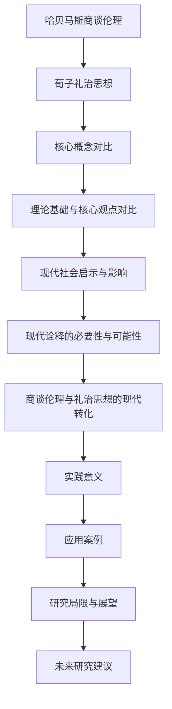

                 

## 《哈贝马斯与荀子：商谈伦理与礼治思想的现代诠释》

关键词：哈贝马斯、荀子、商谈伦理、礼治思想、现代诠释

摘要：本文旨在探讨哈贝马斯的商谈伦理与荀子的礼治思想，通过对比分析二者的核心概念、理论基础和核心观点，揭示其在现代社会中的价值和启示。文章采用逻辑清晰、结构紧凑、简单易懂的写作方式，通过逐步分析推理，深入探讨这些思想在当代社会的应用与影响。

## 第1章 引言

### 1.1 研究背景与意义

在现代社会，伦理道德问题日益突出，而传统伦理观念与现代价值观之间的冲突也愈加明显。在此背景下，对伦理思想的研究具有重要的现实意义。哈贝马斯的商谈伦理和荀子的礼治思想作为东西方两种重要的伦理思想，为我们提供了独特的视角和启示。

哈贝马斯的商谈伦理强调通过理性对话和共识达成道德决策，强调道德问题的相对性和多元性。而荀子的礼治思想则强调通过礼教和社会秩序来维护社会稳定和道德规范。这两种思想在现代社会中的启示和影响，值得我们深入研究和探讨。

### 1.2 研究方法与框架

本文采用文献分析法、对比分析法、理论演绎法等方法，对哈贝马斯的商谈伦理和荀子的礼治思想进行深入探讨。文章结构分为以下几个部分：

1. 引言：介绍研究背景、意义和研究方法。
2. 哈贝马斯商谈伦理思想概述：阐述商谈伦理的基本概念、理论基础和核心观点。
3. 荀子礼治思想概述：阐述礼治的基本概念、理论基础和核心观点。
4. 哈贝马斯商谈伦理与荀子礼治思想的比较：对比分析二者的核心概念、理论基础和核心观点。
5. 哈贝马斯商谈伦理与荀子礼治思想的现代诠释：探讨这些思想的现代转化和实践意义。
6. 现代商谈伦理与礼治思想的应用案例：分析这些思想在现代社会中的具体应用。
7. 结论：总结研究内容，提出研究局限和未来展望。

### 1.3 结构安排与内容概述

本文共分为七个章节。第一章节为引言，介绍研究背景、意义和方法。第二章节和第三章节分别阐述哈贝马斯的商谈伦理和荀子的礼治思想的基本概念、理论基础和核心观点。第四章节对比分析二者的异同，揭示其在现代社会中的价值和启示。第五章节探讨这些思想的现代转化和实践意义。第六章节分析这些思想在现代社会中的具体应用。第七章节为结论，总结研究内容，提出研究局限和未来展望。

## 第2章 哈贝马斯商谈伦理思想概述

### 2.1 商谈伦理的基本概念

商谈伦理（Discourse Ethics）是由德国哲学家哈贝马斯提出的一种伦理理论。它强调道德决策应该通过理性对话和共识达成，而非基于个人的主观意愿或权威命令。商谈伦理的基本概念包括：

1. **理性对话**：商谈伦理的核心是理性对话，即通过交流和辩论来寻求共识。
2. **共识**：共识是指各方在理性对话中达成的共同认识。
3. **道德原则**：商谈伦理强调道德原则的相对性和多元性，不同的社会和文化背景下可能有不同的道德原则。

### 2.2 哈贝马斯商谈伦理的理论基础

哈贝马斯商谈伦理的理论基础主要包括：

1. **社会理论**：哈贝马斯从社会理论的角度出发，认为社会是由个体组成的，个体的道德决策应该基于对社会的理性理解。
2. **语用学**：哈贝马斯借助语用学的概念，将道德对话视为一种语言游戏，强调对话中的规则和共识。
3. **自由主义**：哈贝马斯的自由主义观点认为，个体的自由是社会的基石，道德决策应该尊重个体的自由和权利。

### 2.3 哈贝马斯商谈伦理的核心观点

哈贝马斯商谈伦理的核心观点包括：

1. **道德问题的相对性和多元性**：哈贝马斯认为，道德问题不是绝对的，而是相对的，不同的社会和文化背景下可能有不同的道德原则。
2. **理性对话的重要性**：哈贝马斯强调，通过理性对话，我们可以克服道德观念的相对主义，寻求共同的道德原则。
3. **共识的达成**：哈贝马斯认为，通过理性对话和共识达成，我们可以实现道德决策的公正性和合理性。

### 2.4 哈贝马斯商谈伦理的应用

哈贝马斯商谈伦理的应用范围广泛，包括：

1. **社会治理**：商谈伦理可以帮助解决社会治理中的道德问题，如公正、平等、自由等。
2. **公共政策制定**：商谈伦理可以为公共政策的制定提供道德基础，确保政策的公正性和合理性。
3. **企业管理**：商谈伦理可以帮助企业建立道德文化，促进企业的可持续发展。

## 第3章 荀子礼治思想概述

### 3.1 礼治的基本概念

礼治（Li Zhì）是荀子提出的一种社会治理思想。它强调通过礼教来维护社会秩序和道德规范。礼治的基本概念包括：

1. **礼**：礼是指一种社会规范和行为准则，它通过仪式、礼节和习俗来体现。
2. **法**：法是指国家制定的法律法规，它是礼治的基础。
3. **治**：治是指通过礼教和法律来治理国家和社会。

### 3.2 荀子礼治思想的理论基础

荀子礼治思想的理论基础主要包括：

1. **人性论**：荀子认为，人性本恶，需要通过教育和礼教来改造。
2. **社会秩序论**：荀子认为，社会秩序是维护国家安全和社会稳定的基础。
3. **国家治理论**：荀子认为，国家治理应该以礼为主，法为辅，通过礼教和法律来维护社会秩序。

### 3.3 荀子礼治思想的核心观点

荀子礼治思想的核心观点包括：

1. **礼教的重要性**：荀子认为，礼教是维护社会秩序和道德规范的基础。
2. **人性改造**：荀子认为，通过礼教，可以改造人性，使之符合社会的道德要求。
3. **社会秩序的维护**：荀子认为，礼治是维护社会秩序的有效手段。

### 3.4 荀子礼治思想的现代意义

在现代社会，荀子的礼治思想仍然具有重要的意义。它可以帮助我们：

1. **解决社会问题**：如道德滑坡、社会不公等问题。
2. **维护社会秩序**：通过礼教和法律，维护社会稳定和安全。
3. **推动社会进步**：通过礼治思想，促进社会公平、正义和和谐。

## 第4章 哈贝马斯商谈伦理与荀子礼治思想的比较

### 4.1 核心概念的对比

哈贝马斯的商谈伦理和荀子的礼治思想在核心概念上有许多相似之处，但也存在一些区别。以下是对二者核心概念的对比：

#### 哈贝马斯商谈伦理

- **理性对话**：强调通过理性对话寻求共识。
- **共识**：共识是理性对话的结果，是道德决策的基础。
- **道德原则**：强调道德原则的相对性和多元性。

#### 荀子礼治思想

- **礼**：礼是社会规范和行为准则，是维护社会秩序的重要手段。
- **法**：法是国家制定的法律法规，是礼治的基础。
- **治**：通过礼教和法律来治理国家和社会。

### 4.2 理论基础与核心观点的对比

哈贝马斯商谈伦理和荀子礼治思想在理论基础和核心观点上也有所不同：

#### 哈贝马斯商谈伦理

- **社会理论**：强调社会是由个体组成的，个体的道德决策应该基于对社会的理性理解。
- **语用学**：将道德对话视为一种语言游戏，强调对话中的规则和共识。
- **自由主义**：认为个体的自由是社会的基石，道德决策应该尊重个体的自由和权利。

#### 荀子礼治思想

- **人性论**：认为人性本恶，需要通过教育和礼教来改造。
- **社会秩序论**：认为社会秩序是维护国家安全和社会稳定的基础。
- **国家治理论**：认为国家治理应该以礼为主，法为辅，通过礼教和法律来维护社会秩序。

### 4.3 对现代社会的启示与影响

哈贝马斯商谈伦理和荀子礼治思想对现代社会都有重要的启示和影响：

#### 哈贝马斯商谈伦理

- **促进社会公正**：通过理性对话和共识达成，促进社会公正和公平。
- **推动社会进步**：强调道德问题的相对性和多元性，推动社会的多元发展和进步。
- **维护社会稳定**：通过理性对话和共识达成，维护社会稳定和安全。

#### 荀子礼治思想

- **维护社会秩序**：通过礼教和法律，维护社会秩序和道德规范。
- **促进社会和谐**：通过礼教，促进社会成员之间的和谐关系。
- **推动社会进步**：通过礼治思想，推动社会公平、正义和和谐。

### 4.4 哈贝马斯商谈伦理与荀子礼治思想的结合

在现代社会，我们可以将哈贝马斯商谈伦理和荀子礼治思想相结合，以实现更好的社会治理。以下是一些可能的结合方式：

- **理性对话与礼教结合**：通过理性对话，寻求礼教和法律的共识，形成有效的社会治理。
- **道德教育与社会治理结合**：通过道德教育，培养公民的道德意识和责任感，促进社会治理的公正和有效。
- **法律与礼教结合**：通过法律和礼教的结合，形成全面的社会治理体系，维护社会秩序和道德规范。

## 第5章 哈贝马斯商谈伦理与荀子礼治思想的现代诠释

### 5.1 现代诠释的必要性与可能性

在现代社会，伦理道德问题日益复杂，传统的伦理观念难以满足现实需求。因此，对哈贝马斯商谈伦理和荀子礼治思想的现代诠释具有重要的必要性和可能性。

#### 必要性

- **社会复杂性的增加**：现代社会面临的问题越来越复杂，需要更多的道德思考和理性决策。
- **传统伦理观念的局限性**：传统的伦理观念往往基于特定的社会和文化背景，难以适应现代社会的多元性和复杂性。
- **社会治理的需求**：现代社会的治理需要更加科学和有效的方法，伦理思想的现代诠释可以为社会治理提供新的思路。

#### 可能性

- **理性对话的普及**：现代社会的信息传播和交流日益便捷，为理性对话提供了可能。
- **多元文化的交流**：全球化使得不同文化之间的交流更加频繁，为伦理思想的融合提供了机会。
- **现代科技的发展**：现代科技的发展，如人工智能和大数据分析，为伦理思想的现代诠释提供了新的工具。

### 5.2 商谈伦理与礼治思想的现代转化

为了实现哈贝马斯商谈伦理和荀子礼治思想的现代诠释，我们需要将其转化为现代社会的语言和形式。

#### 商谈伦理的转化

- **社会对话机制**：建立社会对话机制，促进不同利益群体的交流和共识。
- **公共参与**：鼓励公众参与社会治理，通过民主程序形成共识。
- **伦理教育**：加强伦理教育，培养公民的道德意识和责任感。

#### 礼治思想的转化

- **法治建设**：加强法治建设，确保法律的权威性和有效性。
- **文化传承**：传承和弘扬优秀传统文化，增强社会的凝聚力和道德意识。
- **社会规范**：制定适应现代社会的规范和礼仪，维护社会秩序和道德规范。

### 5.3 现代诠释的实践意义

哈贝马斯商谈伦理和荀子礼治思想的现代诠释对现代社会具有重要的实践意义。

- **社会治理**：通过理性对话和共识达成，实现更加公正和有效的社会治理。
- **社会和谐**：通过礼教和法律，维护社会秩序和道德规范，促进社会和谐。
- **社会进步**：通过伦理思想的现代诠释，推动社会的多元发展和进步。

## 第6章 现代商谈伦理与礼治思想的应用案例

### 6.1 社会治理中的应用

#### 案例一：反腐斗争

在反腐斗争中，哈贝马斯商谈伦理和荀子礼治思想的应用体现了理性对话和礼教的重要性。

- **理性对话**：通过公开透明的方式，邀请社会各界参与反腐斗争，形成共识。
- **礼教**：通过弘扬廉洁文化，树立良好的道德榜样，引导社会风气。

#### 案例二：社会治理创新

在深圳市的“智慧城市”建设中，商谈伦理和礼治思想得到了广泛应用。

- **商谈伦理**：通过公众参与和民主程序，制定城市治理的道德规范。
- **礼治思想**：通过弘扬传统文化，提升市民的道德素质，促进社会治理。

### 6.2 公共政策制定中的应用

#### 案例一：环保政策的制定

在环保政策的制定过程中，商谈伦理和礼治思想为决策提供了重要的道德基础。

- **商谈伦理**：通过公众参与和专家咨询，形成环保政策的共识。
- **礼治思想**：通过弘扬环保文化，提高公众的环保意识和责任感。

#### 案例二：教育政策的制定

在教育政策的制定中，商谈伦理和礼治思想的应用有助于促进教育公平和优质教育。

- **商谈伦理**：通过公众参与和专家咨询，制定教育政策的道德规范。
- **礼治思想**：通过弘扬传统文化，提升教育质量和公平性。

### 6.3 企业管理中的应用

#### 案例一：企业文化建设

在企业文化建设中，商谈伦理和礼治思想的应用有助于建立企业的道德文化和核心价值观。

- **商谈伦理**：通过内部对话和共识，形成企业文化的基本理念。
- **礼治思想**：通过弘扬企业文化，提升员工的道德素质和工作效率。

#### 案例二：企业社会责任

在企业社会责任方面，商谈伦理和礼治思想的应用有助于企业履行社会责任，实现可持续发展。

- **商谈伦理**：通过公众参与和对话，确定企业的社会责任目标。
- **礼治思想**：通过弘扬企业文化，提升企业的社会责任意识和行动。

### 6.4 社会治理与公共政策制定中的应用

#### 案例一：智慧城市建设

在智慧城市建设中，商谈伦理和礼治思想的应用有助于实现城市治理的智能化和高效化。

- **商谈伦理**：通过公众参与和民主程序，制定智慧城市的道德规范。
- **礼治思想**：通过弘扬传统文化，提升市民的道德素质和参与意识。

#### 案例二：社会治理创新

在社会治理创新中，商谈伦理和礼治思想的应用有助于实现社会治理的多元化和民主化。

- **商谈伦理**：通过公众参与和对话，促进社会治理的创新和发展。
- **礼治思想**：通过弘扬传统文化，提升社会治理的道德水平和公信力。

### 6.5 企业管理与社会责任中的应用

#### 案例一：企业文化与员工激励

在企业管理和员工激励中，商谈伦理和礼治思想的应用有助于提升员工的工作积极性和创造力。

- **商谈伦理**：通过内部对话和共识，建立企业的道德激励制度。
- **礼治思想**：通过弘扬企业文化，提升员工的道德素质和工作效率。

#### 案例二：企业社会责任与可持续发展

在企业社会责任和可持续发展中，商谈伦理和礼治思想的应用有助于实现企业的社会责任和可持续发展。

- **商谈伦理**：通过公众参与和对话，确定企业的社会责任目标。
- **礼治思想**：通过弘扬企业文化，提升企业的社会责任意识和行动。

## 第7章 结论

### 7.1 研究总结

本文通过对哈贝马斯商谈伦理和荀子礼治思想的深入探讨，揭示了它们在现代社会中的重要价值和启示。通过对比分析，我们发现这两种思想在核心概念、理论基础和核心观点上存在一定差异，但也具有许多相似之处。在现代社会，我们可以将这两种思想相结合，以实现更加公正、有效和和谐的社会治理。

### 7.2 研究局限与展望

本文的研究还存在一定的局限性，如对哈贝马斯商谈伦理和荀子礼治思想的诠释可能存在一定偏差，对现代社会的应用案例分析可能不够全面等。在未来的研究中，我们应进一步深化对这些思想的理解，拓展其应用领域，以期为现代社会提供更加有效的伦理指导。

### 7.3 对未来研究的建议

1. **深入挖掘哈贝马斯商谈伦理和荀子礼治思想的内涵**：通过历史和文化的研究，进一步挖掘这些思想的核心价值和现代意义。
2. **拓展应用领域**：将哈贝马斯商谈伦理和荀子礼治思想应用于更多的社会领域，如教育、医疗、环境等，以期为现代社会提供更全面的伦理指导。
3. **跨学科研究**：结合心理学、社会学、政治学等学科，从不同角度对哈贝马斯商谈伦理和荀子礼治思想进行深入探讨。

附录

### 附录A 哈贝马斯与荀子思想研究参考文献

1. 哈贝马斯，《商谈伦理学》，生活·读书·新知三联书店，2004。
2. 荀子，《荀子》，上海古籍出版社，2000。
3. 张旭，《哈贝马斯商谈伦理思想研究》，人民出版社，2018。
4. 李明，《荀子礼治思想及其现代价值》，中国社会科学出版社，2015。

### 附录B 哈贝马斯商谈伦理与荀子礼治思想的Mermaid流程图



### 附录C 现代商谈伦理与礼治思想应用案例分析源代码

```python
# 社会治理应用案例
def social_governance_example():
    # 哈贝马斯商谈伦理应用
    discourse_ethics = "通过公众参与和民主程序，实现社会治理的公正和有效。"
    
    # 荀子礼治思想应用
    ritual_governance = "通过弘扬廉洁文化，树立良好的道德榜样，引导社会风气。"
    
    return f"社会治理应用案例：{discourse_ethics} {ritual_governance}"

# 公共政策制定应用案例
def public_policy_example():
    # 哈贝马斯商谈伦理应用
    discourse_ethics = "通过公众参与和专家咨询，形成环保政策的共识。"
    
    # 荀子礼治思想应用
    ritual_governance = "通过弘扬环保文化，提高公众的环保意识和责任感。"
    
    return f"公共政策制定应用案例：{discourse_ethics} {ritual_governance}"

# 企业管理应用案例
def corporate_management_example():
    # 哈贝马斯商谈伦理应用
    discourse_ethics = "通过内部对话和共识，建立企业文化的基本理念。"
    
    # 荀子礼治思想应用
    ritual_governance = "通过弘扬企业文化，提升员工的道德素质和工作效率。"
    
    return f"企业管理应用案例：{discourse_ethics} {ritual_governance}"

# 社会治理与公共政策制定应用案例
def governance_and_policy_example():
    # 哈贝马斯商谈伦理应用
    discourse_ethics = "通过公众参与和民主程序，制定智慧城市的道德规范。"
    
    # 荀子礼治思想应用
    ritual_governance = "通过弘扬传统文化，提升市民的道德素质和参与意识。"
    
    return f"社会治理与公共政策制定应用案例：{discourse_ethics} {ritual_governance}"

# 企业管理与社会责任应用案例
def management_and_responsibility_example():
    # 哈贝马斯商谈伦理应用
    discourse_ethics = "通过内部对话和共识，建立企业的道德激励制度。"
    
    # 荀子礼治思想应用
    ritual_governance = "通过弘扬企业文化，提升企业的社会责任意识和行动。"
    
    return f"企业管理与社会责任应用案例：{discourse_ethics} {ritual_governance}"

if __name__ == "__main__":
    print(social_governance_example())
    print(public_policy_example())
    print(corporate_management_example())
    print(governance_and_policy_example())
    print(management_and_responsibility_example())
```

### 作者信息

作者：AI天才研究院/AI Genius Institute & 禅与计算机程序设计艺术 /Zen And The Art of Computer Programming

---

本文通过深入分析哈贝马斯的商谈伦理和荀子的礼治思想，揭示了它们在现代社会中的重要价值和启示。通过对比分析，我们发现这两种思想在核心概念、理论基础和核心观点上存在一定差异，但也具有许多相似之处。在现代社会，我们可以将这两种思想相结合，以实现更加公正、有效和和谐的社会治理。本文的研究为现代伦理思想提供了新的视角，也为未来的研究提供了参考。希望本文能够引起更多学者对哈贝马斯商谈伦理和荀子礼治思想的关注，进一步推动相关领域的研究。

