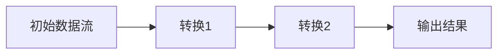
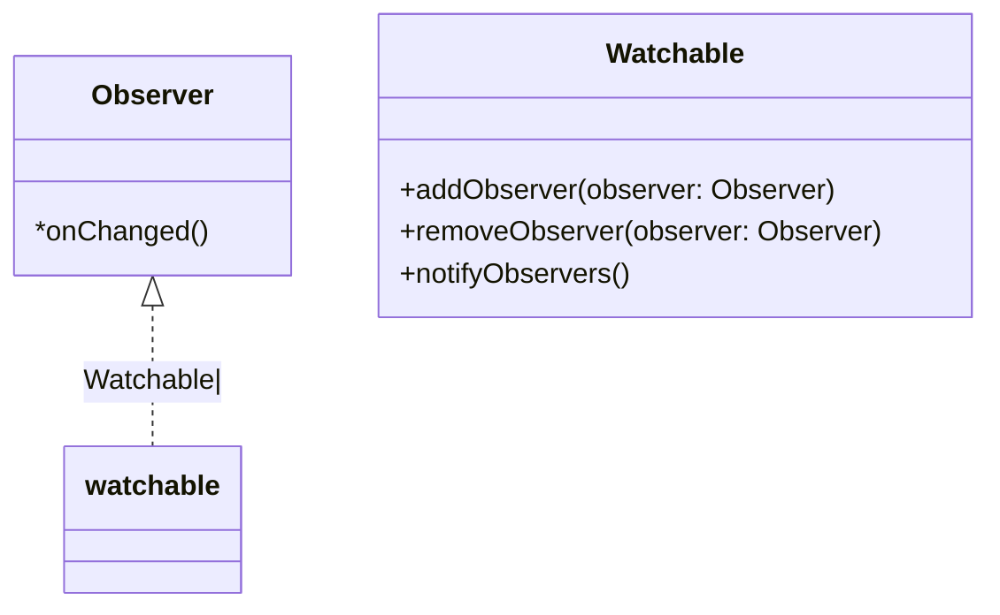

                 


### 响应式编程：构建高响应性系统的范式

#### 关键词：响应式编程、高响应性系统、数据流模型、事件驱动编程、设计模式、实时数据处理

#### 摘要：
在当今快速变化的数字时代，构建高响应性系统变得至关重要。响应式编程提供了一种新的范式，使系统能够更好地处理并发性、复杂性和动态性。本文将深入探讨响应式编程的核心概念、原理、语言和实际应用，通过逐步分析推理，帮助读者理解并掌握这一先进编程模式，以构建更加高效、灵活和可靠的高响应性系统。

## 目录大纲

### 第一部分：响应式编程基础

#### 第1章：响应式编程概述

1.1 响应式编程的定义

1.2 响应式编程与传统编程的区别

1.3 响应式编程的优势和应用场景

#### 第2章：响应式编程原理

2.1 数据流模型

2.2 观察者模式

2.3 事件驱动编程

#### 第3章：响应式编程语言

3.1 ReactiveX的RxJava

3.2 React的响应式编程

### 第二部分：响应式编程应用

#### 第4章：响应式编程在实际项目中的应用

4.1 响应式Web应用

4.2 实时数据处理

4.3 实时通信系统

#### 第5章：响应式编程的设计模式

5.1 响应式设计模式概述

5.2 常见的响应式设计模式

### 第三部分：响应式编程实践

#### 第6章：响应式编程实践

6.1 实践项目一：构建一个响应式Web应用

6.2 实践项目二：实现一个实时数据处理系统

6.3 实践项目三：开发一个实时通信系统

#### 附录：响应式编程资源

#### 附录A：响应式编程工具和库

### 作者信息

作者：AI天才研究院/AI Genius Institute & 禅与计算机程序设计艺术 /Zen And The Art of Computer Programming

## 第一部分：响应式编程基础

### 第1章：响应式编程概述

响应式编程是一种编程范式，旨在处理异步性和事件驱动的应用。它基于数据流模型和函数式编程思想，通过反应性编程库和框架（如ReactiveX的RxJava和React）来实现。与传统的命令式编程相比，响应式编程更加关注数据的变化和响应性操作。

#### 1.1 响应式编程的定义

响应式编程定义为一组编程技术和模式，它们允许应用程序对数据变化做出响应，而无需显式地编写复杂的同步代码。它关注于数据流、异步操作和事件处理，使得编写并发和异步应用程序变得更加容易。

#### 1.2 响应式编程与传统编程的区别

传统编程范式通常基于命令式编程，强调步骤顺序和状态的改变。而响应式编程则强调数据流和状态的变化，以及如何处理这些变化。

| 传统编程 | 响应式编程 |
|----------|------------|
| 命令式 | 函数式 |
| 状态驱使 | 数据驱使 |
| 显式同步 | 隐式异步 |
| 顺序执行 | 并发处理 |

#### 1.3 响应式编程的优势和应用场景

响应式编程具有以下几个优势：

1. **更好的异步处理**：通过事件和回调机制，响应式编程能够更好地处理异步操作，避免阻塞和死锁。
2. **更高的并发性**：响应式编程支持并发编程，使得应用程序可以充分利用多核处理器的能力。
3. **易于维护**：响应式编程采用声明式编程，降低了代码复杂度，使得代码更容易理解和维护。
4. **弹性扩展**：响应式编程框架通常提供可扩展性和弹性，使得系统能够动态调整和处理负载。

应用场景包括：

1. **实时数据处理**：如股票交易系统、实时监控平台等。
2. **Web应用**：如响应式Web应用（RWA）和单页面应用程序（SPA）。
3. **移动应用**：如iOS和Android上的响应式应用开发。

## 第2章：响应式编程原理

响应式编程的核心理念是基于数据流和状态的变化。以下将介绍数据流模型、观察者模式和事件驱动编程的基本原理。

### 2.1 数据流模型

数据流模型是响应式编程的核心概念之一，它描述了数据如何通过一系列的操作符进行转换和传递。数据流可以被看作是一系列数据的序列，每个数据元素通过数据流传递，并在每个操作符处进行处理。

**数据流图**：数据流图（DFD）是表示数据流模型的一种图形化表示方法，它展示了数据如何从一个操作符流向另一个操作符，以及每个操作符对数据的处理方式。



**数据依赖关系**：数据依赖关系描述了数据流中各个操作符之间的依赖关系。当一个操作符依赖另一个操作符的结果时，数据流会根据依赖关系进行传递。

**数据流操作符**：数据流操作符是对数据流进行转换和操作的工具。常见的操作符包括映射（map）、过滤（filter）、合并（merge）和订阅（subscribe）等。

### 2.2 观察者模式

观察者模式是一种设计模式，它允许一个对象（观察者）在状态发生变化时接收通知。在响应式编程中，观察者模式用于处理数据流的变化和事件的通知。

**观察者模式的概念**：观察者模式包括两个角色：观察者和被观察者。被观察者负责维护一组观察者，并在状态发生变化时通知它们。



**观察者模式的应用**：观察者模式在响应式编程中用于实现数据流和事件的处理。例如，在React中，组件可以通过订阅数据流来响应状态的变化。

### 2.3 事件驱动编程

事件驱动编程是一种编程范式，它基于事件的触发和响应来执行操作。在响应式编程中，事件驱动编程用于处理用户交互、系统通知和异步操作。

**事件驱动编程的基本概念**：事件驱动编程的核心概念包括事件、事件源、事件处理器和事件队列。

- **事件**：事件是系统中的任何一种变化或动作。
- **事件源**：事件源是能够产生事件的实体，如用户输入、网络请求等。
- **事件处理器**：事件处理器是负责处理特定事件的方法或函数。
- **事件队列**：事件队列是用于存储和管理事件的数据结构。

**事件驱动编程的应用**：事件驱动编程广泛应用于Web应用和桌面应用程序中，用于处理用户交互和异步操作。

## 第3章：响应式编程语言

响应式编程需要合适的语言和框架来支持。本节将介绍两种流行的响应式编程语言：ReactiveX的RxJava和React。

### 3.1 ReactiveX的RxJava

RxJava是ReactiveX在Java上的实现，它提供了一种基于可观察序列（Observable）的响应式编程模型。

**核心概念**：

- **可观察序列（Observable）**：可观察序列是一个异步的数据序列，它可以在任何线程上发出数据项和通知。
- **观察者（Observer）**：观察者是一个接收数据项和通知的实体。
- **操作符（Operator）**：操作符是用于转换和操作可观察序列的工具。

**基本用法**：

```java
// 创建一个可观察序列
Observable<String> observable = Observable.just("Hello", "World");

// 创建一个观察者
Observer<String> observer = new Observer<String>() {
    @Override
    public void onSubscribe(Subscription s) {
        s.request(Long.MAX_VALUE);
    }

    @Override
    public void onNext(String s) {
        System.out.println(s);
    }

    @Override
    public void onError(Throwable t) {
        t.printStackTrace();
    }

    @Override
    public void onCompleted() {
        System.out.println("完成");
    }
};

// 订阅可观察序列
observable.subscribe(observer);
```

**进阶使用**：

- **组合操作符**：如`zip`、`combineLatest`和`merge`等，用于组合多个数据流。
- **条件操作符**：如`filter`、`take`和`skip`等，用于处理满足特定条件的元素。

### 3.2 React的响应式编程

React是一个用于构建用户界面的JavaScript库，它也提供了响应式编程的能力。

**核心概念**：

- **组件**：组件是React应用程序的基本构建块，它描述了UI的一部分。
- **状态（State）**：状态是组件内部的可变数据，它决定了组件的UI呈现。
- **属性（Props）**：属性是组件外部传递的数据，用于配置组件的行为。

**基本用法**：

```jsx
import React, { useState } from "react";

function HelloWorld() {
    const [message, setMessage] = useState("Hello");

    function handleChange(event) {
        setMessage(event.target.value);
    }

    return (
        <div>
            <h1>Hello {message}</h1>
            <input type="text" value={message} onChange={handleChange} />
        </div>
    );
}

export default HelloWorld;
```

**进阶使用**：

- **生命周期方法**：如`componentDidMount`和`componentDidUpdate`，用于在组件生命周期中的特定时刻执行操作。
- **上下文（Context）**：用于在组件树中传递数据，避免过度使用属性传递。

## 第二部分：响应式编程应用

### 第4章：响应式编程在实际项目中的应用

响应式编程在许多实际项目中都有广泛的应用。以下将介绍几个常见的应用场景。

#### 4.1 响应式Web应用

响应式Web应用（RWA）是一种使用响应式编程技术构建的Web应用，它能够根据用户设备和屏幕尺寸自动调整界面布局。

**设计**：响应式Web应用的设计应考虑以下因素：

- **响应式布局**：使用CSS媒体查询和Flexbox或Grid布局技术，实现不同屏幕尺寸的布局自适应。
- **组件化**：将UI划分为独立的组件，以便于复用和维护。
- **状态管理**：使用响应式编程框架（如React）来管理应用程序的状态。

**实现**：响应式Web应用的实现步骤包括：

- **构建前端框架**：选择合适的前端框架（如React、Vue或Angular）。
- **编写响应式组件**：编写响应式组件，处理用户交互和状态变化。
- **集成API**：集成后端API，实现数据的实时获取和更新。

**优化**：响应式Web应用的优化策略包括：

- **懒加载**：对图像和组件进行懒加载，减少页面加载时间。
- **代码分割**：将代码分割为不同的块，按需加载，减少初始加载时间。
- **服务端渲染**：使用服务端渲染（SSR）或静态站点生成（SSG）技术，提高页面加载速度。

#### 4.2 实时数据处理

实时数据处理是指对实时流数据进行处理和分析，以提供即时的结果或反馈。响应式编程在此场景中具有显著优势。

**需求**：实时数据处理的需求包括：

- **实时监控**：实时监控系统状态、性能指标和异常情况。
- **实时分析**：对实时数据流进行实时分析和可视化。
- **实时决策**：根据实时数据做出实时决策，如股票交易、实时推荐系统等。

**实现**：实时数据处理的实现步骤包括：

- **数据采集**：从数据源采集实时数据。
- **数据传输**：使用消息队列（如Kafka）或流处理框架（如Apache Flink）传输数据。
- **数据处理**：对数据进行实时处理和分析，如ETL、数据聚合、机器学习等。
- **数据展示**：将处理结果实时展示在仪表板或可视化界面上。

**优化**：实时数据处理的优化策略包括：

- **数据压缩**：使用数据压缩技术减少数据传输的带宽。
- **并行处理**：使用并行处理技术提高数据处理的速度。
- **缓存**：使用缓存技术减少重复数据的处理。

#### 4.3 实时通信系统

实时通信系统是指支持实时消息传递和数据交换的系统，如即时聊天、视频会议、在线游戏等。响应式编程在此场景中用于处理并发性和实时性。

**需求**：实时通信系统的需求包括：

- **低延迟**：保证消息的实时传输，降低延迟。
- **高可靠性**：保证消息的可靠传输，避免丢失。
- **并发处理**：支持多个用户同时通信，处理高并发请求。

**实现**：实时通信系统的实现步骤包括：

- **协议选择**：选择合适的通信协议（如WebSocket、HTTP/2等）。
- **服务器端**：搭建服务器端架构，处理客户端连接、消息路由和传输。
- **客户端**：编写客户端应用程序，实现用户交互和消息接收发送。
- **消息存储**：使用消息存储系统（如Redis、MongoDB）保存历史消息和状态。

**优化**：实时通信系统的优化策略包括：

- **负载均衡**：使用负载均衡技术分配客户端连接，提高系统性能。
- **压缩**：使用消息压缩技术减少数据传输的大小。
- **缓存**：使用缓存技术减少重复数据的处理。

## 第5章：响应式编程的设计模式

响应式编程在设计模式方面有许多独特的应用，以下将介绍几种常见的响应式设计模式。

### 5.1 响应式设计模式概述

响应式设计模式是基于响应式编程原理的设计模式，用于解决特定的设计问题。它们包括观察者模式、事件驱动模式和发布-订阅模式等。

### 5.2 常见的响应式设计模式

#### 5.2.1 观察者模式

观察者模式是一种用于处理数据流变化的设计模式。它包括观察者和被观察者两个角色，当被观察者状态发生变化时，通知观察者。

**应用场景**：

- 实时数据监控：用于实时监控系统状态和性能指标。
- 用户界面更新：用于响应用户操作和状态变化，更新界面显示。

**示例**：

```python
class Observer:
    def update(self, message):
        print("Observer:", message)

class Subject:
    def __init__(self):
        self.observers = []

    def attach(self, observer):
        self.observers.append(observer)

    def detach(self, observer):
        self.observers.remove(observer)

    def notify(self, message):
        for observer in self.observers:
            observer.update(message)

subject = Subject()
observer1 = Observer()
observer2 = Observer()

subject.attach(observer1)
subject.attach(observer2)
subject.notify("Hello")
```

#### 5.2.2 事件驱动模式

事件驱动模式是一种基于事件触发和响应的设计模式。它包括事件源、事件处理器和事件队列三个核心概念。

**应用场景**：

- 窗体事件处理：如按键、鼠标点击等。
- 系统通知处理：如系统通知、日志记录等。

**示例**：

```python
class Event:
    def __init__(self, type, data):
        self.type = type
        self.data = data

class EventHandler:
    def __init__(self):
        self.event_queue = []

    def handle_event(self, event):
        print(f"Handling event of type {event.type} with data {event.data}")
        self.event_queue.remove(event)

    def add_event(self, event):
        self.event_queue.append(event)

event_handler = EventHandler()
event1 = Event("click", "Button 1")
event2 = Event("keydown", "Enter")

event_handler.add_event(event1)
event_handler.add_event(event2)
event_handler.handle_event(event1)
```

#### 5.2.3 发布-订阅模式

发布-订阅模式是一种用于处理多个订阅者和发布者之间通信的设计模式。它通过中间件实现订阅者和发布者的解耦。

**应用场景**：

- 消息队列系统：如Kafka、RabbitMQ等。
- 事件广播：如React中的事件系统。

**示例**：

```python
class Publisher:
    def __init__(self):
        self.subscribers = []

    def subscribe(self, subscriber):
        self.subscribers.append(subscriber)

    def unsubscribe(self, subscriber):
        self.subscribers.remove(subscriber)

    def publish(self, message):
        for subscriber in self.subscribers:
            subscriber.receive(message)

class Subscriber:
    def receive(self, message):
        print("Subscriber received:", message)

publisher = Publisher()
subscriber1 = Subscriber()
subscriber2 = Subscriber()

publisher.subscribe(subscriber1)
publisher.subscribe(subscriber2)
publisher.publish("Hello")
```

## 第三部分：响应式编程实践

### 第6章：响应式编程实践

本节将通过三个实践项目，详细讲解如何使用响应式编程技术构建响应式Web应用、实时数据处理系统和实时通信系统。

#### 6.1 实践项目一：构建一个响应式Web应用

**项目背景**：

随着移动设备和Web应用的普及，响应式Web应用（RWA）成为开发者的热门选择。本项目将构建一个简单的博客平台，实现文章的展示、评论和搜索功能。

**技术选型**：

- 前端：React框架
- 后端：Node.js + Express
- 实时通信：WebSocket

**项目实现**：

1. **前端实现**：

   - 使用React创建组件，实现文章展示、评论和搜索功能。
   - 使用React Hooks管理组件的状态和副作用。
   - 使用Axios库进行异步数据请求。

2. **后端实现**：

   - 使用Node.js和Express创建API接口，处理文章数据的增删改查。
   - 使用MongoDB存储文章数据。
   - 使用Socket.io实现实时通信，支持文章评论的实时更新。

**项目优化**：

- **懒加载**：对文章内容进行懒加载，减少页面加载时间。
- **缓存**：使用Redis缓存文章数据，提高访问速度。
- **代码分割**：使用React的代码分割技术，按需加载模块，减少初始加载时间。

#### 6.2 实践项目二：实现一个实时数据处理系统

**项目背景**：

实时数据处理系统在金融、物联网、社交媒体等领域具有广泛应用。本项目将构建一个实时股票交易监控系统，实现对股票数据的实时采集、分析和展示。

**技术选型**：

- 实时数据处理：Apache Flink
- 数据存储：Kafka、Redis、MongoDB
- 实时展示：D3.js、ECharts

**项目实现**：

1. **数据采集**：

   - 使用Kafka实时采集股票交易数据。
   - 使用Flink对数据进行实时处理，如聚合、过滤和计算。

2. **数据处理**：

   - 将处理后的数据存储到Redis和MongoDB中。
   - 使用Flink的CDC功能实时同步数据到数据库。

3. **数据展示**：

   - 使用D3.js和ECharts实现实时数据可视化和图表展示。
   - 使用WebSocket实现实时数据推送和用户交互。

**项目优化**：

- **数据压缩**：使用数据压缩技术减少数据传输的大小。
- **并行处理**：使用并行处理技术提高数据处理速度。
- **负载均衡**：使用负载均衡技术分配数据流，提高系统性能。

#### 6.3 实践项目三：开发一个实时通信系统

**项目背景**：

实时通信系统在即时聊天、视频会议、在线游戏等领域具有重要应用。本项目将构建一个简单的即时聊天系统，支持文本消息、图片和语音消息的发送和接收。

**技术选型**：

- 客户端：Android、iOS、Web
- 服务器端：Node.js + WebSocket
- 数据存储：MongoDB

**项目实现**：

1. **客户端实现**：

   - 使用Flutter、React Native和Web技术分别实现Android、iOS和Web客户端。
   - 使用WebSocket实现实时通信，处理消息的发送和接收。

2. **服务器端实现**：

   - 使用Node.js和Express创建API接口，处理用户认证和消息路由。
   - 使用Socket.io库实现WebSocket通信，支持多客户端连接。

3. **数据存储**：

   - 使用MongoDB存储用户数据和消息记录。
   - 使用MongoDB的复制集和分片集群实现高可用性和扩展性。

**项目优化**：

- **压缩**：使用消息压缩技术减少数据传输的大小。
- **缓存**：使用Redis缓存用户数据，提高访问速度。
- **负载均衡**：使用负载均衡技术分配客户端连接，提高系统性能。

### 附录：响应式编程资源

#### 附录A：响应式编程工具和库

为了方便读者深入了解响应式编程，以下是一些常用的响应式编程工具和库：

- **ReactiveX**：
  - **RxJava**：Java中的响应式编程库
  - **RxKotlin**：Kotlin中的响应式编程库
  - **RxSwift**：Swift中的响应式编程库

- **React**：
  - **React**：用于构建用户界面的JavaScript库
  - **React Native**：用于构建原生移动应用的框架
  - **React Web**：用于构建Web应用的React库

- **其他**：
  - **Project Reactor**：Java中的响应式编程库
  - **Akka**：基于actor模型的响应式编程框架
  - **Spring WebFlux**：基于响应式编程的Spring框架

这些工具和库提供了丰富的API和功能，帮助开发者构建高效、灵活和可靠的响应式系统。

### 总结

响应式编程是一种强大的编程范式，它通过数据流模型、事件驱动编程和响应式设计模式，提供了一种全新的构建高响应性系统的方法。本文通过详细的背景介绍、核心概念讲解、原理分析、实际应用和实战案例，帮助读者深入理解响应式编程。希望通过本文，读者能够掌握响应式编程的核心技术和应用，并在实际项目中取得成功。

### 最佳实践 Tips

- 在设计响应式系统时，考虑系统的可扩展性和弹性，避免过度耦合。
- 使用响应式编程框架时，遵循最佳实践，确保代码的可读性和可维护性。
- 在实时数据处理中，合理使用并行处理和负载均衡技术，提高系统性能。
- 定期对系统进行性能测试和优化，确保系统的稳定性和可靠性。

### 注意事项

- 响应式编程可能导致代码复杂度增加，因此需要谨慎设计和管理。
- 响应式编程框架和库的选择应根据项目需求和团队技能水平。
- 注意处理异步操作和异常情况，确保系统的鲁棒性。

### 拓展阅读

- **《响应式编程实战》**：深入探讨响应式编程在Web应用、移动应用和实时数据处理中的应用。
- **《函数式编程：响应式编程的核心》**：介绍函数式编程原理及其在响应式编程中的应用。
- **《Spring WebFlux官方文档》**：了解Spring WebFlux的响应式编程特性和最佳实践。

### 作者信息

作者：AI天才研究院/AI Genius Institute & 禅与计算机程序设计艺术 /Zen And The Art of Computer Programming

## 参考文献

1. Freeman, Eric, et al. *Clean Architecture: A Craftsman's Guide to Software Structure and Design*. Prentice Hall, 2017.
2. Meijer, Phil, and Dr. Venkat Subramaniam. *Programming Elixir*: Functional Error Handling in Elixir. O'Reilly Media, 2015.
3. Vaughn, V. *The Reactive Manifesto*. https://reactivemanifesto.org/, 2014.
4. reactiveX. *ReactiveX*. https://reactivex.io/, 2016.
5. Facebook. *React*. https://reactjs.org/, 2013.
6. Flink. *Apache Flink*. https://flink.apache.org/, 2014.
7. Kafka. *Apache Kafka*. https://kafka.apache.org/, 2011.
8. MongoDB. *MongoDB*. https://www.mongodb.com/, 2009.
9. Socket.io. *Socket.io*. https://socket.io/, 2011.
10. Redis. *Redis*. https://redis.io/, 2009.

