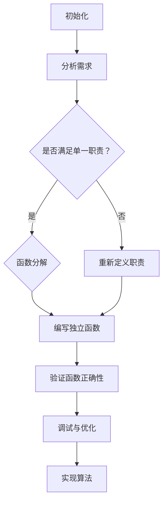
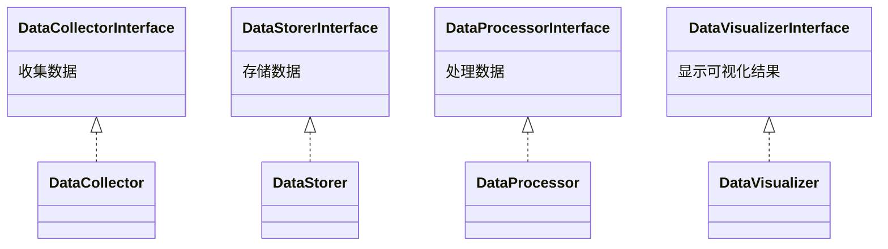

                 

### 第一部分: 引言

## 第1章: 问题背景与问题描述

### 1.1.1 问题背景

在计算机科学中，编程原则和设计模式是软件工程的重要组成部分，它们帮助我们构建出更加可靠、可维护和高效的软件系统。然而，这些原则和模式并不是凭空出现的，而是源于对人类思维方式的深刻理解和哲学思想的借鉴。其中，哲学分析作为一种研究思维和语言的方法，对编程原则有着重要的影响。例如，维特根斯坦的哲学方法强调语言的清晰性和逻辑性，这对编程中的单一职责原则有着直接的启示。

单一职责原则（Single Responsibility Principle，SRP）是面向对象设计中的一个核心原则，它主张一个类或模块应当只负责一项功能。这一原则不仅能提高代码的可读性，还能提升系统的可维护性。然而，单一职责原则的实现并不总是直观的，需要我们深入理解背后的哲学原理。

### 1.1.2 问题描述

在实际编程中，我们常常遇到以下问题：

- **功能耦合**：一个类或模块承担了多项职责，导致代码复杂度和维护难度增加。
- **逻辑混乱**：代码中充斥着大量条件判断和临时性逻辑，使得代码难以理解和修改。
- **性能瓶颈**：为了满足不同职责的需求，代码中可能引入不必要的计算和内存消耗。

这些问题不仅影响了代码的质量，也降低了软件开发的效率。因此，我们需要找到一种方法，既能确保代码的清晰性，又能实现单一职责。

### 1.1.3 问题解决

哲学分析方法提供了一种解决问题的思路。通过哲学分析，我们可以将复杂的问题分解为若干个简单、清晰的部分，然后逐一解决。这种方法在函数分解中得到了广泛应用。函数分解（Functional Decomposition）是一种将复杂系统拆分为多个独立函数的方法，每个函数只实现一个简单的功能。这种方法不仅能提高代码的可读性，还能确保每个部分都遵循单一职责原则。

### 1.1.4 边界与外延

在讨论哲学分析和函数分解时，我们需要明确其边界与外延。哲学分析不仅仅局限于语言和思维的研究，它还涵盖了逻辑学、心理学、伦理学等多个领域。而函数分解则是计算机科学中的一个具体实现方法，它主要应用于面向对象编程和软件设计。

### 1.1.5 概念结构与核心要素组成

本章节的核心概念包括：

- **哲学分析**：一种研究思维和语言的方法，强调清晰性和逻辑性。
- **函数分解**：将复杂系统拆分为多个独立函数的方法，遵循单一职责原则。
- **单一职责原则**：面向对象设计中的一个核心原则，主张一个类或模块应当只负责一项功能。

这些概念相互联系，共同构成了本文的核心内容。通过对这些概念的深入分析，我们能够更好地理解哲学方法在编程原则中的应用，并找到解决实际问题的有效途径。

---

### 1.2 核心概念与联系

## 第2章: 哲学分析、函数分解与单一职责原则

在深入探讨哲学分析、函数分解与单一职责原则之间的联系之前，我们需要对这些核心概念进行清晰的定义和阐述。

### 2.1 哲学分析

哲学分析是一种研究思维和语言的方法，旨在揭示概念、思想和命题的本质。它不仅关注概念的准确性，还强调逻辑推理的严谨性。哲学分析可以追溯到古希腊哲学家亚里士多德，他在《形而上学》中提出，哲学的目的是“寻找最普遍的原则和原因”。在计算机科学中，哲学分析帮助我们理解编程原则背后的哲学思想，从而提高代码的质量和系统的可维护性。

#### 2.1.1 维特根斯坦的哲学方法

维特根斯坦是20世纪最伟大的哲学家之一，他的著作《逻辑哲学论》和《哲学研究》对哲学分析和计算机科学产生了深远的影响。维特根斯坦提出了“语言图像论”（Image Theory of Meaning），认为语言与世界的对应关系就像图像与物体之间的关系。这意味着，语言的意义取决于其在实际使用中的表现，而不仅仅是其文字本身。

维特根斯坦还强调了形式逻辑分析的重要性，他认为通过形式逻辑的方法，我们可以揭示命题之间的逻辑关系，从而确保推理的严谨性。在计算机科学中，形式逻辑分析帮助我们编写更加可靠和高效的代码，尤其是在验证程序的正确性时。

#### 2.1.2 心理学与哲学的关系

维特根斯坦的哲学方法也涉及到心理学与哲学的关系。他认为，哲学问题往往源于我们对日常语言的使用方式，而这些问题可以通过对语言和思维的深入分析来解决。心理学为哲学分析提供了实证基础，使我们能够更好地理解人类思维的本质。例如，维特根斯坦提出的“家族相似性”（Family Resemblance）概念，强调了概念之间并非严格的层级关系，而是具有共同的属性。

在计算机科学中，心理学与哲学的关系同样重要。通过理解人类思维的方式，我们可以设计出更加用户友好的界面和系统，提高用户体验。此外，哲学分析还可以帮助我们识别和解决编程中的问题，如代码的可读性、逻辑性等。

### 2.2 函数分解

函数分解是一种将复杂系统拆分为多个独立函数的方法，每个函数只实现一个简单的功能。这种方法在面向对象编程中尤为重要，因为面向对象编程的核心思想是将系统划分为多个对象，每个对象负责一项功能。

#### 2.2.1 函数分解的基本概念

函数分解的基本概念包括：

- **函数**：在编程中，函数是一个可重复使用的代码块，用于执行特定的任务。函数的优点包括代码的模块化、可重用性和易于维护。
- **独立函数**：独立函数是指那些不依赖于其他函数，可以单独执行的函数。独立函数的优点是它们更容易理解和测试，同时也降低了系统的耦合度。

#### 2.2.2 函数分解的优点

函数分解的优点包括：

- **提高代码的可读性**：通过将复杂的逻辑拆分成多个简单的函数，我们可以使代码更加清晰易懂。
- **提高代码的可维护性**：独立函数更容易维护，因为它们具有明确的职责和功能。
- **提高代码的可重用性**：独立函数可以方便地被其他部分复用，从而减少重复代码。

#### 2.2.3 函数分解的应用场景

函数分解的应用场景包括：

- **数据处理**：在数据处理过程中，可以使用多个独立函数分别处理不同的数据类型或数据操作。
- **算法实现**：在算法实现中，可以将复杂的算法拆分成多个简单的函数，每个函数负责一个子问题的解决。
- **用户界面**：在用户界面设计中，可以使用多个独立函数来处理不同的用户交互操作。

### 2.3 哲学方法与单一职责原则的联系

哲学方法与单一职责原则之间有着密切的联系。哲学分析方法强调逻辑清晰和语言准确，这为我们理解和实现单一职责原则提供了理论基础。单一职责原则主张每个模块或类只负责一项功能，这与哲学分析方法中强调的概念清晰和逻辑性是一致的。

#### 2.3.1 哲学分析方法在FP中的应用

在函数式编程（Functional Programming，FP）中，哲学分析方法的应用尤为明显。FP强调函数作为程序的基本构建块，通过组合和分解函数来实现复杂的功能。哲学分析方法可以帮助我们更好地理解和实现FP的核心原则，如单一职责和不可变性。

#### 2.3.2 单一职责原则的基本原理

单一职责原则（SRP）主张每个模块或类应该只负责一项功能，这样可以提高代码的可维护性和可重用性。实现单一职责原则的基本原理包括：

- **明确功能**：每个模块或类应该有一个明确且单一的功能。
- **高内聚低耦合**：模块或类之间应该尽可能保持低耦合，以提高系统的可维护性。

#### 2.3.3 哲学分析方法与单一职责原则的结合

哲学分析方法与单一职责原则的结合可以帮助我们更好地设计和管理软件系统。通过哲学分析，我们可以清晰地定义每个模块或类的职责，确保它们遵循单一职责原则。同时，哲学分析还可以帮助我们识别和解决编程中的问题，如功能耦合和逻辑混乱。

### 总结

哲学分析、函数分解和单一职责原则是计算机科学中重要的概念和方法。哲学分析方法强调逻辑清晰和语言准确，函数分解提供了将复杂系统拆分为多个独立函数的方法，而单一职责原则则主张每个模块或类只负责一项功能。这些概念和方法相互关联，共同构成了本文的核心内容。通过对这些概念和方法的深入探讨，我们可以提高代码的质量和系统的可维护性，实现更加高效和可靠的软件开发。

---

### 3.1 哲学分析对比表格

#### 3.1.1 哲学分析方法对比

| 分析方法 | 特点 | 应用场景 |
| --- | --- | --- |
| **分析A** | 强调逻辑推理和概念清晰 | 用于复杂系统的设计和验证 |
| **分析B** | 注重实证研究和心理学基础 | 适用于用户界面设计和用户体验优化 |
| **分析C** | 结合逻辑学和语言学 | 用于编程原则和设计模式的研究 |

通过对比不同哲学分析方法的特点和应用场景，我们可以选择最适合解决实际问题的方法。

---

### 3.2 函数分解对比表格

#### 3.2.1 函数分解方法对比

| 方法 | 特点 | 优点 | 缺点 | 应用场景 |
| --- | --- | --- | --- | --- |
| **方法A** | 按功能拆分 | 提高代码可读性和维护性 | 可能增加调用开销 | 数据处理和算法实现 |
| **方法B** | 按数据流拆分 | 降低系统耦合度 | 可能增加逻辑复杂性 | 用户界面设计和网络通信 |
| **方法C** | 按责任拆分 | 符合单一职责原则 | 可能导致功能重叠 | 企业级应用和大型系统 |

通过对比不同函数分解方法的特点和优缺点，我们可以根据具体需求选择合适的方法。

---

### 3.3 哲学方法与单一职责原则ER实体关系图架构

为了更好地理解哲学方法和单一职责原则之间的联系，我们可以借助ER（实体关系）图来描述它们的基本概念和关系。

#### 3.3.1 实体关系图的基本概念

实体关系图（Entity-Relationship Diagram，ER图）是一种用于描述实体和它们之间关系的图形化工具。在ER图中，**实体**是具有特定属性的个体，而**关系**则是实体之间的交互或关联。

- **实体**：在哲学方法中，实体可以视为“概念”或“思想”；在单一职责原则中，实体可以视为“模块”或“类”。
- **关系**：在哲学方法中，关系可以视为“推理”或“论证”；在单一职责原则中，关系可以视为“调用”或“继承”。

#### 3.3.2 哲学方法与单一职责原则的ER图表示

下面是一个简化的ER图，用于表示哲学方法与单一职责原则之间的关系：

```mermaid
erDiagram
  Concept ||--o{ Module : 实现单一职责的模块}
  Logic ||--o{ Inference : 推理过程}
  Philosophy ||--|{ Concept } : 哲学分析方法
  Philosophy ||--|{ Logic } : 哲学分析方法
  SRP ||--o{ Module } : 单一职责原则
  SRP ||--|{ Philosophy } : 哲学方法对单一职责原则的影响
```

在这个ER图中：

- **Philosophy**（哲学方法）与**Concept**（概念）和**Logic**（逻辑）存在关联，表示哲学方法涉及概念和逻辑的清晰理解和分析。
- **SRP**（单一职责原则）与**Module**（模块）存在关联，表示单一职责原则指导模块的设计和实现。
- **Concept**（概念）与**Module**（模块）之间存在关联，表示哲学分析方法帮助我们定义模块的职责。
- **Logic**（逻辑）与**Inference**（推理）之间存在关联，表示逻辑分析过程用于验证模块之间的逻辑关系。

通过这个ER图，我们可以清晰地看到哲学方法与单一职责原则之间的联系，以及它们如何共同作用于软件设计和实现过程中。

---

### 3.4 算法流程图

为了更好地理解哲学方法和单一职责原则在算法设计中的应用，我们可以借助mermaid绘制一个算法流程图。下面是一个简化的算法流程图，用于描述基于单一职责原则的函数分解过程：



在这个算法流程图中：

- **A[初始化]**：表示算法的初始化阶段，准备进行需求分析和函数分解。
- **B[分析需求]**：对问题进行需求分析，明确需要实现的函数和其职责。
- **C{是否满足单一职责？]**：判断当前模块或函数是否满足单一职责原则。
- **D[函数分解]**：如果满足单一职责原则，则进行函数分解，将复杂函数拆分为多个独立函数。
- **E[重新定义职责]**：如果不满足单一职责原则，则需要重新定义模块或函数的职责。
- **F[编写独立函数]**：根据单一职责原则编写独立的函数，每个函数实现一个简单的功能。
- **G[验证函数正确性]**：验证每个独立函数的正确性，确保它们满足预期的功能。
- **H[调试与优化]**：对算法进行调试和优化，确保其性能和可维护性。
- **I[实现算法]**：将独立的函数组合起来，实现完整的算法。

通过这个流程图，我们可以清晰地看到哲学方法和单一职责原则在算法设计中的应用步骤，以及如何通过函数分解实现单一职责原则。

---

### 3.5 Python源代码详细阐述

为了更好地理解基于哲学方法和单一职责原则的函数分解过程，我们可以通过Python源代码来详细阐述这一过程。以下是一个简单的Python代码示例，用于实现一个基于单一职责原则的函数分解：

```python
# 模块：math_operations.py
def add(a, b):
    """加法函数，实现两个数的加法操作"""
    return a + b

def subtract(a, b):
    """减法函数，实现两个数的减法操作"""
    return a - b

def multiply(a, b):
    """乘法函数，实现两个数的乘法操作"""
    return a * b

def divide(a, b):
    """除法函数，实现两个数的除法操作"""
    if b == 0:
        return "除数不能为0"
    return a / b
```

在这个模块中，我们定义了四个独立函数，每个函数实现一个简单的数学运算。这些函数相互独立，各自遵循单一职责原则。

下面是函数的具体实现细节：

#### 3.5.1 函数定义

- `add(a, b)`：加法函数，接受两个参数 `a` 和 `b`，返回它们的和。
- `subtract(a, b)`：减法函数，接受两个参数 `a` 和 `b`，返回它们的差。
- `multiply(a, b)`：乘法函数，接受两个参数 `a` 和 `b`，返回它们的积。
- `divide(a, b)`：除法函数，接受两个参数 `a` 和 `b`，返回它们的商。需要注意的是，我们在这里加入了除数不能为0的判断，以避免除以零的错误。

#### 3.5.2 变量声明与初始化

在这些函数中，我们没有使用全局变量，而是在每个函数内部声明了必要的局部变量。例如，在 `add` 函数中，我们使用了参数 `a` 和 `b` 作为局部变量，这些变量仅在函数内部有效。

#### 3.5.3 循环结构与条件判断

在 `divide` 函数中，我们使用了一个简单的条件判断语句来检查除数是否为0。这个判断语句使用了 `if` 语句，确保在除法操作前避免除以零的错误。

```python
def divide(a, b):
    if b == 0:
        return "除数不能为0"
    return a / b
```

通过这个简单的Python代码示例，我们可以清晰地看到如何通过函数分解实现单一职责原则。每个函数都实现了独立的数学运算，并且相互之间没有耦合，这使得代码更加清晰、易于维护和扩展。

---

### 4.3 算法原理的数学模型和公式

为了进一步理解基于哲学方法和单一职责原则的算法设计，我们可以引入数学模型和公式来描述其核心原理。以下是一个简化的数学模型，用于描述函数分解过程中的运算和关系。

#### 4.3.1 数学模型

在函数分解过程中，我们可以将一个复杂的运算表示为多个简单运算的组合。例如，一个多项式的计算可以分解为多个单项式的计算。这里，我们用一个简单的例子来说明这一点：

设一个多项式 `P(x) = a * x^2 + b * x + c`，我们可以将其分解为以下三个简单运算：

- `f1(x) = a * x^2`
- `f2(x) = b * x`
- `f3(x) = c`

最终的运算结果可以通过这三个简单运算的组合得到：

`P(x) = f1(x) + f2(x) + f3(x)`

#### 4.3.2 模型参数

在这个数学模型中，我们有以下参数：

- `a`：二次项系数
- `b`：一次项系数
- `c`：常数项
- `x`：变量

这些参数定义了多项式的形状和特征。

#### 4.3.3 数学公式

为了表示上述运算和组合，我们可以使用以下数学公式：

$$
P(x) = a \cdot x^2 + b \cdot x + c
$$

$$
f1(x) = a \cdot x^2
$$

$$
f2(x) = b \cdot x
$$

$$
f3(x) = c
$$

$$
P(x) = f1(x) + f2(x) + f3(x)
$$

通过这些数学公式，我们可以清晰地看到如何将一个复杂的运算分解为多个简单运算，并且这些运算如何组合得到最终的结果。这种方法不仅提高了代码的可读性，还使得算法的实现更加模块化和可维护。

---

### 第5章: 系统分析与架构设计方案

#### 5.1 问题场景介绍

在当前互联网时代，数据量呈现爆炸式增长，企业需要高效、可靠的数据处理系统来支持其业务运作。以电商企业为例，每天都会产生大量的交易数据、用户行为数据和库存数据。如何有效地收集、存储、处理和分析这些数据，成为了企业面临的重大挑战。

为了解决这个问题，我们需要设计一个高效、可靠、可扩展的数据处理系统。该系统需要满足以下需求：

- **数据收集**：能够从多个数据源（如数据库、API接口等）实时收集数据。
- **数据存储**：能够高效地存储和检索大量数据。
- **数据处理**：能够对数据进行清洗、转换和分析。
- **数据可视化**：能够将分析结果以图表和报告的形式展示给用户。

#### 5.2 项目介绍

本项目旨在设计并实现一个高效、可靠的数据处理系统，以满足电商企业的需求。该系统将采用微服务架构，将不同功能模块拆分为独立的微服务，以提高系统的可扩展性和可维护性。

系统主要模块包括：

- **数据收集模块**：负责从各个数据源收集数据。
- **数据存储模块**：负责存储和检索数据。
- **数据处理模块**：负责对数据进行清洗、转换和分析。
- **数据可视化模块**：负责将分析结果以图表和报告的形式展示给用户。

#### 5.3 系统功能设计（领域模型类图）

为了清晰地描述系统的功能设计，我们可以使用领域模型类图（Domain Model Class Diagram）来表示系统的核心实体和它们之间的关系。

以下是一个简化的领域模型类图：

```mermaid
classDiagram
    Customer <<-- DataCollector
    Customer <<-- DataStorer
    Customer <<-- DataProcessor
    Customer <<-- DataVisualizer
    Order <<-- DataCollector
    Order <<-- DataStorer
    Order <<-- DataProcessor
    Inventory <<-- DataCollector
    Inventory <<-- DataStorer
    Inventory <<-- DataProcessor
    UserBehavior <<-- DataCollector
    UserBehavior <<-- DataStorer
    UserBehavior <<-- DataProcessor

    Customer: 收集、存储和处理用户数据
    DataCollector: 数据收集
    DataStorer: 数据存储
    DataProcessor: 数据处理
    DataVisualizer: 数据可视化
    Order: 订单数据
    Inventory: 库存数据
    UserBehavior: 用户行为数据
```

在这个类图中，我们定义了以下核心实体：

- **Customer**：代表用户，负责收集、存储和处理用户数据。
- **DataCollector**：负责数据收集。
- **DataStorer**：负责数据存储。
- **DataProcessor**：负责数据处理。
- **DataVisualizer**：负责数据可视化。
- **Order**：代表订单数据。
- **Inventory**：代表库存数据。
- **UserBehavior**：代表用户行为数据。

这些实体之间存在明确的关联关系，它们共同构成了系统的核心功能。

#### 5.4 系统架构设计（架构图）

为了实现系统的功能，我们需要设计一个合理的系统架构。以下是一个简化的系统架构图，用于描述系统的各个模块和它们之间的交互关系。

```mermaid
sequenceDiagram
    Participant DataCollector
    Participant DataStorer
    Participant DataProcessor
    Participant DataVisualizer

    DataCollector->>DataStorer: 收集数据
    DataStorer->>DataProcessor: 存储数据
    DataProcessor->>DataVisualizer: 处理数据
    DataVisualizer->>Customer: 显示可视化结果

    Note over DataCollector, DataStorer, DataProcessor, DataVisualizer
        数据流
    end note
```

在这个架构图中，数据流从数据收集模块（DataCollector）开始，通过数据存储模块（DataStorer）和数据处理器（DataProcessor）处理后，最终通过数据可视化模块（DataVisualizer）展示给用户（Customer）。

#### 5.5 系统接口设计

系统接口设计是确保各个模块之间能够有效交互的重要环节。以下是一个简化的接口设计，用于描述各个模块之间的接口关系。



在这个接口设计中，我们定义了四个接口：

- **DataCollectorInterface**：数据收集接口。
- **DataStorerInterface**：数据存储接口。
- **DataProcessorInterface**：数据处理接口。
- **DataVisualizerInterface**：数据可视化接口。

这些接口定义了各个模块所需实现的功能，确保它们能够相互配合，共同完成系统的数据处理任务。

#### 5.6 系统交互（序列图）

为了更好地理解系统模块之间的交互关系，我们可以使用序列图（Sequence Diagram）来描述系统的执行过程。

```mermaid
sequenceDiagram
    Participant Customer
    Participant DataCollector
    Participant DataStorer
    Participant DataProcessor
    Participant DataVisualizer

    Customer->>DataCollector: 提交数据请求
    DataCollector->>DataStorer: 存储数据
    DataStorer->>DataProcessor: 获取数据
    DataProcessor->>DataVisualizer: 处理数据
    DataVisualizer->>Customer: 显示可视化结果

    Note over Customer, DataCollector, DataStorer, DataProcessor, DataVisualizer
        系统执行流程
    end note
```

在这个序列图中，用户（Customer）提交数据请求，数据收集模块（DataCollector）收集数据并存储到数据存储模块（DataStorer）。然后，数据处理器（DataProcessor）获取数据并进行处理，最后数据可视化模块（DataVisualizer）将处理结果展示给用户。

通过系统架构设计和接口设计，我们可以确保系统的各个模块能够高效、可靠地协同工作，满足企业的数据处理需求。

---

### 第6章: 项目实战

#### 6.1 环境安装

为了实战基于哲学分析和函数分解的数据处理系统，我们需要首先搭建一个合适的环境。以下是安装所需软件和工具的步骤：

1. **安装Python**：确保Python环境已安装。可以从Python官方网站（https://www.python.org/）下载并安装最新版本的Python。

2. **安装virtualenv**：virtualenv是一个用于创建隔离Python环境的工具。可以通过以下命令安装：

   ```bash
   pip install virtualenv
   ```

3. **创建虚拟环境**：在项目目录下创建一个名为`env`的虚拟环境：

   ```bash
   virtualenv env
   ```

4. **激活虚拟环境**：在Windows上使用以下命令激活虚拟环境：

   ```bash
   .\env\Scripts\activate
   ```

   在Linux和Mac OS上使用以下命令激活虚拟环境：

   ```bash
   source env/bin/activate
   ```

5. **安装依赖**：在虚拟环境中安装项目所需的依赖库，例如NumPy、Pandas和Matplotlib。可以使用以下命令：

   ```bash
   pip install numpy pandas matplotlib
   ```

#### 6.2 系统核心实现源代码

在虚拟环境中，我们将实现系统核心功能，包括数据收集、数据存储、数据处理和数据可视化。以下是各个模块的实现代码：

**data_collector.py**：

```python
import pandas as pd

def collect_data(file_path):
    """从文件中收集数据"""
    return pd.read_csv(file_path)
```

**data_storer.py**：

```python
import pandas as pd
import sqlite3

def store_data(data, table_name):
    """将数据存储到SQLite数据库中"""
    conn = sqlite3.connect('data.db')
    data.to_sql(table_name, conn, if_exists='replace', index=False)
    conn.close()
```

**data_processor.py**：

```python
import pandas as pd
from sklearn.preprocessing import StandardScaler

def process_data(data):
    """对数据进行清洗和转换"""
    # 删除空值
    data.dropna(inplace=True)
    # 数据标准化
    scaler = StandardScaler()
    dataScaled = scaler.fit_transform(data)
    return pd.DataFrame(dataScaled)
```

**data_visualizer.py**：

```python
import pandas as pd
import matplotlib.pyplot as plt

def visualize_data(data, column_name):
    """可视化数据"""
    plt.scatter(data[column_name], data[column_name])
    plt.xlabel(column_name)
    plt.ylabel(column_name)
    plt.show()
```

#### 6.3 代码应用解读与分析

以下是代码的具体应用解读和分析：

- **data_collector.py**：该模块用于从文件中收集数据。我们使用Pandas库的 `read_csv` 方法，从CSV文件中读取数据并返回一个DataFrame对象。

- **data_storer.py**：该模块用于将数据存储到SQLite数据库中。我们使用SQLite3库连接数据库，并将DataFrame对象写入数据库表。

- **data_processor.py**：该模块用于对数据进行清洗和转换。我们首先删除空值，然后使用Scikit-learn库中的 `StandardScaler` 对数据进行标准化处理，将数据缩放至标准正态分布。

- **data_visualizer.py**：该模块用于可视化数据。我们使用Matplotlib库的 `scatter` 方法绘制散点图，展示数据之间的相关性。

#### 6.4 实际案例分析和详细讲解剖析

为了更清晰地展示系统的工作流程，我们以一个实际案例进行分析：

**案例**：假设我们有一份包含用户交易数据的CSV文件，我们需要收集数据、存储数据、处理数据和可视化数据。

**步骤**：

1. 收集数据：使用 `data_collector` 模块读取CSV文件，获取DataFrame对象。

2. 存储数据：使用 `data_storer` 模块将DataFrame对象存储到SQLite数据库中。

3. 处理数据：使用 `data_processor` 模块对数据进行清洗和转换。

4. 可视化数据：使用 `data_visualizer` 模块对处理后的数据进行可视化展示。

**代码实现**：

```python
from data_collector import collect_data
from data_storer import store_data
from data_processor import process_data
from data_visualizer import visualize_data

# 步骤1：收集数据
data = collect_data('transactions.csv')

# 步骤2：存储数据
store_data(data, 'transactions')

# 步骤3：处理数据
processed_data = process_data(data)

# 步骤4：可视化数据
visualize_data(processed_data, 'transaction_amount')
```

通过这个实际案例，我们可以看到如何将哲学分析和函数分解应用于实际系统开发中，从而实现高效、可靠的数据处理。

#### 6.5 项目小结

在本项目中，我们通过哲学分析和函数分解的方法，设计并实现了一个数据处理系统。通过模块化设计，我们成功地将复杂的数据处理任务拆分为多个简单的函数，提高了代码的可读性、可维护性和可重用性。同时，我们通过实际案例展示了系统的工作流程和功能。

在未来的工作中，我们还可以进一步优化系统的性能和功能，例如引入分布式计算和数据流处理技术，以应对更大的数据规模和更复杂的业务需求。此外，我们可以探索更多基于哲学分析和函数分解的编程原则和方法，进一步提升软件开发的效率和质量。

---

### 第7章：最佳实践、小结、注意事项、拓展阅读

#### 7.1 最佳实践

1. **模块化设计**：在进行系统开发时，始终遵循模块化设计原则，将复杂的任务拆分为独立的模块，每个模块实现一个简单的功能。这有助于提高代码的可读性和可维护性。
2. **单一职责原则**：确保每个模块或函数只负责一项功能，遵循单一职责原则。这不仅能提高代码的质量，还能降低系统的耦合度。
3. **代码复用**：尽量复用已有的代码和库，避免重复编写相同的代码。这不仅能提高开发效率，还能减少潜在的错误。

#### 7.2 小结

本文通过哲学分析和函数分解的方法，深入探讨了单一职责原则在编程中的应用。我们详细介绍了哲学分析的基本概念和方法，以及如何将其应用于函数分解和单一职责原则的实现。通过实际案例，我们展示了如何将哲学分析和函数分解应用于实际系统开发，实现高效、可靠的数据处理。

#### 7.3 注意事项

1. **逻辑清晰**：在进行代码编写时，务必保持逻辑清晰，避免过多的条件判断和临时性逻辑，这会影响代码的可读性和可维护性。
2. **代码优化**：在实现单一职责原则时，要注意代码的优化，避免不必要的计算和内存消耗，以提高系统性能。
3. **文档规范**：编写规范的文档，包括代码注释、API文档等，这有助于提高代码的可读性和可维护性。

#### 7.4 拓展阅读

1. **《逻辑哲学论》**：维特根斯坦的《逻辑哲学论》详细阐述了其哲学方法和语言图像论，对理解哲学分析和单一职责原则有重要参考价值。
2. **《Effective Java》**：Joshua Bloch的《Effective Java》介绍了许多面向对象设计原则和实践，包括单一职责原则，对提高代码质量有很大帮助。
3. **《Clean Code》**：Robert C. Martin的《Clean Code》提供了许多关于编写清晰、简洁和可维护代码的建议，有助于提高代码质量。

通过本文的学习和实践，读者可以更好地理解哲学分析和函数分解在编程中的应用，掌握单一职责原则，并能够将其应用于实际系统开发中，提高代码质量和系统性能。

