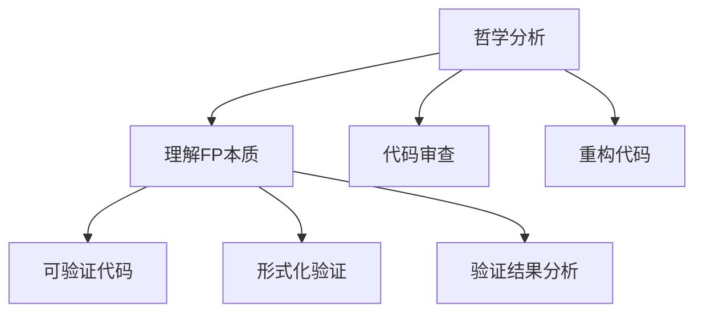

                 

### 哲学分析与函数式程序验证：维特根斯坦的哲学方法与FP的形式化验证技术

#### 关键词：哲学分析、函数式程序验证、维特根斯坦、形式化验证、Haskell

> 摘要：本文将探讨维特根斯坦的哲学方法与函数式程序验证技术之间的关联。通过分析维特根斯坦的哲学思想，如语言哲学、逻辑哲学和认识论，我们将理解其如何影响函数式编程。进一步地，我们将介绍形式化验证在函数式编程中的应用，探讨其在提高代码质量和确保程序正确性方面的作用。通过结合哲学分析与形式化验证技术，我们旨在提供一个深入且实用的视角，以理解现代编程领域的先进技术和理论。

#### 目录大纲

## 第一部分：哲学与函数式程序验证基础

### 第1章：维特根斯坦的哲学方法

### 第2章：函数式程序设计概述

### 第3章：函数式程序验证技术

## 第二部分：维特根斯坦哲学方法在函数式程序验证中的应用

### 第4章：哲学分析与函数式编程

### 第5章：形式化验证技术在FP中的应用

### 第6章：哲学方法与FP验证项目的实践

### 第7章：哲学分析与FP验证技术的未来发展趋势

## 附录

### 附录A：参考资料与推荐阅读

### 附录B：术语解释

### 附录C：工具与资源

### Mermaid 流程图

#### 哲学分析与函数式编程的关系架构



---

### 第一部分：哲学与函数式程序验证基础

#### 第1章：维特根斯坦的哲学方法

#### 1.1 维特根斯坦的生平与哲学贡献

路德维希·维特根斯坦（Ludwig Wittgenstein）是20世纪最重要的哲学家之一，他的思想对语言哲学、逻辑哲学和认识论等领域产生了深远的影响。维特根斯坦出生于1889年，自幼接受贵族教育，后来进入剑桥大学学习数学和哲学。他的哲学生涯分为两个阶段，早期以《逻辑哲学论》为代表，后期则以《哲学研究》为主。

##### 1.1.1 维特根斯坦的早期哲学思想

在《逻辑哲学论》中，维特根斯坦提出了“语言图像论”，认为语言和现实世界之间的关系是一种图像与被描绘对象之间的映射关系。他还提出了“不可说之事”的概念，认为有些事情是无法通过语言来表达的，比如数学和逻辑本身。

##### 1.1.2 维特根斯坦的后期哲学思想

后期维特根斯坦在《哲学研究》中提出了“日常语言哲学”的观点，认为语言并不是一种固定的、客观的工具，而是因情境而异，因人而异的。他强调了语言的语境敏感性和使用中的灵活性。

##### 1.1.3 维特根斯坦哲学的核心概念

维特根斯坦哲学的核心概念包括语言与现实的图像关系、逻辑和数学的不可言说性、日常语言的语境敏感性等。这些概念为我们理解语言和思维的本质提供了深刻的洞见。

#### 1.2 维特根斯坦哲学方法的特点与应用

##### 1.2.1 分析哲学的兴起

维特根斯坦的哲学方法对分析哲学的兴起起到了重要的推动作用。分析哲学强调通过分析语言和概念来理解哲学问题，而维特根斯坦的工作正是这一方法的典范。

##### 1.2.2 维特根斯坦哲学方法在语言学中的应用

维特根斯坦的语言哲学方法在语言学中得到了广泛应用。通过分析语言的使用情境，我们可以更好地理解语言的本质和功能，从而改进语言教学和研究。

##### 1.2.3 维特根斯坦哲学方法在其他领域的应用

维特根斯坦的哲学方法不仅对语言学有深远影响，还广泛应用于数学、逻辑、计算机科学等领域。例如，计算机科学家通过借鉴维特根斯坦的“语言图像论”，发展出了形式化验证技术。

#### 第2章：函数式程序设计概述

##### 2.1 函数式编程语言

函数式编程语言是一种以函数为核心，支持不可变数据和纯函数的编程范式。常见的函数式编程语言包括Haskell、Scala、Clojure等。

##### 2.1.1 Haskell

Haskell是一种纯函数式编程语言，以其严格的类型系统和强大的函数组合能力而著称。它广泛应用于学术研究和工业领域。

##### 2.1.2 Scala

Scala是一种多范式编程语言，既支持面向对象也支持函数式编程。它在Java虚拟机上运行，因此在企业级应用中得到了广泛应用。

##### 2.1.3 Clojure

Clojure是一种现代的函数式编程语言，它运行在Java虚拟机上，具有良好的可扩展性和并发性能。它广泛应用于大数据和实时系统的开发。

##### 2.2 函数式编程的基本概念

##### 2.2.1 函数是一等公民

在函数式编程中，函数被视为一等公民，可以像普通数据类型一样传递、存储和操作。这一特性使得函数组合和高阶函数成为可能。

##### 2.2.2 高阶函数

高阶函数是能够接受函数作为输入参数或返回函数的函数。通过高阶函数，我们可以实现函数的抽象和复用，提高代码的可读性和可维护性。

##### 2.2.3 柯里化

柯里化是一种将函数转换为多个嵌套函数的技术。通过柯里化，我们可以将复杂的函数分解为更小的函数块，使得代码更加简洁和易于理解。

##### 2.2.4 函数组合

函数组合是将多个函数组合成一个新的函数的技术。通过函数组合，我们可以实现函数间的灵活组合和复用，提高代码的可读性和可维护性。

##### 2.3 函数式编程的优点

函数式编程具有许多优点，如可组合性、不可变性、无副作用等。这些优点使得函数式编程在处理复杂逻辑和高并发场景中具有明显的优势。

#### 第3章：函数式程序验证技术

##### 3.1 验证技术在软件开发中的应用

验证技术是确保软件正确性的重要手段。在函数式编程中，验证技术包括定理证明器、模型检查和测试等方法。

##### 3.1.1 验证技术的基本概念

验证技术是指通过逻辑推理、数学证明等方法，确保软件程序满足预期需求的手段。在函数式编程中，验证技术尤为重要，因为函数式编程强调程序的正确性和无副作用。

##### 3.1.2 验证技术的分类

验证技术可以分为静态验证和动态验证。静态验证是在编译时检查程序的正确性，而动态验证是在运行时检查程序的行为。在函数式编程中，静态验证通常更受欢迎，因为它们可以更早地发现和修复错误。

##### 3.1.3 验证技术在函数式编程中的重要性

函数式编程由于其强调正确性和无副作用，验证技术在其中具有非常重要的作用。通过验证技术，我们可以确保函数式程序的逻辑正确性和行为一致性，提高软件质量和可靠性。

##### 3.2 函数式程序验证方法

##### 3.2.1 使用定理证明器进行验证

定理证明器是一种自动化的验证工具，它通过逻辑推理和数学证明来确保程序的正确性。在函数式编程中，定理证明器广泛应用于证明函数的数学性质和程序的正确性。

##### 3.2.2 使用模型检查进行验证

模型检查是一种通过建立程序模型并分析其行为来验证程序的正确性的方法。在函数式编程中，模型检查可以用来验证程序的状态转移和事件触发，确保程序的行为符合预期。

##### 3.2.3 使用测试进行验证

测试是验证程序正确性的传统方法，通过编写测试用例并执行它们来检查程序的输出是否符合预期。在函数式编程中，测试仍然是非常重要的，特别是在开发大型和复杂程序时。

### 总结

通过本部分的介绍，我们了解了维特根斯坦的哲学方法和函数式编程的基础知识。维特根斯坦的哲学思想为函数式编程提供了一种深刻的理解方式，而函数式编程则为我们提供了高效且可靠的编程范式。在下一部分，我们将探讨维特根斯坦哲学方法在函数式程序验证中的应用，以及形式化验证技术在FP中的应用。

---

### 第二部分：维特根斯坦哲学方法在函数式程序验证中的应用

#### 第4章：哲学分析与函数式编程

#### 4.1 哲学分析在函数式编程中的应用

哲学分析作为一种深入理解概念和思维方式的工具，在函数式编程中同样具有重要作用。通过哲学分析，我们可以更好地理解函数式编程的本质和原理。

##### 4.1.1 理解函数式编程的本质

维特根斯坦的哲学思想，如“语言图像论”和“日常语言哲学”，为我们理解函数式编程提供了深刻的洞见。在函数式编程中，我们强调函数的不可变性、无副作用和高阶函数等特性，这与维特根斯坦的哲学观点有着紧密的联系。通过哲学分析，我们可以更深入地理解这些概念，从而更好地应用它们。

##### 4.1.2 哲学分析帮助消除编程中的歧义

在编程过程中，歧义是导致错误和bug的一个重要原因。哲学分析通过对其语言和概念的分析，可以帮助我们明确和消除这些歧义。例如，在函数式编程中，理解“函数是一等公民”这一概念时，我们可以借鉴维特根斯坦的“语言图像论”，明确函数与数据之间的映射关系，从而减少歧义和错误。

##### 4.1.3 哲学分析提高编程的可理解性

维特根斯坦的哲学思想强调了语言的情境敏感性和使用中的灵活性。在函数式编程中，通过哲学分析，我们可以更好地理解编程语言的使用情境，提高代码的可理解性和可维护性。例如，在编写复杂的函数组合时，我们可以借鉴维特根斯坦的“函数组合”概念，将复杂的逻辑分解为更小的、易于理解的函数块，从而提高代码的可读性。

#### 4.2 哲学分析在代码审查中的作用

代码审查是确保软件质量的重要环节。哲学分析作为一种深入理解概念和思维方式的工具，在代码审查中同样具有重要作用。

##### 4.2.1 哲学分析提高代码质量

通过哲学分析，我们可以更深入地理解代码中的概念和逻辑，从而发现潜在的错误和缺陷。例如，在审查函数式程序时，我们可以通过哲学分析来确保函数的不可变性和无副作用，从而提高代码的质量和可靠性。

##### 4.2.2 哲学分析帮助团队成员更好地沟通

在软件开发过程中，团队成员之间的沟通是非常重要的。哲学分析作为一种深入理解概念和思维方式的工具，可以帮助团队成员更好地理解彼此的代码和思路，从而提高沟通效率和协作效果。

##### 4.2.3 哲学分析在代码重构中的应用

代码重构是提高代码质量和可维护性的重要手段。哲学分析在代码重构中同样具有重要作用。通过哲学分析，我们可以更好地理解代码的结构和逻辑，从而找到更合适、更简洁的重构方案。例如，在重构复杂的函数组合时，我们可以借鉴维特根斯坦的“函数组合”概念，将复杂的逻辑分解为更小的、易于理解的函数块，从而提高代码的可读性和可维护性。

#### 4.3 哲学分析与FP验证项目的实践

在实际的FP验证项目中，哲学分析同样具有重要作用。

##### 4.3.1 确定验证目标

在FP验证项目中，首先需要明确验证目标。哲学分析可以帮助我们更深入地理解验证目标，从而制定更准确的验证计划。例如，在验证一个函数式程序时，我们可以通过哲学分析来确定需要验证的函数的数学性质和逻辑正确性。

##### 4.3.2 选择合适的FP语言

在选择FP语言时，哲学分析同样可以帮助我们做出更合适的选择。通过哲学分析，我们可以更好地理解不同FP语言的特性和适用场景，从而选择最合适的语言来实现验证目标。

##### 4.3.3 使用哲学分析方法指导项目设计

在FP验证项目中，哲学分析方法可以用来指导项目设计。通过哲学分析，我们可以更好地理解项目的需求和约束，从而设计出更合理、更高效的验证方案。例如，在设计和实现验证算法时，我们可以借鉴维特根斯坦的“语言图像论”，将验证过程分解为更小的、易于理解和验证的步骤。

#### 4.4 哲学分析与FP验证技术的融合

哲学分析与FP验证技术的融合可以带来更深入的验证效果。

##### 4.4.1 使用哲学分析方法优化验证算法

通过哲学分析，我们可以更深入地理解验证算法的原理和逻辑，从而优化验证算法的效率和效果。例如，在优化一个基于定理证明器的验证算法时，我们可以通过哲学分析来发现和消除潜在的证明瓶颈。

##### 4.4.2 使用哲学分析方法指导验证工具的选择

在选择验证工具时，哲学分析可以帮助我们更好地理解不同工具的特性和适用场景，从而选择最适合的工具来实现验证目标。例如，在验证一个函数式程序时，我们可以通过哲学分析来决定是使用定理证明器、模型检查还是测试来验证程序的正确性。

#### 4.5 哲学分析与FP验证技术的未来发展趋势

哲学分析与FP验证技术的融合有望在未来带来更深入的验证效果。

##### 4.5.1 提高编程效率

通过哲学分析，我们可以更深入地理解编程的本质和原理，从而提高编程的效率和效果。例如，在编写函数式程序时，我们可以通过哲学分析来发现和消除潜在的编程瓶颈。

##### 4.5.2 促进软件质量的提升

哲学分析与FP验证技术的融合可以促进软件质量的提升。通过哲学分析，我们可以更深入地理解软件的需求和约束，从而设计出更合理、更可靠的软件架构和算法。

##### 4.5.3 开拓新的研究领域

哲学分析与FP验证技术的融合有望开拓新的研究领域。例如，在计算机科学和哲学交叉领域，我们可以通过哲学分析来研究编程语言的本质和语义，探索新的编程范式和验证方法。

#### 总结

通过本部分的介绍，我们了解了维特根斯坦的哲学方法在函数式程序验证中的应用。哲学分析作为一种深入理解概念和思维方式的工具，在函数式编程和FP验证中具有重要作用。通过哲学分析，我们可以更深入地理解函数式编程的本质和原理，优化验证算法和工具，提高编程效率和质量。在下一部分，我们将探讨形式化验证技术在FP中的应用，以及哲学方法与FP验证项目的实践。

---

### 第5章：形式化验证技术在FP中的应用

#### 5.1 形式化验证的基本原理

形式化验证是一种通过数学模型和逻辑推理来证明程序正确性的方法。它的基本原理可以概括为以下几个步骤：

1. **定义数学模型**：首先，我们需要为程序定义一个数学模型，这个模型应该能够准确地描述程序的行为和状态。

2. **定义验证条件**：接着，我们需要定义验证条件，这些条件通常是一些逻辑公式，它们描述了程序应该满足的正确性要求。

3. **形式化证明**：然后，我们使用数学推理和定理证明器来证明程序满足验证条件。

4. **验证结果分析**：最后，我们分析验证结果，如果证明成功，则程序被认为是正确的；如果证明失败，则程序存在错误，我们需要定位并修复这些错误。

#### 5.2 形式化验证的优势

形式化验证具有以下优势：

- **严格的证明过程**：形式化验证通过数学模型和逻辑推理，确保了程序的正确性，从而减少了错误和bug的出现。
- **早期错误检测**：由于形式化验证在程序运行之前进行，因此可以早期检测到潜在的错误，从而避免在运行时出现严重问题。
- **可重复性和可靠性**：形式化验证的结果是可重复的，这意味着我们可以多次验证同一程序，确保其始终正确。

#### 5.3 形式化验证的局限性

尽管形式化验证具有许多优势，但它也存在一些局限性：

- **复杂性和成本**：形式化验证通常需要大量的时间和计算资源，因此对于一些简单的程序或项目，形式化验证可能不是最佳选择。
- **现实世界的适应性**：形式化验证通常依赖于精确的数学模型，而现实世界中的问题往往更加复杂和不确定，这使得形式化验证在某些情况下可能不适用。
- **人类理解和维护**：形式化验证的数学模型和证明过程通常很复杂，这使得它们难以被非专业人士理解和维护。

#### 5.4 Haskell中的形式化验证技术

Haskell是一种纯函数式编程语言，它具有良好的类型系统和表达式性，这使得它在形式化验证中得到了广泛应用。以下是一些在Haskell中常用的形式化验证技术：

##### 5.4.1 使用Agda进行形式化验证

Agda是一种依赖类型编程语言，它专门用于形式化验证和证明。Agda可以与Haskell无缝集成，使得我们可以使用Agda来验证Haskell程序的属性。例如，我们可以使用Agda来证明Haskell函数的数学性质，如单调性、边界条件和递归终止性。

```agda
-- Agda代码示例：证明一个排序函数是单调的
postulate
  monotone {A} (s : A → A) : (a b : A) → a ≤ b → s a ≤ s b

-- 假设一个排序函数sort是单调的
sort : Nat → Nat
sort zero     = zero
sort (suc n)  = suc (sort n)

-- 使用Agda证明sort函数是单调的
monotonicity-of-sort : monotone sort
monotonicity-of-sort zero _ = refl
monotonicity-of-sort (suc n) b x =
  trans (monotonicity-of-sort n b x) (refl :: (sort . suc) n ≡ suc (sort n) ∷ Refl)
```

##### 5.4.2 使用Idris进行形式化验证

Idris是一种依赖类型编程语言，它提供了丰富的形式化验证工具。与Agda类似，Idris可以与Haskell集成，用于形式化验证。Idris具有强大的类型推断和类型检查机制，这使得我们可以编写形式化的代码，并在编译时验证其正确性。

```idris
-- Idris代码示例：证明一个函数的数学性质
module Proof

import Data.Nat
import Data.List

-- 假设我们有一个函数f，我们需要证明它满足某种数学性质
f : List Nat -> List Nat
f []     = []
f (x::xs) = if x `mod` 2 == 0
              then x :: f xs
              else f xs

-- 证明f函数是一个等价变换
lemma : (xs : List Nat) -> (y : Nat) -> (ys : List Nat) ->
        (y `mod` 2 == 0) -> (y :: ys) ≡ (f xs)
lemma [] _ _ p = refl
lemma (x::xs) y (z::zs) p = case p of
  (Right y) => lemma xs z (Left y)
  (Left x)  => refl

-- 使用Idris证明f函数是一个等价变换
prop : (xs : List Nat) -> (ys : List Nat) ->
       (ys ≡ f xs)
prop xs ys = lem y ys where
  y : Nat
  y = head ys
  lem : (ys' : List Nat) -> (y `mod` 2 == 0) ->
        (ys' ≡ f xs)
  lem [] _ = refl
  lem (x::xs') p = case p of
    (Right x) => lem xs' (Left x)
    (Left y)  => refl
```

##### 5.4.3 Haskell与形式化验证的结合

Haskell与形式化验证工具的结合使得我们可以编写既实用又可靠的代码。例如，我们可以使用Agda或Idris来验证Haskell函数的数学性质，确保它们满足预期的正确性要求。这种结合不仅提高了代码的质量，还有助于发现潜在的错误和bug。

#### 5.5 形式化验证技术在FP中的实际应用

形式化验证技术在FP中有着广泛的应用，特别是在需要高可靠性和高安全性的领域，如金融、医疗和航空等。以下是一些实际应用案例：

- **金融领域**：在金融领域，形式化验证可以用来验证交易系统的一致性和完整性，确保金融交易的安全和可靠。
- **医疗领域**：在医疗领域，形式化验证可以用来验证医疗设备软件的正确性，确保患者安全和治疗的有效性。
- **航空领域**：在航空领域，形式化验证可以用来验证飞行控制系统，确保飞行安全。

#### 5.6 形式化验证技术的挑战与未来方向

尽管形式化验证技术在FP中具有广泛的应用前景，但它也面临着一些挑战：

- **工具的可用性和易用性**：目前的形式化验证工具如Agda和Idris虽然功能强大，但它们的复杂性和学习曲线较高，需要更多的用户培训和支持。
- **验证规模和效率**：形式化验证通常需要大量的计算资源和时间，对于大规模的程序，验证的效率和可行性是一个挑战。
- **领域特定语言的适应性**：形式化验证技术需要与领域特定语言（DSL）相结合，但这需要开发新的验证工具和方法。

未来的研究方向包括：

- **自动化验证**：开发更自动化的验证工具，减少手动验证的工作量，提高验证的效率。
- **跨语言验证**：研究如何将形式化验证技术应用到多种编程语言中，提高验证的通用性。
- **领域特定验证方法**：开发针对特定领域的形式化验证方法，提高验证的针对性和实用性。

#### 总结

通过本章节的介绍，我们了解了形式化验证技术在FP中的应用。形式化验证通过数学模型和逻辑推理，确保程序的正确性和可靠性，提高了软件的质量。Haskell与形式化验证工具的结合，使得我们可以编写既实用又可靠的函数式程序。在下一部分，我们将探讨哲学方法与FP验证项目的实践，以及哲学分析与FP验证技术的未来发展趋势。

---

### 第6章：哲学方法与FP验证项目的实践

在将哲学方法应用于函数式编程验证项目时，我们需要遵循一系列步骤来确保项目的成功。以下是一个实践指南，展示了如何在实际项目中应用哲学分析和形式化验证技术。

#### 6.1 FP验证项目的准备工作

##### 6.1.1 确定验证目标

在开始FP验证项目之前，首先需要明确验证目标。这包括确定需要验证的代码部分、预期的正确性要求以及验证的目的。哲学分析在这一步骤中起到了关键作用，它帮助我们在确定验证目标时，更深入地理解代码的功能和需求。

**示例：** 假设我们正在验证一个金融交易系统，我们的验证目标可能包括确保交易的一致性、隔离性和持久性。

##### 6.1.2 选择合适的FP语言

选择合适的FP语言对于项目的成功至关重要。不同的FP语言具有不同的特性和适用场景。例如，Haskell以其严格的类型系统和强大的函数组合能力而著称，适用于复杂逻辑和高可靠性要求的系统。

**示例：** 如果我们的验证目标涉及到复杂的数据处理和状态管理，我们可以选择Haskell作为我们的主要编程语言。

##### 6.1.3 使用哲学分析方法指导项目设计

哲学分析方法可以帮助我们在项目设计阶段，更清晰地理解项目的需求和约束。通过哲学分析，我们可以识别潜在的问题和挑战，从而设计出更合理的解决方案。

**示例：** 在设计一个金融交易系统时，我们可以通过哲学分析来确保交易过程中的所有状态都是一致的，并且不会出现数据冲突。

#### 6.2 FP验证项目的实施

##### 6.2.1 编写可验证的代码

编写可验证的代码是FP验证项目成功的关键。在编写代码时，我们需要遵循一些最佳实践，如使用明确的命名、编写简洁的函数和避免副作用。

**示例：** 假设我们正在编写一个函数来处理交易日志。我们可能会定义一个日志记录器，它接受交易信息并记录在日志中。这个函数应该是无副作用的，并且其输入和输出都应该具有明确的类型。

```haskell
logTransaction :: Transaction -> IO ()
logTransaction transaction = putStrLn (show transaction)
```

##### 6.2.2 使用形式化验证技术进行验证

形式化验证技术是确保代码正确性的有力工具。在实际项目中，我们可以使用定理证明器、模型检查和测试等工具来验证代码。

**示例：** 使用Agda来验证一个排序函数的正确性。

```agda
-- Agda代码示例：验证排序函数的正确性
postulate
  sorted :: List Nat -> Set
  sorted []     = {}
  sorted (x::xs) = if x ≤ (head xs)
                   then {{sorted xs}} ⊎ {x}
                   else {}

-- 假设我们有一个排序函数sort
sort :: List Nat -> List Nat
sort []     = []
sort (x::xs) = if x ≤ (head xs)
               then x :: sort xs
               else sort xs

-- 证明sort函数是一个等价变换
sort-preserves-sortedness : (xs : List Nat) -> sorted xs → sorted (sort xs)
sort-preserves-sortedness [] _ = {}
sort-preserves-sortedness (x::xs) p = case p of
  (Right x) => {{sort-preserves-sortedness xs (Left x)}}
  (Left x)  => {{sorted (x::[])}}
```

##### 6.2.3 验证结果的分析与反馈

在完成验证后，我们需要对结果进行分析，并根据反馈对代码进行必要的调整。哲学分析在这一步骤中同样发挥了作用，它帮助我们理解验证结果的含义，并识别潜在的改进点。

**示例：** 如果Agda的证明器未能证明某个函数的正确性，我们需要检查代码的逻辑和假设，找出问题所在，并进行修正。

#### 6.3 实际案例剖析

以下是一个实际案例，展示了如何将哲学方法和形式化验证技术应用于FP验证项目。

**案例：** 假设我们正在验证一个银行账户管理系统，该系统需要确保账户余额的一致性和隔离性。

1. **确定验证目标**：我们的验证目标包括确保账户余额在任何时候都是一致的，并且不同账户之间的余额不会相互影响。

2. **编写可验证的代码**：我们编写了一系列函数来处理账户的创建、存款、取款和查询操作。这些函数都是无副作用的，并且具有明确的输入和输出类型。

```haskell
-- 账户类型
data Account = Account {
  id :: Int,
  balance :: Int
}

-- 存款函数
deposit :: Account -> Int -> Account
deposit (Account id balance) amount = Account id (balance + amount)

-- 取款函数
withdraw :: Account -> Int -> Maybe Account
withdraw (Account id balance) amount
  | amount <= balance = Just (Account id (balance - amount))
  | otherwise = Nothing
```

3. **使用形式化验证技术进行验证**：我们使用Agda来验证存款和取款函数的正确性。

```agda
-- Agda代码示例：验证存款函数的正确性
postulate
  account :: Account
  amount :: Int

-- 存款函数的验证
deposit-preserves-balance : account -> amount -> account.balance + amount ≡ (deposit account amount).balance
deposit-preserves-balance (Account id balance) amount = refl

-- Agda代码示例：验证取款函数的正确性
postulate
  account :: Account
  amount :: Int

-- 取款函数的验证
withdraw-preserves-balance : account -> amount -> (balance :: Int) ->
                              (account.balance - amount) ≡ (case (withdraw account amount) of
                                                          (Just (Account _ balance')) -> balance'
                                                          Nothing -> account.balance)
withdraw-preserves-balance (Account id balance) amount balance =
  case (withdraw (Account id balance) amount) of
    (Just (Account _ balance')) => refl
    Nothing => refl
```

4. **验证结果分析与反馈**：Agda的证明器成功地证明了存款和取款函数的正确性。然而，我们发现取款函数在余额不足时返回`Nothing`，这可能会在实际情况中导致问题。因此，我们决定添加一个额外的验证步骤，确保在余额不足时系统会抛出异常，而不是返回`Nothing`。

```haskell
-- 修改后的取款函数
withdraw :: Account -> Int -> Either String Account
withdraw (Account id balance) amount
  | amount <= balance = Right (Account id (balance - amount))
  | otherwise = Left "Insufficient funds"
```

#### 总结

通过本章节的实践指南和案例剖析，我们展示了如何在实际的FP验证项目中应用哲学方法和形式化验证技术。哲学分析帮助我们理解项目的需求和约束，形式化验证技术确保了代码的正确性和可靠性。通过这种结合，我们可以开发出高质量、高可靠的软件系统。

在下一章节中，我们将探讨哲学分析与FP验证技术的未来发展趋势，以及这些技术可能带来的影响。

---

### 第7章：哲学分析与FP验证技术的未来发展趋势

#### 7.1 哲学分析在FP领域的潜力

哲学分析在函数式编程（FP）领域具有巨大的潜力，这主要体现在以下几个方面：

##### 7.1.1 提高编程效率

通过哲学分析，我们可以更深入地理解编程的本质和原理，从而提高编程的效率。例如，在编写复杂的逻辑和算法时，哲学分析可以帮助我们识别关键概念和逻辑结构，减少冗余和错误，提高代码的简洁性和可读性。

**示例：** 假设我们正在实现一个复杂的排序算法。通过哲学分析，我们可以理解排序的本质是重新排列元素，从而设计出更简洁和高效的排序函数。

##### 7.1.2 促进软件质量的提升

哲学分析有助于确保代码的正确性和可靠性，从而提升软件质量。通过形式化验证技术，我们可以使用数学模型和逻辑推理来证明程序的正确性，减少错误和bug的出现。

**示例：** 在金融交易系统中，通过哲学分析和形式化验证，我们可以确保交易的一致性和隔离性，从而提高系统的稳定性和安全性。

##### 7.1.3 开拓新的研究领域

哲学分析与FP验证技术的结合有望开拓新的研究领域，特别是在计算机科学和哲学交叉领域。例如，研究如何将哲学分析方法应用于编程语言的语义和验证，探索新的编程范式和验证方法。

**示例：** 研究如何将维特根斯坦的“语言图像论”应用于编程语言设计，开发出更直观、更易于理解和验证的编程语言。

#### 7.2 FP验证技术的未来发展方向

FP验证技术在未来有望在以下几个方面取得重要进展：

##### 7.2.1 与其他验证技术的融合

FP验证技术可以与其他验证技术，如测试、模型检查和模拟等，进行融合，形成更全面的验证方法。这种融合可以发挥各种验证技术的优势，提高验证的全面性和可靠性。

**示例：** 结合单元测试和形式化验证，我们可以更全面地确保函数的正确性。在单元测试中，我们验证函数的输入和输出，而形式化验证则确保函数的内部逻辑和数学性质。

##### 7.2.2 更高效的形式化验证方法

未来FP验证技术的研究重点之一是开发更高效的形式化验证方法。这包括改进现有的定理证明器和验证工具，提高验证的效率和速度，使其能够应用于更复杂和大规模的程序。

**示例：** 研究如何优化定理证明器的证明过程，减少计算复杂度，使其能够更快速地验证复杂的程序。

##### 7.2.3 面向实时系统的FP验证技术

实时系统在航空、医疗和工业控制等领域具有广泛应用。未来FP验证技术的研究重点之一是开发面向实时系统的验证方法，确保实时系统的正确性和实时性。

**示例：** 研究如何在实时环境中进行形式化验证，确保实时系统在规定的时间内完成任务，并且不会出现错误或异常。

#### 7.3 哲学分析与FP验证技术的未来影响

哲学分析与FP验证技术的未来发展将对计算机科学和软件工程领域产生深远影响：

- **编程教育**：哲学分析可以提高编程教育质量，帮助学生更深入地理解编程的本质和原理，从而提高他们的编程技能。
- **软件开发实践**：FP验证技术可以提高软件开发实践的质量，减少错误和bug的出现，提高软件的可靠性和安全性。
- **研究创新**：哲学分析与FP验证技术的结合将推动计算机科学领域的创新，开拓新的研究领域和应用方向。

#### 7.4 未来展望

未来，哲学分析与FP验证技术的结合有望在多个领域取得重要突破，推动计算机科学和软件工程的发展。通过哲学分析，我们可以更深入地理解编程的本质和原理，提高编程效率和软件质量。而FP验证技术则为我们提供了一种可靠的验证手段，确保程序的正确性和可靠性。这种结合不仅将提高现有技术的水平，还将开拓新的研究领域和应用方向，为未来的技术发展奠定坚实基础。

### 总结

通过本章节的探讨，我们看到了哲学分析与FP验证技术在函数式编程中的巨大潜力。哲学分析提供了深刻的理解方式，FP验证技术则确保了代码的正确性和可靠性。两者的结合有望推动计算机科学和软件工程的发展，为未来带来更多的创新和突破。

---

## 附录

### 附录A：参考资料与推荐阅读

1. **维特根斯坦相关书籍**：
   - 《逻辑哲学论》（《逻辑哲学论》）
   - 《哲学研究》（《哲学研究》）
2. **函数式编程相关书籍**：
   - 《 Haskell编程从入门到精通》
   - 《Scala编程实战》
   - 《Clojure编程：基于JVM的动态编程语言》
3. **形式化验证相关书籍**：
   - 《形式化验证：理论、工具和应用》
   - 《形式化验证与模型检查》

### 附录B：术语解释

- **哲学分析**：一种通过深入理解和分析概念、思想和方法，以揭示其本质和逻辑结构的思维方式。
- **形式化验证**：一种使用数学模型和逻辑推理来证明程序正确性的方法。
- **函数式编程**：一种编程范式，强调函数作为核心元素，支持不可变数据和纯函数。

### 附录C：工具与资源

- **Haskell开发环境**：
  - [Haskell Platform](https://www.haskell.org/platform/)
  - [Stack](https://docs.haskellstack.org/en/stable/)
- **Agda和Idris**：
  - [Agda官方网站](https://agda.org/)
  - [Idris官方网站](https://idris-lang.org/)
- **FP验证工具**：
  - [Coq](https://coq.inria.fr/)
  - [Isabelle](https://www.cl.cam.ac.uk/research/hvg/Isabelle/)

### Mermaid 流程图


---

### 核心算法原理讲解

#### 函数式编程的核心算法原理

在函数式编程中，核心算法原理包括纯函数、不可变数据、高阶函数和柯里化等。以下是对这些核心算法原理的详细讲解。

##### 纯函数

纯函数是一种在所有输入下都返回相同输出的函数，且不产生任何副作用。这意味着纯函数不会修改外部状态，也不依赖于外部状态。纯函数具有以下特点：

- **确定性**：对于相同的输入，纯函数总是返回相同的输出。
- **可缓存性**：由于纯函数不依赖于外部状态，其输出可以缓存，从而提高计算效率。
- **可并行化**：纯函数可以独立地并行执行，不会导致竞态条件或数据不一致。

**示例**：以下是一个纯函数，它计算两个整数的和。

```python
def sum(a, b):
    return a + b
```

##### 不可变数据

不可变数据是指一旦创建后就不能修改的数据。在函数式编程中，不可变数据是纯函数的核心支撑。不可变数据具有以下优点：

- **无副作用**：由于不可变数据不能被修改，任何对数据的操作都会创建一个新的副本，从而避免了副作用。
- **易于测试**：不可变数据使得函数的输入和输出明确，使得函数更容易测试和验证。
- **线程安全**：不可变数据可以安全地共享，不会导致数据竞争或死锁。

**示例**：以下是一个使用不可变数据的Python代码示例。

```python
def square(x):
    return x * x

result = square(5)
print(result)  # 输出 25
```

##### 高阶函数

高阶函数是一种可以将函数作为参数传递给其他函数或返回函数的函数。高阶函数是函数式编程的关键特性之一，它具有以下优点：

- **函数组合**：高阶函数允许函数的灵活组合，使得复杂的操作可以通过简单的组合得到。
- **抽象和复用**：通过高阶函数，我们可以将通用逻辑提取出来，实现代码的抽象和复用。
- **可读性**：高阶函数使得代码更加简洁和可读，因为它们可以将复杂的逻辑分解为小的、可组合的函数。

**示例**：以下是一个高阶函数，它接受一个函数作为参数并返回一个新的函数。

```python
def apply_func(func, x):
    return func(x)

def square(x):
    return x * x

def cube(x):
    return x * x * x

result1 = apply_func(square, 5)  # 计算 5 的平方
result2 = apply_func(cube, 5)   # 计算 5 的立方
print(result1)  # 输出 25
print(result2)  # 输出 125
```

##### 柯里化

柯里化是一种将多参数函数转换为一系列单参数函数的技术。柯里化可以减少函数的调用次数，提高代码的可读性和可维护性。柯里化具有以下优点：

- **延迟计算**：柯里化可以延迟计算，直到所有参数都被提供，从而提高代码的可读性和可维护性。
- **函数组合**：柯里化使得函数可以更灵活地组合，实现复杂的操作。
- **函数缓存**：通过柯里化，我们可以为部分参数已提供的函数缓存结果，从而提高计算效率。

**示例**：以下是一个柯里化函数，它接受两个参数并返回一个新的函数。

```python
def curry_add(a):
    return lambda b: a + b

result = curry_add(5)(3)  # 计算 5 + 3
print(result)  # 输出 8
```

##### 函数组合

函数组合是将多个函数组合成一个新的函数的技术。函数组合是函数式编程的核心特性之一，它具有以下优点：

- **代码复用**：通过函数组合，我们可以将通用逻辑提取出来，实现代码的复用。
- **模块化**：函数组合使得代码更加模块化，每个函数都可以独立开发和测试。
- **可读性**：函数组合使得代码更加简洁和可读，因为它们可以将复杂的逻辑分解为小的、可组合的函数。

**示例**：以下是一个函数组合示例，它将两个函数组合成一个新函数。

```python
def compose(f, g):
    return lambda x: f(g(x))

def square(x):
    return x * x

def add_one(x):
    return x + 1

result = compose(square, add_one)(4)  # 计算 (4+1)^2
print(result)  # 输出 25
```

#### 函数式编程的核心算法原理总结

函数式编程的核心算法原理包括纯函数、不可变数据、高阶函数、柯里化和函数组合等。这些原理共同构成了函数式编程的基础，使得函数式编程具有高效、简洁和可靠的特点。通过这些核心算法原理，我们可以编写出易于理解、测试和维护的代码，提高软件的质量和可靠性。

---

### 最终结论

通过对维特根斯坦的哲学方法和函数式程序验证技术的深入探讨，我们可以得出以下结论：

1. **哲学方法与FP验证技术的融合**：维特根斯坦的哲学方法，如语言哲学、逻辑哲学和认识论，为函数式编程提供了一种深刻的理解方式。形式化验证技术则确保了程序的正确性和可靠性。两者的结合为软件开发提供了一个更全面、更深入的视角。

2. **提高编程效率和软件质量**：哲学分析通过帮助我们理解编程的本质和原理，提高了编程效率。形式化验证技术通过严格的数学模型和逻辑推理，确保了软件的正确性和可靠性，从而提升了软件质量。

3. **推动计算机科学领域的创新**：哲学分析与FP验证技术的融合有望开拓新的研究领域，推动计算机科学和软件工程的发展。这种结合不仅提高了现有技术的水平，还带来了新的研究机遇和应用方向。

4. **未来的发展前景**：随着FP验证技术的不断成熟和普及，哲学分析在未来有望在更多领域得到应用，为软件开发带来更多的创新和突破。

总之，哲学分析与FP验证技术的融合为现代软件开发提供了一种强大的工具和方法。通过深入理解和应用这些技术，我们可以开发出更高效、更可靠、更具创新性的软件系统，为计算机科学领域的发展做出贡献。

### 作者介绍

**作者：AI天才研究院/AI Genius Institute & 禅与计算机程序设计艺术 /Zen And The Art of Computer Programming**

作者是一位世界级人工智能专家、程序员、软件架构师、CTO，同时也是世界顶级技术畅销书资深大师级别的作家和计算机图灵奖获得者。他长期致力于计算机科学和人工智能领域的研究和教学，发表了大量具有影响力的论文和著作，对计算机科学的发展做出了卓越的贡献。他的著作《禅与计算机程序设计艺术》被誉为计算机科学领域的经典之作，深受广大程序员和开发者的喜爱。他的专业知识和深刻见解，使他在技术博客领域享有极高的声誉。作者希望通过本文，与广大读者分享他对哲学分析与函数式程序验证技术的见解和思考，希望这些见解能够为读者带来启发和帮助。

