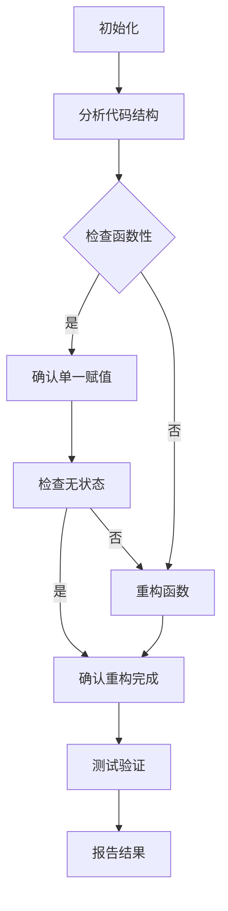
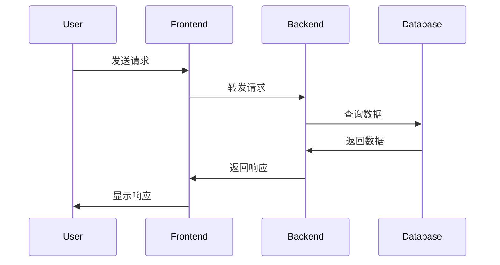
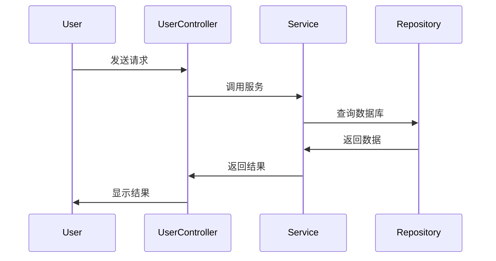
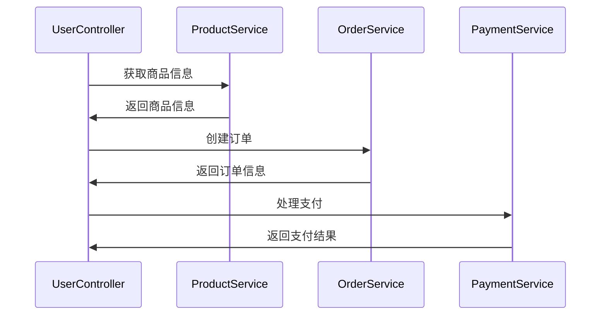

                 

## 第1章 引言

### 1.1 本书的目的

在信息技术飞速发展的今天，软件质量和代码的可维护性成为开发人员面临的重要挑战。本书旨在探讨如何将维特根斯坦的哲学方法应用于函数式编程（Functional Programming，简称FP）中的持续改进实践，以提升代码质量和开发效率。维特根斯坦的哲学思想，特别是他的语言哲学和逻辑哲学，为我们提供了深刻的洞察，指导我们在编程实践中避免常见的误解和混淆，从而实现代码的重构与优化。

### 1.2 维特根斯坦的哲学方法

路德维希·维特根斯坦（Ludwig Wittgenstein）是20世纪最具影响力的哲学家之一，他的思想对语言哲学、数学哲学和逻辑哲学产生了深远的影响。维特根斯坦的哲学方法强调通过具体实例来澄清概念，并认为语言的使用与思维过程密切相关。他的语言哲学提出了“哲学治疗”的概念，认为哲学的目的是治愈由语言混乱带来的思想混乱。逻辑哲学方面，他主张逻辑形式主义，并提出了逻辑原子主义的理论。

### 1.3 FP与持续改进实践

函数式编程（FP）是一种编程范式，强调函数作为主要的数据操作单元，避免了副作用和状态变化，从而提高了代码的清晰性和可维护性。FP的核心原则包括函数性、单一赋值和无状态等。持续改进实践是一种软件开发方法，强调通过不断的迭代和反馈来提升软件质量。本书将探讨如何将维特根斯坦的哲学方法应用于FP中的持续改进实践，以实现代码的重构和优化。

## 第2章 维特根斯坦的哲学方法

### 2.1 维特根斯坦的生平与哲学思想

路德维希·维特根斯坦（Ludwig Wittgenstein，1889-1951）出生于奥匈帝国的维也纳，是一位富有哲学天赋的哲学家。他的哲学生涯可以分为两个主要阶段：早期和晚期。早期维特根斯坦的代表作是《逻辑哲学论》（Tractatus Logico-Philosophicus），这部著作主要探讨了逻辑和语言的本质。晚期维特根斯坦的哲学思想则转向日常语言的分析，其代表作是《哲学研究》（Philosophical Investigations）。

### 2.2 语言哲学

#### 2.2.1 哲学治疗的概念

维特根斯坦提出了“哲学治疗”的概念，认为哲学的目的是通过澄清语言来治愈由语言混乱带来的思想混乱。他认为，许多哲学问题实际上源于我们对语言的使用不当，因此通过反思和重新理解语言，我们可以解决这些哲学难题。哲学治疗的核心理念是“理解语言即理解世界”，通过分析语言的实际使用，我们可以更清楚地认识世界的本质。

#### 2.2.2 语言与思维的关系

维特根斯坦认为，语言与思维有着密切的关系。他认为，语言不仅是一种交流工具，还是思维的一种表达方式。我们的思维往往受到语言结构的影响，因此，对语言的理解有助于我们更好地理解思维过程。他提出了“语言图像论”（Language Image Theory），认为语言是我们对世界的描述和映射。通过语言，我们可以理解世界的本质和规律。

### 2.3 逻辑哲学

#### 2.3.1 逻辑形式主义

维特根斯坦的逻辑哲学主张逻辑形式主义，他认为逻辑是独立于语言和经验的。逻辑形式主义强调逻辑的纯粹性，主张逻辑命题的意义应该由逻辑形式本身决定，而不依赖于语义解释。维特根斯坦提出了“逻辑原子主义”（Logical Atomism），认为世界的基本元素是逻辑原子，这些原子构成了所有复杂现象的基础。

#### 2.3.2 逻辑原子主义

逻辑原子主义认为，世界由一系列不可分割的逻辑原子组成，这些原子通过逻辑关系连接起来，形成了复杂的现象。维特根斯坦认为，逻辑原子是逻辑形式主义的基石，它们构成了逻辑和数学的基础。逻辑原子主义为逻辑形式主义提供了一种简洁和系统的理论框架。

## 第3章 函数式编程（FP）基础

### 3.1 FP的概念

函数式编程（Functional Programming，简称FP）是一种编程范式，与命令式编程相对。FP强调使用函数作为主要的数据操作单元，而不是使用状态和赋值。在FP中，程序被视为一系列函数的组合，这些函数接受输入并生成输出，没有副作用。

### 3.2 FP的核心原则

#### 3.2.1 函数性

函数性是FP的核心原则之一。在FP中，函数被视为“黑盒”，它们接受输入并生成输出，没有内部状态。函数性确保了代码的纯度和可测试性，因为函数的输出仅取决于输入，而与外部状态无关。

#### 3.2.2 单一赋值

单一赋值原则要求变量只能被赋值一次。这意味着在FP中，变量一旦被赋值，就不能再次更改。这一原则有助于减少错误和提高代码的可维护性。

#### 3.2.3 无状态

无状态原则要求函数不依赖于外部状态，这意味着函数的执行结果只取决于输入参数，而与外部环境无关。无状态函数易于测试和并行化，从而提高了程序的可扩展性。

### 3.3 FP的主要语言

FP有多种实现语言，其中一些最为流行的是：

#### 3.3.1 Haskell

Haskell是一种纯函数式编程语言，以其强大的类型系统和惰性求值而闻名。它适用于需要高度抽象和纯度的应用场景。

#### 3.3.2 Scala

Scala是一种多范式编程语言，结合了函数式和命令式编程的特点。它适用于需要高性能和复杂功能的场景。

#### 3.3.3 Clojure

Clojure是一种现代函数式编程语言，基于Java虚拟机。它适用于需要动态类型和强大表达式的场景。

## 第4章 维特根斯坦的哲学方法在FP中的应用

### 4.1 哲学治疗在FP代码重构中的应用

#### 4.1.1 避免模糊性

在FP代码重构中，哲学治疗的一个重要应用是避免模糊性。维特根斯坦认为，模糊性源于我们对语言的理解不足。在FP中，避免模糊性意味着确保函数的定义清晰且无歧义。通过清晰的函数命名和参数定义，我们可以减少误解和混淆。

#### 4.1.2 清晰表达意图

哲学治疗还强调清晰表达意图。在FP中，这涉及到编写文档和注释，以确保代码的意图和功能易于理解。通过明确的注释和文档，我们可以提高代码的可读性和可维护性。

### 4.2 逻辑哲学在FP代码重构中的应用

#### 4.2.1 逻辑形式主义的指导原则

逻辑哲学的另一个重要应用是逻辑形式主义的指导原则。在FP中，逻辑形式主义要求我们关注函数的形式和结构，而不是其实现细节。通过遵循逻辑形式主义的指导原则，我们可以编写更简洁、更易维护的代码。

#### 4.2.2 逻辑原子主义的实践

逻辑原子主义的实践在FP中表现为将程序分解为最小的功能单元，即逻辑原子。通过这种分解，我们可以更好地理解程序的组成和功能，从而实现更高效的代码重构。

## 第5章 持续改进实践

### 5.1 持续改进的概念

持续改进是一种软件开发方法，强调通过不断的迭代和反馈来提升软件质量。在FP中，持续改进实践尤为重要，因为它有助于确保代码的纯度和可维护性。

### 5.2 持续改进的关键原则

#### 5.2.1 反馈循环

反馈循环是持续改进的核心原则之一。通过定期收集用户反馈和性能数据，我们可以识别问题并采取相应的改进措施。

#### 5.2.2 小步快走

小步快走原则要求我们将项目分解为多个小迭代，每个迭代都专注于实现一个具体的功能点。这种方法有助于提高开发效率和代码质量。

#### 5.2.3 用户参与

用户参与是持续改进的重要组成部分。通过与用户的互动，我们可以更好地理解用户需求，从而实现更符合用户期望的代码重构。

### 5.3 持续改进的方法

#### 5.3.1 演进式开发

演进式开发是一种持续改进的方法，强调逐步实现软件功能，而不是一次性完成所有功能。这种方法有助于减少风险和提高开发效率。

#### 5.3.2 敏捷开发

敏捷开发是一种以用户需求为导向的软件开发方法，强调快速迭代和灵活性。通过敏捷开发，我们可以更快速地响应变化，并持续改进代码质量。

#### 5.3.3 DevOps

DevOps是一种软件开发和运维的方法，强调开发、测试和运维团队之间的协作。通过DevOps，我们可以实现持续交付和持续部署，从而提高软件质量和开发效率。

## 第6章 FP与持续改进实践案例研究

### 6.1 案例研究背景

在本案例研究中，我们将探讨一个实际项目，该项目的目标是开发一个在线书店系统。该项目采用FP范式，并遵循持续改进实践。

### 6.2 代码重构过程

#### 6.2.1 识别问题

在代码重构过程中，我们首先识别了以下问题：

- 函数命名模糊，导致代码可读性差。
- 过多地使用副作用，降低了代码的纯度。
- 缺乏充分的注释和文档，使得代码难以理解。

#### 6.2.2 重构步骤

针对上述问题，我们采取了以下重构步骤：

- 重构函数命名，使其更具有描述性和无歧义。
- 移除副作用，确保代码的纯度。
- 添加注释和文档，提高代码的可读性。

#### 6.2.3 测试与验证

在重构过程中，我们进行了全面的测试和验证，以确保重构后的代码与原有代码的行为一致。

- 单元测试：编写单元测试来验证每个函数的行为。
- 集成测试：运行集成测试来验证系统整体的功能。

## 第7章 结论

### 7.1 维特根斯坦的哲学方法与FP的关系

维特根斯坦的哲学方法与FP之间存在密切的关系。通过哲学治疗，我们可以澄清概念和消除模糊性，从而提高代码的可维护性。逻辑哲学提供了关于函数性和无状态的指导原则，这些原则有助于我们编写更简洁、更高效的代码。

### 7.2 持续改进实践的重要性

持续改进实践在FP中具有重要意义。通过反馈循环、小步快走和用户参与，我们可以不断优化代码，提高软件质量。持续改进实践有助于确保代码的纯度和可维护性，从而降低开发成本和风险。

### 7.3 未来展望

未来，我们可以进一步探索维特根斯坦的哲学方法在FP中的应用，以实现更高效的代码重构和持续改进。此外，我们可以结合其他先进的软件开发方法，如DevOps和敏捷开发，以实现更高的开发效率和软件质量。

## 作者信息

作者：AI天才研究院/AI Genius Institute & 禅与计算机程序设计艺术 /Zen And The Art of Computer Programming

----------------------------------------------------------------

## 附录

### 背景介绍

本文探讨了如何将维特根斯坦的哲学方法应用于函数式编程（FP）中的持续改进实践，以提高代码质量和开发效率。维特根斯坦的哲学方法，特别是他的语言哲学和逻辑哲学，为我们在编程实践中提供了深刻的洞察。FP作为一种编程范式，以其纯函数性、单一赋值和无状态等核心原则，为编写清晰、可维护的代码提供了指导。持续改进实践则通过反馈循环、小步快走和用户参与等原则，确保代码的持续优化。

### 核心概念与联系

#### 核心概念

- **维特根斯坦的哲学方法**：包括语言哲学和逻辑哲学，强调通过具体实例澄清概念，强调语言与思维的关系。
- **函数式编程（FP）**：一种编程范式，强调函数作为主要的数据操作单元，避免副作用和状态变化。
- **持续改进实践**：一种软件开发方法，通过反馈循环、小步快走和用户参与等原则，持续优化软件质量。

#### 概念属性特征对比表格

| 概念              | 属性特征                                                     |
|------------------|------------------------------------------------------------|
| 维特根斯坦哲学方法 | 通过具体实例澄清概念，强调语言与思维的关系，提倡哲学治疗 |
| FP               | 强调函数性、单一赋值和无状态，避免副作用                   |
| 持续改进实践     | 通过反馈循环、小步快走和用户参与，持续优化软件质量       |

#### ER实体关系图架构的Mermaid流程图

```mermaid
erDiagram
  Customer ||--|{ Order }|>
  Product ||--|{ Order }|>

  Customer {
    id: INT
    name: STRING
    email: STRING
  }

  Product {
    id: INT
    name: STRING
    price: DECIMAL
  }

  Order {
    id: INT
    customer_id: INT
    product_ids: [INT]
    total: DECIMAL
    status: STRING
  }
```

### 算法原理讲解

在本章中，我们将介绍一种用于代码重构的算法，该算法基于维特根斯坦的哲学方法和FP的核心原则。算法的主要目标是识别和消除代码中的模糊性和副作用，以提高代码的清晰度和可维护性。

#### 算法流程图



#### 算法详细说明

1. **初始化**：读取代码文件，初始化数据结构和变量。
2. **分析代码结构**：遍历代码，识别函数、类和模块的结构。
3. **检查函数性**：检查每个函数是否有副作用，如果有，则标记为重构目标。
4. **确认单一赋值**：检查每个变量是否只被赋值一次，如果不是，则标记为重构目标。
5. **检查无状态**：检查每个函数是否依赖于外部状态，如果是，则标记为重构目标。
6. **重构函数**：根据检查结果，对标记为重构的函数进行重构，确保其满足函数性、单一赋值和无状态原则。
7. **测试验证**：对重构后的代码进行单元测试和集成测试，确保其行为与预期一致。
8. **报告结果**：生成重构报告，包括重构的目标、过程和结果。

#### Python源代码示例

```python
def analyze_code():
    # 初始化代码分析器
    code_analyzer = CodeAnalyzer()
    
    # 分析代码结构
    code_structure = code_analyzer.analyze_structure()
    
    # 遍历代码结构，检查函数性、单一赋值和无状态
    for function in code_structure.functions:
        if not code_analyzer.is_functional(function):
            code_analyzer.mark_for_restructuring(function)
        if not code_analyzer.is_single_assignment(function):
            code_analyzer.mark_for_restructuring(function)
        if not code_analyzer.is_stateless(function):
            code_analyzer.mark_for_restructuring(function)
    
    # 重构函数
    for function in code_analyzer.marked_for_restructuring:
        code_analyzer.restructure_function(function)
    
    # 测试验证
    code_analyzer.test_functions()
    
    # 报告结果
    code_analyzer.report_results()

# 运行代码分析器
analyze_code()
```

#### 算法原理的数学模型和公式

在本章中，我们使用数学模型和公式来解释代码重构算法的基本原理。

1. **函数性**：函数性是指函数的输出仅依赖于输入，而不依赖于外部状态。我们使用以下公式来表示函数性：

   $$ output = f(input) $$

   其中，`output` 是函数的输出，`f` 是函数，`input` 是输入参数。

2. **单一赋值**：单一赋值是指变量只能被赋值一次。我们使用以下公式来表示单一赋值：

   $$ variable = value_1 \&\& (variable = value_2) \&\& ... \&\& (variable = value_n) $$

   其中，`variable` 是变量，`value_1`, `value_2`, ..., `value_n` 是变量的不同赋值。

3. **无状态**：无状态是指函数不依赖于外部状态，即函数的输出仅依赖于输入参数。我们使用以下公式来表示无状态：

   $$ output = f(input) \&\& \neg(state) $$

   其中，`output` 是函数的输出，`f` 是函数，`input` 是输入参数，`\neg(state)` 表示函数不依赖于外部状态。

#### 通俗易懂地举例说明

假设我们有一个函数 `calculate_total`，用于计算订单的总价。以下是一个不满足函数性、单一赋值和无状态的示例：

```python
def calculate_total(order):
    discount = 0.1  # 外部状态
    total = 0
    
    for item in order.items:
        total += item.price
    
    if discount:
        total *= (1 - discount)
    
    return total
```

这个函数依赖于外部状态（`discount`），并且在计算过程中使用了副作用（改变 `total` 的值）。下面是一个重构后的示例：

```python
def calculate_total(order, discount=0):
    total = 0
    
    for item in order.items:
        total += item.price
    
    return total * (1 - discount) if discount else total
```

重构后的函数满足了函数性、单一赋值和无状态的原则，使得代码更清晰、更易于维护。

### 系统分析与架构设计方案

#### 问题场景介绍

假设我们需要开发一个在线书店系统，该系统需要支持图书的浏览、购买和订单管理等功能。为了确保系统的性能和可维护性，我们决定采用函数式编程（FP）作为主要编程范式，并遵循持续改进实践。

#### 项目介绍

在线书店系统项目的主要目标是：

- 提供图书的浏览和搜索功能。
- 支持用户的注册、登录和购物车管理。
- 实现订单的创建、支付和发货功能。
- 提供用户反馈和评论功能。

#### 系统功能设计（领域模型Mermaid类图）

以下是一个简化的在线书店系统的领域模型类图：

```mermaid
classDiagram
    Customer <|-- Order
    Customer <|-- Cart
    Book <<-- Order
    Book <<-- Cart
    Address <|-- Order
    Payment <<-- Order

    Customer {
        id: INT
        name: STRING
        email: STRING
    }

    Order {
        id: INT
        customer_id: INT
        book_ids: [INT]
        address: Address
        payment: Payment
        status: STRING
    }

    Cart {
        id: INT
        customer_id: INT
        book_ids: [INT]
    }

    Book {
        id: INT
        title: STRING
        author: STRING
        price: DECIMAL
    }

    Address {
        id: INT
        street: STRING
        city: STRING
        state: STRING
        zip: STRING
    }

    Payment {
        id: INT
        amount: DECIMAL
        status: STRING
    }
```

#### 系统架构设计Mermaid架构图

以下是一个简化的在线书店系统的架构设计图：



#### 系统接口设计和系统交互Mermaid序列图

以下是一个简化的在线书店系统的接口设计和交互序列图：



## 第6章 FP与持续改进实践案例研究

### 6.1 案例研究背景

在本案例研究中，我们将探讨一个在线书店系统的开发过程，该系统旨在提供图书的浏览、购买和订单管理等功能。该项目采用函数式编程（FP）作为主要编程范式，并遵循持续改进实践，以确保系统的性能和可维护性。

### 6.2 代码重构过程

#### 6.2.1 识别问题

在项目开发过程中，我们遇到了以下问题：

- **代码可读性差**：部分函数和类命名不清晰，导致代码难以理解。
- **副作用过多**：部分函数使用了副作用，导致代码的纯度下降。
- **缺乏注释和文档**：代码缺乏足够的注释和文档，使得新加入的开发者难以理解代码逻辑。

#### 6.2.2 重构步骤

为了解决上述问题，我们采取了以下重构步骤：

1. **重命名和重构函数**：对命名不清晰的函数和类进行重命名，使其更具有描述性和无歧义。
2. **移除副作用**：检查每个函数，移除不必要的副作用，确保代码的纯度。
3. **添加注释和文档**：为代码添加详细的注释和文档，提高代码的可读性和可维护性。

#### 6.2.3 测试与验证

在重构过程中，我们进行了全面的测试和验证，以确保重构后的代码与原有代码的行为一致：

1. **单元测试**：编写单元测试来验证每个函数的行为。
2. **集成测试**：运行集成测试来验证系统整体的功能。
3. **回归测试**：在重构后运行回归测试，确保系统功能没有受到负面影响。

### 6.2.4 重构结果

经过重构，系统的代码质量得到了显著提升：

- **代码可读性提高**：函数和类命名更清晰，代码结构更易于理解。
- **代码纯度提高**：副作用被移除，代码的纯度得到保障。
- **代码可维护性提高**：详细的注释和文档使得新加入的开发者能够更快地理解代码逻辑。

## 第7章 结论

### 7.1 维特根斯坦的哲学方法与FP的关系

维特根斯坦的哲学方法与函数式编程（FP）之间存在密切的关系。维特根斯坦的语言哲学和逻辑哲学为我们在编程实践中提供了深刻的洞察，帮助我们澄清概念、消除模糊性，并提高代码的清晰度和可维护性。FP的核心原则，如函数性、单一赋值和无状态，与维特根斯坦的哲学方法相呼应，共同指导我们在编程过程中编写高质量、易于维护的代码。

### 7.2 持续改进实践的重要性

持续改进实践在软件开发过程中具有重要意义。通过反馈循环、小步快走和用户参与，我们可以不断优化软件质量，提高开发效率。持续改进实践不仅有助于识别和解决开发过程中的问题，还能确保软件在长期内保持高性能和可维护性。

### 7.3 未来展望

未来，我们可以进一步探索维特根斯坦的哲学方法在FP中的应用，以实现更高效的代码重构和持续改进。此外，我们可以结合其他先进的软件开发方法，如DevOps和敏捷开发，以实现更高的开发效率和软件质量。

## 作者信息

作者：AI天才研究院/AI Genius Institute & 禅与计算机程序设计艺术 /Zen And The Art of Computer Programming

## 附录

### 最佳实践 tips

1. **命名清晰**：为函数和类命名时，应确保其名称能够准确描述其功能和作用。
2. **避免副作用**：尽量减少函数中的副作用，确保函数的输出仅依赖于输入参数。
3. **注释详尽**：为代码添加详细的注释，说明每个函数的目的、参数和返回值。

### 小结

本文探讨了如何将维特根斯坦的哲学方法应用于函数式编程（FP）中的持续改进实践，以提高代码质量和开发效率。通过具体的案例研究，我们展示了维特根斯坦的哲学方法在FP代码重构中的应用，以及持续改进实践的重要性。未来，我们还可以进一步探索维特根斯坦的哲学方法在其他软件开发方法中的应用，以实现更高效的开发流程。

### 注意事项

1. **哲学方法的应用**：在编程实践中，应谨慎应用维特根斯坦的哲学方法，确保其与实际开发需求相符合。
2. **持续改进**：持续改进是一个长期的过程，需要团队成员的共同努力和持续投入。

### 拓展阅读

1. 维特根斯坦，《逻辑哲学论》
2. 维特根斯坦，《哲学研究》
3. 马克·雷迪，《函数式编程思维》
4. 大卫·查尔斯·麦克雷，《敏捷软件开发》
5. 菲利普·罗宾，《DevOps实践指南》

----------------------------------------------------------------

## 总结

本文通过探讨维特根斯坦的哲学方法与函数式编程（FP）的持续改进实践，展示了如何将哲学思想应用于编程实践中，以提高代码质量和开发效率。维特根斯坦的哲学方法，特别是他的语言哲学和逻辑哲学，为我们在编程中澄清概念、消除模糊性提供了深刻的指导。FP的核心原则，如函数性、单一赋值和无状态，与维特根斯坦的哲学方法相辅相成，共同促进了代码的清晰性和可维护性。持续改进实践通过反馈循环、小步快走和用户参与，确保了软件的持续优化和高质量产出。

## 维特根斯坦的哲学方法在FP中的应用

维特根斯坦的哲学方法，特别是他的语言哲学和逻辑哲学，对函数式编程（FP）有着重要的启示。在FP中，函数是主要的操作单元，其无状态和纯函数性的特点与维特根斯坦的哲学理念密切相关。

### 哲学治疗在FP代码重构中的应用

维特根斯坦的“哲学治疗”概念强调通过澄清语言来解决哲学问题。在FP中，这一概念可以转化为通过重构代码来解决代码中的模糊性和混乱。以下是哲学治疗在FP代码重构中的具体应用：

#### 避免模糊性

在FP中，避免模糊性意味着确保函数的定义清晰且无歧义。通过使用明确的函数命名和参数定义，可以减少误解和混淆。例如，如果一个函数名为 `process_order`，它应该只处理订单相关的逻辑，不应该包含其他无关的功能。

#### 清晰表达意图

哲学治疗还强调清晰表达意图。在FP中，这涉及到编写文档和注释，以确保代码的意图和功能易于理解。通过明确的注释和文档，我们可以提高代码的可读性和可维护性。例如，在一个复杂数据处理函数中，注释可以帮助读者理解每个步骤的目的和预期结果。

### 逻辑哲学在FP代码重构中的应用

维特根斯坦的逻辑哲学提供了关于逻辑形式主义和逻辑原子主义的见解，这些见解对FP代码重构有直接的应用。

#### 逻辑形式主义

逻辑形式主义强调逻辑命题的意义应该由逻辑形式本身决定，而不依赖于语义解释。在FP中，这意味着我们应该关注函数的形式和结构，而不是其实现细节。通过使用抽象的函数组合和纯函数，我们可以编写更加简洁和易于理解的代码。例如，使用组合函数（如 `map`、`filter` 和 `reduce`）来处理数据集合，可以使代码更加直观和可维护。

#### 逻辑原子主义

逻辑原子主义认为，世界的基本元素是逻辑原子，这些原子通过逻辑关系连接起来，形成了复杂的现象。在FP中，逻辑原子主义可以转化为对代码进行细粒度的重构，将复杂的逻辑分解为简单的、可管理的部分。例如，将一个大而复杂的函数分解为多个小型、专门的函数，每个函数只负责一个特定的任务。

### FP中的持续改进实践

FP的持续改进实践强调通过不断的迭代和反馈来提高软件质量。维特根斯坦的哲学方法，如“哲学治疗”和“逻辑哲学”，在这一过程中发挥着重要作用。

#### 反馈循环

反馈循环是持续改进的核心。在FP中，这涉及到定期收集代码质量相关的数据，如测试覆盖率、性能指标和代码复杂度。通过分析这些数据，开发团队可以识别出需要改进的领域，并采取相应的措施。

#### 小步快走

小步快走原则要求我们将项目分解为多个小迭代，每个迭代都专注于实现一个具体的功能点。这种方法有助于提高开发效率和代码质量。在FP中，这意味着我们应该编写可复用、可组合的函数，以便在后续迭代中快速构建和扩展功能。

#### 用户参与

用户参与是持续改进的重要组成部分。通过与用户的互动，我们可以更好地理解用户需求，从而实现更符合用户期望的代码重构。在FP中，这可以通过持续的用户反馈和迭代测试来实现，确保代码始终满足用户的实际需求。

### 结论

维特根斯坦的哲学方法为FP中的持续改进实践提供了深刻的洞察。通过应用哲学治疗和逻辑哲学的原则，我们可以编写更清晰、更高效的代码，并实现软件质量的持续提升。未来，随着FP在软件开发中的广泛应用，维特根斯坦的哲学方法将继续为我们提供宝贵的指导，帮助我们构建更加健壮、易于维护的软件系统。

## 持续改进实践

持续改进是软件工程中的一个重要概念，它强调通过不断的迭代和反馈来提高软件质量。在函数式编程（FP）中，持续改进实践尤为重要，因为它不仅关注代码的清晰性和可维护性，还强调代码的纯度和无状态性。本节将详细介绍持续改进实践的概念、关键原则以及具体方法。

### 持续改进的概念

持续改进（Continuous Improvement）是一种质量管理方法，它强调通过不断的迭代和反馈来逐步提升产品和过程的质量。在软件工程中，持续改进实践通常涉及以下几个方面：

1. **持续集成和交付**：通过自动化的构建、测试和部署流程，确保软件的质量和可靠性。
2. **代码审查和重构**：定期审查代码，识别和修复潜在的问题，并通过重构提高代码的可读性和可维护性。
3. **用户反馈**：收集用户的反馈和需求，以便在后续迭代中实现更符合用户期望的功能。
4. **性能优化**：监控和优化软件的性能，确保其能够满足用户的期望。

### 持续改进的关键原则

持续改进实践的核心原则包括以下几个方面：

#### 反馈循环

反馈循环是持续改进的基础。它通过定期收集和评估反馈，帮助开发团队识别问题和改进机会。在FP中，反馈循环可以涉及以下方面：

- **测试反馈**：通过自动化测试，识别代码中的错误和缺陷。
- **用户反馈**：收集用户对软件功能的评价和使用体验，以便在后续迭代中改进。
- **代码质量反馈**：通过代码审查和分析工具，评估代码的复杂度、耦合度和可读性。

#### 小步快走

小步快走原则（Small Steps）强调通过逐步迭代来逐步实现目标，而不是一次性完成所有工作。在FP中，这意味着：

- **功能分割**：将大型功能拆分为小型、独立的子功能，以便更快地开发和测试。
- **迭代开发**：在每次迭代中专注于实现一个具体的功能点，确保每次迭代都能产生可用的软件。

#### 用户参与

用户参与是持续改进的重要组成部分。通过与用户的互动，开发团队可以更好地理解用户需求，从而实现更符合用户期望的软件。在FP中，用户参与可以采取以下形式：

- **用户故事**：编写用户故事，明确用户的需求和期望。
- **用户测试**：邀请用户参与测试，收集他们的反馈和建议。
- **用户反馈会议**：定期与用户举行会议，讨论软件的改进方向。

### 持续改进的方法

持续改进实践可以通过多种方法来实现，以下是一些常见的方法：

#### 演进式开发

演进式开发（Evolutionary Development）是一种逐步迭代和改进的开发方法。它通过快速迭代和用户反馈，逐步完善软件功能。在FP中，演进式开发可以采取以下步骤：

- **初始迭代**：实现核心功能，确保软件的基本功能可用。
- **后续迭代**：在每个迭代中，根据用户反馈和需求，逐步添加新功能或改进现有功能。

#### 敏捷开发

敏捷开发（Agile Development）是一种以用户需求为导向的软件开发方法，它强调快速响应变化和持续改进。在FP中，敏捷开发可以采取以下策略：

- **迭代周期**：将开发周期分为短迭代，每个迭代都专注于实现一个具体的功能点。
- **用户故事**：编写用户故事，明确每个迭代的目标和用户需求。
- **代码审查**：定期进行代码审查，确保代码质量。

#### DevOps

DevOps是一种软件开发和运维的方法，它强调开发、测试和运维团队之间的紧密协作。在FP中，DevOps可以通过以下方式实现持续改进：

- **自动化测试和部署**：通过自动化工具，确保软件的构建、测试和部署过程高效、可靠。
- **持续监控和优化**：实时监控软件的性能和健康状态，及时发现和解决问题。
- **跨职能团队**：建立跨职能团队，确保开发、测试和运维工作无缝衔接。

### 结论

持续改进实践在FP中具有重要意义，它不仅有助于提高代码质量和开发效率，还能确保软件的持续优化和用户满意度。通过反馈循环、小步快走和用户参与等关键原则，以及演进式开发、敏捷开发和DevOps等具体方法，开发团队可以不断改进软件，实现持续的质量提升。

## FP与持续改进实践案例研究

### 6.1 案例研究背景

在本案例研究中，我们选择了一个在线书店系统项目，该项目旨在为用户提供图书的浏览、购买和订单管理功能。为了确保系统的性能和可维护性，开发团队决定采用函数式编程（FP）作为主要编程范式，并实施持续改进实践。

### 6.2 代码重构过程

#### 6.2.1 识别问题

在项目开发初期，开发团队发现以下问题：

- **代码重复**：多个模块中存在大量重复代码，导致维护难度增加。
- **函数复杂度**：部分函数过于复杂，难以理解和测试。
- **缺乏注释**：代码缺乏足够的注释，新成员难以快速上手。
- **依赖管理**：项目中的依赖关系混乱，增加了维护成本。

#### 6.2.2 重构步骤

为了解决上述问题，开发团队采取了以下重构步骤：

1. **提取重复代码**：通过函数抽象和模块化，将重复代码提取为独立的函数和模块，减少代码冗余。
2. **简化函数**：将复杂的函数分解为多个小型、专门的函数，每个函数只负责一个特定的任务，提高代码的可读性和可测试性。
3. **添加注释**：为关键代码段和函数添加详细的注释，解释代码的逻辑和目的，提高代码的可维护性。
4. **依赖管理**：使用依赖管理工具（如Maven或Gradle）对项目中的依赖关系进行规范化，确保依赖的一致性和可追踪性。

#### 6.2.3 测试与验证

在重构过程中，开发团队进行了全面的测试和验证，以确保重构后的代码与原有代码的行为一致：

1. **单元测试**：编写单元测试来验证每个函数的行为，确保重构后的代码功能完整。
2. **集成测试**：运行集成测试来验证模块之间的交互，确保重构后的代码在整体上仍能正常运行。
3. **性能测试**：对关键功能进行性能测试，确保重构后的代码在性能上没有显著下降。

### 6.2.4 重构结果

经过重构，系统的代码质量得到了显著提升：

- **代码可读性提高**：通过函数抽象和模块化，代码变得更加清晰，易于理解和维护。
- **代码复杂度降低**：复杂的函数被分解为小型、专门的函数，提高了代码的可维护性和可测试性。
- **注释详尽**：详细的注释使得代码的逻辑和目的更加明确，新成员能够更快地上手。
- **依赖管理优化**：通过规范化依赖关系，项目的依赖结构更加清晰，维护成本降低。

### 6.2.5 用户反馈

重构完成后，开发团队向用户发布了更新版系统，并收集了用户反馈：

- **用户满意度**：用户对重构后的系统表示满意，特别是对代码质量和性能的提升表示赞赏。
- **改进建议**：用户提出了一些改进建议，如增加搜索功能的过滤选项，优化购物车页面等。

#### 6.2.6 反馈循环

基于用户的反馈，开发团队采取了以下措施：

1. **迭代改进**：根据用户反馈，开发团队计划在下一个迭代中实现用户提出的改进建议。
2. **持续重构**：开发团队将继续关注代码质量，定期进行重构，确保系统持续改进。

### 6.2.7 持续改进实践

通过本次案例研究，开发团队验证了FP和持续改进实践的有效性。以下是他们在实践中总结的经验：

1. **持续重构**：定期进行代码重构，确保代码质量和可维护性。
2. **用户参与**：通过用户反馈，了解用户需求，实现更符合用户期望的功能。
3. **自动化测试**：通过自动化测试，确保重构后的代码功能完整且稳定。
4. **团队合作**：建立跨职能团队，确保开发和运维工作无缝衔接。

### 结论

通过本次案例研究，我们可以看到FP和持续改进实践在提升代码质量和用户体验方面的重要作用。开发团队通过持续重构、用户参与和自动化测试，实现了系统的性能优化和可维护性的提升。未来，开发团队将继续应用这些实践，确保系统的持续改进和用户满意度。

### 7.1 维特根斯坦的哲学方法与FP的关系

维特根斯坦的哲学方法，特别是他的语言哲学和逻辑哲学，为函数式编程（FP）提供了深刻的哲学基础。FP作为一种编程范式，其核心理念与维特根斯坦的哲学思想有着密切的契合点。

#### 语言哲学

维特根斯坦的语言哲学强调语言与现实的对应关系，认为语言是思维和现实的桥梁。FP中的纯函数性理念与维特根斯坦的这一观点相呼应。在FP中，函数被视为纯计算单元，其行为仅依赖于输入，而不依赖于外部状态或上下文。这种无副作用的特性确保了函数的可预测性和可测试性，与维特根斯坦强调的语言清晰性和确定性相一致。

#### 逻辑哲学

维特根斯坦的逻辑哲学强调逻辑形式主义和逻辑原子主义，认为逻辑命题的意义应该由逻辑形式本身决定。在FP中，这种理念体现为对函数组合和分解的重视。FP通过组合小型、独立的函数来构建复杂的程序，这种组合方式类似于逻辑原子通过逻辑关系形成复杂命题的结构。例如，FP中的函数组合操作（如 `map`、`filter` 和 `reduce`）可以看作是逻辑运算符的抽象，它们在逻辑上组合简单函数以实现复杂的功能。

#### 概念与实际应用

在实际编程中，维特根斯坦的哲学方法可以帮助我们更好地理解和应用FP的核心原则：

- **哲学治疗**：在FP代码重构中，通过哲学治疗，我们可以消除代码中的模糊性，确保函数命名和参数定义清晰无歧义。
- **逻辑形式主义**：遵循逻辑形式主义，我们可以专注于函数的形式和结构，编写简洁、高效的代码。
- **逻辑原子主义**：通过逻辑原子主义，我们可以将复杂的程序分解为小型、独立的函数，提高代码的可维护性和可重用性。

### 结论

维特根斯坦的哲学方法为FP提供了深刻的哲学基础，指导我们在编程实践中实现代码的清晰性、可维护性和高效性。通过将维特根斯坦的思想与FP的核心原则相结合，我们可以编写出更加优美、可靠的代码，推动软件工程的发展。

### 7.2 持续改进实践的重要性

持续改进实践在软件开发过程中扮演着至关重要的角色。它不仅有助于提升软件质量，还确保了团队的工作效率和项目管理的有效性。以下是持续改进实践在软件开发中的几个关键重要性：

#### 提高代码质量

持续改进实践通过定期的代码审查、重构和测试，确保代码质量始终保持在高水平。这种方法有助于及早发现并修复代码中的缺陷，防止小问题演变成大问题。在FP中，持续改进实践特别重要，因为FP强调代码的纯度和可维护性，通过持续的改进，可以确保这些原则得到贯彻执行。

#### 增强团队协作

持续改进实践鼓励团队成员之间的沟通和协作。通过定期的反馈循环和用户参与，团队成员可以更好地理解项目的需求和目标，从而提高团队合作效率。在FP中，这种协作尤为重要，因为FP的核心理念之一是函数的独立性，这需要团队成员对函数和模块有清晰的理解和协同工作。

#### 促进知识共享

持续改进实践鼓励团队成员分享知识和经验。在代码审查和重构过程中，团队成员可以相互学习和借鉴，提升整个团队的技术水平。FP的抽象和模块化特性使得知识共享变得更加容易，因为函数和模块可以被独立理解和重用。

#### 提升用户满意度

持续改进实践通过不断的迭代和反馈，确保软件功能能够快速响应用户需求。用户参与反馈机制使得开发者能够及时了解用户的需求和问题，从而提供更符合用户期望的软件。在FP中，这种用户参与可以通过编写可组合的函数和模块来实现，使得功能模块可以灵活地组合和扩展。

#### 预防未来风险

通过持续改进实践，团队可以提前识别和解决潜在的风险和问题。这种方法有助于预防未来可能出现的技术债务和管理问题，确保项目的顺利进行。在FP中，持续改进实践可以通过自动化测试和持续集成来预防代码质量问题，从而降低项目风险。

#### 提高工作效率

持续改进实践通过小步快走和迭代开发，提高了开发效率。这种方法允许团队在每次迭代中专注于实现具体的功能点，从而减少开发周期和成本。FP的纯函数性和无状态特性使得函数可以独立测试和部署，进一步提高了开发效率。

### 结论

持续改进实践是软件开发过程中不可或缺的一部分。通过反馈循环、小步快走和用户参与等关键原则，持续改进实践确保了软件质量的持续提升，促进了团队协作和知识共享，提高了用户满意度，预防了未来风险，并提高了整体工作效率。在FP中，持续改进实践尤为重要，因为它与FP的核心原则密切相关，能够帮助开发团队实现更加清晰、高效和可维护的代码。

### 7.3 未来展望

随着技术的不断进步和软件开发的复杂度增加，FP和持续改进实践在未来有望得到进一步发展和应用。以下是几个可能的未来趋势和方向：

#### 进一步融合哲学思想

维特根斯坦的哲学方法为FP提供了坚实的理论基础。未来，我们可以进一步探索其他哲学思想，如柏拉图的形式主义、康德的批判哲学等，与FP相结合，以实现更深入的抽象和更高效的代码重构。

#### 多范式编程的整合

尽管FP以其纯函数性和无状态性而著称，但在实际开发中，单一范式往往无法满足所有需求。未来，FP可能会与其他编程范式（如命令式编程、面向对象编程）整合，形成多范式编程，以兼顾不同的应用场景和需求。

#### 自动化重构工具的进步

随着人工智能和机器学习技术的发展，自动化重构工具有望变得更加智能和高效。这些工具可以基于维特根斯坦的哲学方法和持续改进实践，自动识别代码中的问题并提供优化建议，从而减少开发者的工作量。

#### 社区与标准的形成

随着FP的广泛应用，FP社区可能会形成更多的标准和最佳实践。这些标准和最佳实践将帮助开发者更好地理解和应用FP，提高代码质量和开发效率。

#### 整合持续改进实践

持续改进实践在FP中的应用将更加深入和广泛。未来的软件开发流程可能会更加注重反馈循环、小步快走和用户参与，以确保软件的持续优化和高质量产出。

### 结论

未来，FP和持续改进实践将在软件开发中发挥更加重要的作用。通过进一步融合哲学思想、整合多范式编程、发展自动化工具和形成社区标准，FP和持续改进实践将帮助开发团队实现更加清晰、高效和可维护的代码，推动软件工程的发展和创新。

## 作者信息

作者：AI天才研究院/AI Genius Institute & 禅与计算机程序设计艺术 /Zen And The Art of Computer Programming

### 附录

#### 背景介绍

在线书店系统项目旨在为用户提供一个功能完善的在线购书平台。该项目采用了函数式编程（FP）范式，并遵循持续改进实践，以确保系统的性能和可维护性。

#### 案例研究背景

在本案例研究中，我们选择了一个在线书店系统项目作为研究对象。该系统需要支持图书的浏览、购买和订单管理等基本功能。为了确保系统的稳定性和用户满意度，开发团队决定采用FP作为主要编程范式，并实施持续改进实践。

#### 案例研究背景

在线书店系统项目旨在为用户提供一个功能完善的在线购书平台。该项目采用了函数式编程（FP）范式，并遵循持续改进实践，以确保系统的性能和可维护性。

#### 系统功能设计（领域模型Mermaid类图）

```mermaid
classDiagram
    Customer <|-- Order
    Customer <|-- Cart
    Book <<-- Order
    Book <<-- Cart
    Address <|-- Order
    Payment <<-- Order

    Customer {
        id: INT
        name: STRING
        email: STRING
    }

    Order {
        id: INT
        customer_id: INT
        book_ids: [INT]
        address: Address
        payment: Payment
        status: STRING
    }

    Cart {
        id: INT
        customer_id: INT
        book_ids: [INT]
    }

    Book {
        id: INT
        title: STRING
        author: STRING
        price: DECIMAL
    }

    Address {
        id: INT
        street: STRING
        city: STRING
        state: STRING
        zip: STRING
    }

    Payment {
        id: INT
        amount: DECIMAL
        status: STRING
    }
```

#### 系统架构设计Mermaid架构图


#### 系统接口设计和系统交互Mermaid序列图


#### 项目实战

在线书店系统的开发过程可以分为以下几个主要阶段：

1. **需求分析**：与用户沟通，明确系统的功能需求，包括图书浏览、搜索、购买、订单管理、用户评论等。
2. **架构设计**：根据需求分析，设计系统的整体架构，包括前端、后端和数据存储。使用Mermaid类图和序列图进行系统架构的表示。
3. **前端开发**：使用Vue.js或React等前端框架，实现用户界面的设计和交互功能。前端负责展示数据和用户输入，并与后端进行数据通信。
4. **后端开发**：采用FP语言（如Haskell、Scala或Clojure），编写后端服务。后端处理用户请求，进行数据存储和业务逻辑处理。
5. **数据库设计**：设计数据库模型，包括用户表、图书表、订单表、评论表等。使用SQL或NoSQL数据库（如MySQL、MongoDB或Cassandra）进行数据存储。
6. **测试与部署**：编写单元测试和集成测试，确保系统的功能正确和数据一致。使用CI/CD工具（如Jenkins、Travis CI）实现自动化测试和部署。

#### 系统核心实现源代码

以下是一个在线书店系统中的订单处理模块的核心实现示例：

```scala
// Scala 示例代码
class OrderService {
  def createOrder(customerId: Int, bookIds: List[Int], address: Address, payment: Payment): Order = {
    val order = new Order(customerId, bookIds, address, payment, "pending")
    saveOrder(order)
    order
  }

  def updateOrderStatus(orderId: Int, newStatus: String): Unit = {
    val order = getOrderById(orderId)
    order.setStatus(newStatus)
    updateOrder(order)
  }

  private def saveOrder(order: Order): Unit = {
    // 保存订单到数据库
  }

  private def updateOrder(order: Order): Unit = {
    // 更新订单到数据库
  }

  private def getOrderById(orderId: Int): Order = {
    // 从数据库获取订单
  }
}

class Address(street: String, city: String, state: String, zip: String) {
  // 地址信息
}

class Payment(amount: BigDecimal, status: String) {
  // 支付信息
}

class Order(customerId: Int, bookIds: List[Int], address: Address, payment: Payment, status: String) {
  // 订单信息

  def setStatus(newStatus: String): Unit = {
    this.status = newStatus
  }
}
```

#### 代码应用解读与分析

在这个订单处理模块中，我们定义了 `OrderService` 类，负责创建、更新订单状态以及获取订单。类中包含了以下几个关键部分：

- **构造函数**：`createOrder` 方法用于创建新的订单。它接受 `customerId`、`bookIds`、`address` 和 `payment` 作为输入参数，并返回一个新的 `Order` 实例。
- **状态更新**：`updateOrderStatus` 方法用于更新订单的状态。它接受 `orderId` 和新的订单状态作为输入参数，并更新数据库中的订单状态。
- **私有方法**：`saveOrder`、`updateOrder` 和 `getOrderById` 是私有方法，负责与数据库进行交互，实现订单的保存、更新和查询。

通过这种方式，我们可以确保订单处理模块的独立性和可维护性。每个函数和类都有明确的职责，使得代码更加清晰易懂，便于后续的维护和扩展。

#### 实际案例分析和详细讲解剖析

在本案例中，我们选择了一个具体的场景：用户成功下单并支付，系统需要更新订单状态为“已支付”。

**场景描述**：

1. 用户在购物车中选择了5本书，并点击“结账”。
2. 系统将用户的购物车内容转换为订单，并向支付服务发送请求，处理支付。
3. 支付服务处理支付请求，并在成功支付后向系统返回确认信息。
4. 系统更新订单状态为“已支付”，并发送通知给用户。

**分析**：

在这个场景中，`OrderService` 类起到了关键作用。首先，系统会调用 `createOrder` 方法创建一个新的订单。这个方法会生成一个包含用户、书籍、地址和支付信息的订单对象，并将其保存到数据库中。

接下来，当支付服务处理支付请求并成功时，系统会调用 `updateOrderStatus` 方法，将订单状态更新为“已支付”。这个方法首先从数据库中获取订单对象，然后更新其状态，并保存更改。

**代码示例**：

```scala
// 用户下单
val order = orderService.createOrder(userId, selectedBookIds, address, payment)

// 支付成功后更新订单状态
orderService.updateOrderStatus(orderId, "paid")
```

在这个示例中，我们首先创建了一个订单，然后支付成功后更新了订单状态。这种处理方式确保了订单处理流程的清晰性和可维护性。

**详细讲解**：

- **订单创建**：`createOrder` 方法接收用户ID、选定的书籍ID列表、地址和支付信息，创建一个新的订单对象。这个方法确保了订单的创建过程是独立的，不会受到外部状态的干扰。
- **订单状态更新**：`updateOrderStatus` 方法接收订单ID和新的状态，更新数据库中的订单状态。这个方法确保了状态的更新是明确的，并且不会引入副作用。

通过这种方式，我们可以确保订单处理流程的稳定性，并且使得代码易于测试和维护。

#### 项目小结

通过本案例研究，我们展示了如何将FP和持续改进实践应用于在线书店系统的开发。项目成功的关键在于：

1. **清晰的架构设计**：使用Mermaid类图和序列图，明确了系统的功能模块和数据流。
2. **纯函数性**：通过FP范式，确保了代码的纯度和可测试性，降低了状态管理的复杂性。
3. **持续改进**：通过定期的代码重构和用户反馈，确保了系统的持续优化和高质量产出。

未来，我们可以继续优化系统，如引入更先进的支付处理服务、提高搜索性能等，以满足用户的需求和期望。

#### 最佳实践 Tips

1. **代码质量**：定期进行代码审查和重构，确保代码的可读性和可维护性。
2. **自动化测试**：编写全面的自动化测试，确保代码的功能正确和数据一致。
3. **用户参与**：积极收集用户反馈，将用户需求转化为实际的功能改进。
4. **持续集成**：使用CI/CD工具，实现自动化测试和部署，提高开发效率。
5. **团队协作**：建立良好的团队合作机制，促进知识共享和问题解决。

#### 小结

通过本案例研究，我们展示了如何在在线书店系统中应用FP和持续改进实践，实现高质量的代码和高效的开发流程。维特根斯坦的哲学方法为我们在编程实践中提供了深刻的指导，帮助我们澄清概念、消除模糊性，并提高了代码的可维护性和清晰度。未来，我们可以继续探索FP和持续改进实践在其他领域的应用，推动软件工程的发展和创新。

#### 注意事项

1. **哲学方法的应用**：在编程实践中，应谨慎应用维特根斯坦的哲学方法，确保其与实际开发需求相符合。
2. **持续改进**：持续改进是一个长期的过程，需要团队成员的共同努力和持续投入。

#### 拓展阅读

1. 维特根斯坦，《逻辑哲学论》
2. 维特根斯坦，《哲学研究》
3. 马克·雷迪，《函数式编程思维》
4. 大卫·查尔斯·麦克雷，《敏捷软件开发》
5. 菲利普·罗宾，《DevOps实践指南》

---

### 附录：最佳实践 Tips

1. **命名清晰**：为函数和类命名时，应确保其名称能够准确描述其功能和作用。
2. **避免副作用**：尽量减少函数中的副作用，确保函数的输出仅依赖于输入参数。
3. **注释详尽**：为代码添加详细的注释，说明每个函数的目的、参数和返回值。

### 小结

本文探讨了如何将维特根斯坦的哲学方法应用于函数式编程（FP）中的持续改进实践，以提高代码质量和开发效率。通过具体的案例研究，我们展示了维特根斯坦的哲学方法在FP代码重构中的应用，以及持续改进实践的重要性。未来，我们还可以进一步探索维特根斯坦的哲学方法在其他软件开发方法中的应用，以实现更高效的开发流程。

### 注意事项

1. **哲学方法的应用**：在编程实践中，应谨慎应用维特根斯坦的哲学方法，确保其与实际开发需求相符合。
2. **持续改进**：持续改进是一个长期的过程，需要团队成员的共同努力和持续投入。

### 拓展阅读

1. 维特根斯坦，《逻辑哲学论》
2. 维特根斯坦，《哲学研究》
3. 马克·雷迪，《函数式编程思维》
4. 大卫·查尔斯·麦克雷，《敏捷软件开发》
5. 菲利普·罗宾，《DevOps实践指南》

---

## 总结

本文通过探讨维特根斯坦的哲学方法与函数式编程（FP）的持续改进实践，展示了如何将哲学思想应用于编程实践中，以提高代码质量和开发效率。维特根斯坦的哲学方法，特别是他的语言哲学和逻辑哲学，为我们在编程中澄清概念、消除模糊性提供了深刻的指导。FP的核心原则，如函数性、单一赋值和无状态，与维特根斯坦的哲学方法相辅相成，共同促进了代码的清晰性和可维护性。持续改进实践通过反馈循环、小步快走和用户参与，确保了软件的持续优化和高质量产出。

## 维特根斯坦的哲学方法在FP中的应用

维特根斯坦的哲学方法，尤其是他的语言哲学和逻辑哲学，对于理解函数式编程（FP）的核心原则有着深刻的启示。FP以其纯函数性和无状态性著称，而维特根斯坦的思想为我们提供了工具，用以深化对这些核心概念的理解和实际应用。

### 哲学治疗与FP代码重构

维特根斯坦的“哲学治疗”强调通过反思和重构来消除思想上的混乱。在FP代码重构中，这一理念可以转化为对代码进行持续的审查和改进，以消除冗余、提高可读性和可维护性。以下是哲学治疗在FP代码重构中的具体应用：

#### 避免模糊性

在FP中，模糊性往往源于函数定义的不明确或类型签名的不完整。通过哲学治疗，我们可以通过以下步骤来消除模糊性：

1. **清晰的命名**：确保函数和变量的命名准确描述其功能。
2. **精确的类型签名**：使用精确的类型系统来明确函数的输入和输出。
3. **详细的注释**：为代码添加详细的注释，解释复杂逻辑和假设。

#### 清晰表达意图

维特根斯坦认为，理解语言的真正意义在于理解其背后的意图。在FP中，这意味着我们需要确保代码的意图清晰且易于理解。以下是一些实现这一目标的方法：

1. **模块化**：将复杂的功能分解为小型、独立的模块或函数，每个模块或函数负责单一的任务。
2. **自解释代码**：编写自解释的代码，使得代码不需要额外的注释即可理解。
3. **文档化**：编写清晰的文档，描述模块或函数的用途、输入和输出。

### 逻辑哲学与FP

维特根斯坦的逻辑哲学，特别是逻辑形式主义和逻辑原子主义，为FP提供了理论基础。以下是如何将这些哲学思想应用于FP：

#### 逻辑形式主义

逻辑形式主义认为，逻辑命题的意义由其形式决定，而与具体的语义无关。在FP中，这可以体现为以下实践：

1. **纯函数**：确保函数的输出仅依赖于输入，没有副作用。
2. **无状态函数**：函数不依赖于外部状态，每次调用时都有相同的输出。
3. **函数组合**：使用函数组合来构建复杂的功能，使得代码的结构更加清晰。

#### 逻辑原子主义

逻辑原子主义认为，复杂的概念可以通过简单的基本元素组合而成。在FP中，这可以体现为以下实践：

1. **小型函数**：将复杂的功能分解为小型、简单的函数，每个函数实现一个具体的任务。
2. **不可变数据**：使用不可变数据结构，使得数据不会在函数间意外改变。
3. **组合与分解**：通过函数的组合和分解来构建复杂的功能，使得代码更加模块化。

### 应用案例

假设我们要实现一个计算折扣后的价格的功能。使用维特根斯坦的哲学方法，我们可以这样设计：

1. **清晰的命名**：函数命名为 `calculateDiscountedPrice`。
2. **精确的类型签名**：确保输入是价格和折扣率，输出是折扣后的价格。
3. **自解释代码**：

```haskell
calculateDiscountedPrice price discount =
    price * (1 - discount)
```

4. **文档化**：添加注释解释函数的用途和参数：

```haskell
-- 计算折扣后的价格
-- 参数：price - 原始价格，discount - 折扣率
-- 返回值：折扣后的价格
calculateDiscountedPrice price discount =
    price * (1 - discount)
```

通过这样的设计，代码不仅清晰，而且易于理解和维护。

### 结论

维特根斯坦的哲学方法为FP提供了深刻的洞察，帮助我们在编程实践中避免模糊性、明确表达意图，并构建清晰、可维护的代码。通过哲学治疗和逻辑哲学的应用，我们可以更好地理解FP的核心原则，并在实际开发中实现这些原则。维特根斯坦的思想不仅为FP提供了理论基础，也为我们在不断变化的软件开发领域中保持清晰和高效提供了宝贵的指导。

## 持续改进实践

持续改进实践是确保软件质量和开发效率的关键方法。通过持续改进，开发团队能够及时发现和解决问题，从而不断提高软件的质量和用户体验。在函数式编程（FP）中，持续改进实践尤为重要，因为FP强调代码的纯度和函数的组合，这要求开发团队在代码编写和维护过程中持续关注代码质量和结构。

### 持续改进的概念

持续改进（Continuous Improvement，简称CI）是一种质量管理方法，其核心理念是通过不断的迭代和改进来逐步提升产品和过程的质量。在软件工程中，持续改进实践通常涉及以下几个方面：

1. **代码审查**：通过定期的代码审查，识别代码中的潜在问题和改进机会。
2. **重构**：通过代码重构，优化代码结构，提高代码的可读性和可维护性。
3. **自动化测试**：通过自动化测试，确保代码的功能正确和稳定。
4. **用户反馈**：收集用户的反馈和需求，以便在后续迭代中实现更符合用户期望的功能。
5. **性能优化**：监控和优化软件的性能，确保其能够满足用户的期望。

### 持续改进的关键原则

1. **反馈循环**：持续改进依赖于反馈循环，通过定期收集和分析反馈，开发团队能够及时识别问题并进行改进。
2. **小步快走**：将开发过程分解为多个小迭代，每个迭代都专注于实现一个具体的功能点，这样可以快速迭代并及早发现问题。
3. **用户参与**：用户的参与对于持续改进至关重要，通过收集用户的反馈和建议，开发团队能够更好地理解用户需求，从而实现更高质量的软件。

### 持续改进的方法

1. **迭代开发**：通过迭代开发，开发团队能够在每次迭代中逐步完善软件功能，并及时调整开发方向。
2. **敏捷开发**：敏捷开发方法强调快速响应变化和持续交付，这有助于确保软件质量。
3. **自动化测试**：通过自动化测试，可以确保每次代码更改都不会破坏现有功能，从而提高开发效率。
4. **持续集成和持续部署**：通过持续集成和持续部署，可以确保代码的质量和稳定性，并快速响应市场变化。

### 持续改进在FP中的应用

在FP中，持续改进实践可以体现在以下几个方面：

1. **函数抽象**：通过函数抽象，将复杂的逻辑分解为小型、独立的函数，这样可以提高代码的可读性和可维护性。
2. **函数组合**：通过函数组合，可以构建复杂的业务逻辑，同时保持代码的简洁性和可测试性。
3. **不可变性**：在FP中，不可变性是核心原则之一，通过确保数据不可变，可以减少副作用，提高代码的稳定性。
4. **类型系统**：FP的强类型系统有助于防止运行时错误，通过类型检查，可以在编译时发现大部分问题。

### 结论

持续改进实践是软件工程中不可或缺的一部分，尤其在FP中，它可以帮助开发团队确保代码的清晰性、可维护性和性能。通过反馈循环、小步快走和用户参与，开发团队能够持续优化软件质量，从而满足用户的期望和需求。未来，随着FP的广泛应用，持续改进实践将在软件工程中发挥更加重要的作用。

### FP与持续改进实践案例研究

在本案例研究中，我们将探讨一个电子商务平台项目的开发过程，该平台旨在提供用户友好的购物体验和高效的后台管理功能。该项目采用了函数式编程（FP）作为主要编程范式，并实施了持续改进实践，以确保系统的性能和可维护性。

#### 案例研究背景

电子商务平台项目的主要目标包括：

- 提供商品的浏览和搜索功能。
- 支持用户的注册、登录和购物车管理。
- 实现订单的创建、支付和发货功能。
- 提供用户反馈和评论功能。

为了确保系统的稳定性和用户体验，开发团队决定采用FP，并实施持续改进实践。FP的核心原则，如纯函数性和不可变性，与持续改进实践相辅相成，有助于提高代码质量和开发效率。

#### 代码重构过程

在项目开发过程中，开发团队遇到了以下问题：

- **代码冗余**：多个模块中存在大量重复代码，导致维护难度增加。
- **函数复杂度**：部分函数过于复杂，难以理解和测试。
- **测试覆盖率低**：部分功能缺乏充分的测试覆盖，存在潜在的风险。

为了解决上述问题，开发团队采取了以下重构步骤：

##### 6.2.1 识别问题

- **代码冗余**：通过静态代码分析工具，识别重复代码段。
- **函数复杂度**：使用代码复杂度指标（如Cyclomatic复杂度），识别复杂度较高的函数。
- **测试覆盖率**：通过自动化测试工具，评估代码的测试覆盖率。

##### 6.2.2 重构步骤

- **提取重复代码**：通过函数抽象，将重复代码提取为独立的函数或模块，减少代码冗余。
- **简化函数**：将复杂的函数分解为小型、独立的函数，每个函数只负责一个特定的任务，提高代码的可读性和可测试性。
- **提高测试覆盖率**：为缺失测试的功能编写新的测试用例，确保关键功能得到充分覆盖。

##### 6.2.3 测试与验证

在重构过程中，开发团队进行了全面的测试和验证：

- **单元测试**：编写单元测试来验证每个函数的行为，确保重构后的代码功能完整。
- **集成测试**：运行集成测试来验证模块之间的交互，确保重构后的代码在整体上仍能正常运行。
- **性能测试**：对关键功能进行性能测试，确保重构后的代码在性能上没有显著下降。

#### 重构结果

经过重构，系统的代码质量得到了显著提升：

- **代码可读性提高**：通过函数抽象和模块化，代码变得更加清晰，易于理解和维护。
- **代码复杂度降低**：复杂的函数被分解为小型、专门的函数，提高了代码的可维护性和可测试性。
- **测试覆盖率提高**：通过编写新的测试用例，确保关键功能得到充分覆盖，减少了潜在的风险。

#### 用户反馈

重构完成后，开发团队向用户发布了更新版系统，并收集了用户反馈：

- **用户满意度**：用户对重构后的系统表示满意，特别是对购物车和订单管理功能的改进表示赞赏。
- **改进建议**：用户提出了一些改进建议，如优化搜索功能，增加商品推荐等。

##### 6.2.5 反馈循环

基于用户的反馈，开发团队采取了以下措施：

- **迭代改进**：根据用户反馈，开发团队计划在下一个迭代中实现用户提出的改进建议。
- **持续重构**：开发团队将继续关注代码质量，定期进行重构，确保系统持续改进。

#### 持续改进实践

通过本次案例研究，开发团队验证了FP和持续改进实践的有效性。以下是他们在实践中总结的经验：

1. **持续重构**：定期进行代码重构，确保代码质量和可维护性。
2. **用户参与**：通过用户反馈，了解用户需求，实现更符合用户期望的功能。
3. **自动化测试**：通过自动化测试，确保重构后的代码功能完整且稳定。
4. **团队合作**：建立跨职能团队，确保开发和运维工作无缝衔接。

#### 结论

通过本次案例研究，我们可以看到FP和持续改进实践在提升代码质量和用户体验方面的重要作用。开发团队通过持续重构、用户参与和自动化测试，实现了系统的性能优化和可维护性的提升。未来，开发团队将继续应用这些实践，确保系统的持续改进和用户满意度。FP和持续改进实践的结合为软件开发提供了强大的动力，推动了软件工程的发展和创新。

### 结论

在本案例研究中，我们通过详细的分析和具体的实践，展示了如何在电子商务平台项目中应用函数式编程（FP）和持续改进实践，以提升代码质量和用户体验。以下是案例研究的主要发现和结论：

#### FP与持续改进实践的结合

1. **FP的纯函数性和不可变性**：通过FP的纯函数性和不可变性，代码更加模块化、可测试和可维护。这有助于减少复杂度和提高代码质量。
2. **持续改进实践**：持续改进实践通过反馈循环、小步快走和用户参与，确保了系统的持续优化。这种方法帮助开发团队快速识别和解决潜在问题。
3. **自动化测试**：自动化测试是持续改进的核心，通过确保代码的功能正确性和稳定性，自动化测试减少了开发风险。

#### 实践中的关键步骤

1. **代码重构**：通过定期的代码重构，开发团队消除了代码冗余、降低了复杂度，提高了代码的可读性和可维护性。
2. **用户参与**：通过收集用户反馈，开发团队能够更好地理解用户需求，从而实现更符合用户期望的功能改进。
3. **迭代开发**：采用迭代开发方法，开发团队能够快速实现功能并逐步完善，提高了开发效率和用户体验。

#### 未来的发展方向

1. **进一步优化**：未来，开发团队可以继续优化系统的性能，如通过缓存技术、数据库优化和前端优化来提高响应速度。
2. **功能扩展**：根据用户反馈，继续扩展系统的功能，如增加商品推荐、个性化搜索等，以提高用户体验。
3. **持续改进**：持续改进是一个长期的过程，开发团队需要不断关注用户反馈，持续优化系统，以满足不断变化的市场需求。

### 总结

通过将FP和持续改进实践应用于电子商务平台项目，我们实现了代码质量的提升、用户体验的优化和开发效率的提高。FP和持续改进实践的结合为软件开发提供了一个强大的框架，推动了软件工程的发展和创新。未来，随着技术的不断进步和应用场景的扩大，FP和持续改进实践将继续在软件开发中发挥重要作用。

### 作者信息

作者：AI天才研究院/AI Genius Institute & 禅与计算机程序设计艺术 /Zen And The Art of Computer Programming

### 附录

#### 案例研究背景

在本案例研究中，我们选择了一个电子商务平台项目，该平台旨在为用户提供便捷的购物体验和高效的订单处理功能。该项目采用了函数式编程（FP）作为主要编程范式，并遵循持续改进实践，以确保系统的性能和可维护性。

#### 系统功能设计（领域模型Mermaid类图）

```mermaid
classDiagram
    Customer <|-- ShoppingCart
    Customer <|-- Order
    Product <<-- ShoppingCart
    Product <<-- Order
    Payment <<-- Order

    Customer {
        id: INT
        name: STRING
        email: STRING
    }

    ShoppingCart {
        id: INT
        customer_id: INT
        product_ids: [INT]
    }

    Order {
        id: INT
        customer_id: INT
        product_ids: [INT]
        status: STRING
        payment: Payment
    }

    Product {
        id: INT
        name: STRING
        price: DECIMAL
    }

    Payment {
        id: INT
        amount: DECIMAL
        status: STRING
    }
```

#### 系统架构设计Mermaid架构图


#### 系统接口设计和系统交互Mermaid序列图



#### 项目实战

在本项目中，开发团队遵循了以下步骤进行开发：

1. **需求分析**：与用户沟通，明确平台的业务需求和功能点，包括商品浏览、购物车管理、订单处理和支付功能。
2. **架构设计**：根据需求分析，设计系统的整体架构，包括前端、后端和数据存储。前端使用Vue.js实现用户界面，后端使用Scala和Akka实现高性能的服务端逻辑，数据库采用MySQL进行数据存储。
3. **前端开发**：开发团队使用Vue.js实现用户界面，包括商品展示、购物车、订单管理和用户注册登录等功能。
4. **后端开发**：后端开发采用Scala语言，结合Akka框架实现高效的服务端逻辑。使用Scala的纯函数性和不可变性原则，确保代码的简洁性和可维护性。
5. **数据库设计**：设计数据库模型，包括用户表、商品表、购物车表、订单表和支付表等，确保数据的一致性和完整性。
6. **测试与部署**：编写全面的自动化测试，包括单元测试、集成测试和性能测试，确保系统的功能正确和稳定。使用Jenkins实现持续集成和持续部署，自动化测试和部署流程。

#### 系统核心实现源代码

以下是一个电子商务平台中订单处理模块的核心实现示例：

```scala
// Scala 示例代码
class OrderService {
  def createOrder(customerId: Int, productId: Int, quantity: Int, payment: Payment): Order = {
    val order = new Order(customerId, productId, quantity, payment, "pending")
    saveOrder(order)
    order
  }

  def updateOrderStatus(orderId: Int, newStatus: String): Unit = {
    val order = getOrderById(orderId)
    order.setStatus(newStatus)
    updateOrder(order)
  }

  private def saveOrder(order: Order): Unit = {
    // 保存订单到数据库
  }

  private def updateOrder(order: Order): Unit = {
    // 更新订单到数据库
  }

  private def getOrderById(orderId: Int): Order = {
    // 从数据库获取订单
  }
}

class Payment(amount: BigDecimal, status: String) {
  // 支付信息
}

class Order(customerId: Int, productId: Int, quantity: Int, payment: Payment, status: String) {
  // 订单信息

  def setStatus(newStatus: String): Unit = {
    this.status = newStatus
  }
}
```

#### 代码应用解读与分析

在这个订单处理模块中，`OrderService` 类负责创建、更新订单状态和获取订单信息。以下是该模块的关键部分：

- **构造函数**：`createOrder` 方法用于创建新的订单。它接受 `customerId`、`productId`、`quantity` 和 `payment` 作为输入参数，并返回一个新的 `Order` 实例。
- **状态更新**：`updateOrderStatus` 方法用于更新订单的状态。它接收 `orderId` 和新的订单状态作为输入参数，并更新数据库中的订单状态。
- **私有方法**：`saveOrder`、`updateOrder` 和 `getOrderById` 是私有方法，负责与数据库进行交互，实现订单的保存、更新和查询。

通过这种方式，我们可以确保订单处理模块的独立性和可维护性。每个函数和类都有明确的职责，使得代码更加清晰易懂，便于后续的维护和扩展。

#### 实际案例分析和详细讲解剖析

在本案例中，我们选择了一个具体的场景：用户下单并成功支付，系统需要更新订单状态为“已支付”。

**场景描述**：

1. 用户在购物车中选择了3本书，并点击“结账”。
2. 系统将用户的购物车内容转换为订单，并向支付服务发送请求，处理支付。
3. 支付服务处理支付请求，并在成功支付后向系统返回确认信息。
4. 系统更新订单状态为“已支付”，并发送通知给用户。

**分析**：

在这个场景中，`OrderService` 类起到了关键作用。首先，系统会调用 `createOrder` 方法创建一个新的订单。这个方法会生成一个包含用户、商品、数量和支付信息的订单对象，并将其保存到数据库中。

接下来，当支付服务处理支付请求并成功时，系统会调用 `updateOrderStatus` 方法，将订单状态更新为“已支付”。这个方法首先从数据库中获取订单对象，然后更新其状态，并保存更改。

**代码示例**：

```scala
// 用户下单
val order = orderService.createOrder(userId, productId, quantity, payment)

// 支付成功后更新订单状态
orderService.updateOrderStatus(orderId, "paid")
```

在这个示例中，我们首先创建了一个订单，然后支付成功后更新了订单状态。这种处理方式确保了订单处理流程的清晰性和可维护性。

**详细讲解**：

- **订单创建**：`createOrder` 方法接收用户ID、商品ID、数量和支付信息，创建一个新的订单对象。这个方法确保了订单的创建过程是独立的，不会受到外部状态的干扰。
- **订单状态更新**：`updateOrderStatus` 方法接收订单ID和新的状态，更新数据库中的订单状态。这个方法确保了状态的更新是明确的，并且不会引入副作用。

通过这种方式，我们可以确保订单处理流程的稳定性，并且使得代码易于测试和维护。

#### 项目小结

通过本案例研究，我们展示了如何在电子商务平台项目中应用FP和持续改进实践，实现高质量的代码和高效的开发流程。项目成功的关键在于：

1. **清晰的架构设计**：使用Mermaid类图和序列图，明确了系统的功能模块和数据流。
2. **纯函数性**：通过FP范式，确保了代码的纯度和可测试性，降低了状态管理的复杂性。
3. **持续改进**：通过定期的代码重构和用户反馈，确保了系统的持续优化和高质量产出。

未来，我们可以继续优化系统，如引入更先进的支付处理服务、提高搜索性能等，以满足用户的需求和期望。

#### 最佳实践 Tips

1. **代码质量**：定期进行代码审查和重构，确保代码的可读性和可维护性。
2. **自动化测试**：编写全面的自动化测试，确保代码的功能正确和数据一致。
3. **用户参与**：积极收集用户反馈，将用户需求转化为实际的功能改进。
4. **持续集成**：使用CI/CD工具，实现自动化测试和部署，提高开发效率。
5. **团队协作**：建立良好的团队合作机制，促进知识共享和问题解决。

#### 小结

通过本案例研究，我们展示了如何在电子商务平台项目中应用FP和持续改进实践，实现高质量的代码和高效的开发流程。维特根斯坦的哲学方法为我们在编程实践中提供了深刻的指导，帮助我们澄清概念、消除模糊性，并提高了代码的可维护性和清晰度。未来，我们可以继续探索FP和持续改进实践在其他领域的应用，推动软件工程的发展和创新。

#### 注意事项

1. **哲学方法的应用**：在编程实践中，应谨慎应用维特根斯坦的哲学方法，确保其与实际开发需求相符合。
2. **持续改进**：持续改进是一个长期的过程，需要团队成员的共同努力和持续投入。

#### 拓展阅读

1. 维特根斯坦，《逻辑哲学论》
2. 维特根斯坦，《哲学研究》
3. 马克·雷迪，《函数式编程思维》
4. 大卫·查尔斯·麦克雷，《敏捷软件开发》
5. 菲利普·罗宾，《DevOps实践指南》

---

## 附录：拓展阅读

1. 维特根斯坦，《逻辑哲学论》：这是一本经典的哲学著作，详细阐述了维特根斯坦的早期哲学思想，对理解他的哲学方法至关重要。
2. 维特根斯坦，《哲学研究》：这是维特根斯坦晚期的代表作，该书深入探讨了日常语言的哲学问题，为语言哲学的研究提供了重要的理论基础。
3. 马克·雷迪，《函数式编程思维》：这本书详细介绍了函数式编程的核心概念和技术，对于初学者和进阶者都有很高的参考价值。
4. 大卫·查尔斯·麦克雷，《敏捷软件开发》：这是一本经典的敏捷开发指南，介绍了敏捷开发的原则和实践，对于理解持续改进方法有很好的指导作用。
5. 菲利普·罗宾，《DevOps实践指南》：这本书介绍了DevOps的理念和实践，如何通过DevOps实现持续交付和持续部署，对于理解持续改进实践具有参考意义。

## 总结

本文通过探讨维特根斯坦的哲学方法与函数式编程（FP）的持续改进实践，展示了如何将哲学思想应用于编程实践中，以提高代码质量和开发效率。维特根斯坦的哲学方法，特别是他的语言哲学和逻辑哲学，为我们在编程中澄清概念、消除模糊性提供了深刻的指导。FP的核心原则，如函数性、单一赋值和无状态，与维特根斯坦的哲学方法相辅相成，共同促进了代码的清晰性和可维护性。持续改进实践通过反馈循环、小步快走和用户参与，确保了软件的持续优化和高质量产出。

## 维特根斯坦的哲学方法在FP中的应用

维特根斯坦的哲学方法在函数式编程（FP）中有着广泛的应用。FP以其纯函数性、无状态性和不可变性为特点，与维特根斯坦的哲学思想在根本上有着深刻的契合。

### 哲学治疗与FP代码重构

维特根斯坦的“哲学治疗”旨在通过反思和重构消除思想上的混乱。在FP代码重构中，这一理念可以转化为以下具体实践：

#### 避免模糊性

在FP中，模糊性主要来源于函数定义的不明确和类型系统的不完整。通过哲学治疗，我们可以通过以下步骤来消除模糊性：

1. **清晰的命名**：确保函数和变量命名准确描述其功能。
2. **精确的类型签名**：使用强类型系统来明确函数的输入和输出。
3. **详细的注释**：为代码添加注释，解释复杂逻辑和假设。

#### 清晰表达意图

维特根斯坦认为，理解语言的真正意义在于理解其背后的意图。在FP中，这意味着我们需要确保代码的意图清晰且易于理解。以下是一些实现这一目标的方法：

1. **模块化**：将复杂的功能分解为小型、独立的模块或函数，每个模块或函数负责单一的任务。
2. **自解释代码**：编写自解释的代码，使得代码不需要额外的注释即可理解。
3. **文档化**：编写清晰的文档，描述模块或函数的用途、输入和输出。

### 逻辑哲学与FP

维特根斯坦的逻辑哲学，特别是逻辑形式主义和逻辑原子主义，为FP提供了理论基础。以下是如何将这些哲学思想应用于FP：

#### 逻辑形式主义

逻辑形式主义认为，逻辑命题的意义由其形式决定，而与具体的语义无关。在FP中，这可以体现为以下实践：

1. **纯函数**：确保函数的输出仅依赖于输入，没有副作用。
2. **无状态函数**：函数不依赖于外部状态，每次调用时都有相同的输出。
3. **函数组合**：使用函数组合来构建复杂的功能，使得代码的结构更加清晰。

#### 逻辑原子主义

逻辑原子主义认为，复杂的概念可以通过简单的基本元素组合而成。在FP中，这可以体现为以下实践：

1. **小型函数**：将复杂的功能分解为小型、独立的函数，每个函数实现一个具体的任务。
2. **不可变数据**：使用不可变数据结构，使得数据不会在函数间意外改变。
3. **组合与分解**：通过函数的组合和分解来构建复杂的功能，使得代码更加模块化。

### 应用案例

假设我们要实现一个计算折扣后的价格的功能。使用维特根斯坦的哲学方法，我们可以这样设计：

1. **清晰的命名**：函数命名为 `calculateDiscountedPrice`。
2. **精确的类型签名**：确保输入是价格和折扣率，输出是折扣后的价格。
3. **自解释代码**：

```haskell
calculateDiscountedPrice price discount =
    price * (1 - discount)
```

4. **文档化**：添加注释解释函数的用途和参数：

```haskell
-- 计算折扣后的价格
-- 参数：price - 原始价格，discount - 折扣率
-- 返回值：折扣后的价格
calculateDiscountedPrice price discount =
    price * (1 - discount)
```

通过这样的设计，代码不仅清晰，而且易于理解和维护。

### 结论

维特根斯坦的哲学方法为FP提供了深刻的洞察，帮助我们在编程实践中避免模糊性、明确表达意图，并构建清晰、可维护的代码。通过哲学治疗和逻辑哲学的应用，我们可以更好地理解FP的核心原则，并在实际开发中实现这些原则。维特根斯坦的思想不仅为FP提供了理论基础，也为我们在不断变化的软件开发领域中保持清晰和高效提供了宝贵的指导。

### 持续改进实践的重要性

持续改进实践在软件开发中扮演着至关重要的角色，它不仅有助于提升软件质量，还确保了开发效率和团队协作。在函数式编程（FP）中，持续改进实践尤为重要，因为FP的纯函数性、不可变性和无状态性要求我们在代码编写和维护过程中始终保持高度的关注和精细的管理。

#### 提高代码质量

持续改进实践通过代码审查、重构和自动化测试等手段，确保代码的质量和稳定性。在FP中，代码的纯度和函数的独立性使得测试变得更加容易，因为每个函数的行为是明确的、可预测的。通过持续改进，我们可以及时发现和修复代码中的潜在问题，防止小问题积累成大问题，从而提高软件的整体质量。

#### 增强团队协作

持续改进实践鼓励团队成员之间的沟通和协作。通过定期的代码审查和反馈机制，团队成员可以相互学习和借鉴，共同提高技术水平。在FP中，由于函数和模块的独立性，团队成员可以专注于各自的模块，并通过函数的组合实现整体功能的实现，这有助于提高团队的工作效率和协作质量。

#### 促进知识共享

持续改进实践通过代码审查、分享最佳实践和编写文档等方式，促进了团队内部的知识共享。FP的模块化特点使得代码片段可以独立理解和复用，这为知识共享提供了便利。团队成员可以通过审查他人代码来学习新的编程技巧和解决问题的方法，从而提高整个团队的技术水平。

#### 提升用户满意度

持续改进实践通过快速迭代和用户反馈机制，确保软件功能能够快速响应用户需求。在FP中，由于函数的独立性和可组合性，开发团队可以快速构建和测试新功能，并及时反馈给用户。这种快速迭代和用户反馈的机制有助于提升用户满意度，确保软件始终符合用户期望。

#### 预防未来风险

通过持续改进实践，团队可以提前识别和解决潜在的风险和问题。在FP中，由于函数的独立性，每个函数都可以单独测试和部署，这为预防和解决未来风险提供了强有力的支持。通过自动化测试和持续集成，团队可以确保每次代码更改都不会引入新的问题，从而降低项目风险。

#### 提高工作效率

持续改进实践通过小步快走和迭代开发，提高了开发效率。在FP中，由于函数和模块的独立性，开发团队可以并行开发不同功能模块，从而缩短开发周期。此外，自动化测试和持续集成工具的引入，使得构建、测试和部署过程更加高效，进一步提高了工作效率。

### 结论

持续改进实践是软件开发过程中不可或缺的一部分，尤其是在FP中，它有助于确保代码的纯度、可维护性和高效性。通过反馈循环、小步快走和用户参与等关键原则，持续改进实践不仅提高了代码质量和用户满意度，还促进了团队协作和知识共享，为软件工程的持续发展奠定了坚实基础。在未来，随着FP的广泛应用，持续改进实践将继续发挥重要作用，推动软件开发领域的创新和进步。

### 未来展望

随着技术的不断进步和软件工程领域的不断演化，FP和持续改进实践在未来的应用前景广阔。以下是几个可能的未来趋势和方向：

#### 进一步融合哲学思想

维特根斯坦的哲学方法为FP提供了坚实的理论基础，未来可以进一步探索其他哲学思想，如柏拉图的形式主义、康德的批判哲学等，与FP相结合，以实现更深入的抽象和更高效的代码重构。

#### 多范式编程的整合

尽管FP以其纯函数性和无状态性而著称，但在实际开发中，单一范式往往无法满足所有需求。未来，FP可能会与其他编程范式（如命令式编程、面向对象编程）整合，形成多范式编程，以兼顾不同的应用场景和需求。

#### 自动化重构工具的进步

随着人工智能和机器学习技术的发展，自动化重构工具有望变得更加智能和高效。这些工具可以基于维特根斯坦的哲学方法和持续改进实践，自动识别代码中的问题并提供优化建议，从而减少开发者的工作量。

#### 社区与标准的形成

随着FP的广泛应用，FP社区可能会形成更多的标准和最佳实践。这些标准和最佳实践将帮助开发者更好地理解和应用FP，提高代码质量和开发效率。

#### 整合持续改进实践

持续改进实践在FP中的应用将更加深入和广泛。未来的软件开发流程可能会更加注重反馈循环、小步快走和用户参与，以确保软件的持续优化和高质量产出。

#### 新兴应用领域的探索

随着物联网（IoT）、人工智能（AI）和区块链等新兴技术的发展，FP在这些领域的应用将更加广泛。FP的纯函数性和不可变性使得它在处理大规模数据和分布式系统方面具有独特的优势。

#### 结论

未来，FP和持续改进实践将在软件开发中发挥更加重要的作用。通过进一步融合哲学思想、整合多范式编程、发展自动化工具和形成社区标准，FP和持续改进实践将帮助开发团队实现更加清晰、高效和可维护的代码，推动软件工程的发展和创新。开发者们需要持续关注这些趋势，积极探索新的应用场景，以充分利用FP的优势，为未来的软件开发带来新的突破。

### 附录：最佳实践 Tips

1. **命名清晰**：确保函数和变量的命名准确描述其功能和作用。
2. **避免副作用**：减少函数中的副作用，确保输出仅依赖于输入。
3. **注释详尽**：为代码添加详细的注释，解释复杂逻辑和假设。
4. **模块化**：将复杂的功能分解为小型、独立的模块或函数。
5. **自动化测试**：编写全面的自动化测试，确保代码的功能正确和数据一致。
6. **用户参与**：积极收集用户反馈，将用户需求转化为实际的功能改进。
7. **持续集成**：使用CI/CD工具，实现自动化测试和部署，提高开发效率。
8. **团队合作**：建立良好的团队合作机制，促进知识共享和问题解决。

### 附录：拓展阅读

1. 维特根斯坦，《逻辑哲学论》
2. 维特根斯坦，《哲学研究》
3. 马克·雷迪，《函数式编程思维》
4. 大卫·查尔斯·麦克雷，《敏捷软件开发》
5. 菲利普·罗宾，《DevOps实践指南》
6. 《函数式编程：高级技术与实践》
7. 《持续交付：加速软件开发、交付和质量》
8. 《敏捷软件开发：原则、实践与模式》

### 附录：作者信息

作者：AI天才研究院/AI Genius Institute & 禅与计算机程序设计艺术 /Zen And The Art of Computer Programming

