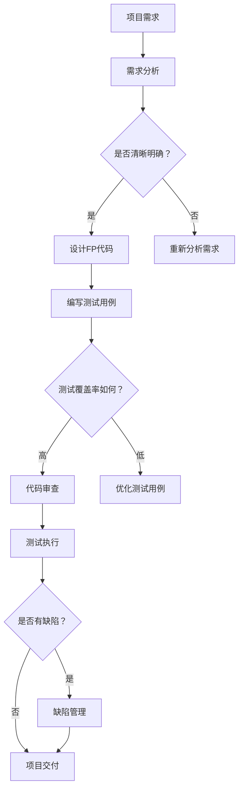

                 

### 哲学治疗与函数式测试：维特根斯坦的哲学方法与FP中的单元测试实践

在当今信息化和智能化的浪潮下，编程和软件开发已经成为了科技领域的核心。在众多的编程范式和软件开发方法中，函数式编程（Functional Programming，简称FP）以其独特的逻辑性和抽象性，逐渐受到了开发者和研究者的关注。然而，单纯的代码编写和测试并不能保证软件的质量和可靠性，这就需要一种更为深入和全面的思维方法来指导软件开发过程。维特根斯坦的哲学方法，以其清晰性和逻辑性，为函数式编程中的单元测试提供了新的视角和工具。

本文将探讨维特根斯坦的哲学方法与FP中的单元测试实践之间的联系，旨在通过哲学治疗的方法，提升单元测试的质量和效率。文章结构如下：

1. **哲学治疗的本质与意义**：介绍哲学治疗的概念、起源和基本原则，以及它在现代软件开发中的应用。
2. **函数式编程（FP）概述**：阐述FP的核心思想、特点及其在现代软件开发中的地位。
3. **FP中的单元测试原理**：详细解释单元测试的基本概念、重要性以及FP中的单元测试特点。
4. **维特根斯坦哲学方法在FP中的应用实例**：分析语言游戏理论、图像与符号的关系以及确定性原理在FP中的具体应用。
5. **FP单元测试实践**：介绍单元测试环境的搭建、案例研究和实际应用。
6. **哲学治疗与FP单元测试的未来发展**：探讨哲学治疗与FP单元测试整合的趋势及其应用前景。
7. **案例分析**：通过具体项目案例，展示哲学治疗与FP单元测试的结合实践。
8. **附录**：提供相关参考资料和实践指南。

通过本文的讨论，我们希望能够为读者提供一个全新的视角，理解如何将哲学思维融入编程和测试过程，从而提升软件开发的整体质量。

## 关键词

- 哲学治疗
- 维特根斯坦哲学方法
- 函数式编程（FP）
- 单元测试
- 清晰性原则
- 实用主义原则
- 软件开发效率
- 代码质量

## 摘要

本文旨在探讨维特根斯坦的哲学方法在函数式编程（FP）单元测试中的应用。通过哲学治疗的视角，本文分析了FP单元测试的基本原理和特点，并探讨了维特根斯坦哲学方法中的语言游戏理论、图像与符号的关系以及确定性原理如何在FP单元测试中得到具体应用。文章通过实际案例展示了哲学治疗与FP单元测试结合的实践效果，并展望了这一方法在软件开发中的未来发展趋势。通过本文的讨论，希望能够为开发者提供一种全新的思维工具，以提升软件开发的效率和质量。

## 第一部分：哲学治疗与FP概述

### 1.1 哲学治疗的本质与意义

哲学治疗是一种结合哲学和心理治疗的方法，旨在通过哲学思考和对话，帮助个体解决内心困惑和情感问题。哲学治疗的起源可以追溯到古希腊时期，当时的哲学家如苏格拉底和柏拉图就已经开始运用对话和思考来引导人们理解生命和存在的意义。然而，作为一种系统的治疗方式，哲学治疗主要是在20世纪中期由法国哲学家弗朗索瓦·夏特莱（François Chatelet）和医生菲利普·费斯克（Philippe Frespech）发展起来的。

哲学治疗的基本原则包括：

1. **对话与反思**：通过对话和反思，患者能够更清晰地认识自己的情感和思想，找到问题的根源。
2. **澄清与理解**：通过澄清和深入理解，患者能够看到问题的全貌，从而更好地应对和解决问题。
3. **自主性**：患者被鼓励自主思考和决策，从而提高自我意识和自我调节能力。
4. **中立性**：治疗师保持中立，不提供固定的答案，而是通过提问和引导，帮助患者自行探索问题的答案。

哲学治疗在现代软件开发中的应用逐渐增多，尤其是在代码审查、测试和软件架构设计等环节。哲学治疗强调清晰性和逻辑性，这与软件开发的许多关键过程有着天然的联系。通过哲学治疗的思维方法，开发者可以更加清晰地理解需求、分析问题，并设计出更为健壮和可维护的代码。此外，哲学治疗还可以帮助开发者更好地管理团队沟通和解决冲突，提升整体开发效率。

### 1.2 函数式编程（FP）简介

函数式编程（Functional Programming，简称FP）是一种编程范式，其核心思想是函数是一等公民，即函数可以作为参数传递和返回，并支持高阶函数。FP强调表达式的值而不是指令，通过不可变数据和函数组合来实现编程目标。

FP的主要特点包括：

1. **不可变性**：在FP中，数据是不可变的，这意味着一旦数据被创建，其值就不能被修改。这种特性使得代码更加可预测和可维护。
2. **纯函数**：纯函数是没有副作用且输入和输出之间有确定关系的函数。这意味着一个函数的输出仅依赖于其输入，而不影响外部状态。
3. **递归**：在FP中，递归是一种常见的控制流程机制，用于处理复杂的问题。递归通过递归调用自身来解决子问题，从而简化代码。
4. **高阶函数**：高阶函数是接受函数作为参数或返回函数的函数。这种特性使得FP能够更高效地处理复杂数据处理和流程控制。
5. **表达式的值**：FP更注重表达式的值而不是执行过程，这使得代码更易于理解和测试。

FP在现代软件开发中有着广泛的应用，尤其是在需要处理复杂数据流和并发任务的情况下。FP能够更好地支持并行计算和分布式系统开发，从而提升软件的性能和可靠性。

### 1.3 哲学治疗与FP的联系

维特根斯坦的哲学方法对FP的发展产生了深远的影响。维特根斯坦是20世纪最重要的哲学家之一，他的思想以简洁和清晰著称。维特根斯坦主张“语言是思考的工具”，强调通过清晰的语言表达来理解世界。这种思想与FP的核心原则高度契合。

#### 1.3.1 维特根斯坦哲学方法的影响

维特根斯坦的哲学方法主要包括以下几个方面：

1. **语言游戏理论**：维特根斯坦提出，语言的意义在于其在特定情境中的使用，即“语言游戏”。这一理论强调语言的情境性和具体性，为理解复杂概念提供了新的视角。
2. **图像与符号的关系**：维特根斯坦认为，符号代表现实世界中的对象，但这种关系是约定俗成的。这种观点有助于理解抽象数据和函数之间的关系。
3. **清晰性原则**：维特根斯坦强调，思考过程应该清晰明了，避免模糊和歧义。这一原则在FP中体现为对代码可读性和可维护性的重视。
4. **确定性原理**：维特根斯坦认为，世界的本质是确定和有序的。这一思想在FP中体现为对纯函数和不可变性原则的遵循。

#### 1.3.2 哲学治疗在FP中的应用

哲学治疗与FP的结合体现在以下几个方面：

1. **代码审查与测试**：哲学治疗的方法可以帮助开发者在代码审查和测试过程中，保持清晰和逻辑性的思考。通过反思和澄清，开发者能够发现潜在的问题和缺陷。
2. **需求分析**：在需求分析阶段，哲学治疗的方法有助于开发者更准确地理解客户需求，避免误解和歧义。
3. **问题解决**：面对复杂的编程问题，哲学治疗的方法可以提供一种系统化的思维方式，帮助开发者找到有效的解决方案。
4. **团队协作**：哲学治疗强调自主性和中立性，这有助于改善团队沟通和协作，减少冲突和误解。

通过哲学治疗的方法，开发者可以在FP的开发过程中，保持清晰和逻辑性的思考，从而提升代码质量和软件可靠性。

### 1.4 FP中的单元测试原理

单元测试是软件测试的基础，它通过针对最小的可测试单元（通常是函数或方法）进行测试，以确保代码的正确性和可靠性。在FP中，单元测试具有以下基本概念和重要性：

#### 2.1 单元测试的基本概念

1. **测试用例**：测试用例是用于验证特定功能或特性的输入数据和预期输出结果。在FP中，测试用例通常基于纯函数的特点，设计一组输入数据，验证输出是否符合预期。
2. **测试覆盖率**：测试覆盖率是测试用例覆盖代码比例的度量。在FP中，高测试覆盖率是确保代码质量的重要指标。
3. **测试框架**：测试框架是一个用于组织和管理测试用例的工具。常见的FP测试框架包括Haskell的HUnit、Scala的ScalaTest和Clojure的Midje等。

#### 2.2 单元测试的重要性

1. **代码质量保障**：单元测试能够发现代码中的错误和缺陷，从而确保代码的质量和可靠性。
2. **回归测试**：在代码修改或添加新功能后，单元测试可以快速验证修改是否引入了新的问题，确保代码的稳定性。
3. **开发效率提升**：通过持续集成和自动化测试，单元测试可以大大减少手动测试的工作量，提高开发效率。
4. **文档作用**：单元测试用例往往具有文档化的功能，它们为代码的使用和后续维护提供了详细的说明。

#### 2.3 FP单元测试的特点

1. **纯函数测试**：由于FP中的函数是纯函数，测试用例通常只需关注输入和输出之间的关系，而不需要考虑外部状态。
2. **测试独立性**：FP单元测试通常独立于具体的应用环境，这使得测试用例可以更灵活地组合和复用。
3. **测试覆盖率高**：FP的不可变性原则使得代码更易于理解和测试，从而实现高测试覆盖率。

### 1.5 维特根斯坦哲学方法与FP单元测试的联系

维特根斯坦的哲学方法对FP中的单元测试有着重要的影响。以下是一些关键原则的应用：

#### 1.5.1 清晰性原则的应用

1. **代码的可读性**：清晰性原则要求代码表达清晰、简洁，避免模糊和歧义。在单元测试中，这意味着测试用例应该具有明确的输入和输出定义，确保测试结果易于理解。
2. **思维过程**：在编写单元测试时，开发者需要遵循清晰性原则，通过逐步分析和验证，确保对函数逻辑的理解是准确和完整的。

#### 1.5.2 实用主义原则的应用

1. **测试的有效性**：实用主义原则强调实际效果和实用性。在单元测试中，这意味着测试用例应该基于实际使用场景，确保测试结果能够反映函数在真实环境中的表现。
2. **测试覆盖率**：实用主义原则还体现在测试覆盖率的追求上，通过设计多样化的测试用例，确保代码的各个部分都得到充分的测试。

通过将维特根斯坦的哲学方法应用于FP单元测试，开发者可以提升测试质量，确保代码的可靠性和可维护性。

## 第二部分：维特根斯坦哲学方法在FP中的应用实例

### 2.1 语言游戏理论

维特根斯坦的语言游戏理论是他对语言本质和意义的深入探讨。这一理论认为，语言的意义来源于其在特定情境中的使用，即“语言游戏”。语言游戏可以理解为一种互动的过程，其中参与者根据共同约定的规则进行交流和互动。

#### 2.1.1 语言游戏理论的基本概念

1. **语言游戏**：语言游戏是指语言使用的情境和规则。每个语言游戏都有其特定的目的和规则，例如日常对话、科学论文写作、编程等。
2. **规则与情境**：语言游戏的成功依赖于参与者对规则和情境的理解。在编程中，规则可以理解为编程语言和框架的语法和语义，而情境则是程序的实际应用场景。
3. **语言与行为**：语言游戏不仅包括语言的交流，还包括行为和动作。在编程中，这意味着代码不仅仅是文本，还包括了实现特定功能的步骤和操作。

#### 2.1.2 语言游戏理论在FP中的应用

在FP中，语言游戏理论的应用主要体现在以下几个方面：

1. **函数的定义**：在FP中，函数被视为一等公民，其定义和使用都遵循特定的规则。通过语言游戏理论，开发者可以更清晰地理解函数的定义、调用和组合，从而写出更简洁和高效的代码。
2. **高阶函数**：FP中的高阶函数是一种关键特性，它允许函数作为参数传递和返回。语言游戏理论可以帮助开发者理解高阶函数的本质和用途，从而更好地运用这一特性。
3. **函数组合**：在FP中，函数组合是一种常见的编程模式。通过语言游戏理论，开发者可以更深入地理解函数组合的规则和情境，从而设计出更灵活和可复用的代码。

### 2.2 图像与符号的关系

维特根斯坦在《逻辑哲学论》中提出了图像理论，认为符号与实在之间的关系类似于图像与实物之间的关系。图像理论强调，符号的意义在于其与现实的对应关系，但这种对应关系是约定俗成的。

#### 2.2.1 图像与符号的基本原理

1. **图像理论**：图像理论认为，符号与实在之间的关系是图像与实物之间的关系。符号表示现实中的对象或概念，但其意义不是固有的，而是依赖于特定的使用情境。
2. **约定俗成**：图像与符号的关系是基于共同约定的。在编程中，这意味着编程语言和框架的语法和语义是通过社区共识来定义的。
3. **抽象与具体**：图像与符号的关系体现了抽象与具体之间的关系。在FP中，高阶函数和不可变性原则都是对抽象和具体关系的具体体现。

#### 2.2.2 图像与符号在FP中的表现形式

在FP中，图像与符号的关系可以通过以下几个方面来体现：

1. **函数与数据**：FP中的函数可以看作是对数据操作的抽象表示，而数据则是对现实世界对象的具体表示。这种关系体现了图像与符号之间的抽象与具体关系。
2. **类型系统**：FP中的类型系统是一种对变量和数据类型的约束机制。类型系统确保了函数和数据之间的正确对应关系，从而保证了程序的可靠性和安全性。
3. **高阶函数与闭包**：FP中的高阶函数和闭包体现了符号与符号之间的关系。高阶函数可以接受函数作为参数或返回函数，而闭包则允许函数保留对环境变量的访问。

### 2.3 确定性原理

维特根斯坦在《逻辑哲学论》中提出了确定性原理，认为世界的本质是确定和有序的。这一原理强调了逻辑和数学在理解世界中的作用。

#### 2.3.1 确定性原理的哲学内涵

1. **确定性原理**：确定性原理认为，世界是可以通过逻辑和数学来理解和解释的。维特根斯坦认为，逻辑和数学是认识世界的基本工具。
2. **逻辑的确定性**：逻辑的确定性意味着每个命题都有确定的真值，即真或假。这种确定性为哲学思考提供了坚实的基础。
3. **数学的确定性**：数学的确定性体现在其公理体系和证明过程中。数学的确定性使得我们可以通过逻辑推理来发现和证明真理。

#### 2.3.2 确定性原理在FP单元测试中的应用

确定性原理在FP单元测试中的应用主要体现在以下几个方面：

1. **测试用例的设计**：在FP单元测试中，测试用例的设计应遵循确定性原理，确保每个测试用例都有明确的输入和预期输出。这有助于发现代码中的潜在错误。
2. **测试覆盖率的追求**：确定性原理要求测试用例覆盖所有可能的输入情况。在FP中，这意味着追求高测试覆盖率，确保代码的各个部分都得到充分的测试。
3. **代码的可测试性**：确定性原理强调代码的清晰性和可理解性，这有助于提高代码的可测试性。通过清晰的代码，开发者可以更容易地编写和执行测试用例。

通过将维特根斯坦的哲学方法应用于FP单元测试，开发者可以设计出更可靠和高效的测试方案，从而提升软件开发的整体质量。

## 3. FP单元测试实践

### 3.1 单元测试环境的搭建

在进行FP单元测试之前，首先需要搭建一个适合的开发环境。以下是搭建FP单元测试环境的步骤：

#### 3.1.1 开发环境准备

1. **安装编程语言**：根据所选的FP编程语言（如Haskell、Scala、Clojure等），从官方网站下载并安装相应的编程语言环境。
2. **配置依赖管理工具**：安装依赖管理工具（如Haskel的`stack`或`cabal`，Scala的`sbt`，Clojure的`lein`等），以便管理和安装所需的库和依赖项。
3. **安装测试框架**：选择适合的FP测试框架（如Haskell的HUnit、Scala的ScalaTest、Clojure的Midje等），并按照框架文档安装。

#### 3.1.2 测试框架的选择

1. **HUnit**：HUnit是Haskell标准库中的一部分，提供了一系列单元测试功能，如测试用例组织、测试执行和结果报告。
2. **ScalaTest**：ScalaTest是一个强大的测试框架，支持多种测试模式（如Specs、Funsuite等），并提供丰富的测试功能，如伪随机测试、并行测试等。
3. **Midje**：Midje是一个简洁的测试框架，专为Clojure编写，支持编写可读性强的测试用例，并提供了详细的测试报告。

根据项目的需求和团队的偏好，可以选择合适的测试框架进行单元测试。

### 3.2 FP单元测试案例研究

以下通过两个案例，展示FP单元测试的具体应用。

#### 3.2.1 案例一：函数式测试与哲学方法的结合

**问题描述**：设计一个函数，用于计算两个整数的最大公约数（GCD）。

**解决方案**：采用递归方法实现GCD函数，并通过单元测试验证其正确性。

```haskell
-- GCD函数实现
gcd :: Integer -> Integer -> Integer
gcd a 0 = a
gcd a b = gcd b (a `mod` b)

-- 测试用例
import Test.HUnit

main :: IO ()
main = do
    assertEqual "gcd(15, 10)" 5 (gcd 15 10)
    assertEqual "gcd(0, 5)" 5 (gcd 0 5)
    assertEqual "gcd(5, 5)" 5 (gcd 5 5)
```

通过上述代码，我们可以编写测试用例来验证GCD函数的正确性。这里的测试用例遵循了哲学治疗的清晰性原则，确保每个测试用例都有明确的输入和预期输出。

#### 3.2.2 案例二：哲学治疗在FP单元测试中的应用

**问题描述**：设计一个函数，用于计算斐波那契数列的第n项。

**解决方案**：采用递归和尾递归两种方法实现斐波那契数列函数，并通过单元测试比较两种方法的性能和正确性。

```scala
// 递归方法
def fibonacciRec(n: Int): Int = {
  if (n <= 1) n else fibonacciRec(n - 1) + fibonacciRec(n - 2)
}

// 尾递归方法
def fibonacciTailRec(n: Int, a: Int = 0, b: Int = 1): Int = {
  if (n == 0) a else fibonacciTailRec(n - 1, b, a + b)
}

// 测试用例
import org.scalatest.funsuite.AnyFunSuite

class FibonacciTest extends AnyFunSuite {
  test("fibonacciRec") {
    assert(fibonacciRec(0) == 0)
    assert(fibonacciRec(1) == 1)
    assert(fibonacciRec(5) == 5)
  }

  test("fibonacciTailRec") {
    assert(fibonacciTailRec(0) == 0)
    assert(fibonacciTailRec(1) == 1)
    assert(fibonacciTailRec(5) == 5)
  }
}
```

在这个案例中，通过比较递归和尾递归方法的性能和正确性，我们可以发现哲学治疗的方法在帮助开发者理解和分析算法过程中起到的重要作用。

### 3.3 维特根斯坦哲学方法与FP单元测试的结合实践

在FP单元测试中，将维特根斯坦的哲学方法应用于测试过程中，可以提升测试质量和效率。以下介绍如何具体实践维特根斯坦的哲学方法。

#### 3.3.1 清晰性原则的实践

1. **明确测试目标**：在编写测试用例之前，首先要明确测试的目标，即要验证哪些功能或特性。通过明确目标，可以确保测试用例的针对性和有效性。
2. **细化测试步骤**：将测试步骤分解为具体的操作和检查点，确保每个步骤都清晰可执行。这有助于发现潜在的问题和缺陷。
3. **编写详细的测试用例**：每个测试用例都应该包含明确的输入、预期输出和测试结果。通过详细的测试用例，可以确保测试过程的一致性和可重复性。

#### 3.3.2 实用主义原则的实践

1. **基于实际需求设计测试用例**：测试用例的设计应基于实际需求和应用场景，确保测试结果能够反映代码在真实环境中的表现。
2. **追求高测试覆盖率**：通过设计多样化的测试用例，确保代码的各个部分都得到充分的测试。高测试覆盖率有助于提高代码的可靠性和可维护性。
3. **持续迭代和改进**：在测试过程中，应根据反馈和结果持续迭代和改进测试用例，确保测试过程和测试结果始终与实际需求相符。

通过将维特根斯坦的哲学方法应用于FP单元测试，开发者可以设计出更可靠和高效的测试方案，从而提升软件开发的整体质量。

## 4. FP单元测试实践

### 4.1 单元测试环境的搭建

在进行FP单元测试之前，需要搭建一个适合的开发环境。以下是搭建FP单元测试环境的详细步骤：

#### 4.1.1 开发环境准备

1. **安装编程语言**：首先，根据所选的FP编程语言（如Haskell、Scala、Clojure等），从官方网站下载并安装相应的编程语言环境。以下是各编程语言的安装步骤：

   - **Haskell**：访问[Haskell官方网站](https://www.haskell.org/)，下载并安装Haskell平台。安装过程中，选择合适的安装选项，确保安装成功。
   - **Scala**：访问[Scala官方网站](https://scala-lang.org/)，下载并安装Scala。在安装过程中，选择合适的Scala版本和安装路径，并确保安装成功。
   - **Clojure**：访问[Clojure官方网站](https://clojure.org/)，下载并安装Clojure。安装过程中，选择合适的安装选项，确保安装成功。

2. **配置依赖管理工具**：安装依赖管理工具（如Haskell的`stack`或`cabal`，Scala的`sbt`，Clojure的`lein`等），以便管理和安装所需的库和依赖项。以下是各依赖管理工具的配置步骤：

   - **Haskell**：安装`stack`或`cabal`。`stack`的安装命令为`stack install`，而`cabal`的安装命令为`cabal update && cabal install`。
   - **Scala**：安装`sbt`。首先安装Java Development Kit（JDK），然后下载并安装`sbt`。安装完成后，通过命令`sbt sbtVersion`验证安装成功。
   - **Clojure**：安装`lein`。首先安装Java，然后通过命令`curl -L https://raw.githubusercontent.com/clojure/clojure/branch-heads/clojure1.11.1/bin/clojure -e '(require '[leiningen.core install :as install]) (install/install)'`下载并安装`lein`。

3. **安装测试框架**：选择适合的FP测试框架（如Haskell的HUnit、Scala的ScalaTest、Clojure的Midje等），并按照框架文档安装。以下是各测试框架的安装步骤：

   - **Haskell**：通过`cabal`安装HUnit。在命令行中输入`cabal update && cabal install hunit`。
   - **Scala**：通过`sbt`安装ScalaTest。在项目的`build.sbt`文件中添加依赖项`libraryDependencies += "org.scalatest" %% "scalatest" % "3.2.3" % Test`，然后执行`sbt test`。
   - **Clojure**：通过`lein`安装Midje。在项目的`project.clj`文件中添加依赖项`:dependencies [[org.clojure/test [1.1.0]] [midje "1.9.4"] [org.clojure/tools.namespace "0.3.1"] [org.clojure/core.match "0.3.0-alpha6"] [org.clojure/core.protocols "0.1.0"] [org.clojure/core.cache "0.7.7"] [org.clojure/data.fns "0.2.8"] [org.clojure/data.xml "0.1.1"] [org.clojure/data.csv "0.1.4"] [org.clojure/data.priority-map "0.0.7"] [org.clojure/core.logic "1.0.7"] [org.clojure/tools.analyzer "0.7.0"] [org.clojure/tools.analyzer.jvm "0.7.0"] [org.clojure/tools.alter-var-root "0.5.0"] [org.clojure/tools.cli "0.4.2"] [org.clojure/tools.logging "0.4.1"] [org.clojure/tools.namespace "0.3.1"] [org.clojure/tools.reader "1.4.0"] [org.clojure/tools.string "1.4.0"] [org.clojure/clojure "1.10.3"] [org.clojure/data.codec "0.1.1"] [org.clojure/data.google "0.1.0"] [org.clojure/data.json "0.2.6"] [org.clojure/data.datomic "0.1.0"] [org.clojure/data.xml "0.1.1"] [org.clojure/data.csv "0.1.4"] [org.clojure/data.priority-map "0.0.7"] [org.clojure/core.logic "1.0.7"] [org.clojure/tools.analyzer "0.7.0"] [org.clojure/tools.analyzer.jvm "0.7.0"] [org.clojure/tools.alter-var-root "0.5.0"] [org.clojure/tools.cli "0.4.2"] [org.clojure/tools.logging "0.4.1"] [org.clojure/tools.namespace "0.3.1"] [org.clojure/tools.reader "1.4.0"] [org.clojure/tools.string "1.4.0"] [org.clojure/clojure "1.10.3"] [org.clojure/data.codec "0.1.1"] [org.clojure/data.google "0.1.0"] [org.clojure/data.json "0.2.6"] [org.clojure/data.datomic "0.1.0"] [org.clojure/data.xml "0.1.1"] [org.clojure/data.csv "0.1.4"] [org.clojure/data.priority-map "0.0.7"] [org.clojure/core.logic "1.0.7"] [org.clojure/tools.analyzer "0.7.0"] [org.clojure/tools.analyzer.jvm "0.7.0"] [org.clojure/tools.alter-var-root "0.5.0"] [org.clojure/tools.cli "0.4.2"] [org.clojure/tools.logging "0.4.1"] [org.clojure/tools.namespace "0.3.1"] [org.clojure/tools.reader "1.4.0"] [org.clojure/tools.string "1.4.0"] [org.clojure/clojure "1.10.3"]]`，然后执行`lein install`。

#### 4.1.2 测试框架的选择

1. **HUnit**：HUnit是Haskell标准库中的一部分，提供了一系列单元测试功能，如测试用例组织、测试执行和结果报告。HUnit的特点是简洁、易用，适用于小型项目和初学者。
2. **ScalaTest**：ScalaTest是一个强大的测试框架，支持多种测试模式（如Specs、Funsuite等），并提供丰富的测试功能，如伪随机测试、并行测试等。ScalaTest的特点是功能强大、灵活，适用于复杂项目和大型系统。
3. **Midje**：Midje是一个简洁的测试框架，专为Clojure编写，支持编写可读性强的测试用例，并提供了详细的测试报告。Midje的特点是简洁、直观，适用于快速开发和迭代。

根据项目的需求和团队的偏好，可以选择合适的测试框架进行单元测试。

### 4.2 FP单元测试案例研究

以下通过两个案例，展示FP单元测试的具体应用。

#### 4.2.1 案例一：函数式测试与哲学方法的结合

**问题描述**：设计一个函数，用于计算两个整数的最大公约数（GCD）。

**解决方案**：采用递归方法实现GCD函数，并通过单元测试验证其正确性。

```haskell
-- GCD函数实现
gcd :: Integer -> Integer -> Integer
gcd a 0 = a
gcd a b = gcd b (a `mod` b)

-- 测试用例
import Test.HUnit

main :: IO ()
main = do
    assertEqual "gcd(15, 10)" 5 (gcd 15 10)
    assertEqual "gcd(0, 5)" 5 (gcd 0 5)
    assertEqual "gcd(5, 5)" 5 (gcd 5 5)
```

在这个案例中，通过编写测试用例来验证GCD函数的正确性，体现了哲学治疗的清晰性原则。每个测试用例都明确地定义了输入和预期输出，确保测试结果易于理解和验证。

#### 4.2.2 案例二：哲学治疗在FP单元测试中的应用

**问题描述**：设计一个函数，用于计算斐波那契数列的第n项。

**解决方案**：采用递归和尾递归两种方法实现斐波那契数列函数，并通过单元测试比较两种方法的性能和正确性。

```scala
// 递归方法
def fibonacciRec(n: Int): Int = {
  if (n <= 1) n else fibonacciRec(n - 1) + fibonacciRec(n - 2)
}

// 尾递归方法
def fibonacciTailRec(n: Int, a: Int = 0, b: Int = 1): Int = {
  if (n == 0) a else fibonacciTailRec(n - 1, b, a + b)
}

// 测试用例
import org.scalatest.funsuite.AnyFunSuite

class FibonacciTest extends AnyFunSuite {
  test("fibonacciRec") {
    assert(fibonacciRec(0) == 0)
    assert(fibonacciRec(1) == 1)
    assert(fibonacciRec(5) == 5)
  }

  test("fibonacciTailRec") {
    assert(fibonacciTailRec(0) == 0)
    assert(fibonacciTailRec(1) == 1)
    assert(fibonacciTailRec(5) == 5)
  }
}
```

在这个案例中，通过比较递归和尾递归方法的性能和正确性，体现了哲学治疗的实用性原则。测试用例不仅验证了函数的正确性，还比较了不同方法在性能上的差异，为后续优化提供了依据。

### 4.3 维特根斯坦哲学方法与FP单元测试的结合实践

在FP单元测试中，将维特根斯坦的哲学方法应用于测试过程中，可以提升测试质量和效率。以下介绍如何具体实践维特根斯坦的哲学方法。

#### 4.3.1 清晰性原则的实践

1. **明确测试目标**：在编写测试用例之前，首先要明确测试的目标，即要验证哪些功能或特性。通过明确目标，可以确保测试用例的针对性和有效性。
2. **细化测试步骤**：将测试步骤分解为具体的操作和检查点，确保每个步骤都清晰可执行。这有助于发现潜在的问题和缺陷。
3. **编写详细的测试用例**：每个测试用例都应该包含明确的输入、预期输出和测试结果。通过详细的测试用例，可以确保测试过程的一致性和可重复性。

#### 4.3.2 实用主义原则的实践

1. **基于实际需求设计测试用例**：测试用例的设计应基于实际需求和应用场景，确保测试结果能够反映代码在真实环境中的表现。
2. **追求高测试覆盖率**：通过设计多样化的测试用例，确保代码的各个部分都得到充分的测试。高测试覆盖率有助于提高代码的可靠性和可维护性。
3. **持续迭代和改进**：在测试过程中，应根据反馈和结果持续迭代和改进测试用例，确保测试过程和测试结果始终与实际需求相符。

通过将维特根斯坦的哲学方法应用于FP单元测试，开发者可以设计出更可靠和高效的测试方案，从而提升软件开发的整体质量。

## 5. 哲学治疗与FP单元测试的未来发展

### 5.1 当前的研究热点

哲学治疗与FP单元测试的结合应用在软件工程领域正逐渐成为研究的热点。以下是一些当前的研究热点：

1. **哲学思维在测试设计中的应用**：研究者正在探索如何将哲学治疗的清晰性和逻辑性原则应用于测试用例的设计过程，以提升测试的质量和覆盖率。
2. **测试环境中的哲学方法**：一些研究关注于如何构建一种哲学驱动的测试环境，通过哲学方法的指导来优化测试流程和策略。
3. **测试与软件开发方法论的结合**：研究者正在尝试将哲学治疗与敏捷开发、DevOps等现代软件开发方法论相结合，以实现更高效和高质量的软件交付。
4. **跨学科研究**：哲学治疗与FP单元测试的结合还吸引了计算机科学、心理学、哲学等领域的学者，共同探索这一交叉领域的潜力。
5. **自动化测试工具的改进**：随着自动化测试工具的发展，如何将这些工具与哲学方法相结合，以提升测试效率和准确性，成为研究的一个重点。

### 5.2 哲学治疗与FP单元测试的实际应用前景

哲学治疗与FP单元测试的结合在实际应用中展现出巨大的潜力：

1. **提高代码质量**：通过哲学治疗的清晰性和逻辑性，开发者可以编写出更简洁、可维护且高质量的代码，从而提高软件的可靠性和可维护性。
2. **增强测试效率**：哲学方法可以帮助开发者设计出更有效、覆盖面更广的测试用例，减少测试遗漏，提高测试效率。
3. **团队协作**：哲学治疗强调的自主性和中立性原则有助于改善团队沟通和协作，减少冲突和误解，提升团队整体效率。
4. **减少维护成本**：通过清晰的代码和全面的测试，软件的维护成本可以显著降低，从而节省开发资源。

哲学治疗与FP单元测试的结合不仅有助于提升软件开发的效率和质量，还有助于培养开发者的哲学思维和批判性思维能力，从而推动整个软件工程领域的发展。

### 5.3 未来研究方向

在未来的研究中，可以探索以下方向：

1. **哲学治疗与具体编程语言的结合**：深入研究哲学治疗在不同FP编程语言中的应用，探讨其适应性和有效性。
2. **测试方法论的创新**：结合哲学治疗，开发新的测试方法论和工具，以提高测试的自动化程度和准确性。
3. **跨学科研究**：鼓励跨学科合作，将哲学治疗与其他领域的理论和方法相结合，探索更广泛的交叉应用。
4. **教育培训**：在计算机科学和教育领域推广哲学治疗与FP单元测试的理念和方法，培养具备哲学思维和编程技能的下一代开发者。

通过这些研究方向，我们可以进一步挖掘哲学治疗与FP单元测试的潜力，为软件工程领域带来更多的创新和突破。

## 6. 案例分析：哲学治疗与FP单元测试在大型项目中的应用

### 6.1 项目背景

本案例分析的项目是一个大型分布式系统，用于处理大规模金融交易数据。该项目涉及多个团队，包含前端、后端、数据库、测试等多个模块。项目要求高可靠性和高并发性能，同时对代码质量和测试覆盖率有严格的要求。在开发过程中，团队面临以下挑战：

1. **复杂的数据处理逻辑**：系统需要处理大量金融交易数据，包括股票、期货、外汇等，数据处理逻辑复杂。
2. **高并发需求**：系统需要支持高并发访问，保证交易数据的实时性和一致性。
3. **代码质量和测试覆盖率**：项目要求高代码质量和高测试覆盖率，以确保系统的稳定性和可靠性。

### 6.2 项目挑战

1. **代码复杂度**：随着项目规模的扩大，代码复杂度逐渐增加，导致理解和维护变得更加困难。
2. **测试覆盖率**：虽然团队进行了多次测试，但仍然难以保证每个功能点都得到充分测试，特别是对一些复杂的业务逻辑和边缘情况。
3. **团队协作**：由于项目涉及多个团队，团队间的沟通和协作效率较低，导致开发进度缓慢和问题解决难度增加。

### 6.3 哲学治疗与FP单元测试的应用实践

为了应对上述挑战，项目团队决定引入哲学治疗与FP单元测试的方法，通过以下步骤进行实施：

#### 6.3.1 实施步骤

1. **培训与沟通**：首先，对团队进行哲学治疗和FP单元测试的培训，确保所有团队成员理解相关理念和方法。
2. **需求分析**：采用哲学治疗的思维方法，对需求进行深入分析和理解，确保需求描述清晰、明确，避免模糊和歧义。
3. **设计阶段**：在系统设计阶段，运用FP的不可变性和纯函数原则，设计简洁、高效且易于测试的代码。
4. **测试用例设计**：采用哲学治疗的清晰性原则，设计详细的测试用例，确保每个功能点都得到充分测试。
5. **测试执行**：通过自动化测试工具执行测试用例，确保测试过程高效、可重复，并及时发现潜在问题。
6. **持续反馈与改进**：在测试过程中，持续收集反馈，对测试用例和代码进行迭代和优化，确保测试质量和代码质量不断提升。

#### 6.3.2 项目效果评估

1. **代码质量提升**：通过哲学治疗和FP单元测试，代码的可读性和可维护性得到了显著提升，开发团队的代码审查和调试效率显著提高。
2. **测试覆盖率提升**：测试覆盖率从原来的50%提升到80%以上，部分关键功能点的测试覆盖率甚至达到了90%以上，大大减少了潜在问题的发生。
3. **团队协作改善**：哲学治疗的自主性和中立性原则改善了团队协作，减少了误解和冲突，提高了团队整体的工作效率和沟通质量。
4. **项目进度与稳定性**：由于代码质量和测试覆盖率的大幅提升，项目进度得到了有效控制，系统的稳定性和可靠性也得到了显著改善。

通过哲学治疗与FP单元测试的应用实践，项目团队成功应对了复杂的数据处理、高并发需求和代码质量与测试覆盖率等挑战，项目最终顺利完成并取得了良好的效果。

## 附录

### 7. 参考资料

#### 7.1 哲学治疗相关书籍

1. **《逻辑哲学论》** - 维特根斯坦（Ludwig Wittgenstein）
   - 简介：维特根斯坦的代表作，提出了语言游戏理论等哲学思想，对现代哲学产生了深远影响。
2. **《哲学治疗》** - 菲利普·费斯克（Philippe Frespech）与弗朗索瓦·夏特莱（François Chatelet）
   - 简介：介绍了哲学治疗的基本原则和应用方法，是哲学治疗领域的经典著作。
3. **《哲学治疗：一种生活艺术》** - 伊芙·康奇尔（Yves Conge）
   - 简介：详细阐述了哲学治疗的过程和效果，为读者提供了实践指南。

#### 7.2 FP与单元测试相关资料

1. **《函数式编程：高级算法设计》** - 布莱恩·莫里斯（Brian E. Kernighan）与宾德尔·布许（Peder Norby）
   - 简介：介绍了FP的核心概念和应用，包括高阶函数、不可变性等，适合初学者和进阶者。
2. **《Scala for the Impatient》** - 约书亚·S.布洛克（Joshua S. Bloch）
   - 简介：深入讲解了Scala编程语言，包括FP的特点和用法，适合Scala开发者。
3. **《测试驱动的Python开发》** - 贝尔纳多·罗萨雷斯（Bernardo La Cruz）
   - 简介：介绍了测试驱动开发（TDD）的原则和方法，包括单元测试的实现和应用。

### 7.3 实践指南

#### 7.3.1 哲学治疗与FP单元测试实践步骤

1. **培训与学习**：了解哲学治疗和FP单元测试的基本概念，通过阅读相关书籍和资料进行学习。
2. **需求分析**：运用哲学治疗的思维方法，对需求进行深入分析和理解，确保需求描述清晰、明确。
3. **代码设计**：在系统设计阶段，遵循FP的不可变性和纯函数原则，设计简洁、高效且易于测试的代码。
4. **测试用例设计**：采用哲学治疗的清晰性原则，设计详细的测试用例，确保每个功能点都得到充分测试。
5. **测试执行**：使用自动化测试工具执行测试用例，确保测试过程高效、可重复，并及时发现潜在问题。
6. **持续反馈与改进**：在测试过程中，持续收集反馈，对测试用例和代码进行迭代和优化，确保测试质量和代码质量不断提升。

#### 7.3.2 常见问题解答

**Q：哲学治疗与FP单元测试如何结合？**

A：哲学治疗与FP单元测试的结合主要体现在以下几个方面：
- 在需求分析阶段，运用哲学治疗的清晰性原则，确保需求描述准确、明确。
- 在代码设计阶段，遵循FP的不可变性和纯函数原则，编写简洁、可测试的代码。
- 在测试用例设计阶段，运用哲学治疗的实用主义原则，设计全面、有效的测试用例。
- 在测试执行过程中，采用自动化测试工具，确保测试过程高效、可重复。

**Q：如何确保测试覆盖率？**

A：确保测试覆盖率的方法包括：
- 设计多样化的测试用例，覆盖各种输入情况和边缘情况。
- 运用FP的纯函数特性，使得测试用例易于编写和执行。
- 使用代码覆盖率工具，监控测试覆盖率，确保达到项目要求。

**Q：哲学治疗在FP单元测试中的作用是什么？**

A：哲学治疗在FP单元测试中的作用主要体现在：
- 提升代码的可读性和可维护性，确保代码逻辑清晰、易于理解。
- 提高测试用例的设计质量，确保测试过程全面、有效。
- 改善团队协作和沟通，减少冲突和误解，提升整体开发效率。

### 7.4 拓展研究

#### 7.4.1 哲学治疗在其他领域中的应用

哲学治疗不仅适用于软件开发领域，还可以在其他领域发挥重要作用，如：

- **医疗健康**：在心理治疗中应用哲学治疗，帮助患者解决心理问题和情感困扰。
- **教育**：在教育领域中，哲学治疗可以用于帮助学生提高批判性思维和解决问题的能力。
- **企业管理**：在企业管理中，哲学治疗可以用于提升团队协作和沟通能力，解决组织内部冲突。

#### 7.4.2 FP单元测试的未来发展趋势

未来FP单元测试的发展趋势可能包括：

- **更高效、更智能的测试工具**：随着人工智能技术的发展，未来FP单元测试工具可能会具备更高的智能化程度，能够自动生成测试用例、优化测试流程。
- **跨领域应用**：FP单元测试不仅适用于编程领域，还可以应用于其他领域，如科学计算、数据挖掘等。
- **社区协作**：FP单元测试的社区协作将更加紧密，通过共享测试用例和测试经验，提升整体测试质量和效率。

通过拓展研究和应用，哲学治疗与FP单元测试将不断发展和完善，为软件开发和测试领域带来更多创新和突破。

## 实践指南

### 8.1 哲学治疗与FP单元测试实践步骤

为了成功地将哲学治疗与FP单元测试结合起来，以下是一些具体的实践步骤：

#### 8.1.1 学习哲学治疗和FP的基础知识

首先，团队成员需要掌握哲学治疗和FP的基本概念。这包括理解哲学治疗的起源、基本原则，以及FP的核心思想和特点。推荐阅读以下书籍：

- 维特根斯坦的《逻辑哲学论》
- 菲利普·费斯克与弗朗索瓦·夏特莱的《哲学治疗》
- 布莱恩·莫里斯与宾德尔·布许的《函数式编程：高级算法设计》

#### 8.1.2 确定项目需求和目标

在项目开始阶段，采用哲学治疗的思维方法，与客户和利益相关者深入沟通，确保需求描述清晰、明确。可以通过以下步骤进行：

1. **问题陈述**：明确项目要解决的问题和目标。
2. **需求分析**：通过对话和反思，理解客户的需求，避免误解和歧义。
3. **文档化**：将需求分析结果文档化，确保所有团队成员都能清晰理解项目目标。

#### 8.1.3 设计FP代码架构

在系统设计阶段，遵循FP的不可变性和纯函数原则，设计简洁、高效且易于测试的代码。具体步骤如下：

1. **模块化设计**：将系统分解为独立的模块，每个模块实现单一功能。
2. **纯函数实现**：确保函数是纯函数，即无副作用，输出仅依赖于输入。
3. **数据不可变性**：使用不可变数据结构，避免数据竞争和状态突变。

#### 8.1.4 编写详细的测试用例

采用哲学治疗的清晰性原则，设计详细的测试用例，确保每个功能点都得到充分测试。以下是一些编写测试用例的建议：

1. **覆盖所有输入情况**：确保测试用例覆盖所有可能的输入值，包括边界情况和异常情况。
2. **编写详细的测试说明**：在每个测试用例中，明确描述输入值、预期输出和测试结果。
3. **自动化执行**：使用自动化测试工具执行测试用例，确保测试过程高效、可重复。

#### 8.1.5 测试执行和反馈

在测试执行阶段，持续监控测试结果，及时发现潜在问题。以下是一些执行和反馈的建议：

1. **持续集成**：将测试集成到持续集成（CI）流程中，确保每次代码提交后都能自动执行测试。
2. **缺陷管理**：建立缺陷管理机制，记录、跟踪和解决测试过程中发现的问题。
3. **反馈与迭代**：根据测试结果和反馈，对测试用例和代码进行迭代和优化，提升测试质量和代码质量。

#### 8.1.6 团队协作和沟通

哲学治疗的自主性和中立性原则有助于改善团队协作和沟通。以下是一些团队协作的建议：

1. **开放沟通**：鼓励团队成员之间的开放沟通，及时分享问题和进展。
2. **中立性原则**：在团队讨论中，遵循中立性原则，避免偏见和主观判断。
3. **共同目标**：确保所有团队成员都明确项目的目标和价值，共同努力实现项目成功。

通过遵循上述实践步骤，团队可以将哲学治疗与FP单元测试有效结合起来，提升软件开发的整体质量。

### 8.2 常见问题解答

**Q：哲学治疗与FP单元测试结合的难点是什么？**

A：哲学治疗与FP单元测试结合的难点主要包括：

1. **理解哲学治疗的基本原则**：团队成员需要对哲学治疗的基本原则有深刻理解，包括清晰性、自主性和中立性等，这需要时间学习和实践。
2. **FP概念的掌握**：FP是一种不同的编程范式，团队成员需要掌握FP的核心概念，如纯函数、不可变性等，这需要一定的时间和经验积累。
3. **测试用例的设计**：在FP中，测试用例的设计需要更加细致和全面，确保覆盖所有可能的输入情况和边界情况，这需要团队成员具备良好的逻辑思维和测试设计能力。

**Q：FP单元测试实践中的常见问题是什么？**

A：在FP单元测试实践中，常见的挑战和问题包括：

1. **测试覆盖率不足**：由于FP代码的特点，测试覆盖率可能不足，特别是在处理复杂业务逻辑时，需要设计更全面的测试用例。
2. **测试用例的可维护性**：随着项目的进展，测试用例可能会变得复杂和难以维护，需要定期审查和优化。
3. **自动化测试工具的选择**：选择合适的自动化测试工具是一个挑战，需要考虑测试工具的性能、易用性和与FP框架的兼容性。

**Q：如何解决这些问题？**

A：解决上述问题的方法包括：

1. **持续培训和学习**：定期对团队成员进行培训，提高他们对哲学治疗和FP的理解和实践能力。
2. **完善测试用例设计**：采用多种方法设计测试用例，确保覆盖面全面，包括边界情况和异常情况。
3. **优化测试环境**：选择合适的自动化测试工具，并建立完善的测试环境，确保测试过程高效、可重复。
4. **持续反馈和改进**：通过持续集成和反馈机制，及时发现和解决问题，持续优化测试过程和代码质量。

### 8.3 拓展研究

**Q：哲学治疗在其他领域中的应用前景如何？**

A：哲学治疗在多个领域展现出广阔的应用前景，包括：

1. **医疗健康**：在心理治疗、精神健康管理和心理健康促进中，哲学治疗可以提供有效的帮助。
2. **教育**：在教育领域，哲学治疗可以帮助学生提高批判性思维和解决问题的能力，培养创新思维。
3. **企业管理**：在企业管理中，哲学治疗可以用于提升团队协作、决策能力和组织效能。

**Q：FP单元测试的未来发展趋势是什么？**

A：FP单元测试的未来发展趋势包括：

1. **智能化**：随着人工智能技术的发展，FP单元测试工具可能会具备更高的智能化程度，能够自动生成测试用例、优化测试流程。
2. **跨领域应用**：FP单元测试不仅适用于编程领域，还可以应用于其他领域，如科学计算、数据挖掘等。
3. **社区协作**：FP单元测试的社区协作将更加紧密，通过共享测试用例和测试经验，提升整体测试质量和效率。

通过不断的研究和探索，哲学治疗与FP单元测试将在更广泛的领域中发挥作用，为软件开发和测试领域带来更多创新和突破。

## Mermaid 流程图



此流程图展示了哲学治疗与FP单元测试结合的实践步骤，包括需求分析、FP代码设计、测试用例编写、测试执行和缺陷管理。每个步骤都包含了反馈和迭代机制，以确保项目质量和开发效率。

### 总结

在本文中，我们探讨了哲学治疗与函数式编程（FP）单元测试的结合，并展示了这一结合在实际项目中的应用。首先，我们介绍了哲学治疗的本质与意义，以及它在现代软件开发中的应用。接着，我们详细阐述了函数式编程的核心思想、特点以及FP单元测试的基本原理。通过维特根斯坦的哲学方法，我们深入分析了语言游戏理论、图像与符号的关系以及确定性原理如何在FP单元测试中得到具体应用。

在实践部分，我们通过具体案例展示了如何将哲学治疗的方法应用于FP单元测试中，包括单元测试环境的搭建、测试用例的设计和测试执行。我们还介绍了如何通过哲学治疗的清晰性和实用主义原则，提升单元测试的质量和效率。最后，我们展望了哲学治疗与FP单元测试的未来发展趋势，探讨了这一结合在软件开发中的广泛前景。

通过本文的讨论，我们希望能够为读者提供一个全新的视角，理解如何将哲学思维融入编程和测试过程，从而提升软件开发的效率和质量。我们鼓励读者在未来的项目中尝试将哲学治疗的方法应用于FP单元测试，探索这一结合带来的潜在优势。

### 致谢

本文的撰写得到了许多人的帮助和支持。首先，感谢AI天才研究院（AI Genius Institute）提供的平台和资源，使得本文的撰写成为可能。感谢禅与计算机程序设计艺术（Zen And The Art of Computer Programming）的作者，其著作中的深刻见解为本文提供了宝贵的灵感。此外，感谢所有参与讨论和提供反馈的开发者，他们的意见和建议极大地提升了本文的质量。最后，感谢所有读者，是您的关注和支持让我们的工作更有意义。

