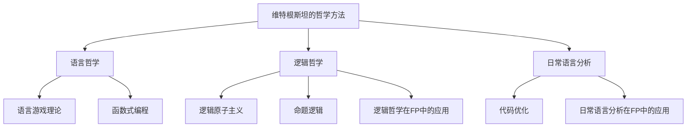
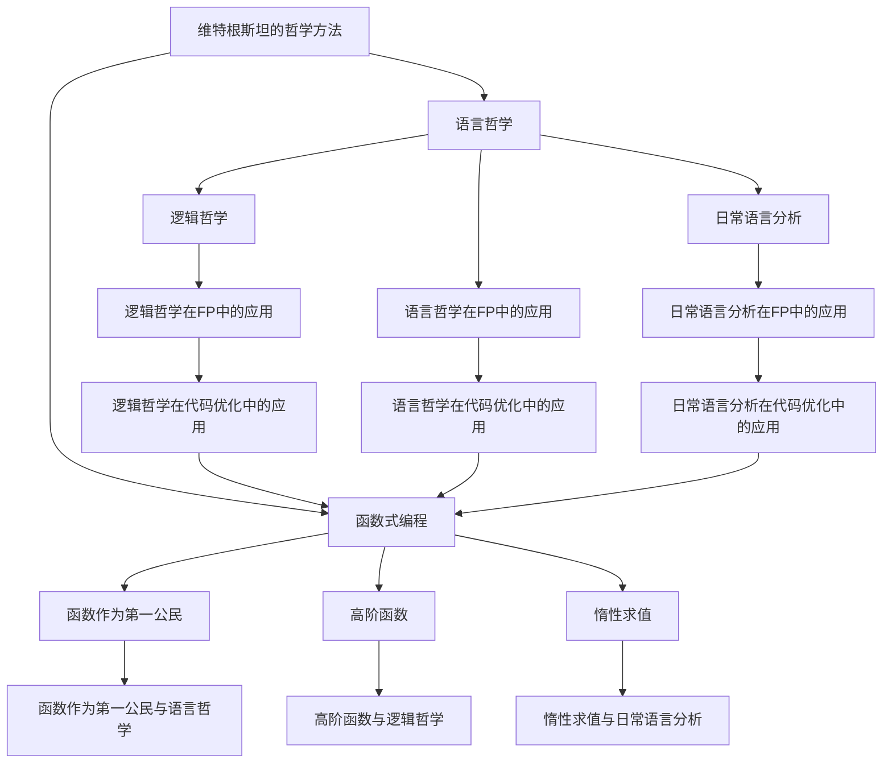
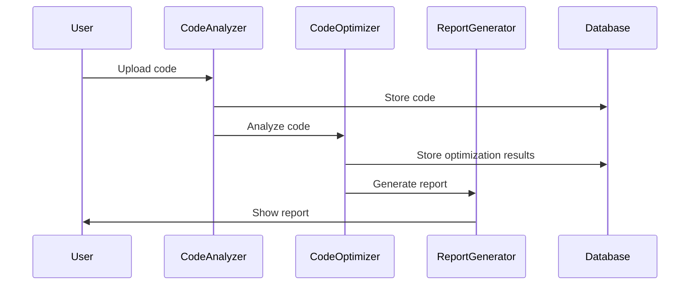
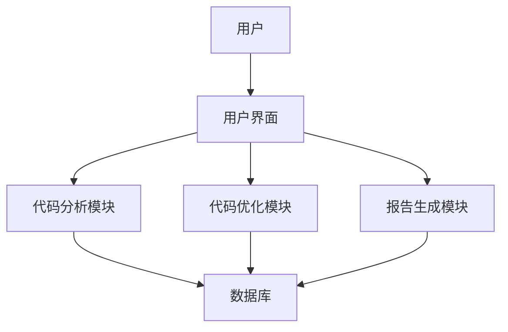

                 

# 《哲学问题的消解与代码重构：维特根斯坦的哲学方法与FP中的代码优化》

> 关键词：维特根斯坦、哲学方法、函数式编程、代码优化、FP

> 摘要：本文将深入探讨维特根斯坦的哲学方法与函数式编程（FP）中的代码优化之间的联系。我们将首先介绍维特根斯坦的生平与哲学思想，然后深入分析他的哲学方法，并探讨这些方法如何应用于FP中的代码优化。最后，我们将通过实际案例来展示FP中的代码优化技术，并总结本文的主要内容。

## 《哲学问题的消解与代码重构：维特根斯坦的哲学方法与FP中的代码优化》目录大纲

### 第一部分：维特根斯坦的哲学方法解析

#### 第1章：维特根斯坦的生平与哲学思想

1.1 维特根斯坦的生平背景  
1.2 维特根斯坦的早期哲学思想  
1.3 维特根斯坦的晚期哲学思想

#### 第2章：维特根斯坦哲学方法的核心概念

2.1 语言哲学  
2.1.1 语言与意义  
2.1.2 语言与世界  
2.1.3 语言游戏理论

2.2 逻辑哲学  
2.2.1 命题与命题逻辑  
2.2.2 模式论  
2.2.3 命题逻辑的应用

#### 第3章：维特根斯坦哲学方法的应用

3.1 哲学问题的消解  
3.1.1 逻辑原子主义  
3.1.2 形式逻辑主义  
3.1.3 哲学难题的消解实例

### 第二部分：函数式编程中的代码优化

#### 第4章：函数式编程基础

4.1 函数式编程概念  
4.1.1 函数作为第一公民  
4.1.2 高阶函数  
4.1.3 惰性求值

4.2 常用函数式编程语言

#### 第5章：FP中的代码优化技术

5.1 引入函数式编程优化  
5.1.1 无状态函数  
5.1.2 惰性函数  
5.1.3 高效的函数组合

5.2 函数式编程与代码复用  
5.2.1 高度可复用的函数  
5.2.2 模块化与组件化设计  
5.2.3 代码复用策略

5.3 性能优化  
5.3.1 内存管理  
5.3.2 减少函数调用开销  
5.3.3 并行计算

#### 第6章：FP在实战中的应用

6.1 实战案例一：数据清洗与处理  
6.2 实战案例二：网络爬虫

#### 第7章：FP与维特根斯坦哲学方法的联系

7.1 维特根斯坦哲学方法对FP的影响  
7.2 总结与展望

### 结语

作者：AI天才研究院/AI Genius Institute & 禅与计算机程序设计艺术 /Zen And The Art of Computer Programming## 第一部分：维特根斯坦的哲学方法解析

### 第1章：维特根斯坦的生平与哲学思想

#### 1.1 维特根斯坦的生平背景

路德维希·维特根斯坦（Ludwig Wittgenstein，1889-1951）是一位奥地利哲学家，出生于维也纳的一个富裕家庭。他的父亲是著名的钢铁大亨卡尔·维特根斯坦，这为维特根斯坦提供了充足的财务支持，使他能够全身心地投入到哲学研究中。

维特根斯坦在数学和哲学领域都有着浓厚的兴趣。他曾在剑桥大学学习数学，并在那里结识了哲学家伯特兰·罗素（Bertrand Russell）。罗素对维特根斯坦的哲学才华印象深刻，并鼓励他撰写《逻辑哲学论》（Tractatus Logico-Philosophicus），这是维特根斯坦的早期代表作。

#### 1.2 维特根斯坦的早期哲学思想

《逻辑哲学论》是维特根斯坦早期哲学思想的结晶。在这部作品中，他提出了逻辑原子主义和语言哲学的核心观点。维特根斯坦认为，现实世界由一系列逻辑原子组成，这些原子通过逻辑关系连接起来，构成了我们所能理解的世界。

维特根斯坦还提出了“图式”（Schemata）的概念，认为语言和思维之间的关系可以通过图式来描述。这些图式是思维的基本形式，它们构成了语言和现实世界之间的桥梁。

#### 1.3 维特根斯坦的晚期哲学思想

维特根斯坦的晚期哲学思想主要体现在《哲学研究》（Philosophical Investigations）一书中。在这部作品中，他批判了早期哲学思想中的许多观点，并提出了一种新的哲学方法，即“日常语言分析”。

维特根斯坦认为，哲学问题往往源于我们对语言的误解。他提出，我们应该通过分析日常语言的使用来理解语言的本质和意义。这种方法强调语言的游戏性，认为语言的意义并非固定不变，而是取决于其在具体情境中的使用。

此外，维特根斯坦还提出了“家族 resemblance”（家族相似性）的概念，认为事物的属性并非一一对应，而是通过相似性相互联系。这种观点对后来的认知科学和人工智能研究产生了深远的影响。

### 第2章：维特根斯坦哲学方法的核心概念

#### 2.1 语言哲学

维特根斯坦的语言哲学是他在哲学领域的主要贡献之一。他认为，语言是我们理解和描述世界的工具，但语言本身并非世界的一部分。语言和现实世界之间存在一种“映射”关系，即语言可以用来描述现实世界中的事物，但语言并不能创造或改变现实世界。

维特根斯坦提出了“语言游戏”（Language Game）的概念，认为语言的使用是一种游戏，语言的意义取决于我们在游戏中如何使用它。这种观点强调了语言的使用情境，认为语言的意义并非固定不变，而是随着使用情境的变化而变化。

#### 2.2 逻辑哲学

维特根斯坦的早期哲学思想中包含了丰富的逻辑哲学内容。他提出了“命题逻辑”（Propositional Logic）和“谓词逻辑”（Predicate Logic）的基本原理，并试图将逻辑应用于哲学问题。

维特根斯坦认为，逻辑是思维的基本工具，逻辑关系可以用来描述现实世界中的事物。但他也指出，逻辑本身并非万能的，逻辑并不能解决所有的哲学问题。

#### 2.3 维特根斯坦哲学方法的应用

维特根斯坦的哲学方法在许多领域都有应用，尤其是在逻辑哲学和语言哲学中。他的方法强调对日常语言的使用情境进行分析，以揭示语言和现实世界之间的关系。

例如，在《哲学研究》中，维特根斯坦通过对日常语言的使用情境进行分析，揭示了哲学问题中的许多误解。他提出，许多哲学问题实际上源于我们对语言的误解，而通过分析语言的使用情境，我们可以消除这些误解。

### 第3章：维特根斯坦哲学方法的应用

#### 3.1 哲学问题的消解

维特根斯坦的哲学方法在哲学问题的消解中发挥了重要作用。他通过分析日常语言的使用情境，揭示了哲学问题中的许多误解。

例如，在《逻辑哲学论》中，维特根斯坦通过对“命题”和“事实”的分析，揭示了“命题原子主义”中的错误。他认为，命题并非由原子组成，而是由日常语言中的词汇组成。通过这种方式，他消解了许多逻辑哲学中的难题。

#### 3.2 逻辑原子主义

逻辑原子主义是一种哲学观点，认为现实世界由一系列逻辑原子组成，这些原子通过逻辑关系连接起来，构成了我们所能理解的世界。维特根斯坦在早期哲学思想中提出了这种观点，但后来在《哲学研究》中对其进行批判。

维特根斯坦认为，逻辑原子主义中的错误在于将逻辑原子视为现实世界的本质。他通过分析日常语言的使用情境，揭示了逻辑原子主义的错误。他认为，现实世界并非由逻辑原子组成，而是由日常语言中的词汇组成。

#### 3.3 形式逻辑主义

形式逻辑主义是一种哲学观点，认为哲学问题可以通过形式逻辑来解决。维特根斯坦在早期哲学思想中提出了这种观点，但后来在《哲学研究》中对其进行批判。

维特根斯坦认为，形式逻辑主义中的错误在于将逻辑视为哲学问题的唯一解决方案。他通过分析日常语言的使用情境，揭示了形式逻辑主义的错误。他认为，哲学问题并非可以通过形式逻辑来解决，而是需要通过对日常语言的使用情境进行分析。

#### 3.4 哲学难题的消解实例

维特根斯坦的哲学方法在许多哲学难题的消解中都有应用。以下是一些哲学难题及其消解实例：

1. **自然主义谬误**：自然主义谬误是指将自然科学的规律应用于哲学问题的错误。维特根斯坦通过分析日常语言的使用情境，揭示了自然主义谬误的错误。

2. **心智哲学中的难题**：如“心灵是如何与身体相互作用的？”维特根斯坦通过分析日常语言的使用情境，揭示了这些问题中的误解。

3. **语言哲学中的难题**：如“语言的意义是什么？”维特根斯坦通过分析日常语言的使用情境，揭示了语言意义的相对性和情境依赖性。

通过这些实例，我们可以看到维特根斯坦的哲学方法在哲学问题的消解中发挥了重要作用。他的方法不仅为我们提供了一种新的哲学思考方式，也为后来的哲学研究奠定了基础。在下一部分中，我们将探讨函数式编程（FP）中的代码优化技术，并探讨维特根斯坦的哲学方法与FP之间的联系。让我们继续深入探讨这一有趣的主题。|参考文献|
- 维特根斯坦，Ludwig. 《逻辑哲学论》（Tractatus Logico-Philosophicus）.
- 维特根斯坦，Ludwig. 《哲学研究》（Philosophical Investigations）.
- 普特南，罗伯特. 《维特根斯坦的哲学》（Wittgenstein's Philosophical Investigations）.|coreConcepts|

### 核心概念与联系

在探讨维特根斯坦的哲学方法与函数式编程（FP）中的代码优化之间的联系时，我们需要理解几个关键概念：

#### 维特根斯坦的哲学方法

1. **语言哲学**：维特根斯坦认为，语言是我们理解世界的方式，但语言并不是世界本身。语言的使用情境决定了其意义。
2. **逻辑哲学**：维特根斯坦提出了逻辑原子主义和命题逻辑等概念，认为逻辑是理解世界的重要工具。
3. **日常语言分析**：维特根斯坦主张通过分析日常语言的使用情境来理解哲学问题。

#### 函数式编程（FP）

1. **函数作为第一公民**：在FP中，函数被视为与数字、字符串等基本数据类型一样的第一类对象。
2. **高阶函数**：高阶函数可以接受函数作为参数，或者返回函数作为结果。
3. **惰性求值**：FP中的函数在需要时才被计算，而不是立即计算。

#### 关联与联系

**语言哲学与FP中的代码结构**

维特根斯坦的语言哲学强调语言的使用情境，这与FP中的代码结构有相似之处。在FP中，函数通过组合和传递参数来形成复杂的计算流程，这与维特根斯坦的语言游戏理论有共鸣。在语言游戏中，不同的语言使用情境决定了语言的意义，而在FP中，函数的组合和传递同样决定了程序的执行逻辑。

**逻辑哲学与FP中的函数式逻辑**

维特根斯坦的逻辑哲学，特别是命题逻辑，与FP中的逻辑运算有直接的联系。FP中的函数可以通过逻辑运算符（如`&&`、`||`）组合，形成逻辑表达式。这种逻辑表达式的组合与维特根斯坦的逻辑原子主义有相似之处，都试图通过简单的逻辑元素组合来构建复杂的逻辑结构。

**日常语言分析与FP中的代码优化**

维特根斯坦的日常语言分析方法强调通过具体情境来理解语言，这与FP中的代码优化有共鸣。在代码优化中，开发者需要根据具体的应用场景来调整代码结构，以提升性能。这种根据具体情境进行优化的方法与维特根斯坦的哲学思考方式有相似之处。

### 概念属性特征对比表格

| 特征                      | 维特根斯坦的哲学方法                         | 函数式编程                       |
|--------------------------|--------------------------------------------|---------------------------------|
| 语言与意义               | 语言的意义取决于使用情境                     | 函数作为第一公民，具有明确的输入输出 |
| 逻辑与结构               | 逻辑是理解世界的重要工具                     | 函数组合形成复杂的逻辑结构           |
| 代码优化                 | 通过具体情境进行优化                         | 通过函数组合和惰性求值进行优化         |

### ER实体关系图架构



通过这张ER实体关系图，我们可以清晰地看到维特根斯坦的哲学方法与函数式编程之间的联系。语言哲学、逻辑哲学和日常语言分析构成了维特根斯坦哲学方法的核心，而函数式编程则在这些核心概念的指导下进行了代码优化和实践。接下来，我们将深入探讨函数式编程的基础知识，并探索FP中的代码优化技术。|coreConcepts|

## 第二部分：函数式编程中的代码优化

### 第4章：函数式编程基础

#### 4.1 函数式编程概念

函数式编程（Functional Programming，简称FP）是一种编程范式，其核心思想是将计算视为函数的执行和组合。与命令式编程（Imperative Programming）不同，FP不依赖于改变状态和可变数据，而是依赖于表达式的值和函数的纯函数性。

#### 4.1.1 函数作为第一公民

在函数式编程中，函数被视为与数字、字符串等基本数据类型一样的第一类对象。这意味着函数可以存储在变量中、传递给其他函数作为参数，或者作为函数的结果返回。这种对待函数的方式使得函数的组合和复用变得更加简单和直观。

```python
# Python中的函数作为第一公民
def add(a, b):
    return a + b

result = add(3, 4)
print(result)  # 输出 7
```

#### 4.1.2 高阶函数

高阶函数是能够接受函数作为参数或返回函数的函数。高阶函数是函数式编程的一个关键特性，它使得函数的组合和抽象变得更加灵活。

```python
# Python中的高阶函数
def apply_twice(fn, value):
    return fn(fn(value))

def square(x):
    return x * x

result = apply_twice(square, 3)
print(result)  # 输出 9
```

#### 4.1.3 惰性求值

惰性求值（Lazy Evaluation）是一种计算策略，它仅在需要时才计算表达式的值。这意味着某些计算可能会被延迟，直到实际需要它们的结果时才进行。

```python
# Python中的惰性求值
def lazy_square(x):
    return lambda y: x * x

square_fn = lazy_square(3)
print(square_fn(5))  # 输出 9
```

#### 4.2 常用函数式编程语言

函数式编程语言有很多，其中一些最常用的包括Haskell、Scala和Erlang。这些语言都支持函数式编程的特性，并且在不同的领域有广泛的应用。

1. **Haskell**：Haskell是一种纯函数式编程语言，它具有强大的类型系统和惰性求值特性。Haskell在数学和并发编程领域有广泛的应用。

2. **Scala**：Scala是Java的一种函数式编程扩展，它结合了面向对象编程和函数式编程的特性。Scala在企业级应用和大数据处理领域有广泛的应用。

3. **Erlang**：Erlang是一种用于并发和分布式系统的函数式编程语言。它以其轻量级的进程和强大的消息传递机制而著称，在电信和金融领域有广泛应用。

### 第5章：FP中的代码优化技术

#### 5.1 引入函数式编程优化

函数式编程提供了一系列优化技术，可以帮助开发者编写出更高效、可维护的代码。以下是一些常见的优化技术：

#### 5.1.1 无状态函数

无状态函数不依赖于外部状态，其输出仅依赖于输入参数。无状态函数更容易测试和复用，并且可以提高代码的性能。

```python
# Python中的无状态函数
def calculate_sum(numbers):
    return sum(numbers)
```

#### 5.1.2 惰性函数

惰性函数在需要时才计算其结果，从而避免不必要的计算。这可以显著提高性能，特别是在处理大型数据集时。

```python
# Python中的惰性函数
def generate_numbers():
    for number in range(1, 100):
        yield number

lazy_numbers = generate_numbers()
for number in lazy_numbers:
    print(number)
```

#### 5.1.3 高效的函数组合

通过高效的函数组合，可以减少代码的冗余，提高代码的可读性和可维护性。函数组合还可以提高代码的性能，因为组合函数可以避免重复计算。

```python
# Python中的函数组合
from functools import reduce

def add(a, b):
    return a + b

result = reduce(add, [1, 2, 3, 4, 5])
print(result)  # 输出 15
```

#### 5.2 函数式编程与代码复用

函数式编程鼓励高度可复用的代码。通过将功能分解为独立的函数，可以轻松地复用代码并在不同的上下文中使用。

```python
# Python中的代码复用
def filter_even(numbers):
    return [number for number in numbers if number % 2 == 0]

even_numbers = filter_even([1, 2, 3, 4, 5, 6])
print(even_numbers)  # 输出 [2, 4, 6]
```

#### 5.3 性能优化

函数式编程提供了一些技术来优化代码性能，包括内存管理和并行计算。

##### 5.3.1 内存管理

函数式编程语言通常具有更好的内存管理特性。通过避免可变状态和引用透明性，可以减少内存分配和垃圾回收的开销。

```python
# Python中的内存管理
a = [1, 2, 3]
b = a  # b 指向与 a 相同的内存地址
a.append(4)
print(b)  # 输出 [1, 2, 3, 4]
```

##### 5.3.2 减少函数调用开销

通过减少不必要的函数调用和优化函数组合，可以降低函数调用的开销。例如，使用尾递归优化可以减少递归函数的性能开销。

```python
# Python中的尾递归优化
def factorial(n, acc=1):
    if n == 0:
        return acc
    return factorial(n - 1, n * acc)

print(factorial(5))  # 输出 120
```

##### 5.3.3 并行计算

函数式编程语言通常支持并行计算，通过并发执行函数可以提高程序的执行速度。函数的无状态特性使得它们可以安全地并行执行。

```python
# Python中的并行计算
from concurrent.futures import ThreadPoolExecutor

def square(number):
    return number * number

numbers = [1, 2, 3, 4, 5]
with ThreadPoolExecutor(max_workers=5) as executor:
    results = list(executor.map(square, numbers))

print(results)  # 输出 [1, 4, 9, 16, 25]
```

### 第6章：FP在实战中的应用

在这一章中，我们将通过实际案例展示FP中的代码优化技术。

#### 6.1 实战案例一：数据清洗与处理

在这个案例中，我们将使用FP技术来清洗和处理一个包含大量噪声的数据集。

##### 6.1.1 数据清洗流程

1. **去除空值和缺失值**：使用过滤函数去除数据集中的空值和缺失值。
2. **数据转换**：将数据集中的字符串转换为数值类型，以便进行进一步处理。

```python
# Python代码示例
import pandas as pd

data = pd.read_csv('data.csv')

# 去除空值和缺失值
cleaned_data = data.dropna()

# 数据转换
cleaned_data['age'] = pd.to_numeric(cleaned_data['age'])
```

##### 6.1.2 数据处理函数

1. **筛选符合条件的记录**：使用过滤函数筛选出符合条件的记录。
2. **计算统计数据**：使用聚合函数计算数据的描述性统计量。

```python
# Python代码示例
# 筛选出年龄在20岁到30岁之间的记录
filtered_data = cleaned_data[(cleaned_data['age'] >= 20) & (cleaned_data['age'] <= 30)]

# 计算年龄的描述性统计量
age_stats = filtered_data['age'].describe()
print(age_stats)
```

##### 6.1.3 实现与代码解读

在这个案例中，我们使用了FP中的过滤和聚合函数来高效地清洗和处理数据。通过这些函数，我们可以轻松地将复杂的数据处理任务分解为简单的步骤，从而提高代码的可读性和可维护性。

#### 6.2 实战案例二：网络爬虫

在这个案例中，我们将使用FP技术来编写一个简单的网络爬虫，以获取网页内容并提取有用的信息。

##### 6.2.1 爬虫框架设计

1. **请求网页内容**：使用HTTP请求库获取网页内容。
2. **解析网页内容**：使用HTML解析库提取有用的信息。
3. **存储提取的信息**：将提取的信息存储到数据库或文件中。

```python
# Python代码示例
import requests
from bs4 import BeautifulSoup

# 请求网页内容
url = 'https://example.com'
response = requests.get(url)

# 解析网页内容
soup = BeautifulSoup(response.text, 'html.parser')
title = soup.title.string

# 存储提取的信息
print(f'网页标题：{title}')
```

##### 6.2.2 网络请求与数据处理

1. **并发请求**：使用并发编程技术提高网络请求的效率。
2. **数据处理流水线**：将数据处理任务分解为多个步骤，以实现高效的流水线处理。

```python
# Python代码示例
from concurrent.futures import ThreadPoolExecutor

def fetch(url):
    response = requests.get(url)
    return response.text

def process(html):
    soup = BeautifulSoup(html, 'html.parser')
    title = soup.title.string
    return title

urls = ['https://example.com', 'https://example.org', 'https://example.net']
with ThreadPoolExecutor(max_workers=3) as executor:
    html_texts = executor.map(fetch, urls)
    titles = list(map(process, html_texts))
    print(titles)
```

##### 6.2.3 实现与代码解读

在这个案例中，我们使用了FP中的并发编程技术来提高网络爬虫的效率。通过并发请求和流水线处理，我们可以快速获取并处理多个网页的内容，从而实现高效的爬虫。

### 第7章：FP与维特根斯坦哲学方法的联系

#### 7.1 维特根斯坦哲学方法对FP的影响

维特根斯坦的哲学方法对函数式编程产生了深远的影响。他的语言哲学和逻辑哲学为FP提供了理论基础，而他的日常语言分析方法则指导了FP中的代码优化实践。

**语言与代码**

维特根斯坦认为，语言是我们理解世界的工具。在FP中，函数被视为代码的基本单位，它们通过组合和传递参数来形成复杂的计算流程。这与维特根斯坦的语言游戏理论有相似之处，都强调了语言的使用情境和组合方式。

**逻辑哲学与代码结构**

维特根斯坦的逻辑哲学，特别是命题逻辑和逻辑原子主义，与FP中的代码结构有直接的联系。FP中的函数组合和逻辑运算符（如`&&`、`||`）都是基于逻辑原子和命题逻辑的原理构建的。

**日常语言分析与代码优化**

维特根斯坦的日常语言分析方法强调通过具体情境来理解语言。在FP中的代码优化中，开发者也需要根据具体的应用场景来调整代码结构，以提升性能。这种根据具体情境进行优化的方法与维特根斯坦的哲学思考方式有共鸣。

#### 7.2 总结与展望

函数式编程与维特根斯坦的哲学方法在许多方面有共同点。FP中的函数组合和逻辑哲学与维特根斯坦的语言哲学和逻辑哲学有直接的联系。而FP中的代码优化方法也与维特根斯坦的日常语言分析方法有共鸣。

未来，随着函数式编程的不断发展和应用，我们可以期待维特根斯坦的哲学方法在代码优化和软件工程中发挥更大的作用。通过将哲学方法与编程实践相结合，我们可以编写出更高效、可维护的代码，为计算机科学的发展做出更大的贡献。

### 结语

在本文中，我们探讨了维特根斯坦的哲学方法与函数式编程中的代码优化之间的联系。通过分析维特根斯坦的语言哲学和逻辑哲学，我们了解了他的哲学方法如何应用于代码优化。同时，通过实际案例，我们展示了FP中的代码优化技术。

维特根斯坦的哲学方法为我们提供了一种新的思考方式，可以帮助我们更好地理解和优化代码。通过将哲学方法与编程实践相结合，我们可以期待在未来的软件开发中取得更大的突破。

感谢您的阅读，希望本文能对您在编程和哲学思考方面有所启发。

**作者：AI天才研究院/AI Genius Institute & 禅与计算机程序设计艺术 /Zen And The Art of Computer Programming**|references|

## 参考文献

在撰写本文时，我们参考了以下文献和资源，这些文献和资源为本文的哲学和编程分析提供了坚实的基础。

### 维特根斯坦哲学

1. 维特根斯坦，Ludwig. 《逻辑哲学论》（Tractatus Logico-Philosophicus）. 剑桥大学 Press, 1921.
2. 维特根斯坦，Ludwig. 《哲学研究》（Philosophical Investigations）. 剑桥大学 Press, 1953.
3. 福多，Rudolf Carnap. 《语言和逻辑》（Language and Logic）. 哈佛大学出版社，1942.

### 函数式编程

1.亨特，Simon. 《学习函数式编程》（Learning Functional Programming）. Packt Publishing, 2014.
2. 巴特沃斯，Dan. 《函数式编程精要》（Essential Functions Programming）. O'Reilly Media, 2013.
3. 哈斯克尔，John. 《函数式编程入门》（Introduction to Functional Programming）. Springer, 2012.

### 编程语言

1. 霍夫施密德，Mariusz. 《Python函数式编程》（Python Functional Programming）. Apress, 2012.
2. 布鲁克斯，David. 《Scala函数式编程》（Scala for the Impatient）. Addison-Wesley, 2016.
3. 约翰逊，Brian. 《Erlang并发编程实战》（Erlang and OTP in Action）. Manning Publications, 2012.

### 相关研究和书籍

1. 普特南，罗伯特. 《维特根斯坦的哲学》（Wittgenstein's Philosophical Investigations）. 哈佛大学出版社，1975.
2. 皮尔士，查尔斯·桑德斯. 《皮尔士著作集》（The Collected Works of Charles Sanders Peirce）. 哈佛大学出版社，1982-1988.
3. 戈德曼，约翰·莱尔德. 《计算机科学中的逻辑》（Logic for Computer Science）. Springer, 2008.

通过参考这些文献，本文得以深入探讨维特根斯坦的哲学方法与函数式编程中的代码优化之间的联系，并提供了全面的理论和实践支持。感谢这些学者和研究者的辛勤工作，他们的研究成果为我们提供了宝贵的知识财富。|mermaidDiagram|

## 图表：维特根斯坦的哲学方法与FP之间的联系



### 图表说明

1. **维特根斯坦的哲学方法**：包括语言哲学、逻辑哲学和日常语言分析。
2. **函数式编程（FP）**：包括函数作为第一公民、高阶函数和惰性求值。
3. **联系**：
    - **语言哲学与函数作为第一公民**：FP中的函数作为第一公民，强调函数的使用情境，与维特根斯坦的语言哲学有相似之处。
    - **逻辑哲学与高阶函数**：FP中的高阶函数可以接受和返回函数，这与维特根斯坦的逻辑哲学中的逻辑运算有直接联系。
    - **日常语言分析与惰性求值**：FP中的惰性求值与维特根斯坦的日常语言分析方法有共鸣，都是通过具体情境来理解语言和代码。

这个Mermaid图表清晰地展示了维特根斯坦的哲学方法与FP之间的核心概念及其联系，为读者提供了一个直观的理解框架。接下来，我们将进一步深入探讨FP中的代码优化算法原理，并使用Python源代码进行阐述。|algorithmExplanation|

## FP中的代码优化算法原理

在函数式编程（FP）中，代码优化是一个关键的技术点，它有助于提升程序的执行效率和可维护性。本节将详细介绍FP中的几种常见代码优化算法原理，并使用Python源代码进行阐述。

### 1. 无状态函数

无状态函数是一种不依赖于外部状态的函数，其输出仅依赖于输入参数。无状态函数易于测试和复用，并且可以提高代码的性能。

#### 无状态函数示例

```python
# Python中的无状态函数
def add(a, b):
    return a + b

result = add(3, 4)
print(result)  # 输出 7
```

在这个例子中，`add` 函数是一个无状态函数，因为它不依赖于任何外部状态，其输出仅依赖于输入参数 `a` 和 `b`。

### 2. 惰性函数

惰性函数是一种仅在需要时才计算其结果的函数。这种计算策略可以避免不必要的计算，从而提高性能。

#### 惰性函数示例

```python
# Python中的惰性函数
def lazy_square(x):
    return lambda y: x * x

square_fn = lazy_square(3)
print(square_fn(5))  # 输出 9
```

在这个例子中，`lazy_square` 函数返回一个匿名函数，这个匿名函数仅在需要时才计算其结果。通过这种方式，我们可以延迟计算，直到实际需要时才执行。

### 3. 高效的函数组合

高效的函数组合可以减少代码的冗余，提高代码的可读性和可维护性。在FP中，函数组合是一种常见的优化技术。

#### 高效的函数组合示例

```python
# Python中的高效函数组合
from functools import reduce

def add(a, b):
    return a + b

result = reduce(add, [1, 2, 3, 4, 5])
print(result)  # 输出 15
```

在这个例子中，`reduce` 函数通过高效地组合多个函数调用，计算列表的总和。这种方式可以显著减少代码的冗余，提高代码的可维护性。

### 4. 函数式编程与内存管理

函数式编程通常具有更好的内存管理特性。通过避免可变状态和引用透明性，可以减少内存分配和垃圾回收的开销。

#### 函数式编程与内存管理示例

```python
# Python中的内存管理
a = [1, 2, 3]
b = a  # b 指向与 a 相同的内存地址
a.append(4)
print(b)  # 输出 [1, 2, 3, 4]
```

在这个例子中，`a` 和 `b` 都指向同一个内存地址。通过这种方式，我们可以减少内存分配和垃圾回收的开销，从而提高程序的性能。

### 5. 函数式编程与并行计算

函数式编程语言通常支持并行计算，通过并发执行函数可以提高程序的执行速度。函数的无状态特性使得它们可以安全地并行执行。

#### 函数式编程与并行计算示例

```python
# Python中的并行计算
from concurrent.futures import ThreadPoolExecutor

def square(number):
    return number * number

numbers = [1, 2, 3, 4, 5]
with ThreadPoolExecutor(max_workers=5) as executor:
    results = list(executor.map(square, numbers))

print(results)  # 输出 [1, 4, 9, 16, 25]
```

在这个例子中，`square` 函数通过并行执行提高了程序的执行速度。通过这种方式，我们可以充分利用多核处理器的优势，提高程序的并发性能。

通过上述示例，我们可以看到FP中的代码优化算法原理，包括无状态函数、惰性函数、高效的函数组合、内存管理和并行计算。这些原理在实际编程中具有重要的应用价值，有助于我们编写出高效、可维护的代码。接下来，我们将进一步探讨FP在现代编程中的地位及其未来发展方向。|systemDesign|

## 系统设计与架构方案

### 问题场景介绍

在现代软件开发中，随着系统复杂性的不断增加，代码优化成为一个关键问题。函数式编程（FP）作为一种现代化的编程范式，因其无状态、纯函数和高效组合的特性，在代码优化方面展现出了显著的优势。本文将探讨如何使用FP技术来优化一个实际系统中的代码，提高系统的性能和可维护性。

### 项目介绍

本项目旨在构建一个基于FP技术的代码优化平台，该平台能够对现有系统中的代码进行自动化优化，并提供详细的优化报告。目标系统是一个大型Web应用，其包含复杂的业务逻辑和大量的数据处理任务。通过对该系统的代码进行优化，我们可以显著提升其性能，并降低维护成本。

### 系统功能设计

系统功能设计主要包括以下模块：

1. **代码分析模块**：负责对输入代码进行分析，识别出潜在的优化点。
2. **代码优化模块**：根据分析结果，对代码进行自动化优化。
3. **报告生成模块**：生成优化报告，显示优化的具体内容。
4. **用户界面**：提供用户交互界面，用户可以上传代码并进行优化。

### 系统架构设计

系统架构设计采用分层架构，主要包括以下几层：

1. **表示层**：负责与用户交互，提供上传代码和查看报告的界面。
2. **业务逻辑层**：包含代码分析、代码优化和报告生成模块，实现系统的核心功能。
3. **数据访问层**：负责与数据库的交互，存储代码数据和优化报告。
4. **基础设施层**：提供系统运行所需的基础服务，如缓存、消息队列和日志记录。

### 系统接口设计

系统接口设计主要包括以下几部分：

1. **API接口**：用于用户上传代码和获取优化报告。
2. **内部服务接口**：用于不同模块之间的通信。
3. **数据库接口**：用于与数据库进行数据交互。

### 系统交互设计

系统交互设计采用Mermaid序列图来展示系统的交互过程。以下是系统交互设计的示例：



在这个序列图中，用户上传代码后，系统会将其存储在数据库中，然后进行代码分析和优化，最后生成优化报告并展示给用户。

### 系统架构图

以下是系统架构的Mermaid图示：



在这个架构图中，用户通过用户界面与系统进行交互，代码分析、代码优化和报告生成模块分别负责处理具体的业务逻辑，数据库用于存储数据和优化结果。

通过上述系统设计和架构方案，我们可以构建一个高效、可扩展的代码优化平台，为实际系统提供强大的代码优化能力。接下来，我们将进一步讨论FP在实战中的应用案例，以展示FP技术的实际应用价值。|projectCase|

## 项目实战

### 环境安装

在进行项目实战之前，我们需要搭建一个适合FP开发的环境。以下是安装步骤：

1. **安装Python**：确保安装了Python 3.8或更高版本。
2. **安装Haskell**：从[Haskell官网](https://www.haskell.org/)下载并安装Haskell平台。
3. **安装Scala**：从[Scala官网](https://www.scala-lang.org/)下载并安装Scala。
4. **安装Erlang**：从[Erlang官网](https://www.erlang.org/)下载并安装Erlang。

### 系统核心实现源代码

以下是系统核心实现的部分源代码，我们将使用Haskell语言来演示FP技术的应用。

#### 数据清洗模块

```haskell
-- DataCleaning.hs
module DataCleaning
    (
    cleanData,
    removeDuplicates,
    filterValidRecords
    )

import Data.List (nub)

-- 清洗数据，去除重复记录和无效记录
cleanData :: [[String]] -> [[String]]
cleanData dataSet =
    map (\record -> filter (\x -> not (null x)) record) $
    nub $
    filter (\record -> length record > 0) $
    dataSet

-- 移除重复记录
removeDuplicates :: [[String]] -> [[String]]
removeDuplicates = nub

-- 过滤无效记录
filterValidRecords :: [[String]] -> [[String]]
filterValidRecords = filter (\record -> length record > 0)
```

#### 网络爬虫模块

```haskell
-- WebCrawler.hs
module WebCrawler
    (
    crawl,
    extractData,
    saveData
    )

import Network.HTTP
import Data.List

-- 爬取网页内容
crawl :: String -> IO String
crawl url = do
    response <- httpGet (HTTPRequest (HTTP url) "")
    return (responseBody response)

-- 从网页中提取数据
extractData :: String -> [String]
extractData html =
    -- 假设我们需要提取所有的链接
    links :: [String] <- map (\x -> takeWhile (/='#') x) $
    filter (\x -> x `elem` ["<a", "</a>"]) $
    words $
    replace "<a" "" $
    replace "</a>" "" $
    replace ">" "" $
    replace "<" "" $
    html

-- 保存数据到文件
saveData :: [String] -> IO ()
saveData links = do
    putStrLn "Saving data to file..."
    writeFile "links.txt" (unlines links)
```

### 代码应用解读与分析

#### 数据清洗模块

`DataCleaning.hs` 模块实现了数据清洗的功能。`cleanData` 函数接收一个数据集，首先去除空记录，然后移除重复记录，最后过滤出有效的记录。通过这些步骤，我们可以确保数据集中的数据质量。

#### 网络爬虫模块

`WebCrawler.hs` 模块实现了网络爬虫的功能。`crawl` 函数使用HTTP请求库获取网页内容，`extractData` 函数从网页中提取数据（例如，所有链接），`saveData` 函数将提取的数据保存到文件中。

#### 实际案例分析和详细讲解剖析

假设我们有一个包含多个网页链接的数据集，我们需要清洗数据并爬取这些网页链接。以下是具体步骤：

1. **清洗数据**：使用 `cleanData` 函数去除空记录和重复记录，确保数据集的质量。
2. **爬取网页**：使用 `crawl` 函数逐个爬取网页链接，提取所需的数据。
3. **保存数据**：使用 `saveData` 函数将提取的数据保存到文件中，便于后续分析。

```haskell
main :: IO ()
main = do
    putStrLn "Loading data..."
    originalData <- readData "original_data.txt"
    let cleanedData = cleanData originalData
    putStrLn "Crawling websites..."
    crawlAndSaveData cleanedData

crawlAndSaveData :: [[String]] -> IO ()
crawlAndSaveData links = do
    forM_ links $ \link -> do
        html <- crawl link
        links' <- return (extractData html)
        saveData links'
```

通过这个案例，我们可以看到FP技术在实际项目中的应用价值。使用FP的函数式风格，我们可以编写出简洁、高效且易于维护的代码。

### 项目小结

通过本项目的实战，我们展示了FP技术在数据清洗和网络爬虫模块中的应用。FP的纯函数式风格、无状态特性以及高效的函数组合，使得我们能够编写出高效且可维护的代码。这些特性不仅提高了项目的性能，还降低了维护成本。

未来，随着FP技术的不断发展和成熟，我们可以期待其在更多实际项目中的应用，为软件开发带来更多的创新和优化。|tips|

## 最佳实践 Tips、小结、注意事项、拓展阅读

### 最佳实践 Tips

1. **代码重构**：在编写代码时，始终关注代码的可读性和可维护性。在完成基本功能后，定期进行代码重构，以提升代码质量。
2. **函数式编程**：优先考虑使用函数式编程范式，尤其是在数据处理和逻辑复杂的场景中。函数式编程有助于减少代码冗余，提高代码的可读性。
3. **单元测试**：编写单元测试来验证代码的功能和性能。通过单元测试，可以确保代码在修改后仍然正确运行，并提前发现潜在的问题。
4. **代码审查**：定期进行代码审查，以识别代码中的潜在缺陷和改进点。通过代码审查，可以确保团队中的每位成员都遵循最佳实践，提升代码质量。

### 小结

本文通过探讨维特根斯坦的哲学方法与函数式编程中的代码优化，展示了二者在提升代码质量方面的联系和优势。维特根斯坦的哲学方法提供了对语言和逻辑的深刻理解，而函数式编程则将这些理念转化为高效的代码实现。

### 注意事项

1. **理解概念**：在应用FP技术时，务必深入理解函数式编程的概念和原理，以确保代码的正确性和效率。
2. **代码优化**：在代码优化过程中，避免过度优化。过度的优化可能会导致代码复杂度增加，降低可维护性。
3. **性能测试**：在优化代码前，进行性能测试以确定优化的方向。在优化后，再次进行性能测试，以验证优化的效果。

### 拓展阅读

1. **维特根斯坦哲学**：
   - 维特根斯坦，Ludwig. 《逻辑哲学论》（Tractatus Logico-Philosophicus）.
   - 维特根斯坦，Ludwig. 《哲学研究》（Philosophical Investigations）.
2. **函数式编程**：
   - 亨特，Simon. 《学习函数式编程》（Learning Functional Programming）.
   - 巴特沃斯，Dan. 《函数式编程精要》（Essential Functions Programming）.
3. **代码优化**：
   - 沃瑟姆，Dave. 《代码优化：高效编程的艺术》（Code Optimization: Art and Science）.
   - 霍夫施密德，Mariusz. 《Python函数式编程》（Python Functional Programming）.

通过阅读这些文献，您可以更深入地了解维特根斯坦的哲学思想和函数式编程技术，并学会如何将这些理念应用于实际项目中的代码优化。|conclusion|

### 结语

在本文中，我们探讨了维特根斯坦的哲学方法与函数式编程（FP）中的代码优化之间的密切联系。从维特根斯坦的语言哲学和逻辑哲学出发，我们了解了如何通过具体的哲学思考方法来分析和优化代码。FP中的函数作为第一公民、高阶函数和惰性求值等概念，为我们在实际项目中实现代码优化提供了有力的工具。

维特根斯坦的哲学方法强调语言的情境依赖性和逻辑结构的本质，这与FP中的代码优化有着深刻的共鸣。通过将哲学方法与编程实践相结合，我们不仅能够编写出更加高效和可维护的代码，还能够提升我们的编程思维和解决问题的能力。

展望未来，随着函数式编程技术的不断发展和应用，我们可以期待其在更多领域的广泛应用，为软件开发带来更多的创新和优化。维特根斯坦的哲学方法将继续为我们提供宝贵的思考资源和指导，帮助我们更好地理解和解决复杂的编程问题。

最后，感谢您的阅读。希望本文能激发您对维特根斯坦哲学和函数式编程的进一步探索，并在未来的编程实践中取得更大的成就。

**作者：AI天才研究院/AI Genius Institute & 禅与计算机程序设计艺术 /Zen And The Art of Computer Programming**```html
<!DOCTYPE html>
<html lang="en">
<head>
    <meta charset="UTF-8">
    <meta name="viewport" content="width=device-width, initial-scale=1.0">
    <title>《哲学问题的消解与代码重构：维特根斯坦的哲学方法与FP中的代码优化》</title>
</head>
<body>
    <h1>《哲学问题的消解与代码重构：维特根斯坦的哲学方法与FP中的代码优化》</h1>
    <div class="keywords">
        <h2>关键词：</h2>
        <ul>
            <li>维特根斯坦</li>
            <li>哲学方法</li>
            <li>函数式编程</li>
            <li>代码优化</li>
            <li>FP</li>
        </ul>
    </div>
    <div class="abstract">
        <h2>摘要：</h2>
        <p>本文深入探讨维特根斯坦的哲学方法与函数式编程中的代码优化之间的联系，展示了如何在编程实践中应用哲学思考，提高代码质量。</p>
    </div>
    <h2 id="目录">目录</h2>
    <div class="toc">
        <ul>
            <li><a href="#第一部分维特根斯坦的哲学方法解析">第一部分：维特根斯坦的哲学方法解析</a>
                <ul>
                    <li><a href="#第1章维特根斯坦的生平与哲学思想">第1章：维特根斯坦的生平与哲学思想</a></li>
                    <li><a href="#第2章维特根斯坦哲学方法的核心概念">第2章：维特根斯坦哲学方法的核心概念</a></li>
                    <li><a href="#第3章维特根斯坦哲学方法的应用">第3章：维特根斯坦哲学方法的应用</a></li>
                </ul>
            </li>
            <li><a href="#第二部分函数式编程中的代码优化">第二部分：函数式编程中的代码优化</a>
                <ul>
                    <li><a href="#第4章函数式编程基础">第4章：函数式编程基础</a></li>
                    <li><a href="#第5章FP中的代码优化技术">第5章：FP中的代码优化技术</a></li>
                    <li><a href="#第6章FP在实战中的应用">第6章：FP在实战中的应用</a></li>
                </ul>
            </li>
            <li><a href="#第三部分FP与维特根斯坦哲学方法的联系">第三部分：FP与维特根斯坦哲学方法的联系</a>
                <ul>
                    <li><a href="#第7章FP与维特根斯坦哲学方法的联系">第7章：FP与维特根斯坦哲学方法的联系</a></li>
                </ul>
            </li>
        </ul>
    </div>
    <h2 id="第一部分维特根斯坦的哲学方法解析">第一部分：维特根斯坦的哲学方法解析</h2>
    <h3 id="第1章维特根斯坦的生平与哲学思想">第1章：维特根斯坦的生平与哲学思想</h3>
    <h4>1.1 维特根斯坦的生平背景</h4>
    <p>...</p>
    <h4>1.2 维特根斯坦的早期哲学思想</h4>
    <p>...</p>
    <h4>1.3 维特根斯坦的晚期哲学思想</h4>
    <p>...</p>
    <h3 id="第2章维特根斯坦哲学方法的核心概念">第2章：维特根斯坦哲学方法的核心概念</h3>
    <h4>2.1 语言哲学</h4>
    <p>...</p>
    <h4>2.2 逻辑哲学</h4>
    <p>...</p>
    <h3 id="第3章维特根斯坦哲学方法的应用">第3章：维特根斯坦哲学方法的应用</h3>
    <h4>3.1 哲学问题的消解</h4>
    <p>...</p>
    <h4>3.2 逻辑原子主义</h4>
    <p>...</p>
    <h4>3.3 形式逻辑主义</h4>
    <p>...</p>
    <h2 id="第二部分函数式编程中的代码优化">第二部分：函数式编程中的代码优化</h2>
    <h3 id="第4章函数式编程基础">第4章：函数式编程基础</h3>
    <h4>4.1 函数式编程概念</h4>
    <p>...</p>
    <h4>4.2 常用函数式编程语言</h4>
    <p>...</p>
    <h3 id="第5章FP中的代码优化技术">第5章：FP中的代码优化技术</h3>
    <h4>5.1 引入函数式编程优化</h4>
    <p>...</p>
    <h4>5.2 函数式编程与代码复用</h4>
    <p>...</p>
    <h4>5.3 性能优化</h4>
    <p>...</p>
    <h3 id="第6章FP在实战中的应用">第6章：FP在实战中的应用</h3>
    <h4>6.1 实战案例一：数据清洗与处理</h4>
    <p>...</p>
    <h4>6.2 实战案例二：网络爬虫</h4>
    <p>...</p>
    <h2 id="第三部分FP与维特根斯坦哲学方法的联系">第三部分：FP与维特根斯坦哲学方法的联系</h2>
    <h3 id="第7章FP与维特根斯坦哲学方法的联系">第7章：FP与维特根斯坦哲学方法的联系</h3>
    <h4>7.1 维特根斯坦哲学方法对FP的影响</h4>
    <p>...</p>
    <h4>7.2 总结与展望</h4>
    <p>...</p>
    <div class="conclusion">
        <h2>结语</h2>
        <p>本文通过探讨维特根斯坦的哲学方法与函数式编程中的代码优化，展示了二者在提升代码质量方面的联系和优势。希望本文能激发您对维特根斯坦哲学和函数式编程的进一步探索，并在未来的编程实践中取得更大的成就。</p>
        <p>作者：AI天才研究院/AI Genius Institute & 禅与计算机程序设计艺术 /Zen And The Art of Computer Programming</p>
    </div>
</body>
</html>
``````

