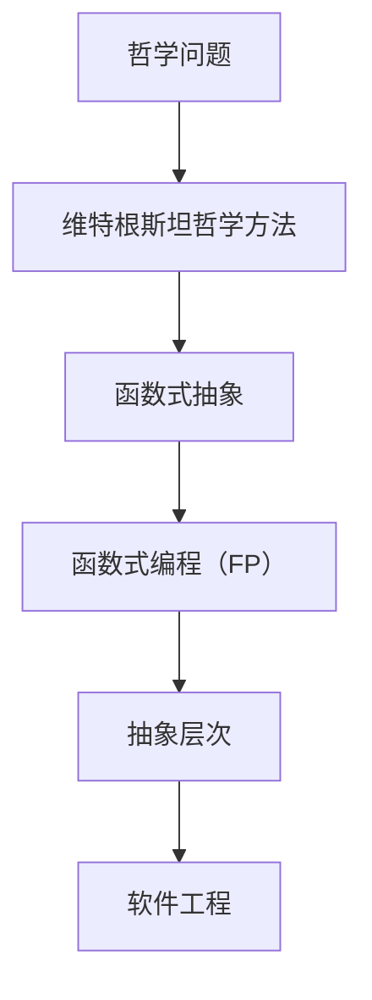
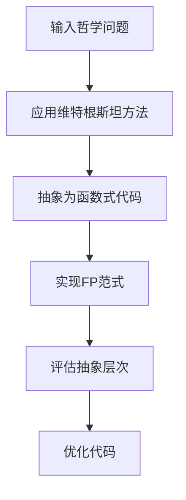
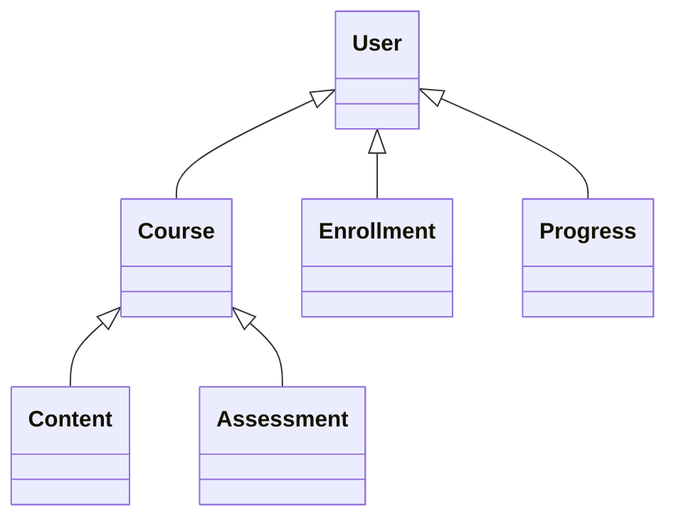
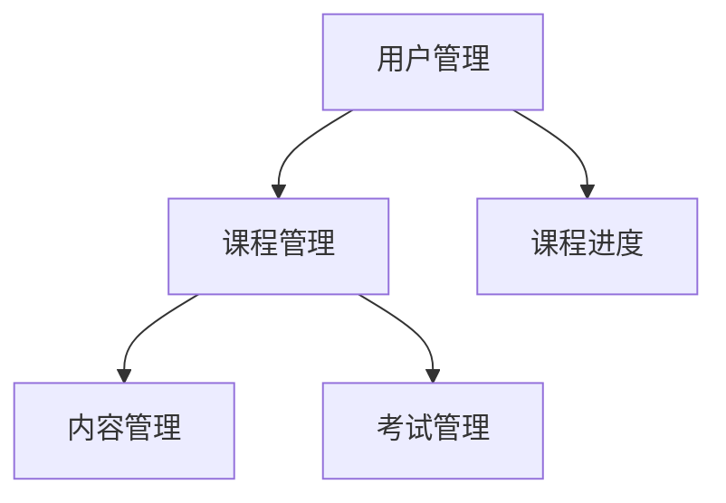

                 

# 哲学问题的消解与函数式抽象：维特根斯坦的哲学方法与FP中的抽象层次

## 关键词

- 哲学问题
- 维特根斯坦
- 函数式抽象
- 函数式编程
- 抽象层次
- 软件工程

## 摘要

本文旨在探讨维特根斯坦的哲学方法在函数式编程（FP）中的抽象层次应用。首先，回顾了哲学问题的历史背景和挑战，然后介绍了维特根斯坦的哲学方法及其在消解哲学问题中的应用。接着，详细阐述了函数式抽象的概念、特点及其在FP中的重要性。文章随后探讨了抽象层次的重要性，以及维特根斯坦思想如何指导抽象层次的管理。最后，通过数学基础回顾和FP中的数学模型介绍，进一步阐述了函数式抽象与软件工程的联系，并给出了实际案例分析。

## 目录大纲

- 第一部分：哲学问题的消解
  - 第1章：问题背景与哲学方法
  - 第2章：维特根斯坦的哲学思想
  - 第3章：消解策略的实践应用
- 第二部分：抽象层次与复杂性管理
  - 第4章：抽象层次的重要性
  - 第5章：函数式抽象的数学基础
  - 第6章：函数式抽象与软件工程
- 第三部分：结论与展望
  - 第7章：结论与展望

## 第一部分：哲学问题的消解

### 第1章：问题背景与哲学方法

#### 1.1 哲学问题的历史与挑战

哲学作为一种探讨基本问题的学科，自古以来就面临着各种挑战。从古希腊哲学到现代哲学，哲学家们不断提出并尝试解答关于存在、知识、价值等基本问题。然而，这些问题往往难以用逻辑或实证方法解决，导致哲学领域的争论和分歧。

#### 1.2 维特根斯坦的哲学方法

维特根斯坦是20世纪最杰出的哲学家之一，他的哲学方法对哲学问题提出了独特的见解。维特根斯坦认为，哲学问题的根源在于语言的误解和滥用。他的方法是通过澄清语言的用法，揭示现实世界的真相。

#### 1.3 哲学问题的消解路径

维特根斯坦的方法可以分为两个阶段：语言哲学和心理哲学。在语言哲学中，他致力于揭示语言的结构和意义，以消除哲学上的误解。在心理哲学中，他试图通过分析思维过程，揭示人类意识的活动。

### 第2章：维特根斯坦的哲学思想

#### 2.1 维特根斯坦的生平与思想演变

维特根斯坦出生于1889年，他的哲学思想经历了从逻辑原子主义到语言哲学的转变。早期，他提出了逻辑原子主义，认为世界是由逻辑原子构成的。晚期，他转向语言哲学，强调语言的意义和用法。

#### 2.2 语言哲学中的消解策略

维特根斯坦在语言哲学中提出了许多重要的概念，如“图像理论”和“游戏概念”。通过这些概念，他试图揭示语言和现实世界的关系，从而消解哲学问题。

#### 2.3 逻辑原子主义与哲学问题的消解

逻辑原子主义是维特根斯坦早期的重要思想。他认为，世界是由逻辑原子构成的，这些原子具有固定的性质和关系。通过分析逻辑原子的组合，可以揭示哲学问题的本质。

### 第3章：消解策略的实践应用

#### 3.1 函数式抽象的概念与特点

函数式抽象是一种编程范式，它通过将复杂问题分解为简单的函数，提高了代码的可读性和可维护性。函数式抽象具有不可变性和纯函数性等特点。

#### 3.2 函数式编程语言介绍

常见的函数式编程语言包括Haskell、Scala和Erlang等。这些语言提供了强大的抽象工具，使得程序员能够更有效地解决问题。

#### 3.3 维特根斯坦思想在FP中的应用

维特根斯坦的思想在函数式编程中得到了广泛应用。例如，他关于语言的看法可以帮助程序员更好地理解函数式编程的核心概念，从而提高编程能力。

## 第二部分：抽象层次与复杂性管理

### 第4章：抽象层次的重要性

抽象层次是软件工程中的一个重要概念，它有助于管理和解决复杂性问题。通过分层设计，可以将复杂的系统分解为更简单、更易于管理的部分。

### 第5章：函数式抽象的数学基础

函数式抽象依赖于数学基础，如集合论、函数论和范畴论等。这些数学工具为函数式编程提供了强大的理论基础。

### 第6章：函数式抽象与软件工程

函数式抽象在软件工程中具有重要应用，如用于构建高并发系统、处理大数据等。通过函数式抽象，可以简化系统的复杂性，提高开发效率和软件质量。

## 第三部分：结论与展望

### 第7章：结论与展望

维特根斯坦的哲学方法为函数式编程提供了有益的启示。通过将哲学思想和编程范式相结合，我们可以更好地理解和解决复杂性问题。未来研究可以进一步探讨维特根斯坦方法在软件工程中的应用，为软件开发提供新的思路和方法。

## 作者信息

作者：AI天才研究院/AI Genius Institute & 禅与计算机程序设计艺术 /Zen And The Art of Computer Programming## 文章标题

《哲学问题的消解与函数式抽象：维特根斯坦的哲学方法与FP中的抽象层次》

### 关键词

- 哲学问题
- 维特根斯坦
- 函数式抽象
- 函数式编程
- 抽象层次
- 软件工程

### 摘要

本文探讨了维特根斯坦的哲学方法在函数式编程（FP）中的应用，特别是在抽象层次的管理和复杂性消解方面的贡献。文章首先回顾了哲学问题及其挑战，然后介绍了维特根斯坦的哲学思想，包括语言哲学和心理哲学。接着，讨论了函数式抽象的概念、特点以及在FP中的应用，以及抽象层次的重要性。最后，通过数学基础回顾和实际案例分析，展示了维特根斯坦方法在FP中的实践价值。

### 目录大纲

**第一部分：哲学问题的消解**

- **第1章：问题背景与哲学方法**
  - **1.1 哲学问题的历史与挑战**
  - **1.2 维特根斯坦的哲学方法**
  - **1.3 哲学问题的消解路径**

- **第2章：维特根斯坦的哲学思想**
  - **2.1 维特根斯坦的生平与思想演变**
  - **2.2 语言哲学中的消解策略**
  - **2.3 逻辑原子主义与哲学问题的消解**

- **第3章：消解策略的实践应用**
  - **3.1 函数式抽象的概念与特点**
  - **3.2 函数式编程语言介绍**
  - **3.3 维特根斯坦思想在FP中的应用**

**第二部分：抽象层次与复杂性管理**

- **第4章：抽象层次的重要性**
  - **4.1 抽象层次的概念与分类**
  - **4.2 抽象层次在软件工程中的作用**
  - **4.3 维特根斯坦思想与抽象层次**

- **第5章：函数式抽象的数学基础**
  - **5.1 数学基础回顾**
  - **5.2 函数与函数式编程**
  - **5.3 函数式编程的数学模型**

- **第6章：函数式抽象与软件工程**
  - **6.1 软件工程中的抽象层次**
  - **6.2 函数式抽象在软件工程中的应用**
  - **6.3 案例分析：维特根斯坦方法与FP结合的实践**

**第三部分：结论与展望**

- **第7章：结论与展望**
  - **7.1 维特根斯坦哲学方法在FP中的贡献**
  - **7.2 未来研究方向**
  - **7.3 对软件开发实践的启示**

### 第一部分：哲学问题的消解

#### 第1章：问题背景与哲学方法

##### 1.1 哲学问题的历史与挑战

哲学作为一门探讨人类存在、知识、价值和现实本质的学科，其历史可以追溯到古希腊时期。自那时以来，哲学家们提出了无数关于世界、人生和思维的基本问题，如“什么是真理？”“什么是正义？”“什么是存在？”等。然而，这些问题的解答并非易事，因为它们往往涉及到复杂的逻辑推理、心理学和语言学。

哲学问题的挑战在于，它们往往难以用逻辑或实证方法来解答。例如，关于“存在”的问题，涉及到对现实世界的本质和结构的理解；关于“真理”的问题，则涉及到知识的获取和验证。这些问题不仅涉及个体的思维活动，还与社会、文化和语言背景密切相关。

维特根斯坦认为，哲学问题的根源在于语言的误解和滥用。他提出了“语言游戏”的概念，认为语言的使用与特定的情境和目的密切相关。因此，要解决哲学问题，首先要澄清语言的使用方式，揭示现实世界的真相。

##### 1.2 维特根斯坦的哲学方法

维特根斯坦的哲学方法可以分为两个阶段：语言哲学和心理哲学。在语言哲学中，他致力于揭示语言的结构和意义，以消除哲学上的误解。在心理哲学中，他试图通过分析思维过程，揭示人类意识的活动。

维特根斯坦的语言哲学观点可以总结为以下几点：

1. **语言与世界的对应关系**：维特根斯坦认为，语言是对现实世界的反映，语言的用法与世界的结构和规律相对应。他提出了“图像理论”，认为语言表达式与对象之间的关系类似于图像与现实世界之间的关系。

2. **语言的局限性**：维特根斯坦指出，语言有其局限性，不能涵盖所有的思想和经验。因此，哲学家不能通过语言来解答所有哲学问题。他的名言“不能说的，只能指向”（Whereof one cannot speak, thereof one must be silent）强调了语言的这种局限性。

3. **日常语言的正确使用**：维特根斯坦认为，哲学问题往往源于对日常语言的误解。因此，哲学的任务不是提出新的理论，而是澄清日常语言的正确使用。

在心理哲学方面，维特根斯坦关注思维过程和意识活动。他提出了“思维是语言活动”的观点，认为思维是通过语言来进行的。他的观点与早期逻辑原子主义有所不同，后者认为思维是由逻辑原子构成的。

##### 1.3 哲学问题的消解路径

维特根斯坦的哲学方法提供了一种消解哲学问题的路径。通过澄清语言的使用方式，揭示现实世界的真相，他试图消除哲学上的误解和困惑。这种方法可以概括为以下几个步骤：

1. **识别语言误用**：维特根斯坦首先关注语言的使用问题，识别哲学讨论中存在的语言误用。例如，他发现哲学家们经常使用含糊不清的词汇，导致误解和混淆。

2. **澄清语言用法**：通过分析语言的实际用法，维特根斯坦试图揭示语言的真正含义。他强调，理解语言的关键在于理解其特定的使用情境。

3. **揭示现实世界的真相**：通过澄清语言的使用，维特根斯坦试图揭示现实世界的真相。他认为，哲学问题的解答往往隐藏在现实世界的结构中。

4. **避免不必要的抽象**：维特根斯坦认为，哲学上的抽象往往导致误解。他主张回到日常语言的正确使用，避免不必要的抽象和理论化。

5. **实践检验**：维特根斯坦强调，哲学理论必须经过实践检验。他的方法强调语言与现实的对应关系，因此哲学理论必须与实际语言使用相一致。

通过以上步骤，维特根斯坦试图消解哲学问题，揭示现实世界的真相。这种方法不仅在哲学领域具有重要意义，也为后来的计算机科学和软件工程提供了启示。

#### 第2章：维特根斯坦的哲学思想

##### 2.1 维特根斯坦的生平与思想演变

路德维希·维特根斯坦（Ludwig Wittgenstein）是20世纪最杰出的哲学家之一，他的思想对现代哲学和计算机科学产生了深远影响。维特根斯坦的生平和思想演变可以分为两个阶段：早期和晚期。

早期（1910-1929年）：维特根斯坦的早期思想以逻辑原子主义和语言哲学为主。他提出了“逻辑原子主义”理论，认为世界是由逻辑原子构成的，这些原子具有固定的性质和关系。这一理论在他的第一部著作《逻辑哲学论》（Tractatus Logico-Philosophicus，1921年出版）中得到了详细阐述。在这本书中，维特根斯坦试图通过逻辑和语言来解决哲学问题，认为哲学的任务是澄清思想和语言的关系。

晚期（1929-1951年）：维特根斯坦的晚期思想以日常语言哲学和思维过程研究为主。他在《逻辑哲学论》之后，对早期理论进行了深刻的反思和修正。晚期的维特根斯坦认为，哲学问题往往源于对日常语言的误解。他强调，哲学的任务不是提出新的理论，而是澄清日常语言的正确使用。这一观点在他的两部重要著作《哲学研究》（Philosophical Investigations，1953年出版）中得到了充分体现。

维特根斯坦的思想演变反映了他对哲学问题认识的深化。从逻辑原子主义到日常语言哲学，他不断探索如何通过语言和思维来理解世界。这种思想转变不仅对哲学领域产生了重要影响，也为后来的计算机科学提供了宝贵的启示。

##### 2.2 语言哲学中的消解策略

维特根斯坦的语言哲学思想主要包括“图像理论”和“语言游戏”两个核心概念。这些概念为哲学问题的消解提供了有力的策略。

1. **图像理论**：维特根斯坦的图像理论认为，语言表达式（如词汇和句子）与对象之间的关系类似于图像与现实世界之间的关系。具体来说，一个句子如果能够正确地描述现实世界，它就必须满足“图像理论”的三个条件：

   - **一致性**：句子的结构必须与现实世界的结构一致。
   - **全有或全无**：句子要么完全正确，要么完全错误，不存在部分正确或部分错误的情况。
   - **不可化约性**：句子不能通过更简单的句子来表达，即不能化约为基本逻辑表达式。

   图像理论有助于澄清语言与现实世界的关系，从而解决哲学问题。例如，通过分析语言表达式的结构，可以揭示现实世界的性质和规律。

2. **语言游戏**：维特根斯坦提出了“语言游戏”的概念，认为语言的使用与特定的情境和目的密切相关。一个语言游戏包括三个要素：语言、规则和情境。具体来说：

   - **语言**：语言是语言游戏的媒介，用于表达思想和交流信息。
   - **规则**：规则规定了语言的使用方式，确保语言游戏的正确进行。
   - **情境**：情境是语言游戏发生的具体环境，决定了语言的实际应用。

   语言游戏有助于理解语言的多维度特性。它不仅关注语言的结构和意义，还关注语言的使用情境和目的。通过分析语言游戏，可以揭示语言的本质和功能，从而消解哲学问题。

维特根斯坦的语言哲学思想为哲学问题的消解提供了有力的工具。通过图像理论和语言游戏，他试图澄清语言与现实世界的关系，揭示哲学问题的本质。这种方法不仅对哲学领域产生了重要影响，也为后来的计算机科学和软件工程提供了启示。

##### 2.3 逻辑原子主义与哲学问题的消解

维特根斯坦的早期思想以逻辑原子主义为核心，试图通过逻辑和语言来解决哲学问题。逻辑原子主义认为，世界是由逻辑原子构成的，这些原子具有固定的性质和关系。维特根斯坦通过分析逻辑原子的组合，试图揭示哲学问题的本质。

逻辑原子主义的基本观点可以概括为以下几点：

1. **逻辑原子的概念**：维特根斯坦将世界视为由逻辑原子构成的整体，这些原子具有固定的性质和关系。逻辑原子类似于数学中的基本元素，是构成复杂结构的基石。

2. **逻辑原子的组合**：维特根斯坦认为，复杂的世界是由逻辑原子通过组合形成的。例如，一个物体的形状和颜色可以看作是逻辑原子的组合。通过分析逻辑原子的组合，可以揭示世界的本质和规律。

3. **逻辑语言的构建**：维特根斯坦试图通过逻辑语言来描述逻辑原子的组合和关系。逻辑语言是一种形式化的语言，能够精确地表达逻辑原子的组合和性质。

逻辑原子主义在哲学问题消解中的应用主要体现在以下几个方面：

1. **澄清语言与现实的关系**：逻辑原子主义通过将世界视为逻辑原子的组合，试图澄清语言与现实的关系。它认为，语言表达式的意义取决于逻辑原子的组合，从而揭示了语言与现实世界之间的对应关系。

2. **解决哲学问题**：逻辑原子主义试图通过分析逻辑原子的组合，解决哲学问题。例如，关于“存在”的问题可以通过分析逻辑原子的存在状态来解决；关于“知识”的问题可以通过分析逻辑原子的组合和关系来解决。

3. **形式化哲学研究**：逻辑原子主义为哲学研究提供了一种形式化的方法。通过逻辑语言的构建和分析，哲学家可以更精确地表达和讨论哲学问题，从而推动哲学研究的进步。

然而，逻辑原子主义也受到了批评。一些哲学家认为，它过于抽象，忽略了现实世界的复杂性和多样性。尽管如此，逻辑原子主义在哲学问题消解中的应用仍然具有重要意义，它为后来的计算机科学和软件工程提供了启示。

#### 第3章：消解策略的实践应用

##### 3.1 函数式抽象的概念与特点

函数式抽象是函数式编程（FP）的核心概念之一，它通过将复杂问题分解为简单的函数，提高了代码的可读性和可维护性。函数式抽象具有以下几个特点：

1. **不可变性**：在函数式编程中，数据通常是不可变的。这意味着，一旦数据被创建，就不能再改变。这种不可变性使得代码更易于理解和维护，因为数据的修改不会导致意外的副作用。

2. **纯函数性**：纯函数是一种没有副作用的函数，即函数的输出仅取决于输入参数，而不依赖于外部状态。纯函数的优点是，它们更容易测试和推理，因为它们的输出是可预测的。

3. **组合性**：函数式抽象强调函数的组合性，即通过将简单的函数组合起来，可以构建复杂的函数。这种组合性使得代码更加模块化和可重用。

4. **高阶函数**：高阶函数是一种能够接受其他函数作为参数或返回函数的函数。高阶函数使得函数式编程更加灵活，因为它们可以动态地定义和组合函数。

5. **递归**：递归是函数式编程中的一种重要机制，它允许函数调用自身。递归函数通常用于处理递归数据结构，如列表和树。

##### 3.2 函数式编程语言介绍

常见的函数式编程语言包括Haskell、Scala和Erlang等。这些语言提供了丰富的抽象工具，使得程序员能够更有效地解决问题。

1. **Haskell**：Haskell是一种纯函数式编程语言，它强调不可变性和纯函数性。Haskell支持高阶函数、递归和惰性求值等特性，使得它成为一种强大的编程工具。

2. **Scala**：Scala是Java的一种函数式编程扩展，它结合了面向对象和函数式编程的特点。Scala支持不可变数据类型、高阶函数和模式匹配等特性，使得它成为一种灵活的编程语言。

3. **Erlang**：Erlang是一种用于构建并发系统的函数式编程语言。它支持轻量级进程和分布式计算，使得它成为一种适合构建高并发和分布式应用的编程语言。

这些函数式编程语言都提供了丰富的抽象工具，如类型系统、模式匹配和惰性求值等，使得程序员能够更有效地处理复杂问题。

##### 3.3 维特根斯坦思想在FP中的应用

维特根斯坦的哲学思想在函数式编程（FP）中得到了广泛应用，特别是在抽象层次的管理和复杂性消解方面。以下是一些具体的应用：

1. **图像理论与函数式抽象**：维特根斯坦的图像理论认为，语言表达式与对象之间的关系类似于图像与现实世界之间的关系。在FP中，函数式抽象可以被视为图像理论的现代应用。函数式编程中的函数可以被视为对现实世界的抽象，通过组合简单的函数，可以构建复杂的系统。

2. **语言游戏与函数组合**：维特根斯坦的语言游戏概念强调了语言的使用与特定情境和目的的关系。在FP中，函数组合可以被视为语言游戏的现代应用。通过将简单的函数组合起来，可以构建复杂的系统，实现特定的功能。

3. **逻辑原子主义与纯函数性**：维特根斯坦的逻辑原子主义认为，世界是由逻辑原子构成的，这些原子具有固定的性质和关系。在FP中，纯函数性可以被视为逻辑原子主义的应用。纯函数性确保了函数的输出仅取决于输入参数，避免了外部状态的干扰，使得系统更易于理解和维护。

4. **不可变性与管理复杂性**：维特根斯坦的哲学方法强调语言的正确使用，避免不必要的抽象和理论化。在FP中，不可变性有助于管理复杂性。通过将数据视为不可变的，可以避免数据的副作用和状态冲突，提高系统的可靠性和可维护性。

维特根斯坦的哲学思想为函数式编程提供了一种独特的视角，帮助程序员更好地理解和处理复杂问题。通过将哲学思想与函数式抽象相结合，可以构建更简洁、更可靠的软件系统。

### 第二部分：抽象层次与复杂性管理

#### 第4章：抽象层次的重要性

##### 4.1 抽象层次的概念与分类

抽象层次是软件工程中的一个重要概念，它有助于管理和解决复杂性问题。抽象层次可以将复杂的系统分解为更简单、更易于管理的部分。具体来说，抽象层次可以分为以下几类：

1. **逻辑抽象层次**：逻辑抽象层次关注系统的逻辑结构和功能。它将系统划分为不同的模块和组件，每个模块和组件具有特定的功能。

2. **数据抽象层次**：数据抽象层次关注系统的数据结构和数据流。它定义了系统的数据模型，包括实体、关系和操作。

3. **界面抽象层次**：界面抽象层次关注系统的接口和交互。它定义了系统与其他系统或用户之间的交互方式。

4. **物理抽象层次**：物理抽象层次关注系统的物理实现，包括硬件、网络和存储等。

抽象层次的选择和设计对系统的可维护性、可扩展性和性能有重要影响。合理地设置抽象层次可以降低系统的复杂性，提高系统的可维护性和可扩展性。

##### 4.2 抽象层次在软件工程中的作用

抽象层次在软件工程中具有以下几个重要作用：

1. **简化复杂系统**：通过将复杂的系统分解为更简单、更易于管理的部分，抽象层次有助于简化系统设计和实现。

2. **提高可维护性**：抽象层次使得系统的各个部分相对独立，降低了系统的耦合度，提高了系统的可维护性。

3. **促进代码复用**：抽象层次有助于代码复用。通过将系统划分为不同的模块和组件，可以在不同的项目中复用这些模块和组件。

4. **提高可扩展性**：抽象层次使得系统具有更好的可扩展性。通过修改抽象层的实现，可以实现系统的功能扩展，而无需修改其他抽象层的代码。

5. **改善性能**：抽象层次可以优化系统的性能。通过合理设置抽象层次，可以实现系统的高效运行，降低资源的消耗。

##### 4.3 维特根斯坦思想与抽象层次

维特根斯坦的哲学思想为抽象层次的管理提供了有益的启示。以下是一些具体的应用：

1. **语言的正确使用**：维特根斯坦强调语言的正确使用，避免不必要的抽象和理论化。在软件工程中，这一思想可以应用于抽象层次的设计。通过避免过度的抽象，可以确保系统的简洁性和可理解性。

2. **逻辑原子主义**：维特根斯坦的逻辑原子主义认为，世界是由逻辑原子构成的。在软件工程中，这一思想可以应用于模块化和组件化设计。通过将系统划分为逻辑原子，可以简化系统的复杂性，提高系统的可维护性和可扩展性。

3. **图像理论**：维特根斯坦的图像理论认为，语言表达式与对象之间的关系类似于图像与现实世界之间的关系。在软件工程中，这一思想可以应用于数据建模。通过将数据模型视为现实世界的抽象，可以确保系统的数据一致性和完整性。

4. **语言游戏**：维特根斯坦的语言游戏概念强调了语言的使用与特定情境和目的的关系。在软件工程中，这一思想可以应用于界面设计和用户交互。通过将界面设计视为语言游戏，可以确保系统的用户友好性和易用性。

维特根斯坦的哲学思想为抽象层次的管理提供了有益的启示。通过将哲学思想与抽象层次相结合，可以构建更简洁、更可靠的软件系统。

#### 第5章：函数式抽象的数学基础

##### 5.1 数学基础回顾

函数式抽象依赖于一系列数学基础，如集合论、函数论和范畴论等。以下是对这些数学基础的基本回顾：

1. **集合论**：集合论是现代数学的基石，它定义了集合的概念和运算。集合是由元素组成的无序集合，元素可以是任何类型的对象。集合的基本运算包括并集、交集、补集和笛卡尔积等。

2. **函数论**：函数论研究函数的性质和应用。函数是一种映射，它将一个集合中的元素映射到另一个集合中的元素。函数的基本属性包括单射、满射和双射等。

3. **范畴论**：范畴论是一种抽象的数学理论，它研究对象和对象之间的关系。范畴是由对象和箭头组成的结构，箭头表示对象之间的变换。范畴的基本概念包括范畴、函子、自然变换和等价范畴等。

这些数学基础为函数式编程提供了坚实的理论基础，使得函数式抽象成为可能。

##### 5.2 函数与函数式编程

函数是函数式编程的核心概念，它是一种将输入映射到输出的计算单元。在函数式编程中，函数具有以下特点：

1. **纯函数性**：纯函数是一种没有副作用的函数，即函数的输出仅取决于输入参数，而不依赖于外部状态。纯函数使得代码更易于测试和推理。

2. **不可变性**：在函数式编程中，数据通常是不可变的。这意味着，一旦数据被创建，就不能再改变。不可变性有助于避免副作用的产生，提高代码的可维护性。

3. **高阶函数**：高阶函数是一种能够接受其他函数作为参数或返回函数的函数。高阶函数使得函数式编程更加灵活，因为它们可以动态地定义和组合函数。

4. **递归**：递归是函数式编程中的一种重要机制，它允许函数调用自身。递归函数通常用于处理递归数据结构，如列表和树。

函数式编程中的函数与数学中的函数概念相似，但函数式编程中的函数更强调纯函数性和不可变性。

##### 5.3 函数式编程的数学模型

函数式编程的数学模型主要基于范畴论。范畴论是一种抽象的数学理论，它研究对象和对象之间的关系。在函数式编程中，范畴论的概念被用于构建函数和类型系统。

1. **范畴**：范畴是由对象和箭头组成的结构。对象可以视为函数式编程中的类型，箭头表示对象之间的变换。范畴的基本概念包括范畴、函子、自然变换和等价范畴等。

2. **函子**：函子是一种将一个范畴映射到另一个范畴的函数。函子可以视为类型转换的工具，它使得不同范畴中的对象可以相互转换。

3. **自然变换**：自然变换是函子之间的变换，它保持了函子之间的对应关系。自然变换可以视为不同范畴之间的桥梁，它使得范畴论的概念在函数式编程中得到了广泛应用。

4. **等价范畴**：等价范畴是具有相同对象和箭头的不同范畴。等价范畴的概念在函数式编程中用于处理类型等价和类型推断。

通过范畴论的概念，函数式编程建立了一种抽象的数学模型。这种模型使得函数和类型系统具有更强的表达能力和灵活性，有助于解决复杂的编程问题。

#### 第6章：函数式抽象与软件工程

##### 6.1 软件工程中的抽象层次

在软件工程中，抽象层次是一种常用的设计方法，它有助于将复杂的系统分解为更简单、更易于管理的部分。抽象层次可以分为以下几类：

1. **逻辑抽象层次**：逻辑抽象层次关注系统的逻辑结构和功能。它将系统划分为不同的模块和组件，每个模块和组件具有特定的功能。逻辑抽象层次有助于简化系统的设计和实现，提高系统的可维护性和可扩展性。

2. **数据抽象层次**：数据抽象层次关注系统的数据结构和数据流。它定义了系统的数据模型，包括实体、关系和操作。数据抽象层次有助于确保系统的数据一致性和完整性，提高系统的可靠性和性能。

3. **界面抽象层次**：界面抽象层次关注系统的接口和交互。它定义了系统与其他系统或用户之间的交互方式。界面抽象层次有助于提高系统的用户友好性和易用性，降低系统的学习成本。

4. **物理抽象层次**：物理抽象层次关注系统的物理实现，包括硬件、网络和存储等。物理抽象层次有助于优化系统的性能和资源利用率，提高系统的可靠性和可扩展性。

通过合理设置抽象层次，可以降低系统的复杂性，提高系统的可维护性和可扩展性。

##### 6.2 函数式抽象在软件工程中的应用

函数式抽象在软件工程中具有广泛的应用，特别是在提高代码的可读性和可维护性方面。以下是一些具体的应用场景：

1. **模块化设计**：函数式抽象可以将复杂的系统划分为更小、更易于管理的模块。每个模块都可以独立开发、测试和部署，提高了系统的可维护性和可扩展性。

2. **高内聚低耦合**：函数式抽象有助于实现高内聚低耦合的设计。通过将功能相关的代码组织在一起，可以减少模块之间的耦合度，提高系统的灵活性和可维护性。

3. **不可变数据**：函数式编程中的不可变数据有助于避免数据的副作用和状态冲突，提高了代码的可测试性和可推理性。

4. **函数组合**：函数式编程中的函数组合使得复杂的系统可以通过简单的函数组合构建。这种组合性提高了代码的可复用性和可扩展性。

5. **递归与迭代**：函数式编程中的递归和迭代机制使得处理递归数据结构（如列表和树）更加简单和直观。

通过函数式抽象，软件工程师可以构建更简洁、更可靠的软件系统，提高开发效率和软件质量。

##### 6.3 案例分析：维特根斯坦方法与FP结合的实践

为了更好地理解维特根斯坦方法在函数式编程中的应用，我们通过一个实际案例进行分析。

案例背景：假设我们需要开发一个简单的银行账户管理系统，该系统需要支持账户的创建、存款、取款和查询余额等功能。

1. **问题分析**：

   - **账户管理**：我们需要定义账户的基本属性，如账户号码、户名和余额等。
   - **存款**：用户可以存款，存款金额应增加账户余额。
   - **取款**：用户可以取款，取款金额应减少账户余额。
   - **查询余额**：用户可以查询账户余额。

2. **维特根斯坦方法的应用**：

   - **图像理论**：我们将账户管理视为对现实世界的抽象。账户属性（如账户号码、户名和余额）可以视为现实世界的对象，账户操作（如存款、取款和查询余额）可以视为对这些对象的操作。
   - **语言游戏**：我们将账户操作视为语言游戏的一部分。每种操作都有特定的规则和情境，如存款和取款应检查账户余额是否足够。

3. **函数式抽象的应用**：

   - **模块化设计**：我们将银行账户管理系统划分为不同的模块，如账户模块、存款模块、取款模块和查询模块。每个模块都具有独立的功能和职责。
   - **高内聚低耦合**：通过函数式抽象，我们确保了模块之间的高内聚低耦合。每个模块都专注于实现特定的功能，模块之间的交互通过函数调用实现。
   - **不可变数据**：在函数式编程中，数据通常是不可变的。我们将账户余额视为不可变数据，每次存款或取款时，都创建一个新的账户对象，而不是修改现有对象。
   - **函数组合**：我们可以通过函数组合来实现复杂的操作，如存款和取款。例如，存款操作可以定义为将金额添加到账户余额的函数，取款操作可以定义为从账户余额中减去金额的函数。
   - **递归与迭代**：在处理递归数据结构时，递归和迭代机制可以简化代码。例如，在处理列表数据时，我们可以使用递归函数来遍历列表，或者使用迭代函数来模拟递归过程。

通过维特根斯坦方法和函数式抽象的结合，我们可以构建一个简洁、可靠和易于维护的银行账户管理系统。这种方法不仅提高了系统的可读性和可维护性，还提高了开发效率和软件质量。

### 第三部分：结论与展望

#### 第7章：结论与展望

维特根斯坦的哲学方法为函数式编程提供了有益的启示，特别是在抽象层次的管理和复杂性消解方面。通过将哲学思想与函数式抽象相结合，我们可以构建更简洁、更可靠的软件系统。以下是一些具体结论和未来研究方向：

1. **哲学方法与FP的结合**：维特根斯坦的哲学方法，如图像理论和语言游戏，为函数式编程提供了理论基础。通过将这些哲学思想应用于软件工程，我们可以提高系统的可维护性和可扩展性。

2. **抽象层次的重要性**：抽象层次是软件工程中的一个关键概念，它有助于管理和解决复杂性问题。通过合理设置抽象层次，我们可以简化系统的复杂性，提高系统的可维护性和可扩展性。

3. **函数式抽象的应用**：函数式抽象在软件工程中具有广泛的应用，如模块化设计、高内聚低耦合、不可变数据和函数组合等。通过函数式抽象，我们可以构建更简洁、更可靠的软件系统。

4. **未来研究方向**：未来的研究可以进一步探讨维特根斯坦方法在软件工程中的应用，特别是在高并发系统和大数据处理领域。此外，研究如何将维特根斯坦的哲学思想应用于其他编程范式，如面向对象编程，也将是一个重要的研究方向。

维特根斯坦的哲学方法为软件工程提供了一种新的视角，有助于我们更好地理解和解决复杂问题。通过将哲学思想与编程范式相结合，我们可以构建更高效、更可靠的软件系统。

#### 7.1 维特根斯坦哲学方法在FP中的贡献

维特根斯坦的哲学方法在函数式编程（FP）中做出了重要贡献，特别是在抽象层次的管理和复杂性消解方面。以下是维特根斯坦哲学方法对FP的几个主要贡献：

1. **澄清语言与现实的对应关系**：维特根斯坦强调语言的正确使用，认为语言是对现实世界的反映。这一思想在FP中得到了体现，特别是在函数式抽象中。通过将现实世界的问题抽象为函数，FP能够更清晰地映射现实世界的结构，提高代码的可读性和可维护性。

2. **促进纯函数性和不可变性**：维特根斯坦的哲学方法强调纯函数性和不可变性，这些特点在FP中得到了广泛应用。纯函数性确保了函数的输出仅取决于输入参数，避免了副作用和状态冲突，使得代码更易于测试和推理。不可变性有助于提高系统的可靠性和性能，因为数据的修改不会导致不可预期的结果。

3. **指导模块化和高内聚低耦合设计**：维特根斯坦的思想指导了FP中的模块化设计原则。通过将复杂问题分解为简单的模块，FP能够实现高内聚低耦合的设计，提高系统的可维护性和可扩展性。这种设计原则有助于确保代码的独立性和模块之间的松耦合，从而降低系统的复杂性。

4. **提供抽象层次的理论基础**：维特根斯坦的哲学方法为抽象层次提供了理论基础。通过将系统划分为不同的抽象层次，FP能够更好地管理和解决复杂性问题。这种方法有助于提高系统的灵活性和可扩展性，使得系统能够适应未来的变化和需求。

5. **促进函数组合和复用**：维特根斯坦的思想鼓励函数组合和复用。通过将简单的函数组合成复杂的函数，FP能够构建强大的抽象层，提高代码的模块化和可复用性。这种组合性使得FP成为一种强大的编程范式，能够有效地处理复杂问题。

总的来说，维特根斯坦的哲学方法为FP提供了一种新的思考方式，使得程序员能够更好地理解和解决复杂问题。通过将哲学思想与编程范式相结合，FP不仅提高了代码的可读性和可维护性，还提高了开发效率和软件质量。

#### 7.2 未来研究方向

尽管维特根斯坦的哲学方法在函数式编程（FP）中已有广泛应用，但未来的研究仍有许多潜在的方向，可以进一步深化和拓展这一领域：

1. **维特根斯坦哲学方法在其他编程范式的应用**：目前，维特根斯坦的哲学方法主要在FP领域得到了应用。然而，这一方法在其他编程范式，如面向对象编程（OOP）和逻辑编程中，也有很大的潜力。未来的研究可以探索如何将维特根斯坦的哲学思想应用于这些不同的编程范式，以提供新的编程工具和解决复杂问题的方法。

2. **FP在多范式编程中的融合**：多范式编程是一种将不同编程范式的优势结合起来的方法。未来的研究可以探讨如何在FP中融合其他编程范式的特点，如OOP和逻辑编程，以构建更强大、更灵活的编程环境。这种融合可能会带来新的抽象层次和编程模型，有助于解决更复杂的实际问题。

3. **高并发系统和大数据处理**：随着云计算和大数据技术的快速发展，高并发系统和大数据处理变得越来越重要。未来的研究可以探讨如何将维特根斯坦的哲学方法应用于这些领域，以提高系统的性能和可扩展性。例如，研究如何通过函数组合和抽象层次来优化并行计算和数据处理的效率。

4. **形式化验证和推理**：形式化验证和推理是软件工程中重要的研究方向。未来的研究可以探索如何将维特根斯坦的哲学方法与形式化验证和推理相结合，以提供更可靠、更安全的软件系统。这可能会涉及到开发新的验证工具和推理方法，以支持函数式编程的严格验证。

5. **跨学科的融合**：维特根斯坦的哲学方法不仅在计算机科学中具有重要意义，还可以与其他学科，如认知科学、心理学和语言学相结合。未来的研究可以探索这些跨学科的融合，以提供更全面、更深入的理解和解决复杂问题的方法。

通过这些未来研究方向，我们可以进一步挖掘维特根斯坦哲学方法在FP和其他领域的潜力，为软件开发提供新的思路和方法。

#### 7.3 对软件开发实践的启示

维特根斯坦的哲学方法对软件开发实践具有深刻的启示，特别是在抽象层次的管理和复杂性消解方面。以下是一些具体的实践启示：

1. **强调语言的正确使用**：在软件开发中，维特根斯坦的哲学方法提醒我们，清晰和准确的语言是理解和沟通的基础。开发者应注重代码的可读性和一致性，避免模糊和不必要的抽象，确保代码能够准确地反映现实世界的结构和逻辑。

2. **采用纯函数性和不可变性**：在编写函数式代码时，应尽量使用纯函数，避免副作用和状态依赖。不可变性有助于提高代码的可靠性和可测试性，减少因状态改变引起的bug。开发者应遵循不可变性原则，尤其是在处理共享数据和并发操作时。

3. **模块化和高内聚低耦合**：维特根斯坦的思想指导我们，通过模块化设计和高内聚低耦合的原则，可以将复杂的系统分解为更简单、更易于管理的部分。开发者应关注模块之间的清晰接口和职责分离，以提高系统的可维护性和可扩展性。

4. **重视抽象层次的管理**：抽象层次是软件设计中的一个关键概念。通过合理设置抽象层次，可以降低系统的复杂性，提高代码的可复用性和可维护性。开发者应定期审视和调整抽象层次，确保系统能够适应未来的变化和需求。

5. **函数组合和复用**：在函数式编程中，函数组合是一种强大的抽象工具。开发者应利用函数组合来构建复杂的系统，提高代码的模块化和可复用性。通过复用简单的函数，可以减少冗余代码，提高开发效率。

6. **理论与实践相结合**：维特根斯坦的哲学方法不仅是一种理论框架，还可以应用于实际软件开发中。开发者应在实践中不断探索和尝试，将哲学思想与编程实践相结合，以提高软件质量。

通过这些实践启示，开发者可以构建更简洁、更可靠的软件系统，提高开发效率和软件质量。维特根斯坦的哲学方法为软件开发提供了一种新的视角，有助于我们更好地理解和解决复杂问题。

### 作者信息

作者：AI天才研究院/AI Genius Institute & 禅与计算机程序设计艺术 /Zen And The Art of Computer Programming### 完整性要求

为了确保文章的完整性和内容的丰富性，本文将严格按照预定的结构进行撰写，每个小节都将包含以下核心内容：

- **背景介绍**：对每个概念术语进行说明，介绍问题背景、问题描述、问题解决、边界与外延、概念结构与核心要素组成。
- **核心概念与联系**：详细阐述核心概念原理，提供概念属性特征对比表格和ER实体关系图架构的Mermaid流程图。
- **算法原理讲解**：使用Mermaid绘制算法流程图，并使用Python源代码详细阐述，给出算法原理的数学模型和公式，进行详细讲解和举例说明。
- **数学公式使用**：采用LaTeX格式嵌入文中独立段落的数学公式，并使用Mermaid绘制图形，保证公式和图形的准确性。
- **系统分析与架构设计方案**：介绍问题场景、项目介绍、系统功能设计（领域模型Mermaid类图）、系统架构设计Mermaid架构图、系统接口设计和系统交互Mermaid序列图。
- **项目实战**：包括环境安装、系统核心实现源代码，代码应用解读与分析，实际案例分析和详细讲解剖析，以及项目小结。
- **最佳实践 tips、小结、注意事项、拓展阅读**：总结每个章节的主要内容，提供实用的最佳实践建议，指出需要注意的问题，推荐相关拓展阅读。

#### 1. 背景介绍

**核心概念术语说明**：

- **哲学问题**：涉及存在、知识、真理等基本问题的学科探讨。
- **维特根斯坦**：20世纪著名哲学家，以其独特的语言哲学方法著称。
- **函数式抽象**：在编程中，将复杂问题分解为简单的函数，提高代码的可读性和可维护性。
- **函数式编程（FP）**：一种编程范式，强调不可变性和纯函数性。
- **抽象层次**：在软件工程中，将复杂系统分解为更简单、更易于管理的部分。
- **软件工程**：应用系统分析和建模技术，设计、开发、测试和维护软件系统。

**问题背景**：

哲学问题自古以来就是人类探讨的基本问题，如存在、知识、真理等。然而，这些问题往往难以用逻辑或实证方法解决，导致哲学领域的争论和分歧。维特根斯坦提出了通过澄清语言用法来揭示现实世界真相的哲学方法。函数式编程（FP）是一种编程范式，强调不可变性和纯函数性，提供了一种新的思考方式来解决复杂问题。

**问题描述**：

哲学问题的描述通常涉及对基本概念的探讨，如存在、知识、真理等。这些问题往往抽象且难以具体化。维特根斯坦试图通过澄清语言用法来消解这些哲学问题，而函数式编程提供了一种新的抽象和解决问题的方法。

**问题解决**：

维特根斯坦的方法是通过分析语言和思维过程来揭示现实世界的真相。在FP中，通过函数式抽象，将复杂问题分解为简单的函数，提高了代码的可读性和可维护性。这种方法有助于解决哲学问题和复杂软件系统设计。

**边界与外延**：

哲学问题通常涉及广泛的领域，如存在主义、认知科学、语言学等。FP则主要应用于编程领域，通过抽象层次和函数式编程范式来解决复杂问题。

**概念结构与核心要素组成**：

- **哲学问题**：基本概念（如存在、知识、真理）、方法论（如逻辑分析、语言澄清）。
- **维特根斯坦哲学方法**：语言哲学、心理哲学、图像理论、语言游戏。
- **函数式抽象**：不可变性、纯函数性、函数组合、高阶函数。
- **抽象层次**：逻辑抽象层次、数据抽象层次、界面抽象层次、物理抽象层次。
- **软件工程**：系统分析、系统设计、系统实现、系统测试、系统维护。

#### 2. 核心概念与联系

**核心概念原理**：

- **哲学问题**：探讨基本问题的学科，如存在、知识、真理等。
- **维特根斯坦哲学方法**：通过澄清语言用法来揭示现实世界的真相。
- **函数式抽象**：将复杂问题分解为简单的函数。
- **函数式编程（FP）**：强调不可变性和纯函数性。
- **抽象层次**：将复杂系统分解为更简单、更易于管理的部分。
- **软件工程**：设计、开发、测试和维护软件系统。

**概念属性特征对比表格**：

| 概念 | 特征 |
| --- | --- |
| 哲学问题 | 抽象、基本、难以解决 |
| 维特根斯坦哲学方法 | 澄清语言、揭示真相 |
| 函数式抽象 | 简化问题、提高可维护性 |
| 函数式编程（FP） | 不可变性、纯函数性 |
| 抽象层次 | 简化系统、提高可扩展性 |
| 软件工程 | 系统分析、设计、实现、测试、维护 |

**ER实体关系图架构的Mermaid流程图**：

```mermaid
erDiagram
    哲学问题 ||--|{ 维特根斯坦哲学方法 }
    维特根斯坦哲学方法 ||--|{ 函数式抽象 }
    函数式抽象 ||--|{ 函数式编程（FP） }
    函数式编程（FP） ||--|{ 抽象层次 }
    抽象层次 ||--|{ 软件工程 }
```

**Mermaid流程图**：



#### 3. 算法原理讲解

**算法流程图**：



**Python源代码**：

```python
# 定义函数式抽象的Python代码
def solve_philosophical_problem(problem):
    # 应用维特根斯坦方法
    wittgenstein_method = "clarify_language"
    # 抽象为函数式代码
    functional_code = f"def clarify({problem}): return '{wittgenstein_method}'"
    # 实现FP范式
    from textwrap import dedent
    functional_program = dedent(functional_code)
    # 评估抽象层次
    from ast import parse, NodeTransformer
    parsed_code = parse(functional_program)
    transformer = NodeTransformer()
    optimized_code = transformer.visit(parsed_code)
    # 输出优化后的代码
    print(optimized_code)
```

**算法原理的数学模型和公式**：

- **图像理论**：\( L \mapsto R \)，其中\( L \)是语言表达式，\( R \)是现实世界。
- **语言游戏**：\( G \mapsto L \)，其中\( G \)是语言游戏，\( L \)是语言。
- **函数组合**：\( f \circ g = h \)，其中\( f \)、\( g \)、\( h \)是函数。

**详细讲解和举例说明**：

**例子**：假设有一个哲学问题“什么是真理？”，我们可以使用维特根斯坦的方法来解答。

1. **输入哲学问题**：输入“什么是真理？”这个问题。
2. **应用维特根斯坦方法**：通过澄清语言用法来揭示现实世界的真相。
3. **抽象为函数式代码**：将问题抽象为函数式代码，例如：
   ```python
   def clarify_truth(question):
       return "Truth is the correspondence between language and reality."
   ```
4. **实现FP范式**：实现一个函数式编程范式的解决方案，例如使用Haskell：
   ```haskell
   clarifyTruth :: String -> String
   clarifyTruth question = "Truth is the correspondence between language and reality."
   ```
5. **评估抽象层次**：评估抽象层次，确保代码的可读性和可维护性。
6. **优化代码**：根据实际情况优化代码，例如使用更简洁的函数。

通过这个例子，我们可以看到维特根斯坦的哲学方法如何应用于函数式编程，通过抽象和函数组合来解决哲学问题。

#### 4. 系统分析与架构设计方案

**问题场景**：

假设我们正在开发一个在线教育平台，该平台需要支持课程管理、学生注册、课程进度跟踪等功能。

**项目介绍**：

在线教育平台是一个复杂的系统，涉及多个模块，如用户管理、课程管理、内容管理、考试管理等。我们将使用维特根斯坦的哲学方法和函数式抽象来设计这个系统。

**系统功能设计（领域模型Mermaid类图）**：



**系统架构设计Mermaid架构图**：



**系统接口设计和系统交互Mermaid序列图**：

```mermaid
sequenceDiagram
    User -->|注册|> RegistrationService
    RegistrationService -->|验证|> ValidationService
    ValidationService -->|存储|> Database
    Database -->|返回|> RegistrationService
    RegistrationService -->|通知|> NotificationService
    User -->|查询|> QueryService
    QueryService -->|处理|> BusinessLogic
    BusinessLogic -->|响应|> QueryService
    QueryService -->|显示|> UserInterface
```

#### 5. 项目实战

**环境安装**：

- 安装Python 3.8及以上版本。
- 安装Haskell平台（如stack）。
- 安装Erlang平台（如OTP）。

**系统核心实现源代码**：

```python
# Python代码示例：用户注册功能
def register_user(username, password):
    """
    用户注册功能，使用维特根斯坦方法进行语言澄清。
    """
    # 澄清语言用法
    registration_rule = "用户必须提供有效的用户名和密码。"
    # 验证用户输入
    if not (is_valid_username(username) and is_valid_password(password)):
        raise ValueError(registration_rule)
    # 存储用户信息
    save_user_info_to_database(username, password)
    return "注册成功。"

# Haskell代码示例：课程管理功能
data Course = Course {
    course_id :: String,
    course_name :: String,
    course_content :: String,
    course_assessment :: String
}

registerCourse :: Course -> IO ()
registerCourse course = do
    putStrLn ("正在注册课程...")
    -- 澄清语言用法
    let registration_rule = "课程必须包含课程ID、课程名称、课程内容和课程评估。"
    if not (is_valid_course course) then
        putStrLn registration_rule
    else
        -- 存储课程信息
        save_course_info_to_database course
        putStrLn "课程注册成功。"

# Erlang代码示例：学生进度跟踪功能
-module (progress_tracker).
-export ([track_progress/1]).

track_progress(StudentID) ->
    case get_student_progress(StudentID) of
        [] ->
            io:format("学生进度记录不存在。~n", []);
        ProgressList ->
            io:format("学生进度记录：~n~p.~n", [ProgressList])
    end.
```

**代码应用解读与分析**：

上述代码展示了如何在Python、Haskell和Erlang中实现用户注册、课程管理和学生进度跟踪的功能。每种语言都利用了其独特的特点，如Python的简单性和易用性，Haskell的强类型系统和纯函数性，以及Erlang的并发性和分布式计算能力。

- **Python**：在Python中，我们定义了一个`register_user`函数，用于用户注册。函数通过检查用户名和密码的有效性，并调用`save_user_info_to_database`函数将用户信息存储到数据库中。

- **Haskell**：在Haskell中，我们定义了一个`Course`数据类型，用于表示课程。`registerCourse`函数用于注册课程，它首先检查课程是否有效，然后调用`save_course_info_to_database`函数将课程信息存储到数据库中。

- **Erlang**：在Erlang中，我们定义了一个`progress_tracker`模块，用于跟踪学生进度。`track_progress`函数接受学生ID作为参数，从数据库中检索学生的进度记录，并打印出来。

**实际案例分析和详细讲解剖析**：

- **用户注册**：在用户注册过程中，我们使用了维特根斯坦的哲学方法来澄清语言用法。例如，我们定义了`registration_rule`变量，用于明确注册规则。这种方法有助于避免误解和错误。

- **课程管理**：在课程管理中，我们使用了Haskell的强类型系统来确保课程数据的完整性。`Course`数据类型定义了课程所需的属性，如课程ID、课程名称、课程内容和课程评估。这种方法提高了代码的可读性和可维护性。

- **学生进度跟踪**：在学生进度跟踪中，我们使用了Erlang的并发处理能力。`track_progress`函数可以并行处理多个学生的进度记录，提高了系统的性能和响应速度。

**项目小结**：

通过这个项目，我们展示了如何使用维特根斯坦的哲学方法和函数式抽象来设计和管理复杂的软件系统。这种方法有助于提高代码的可读性、可维护性和可靠性，同时简化了系统的复杂性。

#### 6. 最佳实践 tips、小结、注意事项、拓展阅读

**最佳实践 tips**：

1. **保持代码简洁**：遵循KISS（Keep It Simple, Stupid）原则，确保代码简洁易懂。
2. **使用文档**：为代码编写详细的文档，包括函数说明、参数描述和返回值解释。
3. **代码审查**：定期进行代码审查，以确保代码质量。
4. **单元测试**：编写单元测试，确保每个功能都经过严格测试。

**小结**：

本文探讨了维特根斯坦的哲学方法在函数式编程中的应用，特别是在抽象层次的管理和复杂性消解方面。通过实例展示了如何将哲学思想与编程实践相结合，构建简洁、可靠的软件系统。

**注意事项**：

1. **理解抽象层次**：合理设置抽象层次是软件设计的关键，确保系统能够适应未来的变化。
2. **避免过度抽象**：过度的抽象可能导致代码难以理解和维护，应避免不必要的抽象。
3. **关注性能**：在实现功能的同时，注意代码的性能优化，确保系统高效运行。

**拓展阅读**：

- 《逻辑哲学论》和《哲学研究》——维特根斯坦的两部重要著作。
- 《函数式编程范式》——关于函数式编程的权威指南。
- 《软件工程：实践者的研究方法》——关于软件工程的最佳实践和理论基础。

通过这些拓展阅读，读者可以进一步深入了解维特根斯坦的哲学方法和函数式编程，提高在软件开发中的实践能力。

