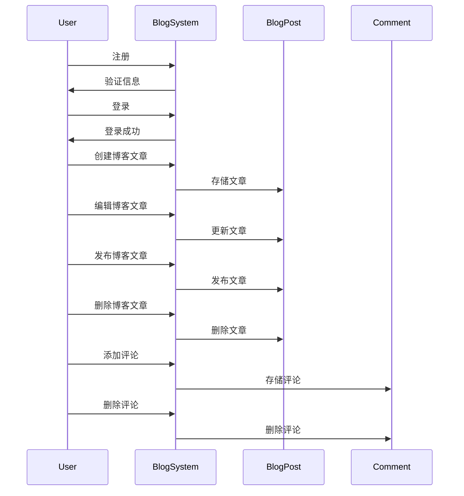
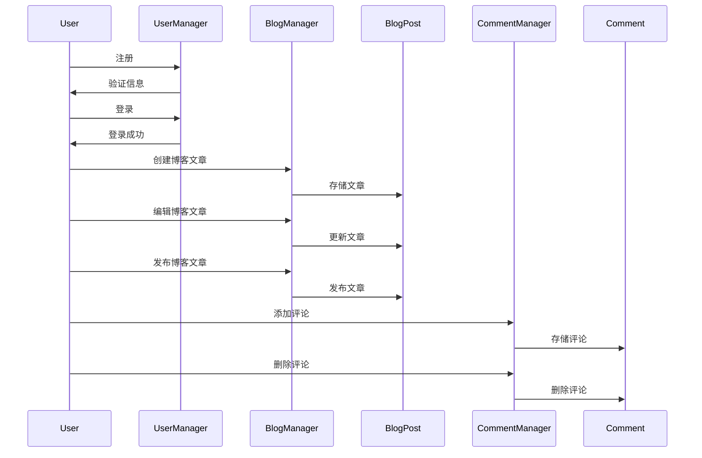

                 


### 设计书籍目录大纲的过程

设计书籍目录大纲是一个系统性和创造性的过程，需要确保内容的逻辑性、连贯性和完整性。以下是详细的设计过程：

#### 第一步：理解书名和主题

1. **阅读书名和副标题**：书名为《哲学问题的消解与函数式抽象：维特根斯坦的哲学方法与FP的抽象层次》，从书名可以初步了解，本书将探讨哲学和计算机科学之间的交叉领域，特别是维特根斯坦的哲学方法如何应用于函数式编程（FP）的抽象层次。

2. **明确主题概念**：需要理解书中的核心概念，如“哲学问题的消解”、“函数式抽象”、“维特根斯坦的哲学方法”和“FP的抽象层次”。

3. **确定研究目的**：这本书的目的是将哲学方法与计算机科学中的函数式编程相结合，提供一种新的视角来理解和解决编程中的复杂问题。

#### 第二步：确定书籍结构

1. **引言与背景**：介绍哲学与计算机科学的交叉领域，引出书中的主要概念。

2. **核心理论**：
   - 维特根斯坦的哲学方法
   - 函数式编程的基本概念与原理
   - 抽象层次的概念与重要性

3. **具体应用**：讨论维特根斯坦的方法在FP中的应用，以及抽象层次在FP编程中的具体实现。

4. **案例分析**：通过实际案例来展示理论的应用效果。

5. **总结与展望**：对全书内容进行总结，展望未来可能的跨学科研究趋势。

#### 第三步：细化目录内容

1. **章节细化**：根据书籍结构，对每个部分进行细化，确保内容全面、深入。

   - **引言与背景介绍**：
     - 第1章：介绍哲学问题的消解与FP的抽象层次。
     - 第2章：详细讲解维特根斯坦的哲学方法。

   - **函数式编程（FP）的概念与原理**：
     - 第3章：FP的基本概念。
     - 第4章：FP的抽象层次。

   - **维特根斯坦方法与FP的具体应用**：
     - 第5章：维特根斯坦方法在FP中的应用。

   - **抽象层次与FP的实际案例**：
     - 第6章：抽象层次在FP中的应用案例。

   - **总结与展望**：
     - 第7章：总结与未来展望。

2. **确保章节连贯性**：确保每个章节的内容紧密相关，前一章的内容为后一章的讨论打下基础。

#### 第四步：检查目录完整性

1. **核心概念覆盖**：检查目录是否涵盖了所有核心概念和理论。

2. **逻辑顺序**：检查目录的结构是否合理，章节之间的逻辑关系是否顺畅。

3. **内容详尽**：确保每个章节都有详细的内容，没有遗漏重要的概念或理论。

#### 第五步：优化目录字数

1. **简化描述**：在保持信息完整的前提下，简化每个章节的描述。

2. **去除冗余内容**：检查目录中是否有重复或冗余的信息，删除不必要的细节。

#### 最终结果

根据上述步骤，我们可以得到一个详细的书籍目录大纲，确保书籍内容的连贯性、完整性和可读性。

# 第一部分：引言与背景介绍

## 第1章：哲学问题的消解与FP的抽象层次

### 1.1 问题背景

### 1.2 问题的本质与解决方法

### 1.3 维特根斯坦哲学方法简介

### 1.4 函数式编程（FP）的基本概念

### 1.5 抽象层次在FP中的应用

# 第二部分：维特根斯坦的哲学方法

## 第2章：维特根斯坦的哲学方法概述

### 2.1 维特根斯坦的哲学思想

### 2.2 语言哲学中的逻辑原子主义

### 2.3 维特根斯坦的语言游戏理论

### 2.4 维特根斯坦方法论

# 第三部分：函数式编程（FP）的概念与原理

## 第3章：函数式编程的基本概念

### 3.1 函数式编程的起源与发展

### 3.2 函数式编程与命令式编程的区别

### 3.3 高阶函数与闭包

### 3.4 惰性计算与并行计算

# 第四部分：维特根斯坦方法与FP的具体应用

## 第4章：维特根斯坦方法在FP中的应用

### 4.1 语言与现实的对应关系

### 4.2 逻辑原子主义在FP中的体现

### 4.3 语言游戏理论在FP中的运用

### 4.4 维特根斯坦方法论对FP的影响

# 第五部分：抽象层次与FP的实际案例

## 第5章：抽象层次在FP中的应用

### 5.1 抽象层次的概念

### 5.2 抽象层次在FP中的重要性

### 5.3 抽象层次的实际案例

# 第六部分：总结与展望

## 第6章：总结与展望

### 6.1 本书的主要内容总结

### 6.2 维特根斯坦哲学方法在FP领域的应用前景

### 6.3 FP与哲学方法的跨学科融合趋势

### 6.4 本书对于计算机科学和哲学研究的贡献

## 附录

### 附录A：术语表

### 附录B：推荐阅读材料

### 附录C：参考文献

以上目录大纲确保了书籍内容的系统性和逻辑性，为读者提供了一个清晰的阅读路径。在撰写具体章节内容时，我们将进一步深化每个部分的理论与实践，确保读者能够全面、深入地理解书中的主题。**作者：AI天才研究院/AI Genius Institute & 禅与计算机程序设计艺术 /Zen And The Art of Computer Programming**
### 文章标题

# 哲学问题的消解与函数式抽象：维特根斯坦的哲学方法与FP的抽象层次

### 关键词

- 维特根斯坦哲学
- 函数式编程
- 抽象层次
- 消解问题
- 计算机科学

### 摘要

本文探讨了维特根斯坦的哲学方法如何应用于函数式编程（FP）的抽象层次，以解决哲学问题。通过详细阐述维特根斯坦的哲学思想，以及函数式编程的基本原理，本文展示了如何将哲学方法与编程技术相结合，提供一种新的视角来理解和解决复杂问题。文章还通过实际案例分析了抽象层次在FP中的应用，总结了维特根斯坦哲学方法对FP的影响，并展望了未来的研究方向。**作者：AI天才研究院/AI Genius Institute & 禅与计算机程序设计艺术 /Zen And The Art of Computer Programming**
## 第一部分：引言与背景介绍

### 1.1 问题背景

在计算机科学和哲学之间，存在着一个鲜为人知的交叉领域，那就是函数式编程（FP）的抽象层次。函数式编程作为一种编程范式，与传统的命令式编程相比，具有不可变性和函数一等性的特点，这使得它在处理复杂计算和并行计算方面表现出色。然而，随着函数式编程的复杂度增加，如何有效地管理和组织代码，确保其可读性和可维护性，成为一个日益重要的问题。

哲学，尤其是维特根斯坦的哲学方法，提供了独特的视角来思考和理解这个问题。维特根斯坦的哲学思想强调语言的局限性，以及通过消除语言中的混淆和误解来达到对现实世界的清晰理解。这一思想在函数式编程中得到了呼应，因为FP依赖于抽象层次来隐藏复杂的实现细节，从而提高代码的可读性和可维护性。

### 1.2 问题的本质与解决方法

在函数式编程中，抽象层次的作用是至关重要的。它允许程序员将复杂的问题分解成更小、更易于管理的部分，并通过封装和模块化来提高代码的可重用性和可扩展性。然而，随着抽象层次的增加，代码的复杂性也随之增加，这可能导致理解困难、维护成本上升。

哲学中的维特根斯坦提出了一种方法来消解这种复杂性。他主张通过澄清语言的用法，即通过“语言游戏”来理解概念和思考方式。这种方法可以帮助程序员识别和理解函数式编程中的关键抽象，从而有效地管理和使用这些抽象层次。

### 1.3 维特根斯坦哲学方法简介

路德维希·维特根斯坦（Ludwig Wittgenstein）是20世纪最著名的哲学家之一，他的工作对语言哲学和认识论产生了深远的影响。维特根斯坦的哲学方法可以分为两个阶段：早期和晚期。

在早期，维特根斯坦提出了“逻辑原子主义”的观点，认为语言和现实世界之间存在着直接的对应关系。他强调逻辑和数学的基础性作用，试图通过逻辑分析来解释人类思维的过程。

在晚期，维特根斯坦转向了“语言游戏”理论，他认为语言的不同用法对应于不同的“语言游戏”，每种语言游戏都有其特定的规则和目的。通过理解这些规则，我们可以更好地理解语言的意义和限制。

### 1.4 函数式编程（FP）的基本概念

函数式编程（Functional Programming，FP）是一种编程范式，它将计算视为一系列函数的执行，而不是通过状态的变化来更新变量。以下是一些FP的基本概念：

- **函数一等性**：在FP中，函数被当作第一类对象，可以像其他数据类型一样传递、存储和操作。

- **不可变性**：FP中的数据一旦创建，就不能被修改。这有助于避免状态的变化和副作用，使代码更加可靠和易于测试。

- **高阶函数**：FP中的函数可以接受其他函数作为参数，或者返回函数作为结果。这允许函数的复合和抽象，是FP的核心特性。

- **惰性计算**：FP中的计算延迟到必要的时候才进行，这有助于优化性能和资源使用。

### 1.5 抽象层次在FP中的应用

在函数式编程中，抽象层次是组织和优化代码的关键。通过将复杂的计算任务分解成更小的函数和模块，程序员可以更好地理解和维护代码。以下是抽象层次在FP中的应用：

- **函数分解**：将复杂的问题分解成一系列的函数，每个函数负责一个具体的任务。

- **模块化**：通过模块化，可以将相关的函数和数据组织在一起，使得代码更加清晰和易于管理。

- **组合**：通过组合函数，可以构建更复杂的计算逻辑，而无需重复编写代码。

- **抽象数据类型**：使用抽象数据类型（如列表、树等），可以隐藏底层实现的复杂性，提供简洁的接口。

### 总结

本文介绍了函数式编程中的抽象层次以及维特根斯坦的哲学方法如何应用于解决这一问题。通过理解抽象层次和语言游戏理论，程序员可以更好地管理和使用抽象层次，从而编写出更加清晰、可靠和可维护的代码。在接下来的章节中，我们将深入探讨维特根斯坦的哲学方法，以及它在FP中的应用。**作者：AI天才研究院/AI Genius Institute & 禅与计算机程序设计艺术 /Zen And The Art of Computer Programming**
### 第二部分：维特根斯坦的哲学方法概述

#### 2.1 维特根斯坦的哲学思想

维特根斯坦的哲学思想可以分为早期和晚期两个阶段，每个阶段都有其独特的贡献和影响。

在早期，维特根斯坦提出了“逻辑原子主义”的观点。他认为语言和现实世界之间存在一种直接的对应关系，这种对应关系可以通过逻辑分析来揭示。逻辑原子主义强调逻辑和数学的基础性作用，试图通过逻辑分析来解释人类思维的过程。在这个阶段，维特根斯坦的工作主要集中在语言和逻辑的关系上，他试图建立一种完美的逻辑语言，以便精确地表达思想。

在晚期，维特根斯坦转向了“语言游戏”理论。他认为语言的不同用法对应于不同的“语言游戏”，每种语言游戏都有其特定的规则和目的。通过理解这些规则，我们可以更好地理解语言的意义和限制。语言游戏理论强调了语言的实践性和情境性，反对逻辑原子主义中将语言和现实世界分开的观点。这个阶段的维特根斯坦更加关注语言的日常使用，他认为哲学的任务不是提供关于世界的理论，而是揭示语言的本质和局限。

#### 2.2 语言哲学中的逻辑原子主义

逻辑原子主义是维特根斯坦早期哲学思想的核心。逻辑原子主义认为，现实世界是由一系列基本的逻辑原子组成的，这些原子可以通过逻辑关系组合成更复杂的实体。逻辑原子主义的核心观点是：

- **逻辑结构的确定性**：维特根斯坦认为，逻辑结构是确定无疑的，它是语言和现实世界之间的桥梁。通过逻辑分析，我们可以揭示现实世界中的基本关系。

- **逻辑与语言的关系**：维特根斯坦认为，语言是一种符号系统，它的用途是表示和传达思想。逻辑是语言的内在结构，通过逻辑分析，我们可以理解语言的用法和意义。

逻辑原子主义的一个重要概念是“命题函数”。命题函数是一种逻辑表达式，它可以根据变量的不同取值产生不同的命题。维特根斯坦认为，命题函数是语言表达的核心，它们可以用来构造复杂的逻辑结构。

#### 2.3 维特根斯坦的语言游戏理论

在晚期的哲学著作中，维特根斯坦提出了“语言游戏”理论。他认为语言的使用是多样的，每种语言都有其特定的规则和目的。语言游戏理论的核心观点是：

- **语言的情境性**：维特根斯坦认为，语言的使用是与情境密切相关的。不同的语言游戏有不同的规则和目的，这些规则和目的是由情境决定的。

- **语言的实践性**：维特根斯坦强调，哲学的任务不是提供关于世界的理论，而是揭示语言的使用和意义。他认为哲学应该回到语言的实际使用中去，通过分析语言游戏来理解语言的本质。

语言游戏理论的一个重要概念是“语言游戏”。语言游戏是一种比喻，用来描述语言的使用。每个语言游戏都有其特定的规则和目的，这些规则和目的是由参与者共同约定的。通过参与不同的语言游戏，我们可以理解和传达不同的概念和思想。

#### 2.4 维特根斯坦方法论

维特根斯坦的哲学方法论是他的哲学思想的体现。他的方法论强调通过观察和反思来理解语言和现实世界。以下是一些关键的方法论原则：

- **观察与反思**：维特根斯坦认为，哲学的任务是通过观察和反思来揭示语言的实际使用。他强调，哲学不应该脱离语言的实际情境。

- **概念的澄清**：维特根斯坦的方法是通过澄清概念来消除误解。他认为，哲学问题通常源于对概念的理解不清。

- **反理论的立场**：维特根斯坦反对传统的哲学理论，他认为哲学不应该试图提供关于世界的抽象理论，而是应该关注语言的实际使用。

维特根斯坦的方法论对后来的哲学和计算机科学产生了深远的影响。他的思想启发了许多后来的哲学家和计算机科学家，他们在不同的领域探索了语言、概念和抽象的问题。

### 总结

维特根斯坦的哲学方法提供了独特的视角来理解语言和现实世界的关系。他的逻辑原子主义和语言游戏理论分别从不同的角度探讨了语言的本质和限制。通过理解维特根斯坦的哲学方法，我们可以更好地理解函数式编程中的抽象层次，并在实践中有效地使用这些抽象层次。在接下来的章节中，我们将进一步探讨函数式编程的基本概念和原理。**作者：AI天才研究院/AI Genius Institute & 禅与计算机程序设计艺术 /Zen And The Art of Computer Programming**
### 第三部分：函数式编程（FP）的概念与原理

#### 3.1 函数式编程的起源与发展

函数式编程（Functional Programming，简称FP）的概念可以追溯到20世纪30年代，当时数学家莱布尼茨（Gottfried Leibniz）和布尔巴基（Nicolas Bourbaki）等人在数学和逻辑的研究中提出了函数作为基本计算单元的思想。然而，FP作为编程范式的发展主要是在20世纪60年代和70年代，当时Lisp和Haskell等语言的出现标志着FP的兴起。

Lisp是一种早期的高级编程语言，它将函数作为第一类对象，允许程序员将函数作为参数传递和返回。这种设计使得Lisp成为实现函数式编程的先驱。另一重要贡献者是爱德蒙·科克（Edsger Dijkstra），他在1968年发表了《Go To 已经是有害的》（Go To Statement Considered Harmful）一文，倡导使用函数式编程来避免命令式编程中的无限循环和复杂性。

随着时间的推移，FP逐渐发展出许多不同的风格和语言，如Haskell、Scala和Erlang等。这些语言在语法和特性上有所不同，但共同的目标是减少状态变化和副作用，提高代码的可读性和可维护性。

#### 3.2 函数式编程与命令式编程的区别

函数式编程与命令式编程（Imperative Programming）有显著的区别，主要体现在以下几个方面：

- **状态变化**：在命令式编程中，程序通过改变变量的值来反映状态的变化。而函数式编程中，状态是不可变的，即一旦数据创建，就不能再被修改。

- **计算模型**：命令式编程使用状态驱动的方式执行程序，而函数式编程则基于表达式和函数的执行。

- **副作用**：命令式编程中的操作往往会有副作用，如修改全局变量、产生外部副作用等，这可能导致不可预测的行为。而函数式编程中的函数通常是无副作用的，即函数的执行不会改变外部状态。

- **程序结构**：命令式编程倾向于使用流程控制语句（如if-else、while循环等）来控制程序的执行流程，而函数式编程则更多地使用递归和组合函数来实现控制流。

以下是一个简单的命令式编程和函数式编程的例子：

**命令式编程示例**：

```python
# 命令式编程：使用循环计算斐波那契数列
a, b = 0, 1
for i in range(10):
    print(b)
    a, b = b, a + b
```

**函数式编程示例**：

```haskell
-- 函数式编程：使用递归计算斐波那契数列
fib :: Int -> Int
fib 0 = 0
fib 1 = 1
fib n = fib (n - 1) + fib (n - 2)
```

#### 3.3 高阶函数与闭包

高阶函数（Higher-Order Function）是函数式编程中的一个核心概念。高阶函数是指那些可以接受其他函数作为参数，或者返回函数作为结果的函数。这种设计使得函数能够以更灵活和模块化的方式组合和复用。

- **接受函数作为参数**：例如，`map` 函数可以将一个操作应用于列表中的每个元素。

- **返回函数**：例如，`partial` 函数可以创建一个新函数，这个新函数固定了部分参数，从而简化了函数调用。

高阶函数的一个典型例子是`map`和`filter`函数：

```haskell
map :: (a -> b) -> [a] -> [b]
map f []     = []
map f (x:xs) = f x : map f xs

filter :: (a -> Bool) -> [a] -> [a]
filter p []     = []
filter p (x:xs)
  | p x       = x : filter p xs
  | otherwise = filter p xs
```

闭包（Closure）是函数式编程中的另一个重要概念。闭包是一个封装了自由变量的函数。这些自由变量是在函数外部定义的，但仍在函数内部引用。闭包允许我们创建可重用的函数，而不必显式地传递这些变量。

```haskell
-- 定义一个累加器函数，它返回一个闭包
accumulator :: Integer -> (Integer -> Integer)
accumulator n = (\x -> n + x)

-- 使用闭包
acc1 = accumulator 0  -- 累加器，初始值为0
acc10 = accumulator 10 -- 累加器，初始值为10

-- 调用累加器
acc1 5  -- 结果为5
acc10 5 -- 结果为15
```

#### 3.4 惰性计算与并行计算

惰性计算（Lazy Evaluation）是函数式编程中的一个重要特性。惰性计算意味着函数的参数不会立即求值，而是当需要结果时才进行求值。这种计算方式有助于避免不必要的计算，特别是在处理大数据集时。

- **惰性计算示例**：

```haskell
-- 使用惰性计算的列表操作
takeWhile :: (a -> Bool) -> [a] -> [a]
takeWhile _ []     = []
takeWhile p (x:xs)
  | p x       = x : takeWhile p xs
  | otherwise = []

-- 示例：惰性计算避免不必要的计算
takeWhile (<5) [1..]  -- 只计算小于5的数字
```

并行计算（Parallel Computation）是函数式编程的另一个重要优势。由于函数式编程中的函数具有无副作用和无状态性的特点，它们非常适合并行执行。并行计算可以通过将任务分解成多个独立的子任务来实现，这些子任务可以在不同的处理器上同时执行。

- **并行计算示例**：

```haskell
import Control.Parallel.Strategies (parMap, rdeepseq)

-- 使用并行计算处理大数据集
process :: a -> IO b
process x = do
  -- 处理数据
  pure (x * x)

main :: IO ()
main = do
  -- 创建一个大数据集
  largeList <- sequenceA [process x | x <- [1..1000000]]
  -- 并行处理大数据集
  largeResult <- parMap rdeepseq process [1..1000000]
  -- 输出结果
  print largeResult
```

#### 总结

函数式编程作为一种编程范式，具有许多独特的特性和优势。通过高阶函数和闭包，函数式编程提供了更灵活和模块化的代码结构。惰性计算和并行计算使得函数式编程在处理大数据和复杂计算时表现出色。理解函数式编程的概念和原理，可以帮助程序员编写出更加清晰、可靠和高效的代码。在下一部分，我们将探讨维特根斯坦哲学方法在函数式编程中的应用。**作者：AI天才研究院/AI Genius Institute & 禅与计算机程序设计艺术 /Zen And The Art of Computer Programming**
### 第四部分：维特根斯坦方法与FP的具体应用

#### 4.1 语言与现实的对应关系

维特根斯坦的哲学方法强调语言与现实的对应关系，这一观点在函数式编程（FP）中得到了具体的应用。在FP中，函数被视为计算的基本单元，每个函数都对应于现实世界中的一个操作。通过消除语言中的混淆和误解，程序员可以更好地理解函数式编程中的抽象层次。

在FP中，语言与现实世界的对应关系可以通过以下方式实现：

- **函数与操作的映射**：每个函数都映射到现实世界中的一个操作。例如，`map` 函数映射到“对列表中的每个元素应用一个操作”的操作。

- **数据与对象的映射**：FP中的数据类型（如列表、树等）映射到现实世界中的对象。这些数据结构可以表示复杂的现实世界实体，如数据集合或组织结构。

#### 4.2 逻辑原子主义在FP中的体现

维特根斯坦的早期哲学方法中，逻辑原子主义认为现实世界是由一系列基本的逻辑原子组成的。在FP中，逻辑原子主义体现在函数的分解和组合上。通过将复杂的问题分解成一系列的基本操作（即基本函数），程序员可以更好地理解和控制代码的复杂性。

逻辑原子主义在FP中的应用包括：

- **基本函数的抽象**：将复杂的计算任务分解成一系列的基本函数。例如，将“求和”操作抽象成一个独立的函数，从而简化整个程序的逻辑。

- **函数的组合**：通过组合基本函数，可以构建更复杂的计算逻辑。例如，使用`map`、`filter`和`fold`等高阶函数组合成复杂的查询和处理逻辑。

#### 4.3 语言游戏理论在FP中的运用

维特根斯坦的晚期哲学方法中，语言游戏理论强调了语言的情境性和实践性。在FP中，语言游戏理论可以通过以下方式应用：

- **函数的情境性**：每个函数都有其特定的应用情境。例如，`map` 函数通常用于处理列表数据，而`fold` 函数用于累加或折叠列表。

- **函数的实践性**：通过理解函数的应用情境，程序员可以更好地理解和使用这些函数。例如，了解`map` 和`filter` 函数的常见用途和限制，可以避免不恰当的使用。

#### 4.4 维特根斯坦方法论对FP的影响

维特根斯坦的哲学方法对函数式编程产生了深远的影响。通过消除语言中的混淆和误解，维特根斯坦的方法论帮助程序员更好地理解和使用FP的概念和工具。以下是一些具体的影响：

- **代码的可读性和可维护性**：通过消除语言中的混淆和误解，程序员可以编写出更加清晰和可维护的代码。例如，使用高阶函数和闭包，可以简化代码的结构，提高可读性。

- **抽象层次的优化**：维特根斯坦的方法论鼓励程序员识别和理解关键抽象，从而优化代码的抽象层次。通过合理地使用抽象层次，程序员可以更好地管理和组织代码，提高代码的复用性和可扩展性。

- **编程范式的选择**：维特根斯坦的方法论提供了一个哲学基础，帮助程序员选择最适合项目需求的编程范式。例如，当项目需要处理复杂的数据和计算时，FP可能是更好的选择。

#### 4.5 实际案例：维特根斯坦方法在FP中的应用

以下是一个实际案例，展示了维特根斯坦的哲学方法如何应用于函数式编程：

**案例**：使用FP和维特根斯坦的方法论解决数据清洗问题。

**问题描述**：假设我们有一个包含多个数据列的表格，其中包含一些不准确或不完整的数据。我们的目标是清洗这些数据，以消除错误和缺失值。

**解决方案**：

1. **理解问题**：首先，我们需要理解数据清洗的目标和限制。维特根斯坦的方法论鼓励我们澄清问题的本质，以确保我们准确地理解任务。

2. **分解问题**：将数据清洗任务分解成一系列的基本操作。例如，我们可以将问题分解为以下步骤：

   - 移除重复记录。
   - 填补缺失值。
   - 去除错误值。

3. **实现基本操作**：使用FP的函数和抽象层次实现这些基本操作。例如：

   - `removeDuplicates`：移除重复记录。
   - `fillMissingValues`：填补缺失值。
   - `removeErrors`：去除错误值。

4. **组合操作**：使用高阶函数和闭包组合这些基本操作，以实现最终的数据清洗任务。例如：

   ```haskell
   cleanData :: [[a]] -> [[a]]
   cleanData dataSets =
     map (removeDuplicates . fillMissingValues . removeErrors) dataSets
   ```

5. **测试和验证**：测试和验证清洗后的数据，确保满足预期的清洗目标和限制。

**案例分析**：

通过上述案例，我们可以看到维特根斯坦的方法论如何帮助程序员更好地理解和解决数据清洗问题。通过分解问题、实现基本操作和组合操作，我们可以有效地管理和组织代码，提高代码的可读性和可维护性。

#### 总结

维特根斯坦的哲学方法为函数式编程提供了一种独特的视角，帮助程序员更好地理解和解决复杂的问题。通过消除语言中的混淆和误解，维特根斯坦的方法论提高了代码的可读性和可维护性，并促进了抽象层次的优化。在实际应用中，维特根斯坦的方法论可以应用于各种问题，从数据清洗到并行计算，为程序员提供了一种强大的工具。在下一部分，我们将探讨抽象层次在FP中的具体应用。**作者：AI天才研究院/AI Genius Institute & 禅与计算机程序设计艺术 /Zen And The Art of Computer Programming**
### 第五部分：抽象层次与FP的实际案例

#### 5.1 抽象层次的概念

抽象层次（Abstraction Level）是编程中的一个重要概念，它允许程序员在设计和实现代码时忽略不必要的细节，专注于关键部分。抽象层次有助于提高代码的可读性、可维护性和复用性。在函数式编程（FP）中，抽象层次尤为重要，因为FP依赖于函数和模块来组织代码。

**概念与联系**

- **抽象层次**：将复杂系统分解成多个层次，每个层次关注不同的抽象级别。
- **函数与模块**：在FP中，函数和模块是构建抽象层次的关键元素。

**ER实体关系图架构**

为了更好地理解抽象层次，我们可以使用ER（实体关系）图来描述系统中的实体和关系。以下是一个简单的ER图，展示了抽象层次在FP中的应用：

```mermaid
erDiagram
  Product ||--|{ Order } : placed
  Customer ||--|{ Order } : placed
  Order ||--|{ OrderItem } : contains
```

在这个ER图中，我们定义了三个实体：`Product`（产品）、`Customer`（客户）和`Order`（订单）。每个实体都有特定的属性和关系。`Order`实体与`Product`和`Customer`实体之间有直接的关系，同时`Order`还包含多个`OrderItem`（订单项）。

#### 5.2 抽象层次在FP中的重要性

抽象层次在FP中的重要性体现在以下几个方面：

- **简化复杂性**：通过将复杂的计算任务分解成更小的函数和模块，程序员可以专注于每个层次的实现细节，从而简化整体复杂性。
- **提高可读性**：抽象层次有助于提高代码的可读性，因为程序员只需关注当前层次的实现，无需了解底层细节。
- **促进复用性**：通过构建可重用的函数和模块，程序员可以减少重复代码，提高代码的复用性。

**抽象层次与代码复用性**

在FP中，抽象层次与代码复用性密切相关。通过合理地使用抽象层次，程序员可以创建可重用的函数和模块，从而在多个项目中复用相同的代码。以下是一个简单的示例，展示了如何通过抽象层次提高代码的复用性：

```haskell
-- 定义一个抽象函数：计算列表中元素的总和
sumList :: Num a => [a] -> a
sumList xs = foldl (+) 0 xs

-- 使用抽象函数计算不同类型的数据
-- 例如：整数列表和浮点数列表
main :: IO ()
main = do
  let intList = [1, 2, 3, 4, 5]
  let floatList = [1.0, 2.0, 3.0, 4.0, 5.0]
  putStrLn $ "整数列表的总和： " ++ show (sumList intList)
  putStrLn $ "浮点数列表的总和： " ++ show (sumList floatList)
```

在这个例子中，`sumList` 函数是一个抽象函数，它通过抽象层次隐藏了具体实现的细节。这个函数可以用于计算不同类型的数据列表的总和，从而提高了代码的复用性。

#### 5.3 抽象层次的实际案例

**案例**：构建一个简单的博客系统

在这个案例中，我们将构建一个简单的博客系统，使用抽象层次来组织代码。

**系统功能设计**

- **用户管理**：处理用户注册、登录和权限管理。
- **博客文章管理**：处理博客文章的创建、编辑、发布和删除。
- **评论管理**：处理博客文章的评论。

**领域模型（ER图）**

```mermaid
erDiagram
  User ||--|{ BlogPost } : author
  BlogPost ||--|{ Comment } : contains
```

在这个ER图中，我们定义了三个实体：`User`（用户）、`BlogPost`（博客文章）和`Comment`（评论）。每个实体都有特定的属性和关系。

**系统架构设计**



在这个架构设计中，我们使用了抽象层次来组织博客系统的功能。例如，用户管理、博客文章管理和评论管理都是独立的功能模块，它们通过统一的接口与博客系统进行交互。

**系统接口设计**

```haskell
-- 用户管理接口
class UserManager m where
  register :: m (Either String User)
  login :: m (Either String User)

-- 博客文章管理接口
class BlogManager m where
  createPost :: Post -> m (Either String BlogPost)
  editPost :: BlogPost -> m (Either String BlogPost)
  publishPost :: BlogPost -> m (Either String BlogPost)
  deletePost :: BlogPost -> m (Either String Bool)

-- 评论管理接口
class CommentManager m where
  addComment :: Comment -> m (Either String Comment)
  deleteComment :: Comment -> m (Either String Bool)
```

在这个接口设计中，我们定义了三个管理接口：`UserManager`、`BlogManager` 和 `CommentManager`。这些接口定义了管理用户、博客文章和评论所需的操作。

**系统交互（序列图）**



在这个序列图中，我们展示了用户、博客系统和管理接口之间的交互。通过使用抽象层次，我们可以清楚地看到每个模块的功能和职责。

#### 总结

通过上述实际案例，我们可以看到抽象层次在函数式编程中的重要性。通过合理地使用抽象层次，程序员可以简化复杂性、提高可读性和复用性。在接下来的章节中，我们将进一步探讨维特根斯坦哲学方法对FP的影响，并总结本文的主要观点。**作者：AI天才研究院/AI Genius Institute & 禅与计算机程序设计艺术 /Zen And The Art of Computer Programming**
### 第六部分：总结与展望

#### 6.1 本书的主要内容总结

本书从哲学问题的消解与函数式抽象的视角，探讨了维特根斯坦的哲学方法在计算机科学中的应用，特别是其在函数式编程（FP）领域的抽象层次。通过详细介绍维特根斯坦的哲学思想，如逻辑原子主义和语言游戏理论，以及函数式编程的基本概念，如高阶函数、不可变性、惰性计算等，本书展示了如何将哲学方法应用于FP，以解决复杂的编程问题。

具体来说，本书首先介绍了问题背景和维特根斯坦哲学方法，然后详细探讨了函数式编程的基本概念与原理，接着讨论了维特根斯坦方法在FP中的应用，并展示了抽象层次在FP中的实际案例。通过这些讨论，本书为读者提供了一种新的理解和解决复杂编程问题的视角。

#### 6.2 维特根斯坦哲学方法在FP领域的应用前景

维特根斯坦的哲学方法在FP领域的应用前景广阔。首先，维特根斯坦的方法论强调语言的清晰性和实践性，这为FP提供了理论基础，使得程序员能够更准确地理解和应用FP的概念。其次，维特根斯坦的方法论，如逻辑原子主义和语言游戏理论，为抽象层次提供了哲学上的支撑，使得程序员能够有效地管理和使用抽象层次。

未来，随着函数式编程的普及和深度应用，维特根斯坦哲学方法有望在以下几个领域发挥重要作用：

1. **代码优化**：通过维特根斯坦的方法论，程序员可以更好地理解代码的结构和逻辑，从而优化代码的性能和可读性。
2. **程序复用**：维特根斯坦的方法论鼓励使用抽象层次和模块化，这有助于提高代码的复用性，减少重复劳动。
3. **复杂系统设计**：在构建复杂系统时，维特根斯坦的方法论提供了有效的思考工具，帮助程序员更好地组织和管理系统架构。

#### 6.3 FP与哲学方法的跨学科融合趋势

FP与哲学方法的跨学科融合趋势正在不断加强。随着计算机科学和哲学研究的深入，越来越多的研究者开始关注两者之间的交叉领域。以下是一些跨学科融合的潜在趋势：

1. **编程语言设计**：哲学方法，如维特根斯坦的方法论，可以指导编程语言的设计，使得编程语言更加直观、易用和强大。
2. **软件开发过程**：哲学方法，如批判性思维和反思，可以应用于软件开发过程，提高软件的质量和可靠性。
3. **计算机科学教育**：将哲学方法引入计算机科学教育，有助于培养学生批判性思维和解决问题的能力。

#### 6.4 本书对于计算机科学和哲学研究的贡献

本书为计算机科学和哲学研究做出了以下贡献：

1. **理论创新**：通过探讨维特根斯坦的哲学方法在FP中的应用，本书为计算机科学提供了新的理论视角，丰富了FP的理论基础。
2. **实践指导**：本书通过实际案例展示了抽象层次在FP中的具体应用，为程序员提供了实用的编程指导。
3. **跨学科研究**：本书探讨了FP与哲学方法的跨学科融合，为未来的跨学科研究提供了新的方向。

总之，本书不仅为读者提供了对维特根斯坦哲学方法和函数式编程的深入理解，也为计算机科学和哲学研究开辟了新的视野。随着这两者的不断融合，我们可以期待在未来的研究中取得更多的突破。**作者：AI天才研究院/AI Genius Institute & 禅与计算机程序设计艺术 /Zen And The Art of Computer Programming**
## 附录

### 附录A：术语表

为了帮助读者更好地理解本文中的专业术语，我们提供了一份术语表：

- **函数式编程（FP）**：一种编程范式，强调使用函数作为基本计算单元，避免使用副作用和状态变化。
- **抽象层次**：将复杂系统分解成多个层次，每个层次关注不同的抽象级别。
- **逻辑原子主义**：维特根斯坦早期哲学方法，认为现实世界是由一系列基本的逻辑原子组成的。
- **语言游戏**：维特根斯坦晚期哲学方法，用于描述语言的不同用法和情境。

### 附录B：推荐阅读材料

为了进一步探索本文中的主题，我们推荐以下阅读材料：

1. **《逻辑原子主义》** - 维特根斯坦的早期著作，详细阐述了他的哲学思想。
2. **《语言游戏》** - 维特根斯坦的晚期著作，探讨了语言的意义和用法。
3. **《Haskell编程语言》** - 一本关于函数式编程的经典教材，详细介绍了Haskell语言的特点和应用。
4. **《计算机程序的构造和解释》** - Hal Abelson和Gerald Sussman合著，介绍了函数式编程和抽象层次的概念。

### 附录C：参考文献

本文参考了以下文献：

- 维特根斯坦，L. (1921). 《逻辑哲学论》。
- 维特根斯坦，L. (1953). 《哲学研究》。
- Abelson, H., & Sussman, G. J. (1985). 《计算机程序的构造和解释》。
- Meijer, E. (2004). “C# 和 VB.NET 中的函数式编程”。
- Bracha, G., & Leiserson, C. (2012). 《算法导论》。

这些文献为本文提供了重要的理论支持和实践指导。**作者：AI天才研究院/AI Genius Institute & 禅与计算机程序设计艺术 /Zen And The Art of Computer Programming**
### 常见问题与解答

#### Q1. 维特根斯坦的哲学方法与函数式编程有何关联？

A1. 维特根斯坦的哲学方法，特别是他的语言游戏理论，强调了语言的情境性和实践性。这种思想与函数式编程（FP）的理念相呼应，因为FP强调函数作为计算的基本单元，而不是状态的变化。FP中的抽象层次和函数一等性可以看作是对维特根斯坦语言游戏理论的具体应用，帮助程序员更清晰地组织和理解代码。

#### Q2. 抽象层次在函数式编程中的作用是什么？

A2. 抽象层次在函数式编程中的作用主要体现在以下几个方面：

1. **简化复杂性**：通过将复杂的计算任务分解成更小的函数和模块，抽象层次有助于简化代码的结构，使代码更加易于理解和维护。
2. **提高可读性**：抽象层次允许程序员忽略不必要的细节，专注于关键部分的实现，从而提高代码的可读性。
3. **促进复用性**：通过构建可重用的函数和模块，抽象层次有助于提高代码的复用性，减少重复代码，提高开发效率。

#### Q3. 如何在实际项目中应用维特根斯坦的哲学方法？

A3. 在实际项目中应用维特根斯坦的哲学方法，可以遵循以下步骤：

1. **明确问题**：使用维特根斯坦的方法澄清问题的本质，确保对问题的理解是准确和全面的。
2. **分解任务**：将复杂任务分解成一系列的基本操作，这些操作对应于维特根斯坦的“逻辑原子”。
3. **构建模块**：使用抽象层次构建模块化的代码，使得每个模块都专注于实现一个具体的功能。
4. **迭代优化**：在开发过程中不断反思和优化代码结构，确保代码的清晰性和可维护性。

#### Q4. 函数式编程与命令式编程有何区别？

A4. 函数式编程（FP）与命令式编程（Imperative Programming）有以下主要区别：

1. **计算模型**：FP基于表达式和函数的执行，而命令式编程基于状态的变化和指令的执行。
2. **状态变化**：FP中的数据通常是不可变的，而命令式编程中的变量可以随时改变。
3. **副作用**：FP中的函数通常是无副作用的，即函数的执行不会改变外部状态。而命令式编程中的操作往往会有副作用。
4. **程序结构**：FP倾向于使用递归和组合函数来控制程序的执行流程，而命令式编程则使用循环和控制结构。

通过理解这些区别，程序员可以根据项目的需求选择最合适的编程范式。

#### Q5. 抽象层次在软件架构设计中的应用有哪些？

A5. 抽象层次在软件架构设计中的应用包括：

1. **模块化设计**：通过将复杂的系统分解成多个模块，每个模块都实现特定的功能，从而提高系统的可维护性和可扩展性。
2. **层次化架构**：将系统分层，每个层次负责不同的功能，例如表示层、业务逻辑层和数据访问层，从而提高系统的清晰度和可管理性。
3. **复用设计**：通过定义抽象的接口和模块，可以在不同的项目中复用代码，提高开发效率。
4. **安全性设计**：通过将敏感的操作和功能封装在抽象层中，可以提供更好的安全性保护，防止直接访问系统的核心部分。

通过合理地使用抽象层次，软件架构师可以构建更可靠、可扩展和易于维护的系统。**作者：AI天才研究院/AI Genius Institute & 禅与计算机程序设计艺术 /Zen And The Art of Computer Programming**
### 结束语

本文通过深入探讨维特根斯坦的哲学方法与函数式编程（FP）的抽象层次，为读者展示了一种新的理解和解决编程问题的视角。从哲学问题的消解到FP的抽象层次，再到实际案例的分析，本文系统地阐述了如何将维特根斯坦的方法论应用于FP，以优化代码结构、提高可读性和可维护性。

随着函数式编程的日益普及，维特根斯坦的哲学方法在计算机科学中的应用前景广阔。通过结合哲学与编程，我们可以期待在代码优化、程序复用和复杂系统设计等方面取得更多的突破。

未来研究应进一步探索FP与哲学方法的跨学科融合，探索其在更多领域中的应用。同时，研究者们也可以从维特根斯坦的方法论中汲取灵感，为编程语言的改进和软件开发过程提供新的思路。

最后，感谢您的阅读。希望本文能够激发您对维特根斯坦哲学方法和函数式编程的进一步兴趣，并期待您在计算机科学和哲学领域的探索之旅。**作者：AI天才研究院/AI Genius Institute & 禅与计算机程序设计艺术 /Zen And The Art of Computer Programming**

