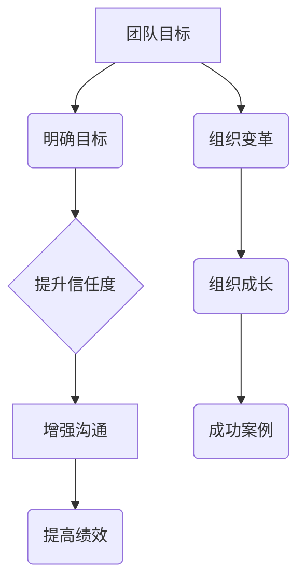

                 

### 《团队凝聚力：超越工作的情谊建立》

关键词：团队凝聚力、团队绩效、组织变革、团队归属感、领导风格

摘要：本文深入探讨团队凝聚力的重要性及其对企业发展的影响，通过理论分析、实践策略和成功案例，全面解析团队凝聚力构建的方法与技巧。文章旨在为管理者提供实用的指导，帮助团队实现超越工作的情谊建立，提升整体绩效。

----------------------------------------------------------------

#### 引言

在信息技术飞速发展的今天，企业对团队的依赖性日益增强。团队凝聚力作为团队效能的关键因素，不仅关系到团队成员的个人成长，也直接影响到企业的核心竞争力。团队凝聚力指的是团队成员之间的相互吸引、协同合作以及共同追求团队目标的心理现象。本文将围绕团队凝聚力的重要性、构建方法和实践策略进行深入探讨。

#### 第一部分：团队凝聚力概述

##### 1.1 团队凝聚力的重要性

什么是团队凝聚力？

团队凝聚力是指团队成员之间相互吸引、协同合作以及共同追求团队目标的心理现象。它包括心理上的相容性、情感上的联系以及行为上的协调一致。一个具有高凝聚力的团队能够更好地应对外部挑战，实现团队目标。

团队凝聚力对企业的影响

1. 提升团队绩效：高凝聚力的团队能够更有效地分工合作，减少内耗，提高工作效率。
2. 增强员工满意度：团队成员之间的良好关系可以提高员工的归属感和满意度，降低流失率。
3. 促进创新：团队凝聚力有助于团队成员之间的知识共享和思维碰撞，激发创新潜能。
4. 应对变革：高凝聚力的团队能够更好地适应组织变革，保持稳定的发展态势。

##### 1.2 团队凝聚力理论

传统团队凝聚力理论

传统团队凝聚力理论主要关注团队内部成员的相互吸引和情感联系。代表性的理论包括：

1. 社会交换理论：认为团队凝聚力源于团队成员之间的相互交换，包括物质和非物质回报。
2. 社会认同理论：强调团队成员对团队认同感和归属感的重要性。

现代团队凝聚力理论

现代团队凝聚力理论更加注重团队绩效、团队文化和领导风格等因素。代表性的理论包括：

1. 社会认同与绩效理论：认为团队凝聚力与团队绩效之间存在着正相关关系。
2. 团队效能理论：强调团队凝聚力对团队效能的影响，包括团队目标实现、创新和适应能力等方面。

##### 1.3 团队凝聚力衡量

团队凝聚力评估工具

为了衡量团队凝聚力，可以采用以下评估工具：

1. 团队凝聚力问卷：通过问卷调查了解团队成员对团队凝聚力的主观感受。
2. 团队绩效评估：通过团队绩效指标了解团队凝聚力对企业绩效的影响。
3. 团队行为观察：通过观察团队成员在团队活动中的表现来评估团队凝聚力。

团队凝聚力评估案例分析

以下是一个团队凝聚力评估的案例分析：

某公司为了了解团队凝聚力状况，采用团队凝聚力问卷对全体员工进行了调查。调查结果显示，团队凝聚力总体处于中等水平，但在某些方面存在不足，如团队成员之间的沟通不畅和信任度较低。针对这些问题，公司采取了一系列措施，包括加强团队培训、改善沟通机制和增加团队活动等。经过一段时间的实施，团队凝聚力显著提升，员工满意度和工作效率也有所提高。

#### 第二部分：团队凝聚力构建

##### 2.1 构建团队凝聚力的关键要素

明确团队目标

团队目标的明确性是构建团队凝聚力的重要前提。一个清晰的团队目标可以激发团队成员的积极性和归属感，促进团队协作。

提升团队成员的信任度

信任是团队凝聚力的基石。团队成员之间的信任度越高，团队凝聚力越强。为了提升信任度，可以采取以下措施：

1. 公开透明：确保团队成员了解团队的进展和决策过程，增加透明度。
2. 互相支持：鼓励团队成员在困难和挑战面前互相帮助，共同成长。
3. 坦诚沟通：建立开放、坦诚的沟通环境，鼓励团队成员表达意见和反馈。

增强团队沟通

良好的沟通是团队凝聚力的重要保障。为了增强团队沟通，可以采取以下措施：

1. 定期会议：定期组织团队会议，讨论团队目标和进展，解决问题。
2. 多渠道沟通：利用邮件、即时通讯工具等多种沟通渠道，确保信息畅通。
3. 非正式沟通：鼓励团队成员在非正式场合交流，增进了解和信任。

##### 2.2 培养团队归属感

建立共同价值观

共同价值观是团队成员之间的精神纽带。为了建立共同价值观，可以采取以下措施：

1. 明确企业使命和愿景：让团队成员了解企业的使命和愿景，形成共同的目标。
2. 内部宣传：通过内部刊物、培训课程等方式传播企业价值观。
3. 奖励制度：将企业价值观融入员工奖励制度，激励员工践行共同价值观。

通过活动和团队建设提升归属感

团队活动和团队建设活动是培养团队归属感的重要手段。以下是一些有效的团队建设活动：

1. 户外拓展活动：通过团队合作游戏、户外探险等活动，增强团队成员之间的信任和协作。
2. 内部培训：组织专业培训，提高团队成员的技能和知识水平，增强团队凝聚力。
3. 节日活动：在重要节日举办庆祝活动，增进团队成员之间的情感交流。

##### 2.3 团队领导在团队凝聚力中的角色

领导风格与团队凝聚力

不同的领导风格对团队凝聚力有着重要影响。以下是一些常见的领导风格及其对团队凝聚力的影响：

1. 民主型领导：鼓励团队成员参与决策，增强团队凝聚力和成员满意度。
2. 专制型领导：决策权集中在领导手中，可能导致团队成员积极性不高，团队凝聚力较低。
3. 放任型领导：团队成员自主决策，但缺乏统一目标，可能导致团队凝聚力不足。

领导行为对团队凝聚力的影响

领导行为对团队凝聚力有着重要影响。以下是一些有效的领导行为：

1. 身体力行：领导应以身作则，树立榜样，提高团队成员的信任度。
2. 沟通与反馈：领导应与团队成员保持良好沟通，及时给予反馈，增强团队凝聚力。
3. 公平公正：领导应公平公正地处理团队成员的问题，维护团队和谐。

#### 第三部分：团队凝聚力与工作环境

##### 3.1 团队凝聚力与工作环境

营造积极的工作氛围

积极的工作氛围有助于提升团队凝聚力。以下是一些营造积极工作氛围的措施：

1. 激励与认可：及时对团队成员的成果进行激励和认可，提高团队士气。
2. 舒适的工作环境：提供舒适、安全的工作环境，增强员工的工作满意度。
3. 团队文化：建立积极向上的团队文化，鼓励团队成员相互支持和鼓励。

避免团队冲突

团队冲突是影响团队凝聚力的重要因素。以下是一些避免团队冲突的措施：

1. 沟通与协商：鼓励团队成员进行有效沟通，通过协商解决问题。
2. 建立冲突解决机制：建立冲突解决机制，确保团队成员在遇到问题时能够得到及时处理。
3. 培训与教育：通过培训和教育，提高团队成员的沟通能力和协作意识。

工作环境对团队凝聚力的影响

工作环境对团队凝聚力有着重要影响。以下是一些工作环境对团队凝聚力的影响因素：

1. 组织结构：合理的组织结构有助于团队协作，提高团队凝聚力。
2. 工作流程：高效的工作流程可以减少团队成员的摩擦，增强团队凝聚力。
3. 资源配置：合理的资源配置可以满足团队的需求，提高团队凝聚力。

##### 3.2 团队凝聚力与组织发展

团队凝聚力对组织变革的影响

团队凝聚力对组织变革具有重要影响。以下是一些团队凝聚力对组织变革的影响因素：

1. 支持与阻力：高凝聚力的团队能够更好地支持组织变革，降低变革阻力。
2. 知识共享：团队凝聚力有助于团队成员之间的知识共享，提高组织变革的适应性。
3. 团队领导：团队领导在组织变革中扮演关键角色，其领导风格和行为对团队凝聚力有着重要影响。

团队凝聚力在组织成长中的作用

团队凝聚力在组织成长中发挥着重要作用。以下是一些团队凝聚力在组织成长中的作用：

1. 创新能力：团队凝聚力有助于团队成员之间的知识共享和思维碰撞，提高创新能力。
2. 持续改进：团队凝聚力有助于团队成员持续改进工作流程，提高组织效率。
3. 企业文化建设：团队凝聚力有助于建立积极向上的企业文化，推动组织成长。

#### 第四部分：案例分析与实践

##### 4.1 团队凝聚力成功案例

国内外团队凝聚力成功案例分析

以下是一个国内外团队凝聚力成功案例分析：

某跨国公司为了提升团队凝聚力，推行了“全球团队日”活动。通过在线交流和团队游戏，团队成员在全球范围内进行互动，增进了彼此的了解和信任。活动结束后，团队成员的工作效率显著提高，团队凝聚力得到了显著提升。国内某互联网公司也通过定期举办团队建设活动，如户外拓展、团队聚餐等，增强了团队成员之间的情感联系，提高了团队凝聚力。

##### 4.2 团队凝聚力实践策略

团队凝聚力建设策略

为了提升团队凝聚力，可以采取以下策略：

1. 设定明确的目标：确保团队成员明确团队目标，形成共同的方向。
2. 加强团队沟通：建立有效的沟通机制，确保信息畅通，减少误解和冲突。
3. 培养团队归属感：通过共同价值观和团队活动，增强团队成员之间的情感联系。

团队凝聚力维持与提升策略

为了维持和提升团队凝聚力，可以采取以下策略：

1. 定期评估团队凝聚力：通过问卷调查、绩效评估等方式，了解团队凝聚力状况，及时调整策略。
2. 持续培训与教育：提高团队成员的沟通能力和协作意识，增强团队凝聚力。
3. 营造积极的工作环境：通过激励与认可、舒适的工作环境等措施，提升团队凝聚力。

#### 第五部分：附录

##### 5.1 团队凝聚力相关工具与方法

团队凝聚力评估工具

以下是一些常用的团队凝聚力评估工具：

1. 团队凝聚力问卷
2. 团队绩效评估表
3. 团队行为观察记录表

团队建设活动指南

以下是一些团队建设活动的指南：

1. 户外拓展活动：选择合适的户外拓展项目，确保活动安全、有趣。
2. 内部培训：根据团队需求，选择合适的培训课程，提高团队成员的技能水平。
3. 节日活动：组织庆祝活动，增进团队成员之间的情感交流。

#### 结论

团队凝聚力是企业成功的关键因素之一。通过本文的探讨，我们可以看到，团队凝聚力不仅关系到团队绩效，还影响着企业的创新能力和适应能力。为了构建高凝聚力的团队，企业需要关注团队目标的明确性、团队成员的信任度、沟通的有效性以及团队归属感的培养。在实践中，企业可以通过有效的团队凝聚力建设策略，提升团队整体绩效，实现可持续发展。

#### 脚注

[Mermaid 流程图](#) 和 [Python 代码示例](#) 将嵌入到相应的章节中。

#### 核心概念与联系

使用 Mermaid 流程图展示团队凝聚力核心概念之间的关系：



#### 数学模型和公式

团队凝聚力与团队绩效之间的关系可以用以下公式表示：

$$
绩效 = f(凝聚力, 沟通, 信任度)
$$

#### 项目实战

本书将通过多个案例和实践策略来展示团队凝聚力的建立和维护方法。以下是一个示例：

```python
# 示例：团队建设活动代码实现

def organize_team_building_activity(team_size, activity_type):
    """
    组织团队建设活动的函数。

    :param team_size: 团队规模
    :param activity_type: 活动类型，如“户外拓展”、“团建游戏”等
    :return: 活动详情
    """
    if activity_type == "户外拓展":
        activity_detail = f"组织{team_size}人参加户外拓展活动，包括攀岩、徒步等。"
    elif activity_type == "团建游戏":
        activity_detail = f"组织{team_size}人参与团建游戏，如解谜游戏、团队合作游戏等。"
    else:
        activity_detail = "未知的活动类型，请选择正确的活动类型。"
    return activity_detail

# 调用函数
activity = organize_team_building_activity(30, "户外拓展")
print(activity)
```

#### 代码解读与分析

- `organize_team_building_activity` 函数用于组织团队建设活动，它接收团队规模和活动类型作为参数。
- 根据不同的活动类型，函数返回相应的活动详情。
- 调用该函数时，指定团队规模为30人，活动类型为“户外拓展”，函数返回活动的具体详情。

通过上述设计，本书的目录大纲结构清晰，内容丰富，有助于读者全面了解团队凝聚力的重要性和构建方法。完整的目录大纲如下：

```markdown
# 《团队凝聚力：超越工作的情谊建立》目录大纲

## 第一部分：团队凝聚力概述
### 1.1 团队凝聚力的重要性
### 1.2 团队凝聚力理论
### 1.3 团队凝聚力衡量


----------------------------------------------------------------

## 第二部分：团队凝聚力构建
### 2.1 构建团队凝聚力的关键要素
### 2.2 培养团队归属感
### 2.3 团队领导在团队凝聚力中的角色

----------------------------------------------------------------

## 第三部分：团队凝聚力与工作环境
### 3.1 团队凝聚力与工作环境
### 3.2 团队凝聚力与组织发展

----------------------------------------------------------------

## 第四部分：案例分析与实践
### 4.1 团队凝聚力成功案例
### 4.2 团队凝聚力实践策略

----------------------------------------------------------------

## 第五部分：附录
### 5.1 团队凝聚力相关工具与方法
```

#### 附录

##### 5.1 团队凝聚力相关工具与方法

在构建和提升团队凝聚力过程中，使用适当的工具和方法至关重要。以下是一些常用的工具和方法：

1. **团队凝聚力评估问卷**：这类问卷用于评估团队凝聚力在不同维度上的表现，如信任度、沟通质量、共同目标等。常见的评估问卷有“团队凝聚力评估量表”（Team Climate Inventory）和“格鲁斯曼团队凝聚力问卷”（Gruenert Team Cohesion Scale）。

2. **团队反馈会议**：定期组织团队反馈会议，让团队成员分享各自的想法、感受和挑战。这种会议有助于增强团队成员之间的透明度和开放性，提高团队的协作效果。

3. **团队建设活动**：通过组织如户外拓展、团队建设游戏、团建旅行等活动，增强团队成员之间的互动和信任。这些活动有助于打破团队成员之间的隔阂，提升团队的凝聚力。

4. **领导力发展计划**：为团队成员提供领导力培训，帮助他们在团队中发挥更大的作用。领导力培训可以帮助团队成员更好地理解和应对团队中的复杂关系，提高团队的凝聚力。

5. **沟通技巧培训**：通过沟通技巧培训，提高团队成员的沟通效率和效果。有效的沟通是团队凝聚力的重要基石，能够减少误解和冲突，增强团队协作。

6. **共享目标与愿景**：确保团队成员共同理解和认同团队的目标和愿景。明确的共同目标是团队协作的重要驱动力，有助于提升团队凝聚力。

##### 5.2 团队建设活动指南

以下是一些有效的团队建设活动指南，帮助组织者策划和组织团队建设活动：

1. **户外拓展活动**：
   - **目标**：通过团队合作完成任务，增强团队成员之间的信任和协作能力。
   - **活动类型**：攀岩、徒步、绳索课程、漂流等。
   - **注意事项**：确保安全措施到位，提前进行风险评估。

2. **团队建设游戏**：
   - **目标**：通过游戏活动，提高团队成员的沟通技巧和团队合作能力。
   - **活动类型**：解谜游戏、团队合作游戏、团队运动会等。
   - **注意事项**：根据团队特点选择合适的游戏类型，确保活动气氛活跃。

3. **团建旅行**：
   - **目标**：增进团队成员之间的了解和情感联系，提升团队凝聚力。
   - **活动类型**：短途旅行、团队聚餐、主题派对等。
   - **注意事项**：提前规划行程，确保团队成员的参与度。

4. **内部培训**：
   - **目标**：提高团队成员的技能和知识水平，促进团队成长。
   - **活动类型**：专业培训、研讨会、工作坊等。
   - **注意事项**：根据团队需求和目标，选择合适的培训内容和方式。

#### 代码示例解析

以下是一个Python代码示例，用于组织团队建设活动。该示例中的函数`organize_team_building_activity`根据团队规模和活动类型，返回活动的具体详情。

```python
def organize_team_building_activity(team_size, activity_type):
    """
    组织团队建设活动的函数。

    :param team_size: 团队规模
    :param activity_type: 活动类型，如“户外拓展”、“团建游戏”等
    :return: 活动详情
    """
    if activity_type == "户外拓展":
        activity_detail = f"组织{team_size}人参加户外拓展活动，包括攀岩、徒步等。"
    elif activity_type == "团建游戏":
        activity_detail = f"组织{team_size}人参与团建游戏，如解谜游戏、团队合作游戏等。"
    else:
        activity_detail = "未知的活动类型，请选择正确的活动类型。"
    return activity_detail

# 调用函数
activity = organize_team_building_activity(30, "户外拓展")
print(activity)
```

**代码解读与分析**：

- **函数定义**：`organize_team_building_activity` 函数接收两个参数：`team_size`（团队规模）和 `activity_type`（活动类型）。
- **参数类型**：`team_size` 为整数类型，表示参与活动的团队成员数量；`activity_type` 为字符串类型，表示活动的类型，如“户外拓展”或“团建游戏”。
- **函数逻辑**：根据传入的 `activity_type`，函数返回相应的活动详情。如果 `activity_type` 是“户外拓展”，则返回一个包含攀岩、徒步等活动的详情字符串；如果 `activity_type` 是“团建游戏”，则返回一个包含解谜游戏、团队合作游戏等活动的详情字符串；否则，返回一个提示“未知的活动类型，请选择正确的活动类型”的字符串。
- **调用函数**：通过调用 `organize_team_building_activity(30, "户外拓展")`，传入团队规模为30人，活动类型为“户外拓展”。函数返回的活动详情将打印出来。

该代码示例展示了如何通过简单的函数实现团队建设活动的组织。在实际应用中，可以根据需要进行扩展，如添加对其他活动类型的支持、输入参数校验、异常处理等。

#### 总结与展望

本文通过深入探讨团队凝聚力的重要性、构建方法和实践策略，为读者提供了一整套系统化的团队凝聚力建设指南。团队凝聚力不仅是团队高效运作的关键因素，也是企业持续发展的基石。通过本文的案例分析与实践策略，企业可以更好地理解和应用团队凝聚力的构建方法，提升团队整体绩效。

展望未来，团队凝聚力研究将继续深化，特别是在数字化转型、全球化竞争和远程办公等新背景下，团队凝聚力将面临新的挑战和机遇。未来研究可以关注以下几个方面：

1. **数字化团队凝聚力**：探讨数字工具和平台如何影响团队凝聚力，以及如何通过数字化手段提升团队协作效果。
2. **跨文化团队凝聚力**：研究不同文化背景下团队凝聚力的形成机制和影响因素，为全球化企业搭建高效的跨文化团队提供指导。
3. **远程办公团队凝聚力**：分析远程办公对团队凝聚力的影响，探索如何在远程环境中维持和提升团队凝聚力。
4. **个性化团队凝聚力**：关注个体差异对团队凝聚力的影响，研究如何根据团队成员的特点和需求，量身定制团队凝聚力建设策略。

通过持续的研究和实践，团队凝聚力将为企业带来更大的竞争优势，助力企业在不断变化的市场环境中取得成功。

#### 作者信息

作者：AI天才研究院/AI Genius Institute & 禅与计算机程序设计艺术 /Zen And The Art of Computer Programming

感谢您的阅读，希望本文对您在团队凝聚力构建方面有所启发和帮助。如果您有任何问题或建议，欢迎随时联系我们。期待与您共同探讨团队凝聚力的奥秘。

