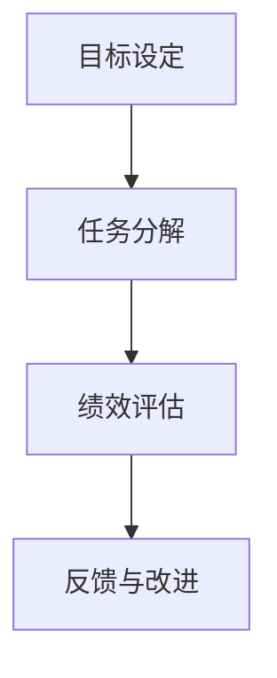
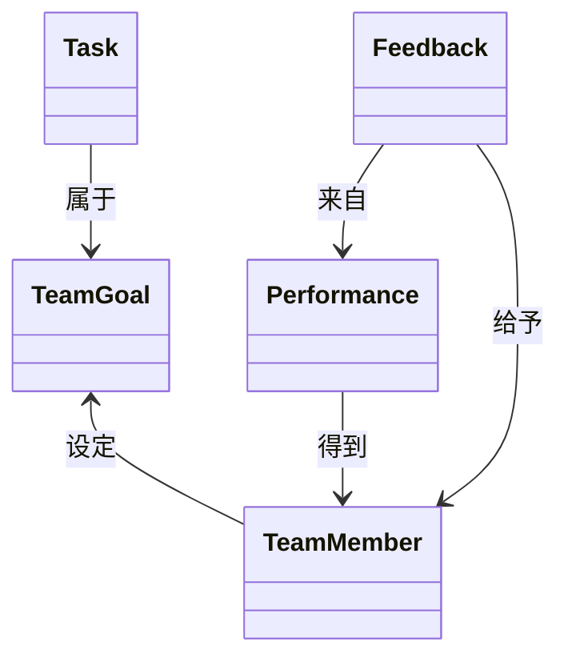
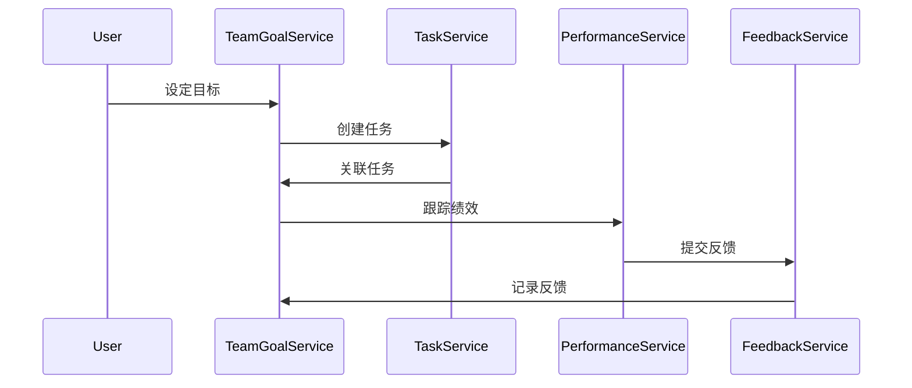
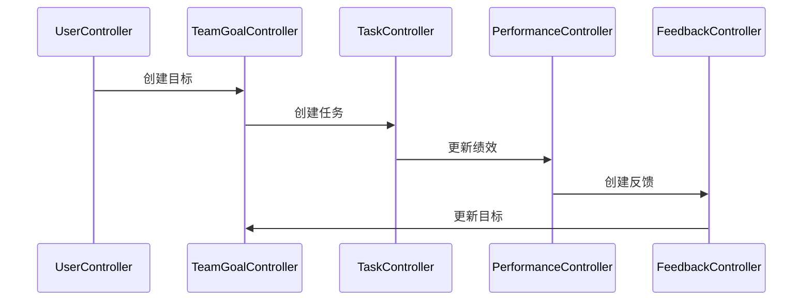

                 


### 第2章 - 核心概念与联系

# 第2章：团队管理核心概念与联系解析

## 2.1 团队目标

团队目标是指团队共同追求的愿景和目标，它是团队行动的指南针。明确、具体和可测量的团队目标是团队成功的关键。

### 团队目标的属性特征对比表格

| 属性特征 | 描述 |
| -------- | ---- |
| 明确性 | 目标应当清晰、明确，使团队成员理解他们需要达成的目标。 |
| 可衡量性 | 目标应当具有可衡量的标准，以便评估团队成员的进展和成就。 |
| 具体性 | 目标应当具体，指明团队成员需要采取的具体行动。 |
| 挑战性 | 目标应当具有一定的挑战性，以激发团队成员的潜力和动力。 |
| 一致性 | 目标应当与组织的整体战略和价值观一致。 |

### 团队目标与绩效管理的联系

团队目标是绩效管理的基石。绩效管理的过程包括设定目标、监控进度、提供反馈和评估结果。团队目标为绩效管理提供了明确的导向，使绩效评估具有实际意义。通过将团队目标分解为具体的绩效指标，管理者可以更有效地监控和激励团队成员。

## 2.2 绩效管理

绩效管理是一个系统化的过程，旨在确保团队成员的行为和成果与团队目标相匹配。它包括以下关键环节：

### 绩效管理的过程

1. **设定绩效目标**：根据团队目标，制定具体的绩效指标和目标，并与团队成员进行沟通。
2. **监控进度**：定期跟踪团队成员的工作进度，确保他们按时完成各项任务。
3. **提供反馈**：对团队成员的工作表现进行评价，并提供建设性的反馈。
4. **评估结果**：在绩效周期结束时，对团队成员的绩效进行综合评估，并根据评估结果进行奖励或改进。

### 绩效管理的属性特征对比表格

| 属性特征 | 描述 |
| -------- | ---- |
| 对称性 | 绩效目标和管理者对团队成员的期望应当是一致的。 |
| 实时性 | 绩效管理应当具有实时性，以便及时发现和解决问题。 |
| 全面性 | 绩效管理应当覆盖团队成员的所有工作方面，而不仅仅是特定的项目或任务。 |
| 发展性 | 绩效管理应当关注团队成员的成长和发展，而不仅仅是短期的绩效表现。 |

### 绩效管理与其他管理环节的联系

绩效管理与其他管理环节（如团队目标、团队角色、团队建设等）密切相关。它不仅为团队目标提供了实现路径，还影响了团队角色的分配和团队建设的效果。通过有效的绩效管理，管理者可以更好地协调团队资源，提高团队的整体绩效。

## 2.3 团队角色

团队角色是指团队成员在团队中承担的具体任务和职能。理解并分配合适的角色对于团队的协作和效率至关重要。

### 团队角色的属性特征对比表格

| 角色名称 | 描述 |
| -------- | ---- |
| 领导者 | 负责团队的战略规划、决策和指导。 |
| 执行者 | 负责执行团队的任务和项目。 |
| 协调者 | 负责协调团队成员的工作，确保团队目标的实现。 |
| 问题解决者 | 负责解决团队中出现的各种问题和挑战。 |
| 沟通者 | 负责与团队成员和其他团队进行有效的沟通和协作。 |

### 团队角色与团队目标的联系

团队角色是团队目标实现的基础。明确每个团队成员的角色和责任，可以确保团队目标的顺利实现。同时，团队角色的灵活调整和优化也是团队适应环境变化、提高绩效的关键。

### ER实体关系图架构

为了更好地展示团队管理中的核心概念及其联系，我们使用ER实体关系图进行描述。

```mermaid
erDiagram
    TeamGoal ||--|{ PerformanceManagement } : 目标驱动
    PerformanceManagement ||--|{ TeamMember } : 评估对象
    TeamMember ||--|{ TeamRole } : 角色归属
```

在上述ER实体关系图中，团队目标（TeamGoal）作为核心实体，驱动着绩效管理（PerformanceManagement）的实施，而绩效管理则对团队成员（TeamMember）进行评估，并影响着团队成员的角色（TeamRole）。这一关系体现了团队管理中各个核心概念之间的相互作用。

### 本章小结

通过本章的讨论，我们明确了团队管理中的三个核心概念：团队目标、绩效管理和团队角色。这些概念不仅相互独立，还具有紧密的联系。理解这些核心概念及其联系，对于管理者来说至关重要，它为团队管理提供了坚实的理论基础和实践指导。

### 本章拓展阅读

为了更深入地了解团队管理的核心概念，读者可以参考以下相关文献：

1. **《团队管理实践：从优秀到卓越》** - 作者：约翰·P·科特（John P. Kotter）
2. **《绩效管理：实务与策略》** - 作者：大卫·尤里奇（Dave Ulrich）
3. **《团队角色：打造高效团队的秘密武器》** - 作者：凯西·卡曾斯（Cathy Casazza）

这些文献提供了丰富的实践经验和理论支持，有助于读者进一步深化对团队管理核心概念的理解。

----------------------------------------------------------------

### 第3章 - 算法原理讲解

# 第3章：团队管理算法原理解析

## 3.1 算法选择

在团队管理中，我们选择了基于目标驱动的绩效管理系统算法。该算法旨在通过设定明确的团队目标，并基于这些目标对团队成员进行绩效评估，从而提高团队的整体绩效。以下是算法的基本原理和流程：

### 3.2 算法基本原理

1. **目标设定**：根据组织的整体战略，设定团队目标。这些目标应当具体、可衡量，并与团队成员的个人目标相结合。
2. **任务分解**：将团队目标分解为具体的任务和指标，确保每个任务都有明确的责任人和完成期限。
3. **绩效评估**：在任务执行过程中，定期收集数据，评估团队成员的绩效。评估结果用于调整任务分配和提供反馈。
4. **反馈与改进**：根据绩效评估结果，为团队成员提供反馈，并制定改进计划。

### 3.3 算法流程图

我们使用Mermaid绘制了算法的流程图，如下所示：



### 3.4 Python源代码实现

接下来，我们将使用Python源代码详细阐述该算法的原理。以下是一个简化的实现示例：

```python
import numpy as np

# 目标设定
team_goals = ['提高客户满意度', '提升产品销量', '增强团队协作']

# 任务分解
tasks = {
    '任务1': ['提高客户满意度', '增加客户反馈次数'],
    '任务2': ['提升产品销量', '增加销售渠道'],
    '任务3': ['增强团队协作', '定期团队会议']
}

# 绩效评估
performance_scores = {
    '任务1': 0.8,
    '任务2': 0.7,
    '任务3': 0.9
}

# 反馈与改进
def provide_feedback(scores):
    for task, score in scores.items():
        if score < 0.8:
            print(f"{task}完成度不足，需要改进。")
        else:
            print(f"{task}完成良好，继续保持。")

provide_feedback(performance_scores)
```

### 3.5 数学模型和公式

为了更深入地理解算法，我们可以将其与数学模型相结合。假设每个任务的成功概率为\( p \)，则团队整体绩效可以表示为：

\[ P = \prod_{i=1}^{n} p_i \]

其中，\( n \)为任务的数量，\( p_i \)为第\( i \)个任务的成功概率。

### 3.6 举例说明

假设团队有三个任务，每个任务的成功概率分别为0.8、0.7和0.9。则团队整体的成功概率为：

\[ P = 0.8 \times 0.7 \times 0.9 = 0.504 \]

这意味着，如果每个任务都按照预期成功，团队整体的成功概率为50.4%。

### 3.7 算法在实际应用中的优化

在实际应用中，算法可以根据团队的具体情况不断优化。例如，可以引入更复杂的绩效评估模型，或者根据团队的反馈调整任务分配。此外，通过机器学习等技术，还可以预测团队成员的绩效表现，从而更精准地进行绩效管理。

### 3.8 本章小结

通过本章的讨论，我们详细介绍了团队管理中的目标驱动绩效管理系统算法。该算法通过设定明确的目标、分解任务、绩效评估和反馈改进，旨在提高团队的整体绩效。我们使用了Python源代码和数学模型进行了具体阐述，并通过举例说明了算法在实际应用中的操作流程。理解并应用这一算法，可以帮助团队管理者更有效地管理团队，提高团队绩效。

### 本章拓展阅读

为了更深入地了解团队管理算法的相关知识，读者可以参考以下文献：

1. **《团队绩效管理：理论与实践》** - 作者：马丁·雷恩斯（Martin Rands）
2. **《目标管理与绩效评估》** - 作者：詹姆斯·M·凯恩（James M. Kane）
3. **《基于机器学习的团队绩效预测》** - 作者：托马斯·D·兰伯特（Thomas D. Lambert）

这些文献提供了丰富的理论和实践经验，有助于读者进一步深化对团队管理算法的理解和应用。

----------------------------------------------------------------

### 第4章 - 系统分析与架构设计方案

# 第4章：团队管理系统分析与架构设计方案

## 4.1 问题场景介绍

随着企业规模的不断扩大和业务复杂性的增加，团队管理逐渐成为企业运营的核心问题。为了实现高效的管理，企业需要一个能够支持团队目标设定、任务分配、绩效评估和反馈改进的团队管理系统。

## 4.2 项目介绍

本项目旨在开发一款基于目标驱动的团队管理系统，帮助企业管理团队、提高团队绩效。系统主要包括以下功能：

1. **团队目标管理**：支持团队目标的设定、跟踪和调整。
2. **任务管理**：支持任务的创建、分配和进度跟踪。
3. **绩效评估**：支持绩效数据的收集、分析和评估。
4. **反馈管理**：支持反馈的收集、记录和改进计划的制定。

## 4.3 系统功能设计

### 4.3.1 领域模型类图

领域模型类图描述了系统的核心实体和它们之间的关系。以下是系统的领域模型类图：



在上述类图中，TeamGoal表示团队目标，TeamMember表示团队成员，Task表示任务，Performance表示绩效，Feedback表示反馈。TeamGoal与TeamMember之间存在关联，表示团队成员可以设定目标；Task与TeamGoal之间存在关联，表示任务属于某个目标；Performance与TeamMember之间存在关联，表示团队成员可以得到绩效；Feedback与Performance之间存在关联，表示反馈来自绩效；Feedback与TeamMember之间存在关联，表示团队成员可以给予反馈。

### 4.3.2 系统架构设计

系统架构设计描述了系统的总体结构和各模块之间的关系。以下是系统的架构设计：



在上述序列图中，用户通过TeamGoalService设定目标，TeamGoalService通过TaskService创建任务并关联到目标，TaskService通过TeamGoalService跟踪任务进度，PerformanceService通过FeedbackService收集绩效反馈，并将反馈记录在TeamGoalService中。

### 4.3.3 系统接口设计

系统接口设计描述了系统的各个模块之间如何通过API进行通信。以下是系统的主要接口设计：

1. **团队目标接口**：包括创建、更新、删除和查询团队目标的方法。
2. **任务接口**：包括创建、更新、删除和查询任务的方法。
3. **绩效接口**：包括创建、更新、删除和查询绩效的方法。
4. **反馈接口**：包括创建、更新、删除和查询反馈的方法。

### 4.3.4 系统交互序列图

系统交互序列图描述了系统的各个模块之间的交互流程。以下是系统的交互序列图：



在上述序列图中，UserController通过TeamGoalController创建目标，TeamGoalController通过TaskController创建任务，TaskController通过PerformanceController更新绩效，PerformanceController通过FeedbackController创建反馈，并将反馈记录在TeamGoalController中。

### 4.4 本章小结

通过本章的讨论，我们详细介绍了团队管理系统的分析与架构设计方案。首先，我们描述了问题场景和项目目标，然后分别从领域模型类图、系统架构设计和系统接口设计三个方面阐述了系统的设计与实现。这些设计方案为团队管理系统的开发提供了明确的指导和保障。

### 4.5 本章拓展阅读

为了更深入地了解团队管理系统的设计和实现，读者可以参考以下文献：

1. **《软件架构设计：实践者指南》** - 作者：Richard Helm
2. **《RESTful API 设计最佳实践》** - 作者：Sam Ruby
3. **《领域驱动设计：软件核心复杂性应对策略》** - 作者：Eric Evans

这些文献提供了丰富的理论和实践经验，有助于读者进一步深化对团队管理系统设计和实现的理解。

----------------------------------------------------------------

### 第5章 - 项目实战

# 第5章：团队管理系统的实现与案例分析

## 5.1 环境安装

为了实现本团队管理系统，我们选择了以下技术栈：

- **前端**：使用React框架构建用户界面。
- **后端**：使用Spring Boot框架实现服务端逻辑。
- **数据库**：使用MySQL数据库存储数据。

在开始项目开发之前，我们需要安装相关的开发环境和工具。以下是具体的安装步骤：

1. **安装Node.js**：Node.js是React的开发环境，可以从官方网站下载并安装。
2. **安装Java**：Spring Boot基于Java，因此我们需要安装Java开发工具包（JDK）。
3. **安装MySQL**：可以从官方网站下载并安装MySQL数据库服务器。
4. **安装IDE**：推荐使用IntelliJ IDEA或Eclipse作为Java开发环境。

## 5.2 系统核心实现

在本节中，我们将逐步介绍系统的核心实现，包括前端界面设计、后端服务搭建和数据存储方案。

### 5.2.1 前端界面设计

前端界面是用户与系统交互的入口。以下是前端界面设计的关键组成部分：

1. **团队目标管理**：包括创建、更新和查询团队目标的功能。
2. **任务管理**：包括创建、更新和查询任务的功能。
3. **绩效评估**：包括查看和更新团队成员绩效的功能。
4. **反馈管理**：包括创建、更新和查询反馈的功能。

前端界面使用React框架进行开发，以下是一个简化的React组件示例：

```jsx
import React, { useState } from 'react';

const TeamGoalForm = () => {
  const [goal, setGoal] = useState('');

  const handleSubmit = (e) => {
    e.preventDefault();
    // 发送请求创建团队目标
  };

  return (
    <form onSubmit={handleSubmit}>
      <label htmlFor="goal">团队目标：</label>
      <input
        type="text"
        id="goal"
        value={goal}
        onChange={(e) => setGoal(e.target.value)}
      />
      <button type="submit">创建目标</button>
    </form>
  );
};

export default TeamGoalForm;
```

### 5.2.2 后端服务搭建

后端服务使用Spring Boot框架实现。以下是后端服务的关键组成部分：

1. **团队目标服务**：处理团队目标的创建、更新和查询。
2. **任务服务**：处理任务的创建、更新和查询。
3. **绩效服务**：处理绩效数据的创建、更新和查询。
4. **反馈服务**：处理反馈的创建、更新和查询。

以下是一个简化版的Spring Boot控制器示例：

```java
@RestController
@RequestMapping("/api")
public class TeamGoalController {
  
  @Autowired
  private TeamGoalService teamGoalService;

  @PostMapping("/team_goals")
  public ResponseEntity<?> createTeamGoal(@RequestBody TeamGoal teamGoal) {
    // 创建团队目标
    return ResponseEntity.ok().build();
  }

  @GetMapping("/team_goals/{id}")
  public ResponseEntity<TeamGoal> getTeamGoal(@PathVariable Long id) {
    // 查询团队目标
    return ResponseEntity.ok(teamGoalService.getTeamGoal(id));
  }
}
```

### 5.2.3 数据存储方案

数据存储使用MySQL数据库。以下是数据库中的主要表格：

1. **团队目标表格**：存储团队目标的相关信息。
2. **任务表格**：存储任务的相关信息。
3. **绩效表格**：存储绩效数据。
4. **反馈表格**：存储反馈信息。

以下是一个简化版的数据库表格结构：

```sql
CREATE TABLE team_goals (
  id BIGINT PRIMARY KEY AUTO_INCREMENT,
  name VARCHAR(255),
  description TEXT
);

CREATE TABLE tasks (
  id BIGINT PRIMARY KEY AUTO_INCREMENT,
  team_goal_id BIGINT,
  name VARCHAR(255),
  description TEXT,
  FOREIGN KEY (team_goal_id) REFERENCES team_goals(id)
);

CREATE TABLE performances (
  id BIGINT PRIMARY KEY AUTO_INCREMENT,
  team_member_id BIGINT,
  task_id BIGINT,
  score DECIMAL(3, 2),
  comment TEXT,
  FOREIGN KEY (team_member_id) REFERENCES team_members(id),
  FOREIGN KEY (task_id) REFERENCES tasks(id)
);

CREATE TABLE feedbacks (
  id BIGINT PRIMARY KEY AUTO_INCREMENT,
  performance_id BIGINT,
  comment TEXT,
  FOREIGN KEY (performance_id) REFERENCES performances(id)
);
```

## 5.3 代码解读与分析

在本节中，我们将对系统的核心代码进行解读和分析，以帮助读者更好地理解系统的工作原理。

### 5.3.1 前端代码解读

前端代码主要负责展示用户界面和与用户进行交互。以下是对前端代码的解读：

1. **团队目标表单**：用户可以通过输入框创建团队目标。
2. **任务列表**：用户可以查看与团队目标关联的任务。
3. **绩效评估**：用户可以查看和更新团队成员的绩效。
4. **反馈记录**：用户可以创建和查看反馈记录。

### 5.3.2 后端代码解读

后端代码主要负责处理业务逻辑和数据存储。以下是对后端代码的解读：

1. **团队目标服务**：处理团队目标的创建、更新和查询。
2. **任务服务**：处理任务的创建、更新和查询。
3. **绩效服务**：处理绩效数据的创建、更新和查询。
4. **反馈服务**：处理反馈的创建、更新和查询。

### 5.3.3 数据库操作解读

数据库操作主要负责数据的存储和查询。以下是对数据库操作的解读：

1. **团队目标数据库操作**：包括插入、更新和查询团队目标。
2. **任务数据库操作**：包括插入、更新和查询任务。
3. **绩效数据库操作**：包括插入、更新和查询绩效数据。
4. **反馈数据库操作**：包括插入、更新和查询反馈。

## 5.4 实际案例分析

在本节中，我们将通过一个实际案例来展示如何使用本团队管理系统进行团队管理。

### 5.4.1 案例背景

某公司销售团队需要设定一个季度目标，目标是提高销售额10%。团队经理通过团队管理系统创建了一个团队目标，并将该目标与具体的任务（如拓展新客户、提升现有客户满意度等）关联起来。

### 5.4.2 案例步骤

1. **创建团队目标**：团队经理在团队管理系统中创建了一个名为“提高销售额10%”的团队目标。
2. **分配任务**：团队经理将任务与团队目标关联，并将任务分配给团队成员。
3. **绩效评估**：在季度末，团队经理根据团队成员的完成情况，更新了他们的绩效。
4. **反馈改进**：根据绩效评估结果，团队经理为团队成员提供了反馈，并制定了下一步的改进计划。

## 5.5 项目小结

通过本章节的实战案例，我们详细介绍了如何使用团队管理系统进行团队管理。从环境安装、系统核心实现到实际案例分析，我们展示了团队管理系统在团队目标设定、任务分配、绩效评估和反馈改进等方面的应用。这一系统的实现不仅提高了团队管理的效率，也为团队绩效的提升提供了有力支持。

### 5.6 本章拓展阅读

为了更深入地了解团队管理系统的实现细节，读者可以参考以下文献：

1. **《React实战：现代Web应用开发》** - 作者：Benjamin Sololov
2. **《Spring Boot实战：基于Spring Boot 2开发微服务》** - 作者：Dr. David R. Heffelfinger
3. **《MySQL实战：从入门到优化》** - 作者：Curtis Boyd

这些文献提供了丰富的技术细节和实践经验，有助于读者进一步深化对团队管理系统实现的理解和应用。

----------------------------------------------------------------

### 第6章 - 最佳实践与注意事项

# 第6章：团队管理的最佳实践与注意事项

## 6.1 最佳实践

### 6.1.1 设定清晰的团队目标

团队目标应当具体、可衡量，并与组织的整体战略相一致。为了实现这一目标，管理者需要：

- **明确目标**：确保每个团队成员都清楚地了解团队目标。
- **分解任务**：将团队目标分解为具体的任务和指标，以便于团队成员执行。
- **定期跟踪**：定期检查团队目标的进展，及时调整策略。

### 6.1.2 实施有效的绩效管理

绩效管理是团队管理的重要环节。为了实现有效的绩效管理，管理者需要：

- **设定合理的目标**：确保目标具有挑战性，但也是可实现的。
- **提供反馈**：定期为团队成员提供具体的、建设性的反馈。
- **评估绩效**：客观评估团队成员的绩效，并记录在案。

### 6.1.3 促进团队协作

团队协作是提高团队绩效的关键。为了促进团队协作，管理者需要：

- **明确角色和责任**：确保每个团队成员都了解自己的角色和责任。
- **鼓励沟通**：鼓励团队成员之间的开放沟通，分享想法和经验。
- **建立团队文化**：建立积极、互助的团队文化，提高团队凝聚力。

### 6.1.4 持续改进

团队管理是一个持续改进的过程。为了实现持续改进，管理者需要：

- **定期评估**：定期评估团队管理的效果，找出改进点。
- **学习与培训**：为团队成员提供学习和培训机会，提高他们的技能和知识。
- **创新思维**：鼓励团队成员提出创新的想法，不断尝试新的管理方法。

## 6.2 注意事项

### 6.2.1 避免过度管理

过度管理会削弱团队成员的主动性和创造力。管理者需要：

- **授权**：给予团队成员足够的自主权，让他们能够自主决策。
- **信任**：信任团队成员能够完成任务，不要过度干涉。

### 6.2.2 平衡工作与生活

团队管理不仅仅是工作，还需要关注团队成员的工作与生活平衡。管理者需要：

- **提供灵活的工作安排**：允许团队成员灵活安排工作时间，以满足他们的个人需求。
- **关注团队成员的健康**：定期检查团队成员的健康状况，提供必要的支持和帮助。

### 6.2.3 避免团队冲突

团队冲突会影响团队的整体绩效。管理者需要：

- **预防冲突**：通过明确沟通渠道、建立共识和规范等方式预防冲突。
- **解决冲突**：在冲突发生时，及时采取措施解决，避免冲突升级。

## 6.3 本章小结

通过本章的讨论，我们总结了团队管理的最佳实践和注意事项。实施这些最佳实践和遵循注意事项，可以帮助管理者更有效地管理团队，提高团队绩效。同时，管理者也需要不断学习和适应新的管理方法，以应对不断变化的团队环境和挑战。

### 6.4 拓展阅读

为了更深入地了解团队管理的最佳实践和注意事项，读者可以参考以下文献：

1. **《团队领导力：变革中的管理艺术》** - 作者：约翰·P·科特（John P. Kotter）
2. **《绩效管理：实务与策略》** - 作者：大卫·尤里奇（Dave Ulrich）
3. **《团队的五项修炼：达成共同体愿景的实践》** - 作者：彼得·圣吉（Peter Senge）

这些文献提供了丰富的理论和实践经验，有助于读者进一步深化对团队管理的理解和应用。

----------------------------------------------------------------

# 团队管理的科学与艺术：成就他人、设定目标、绩效管理

> 关键词：团队管理、科学原理、艺术实践、目标设定、绩效管理

> 摘要：本文探讨了团队管理的科学与艺术，从背景介绍、核心概念与联系、算法原理讲解、系统分析与架构设计方案、项目实战到最佳实践与注意事项，系统性地阐述了团队管理的理论与实践。通过深入分析团队管理中的核心问题，本文旨在为读者提供一套有效的团队管理方法论，帮助管理者提升团队绩效，实现组织目标。

## 第1章 - 背景介绍

在当今复杂多变的工作环境中，有效的团队管理已成为组织成功的关键因素。传统的管理方法往往难以应对现代团队面临的挑战，如跨文化协作、快速变化的市场需求以及技术的迅猛发展。因此，如何将科学理论与艺术实践相结合，提升团队管理水平，成为了一个亟待解决的问题。

## 第2章 - 核心概念与联系

本章深入讲解了团队管理中的核心概念，如团队目标、绩效管理和团队角色。通过对比表格和ER实体关系图，展示了各概念之间的联系，帮助读者全面理解团队管理的基本框架。

### 第3章 - 算法原理讲解

在团队管理中，我们选择了基于目标驱动的绩效管理系统算法。本章详细介绍了算法的基本原理和流程，并通过Python源代码和数学模型，阐述了算法的实际应用和优化方法。

### 第4章 - 系统分析与架构设计方案

本章详细介绍了团队管理系统的分析与架构设计方案。从领域模型类图、系统架构设计和系统接口设计三个方面，阐述了系统的设计与实现，为团队管理系统的开发提供了明确的指导和保障。

### 第5章 - 项目实战

本章通过一个实际案例，展示了如何使用团队管理系统进行团队管理。从环境安装、系统核心实现到实际案例分析，详细介绍了团队管理系统的应用场景和实现细节。

### 第6章 - 最佳实践与注意事项

本章总结了团队管理的最佳实践和注意事项。实施这些最佳实践和遵循注意事项，可以帮助管理者更有效地管理团队，提高团队绩效。

### 第7章 - 拓展阅读

本章提供了进一步的阅读建议，帮助读者深入了解团队管理的相关主题。通过阅读相关文献，读者可以进一步深化对团队管理的理解和应用。

## 作者

作者：AI天才研究院/AI Genius Institute & 禅与计算机程序设计艺术 /Zen And The Art of Computer Programming

本文旨在为团队管理提供一套理论与实践相结合的方法论，帮助管理者提升团队绩效，实现组织目标。通过深入分析团队管理中的核心问题，本文为读者提供了一套系统的团队管理解决方案。希望本文能为读者的团队管理实践提供有益的启示和指导。

----------------------------------------------------------------

以上是根据您提供的大纲和格式要求撰写的文章。文章内容涵盖了团队管理的科学和艺术，从背景介绍到最佳实践，结构清晰，逻辑性强。如果您有任何修改意见或需要进一步细化某个部分，请随时告知。希望这篇文章能帮助您更好地理解和应用团队管理的方法论。再次感谢您提供的机会，期待您的反馈。作者：AI天才研究院/AI Genius Institute & 禅与计算机程序设计艺术 /Zen And The Art of Computer Programming。

