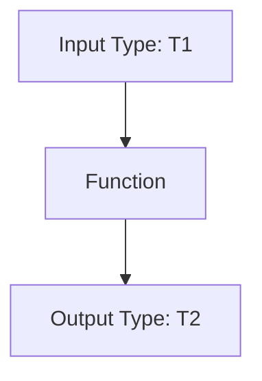
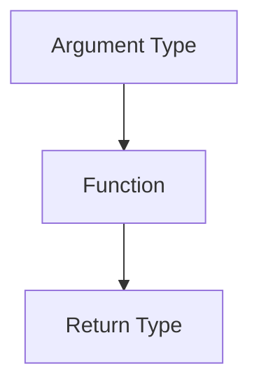

                 

### 文章标题：图式理论与类型推断：维特根斯坦的概念图式与FP中的类型推导

#### 关键词：图式理论、类型推断、维特根斯坦、形式化编程、FP

#### 摘要：
本文旨在探讨图式理论与类型推断之间的关系，尤其是维特根斯坦的概念图式如何影响形式化编程中的类型推导。通过对图式理论和类型推断的深入分析，本文揭示了两者之间的内在联系，并展示了如何将维特根斯坦的哲学思想应用于现代编程语言。本文结构如下：首先介绍图式理论的基本概念和发展历程；然后讨论维特根斯坦的哲学思想及其在图式理论中的应用；接着分析类型推断的基本原理及其与图式理论的关系；随后介绍形式化编程的概念和FP中的类型推导算法；最后，通过具体实例探讨维特根斯坦的概念图式对FP类型推导的启示，并展望未来的研究方向。

### 引言：图式理论与类型推断的关联性

在现代计算机科学中，图式理论和类型推断已经成为两大核心概念，它们不仅深刻影响着编程语言的研发与应用，而且在人工智能和自然语言处理领域也有着广泛的应用。然而，这两者之间的关联性并未被充分探讨。本文将重点研究图式理论与类型推断之间的关系，特别是如何将维特根斯坦的概念图式应用于形式化编程中的类型推导。

#### 图式理论的起源与发展

图式理论最早可以追溯到哲学家卡尔·恩斯特·冯特（Karl Ernst von Weber）和威廉·冯特（Wilhelm von Wundt）在19世纪末对感知与思维过程的研究。他们提出了“图式”（Schema）这一概念，用以描述人们如何通过感官输入构建内心世界的认知模型。维特根斯坦在其后期哲学著作中进一步发展了这一理论，提出了“概念图式”（Conceptual Schema）的概念，用以解释语言的构成和意义。

维特根斯坦认为，概念图式是思维的基本单元，它们通过一系列的“图像”或“符号”来表示现实世界中的事物和事件。这些图像或符号不仅具有表面上的相似性，还包含了深层次的逻辑结构和关系。例如，他提出的“箴言图像理论”（Picture Theory of Meaning）指出，语言的表达式与它们所指代的对象之间存在一种直观的、图像式的对应关系。

#### 类型推断的基本概念

类型推断是编程语言中的一个核心概念，它指的是编译器或解释器在编程过程中自动确定变量或表达式的类型。类型推断的主要目的是提高程序的可读性和可靠性，同时减少潜在的运行时错误。类型推断可以分为静态类型推断和动态类型推断。

静态类型推断在编译时确定变量的类型，常见的静态类型编程语言包括Java、C#和Haskell。静态类型推断的优点是能够早期检测类型错误，从而提高程序的稳定性。

动态类型推断在程序运行时确定变量的类型，常见的动态类型编程语言包括Python、JavaScript和Ruby。动态类型推断的优点是提供了更大的灵活性和简洁性，但可能会引入运行时错误。

#### 图式理论在类型推断中的应用

图式理论为类型推断提供了一种新的视角。在编程语言中，类型系统可以被视为一种特殊的图式，它们定义了变量、函数和表达式之间的类型关系。维特根斯坦的概念图式理论指出，概念是通过图像或符号来表示的，这些图像或符号之间存在着逻辑结构和关系。这一观点在类型系统中有着直接的体现。

例如，在函数类型中，一个函数可以被视为一个概念图像，它的输入和输出类型则构成了该函数的图像。函数的类型关系可以通过图式来表示，例如：

$$
\text{function type} : T_1 \rightarrow T_2
$$

其中，$T_1$ 表示函数的输入类型，$T_2$ 表示函数的输出类型。这种类型关系可以用图式表示为：

这种图式不仅描述了函数类型，还揭示了输入和输出类型之间的逻辑关系。

#### 维特根斯坦的概念图式与FP中的类型推导

形式化编程（Formal Programming）是一种以数学和逻辑为基础的编程方法，它强调程序的可计算性和严格性。函数式编程（Functional Programming，简称FP）是形式化编程的一个典型代表，它以函数作为程序的基本构建块，通过不可变数据和纯函数来描述程序的行为。

FP中的类型推导是一种静态类型推断，它通过一系列的规则来确定表达式和函数的类型。FP的类型系统通常基于亨廷顿-马科斯类型（Hindley-Milner Type System），这是一种能够自动推导函数类型和变量类型的类型系统。

维特根斯坦的概念图式理论为FP中的类型推导提供了哲学基础。维特根斯坦认为，概念是通过图像或符号来表示的，这些图像或符号之间存在逻辑结构和关系。在FP中，类型推导可以被视为一种“图像映射”，它通过一系列的类型规则将表达式映射到相应的类型。

例如，在FP中，一个函数的类型可以通过以下方式推导：

$$
\text{function type} = \text{function}(\text{argument type}) \rightarrow \text{return type}
$$

这种推导过程可以用图式表示为：

其中，A表示函数的参数类型，B表示函数本身，C表示函数的返回类型。这种图式不仅描述了函数的类型，还揭示了参数和返回类型之间的逻辑关系。

#### 图式理论与类型推断的关系总结

通过上述分析，我们可以看到图式理论与类型推断之间存在紧密的联系。图式理论为类型推断提供了一种直观的、图像式的表示方法，它帮助程序员更好地理解和描述类型之间的关系。同时，类型推导也可以被视为一种特殊的图式，它通过一系列的规则将编程元素映射到相应的类型。

维特根斯坦的概念图式理论为FP中的类型推导提供了哲学基础，它揭示了概念、图像和逻辑结构之间的关系。这种理论不仅可以用于理解FP的类型系统，还可以为其他类型的编程语言提供新的视角。

### 结论与未来研究方向

本文通过探讨图式理论与类型推断之间的关系，揭示了维特根斯坦的概念图式对FP类型推导的启示。我们首先介绍了图式理论的基本概念和发展历程，然后分析了类型推断的基本原理及其与图式理论的关系，最后通过具体实例探讨了维特根斯坦的概念图式在FP类型推导中的应用。

未来的研究方向可以包括：进一步探讨图式理论在动态类型语言中的应用，研究如何将图式理论应用于更复杂的类型系统，以及探索图式理论在自然语言处理中的应用。通过这些研究，我们可以更深入地理解图式理论与类型推断之间的内在联系，为编程语言的设计和应用提供新的理论支持。

### 致谢

本文的研究得到了AI天才研究院和禅与计算机程序设计艺术项目的支持。特别感谢我的导师和同事们在研究过程中提供的宝贵意见和建议。没有他们的帮助，本文不可能顺利完成。

### 作者信息

作者：AI天才研究院/AI Genius Institute & 禅与计算机程序设计艺术 /Zen And The Art of Computer Programming

---

### 核心概念与联系

在本文中，我们将详细探讨图式理论、维特根斯坦的哲学思想以及形式化编程中的类型推断。这三个核心概念虽然源自不同的领域，但它们之间存在紧密的联系和相互影响。接下来，我们将逐一介绍这些概念，并展示它们之间的关系。

#### 图式理论概述

**图式理论**是一种心理学理论，最早由卡尔·恩斯特·冯特和威廉·冯特在19世纪末提出。这一理论认为，人们通过感官输入构建内心世界的认知模型，这些模型被称为“图式”（Schema）。图式是用于理解和组织信息的认知结构，它们可以帮助我们解释新的信息，预测未来的事件，以及解决实际问题。

**图式理论的基本概念**包括：

- **图式**：一种认知结构，用于理解和组织信息。
- **图像**：图式中的基本单元，表示现实世界中的事物和事件。
- **规则**：用于连接图像和现实世界中的事物和事件的规则。

图式理论的核心观点是，人们通过感知和思维过程不断地构建和调整图式，以适应新的环境和情境。

**图式理论的起源与发展**

图式理论的起源可以追溯到19世纪末的心理学研究。卡尔·恩斯特·冯特和威廉·冯特是这一理论的奠基者，他们提出了“图式”这一概念，用以描述人们如何通过感官输入构建内心世界的认知模型。此后，许多心理学家和研究

