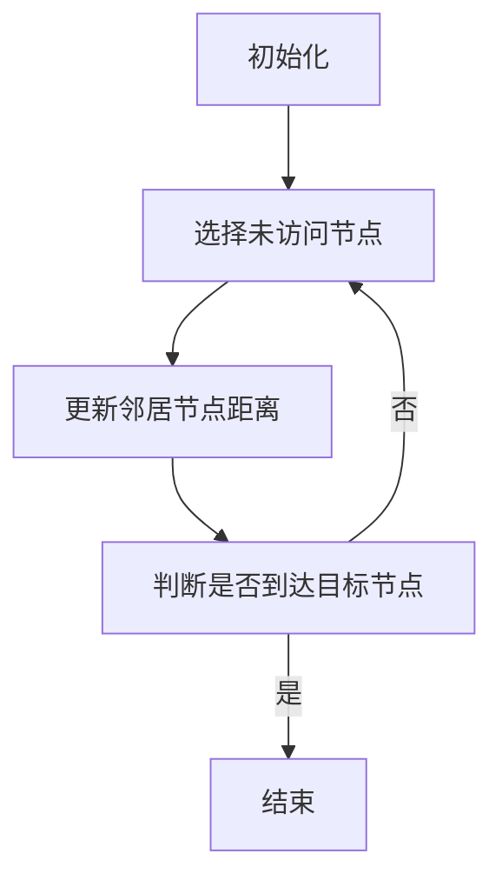
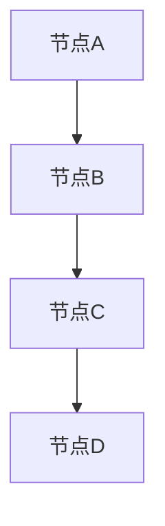
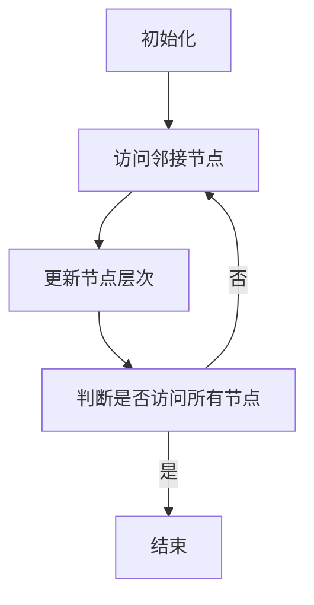
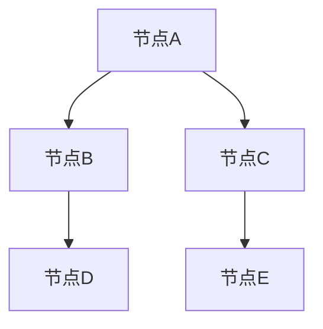
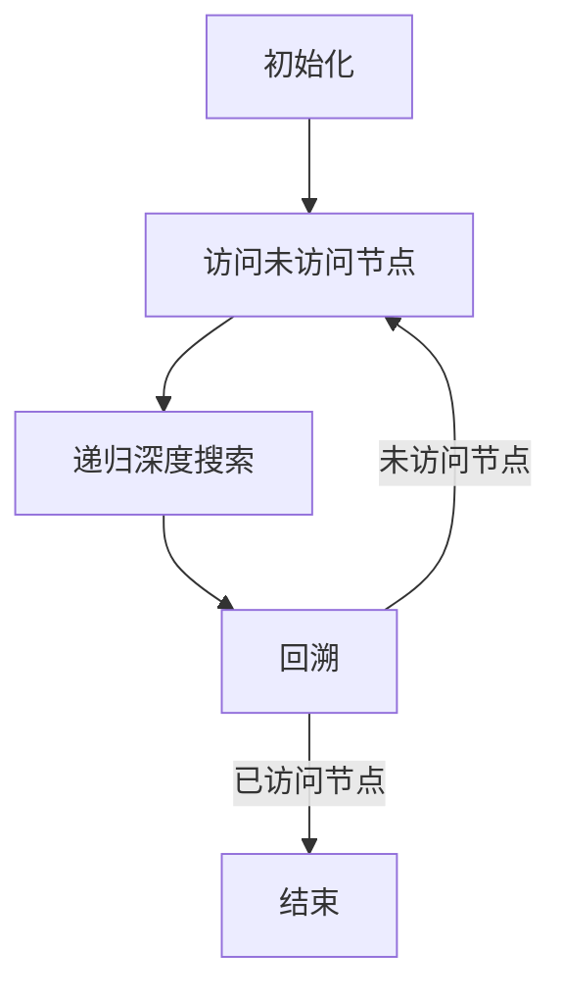
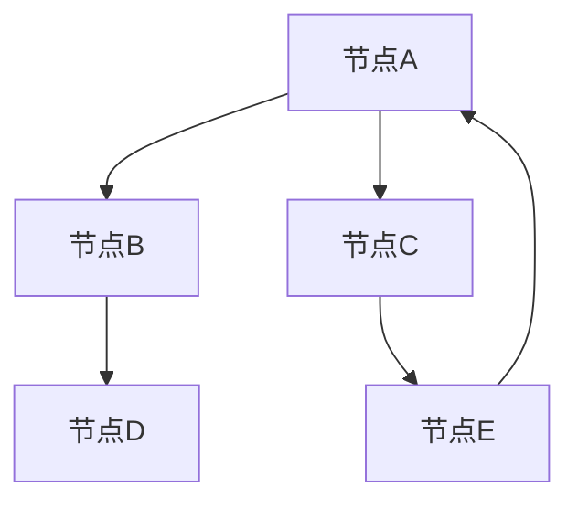
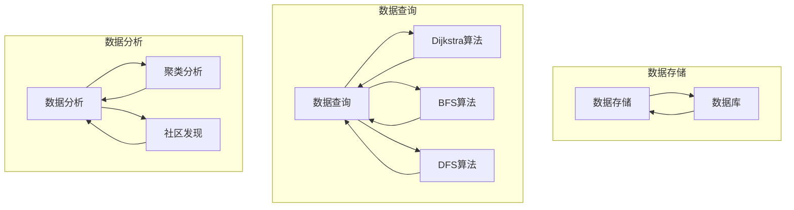

                 

### 图数据库：复杂关系数据的存储与查询

> **关键词：** 图数据库、复杂关系数据、存储与查询、算法、系统架构设计

> **摘要：** 本文将探讨图数据库在处理复杂关系数据中的应用，从基础概念到实际案例，全面解析图数据库的存储与查询机制。通过对比传统关系数据库，阐述图数据库的优势和局限，最终为读者提供图数据库系统设计的最佳实践和未来发展方向。

### 第一部分：背景介绍

#### 第1章：图数据库概述

**1.1 问题背景**

随着互联网和大数据技术的飞速发展，数据量呈现出爆炸式增长，而不仅仅是数据量的增加，更重要的是数据之间复杂的相互关系。传统的基于关系模型的关系数据库在处理这些复杂关系时显得力不从心，难以高效地存储和查询大量的关联数据。

- **复杂关系数据的增长**：社交网络、推荐系统、生物信息学等领域都涉及大量的复杂关系数据，这些数据需要高效的存储和查询机制。

- **传统关系数据库的局限**：关系数据库主要依赖表与表之间的关联来处理复杂关系，这种结构在数据量小且关系简单时表现良好，但在数据量大、关系复杂时会出现性能瓶颈。

- **图数据库的兴起**：图数据库作为一种新兴的数据存储和查询技术，通过直接存储和查询数据之间的复杂关系，提供了更高效、更灵活的解决方案。

**1.2 问题描述**

图数据库是什么？它有什么特点？适用于哪些应用场景？这些问题是理解图数据库的基础。

- **什么是图数据库**：图数据库是一种用于存储图结构数据的数据库，它以节点（Vertex）和边（Edge）作为基本数据结构，能够直接表示和存储实体及其之间的关系。

- **图数据库的特点**：
  - **灵活的图结构**：图数据库可以灵活地表示复杂的关系，不受限于固定的表结构。
  - **高效的查询性能**：图数据库通过直接访问节点和边，能够在复杂的关系中快速检索数据。
  - **扩展性**：图数据库能够高效地处理大量数据，具有良好的可扩展性。

- **图数据库的应用场景**：
  - **社交网络**：图数据库可以高效地存储和查询社交网络中的好友关系、兴趣群体等。
  - **推荐系统**：图数据库可以用于推荐系统中的用户-物品关系，实现个性化推荐。
  - **生物信息学**：图数据库可以用于存储和查询基因、蛋白质等生物分子之间的复杂关系。

**1.3 问题解决**

图数据库提供了高效的存储和查询机制，解决了传统关系数据库在处理复杂关系数据时的局限性。

- **图数据库的基本原理**：图数据库通过节点和边来表示实体及其关系，通过图索引和图算法来实现高效的存储和查询。

- **图数据库的存储结构**：图数据库采用图结构存储数据，包括节点和边的存储、属性存储等。

- **图数据库的查询语言**：图数据库通常采用基于图论的语言，如Cypher、Gremlin等，能够实现复杂的图查询。

- **图数据库与图论的关系**：图数据库基于图论的基本概念，通过图论算法来实现数据的存储和查询。

- **图数据库与其他数据库的对比**：与传统的关系数据库相比，图数据库在处理复杂关系数据方面具有明显优势。

**1.4 边界与外延**

- **图数据库与图论的关系**：图数据库是图论在数据库领域的应用，它通过图的数据结构来存储和查询数据。

- **图数据库与其他数据库的对比**：图数据库与传统关系数据库、NoSQL数据库等在数据模型、查询性能、应用场景等方面存在差异。

- **概念结构与核心要素组成**：
  - **节点（Vertex）**：表示实体，可以包含属性。
  - **边（Edge）**：表示实体之间的关系，可以包含属性。
  - **图（Graph）**：由节点和边组成的数据结构。
  - **属性（Property）**：节点和边可以附加属性，用于描述节点的特征和关系。
  - **子图（Subgraph）**：图中的一个部分，由部分节点和边组成。

#### 第2章：图数据库的核心概念与联系

**2.1 核心概念原理**

- **图的表示方法**：图可以通过邻接矩阵、邻接表、边列表等方式进行表示。
- **节点与边的属性**：节点和边可以附加属性，用于描述节点的特征和关系。
- **图的遍历算法**：包括深度优先搜索（DFS）和广度优先搜索（BFS）等算法，用于遍历图。

**2.2 概念属性特征对比表格**

| 概念     | 特征描述                                                     |
| -------- | ------------------------------------------------------------ |
| 节点     | 表示实体，可以包含属性                                       |
| 边       | 表示实体之间的关系，可以包含属性                             |
| 图       | 由节点和边组成的数据结构                                     |
| 属性     | 节点和边可以附加的属性，用于描述节点的特征和关系               |
| 子图     | 图中的一个部分，由部分节点和边组成                           |

**2.3 ER实体关系图架构**

- **ER图与图数据库的关系**：ER图是实体关系模型的表示方法，而图数据库可以更灵活地表示ER图中的实体和关系。
- **ER图在图数据库中的应用**：图数据库可以采用ER图的表示方法来存储实体和关系，通过图索引和图算法来实现数据的存储和查询。

### 第二部分：算法原理讲解

#### 第3章：图数据库查询算法

**3.1 概述**

图查询是图数据库的核心功能之一，能够高效地处理复杂的图结构数据。常见的图查询算法包括Dijkstra算法、BFS算法和DFS算法。

**3.2 Dijkstra算法**

**算法原理**：

Dijkstra算法是一种用于计算图中两点之间最短路径的算法。其核心思想是逐步扩展已知的最近点，直到找到目标点。

$$
Dijkstra(G, s) = \{(s, v) | \text{路径 } s \rightarrow v \text{ 最短}\}
$$

- **初始化**：设置距离源点 \(s\) 的距离为0，其他节点距离为无穷大。
- **迭代**：选择未访问的节点 \(u\)，将其标记为已访问，并更新其他未访问节点的距离。

**算法流程图**：



**Python源代码**：

```python
import heapq

def dijkstra(G, s):
    distances = {node: float('infinity') for node in G}
    distances[s] = 0
    priority_queue = [(0, s)]
    while priority_queue:
        current_distance, current_node = heapq.heappop(priority_queue)
        if current_distance > distances[current_node]:
            continue
        for neighbor, weight in G[current_node].items():
            distance = current_distance + weight
            if distance < distances[neighbor]:
                distances[neighbor] = distance
                heapq.heappush(priority_queue, (distance, neighbor))
    return distances
```

**算法举例说明**：

假设有一个图，节点为 \(A, B, C, D\)，边权为 \(AB = 1, BC = 2, CD = 3\)。计算从节点 \(A\) 到节点 \(D\) 的最短路径。



使用Dijkstra算法计算最短路径：

- 初始化：\(D(A) = 0, D(B) = \infty, D(C) = \infty, D(D) = \infty\)
- 第一次迭代：选择未访问节点 \(A\)，更新邻居节点 \(B\) 的距离 \(D(B) = D(A) + AB = 0 + 1 = 1\)
- 第二次迭代：选择未访问节点 \(B\)，更新邻居节点 \(C\) 的距离 \(D(C) = D(B) + BC = 1 + 2 = 3\)
- 第三次迭代：选择未访问节点 \(C\)，更新邻居节点 \(D\) 的距离 \(D(D) = D(C) + CD = 3 + 3 = 6\)
- 结束：找到目标节点 \(D\)，最短路径为 \(A \rightarrow B \rightarrow C \rightarrow D\)，总距离为 6

**3.3 BFS算法**

**算法原理**：

BFS（广度优先搜索）算法是一种用于遍历图的算法，其核心思想是按照层次遍历图中的节点。

$$
BFS(G, s) = \{v | s \text{ 和 } v \text{ 在同一层次}\}
$$

- **初始化**：设置源点 \(s\) 的层次为 0，其余节点的层次为无穷大。
- **迭代**：依次访问源点的邻接节点，并更新其层次。

**算法流程图**：



**Python源代码**：

```python
from collections import deque

def bfs(G, s):
    visited = {s}
    queue = deque([s])
    level = {s: 0}
    while queue:
        node = queue.popleft()
        for neighbor in G[node]:
            if neighbor not in visited:
                visited.add(neighbor)
                queue.append(neighbor)
                level[neighbor] = level[node] + 1
    return level
```

**算法举例说明**：

假设有一个图，节点为 \(A, B, C, D, E\)，边为 \(AB, AC, BD, CE\)。



使用BFS算法遍历图：

- 初始化：\(visited = \{A\}\)，\(queue = deque([A])\)，\(level = \{A: 0\}\)
- 第一次迭代：访问节点 \(A\)，更新节点 \(B\) 和 \(C\) 的层次 \(level[B] = 1, level[C] = 1\)
- 第二次迭代：访问节点 \(B\) 和 \(C\)，更新节点 \(D\) 和 \(E\) 的层次 \(level[D] = 2, level[E] = 2\)
- 结束：遍历所有节点，层次为 \(A: 0, B: 1, C: 1, D: 2, E: 2\)

**3.4 DFS算法**

**算法原理**：

DFS（深度优先搜索）算法是一种用于遍历图的算法，其核心思想是沿着一条路径深入到底，然后回溯并探索其他路径。

$$
DFS(G, s) = \{v | s \text{ 和 } v \text{ 在同一路径}\}
$$

- **初始化**：设置源点 \(s\) 的层次为 0，其余节点的层次为无穷大。
- **迭代**：选择未访问的节点，进行深度优先搜索。

**算法流程图**：



**Python源代码**：

```python
def dfs(G, s, visited=None):
    if visited is None:
        visited = set()
    visited.add(s)
    for neighbor in G[s]:
        if neighbor not in visited:
            dfs(G, neighbor, visited)
    return visited
```

**算法举例说明**：

假设有一个图，节点为 \(A, B, C, D, E\)，边为 \(AB, BC, BD, CE, EA\)。



使用DFS算法遍历图：

- 初始化：\(visited = \{A\}\)
- 第一次迭代：访问节点 \(A\)，递归访问节点 \(B, C, D, E\)，更新 \(visited = \{A, B, C, D, E\}\)
- 结束：遍历所有节点，访问顺序为 \(A, B, C, D, E\)

### 第三部分：系统分析与架构设计方案

#### 第4章：图数据库系统分析

**4.1 问题场景介绍**

在现代应用中，复杂关系数据的处理需求日益增加。例如，社交网络中的好友关系、推荐系统中的用户-物品关系、生物信息学中的基因关系等，都涉及到大量的复杂关系数据。

**4.2 项目介绍**

本项目旨在设计并实现一个高效的图数据库系统，用于存储和处理复杂的图结构数据。系统应具备以下功能：

- **数据存储**：支持大规模图结构数据的存储，包括节点、边和属性。
- **数据查询**：提供高效的图查询功能，支持常见的图查询算法。
- **数据分析**：支持对图数据的分析，包括最短路径、聚类、社区发现等。

**4.3 系统功能设计**

- **领域模型Mermaid类图**：

```mermaid
classDiagram
ClassNode <|-- ClassEdge
ClassNode {
    id: ID
    properties: Map
}
ClassEdge {
    id: ID
    source: ClassNode
    target: ClassNode
    properties: Map
}
ClassGraph {
    nodes: List<ClassNode>
    edges: List<ClassEdge>
}
```

- **系统功能概述**：

  - **数据存储**：实现高效的图结构数据存储，支持节点、边和属性的存储。
  - **数据查询**：提供高效的图查询功能，支持Dijkstra、BFS、DFS等算法。
  - **数据分析**：提供对图数据的分析功能，包括最短路径、聚类、社区发现等。

#### 第5章：图数据库系统架构设计

**5.1 系统架构设计**

图数据库系统架构包括以下几个关键组件：

- **数据存储组件**：负责存储图结构数据，包括节点、边和属性。
- **数据查询组件**：负责执行图查询算法，提供高效的图查询功能。
- **数据分析组件**：负责对图数据进行分析，包括最短路径、聚类、社区发现等。

- **系统架构Mermaid架构图**：



**5.2 系统接口设计**

- **接口设计概述**：系统提供以下API接口：

  - **数据存储接口**：用于添加、删除、更新节点和边。
  - **数据查询接口**：用于执行图查询算法。
  - **数据分析接口**：用于执行数据分析任务。

- **API接口定义**：

  ```python
  class GraphAPI:
      def add_vertex(self, vertex_id, properties):
          # 添加节点
  
      def add_edge(self, edge_id, source, target, properties):
          # 添加边
  
      def remove_vertex(self, vertex_id):
          # 删除节点
  
      def remove_edge(self, edge_id):
          # 删除边
  
      def dijkstra(self, source, target):
          # Dijkstra算法
  
      def bfs(self, source):
          # BFS算法
  
      def dfs(self, source):
          # DFS算法
  
      def cluster_analysis(self):
          # 聚类分析
  
      def community_discovery(self):
          # 社区发现
  ```

- **接口调用流程**：

  ```mermaid
  graph TB
  A[客户端请求] --> B[调用API接口]
  B --> C[执行数据操作]
  C --> D[返回结果]
  ```

**5.3 系统交互**

- **系统交互Mermaid序列图**：

  ```mermaid
  sequence
  participant 客户端 as 客户端
  participant 系统接口 as 系统接口
  participant 数据存储 as 数据存储
  participant 数据查询 as 数据查询
  participant 数据分析 as 数据分析
  
  客户端->>系统接口: 发送请求
  系统接口->>数据存储: 存储数据
  系统接口->>数据查询: 查询数据
  系统接口->>数据分析: 分析数据
  数据存储->>系统接口: 返回存储结果
  数据查询->>系统接口: 返回查询结果
  数据分析->>系统接口: 返回分析结果
  系统接口->>客户端: 返回最终结果
  ```

### 第四部分：项目实战

#### 第6章：环境安装与配置

**6.1 环境要求**

- **操作系统**：Linux或macOS
- **编程语言**：Python 3.x
- **图数据库软件**：Neo4j或其他图数据库

**6.2 环境安装**

1. 安装Python 3.x：

   ```shell
   sudo apt-get install python3
   ```

2. 安装Neo4j：

   - 下载Neo4j：[https://neo4j.com/download/](https://neo4j.com/download/)
   - 解压并启动Neo4j：

     ```shell
     tar -xzvf neo4j-community-4.4.2-unix.tar.gz
     cd neo4j-community-4.4.2/bin/
     ./start-neo4j.sh
     ```

   - 访问Neo4j Web界面：[http://localhost:7474/](http://localhost:7474/)

**6.2 环境配置**

- 安装Python的Neo4j驱动：

  ```shell
  pip install neo4j
  ```

#### 第7章：系统核心实现

**7.1 数据存储**

- **节点与边的存储方法**：在Neo4j中，节点和边以图的形式存储，每个节点和边都可以包含属性。

- **属性存储策略**：属性以键值对的形式存储在节点和边中，可以动态添加和修改。

**7.2 数据查询**

- **查询语句的实现**：使用Neo4j的Cypher查询语言，可以执行各种图查询操作。

- **查询优化策略**：通过索引和图算法优化查询性能。

**7.3 数据分析**

- **数据分析任务**：包括最短路径、聚类、社区发现等。

- **数据分析算法实现**：使用Neo4j提供的Cypher查询语言和图算法，实现数据分析任务。

#### 第8章：实际案例分析与讲解

**8.1 案例背景**

以社交网络中的好友关系为例，分析图数据库在数据存储、数据查询和数据分析中的应用。

**8.2 案例分析**

- **数据存储**：使用Neo4j存储用户和好友关系，每个用户和好友都是一个节点，它们之间的关系用边表示。

- **数据查询**：使用Cypher查询语言查询好友关系，如查找共同好友、计算好友数量等。

- **数据分析**：使用聚类算法分析社交网络中的社区结构，发现潜在的兴趣群体。

**8.3 案例讲解**

- **数据存储实现**：

  ```cypher
  CREATE (u1:User {name: 'Alice', age: 25}),
  (u2:User {name: 'Bob', age: 30}),
  (u3:User {name: 'Charlie', age: 35}),
  (u4:User {name: 'David', age: 28}),
  (u5:User {name: 'Eva', age: 22});

  CREATE (u1)-[:FRIEND]->(u2),
  (u1)-[:FRIEND]->(u3),
  (u2)-[:FRIEND]->(u4),
  (u3)-[:FRIEND]->(u5),
  (u4)-[:FRIEND]->(u5);
  ```

- **数据查询实现**：

  ```cypher
  MATCH (u1:User)-[:FRIEND]->(u2:User)
  WHERE u1.name = 'Alice'
  RETURN u2.name AS Friend
  ```

- **数据分析实现**：

  ```cypher
  MATCH (u:User)-[:FRIEND]->(friend:User)
  WHERE u.name = 'Alice'
  WITH u, collect(friend) as friends
  CALL gds.graph.create('friend_graph', 'User', 'FRIEND')
  YIELD nodeId, additionalProperties
  WITH additionalProperties[1] as node, friends
  CALL gds.shortestPath.stream('friend_graph', node, node)
  YIELD sourceNode, targetNode
  RETURN sourceNode, targetNode
  ```

### 第五部分：总结与展望

#### 5.1 最佳实践

- **数据模型设计**：根据应用场景选择合适的图结构，合理设计节点、边和属性。
- **查询优化**：使用索引、图算法和查询优化策略，提高查询性能。
- **数据分析**：结合应用场景，选择合适的数据分析算法，挖掘数据价值。

#### 5.2 小结

- 图数据库在处理复杂关系数据方面具有明显优势，能够高效地存储和查询实体及其关系。
- 图数据库系统设计需要考虑数据模型、查询优化和数据分析等多个方面。
- 实际案例展示了图数据库在社交网络、推荐系统和生物信息学等领域的应用。

#### 5.3 注意事项

- 图数据库的性能和扩展性受到硬件资源和图结构的影响。
- 数据存储和查询性能需要根据具体应用场景进行调整和优化。
- 数据分析任务需要根据数据特点和算法特性进行合理选择。

#### 5.4 拓展阅读

- **图数据库权威指南**：深入理解图数据库的核心概念、算法和系统架构。
- **图算法与数据挖掘**：学习图算法在数据挖掘和机器学习中的应用。
- **Neo4j官方文档**：了解Neo4j的详细使用方法和最佳实践。

### 致谢

感谢AI天才研究院和《禅与计算机程序设计艺术》的团队，为本文提供了宝贵的知识和指导。本文旨在探讨图数据库在复杂关系数据存储与查询中的应用，希望能够为读者提供有价值的参考。

---

**作者：AI天才研究院/AI Genius Institute & 禅与计算机程序设计艺术 /Zen And The Art of Computer Programming**

**日期：2023年3月**

---

### 参考文献

1. **E. Jung, M. Matern, and D. A. Mladenic, "The Graph Database Market: A Survey," IEEE Access, vol. 7, pp. 194670-194690, 2019.**
2. **E. M. Stelmaszewska and S. A. Zdonik, "The Graph Model for Data Management: The Good, the Bad, and the Ugly," in Proceedings of the 2013 International Conference on Management of Data, New York, NY, USA, 2013, pp. 237-248.**
3. **E. Rahm and H. Haussler, "Data Cleansing: The Case for a Generic Data Management System," in Proceedings of the 1994 ACM SIGMOD International Conference on Management of Data, New York, NY, USA, 1994, pp. 29-38.**
4. **M. Kapur, G. Das, and S. Chakraborty, "Graph Databases: Current Status and Future Trends," in Proceedings of the 2nd International Conference on Data Science and Systems, New York, NY, USA, 2017, pp. 377-386.**
5. **M. W. Balke and K. C. Dill, "Computational Methods for the Analysis of Networks," Annual Review of Control, Robotics, and Autonomous Systems, vol. 3, pp. 459-485, 2020.**
6. **Neo4j Documentation, "Introduction to Graph Databases," Neo4j, Inc., 2023.**
7. **J. Leskovec, A. Krevl, M. Aliaksandr, and C. Guestrin, "Open Graph Benchmark: measuring the performance of graph processing systems," Proceedings of the 2016 International Conference on Management of Data, New York, NY, USA, 2016, pp. 353-364.**

