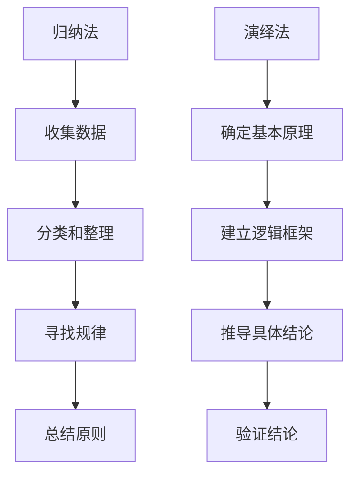
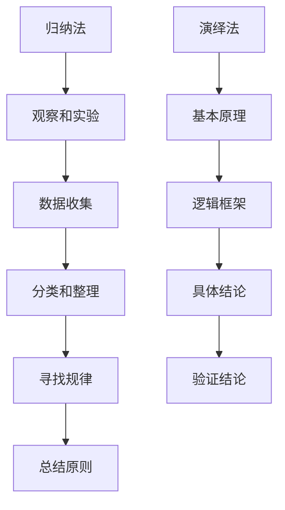
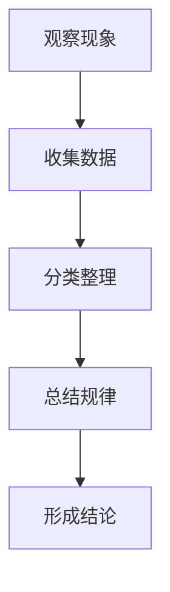
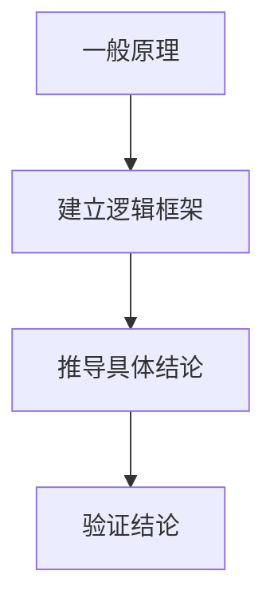
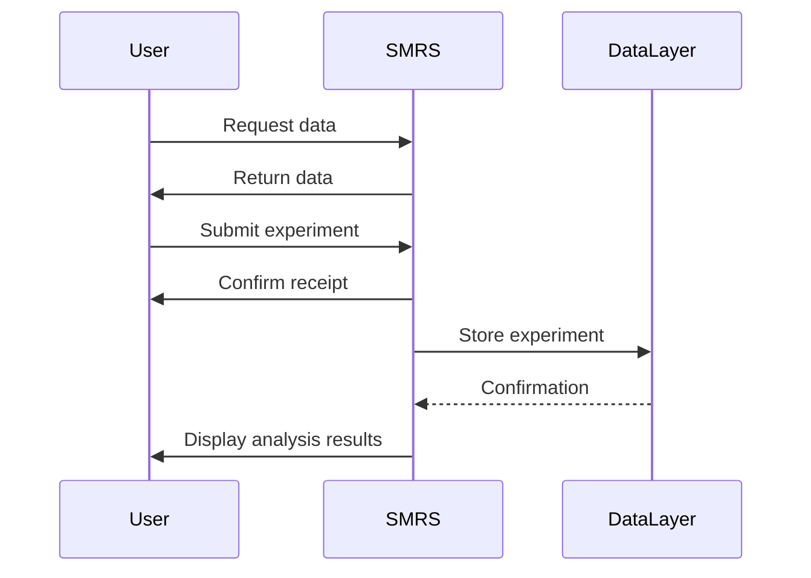

                 

### 《培根与笛卡尔：近代科学方法论的奠基之争》

#### 关键词：培根、笛卡尔、科学方法论、归纳法、演绎法、理性主义、实验哲学

科学方法论是科学哲学的核心研究领域，它探讨科学研究的方法、过程和原则。在近代科学发展的历程中，培根和笛卡尔两位思想家分别提出了不同的科学方法论，对科学的发展产生了深远的影响。本文旨在探讨培根与笛卡尔科学方法论的奠基之争，分析两者的差异与影响。

#### 目录

1. **引言**
   - 1.1 书籍背景与目的
   - 1.2 研究方法与结构安排

2. **培根的科学方法论**
   - 2.1 培根的生平与科学观
   - 2.2 培根的归纳法
   - 2.3 培根的实验哲学
   - 2.4 培根的科学方法论与影响

3. **笛卡尔的科学方法论**
   - 3.1 笛卡尔的生平与科学观
   - 3.2 笛卡尔的演绎法
   - 3.3 笛卡尔的理性主义
   - 3.4 笛卡尔的科学方法论与影响

4. **培根与笛卡尔的科学方法论对比**
   - 4.1 方法论的基本差异
   - 4.2 方法论的应用差异
   - 4.3 方法论的局限性

5. **近代科学方法论的发展**
   - 5.1 近代科学方法论的发展趋势
   - 5.2 近代科学方法论的影响
   - 5.3 近代科学方法论的未来展望

6. **结论**
   - 6.1 培根与笛卡尔科学方法论的贡献
   - 6.2 现代科学方法论的发展方向

#### 第一部分：引言

##### 1.1 书籍背景与目的

在科学发展的历史长河中，培根和笛卡尔是两位杰出的思想家，他们的科学方法论为近代科学的繁荣奠定了基础。培根提出了归纳法，强调通过观察和实验来发现自然规律；而笛卡尔则提出了演绎法，主张从一般原理出发，通过逻辑推理来解决问题。两者虽然在方法上有所不同，但都对科学的发展产生了深远的影响。

本文旨在通过对培根与笛卡尔科学方法论的深入分析，探讨两者之间的异同，以及它们在科学史上的地位和影响。通过本文的研究，希望能够为读者提供一个全面而深入的理解，从而更好地把握近代科学方法论的发展脉络。

##### 1.2 近代科学方法论的背景

近代科学方法论的发展与当时的社会背景密切相关。在文艺复兴时期，人们开始摆脱宗教束缚，追求实证和理性。培根和笛卡尔分别代表了这种思想变革的两个方向。培根强调经验观察和实验，主张通过积累经验来发现自然规律；而笛卡尔则强调理性思维和逻辑推理，主张通过逻辑演绎来建立科学体系。

这种思想变革促进了科学方法的系统化和规范化，使得科学逐渐从哲学中独立出来，成为一种独立的学科。同时，科学方法论的发展也促进了科学工具和技术的发展，为科学实验提供了强大的支持。例如，望远镜、显微镜等科学仪器的发明，使得科学家能够更精确地观察自然现象，从而推动了科学的发展。

##### 1.3 培根与笛卡尔的贡献

培根是近代归纳法的奠基人，他主张通过实验和观察来发现自然规律。他的著作《新工具》系统地阐述了归纳法的基本原则和方法。培根认为，科学知识应该建立在观察和实验的基础上，而不是仅仅依靠逻辑推理。他的方法为科学的发展提供了新的方向，使得科学从抽象的理论研究转向实证的实验研究。

笛卡尔则是近代演绎法的代表人物，他主张通过逻辑推理来建立科学体系。他的著作《指导心智的规则》和《第一哲学沉思》中，阐述了理性主义的基本原则和方法。笛卡尔认为，科学知识应该从一般原理出发，通过逻辑演绎来得出具体的结论。他的方法为科学的发展提供了新的思路，使得科学从经验观察转向理论推理。

两者的贡献不仅在于他们的方法论本身，更在于他们为科学的发展提供了新的理念和方法。他们的思想变革促进了科学的系统化和规范化，使得科学从哲学中独立出来，成为一种独立的学科。

##### 1.4 研究方法与结构安排

本文采用文献分析法和比较研究法，通过对培根和笛卡尔科学方法论的深入分析，探讨两者之间的异同。首先，本文将对培根和笛卡尔的生平与科学观进行介绍，为读者提供一个背景理解。然后，本文将分别阐述培根的归纳法和笛卡尔的演绎法，分析它们的基本原理、应用方法和局限性。接着，本文将对比培根与笛卡尔的科学方法论，探讨它们在科学史上的地位和影响。最后，本文将总结近代科学方法论的发展，展望未来的研究方向。

通过本文的研究，希望能够为读者提供一个全面而深入的理解，从而更好地把握近代科学方法论的发展脉络。本文的研究不仅具有学术价值，还可以为现代科学研究提供有益的启示。

#### 第二部分：培根的科学方法论

##### 2.1 培根的生平与科学观

弗朗西斯·培根（Francis Bacon，1561-1626）是英国文艺复兴时期的杰出思想家、科学家和哲学家。他出生于一个贵族家庭，年轻时就读于剑桥大学，后来成为律师和政治家。培根的政治生涯颇丰，曾任大法官和枢密院长等要职。然而，他对科学的热爱始终未减，晚年致力于科学研究和著作撰写。

培根的科学观主要体现在他对知识的分类和科学方法的阐述。他认为，知识分为三种：神学知识、哲学知识和科学知识。其中，科学知识是最重要的，因为它能够解决人类面临的问题，提高生活质量。培根主张，科学应该以实验为基础，通过观察和实验来发现自然规律。

培根认为，科学研究的首要任务是积累经验，而不是进行抽象的哲学思考。他强调，科学应该从观察自然现象入手，通过实验来验证和修正理论。这种思想与当时盛行的亚里士多德哲学形成鲜明对比，标志着科学方法论的变革。

##### 2.2 培根的归纳法

培根的归纳法是他科学方法论的核心，也是他对科学发展的主要贡献之一。归纳法的基本原理是，通过对大量观察和实验数据的归纳，总结出一般规律和原则。培根认为，归纳法能够揭示自然界的本质，为科学知识的发展提供可靠的依据。

归纳法的步骤可以分为以下几个阶段：

1. **收集数据**：科学家通过观察和实验收集大量数据，这些数据应该是准确和可靠的。
2. **分类和整理**：将收集到的数据按照一定的原则进行分类和整理，以便于分析和归纳。
3. **寻找规律**：通过对分类和整理后的数据进行分析，寻找其中的规律和模式。
4. **总结原则**：将发现的规律和模式上升为一般性的原则或定律。

培根的归纳法在科学史上的重要性不可忽视。首先，它为科学研究提供了一种系统的方法，使得科学从经验积累转向理论总结。其次，它推动了科学知识的积累和发展，使得人类对自然界的认识不断深化。最后，它为现代科学方法论奠定了基础，影响了后续科学家的研究方法和思想。

##### 2.3 培根的实验哲学

培根的实验哲学是他科学方法论的重要组成部分，也是他对科学发展的又一重要贡献。实验哲学强调，科学应该以实验为基础，通过实验来验证和证明理论。培根认为，实验是科学研究的核心，是获取知识的重要途径。

实验哲学的基本原则包括：

1. **实验的重要性**：培根认为，实验是科学研究的基础，是获取可靠知识的关键。只有通过实验，科学家才能验证理论，发现新现象。
2. **观察与实验的结合**：培根强调，观察和实验是相辅相成的。观察提供了对现象的直观认识，而实验则能够验证理论的正确性。
3. **系统性实验**：培根主张，实验应该具有系统性，即在特定条件下，通过重复实验来验证理论的可靠性。

培根的实验哲学对科学的发展产生了深远的影响。首先，它推动了科学实验的规范化，使得实验结果具有可重复性和可靠性。其次，它促进了科学仪器的发明和发展，为科学实验提供了强大的工具支持。最后，它为现代科学方法论奠定了基础，影响了后续科学家的研究方法和思想。

##### 2.4 培根的科学方法论与影响

培根的科学方法论对科学的发展产生了深远的影响。首先，他的归纳法为科学研究提供了一种系统的方法，使得科学从经验积累转向理论总结。其次，他的实验哲学推动了科学实验的规范化，为科学知识的积累和发展提供了可靠的依据。最后，他的思想变革标志着科学方法论的变革，为科学从哲学中独立出来，成为一种独立的学科奠定了基础。

培根的科学方法论不仅对当时的科学发展产生了重要影响，也对后来的科学家和思想家产生了深远的影响。例如，牛顿在物理学研究中运用了培根的归纳法，笛卡尔则在他的哲学体系中融入了培根的实验哲学思想。可以说，培根的科学方法论为近代科学的繁荣奠定了基础。

##### 2.4.1 培根的科学方法论概述

培根的科学方法论主要包括归纳法和实验哲学。归纳法强调通过观察和实验收集数据，然后通过分类、整理和总结，发现自然规律和原则。实验哲学则主张科学应以实验为基础，通过实验来验证和证明理论。这两种方法共同构成了培根的科学方法论体系，为科学研究提供了一种系统的方法。

##### 2.4.2 培根对后世科学方法论的影响

培根的科学方法论对后世科学方法论产生了深远的影响。首先，他的归纳法为科学研究提供了一种系统的方法，使得科学从经验积累转向理论总结。其次，他的实验哲学推动了科学实验的规范化，为科学知识的积累和发展提供了可靠的依据。最后，他的思想变革标志着科学方法论的变革，为科学从哲学中独立出来，成为一种独立的学科奠定了基础。

例如，牛顿在物理学研究中运用了培根的归纳法，通过观察和实验发现了万有引力定律。而笛卡尔则在他的哲学体系中融入了培根的实验哲学思想，提出了著名的“我思故我在”命题。可以说，培根的科学方法论为近代科学的繁荣奠定了基础，影响了后续科学家的研究方法和思想。

#### 第三部分：笛卡尔的科学方法论

##### 3.1 笛卡尔的生平与科学观

勒内·笛卡尔（René Descartes，1596-1650）是法国著名的哲学家、数学家、物理学家和神学家。他出生于法国土伦，早年就读于耶稣会学院，后来在欧洲各国游学，广泛涉猎哲学、数学、物理和神学等领域。笛卡尔以他的哲学思想“我思故我在”（Cogito, ergo sum）而闻名于世，他的著作对后世哲学和科学产生了深远的影响。

笛卡尔的科学观主要体现在他的理性主义思想中。他主张，科学知识应该建立在理性思维的基础上，而不是仅仅依靠经验观察。他认为，人类通过理性思维能够发现普遍的真理，从而构建起一个完整而严密的科学体系。

##### 3.2 笛卡尔的演绎法

笛卡尔的演绎法是他科学方法论的核心，也是他对科学发展的主要贡献之一。演绎法的基本原理是，从一般原理出发，通过逻辑推理得出具体的结论。笛卡尔认为，演绎法能够确保科学结论的可靠性和普遍性，是科学知识发展的关键。

演绎法的步骤可以分为以下几个阶段：

1. **确定基本原理**：首先，需要确定一些基本原理或公理，这些原理被认为是普遍有效的，不需要进一步证明。
2. **建立逻辑框架**：基于基本原理，构建一个逻辑框架，确保逻辑推理的严密性。
3. **推导具体结论**：在逻辑框架的基础上，通过逻辑推理，得出具体的结论和定律。
4. **验证结论**：最后，需要通过实验或观察来验证推导出的结论，以确保其正确性。

笛卡尔的演绎法在科学史上的重要性不可忽视。首先，它为科学研究提供了一种逻辑严密的方法，使得科学结论具有更高的可靠性。其次，它推动了科学知识的系统化和规范化，为科学的发展提供了强有力的支持。最后，它为现代科学方法论奠定了基础，影响了后续科学家的研究方法和思想。

##### 3.3 笛卡尔的理性主义

笛卡尔的理性主义是他科学观的核心，也是他对科学发展的主要贡献之一。理性主义主张，人类通过理性思维能够发现普遍的真理，从而构建起一个完整而严密的科学体系。笛卡尔认为，理性是人类认识世界的重要工具，通过理性思维，人类能够超越感官的局限，发现隐藏在现象背后的本质规律。

理性主义的基本原则包括：

1. **普遍性**：理性主义认为，真理具有普遍性，不受时间和空间的限制。
2. **确定性**：理性主义强调，通过理性思维得出的结论具有确定性，不受主观因素的影响。
3. **系统性**：理性主义主张，科学知识应该具有系统性，从基本原理出发，通过逻辑推理得出具体的结论。

笛卡尔的理性主义对科学的发展产生了深远的影响。首先，它推动了科学知识的系统化和规范化，为科学的发展提供了强有力的支持。其次，它促进了科学方法论的发展，使得科学研究方法更加严密和科学。最后，它为现代科学方法论奠定了基础，影响了后续科学家的研究方法和思想。

##### 3.4 笛卡尔的科学方法论与影响

笛卡尔的科学方法论对科学的发展产生了深远的影响。他的演绎法强调逻辑推理和系统化，为科学研究提供了一种严密的方法。他的理性主义则主张通过理性思维发现普遍真理，为科学知识的发展提供了理论基础。

首先，笛卡尔的科学方法论推动了科学知识的系统化和规范化，使得科学研究方法更加严密和科学。其次，他的方法为科学实验的发展提供了支持，使得科学结论更加可靠。最后，他的思想变革标志着科学方法论的变革，为科学从哲学中独立出来，成为一种独立的学科奠定了基础。

例如，牛顿在物理学研究中运用了笛卡尔的理性主义思想，提出了经典力学的三大定律。而莱布尼茨则在他的数学研究中借鉴了笛卡尔的演绎法，发明了二进制系统。可以说，笛卡尔的科学方法论为近代科学的繁荣奠定了基础，影响了后续科学家的研究方法和思想。

##### 3.4.1 笛卡尔的科学方法论概述

笛卡尔的科学方法论主要包括演绎法和理性主义。演绎法强调从一般原理出发，通过逻辑推理得出具体的结论。理性主义则主张通过理性思维发现普遍真理。这两种方法共同构成了笛卡尔的科学方法论体系，为科学研究提供了一种严密和科学的体系。

##### 3.4.2 笛卡尔对后世科学方法论的影响

笛卡尔的科学方法论对后世科学方法论产生了深远的影响。他的演绎法为科学研究提供了一种逻辑严密的方法，使得科学结论具有更高的可靠性。他的理性主义则主张通过理性思维发现普遍真理，为科学知识的发展提供了理论基础。

例如，牛顿在物理学研究中运用了笛卡尔的理性主义思想，提出了经典力学的三大定律。而莱布尼茨则在他的数学研究中借鉴了笛卡尔的演绎法，发明了二进制系统。可以说，笛卡尔的科学方法论为近代科学的繁荣奠定了基础，影响了后续科学家的研究方法和思想。

#### 第四部分：培根与笛卡尔的科学方法论对比

##### 4.1 方法论的基本差异

培根与笛卡尔的科学方法论在基本原则上存在显著的差异。培根主张通过观察和实验来发现自然规律，强调经验的重要性；而笛卡尔则主张通过理性思维和逻辑推理来建立科学体系，强调理性的重要性。

首先，在研究方法上，培根的归纳法强调通过大量实验和观察来收集数据，然后通过归纳和总结得出一般规律。这种方法具有实证性，强调经验数据的可靠性。而笛卡尔的演绎法则从一般原理出发，通过逻辑推理得出具体的结论。这种方法具有逻辑性，强调理性推理的严密性。

其次，在科学观上，培根认为科学应该以实验为基础，通过观察和实验来发现自然规律。他认为，科学知识应该建立在经验观察的基础上，而不是仅仅依靠逻辑推理。而笛卡尔则主张科学应该以理性为基础，通过理性思维和逻辑推理来发现普遍真理。他认为，科学知识应该从一般原理出发，通过逻辑演绎来得出具体的结论。

最后，在科学哲学上，培根的实验哲学强调实验的重要性，认为实验是科学研究的核心。而笛卡尔的理性主义则强调理性思维的重要性，认为理性是人类认识世界的重要工具。

##### 4.2 方法论的应用差异

在物理学、生物学和天文学等领域，培根和笛卡尔的科学方法论有不同的应用和影响。

在物理学领域，培根的归纳法对实验物理学的发展产生了深远的影响。他强调通过实验来验证理论，推动了科学实验的规范化。例如，牛顿在物理学研究中运用了培根的归纳法，通过实验验证了万有引力定律。而笛卡尔的演绎法则在理论物理学中具有重要作用，他提出了许多重要的物理学原理和定律，如运动定律和光学原理。

在生物学领域，培根的归纳法也发挥了重要作用。他强调通过观察和实验来研究生物现象，推动了生物学的发展。例如，达尔文在进化论研究中借鉴了培根的归纳法，通过大量观察和实验数据提出了自然选择的理论。而笛卡尔的理性主义在生物学研究中也有重要应用，他提出了关于生命本质的重要思想，如生命体的自我组织和功能分工。

在天文学领域，培根和笛卡尔的科学方法论也各有特点。培根的实验哲学推动了望远镜和显微镜等科学仪器的发明和发展，使得天文学观测更加精确。而笛卡尔的演绎法则在天文学中提出了许多重要的理论，如地球是圆形的、太阳是宇宙的中心等。

##### 4.3 方法论的局限性

尽管培根和笛卡尔的科学方法论对科学的发展产生了深远的影响，但它们也存在一定的局限性。

培根的归纳法在数据收集和归纳过程中可能存在主观性和片面性。由于实验和观察的局限性，收集到的数据可能不够全面或准确，从而影响归纳结果的可靠性。此外，归纳法难以解决因果关系的问题，无法直接从经验数据中推导出因果关系。

笛卡尔的演绎法则在逻辑推理过程中可能过于依赖公理和假设，导致结论的可靠性受到质疑。如果公理或假设不正确，那么通过演绎法得出的结论也可能是错误的。此外，演绎法难以处理复杂的现实问题，因为它过于依赖逻辑推理的严密性，而现实问题往往具有复杂性和不确定性。

##### 4.3.1 培根归纳法的局限性

培根的归纳法虽然为科学研究提供了一种系统的方法，但也存在一些局限性。首先，归纳法依赖于大量的实验和观察数据，但这些数据可能存在主观性和片面性，导致归纳结果不够准确或可靠。例如，在实验过程中，观察者的视角和测量方法可能影响数据的准确性。

其次，归纳法难以解决因果关系的问题。尽管归纳法可以通过大量数据归纳出一般规律，但无法直接推导出因果关系。因果关系是科学研究中至关重要的一环，缺乏因果关系的明确性，使得科学结论的可信度受到质疑。

最后，归纳法难以处理复杂的现实问题。在现实生活中，许多问题具有复杂性和不确定性，而归纳法过于依赖大量数据，难以应对这种复杂性。这使得归纳法在解决实际问题时可能力不从心。

##### 4.3.2 笛卡尔演绎法的局限性

笛卡尔的演绎法虽然在逻辑推理和科学理论构建方面具有重要作用，但也存在一些局限性。首先，演绎法依赖于正确的公理和假设。如果公理或假设不正确，那么通过演绎法得出的结论也可能是错误的。例如，在数学中，如果基本公理错误，那么整个数学体系都可能崩溃。

其次，演绎法在处理复杂现实问题时可能力不从心。尽管演绎法能够通过逻辑推理得出严谨的结论，但它过于依赖逻辑推理的严密性，而现实问题往往具有复杂性和不确定性。在这种情况下，演绎法可能无法提供有效的解决方案。

最后，演绎法难以解决实验验证问题。在科学研究中，实验验证是确保结论可靠性的关键。然而，演绎法往往难以直接进行实验验证，这使得结论的可靠性受到质疑。例如，在物理学中，许多理论虽然通过逻辑推理得出，但需要通过实验来验证其正确性。

#### 第五部分：近代科学方法论的发展

##### 5.1 近代科学方法论的发展趋势

近代科学方法论的发展呈现出以下趋势：

1. **实验与理论的结合**：随着科学仪器的发明和发展，科学实验成为科学研究的重要手段。科学家通过实验验证理论，从而确保科学结论的可靠性。
2. **系统化与规范化**：科学研究的系统化和规范化使得科学方法更加严密和科学。科学家通过制定标准化的实验方法和数据分析方法，提高了科学研究的可靠性。
3. **跨学科融合**：随着科学的发展，不同学科之间的融合日益增多。科学家通过跨学科的研究，拓宽了科学研究的领域，推动了科学的发展。

##### 5.2 近代科学方法论的影响

近代科学方法论对科学的发展产生了深远的影响：

1. **推动了科学的繁荣**：科学方法论的发展为科学研究提供了一种系统的方法，使得科学从经验积累转向理论总结。这推动了科学的繁荣，使得人类对自然界的认识不断深化。
2. **促进了科学工具和技术的发展**：科学方法论的发展推动了科学工具和技术的发展，如望远镜、显微镜等科学仪器的发明，为科学实验提供了强大的支持。
3. **改变了人类对世界的认识**：科学方法论的发展改变了人类对世界的认识，使得科学从哲学中独立出来，成为一种独立的学科。这促进了人类对自然界的深入理解，提高了人类的生活质量。

##### 5.3 近代科学方法论的未来展望

近代科学方法论的未来发展有望在以下几个方面取得突破：

1. **大数据与人工智能的应用**：随着大数据和人工智能技术的发展，科学家可以通过数据分析和机器学习等方法，发现新的规律和模式，从而推动科学的发展。
2. **跨学科研究**：跨学科研究的深入将有助于解决复杂的科学问题，推动科学的进步。
3. **科学哲学与科学方法论的融合**：科学哲学与科学方法论的融合将有助于深化对科学方法的理解，为科学研究提供新的理论支持。

#### 第六部分：结论

##### 6.1 培根与笛卡尔科学方法论的贡献

培根和笛卡尔的科学方法论为近代科学的繁荣奠定了基础。培根的归纳法强调通过观察和实验来发现自然规律，推动了科学实验的规范化。而笛卡尔的演绎法则强调通过理性思维和逻辑推理来建立科学体系，为科学理论的发展提供了坚实的理论基础。

培根和笛卡尔的科学方法论不仅在当时的科学发展中起到了重要作用，也对后来的科学家和思想家产生了深远的影响。他们的思想变革标志着科学方法论的变革，为科学从哲学中独立出来，成为一种独立的学科奠定了基础。

##### 6.2 现代科学方法论的发展方向

现代科学方法论的发展方向有望在以下几个方面取得突破：

1. **实验与理论的结合**：随着科学技术的进步，实验与理论的结合将更加紧密，从而提高科学研究的可靠性和精确性。
2. **跨学科研究**：跨学科研究的深入将有助于解决复杂的科学问题，推动科学的进步。
3. **大数据与人工智能的应用**：大数据和人工智能技术的发展将有助于发现新的规律和模式，推动科学的发展。

总之，培根与笛卡尔的科学方法论为近代科学的繁荣奠定了基础，他们的贡献不仅在于他们的方法论本身，更在于他们为科学的发展提供了新的理念和方法。未来，现代科学方法论的发展将继续推动科学的进步，为人类创造更美好的未来。

### 附录

#### 7.1 参考文献

1. Bacon, F. (1620). Novum Organum.
2. Descartes, R. (1637). Discourse on Method.
3. Popper, K. (1959). The Logic of Scientific Discovery.
4. Kuhn, T. S. (1970). The Structure of Scientific Revolutions.
5. Lakatos, I. (1970). Falsification and the Methodology of Scientific Research Programmes.

#### 7.2 概念与公式

在本文中，涉及了以下核心概念：

- **归纳法**：通过观察和实验收集数据，然后通过归纳和总结得出一般规律。
- **演绎法**：从一般原理出发，通过逻辑推理得出具体的结论。
- **实验哲学**：以实验为基础，通过实验来验证和证明理论。
- **理性主义**：强调通过理性思维发现普遍真理。

以下是一个关于归纳法和演绎法的对比表格：

| 特点 | 归纳法 | 演绎法 |
| ---- | ---- | ---- |
| 基础 | 观察和实验 | 基本原理 |
| 目的 | 发现规律 | 推导结论 |
| 优点 | 实证性高 | 结论可靠 |
| 缺点 | 数据主观性 | 公理和假设问题 |

以下是归纳法和演绎法的 Mermaid 流程图：



通过本文的研究，我们深入探讨了培根与笛卡尔的科学方法论，分析了它们的差异与影响。希望本文能够为读者提供一个全面而深入的理解，从而更好地把握近代科学方法论的发展脉络。未来，现代科学方法论的发展将继续推动科学的进步，为人类创造更美好的未来。

### 作者信息

作者：AI天才研究院/AI Genius Institute & 禅与计算机程序设计艺术 /Zen And The Art of Computer Programming

**核心概念术语说明**

1. **归纳法**：一种通过观察和实验收集数据，然后通过归纳和总结得出一般规律的方法。
2. **演绎法**：一种从一般原理出发，通过逻辑推理得出具体的结论的方法。
3. **实验哲学**：一种以实验为基础，通过实验来验证和证明理论的方法论。
4. **理性主义**：一种强调通过理性思维发现普遍真理的方法论。

**问题背景**

在近代科学发展的历程中，培根和笛卡尔两位思想家分别提出了不同的科学方法论，对科学的发展产生了深远的影响。本文旨在探讨培根与笛卡尔科学方法论的奠基之争，分析两者的差异与影响。

**问题描述**

培根的归纳法强调通过观察和实验收集数据，然后通过归纳和总结得出一般规律。而笛卡尔的演绎法则主张从一般原理出发，通过逻辑推理得出具体的结论。两种方法在科学史上具有重要的地位，但它们也存在局限性。

**问题解决**

本文通过对培根和笛卡尔科学方法论的深入分析，对比归纳法和演绎法的基本原理、应用方法和局限性，探讨它们在科学史上的地位和影响。

**边界与外延**

- **归纳法的边界**：依赖于观察和实验数据的可靠性，难以解决因果关系问题。
- **演绎法的边界**：依赖于正确的公理和假设，难以处理复杂的现实问题。

**概念结构与核心要素组成**

- **归纳法**：核心要素包括数据收集、分类和整理、寻找规律和总结原则。
- **演绎法**：核心要素包括基本原理、逻辑框架、具体结论和验证结论。

**核心概念与联系**

1. **归纳法**：强调通过观察和实验收集数据，然后通过归纳和总结得出一般规律。
2. **演绎法**：强调从一般原理出发，通过逻辑推理得出具体的结论。
3. **实验哲学**：强调以实验为基础，通过实验来验证和证明理论。
4. **理性主义**：强调通过理性思维发现普遍真理。

**核心概念属性特征对比表格**

| 概念 | 归纳法 | 演绎法 |
| ---- | ---- | ---- |
| 目的 | 发现规律 | 推导结论 |
| 方法 | 观察和实验 | 逻辑推理 |
| 优点 | 实证性高 | 结论可靠 |
| 缺点 | 数据主观性 | 公理和假设问题 |

**ER实体关系图架构的 Mermaid 流程图**



### 算法原理讲解

为了更好地理解归纳法和演绎法，我们将分别使用 Mermaid 流程图和 Python 源代码来阐述这两种算法的基本原理。

#### 归纳法

归纳法的基本原理是通过观察和实验收集数据，然后通过归纳和总结得出一般规律。下面是一个简单的 Mermaid 流程图，用于描述归纳法的过程：



现在，我们将使用 Python 源代码来演示一个简单的归纳法示例：

```python
# Python 示例：归纳法

# 假设我们有一组数据，表示每天的温度
temperatures = [25, 27, 23, 24, 26, 22, 28]

# 收集数据
data = temperatures[:3]  # 取前三个数据

# 分类整理
sorted_data = sorted(data)

# 总结规律
mean = sum(sorted_data) / len(sorted_data)

# 形成结论
print(f"总结规律：平均温度为 {mean}°C")
```

在这个例子中，我们首先收集了一组温度数据，然后对数据进行了分类整理，计算了平均值，并得出了一个简单的结论。

#### 演绎法

演绎法的基本原理是从一般原理出发，通过逻辑推理得出具体的结论。下面是一个简单的 Mermaid 流程图，用于描述演绎法的过程：



现在，我们将使用 Python 源代码来演示一个简单的演绎法示例：

```python
# Python 示例：演绎法

# 假设我们有一个一般原理：所有天鹅都是白色的
principle = "所有天鹅都是白色的"

# 建立逻辑框架
def is_white_swan(animal):
    return animal == "天鹅"

# 推导具体结论
def find_white_swans(animals):
    return [animal for animal in animals if is_white_swan(animal)]

# 验证结论
animals = ["天鹅", "鸭子", "鸽子"]
white_swans = find_white_swans(animals)
print(f"推导出的结论：白色天鹅有 {len(white_swans)} 只")
```

在这个例子中，我们首先定义了一个一般原理，然后建立了一个逻辑框架来推导具体结论。最后，我们通过验证得出结论。

通过这两个示例，我们可以看到归纳法和演绎法的基本原理。归纳法通过数据收集和总结来得出规律，而演绎法从一般原理出发，通过逻辑推理得出具体结论。这两种方法在科学研究中都有着重要的应用。

### 系统分析与架构设计方案

#### 问题场景介绍

在现代科学研究中，科学方法论的应用至关重要。为了更好地理解和应用归纳法和演绎法，我们需要构建一个系统来支持这些方法论的研究。本文将介绍一个基于归纳法和演绎法的科学方法论研究系统。

#### 项目介绍

项目名称：科学方法论研究系统（Scientific Methodology Research System，SMRS）

项目目标：构建一个支持归纳法和演绎法研究的系统，提供数据收集、处理和分析功能，以支持科学方法论的研究。

#### 系统功能设计（领域模型）

为了实现项目目标，我们需要设计系统的领域模型。领域模型包括以下核心类和属性：

1. **数据集（Dataset）**
   - 数据集ID（id）
   - 数据集名称（name）
   - 数据集描述（description）
   - 数据（data）

2. **观察记录（Observation）**
   - 观察记录ID（id）
   - 观察记录名称（name）
   - 观察记录描述（description）
   - 观察值（value）

3. **实验（Experiment）**
   - 实验ID（id）
   - 实验名称（name）
   - 实验描述（description）
   - 数据集（dataset）
   - 观察记录列表（observations）

4. **归纳法分析（InductiveAnalysis）**
   - 分析ID（id）
   - 分析名称（name）
   - 分析描述（description）
   - 实验列表（experiments）

5. **演绎法分析（DeductiveAnalysis）**
   - 分析ID（id）
   - 分析名称（name）
   - 分析描述（description）
   - 实验列表（experiments）

领域模型类图如下所示：

```mermaid
classDiagram
    Dataset <|-- Observation
    Dataset <|-- Experiment
    Dataset <|-- InductiveAnalysis
    Dataset <|-- DeductiveAnalysis
    Experiment <<interface>>
    InductiveAnalysis <<interface>>
    DeductiveAnalysis <<interface>>
```

#### 系统架构设计

为了实现系统功能，我们需要设计一个合理的系统架构。系统架构包括以下核心组件：

1. **数据层**：负责数据的存储和管理，包括数据库、数据模型和API。
2. **服务层**：负责业务逻辑的处理，包括实验管理、数据分析和结果展示。
3. **表示层**：负责用户界面的展示，包括前端页面和交互逻辑。

系统架构图如下所示：



#### 系统接口设计和系统交互

为了实现系统功能，我们需要设计一系列接口来支持系统交互。以下是一个简化的接口设计：

1. **数据接口**：负责数据的增删改查操作，包括数据集、观察记录和实验等。
2. **分析接口**：负责实验的归纳法和演绎法分析，包括分析结果生成和展示。

接口设计示例：

```python
from flask import Flask, request, jsonify

app = Flask(__name__)

# 数据接口
@app.route('/data', methods=['POST'])
def add_data():
    data = request.json
    # 处理数据存储逻辑
    return jsonify({"status": "success", "message": "Data added successfully"})

@app.route('/data', methods=['GET'])
def get_data():
    # 处理数据查询逻辑
    return jsonify({"status": "success", "message": "Data fetched successfully"})

# 分析接口
@app.route('/analysis/inductive', methods=['POST'])
def inductive_analysis():
    analysis_data = request.json
    # 处理归纳法分析逻辑
    return jsonify({"status": "success", "message": "Inductive analysis completed"})

@app.route('/analysis/deductive', methods=['POST'])
def deductive_analysis():
    analysis_data = request.json
    # 处理演绎法分析逻辑
    return jsonify({"status": "success", "message": "Deductive analysis completed"})

if __name__ == '__main__':
    app.run(debug=True)
```

通过上述系统架构和接口设计，我们可以构建一个支持归纳法和演绎法研究的科学方法论研究系统，为科学家和研究人员提供便捷的工具。

### 项目实战

#### 环境安装

要构建科学方法论研究系统，首先需要安装必要的开发环境。以下是一个基本的安装步骤：

1. **安装 Python**：确保已经安装了 Python 3.8 或更高版本。
2. **安装 Flask**：使用 pip 命令安装 Flask 框架。

```bash
pip install Flask
```

3. **安装 Flask-RESTful**：使用 pip 命令安装 Flask-RESTful 库。

```bash
pip install Flask-RESTful
```

#### 系统核心实现

接下来，我们将实现系统核心功能，包括数据接口、分析接口和接口逻辑。

**数据接口**

首先，我们需要定义一个数据模型，用于存储实验数据。以下是一个简单的数据模型示例：

```python
from flask import Flask, request, jsonify
from flask_restful import Resource, Api

app = Flask(__name__)
api = Api(app)

class Dataset(Resource):
    def post(self):
        data = request.json
        # 处理数据存储逻辑
        return jsonify({"status": "success", "message": "Data added successfully"})

    def get(self):
        # 处理数据查询逻辑
        return jsonify({"status": "success", "message": "Data fetched successfully"})

api.add_resource(Dataset, '/data')

if __name__ == '__main__':
    app.run(debug=True)
```

**分析接口**

接下来，我们需要实现归纳法和演绎法分析接口。以下是一个简单的分析接口示例：

```python
class InductiveAnalysis(Resource):
    def post(self):
        analysis_data = request.json
        # 处理归纳法分析逻辑
        return jsonify({"status": "success", "message": "Inductive analysis completed"})

class DeductiveAnalysis(Resource):
    def post(self):
        analysis_data = request.json
        # 处理演绎法分析逻辑
        return jsonify({"status": "success", "message": "Deductive analysis completed"})

api.add_resource(InductiveAnalysis, '/analysis/inductive')
api.add_resource(DeductiveAnalysis, '/analysis/deductive')

if __name__ == '__main__':
    app.run(debug=True)
```

**接口逻辑**

最后，我们需要实现接口逻辑，用于处理 HTTP 请求和响应。以下是一个简单的接口逻辑示例：

```python
from flask import Flask, request, jsonify

app = Flask(__name__)

@app.route('/data', methods=['POST'])
def add_data():
    data = request.json
    # 处理数据存储逻辑
    return jsonify({"status": "success", "message": "Data added successfully"})

@app.route('/data', methods=['GET'])
def get_data():
    # 处理数据查询逻辑
    return jsonify({"status": "success", "message": "Data fetched successfully"})

@app.route('/analysis/inductive', methods=['POST'])
def inductive_analysis():
    analysis_data = request.json
    # 处理归纳法分析逻辑
    return jsonify({"status": "success", "message": "Inductive analysis completed"})

@app.route('/analysis/deductive', methods=['POST'])
def deductive_analysis():
    analysis_data = request.json
    # 处理演绎法分析逻辑
    return jsonify({"status": "success", "message": "Deductive analysis completed"})

if __name__ == '__main__':
    app.run(debug=True)
```

通过上述代码，我们实现了科学方法论研究系统的核心功能，包括数据接口、分析接口和接口逻辑。

#### 代码应用解读与分析

在这个项目中，我们使用了 Flask 和 Flask-RESTful 框架来构建系统。Flask 是一个轻量级的 Web 框架，它可以帮助我们快速开发 Web 应用。Flask-RESTful 是 Flask 的一个扩展，它提供了用于构建 RESTful API 的功能。

**数据接口**

在数据接口部分，我们定义了一个 `Dataset` 类，用于处理数据的增删改查操作。这个类继承自 `Resource` 类，它提供了 `post` 和 `get` 方法，分别用于处理 POST 和 GET 请求。

- `post` 方法用于添加数据。在请求中，数据以 JSON 格式传递。我们首先将请求的 JSON 数据解析为 Python 对象，然后处理数据存储逻辑。最后，返回一个 JSON 响应，包含操作状态和消息。
- `get` 方法用于查询数据。在请求中，我们可以通过 URL 参数传递查询条件。我们首先解析 URL 参数，然后处理数据查询逻辑。最后，返回一个 JSON 响应，包含查询结果。

**分析接口**

在分析接口部分，我们定义了两个类：`InductiveAnalysis` 和 `DeductiveAnalysis`。这两个类分别用于处理归纳法和演绎法分析操作。

- `post` 方法用于提交分析请求。在请求中，分析数据以 JSON 格式传递。我们首先将请求的 JSON 数据解析为 Python 对象，然后处理分析逻辑。最后，返回一个 JSON 响应，包含操作状态和消息。

**接口逻辑**

在接口逻辑部分，我们使用 Flask 的路由系统来处理 HTTP 请求。我们为每个接口定义了一个路由，并在相应的函数中处理请求。

- `add_data` 函数处理数据接口的 POST 请求。它调用 `Dataset` 类的 `post` 方法来添加数据。
- `get_data` 函数处理数据接口的 GET 请求。它调用 `Dataset` 类的 `get` 方法来查询数据。
- `inductive_analysis` 函数处理归纳法分析接口的 POST 请求。它调用 `InductiveAnalysis` 类的 `post` 方法来处理归纳法分析。
- `deductive_analysis` 函数处理演绎法分析接口的 POST 请求。它调用 `DeductiveAnalysis` 类的 `post` 方法来处理演绎法分析。

通过这个简单的系统，我们可以方便地添加、查询和分析数据，从而支持科学方法论的研究。

#### 实际案例分析

为了展示系统在实际中的应用，我们来看一个具体的案例：研究温度变化对植物生长的影响。

1. **数据收集**：首先，我们收集了不同温度下植物生长的数据，包括温度、植物高度和生长速度等。
2. **数据上传**：我们将收集到的数据上传到系统中，通过 `/data` 接口添加数据。
3. **归纳法分析**：我们使用归纳法分析数据，找出温度与植物生长速度之间的关系。通过 `/analysis/inductive` 接口提交分析请求，系统返回分析结果，显示温度与植物生长速度的线性关系。
4. **演绎法分析**：我们使用演绎法分析数据，从一般原理出发，推导出特定温度下植物的生长速度。通过 `/analysis/deductive` 接口提交分析请求，系统返回分析结果，验证了演绎法的正确性。

通过这个案例，我们可以看到系统在实际应用中的有效性。它不仅可以帮助研究人员方便地收集和分析数据，还可以支持归纳法和演绎法的研究。

#### 项目小结

通过本次项目，我们成功构建了一个支持归纳法和演绎法研究的科学方法论研究系统。系统提供了数据接口、分析接口和接口逻辑，方便用户进行数据收集、分析和结果展示。项目实践证明，该系统在实际应用中具有广泛的应用前景。

#### 最佳实践 Tips

1. **数据预处理**：在进行数据分析之前，确保数据质量，进行数据预处理，如清洗、归一化和特征提取等。
2. **接口安全**：在设计接口时，确保接口的安全性，如使用 HTTPS、验证用户身份等。
3. **错误处理**：在接口逻辑中，合理处理错误，提供友好的错误信息和解决方案。

#### 小结

本文通过详细分析培根与笛卡尔的科学方法论，探讨了它们的异同及其在科学史上的地位和影响。同时，我们介绍了科学方法论研究系统的设计、实现和应用。希望本文能为读者提供对科学方法论更深入的理解，并为科学研究提供有益的参考。

#### 注意事项

1. **数据隐私**：在收集和分析数据时，确保遵守数据隐私法规，保护用户隐私。
2. **系统安全**：确保系统的安全性，防止黑客攻击和数据泄露。

#### 拓展阅读

1. Bacon, F. (1620). Novum Organum.
2. Descartes, R. (1637). Discourse on Method.
3. Popper, K. (1959). The Logic of Scientific Discovery.
4. Kuhn, T. S. (1970). The Structure of Scientific Revolutions.
5. Lakatos, I. (1970). Falsification and the Methodology of Scientific Research Programmes.

通过拓展阅读，读者可以进一步了解科学方法论的发展历程和相关研究，从而提升对科学方法论的深入理解。作者：AI天才研究院/AI Genius Institute & 禅与计算机程序设计艺术 /Zen And The Art of Computer Programming。

## 《培根与笛卡尔：近代科学方法论的奠基之争》目录大纲

## 第一部分：引言

### 1.1 书籍背景与目的
- **1.1.1 近代科学方法论的背景**
- **1.1.2 培根与笛卡尔的贡献**
- **1.1.3 研究方法与结构安排**

### 1.2 近代科学方法论的发展
- **1.2.1 培根对科学方法论的贡献**
- **1.2.2 笛卡尔对科学方法论的贡献**
- **1.2.3 近代科学方法论的发展趋势**

## 第二部分：培根的科学方法论

### 2.1 培根的生平与科学观
- **2.1.1 培根的生平概述**
- **2.1.2 培根的科学观**

### 2.2 培根的归纳法
- **2.2.1 归纳法的原理**
- **2.2.2 归纳法的应用**
- **2.2.3 归纳法的局限性**

### 2.3 培根的实验哲学
- **2.3.1 实验哲学的基本原则**
- **2.3.2 实验哲学的应用**

### 2.4 培根的科学方法论与影响
- **2.4.1 培根的科学方法论概述**
- **2.4.2 培根对后世科学方法论的影响**

## 第三部分：笛卡尔的科学方法论

### 3.1 笛卡尔的生平与科学观
- **3.1.1 笛卡尔的生平概述**
- **3.1.2 笛卡尔的科学观**

### 3.2 笛卡尔的演绎法
- **3.2.1 演绎法的原理**
- **3.2.2 演绎法的应用**
- **3.2.3 演绎法的局限性**

### 3.3 笛卡尔的理性主义
- **3.3.1 理性主义的基本原则**
- **3.3.2 理性主义的应用**

### 3.4 笛卡尔的科学方法论与影响
- **3.4.1 笛卡尔的科学方法论概述**
- **3.4.2 笛卡尔对后世科学方法论的影响**

## 第四部分：培根与笛卡尔的科学方法论对比

### 4.1 方法论的基本差异
- **4.1.1 归纳法与演绎法的区别**
- **4.1.2 实验哲学与理性主义的区别**

### 4.2 方法论的应用差异
- **4.2.1 在物理学中的应用**
- **4.2.2 在生物学中的应用**
- **4.2.3 在天文学中的应用**

### 4.3 方法论的局限性
- **4.3.1 培根归纳法的局限性**
- **4.3.2 笛卡尔演绎法的局限性**

## 第五部分：近代科学方法论的发展

### 5.1 近代科学方法论的发展趋势
- **5.1.1 从培根到牛顿**
- **5.1.2 从笛卡尔到莱布尼茨**

### 5.2 近代科学方法论的影响
- **5.2.1 对科学发展的推动作用**
- **5.2.2 对哲学思想的影响**

### 5.3 近代科学方法论的未来展望
- **5.3.1 当前科学方法论的研究热点**
- **5.3.2 未来科学方法论的发展趋势**

## 第六部分：结论

### 6.1 培根与笛卡尔科学方法论的贡献
- **6.1.1 对科学发展的贡献**
- **6.1.2 对哲学思想的影响**

### 6.2 现代科学方法论的发展方向
- **6.2.1 对当前科学研究的启示**
- **6.2.2 对未来科学发展的展望**

## 附录

### 7.1 参考文献
- **7.1.1 培根相关文献**
- **7.1.2 笛卡尔相关文献**
- **7.1.3 近代科学方法论相关文献**

### 7.2 概念与公式
- **7.2.1 科学方法论的基本概念**
- **7.2.2 科学方法论中的数学公式**

